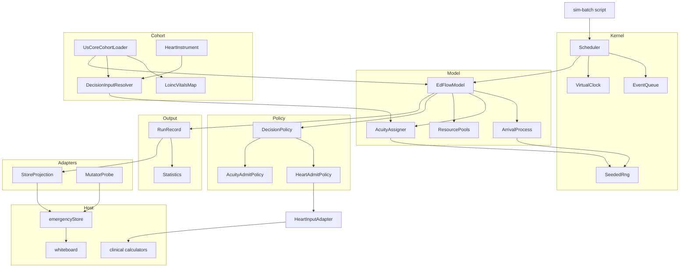
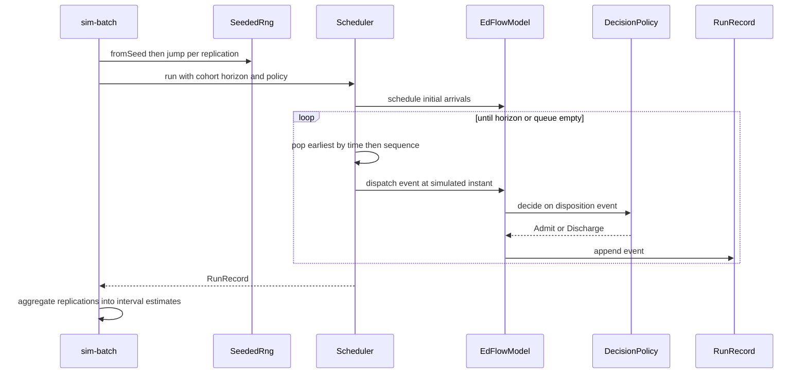
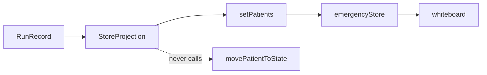

# Design Document — ed-flow-simulation-spike

## Overview

**Purpose**: This feasibility spike delivers a runnable discrete-event simulation of ED patient flow that answers three gating questions with numbers, so the repo owner can make a go/no-go product decision on evidence rather than assertion.

**Users**: The evaluator running the spike (headless batch execution, findings production) and the repo owner (board rendering for face-validity judgement, verdict consumption).

**Impact**: Adds an isolated `src/sim/` tree and one script. It changes no existing behaviour: the ED store, the engines, the calculators, and the whiteboard are consumed as-is. The one edit to an existing file is additive and optional (see File Structure Plan).

The design is shaped by a constraint discovered during gap analysis and confirmed to the database layer: routing simulated patients through `emergencyStore.movePatientToState` persists synthetic patient identifiers into the production audit table as `resource: "patient:<id>"`, attributed to the real logged-in user and tenant. The architecture therefore separates the **deterministic run path** (which never touches the store) from the **rendering path** (which touches only `setPatients`) from a **bounded probe** (which drives the real mutators headless, purely to answer Q1 honestly and measure the damage).

### Goals

- Execute a 12-hour simulated ED shift headlessly in ≤10s of real time, with no wall-clock dependence in the run path.
- Produce byte-identical output for identical seeds over an explicitly named artifact.
- Demonstrate clinical decision policy substitution over an identical cohort and arrival stream, reported as an interval.
- Load ≥200 Synthea FHIR R4 patients through one general mapping.
- Render simulated state on the existing whiteboard without transmitting simulated patient data.
- Emit a findings report answering Q1–Q3 with figures the artifact produced, and a per-question verdict.

### Non-Goals

- Calibration of arrival rates, acuity, or complaint mix against real data; cohort external validity.
- Any clinical-outcome claim.
- Facilitator UI, scenario authoring, session replay, multi-learner sync, scoring or competency engines.
- Refactoring `emergencyStore.ts`, any backend module, or any clinical calculator.
- CTAS/CEDIS/NACRS conformance; terminology licensing.
- Remediation of MB-P0-1/2/3, the orphan/duplicate audits, or HEAL ledger items.

## Boundary Commitments

### This Spec Owns

- Everything under `src/sim/` and `scripts/sim-batch.mjs`.
- The **simulation kernel**: virtual clock, seeded RNG, event queue, scheduler.
- The **ED process model**: arrival process, acuity/complaint assignment, resource pools, patient lifecycle within a run.
- The **`DecisionPolicy` contract** and its two concrete implementations.
- The **cohort mapping** from Synthea FHIR R4 Bundles to the existing `Patient` type.
- The **`RunRecord`** — the canonical, deterministic run output, and the sole artifact over which R2.2 reproducibility is asserted.
- The **statistics contract**: mean, 95% CI, and paired-difference reporting.
- The **findings report** (`docs/sim-spike-findings.md`).

### Out of Boundary

- The ED state model. `emergencyStore.ts` internals are read and written only through existing exported actions; no field, action, or middleware is added or changed.
- Clinical calculation. Policies *call* `computeHeart` et al.; they never modify them, and a calculator's numeric output is never adjusted.
- The audit, workflow-log, and security-sync subsystems. The design routes around them; it does not repair them.
- Whiteboard rendering. The surface is consumed; no component is modified.
- Cohort generation. Synthea is run externally; this spec owns ingestion only.
- Presenting-complaint and acuity *validity*. The model assigns them as declared, seeded draws; their epidemiological correctness is explicitly deferred.

### Standing Constraint — FHIR is the internal data model

**Decided, not open.** Patient data inside the simulation is FHIR-shaped, and anything the
simulation needs from a patient is resolved from coded FHIR resources wherever those resources can
carry it. This is a project-level commitment the spike works *within*; it is not re-litigated here
and no design may route around it for convenience.

**Corollary — conform to published profiles; do not invent representations.** Hospitals already
implement US Core; ONC certification and the CMS interoperability rules make it the floor, not an
aspiration. Anything this design needs is therefore first looked for in a published specification and
downloaded, and only invented when no specification covers it. Three consequences bind this design:

- **Ingestion targets a specification, not a generator.** Cohort Bundles are **US Core 6.1.0**
  conformant, which Synthea emits natively via `--exporter.fhir.use_us_core_ig true
  --exporter.fhir.us_core_version 6.1.0`. The loader is written against the profile set, so
  swapping the generator — or later swapping US Core for **CA Core+**
  (`ca.infoway.io.core`, the FHIR expression of CACDI) — is a configuration and profile change,
  not a rewrite. This is the single most important reason not to map "whatever Synthea emits."
- **Resolve by code, never by display name** — vitals by LOINC, conditions by SNOMED CT. The
  existing `loincVitalsMap` pattern is the template.
- **Scored clinical instruments use the standard representation.** A decision rule is a FHIR
  `Questionnaire` whose `answerOption`s carry `itemWeight` (formerly `ordinalValue`), and a patient's
  inputs are a `QuestionnaireResponse`. This is the HL7 SDC pattern, whose own cited examples are
  Apgar and the Glasgow Coma Score — instruments of exactly this class. The repository's bespoke
  `HeartInput` ordinal struct is confined to the calculator's doorstep by a thin adapter and never
  becomes the internal shape.

### Allowed Dependencies

| Dependency | Direction | Constraint |
|---|---|---|
| `src/types/emergency.ts` (`Patient`, `Vitals`, `PatientState`, `Priority`) | Outbound | Type-only. The sim conforms to the app's types; the app never learns about sim types. |
| `src/clinical-calculators/*` pure `compute*` functions | Outbound | Call only. No modification, no re-derivation of scores. |
| `emergencyStore.setPatients` | Outbound | Rendering path only. |
| `emergencyStore.movePatientToState` / `addPatient` | Outbound | **Probe only**, headless only, bounded (see `mutatorProbe`). |
| `stopEmergencySimulation()` | Outbound | Called before any run that touches the store. |
| `simulationModeService` | Outbound | Display indication only; never the run gate. |
| `pure-rand` (new, MIT) | External | Runtime dep. Sole source of randomness in `src/sim/`. |
| `@types/fhir` (new, MIT) | External | **devDependency**, type-only, zero runtime footprint. Supplies `Questionnaire`, `QuestionnaireResponse`, `Observation`, `Condition` shapes. |
| US Core 6.1.0 profile set | External | Conformance target for cohort Bundles. Consumed as a specification; no runtime package dependency. |

**Forbidden**: any import from `backend/`, `src/engine/simulation.ts` (superseded), `backend/src/modules/simulation|training` (stubs). No `Math.random()`, no `Date.now()`, no `new Date()` anywhere in `src/sim/`.

### Revalidation Triggers

- The `Patient` type gains a required field → cohort loader and projection must be re-checked.
- `setPatients` begins performing I/O or acquires patient-identifying audit metadata → R7.1 guarantee breaks; rendering path must be re-validated.
- A clinical calculator's signature or scoring changes → policies must be re-checked.
- `RunRecord` shape changes → every reproducibility and statistics claim must be re-measured, not merely re-run.
- `pure-rand` major version change → all recorded seeds become non-reproducible; prior findings become uncomparable.

## Architecture

### Existing Architecture Analysis

The repository's dominant pattern is **pure inner function wrapped in a store-reading shell**. This design consumes only pure cores and treats every store-reading shell and every `start*Engine()` scheduler as forbidden.

Three host constraints, each verified to source during gap analysis, drive the architecture:

| Constraint | Source | Architectural consequence |
|---|---|---|
| `movePatientToState` → `appendAuditLog` → dynamic import → `setInterval` → `POST /api/audit/sync` → `auditRepository.save()`, guarded only by `typeof window === 'undefined'` | `emergencyStore.ts:1068`, `securityAuditService.ts:41-90`, `audit.service.ts:87` | The run path must not call store mutators. The rendering path uses `setPatients` only (no `patientId` in its audit entry). |
| `createId()` = `Date.now()` + `Math.random()`, unreachable via mutator options for audit and workflow logs | `emergencyStore.ts:946` | Store-generated logs can never be part of the reproducibility artifact. `RunRecord` is sim-owned. |
| `isSimulationModeActive()` requires `window` + feature flag + `localStorage` | `simulationModeService.ts:27` | Run-active state is sim-owned; the service supplies display indication only. |

### Architecture Pattern & Boundary Map

**Selected pattern**: hexagonal — a pure deterministic kernel with the host application behind adapters. Chosen because it is the only pattern that lets the same kernel serve a deterministic headless run, a browser projection, and a mutator probe without any of them contaminating the others.



**Key decisions**

- **Dependency direction is strictly left-to-right and enforced by review:**

```
types -> kernel -> instruments -> policies -> cohort -> output -> model -> runtime -> adapters -> runner
```

`kernel` (clock, RNG, queue) holds pure primitives and imports nothing but `types`. `scheduler` lives in `runtime`, not `kernel`, because it orchestrates the model and therefore cannot sit to the model's left. An adapter may import anything to its left; nothing imports an adapter.

**`instruments` is its own layer, deliberately.** A decision instrument is neither cohort data nor a policy: the `Questionnaire` defines *what is asked and how it is weighted*, the item resolvers define *how each answer is obtained from coded data*, and both are consumed by two different layers — `cohort` resolves responses against them, `policies` reads their `linkId`s to score. Placing it in either consumer would force the other into an upward import. Its position between `kernel` and `policies` is what makes both directions legal.

**All leaf data shapes live in `types.ts`; only behaviour lives with its owner.** `CohortPatientSource`, `ResolvedAnswer`, `AcuityAssignment` and `DecisionInputCoverage` are plain records over host and FHIR types, so they sit at the leaf and every layer may read them. `ItemResolver` and `DecisionInstrument` carry behaviour and live in `instruments`; `DecisionInputResolver` in `cohort`; `AcuityAssigner` in `model`.
- **`RunRecord` is the seam between simulation and everything downstream.** Statistics, projection, and the findings report all read it. Nothing reads live model state.
- **The probe is deliberately a separate adapter, not a mode of the projection.** They answer different questions and carry different risks.

### Technology Stack

| Layer | Choice / Version | Role in Feature | Notes |
|-------|------------------|-----------------|-------|
| Frontend / CLI | TypeScript 5.7, ESM, Node ≥20.19 | Kernel, model, adapters; `scripts/sim-batch.mjs` runner | Existing stack; no change |
| Cohort data | **US Core 6.1.0** (HL7, free) | Conformance target for ingestion | Generated by Synthea's IG exporter, not by custom mapping. CA Core+ is the later swap for Canadian deployment |
| Decision-rule representation | **HL7 SDC** `Questionnaire` + `QuestionnaireResponse` with `itemWeight` | Standard shape for scored instruments | Adopted, not invented. Replaces the bespoke ordinal struct as the internal representation |
| Terminology | LOINC (observations), SNOMED CT (conditions) | Code systems for resolution | LOINC free under licence; SNOMED CT free to US implementers via the NLM UMLS national licence |
| Randomness | `pure-rand` ^7 (MIT) | Sole entropy source; `xoroshiro128plus` + jump for independent replication streams | **New runtime dep.** Adopted over hand-rolling because correct stream independence across 30 replications is the part that is easy to get subtly wrong |
| FHIR typing | `@types/fhir` (MIT, DefinitelyTyped) | Compile-time shapes for R4 Bundle/Patient/Observation | **New devDependency.** Type-only, zero runtime footprint |
| Testing | Vitest 4 (`jsdom`) | Unit tests, co-located, faceted names | Existing stack |

**Build, not adopt**: the event queue and the statistics helpers. Both are small, and both carry a determinism requirement generic libraries do not meet — see Components.

## File Structure Plan

### Directory Structure

```
src/sim/
├── types.ts                      # Shared sim types; imports only src/types/emergency
├── kernel/
│   ├── clock.ts                  # VirtualClock: simulated instant, advance-only
│   ├── rng.ts                    # SeededRng: pure-rand wrapper, jump-based stream derivation
│   └── eventQueue.ts             # Deterministic binary heap keyed on time then sequence
├── instruments/
│   ├── types.ts                  # ItemResolver, DecisionInstrument -- behaviour contracts
│   └── heartInstrument.ts        # HEART as a FHIR Questionnaire with itemWeight, plus its item resolvers
├── model/
│   ├── arrivalProcess.ts         # NHPP by thinning; emits arrival instants
│   ├── acuityAssigner.ts         # Assigns complaint + priority (the G6 boundary)
│   ├── resourcePools.ts          # Seize/release with FIFO-by-priority queueing
│   └── edFlowModel.ts            # Patient lifecycle; the only component that owns run state
├── runtime/
│   └── scheduler.ts              # Run loop: pop, advance clock, dispatch, until horizon
├── policies/
│   ├── types.ts                  # DecisionPolicy contract
│   ├── heartAdmitPolicy.ts       # Wraps computeHeart; admit at threshold
│   ├── heartInputAdapter.ts      # QuestionnaireResponse -> the repo's HeartInput, at the calculator doorstep
│   └── acuityAdmitPolicy.ts      # Authored comparator (TIMI absent from repo)
├── cohort/
│   ├── usCoreCohortLoader.ts     # US Core Bundle -> Patient plus retained coded source
│   ├── loincVitalsMap.ts         # LOINC code -> Vitals field table
│   └── decisionInputResolver.ts  # Instrument + coded source -> QuestionnaireResponse
├── output/
│   ├── runRecord.ts              # RunRecord: THE reproducibility artifact
│   ├── statistics.ts             # mean, 95% CI, paired difference
│   └── decisionInputCoverage.ts  # Per-item derived-vs-generated fractions across the cohort
└── adapters/
    ├── storeProjection.ts        # RunRecord snapshot -> setPatients (rendering only)
    └── mutatorProbe.ts           # Bounded Q1 probe through real mutators (headless only)

scripts/
└── sim-batch.mjs                 # Headless batch runner; replications, CIs, stdout/JSON

docs/
└── sim-spike-findings.md         # D7 deliverable
```

### Modified Files

- `package.json` — add `pure-rand` (dependencies) and `@types/fhir` (devDependencies).
- `eslint.config.ts` — add a `no-restricted-globals` / `no-restricted-syntax` rule scoped to `src/sim/**` banning `Date`, `Date.now`, and `Math.random`. This is the mechanical enforcement of 2.6 and of the kernel's no-ambient-entropy invariant; without it the constraint is only a convention.

No existing source file under `src/` or `lib/` is modified. The `appendAuditLog` runtime guard considered in gap analysis is **not** adopted: the projection path does not reach it, so the guard would be speculative.

## System Flows

### Deterministic run (R1, R2, R5) — no store contact



Ties on identical simulated instants are broken by a monotonic sequence number assigned at scheduling time, which is what makes the pop order a total order and therefore reproducible.

### Rendering (R6) — projection only



The projection replays `RunRecord` snapshots at a caller-controlled pace. `movePatientToState` is never called, so no synthetic patient identifier can reach `POST /api/audit/sync`. Before projecting, the adapter calls `stopEmergencySimulation()` and suppresses API hydration.

## Requirements Traceability

| Requirement | Summary | Components | Interfaces | Flows |
|-------------|---------|------------|------------|-------|
| 1.1, 1.2, 1.3, 1.4 | Virtual-clock execution within 10s, no wall-clock dependence | VirtualClock, Scheduler, EventQueue, MutatorProbe | `VirtualClock`, `Scheduler`, `ProbeResult` | Deterministic run |
| 1.5 | Fail run on detected wall-clock dependence | Scheduler | `Scheduler.run` error envelope | Deterministic run |
| 2.1, 2.2, 2.3, 2.5 | Seeded, reproducible, seed recorded | SeededRng, RunRecord | `SeededRng`, `RunRecord` | Deterministic run |
| 2.4 | Exclude non-reproducible values from artifact | RunRecord | `RunRecord` shape | — |
| 2.6 | Unseeded draw ⇒ Q2 failure | SeededRng, Scheduler | lint rule + `Scheduler` guard | — |
| 3.1, 3.2, 3.3 | Policy is selectable input, ≥2 policies, applied and recorded | DecisionPolicy, HeartAdmitPolicy, AcuityAdmitPolicy, EdFlowModel, RunRecord | `DecisionPolicy` | Deterministic run |
| 3.4, 3.5 | Reuse calculators unmodified; do not modify to fit | HeartAdmitPolicy, HeartInputAdapter, DecisionInputResolver | `DecisionPolicy`, `DecisionInstrument` | — |
| 3.6 | Exclude disputed calculators, state exclusion | HeartAdmitPolicy, findings report | policy registry note | — |
| 4.1, 4.2 | Load US Core conformant Bundles, ≥200, one general mapping | UsCoreCohortLoader, LoincVitalsMap | `UsCoreCohortLoader`, `CohortLoadResult` | — |
| 4.3 | Skip unmappable, report count and reason | UsCoreCohortLoader | `CohortLoadResult` | — |
| 4.4 | Populate only what the cohort supports | UsCoreCohortLoader, AcuityAssigner, DecisionInputResolver | `UsCoreCohortLoader`, `AcuityAssigner`, `ItemResolver` | — |
| 4.5 | Generated values recorded in the standard representation, marked as generated | DecisionInputResolver, HeartInstrument, DecisionInputCoverage | `ResolvedAnswer`, `ANSWER_PROVENANCE_EXTENSION_URL` | — |
| 5.1, 5.2, 5.6 | ≥30 replications, mean + 95% CI, unattended | sim-batch, Statistics, SeededRng | `Statistics` | Deterministic run |
| 5.3, 5.4 | Paired difference as interval; state whether it excludes zero; null is valid | Statistics | `PairedDifference` | — |
| 5.5 | Never a bare point estimate | Statistics, findings report | `Statistics` return types | — |
| 6.1, 6.2 | Render on whiteboard driven by simulated clock | StoreProjection | `StoreProjection` | Rendering |
| 6.3 | Distinguish simulated state via existing indication | StoreProjection | `simulationModeService` | Rendering |
| 6.4 | Demonstrate on unaffected surface; record blocker | StoreProjection, findings report | — | Rendering |
| 6.5 | Face validity observed, not gated | findings report | — | — |
| 7.1 | No transmission of simulated patient data | StoreProjection, MutatorProbe | projection contract | Rendering |
| 7.2 | No inbound overwrite mid-run | StoreProjection | `StoreProjection.begin` | Rendering |
| 7.3 | Stop pre-existing animator | StoreProjection, MutatorProbe | `stopEmergencySimulation` | Rendering |
| 7.4 | Normal operation resumes without reload | StoreProjection | `StoreProjection.end` | Rendering |
| 7.5 | Confine changes to exposed operations | StoreProjection, MutatorProbe | — | — |
| 8.1, 8.2 | Report answers Q1–Q3 with produced figures only; calculator limits carried | RunRecord, Statistics, HeartAdmitPolicy, findings report | `PolicyProvenance` | — |
| 8.3, 8.4 | Operational outcomes only; reject clinical claims | Statistics, HeartAdmitPolicy, findings report | `OperationalMetrics`, `PolicyProvenance` | — |
| 8.5, 8.6 | State deferred validation, per-item coverage, and locale divergence | DecisionInputCoverage, findings report | `DecisionInputCoverage` | — |
| 8.7 | Record deviations and workarounds | findings report | — | — |
| 9.1, 9.2 | Per-question verdicts and one overall recommendation | findings report | `SpikeVerdict` | — |
| 9.3 | K1 stop condition | MutatorProbe, findings report | probe result | — |
| 9.4 | K2 stop condition | HeartAdmitPolicy, findings report | — | — |
| 9.5 | K3 stop condition | UsCoreCohortLoader, findings report | `CohortLoadResult` | — |
| 9.6, 9.7 | No-go is complete; go yields only a recommendation | findings report | `SpikeVerdict` | — |

## Components and Interfaces

| Component | Domain/Layer | Intent | Req Coverage | Key Dependencies (P0/P1) | Contracts |
|-----------|--------------|--------|--------------|--------------------------|-----------|
| VirtualClock | Kernel | Owns simulated time | 1.1, 1.3, 1.4 | none | Service, State |
| SeededRng | Kernel | Sole entropy source | 2.1, 2.3, 2.6, 5.1 | pure-rand (P0) | Service |
| EventQueue | Kernel | Total-order event store | 1.1, 2.2 | none | Service |
| Scheduler | Kernel | Run loop and horizon | 1.1, 1.2, 1.5 | Clock (P0), Queue (P0) | Service |
| ArrivalProcess | Model | NHPP arrival instants | 1.1, 2.2 | SeededRng (P0) | Service |
| AcuityAssigner | Model | Complaint, priority and decision-feature draws | 3.4, 4.4 | SeededRng (P0) | Service |
| ResourcePools | Model | Seize/release contention | 1.1 | none | Service, State |
| EdFlowModel | Model | Patient lifecycle; owns run state | 1.3, 3.3, 5.2 | Pools (P0), Policy (P0) | Service, State |
| DecisionPolicy | Policy | Substitutable decision rule | 3.1, 3.2, 3.3 | none | Service |
| HeartAdmitPolicy | Policy | Calculator-backed policy | 3.4, 3.5, 3.6 | computeHeart (P0), AcuityAssigner (P0) | Service |
| AcuityAdmitPolicy | Policy | Authored comparator | 3.2 | none | Service |
| UsCoreCohortLoader | Cohort | US Core Bundle → Patient plus retained coded source and declared profiles | 4.1, 4.2, 4.3, 4.4, 8.2 | @types/fhir (P1) | Service, Batch |
| HeartInstrument | Instruments | HEART as an SDC Questionnaire with itemWeight, plus item resolvers | 3.2, 4.5 | SeededRng (P0) | State, Service |
| DecisionInputResolver | Cohort | Instrument + coded source → QuestionnaireResponse | 3.4, 4.4, 4.5 | UsCoreCohortLoader (P0), SeededRng (P0) | Service |
| HeartInputAdapter | Policy | QuestionnaireResponse → the repo's HeartInput | 3.4 | computeHeart (P0) | Service |
| RunRecord | Output | The reproducibility artifact | 2.2, 2.4, 2.5 | none | State |
| Statistics | Output | Intervals, never points | 5.2, 5.3, 5.4, 5.5, 8.3 | none | Service |
| DecisionInputCoverage | Output | Per-item derived-vs-generated fractions | 4.5, 8.5 | none | Service |
| StoreProjection | Adapter | Render without transmitting | 6.1–6.4, 7.1–7.5 | setPatients (P0) | Service |
| MutatorProbe | Adapter | Full-horizon Q1 evidence against the real store | 1.2, 1.3, 9.3 | movePatientToState (P0) | Service, Batch |
| SimBatchRunner | Runner | Replication driver and reporting entry point | 5.1, 5.6, 2.5 | Scheduler (P0), Statistics (P0) | Batch |

### Shared Types

`src/sim/types.ts` holds **leaf types only** — those that import nothing from `src/sim/`. Composite contracts (`RunConfig`, `DispatchContext`) reference components to their right and therefore live with their owners: `RunConfig` in `runtime/scheduler.ts`, `DispatchContext` in `model/edFlowModel.ts`. They are shown together here for readability, with their true home marked.

```typescript
import type { Patient, Priority, PatientState } from '../types/emergency';
import type { Questionnaire, QuestionnaireResponse } from 'fhir/r4';

/** Minutes elapsed since run start. The only time unit in the simulation. */
export type SimMinutes = number;

export type SimEventKind =
  | 'arrival' | 'triage-complete' | 'resource-seized'
  | 'resource-released' | 'disposition' | 'departure';

export interface SimPayload {
  readonly patientId: string;
  readonly resourceId?: string;
}

/** A cohort Patient plus run-scoped state. Owned exclusively by EdFlowModel. */
export interface SimPatient {
  readonly patient: Patient;
  /** Carries complaint, acuity and the clinical decision features policies consume. */
  readonly acuity: AcuityAssignment;
  readonly stage: PatientState;
  readonly stageEnteredAtMinutes: SimMinutes;
  readonly arrivedAtMinutes: SimMinutes;
  readonly seizedResourceId: string | null;
}

/** Home: runtime/scheduler.ts — references DecisionPolicy, so it cannot live in types.ts */
export interface RunConfig {
  readonly seed: Seed;
  readonly horizonMinutes: SimMinutes;
  readonly cohort: readonly Patient[];
  readonly policy: DecisionPolicy;
  readonly arrivalRatePerHour: readonly number[];   // 24 entries; the NHPP intensity profile
  readonly resourceCapacity: Readonly<Record<string, number>>;
}

/** Config minus non-serializable members, embedded in RunRecord for provenance. */
export type RunConfigSummary = Omit<RunConfig, 'cohort' | 'policy'> & {
  readonly cohortSize: number;
  readonly policyId: string;
  /** Profile canonicals the cohort declared. Empty means conformance was not asserted by the data. */
  readonly cohortDeclaredProfiles: readonly string[];
};

/** Whether an answer came from coded cohort data or had to be generated for the synthetic patient. */
export type AnswerProvenance = 'derived-from-coded-data' | 'generated';

/**
 * One resolved instrument answer. `weight` is the `itemWeight` of the chosen `answerOption`, so
 * scoring is the SDC `weight()` sum rather than a bespoke calculation.
 */
export interface ResolvedAnswer {
  readonly linkId: string;
  readonly answerCode: string;
  readonly weight: number;
  readonly provenance: AnswerProvenance;
  /** Codes actually consulted; empty when generated. */
  readonly derivedFrom: readonly string[];
}

/** Retained FHIR context for one cohort patient. Items resolve from codes, not from `Patient`. */
export interface CohortPatientSource {
  readonly patient: Patient;
  readonly conditionCodes: readonly string[];
  readonly observations: readonly CodedObservation[];
}

export interface CodedObservation {
  readonly loincCode: string;
  readonly value: number;
  readonly unit: string;
  readonly referenceHigh: number | null;
}

export interface AcuityAssignment {
  readonly chiefComplaint: string;
  readonly complaintCategory: string;
  readonly priority: Priority;
  /** SDC QuestionnaireResponse for the run's decision instrument; answers carry per-item provenance. */
  readonly decisionInput: QuestionnaireResponse;
  /** Applies to complaint, category and priority. Answer provenance is per item, inside the response. */
  readonly provenance: 'modelled-assumption';
}

/** Per-item derived-vs-generated fractions across a cohort. The honest measure required by 8.5. */
export interface DecisionInputCoverage {
  readonly instrumentId: string;
  readonly patientCount: number;
  readonly byItem: Readonly<Record<string, {
    readonly derived: number;
    readonly generated: number;
    readonly derivedFraction: number;
  }>>;
}

export interface RecordedEvent {
  readonly atMinutes: SimMinutes;
  readonly sequence: number;
  readonly kind: SimEventKind;
  readonly patientId: string;
  readonly detail: Readonly<Record<string, string | number | boolean>>;
}

/** Home: model/edFlowModel.ts — references SeededRng, EventQueue and the record writer. */
export interface DispatchContext {
  readonly nowMinutes: SimMinutes;
  readonly rng: SeededRng;
  readonly queue: EventQueue<SimPayload>;
  readonly record: MutableRunRecord;
}
```

`Priority` and `PatientState` are the host's existing types, imported unchanged — the simulation conforms to the application's vocabulary rather than introducing a parallel one.

### Kernel

#### SeededRng

| Field | Detail |
|-------|--------|
| Intent | Sole source of randomness in `src/sim/`; derives independent streams per replication |
| Requirements | 2.1, 2.3, 2.6, 5.1 |

**Responsibilities & Constraints**
- Owns all stochastic draws. No other component may call `pure-rand` directly.
- Replication streams are derived by **jump**, not by seed arithmetic — seed+1 style derivation produces correlated streams in LCG-family generators and would silently invalidate 5.2's intervals.
- Instances are treated as linear (each draw advances state); the generator's purity is used for stream derivation, not for undo.

**Dependencies** — External: `pure-rand` — `xoroshiro128plus` generator and jump (P0).

**Contracts**: Service [x]

```typescript
export type Seed = number;

export interface SeededRng {
  readonly seed: Seed;
  uniform(): number;                        // [0, 1)
  exponential(ratePerMinute: number): number;
  integer(minInclusive: number, maxExclusive: number): number;
  pick<T>(items: readonly T[]): T;
  /** Independent stream for replication `index`; derived by jump, never by seed arithmetic. */
  deriveStream(index: number): SeededRng;
}
```
- Preconditions: `ratePerMinute > 0`; `maxExclusive > minInclusive`; `items.length > 0`.
- Postconditions: identical `(seed, call sequence)` yields an identical value sequence.
- Invariants: no wall-clock or ambient entropy is consulted.

#### EventQueue

| Field | Detail |
|-------|--------|
| Intent | Deterministic min-ordered event store |
| Requirements | 1.1, 2.2 |

**Responsibilities & Constraints**
- Orders by `(simulatedAtMinutes, sequence)`. The monotonic `sequence` assigned at push time makes the order **total**, so equal timestamps cannot reorder between runs.
- **Built, not adopted**: general-purpose heaps (`tinyqueue`, `heap-js`) do not guarantee stable ordering for equal keys, and an unstable tie-break is precisely what breaks 2.2.

**Contracts**: Service [x]

```typescript
export interface SimEvent<TPayload> {
  readonly simulatedAtMinutes: number;
  readonly sequence: number;
  readonly kind: SimEventKind;
  readonly payload: TPayload;
}

export interface EventQueue<TPayload> {
  push(event: Omit<SimEvent<TPayload>, 'sequence'>): void;
  pop(): SimEvent<TPayload> | undefined;
  peekTime(): number | undefined;
  readonly size: number;
}
```
- Invariants: `pop()` returns the unique minimum under `(simulatedAtMinutes, sequence)`; `sequence` is strictly increasing per queue instance.

#### Scheduler

| Field | Detail |
|-------|--------|
| Intent | Advance the clock event-by-event to the horizon |
| Requirements | 1.1, 1.2, 1.5 |

**Contracts**: Service [x]

```typescript
export type RunFailure =
  | { kind: 'wall-clock-dependency'; detail: string }
  | { kind: 'horizon-exceeded'; detail: string }
  | { kind: 'empty-queue-before-horizon'; detail: string };

export type RunOutcome =
  | { ok: true; record: RunRecord }
  | { ok: false; failure: RunFailure };

export interface Scheduler {
  run(input: RunConfig): RunOutcome;
}
```
- Preconditions: horizon > 0; cohort non-empty; policy supplied.
- Postconditions: on success the clock equals the last dispatched event instant, never a wall-clock value.
- 1.5 is realized by the `wall-clock-dependency` variant: the run fails loudly rather than returning a wall-clock-influenced result.

**Implementation Notes**
- Integration: the only component that owns the loop; the model is dispatched into, never polled.
- Validation: 1.5 is enforced by a lint rule banning `Date`/`Math.random` in `src/sim/`, plus a scheduler-level assertion that no dispatched event carries a timestamp outside the simulated horizon.
- Risks: 1.2's 10-second budget is unverified until the model exists — instrument at the first runnable scheduler, before the model grows.

### Model

#### AcuityAssigner

| Field | Detail |
|-------|--------|
| Intent | Produce the ED presentation the cohort does not contain — complaint, acuity, and clinical decision features — as declared, seeded draws with per-field provenance |
| Requirements | 3.4, 4.4 |

**Responsibilities & Constraints**
- Exists because Synthea models **lifetime disease progression, not ED arrival episodes**: it emits no presenting complaint and no acuity, yet `Patient` requires `chiefComplaint`, `complaintCategory`, and `priority`.
- **It attaches the decision input policies consume, delegating its resolution to `DecisionInputResolver`.** The decision input is an SDC `QuestionnaireResponse`, not a bespoke struct — the standard representation for a scored instrument. The resolver owns derivation and generation with per-item provenance; the assigner owns attachment and the complaint/acuity draws. Keeping both out of the policy is what makes 4.4 enforceable: the policy consumes a response, it never resolves or invents one.
- This is the boundary that keeps 4.4 honest. The **loader** maps only what the Bundle contains; the **assigner** produces everything else, labelled field-by-field. Values produced here are never described as cohort data.
- Provenance is **per item, not per patient** — some items resolve from codes and others cannot, and collapsing them to a single label would misstate how much of the decision rests on real data.
- Distributions are hardcoded for the spike. They are not calibrated and must not be presented as calibrated.

**Contracts**: Service [x]

```typescript
/**
 * Behaviour contracts for a decision instrument. Home: `instruments/types.ts`.
 * Leaf data shapes they exchange (`ResolvedAnswer`, `CohortPatientSource`) live in `types.ts`,
 * so `instruments`, `policies` and `cohort` can all read them without importing upward.
 */
export interface ItemResolver {
  readonly linkId: string;
  /** Returns null when the coded cohort cannot answer this item; the caller then generates. */
  deriveFromSource(source: CohortPatientSource): ResolvedAnswer | null;
  generate(source: CohortPatientSource, rng: SeededRng): ResolvedAnswer;
}

/** A decision rule and how each of its items is answered. Home: `instruments/types.ts`. */
export interface DecisionInstrument {
  readonly questionnaire: Questionnaire;
  readonly resolvers: readonly ItemResolver[];
}

/** `AcuityAssignment` and `CohortPatientSource` are leaf shapes defined in `types.ts` (see Shared Types). */
export interface AcuityAssigner {
  assign(source: CohortPatientSource, instrument: DecisionInstrument, rng: SeededRng): AcuityAssignment;
}
```
- Preconditions: `patient.age` is present; `rng` is the run's stream.
- Postconditions: every returned field carries provenance; no field is silently sourced.
- Invariants: items marked `derived-from-coded-data` are pure functions of the coded source; only `generated` items consume the stream.

**Implementation Notes**
- Integration: `DecisionInputResolver` produces the `QuestionnaireResponse`; `EdFlowModel` attaches the assignment to `SimPatient` at arrival; `DecisionPolicy.decide` reads the response from there.
- Validation: 4.4's guarantee is that no clinical value originates in the loader or the policy — the assigner is the single declared source, and `RunRecord` carries the provenance map so the findings report cannot misattribute it.
- Risks: to the extent items resolve as `generated`, a policy comparison is partly two functions of the same draws. That is mechanically valid for a feasibility spike and weakens the clinical interpretation in proportion to the generated fraction; **8.5 requires the findings report to publish that fraction per item** rather than presenting the comparison as evidence about real clinical rules.

#### EdFlowModel

| Field | Detail |
|-------|--------|
| Intent | Own patient lifecycle and run state; the only stateful model component |
| Requirements | 1.3, 3.3, 5.2 |

**Responsibilities & Constraints**
- Owns run state exclusively. No other component holds mutable simulation state, which is what makes a run a pure function of `(cohort, seed, config, policy)`.
- Derives every time-dependent decision from the injected simulated instant.
- Appends to `RunRecord` on every state transition; the record is the run's only output.

**Contracts**: Service [x], State [x]

```typescript
export interface EdFlowModel {
  seedArrivals(cohort: readonly Patient[], rng: SeededRng, queue: EventQueue<SimPayload>): void;
  dispatch(event: SimEvent<SimPayload>, ctx: DispatchContext): void;
  snapshot(): readonly SimPatient[];
}
```
- Invariants: patient state transitions follow the host's legal-transition rules; a patient occupies at most one resource at a time.

### Policy

#### DecisionPolicy

| Field | Detail |
|-------|--------|
| Intent | The substitutable clinical decision rule — the product's differentiating capability |
| Requirements | 3.1, 3.2, 3.3 |

**Responsibilities & Constraints**
- Pure: `(patient, simulated instant) → decision`. No I/O, no clock, no store, no RNG unless supplied.
- Generalized deliberately: the interface admits any disposition rule, while only two are implemented. This is interface-level generalization, not speculative implementation.

**Contracts**: Service [x]

```typescript
export type Disposition = 'admit' | 'discharge';

export interface PolicyDecision {
  readonly disposition: Disposition;
  readonly rationale: string;
  /** Calculator score when one backs the rule; absent for authored rules. */
  readonly score?: number;
}

export interface DecisionPolicy {
  readonly id: string;
  readonly label: string;
  decide(patient: SimPatient, atMinutes: number): PolicyDecision;
}
```

#### HeartAdmitPolicy / AcuityAdmitPolicy

**Responsibilities & Constraints**
- `HeartAdmitPolicy` calls `computeHeart` from `src/clinical-calculators/heart.ts` and thresholds the returned score. The calculator is **called, never modified** (3.4); if a rule cannot be expressed without changing it, the policy is abandoned and K2 is reported (3.5, 9.4).
- **Inputs come from `SimPatient.decisionInput`, never from the cohort directly and never from the policy itself.** The response is scored either by the SDC `itemWeight` sum or, to reuse the repository's implementation, by `HeartInputAdapter` mapping it to the existing `HeartInput` and calling `computeHeart`. The bespoke ordinal struct is thereby confined to the calculator's doorstep: the internal model stays FHIR, and the calculator stays unmodified (3.4).
- `AcuityAdmitPolicy` is **authored**, not adapted: gap analysis confirmed TIMI does not exist anywhere in the repository, so the brief's illustrative policy B has no implementation to reuse.
- **3.6 exclusion**: paediatric dosing calculators are under an unresolved correctness dispute (MB-P0-1) and are excluded from policy adoption; the findings report states the exclusion and its reason.
- **The calculator is used outside its declared envelope, and this is recorded rather than glossed.** `HEART_META.disclaimer` states the score *"does not diagnose acute coronary syndrome, rule out myocardial infarction, or recommend treatment or disposition"* — yet this policy thresholds it to produce a disposition. That is defensible here because the simulation models *a decision rule*, not clinical advice to a clinician; it is not defensible silently. The disclaimer is copied verbatim into `RunRecord.policyProvenance` so it travels with every result and cannot be dropped between run and report (8.2, 8.4).
- Only 6 calculators exist in `CLINICAL_CALCULATOR_REGISTRY`. The larger backend tool registry is out of boundary.

### Cohort

#### UsCoreCohortLoader

| Field | Detail |
|-------|--------|
| Intent | Map Synthea FHIR R4 Bundles into the existing `Patient` type via one general mapping |
| Requirements | 4.1, 4.2, 4.3, 4.4 |

**Responsibilities & Constraints**
- Synthea emits **one Bundle file per patient**, `type: transaction`, with the `Patient` resource as the first entry followed by Encounter/Condition/Observation/Procedure entries grouped by encounter in chronological order. Organizations and Practitioners are exported in **separate files** and are skipped, not treated as failures.
- Vitals are mapped from `Observation` entries by **LOINC code** through `loincVitalsMap.ts` — a declared code-to-field table rather than string matching on display names.
- 4.2 is satisfied by one code path applied uniformly. Any need for per-patient special-casing triggers K3 (9.5) rather than a special case.
- 4.4 is bounded by the AcuityAssigner seam: the loader never synthesizes complaint, acuity, clinical decision features, or vitals the Bundle does not contain. It maps `Patient.age` through unchanged; the age-band scoring that feeds `computeHeart` belongs to the assigner, not here.

**Contracts**: Service [x], Batch [x]

```typescript
export interface CohortLoadSkip {
  readonly sourceFile: string;
  readonly reason: 'not-a-patient-bundle' | 'missing-patient-resource' | 'missing-required-field' | 'malformed-json';
  readonly detail: string;
}

export interface CohortLoadResult {
  readonly patients: readonly Patient[];
  readonly sources: readonly CohortPatientSource[];
  readonly skipped: readonly CohortLoadSkip[];
  readonly sourceFileCount: number;
  /** Distinct `meta.profile` canonicals observed across loaded resources. Empty means none declared. */
  readonly declaredProfiles: readonly string[];
}

export interface UsCoreCohortLoader {
  load(bundlePaths: readonly string[]): Promise<CohortLoadResult>;
}
```
- Postconditions: `patients.length + skipped.length === sourceFileCount`; loading never throws on a single bad file (4.3); `declaredProfiles` reflects what the data actually asserts.

**Conformance is recorded, not validated (4.1, 8.2).** The loader does not run an IG validator. It
records the `meta.profile` canonicals the Bundles declare and carries them into `RunConfigSummary`,
so the findings report can state which profiles the cohort claimed. **US Core conformance is
established by generation configuration** — `--exporter.fhir.use_us_core_ig true
--exporter.fhir.us_core_version 6.1.0` — and verified only to the extent the data declares it. If
`declaredProfiles` is empty, the cohort was generated without the IG flag and the report must say so
rather than repeating a conformance claim the artifact does not support. Full profile validation is
out of boundary for a spike and belongs with a real conformance harness.

**Implementation Notes**
- Integration: `@types/fhir` supplies compile-time shapes only; parsing is plain `JSON.parse` with narrowing at the boundary. No runtime FHIR library.
- Risks: cohort volume is unverified — a 200-patient Synthea export is many megabytes across many files, and load time is not inside 1.2's budget but must not dominate the batch.

### Output

#### DecisionInputResolver

| Field | Detail |
|-------|--------|
| Intent | Produce a `QuestionnaireResponse` for a decision instrument, deriving each item from coded cohort data where possible and generating the remainder |
| Requirements | 3.4, 4.4, 4.5 |

**Responsibilities & Constraints**
- Generic over instruments: it takes a `DecisionInstrument` (a `Questionnaire` plus its per-item
  resolvers) and a patient's coded source. It knows nothing about HEART specifically. Adding an
  instrument is a data change, not a code change to this component.
- **Derives before it generates, per item.** For the HEART instrument, three of five items are
  thresholds on coded data rather than judgement:

  | Item | Bands | Resolved from |
  |---|---|---|
  | Age | `<45` / `45–64` / `≥65` | `Patient.birthDate` — a pure function, always derivable |
  | Risk factors | `0` / `1–2` / `≥3 or known atherosclerotic disease` | count of SNOMED-coded `Condition` resources |
  | Troponin | `≤normal` / `1–3× normal` / `>3× normal` | LOINC-coded troponin `Observation` against its reference range |
  | ECG | `normal` / `non-specific changes` / `significant ST deviation` | LOINC codes this, but Synthea emits no interpretation — generated |
  | History | `slightly` / `moderately` / `highly suspicious` | clinician gestalt — generated |

- **Generation is per item, never per patient.** A patient with codeable conditions and no troponin
  yields a derived risk-factor answer and a generated troponin answer in the same response.
- Generated answers are written into the **same `QuestionnaireResponse`** as derived ones, never a
  side-channel structure — the point of the standard shape is that a real response from a live system
  is the same resource. Provenance rides on `QuestionnaireResponse.item.answer.extension` under a
  single declared URL (4.5):

```typescript
/**
 * Local canonical. Must be re-based on a domain the project controls before any external exchange;
 * an unresolvable canonical URL in exported resources is worse than none.
 */
export const ANSWER_PROVENANCE_EXTENSION_URL =
  'https://caredroid.dev/fhir/StructureDefinition/answer-provenance';
```

  The extension carries `valueCode` of `AnswerProvenance` plus, when derived, the consulted codes.
  Reading it back is how `DecisionInputCoverage` is computed — provenance is never inferred from
  whether a value happens to look plausible.
- **This is the seam that upgrades without touching a policy.** As coded data improves — a real
  cohort, an ECG interpretation source, documented HEART responses — items move from generated to
  derived behind an unchanged `QuestionnaireResponse`. No policy, model, or statistic changes.

**Dependencies**
- Inbound: AcuityAssigner — requests a decision input per patient (P0)
- Outbound: UsCoreCohortLoader — retained coded resources (P0); SeededRng — generation only (P0)
- External: `@types/fhir` — `Questionnaire`, `QuestionnaireResponse` shapes (P1)

**Contracts**: Service [x]

```typescript
export interface DecisionInputResolver {
  resolve(
    instrument: DecisionInstrument,
    source: CohortPatientSource,
    rng: SeededRng,
  ): QuestionnaireResponse;
}
```
`CohortPatientSource` and `CodedObservation` are leaf shapes defined in `types.ts` (see Shared Types).

- Preconditions: every `Questionnaire.item` has a matching `ItemResolver`; every `answerOption` carries `itemWeight`.
- Postconditions: the response answers every item; each answer carries provenance and the codes consulted.
- Invariants: a derived answer never consumes the RNG stream; a generated answer always does. An
  unparseable code degrades that item to generated and is reported — never silently scored zero.

**Implementation Notes**
- Integration: `UsCoreCohortLoader` retains condition and observation codes as `CohortPatientSource`
  rather than discarding them after vitals mapping — it already parses those entries, so this is
  retention, not a second pass.
- Validation: `decisionInputCoverage.ts` reads the provenance extension across the resolved cohort and
  produces `DecisionInputCoverage`, which `RunRecord` carries and the findings report publishes
  **per item** (8.5). That fraction is the honest measure of how data-driven the policy layer is, and
  it is the number to quote rather than the architecture. Owning it in a named component rather than
  leaving it to the report is what stops the obligation being discovered unmet at write-up time.
- Risks: Synthea's troponin coverage is uneven across patients and unverified at the chosen cohort
  size; expect troponin to be substantially generated and publish the fraction rather than implying
  coverage.

#### RunRecord

| Field | Detail |
|-------|--------|
| Intent | The canonical run output and the sole artifact reproducibility is asserted over |
| Requirements | 2.2, 2.4, 2.5 |

**Responsibilities & Constraints**
- **This is the design's answer to 2.4.** Store-generated audit and workflow entries are excluded by construction, because `createId()` embeds `Date.now()` and `Math.random()` and is not injectable through mutator options. Reproducibility is asserted over sim-owned data only, and the findings report states this explicitly rather than leaving it implicit.
- Contains no wall-clock timestamps, no host-generated identifiers, and no locale- or timezone-dependent formatting. All instants are simulated minutes from run start.

**Contracts**: State [x]

```typescript
/** Travels with every result so a calculator's declared limits cannot be lost between run and report. */
export interface PolicyProvenance {
  readonly policyId: string;
  readonly calculatorId: string | null;
  /** Verbatim from the calculator's own metadata; null for authored policies. */
  readonly calculatorDisclaimer: string | null;
  /** The simulation models a decision rule; it does not offer clinical decision support. */
  readonly usage: 'modelled-decision-rule';
}

export interface RunRecord {
  readonly seed: Seed;
  readonly policyId: string;
  readonly policyProvenance: PolicyProvenance;
  /** Per-item derived-vs-generated fractions for the run's cohort; published per item under 8.5. */
  readonly decisionInputCoverage: DecisionInputCoverage;
  readonly config: RunConfigSummary;
  readonly events: readonly RecordedEvent[];
  readonly metrics: OperationalMetrics;
}

/** The append-only writer handed to the model during a run; sealed into a RunRecord at run end. */
export interface MutableRunRecord {
  append(event: RecordedEvent): void;
  seal(metrics: OperationalMetrics): RunRecord;
}

/** Operational only. Adding a clinical-outcome field violates 8.3 and is a review-blocking change. */
export interface OperationalMetrics {
  readonly admissionRate: number;
  readonly meanLengthOfStayMinutes: number;
  readonly peakCensus: number;
  readonly leftWithoutBeingSeenCount: number;
}
```

#### Statistics

**Responsibilities & Constraints**
- Every returned figure carries an interval. The **types make a bare point estimate unrepresentable**, which is how 5.5 is enforced structurally rather than by discipline.
- `PairedDifference` reports the interval *and* `excludesZero` separately, implementing the "both, reported separately" decision: the interval is always reported, and CI-excludes-zero is a distinct, stronger finding. A null result is valid output, not a failure (5.4).
- **Built, not adopted**: `simple-statistics` would satisfy the arithmetic but not the type-level constraint that makes 5.5 enforceable, and the CI computation must be auditable for 8.1/8.2.

**Contracts**: Service [x]

```typescript
export interface IntervalEstimate {
  readonly mean: number;
  readonly ciLower95: number;
  readonly ciUpper95: number;
  readonly replications: number;
}

export interface PairedDifference {
  readonly difference: IntervalEstimate;
  readonly excludesZero: boolean;
}

export interface Statistics {
  summarize(values: readonly number[]): IntervalEstimate;
  compare(baseline: readonly number[], variant: readonly number[]): PairedDifference;
}
```
- Preconditions: `values.length >= 30` for 5.1; fewer is a caller error, not a silent degradation.

### Adapters

#### StoreProjection

| Field | Detail |
|-------|--------|
| Intent | Render simulated state on the whiteboard without transmitting simulated patient data |
| Requirements | 6.1, 6.2, 6.3, 6.4, 7.1, 7.2, 7.3, 7.4, 7.5 |

**Responsibilities & Constraints**
- Calls **`setPatients` only**. `movePatientToState`, `addPatient`, and `dischargePatient` are forbidden here, because each writes an audit entry carrying `patientId`, which reaches `POST /api/audit/sync` and is persisted as `resource: "patient:<id>"` against the real user and tenant. `setPatients`'s audit entry carries no `patientId` and degrades to `resourceType: 'security'` with a count — the reason this adapter satisfies 7.1 structurally.
- Renders on `/emergency/whiteboard`. `/emergency/patients` is avoided (6.4): MB-P0-4 is unfixed and a flow simulator generates exactly the census that triggers it.
- `begin()` stops the pre-existing animator (7.3), suppresses API hydration (7.2), and sets the display indication via `simulationModeService` (6.3). `end()` restores hydration and clears the indication so normal operation resumes without a reload (7.4).
- Run-active state lives here and in the model, **not** in `simulationModeService`, which is browser-only and cannot gate a headless run.

**Contracts**: Service [x]

```typescript
export interface StoreProjection {
  begin(): void;
  project(snapshot: readonly SimPatient[]): void;   // setPatients only
  end(): void;
}
```
- Invariants: no method transmits to any server; no method calls a patient-identifying mutator.

#### MutatorProbe

| Field | Detail |
|-------|--------|
| Intent | Answer Q1 against the real store over the same horizon the deterministic path uses |
| Requirements | 1.2, 1.3, 9.3 |

**Responsibilities & Constraints**
- Exists because the projection alone would prove only that the *board renders* simulated state, not that the *existing state model* can be simulated — which is what K1 actually asks. Without the probe, Q1 is answered for an easier question than the one that was posed.
- **Headless only.** In Node, `scheduleAuditSync` short-circuits on `typeof window === 'undefined'`, so no timer starts and nothing is transmitted. Running the probe in a browser is a boundary violation.
- **Runs the full 12-hour horizon**, because 1.2's claim is about a 12-hour shift and a shorter probe cannot support it. Bounded means **one replication, not a batch** — the probe is a measurement, never an input to any statistic.
- **Reports its own wall-clock duration.** This is the design's answer to a real hazard: the deterministic path never touches the store, so its runtime is near-free and says nothing about whether the host can be driven. Reporting only that number would answer 1.2 for an easier question than Q1 poses. The findings report must carry **two labelled durations** — deterministic path and store path — and neither may be presented as the other.
- Reports whether the store could be driven without internal modification, and quantifies the wall-clock and nondeterminism contamination observed (9.3).
- Cannot observe G1's transmission behaviour: headless, `scheduleAuditSync` short-circuits before the timer starts. The probe measures nondeterminism and wall-clock contamination only; the transmission risk is governed by `StoreProjection`'s contract and its isolation test, not by this probe.

**Contracts**: Service [x], Batch [x]

```typescript
export interface ProbeResult {
  readonly droveStoreWithoutInternalModification: boolean;
  readonly horizonMinutesCompleted: number;
  readonly reachedFullHorizon: boolean;
  /** Real milliseconds for the store path. Reported beside, never merged with, the deterministic path's duration. */
  readonly wallClockDurationMs: number;
  readonly wallClockTimestampsObserved: number;
  readonly nondeterministicIdsObserved: number;
  readonly obstructions: readonly string[];
}
```

## Data Models

### Domain Model

- **SimPatient** (entity) — a cohort `Patient` plus run-scoped state: current stage, seized resource, stage-entry instant, assigned `AcuityAssignment`. Identity is the cohort patient id; lifecycle is bounded by the run.
- **SimEvent** (value object) — immutable; identity is `(simulatedAtMinutes, sequence)`.
- **RunRecord** (aggregate root) — the consistency boundary for a single replication. Nothing outside a run mutates it; nothing downstream reads anything else.
- **Invariants**: a patient is in exactly one stage; a resource is held by at most one patient; `RunRecord.events` is append-only and ordered by `(simulatedAtMinutes, sequence)`.

No persistent storage is introduced. Run outputs are in-memory and serialized to stdout or a JSON file by the runner.

## Error Handling

### Error Strategy

Discriminated unions at every boundary, no thrown exceptions across component seams. Three categories:

| Category | Example | Response |
|---|---|---|
| **Run failures** (fail fast) | Wall-clock dependency detected in the run path | `RunOutcome.ok = false` with `RunFailure`; the run is discarded, never partially reported (1.5) |
| **Data failures** (graceful degradation) | A Bundle is malformed or lacks a Patient resource | Skip the record, continue, report count and reason (4.3) |
| **Spike-level stop conditions** (report, do not work around) | Store cannot be driven without internal modification; policy needs calculator changes; cohort needs hand mapping | Stop that line of work; record the obstruction; report no-go (9.3, 9.4, 9.5) |

The third category is deliberately not error handling in the usual sense: these are **findings**, and converting one into a workaround would defeat the spike (9.6).

### Monitoring

The runner emits per-replication seed, wall-clock duration, and event count to stdout so 1.2 is observable on every batch rather than measured once.

## Testing Strategy

### Unit Tests

- `rng.reproducibility.test.ts` — identical seeds produce identical sequences; `deriveStream(i)` produces streams that differ from one another and from the parent (2.1, 2.3, 5.1).
- `eventQueue.ordering.test.ts` — events pushed with identical `simulatedAtMinutes` pop in push order; the total order holds under shuffled insertion (2.2).
- `usCoreCohortLoader.mapping.test.ts` — a US Core conformant fixture Bundle maps to `Patient` and retains condition and observation codes; an Organization-only bundle is skipped with `not-a-patient-bundle`; counts reconcile (4.1, 4.2, 4.3).
- `statistics.interval.test.ts` — `compare` reports `excludesZero: false` for overlapping samples and still returns the interval, proving a null result is valid output (5.3, 5.4).
- `decisionInputResolver.provenance.test.ts` — a source with SNOMED conditions and a LOINC troponin resolves the age, risk-factor and troponin items as `derived-from-coded-data` with populated `derivedFrom`; the same source without a troponin observation degrades only that item to `generated` with an empty `derivedFrom`, leaving the others unchanged (3.4, 4.4, 4.5).
- `decisionInputCoverage.fractions.test.ts` — a cohort whose troponin item is derived for half the patients and generated for the rest reports `derivedFraction` of 0.5 for that item and 1.0 for age, read from the provenance extension rather than from the answer values (4.5, 8.5).
- `usCoreCohortLoader.conformance.test.ts` — Bundles declaring US Core profiles populate `declaredProfiles`; Bundles generated without the IG flag yield an empty list rather than a silent conformance claim (4.1, 8.2).
- `heartInputAdapter.mapping.test.ts` — a `QuestionnaireResponse` whose answers carry `itemWeight` maps to the repo's `HeartInput` with matching ordinals, and the adapter's output scores identically under `computeHeart` to the SDC `weight()` sum (3.4).

### Integration Tests

- `scheduler.determinism.test.ts` — two full runs at one seed produce byte-identical `RunRecord`; different seeds diverge (2.2, 2.3).
- `scheduler.wallClockIndependence.test.ts` — a run executed under a faked system time and timezone produces an identical record (1.4).
- `policySwap.difference.test.ts` — the same cohort, seed, and arrival stream under two policies yields differing admission rates, reported as an interval; each record carries `policyProvenance` with the calculator's verbatim disclaimer (3.1, 3.3, 5.3, 8.2).
- `storeProjection.isolation.test.ts` — projecting a snapshot calls `setPatients` and never a patient-identifying mutator; no network call is issued. This is the regression guard on 7.1 and on the G1 finding.

### Performance

- `scheduler.horizon.bench` — a 12-hour shift at target census completes within 10 seconds on the deterministic path (1.2), measured as soon as the scheduler runs and re-measured after the model is complete.
- `mutatorProbe.horizon.bench` — the same 12-hour horizon driven through the real store mutators, reporting duration, horizon reached, and observed nondeterminism. A failure to reach the horizon is the K1 finding, not a failing test (1.2, 9.3).
- A 30-replication comparison completes unattended (5.6).

## Security Considerations

The only security-relevant surface is negative: **preventing** transmission. `StoreProjection` must not reach `POST /api/audit/sync`, because entries carrying `patientId` are persisted as `resource: "patient:<id>"` with the real user's identity, organization, workspace, IP, and user agent — mixing synthetic and real records in an audit table with nothing to distinguish them afterward. `storeProjection.isolation.test.ts` is the enforcement point.

No authentication, authorization, tenancy, or PHI handling is introduced. The cohort is synthetic by construction.

## Performance & Scalability

- **1.2 is measured twice, on two paths, and reported as two numbers.** The deterministic path (no store contact) must complete a 12-hour replication in ≤10s; it is instrumented from the first runnable scheduler. The `MutatorProbe` runs the same horizon through the real store mutators and reports its own duration. The deterministic figure alone would satisfy 1.2 while saying nothing about the host, which is the question Q1 actually asks — so neither number is reported without the other.
- **5.6**: a 30-replication comparison unattended; at the 1.2 budget this implies ≤5 minutes per configuration pair.
- Cohort loading is outside the per-run budget but is measured separately, since a ≥200-patient Synthea export is large and must not dominate a batch.
- Scale target is one department for one shift. Multi-department and multi-day are out of boundary.
