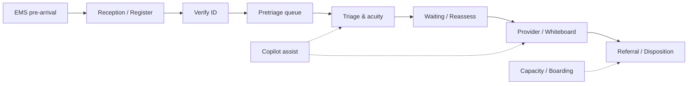

# CareDroid User Manual — Foundation & Platform Blueprint

**Purpose:** Source-code-backed scaffold for building a **fully embedded user manual** across the CareDroid UI.  
**Audience:** Manual authors, UX writers, product owners, and engineers wiring in-app help.  
**Status:** Foundation document — June 2026  
**Companion:** Practitioner procedures live in [`docs/USER-MANUAL.md`](docs/USER-MANUAL.md). This file defines *how the product is organized* and *how to turn that into manual content inside the app*.

---

## 1. What we are building

CareDroid is a **reception-first emergency department operating platform** with an embedded **CareDroid Copilot** workflow layer. The codebase contains far more than frontline staff need at once (fleet, IoT, platform admin, surveillance, simulation labs). The user manual platform must:

1. **Mirror the live UI** — same labels, routes, roles, and shortcuts the app actually renders.
2. **Stay role-scoped** — clerks see desk procedures; physicians see provider workflows; managers see operations.
3. **Embed at the point of need** — chrome, empty states, command palette hints, copilot safety copy, and optional full chapters.
4. **Separate pilot from platform** — document what appears in **Pilot Customer Mode** vs. extension routes reachable by direct URL.

### Product identity (canonical copy)

From `src/config/caredroidProduct.config.ts` and `src/config/emergencyOsBranding.config.ts`:

| Term | UI / marketing label | Route (typical) |
|------|----------------------|-----------------|
| Product | **CareDroid** | `/` → reception or role home |
| Front desk | **Arrival Dashboard** (Reception) | `/emergency/reception` |
| Operations board | **Department Whiteboard** | `/emergency/whiteboard` |
| AI assistant | **CareDroid Copilot** (badge: **Copilot**) | Docked panel + `/emergency/copilot` |
| Safety line | *Decision support only. Human review is required for clinical actions.* | Copilot, headers, product config |

**CareDroid Copilot is not positioned as:** autonomous diagnosis, prescribing, order entry, discharge authority, authoritative acuity assignment, or unsupervised EHR writeback.

---

## 2. Platform observation — how the UI is assembled

### 2.1 Application shell (every authenticated route)

```
┌─────────────────────────────────────────────────────────────────┐
│ SessionChromeBar  Dev · Simulation · API · Demo · Copilot tabs  │
├──────────┬──────────────────────────────────────────────────────┤
│ Sidebar  │ Header — title · search · alerts · quick actions     │
│ (nav)    ├──────────────────────────────────────────────────────┤
│          │ Main content — route page (Reception, Board, etc.)   │
│          │                                                      │
├──────────┴──────────────────────────────────────────────────────┤
│ Overlays: PatientDetailPanel · CopilotPanel · CommandPalette    │
│           ReassessmentDrawer · Toasts · EMS critical broadcast    │
└─────────────────────────────────────────────────────────────────┘
```

**Primary implementation files**

| Layer | File |
|-------|------|
| Shell orchestration | `src/components/AppShell.tsx` |
| Top bar | `src/components/Header.tsx` |
| Navigation rail | `src/components/Sidebar.tsx` |
| Session status / demo / copilot chrome | `src/components/chrome/SessionChromeBar.tsx` |
| AI panel | `src/components/CopilotPanel.tsx` |
| Universal search & actions | `src/components/CommandPalette.tsx` |
| Patient slide-over | `src/components/PatientDetailPanel.tsx` |

**Shell variants**

| Mode | When | Manual implication |
|------|------|------------------|
| Standard practitioner | Most ED routes | Full manual: nav, shortcuts, copilot |
| Kiosk / wall display | `?display=readonly` or `?display=waiting-room` on whiteboard | Minimal chrome; PHI-redacted public copy |
| Registration screen density | Reception route, clerk roles | Hide copilot chrome; focus desk queues |

### 2.2 Entry and identity

| Step | What the user sees | Source |
|------|-------------------|--------|
| Open app | Lands on **Reception** (production) or **Whiteboard** (local dev default) | `receptionFirstUx.config.js`, `App.jsx` |
| Demo identity | **Dr. Cara George**, ED Clinical Director, ED-18, CareDroid Memorial Hospital | `demoPersonaModel.ts` |
| Role switch | **Demo · [Role]** pill in session chrome → `DemoPersonaDrawer` | `SessionChromeBar.tsx`, `ProfileRoleSwitcher` |
| Entry hub | `/start` — “Choose how you enter the department” | `PlatformEntryHub.jsx` |
| Guided tour | Demo journey steps **A–K** (entry → reception → board → … → profile) | `demoPersonaModel.ts`, `docs/USER-MANUAL.md` §5 |

**Demo role views** (curated in `CURATED_DEMO_ROLE_VIEWS`):

- Reception desk → Registration clerk  
- Triage & acuity → Triage nurse  
- Charge / flow control → Charge nurse  
- Provider rounds → Physician  
- Command & operations → ED manager  
- EMS handoff → EMS user  

### 2.3 Navigation model

**Canonical route table:** `src/config/routes.config.js`  
**Nav assembly & pilot visibility:** `src/config/unified-navigation.config.ts`

#### Pilot core sidebar (visible today)

| Nav ID | Label in UI | Path | Manual chapter |
|--------|-------------|------|----------------|
| reception | Reception | `/emergency/reception` | Ch. 4 — Arrival Dashboard |
| whiteboard | Whiteboard | `/emergency/whiteboard` | Ch. 5 — Department Whiteboard |
| ems | EMS | `/emergency/ems` | Ch. 6 — EMS coordination |
| patients | Patients | `/emergency/patients` | Ch. 7 — Patient registry |
| queues | Queues | `/emergency/queues` | Ch. 8 — Queue intelligence |
| reassessment | Reassess (mobile: **Recheck**) | `/emergency/reassessment` | Ch. 9 — Reassessment |
| capacity | **Flow & Capacity** | `/emergency/capacity` | Ch. 10 — Capacity & boarding |
| referrals | Referrals | `/emergency/referrals` | Ch. 11 — Referrals |
| copilot | Copilot | `/emergency/copilot` (opens docked panel) | Ch. 12 — CareDroid Copilot |
| tools | **Medical Tools** | `/emergency/tools` | Ch. 13 — Tools & calculators |
| analytics | Analytics | `/emergency/analytics` | Ch. 14 — Analytics |
| settings | Settings | `/emergency/settings` | Ch. 15 — Settings |
| pulse | Pulse | `/emergency/pulse` | Ch. 16 — Department pulse |
| shift | Shift | `/emergency/shift` | Ch. 17 — Shift summary |

#### Hidden in pilot (document as “Platform extensions”)

Integrations, Cosmos, Platform hub, Fleet, Surveillance, Simulation lab, Knowledge graph, Audit, AI Center, Admin — IDs in `PILOT_EXTENSION_NAV_ITEM_IDS`. Direct URLs still work for entitled roles; sidebar omits them during pilot review.

#### Reception-first rules (`receptionFirstUx.config.js`)

Manual authors must reflect these behaviors:

- **Home route** = Reception for most roles.  
- **Intake** is embedded in Reception — standalone Intake nav hidden for many roles.  
- **Patient search & create** funnel through Reception for clerk-oriented flows.  
- **Copilot hidden on Reception** when front-desk screen mode is active (chrome + floating launcher suppressed).  
- **Registration clerk** cannot access Whiteboard — guard redirects to Reception.

---

## 3. Role-based manual matrix

**Authority source:** `src/config/emergencyRolePermissions.js`, `src/config/emergencyPermissionRegistry.ts`

| Role ID | UI label | Default landing | Primary manual sections |
|---------|----------|-----------------|-------------------------|
| `registration_clerk` | Registration Clerk | Reception | Ch. 4 only + Patients, Pulse, Shift; no Whiteboard |
| `triage_nurse` | Triage Nurse | Reception (`?queue=pretriage`) | Ch. 4, 5, 8, 9, Copilot |
| `charge_nurse` | Charge Nurse | Reception → Whiteboard workflow | Ch. 5, 8, 9, 10, 16, 17 |
| `physician` | Physician | Reception → Whiteboard | Ch. 5, 11, 12, 13, Patient detail |
| `ed_manager` | ED Manager | Reception | Ch. 5, 10, 14, 16, 17, Analytics |
| `ems_user` | EMS User | EMS pipeline | Ch. 6, handoff checklists |
| `admin` | Admin | Reception | All + Ch. 18 Admin |
| `read_only_viewer` | Read-Only Display | Whiteboard `?display=readonly` | Display-only; no mutations |
| `public_display` | Public Display | `?display=waiting-room` | Public waiting room; PHI redacted |

**Permission verbs to document** (sample from `EMERGENCY_ACTIONS`):

`createPatient` · `verifyIntake` · `triage` · `queueMove` · `writeVitals` · `writeNote` · `manageFlags` · `assignStaff` · `assignRoom` · `escalatePatient` · `receptionEscalate` · `dischargePatient` · `prepareEmsBay` · `convertEmsArrival` · `completeEmsHandoff` · `manageReferral` · `manageCapacity` · `manageBoarding` · `useCopilot` · `viewAnalytics` · `manageSettings`

Each manual procedure should state **who** (role), **where** (route + panel), and **permission required**.

---

## 4. Screen modes (density & hardware)

**Registry:** `src/config/careDroidScreenModeRegistry.ts`

| Mode | Label | Density | Typical hardware |
|------|-------|---------|------------------|
| `RECEPTION_SCREEN` | Reception screen | Comfortable | Front-desk workstation |
| `TRIAGE_SCREEN` | Triage screen | Comfortable | Triage workstation |
| `EMS_SCREEN` | EMS screen | Compact | EMS coordinator |
| `CHARGE_NURSE_SCREEN` | Charge nurse screen | Compact | Nurse station |
| `PHYSICIAN_SCREEN` | Physician screen | Comfortable | Provider workstation |
| `COMMAND_CENTER_SCREEN` | Command center screen | Wall | Ops wall |
| `READ_ONLY_WHITEBOARD` | Read-only whiteboard | Wall | Hallway monitor |
| `PUBLIC_WAITING_DISPLAY` | Public waiting display | Wall | Waiting room TV |
| `ADMIN_SCREEN` | Admin screen | Comfortable | Admin workstation |

Manual content for wall modes must use **non-PHI** language and explain auto-refresh behavior.

---

## 5. Core surfaces — what to document per page

### 5.1 Arrival Dashboard (Reception)

**Route:** `/emergency/reception`  
**Page title:** Arrival Dashboard  
**Copy source:** `src/components/reception/receptionCopy.js`

Document these UI regions:

| Region | User-facing name | Empty-state copy key |
|--------|------------------|----------------------|
| EMS pre-arrival | Inbound ambulances | `emptyStateCopy.reception.emsPreArrival` |
| EMS queue | Ambulance arrivals | `emptyStateCopy.reception.queueEms` |
| Verification queue | Need ID check | `emptyStateCopy.reception.queueVerification` |
| Pretriage queue | Waiting for nurse | `emptyStateCopy.reception.queuePretriage` |
| Recent arrivals | Last 30 minutes | `emptyStateCopy.reception.recentArrivals` |

**Primary actions (UI labels):** Register walk-in · Check ID & documents · Register next patient · Express registration (`?express=1`) · Embedded Smart Intake (`?intake=1`).

### 5.2 Department Whiteboard

**Route:** `/emergency/whiteboard`  
**Component:** `src/pages/emergency/index.tsx`

Document: patient cards, filters, priority badges, flags (reassessment, deterioration, high-risk), staff assignment, room assignment, alert rails, role-specific strips (charge vs physician), empty/filtered states (`emptyStateCopy.whiteboard`).

### 5.3 Patient detail panel

**Trigger:** Card click, search result, command palette, copilot link  
**Component:** `src/components/PatientDetailPanel.tsx`

Document: journey timeline, vitals chart, notes, referrals, copilot context, document artifacts, disposition actions (role-gated).

### 5.4 EMS pipeline

**Route:** `/emergency/ems`  
**Component:** `src/components/EMSPipeline.jsx`

Document: inbound units, ETA, offload timers, prepare bay, convert arrival, complete handoff, critical broadcast overlay.

### 5.5 Flow & Capacity

**Route:** `/emergency/capacity` (boarding: `?view=boarding`)  
Document: capacity score, queue health, boarding list, upgrade harness (hidden in practitioner cleanup).

### 5.6 Medical Tools & Calculators

**Route:** `/emergency/tools` (aliases: `/tools`, `/calculators`, `/scores`)  
**Components:** `ToolsOverview.jsx`, `ClinicalCalculatorHub.tsx`

Document: catalog grid, patient context bar, calculator launch, offline behavior, share session (if visible).

### 5.7 CareDroid Copilot

**Access:**

| Method | Location |
|--------|----------|
| Session chrome | Copilot pill + Chat / Context / Safety tabs |
| Sidebar | Copilot nav item (opens docked panel) |
| Header | Green **Copilot** badge toggle |
| Keyboard | `C` |
| Deep link | `/emergency/copilot` (redirects to board + opens panel) |

**Config:** `src/config/copilotPlatform.config.ts`  
**Safety:** Human-reviewed decision support; context from live board, selected patient, operational intelligence.

**Tabs (role/surface dependent):**

- **Chat** — always  
- **Context** — patient/department context (may be hidden in pilot cleanup)  
- **Safety** — policy and risk layers (may be hidden in pilot cleanup)

### 5.8 Settings & admin

**Settings:** `/emergency/settings` — thresholds, modules, walkthrough dataset, screen modes.  
**Admin:** `/admin`, `/admin/tenant`, `/admin/staff-workflows` — tenant and staff configuration (extension chapter).

---

## 6. Global UX affordances (embed in every chapter)

### 6.1 Command palette

**Open:** `Ctrl/Cmd + K` or `/` (except Reception focuses search)  
**Component:** `src/components/CommandPalette.tsx`  
**Config:** `src/config/commandPalette.config.js`

Manual should include a **command cheat sheet** grouped as in the palette: Quick actions · Navigation · Patient · Clinical · Department · Settings.

### 6.2 Keyboard shortcuts

**Source:** `src/components/AppShell.tsx` (global handler)

| Key | Action |
|-----|--------|
| `Escape` | Close copilot → deselect patient → close panels |
| `Shift + H` | Go to role home / landing route |
| `Ctrl/Cmd + K` | Open command palette |
| `C` | Toggle CareDroid Copilot (if permitted) |
| `R` | Toggle reassessment drawer (if role allows) |
| `/` | Focus reception search (on Reception) OR open palette |
| `N` | New patient — reception create path or open intake |

### 6.3 Notifications & alerts

**Header alert drawer** — classified tiers: Critical · High · Medium · Info  
**Operational metrics strip** — pilot KPI policy on command-center-style headers  
Document escalation toasts on reception (`reception-escalation-raised`).

### 6.4 Empty states as micro-help

**Central copy:** `src/config/emptyStateCopy.js`  
**Component:** `src/components/ui/OperationalEmptyState.tsx`

**Embedding rule:** Every empty state already contains `guidance`, `status`, and `nextSteps[]`. The manual platform should **reuse these strings** in-app (not paraphrase) for consistency.

---

## 7. End-to-end journeys (manual storyline spine)

Use these as **part 2** of the embedded manual (procedural walkthroughs). Step numbers align with demo journey A–K in `docs/USER-MANUAL.md`.



| Journey | Roles | Routes | Manual section |
|---------|-------|--------|----------------|
| Walk-in intake | Clerk, triage | Reception → pretriage → board | §7.1 |
| EMS arrival | EMS, clerk, triage | EMS → Reception → triage | §7.2 |
| Reassessment loop | Charge, triage, physician | Board, Reassess drawer, `/reassessment` | §7.3 |
| Referral & transfer | Physician, charge, manager | Referrals, patient panel | §7.4 |
| Capacity & boarding | Charge, manager | Capacity, boarding view | §7.5 |
| Provider disposition | Physician | Board, patient panel, copilot | §7.6 |
| Department operations | Charge, manager | Pulse, Shift, Analytics | §7.7 |

---

## 8. Embedded manual platform — implementation blueprint

### 8.1 Content layers (recommended)

| Layer | Where it lives today | Target embedding |
|-------|---------------------|------------------|
| **L0 — Product safety** | `caredroidProduct.config.ts` | Copilot header, onboarding, `/start` |
| **L1 — Chrome hints** | SessionChromeBar titles, keyboard `(C)` | Tooltip + “?” on copilot segment |
| **L2 — Empty states** | `emptyStateCopy.js` | Already embedded; link “Learn more” → manual section |
| **L3 — Contextual panels** | New: `HelpDrawer` or Settings → Manual | Route-scoped markdown slices |
| **L4 — Role playbooks** | `docs/USER-MANUAL.md` | Split by role ID; serve from `/help` or in-app drawer |
| **L5 — Full reference** | Generated from this foundation | Searchable manual hub |

### 8.2 Suggested repo layout (future)

```
help/
  manual.manifest.json      # route → section mapping
  chapters/
    04-reception.md
    05-whiteboard.md
    ...
  roles/
    registration_clerk.md
    physician.md
  glossary.md
  shortcuts.md
```

**`manual.manifest.json` example structure:**

```json
{
  "version": "1.0.0",
  "routes": {
    "/emergency/reception": { "chapter": "04-reception", "roles": ["registration_clerk", "triage_nurse"] },
    "/emergency/whiteboard": { "chapter": "05-whiteboard", "roles": ["charge_nurse", "physician", "ed_manager"] }
  },
  "shortcuts": "shortcuts.md",
  "glossary": "glossary.md"
}
```

### 8.3 Wiring points in source (for engineers)

| Hook | File | Manual trigger idea |
|------|------|---------------------|
| Route mount | Each page shell / `PageShell` | `?` icon → chapter ID from manifest |
| Header | `Header.tsx` | “Help” menu → role playbook |
| Command palette | `CommandPalette.tsx` | Commands group “Help & training” |
| Settings | `EmergencySettings.jsx` | Manual hub + walkthrough dataset |
| Demo drawer | `DemoPersonaDrawer` | Step A–K with deep links |
| Copilot | `CopilotPanel.tsx` | “How to use Copilot” system message |

### 8.4 Authoring rules

1. **Use UI labels verbatim** from config/copy files — do not invent alternate product names.  
2. **Mark pilot-only** vs extension when describing nav items.  
3. **Always include safety line** on any Copilot or AI section.  
4. **Pair screenshots with route + role + query params** (e.g. Reception `?queue=pretriage`).  
5. **Reference permission** — “Requires: triage nurse, action `queueMove`”.  
6. **Keep reception-first narrative** — front desk prepares the card; clinical teams consume it.

---

## 9. Proposed manual table of contents

Use this as the master outline when splitting `docs/USER-MANUAL.md` and writing embedded chapters.

### Part I — Orientation
1. Welcome & safety (Copilot limits, human review)  
2. Signing in, demo persona, role switching  
3. App shell tour (header, sidebar, session chrome, overlays)  
4. Navigation & Pilot Customer Mode  
5. Command palette & keyboard reference  

### Part II — Frontline workflows
6. Arrival Dashboard (Reception)  
7. Smart Intake & identity verification  
8. EMS coordination & handoff  
9. Department Whiteboard  
10. Patient detail panel  
11. Queues & queue intelligence  
12. Reassessment & timers  
13. Referrals & transfers  
14. Flow, capacity & boarding  

### Part III — Clinical support
15. Medical Tools hub  
16. Clinical calculators (by specialty catalog)  
17. CareDroid Copilot (chat, context, safety)  
18. AI triage assist & operational intelligence  

### Part IV — Operations
19. Department Pulse  
20. Shift summary & handoff  
21. Analytics & throughput  
22. Settings, thresholds & walkthrough data  

### Part V — Roles (quick reference)
23. Registration clerk playbook  
24. Triage nurse playbook  
25. Charge nurse playbook  
26. Physician playbook  
27. EMS user playbook  
28. ED manager playbook  
29. Display / kiosk modes  

### Part VI — Platform extensions (non-pilot)
30. Admin & tenant operations  
31. Fleet, IoT, surveillance (overview only)  
32. Integration & automation hub  

### Appendices
A. Glossary (UI term → meaning)  
B. Route index (`/emergency/*`, aliases, legacy redirects)  
C. Permission matrix  
D. Empty-state copy index  
E. Source file index for maintainers  

---

## 10. Glossary (starter — expand in `help/glossary.md`)

| Term | Meaning in CareDroid |
|------|---------------------|
| Arrival Dashboard | Reception workspace; first-resolution front desk |
| Patient card | Shared ED record prepared at reception, consumed on whiteboard |
| Pretriage | Queue state after registration, before nurse triage |
| Whiteboard | Department operational board of active patients |
| Recheck | Mobile label for Reassessment nav item |
| Flow & Capacity | Capacity engine, queue health, boarding |
| Copilot | Embedded AI workflow layer — not autonomous clinician |
| Pilot Customer Mode | Sidebar shows core ED nav only |
| Practitioner cleanup | UI flattening for pilot — hides platform education chrome |
| Walkthrough dataset | Demo patients loaded from Settings |
| Open access | Current demo auth — no separate login wall |

---

## 11. Maintainer source index

When the UI changes, update manual content from these files first:

| Topic | Primary source |
|-------|----------------|
| Routes & aliases | `src/config/routes.config.js`, `src/App.jsx` |
| Navigation labels & pilot visibility | `src/config/unified-navigation.config.ts` |
| Roles & permissions | `src/config/emergencyRolePermissions.js` |
| Screen modes | `src/config/careDroidScreenModeRegistry.ts` |
| Product & branding strings | `src/config/caredroidProduct.config.ts` |
| Reception copy | `src/components/reception/receptionCopy.js` |
| Empty states | `src/config/emptyStateCopy.js` |
| Copilot behavior | `src/config/copilotPlatform.config.ts`, `CopilotPanel.tsx` |
| Demo journey | `src/config/demoPersonaModel.ts` |
| Reception-first policy | `src/config/receptionFirstUx.config.js` |
| Practitioner UI visibility | `src/config/practitionerSurfaceVisibility.js` |
| Embedded manual content | `src/config/userManual.config.ts` |
| In-app HelpHub UI | `src/components/help/HelpHub.tsx`, `src/contexts/HelpHubContext.tsx` |
| Existing practitioner guide | `docs/USER-MANUAL.md` |

---

## 12. Implementation status (June 2026)

The embedded manual platform is **live in the app**. Content is authored in code, not a separate manifest file.

| Layer | Location |
|-------|----------|
| Procedure content (17 topics, role playbooks, patient journey) | `src/config/userManual.config.ts` |
| Route + role resolver | `src/hooks/useContextualHelp.ts` |
| Drawer + full page UI | `src/components/help/HelpHub.tsx`, `src/pages/emergency/HelpHubPage.tsx` |
| Global open/close events | `src/contexts/HelpHubContext.tsx` |
| Entry points | Sidebar **Guide** (`/emergency/help`), header `?`, session chrome **Guide ?**, command palette, `?` keyboard shortcut |
| Empty-state links | `OperationalEmptyState` `helpTopicId` prop on Reception, Whiteboard, Copilot, Shift |

### Remaining authoring work

1. **Approve Part I–VI TOC** (§9) — adjust chapter numbering before splitting `docs/USER-MANUAL.md`.  
2. **Screenshot pass** — one visual per topic using demo persona roles A–K.  
3. **Expand topics** — add specialty calculator and platform-extension chapters when those surfaces ship to pilot.  

---

*This document is derived from the CareDroid-Clinical-AI source tree as of June 2026. When code and copy diverge, the config files listed in §11 are authoritative.*