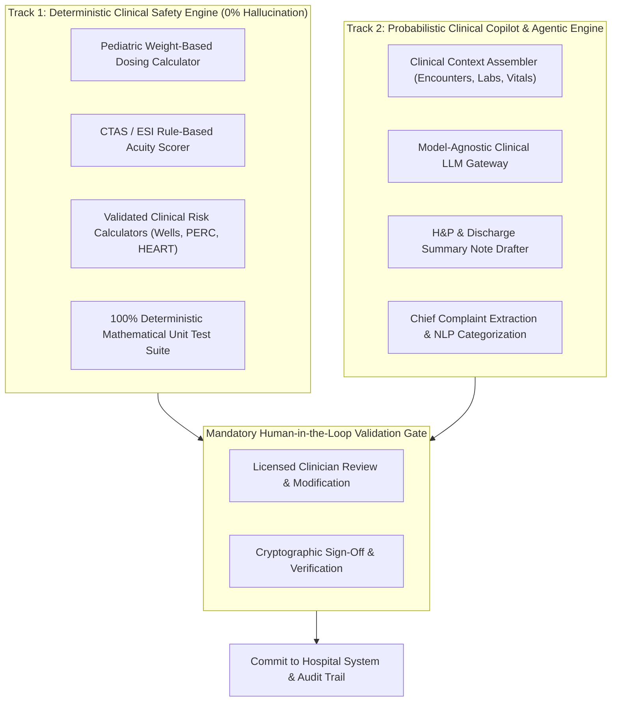

# CareDroid — AI Architecture & Clinical Intelligence Framework

**Document Version:** 2.2.0  
**Status:** Living AI Architecture Specification  
**Lead Authors:** Chief AI Architect, Healthcare Informatics Lead, Principal Machine Learning Engineer

---

## 1. Architectural Philosophy: The Dual-Track Engine

CareDroid implements a **Dual-Track AI Architecture** that maintains an unbreachable wall between deterministic medical arithmetic and probabilistic natural language understanding:

---

## 2. Track 1: Deterministic Clinical Safety Engine

Any operation involving patient pharmacokinetics, drug dosages, or validated numerical clinical scores is executed via transparent, fully deterministic TypeScript logic:

- **Zero Generative AI Dependency:** LLMs are never used to compute dosages, evaluate renal clearance, or perform arithmetic operations.
- **Formulary Hard Ceilings:** Every medication rule enforces both relative caps (e.g. `40 mg/kg/day`) and absolute adult ceiling thresholds (e.g. `max 1,000 mg/dose`).
- **Validated Evidence Citations:** Every formula references its medical literature origin (e.g. Canadian Paediatric Society, American Heart Association).

---

## 3. Track 2: Probabilistic Copilot & Agentic Architecture

### 3.1 Model-Agnostic AI Gateway

CareDroid integrates with enterprise LLMs via a secure, zero-data-retention gateway:

- **Supported Backends:** Gemini 1.5/2.0 Pro/Flash, Anthropic Claude 3.5 Sonnet, Local Self-Hosted Llama-3-Med (for high-security air-gapped deployments).
- **Zero Training Agreement:** Strict BAA and enterprise contracts ensure patient telemetry is never used for foundation model training or cached by external vendors.

### 3.2 Clinical Context Grounding & Prompt Sanitation

Before clinical context is passed to the LLM:

1. Identifiers are tokenized or pseudonymized.
2. Structured vital signs, laboratory values with reference ranges, and active medications are injected into a structured JSON schema.
3. System prompts enforce clinical restraint: _"You are an assistive clinical scribe. Do not diagnose or prescribe. Highlight contradictory vital signs or missing laboratory panels for human physician evaluation."_

---

## 4. Human-in-the-Loop Safety & Provenance Rules

1. **Visual Demarcation:** All AI-generated text, suggestions, and drafted notes render in distinctive violet styling (`--cdl-ai-*`), carrying an explicit provenance badge: `[AI Draft — Requires Clinician Signature]`.
2. **One-Click Acceptance or Rejection:** Clinicians can accept, edit inline, or completely reject any AI-generated draft with a single click.
3. **Audit Trail Logging:** The original AI suggestion, the clinician’s modifications, and the final signed text are recorded to evaluate model drift and provider acceptance rates.

---
