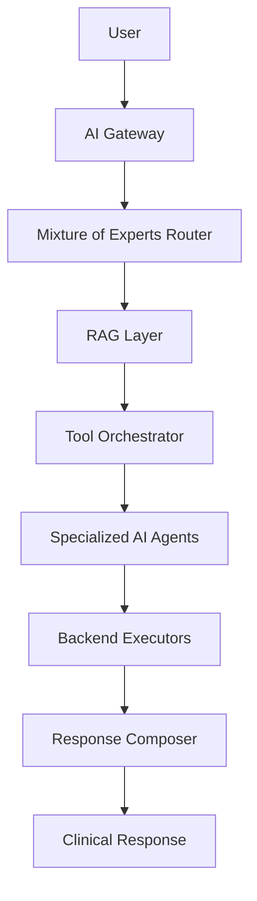
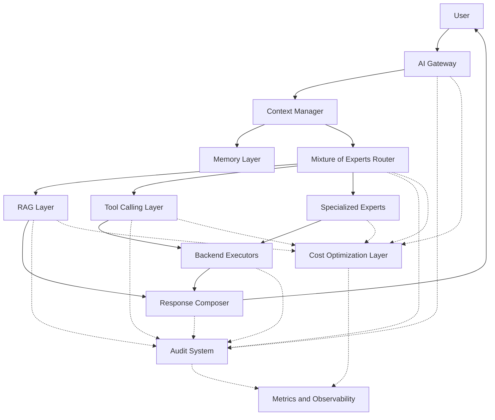
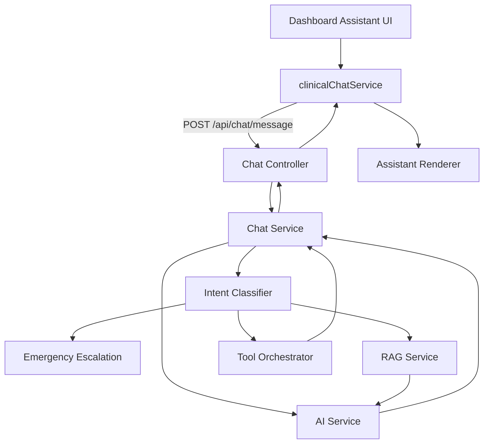
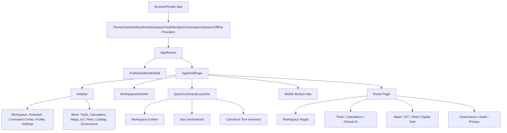
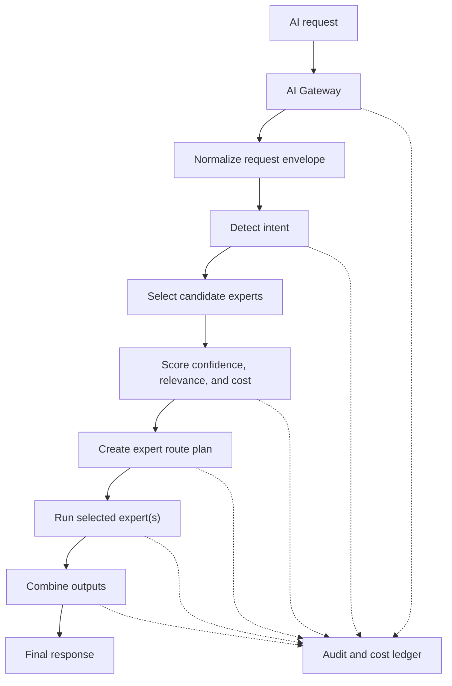
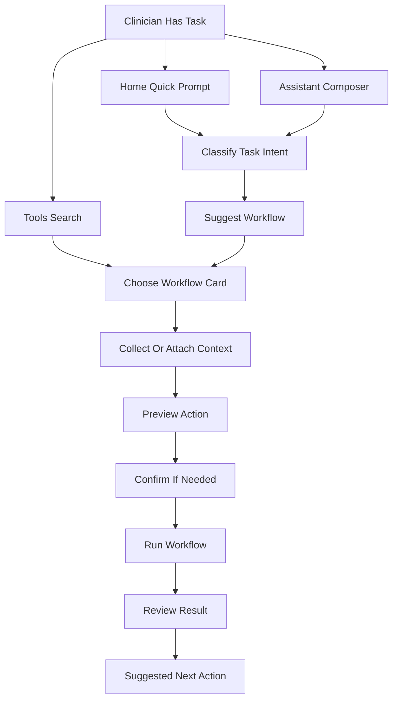
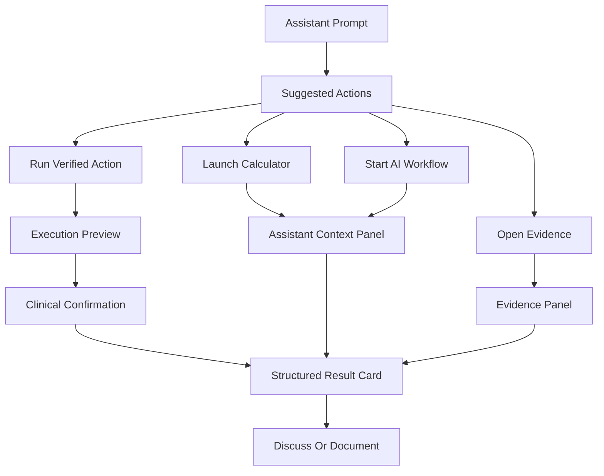
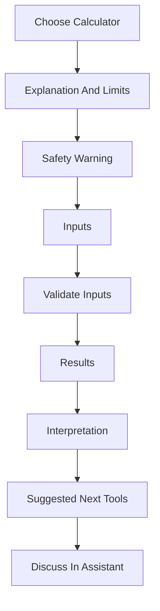
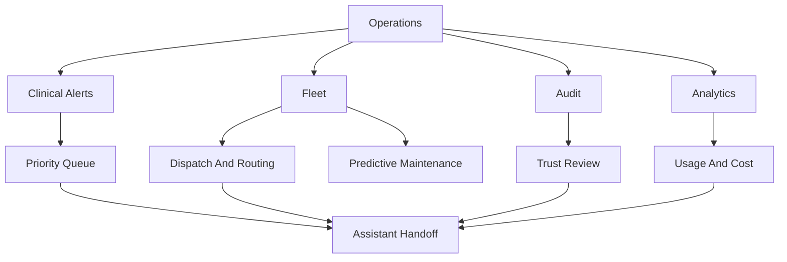

# CareDroid Master Platform Inventory

**Generated:** 2026-06-02

This is the master feature inventory and strategy document for CareDroid Clinical AI. It consolidates findings from the React/Vite frontend, NestJS backend, package/config files, route registries, tool/calculator inventories, AI modules, map/IoT/fleet modules, tests, README, and the markdown reports under `docs/`.

## 1. Executive Summary

- CareDroid is a large clinical AI platform with **242 sidebar registry tools**, **219 NLU/AI clinical profiles**, **92 dedicated calculator UI forms**, **92 calculator SPA routes**, and **291 catalog rows**.
- The honest backend/frontend contract is mixed: **4 fully wired rows**, **240 frontend-only rows**, **8 planned rows**, and **3 executable clinical POST tools** (`sofa-calculator`, `drug-interactions`, `lab-interpreter`).
- The frontend route table currently contains **193 explicit route records** plus generated calculator routes and aliases. The backend route inventory contains **253 canonical HTTP routes** across controllers, with the largest route surface in `PlatformSystemsController` (75 routes).
- The product is strongest as a frontend-rich clinical workspace, calculator catalog, AI assistant shell, governance dashboard, and operations demo layer. Production-grade execution is narrower: backend-backed clinical tool execution exists for SOFA, drug interaction checking, lab interpretation, selected Clinical Intelligence workflows, governance, profile/workspace, artifacts, memory, tool calling, training/evaluation, hospital map/telemetry/fleet demo services, and platform systems APIs.
- Anything using demo snapshots, static data, placeholders, chat-only fallbacks, or mocked platform/system cards is labeled as demo/mock-only or frontend-only below.

## 2. Current Platform Vision

CareDroid is positioned as a clinical operating system: an AI-chat-centered workspace that routes users into calculators, clinical AI tools, evidence/RAG, governed tool calls, hospital operations maps, Medical IoT telemetry, fleet logistics, simulation/training, laboratory workflows, and platform governance. The vision is to reduce route sprawl by using a unified inventory, normalized routes, profile-based segmentation, and assistant-first tool launch while keeping high-risk clinical actions audit-bound and human-reviewed.

## 3. Implemented Features

| Feature | ID/route | Frontend status | Backend status | Launch behavior | Demo/live | Tests status | Notes |
|---|---|---|---|---|---|---|---|
| Drug Interaction Checker | `drug-interactions` / `/tools/drug-checker` | Implemented | Implemented endpoint `/api/tools/drug-interactions/execute` | Direct UI/API execution | Live contract | Covered by contract/tool tests | Fully wired row in tool contract matrix. |
| Lab Results Interpreter | `lab-interpreter` / `/tools/lab-interpreter` | Implemented | Implemented endpoint `/api/tools/lab-interpreter/execute` | Direct UI/API execution | Live contract | Covered by contract/tool tests | Fully wired row in tool contract matrix. |
| SOFA Score Calculator | `sofa-calculator` / `/tools/calculators/sofa` | Implemented | Implemented endpoint `/api/tools/sofa-calculator/execute` | Direct UI/API execution | Live contract | Covered by contract/tool tests | Calculator slug: sofa |
| List orchestrator tools | `tools-list-api` / `—` | Implemented | Implemented endpoint `GET /api/tools` | Direct UI/API execution | Live contract | Covered by contract/tool tests | Catalog executor panel |
| Authentication, profile, workspace shell | `/auth`, `/profile`, `/workspace/:workspaceId` | Implemented | Implemented auth/users/profile/workspaces modules | Route guarded app shell | Live/demo depending env | Frontend/backend auth tests exist | JWT/OAuth/2FA/biometric endpoints are present; dev bypass exists for local/dev scenarios. |
| Notifications | `/notifications`, `/notification-preferences` | Implemented | Implemented notification controller/services | App notification center and preferences | Live if Firebase/config available | Component/API tests exist | Device tokens, preferences, unread count, test notification routes. |
| Audit/compliance/governance shell | `/audit`, `/ai-governance`, `/governance/*` | Implemented UI surfaces | Backend audit, compliance, platform-governance, governance modules | Protected admin/governance routes | Mostly live service APIs plus dashboards | Backend service specs and frontend page tests exist | Includes hash-chained audit logs, gate evaluation, review items, consent/privacy/synthetic validation routes. |
| Artifacts | `/artifacts` | Implemented | Backend artifacts module + migrations | Artifact list/graph/API | Live service contract | Artifacts tests exist | Supports artifact entities, versions, relationships, seed/asset registry services. |
| AI Memory dashboard | `/memory`, `/ai-memory` | Implemented | Backend short/long/clinical memory modules + migration | Dashboard/API memory records | Live service contract | Memory service specs and page tests exist | Distinguishes short-term, long-term, and clinical memory entries. |
| Training/evaluation/cost dashboards | `/training`, `/ai/evaluation`, `/costs` | Implemented pages | Backend training, evaluation, cost-optimizer modules | Dashboards/API calls | Live/demo depending data | Service/page tests exist | Used for AI quality, runs, metrics, routing/cost optimization. |

## 4. Partially Implemented Features

| Feature class | Count/examples | Frontend status | Backend status | Launch behavior | User-facing status | Notes |
|---|---:|---|---|---|---|---|
| Frontend-only clinical tools and calculators | 240 rows | UI/catalog/routes/NLU mostly present | No dedicated POST executor for most rows | Calculator form, chat seed, or static page | Visible but not backend-executable | Includes 92 calculator forms/routes and many Tier-B/C specialty assistants. Chat may fall back to general AI when no structured executor exists. |
| Clinical Intelligence workflows | 8 main routes | Pages implemented | Backend endpoints exist for ambient scribe, guideline RAG, differential, timeline, summary, order set, explainability, audit | Direct form/API calls | Partially live | Requires real source data, review workflows, and production policy gates for clinical deployment. |
| Hospital map / Medical IoT / live maps / fleet | 20+ surfaces | Pages implemented | Backend demo modules/services exist | Snapshot dashboards and map views | Demo/live hybrid | Services explicitly mark backend map contract as demo until connected to real floor/device feeds. |
| Platform systems and integrations | 75 backend routes in PlatformSystemsController | Many pages route to generic PlatformSystemPage | Backend endpoints implemented with synthetic/demo contracts | Protected platform pages | Partially implemented | FHIR/HL7/source provenance/patient import and clinical intelligence helpers need production connectors. |
| AI Gateway / MoE / tool calling / memory / artifacts | Assistant-integrated | Backend modules and services present | ChatService wires gateway, MoE, cost optimizer, memory, artifacts, evaluation, tool calling | Assistant first | Partially implemented | Strategy is present in code/docs; production completeness depends on model credentials, evaluation, policies, and real tool coverage. |

## 5. Planned Features

| Name | ID | Route | Frontend status | Backend status | Category | User-facing status | Demo/live | Tests | Notes |
|---|---|---|---|---|---|---|---|---|---|
| ABC Emergency Assessment | `abc-assessment` | — | Not implemented | Not implemented | Planned/phantom | Not visible as production tool | Planned | Contract matrix only | Recommended for emergency_assessment intent; no UI or backend executor. |
| Antibiotic Scripts | `antibiotic-scripts` | — | Not implemented | Not implemented | Planned/phantom | Not visible as production tool | Planned | Contract matrix only | Overlaps NLU antibiotic-guide → diagnosis page; separate id unused in UI. |
| Bleeding Risk Calculator | `bleeding-risk` | — | Not implemented | Not implemented | Planned/phantom | Not visible as production tool | Planned | Contract matrix only | Cost category id; launch resolves to HAS-BLED registry (/tools/calculators/has-bled) via NLU_TO_REGISTRY_ID + toolIdAliases. |
| Oncology Risk Calculator | `cancer-calculator` | — | Not implemented | Not implemented | Planned/phantom | Not visible as production tool | Planned | Contract matrix only | NLU recommendations only; not in tool.patterns or Calculators.jsx. |
| Chemotherapy Dosing Calculator | `chemo-calculator` | — | Not implemented | Not implemented | Planned/phantom | Not visible as production tool | Planned | Contract matrix only | Recommendation + cost tracking only. |
| Medication Checker (offline label) | `medication-checker` | — | Not implemented | Not implemented | Planned/phantom | Not visible as production tool | Planned | Contract matrix only | Offline cache category label; alias of drug-check conceptually. |
| Tumor Staging Guide | `tumor-staging` | — | Not implemented | Not implemented | Planned/phantom | Not visible as production tool | Planned | Contract matrix only | Recommendation + cost tracking only. |
| Vitals Monitor | `vitals-monitor` | — | Not implemented | Endpoint exists but no dedicated page | Planned/phantom | Not visible as production tool | Planned | Contract matrix only | POST /api/chat/analyze-vitals exists; no dedicated vitals tool page. |
| Real hospital digital twin feeds | TBD | `/hospital-map`, `/medical-iot`, `/live-map` | Demo shells exist | Demo contracts exist | Operations | Planned production connector | Demo now | Page/service tests | Needs real RTLS/CMMS/IoT/FHIR feeds. |
| Production 3D/DICOM viewer | TBD | `/3d-viewer` | Placeholder canvas | No DICOM/3D backend | Visualization | Planned | Demo-only now | Page smoke tests | Needs committed assets or remote viewer service and dependency selection. |
| Production LIS/laboratory integration | TBD | `/laboratory` | Demo dashboard | Platform endpoints only | Laboratory | Planned | Demo-only now | Route/page tests | Needs LIS/FHIR Observation integration and analyzer queue data. |

## 6. Demo/Mock-Only Features

| Feature | Route | Demo signal | Frontend status | Backend status | Notes |
|---|---|---|---|---|---|
| Hospital map dashboard | `/hospital-map` | `HOSPITAL_MAP_BACKEND_STATUS.demoContractOnly = true` | Implemented | Demo hospital-map services | Replace with real floor/device feeds before clinical use. |
| Medical IoT dashboard | `/medical-iot` | Snapshot/demo telemetry | Implemented | Telemetry/device registry demo services | Needs real device registry, telemetry broker, alerting, maintenance feeds. |
| Live tracking map | `/live-map`, `/fleet/map` | Live tracking capability/demo services | Implemented | LiveTracking/Fleet demo contracts | Needs production GPS/RTLS ingestion and SLA monitoring. |
| Medical simulation suite | `/simulation`, `/simulation/:scenarioId`, `/simulation/outcomes` | Scenario/training catalog style | Implemented | Simulation module/services | Training content exists but should be validated before credentialing use. |
| Laboratory dashboard | `/laboratory` | Demo specimen/analyzer panels | Implemented | No dedicated LIS backend beyond platform systems | Demo operational visualization. |
| 3D viewer | `/3d-viewer` | Placeholder models; no GLB/GLTF/DICOM assets | Implemented placeholder | No imaging backend | Explicitly not diagnostic imaging. |
| Some platform OS pages | `/integrations/*`, `/patients/*`, `/operations/*`, `/review/*` | Generic PlatformSystemPage | Implemented route shell | Backend/platform APIs vary | Useful as navigation/strategy placeholders. |

## 7. Medical Calculators Inventory

CareDroid exposes **109 calculator-related contract rows** including **92 dedicated calculator UI forms** and **92 calculator SPA routes**. Unless marked fully wired, calculator rows are frontend-only local forms or chat-assisted launches without dedicated backend POST execution.

| Name | ID | Route | Frontend status | Backend status | Launch behavior | Category | User-facing status | Demo/live | Tests | Notes |
|---|---|---|---|---|---|---|---|---|---|---|
| A-a Gradient | `aa-gradient` | `/tools/calculators/aa-gradient` | Implemented | No dedicated backend executor | Direct calculator route | Calculator | frontend-only | Frontend/local or chat-assisted | Inventory/contract tests | Calculator slug: aa-gradient |
| ABCD² score | `abcd2` | `/tools/calculators/abcd2` | Implemented | No dedicated backend executor | Direct calculator route | Calculator | frontend-only | Frontend/local or chat-assisted | Inventory/contract tests | Calculator slug: abcd2 |
| Adjusted Body Weight | `adjusted-body-weight` | `/tools/calculators/adjusted-body-weight` | Implemented | No dedicated backend executor | Direct calculator route | Calculator | frontend-only | Frontend/local or chat-assisted | Inventory/contract tests | Calculator slug: adjusted-body-weight |
| Anion Gap | `anion-gap` | `/tools/calculators/anion-gap` | Implemented | No dedicated backend executor | Direct calculator route | Calculator | frontend-only | Frontend/local or chat-assisted | Inventory/contract tests | Calculator slug: anion-gap |
| APACHE-II Score | `apache2-calculator` | `/tools/calculators/apache-ii` | Implemented | No dedicated backend executor | Direct calculator route | Calculator | frontend-only | Frontend/local or chat-assisted | Inventory/contract tests |  |
| Apgar score | `apgar-score` | `/tools/calculators/apgar-score` | Implemented | No dedicated backend executor | Direct calculator route | Calculator | frontend-only | Frontend/local or chat-assisted | Inventory/contract tests | Calculator slug: apgar-score |
| APRI | `apri` | `/tools/calculators/apri` | Implemented | No dedicated backend executor | Direct calculator route | Calculator | frontend-only | Frontend/local or chat-assisted | Inventory/contract tests | Calculator slug: apri |
| ASCVD 10-year risk (PCE) | `ascvd-risk` | `/tools/calculators/ascvd-risk` | Implemented | No dedicated backend executor | Direct calculator route | Calculator | frontend-only | Frontend/local or chat-assisted | Inventory/contract tests | Calculator slug: ascvd-risk |
| Asthma Severity Score | `asthma-severity-score` | `/tools/calculators/asthma-severity-score` | Implemented | No dedicated backend executor | Direct calculator route | Calculator | frontend-only | Frontend/local or chat-assisted | Inventory/contract tests | Calculator slug: asthma-severity-score |
| AUDIT-C (alcohol screen) | `audit-c` | `/tools/calculators/audit-c` | Implemented | No dedicated backend executor | Direct calculator route | Calculator | frontend-only | Frontend/local or chat-assisted | Inventory/contract tests | Calculator slug: audit-c |
| Bed Occupancy Calculator | `bed-occupancy-calculator` | `/tools/calculators/bed-occupancy-calculator` | Implemented | No dedicated backend executor | Direct calculator route | Calculator | frontend-only | Frontend/local or chat-assisted | Inventory/contract tests | Calculator slug: bed-occupancy-calculator |
| BISAP score | `bisap-score` | `/tools/calculators/bisap-score` | Implemented | No dedicated backend executor | Direct calculator route | Calculator | frontend-only | Frontend/local or chat-assisted | Inventory/contract tests | Calculator slug: bisap-score |
| Bishop score | `bishop-score` | `/tools/calculators/bishop-score` | Implemented | No dedicated backend executor | Direct calculator route | Calculator | frontend-only | Frontend/local or chat-assisted | Inventory/contract tests | Calculator slug: bishop-score |
| BODE Index | `bode-index` | `/tools/calculators/bode-index` | Implemented | No dedicated backend executor | Direct calculator route | Calculator | frontend-only | Frontend/local or chat-assisted | Inventory/contract tests | Calculator slug: bode-index |
| Braden scale | `braden-scale` | `/tools/calculators/braden-scale` | Implemented | No dedicated backend executor | Direct calculator route | Calculator | frontend-only | Frontend/local or chat-assisted | Inventory/contract tests | Calculator slug: braden-scale |
| Body Surface Area | `bsa` | `/tools/calculators/bsa` | Implemented | No dedicated backend executor | Direct calculator route | Calculator | frontend-only | Frontend/local or chat-assisted | Inventory/contract tests | Calculator slug: bsa |
| BUN/Creatinine Ratio | `bun-creatinine-ratio` | `/tools/calculators/bun-creatinine-ratio` | Implemented | No dedicated backend executor | Direct calculator route | Calculator | frontend-only | Frontend/local or chat-assisted | Inventory/contract tests | Calculator slug: bun-creatinine-ratio |
| CAGE (alcohol screen) | `cage` | `/tools/calculators/cage` | Implemented | No dedicated backend executor | Direct calculator route | Calculator | frontend-only | Frontend/local or chat-assisted | Inventory/contract tests | Calculator slug: cage |
| Canadian C-Spine Rule | `canadian-c-spine` | `/tools/calculators` | Implemented | Chat endpoint only | Calculator hub/chat-assisted launch | Calculator | frontend-only | Frontend/local or chat-assisted | Inventory/contract tests | Tier-B: catalog launch seeds dashboard chat; no tool POST |
| Centor / McIsaac score | `centor-mcisaac` | `/tools/calculators/centor-mcisaac` | Implemented | No dedicated backend executor | Direct calculator route | Calculator | frontend-only | Frontend/local or chat-assisted | Inventory/contract tests | Calculator slug: centor-mcisaac |
| CHA2DS2-VASc Score | `cha2ds2vasc-calculator` | `/tools/calculators/chads2vasc` | Implemented | No dedicated backend executor | Direct calculator route | Calculator | frontend-only | Frontend/local or chat-assisted | Inventory/contract tests | Calculator slug: chads2vasc |
| CHADS2 Score | `chads2` | `/tools/calculators/chads2` | Implemented | No dedicated backend executor | Direct calculator route | Calculator | frontend-only | Frontend/local or chat-assisted | Inventory/contract tests | Calculator slug: chads2 |
| Child-Pugh score | `child-pugh` | `/tools/calculators/child-pugh` | Implemented | No dedicated backend executor | Direct calculator route | Calculator | frontend-only | Frontend/local or chat-assisted | Inventory/contract tests | Calculator slug: child-pugh |
| CKD staging (KDIGO) | `ckd-staging` | `/tools/calculators/ckd-staging` | Implemented | No dedicated backend executor | Direct calculator route | Calculator | frontend-only | Frontend/local or chat-assisted | Inventory/contract tests | Calculator slug: ckd-staging |
| Columbia suicide severity workflow entry | `columbia-suicide-severity-workflow` | `/tools/calculators/columbia-suicide-severity-workflow` | Implemented | No dedicated backend executor | Direct calculator route | Calculator | frontend-only | Frontend/local or chat-assisted | Inventory/contract tests | Calculator slug: columbia-suicide-severity-workflow |
| COPD GOLD Assessment | `copd-gold` | `/tools/calculators` | Implemented | Chat endpoint only | Calculator hub/chat-assisted launch | Calculator | frontend-only | Frontend/local or chat-assisted | Inventory/contract tests | Tier-B: catalog launch seeds dashboard chat; no tool POST |
| COPD GOLD Assessment | `copd-gold-assessment` | `/tools/calculators/copd-gold-assessment` | Implemented | No dedicated backend executor | Direct calculator route | Calculator | frontend-only | Frontend/local or chat-assisted | Inventory/contract tests | Calculator slug: copd-gold-assessment |
| Corrected Calcium | `corrected-calcium` | `/tools/calculators/corrected-calcium` | Implemented | No dedicated backend executor | Direct calculator route | Calculator | frontend-only | Frontend/local or chat-assisted | Inventory/contract tests | Calculator slug: corrected-calcium |
| Corrected Sodium | `corrected-sodium` | `/tools/calculators/corrected-sodium` | Implemented | No dedicated backend executor | Direct calculator route | Calculator | frontend-only | Frontend/local or chat-assisted | Inventory/contract tests | Calculator slug: corrected-sodium |
| Creatinine Clearance Cockcroft-Gault | `creatinine-clearance-cg` | `/tools/calculators/creatinine-clearance-cg` | Implemented | No dedicated backend executor | Direct calculator route | Calculator | frontend-only | Frontend/local or chat-assisted | Inventory/contract tests | Calculator slug: creatinine-clearance-cg |
| CURB-65 Score | `curb65-calculator` | `/tools/calculators/curb-65` | Implemented | No dedicated backend executor | Direct calculator route | Calculator | frontend-only | Frontend/local or chat-assisted | Inventory/contract tests |  |
| Device Recommendation Assistant | `device-recommendation-assistant` | `/tools/calculators` | Implemented | Chat endpoint only | Calculator hub/chat-assisted launch | Calculator | frontend-only | Frontend/local or chat-assisted | Inventory/contract tests |  |
| Dispatch Intelligence Assistant | `dispatch-ai` | `/tools/calculators` | Implemented | Chat endpoint only | Calculator hub/chat-assisted launch | Calculator | frontend-only | Frontend/local or chat-assisted | Inventory/contract tests | Tier-B: catalog launch seeds dashboard chat; no tool POST; NLU backendExecutable flag (chat routing only) |
| Medication Dose Calculator | `dose-calculator` | `/tools/calculators` | Implemented | Chat endpoint only | Calculator hub/chat-assisted launch | Calculator | frontend-only | Frontend/local or chat-assisted | Inventory/contract tests |  |
| Duke Treadmill Score | `duke-treadmill-score` | `/tools/calculators/duke-treadmill-score` | Implemented | No dedicated backend executor | Direct calculator route | Calculator | frontend-only | Frontend/local or chat-assisted | Inventory/contract tests | Calculator slug: duke-treadmill-score |
| eGFR CKD-EPI 2021 | `egfr-ckd-epi` | `/tools/calculators/egfr-ckd-epi` | Implemented | No dedicated backend executor | Direct calculator route | Calculator | frontend-only | Frontend/local or chat-assisted | Inventory/contract tests | Calculator slug: egfr-ckd-epi |
| Epworth Sleepiness Scale | `epworth-sleepiness-scale` | `/tools/calculators/epworth-sleepiness-scale` | Implemented | No dedicated backend executor | Direct calculator route | Calculator | frontend-only | Frontend/local or chat-assisted | Inventory/contract tests | Calculator slug: epworth-sleepiness-scale |
| FeNa | `fena` | `/tools/calculators/fena` | Implemented | No dedicated backend executor | Direct calculator route | Calculator | frontend-only | Frontend/local or chat-assisted | Inventory/contract tests | Calculator slug: fena |
| Fenton Growth Chart Helper | `fenton-growth-chart-helper` | `/tools/calculators/fenton-growth-chart-helper` | Implemented | No dedicated backend executor | Direct calculator route | Calculator | frontend-only | Frontend/local or chat-assisted | Inventory/contract tests | Calculator slug: fenton-growth-chart-helper |
| FeUrea | `feurea` | `/tools/calculators/feurea` | Implemented | No dedicated backend executor | Direct calculator route | Calculator | frontend-only | Frontend/local or chat-assisted | Inventory/contract tests | Calculator slug: feurea |
| FIB-4 index | `fib4` | `/tools/calculators/fib4` | Implemented | No dedicated backend executor | Direct calculator route | Calculator | frontend-only | Frontend/local or chat-assisted | Inventory/contract tests | Calculator slug: fib4 |
| FOUR Score | `four-score` | `/tools/calculators/four-score` | Implemented | No dedicated backend executor | Direct calculator route | Calculator | frontend-only | Frontend/local or chat-assisted | Inventory/contract tests | Calculator slug: four-score |
| Framingham 10-year CHD risk | `framingham-risk` | `/tools/calculators/framingham-risk` | Implemented | No dedicated backend executor | Direct calculator route | Calculator | frontend-only | Frontend/local or chat-assisted | Inventory/contract tests | Calculator slug: framingham-risk |
| Free Water Deficit | `free-water-deficit` | `/tools/calculators/free-water-deficit` | Implemented | No dedicated backend executor | Direct calculator route | Calculator | frontend-only | Frontend/local or chat-assisted | Inventory/contract tests | Calculator slug: free-water-deficit |
| GAD-7 (anxiety screen) | `gad7` | `/tools/calculators/gad7` | Implemented | No dedicated backend executor | Direct calculator route | Calculator | frontend-only | Frontend/local or chat-assisted | Inventory/contract tests | Calculator slug: gad7 |
| Glasgow Coma Scale | `gcs-calculator` | `/tools/calculators/gcs` | Implemented | No dedicated backend executor | Direct calculator route | Calculator | frontend-only | Frontend/local or chat-assisted | Inventory/contract tests |  |
| Gestational Age Calculator | `gestational-age-calculator` | `/tools/calculators/gestational-age-calculator` | Implemented | No dedicated backend executor | Direct calculator route | Calculator | frontend-only | Frontend/local or chat-assisted | Inventory/contract tests | Calculator slug: gestational-age-calculator |
| Glasgow-Blatchford Score | `glasgow-blatchford-score` | `/tools/calculators/glasgow-blatchford-score` | Implemented | No dedicated backend executor | Direct calculator route | Calculator | frontend-only | Frontend/local or chat-assisted | Inventory/contract tests | Calculator slug: glasgow-blatchford-score |
| GRACE ACS Risk | `grace-acs` | `/tools/calculators` | Implemented | Chat endpoint only | Calculator hub/chat-assisted launch | Calculator | frontend-only | Frontend/local or chat-assisted | Inventory/contract tests | Tier-B: catalog launch seeds dashboard chat; no tool POST |
| HAS-BLED score | `has-bled` | `/tools/calculators/has-bled` | Implemented | No dedicated backend executor | Direct calculator route | Calculator | frontend-only | Frontend/local or chat-assisted | Inventory/contract tests | Calculator slug: has-bled |
| HCM Sudden Death Risk | `hcm-sudden-death-risk` | `/tools/calculators/hcm-sudden-death-risk` | Implemented | No dedicated backend executor | Direct calculator route | Calculator | frontend-only | Frontend/local or chat-assisted | Inventory/contract tests | Calculator slug: hcm-sudden-death-risk |
| Heart Failure Staging Helper | `heart-failure-staging` | `/tools/calculators/heart-failure-staging` | Implemented | No dedicated backend executor | Direct calculator route | Calculator | frontend-only | Frontend/local or chat-assisted | Inventory/contract tests | Calculator slug: heart-failure-staging |
| HEART score | `heart-score` | `/tools/calculators/heart-score` | Implemented | No dedicated backend executor | Direct calculator route | Calculator | frontend-only | Frontend/local or chat-assisted | Inventory/contract tests | Calculator slug: heart-score |
| HOMA-IR | `homa-ir` | `/tools/calculators/homa-ir` | Implemented | No dedicated backend executor | Direct calculator route | Calculator | frontend-only | Frontend/local or chat-assisted | Inventory/contract tests | Calculator slug: homa-ir |
| Hospital Command Assistant | `hospital-command-assistant` | `/tools/calculators` | Implemented | Chat endpoint only | Calculator hub/chat-assisted launch | Calculator | frontend-only | Frontend/local or chat-assisted | Inventory/contract tests |  |
| Hunt-Hess Scale | `hunt-hess-scale` | `/tools/calculators/hunt-hess-scale` | Implemented | No dedicated backend executor | Direct calculator route | Calculator | frontend-only | Frontend/local or chat-assisted | Inventory/contract tests | Calculator slug: hunt-hess-scale |
| ICH Score | `ich-score` | `/tools/calculators/ich-score` | Implemented | No dedicated backend executor | Direct calculator route | Calculator | frontend-only | Frontend/local or chat-assisted | Inventory/contract tests | Calculator slug: ich-score |
| Ideal Body Weight | `ideal-body-weight` | `/tools/calculators/ideal-body-weight` | Implemented | No dedicated backend executor | Direct calculator route | Calculator | frontend-only | Frontend/local or chat-assisted | Inventory/contract tests | Calculator slug: ideal-body-weight |
| Kidney Failure Risk Equation | `kfre` | `/tools/calculators/kfre` | Implemented | No dedicated backend executor | Direct calculator route | Calculator | frontend-only | Frontend/local or chat-assisted | Inventory/contract tests | Calculator slug: kfre |
| Maddrey Discriminant Function | `maddrey-discriminant-function` | `/tools/calculators/maddrey-discriminant-function` | Implemented | No dedicated backend executor | Direct calculator route | Calculator | frontend-only | Frontend/local or chat-assisted | Inventory/contract tests | Calculator slug: maddrey-discriminant-function |
| Mood Disorder Questionnaire (MDQ) | `mdq` | `/tools/calculators/mdq` | Implemented | No dedicated backend executor | Direct calculator route | Calculator | frontend-only | Frontend/local or chat-assisted | Inventory/contract tests | Calculator slug: mdq |
| MELD score | `meld` | `/tools/calculators/meld` | Implemented | No dedicated backend executor | Direct calculator route | Calculator | frontend-only | Frontend/local or chat-assisted | Inventory/contract tests | Calculator slug: meld |
| MELD-Na score | `meld-na` | `/tools/calculators/meld-na` | Implemented | No dedicated backend executor | Direct calculator route | Calculator | frontend-only | Frontend/local or chat-assisted | Inventory/contract tests | Calculator slug: meld-na |
| Modified Early Warning Score (MEWS) | `mews` | `/tools/calculators/mews` | Implemented | No dedicated backend executor | Direct calculator route | Calculator | frontend-only | Frontend/local or chat-assisted | Inventory/contract tests | Calculator slug: mews |
| MMSE score entry | `mmse` | `/tools/calculators/mmse` | Implemented | No dedicated backend executor | Direct calculator route | Calculator | frontend-only | Frontend/local or chat-assisted | Inventory/contract tests | Calculator slug: mmse |
| MoCA placeholder workflow | `moca-placeholder-workflow` | `/tools/calculators/moca-placeholder-workflow` | Implemented | No dedicated backend executor | Direct calculator route | Calculator | frontend-only | Frontend/local or chat-assisted | Inventory/contract tests | Calculator slug: moca-placeholder-workflow |
| Modified Rankin Scale | `modified-rankin-scale` | `/tools/calculators/modified-rankin-scale` | Implemented | No dedicated backend executor | Direct calculator route | Calculator | frontend-only | Frontend/local or chat-assisted | Inventory/contract tests | Calculator slug: modified-rankin-scale |
| Morse Fall Scale | `morse-fall-scale` | `/tools/calculators/morse-fall-scale` | Implemented | No dedicated backend executor | Direct calculator route | Calculator | frontend-only | Frontend/local or chat-assisted | Inventory/contract tests | Calculator slug: morse-fall-scale |
| Neonatal Bilirubin Risk Helper | `neonatal-bilirubin-risk-helper` | `/tools/calculators/neonatal-bilirubin-risk-helper` | Implemented | No dedicated backend executor | Direct calculator route | Calculator | frontend-only | Frontend/local or chat-assisted | Inventory/contract tests | Calculator slug: neonatal-bilirubin-risk-helper |
| NEWS2 (National Early Warning Score 2) | `news2` | `/tools/calculators/news2` | Implemented | No dedicated backend executor | Direct calculator route | Calculator | frontend-only | Frontend/local or chat-assisted | Inventory/contract tests | Calculator slug: news2 |
| NEXUS C-Spine Rule | `nexus-cspine` | `/tools/calculators` | Implemented | Chat endpoint only | Calculator hub/chat-assisted launch | Calculator | frontend-only | Frontend/local or chat-assisted | Inventory/contract tests | Tier-B: catalog launch seeds dashboard chat; no tool POST |
| NIH Stroke Scale (NIHSS) | `nihss` | `/tools/calculators` | Implemented | Chat endpoint only | Calculator hub/chat-assisted launch | Calculator | frontend-only | Frontend/local or chat-assisted | Inventory/contract tests | Tier-B: catalog launch seeds dashboard chat; no tool POST |
| NIHSS Summary View | `nihss-summary-view` | `/tools/calculators/nihss-summary-view` | Implemented | No dedicated backend executor | Direct calculator route | Calculator | frontend-only | Frontend/local or chat-assisted | Inventory/contract tests | Calculator slug: nihss-summary-view |
| Osmolal Gap | `osmolal-gap` | `/tools/calculators/osmolal-gap` | Implemented | No dedicated backend executor | Direct calculator route | Calculator | frontend-only | Frontend/local or chat-assisted | Inventory/contract tests | Calculator slug: osmolal-gap |
| Ottawa Ankle Rule | `ottawa-ankle` | `/tools/calculators` | Implemented | Chat endpoint only | Calculator hub/chat-assisted launch | Calculator | frontend-only | Frontend/local or chat-assisted | Inventory/contract tests | Tier-B: catalog launch seeds dashboard chat; no tool POST |
| PaO2/FiO2 Ratio | `pao2-fio2-ratio` | `/tools/calculators/pao2-fio2-ratio` | Implemented | No dedicated backend executor | Direct calculator route | Calculator | frontend-only | Frontend/local or chat-assisted | Inventory/contract tests | Calculator slug: pao2-fio2-ratio |
| PCL-5 (PTSD symptom screen) | `pcl5` | `/tools/calculators/pcl5` | Implemented | No dedicated backend executor | Direct calculator route | Calculator | frontend-only | Frontend/local or chat-assisted | Inventory/contract tests | Calculator slug: pcl5 |
| PECARN Head Injury Rule | `pecarn-head` | `/tools/calculators` | Implemented | Chat endpoint only | Calculator hub/chat-assisted launch | Calculator | frontend-only | Frontend/local or chat-assisted | Inventory/contract tests | Tier-B: catalog launch seeds dashboard chat; no tool POST |
| Pediatric BP Percentile | `pediatric-bp-percentile` | `/tools/calculators/pediatric-bp-percentile` | Implemented | No dedicated backend executor | Direct calculator route | Calculator | frontend-only | Frontend/local or chat-assisted | Inventory/contract tests | Calculator slug: pediatric-bp-percentile |
| Pediatric Dose Safety Checker | `pediatric-dose-safety-checker` | `/tools/calculators/pediatric-dose-safety-checker` | Implemented | No dedicated backend executor | Direct calculator route | Calculator | frontend-only | Frontend/local or chat-assisted | Inventory/contract tests | Calculator slug: pediatric-dose-safety-checker |
| Pediatric GCS | `pediatric-gcs` | `/tools/calculators/pediatric-gcs` | Implemented | No dedicated backend executor | Direct calculator route | Calculator | frontend-only | Frontend/local or chat-assisted | Inventory/contract tests | Calculator slug: pediatric-gcs |
| PERC (PE rule-out criteria) | `perc` | `/tools/calculators` | Implemented | Chat endpoint only | Calculator hub/chat-assisted launch | Calculator | frontend-only | Frontend/local or chat-assisted | Inventory/contract tests | Tier-B: catalog launch seeds dashboard chat; no tool POST |
| Pediatric Early Warning Score (PEWS) | `pews` | `/tools/calculators/pews` | Implemented | No dedicated backend executor | Direct calculator route | Calculator | frontend-only | Frontend/local or chat-assisted | Inventory/contract tests | Calculator slug: pews |
| PHQ-9 (depression screen) | `phq9` | `/tools/calculators/phq9` | Implemented | No dedicated backend executor | Direct calculator route | Calculator | frontend-only | Frontend/local or chat-assisted | Inventory/contract tests | Calculator slug: phq9 |
| Pneumonia Severity Index | `pneumonia-severity-index` | `/tools/calculators/pneumonia-severity-index` | Implemented | No dedicated backend executor | Direct calculator route | Calculator | frontend-only | Frontend/local or chat-assisted | Inventory/contract tests | Calculator slug: pneumonia-severity-index |
| Pregnancy Due Date Calculator | `pregnancy-due-date-calculator` | `/tools/calculators/pregnancy-due-date-calculator` | Implemented | No dedicated backend executor | Direct calculator route | Calculator | frontend-only | Frontend/local or chat-assisted | Inventory/contract tests | Calculator slug: pregnancy-due-date-calculator |
| qSOFA (quick SOFA) | `qsofa` | `/tools/calculators/qsofa` | Implemented | No dedicated backend executor | Direct calculator route | Calculator | frontend-only | Frontend/local or chat-assisted | Inventory/contract tests | Calculator slug: qsofa |
| Ranson criteria | `ranson-criteria` | `/tools/calculators/ranson-criteria` | Implemented | No dedicated backend executor | Direct calculator route | Calculator | frontend-only | Frontend/local or chat-assisted | Inventory/contract tests | Calculator slug: ranson-criteria |
| RASS | `rass` | `/tools/calculators/rass` | Implemented | No dedicated backend executor | Direct calculator route | Calculator | frontend-only | Frontend/local or chat-assisted | Inventory/contract tests | Calculator slug: rass |
| Resource Allocation Assistant | `resource-allocation-assistant` | `/tools/calculators` | Implemented | Chat endpoint only | Calculator hub/chat-assisted launch | Calculator | frontend-only | Frontend/local or chat-assisted | Inventory/contract tests |  |
| Resource Utilization Index | `resource-utilization-index` | `/tools/calculators/resource-utilization-index` | Implemented | No dedicated backend executor | Direct calculator route | Calculator | frontend-only | Frontend/local or chat-assisted | Inventory/contract tests | Calculator slug: resource-utilization-index |
| Revised Trauma Score | `revised-trauma-score` | `/tools/calculators/revised-trauma-score` | Implemented | No dedicated backend executor | Direct calculator route | Calculator | frontend-only | Frontend/local or chat-assisted | Inventory/contract tests | Calculator slug: revised-trauma-score |
| Reynolds Risk Score Helper | `reynolds-risk-score` | `/tools/calculators/reynolds-risk-score` | Implemented | No dedicated backend executor | Direct calculator route | Calculator | frontend-only | Frontend/local or chat-assisted | Inventory/contract tests | Calculator slug: reynolds-risk-score |
| Rockall Score | `rockall-score` | `/tools/calculators/rockall-score` | Implemented | No dedicated backend executor | Direct calculator route | Calculator | frontend-only | Frontend/local or chat-assisted | Inventory/contract tests | Calculator slug: rockall-score |
| Rome IV IBS Criteria | `rome-iv-ibs` | `/tools/calculators` | Implemented | Chat endpoint only | Calculator hub/chat-assisted launch | Calculator | frontend-only | Frontend/local or chat-assisted | Inventory/contract tests | Tier-B: catalog launch seeds dashboard chat; no tool POST |
| ROX Index | `rox-index` | `/tools/calculators/rox-index` | Implemented | No dedicated backend executor | Direct calculator route | Calculator | frontend-only | Frontend/local or chat-assisted | Inventory/contract tests | Calculator slug: rox-index |
| Serum Osmolality | `serum-osmolality` | `/tools/calculators/serum-osmolality` | Implemented | No dedicated backend executor | Direct calculator route | Calculator | frontend-only | Frontend/local or chat-assisted | Inventory/contract tests | Calculator slug: serum-osmolality |
| Shock Index | `shock-index` | `/tools/calculators/shock-index` | Implemented | No dedicated backend executor | Direct calculator route | Calculator | frontend-only | Frontend/local or chat-assisted | Inventory/contract tests | Calculator slug: shock-index |
| SOFA Score Calculator | `sofa-calculator` | `/tools/calculators/sofa` | Implemented | Implemented executor | Direct calculator route | Calculator | fully wired | Live executor | Inventory/contract tests | Calculator slug: sofa |
| Staffing Ratio Calculator | `staffing-ratio-calculator` | `/tools/calculators/staffing-ratio-calculator` | Implemented | No dedicated backend executor | Direct calculator route | Calculator | frontend-only | Frontend/local or chat-assisted | Inventory/contract tests | Calculator slug: staffing-ratio-calculator |
| STOP-Bang (OSA screening) | `stop-bang` | `/tools/calculators/stop-bang` | Implemented | No dedicated backend executor | Direct calculator route | Calculator | frontend-only | Frontend/local or chat-assisted | Inventory/contract tests | Calculator slug: stop-bang |
| TIMI risk score (UA/NSTEMI) | `timi-ua-nstemi` | `/tools/calculators/timi-ua-nstemi` | Implemented | No dedicated backend executor | Direct calculator route | Calculator | frontend-only | Frontend/local or chat-assisted | Inventory/contract tests | Calculator slug: timi-ua-nstemi |
| Turnaround Time Calculator | `turnaround-time-calculator` | `/tools/calculators/turnaround-time-calculator` | Implemented | No dedicated backend executor | Direct calculator route | Calculator | frontend-only | Frontend/local or chat-assisted | Inventory/contract tests | Calculator slug: turnaround-time-calculator |
| Waist-to-Hip Ratio | `waist-hip-ratio` | `/tools/calculators/waist-hip-ratio` | Implemented | No dedicated backend executor | Direct calculator route | Calculator | frontend-only | Frontend/local or chat-assisted | Inventory/contract tests | Calculator slug: waist-hip-ratio |
| Wells DVT Score | `wells-dvt-calculator` | `/tools/calculators` | Implemented | Chat endpoint only | Calculator hub/chat-assisted launch | Calculator | frontend-only | Frontend/local or chat-assisted | Inventory/contract tests | Tier-B: catalog launch seeds dashboard chat; no tool POST |
| Wells PE Score | `wells-pe` | `/tools/calculators` | Implemented | Chat endpoint only | Calculator hub/chat-assisted launch | Calculator | frontend-only | Frontend/local or chat-assisted | Inventory/contract tests | Tier-B: catalog launch seeds dashboard chat; no tool POST |
| BMI | `calc-bmi` | `/tools/calculators/bmi` | Implemented | No dedicated backend executor | Direct calculator route | Calculator | frontend-only | Frontend/local or chat-assisted | Inventory/contract tests | No dedicated clinicalIntentTools row |
| eGFR (CKD-EPI) | `calc-gfr` | `/tools/calculators/gfr` | Implemented | No dedicated backend executor | Direct calculator route | Calculator | frontend-only | Frontend/local or chat-assisted | Inventory/contract tests | No dedicated clinicalIntentTools row |
| All calculators | `calculators` | `/tools/calculators` | Implemented | No dedicated backend executor | Calculator hub/chat-assisted launch | Calculator | frontend-only | Frontend/local or chat-assisted | Inventory/contract tests | No dedicated clinicalIntentTools row |

## 8. Clinical Tools Inventory

### Delivery tiers

| Tier | Count | Meaning | Tools |
|---|---:|---|---|
| ai-system | 12 | AI/platform system tier | AI Artifacts, AI Command Center, AI Cost Optimization, AI Evaluation, AI Gateway, AI Governance, AI Memory, AI Tool Calling, AI Training Pipeline, LLM Security, MoE Router, RAG Evidence Engine |
| C | 65 | Advanced page/dashboard/executor tier | 3D Viewer, AI Explainability, Ambient Clinical Scribe, Arrhythmia Risk Classifier, Behavioral Analytics Dashboard, Cardiac Telemetry Analyzer, Cardiology Command Center, Cirrhosis Monitoring Engine, CKD Progression Predictor, Clinical Audit, Clinical Decision Support Engine, Clinical Documentation Assistant, Clinical Knowledge Graph, Competency Platform, Continuous Glucose Command Center, Credentialing Platform, Crisis Escalation Audit Log, Dialysis Utilization Tracker, Differential Diagnosis Assistant, Drug Checker, ECG Trend Engine, EEG Trend Dashboard, Electrolyte Trend Engine, Endocrine Monitoring System, Endoscopy Workflow Assistant, Fluid Balance Monitor, GI Command Center, GI Surveillance Dashboard, Glucose Telemetry Dashboard, Growth Trend Analytics, Guideline Retrieval + Evidence Engine, Hepatic Trend Analytics, Insulin Trend Engine, Intelligent Order Set Assistant, Lab Interpreter, Laboratory Dashboard, Maternal Monitoring Dashboard, Medical Simulation Suite, Metabolic Analytics, Neonatal Dashboard, Neuro Monitoring Engine, Neuro Telemetry Dashboard, Neurology Timeline AI, Patient Summary AI, Patient Timeline AI, Pediatric Command Center, Perinatal Risk Dashboard, Population Screening Dashboard, Predictive Analytics Dashboard, Psychiatry Monitoring Dashboard, Pulmonary Trend Engine, Remote Cardiology Monitoring Dashboard, Renal Monitoring Dashboard, Research and Evidence Hub, Respiratory Command Center, Respiratory Telemetry Dashboard, Screening Trend Engine, Simulation Competency Dashboard, Simulation Debrief Dashboard, Simulation Outcomes, Simulation Scenario Player, Sleep Apnea Analytics, SOFA Score, Stroke Command Center, Ventilator Monitoring Dashboard |
| clinical-page | 8 | Shared clinical page tier | ABG Interpreter, ACLS Protocol, Antibiotic Guide, ATLS Protocol, Calculator Recommendation AI, Diagnosis Assistant, Procedure Guide, Protocol and Clinical Pathway Library |
| A | 91 | Dedicated calculator/local form tier | A-a Gradient, ABCD² score, Adjusted Body Weight, Anion Gap, APACHE-II, Apgar score, APRI, ASCVD 10-year risk, Asthma Severity Score, AUDIT-C, Bed Occupancy Calculator, BISAP score, Bishop score, BMI, BODE Index, Body Surface Area, Braden scale, BUN/Creatinine Ratio, CAGE, Centor / McIsaac, CHA₂DS₂-VASc, CHADS2, Child-Pugh, CKD staging (KDIGO), Columbia Suicide Severity Workflow, COPD GOLD Assessment, Corrected Calcium, Corrected Sodium, Creatinine Clearance (Cockcroft-Gault), CURB-65, Duke Treadmill Score, eGFR (CKD-EPI), eGFR CKD-EPI 2021, Epworth Sleepiness Scale, FeNa, Fenton Growth Chart Helper, FeUrea, FIB-4, FOUR Score, Framingham CHD risk, Free Water Deficit, GAD-7, Gestational Age Calculator, Glasgow Coma Scale (GCS), Glasgow-Blatchford Score, HAS-BLED, HCM Sudden Death Risk, Heart Failure Staging Helper, HEART score, HOMA-IR, Hunt-Hess Scale, ICH Score, Ideal Body Weight, Kidney Failure Risk Equation, Maddrey Discriminant Function, MDQ, MELD, MELD-Na, MEWS, MMSE, MoCA Placeholder Workflow, Modified Rankin Scale, Morse Fall Scale, Neonatal Bilirubin Risk Helper, NEWS2, NIHSS Summary View, Osmolal Gap, PaO2/FiO2 Ratio, PCL-5, Pediatric BP Percentile, Pediatric Dose Safety Checker, Pediatric GCS, PEWS, PHQ-9, Pneumonia Severity Index, Pregnancy Due Date Calculator, qSOFA (quick SOFA), Ranson criteria, RASS, Resource Utilization Index, Revised Trauma Score, Reynolds Risk Score Helper, Rockall Score, ROX Index, Serum Osmolality, Shock Index, Staffing Ratio Calculator, STOP-Bang, TIMI (UA/NSTEMI), Turnaround Time Calculator, Waist-to-Hip Ratio |
| B | 44 | Chat-assisted specialty/workflow tier | ACS Workflow Assistant, AKI Staging Assistant, Asthma Exacerbation Assistant, Atrial Fibrillation Assistant, Canadian C-Spine Rule, Cognitive Screening Assistant, COPD GOLD, COPD Workflow Assistant, Diabetes Care Assistant, Dialysis Readiness Helper, DKA Pathway Assistant, ECG Interpretation Assistant, Electrolyte Disorder Assistant, GI Bleed Workflow Assistant, GRACE ACS Risk, Headache Red Flag Assistant, Heart Failure Assistant, Liver Disease Assistant, Medication Dose Calculator, Mental Health Screening Assistant, Metabolic Syndrome Assistant, Neonatal Assessment Assistant, Neuro Exam Assistant, NEXUS C-Spine Rule, NIH Stroke Scale (NIHSS), OB Triage Assistant, Ottawa Ankle Rule, Oxygen Escalation Helper, Pancreatitis Workflow Assistant, PECARN Head Injury Rule, Pediatric Sepsis Assistant, PERC, Pregnancy Workflow Assistant, Rome IV IBS, Seizure Assistant, STEMI Pathway Assistant, Stroke Workflow Assistant, Substance Use Screening Assistant, Suicide Risk Workflow Assistant, Thyroid Disorder Assistant, Ventilator Support Assistant, Vertigo HINTS Assistant, Wells DVT, Wells PE |
| hub | 1 | Hub route | All calculators |
| fleet-A | 3 | Fleet direct pages | Fleet Command, Predictive Maintenance Engine, Route Optimization Engine |
| fleet-B | 1 | Fleet chat-assisted | Dispatch Intelligence |
| hospital-ops-B | 3 | Hospital operations chat-assisted | Device Recommendation Assistant, Hospital Command Assistant, Resource Allocation Assistant |
| live-map | 2 | Live map pages | Fleet Live Map, Live Tracking Map |
| medical-iot | 1 | Medical IoT page | Medical IoT Dashboard |
| hospital-ops | 11 | Hospital operations pages | Asset Tracking Dashboard, Capacity Prediction Engine, Device Battery Intelligence, Device Fleet Management, Device Maintenance, Digital Operations Center, Hospital Map, Hospital Operations Cockpit, Hospital Operations Command, Incident Command Center, Telemetry Monitoring Center |

### Fully wired clinical executors

| Name | ID | Route | Backend endpoint | Status | Notes |
|---|---|---|---|---|---|
| Drug Interaction Checker | `drug-interactions` | `/tools/drug-checker` | `/api/tools/drug-interactions/execute` | Fully wired |  |
| Lab Results Interpreter | `lab-interpreter` | `/tools/lab-interpreter` | `/api/tools/lab-interpreter/execute` | Fully wired |  |
| SOFA Score Calculator | `sofa-calculator` | `/tools/calculators/sofa` | `/api/tools/sofa-calculator/execute` | Fully wired | Calculator slug: sofa |

## 9. AI Systems Inventory

| System | ID | Route | Frontend status | Backend status | Launch behavior | Demo/live status | Notes |
|---|---|---|---|---|---|---|---|
| AI Artifacts | `ai-artifacts` | `/artifacts` | Implemented/visible | /api/chat/message | Assistant/page API | Live API |  |
| AI Command Center | `ai-command-center` | `/ai-command-center` | Implemented/visible | /api/chat/message | Assistant/page API | Live API |  |
| AI Cost Optimization | `ai-cost-optimization` | `/costs` | Implemented/visible | /api/chat/message | Assistant/page API | Live API |  |
| AI Evaluation | `ai-evaluation` | `/ai/evaluation` | Implemented/visible | /api/chat/message | Assistant/page API | Live API |  |
| AI Gateway | `ai-gateway` | `/assistant` | Implemented/visible | /api/chat/message | Assistant/page API | Live API |  |
| AI Governance | `ai-governance` | `/ai-governance` | Implemented/visible | /api/ai-governance/summary | Assistant/page API | Live API |  |
| AI Memory | `ai-memory` | `/ai-memory` | Implemented/visible | /api/chat/message | Assistant/page API | Live API |  |
| RAG Evidence Engine | `ai-rag` | `/tools/guideline-rag` | Implemented/visible | /api/chat/message | Assistant/page API | Live API |  |
| LLM Security | `ai-security` | `/security` | Implemented/visible | /api/security/summary | Assistant/page API | Live API |  |
| AI Tool Calling | `ai-tool-calling` | `/assistant` | Implemented/visible | /api/chat/message | Assistant/page API | Live API |  |
| AI Training Pipeline | `ai-training` | `/training` | Implemented/visible | /api/chat/message | Assistant/page API | Live API |  |
| Differential Diagnosis Assistant | `differential-ai` | `/tools/differential-ai` | Implemented/visible | /api/clinical-intelligence/differential-ai/generate | Assistant/page API | Live API |  |
| AI Explainability | `ai-explainability` | `/tools/ai-explainability` | Implemented/visible | /api/clinical-intelligence/ai-explainability/trace | Assistant/page API | Live API | No dedicated clinicalIntentTools row |
| Ambient Clinical Scribe | `ambient-scribe` | `/tools/ambient-scribe` | Implemented/visible | /api/clinical-intelligence/ambient-scribe/generate | Assistant/page API | Live API | No dedicated clinicalIntentTools row |
| Clinical Audit | `clinical-audit` | `/tools/clinical-audit` | Implemented/visible | /api/clinical-intelligence/clinical-audit/execution-logs | Assistant/page API | Live API | No dedicated clinicalIntentTools row |
| Guideline Retrieval + Evidence Engine | `guideline-rag` | `/tools/guideline-rag` | Implemented/visible | /api/clinical-intelligence/guideline-rag/query | Assistant/page API | Live API | No dedicated clinicalIntentTools row |
| Intelligent Order Set Assistant | `order-set-ai` | `/tools/order-set-ai` | Implemented/visible | /api/clinical-intelligence/order-set-ai/generate | Assistant/page API | Live API | No dedicated clinicalIntentTools row |
| Patient Summary AI | `patient-summary-ai` | `/tools/patient-summary-ai` | Implemented/visible | /api/clinical-intelligence/patient-summary-ai/generate | Assistant/page API | Live API | No dedicated clinicalIntentTools row |
| Patient Timeline AI | `timeline-ai` | `/tools/timeline-ai` | Implemented/visible | /api/clinical-intelligence/timeline-ai/generate | Assistant/page API | Live API | No dedicated clinicalIntentTools row |

## 10. RAG Strategy

- Current implementation: `RAGService` orchestrates document chunking, embeddings, Pinecone vector upsert/query, retrieval, reranking, clinical context building, citation extraction, retrieval cache invalidation, and corpus versioning. `GuidelineRag` exposes a user-facing route at `/tools/guideline-rag` and Clinical Intelligence exposes `POST /api/clinical-intelligence/guideline-rag/query`.
- Status: partially implemented/live when RAG config, OpenAI embeddings, Pinecone, and corpus ingestion are configured; otherwise it should be treated as a controlled backend capability, not a complete evidence product.
- Strategy: maintain source provenance, references, confidence, top-K/min-score controls, chunk size/overlap config, reranking, and explicit unsupported-claim handling. Retrieval should be scoped by specialty, organization, document type, patient consent, and release-gated corpus version.

## 11. Mixture-of-Experts Strategy

- Current implementation: `moe-router` and AI foundation routing descriptors select expert classes; ChatService also wires `MoERouterService`.
- Strategy: route low-risk/general/admin tasks to cheaper experts; route high-risk clinical prompts to clinical reasoning/RAG/governed experts; route operations prompts to fleet/IoT/platform experts; require confidence thresholds, fallbacks, evaluation logs, and escalation to human review for unsafe/uncertain outputs.
- Status: backend services/tests exist, but production behavior depends on model/provider configuration and complete policy/evaluation integration.

## 12. Tool Calling Strategy

- Current implementation: backend `ToolCallingModule` provides resolver, parameter collector, validation, execution service, and controller. The execution service can classify prompts, resolve supported tool definitions, collect missing parameters, validate, call orchestrator/services, and return launch/action cards.
- Strategy: keep assistant-first launch for all tools, but distinguish **open UI**, **local calculator**, **backend execute**, and **needs parameters** states. Only tool calls with validated parameters, permissions, audit context, and supported executor definitions should execute backend actions.
- Current gap: most clinical inventory rows are frontend-only or chat-assisted; only three clinical POST executors are fully wired in the orchestrator.

## 13. Artifact Knowledge Strategy

- Current implementation: artifacts backend module, entities, version tables, seed/asset registry, API service, and `/artifacts` page exist.
- Strategy: make artifacts the curated knowledge substrate for guidelines, policies, playbooks, calculators, workflows, simulation assets, operational SOPs, and AI-generated drafts. Tie every artifact to owner, version, source provenance, approval state, audit logs, citations, and retirement status.

## 14. AI Memory Strategy

- Current implementation: backend memory module supports short, long, and clinical memory entries plus `/memory` and `/ai-memory` dashboards/API client.
- Strategy: use short memory for conversation state, long memory for user/org preferences, and clinical memory only with strict consent, PHI minimization, retention windows, access logs, and explicit separation from model training.

## 15. Cost Optimization Strategy

- Current implementation: `CostTrackingContext`, cost dashboard, backend cost optimizer/routing optimizer, AI cost registry row, and docs around algorithmic cost optimization exist.
- Strategy: select lowest-cost safe model/expert by task risk, cache deterministic tool results and retrieval hits, batch embeddings, cap context windows, summarize long histories, route calculators locally, and track token/spend budgets by workspace/user/capability.

## 16. Algorithmic Optimization Strategy

- Current implementation includes benchmark/test artifacts for algorithmic lookup, catalog search/sort, capability discovery, inventory matrices, and caching services.
- Strategy: maintain O(1) maps for ID/route/tool lookup; O(log n) sorted indexes for search facets; O(n log n) initial indexing when rebuilding catalog/search graphs; cache normalized route/capability matrices; invalidate by registry hash/version rather than scanning at runtime.

## 17. User Profile + Segmentation

- Current implementation: `profileToolSegmentation.js`, `ToolPreferencesContext`, profile tool preferences page, profile graph card, workspace context, and profile-aware assistant suggestions.
- Segmentation dimensions include role, specialty, department, workspace, permission level, preferred/recent/pinned/hidden tools, clinical/operations access, training level, and organization type.
- Status: implemented in frontend/local persistence and backend profile/workspaces APIs; production deployment needs durable preference persistence, org policy mapping, and RBAC enforcement consistency.

## 18. Dashboard + Command Center

- Implemented routes include `/dashboard`, `/assistant`, `/ai-command-center`, `/analytics`, `/costs`, `/self-diagnostics`, `/system-health`, `/operations-center`, `/digital-twin`, and workspace pages.
- The strategy is to keep the AI chatbot central while command cards surface high-value routes, recommended tools, cost/quality signals, alerts, profile segmentation, and operational snapshots.

## 19. Hospital Map + IoT + Fleet

| Capability | Route | Frontend status | Backend status | Demo/live | Notes |
|---|---|---|---|---|---|
| Dispatch Intelligence Assistant | `/tools/calculators` | Implemented | /api/chat/message | Demo/live hybrid | Tier-B: catalog launch seeds dashboard chat; no tool POST; NLU backendExecutable flag (chat routing only) |
| Fleet Command Dashboard | `/fleet/command` | Implemented | Demo/static or module-backed | Demo/live hybrid |  |
| Predictive Maintenance Assistant | `/fleet/predictive-maintenance` | Implemented | Demo/static or module-backed | Demo/live hybrid |  |
| Route Optimization Assistant | `/fleet/route-optimizer` | Implemented | Demo/static or module-backed | Demo/live hybrid |  |
| Asset Tracking Dashboard | `/hospital-map` | Implemented | Demo/static or module-backed | Demo/live hybrid | No dedicated clinicalIntentTools row |
| Capacity Prediction Engine | `/hospital-map` | Implemented | Demo/static or module-backed | Demo/live hybrid | No dedicated clinicalIntentTools row |
| Device Battery Intelligence | `/medical-iot` | Implemented | Demo/static or module-backed | Demo/live hybrid | No dedicated clinicalIntentTools row |
| Device Fleet Management | `/devices` | Implemented | Demo/static or module-backed | Demo/live hybrid | No dedicated clinicalIntentTools row |
| Device Maintenance | `/devices` | Implemented | Demo/static or module-backed | Demo/live hybrid | No dedicated clinicalIntentTools row |
| Fleet Live Map | `/fleet/map` | Implemented | Demo/static or module-backed | Demo/live hybrid | No dedicated clinicalIntentTools row |
| Hospital Map | `/hospital-map` | Implemented | Demo/static or module-backed | Demo/live hybrid | No dedicated clinicalIntentTools row |
| Hospital Operations Cockpit | `/hospital-map` | Implemented | Demo/static or module-backed | Demo/live hybrid | No dedicated clinicalIntentTools row |
| Hospital Operations Command | `/hospital-map` | Implemented | Demo/static or module-backed | Demo/live hybrid | No dedicated clinicalIntentTools row |
| Incident Command Center | `/hospital-map` | Implemented | Demo/static or module-backed | Demo/live hybrid | No dedicated clinicalIntentTools row |
| Live Tracking Map | `/live-map` | Implemented | Demo/static or module-backed | Demo/live hybrid | No dedicated clinicalIntentTools row |
| Medical IoT Dashboard | `/medical-iot` | Implemented | Demo/static or module-backed | Demo/live hybrid | No dedicated clinicalIntentTools row |
| Telemetry Monitoring Center | `/hospital-map` | Implemented | Demo/static or module-backed | Demo/live hybrid | No dedicated clinicalIntentTools row |
- Strategy: integrate RTLS, telemetry broker, CMMS/device registry, bed/room/floor master data, vehicle GPS, dispatch, alerting, maintenance, and audit logs behind normalized `/api/hospital-map`, `/api/telemetry`, `/api/fleet`, and `/api/live-tracking` contracts.

## 20. Simulation + Laboratory + 3D Viewer

| Capability | Route | Frontend status | Backend status | Demo/live | Notes |
|---|---|---|---|---|---|
| Medical Simulation Suite | `/simulation`, `/simulation/:scenarioId` | Implemented | Simulation module/services | Demo/training | Needs validated curriculum and competency governance. |
| Simulation Outcomes | `/simulation/outcomes` | Implemented | Simulation outcome/debrief services | Demo/training | Use for debrief and credentialing only after validation. |
| Laboratory Dashboard | `/laboratory` | Implemented demo | No dedicated LIS production backend | Demo-only | Connect LIS/FHIR Observation/analyzer feeds. |
| 3D Viewer | `/3d-viewer` | Implemented placeholder | No 3D/DICOM backend | Demo-only | No Three.js/DICOM assets loaded; not diagnostic. |

## 21. Governance + Security + Audit

- Implemented modules include auth, authorization guards/permissions, audit, compliance, platform governance, governance, LLM security, privacy center, regulatory, equity, human review, EHR audit, encryption, environment validation, Sentry/Datadog/Prometheus config, and hash-chain/encryption migrations.
- Strategy: all high-risk AI and PHI workflows require RBAC, consent scope, immutable audit, source provenance, explainability trace, policy gate, human review option, privacy request handling, and release-gate validation.

## 22. Frontend Architecture

- React/Vite SPA with `BrowserRouter`, lazy-loaded pages, provider stack (theme, user, notifications, workspace, cost, system config, offline, tool preferences, identity, conversation), `AppShell`, public/auth shells, mobile/responsive CSS, route aliases, calculator generated routes, and inventory-driven tests.
- Key counts: 193 explicit `App.jsx` route entries, 92 calculator route definitions, 255 known tool-area paths, 242 registry tools.

## 23. Backend Architecture

- NestJS backend with global `/api` prefix, ConfigModule/env validation, TypeORM Postgres/SQLite, throttling, Swagger, security modules, RAG, AI, chat, medical control plane, telemetry/fleet/hospital-map, platform systems, governance, artifacts, memory, training, evaluation, cost optimizer, notifications, observability, metrics, and migrations.
- Canonical backend inventory currently lists 253 HTTP routes. Top controllers: PlatformSystemsController (75), PlatformGovernanceController (15), AuthController (13), ToolOrchestratorController (9), NotificationController (9), UserProfileController (8), MemoryController (7), SimulationController (7), ArtifactsController (6), TrainingController (6).

## 24. Route Map

### Major frontend route groups

- `('/', '/auth', '/dashboard', '/assistant', '/workspace/:workspaceId', '/tools', '/tools/catalog', '/tools/calculators/:slug', '/clinical/alerts', '/hospital-map', '/medical-iot', '/live-map', '/fleet/map', '/devices', '/simulation', '/laboratory', '/3d-viewer', '/artifacts', '/memory', '/training', '/ai/evaluation', '/ai-command-center', '/profile', '/settings', '/audit', '/governance/*')`

### Canonical backend route families

- `/health`, `/api/config/system`, `/api/auth/*`, `/api/users/*`, `/api/profile/*`, `/api/workspaces/*`, `/api/chat/*`, `/api/tools/*`, `/api/clinical-intelligence/*`, `/api/rag/*`, `/api/artifacts/*`, `/api/memory/*`, `/api/tool-calling/*`, `/api/training/*`, `/api/evaluation/*`, `/api/platform-governance/*`, `/api/platform-systems/*`, `/api/hospital-map/*`, `/api/telemetry/*`, `/api/fleet/*`, `/api/live-tracking/*`, `/api/simulation/*`, `/api/notifications/*`, `/api/audit/*`, `/api/compliance/*`, `/api/metrics/*`, `/api/system-health`.

## 25. Navigation Map

- Primary navigation is centralized through `src/config/navigation.config.js` and re-exported by `src/navigation/primaryNavigation.js`.
- Route aliases normalize auth (`/login`, `/signup`, etc.), assistant (`/chat`, `/ai`, `/copilot`), tools (`/all-tools`, `/clinical-tools`, `/catalog`), calculators (`/calculators`), simulation (`/medical-simulation`), lab (`/lab`), 3D viewer (`/anatomy-viewer`), live maps (`/maps`, `/tracking`, `/live-tracking`), fleet map (`/fleet`, `/fleet/live-map`, `/fleet/tracking`), and audit (`/audit-logs`).
- Navigation simplification strategy: keep dashboard/assistant/tools/maps/profile/governance as top-level concepts and hide long-tail capabilities behind profile-aware recommendations, quick command, catalog search, and assistant launches.

## 26. Backend/Frontend Contract Summary

| Status | Count | Meaning |
|---|---:|---|
| fully wired | 4 | UI/API contract is present and executable where applicable. |
| frontend-only | 240 | Client route/form/chat launch exists without dedicated backend executor. |
| backend-only | 0 | Backend API without dedicated UI. |
| broken | 0 | Known mismatch or misleading wiring. |
| planned | 8 | Phantom/roadmap capability without production surface. |

## 27. Design System + Theme Strategy

- Implemented design assets include theme tokens, theme surfaces, legacy bridge, layout breakpoints, mobile-first/responsive styles, compact UI components, AppShell/PageContainer, common UI components, charts, banners, cards, drawers, modals, and theme context/tests.
- Strategy: continue token-first theming, reduce duplicate CSS, keep clinical safety colors separate from decorative colors, preserve mobile-first density, and avoid page-specific divergence by using shared page headers/cards/panels.

## 28. Testing Strategy

- Frontend: Vitest/Testing Library tests cover route smoke, responsive regressions, calculators, tool contracts, visibility matrices, profile segmentation, services, contexts, dashboards, navigation, and build budget. Playwright configs exist for responsive, Android, and production smoke checks.
- Backend: Jest specs cover app module, auth, SOFA, AI foundation, chat/tool unsupported paths, clinical alerts, telemetry/fleet/hospital-map services, platform governance, RAG pieces, memory, subscriptions, training, evaluation, and more.
- Strategy: keep inventory/matrix tests as release gates, add backend/frontend contract tests for every new endpoint, add e2e smoke for critical user journeys, and require clinical validation fixtures for new calculators/tools.

## 29. Deployment/Vercel Strategy

- Frontend build uses Vite with asset validation and Vercel environment validation script. Backend is NestJS and may be deployed separately; Vite dev proxy forwards `/api`, `/health`, and `/socket.io` to backend target.
- Strategy: separate frontend static deployment from backend API health, expose `/health` and `/api/config/system`, validate Vercel env vars, avoid importing missing 3D/assets, keep demo fallbacks explicit, and run production smoke Playwright checks after deploy.

## 30. Known Gaps

- Most clinical tools are frontend-only/chat-assisted rather than backend-executable.
- Backend/frontend contract docs can become stale if not regenerated; current source-derived count is 252 contract rows, while older docs may show lower counts.
- Hospital map/IoT/fleet surfaces need production data feeds, not demo snapshots.
- 3D viewer and lab dashboard are placeholders/demo views.
- Tool ID aliases, NLU IDs, registry IDs, route IDs, and cost/offline category IDs remain fragmented in places.
- Clinical Intelligence outputs need production-grade corpus validation, policy gates, source-review workflows, and real patient data connectors before clinical use.
- Vitals monitor has a backend chat endpoint reference but no dedicated tool page.

## 31. Duplicate/Fragmented Areas

- Multiple AI gateway concepts exist: `backend/src/modules/ai/foundation/*` and `backend/src/modules/ai-gateway/*`.
- Clinical tool IDs appear across `toolRegistry`, `clinicalIntentToolCatalog`, `clinicalToolIdContract`, `clinicalToolRoutes`, catalog wiring, backend orchestrator IDs, aliases, and cost/offline labels.
- Route definitions are split between `App.jsx`, `routes.config.js`, calculator generated routes, navigation config, and route health inventories.
- Hospital operations map concepts overlap across `/hospital-map`, `/medical-iot`, `/devices`, `/live-map`, `/fleet/map`, `/fleet/command`, and digital twin/operations pages.
- Governance surfaces overlap `/ai-governance`, `/governance/*`, `/security`, `/regulatory`, `/equity`, `/human-review`, `/privacy`, `/audit/*`, and platform governance APIs.

## 32. Next Priority Fixes

1. Regenerate matrix output only as a working check after source changes (`npm run contract:write-docs`, `npm run tool-matrix:write-docs`, `npm run visibility-matrix:write-docs`), then fold any durable documentation updates back into this master file instead of committing new standalone markdown reports.
2. Create a single canonical tool capability schema used by registry, NLU, routes, backend executor mapping, visibility matrix, and profile segmentation.
3. Mark demo-only routes visibly in UI and API responses for map/IoT/fleet/lab/3D where real feeds are absent.
4. Normalize AI gateway duplication and document which backend gateway is canonical.
5. Add backend executors or explicit “open/chat-only” statuses for high-value emergency/cardiology calculators.
6. Add health/contract checks for Vercel frontend-to-backend API availability.

## 33. Next Priority Features

1. Backend-executable emergency/critical-care bundle: qSOFA, NEWS2, GCS, HEART, PERC, Wells PE, NIHSS, APACHE-II, MEWS, PEWS, ROX, PaO2/FiO2.
2. Production RAG corpus management: artifact-backed ingestion, approvals, citations, version pinning, specialty filters, and retrieval evals.
3. Assistant tool calling for calculators with parameter collection and structured result cards.
4. Production hospital operations connector pack: RTLS, telemetry broker, CMMS, bed board, fleet GPS, and alert webhooks.
5. Simulation/lab/3D asset pipeline with validated content, safe placeholders, and deployment-safe imports.

## 34. Final Roadmap

| Phase | Focus | Outcomes |
|---|---|---|
| Phase 1 | Source-of-truth normalization | Canonical tool schema, regenerated docs, route/nav consolidation, demo labeling. |
| Phase 2 | Clinical execution hardening | Backend executors for priority calculators, tool-calling parameter collection, audit and safety gates. |
| Phase 3 | Evidence and memory | Artifact-backed RAG corpus, memory governance, citation/evaluation dashboards. |
| Phase 4 | Operations productionization | Real hospital map, Medical IoT, live tracking, device fleet, maintenance, and alert integrations. |
| Phase 5 | Training/simulation expansion | Validated simulation suite, lab integration, 3D/DICOM viewer asset service, competency workflows. |
| Phase 6 | Enterprise governance | Release gates, privacy center, regulatory/equity/human-review workflows, cost optimization, deployment health. |

## Final Single Source of Truth Capability Table

| Capability | ID/count | Routes | Frontend status | Backend status | Launch behavior | Category | User-facing status | Demo/live | Tests status | Notes |
|---|---|---|---|---|---|---|---|---|---|---|
| Unified tool inventory | 242 registry / 291 catalog | `/tools`, `/tools/catalog` | Implemented | Contract/inventory data only | Catalog/search/quick command | Platform | Implemented | Live inventory | Matrix tests | Must remain canonical. |
| Medical calculators | 92 forms | `/tools/calculators`, `/tools/calculators/:slug` | Implemented | Mostly frontend-only; SOFA backend-executable | Direct forms/hub/chat | Calculator | Implemented/partial | Local/live hybrid | Calculator tests | 92 calculator routes. |
| Drug checker | drug-interactions | `/tools/drug-checker` | Implemented | Fully wired | Direct API execute | Diagnostic | Implemented | Live contract | Backend/frontend tests | One of three clinical executors. |
| Lab interpreter | lab-interpreter | `/tools/lab-interpreter` | Implemented | Fully wired | Direct API execute | Diagnostic/Lab | Implemented | Live contract | Backend/frontend tests | Also used by ABG/lab profiles. |
| Emergency/critical care tools | qSOFA, NEWS2, GCS, SOFA, APACHE-II, etc. | Calculator routes | Implemented forms | Only SOFA backend-executable | Direct/calculator hub | Emergency/Critical care | Partial | Frontend/local mostly | Calculator tests | Priority backend-executor bundle. |
| AI assistant/chat | assistant/chat | `/assistant`, `/chat` alias | Implemented | Chat, AI, gateway, RAG, MoE, memory wired | Chat-centered | AI | Implemented/partial | Live if configured | Chat tests | Central launch surface. |
| RAG evidence engine | ai-rag/guideline-rag | `/tools/guideline-rag` | Implemented | RAG + clinical-intelligence endpoints | Query + citations | AI/RAG | Partial | Config-dependent | RAG specs | Needs corpus governance. |
| MoE router | moe-router | `/assistant` | Indirect UI | Backend module/services | Expert selection | AI routing | Partial | Config-dependent | MoE specs | Needs policy/eval hardening. |
| AI gateway | ai-gateway | `/assistant` | Indirect UI | Gateway modules/services | Run envelope/context/response | AI platform | Partial | Config-dependent | Gateway specs | Duplicate gateway concepts need normalization. |
| Tool calling | ai-tool-calling | `/assistant` | Indirect/cards | Tool-calling module/services | Resolve/collect/validate/execute | AI platform | Partial | Live for supported definitions | Tool-calling specs | Expand executors. |
| Artifacts | ai-artifacts | `/artifacts` | Implemented | Backend module/migrations | Artifact graph/API | Knowledge | Implemented | Live contract | Artifacts specs | Knowledge substrate. |
| AI memory | ai-memory | `/memory`, `/ai-memory` | Implemented | Backend memory module/migration | Dashboard/API | AI memory | Implemented/partial | Live contract | Memory specs | Requires PHI governance. |
| Profile segmentation | profile graph | `/profile/tool-preferences`, `/tools` | Implemented | Profile/workspace APIs | Recommended tools | Personalization | Implemented/partial | Local/API hybrid | Segmentation tests | Needs durable org policy mapping. |
| Command dashboard | dashboard | `/dashboard`, `/ai-command-center` | Implemented | Analytics/eval/cost APIs | Cards/quick launch | Dashboard | Implemented | Live/demo hybrid | Page tests | Chat-centered layout strategy. |
| Hospital map | hospital-map | `/hospital-map` | Implemented | Demo backend modules | Map dashboard | Operations | Demo/partial | Demo-only until feeds | Page/service specs | Real feeds required. |
| Medical IoT | medical-iot-dashboard | `/medical-iot`, `/devices` | Implemented | Telemetry/device registry demo | Device dashboard | IoT | Demo/partial | Demo/live hybrid | Service/page specs | Real telemetry broker required. |
| Live tracking maps | live-tracking-map/fleet-live-map | `/live-map`, `/fleet/map` | Implemented | LiveTracking/Fleet services | Map view | Operations/Fleet | Demo/partial | Demo/live hybrid | Service/page specs | Real RTLS/GPS required. |
| Device fleet management | device-fleet-management | `/devices`, `/fleet/command` | Implemented | Fleet/telemetry services | Fleet dashboard | Fleet/Ops | Partial | Demo/live hybrid | Fleet specs | Maintenance/asset feeds required. |
| Medical simulation suite | simulation | `/simulation` | Implemented | Simulation module | Scenario/training routes | Education | Demo/partial | Demo/training | Simulation tests | Needs validated curriculum. |
| Laboratory module | laboratory | `/laboratory` | Demo page | No production LIS backend | Dashboard | Laboratory | Demo-only | Demo | Route tests | Needs LIS/FHIR integration. |
| 3D viewer | 3d-viewer | `/3d-viewer` | Placeholder | No imaging backend | Placeholder canvas | Visualization | Demo-only | Demo | Page tests | No GLB/GLTF/DICOM assets. |
| Governance/security/privacy/audit | governance/audit | `/governance/*`, `/audit`, `/security`, `/privacy` | Implemented | Multiple backend modules | Protected dashboards/APIs | Governance | Implemented/partial | Live/demo hybrid | Service/page specs | Requires release-gate operations. |
| Design language/theme | theme system | global | Implemented | N/A | Theme tokens/components | UX | Implemented | Live | Style tests | Continue token consolidation. |
| Route normalization/navigation simplification | routes/nav | aliases + nav config | Implemented/partial | N/A | Redirect aliases/quick command | Architecture | Partial | Live | Route/nav tests | Continue consolidation. |
| Deployment/Vercel health | deployment | `/health`, `/api/config/system` | Frontend build scripts | Backend health/config | Build/health checks | Deployment | Partial | Env-dependent | Build/env tests | Separate frontend/backend health. |
| Backend/frontend contract matrix | 252 rows | docs/matrix | Implemented data/docs | Implemented route inventory | Release gate | Architecture | Implemented | Live source-derived | Contract tests | Regenerate often. |

## Inspection Sources

Primary inspected sources included the active source files plus the legacy markdown files now archived in Section 35:

- `README.md`
- `package.json`
- `backend/package.json`
- `src/App.jsx`
- `src/data/platformInventory.js`
- `src/data/toolRegistry.js`
- `src/data/toolContractMatrix.js`
- `src/data/backendHttpRouteInventory.js`
- `src/routes/clinicalToolRoutes.js`
- `src/config/routes.config.js`
- `src/config/navigation.config.js`
- `backend/src/app.module.ts`
- `backend/src/modules/chat/chat.service.ts`
- `backend/src/modules/rag/rag.service.ts`
- `backend/src/modules/tool-calling/tool-execution.service.ts`
- `src/services/hospitalMapService.js`
- `docs/backend-frontend-tool-contract.md`
- `docs/tool-render-execute-matrix.md`
- `docs/platform-capability-matrix.md`
- `docs/application-architecture-map.md`
- `docs/user-profile-tool-segmentation.md`
- `docs/algorithmic-cost-optimization-plan.md`
- `docs/moe-routing-system.md`
- `docs/ai-foundation-architecture.md`

Also inspected markdown inventory surface: **95 markdown files** including `docs/**/*.md`, `README.md`, and generated/audit reports.

## 35. Consolidated Legacy Markdown Corpus

This section preserves the markdown documentation that previously lived across the repository. The repository now keeps `README.md` as a short entry point and this file as the single consolidated documentation source of truth; the source path for each archived document is retained below for traceability.

**Archived markdown documents consolidated:** 95

| Former path | Status in this file |
|---|---|
| `README.md` | Archived below |
| `TOOL_AUDIT_REPORT.md` | Archived below |
| `docs/accessibility-report.md` | Archived below |
| `docs/ai-chatbot-ux-flattening-plan.md` | Archived below |
| `docs/ai-foundation-architecture.md` | Archived below |
| `docs/algorithmic-cost-optimization-plan.md` | Archived below |
| `docs/application-architecture-map.md` | Archived below |
| `docs/auth-and-route-conflict-resolution-report.md` | Archived below |
| `docs/auth-route-rebuild-report.md` | Archived below |
| `docs/backend-exposure-report.md` | Archived below |
| `docs/backend-frontend-tool-contract.md` | Archived below |
| `docs/canonical-configuration-normalization-report.md` | Archived below |
| `docs/cardiology-tools-pack.md` | Archived below |
| `docs/caredroid-command-dashboard-plan.md` | Archived below |
| `docs/caredroid-next-generation-roadmap.md` | Archived below |
| `docs/clinical-governance-operating-procedure.md` | Archived below |
| `docs/clinical-policy-authoring-guide.md` | Archived below |
| `docs/compact-ux-ui-flattening-report.md` | Archived below |
| `docs/config-layout-reconciliation-report.md` | Archived below |
| `docs/conflict-and-blocker-clearance-report.md` | Archived below |
| `docs/current-ai-chatbot-wireframe-and-ux-flattening-investigation.md` | Archived below |
| `docs/current-page-route-layout-investigation.md` | Archived below |
| `docs/dashboard-visualization-upgrade.md` | Archived below |
| `docs/design-language-and-theme-system.md` | Archived below |
| `docs/design-language-navigation-normalization-report.md` | Archived below |
| `docs/duplicate-code-and-blocker-audit.md` | Archived below |
| `docs/emergency-critical-care-pr.md` | Archived below |
| `docs/endocrine-metabolic-tools-pack.md` | Archived below |
| `docs/endpoint-to-frontend-matrix.md` | Archived below |
| `docs/final-full-stack-scan-report.md` | Archived below |
| `docs/full-platform-integration-execution-report.md` | Archived below |
| `docs/full-system-normalization-investigation.md` | Archived below |
| `docs/full-system-reality-investigation.md` | Archived below |
| `docs/full-throttle-platform-consolidation-report.md` | Archived below |
| `docs/hepatology-gi-tools-pack.md` | Archived below |
| `docs/high-impact-ux-flattening-merge-report.md` | Archived below |
| `docs/hospital-map-iot-device-fleet-plan.md` | Archived below |
| `docs/hospital-map-iot-implementation-report.md` | Archived below |
| `docs/hospital-operations-iot-fleet-pack.md` | Archived below |
| `docs/intended-use-and-blocked-action-registry.md` | Archived below |
| `docs/layout-scroll-regression-report.md` | Archived below |
| `docs/live-tracking-maps-implementation-report.md` | Archived below |
| `docs/medical-expansion-cross-pack-validation.md` | Archived below |
| `docs/medical-simulation-suite-implementation-report.md` | Archived below |
| `docs/mobile-performance-audit.md` | Archived below |
| `docs/mobile-scrolling-fix-report.md` | Archived below |
| `docs/moe-routing-system.md` | Archived below |
| `docs/navigation-mismatch-fix-report.md` | Archived below |
| `docs/navigation-simplification-report.md` | Archived below |
| `docs/nephrology-tools-pack.md` | Archived below |
| `docs/nested-pages-config-normalization-plan.md` | Archived below |
| `docs/neurology-tools-pack.md` | Archived below |
| `docs/next-generation-ux-redesign.md` | Archived below |
| `docs/orphaned-backend-functions.md` | Archived below |
| `docs/page-inventory-ai-chatbot-flattening-plan.md` | Archived below |
| `docs/pediatrics-obgyn-tools-pack.md` | Archived below |
| `docs/plan-execution-scan-report.md` | Archived below |
| `docs/plan-execution-status.md` | Archived below |
| `docs/plan-implementation-backlog.md` | Archived below |
| `docs/plan-progress-dashboard.md` | Archived below |
| `docs/plan-scan-battery-report.md` | Archived below |
| `docs/platform-blind-spots-upgrade-plan.md` | Archived below |
| `docs/platform-capability-matrix.md` | Archived below |
| `docs/platform-governance-execution-report.md` | Archived below |
| `docs/platform-integration-report.md` | Archived below |
| `docs/platform-systems-expansion-plan.md` | Archived below |
| `docs/profile-tool-segmentation-validation-report.md` | Archived below |
| `docs/psychiatry-screening-tools-pack.md` | Archived below |
| `docs/pulmonology-tools-pack.md` | Archived below |
| `docs/quick-command-layout-normalization.md` | Archived below |
| `docs/release-gate-checklist.md` | Archived below |
| `docs/responsive-regression-coverage.md` | Archived below |
| `docs/route-auth-rebuild-report.md` | Archived below |
| `docs/route-canonicalization-and-ux-flattening-report.md` | Archived below |
| `docs/route-health-report.md` | Archived below |
| `docs/safety-finding-triage-guide.md` | Archived below |
| `docs/scrolling-and-layout-shell-fix-report.md` | Archived below |
| `docs/section-link-and-auth-flattening-report.md` | Archived below |
| `docs/segment-fragmentation-investigation.md` | Archived below |
| `docs/simulation-laboratory-3d-viewer-wiring-report.md` | Archived below |
| `docs/system-normalization-continuation-report.md` | Archived below |
| `docs/tech-stack-cohesion-and-isolation-audit.md` | Archived below |
| `docs/terminal-error-fix-and-wiring-report.md` | Archived below |
| `docs/theme-color-system-revamp.md` | Archived below |
| `docs/tool-contract-matrix.md` | Archived below |
| `docs/tool-render-execute-matrix.md` | Archived below |
| `docs/tool-visibility-matrix.md` | Archived below |
| `docs/unwired-code-discovery-audit.md` | Archived below |
| `docs/unwired-orphan-code-scan.md` | Archived below |
| `docs/user-profile-tool-segmentation.md` | Archived below |
| `docs/user-profile-workspace-system.md` | Archived below |
| `docs/ux-debt-report.md` | Archived below |
| `docs/ux-normalization-backend-wiring.md` | Archived below |
| `docs/ux-ui-scrolling-and-layout-evaluation.md` | Archived below |
| `docs/vercel-deployment-mismatch-report.md` | Archived below |

---

### 35.1. Archived from `README.md`

# CareDroid Clinical AI

CareDroid Clinical AI is a clinical co-pilot application for healthcare workflows. It combines a React/Vite frontend, a NestJS backend, clinical tool routing, AI-assisted clinical workflows, audit logging, compliance surfaces, RAG retrieval, and Android packaging through Capacitor.

This README was regenerated from source and configuration files only.

## Application Overview

The app is organized around authenticated clinical workspaces:

- A dashboard and chat workspace for clinical conversations and guided actions.
- A tool catalog with direct routes for clinical calculators, drug checks, lab interpretation, protocols, diagnosis support, procedure guidance, and clinical intelligence workflows.
- A Clinical Intelligence API surface for backend-backed AI workflows that require audit, safety warnings, and clinician review.
- Compliance, audit, analytics, notification, profile, team, and subscription areas.
- Fleet workflow pages for dispatch intelligence, route optimization, predictive maintenance, and command views.
- Responsive web and Android-oriented rendering through Vite, mobile CSS, service worker registration, and Capacitor.

## Tech Stack

Frontend:

- React 18
- React Router
- Vite
- Vitest and Testing Library
- Playwright for device and production smoke tests
- Capacitor for Android builds
- Dexie, Firebase, Recharts, Lucide React, Axios

Backend:

- NestJS 10
- TypeORM
- PostgreSQL or SQLite
- JWT, Passport, OAuth, two-factor auth, biometric endpoints
- OpenAI integration
- RAG services with embeddings and Pinecone
- Stripe, Redis, Firebase Admin, email, Sentry, Datadog, Prometheus metrics
- Jest and Supertest

## Source Layout

Key frontend areas:

- `src/main.jsx` bootstraps React, global styles, service worker registration, and mobile viewport metrics.
- `src/App.jsx` defines app providers, auth gating, lazy-loaded pages, and route wiring.
- `src/pages/tools/` contains clinical tool pages and AI workflow pages.
- `src/data/` contains tool registry, inventory, route, exposure, contract, safety, and validation matrices.
- `src/services/` contains API clients and clinical workflow service calls.
- `src/routes/` contains route metadata for calculator and clinical tool pages.
- `src/styles/` contains design tokens, responsive layout, and mobile performance styles.

Key backend areas:

- `backend/src/main.ts` configures Nest bootstrap, security headers, CORS, validation, API prefixing, Swagger, and production static frontend serving.
- `backend/src/app.module.ts` wires auth, users, subscriptions, two-factor, AI, clinical data, audit, compliance, chat, clinical intelligence, analytics, notifications, medical control plane, encryption, RAG, metrics, email, and cache modules.
- `backend/src/modules/clinical-intelligence/` contains backend workflows for advanced clinical AI tools.
- `backend/src/modules/medical-control-plane/` contains intent classification, emergency escalation, and tool orchestration.
- `backend/src/modules/rag/` handles document ingestion, embedding, vector retrieval, source extraction, and retrieval confidence.
- `backend/src/modules/audit/` writes hash-chained audit logs and exposes integrity checks.

## Frontend Routing

The React app lazy-loads pages and routes authenticated users through an `AppShell`. Important route groups include:

- `/dashboard` and `/chat`
- `/tools`, `/tools/catalog`, and individual tool pages
- `/tools/calculators` and calculator-specific routes
- `/tools/ambient-scribe`
- `/tools/calculator-recommender`
- `/tools/guideline-rag`
- `/tools/differential-ai`
- `/tools/timeline-ai`
- `/tools/patient-summary-ai`
- `/tools/order-set-ai`
- `/tools/ai-explainability`
- `/tools/clinical-audit`
- `/fleet/command`, `/fleet/predictive-maintenance`, and `/fleet/route-optimizer`
- `/clinical/alerts`
- `/profile`, `/profile-settings`, `/settings`, `/notifications`, `/team`, `/audit-logs`, `/analytics`, and `/costs`
- Public legal/help routes and shared tool sessions

The Vite dev server runs on port `8000` and proxies `/api`, `/health`, and `/socket.io` to the backend target from `VITE_API_PROXY_TARGET`, defaulting to `http://localhost:3000`.

## Backend API Surfaces

The backend uses the global `/api` prefix, excluding root and health routes. Swagger is configured from `backend/src/main.ts`.

Major controller surfaces include:

- `/api/auth`
- `/api/auth/biometric`
- `/api/users`
- `/api/subscriptions`
- `/api/chat`
- `/api/tools`
- `/api/clinical-intelligence`
- `/api/audit`
- `/api/compliance`
- `/api/notifications`
- `/api/metrics`
- Clinical data controllers for drugs and protocols

## Clinical Intelligence Workflows

The clinical intelligence module is mounted at `/api/clinical-intelligence` and is guarded by JWT auth plus authorization permissions. The source defines these workflows:

- `POST /api/clinical-intelligence/ambient-scribe/generate`
  - Produces ambient clinical documentation drafts.
  - Requires clinician review.
  - Blocks auto-signing, EHR write-back, and autonomous chart modification.

- `POST /api/clinical-intelligence/guideline-rag/query`
  - Retrieves guideline evidence through RAG.
  - Returns citation-bound recommendations and source attribution.
  - Withholds unsupported summary claims when retrieved evidence is insufficient.

- `POST /api/clinical-intelligence/differential-ai/generate`
  - Produces ranked differential decision support from symptoms, labs, history, and demographics.
  - Returns supporting evidence and suggested calculators that map to shipped tools.
  - Explicitly marks output as decision support only, not a diagnosis.

- `POST /api/clinical-intelligence/timeline-ai/generate`
  - Builds encounter timelines, trend summaries, and abnormal progression flags.
  - Requires source record review.

- `POST /api/clinical-intelligence/patient-summary-ai/generate`
  - Structures active problems, medications, recent labs, alerts, and risk factors from submitted chart text.
  - Marks output as decision support requiring verification.

- `POST /api/clinical-intelligence/order-set-ai/generate`
  - Suggests evidence-linked order bundles and protocol pathways.
  - Does not place, sign, route, or activate orders.
  - Requires clinician review and local policy reconciliation.

- `GET /api/clinical-intelligence/ai-explainability/trace`
  - Summarizes confidence, source, reasoning, tool chain, and sanitized execution logs.
  - Uses audit metadata rather than exposing raw PHI prompts or transcripts.

- `GET /api/clinical-intelligence/clinical-audit/execution-logs`
  - Displays clinical AI execution logs, PHI flags, tool chains, and integrity metadata.

## Medical Control Plane

The medical control plane provides:

- Intent classification through `/api/chat/intent-classify`.
- Tool orchestration through `/api/tools`.
- Emergency escalation services.
- Registered executor routes for backend clinical tools.
- NLU and calculator recommendation support for chat-assisted workflows.

The calculator recommender uses source-defined rules for presentations such as chest pain, dyspnea or PE concern, infection or sepsis, stroke or TIA, and abdominal organ severity. It returns only known calculator/tool routes and includes decision-support safety warnings.

## Safety And Audit Model

The source code applies safety controls across AI workflows:

- Human review is required for generated notes, summaries, differentials, timelines, and order-set suggestions.
- AI workflows do not autonomously diagnose, sign notes, modify charts, place orders, or activate protocols.
- RAG guideline summaries are citation-bound and intentionally limited when source support is insufficient.
- Audit logging records run IDs, capability IDs, contract versions, PHI access flags, status, and sanitized workflow metadata.
- Audit logs are hash-chained for integrity verification.
- Permission gates protect PHI, audit, analytics, team, and AI workflow routes.

## Local Development

Install frontend dependencies:

```bash
npm install
```

Install backend dependencies:

```bash
cd backend
npm install
```

Create local environment files from the examples:

```bash
copy .env.example .env
copy backend\.env.example backend\.env
```

Start frontend and backend together:

```bash
npm run start:all
```

Or run them separately:

```bash
npm run dev
npm run backend:dev
```

Default local ports:

- Frontend Vite dev server: `http://localhost:8000`
- Backend Nest API: `http://localhost:3000`
- Vite proxy target: `http://localhost:3000`

SQLite is available as a development fallback through `DATABASE_CLIENT=sqlite`. PostgreSQL, Redis, OpenAI, Pinecone, Firebase, Stripe, Sentry, Datadog, and SMTP settings are configured through environment variables when those integrations are enabled.

## Production And Mobile Builds

Build the frontend:

```bash
npm run build
```

Build the backend:

```bash
npm run backend:build
```

Build both and run the backend production server:

```bash
npm run start:single
```

Build Android debug:

```bash
npm run android-debug
```

Build Android release:

```bash
npm run android-release
```

Capacitor uses `com.caredroid.clinical` as the Android app id and `dist` as the web output directory.

## Useful Scripts

Frontend:

- `npm run dev`
- `npm run dev:lan`
- `npm run build`
- `npm run preview`
- `npm run test`
- `npm run test:run`
- `npm run lint`
- `npm run typecheck:frontend`

Backend:

- `npm run backend:dev`
- `npm run backend:build`
- `npm run backend:start`
- `cd backend && npm test`
- `cd backend && npm run test:e2e`
- `cd backend && npm run migration:run`
- `cd backend && npm run seed`
- `cd backend && npm run ingest`

Validation suites:

- `npm run validate:ci`
- `npm run test:backend-exposure`
- `npm run test:contract-matrix`
- `npm run test:e2e-matrix`
- `npm run test:executor-mapping`
- `npm run test:registry-launch`
- `npm run test:tool-render-smoke`
- `npm run test:safety-compliance`
- `npm run test:visibility-matrix`
- `npm run test:responsive-regression`
- `npm run test:mobile-performance`
- `npm run test:e2e:android`
- `npm run test:e2e:production`

## Environment Configuration

Important frontend variables include:

- `VITE_API_URL`
- `VITE_ALLOW_SAME_ORIGIN_API`
- `VITE_WS_URL`
- `VITE_API_PROXY_TARGET`
- `VITE_API_TIMEOUT_MS`
- `VITE_APP_NAME`
- `VITE_APP_VERSION`
- `VITE_ENABLE_CRASH_REPORTING`
- `VITE_ENABLE_ANALYTICS`
- `VITE_ENABLE_PUSH_NOTIFICATIONS`
- `VITE_ENABLE_OFFLINE_MODE`
- `VITE_ENABLE_BIOMETRIC_AUTH`

Important backend variables include:

- `PORT`
- `FRONTEND_URL`
- `DATABASE_CLIENT`
- `SQLITE_PATH`
- PostgreSQL connection settings
- Redis settings
- JWT and session settings
- OAuth settings
- SMTP settings
- Stripe settings
- OpenAI settings
- Encryption keys
- Firebase settings
- Pinecone and RAG settings
- NLU and anomaly detection service settings
- Sentry, Datadog, and logging settings

Do not commit real `.env` files or production secrets.

## Testing Strategy

The source tree contains focused tests for:

- Frontend route rendering and launch behavior.
- Tool registry, inventory, alias, exposure, and contract drift.
- Clinical safety guardrails.
- Backend clinical intelligence services.
- Audit integrity and audit route behavior.
- Calculator forms and tool render smoke coverage.
- Responsive regression and mobile performance.
- Android and production smoke flows through Playwright.

Use focused scripts while developing and `npm run validate:ci` before release-level validation.

## Clinical Use Notice

CareDroid Clinical AI is built as clinical decision support. AI-generated content, summaries, recommendations, timelines, and order-set suggestions require clinician review and source verification. The application does not replace clinical judgment, local protocols, emergency escalation procedures, or institutional governance.

---

### 35.2. Archived from `TOOL_AUDIT_REPORT.md`

# Tool Audit Report

Generated: 2026-05-30T21:14:34.112Z

## Scope

This audit is generated from the canonical frontend/backend contract sources and covers registry tools, NLU medical profiles, calculator forms, platform/shared API rows, and phantom/planned discovery rows. It does not delete tools or change medical formulas.

## Summary

| Metric | Count |
| --- | --- |
| Total audit rows | 237 |
| Sidebar registry tools | 227 |
| NLU medical profiles | 204 |
| Calculator forms | 92 |
| Registered backend POST executors | 3 |
| Automated contract gaps | 0 |

## Status Distribution

| Status | Count |
| --- | --- |
| missing backend | 108 |
| partially wired | 125 |
| wired | 4 |

## Backend Executor Reality

Only three medical tools currently have registered `POST /api/tools/:id/execute` executors: `sofa-calculator`, `drug-interactions`, and `lab-interpreter`. Most of the 270+ tool set is intentionally frontend-only, chat-assisted, shared-page, or platform/demo routed. The JSON status file marks those as `missing backend` or `partially wired` depending on whether a chat/API action exists.

## Duplicate And Conflict Checks

- Duplicate audit row IDs: 0
- Duplicate registry IDs: 0
- Duplicate NLU IDs: 0
- Duplicate calculator slugs: 0
- Shared frontend route groups: 9
- Shared backend endpoint groups: 1

Shared route groups are expected for hub/chat/shared pages such as `/tools/calculators`, `/tools/lab-interpreter`, `/tools/protocols`, and specialty assistant surfaces. They are still listed in `TOOL_REGISTRY_STATUS.json` for review.

## Broken Connections

_No rows are currently classified as broken by the automated contract builder._

## Missing Backend Connections

The JSON file contains 108 rows without a registered backend endpoint/action. The first 40 are listed here for triage.

| Tool ID | Display name | Frontend route | Frontend component |
| --- | --- | --- | --- |
| aa-gradient | A-a Gradient | /tools/calculators/aa-gradient | src/pages/tools/Calculators.jsx |
| abcd2 | ABCD² score | /tools/calculators/abcd2 | src/pages/tools/Calculators.jsx |
| adjusted-body-weight | Adjusted Body Weight | /tools/calculators/adjusted-body-weight | src/pages/tools/Calculators.jsx |
| anion-gap | Anion Gap | /tools/calculators/anion-gap | src/pages/tools/Calculators.jsx |
| apache2-calculator | APACHE-II Score | /tools/calculators/apache-ii | src/pages/tools/Calculators.jsx |
| apgar-score | Apgar score | /tools/calculators/apgar-score | src/pages/tools/Calculators.jsx |
| apri | APRI | /tools/calculators/apri | src/pages/tools/Calculators.jsx |
| ascvd-risk | ASCVD 10-year risk (PCE) | /tools/calculators/ascvd-risk | src/pages/tools/Calculators.jsx |
| asthma-severity-score | Asthma Severity Score | /tools/calculators/asthma-severity-score | src/pages/tools/Calculators.jsx |
| audit-c | AUDIT-C (alcohol screen) | /tools/calculators/audit-c | src/pages/tools/Calculators.jsx |
| bed-occupancy-calculator | Bed Occupancy Calculator | /tools/calculators/bed-occupancy-calculator | src/pages/tools/Calculators.jsx |
| bisap-score | BISAP score | /tools/calculators/bisap-score | src/pages/tools/Calculators.jsx |
| bishop-score | Bishop score | /tools/calculators/bishop-score | src/pages/tools/Calculators.jsx |
| bode-index | BODE Index | /tools/calculators/bode-index | src/pages/tools/Calculators.jsx |
| braden-scale | Braden scale | /tools/calculators/braden-scale | src/pages/tools/Calculators.jsx |
| bsa | Body Surface Area | /tools/calculators/bsa | src/pages/tools/Calculators.jsx |
| bun-creatinine-ratio | BUN/Creatinine Ratio | /tools/calculators/bun-creatinine-ratio | src/pages/tools/Calculators.jsx |
| cage | CAGE (alcohol screen) | /tools/calculators/cage | src/pages/tools/Calculators.jsx |
| centor-mcisaac | Centor / McIsaac score | /tools/calculators/centor-mcisaac | src/pages/tools/Calculators.jsx |
| cha2ds2vasc-calculator | CHA2DS2-VASc Score | /tools/calculators/chads2vasc | src/pages/tools/Calculators.jsx |
| chads2 | CHADS2 Score | /tools/calculators/chads2 | src/pages/tools/Calculators.jsx |
| child-pugh | Child-Pugh score | /tools/calculators/child-pugh | src/pages/tools/Calculators.jsx |
| ckd-staging | CKD staging (KDIGO) | /tools/calculators/ckd-staging | src/pages/tools/Calculators.jsx |
| columbia-suicide-severity-workflow | Columbia suicide severity workflow entry | /tools/calculators/columbia-suicide-severity-workflow | src/pages/tools/Calculators.jsx |
| copd-gold-assessment | COPD GOLD Assessment | /tools/calculators/copd-gold-assessment | src/pages/tools/Calculators.jsx |
| corrected-calcium | Corrected Calcium | /tools/calculators/corrected-calcium | src/pages/tools/Calculators.jsx |
| corrected-sodium | Corrected Sodium | /tools/calculators/corrected-sodium | src/pages/tools/Calculators.jsx |
| creatinine-clearance-cg | Creatinine Clearance Cockcroft-Gault | /tools/calculators/creatinine-clearance-cg | src/pages/tools/Calculators.jsx |
| curb65-calculator | CURB-65 Score | /tools/calculators/curb-65 | src/pages/tools/Calculators.jsx |
| duke-treadmill-score | Duke Treadmill Score | /tools/calculators/duke-treadmill-score | src/pages/tools/Calculators.jsx |
| egfr-ckd-epi | eGFR CKD-EPI 2021 | /tools/calculators/egfr-ckd-epi | src/pages/tools/Calculators.jsx |
| epworth-sleepiness-scale | Epworth Sleepiness Scale | /tools/calculators/epworth-sleepiness-scale | src/pages/tools/Calculators.jsx |
| fena | FeNa | /tools/calculators/fena | src/pages/tools/Calculators.jsx |
| fenton-growth-chart-helper | Fenton Growth Chart Helper | /tools/calculators/fenton-growth-chart-helper | src/pages/tools/Calculators.jsx |
| feurea | FeUrea | /tools/calculators/feurea | src/pages/tools/Calculators.jsx |
| fib4 | FIB-4 index | /tools/calculators/fib4 | src/pages/tools/Calculators.jsx |
| fleet-command | Fleet Command Dashboard | /fleet/command | src/pages/fleet/FleetDashboard.jsx |
| four-score | FOUR Score | /tools/calculators/four-score | src/pages/tools/Calculators.jsx |
| framingham-risk | Framingham 10-year CHD risk | /tools/calculators/framingham-risk | src/pages/tools/Calculators.jsx |
| free-water-deficit | Free Water Deficit | /tools/calculators/free-water-deficit | src/pages/tools/Calculators.jsx |

## Shared Frontend Routes

| Route | Count | Example tool IDs |
| --- | --- | --- |
| /tools/calculators | 17 | calculators, canadian-c-spine, copd-gold, device-recommendation-assistant, dispatch-ai, dose-calculator, grace-acs, hospital-command-assistant, ... |
| /hospital-map | 7 | asset-tracking-dashboard, capacity-prediction-engine, hospital-map, hospital-operations-cockpit, hospital-operations-command, incident-command-center, telemetry-monitoring |
| /assistant | 3 | ai-gateway, ai-tool-calling, moe-router |
| /tools/protocols | 3 | acls-protocol, atls-protocol, protocol-lookup |
| /devices | 2 | device-fleet-management, device-maintenance |
| /medical-iot | 2 | device-battery-intelligence, medical-iot-dashboard |
| /tools/diagnosis | 2 | antibiotic-guide, differential-diagnosis |
| /tools/guideline-rag | 2 | ai-rag, guideline-rag |
| /tools/lab-interpreter | 2 | abg-interpreter, lab-interpreter |

## Recommended Patches

- **high: Preserve orchestrator result metadata in the frontend adapter** (implemented in this pass) — Backend tools return interpretation, warnings, citations, disclaimer, and timestamp outside data; the current adapter can drop them.
- **high: Connect existing source-backed trauma/PE/ACS/neuro calculator forms to canonical routes** (recommended; broad contract migration) — Several calculator form components exist in source code while catalog records still present them as hub/chat-only.
- **medium: Standardize calculator result payloads around score/value, interpretation, warnings, disclaimer, and citations** (recommended) — Local calculators use varied field names, which complicates copy/share/result rendering.
- **medium: Move repeated calculator panel primitives into a shared component module** (recommended) — Multiple calculator packs duplicate validation summaries, decision-support notices, and result panel shells.

## Generated Artifacts

- `TOOL_REGISTRY_STATUS.json` contains the complete per-tool map with frontend, backend, schema, quality, conflict, and status fields.
- This report intentionally summarizes high-signal findings and leaves full row-level detail to the JSON artifact.

---

### 35.3. Archived from `docs/accessibility-report.md`

# Accessibility Report

Target: WCAG AA

Status after fixes: 100/100 shared accessibility audit checks passing

## Scope

Validated the authenticated application shell and shared UI foundations that affect every route:

- Keyboard navigation: skip links, drawer keyboard handling, Escape close behavior, focus restoration, and programmatic main focus.
- Screen readers: landmarks, navigation labels, icon-only buttons, status indicators, and non-text controls.
- Contrast: theme foreground, contrast, and focus tokens for light and dark themes.
- Focus indicators: visible keyboard focus rings for global controls and sidebar navigation.
- Tab order: no positive tab index values in audited shared sources; route content follows DOM order.
- Touch targets: 44px minimum shared target size for primary controls, sidebar navigation, and form controls.

## Findings Fixed

- Added a visible-on-focus `Skip to main content` link before authenticated navigation and made `main#main-content` programmatically focusable with `tabIndex={-1}`.
- Added explicit accessible names for collapsed sidebar navigation items, new chat, advanced navigation, notifications, and sign out controls so icon-only states do not rely on `title`.
- Added a screen-reader status label to the sidebar health indicator.
- Strengthened global `:focus-visible` treatment to use a 3px high-contrast outline plus offset and focus shadow.
- Added AA focus ring tokens for dark and light themes.
- Raised sidebar touch targets from compact 38px/28px controls to the shared 44px minimum.
- Added a global `.sr-only` utility and touch-action baseline for shared interactive controls.

## WCAG AA Coverage

- 2.1.1 Keyboard: shared navigation controls remain keyboard operable.
- 2.1.2 No Keyboard Trap: compact drawer keeps Escape close and focus restoration.
- 2.4.1 Bypass Blocks: authenticated shell now exposes a skip link to main content.
- 2.4.3 Focus Order: shared sources avoid positive tab index values.
- 2.4.7 Focus Visible: global and sidebar focus indicators are visible and non-color-only.
- 1.3.1 Info and Relationships: landmarks, navigation groups, and status indicators expose semantic labels.
- 1.4.3 Contrast Minimum: foreground and contrast tokens are documented in the audit model.
- 1.4.11 Non-text Contrast: focus rings and interactive borders use contrast-aware tokens.
- 2.5.5 Target Size: shared primary controls and sidebar controls use the 44px minimum target token.

## Automated Checks

Added `src/data/accessibilityAudit.js` and `src/data/accessibilityAudit.test.js` to validate keyboard navigation, screen-reader labels, contrast tokens, focus indicators, tab-order risk, and touch target floors. Updated `src/layout/AppShell.layout.test.js` to lock the skip link and main focus target behavior.

## Residual Risk

This pass covers shared shell and cross-route foundations. Individual feature pages can still introduce page-specific issues such as low-contrast custom badges, unlabeled chart controls, or unusual focus order; those should be covered by route-level checks as each page evolves.

---

### 35.4. Archived from `docs/ai-chatbot-ux-flattening-plan.md`

# AI Chatbot UX Flattening Plan

Status: planning-only discovery deliverable
Scope: frontend UX architecture, route normalization, tool launch model, backend capability exposure, mobile/safety/test strategy
Non-goal: source-code changes in this pass

## 1. Executive Summary

CareDroid Clinical AI already has the technical foundation for one AI-centered clinical workspace, but the user experience still exposes too many product layers: Home, Assistant, Tools, calculators, developer catalog, individual AI pages, fleet pages, settings pages, backend executors, and fallback routes.

The current live assistant workspace is `src/pages/Dashboard.jsx`, routed at `/home` and `/assistant`. The older `src/components/ChatInterface.jsx` still exists, shares the chat service, and has tests, but it is not the active routed chat surface.

The plan is to make `/assistant` the conceptual center of the product while preserving all existing routes as working direct links. Tools, calculators, clinical intelligence pages, patient workflows, and operations workflows should increasingly open as assistant workflows or right-panel tools rather than feeling like separate applications.

Implementation should preserve:

- Existing public/auth routes.
- Current protected route compatibility.
- `/tools` as the user-facing tool/workflow browser.
- `/tools/calculators` and `/tools/calculators/:slug` as deep-linkable calculator routes.
- `/tools/catalog` as permission-gated Developer Catalog / Source Audit.
- Backend executor limits: only `sofa-calculator`, `drug-interactions`, and `lab-interpreter` are currently POST-executable through the tool orchestrator.

Recommended end state:

- Left navigation: high-level sections only.
- Center: AI chat and workflow canvas.
- Right panel: context, tools, evidence, calculators, results, safety, and audit details.
- Bottom/quick actions: recommended tools, recent workflows, and next actions.
- Routes remain stable, but visible UX funnels users into Assistant-first workflows.

## 2. Current UX Architecture

Primary route source:

- `src/App.jsx`
- `src/routing/authPathAliases.js`
- `src/routes/clinicalToolRoutes.js`

Current verified route/page counts from inspection:

- Expanded route entries: 104.
- Literal `src/App.jsx` route records: 55.
- Generated auth alias routes: 14.
- Generated calculator subroutes: 31.
- Generated legacy calculator aliases: 4.
- Redirect/alias route patterns: 23.
- Fallback route patterns: `/tools/*`, `/fleet/*`, and `*`.
- Route-rendered page surfaces: 48 when including local `WelcomePage` and `AuthPage`.
- Routed `src/pages/**` components: 46.
- Non-test JS/JSX modules under `src/pages/**`: 59.

Current visible primary nav already has a good high-level shape in `src/navigation/primaryNavigation.js`:

- Home: `/home`
- Assistant: `/assistant`
- Tools: `/tools`
- Patients: `/patients`
- Operations: `/operations`
- Settings: `/settings`

Current shell model:

- `src/layout/AppShell.jsx` wraps authenticated routes through `AppShellPage` in `src/App.jsx`.
- `src/components/Sidebar.jsx` owns primary nav, workspace selector, tool shortcuts, recent/favorite/pinned tools, conversations, notifications, and sign-out.
- `src/layout/PublicShell.jsx` wraps public/legal/help/share surfaces.
- `src/layout/AuthShell.jsx` wraps auth and callback surfaces.

Current issue:

The shell is flatter than the page architecture. Users can still land in many full-page tools or hidden modules that do not feel like part of one assistant workspace.

## 3. Current AI Chatbot Wireframe

Active implementation:

- `src/pages/Dashboard.jsx`

Supporting components and services:

- `src/components/chat/ChatExecutionCard.jsx`
- `src/components/chat/OperationalResultCard.jsx`
- `src/components/ToolVisualization.jsx`
- `src/components/Citations.jsx`
- `src/components/ConfidenceBadge.jsx`
- `src/components/ui/Drawer.jsx`
- `src/services/clinicalChatService.js`
- `src/utils/chatCapabilitySuggestions.js`
- `src/utils/chatExecutionModel.js`
- `src/contexts/ConversationContext.jsx`
- `src/navigation/registryToolLaunch.js`

Active chat routes:

- `/home` renders `Dashboard`.
- `/assistant` renders `Dashboard`.
- `/dashboard` redirects to `/home`.
- `/chat` redirects to `/assistant`.

Chatbot wireframe as implemented:

- Left: `Sidebar` in `AppShell`, including nav, tools, workspaces, and recent conversations.
- Center: `Dashboard` header, message stream, empty-state action cards, execution cards, operational result cards, citations, visualizations, and composer.
- Right: no persistent right panel yet. `Drawer` is used for outreach planning and sensitive confirmations.
- Bottom: composer, quick actions, and mobile bottom nav from `AppShell`.

Important finding:

`src/components/ChatInterface.jsx` is an older chat UI. It calls the same `sendClinicalChatMessage()` service and renders tool cards, visualizations, citations, and a `ToolPanel`, but current route inspection found no active route rendering it. It should be treated as legacy or a source of reusable patterns, not the primary workspace.

Current assistant capabilities already wired:

- Free-text clinical chat via `POST /api/chat/message`.
- Intent classification and RAG-backed responses through backend `ChatService`.
- Emergency escalation response path through backend `EmergencyEscalationService`.
- Inline executable cards for three registered backend executors.
- Capability suggestions for follow-up planning, audit logs, compliance export, notifications, billing, and profile routes.
- Tool launch seeding through `applyRegistryToolLaunch()` for chat-assisted tools.

## 4. Routes That Already Fit The Chatbot Model

These routes either render the assistant workspace directly or naturally launch into it:

- `/assistant`: canonical assistant route.
- `/home`: shared `Dashboard` implementation; should become command center and route users into `/assistant`.
- `/chat`: legacy alias to `/assistant`; preserve.
- `/dashboard`: legacy alias to `/home`; preserve.
- Chat-assisted calculator/tool launches from `src/navigation/registryToolLaunch.js`.
- `ToolsOverview` assistant launch buttons in `src/pages/tools/ToolsOverview.jsx`.
- Chat-assisted calculator cards in `src/pages/tools/Calculators.jsx`.
- Dashboard empty-state actions for medication safety, lab interpretation, SOFA, outreach planning, and clinical reasoning.
- Capability suggestions from `src/utils/chatCapabilitySuggestions.js`.

Routes that are compatible but need better assistant handoff:

- `/tools/drug-checker`
- `/tools/lab-interpreter`
- `/tools/calculators`
- `/tools/calculators/:slug`
- `/tools/protocols`
- `/tools/diagnosis`
- `/tools/procedures`
- `/tools/calculator-recommender`

These should keep direct routes but open as assistant-contextual workflows or right-panel tools when launched from the main UX.

## 5. Routes That Bypass The Chatbot Model

Public/auth routes intentionally bypass the chatbot:

- `/`
- `/auth`
- `/auth-callback`
- `/auth/callback`
- `/privacy`
- `/terms`
- `/gdpr`
- `/hipaa`
- `/help`
- `/shared/tools/:shareId`

Protected routes that use `AppShell` but bypass the chatbot center:

- `/patients`
- `/operations`
- `/settings`
- `/profile`
- `/profile-settings`
- `/notifications`
- `/two-factor-setup`
- `/biometric-setup`
- `/onboarding`
- `/consent`
- `/consent-history`
- `/team`
- `/audit-logs`
- `/analytics`
- `/costs`
- `/clinical/alerts`
- `/fleet/command`
- `/fleet/predictive-maintenance`
- `/fleet/route-optimizer`
- `/tools/catalog`
- `/tools/*`
- `/fleet/*`

Clinical AI pages that currently feel like separate AI products:

- `/tools/ambient-scribe`
- `/tools/guideline-rag`
- `/tools/differential-ai`
- `/tools/timeline-ai`
- `/tools/patient-summary-ai`
- `/tools/order-set-ai`
- `/tools/ai-explainability`
- `/tools/clinical-audit`

Planning recommendation:

Keep direct routes during migration. Change normal navigation and tool launch behavior so these routes are experienced as Assistant workflows, right-panel tools, or developer/admin surfaces rather than separate primary destinations.

## 6. Tool/Calculator UX Findings

Canonical user-facing tool browser:

- `/tools`
- `src/pages/tools/ToolsOverview.jsx`
- Data source: `getUserFacingToolRegistryProjection()` from `src/data/toolInventory.js`
- Launch helper: `applyRegistryToolLaunch()` from `src/navigation/registryToolLaunch.js`

Canonical calculator routes:

- `/tools/calculators`
- `/tools/calculators/:slug`
- Data sources: `builtinUiCalculators`, `getCalculatorToolInventory()`, `CALCULATOR_ROUTE_DEFS`

Developer catalog route:

- `/tools/catalog`
- `src/pages/tools/ClinicalToolCatalog.jsx`
- Gated by `Permission.CONFIGURE_SYSTEM`
- Uses raw/diagnostic catalogs and should remain developer/audit, not clinician workflow UX.

Current tool counts:

- Canonical registry tools: 69.
- Canonical inventory records: 72, including 3 platform records.
- User-facing `/tools` actions: 69.
- Built-in calculator forms: 31.
- Chat/NLU profiles: 59.
- POST-executable orchestrator tools: 3.
- Medical catalog rows from registry/NLU union: 75.

Tool UX that already follows canonical launch:

- Sidebar tool cards use `applyRegistryToolLaunch()`.
- Tools overview primary open action uses `applyRegistryToolLaunch()`.
- AppShell tool selection uses `applyRegistryToolLaunch()`.

Tool UX that partially bypasses the canonical flow:

- `ClinicalToolCatalog.jsx` intentionally uses source-audit/raw catalog data and direct `navigate(path)` calls.
- `Calculators.jsx` uses direct `navigate(calc.route)` for built-in calculator cards.
- Chat-assisted calculator cards use `getRegistryToolNavigation()` rather than the full launch helper.
- Individual tool pages keep local `toolConfig` metadata instead of deriving visible metadata from `toolInventory.js`.

Planning recommendation:

- Keep `/tools` as the action library.
- Keep `/tools/calculators` as a calculator-focused view.
- Keep `/tools/catalog` developer-only.
- Introduce an Assistant workspace panel contract so launches can choose: chat seed, right-panel form, full-page fallback, or developer/audit page.
- Preserve direct tool URLs while making normal clicks open the assistant workspace with the tool active.

## 7. Backend Capability UX Findings

Backend route inventory:

- `src/data/backendHttpRouteInventory.js` lists 100 backend HTTP routes.
- Chat routes are in `backend/src/modules/chat/chat.controller.ts`.
- Tool execution routes are in `backend/src/modules/medical-control-plane/tool-orchestrator/tool-orchestrator.controller.ts`.
- Clinical intelligence routes are in `backend/src/modules/clinical-intelligence/clinical-intelligence.controller.ts`.

Backend capabilities that should surface inside Assistant:

- `POST /api/chat/message`: primary chat.
- `POST /api/chat/intent-classify`: assistant intent preview, command routing, or debugging.
- `POST /api/chat/suggest-action`: next-action suggestions in the workspace.
- `POST /api/chat/analyze-vitals`: vitals analysis as a right-panel workflow.
- `POST /api/tools/:id/validate`: preflight validation for executable tool cards.
- `POST /api/tools/:id/execute`: confirmed execution for registered tools.
- `GET /api/tools/catalog/executors`: developer/audit and capability transparency.
- Clinical intelligence endpoints for scribe, guideline RAG, differential, timeline, patient summary, order sets, explainability, and clinical audit.

Backend functions that should remain internal-only:

- `RagService`
- `EncryptionService`
- `CacheService`
- `EmailService`
- `EmergencyEscalationService`
- `IntentClassifierService`
- `ToolOrchestratorService.executeInChat`

Frontend tools with intentionally limited backend connection:

- 30 of 31 calculator forms are local/client-side.
- 15 calculator-hub guided tools are chat-assisted only.
- 56 of 59 NLU profiles have no tool-orchestrator POST executor.
- `dispatch-ai` is chat/NLU routed and explicitly not a POST executor.

Backend-backed capabilities weakly represented in UI:

- `/api/tools/catalog/executors` has client support but is not a normal clinician-facing workflow.
- `/api/chat/suggest-action` and `/api/chat/analyze-vitals` fit the Assistant workspace but are not yet prominent primary UX.
- `/api/drugs` and `/api/protocols/categories` clients exist, but production page usage is not clearly first-class.

Planning recommendation:

Expose backend capabilities as user-safe modes:

- Guided by Assistant.
- Local calculator.
- Verified server action.
- Clinical intelligence workflow.
- Reference data.
- Admin/developer audit.
- Unsupported or planned with clear fallback.

## 8. Proposed Flattened AI Workspace

Target workspace:

- Left navigation: only primary sections and workspace/conversation essentials.
- Center: Assistant chat and workflow canvas.
- Right panel: active patient/context, tool forms, calculator inputs/results, citations, evidence, audit trail, and next steps.
- Bottom/quick actions: recent workflows, recommended tools, safety confirmations, and mobile-friendly action chips.

Recommended primary sections:

- Assistant
- Tools
- Patients / Workspace
- Operations
- Settings
- Developer Audit, visible only when allowed

Role of Home:

Home should become either a lightweight command center or redirect-style entry point into Assistant. It should not compete with Assistant as a separate product concept. During migration, keep `/home` for compatibility and use it for recent activity, recommended workflows, and "start a case" prompts.

Role of Assistant:

Assistant becomes the central user-facing experience. It should support:

- Free text clinical chat.
- Tool suggestions based on message/context.
- Inline executable cards for registered backend executors.
- Right-panel calculator/forms.
- Evidence/citations side panel.
- Human-review confirmation steps.
- Recent workflow recall.
- Failure states and unsupported-capability explanations.

Role of Tools:

Tools becomes a workflow library and command palette, not a parallel app. Opening a tool should normally activate Assistant with the appropriate panel/workflow. Direct route pages remain as deep links and fallback surfaces.

## 9. Page-by-Page UX Classification

Keep as standalone public/auth pages:

- `/` -> `WelcomePage`; keep page.
- `/auth` -> `Auth`; keep page.
- `/auth-callback` and `/auth/callback` -> auth plumbing; keep internal.
- `/privacy`, `/terms`, `/gdpr`, `/hipaa`, `/help`; keep public pages.
- `/shared/tools/:shareId`; keep standalone public share surface, but security-review before expanding.

Make Assistant the conceptual center:

- `/assistant` -> `Dashboard`; keep as primary workspace.
- `/home` -> `Dashboard`; keep route, but make it command-center/launcher into Assistant.
- `/dashboard` -> redirect/alias; preserve.
- `/chat` -> redirect/alias; preserve.

Keep as high-level sections:

- `/tools` -> `ToolsOverview`; keep as workflow library.
- `/patients` -> `Patients`; keep as patient/workspace hub.
- `/operations` -> `Operations`; keep as operations hub.
- `/settings` -> `Settings`; keep as settings hub.

Convert to right-panel tools inside Assistant:

- `/tools/drug-checker` -> `DrugChecker`
- `/tools/lab-interpreter` -> `LabInterpreter`
- `/tools/calculators` -> `Calculators`
- `/tools/calculators/:slug` -> `Calculators initialCalculatorId`
- `/tools/protocols` -> `Protocols`
- `/tools/procedures` -> `ProcedureGuide`

Convert to Assistant workflows:

- `/tools/diagnosis` -> `DiagnosisAssistant`
- `/tools/calculator-recommender` -> `CalculatorRecommender`
- `/tools/ambient-scribe` -> `AmbientScribe`
- `/tools/guideline-rag` -> `GuidelineRag`
- `/tools/differential-ai` -> `DifferentialAi`
- `/tools/timeline-ai` -> `TimelineAi`
- `/tools/patient-summary-ai` -> `PatientSummaryAi`
- `/tools/order-set-ai` -> `OrderSetAi`
- `/clinical/alerts` -> `ClinicalAlertsPage`, surfaced as operations/assistant alert workflow.

Keep developer/admin/audit:

- `/tools/catalog` -> `ClinicalToolCatalog`; developer/audit only.
- `/tools/clinical-audit` -> `ClinicalAudit`; audit/admin workflow, not normal clinician nav.
- `/audit-logs` -> `AuditLogs`; compliance/admin.
- `/analytics` -> `AnalyticsDashboard`; operations/admin.
- `/costs` -> `CostAnalyticsDashboard`; admin/billing, hidden from normal nav unless intended.
- `/team` -> `TeamManagement`; settings/admin.

Keep fleet under Operations, with Assistant handoff:

- `/fleet/command` -> `FleetDashboard`; keep route, surface under Operations and assistant dispatch context.
- `/fleet/predictive-maintenance` -> `PredictiveMaintenance`; keep route, surface under Operations.
- `/fleet/route-optimizer` -> `RouteOptimizer`; keep route, surface under Operations.
- `/fleet` -> redirect/alias; preserve.
- `/fleet/*` -> fallback; preserve.

Move account/security pages under Settings panels later:

- `/profile` -> settings/profile panel.
- `/profile-settings` -> settings/profile panel.
- `/notifications` -> settings/notifications panel.
- `/two-factor-setup` -> settings/security workflow.
- `/biometric-setup` -> settings/security workflow.
- `/onboarding` -> first-run or setup workflow.
- `/consent` -> settings/privacy workflow.
- `/consent-history` -> settings/privacy/history workflow.

Fallback/internal pages:

- `/tools/*` -> `ToolsAreaFallback`; keep safety net.
- `ToolNotFound`; keep as fallback component.
- Calculator helper modules and fleet widget modules under `src/pages/**`; keep internal composition modules.

## 10. Route Normalization Strategy

Do not remove routes in the first implementation phase.

Canonical visible routes:

- `/assistant`
- `/tools`
- `/patients`
- `/operations`
- `/settings`

Compatibility routes to preserve:

- `/home`
- `/dashboard`
- `/chat`
- `/auth` aliases
- `/tools/calculators`
- `/tools/calculators/:slug`
- `/tools/calculator/:legacySlug`
- `/fleet`
- `/fleet/*`
- `/catalog`
- `/tools/catalog`

Normalization approach:

- First normalize labels and launch behavior, not URLs.
- Keep deep links rendering the current page during transition.
- Add a route metadata layer later so every route declares UX role: primary section, assistant workflow, right-panel tool, developer-only, admin-only, public, fallback, alias.
- After analytics confirms low alias usage, consider redirecting more pages into `/assistant?workflow=...` or `/assistant?tool=...` while still preserving direct deep-link fallback.

Recommended future canonical query/state model:

- `/assistant?tool=drug-check`
- `/assistant?calc=sofa`
- `/assistant?workflow=differential-ai`
- `/assistant?patient=:id`
- `/assistant?operation=route-optimizer`
- `/assistant?audit=clinical-explainability`

## 11. Navigation Simplification Strategy

Current problem:

`Sidebar.jsx` currently combines primary nav, new conversation, workspace selection, all tools, favorites, pinned tools, recent tools, recent conversations, notifications, compliance badge, and sign out.

Recommended left navigation:

- Assistant
- Tools
- Patients / Workspace
- Operations
- Settings
- Developer Audit if `Permission.CONFIGURE_SYSTEM`

Move out of the left rail:

- Full 69-tool list.
- Favorites and pinned tools.
- Tool category expansion.
- Developer catalog quick action for ordinary users.
- Dense recent tool lists.

Move into Assistant/Tools panels:

- Recommended tools.
- Recent workflows.
- Favorite tools.
- Calculator shortcuts.
- Contextual next actions.
- Tool search and command palette.

Mobile strategy:

- Keep bottom nav for primary sections.
- Use Assistant composer as the main persistent action.
- Convert right panel to bottom sheet.
- Collapse tool filters into chips/search.
- Keep one active task visible at a time.

## 12. Tool Launch Strategy

Introduce one launch contract for all user-facing capabilities:

- `mode: assistant-chat`
- `mode: assistant-workflow`
- `mode: assistant-right-panel`
- `mode: direct-route`
- `mode: developer-audit`
- `mode: admin`
- `mode: fallback`

Build on current code:

- Extend or wrap `getRegistryToolNavigation()` in `src/navigation/registryToolLaunch.js`.
- Add workspace launch metadata in `src/data/toolInventory.js`.
- Keep `applyRegistryToolLaunch()` as the main entry point from sidebar, tools, dashboard, and calculator cards.
- Update `ToolsOverview.jsx` and `Calculators.jsx` so all user-facing clicks use the same launch helper.
- Standardize "Open in Assistant" so it seeds the conversation with meaningful context and opens the right panel when applicable.

Tool launch behavior by category:

- Registered executors: open Assistant with `ChatExecutionCard`, validate first, require confirmation, execute, render `OperationalResultCard`.
- Local calculators: open Assistant with calculator right panel; keep direct calculator route fallback.
- Chat-assisted tools: seed Assistant and show guided checklist/results area.
- Clinical intelligence workflows: open Assistant workflow panel with form, safety language, and backend result renderer.
- Fleet tools: open Operations or Assistant operations panel depending on launch context.
- Developer catalog: direct route only for allowed users.

## 13. Mobile/Responsive Strategy

Current strengths:

- `AppShell` compact breakpoint at 900px.
- Mobile drawer with focus management.
- Bottom nav on compact viewports.
- Dashboard visual viewport handling.
- Calculator responsive tests.
- Responsive QA matrix with Android widths.

Mobile requirements for implementation:

- No horizontal overflow at 320px, 360px, 390px, 412px, 430px, 480px, 600px, and tablet widths.
- Text must wrap inside cards, tool results, chips, and calculator summaries.
- Assistant composer must remain reachable with Android soft keyboard open.
- Right panel becomes bottom sheet on compact viewports.
- Tool/calculator inputs remain touch-friendly.
- Clinical warnings and disclaimers remain visible before action.
- Long result objects use collapsible sections rather than overflowing cards.
- Fleet dashboards and catalog/audit views must keep tables scroll-contained.

High-risk files for mobile work:

- `src/pages/Dashboard.jsx`
- `src/pages/Dashboard.css`
- `src/layout/AppShell.jsx`
- `src/layout/AppShell.css`
- `src/components/Sidebar.jsx`
- `src/components/Sidebar.css`
- `src/pages/tools/Calculators.jsx`
- `src/pages/tools/Calculators.css`
- `src/pages/tools/ClinicalToolCatalog.jsx`
- `src/pages/tools/ClinicalToolCatalog.css`
- `src/pages/ProfileSettings.jsx`
- `src/pages/TwoFactorSetup.jsx`
- `src/pages/team/TeamManagement.css`
- Fleet page CSS and widget modules under `src/pages/fleet/**`

## 14. Safety/Fallback Strategy

Safety requirements:

- Every clinical AI/workflow output must show decision-support language.
- Human review must be explicit for scribe, differential, patient summary, order set, dispatch, and any PHI-sensitive workflows.
- Backend unsupported tools must not silently fail or pretend to execute.
- Local calculators must identify whether results are local, server-backed, or chat-assisted.
- Emergency detection/escalation should remain backend-owned and visibly surfaced in Assistant responses.
- Missing backend capability must render a clear fallback card, not blank/null content.
- Permission-denied flows should route to a clear "not available for your role" state instead of only redirecting to Home where feasible.

Current safety anchors:

- `src/data/clinicalSafetyGuardrails.js`
- `src/data/unsupportedOrchestratorTools.js`
- `src/data/orchestratorMappingAudit.js`
- `src/utils/chatCapabilitySuggestions.js`
- `src/utils/chatExecutionModel.js`
- `src/services/clinicalOrchestratorApi.js`
- `src/services/clinicalIntelligenceApi.js`
- Backend `ChatService`, `ToolOrchestratorService`, and `ClinicalIntelligenceService`.

Recommended fallback states:

- Unsupported POST executor: show "guided or local only" with available launch path.
- Backend offline: show retry, local-only mode if available, and "do not use stale result" warning.
- Permission missing: show required permission and safe next step.
- Unknown tool ID: show Tool Not Found with Assistant fallback and developer catalog only if allowed.
- Null launch path: fail test and show safe fallback to `/tools`, not a blank render.

## 15. Implementation Phases

Phase 0: Lock current behavior

- Keep routes unchanged.
- Add route metadata audit tests.
- Fix stale tests that still expect legacy labels/routes.
- Snapshot current Assistant, Tools, and calculator behavior.

Phase 1: Define workspace contract

- Add a workspace launch model that classifies capabilities as assistant workflow, right-panel tool, direct route, developer audit, admin, or fallback.
- Extend `toolInventory.js` records with assistant UX metadata.
- Keep existing `path` and `navigationPath` fields backward-compatible.

Phase 2: Centralize launch behavior

- Route all normal tool clicks through one launch helper.
- Update `Calculators.jsx` and `ClinicalToolCatalog.jsx` where appropriate.
- Ensure "Open in Assistant" always seeds meaningful context.
- Preserve direct deep links.

Phase 3: Add Assistant right panel

- Add persistent workspace panel to `Dashboard`.
- Render calculators, tool forms, evidence, clinical intelligence forms, and results inside that panel.
- Keep mobile bottom sheet behavior.

Phase 4: Convert disconnected pages

- Convert clinical AI pages into Assistant workflow panels.
- Convert Drug Checker, Lab Interpreter, calculators, Protocols, and Procedure Guide into right-panel tools.
- Keep full-page routes as direct fallback/deep-link wrappers.

Phase 5: Simplify navigation

- Move full tool list out of `Sidebar`.
- Keep sidebar high-level sections only.
- Add Assistant quick actions, command search, recent workflows, and contextual recommendations.
- Keep Developer Audit only for users with permission.

Phase 6: Harden safety and fallback states

- Add explicit unsupported, permission-denied, backend-offline, and null-launch UI states.
- Ensure every clinical output has review language.
- Ensure failed backend calls do not render blank panels.

Phase 7: Route normalization after proof

- Use usage data or logs before removing any visible path.
- Keep aliases and redirects until external deep-link usage is known.
- Only then consider replacing direct pages with `/assistant?...` canonical entries.

## 16. Exact Files To Modify Later

Core routing and shell:

- `src/App.jsx`
- `src/navigation/primaryNavigation.js`
- `src/navigation/registryToolLaunch.js`
- `src/layout/AppShell.jsx`
- `src/layout/AppShell.css`
- `src/components/Sidebar.jsx`
- `src/components/Sidebar.css`

Assistant workspace:

- `src/pages/Dashboard.jsx`
- `src/pages/Dashboard.css`
- `src/components/chat/ChatExecutionCard.jsx`
- `src/components/chat/OperationalResultCard.jsx`
- `src/components/ToolVisualization.jsx`
- `src/components/Citations.jsx`
- `src/components/ConfidenceBadge.jsx`
- `src/components/ui/Drawer.jsx`
- Potentially retire or reuse `src/components/ChatInterface.jsx`
- `src/contexts/ConversationContext.jsx`
- `src/hooks/**` used by dashboard/workspace panels

Tool inventory and launch contracts:

- `src/data/toolInventory.js`
- `src/data/toolRegistry.js`
- `src/data/clinicalIntentToolCatalog.js`
- `src/data/clinicalToolIdContract.js`
- `src/data/clinicalCatalogWiring.js`
- `src/data/chatAssistedHubGroups.js`
- `src/routes/clinicalToolRoutes.js`

Tool pages to convert into workflows/panels:

- `src/pages/tools/ToolsOverview.jsx`
- `src/pages/tools/Calculators.jsx`
- `src/pages/tools/DrugChecker.jsx`
- `src/pages/tools/LabInterpreter.jsx`
- `src/pages/tools/Protocols.jsx`
- `src/pages/tools/DiagnosisAssistant.jsx`
- `src/pages/tools/ProcedureGuide.jsx`
- `src/pages/tools/AmbientScribe.jsx`
- `src/pages/tools/CalculatorRecommender.jsx`
- `src/pages/tools/GuidelineRag.jsx`
- `src/pages/tools/DifferentialAi.jsx`
- `src/pages/tools/TimelineAi.jsx`
- `src/pages/tools/PatientSummaryAi.jsx`
- `src/pages/tools/OrderSetAi.jsx`
- `src/pages/tools/AiExplainability.jsx`
- `src/pages/tools/ClinicalAudit.jsx`
- `src/pages/tools/ToolPageLayout.jsx`
- `src/pages/tools/ToolsAreaFallback.jsx`
- `src/pages/tools/ToolNotFound.jsx`

Operations and patient workflows:

- `src/pages/Patients.jsx`
- `src/pages/Operations.jsx`
- `src/pages/ClinicalAlertsPage.jsx`
- `src/pages/fleet/FleetDashboard.jsx`
- `src/pages/fleet/PredictiveMaintenance.jsx`
- `src/pages/fleet/RouteOptimizer.jsx`
- `src/pages/fleet/FleetPageChrome.jsx`
- `src/pages/fleet/*Widgets.jsx`

Settings/admin consolidation:

- `src/pages/Settings.jsx`
- `src/pages/Profile.jsx`
- `src/pages/ProfileSettings.jsx`
- `src/pages/NotificationPreferences.jsx`
- `src/pages/TwoFactorSetup.jsx`
- `src/pages/BiometricSetup.jsx`
- `src/pages/Onboarding.jsx`
- `src/pages/legal/ConsentFlow.jsx`
- `src/pages/legal/ConsentHistory.jsx`
- `src/pages/team/TeamManagement.jsx`
- `src/pages/AuditLogs.jsx`
- `src/pages/AnalyticsDashboard.jsx`
- `src/pages/CostAnalyticsDashboard.jsx`

Frontend API clients:

- `src/services/clinicalChatService.js`
- `src/services/clinicalOrchestratorApi.js`
- `src/services/clinicalToolsApi.js`
- `src/services/clinicalIntelligenceApi.js`
- `src/services/clinicalContentApi.js`
- `src/services/fleetTelemetryService.js`
- `src/services/routeOptimizationService.js`
- `src/services/predictiveMaintenanceScoring.js`
- `src/services/auditApi.js`
- `src/services/complianceApi.js`
- `src/services/profileApi.js`

Backend contracts and controllers:

- `backend/src/modules/chat/chat.controller.ts`
- `backend/src/modules/chat/chat.service.ts`
- `backend/src/modules/medical-control-plane/tool-orchestrator/tool-orchestrator.controller.ts`
- `backend/src/modules/medical-control-plane/tool-orchestrator/tool-orchestrator.service.ts`
- `backend/src/modules/medical-control-plane/tool-orchestrator/tool-orchestrator.registry.ts`
- `backend/src/modules/medical-control-plane/intent-classifier/**`
- `backend/src/modules/clinical-intelligence/clinical-intelligence.controller.ts`
- `backend/src/modules/clinical-intelligence/clinical-intelligence.service.ts`
- `backend/src/modules/rag/**`
- `backend/src/modules/ai/**`
- `backend/src/modules/audit/**`
- `backend/src/modules/clinical/**`

Build/config/test files:

- `package.json`
- `vite.config.js`
- `vercel.json`
- `tsconfig.frontend.json`
- `src/data/responsiveQaMatrix.js`
- `src/test/responsiveRegression.routes.js`
- `src/test/routePagesSmoke.test.jsx`
- `backend/package.json`
- `backend/scripts/run-eslint.mjs`

## 17. Test Plan

Route rendering:

- Keep and expand `src/test/routePagesSmoke.test.jsx`.
- Add canonical-route rendering tests for `/assistant`, `/tools`, `/patients`, `/operations`, and `/settings`.
- Add alias preservation tests for `/dashboard`, `/chat`, `/fleet`, `/catalog`, auth aliases, and legacy calculator aliases.
- Add no-duplicate-visible-route tests against `PRIMARY_NAV_ITEMS`.

Chatbot workspace rendering:

- Expand `src/pages/Dashboard.chatLayout.test.jsx`.
- Verify Assistant renders message stream, composer, quick actions, execution cards, result cards, citations, and fallback states.
- Add tests for right-panel/bottom-sheet rendering once implemented.

Tool launch into chatbot:

- Expand `src/navigation/registryToolLaunch.test.js`.
- Verify every user-facing inventory record resolves to one valid mode.
- Verify chat-assisted tools seed Assistant.
- Verify local calculators open panel/deep route.
- Verify developer-only entries do not appear for ordinary users.

Calculator panel rendering:

- Keep `src/pages/tools/Calculators.formSmoke.test.jsx`.
- Add assistant-panel calculator tests.
- Verify calculator slugs render without horizontal overflow.
- Verify unknown calculator slugs show a safe fallback.

Mobile responsive layout:

- Keep `src/pages/Dashboard.mobile.test.jsx`.
- Keep `src/pages/tools/Calculators.responsive.test.js`.
- Keep `src/layout/AppShell.layout.test.js`.
- Keep `src/styles/responsiveUx.test.js`.
- Expand Playwright responsive QA to cover Assistant with panel open, keyboard open, calculator panel, clinical AI workflow panel, and fleet operations.

Backend failure states:

- Expand `src/services/clinicalChatService.test.js`.
- Expand `src/services/clinicalOrchestratorApi.test.js`.
- Expand `src/services/clinicalIntelligenceApi` tests if missing.
- Add UI tests for network error, 401/403, unsupported tool, validation error, and empty response.

No null launch paths:

- Add inventory contract test: every user-facing tool has one of route, assistant workflow, right-panel tool, chat seed, or developer/admin classification.
- Fail when launch mode is undefined or silently falls back to blank.

No duplicate visible routes:

- Verify `/dashboard`, `/chat`, `/catalog`, `/fleet`, and legacy calculator paths are not visible primary nav entries.
- Verify `/tools/catalog` appears only for `Permission.CONFIGURE_SYSTEM`.

Known stale tests to fix during implementation:

- `src/pages/tools/ToolsAreaFallback.test.jsx` has stale `/dashboard` expectations.
- `src/data/responsiveQaMatrix.test.js` may still expect `dashboard` while matrix uses `home`.
- `src/test/responsiveRegression.routes.js` still lists `/dashboard` and `/chat`.
- `src/pages/Dashboard.chatLayout.test.jsx` has older heading expectations such as `Pulse` / `CareDroid Clinical Chat` while current UI uses `Home` / `CareDroid Assistant`.

Recommended command groups after environment is healthy:

- `npm run test:registry-launch`
- `npm run test:catalog-launch`
- `npm run test:tool-render-smoke`
- `npm run test:responsive-regression`
- `npm run test:mobile-performance`
- `npm run test:backend-exposure`
- `npm run test:safety-compliance`
- `cd backend && npm run build && npm test`
- `npm run validate:ci` after stale expectations are updated

## 18. Risks

Primary UX risks:

- Collapsing too quickly could break deep-link workflows that are currently working.
- Moving all tools into Assistant could overload the chat workspace if the right-panel model is not designed first.
- `/home` and `/assistant` currently share `Dashboard`; changing one may unintentionally change both.
- Retiring `ChatInterface` too early may remove reusable patterns still expected by tests.

Backend/product risks:

- Many tools are user-facing but not POST-executable. UX must distinguish local, guided, and verified server actions.
- `dispatch-ai` is backend/chat-routed but not a POST executor, which can confuse implementation if labels are not precise.
- Clinical intelligence endpoints are already represented as pages; converting them to workflows must preserve permissions and safety copy.
- Backend route inventory and frontend capability flags must stay synchronized.

Mobile risks:

- Assistant plus right panel plus bottom nav can crowd Android viewports.
- Calculator forms can overflow if embedded without careful sheet/panel constraints.
- Developer catalog and fleet tables are high-risk for horizontal overflow.

Testing/config risks:

- Some route/responsive tests are stale relative to current canonical routes.
- Frontend typecheck currently covers TS/TSX but most frontend code is JS/JSX.
- Backend lint script can auto-fix files, which is risky in CI planning.
- Vercel env validation requires correct `VITE_API_URL` or same-origin allowance.

## 19. Do-Not-Touch List

Do not delete, rename, or remove compatibility before implementation and analytics review:

- `/auth` and all auth aliases in `src/routing/authPathAliases.js`.
- `/auth-callback` and `/auth/callback`.
- `/home`, `/assistant`, `/dashboard`, and `/chat`.
- `/tools`, `/tools/calculators`, all 31 calculator subroutes, and legacy singular calculator aliases.
- `/tools/catalog` and its `Permission.CONFIGURE_SYSTEM` gates.
- `/fleet`, `/fleet/command`, `/fleet/predictive-maintenance`, `/fleet/route-optimizer`, and `/fleet/*`.
- `/shared/tools/:shareId`.
- `/tools/*` fallback and `ToolNotFound` fallback behavior.
- `toolRegistry.js`, `clinicalIntentToolCatalog.js`, `clinicalToolIdContract.js`, `toolInventory.js`, and `clinicalCatalogWiring.js` until launch metadata is added and tested.
- Backend executor limits in `tool-orchestrator.registry.ts`; do not mark unsupported tools executable for UX convenience.
- Safety disclaimers, human-review copy, emergency escalation handling, and permission gates.
- Public legal/help pages and auth shells.
- Non-routed calculator helper modules and fleet widget modules under `src/pages/**` until import tracing proves they are unused.

---

### 35.5. Archived from `docs/ai-foundation-architecture.md`

# CareDroid AI Foundation Architecture

Status: foundation architecture
Scope: AI assistant, prompts, tool launch behavior, backend executors, chat flows, tool inventory, RAG, audit, and cost controls
Goal: define CareDroid as a Clinical AI Operating System
Related: [CareDroid Mixture-of-Experts Routing System](./moe-routing-system.md)

## Executive Summary

CareDroid should be treated as a Clinical AI Operating System, not only a chatbot or tool catalog. The operating system model gives every clinical AI interaction the same governed path: intake, routing, context assembly, retrieval, tool orchestration, expert execution, backend execution, response composition, audit, and cost attribution.

The current product already has many of the necessary primitives. The web assistant in [src/pages/Dashboard.jsx](../src/pages/Dashboard.jsx) sends clinical chat requests through [src/services/clinicalChatService.js](../src/services/clinicalChatService.js). The backend routes those requests through [backend/src/modules/chat/chat.service.ts](../backend/src/modules/chat/chat.service.ts), which currently behaves as the practical AI gateway and router. LLM invocation, rate limits, pricing, and some usage logging live in [backend/src/modules/ai/ai.service.ts](../backend/src/modules/ai/ai.service.ts). RAG retrieval lives in [backend/src/modules/rag/rag.service.ts](../backend/src/modules/rag/rag.service.ts). Backend tool execution lives in [backend/src/modules/medical-control-plane/tool-orchestrator/tool-orchestrator.service.ts](../backend/src/modules/medical-control-plane/tool-orchestrator/tool-orchestrator.service.ts). Specialized clinical AI workflows live in [backend/src/modules/clinical-intelligence/clinical-intelligence.service.ts](../backend/src/modules/clinical-intelligence/clinical-intelligence.service.ts).

The main architectural gap is not absence of AI capability. The gap is that the foundation is implicit and spread across services. The next foundation step is to formalize the AI Gateway, Mixture of Experts Router, Context Manager, Memory Layer, RAG Layer, Tool Calling Layer, Specialized Experts, Response Composer, Audit System, and Cost Optimization Layer as named contracts.

## Target Operating Model

CareDroid's AI operating path should use this logical flow:



The production architecture should also include cross-cutting control planes:



This diagram intentionally separates the user-facing logical flow from the control planes. Audit and cost controls should not be optional plugins; they should observe and govern every AI run, retrieval, tool call, and composed response.

## Current Architecture Snapshot

The current assistant flow is:



Current behavior by area:

- The assistant UI is centered on [src/pages/Dashboard.jsx](../src/pages/Dashboard.jsx). It renders messages, confidence badges, citations, visualizations, execution cards, and operational result cards.
- Chat requests use `POST /api/chat/message` through [src/services/clinicalChatService.js](../src/services/clinicalChatService.js).
- [backend/src/modules/chat/chat.service.ts](../backend/src/modules/chat/chat.service.ts) performs intent classification, emergency detection, routing to clinical tools, medical reference RAG, and general LLM fallback.
- [backend/src/modules/ai/ai.service.ts](../backend/src/modules/ai/ai.service.ts) invokes OpenAI, applies subscription rate limits, calculates token costs, records metrics, and persists some `ai_queries`.
- [backend/src/modules/rag/rag.service.ts](../backend/src/modules/rag/rag.service.ts) performs embedding, vector retrieval, optional reranking, source extraction, confidence calculation, retrieval caching, and document ingestion.
- [backend/src/modules/medical-control-plane/tool-orchestrator/tool-orchestrator.service.ts](../backend/src/modules/medical-control-plane/tool-orchestrator/tool-orchestrator.service.ts) validates and executes registered clinical tools.
- [backend/src/modules/ai/foundation](../backend/src/modules/ai/foundation) now contains first-pass gateway, routing, context, and response-composition services used by chat flows.
- [src/navigation/registryToolLaunch.js](../src/navigation/registryToolLaunch.js) centralizes how tool IDs launch as calculator routes, dedicated tool pages, chat-assisted flows, or fallbacks.
- [src/data/toolInventory.js](../src/data/toolInventory.js) normalizes the frontend inventory across tool pages, chat-assisted tools, backend-backed tools, clinical pages, platform tools, and unsupported planned tools.

## Tool Inventory Reality

CareDroid has a broad user-facing tool inventory, but a much smaller backend execution surface.

Confirmed backend POST executors:

- `sofa-calculator`
- `drug-interactions`
- `lab-interpreter`

Those are registered by [backend/src/modules/medical-control-plane/tool-orchestrator/tool-orchestrator.service.ts](../backend/src/modules/medical-control-plane/tool-orchestrator/tool-orchestrator.service.ts) and declared in [backend/src/modules/medical-control-plane/tool-orchestrator/tool-orchestrator.registry.ts](../backend/src/modules/medical-control-plane/tool-orchestrator/tool-orchestrator.registry.ts).

Everything else should be documented as one of these categories until implemented:

- Frontend-only calculator or workflow.
- Chat-assisted tool that seeds or routes through Assistant.
- Clinical intelligence page backed by dedicated clinical intelligence APIs.
- Platform, fleet, IoT, or hospital operations surface.
- Unsupported or planned server executor.

The foundation architecture should avoid implying that every catalog item has a server-side executor today.

## Requested Layer Definitions

### 1. AI Gateway

Purpose: provide the single governed entry point for all CareDroid AI interactions.

Current state:

- `POST /api/chat/message` is the primary assistant entry.
- [backend/src/modules/chat/chat.service.ts](../backend/src/modules/chat/chat.service.ts) acts as the practical gateway today.
- [backend/src/modules/ai/ai.controller.ts](../backend/src/modules/ai/ai.controller.ts) exposes lower-level AI functions such as structured JSON generation and usage.
- [backend/src/modules/ai/foundation/ai-gateway.service.ts](../backend/src/modules/ai/foundation/ai-gateway.service.ts) creates a first-pass `AiRunEnvelope` for chat requests with `runId`, capability, user, tool and feature hints, PHI flags, human-review default, and trace metadata.
- The gateway scaffold is still chat-scoped; other AI-capable surfaces should be moved through the same envelope contract.

Target responsibilities:

- Normalize every request into an `AiRunEnvelope`.
- Assign `runId`, `conversationId`, `workspaceId`, `organizationId`, `userId`, and `capabilityId`.
- Enforce auth, permissions, subscription limits, PHI policy, tenant scope, and emergency policy before model execution.
- Route all AI-capable surfaces through one governed contract: assistant chat, clinical intelligence pages, tool launch flows, RAG queries, and future agents.
- Emit audit, metrics, and cost events for every accepted, rejected, failed, and completed run.

Target contract:

```ts
type AiRunEnvelope = {
  runId: string;
  capabilityId: string;
  userId: string;
  workspaceId?: string;
  organizationId?: string;
  conversationId?: string;
  input: {
    message?: string;
    structuredPayload?: unknown;
    toolHint?: string;
    featureHint?: string;
  };
  policy: {
    phiAccessed: boolean;
    requiresHumanReview: boolean;
    allowedTools: string[];
    maxCostUsd?: number;
  };
  trace: {
    sourceSurface: string;
    clientRequestId?: string;
    startedAt: string;
  };
};
```

### 2. Routing Engine

Purpose: decide which expert, retrieval path, deterministic executor, or fallback path should handle the run.

Current state:

- [backend/src/modules/medical-control-plane/intent-classifier/intent-classifier.service.ts](../backend/src/modules/medical-control-plane/intent-classifier/intent-classifier.service.ts) classifies clinical intent.
- [backend/src/modules/chat/chat.service.ts](../backend/src/modules/chat/chat.service.ts) performs routing decisions after classification.
- Emergency escalation is handled before normal routing.
- [backend/src/modules/ai/foundation/ai-routing-engine.service.ts](../backend/src/modules/ai/foundation/ai-routing-engine.service.ts) creates an initial `ExpertRoutePlan` with selected expert, confidence, retrieval policy, tool plan, cost plan, and safety plan.
- Detailed multi-expert scoring and lightweight-first selection are defined in [CareDroid Mixture-of-Experts Routing System](./moe-routing-system.md).

Target responsibilities:

- Become a formal Mixture of Experts Router.
- Use deterministic routing first for emergency, exact tool IDs, permissions, and known backend executors.
- Use model-assisted routing only for ambiguous queries.
- Return a route plan with selected expert, required context, allowed tools, retrieval policy, cost estimate, and review requirements.
- Record rejected routes and low-confidence routes for audit and tuning.

Target route plan:

```ts
type ExpertRoutePlan = {
  runId: string;
  primaryIntent: string;
  selectedExpert: string;
  confidence: number;
  retrievalPolicy: "none" | "reference" | "guideline" | "patient_scoped";
  toolPlan: {
    allowedToolIds: string[];
    requiredHumanConfirmation: boolean;
  };
  costPlan: {
    preferredModel: string;
    maxTokens: number;
    allowFallback: boolean;
  };
  safetyPlan: {
    emergencyEscalation: boolean;
    requiresHumanReview: boolean;
    blockedActions: string[];
  };
};
```

### 3. Context Manager

Purpose: assemble the minimum necessary context for the route while respecting clinical safety, PHI, and tenant boundaries.

Current state:

- Context is passed ad hoc through `ChatService`, `AIService`, clinical intelligence DTOs, and frontend state.
- `ConversationContext` stores web chat state in memory.
- Some clinical intelligence workflows include structured DTOs and request metadata.
- [backend/src/modules/ai/foundation/ai-context-manager.service.ts](../backend/src/modules/ai/foundation/ai-context-manager.service.ts) builds a request-scoped `AiContextPacket` and compact model context from the run envelope and route plan.
- The current context packet records memory persistence as planned; it does not yet implement governed session, patient, or workspace memory.

Target responsibilities:

- Build a scoped context packet for each run.
- Separate user prompt, patient context, retrieved evidence, tool outputs, system policy, and memory snippets.
- Apply context budget limits before model calls.
- Redact or exclude PHI when the selected route does not require it.
- Attach source provenance and freshness metadata.

Context rules:

- No raw chart, transcript, or prompt should move into a model call unless the route plan requires it.
- Retrieved sources should be represented as cited chunks with IDs, scores, corpus version, and tenant access scope.
- Tool outputs should be normalized before entering the final response composer.

### 4. Memory Layer

Purpose: provide governed short-term and long-term memory for clinical workflows.

Current state:

- Memory is mostly frontend-local or request-scoped.
- `ConversationContext` keeps active messages in memory.
- Chat persistence is not a strong backend capability today.
- [backend/src/modules/ai/entities/ai-query.entity.ts](../backend/src/modules/ai/entities/ai-query.entity.ts) records prompt/response usage data, but it should not be treated as clinical memory.

Target responsibilities:

- Short-term memory: conversation turns, selected tool, current run state, pending confirmation, citations, and intermediate tool outputs.
- Long-term memory: user preferences, workspace policies, accepted clinical summaries, reusable non-PHI facts, and patient-scoped summaries only when explicitly allowed.
- Retrieval memory: embeddings, cached retrievals, guideline answer cache, and source freshness metadata.
- Safety memory: denied actions, human review status, emergency escalations, and audit trace references.

Memory guardrails:

- Do not reuse PHI-heavy prompts across users or tenants.
- Do not use `ai_queries` as a general memory store.
- Persist clinical memory only through explicit clinical entities with retention, deletion, and audit policy.
- Mark every memory read and write with `runId`, `scope`, `retention`, and `phiAccessed`.

### 5. RAG Layer

Purpose: provide evidence-grounded retrieval for medical reference, guideline, protocol, and patient-scoped knowledge.

Current state:

- [backend/src/modules/rag/rag.service.ts](../backend/src/modules/rag/rag.service.ts) orchestrates embeddings, Pinecone retrieval, optional Cohere reranking, source extraction, confidence calculation, retrieval caching, and ingestion.
- [backend/src/modules/ai/prompts/clinical-query.prompt.ts](../backend/src/modules/ai/prompts/clinical-query.prompt.ts) formats retrieved clinical context and citations into prompts.
- Guideline RAG is also used by [backend/src/modules/clinical-intelligence/clinical-intelligence.service.ts](../backend/src/modules/clinical-intelligence/clinical-intelligence.service.ts).

Target responsibilities:

- Split retrieval into document classes: guideline, protocol, drug reference, calculator documentation, patient-scoped context, and operational knowledge.
- Enforce source access control before and after retrieval.
- Require source IDs, citation IDs, corpus version, freshness date, relevance score, and retrieval latency.
- Support exact retrieval cache, embedding cache, in-flight coalescing, and optional semantic answer cache with strict safety thresholds.
- Reject unsupported claims when retrieval confidence is low.

RAG output contract:

```ts
type GroundingContext = {
  runId: string;
  retrievalPolicy: string;
  chunks: Array<{
    id: string;
    text: string;
    score: number;
    sourceId: string;
    sourceTitle: string;
    corpusVersion: number;
  }>;
  citations: Array<{
    citationId: string;
    sourceId: string;
    title: string;
    url?: string;
    freshnessDate?: string;
  }>;
  confidence: number;
  limitations: string[];
};
```

### 6. Tool-Calling Layer

Purpose: expose clinical tools through safe, validated, auditable execution contracts.

Current state:

- [backend/src/modules/medical-control-plane/tool-orchestrator/tool-orchestrator.service.ts](../backend/src/modules/medical-control-plane/tool-orchestrator/tool-orchestrator.service.ts) registers and executes `sofa-calculator`, `drug-interactions`, and `lab-interpreter`.
- [backend/src/modules/medical-control-plane/tool-orchestrator/tool-orchestrator.registry.ts](../backend/src/modules/medical-control-plane/tool-orchestrator/tool-orchestrator.registry.ts) documents canonical IDs, aliases, parameter contracts, and unsupported NLU IDs.
- [src/components/chat/ChatExecutionCard.jsx](../src/components/chat/ChatExecutionCard.jsx) supports validate, confirm, and execute behavior in the assistant.
- [src/services/clinicalOrchestratorApi.js](../src/services/clinicalOrchestratorApi.js) blocks unsupported executor calls client-side before making network requests.

Target responsibilities:

- Maintain a canonical server registry for executable tools.
- Generate frontend capability metadata from server contracts instead of duplicating capability truth.
- Require validation before execution for clinical tools.
- Require human confirmation for sensitive or side-effecting operations.
- Send tool results back into the response composer, not directly to the user without safety framing.
- Support deterministic tools, model-assisted tools, retrieval-assisted tools, and external system tools as separate execution classes.

Execution classes:

- Deterministic executor: formulaic calculators and protocol calculators.
- AI-assisted executor: tools that call a model for interpretation, such as lab interpretation or drug interaction explanation.
- Retrieval-assisted executor: tools that require guideline or source retrieval.
- External executor: future integrations that read or write external systems, requiring stronger confirmation and audit.

### 7. Specialized Experts

Purpose: give each major clinical capability a named expert contract with inputs, outputs, safety policy, and audit metadata.

Current state:

- There is no general expert-agent runtime.
- Specialized behavior exists as services, prompts, DTOs, and clinical intelligence workflows.
- [backend/src/modules/clinical-intelligence/clinical-intelligence.service.ts](../backend/src/modules/clinical-intelligence/clinical-intelligence.service.ts) already models capabilities with `runId`, `capabilityId`, contract versions, safety warnings, explainability, and audit events.
- [backend/src/modules/ai/foundation/ai-routing-engine.service.ts](../backend/src/modules/ai/foundation/ai-routing-engine.service.ts) now maps classified intents to named expert identifiers, but those experts are not yet independently executable agents.

Target expert families:

- Triage and escalation expert: emergency detection, red flags, escalation routing.
- Guideline expert: citation-bound medical reference and protocols.
- Medication expert: drug interactions, contraindications, dose safety, renal and hepatic context.
- Lab expert: abnormal values, trends, critical values, and follow-up suggestions.
- Calculator expert: deterministic calculator selection, input extraction, and result explanation.
- Documentation expert: Ambient Scribe and clinician-reviewed notes.
- Differential expert: structured differential generation with uncertainty and calculator suggestions.
- Timeline expert: longitudinal patient timeline and trend summarization.
- Order set expert: protocol-bound order bundle suggestions with human review.
- Operations expert: hospital, fleet, resource, and workflow intelligence.

Expert contract:

```ts
type ClinicalExpert = {
  capabilityId: string;
  contractVersion: string;
  inputSchema: unknown;
  outputSchema: unknown;
  allowedTools: string[];
  retrievalPolicy: string;
  safetyPolicy: {
    requiresHumanReview: boolean;
    blockedActions: string[];
    emergencyAware: boolean;
  };
};
```

### 8. Response Composer

Purpose: produce one clinician-safe response from model output, retrieved evidence, tool results, safety state, and audit/cost metadata.

Current state:

- Response composition is partially scaffolded.
- [backend/src/modules/chat/chat.service.ts](../backend/src/modules/chat/chat.service.ts) appends citations, disclaimers, confidence, suggestions, and tool results.
- [backend/src/modules/ai/foundation/ai-response-composer.service.ts](../backend/src/modules/ai/foundation/ai-response-composer.service.ts) attaches `aiFoundation`, context, and safety metadata to chat responses.
- [src/services/clinicalChatService.js](../src/services/clinicalChatService.js) maps API responses into assistant messages.
- [src/pages/Dashboard.jsx](../src/pages/Dashboard.jsx) renders confidence, citations, operational cards, execution cards, and visualizations.

Target responsibilities:

- Own the final response schema for all AI surfaces.
- Merge expert outputs, retrieved citations, tool outputs, safety notices, confidence, and next actions.
- Separate clinical answer, evidence, tool results, limitations, and recommended next steps.
- Prevent unsupported claims when RAG confidence or expert confidence is low.
- Add human-review wording when required.
- Attach structured metadata for frontend rendering instead of relying on string formatting.

Target response shape:

```ts
type ComposedClinicalResponse = {
  runId: string;
  response: string;
  sections: Array<{
    id: string;
    title: string;
    content: string;
  }>;
  confidence?: number;
  citations: unknown[];
  toolResults: unknown[];
  suggestions: string[];
  safety: {
    decisionSupportOnly: boolean;
    requiresHumanReview: boolean;
    warnings: string[];
    blockedActions: string[];
  };
  metadata: {
    model?: string;
    tokens?: number;
    costUsd?: number;
    route: string;
  };
};
```

### 9. Audit System

Purpose: make every AI action explainable, attributable, tamper-evident, and reviewable.

Current state:

- [backend/src/modules/audit/audit.service.ts](../backend/src/modules/audit/audit.service.ts) creates hash-chained audit entries and verifies integrity.
- [backend/src/modules/audit/entities/audit-log.entity.ts](../backend/src/modules/audit/entities/audit-log.entity.ts) supports user, workspace, organization, PHI flags, metadata, and integrity fields.
- Clinical intelligence workflows already emit strong metadata patterns: `runId`, `capabilityId`, contract version, input sizes, status, safety warnings, and PHI flags.

Target responsibilities:

- Standardize AI audit events across chat, RAG, tools, experts, response composition, and failures.
- Use `metadata`, not ad hoc `details`, as the durable AI event payload.
- Include `runId`, `capabilityId`, route plan, model, tokens, cost, source IDs, tool IDs, risk level, PHI flags, human review status, blocked actions, and final status.
- Record denied, unsupported, low-confidence, and rate-limited runs.
- Preserve hash-chain integrity while improving concurrent write safety.

Minimum audit event types:

- `ai.run.accepted`
- `ai.run.rejected`
- `ai.route.selected`
- `ai.rag.retrieved`
- `ai.tool.validated`
- `ai.tool.executed`
- `ai.expert.completed`
- `ai.response.composed`
- `ai.safety.escalated`
- `ai.cost.recorded`

### 10. Cost Optimization Layer

Purpose: control AI spend without weakening clinical safety or auditability.

Current state:

- [backend/src/modules/ai/ai.service.ts](../backend/src/modules/ai/ai.service.ts) has model pricing, rate limits, cost calculation, metrics, and some `AIQuery` persistence.
- [backend/src/modules/ai/entities/ai-query.entity.ts](../backend/src/modules/ai/entities/ai-query.entity.ts) records model, tokens, cost, latency, feature, intent, tool, and metadata.
- Frontend cost surfaces exist, but server-side cost attribution is not unified across embeddings, reranking, vector search, tool execution, clinical intelligence, and LLM calls.

Target responsibilities:

- Estimate cost before route execution.
- Choose deterministic or cached paths before paid model paths when clinically appropriate.
- Select model tier by task risk, complexity, subscription, tenant policy, and budget.
- Record cost for chat, structured JSON, tool-assisted AI, embeddings, reranking, vector DB, and external APIs.
- Enforce user, workspace, and organization budgets.
- Provide alerts, dashboards, and optimization recommendations.

Optimization rules:

- Deterministic calculators should not call LLMs for core computation.
- RAG should use exact cache, embedding cache, retrieval cache, and in-flight coalescing before paid duplicate work.
- Tool schemas and executor catalogs should be cached.
- Drug and lab AI assistance should use normalized input hashes for safe repeat-result caching.
- High-risk clinical content should prefer quality and safety over lowest cost.
- Cost controls must never bypass audit logging, permission checks, source access checks, or human review requirements.

## Current-to-Target Mapping

AI Gateway:

- Exists today as `ChatService`, chat and AI controllers, plus a first-pass `AiGatewayService` that creates chat-scoped `AiRunEnvelope` records.
- Target is to make the gateway the required entry point that normalizes all AI-capable routes into `AiRunEnvelope`.

Routing Engine:

- Exists today as `IntentClassifierService`, routing branches in `ChatService`, and a first-pass `AiRoutingEngineService`.
- Target is a full Mixture of Experts Router that scores candidates, supports multi-expert routing, and returns explicit route plans.

Context Manager:

- Exists today as scattered context passing in chat, AI service calls, RAG prompts, clinical intelligence DTOs, and a first-pass `AiContextManagerService`.
- Target is a dedicated service that builds governed context packets and applies PHI, tenant, memory, and token-budget policy.

Memory Layer:

- Exists today as frontend in-memory conversation state and usage records.
- Target is governed short-term and long-term memory with explicit retention and PHI scope.

RAG Layer:

- Exists today as `RAGService`, embeddings, Pinecone, optional reranking, retrieval cache, and prompt formatting.
- Target adds document class policy, admin ingestion control, source access checks, freshness metadata, and safer cache contracts.

Tool-Calling Layer:

- Exists today as `ToolOrchestratorService`, executor registry, frontend validate-confirm-execute cards, and client-side unsupported guards.
- Target adds generated capability contracts, more executor classes, tool result replay into the composer, and stronger human-confirmation policy.

Specialized Experts:

- Exists today as clinical intelligence workflows and prompt-driven behavior.
- Target is a named expert runtime contract across triage, guideline, medication, lab, calculator, documentation, differential, timeline, order set, and operations experts.

Response Composer:

- Exists today as logic split across `ChatService`, `AiResponseComposerService`, `clinicalChatService.js`, and frontend rendering.
- Target is a backend response composer with one structured clinical response schema across all AI surfaces.

Audit System:

- Exists today as hash-chained `AuditService` plus module-specific audit events.
- Target is a standardized AI event spine for every run and sub-step.

Cost Optimization:

- Exists today as OpenAI pricing, rate limits, metrics, and `AIQuery` usage rows.
- Target is a unified cost policy and ledger across all AI providers, retrieval, reranking, vector DB, tools, and external services.

## Prompt and Policy Architecture

Prompts should be treated as versioned clinical policies, not incidental strings.

Current prompt surfaces:

- [backend/src/modules/ai/prompts/clinical-query.prompt.ts](../backend/src/modules/ai/prompts/clinical-query.prompt.ts) builds clinical query, medical reference, drug information, protocol, citation, and confidence-disclaimer prompt fragments.
- [backend/src/modules/ai/ai.service.ts](../backend/src/modules/ai/ai.service.ts) defines the general CareDroid system prompt and tool definitions.
- Clinical intelligence workflows include service-level safety wording and deterministic summaries.

Target prompt policy:

- Every expert owns a prompt or deterministic policy version.
- Every prompt version declares allowed inputs, blocked actions, required citations, disclaimer policy, and output schema.
- Prompt versions are logged in audit metadata and cost metadata.
- Prompts should not include raw PHI unless route policy requires it.
- Clinical recommendations must identify whether they are retrieval-grounded, tool-derived, deterministic, or model-generated.

## Safety and Compliance Model

CareDroid must remain clinician-in-the-loop.

Core rules:

- AI output is decision support, not autonomous diagnosis, prescribing, documentation signing, or order placement.
- Emergency escalation must run before normal answer generation when emergency intent is detected.
- Deterministic calculator outputs must preserve formula transparency and input provenance.
- Tool execution should be validated before execution and confirmed before sensitive actions.
- RAG answers should expose citations, source confidence, source freshness, and limitations.
- Clinical intelligence outputs should preserve `runId`, `capabilityId`, contract version, safety warnings, and review requirements.
- PHI access must be explicitly marked on audit events and route plans.

Blocked actions unless a future governed integration explicitly allows them:

- Autonomous chart modification.
- Auto-signing notes.
- Placing orders without clinician review.
- Sending patient outreach without confirmation.
- Writing to external systems from chat-only drafts.
- Suppressing emergency or safety warnings to save tokens.

## Implementation Roadmap

Phase 1: Foundation contracts.

- Introduce an `AiRunEnvelope` type and use it in the chat path first.
- Add route plan output to the current intent classification path.
- Standardize audit metadata fields for chat, RAG, tool calls, AI service calls, and clinical intelligence.
- Ensure all `AIService` paths that spend model tokens record durable usage or a deliberate non-persisted reason.

Phase 2: Named gateway, router, and composer.

- Create dedicated gateway, router, context manager, and response composer services.
- Move composition logic out of `ChatService` into the response composer.
- Keep existing frontend response compatibility while adding structured response sections.
- Generate frontend executor capability metadata from backend registry snapshots.

Phase 3: Memory and RAG hardening.

- Define short-term conversation memory with retention and tenant scope.
- Add patient-scoped memory only after explicit PHI retention policy is implemented.
- Add RAG document class policy, source freshness, corpus version governance, and ingestion admin controls.
- Expand retrieval and embedding cache metrics.

Phase 4: Expert runtime.

- Convert clinical intelligence capabilities into first-class expert contracts.
- Add expert registry and route plan execution.
- Normalize expert output through the response composer.
- Add expert-level tests for safety warnings, blocked actions, and audit events.

Phase 5: Cost and observability.

- Centralize cost attribution for LLM, embeddings, reranking, vector search, AI-assisted tools, and external APIs.
- Add budget policy at user, workspace, and organization levels.
- Record exact cache hit rates and estimated cost saved.
- Align Prometheus, Datadog, and internal metrics around `runId`, `capabilityId`, `route`, and safe low-cardinality labels.

Phase 6: Executor expansion.

- Expand backend executors only where deterministic or clinically governed server execution is appropriate.
- Preserve explicit unsupported responses for planned tools.
- Use validate-confirm-execute for new high-risk executors.
- Add drift tests so frontend inventory cannot claim server execution before `registerTool()` exists.

## Architecture Principles

- One governed AI entry path for every AI-capable surface.
- Deterministic tools before models when the task is deterministic.
- Retrieval-grounded answers before unsupported clinical generation.
- Human review for diagnosis, documentation, orders, outreach, and high-risk decisions.
- Audit and cost controls at every step, not only final responses.
- Explicit capability contracts over implicit prompt behavior.
- Source provenance and confidence visible to users and machines.
- Tenant and PHI boundaries enforced before retrieval, memory, model calls, and cache reuse.

## Success Criteria

CareDroid has achieved the AI Foundation Architecture when:

- Every AI interaction has a `runId`, route plan, context packet, audit trace, and cost record.
- The assistant, clinical intelligence pages, RAG workflows, and backend tool executions share one gateway contract.
- The router can explain why it selected an expert, tool, RAG path, or fallback.
- The response composer produces consistent structured responses across chat and tool pages.
- The tool catalog clearly distinguishes server executors from chat-assisted or frontend-only tools.
- RAG answers include citations, source metadata, confidence, and limitations.
- Memory is explicit, scoped, retained by policy, and never confused with the usage ledger.
- Cost controls can estimate, enforce, and attribute spend across model, retrieval, and tool work.
- Audit logs can reconstruct the full AI run without storing unnecessary raw PHI.

---

### 35.6. Archived from `docs/algorithmic-cost-optimization-plan.md`

# CareDroid Clinical AI Algorithmic Cost Optimization Plan

Generated: 2026-05-23

Scope: static audit of current frontend tool inventory, catalog search, launch routing, backend NLU/tool execution, RAG/guideline retrieval, patient timeline processing, AI usage, and fleet/vitals-oriented code. This plan intentionally avoids speculative algorithm swaps; it recommends indexes, caches, batching, and signal-processing only where the current data shape supports them.

## 1. Executive Summary

CareDroid can reduce latency, backend load, and paid AI/API usage with practical algorithmic changes, but most wins are not literal "make everything O(n log n)" rewrites. The highest-value changes are:

- Replace repeated linear membership checks and route scans with precomputed `Map`/`Set` indexes.
- Memoize stable frontend projections from the canonical tool inventory.
- Precompute normalized alias/search blobs for catalog and NLU matching.
- Add cache and in-flight request coalescing around stable backend metadata, RAG retrieval, embeddings, guideline answers, and repeated AI/tool requests.
- Add cost-aware execution routing so deterministic tools never call AI and repeated guideline/AI questions prefer cache or lower-cost routes before premium models.
- Add benchmarks that measure the actual paths users hit: catalog search, launch resolution, NLU matching, and backend executor lookup.

The codebase already has useful foundations. `src/data/toolInventory.js` caches the canonical inventory and an ID lookup. `src/routes/clinicalToolRoutes.js` already has `Set`s for known paths and calculator slugs. `backend/src/modules/medical-control-plane/tool-orchestrator/tool-orchestrator.registry.ts` already resolves executors through `Set` and object lookups.

The main gaps are repeated projection/search work in the frontend, scan-heavy NLU keyword matching, uncached RAG embedding/retrieval calls, sequential per-category lab AI calls, repeated drug interaction AI calls for the same normalized medication set, and repeated subscription/usage DB reads for every AI request.

## 2. Current Complexity Risks

### Frontend Tool Inventory And Catalog

| Area | Current pattern | Complexity risk | Recommended fix |
|---|---|---:|---|
| `src/data/toolInventory.js` `buildRecordFromRegistry()` | Per registry row it calls `clinicalIntentTools.find()`, `ORCHESTRATOR_REGISTERED_NLU_TOOL_IDS.includes()`, alias helpers, and calculator lookup helpers. | Startup/import cost grows toward `O(registryCount * catalogCount)` if registries continue expanding. | Precompute maps and sets once: NLU profile by registry ID, primary NLU by registry ID, calculator by registry ID/slug/orchestrator ID, registered executor set, alias terms by registry ID. |
| `getUserFacingToolRegistryProjection()` | Rebuilds projection from canonical inventory on each call. | Repeated `O(n log n)` sort/projection work when called during renders. | Module-level memo for canonical inventory projections. |
| `getSidebarToolRegistryProjection()` | Rebuilds sidebar projection and order map on each call. | Repeated `O(n)` projection and sort during sidebar renders. | Module-level memo for canonical inventory projection and `ALL_REGISTRY_TOOL_IDS` order map. |
| `src/pages/tools/ToolsOverview.jsx` | Calls projection during render, builds `toolById`, uses array `.includes()` for workspace/pinned checks, runs multiple `tools.filter()` passes for counts and ordering. | User-facing render cost scales with tool count and workspace size. | Wrap derived values in `useMemo`; convert `workspaceToolIds`, `pinned`, `favorites`, and recent tool IDs to `Set`s. |
| `src/components/Sidebar.jsx` | Calls sidebar projection during render, builds `sidebarToolById`, filters by `workspaceToolIds.includes()`, evaluates active route with repeated `matchCalculatorRoute()`. | Sidebar rerenders repeat stable work. | Memoize projections and sets; cache active calculator match once per pathname. |
| `src/pages/tools/ClinicalToolCatalog.jsx` | Calls `getAllDiscoveredTools()` and summary helpers separately, then filters/sorts multiple sections. | Developer catalog can rescan and rebuild the same inventory several times per render. | Compute discovered rows, medical rows, summaries, filtered rows, and sorted rows once per query/filter/sort state. |
| `src/utils/catalogSearch.js` | Rebuilds medical/discovered search blobs per row per query; discovery rows may be enriched and searched, then enriched again for display. | Search typing repeats `O(rowCount * blobSize)` string work. | Precompute `searchBlob` and normalized category on enriched rows; memoize by row identity/version. |
| `src/routes/clinicalToolRoutes.js` and `src/navigation/registryToolLaunch.js` | `matchCalculatorRoute()` and slug-to-route lookup use `.find()` over calculator route definitions. | Small today, but route matching happens often and is easy to index. | Add `calculatorRouteByPath` and `calculatorRouteBySlug` maps. |
| `src/services/clinicalToolsApi.js` | Stable APIs such as `/api/tools`, `/api/tools/:id`, and `/api/tools/statistics` do not coalesce in-flight calls or cache short-lived responses. | Duplicate mounts can trigger duplicate backend requests. | Add TTL cache plus in-flight promise map for stable GETs. Keep payload validation uncached or debounce only. |

### Backend NLU And Tool Execution

| Area | Current pattern | Complexity risk | Recommended fix |
|---|---|---:|---|
| `backend/.../patterns/tool.patterns.ts` `matchToolPatterns()` | Scans every tool pattern and every keyword with `includes()`, then runs many post-filter passes. | `O(toolCount * keywordCount * messageLength)` plus repeated filtering. | Precompute normalized keywords, `Map<toolId, ToolPattern>`, and an inverted token/phrase index. Preserve current disambiguation tests. |
| `getToolPattern()` | Linear `.find()` by tool ID. | Small but called by extraction paths. | Replace with `TOOL_PATTERN_BY_ID.get(toolId)`. |
| Emergency/clinical pattern classifiers | Category-by-category keyword scans. | Same scan shape as NLU tools. | Shared compiled keyword matcher with category metadata. |
| `backend/.../tool-orchestrator.registry.ts` executor lookup | Already uses `Set`s and object maps for registered, alias, and registry ID lookups. | Low risk today. | Keep indexed lookup; add microbenchmark to lock p95 and prevent regressions as executors grow. |
| `backend/.../rag/reranking/cohere-ranker.service.ts` | `chunks.map((chunk) => ({ index: chunks.indexOf(chunk), ... }))`. | Avoidable `O(k^2)` in rerank document preparation. | Use `.map((chunk, index) => ...)`. |
| `backend/.../rag/rag.service.ts` `retrieve()` | Always embeds query, queries Pinecone, and optionally reranks. | Repeated guideline questions spend API dollars and latency every time. | Exact query cache, embedding cache, retrieval cache, and semantic answer cache keyed by normalized query/options/corpus version. |
| `OpenAIEmbeddingsService.healthCheck()` | Calls real embedding API for `"test"`. | Can become repeated paid traffic under frequent health checks. | Cache health status briefly or use a non-billable config check plus periodic active probe. |
| `LabInterpreterService.execute()` | Processes labs, groups by category, then sequentially calls AI per abnormal category. Later filters lab arrays again for summary counts. | Multiple passes over labs plus up to one AI call per category. | One-pass aggregation; batch abnormal categories into one structured AI request or use bounded concurrency with cache. |
| `DrugCheckerService.execute()` | Runs deterministic known-pair check, then calls AI for every valid request. | Repeated medication sets trigger repeated AI calls. | Canonical medication set hash and cache AI result; bypass AI only when deterministic rule coverage is sufficient for the requested mode. |
| `ClinicalIntelligenceService` timeline helpers | Normalizes encounter text in event and trend builders, then rejoins all text per trend direction. | Repeated string normalization/rejoin across encounters and rules. | Precompute normalized encounter text once and carry it through event/trend/progression builders. |
| `AIService.invokeLLM*()` and `generateStructuredJSON()` | Subscription lookup and daily usage count run per AI call. `getUsage()` loads all query rows then reduces in memory. | DB load grows with chat/tool volume. | Request-local or short-TTL subscription/usage counters; DB aggregate queries for count/sum. |

### Fleet, Route, Vitals, And Telemetry

| Area | Current pattern | Complexity risk | Recommended fix |
|---|---|---:|---|
| `src/services/routeOptimizationService.js` | Deterministic sort engine: normalize stops, sort by priority/window/distance, build baseline and optimized sequences. | Current cost is acceptable: `O(n log n)` sort plus linear sequence building. It is not a true graph/TSP solver. | Keep as local deterministic route heuristic. If graph provider ships later, batch distance-matrix calls and cache origin-destination-time-bucket estimates. |
| `src/services/predictiveMaintenanceScoring.js` | Rule-based scoring over telemetry fields and diagnostic codes. | Linear and cheap. | Keep deterministic. Introduce signal processing only if high-frequency telemetry series are ingested. |
| `src/services/fleetTelemetryService.js` | Mock fleet snapshot and summary via repeated filters/maps over six vehicles. | No production scaling issue yet; data is mock/demo. | For real fleet feeds, maintain indexed summaries by vehicle status and rolling windows rather than recomputing all aggregates on every poll. |
| Timeline AI vitals | Current vitals are free-text fields inside encounters. | Not suitable for FFT/wavelet analysis as-is. | Use structured timestamped vitals before applying rolling windows, FFT, or wavelets. |

## 3. O(n log n) Optimization Opportunities

Use the right data structure for each path rather than forcing a named complexity class:

- `Map`/`Set` indexes turn repeated membership and ID lookups from repeated `O(n)` scans into `O(1)` expected lookups. This applies to tool IDs, aliases, route paths, calculator slugs, registered executors, workspace membership, pinned/favorite membership, and backend executor IDs.
- Stable sort work should happen once at module initialization or inventory-version changes. The current route definitions and inventory projections can keep their `O(n log n)` sorting, but should not repeat it on every render.
- Search should avoid rebuilding normalized text blobs per keystroke. Precompute `searchBlob`, category, access flags, and aliases when rows are enriched, then search with a single includes check or a token index.
- NLU alias matching can move from full pattern scans to a compiled phrase/token index. This does not need a trie on day one, but a normalized alias map and token-to-tool candidate map will reduce the candidate set before exact phrase checks.
- RAG/guideline retrieval already depends on semantic indexing in Pinecone. The missing optimization is caching embeddings/retrieval/results and ensuring invalidation on corpus version changes.
- Fleet route optimization currently uses a deterministic sort heuristic. If a real graph route engine is added, use batching, memoized distance matrices, and practical heuristics. Do not add a costly pairwise API loop per render/request.

## 4. Indexing Strategy

### Frontend Indexes

Add or extend module-level indexes in `src/data/toolInventory.js`, `src/routes/clinicalToolRoutes.js`, and `src/navigation/registryToolLaunch.js`:

| Index | Source | Consumers | Expected benefit |
|---|---|---|---|
| `nluProfilesByRegistryId: Map<string, ToolProfile[]>` | `clinicalIntentTools`, `NLU_TO_REGISTRY_ID`, `ORCHESTRATOR_TO_REGISTRY_ID` | inventory builder, alias audit, launch labels | Avoid repeated `find/filter` scans per registry. |
| `primaryNluByRegistryId: Map<string, ToolProfile>` | `registryToPrimaryNluToolId()` plus catalog | inventory builder | Avoid repeated primary NLU lookup. |
| `calculatorByRegistryId`, `calculatorBySlug`, `calculatorByOrchestratorId` | `builtinUiCalculators`, calculator contracts | inventory, route builders, launch resolver | Constant-time calculator lookup. |
| `aliasesByRegistryId: Map<string, Set<string>>` | `NLU_TO_REGISTRY_ID`, `ORCHESTRATOR_TO_REGISTRY_ID`, `toolIdAliases` | search, launch, NLU sync tests | Reuse normalized alias terms. |
| `registeredExecutorIds: Set<string>` | `ORCHESTRATOR_REGISTERED_NLU_TOOL_IDS` | inventory, catalog labels | Replace `includes()` checks. |
| `calculatorRouteByPath`, `calculatorRouteBySlug` | `CALCULATOR_ROUTE_DEFS` | `matchCalculatorRoute()`, `getRegistryToolNavigation()` | Remove route `.find()` scans. |
| `workspaceToolIdSet`, `pinnedToolIdSet`, `favoriteToolIdSet` | React contexts | `ToolsOverview`, `Sidebar` | Faster membership checks during render. |

### Backend Indexes

Add backend indexes beside the existing source arrays:

| Index | Source | Consumers | Expected benefit |
|---|---|---|---|
| `TOOL_PATTERN_BY_ID: Map<string, ToolPattern>` | `CLINICAL_TOOL_PATTERNS` | `getToolPattern()`, parameter extraction | Constant-time lookup. |
| `NORMALIZED_TOOL_KEYWORDS` | `CLINICAL_TOOL_PATTERNS` | `matchToolPatterns()` | Avoid repeated `keyword.toLowerCase()`. |
| `TOKEN_TO_TOOL_IDS: Map<string, Set<string>>` | normalized keywords | NLU candidate selection | Reduce full keyword scan to candidate set. |
| `PHRASE_TO_TOOL_IDS: Map<string, Set<string>>` | exact aliases/phrases | NLU exact phrase matching | Fast direct alias matches. |
| `EMERGENCY_KEYWORD_INDEX`, `CLINICAL_KEYWORD_INDEX` | emergency/clinical patterns | classifiers | Shared matcher instead of repeated category scans. |
| `STATIC_LAB_REFERENCE_RANGES`, `LAB_CATEGORY_BY_NAME` | lab interpreter constants | lab processing | Avoid rebuilding range/category data per execution. |
| `KNOWN_DRUG_PAIR_MAP`, `MEDICATION_ALIAS_MAP` | drug checker constants | drug interaction check | Avoid rebuilding static dictionaries per request. |

Maintain all current parity tests during index rollout. The output order and disambiguation behavior of `matchToolPatterns()` is clinically sensitive; indexing should reduce the candidate set but not change tie-breaking without explicit test updates.

## 5. Caching Strategy

### Frontend Caches

- Cache stable inventory projections: `getUserFacingToolRegistryProjection()` and `getSidebarToolRegistryProjection()` should return cached arrays when called with the canonical inventory.
- Cache catalog enrichment: enriched medical/discovered rows should carry `searchBlob`, normalized category, launchability, launch label, and access tier.
- Use React `useMemo` in `ToolsOverview`, `Sidebar`, and `ClinicalToolCatalog` for values derived from tool inventory, workspace IDs, pinned/favorite IDs, active route state, filter query, and sort state.
- Add a short TTL plus in-flight promise cache in `src/services/clinicalToolsApi.js` for:
  - `fetchBackendClinicalTools({ availableOnly, authToken })`
  - `fetchClinicalToolMetadata(toolId, { authToken })`
  - `fetchToolExecutorCatalog({ authToken })`
  - `fetchToolStatistics({ authToken })`
- Do not broadly cache `validateClinicalTool()` or tool execution. Validation payloads change per keystroke; use debounce, cancellation, or form-level dirty-state instead.

### Backend Caches

- Add exact cache keys for deterministic, stable inputs:
  - `tool-schema:{toolId}:{contractVersion}`
  - `drug-ai:{medicationSetHash}:{severityFilter}:{modelVersion}`
  - `lab-ai:{labsHash}:{clinicalContextHash}:{modelVersion}`
  - `rag:embed:{model}:{normalizedQueryHash}`
  - `rag:retrieve:{queryHash}:{topK}:{minScore}:{filtersHash}:{corpusVersion}:{rerankVersion}`
  - `guideline-answer:{queryHash}:{filtersHash}:{corpusVersion}:{modelVersion}`
- Add in-flight request coalescing for expensive identical calls. If five requests ask the same guideline question simultaneously, one embedding/vector/rerank/LLM chain should run.
- Cache subscription tier and daily usage count briefly per user or per request. Preserve authoritative daily limits by incrementing counters when a successful AI call is logged.
- Replace `AIService.getUsage()` in-memory row reduction with DB aggregate queries for `COUNT(*)` and `SUM(cost)`.
- Cache health checks with a short TTL. A health endpoint should not repeatedly spend embedding tokens for the same `"test"` probe.

## 6. Semantic Cache Strategy

Semantic cache applies only to nondeterministic AI/guideline/retrieval paths. It must not be used for deterministic calculators where exact formulas and auditability matter.

### Cache Layers

1. Exact query cache: normalize whitespace/case, hash query and filters, and reuse identical answers within TTL and corpus version.
2. Embedding cache: store query embeddings by model and normalized query hash.
3. Retrieval cache: store Pinecone matches and reranked chunk IDs/scores by query/options/corpus version.
4. Semantic answer cache: store `(queryEmbedding, answer, citations, sourceIds, corpusVersion, filters, model, safety flags)` and reuse only when similarity exceeds a conservative threshold.

### Safety Rules

- Require same document filters, specialty, tenant, user access scope, and corpus version before semantic reuse.
- Require citation/source overlap for guideline answers; do not return an answer if the cached citations are stale or inaccessible.
- Use high thresholds for clinical content. A reasonable starting point is exact cache first, then semantic reuse only above `0.92-0.95` cosine similarity after validating matching filters and source version.
- Mark semantic-cache hits in metadata and metrics. Clinicians should receive the same safety disclaimer, citations, and freshness metadata.
- Never cache PHI-heavy prompts across users or tenants. Patient-context prompts may use per-user/per-patient scoped cache with short TTL only if allowed by policy.
- Do not let semantic cache bypass rate limits, audit logging, or permission checks.

### Suggested Metrics

- `semantic_cache_exact_hit_rate`
- `semantic_cache_vector_hit_rate`
- `rag_embedding_cache_hit_rate`
- `rag_retrieval_cache_hit_rate`
- `semantic_cache_rejected_similarity`
- `semantic_cache_stale_corpus_rejections`
- `ai_cost_usd_saved_estimate`
- `ai_latency_ms_saved_estimate`

## 7. FFT/Wavelet Use Cases for Vitals and Telemetry

FFT and wavelet methods are only appropriate when CareDroid has structured timestamped signal data. They are not appropriate for current free-text timeline fields or static calculator inputs.

### Appropriate Use Cases

| Data | Current state | Efficient method when structured data exists |
|---|---|---|
| Patient vitals streams | Timeline AI currently accepts free-text `vitals` inside encounters. | Use rolling windows first. Add FFT only for periodic patterns such as respiratory or heart-rate variability in regularly sampled data. Use wavelets for transient changes such as abrupt desaturation or intermittent arrhythmia-like events. |
| Lab trends | Current lab interpreter receives point-in-time lab arrays. | Use sorted time-indexed lab series, rolling deltas, slopes, and threshold crossings. FFT rarely helps lab values because sampling is sparse and irregular. |
| Fleet telemetry | Current fleet command uses mock snapshots; predictive maintenance has aggregate telemetry counts. | For high-frequency engine temperature, vibration, battery, brake, or energy data, use rolling aggregates, downsampling, and wavelets for spikes. FFT can detect cyclic vibration/rotation signatures if sampling is uniform. |
| Route/ETA history | Current route optimizer sorts stops and estimates time from distance/traffic level. | Use time-bucketed ETA caches and matrix batching. FFT is not a route optimizer; only use time-series decomposition for periodic traffic demand forecasting. |

### Practical Signal Pipeline

1. Ingest structured events with timestamp, unit, source, patient/vehicle ID, and sampling cadence.
2. Sort by timestamp and deduplicate by source event ID.
3. Store rolling windows and aggregates: min/max/mean, p95, slope, delta, threshold dwell time.
4. Downsample long histories before rendering or AI summarization.
5. Apply FFT only to uniformly sampled, stationary-enough segments where frequency content matters.
6. Apply wavelets or windowed derivatives for transient spikes, sudden deterioration, or intermittent telemetry anomalies.
7. Feed summarized signal features to AI only when narrative explanation is needed; do not send raw high-frequency streams to LLMs.

## 8. Backend Cost Reduction Strategy

### Cost-Aware Execution Routing

Use this routing ladder for every tool/action:

1. Local calculator: run deterministic browser-side calculators for Tier A tools already implemented in JS/React. No AI call.
2. Deterministic backend executor: use `/api/tools/:id/execute` for registered deterministic/server-owned tools such as `sofa-calculator`, with schema validation and audit logging. No AI call.
3. Cached response: return exact or semantic cache hit when allowed by safety, access, and version rules.
4. Rule-based or indexed retrieval: use NLU indexes, local catalog data, backend maps, and RAG retrieval before any generative response.
5. Low-cost AI model: use for summarization, structured extraction, or low-risk narrative around already retrieved deterministic facts.
6. Premium AI model: reserve for complex, high-risk, multi-step clinical reasoning support that requires stronger model quality and passes permission/rate/cost policy.

### Deterministic Tool Rules

- Deterministic calculators must not call AI for score computation, route resolution, field validation, or formula output.
- Calculator explanation may be generated by AI only as an optional, clearly labeled educational layer after deterministic scoring, and only if the user explicitly asks for narrative help.
- Tool launch resolution must stay deterministic through registry/route maps.
- Backend executor lookup must remain indexed through existing `Set`/object maps and future `Map`s.

### Backend Hotspot Reductions

- `RAGService.retrieve()`: add exact query, embedding, retrieval, and rerank caches.
- `CohereRankerService.rerank()`: remove `indexOf()` inside `map`.
- `LabInterpreterService`: batch abnormal categories into one structured JSON call, or use bounded concurrency and cache by normalized labs/context.
- `DrugCheckerService`: cache AI interaction results by sorted normalized medication aliases and severity filter; keep known-pair rules immediate.
- `AIService`: share subscription/rate-limit state within request scope and use DB aggregates for usage reporting.
- Health checks: avoid repeated paid probes on every status request.

## 9. Frontend Performance Strategy

### Search And Catalog

- Precompute `searchBlob` once for each medical catalog and discovered catalog row.
- Debounce search input in developer catalog if row count grows materially.
- Use memoized filtered/sorted rows keyed by `query`, `categoryFilter`, `sortKey`, `sortDir`, and source inventory version.
- Derive `getMedicalCatalogSummary()` and `getSourceCodeDiscoverySummary()` from already materialized rows in the component instead of calling source helpers that rescan.
- Pre-group discovery rows by status for badge counts and sections.

### Launch And Route Resolution

- Add path and slug maps in `clinicalToolRoutes.js`.
- Cache `getRegistryToolNavigation(toolId)` results for stable inventory records, or at least route map lookups inside it.
- Resolve active calculator route once per render in `Sidebar` and pass it to `isToolRouteActive()`.
- Keep route fallback behavior deterministic and covered by existing route tests.

### Render-Time Membership

- Convert `workspaceToolIds`, `pinned`, `favorites`, and `recentTools` to `Set`s when used for membership.
- Avoid repeated `filteredTools.filter()` passes for pinned ordering; do one pass into pinned/unpinned arrays.
- Memoize `toolById` and `sidebarToolById`.
- Preserve the UX behavior of recent, pinned, favorite, workspace, and category group displays through regression tests.

## 10. Benchmarks To Add

Benchmarks should run in CI or as explicit performance scripts with stable fixtures. Track p50, p95, allocations where available, and output parity.

### Frontend Benchmarks

| Benchmark | Target path | Fixture sizes | Success metric |
|---|---|---|---|
| Catalog search | `catalogRowsMatchingQuery()`, `matchesDiscoveredRow()`, enriched row search | current, 5x, 10x catalog rows | Lower p95 per keystroke; identical result IDs/order. |
| Launch resolution | `resolveCatalogLaunch()`, `getRegistryToolNavigation()`, `matchCalculatorRoute()` | current route set, 10x synthetic calculator routes | Constant or near-constant lookup time after map build; identical plans. |
| Inventory projection | `getUserFacingToolRegistryProjection()`, `getSidebarToolRegistryProjection()` | current, 5x, 10x inventory | Cached repeated calls should be materially faster; first call parity preserved. |
| ToolsOverview render derivation | workspace/pinned/favorites/recent filtering helpers | current and large workspace | Fewer scans and stable rendered counts. |
| Sidebar active route | active calculator route matching over all tools | current and 10x routes | One route lookup per render, not per tool. |

### Backend Benchmarks

| Benchmark | Target path | Fixture sizes | Success metric |
|---|---|---|---|
| NLU matching | `matchToolPatterns()`, emergency/clinical classifiers | current patterns, 10x patterns, long clinical messages | Faster p95 with identical top matches and confidence ordering. |
| Backend executor lookup | `resolveExecutorToolId()`, `classifyToolExecutionError()` | current, 10x registered/unsupported aliases | Indexed lookup stays flat; output parity. |
| Reranker prep | `CohereRankerService.rerank()` document mapping | 5, 20, 100 chunks | Remove `O(k^2)` mapping overhead. |
| RAG repeated query | `RAGService.retrieve()` | repeated exact and near-duplicate guideline queries | Cache hit avoids duplicate embedding/Pinecone/Cohere calls. |
| Timeline processing | `buildTimelineEvents()`, `buildTimelineTrends()`, progression | 10, 100, 1,000 encounters | Precomputed normalization reduces runtime; output parity. |
| Lab interpreter | abnormal labs across categories | 1, 5, 20 categories | Fewer AI calls and lower total latency/cost; same schema. |
| Drug checker | repeated normalized medication sets | common medication combinations | Cache hit avoids duplicate AI call; known rule output unchanged. |
| AI usage reporting | `AIService.getUsage()` | 1k, 100k query rows | DB aggregate avoids loading all rows. |

### Regression Tests

- Frontend:
  - `src/utils/catalogSearch.test.js`
  - `src/pages/tools/ClinicalToolCatalog.launch.test.jsx`
  - `src/pages/tools/ToolsOverview.visibility.test.jsx`
  - `src/routes/clinicalToolRoutes.test.js`
  - `src/routes/clinicalToolRoutes.production.test.js`
  - `src/navigation/registryToolLaunch.test.js`
  - `src/services/clinicalToolsApi.test.js`
  - `src/components/Sidebar.*.test.js`
- Backend:
  - `backend/test/tool-patterns-*.spec.ts`
  - `backend/test/intent-classification.e2e-spec.ts`
  - `backend/test/tool-orchestrator.spec.ts`
  - `backend/test/tool-orchestrator-api.e2e-spec.ts`
  - New specs for RAG cache, embedding cache, rerank mapping, lab batching/cache, drug checker cache, and AI usage aggregation.

## 11. Implementation Phases

### Phase 1: Low-Risk Indexes And Memoization

- Add frontend projection caches in `toolInventory.js`.
- Add calculator route maps in `clinicalToolRoutes.js` and use them in `registryToolLaunch.js`.
- Convert render-time membership arrays to `Set`s in `ToolsOverview` and `Sidebar`.
- Precompute or memoize catalog search blobs.
- Replace `chunks.indexOf(chunk)` in `CohereRankerService`.
- Add benchmarks for catalog search, launch resolution, NLU matching, and executor lookup before and after changes.

### Phase 2: NLU And Catalog Candidate Indexes

- Add `TOOL_PATTERN_BY_ID`, normalized keyword arrays, and a token/phrase candidate index.
- Keep current disambiguation logic after candidate selection.
- Add parity tests that compare old and new matcher outputs across existing `tool-patterns-*` coverage.
- Pre-group catalog/discovery rows by status/category in `ClinicalToolCatalog`.

### Phase 3: Backend Request And RAG Caching

- Add TTL/in-flight caches for frontend stable GET APIs.
- Add backend exact query, embedding, retrieval, and rerank caches.
- Add corpus/index version invalidation on RAG ingest/delete.
- Add usage metrics for cache hits, avoided AI calls, and cost estimates.

### Phase 4: Cost-Aware AI Routing

- Introduce a routing policy layer with explicit route types: local deterministic, backend deterministic, cache, low-cost AI, premium AI.
- Update drug checker and lab interpreter to prefer deterministic/rule results and cache before AI.
- Batch lab interpretation AI calls or use bounded concurrency.
- Add per-feature model selection and metrics.

### Phase 5: Structured Time-Series Pipeline

- Define structured vitals/telemetry schemas with timestamps, units, source, and sampling cadence.
- Add sorted indexes and rolling-window summaries.
- Apply FFT/wavelet features only to uniformly sampled vitals or fleet telemetry where frequency/transient behavior is clinically or operationally meaningful.
- Keep AI calls on summarized features, not raw streams.

## 12. Risks and Safety Constraints

- Do not change clinical outputs while optimizing lookup paths. Every indexed matcher or cached projection needs parity tests.
- Deterministic calculators must remain deterministic. Do not call AI to compute scores, route calculator launches, or validate deterministic formulas.
- Semantic cache must respect tenant/user access, PHI boundaries, corpus version, document filters, and audit logging.
- Cache invalidation must be explicit for guideline/RAG content. A fast stale answer is worse than a slower fresh answer.
- NLU indexing must preserve disambiguation behavior for high-risk terms such as emergency, PE/DVT, SOFA/qSOFA, PHQ/GAD, fleet dispatch, and calculator aliases.
- Cost-aware routing must not silently downgrade model quality for high-risk clinical workflows without policy and metrics.
- Frontend request caches must not cache auth failures or permission-sensitive data across users.
- Route optimization must not claim graph/TSP optimality while using the current sort heuristic.
- FFT/wavelet work must wait for real structured time-series data. Applying it to free text or sparse labs would add complexity without valid signal value.
- Benchmarks must report both speed and correctness. The acceptance condition is not lower Big-O language; it is lower measured latency/load/cost with unchanged results.

## Acceptance Criteria Coverage

- No hype-based algorithm changes: this plan keeps FFT/wavelets limited to structured time-series data and keeps route optimization honest about the current sort heuristic.
- Deterministic tools remain deterministic: local calculators and deterministic backend executors stay outside AI paths.
- Search and launch paths become faster: route maps, projection caches, precomputed search blobs, and membership sets target the current scan-heavy frontend paths.
- Repeated AI calls are reduced: exact/semantic caches, drug/lab caches, RAG caches, and in-flight coalescing reduce duplicate paid calls.
- Backend executor lookup is indexed: current `Set`/object lookup remains the baseline, with benchmarks to prevent regression.
- Patient/vitals/fleet time-series analysis uses efficient signal processing only where appropriate: rolling windows first, FFT/wavelets only for structured sampled signals.
- Cost savings are measurable: benchmark and metric sections define latency, cache hit rate, avoided AI calls, and estimated cost saved.

---

### 35.7. Archived from `docs/application-architecture-map.md`

# CareDroid Application Architecture Map

Generated: 2026-05-29

Purpose: document the current navigation, route, launcher, layout, tool, and backend exposure architecture before any merge or refactor work. This file is an inventory and recommendation artifact only; no routes, screens, launchers, or services were merged while producing it.

## Source Of Truth Files Scanned

- `src/App.jsx`: SPA route table, auth guards, redirects, route components.
- `src/navigation/primaryNavigation.js`: primary sidebar, advanced sidebar, mobile nav, quick command destinations.
- `src/layout/AppShell.jsx`: global shell, sidebar, workspace switcher, quick command, mobile bottom nav.
- `src/components/Sidebar.jsx`: sidebar rendering, recent chats, notification footer, operational workspace selector.
- `src/components/QuickCommandLauncher.jsx`: global launcher inventory, recent/favorites, fuzzy search, tool launches.
- `src/pages/CommandDashboard.jsx`: command dashboard shortcuts, prompt chips, recommended tools.
- `src/pages/WorkspaceHome.jsx` and `src/data/workspaceArchitecture.js`: workspace pages and workspace route/tool filters.
- `src/pages/tools/ToolsOverview.jsx`, `src/pages/tools/Calculators.jsx`, `src/routes/clinicalToolRoutes.js`: tool library, calculator hub, generated calculator child routes.
- `src/data/toolInventory.js`, `src/data/clinicalToolIdContract.js`, `src/data/clinicalIntentToolCatalog.js`: canonical tool registry, launch types, NLU/tool aliases.
- `src/data/platformOperatingSystem.js`, `src/pages/PlatformOSPages.jsx`: workspace OS pages, search, timeline, notifications, digital twin, workflows, assets.
- `src/data/backendHttpRouteInventory.js`, `src/data/frontendApiCallsInventory.js`, `backend/src/modules/**`: backend capabilities and frontend API exposure.

## 1. Visual Application Architecture

```text
CareDroid Application
|-- Public Entry
|   |-- Welcome
|   |-- Auth
|   |-- Legal / Help / Version
|   `-- Shared Tool Session
|-- Authenticated AppShell
|   |-- Workspace OS
|   |   |-- Workspace Index
|   |   |-- Clinical Workspace
|   |   |-- Emergency Workspace
|   |   |-- Operations Workspace
|   |   |-- Fleet Workspace
|   |   |-- Medical IoT Workspace
|   |   |-- Research Workspace
|   |   `-- Admin Workspace
|   |-- Command Center
|   |-- AI Assistant
|   |-- Global Search
|   |-- Clinical Timeline
|   |-- Notification Center
|   |-- Hospital Digital Twin
|   |-- Workflow Builder
|   |-- Asset Library
|   |-- Tools
|   |   |-- Tool Library
|   |   |-- Calculator Hub
|   |   |-- Generated Calculator Routes
|   |   |-- Clinical AI Pages
|   |   |-- Specialty Dynamic Pages
|   |   `-- Developer Catalog / Source Audit
|   |-- Operations
|   |   |-- Live Map
|   |   |-- Hospital Map
|   |   |-- Medical IoT
|   |   |-- Device Fleet
|   |   `-- Fleet
|   |-- Patient Platform
|   |-- Profile / Settings
|   |-- Governance / Audit / Privacy
|   `-- Analytics / Memory / Training / Cost
`-- Fallbacks
    |-- Tool Area Not Found
    |-- Fleet Area Not Found
    `-- Global Not Found
```



## 2. Route Map

### Route Guards

- Public-only routes redirect authenticated users to `/dashboard`.
- Auth-required routes redirect unauthenticated users to `/auth`.
- Permission-gated routes are wrapped by `PermissionGate`; failures redirect to `/tools`.
- Most authenticated pages render inside `AppShellPage`.
- Public legal/help/shared routes render inside `PublicShell`.
- React Router is currently modeled as a flat route table in `src/App.jsx`; "parent" below means product/domain parent rather than nested React Router parent route.

### Redirect And Alias Map

- Auth aliases -> `/auth`: `/login`, `/log-in`, `/signin`, `/sign-in`, `/signup`, `/sign-up`, `/register`, `/join`, `/create-account`, `/account/login`, `/account/signup`, `/account/register`, `/accounts/login`, `/accounts/signup`.
- OAuth legacy alias -> `/auth-callback`: `/auth/callback`.
- Workspace default -> `/workspace/clinical`: `/workspace`.
- Command center aliases -> `/dashboard`: `/home`, `/operations`.
- Assistant aliases -> `/assistant`: `/chat`, `/ai`, `/copilot`.
- Tool browser aliases -> `/tools`: `/all-tools`, `/clinical-tools`, `/catalog`.
- Calculator aliases -> `/tools/calculators`: `/calculators`, plus `/tools/calculator/sofa`, `/tools/calculator/gfr`, `/tools/calculator/bmi`, `/tools/calculator/chads2vasc` to their plural calculator routes.
- Live map aliases -> `/live-map`: `/maps`, `/tracking`, `/live-tracking`.
- Fleet map aliases -> `/fleet/map`: `/fleet`, `/fleet/live-map`, `/fleet/tracking`.
- Profile settings alias -> `/profile/settings`: `/profile-settings`.
- Memory alias pair: `/memory` and `/ai-memory` both render `MemoryDashboard`.

### Public And Auth Routes

- `/` -> `WelcomePage`: public landing page.
- `/auth` -> `AuthPage`: login, signup, demo mode entry.
- `/auth-callback` -> `AuthCallback`: OAuth token handoff.
- `/auth/callback` -> `LegacyOAuthCallbackRedirect`: redirect to `/auth-callback`.
- `/login`, `/log-in`, `/signin`, `/sign-in`, `/signup`, `/sign-up`, `/register`, `/join`, `/create-account`, `/account/login`, `/account/signup`, `/account/register`, `/accounts/login`, `/accounts/signup` -> `/auth`: auth aliases.
- `/legal/privacy` -> `PrivacyPolicy`.
- `/terms` -> `TermsOfService`.
- `/gdpr` -> `GDPRNotice`.
- `/hipaa` -> `HIPAANotice`.
- `/help` -> `HelpCenter`.
- `/version` -> `Version`.
- `/shared/tools/:shareId` -> `SharedToolSession`.

### Workspace OS And Core Routes

- `/dashboard` -> `CommandDashboard`: command center, adaptive widgets, quick launch, recommendations.
- `/home` -> `/dashboard`: legacy alias.
- `/operations` -> `/dashboard`: legacy operational alias.
- `/workspaces` -> `WorkspacesIndexPage`: workspace directory.
- `/workspace` -> `/workspace/clinical`: default workspace redirect.
- `/workspace/:workspaceId` -> `WorkspaceHome`: contextual workspace page. Known IDs: `clinical`, `emergency`, `operations`, `fleet`, `medical-iot`, `research`, `admin`.
- `/assistant` -> `Dashboard`: AI assistant chat workspace.
- `/chat`, `/ai`, `/copilot` -> `/assistant`: assistant aliases.
- `/search` -> `SearchResultsPage`: local global search page.
- `/timeline` -> `ClinicalTimelinePage`: unified timeline page.
- `/notifications` -> `NotificationCenterPage`: operational notification center.
- `/notification-preferences` -> `NotificationPreferences`: preference/settings page.
- `/digital-twin` -> `DigitalTwinPage`: combined operations snapshot.
- `/workflows` -> `WorkflowBuilderPage`: workflow builder.
- `/assets` -> `AssetLibraryPage`: asset registry/library.

### Patient And Integration Routes

- `/patients` -> `Patients`.
- `/patients/import` -> `PlatformSystemPage`.
- `/patients/:patientId/labs/import` -> `PlatformSystemPage`.
- `/patients/:patientId/medications/import` -> `PlatformSystemPage`.
- `/patients/:patientId/observations/import` -> `PlatformSystemPage`.
- `/patients/:patientId/workspace` -> `PlatformSystemPage`.
- `/patients/:patientId/summary` -> `PlatformSystemPage`.
- `/patients/:patientId/timeline` -> `PlatformSystemPage`.
- `/patients/:patientId/events` -> `PlatformSystemPage`.
- `/patients/:patientId/risk-history` -> `PlatformSystemPage`.
- `/patients/:patientId/care-plan` -> `PlatformSystemPage`.
- `/patients/:patientId/workflows` -> `PlatformSystemPage`.
- `/patients/:patientId/workflows/:workflowId` -> `PlatformSystemPage`.
- `/patients/:patientId/documentation` -> `PlatformSystemPage`.
- `/patients/:patientId/documentation/:documentId` -> `PlatformSystemPage`.
- `/patients/:patientId/consent` -> `PlatformGovernanceWorkspace`.
- `/patients/:patientId/source-data` -> `PlatformGovernanceWorkspace`.
- `/patients/:patientId/review` -> `PlatformGovernanceWorkspace`.
- `/patients/:patientId/privacy` -> `PlatformGovernanceWorkspace`.
- `/integrations` -> `PlatformGovernanceWorkspace`.
- `/integrations/fhir` -> `PlatformSystemPage`.
- `/integrations/hl7` -> `PlatformSystemPage`.
- `/integrations/source-provenance` -> `PlatformGovernanceWorkspace`.

### Tools And Clinical AI Routes

- `/tools` -> `ToolsOverview`: canonical tool browser.
- `/all-tools`, `/clinical-tools`, `/catalog` -> `/tools`: legacy tool aliases.
- `/tools/catalog` -> `ClinicalToolCatalog`: developer/source audit.
- `/tools/drug-checker` -> `DrugChecker`.
- `/tools/lab-interpreter` -> `LabInterpreter`.
- `/tools/protocols` -> `Protocols`.
- `/tools/diagnosis` -> `DiagnosisAssistant`.
- `/tools/procedures` -> `ProcedureGuide`.
- `/tools/calculator-recommender` -> `CalculatorRecommender`.
- `/tools/ambient-scribe` -> `AmbientScribe`.
- `/tools/guideline-rag` -> `GuidelineRag`.
- `/tools/differential-ai` -> `DifferentialAi`.
- `/tools/timeline-ai` -> `TimelineAi`.
- `/tools/patient-summary-ai` -> `PatientSummaryAi`.
- `/tools/order-set-ai` -> `OrderSetAi`.
- `/tools/ai-explainability` -> `AiExplainability`.
- `/tools/clinical-audit` -> `ClinicalAudit`.
- `/tools/workflow-builder-ai` -> `PlatformSystemPage`.
- `/tools/clinical-reasoning-engine` -> `PlatformSystemPage`.
- `/tools/why-engine` -> `PlatformSystemPage`.
- `/tools/audit-trail-ai` -> `PlatformSystemPage`.
- `/tools/soap-builder` -> `PlatformSystemPage`.
- `/tools/clinical-dictation` -> `PlatformSystemPage`.
- `/tools/discharge-summary-ai` -> `PlatformSystemPage`.
- `/tools/referral-ai` -> `PlatformSystemPage`.
- `/tools/prior-auth-ai` -> `PlatformSystemPage`.
- `/tools/cardiology/:toolId` -> `CardiologyAssistantPage`.
- `/tools/pulmonology/:toolId` -> `PulmonologyAssistantPage`.
- `/tools/nephrology/:toolId` -> `NephrologyAssistantPage`.
- `/tools/gastroenterology/:toolId` -> `GastroenterologyAssistantPage`.
- `/tools/endocrine/:toolId` -> `EndocrineMetabolicAssistantPage`.
- `/tools/neurology/:toolId` -> `NeurologyAssistantPage`.
- `/tools/pediatrics-obgyn/:toolId` -> `PediatricsObgynAssistantPage`.
- `/tools/psychiatry/:toolId` -> `PsychiatryAssistantPage`.
- `/tools/*` -> `ToolNotFound` or `ToolsAreaFallback` with known redirect recovery.

### Calculator Routes

- `/tools/calculators` -> `Calculators`: calculator hub.
- `/tools/calculators/:slug` -> `Calculators`: generic slug route for hub/fallback behavior.
- Dedicated generated calculator routes -> `Calculators initialCalculatorId={calculatorSlug}`. They are derived from `CALCULATOR_ROUTE_DEFS`, which is built from canonical tool inventory records with `calculatorSlug` and `route`.
- Legacy aliases: `/tools/calculator/sofa`, `/tools/calculator/gfr`, `/tools/calculator/bmi`, `/tools/calculator/chads2vasc` -> `/tools/calculators/...`.
- `/calculators` -> `/tools/calculators`.

Current calculator child routes:

```text
/tools/calculators/aa-gradient
/tools/calculators/abcd2
/tools/calculators/adjusted-body-weight
/tools/calculators/anion-gap
/tools/calculators/apache-ii
/tools/calculators/apgar-score
/tools/calculators/apri
/tools/calculators/ascvd-risk
/tools/calculators/asthma-severity-score
/tools/calculators/audit-c
/tools/calculators/bed-occupancy-calculator
/tools/calculators/bishop-score
/tools/calculators/bisap-score
/tools/calculators/bmi
/tools/calculators/bode-index
/tools/calculators/braden-scale
/tools/calculators/bsa
/tools/calculators/bun-creatinine-ratio
/tools/calculators/cage
/tools/calculators/centor-mcisaac
/tools/calculators/chads2
/tools/calculators/chads2vasc
/tools/calculators/child-pugh
/tools/calculators/ckd-staging
/tools/calculators/columbia-suicide-severity-workflow
/tools/calculators/copd-gold-assessment
/tools/calculators/corrected-calcium
/tools/calculators/corrected-sodium
/tools/calculators/creatinine-clearance-cg
/tools/calculators/curb-65
/tools/calculators/duke-treadmill-score
/tools/calculators/egfr-ckd-epi
/tools/calculators/epworth-sleepiness-scale
/tools/calculators/fena
/tools/calculators/fenton-growth-chart-helper
/tools/calculators/feurea
/tools/calculators/fib4
/tools/calculators/four-score
/tools/calculators/framingham-risk
/tools/calculators/free-water-deficit
/tools/calculators/gad7
/tools/calculators/gcs
/tools/calculators/gestational-age-calculator
/tools/calculators/gfr
/tools/calculators/glasgow-blatchford-score
/tools/calculators/has-bled
/tools/calculators/hcm-sudden-death-risk
/tools/calculators/heart-failure-staging
/tools/calculators/heart-score
/tools/calculators/homa-ir
/tools/calculators/hunt-hess-scale
/tools/calculators/ich-score
/tools/calculators/ideal-body-weight
/tools/calculators/kfre
/tools/calculators/maddrey-discriminant-function
/tools/calculators/mdq
/tools/calculators/meld
/tools/calculators/meld-na
/tools/calculators/mews
/tools/calculators/mmse
/tools/calculators/moca-placeholder-workflow
/tools/calculators/modified-rankin-scale
/tools/calculators/morse-fall-scale
/tools/calculators/neonatal-bilirubin-risk-helper
/tools/calculators/news2
/tools/calculators/nihss-summary-view
/tools/calculators/osmolal-gap
/tools/calculators/pao2-fio2-ratio
/tools/calculators/pcl5
/tools/calculators/pediatric-bp-percentile
/tools/calculators/pediatric-dose-safety-checker
/tools/calculators/pediatric-gcs
/tools/calculators/pews
/tools/calculators/phq9
/tools/calculators/pneumonia-severity-index
/tools/calculators/pregnancy-due-date-calculator
/tools/calculators/qsofa
/tools/calculators/ranson-criteria
/tools/calculators/rass
/tools/calculators/resource-utilization-index
/tools/calculators/revised-trauma-score
/tools/calculators/reynolds-risk-score
/tools/calculators/rockall-score
/tools/calculators/rox-index
/tools/calculators/serum-osmolality
/tools/calculators/shock-index
/tools/calculators/sofa
/tools/calculators/staffing-ratio-calculator
/tools/calculators/stop-bang
/tools/calculators/timi-ua-nstemi
/tools/calculators/turnaround-time-calculator
/tools/calculators/waist-hip-ratio
```

### Operations, Maps, IoT, And Fleet Routes

- `/live-map` -> `LiveTrackingMap`.
- `/maps`, `/tracking`, `/live-tracking` -> `/live-map`: live map aliases.
- `/hospital-map` -> `HospitalMapDashboard`.
- `/medical-iot` -> `MedicalIotDashboard`.
- `/devices` -> `DeviceFleetManagement`.
- `/fleet` -> `/fleet/map`.
- `/fleet/map` -> `FleetLiveMap`.
- `/fleet/live-map`, `/fleet/tracking` -> `/fleet/map`.
- `/fleet/command` -> `FleetDashboard`.
- `/fleet/predictive-maintenance` -> `PredictiveMaintenance`.
- `/fleet/route-optimizer` -> `RouteOptimizer`.
- `/fleet/*` -> `ToolsAreaFallback`.

### Profile, Settings, Compliance, And Account Routes

- `/profile` -> `Profile`.
- `/profile/settings` -> `ProfileSettings`.
- `/profile/activity` -> `ProfileActivity`.
- `/profile/preferences` -> `ProfilePreferences`.
- `/profile/workspaces` -> `ProfileWorkspaces`.
- `/profile/security` -> `ProfileSecurity`.
- `/profile-settings` -> `/profile/settings`.
- `/settings` -> `Settings`.
- `/two-factor-setup` -> `TwoFactorSetup`.
- `/biometric-setup` -> `BiometricSetup`.
- `/onboarding` -> `Onboarding`.
- `/consent` -> `ConsentFlow`.
- `/consent-history` -> `ConsentHistory`.
- `/consent/:patientId` -> `PlatformGovernanceWorkspace`.
- `/team` -> `TeamManagement`.

### Governance, Audit, Analytics, Memory, Training

- `/privacy`, `/privacy/access-log`, `/privacy/requests`, `/governance/privacy` -> `PlatformGovernanceWorkspace`.
- `/ai-governance`, `/governance`, `/governance/ai` -> `PlatformGovernanceWorkspace`.
- `/security`, `/governance/ai-security`, `/governance/ai-security/prompt-firewall`, `/governance/ai-security/model-access`, `/governance/ai-security/incidents` -> `PlatformGovernanceWorkspace`.
- `/regulatory`, `/governance/regulatory`, `/governance/regulatory/capabilities`, `/governance/regulatory/intended-use`, `/governance/regulatory/evidence` -> `PlatformGovernanceWorkspace`.
- `/equity`, `/governance/equity`, `/governance/equity/metrics`, `/governance/equity/cohorts`, `/governance/equity/findings`, `/governance/equity/reports` -> `PlatformGovernanceWorkspace`.
- `/human-review`, `/review`, `/review/clinical`, `/review/documentation`, `/review/privacy`, `/review/governance` -> `PlatformGovernanceWorkspace`.
- `/audit`, `/audit/ai`, `/audit/phi`, `/audit/integrations`, `/audit/policy` -> `PlatformGovernanceWorkspace`.
- `/audit-logs` -> `AuditLogs`.
- `/system-health`, `/operations/observability`, `/operations/deployments`, `/operations/service-health`, `/operations/incidents` -> `PlatformGovernanceWorkspace` or platform operations pages.
- `/analytics` -> `AnalyticsDashboard`.
- `/costs` -> `CostAnalyticsDashboard`.
- `/memory`, `/ai-memory` -> `MemoryDashboard`.
- `/artifacts` -> `Artifacts`.
- `/training` -> `TrainingDashboard`.
- `/ai/evaluation` -> `AiEvaluationDashboard`.
- `/ai-command-center` -> `AiCommandCenterDashboard`.
- `/clinical/alerts` -> `ClinicalAlertsPage`.
- `*` -> authenticated users get `ToolNotFound` page-not-found; unauthenticated users redirect to `/auth`.

## 3. Navigation And Launcher Map

### Sidebar

Primary sidebar items:

- Workspace -> `/workspaces`.
- AI Assistant -> `/assistant`.
- Command Center -> `/dashboard`.
- Profile -> `/profile`.
- Settings -> `/settings`.

Advanced sidebar items under "More":

- Tool Library -> `/tools`.
- Calculators -> `/tools/calculators`.
- Hospital Map -> `/hospital-map`.
- Medical IoT -> `/medical-iot`.
- Fleet Map -> `/fleet/map`.
- Developer Catalog / Source Audit -> `/tools/catalog`.
- System Health -> `/system-health`.
- Governance -> `/ai-governance`.
- Security -> `/security`.
- Audit Logs -> `/audit-logs`.

Sidebar footer and secondary controls:

- Notifications icon -> `/notifications`.
- New Chat -> `/assistant`.
- Recent conversations -> `/assistant`.
- User profile block -> `/profile`.
- Operational workspace selector -> calls backend workspace switch, but does not navigate to the new CareDroid workspace routes.

### Header / Shell

- Compact menu button opens mobile sidebar.
- Compact command button opens Quick Command.
- Workspace switcher routes to `/workspace/clinical`, `/workspace/emergency`, `/workspace/operations`, `/workspace/fleet`, `/workspace/medical-iot`, `/workspace/research`, `/workspace/admin`.
- Dev auth banner appears when local/demo auth bypass is active.

### Mobile Navigation

Mobile bottom nav contains the mobile-safe primary nav subset:

- Workspace -> `/workspaces`.
- AI Assistant -> `/assistant`.
- Command Center -> `/dashboard`.

### Quick Command

Quick Command entries are built from:

- Recent tools: up to 5 from `ToolPreferencesContext`.
- Favorites: up to 5 from `ToolPreferencesContext`.
- Workspaces: all `CARE_WORKSPACES`.
- Destinations: primary and advanced sidebar nav items.
- Canonical tools: `getUserFacingToolRegistryProjection()`, excluding tools whose path already equals a nav destination except calculator hub variants.

Launch behavior:

- Tool entries route through `applyRegistryToolLaunch`.
- Workspace and destination entries navigate directly.
- Search uses fuzzy matching against IDs, labels, descriptions, category, path, shortcut, aliases, and tool use cases.

### Dashboard Shortcuts

`CommandDashboard` hard-codes launch cards to:

- `/assistant`, `/tools`, `/tools/calculators`, `/hospital-map`, `/medical-iot`, `/fleet/map`, `/devices`, `/profile/activity`, `/system-health`.

It also launches:

- Recommended/pinned/recent tool cards via `applyRegistryToolLaunch`.
- Assistant prompts by seeding a user message and navigating to `/assistant`.
- Adaptive dashboard content from `AdaptiveDashboardPanel`.

### Workspace Launchers

Workspace route shortcuts are defined centrally:

- `assistant` -> `/assistant`.
- `commandCenter` -> `/dashboard`.
- `tools` -> `/tools`.
- `calculators` -> `/tools/calculators`.
- `hospitalMap` -> `/hospital-map`.
- `medicalIot` -> `/medical-iot`.
- `devices` -> `/devices`.
- `fleetMap` -> `/fleet/map`.
- `liveMap` -> `/live-map`.
- `profile` -> `/profile`.
- `settings` -> `/settings`.
- `systemHealth` -> `/system-health`.
- `developerCatalog` -> `/tools/catalog`.

Workspaces map these route shortcuts and tool IDs:

- Clinical: assistant, command center, tools, calculators; clinical decision support and documentation tools.
- Emergency: assistant, calculators, live map, hospital map; qSOFA/NEWS2/SOFA/NIHSS/HEART/ACS tools.
- Operations: command center, hospital map, live map, devices, system health; map, capacity, staffing, devices.
- Fleet: fleet map, live map, command center; fleet map, command, route, maintenance, dispatch AI.
- Medical IoT: medical IoT, devices, hospital map, live map; telemetry, maintenance, batteries.
- Research: assistant, tools, developer catalog; RAG, differential, timeline, audit, explainability.
- Admin: settings, profile, system health, developer catalog; governance, security, audit, ops.

### Tools And Calculator Launchers

- `ToolsOverview`: search/filter/pin/favorite all user-facing tools; launch via `applyRegistryToolLaunch`.
- `ToolsOverview` also has "Open in Assistant", which always seeds the assistant regardless of whether the tool has a direct page.
- `Calculators`: hub cards from `buildBuiltinHubCalculatorCards()`; guided chat tools from `getHubChatAssistedTools()`.
- `ClinicalToolCatalog`: developer/source-audit launcher; can display catalog rows, API rows, backend executor rows, and launch/open actions.
- Legacy `?tool=` and calculator `?calc=` patterns are still supported in launcher resolution.

## 4. Tools, Dashboards, Maps, IoT, And Fleet Inventory

### Tool Inventory Shape

The canonical tool inventory derives from:

- `toolRegistryById`.
- `clinicalIntentTools`.
- `builtinUiCalculators`.
- `clinicalToolIdContract` groups and aliases.
- Frontend API and backend route inventories.
- Platform system capabilities.

Launch types:

- `local-only`: frontend-only calculator or page.
- `chat-assisted`: assistant-seeded guided flow.
- `backend-backed`: registered executor or backend-backed clinical intelligence API.
- `clinical-page`: dedicated clinical tool page.
- `fleet-local`: fleet page/tool.
- `iot-local`: Medical IoT dashboard/tool.
- `hospital-local`: hospital operations dashboard/tool.
- `hub`: hub route.
- `platform`: platform capability shell.
- `unsupported-planned`: cataloged but not executable.

Tool surfaces:

- `tool-page`, `calculator-form`, `chat-assisted`, `fleet-page`, `iot-dashboard`, `hospital-operations`, `platform-page`, `hub`, `internal`.

### Dashboard And Platform OS Inventory

Platform dashboards:

- Command Center -> `/dashboard`.
- AI Assistant -> `/assistant`.
- Hospital Map -> `/hospital-map`.
- Medical IoT -> `/medical-iot`.
- Device Fleet -> `/devices`.
- Fleet Map -> `/fleet/map`.
- Hospital Digital Twin -> `/digital-twin`.
- Clinical Timeline -> `/timeline`.
- Workflow Builder -> `/workflows`.
- Global Search -> `/search`.
- Asset Library -> `/assets`.
- System Health -> `/system-health`.

Platform OS data currently also includes:

- Notifications: AI, telemetry, fleet, maintenance, workflow, governance.
- Timeline events: calculator, AI, device, telemetry, fleet, workflow, audit, alert.
- Workflows: chest pain, sepsis escalation, device maintenance.
- Digital twin snapshot: occupancy, floors, rooms, fleet.
- Asset registry: local artifacts projected into an asset library.

### Maps, IoT, And Fleet Modules

- `LiveTrackingMap`: unified live operational tracking route.
- `HospitalMapDashboard`: floors, beds, rooms, alerts, device markers.
- `MedicalIotDashboard`: telemetry, device state, stale warnings, signals.
- `DeviceFleetManagement`: inventory, maintenance, calibration, firmware, assignments.
- `FleetLiveMap`: vehicle positions, route lines, ETA, fleet alerts.
- `FleetDashboard`: command dashboard for fleet.
- `PredictiveMaintenance`: local deterministic maintenance page.
- `RouteOptimizer`: local deterministic route optimization page.
- `DigitalTwinPage`: aggregate demo snapshot across maps, IoT, fleet, occupancy, alerts.

## 5. Duplication Report

### Necessary Duplication

- Assistant access appears in sidebar, bottom nav, quick command, dashboard, workspace pages, tools, and chat-assisted flows. This is necessary because Assistant is the universal continuation and guided-flow surface.
- Dashboard access appears in sidebar, bottom nav, dashboard aliases, quick command, and workspace route shortcuts. This is acceptable because `/dashboard` is the command center.
- Tools access appears in advanced sidebar, quick command, dashboard, workspaces, and catalog back links. This is useful because `/tools` is the canonical browser.
- Calculator access appears in advanced sidebar, quick command, dashboard, workspace shortcuts, tool filters, direct generated routes, and legacy aliases. The amount is high, but calculators are a high-frequency clinical task.
- Map/IoT/Fleet routes repeat across workspaces, dashboard shortcuts, quick command, and advanced sidebar. This is appropriate because different roles need the same operational views.
- Auth aliases are necessary for external links and user expectations.
- `/memory` and `/ai-memory` both rendering `MemoryDashboard` is acceptable as a legacy alias while AI memory branding is in transition.

### Harmful Or Risky Duplication

- Two different workspace controls use the label "Workspace": the new CareDroid workspace switcher routes to `/workspace/:workspaceId`, while the sidebar operational workspace selector changes account/backend workspace state without navigating. This is the highest UX conflict.
- `/tools/calculators` is both a hub and a placeholder for calculator-like, chat-assisted, and legacy flows. Users can arrive through direct routes, `?calc=`, generic slug, and aliases.
- `ToolsOverview` shows both "Open" and "Open in Assistant" for every tool. For chat-assisted tools these collapse into nearly the same action.
- `ClinicalToolCatalog` has both "Open" and "Launch" in developer audit rows; for some rows these resolve to the same page.
- `CommandDashboard` launch cards and `WorkspaceHome` route shortcuts hard-code paths that also exist in `primaryNavigation.js` and `workspaceArchitecture.js`, creating drift risk.
- Notifications are split across `/notifications`, `/notification-preferences`, and an older `components/notifications/NotificationCenter.jsx` dropdown/preferences implementation that is not mounted by the route table.
- Timeline is split between `/timeline` operational timeline and `/tools/timeline-ai` patient-specific AI timeline generator. The distinction is meaningful but the naming is likely confusing.
- Assets are split between `/assets` asset registry and `/artifacts` richer AI artifact graph/version UI. The difference is valid internally, but unclear in IA.
- `/digital-twin`, `/hospital-map`, `/medical-iot`, `/devices`, `/fleet/map`, and `/live-map` overlap heavily. This is useful as an aggregate/detail pattern, but needs a clear parent/child relationship.
- `/operations` currently redirects to `/dashboard` while `Operations.jsx` exists, which makes the page appear orphaned.

## 6. Merge Recommendations

### Canonical Structure Recommendations

1. Make `Workspaces` the top-level operating concept.
   - Canonical route: `/workspaces` and `/workspace/:workspaceId`.
   - Keep sidebar primary item as "Workspace".
   - Rename or visually separate the sidebar operational workspace selector to "Account workspace" or "Org workspace" to avoid conflict.

2. Keep `Tools` canonical, but make calculators a first-class filter/tab inside Tools while preserving direct calculator routes.
   - Canonical browser: `/tools`.
   - Calculator hub: `/tools?category=calculators` or `/tools/calculators` as a retained focused view.
   - Direct calculator routes: keep `/tools/calculators/:slug` for deep links, keyboard launch, and clinical workflow references.
   - Evidence: calculators are discoverable from too many places, but dedicated calculator URLs are useful and already tested.

3. Keep `/tools/calculators` visible, but demote it from global primary IA over time.
   - It can remain in "More" or become a Tools tab.
   - It should not compete with Tools and Clinical Workspace as an equal primary destination.

4. Establish an aggregate/detail model for operations.
   - Canonical aggregate: `/digital-twin`.
   - Detail routes: `/hospital-map`, `/medical-iot`, `/devices`, `/fleet/map`, `/live-map`.
   - Evidence: `DigitalTwinPage` aggregates demo map, telemetry, fleet, occupancy, and alerts but does not replace detailed pages.

5. Clarify timeline naming.
   - `/timeline`: "Operational Timeline" or "Clinical Activity Timeline".
   - `/tools/timeline-ai`: "Patient Timeline AI".
   - Evidence: one is cross-system events; the other is a patient-specific AI generation tool.

6. Clarify asset/artifact naming.
   - `/assets`: "Asset Library" for static/reusable assets, protocols, templates.
   - `/artifacts`: "AI Artifacts" for generated/versioned AI outputs.
   - Optionally cross-link both under Research/Admin workspace.

7. Unify notification entry points.
   - `/notifications`: canonical center.
   - `/notification-preferences`: settings subpage.
   - Remove or repurpose the older notification dropdown component only after confirming it is not mounted elsewhere.

8. Collapse duplicate tool launch actions.
   - Use one primary action label per tool card: "Open calculator", "Open page", or "Start guided chat".
   - Keep secondary assistant action only when it is meaningfully different.

## 7. Layout Map

```text
App
`-- BrowserRouter
    `-- ThemeProvider
        `-- UserProvider
            `-- NotificationProvider
                `-- WorkspaceProvider
                    `-- CostTrackingProvider
                        `-- ToolPreferencesProvider
                            `-- UserIdentityProvider
                                `-- ConversationProvider
                                    `-- SystemConfigProvider
                                        `-- OfflineProvider
                                            `-- ErrorBoundary
                                                |-- Suspense
                                                |   `-- AppRoutes
                                                `-- NotificationToasts

AppShellPage
`-- AppShell
    |-- Sidebar
    |   |-- Logo
    |   |-- User profile summary
    |   |-- Operational workspace selector
    |   |-- New Chat
    |   |-- Quick Command launcher button
    |   |-- Primary nav
    |   |-- More/advanced nav
    |   |-- Recent chats
    |   `-- Footer actions: notifications, HIPAA, sign out
    |-- Mobile backdrop
    |-- Main wrapper
    |   |-- Mobile menu button
    |   |-- Mobile quick command button
    |   |-- Workspace switcher bar
    |   |-- QuickCommandLauncher modal
    |   |-- Mobile bottom nav
    |   |-- Dev auth banner
    |   `-- Route children
    `-- No global footer beyond mobile bottom nav
```

Duplicated or conflicting layout panels:

- Workspace switcher bar and sidebar operational workspace selector both present "workspace" concepts.
- Sidebar notification footer routes to `/notifications`, while older notification center component also exists.
- Dashboard, workspace pages, quick command, and ToolsOverview all provide launch grids.
- `DigitalTwinPage` repeats summary panels from map/IoT/fleet pages.
- `Dashboard` assistant page and legacy `ChatInterface.jsx`/`ToolPanel.jsx` appear to overlap, with current routing using `Dashboard.jsx`.

Likely unused or legacy panels:

- `Operations.jsx`: effectively bypassed by `/operations` redirect.
- `components/notifications/NotificationCenter.jsx`: older dropdown center not mounted by route table.
- `ChatInterface.jsx` and `ToolPanel.jsx`: legacy/test-only compared with current `/assistant`.
- `DrawerMobileNav` and `FilterDrawer`: exported, but only base drawer usage was found in active paths.

## 8. Frontend / Backend Exposure Map

### Exposed And Wired

- Auth and account -> `/auth`, `/auth-callback`, `/profile`, `/settings`, `/two-factor-setup`, `/biometric-setup`; launch paths are auth forms, profile pages, settings links.
- Chat assistant -> `/assistant`; launch paths are sidebar, dashboard prompt, quick command, tool guided flows.
- Tool executors -> `/tools/calculators/sofa`, `/tools/drug-checker`, `/tools/lab-interpreter`; launch paths are ToolsOverview, calculator routes, assistant executor cards.
- Clinical intelligence -> `/tools/ambient-scribe`, `/tools/guideline-rag`, `/tools/differential-ai`, `/tools/timeline-ai`, `/tools/patient-summary-ai`, `/tools/order-set-ai`, `/tools/ai-explainability`, `/tools/clinical-audit`; launch paths are ToolsOverview, quick command, workspaces, dashboard.
- Platform systems -> patient/import/workflow/documentation/governance routes; launch paths are platform route links and governance workspace sections.
- Profile identity/workspaces/activity/personalization -> profile pages, sidebar operational workspace selector, dashboard personalization.
- Artifacts/memory/training/evaluation/cost -> `/artifacts`, `/memory`, `/ai-memory`, `/training`, `/ai/evaluation`, `/ai-command-center`, `/costs`.
- Fleet/map/IoT live APIs -> `/fleet/map`, `/hospital-map`, `/medical-iot`, `/devices`; launch paths are sidebar More, dashboard, workspace pages, quick command.
- Notifications REST -> `/notifications`, `/notification-preferences`, sidebar badge, toasts.

### Backend Exists But Is Not Directly Exposed By New Frontend IA

- `WorkspaceIntelligenceModule` registers `SearchService`, but no controller route was found. `/search` uses local `platformOperatingSystem.js`.
- `TimelineService` is exported from clinical intelligence, but no dedicated timeline controller route was found. `/timeline` uses local platform OS data.
- `AssetRegistryService` is registered in artifacts module, but no asset registry controller endpoint was found. `/assets` uses local artifacts projection.
- Workspace detail/member/tool management routes exist under `/api/workspaces/:workspaceId/...`; only a subset is exposed through profile/workspace/account flows.
- Personalization recommendations and prompt delete routes exist, but are not clearly surfaced in the new workspace OS.
- Memory list routes exist; the UI centers on dashboard/save flows.
- Tool-calling catalog/resolve/logs endpoints exist, but ordinary users reach tools through the registry and assistant, not a dedicated tool-calling UI.
- Drug/protocol admin CRUD exists beyond the visible clinical pages.
- `/api/fleet/snapshot` and `/api/medical-iot/snapshot` are backend-style capabilities, while frontend digital twin currently uses local demo data.
- Most `/api/platform-governance/*` capabilities are present as backend inventory but surfaced through generic governance workspaces rather than dedicated IA entries.

### Frontend Exists But Is Local, Demo, Or Gated

- `/digital-twin`: local demo aggregate from platform OS data, not wired to a digital twin backend.
- `/workflows`: local workflow builder data, while backend workflow-builder generation exists as a platform system capability.
- `/search`: local global search, not wired to `SearchService`.
- `/timeline`: local event list, not wired to `TimelineService`.
- `/assets`: local registry projection, not wired to `AssetRegistryService`.
- `RouteOptimizer` and `PredictiveMaintenance`: local deterministic pages.
- `DeviceFleetManagement`: visible, but much of the management behavior is local/demo.
- Export/report/schedule flows have frontend clients and capability flags, but several routes are gated off or unavailable.

### Orphan Executors, Controllers, Or UI

- True registered POST tool executors are limited to `sofa-calculator`, `drug-interactions`, and `lab-interpreter`; most calculators are frontend/local or assistant-guided.
- `FleetLiveTrackingController`, `HospitalLiveTrackingController`, and `DeviceLiveTrackingController` exist under `backend/src/modules/live-tracking`, but `LiveTrackingModule` registers no controllers. Equivalent routes appear through `FleetController`, `HospitalMapController`, and `TelemetryController`.
- `Operations.jsx` is orphaned by the `/operations` redirect.
- Older notification dropdown/preferences component appears orphaned relative to the new `/notifications` and `/notification-preferences` routes.

## 9. Proposed Simplified Structure

```text
CareDroid
|-- Workspace
|   |-- Clinical
|   |-- Emergency
|   |-- Operations
|   |   |-- Digital Twin
|   |   |-- Hospital Map
|   |   |-- Medical IoT
|   |   |-- Device Fleet
|   |   `-- Fleet Map
|   |-- Fleet
|   |-- Medical IoT
|   |-- Research
|   `-- Admin
|-- Assistant
|-- Command Center
|-- Tools
|   |-- All Tools
|   |-- Calculators
|   |-- Clinical AI
|   |-- Operations
|   |-- Medical IoT
|   |-- Fleet
|   `-- Developer Catalog
|-- Search
|-- Timeline
|-- Notifications
|-- Profile
`-- Settings
```

Recommended canonical routes:

- Workspace root: `/workspaces`.
- Workspace detail: `/workspace/:workspaceId`.
- Assistant: `/assistant`.
- Command Center: `/dashboard`.
- Tool browser: `/tools`.
- Calculator direct links: `/tools/calculators/:slug`.
- Operations aggregate: `/digital-twin`.
- Operation details: `/hospital-map`, `/medical-iot`, `/devices`, `/fleet/map`, `/live-map`.
- Notifications: `/notifications`; preferences: `/notification-preferences`.
- AI artifacts: `/artifacts`; asset library: `/assets`.

## 10. Execution Plan - Do Not Merge Yet

### High Impact Merges

1. Resolve the two-workspace-control conflict.
   - Rename the sidebar backend/account selector or move it under Profile/Settings.
   - Keep the header `WorkspaceSwitcher` as the visible CareDroid clinical workspace switcher.
   - UX impact: high, because "Workspace" currently means two different things.

2. Canonicalize Tools and Calculators.
   - Keep `/tools` as the browser.
   - Keep `/tools/calculators/:slug` for direct calculator links.
   - Turn `/tools/calculators` into a Tools tab or clearly labeled focused hub.
   - UX impact: high, because calculators are currently launched from the most surfaces.

3. Wire or explicitly label the new platform OS pages.
   - `/search` -> backend `SearchService` or label as local demo.
   - `/timeline` -> backend `TimelineService` or label as local demo.
   - `/assets` -> backend `AssetRegistryService` or label as local projection.
   - UX impact: high, because these are now top-level capabilities.

4. Define the operations aggregate/detail relationship.
   - Make `/digital-twin` the aggregate.
   - Cross-link to `/hospital-map`, `/medical-iot`, `/devices`, `/fleet/map`, `/live-map`.
   - UX impact: high, because operations currently has several overlapping map/control pages.

### Medium Impact Merges

1. Split timeline naming.
   - Rename UI labels for `/timeline` and `/tools/timeline-ai` to avoid patient timeline ambiguity.

2. Split assets/artifacts naming.
   - Cross-link `/assets` and `/artifacts` while preserving their different data models.

3. Normalize dashboard launch data.
   - Derive `DASHBOARD_LAUNCH_CARDS` from navigation/workspace inventory rather than hard-coded paths.

4. Simplify tool card actions.
   - Collapse "Open" and "Open in Assistant" where they resolve to the same flow.

5. Retire or reconnect legacy notification dropdown components.
   - Confirm usage, then route all notification center behavior through `/notifications`.

### Low Impact Merges

1. Keep auth, map, assistant, and calculator aliases for compatibility, but document them as legacy.
2. Decide whether `/memory` or `/ai-memory` should be the canonical label and keep the other as redirect.
3. Decide whether `/operations` should remain a redirect or re-open `Operations.jsx`.
4. Keep developer/source audit under `/tools/catalog` but avoid exposing it as a general user navigation target.
5. Audit drawer exports and legacy chat components after active IA work is complete.

---

### 35.8. Archived from `docs/auth-and-route-conflict-resolution-report.md`

# Auth and Route Conflict Resolution Report

## 1) Auth route inventory
Canonical/public auth routes in `src/App.jsx`:
- `/auth` (single auth UI)
- `/auth-callback` (OAuth handoff)
- `/auth/callback` (legacy redirect to `/auth-callback`)

Auth aliases redirected to canonical `/auth` via `AUTH_PATH_ALIASES` + `AuthPathRedirect`:
- `/login`, `/signin`, `/sign-in`
- `/signup`, `/register`
- `/account/login`, `/account/signup`, `/account/register`
- `/accounts/login`, `/accounts/signup`

Source of alias list: `src/routing/authPathAliases.js`.

## 2) Root cause of `/auth` lock-in
Two conflicts were found:
1. `LegacyOAuthCallbackRedirect` was accidentally duplicated in `src/App.jsx` (double function declaration), which risks brittle routing behavior and parser/transform instability.
2. `/home` was configured as a redirect hop, which made auth/publicOnly transitions bounce through legacy redirects before landing at app content.

Together these increased the chance of perceived auth-loop behavior when auth state transitions were delayed.

## 3) Canonical auth route chosen
- Canonical auth UI: **`/auth`**.
- Canonical authenticated app shell landing: **`/home`** (with authenticated content), and auth success/dev bypass continue to **`/tools`**.

## 4) Redirects added/confirmed
Already present and preserved:
- `/login|/signin|/sign-in|/signup|/register|...` -> `/auth`
- `/auth/callback` -> `/auth-callback`
- `/dashboard` -> `/home`
- `/chat|/ai|/copilot` -> `/assistant`
- `/all-tools|/clinical-tools` -> `/tools`
- `/catalog` -> `/tools/catalog`
- `/fleet` -> `/operations`

## 5) Dev/demo bypass behavior
- Toggle: `VITE_ENABLE_DEV_AUTH_BYPASS=true`.
- Button shown on real rendered auth page (`src/pages/Auth.jsx`) and welcome page (`src/App.jsx`) only when enabled.
- Hidden when disabled/missing.
- Bypass creates/stores demo session via `src/auth/devAuthBypass.js` and enters app at `/tools`.
- In-session banner is shown in AppShell when demo mode active.

## 6) General duplicate route findings
- Assistant concept canonicalized to `/assistant` (legacy `/chat`, `/ai`, `/copilot` redirect).
- Tools concept canonicalized to `/tools` (legacy `/all-tools`, `/clinical-tools` redirect).
- Developer/source audit kept separate at `/tools/catalog` and permission-gated.
- Fleet landing canonicalized under operations with `/fleet` redirecting to `/operations`.
- Calculators canonicalized under `/tools/calculators/*` and legacy singular aliases redirected.

## 7) Canonical route map
- Auth: `/auth`
- Home: `/home`
- Assistant: `/assistant`
- Tools Browser: `/tools`
- Calculators Hub: `/tools/calculators`
- Developer Catalog / Source Audit: `/tools/catalog`
- Operations: `/operations`

## 8) Links updated
- No broad link rewrites were needed in this patch; existing link inventory tests already enforce canonical links and no deprecated visible aliases.

## 9) Tests added/updated
- Existing route-conflict tests were run and validated:
  - `src/routing/canonicalRouteRedirects.test.js`
  - `src/routing/sectionLinkInventory.test.js`
  - `src/config/appConfig.devBypass.test.js`
  - `src/services/apiClient.auth.test.js`

## 10) Remaining risks
- `npm run lint` passes with pre-existing warnings unrelated to this route fix. Converting warnings to zero is separate cleanup work.
- Some routes intentionally remain as aliases/redirects for backward compatibility; removing them would require comms + migration.

---

### 35.9. Archived from `docs/auth-route-rebuild-report.md`

# Auth Route Rebuild Report

## 1) Auth route inventory
- Canonical auth UI route: `/auth` renders `AuthShell` + `AuthPage` (`Auth` component).
- OAuth callback: `/auth-callback` renders `AuthCallback`; legacy `/auth/callback` redirects there.
- Aliases normalized to `/auth` via `AUTH_PATH_ALIASES`: `/login`, `/signin`, `/sign-in`, `/signup`, `/register`, etc.
- Protected routes use one resolver in `AppRoutes` that redirects unauthenticated users to `/auth`.

## 2) Root cause of /auth lock-in
- Dev/demo button visibility was gated by `enableDevAuthBypass` in config, and that flag was forcibly disabled in production bundles regardless of `VITE_ENABLE_DEV_AUTH_BYPASS`. This made the direct login button disappear in production-like builds even when explicitly enabled.

## 3) Canonical auth route chosen
- `/auth` remains the single canonical authentication entry point.

## 4) Redirect aliases added/confirmed
- Existing auth aliases continue redirecting to `/auth`.
- Added calculators alias normalization: `/calculators` -> `/tools/calculators`.

## 5) Auth provider/protected route changes
- Kept a single `UserProvider`.
- Kept one protected-route decision path in `resolveElement`.
- Updated catch-all unauthenticated fallback to route to `/auth` directly.

## 6) Dev/demo bypass behavior
- `VITE_ENABLE_DEV_AUTH_BYPASS=true` now fully controls bypass visibility in all build modes.
- Bypass still requires explicit opt-in and writes `caredroid_access_token` + `caredroid_user_profile` keys and `authMode: local-dev-demo`.

## 7) Demo mode banner behavior
- `AppShell` demo banner remains active when `isDevAuthBypass` is true from user context.

## 8) Other route conflicts found
- Tools aliases already normalized (`/all-tools`, `/clinical-tools` -> `/tools`).
- Assistant aliases already normalized (`/chat`, `/ai`, `/copilot` -> `/assistant`).
- Home aliases already normalized (`/dashboard` -> `/home`).

## 9) Tests added/updated
- Added `src/routing/authRouteFlow.test.jsx` for canonical auth and alias wiring assertions.

## 10) Commands run
- See terminal command list in task summary.

## 11) Remaining risks
- If env is not injected at runtime/build time, bypass visibility still depends on deployment configuration.

---

### 35.10. Archived from `docs/backend-exposure-report.md`

# Backend exposure report

**Generated:** 2026-05-25T04:54:39.023Z

> Regenerate: `npm run exposure:write-docs`

## Executive summary

| Metric | Count |
|--------|------:|
| Backend HTTP routes (inventory) | 153 |
| Frontend API calls (inventory) | 137 |
| Wired (route exists) | 119 |
| Gated stubs (no route, capability off) | 18 |
| Unguarded missing routes | 0 |
| POST executors (backend) | 3 |
| Contract gaps (matrix) | 0 |

## Vite dev proxy

| Setting | Value |
|---------|-------|
| Frontend dev port | 8000 |
| Preview port | 4173 |
| Proxy target | http://localhost:3000 |
| Proxies `/api` | yes |
| Proxies `/health` | yes |
| Proxies `/socket.io` | yes |
| Server uses shared proxy helper | yes |
| Preview uses shared proxy helper | yes |

## Registered POST executors

- `sofa-calculator` → `POST /api/tools/sofa-calculator/execute`
- `drug-interactions` → `POST /api/tools/drug-interactions/execute`
- `lab-interpreter` → `POST /api/tools/lab-interpreter/execute`

## Frontend calls without backend routes (gated)

| ID | Method | Path | Capability | Client |
|----|--------|------|------------|--------|
| chat-messages-sync | POST | `/api/chat/messages` | chatPersistence | syncService.js |
| chat-conversations-sync | POST | `/api/chat/conversations` | chatPersistence | syncService.js |
| tools-share-results | POST | `/api/tools/share-results` | toolsShareResults | ToolResultShare.jsx |
| notifications-stream | GET | `/api/notifications/stream` | notificationStream | NotificationService.js |
| notifications-send-channel | POST | `/api/notifications/send/:channel` | notificationSendChannel | notifications/NotificationService.js |
| team-users | GET | `/api/team/users` | teamManagement | TeamManagement.jsx |
| team-user-update | PUT | `/api/team/users/:id` | teamManagement | TeamManagement.jsx |
| team-user-delete | DELETE | `/api/team/users/:id` | teamManagement | TeamManagement.jsx |
| team-invite | POST | `/api/team/invite` | teamManagement | TeamManagement.jsx |
| bulk-sync | POST | `/api/sync` | bulkSync | offline.js / OfflineSupport.jsx |
| clinical-alerts-ack | POST | `/api/clinical/alerts/:id/acknowledge` | clinicalAlerts | clinicalAlertNotifications.js |
| clinical-alerts-dismiss | POST | `/api/clinical/alerts/:id/dismiss` | clinicalAlerts | clinicalAlertNotifications.js |
| clinical-alerts-stream | GET | `/api/clinical/alerts/stream` | clinicalAlerts | clinicalAlertNotifications.js |
| exports-pdf | POST | `/api/exports/pdf` | exportsPdf | export/ExportService.js |
| exports-excel | POST | `/api/exports/excel` | exportsExcel | export/ExportService.js |
| reports-generate | POST | `/api/reports/generate` | reportsGenerate | export/ExportService.js |
| reports-schedule-create | POST | `/api/reports/schedule` | reportsSchedule | export/ExportService.js |
| reports-schedule-cancel | DELETE | `/api/reports/schedule/:reportId` | reportsSchedule | export/ExportService.js |

## Related docs

- [backend-frontend-tool-contract.md](./backend-frontend-tool-contract.md)
- [endpoint-to-frontend-matrix.md](./endpoint-to-frontend-matrix.md)
- [backend-api-inventory.md](./backend-api-inventory.md)

---

### 35.11. Archived from `docs/backend-frontend-tool-contract.md`

# Backend ↔ frontend tool contract matrix

Generated: 2026-05-25T04:54:40.348Z

> **Source:** `src/data/backendFrontendToolContract.js` — regenerate with `npm run contract:write-docs`.
> **Related:** [clinical-tool-executors.md](./clinical-tool-executors.md), [e2e-tool-validation-matrix.md](./e2e-tool-validation-matrix.md).

## Summary

| Metric | Value |
|--------|------:|
| NLU profiles (`clinicalIntentTools`) | 177 |
| NLU contract ids (`NLU_PROFILE_TOOL_IDS`) | 177 |
| Sidebar registry tools | 200 |
| POST executors (`registerTool`) | 3 |
| Matrix rows (incl. phantom + platform) | 210 |

### Status distribution

- **frontend-only**: 198
- **fully wired**: 4
- **planned**: 8

## Status definitions

| Status | Meaning |
|--------|---------|
| **fully wired** | Shipped UI route/component, catalog + NLU + patterns; POST executor present only when `Backend executor = yes`. |
| **frontend-only** | Client form and/or chat launch; no `registerTool()` POST executor. |
| **backend-only** | Executor or API without a dedicated UI (none today for clinical tools). |
| **broken** | Client calls missing API, or misleading executor flags documented in code. |
| **planned** | Phantom / roadmap ids (recommendations, cost tracking) — no production surface. |

## POST executor reference

Only these NLU ids have `registerTool()` in `tool-orchestrator.service.ts`:

- `sofa-calculator` → POST /api/tools/sofa-calculator/execute
- `drug-interactions` → POST /api/tools/drug-interactions/execute
- `lab-interpreter` → POST /api/tools/lab-interpreter/execute

Chat NLU for other tools: `chat.service.ts` → `handleClinicalTool` → `NotFoundException` → general AI fallback (no structured executor).

## Full contract matrix

<!-- markdownlint-disable MD013 -->
| Canonical ID | Display name | Frontend route | Frontend component | Registry entry | Catalog entry | Discovery entry | NLU profile | Backend intent pattern | Orchestrator tool ID | Backend executor | API endpoint | Request DTO | Response DTO | Frontend API client | Test coverage | Status |
| --- | --- | --- | --- | --- | --- | --- | --- | --- | --- | --- | --- | --- | --- | --- | --- | --- |
| aa-gradient | A-a Gradient | /tools/calculators/aa-gradient | src/pages/tools/Calculators.jsx | aa-gradient | yes | yes | aa-gradient | tool.patterns.ts → aa-gradient | — | no | — | — | — | — | 4 files (clinicalToolAliasSync.test.js, clinicalToolIdContract.test.js, …) | frontend-only |
| abcd2 | ABCD² score | /tools/calculators/abcd2 | src/pages/tools/Calculators.jsx | abcd2 | yes | yes | abcd2 | tool.patterns.ts → abcd2 | — | no | — | — | — | — | 4 files (clinicalToolAliasSync.test.js, clinicalToolIdContract.test.js, …) | frontend-only |
| abg-interpreter | ABG Interpreter | /tools/lab-interpreter | src/pages/tools/LabInterpreter.jsx | abg-interpreter | yes | yes | abg-interpreter | tool.patterns.ts → abg-interpreter | — | no | /api/chat/message | ChatMessageDto (`message`, `conversationId`, `tool?`, `feature?`) | QueryResponse (`text`, `intentClassification`, `toolResult?`, ...) | src/services/clinicalChatService.js | 4 files (clinicalToolAliasSync.test.js, clinicalToolIdContract.test.js, …) | frontend-only |
| acls-protocol | ACLS Protocol | /tools/protocols | src/pages/tools/Protocols.jsx | acls-protocol | yes | yes | acls-protocol | tool.patterns.ts → acls-protocol | — | no | /api/chat/message | ChatMessageDto (`message`, `conversationId`, `tool?`, `feature?`) | QueryResponse (`text`, `intentClassification`, `toolResult?`, ...) | src/services/clinicalChatService.js | 4 files (clinicalToolAliasSync.test.js, clinicalToolIdContract.test.js, …) | frontend-only |
| adjusted-body-weight | Adjusted Body Weight | /tools/calculators/adjusted-body-weight | src/pages/tools/Calculators.jsx | adjusted-body-weight | yes | yes | adjusted-body-weight | tool.patterns.ts → adjusted-body-weight | — | no | — | — | — | — | 4 files (clinicalToolAliasSync.test.js, clinicalToolIdContract.test.js, …) | frontend-only |
| aki-staging-assistant | AKI Staging Assistant | /tools/nephrology/aki-staging-assistant | src/pages/tools/NephrologyAssistantPage.jsx | aki-staging-assistant | yes | yes | aki-staging-assistant | tool.patterns.ts → aki-staging-assistant | — | no | /api/chat/message | ChatMessageDto (`message`, `conversationId`, `tool?`, `feature?`) | QueryResponse (`text`, `intentClassification`, `toolResult?`, ...) | src/services/clinicalChatService.js | 4 files (clinicalToolAliasSync.test.js, clinicalToolIdContract.test.js, …) | frontend-only |
| anion-gap | Anion Gap | /tools/calculators/anion-gap | src/pages/tools/Calculators.jsx | anion-gap | yes | yes | anion-gap | tool.patterns.ts → anion-gap | — | no | — | — | — | — | 4 files (clinicalToolAliasSync.test.js, clinicalToolIdContract.test.js, …) | frontend-only |
| antibiotic-guide | Antibiotic Selection Guide | /tools/diagnosis | src/pages/tools/DiagnosisAssistant.jsx | antibiotic-guide | yes | yes | antibiotic-guide | tool.patterns.ts → antibiotic-guide | — | no | /api/chat/message | ChatMessageDto (`message`, `conversationId`, `tool?`, `feature?`) | QueryResponse (`text`, `intentClassification`, `toolResult?`, ...) | src/services/clinicalChatService.js | 4 files (clinicalToolAliasSync.test.js, clinicalToolIdContract.test.js, …) | frontend-only |
| apache2-calculator | APACHE-II Score | /tools/calculators/apache-ii | src/pages/tools/Calculators.jsx | apache2-calculator | yes | yes | apache2-calculator | tool.patterns.ts → apache2-calculator | — | no | — | — | — | — | 4 files (clinicalToolAliasSync.test.js, clinicalToolIdContract.test.js, …) | frontend-only |
| apgar-score | Apgar score | /tools/calculators/apgar-score | src/pages/tools/Calculators.jsx | apgar-score | yes | yes | apgar-score | tool.patterns.ts → apgar-score | — | no | — | — | — | — | 4 files (clinicalToolAliasSync.test.js, clinicalToolIdContract.test.js, …) | frontend-only |
| apri | APRI | /tools/calculators/apri | src/pages/tools/Calculators.jsx | apri | yes | yes | apri | tool.patterns.ts → apri | — | no | — | — | — | — | 4 files (clinicalToolAliasSync.test.js, clinicalToolIdContract.test.js, …) | frontend-only |
| ascvd-risk | ASCVD 10-year risk (PCE) | /tools/calculators/ascvd-risk | src/pages/tools/Calculators.jsx | ascvd-risk | yes | yes | ascvd-risk | tool.patterns.ts → ascvd-risk | — | no | — | — | — | — | 13 files (ascvdPceCalculator.test.js, ascvdRiskWiring.test.js, …) | frontend-only |
| asthma-exacerbation-assistant | Asthma Exacerbation Assistant | /tools/pulmonology/asthma-exacerbation-assistant | src/pages/tools/PulmonologyAssistantPage.jsx | asthma-exacerbation-assistant | yes | yes | asthma-exacerbation-assistant | tool.patterns.ts → asthma-exacerbation-assistant | — | no | /api/chat/message | ChatMessageDto (`message`, `conversationId`, `tool?`, `feature?`) | QueryResponse (`text`, `intentClassification`, `toolResult?`, ...) | src/services/clinicalChatService.js | 4 files (clinicalToolAliasSync.test.js, clinicalToolIdContract.test.js, …) | frontend-only |
| asthma-severity-score | Asthma Severity Score | /tools/calculators/asthma-severity-score | src/pages/tools/Calculators.jsx | asthma-severity-score | yes | yes | asthma-severity-score | tool.patterns.ts → asthma-severity-score | — | no | — | — | — | — | 4 files (clinicalToolAliasSync.test.js, clinicalToolIdContract.test.js, …) | frontend-only |
| atls-protocol | ATLS Protocol | /tools/protocols | src/pages/tools/Protocols.jsx | atls-protocol | yes | yes | atls-protocol | tool.patterns.ts → atls-protocol | — | no | /api/chat/message | ChatMessageDto (`message`, `conversationId`, `tool?`, `feature?`) | QueryResponse (`text`, `intentClassification`, `toolResult?`, ...) | src/services/clinicalChatService.js | 4 files (clinicalToolAliasSync.test.js, clinicalToolIdContract.test.js, …) | frontend-only |
| audit-c | AUDIT-C (alcohol screen) | /tools/calculators/audit-c | src/pages/tools/Calculators.jsx | audit-c | yes | yes | audit-c | tool.patterns.ts → audit-c | — | no | — | — | — | — | 13 files (auditCCalculator.test.js, auditCWiring.test.js, …) | frontend-only |
| bed-occupancy-calculator | Bed Occupancy Calculator | /tools/calculators/bed-occupancy-calculator | src/pages/tools/Calculators.jsx | bed-occupancy-calculator | yes | yes | bed-occupancy-calculator | tool.patterns.ts → bed-occupancy-calculator | — | no | — | — | — | — | 4 files (clinicalToolAliasSync.test.js, clinicalToolIdContract.test.js, …) | frontend-only |
| behavioral-analytics-dashboard | Behavioral Analytics Dashboard | /tools/psychiatry/behavioral-analytics-dashboard | src/pages/tools/PsychiatryAssistantPage.jsx | behavioral-analytics-dashboard | yes | yes | behavioral-analytics-dashboard | tool.patterns.ts → behavioral-analytics-dashboard | — | no | /api/chat/message | ChatMessageDto (`message`, `conversationId`, `tool?`, `feature?`) | QueryResponse (`text`, `intentClassification`, `toolResult?`, ...) | src/services/clinicalChatService.js | 4 files (clinicalToolAliasSync.test.js, clinicalToolIdContract.test.js, …) | frontend-only |
| bisap-score | BISAP score | /tools/calculators/bisap-score | src/pages/tools/Calculators.jsx | bisap-score | yes | yes | bisap-score | tool.patterns.ts → bisap-score | — | no | — | — | — | — | 4 files (clinicalToolAliasSync.test.js, clinicalToolIdContract.test.js, …) | frontend-only |
| bishop-score | Bishop score | /tools/calculators/bishop-score | src/pages/tools/Calculators.jsx | bishop-score | yes | yes | bishop-score | tool.patterns.ts → bishop-score | — | no | — | — | — | — | 4 files (clinicalToolAliasSync.test.js, clinicalToolIdContract.test.js, …) | frontend-only |
| bode-index | BODE Index | /tools/calculators/bode-index | src/pages/tools/Calculators.jsx | bode-index | yes | yes | bode-index | tool.patterns.ts → bode-index | — | no | — | — | — | — | 4 files (clinicalToolAliasSync.test.js, clinicalToolIdContract.test.js, …) | frontend-only |
| braden-scale | Braden scale | /tools/calculators/braden-scale | src/pages/tools/Calculators.jsx | braden-scale | yes | yes | braden-scale | tool.patterns.ts → braden-scale | — | no | — | — | — | — | 4 files (clinicalToolAliasSync.test.js, clinicalToolIdContract.test.js, …) | frontend-only |
| bsa | Body Surface Area | /tools/calculators/bsa | src/pages/tools/Calculators.jsx | bsa | yes | yes | bsa | tool.patterns.ts → bsa | — | no | — | — | — | — | 4 files (clinicalToolAliasSync.test.js, clinicalToolIdContract.test.js, …) | frontend-only |
| bun-creatinine-ratio | BUN/Creatinine Ratio | /tools/calculators/bun-creatinine-ratio | src/pages/tools/Calculators.jsx | bun-creatinine-ratio | yes | yes | bun-creatinine-ratio | tool.patterns.ts → bun-creatinine-ratio | — | no | — | — | — | — | 4 files (clinicalToolAliasSync.test.js, clinicalToolIdContract.test.js, …) | frontend-only |
| cage | CAGE (alcohol screen) | /tools/calculators/cage | src/pages/tools/Calculators.jsx | cage | yes | yes | cage | tool.patterns.ts → cage | — | no | — | — | — | — | 4 files (clinicalToolAliasSync.test.js, clinicalToolIdContract.test.js, …) | frontend-only |
| calculator-recommender-ai | Calculator Recommendation AI | /tools/calculator-recommender | src/pages/tools/CalculatorRecommender.jsx | calculator-recommender-ai | yes | yes | calculator-recommender-ai | tool.patterns.ts → calculator-recommender-ai | — | no | /api/chat/message | ChatMessageDto (`message`, `conversationId`, `tool?`, `feature?`) | QueryResponse (`text`, `intentClassification`, `toolResult?`, ...) | src/services/clinicalChatService.js | 4 files (clinicalToolAliasSync.test.js, clinicalToolIdContract.test.js, …) | frontend-only |
| canadian-c-spine | Canadian C-Spine Rule | /tools/calculators | src/pages/tools/Calculators.jsx | canadian-c-spine | yes | yes | canadian-c-spine | tool.patterns.ts → canadian-c-spine | — | no | /api/chat/message | ChatMessageDto (`message`, `conversationId`, `tool?`, `feature?`) | QueryResponse (`text`, `intentClassification`, `toolResult?`, ...) | src/services/clinicalChatService.js | 12 files (canadianCSpineWiring.test.js, clinicalCatalogLaunch.test.js, …) | frontend-only |
| centor-mcisaac | Centor / McIsaac score | /tools/calculators/centor-mcisaac | src/pages/tools/Calculators.jsx | centor-mcisaac | yes | yes | centor-mcisaac | tool.patterns.ts → centor-mcisaac | — | no | — | — | — | — | 4 files (clinicalToolAliasSync.test.js, clinicalToolIdContract.test.js, …) | frontend-only |
| cha2ds2vasc-calculator | CHA2DS2-VASc Score | /tools/calculators/chads2vasc | src/pages/tools/Calculators.jsx | calc-chads2vasc | yes | yes | cha2ds2vasc-calculator | tool.patterns.ts → cha2ds2vasc-calculator | — | no | — | — | — | — | 5 files (clinicalCatalogLaunch.test.js, clinicalToolAliasSync.test.js, …) | frontend-only |
| child-pugh | Child-Pugh score | /tools/calculators/child-pugh | src/pages/tools/Calculators.jsx | child-pugh | yes | yes | child-pugh | tool.patterns.ts → child-pugh | — | no | — | — | — | — | 6 files (clinicalCatalogLaunch.test.js, clinicalToolAliasSync.test.js, …) | frontend-only |
| cirrhosis-monitoring-engine | Cirrhosis Monitoring Engine | /tools/gastroenterology/cirrhosis-monitoring-engine | src/pages/tools/GastroenterologyAssistantPage.jsx | cirrhosis-monitoring-engine | yes | yes | cirrhosis-monitoring-engine | tool.patterns.ts → cirrhosis-monitoring-engine | — | no | /api/chat/message | ChatMessageDto (`message`, `conversationId`, `tool?`, `feature?`) | QueryResponse (`text`, `intentClassification`, `toolResult?`, ...) | src/services/clinicalChatService.js | 4 files (clinicalToolAliasSync.test.js, clinicalToolIdContract.test.js, …) | frontend-only |
| ckd-progression-predictor | CKD Progression Predictor | /tools/nephrology/ckd-progression-predictor | src/pages/tools/NephrologyAssistantPage.jsx | ckd-progression-predictor | yes | yes | ckd-progression-predictor | tool.patterns.ts → ckd-progression-predictor | — | no | /api/chat/message | ChatMessageDto (`message`, `conversationId`, `tool?`, `feature?`) | QueryResponse (`text`, `intentClassification`, `toolResult?`, ...) | src/services/clinicalChatService.js | 4 files (clinicalToolAliasSync.test.js, clinicalToolIdContract.test.js, …) | frontend-only |
| ckd-staging | CKD staging (KDIGO) | /tools/calculators/ckd-staging | src/pages/tools/Calculators.jsx | ckd-staging | yes | yes | ckd-staging | tool.patterns.ts → ckd-staging | — | no | — | — | — | — | 13 files (ckdStagingCalculator.test.js, ckdStagingWiring.test.js, …) | frontend-only |
| cognitive-screening-assistant | Cognitive Screening Assistant | /tools/psychiatry/cognitive-screening-assistant | src/pages/tools/PsychiatryAssistantPage.jsx | cognitive-screening-assistant | yes | yes | cognitive-screening-assistant | tool.patterns.ts → cognitive-screening-assistant | — | no | /api/chat/message | ChatMessageDto (`message`, `conversationId`, `tool?`, `feature?`) | QueryResponse (`text`, `intentClassification`, `toolResult?`, ...) | src/services/clinicalChatService.js | 4 files (clinicalToolAliasSync.test.js, clinicalToolIdContract.test.js, …) | frontend-only |
| columbia-suicide-severity-workflow | Columbia suicide severity workflow entry | /tools/calculators/columbia-suicide-severity-workflow | src/pages/tools/Calculators.jsx | columbia-suicide-severity-workflow | yes | yes | columbia-suicide-severity-workflow | tool.patterns.ts → columbia-suicide-severity-workflow | — | no | — | — | — | — | 4 files (clinicalToolAliasSync.test.js, clinicalToolIdContract.test.js, …) | frontend-only |
| continuous-glucose-command-center | Continuous Glucose Command Center | /tools/endocrine/continuous-glucose-command-center | src/pages/tools/EndocrineMetabolicAssistantPage.jsx | continuous-glucose-command-center | yes | yes | continuous-glucose-command-center | tool.patterns.ts → continuous-glucose-command-center | — | no | /api/chat/message | ChatMessageDto (`message`, `conversationId`, `tool?`, `feature?`) | QueryResponse (`text`, `intentClassification`, `toolResult?`, ...) | src/services/clinicalChatService.js | 4 files (clinicalToolAliasSync.test.js, clinicalToolIdContract.test.js, …) | frontend-only |
| copd-gold | COPD GOLD Assessment | /tools/calculators | src/pages/tools/Calculators.jsx | copd-gold | yes | yes | copd-gold | tool.patterns.ts → copd-gold | — | no | /api/chat/message | ChatMessageDto (`message`, `conversationId`, `tool?`, `feature?`) | QueryResponse (`text`, `intentClassification`, `toolResult?`, ...) | src/services/clinicalChatService.js | 9 files (clinicalCatalogLaunch.test.js, clinicalToolAliasSync.test.js, …) | frontend-only |
| copd-gold-assessment | COPD GOLD Assessment | /tools/calculators/copd-gold-assessment | src/pages/tools/Calculators.jsx | copd-gold-assessment | yes | yes | copd-gold-assessment | tool.patterns.ts → copd-gold-assessment | — | no | — | — | — | — | 4 files (clinicalToolAliasSync.test.js, clinicalToolIdContract.test.js, …) | frontend-only |
| copd-workflow-assistant | COPD Workflow Assistant | /tools/pulmonology/copd-workflow-assistant | src/pages/tools/PulmonologyAssistantPage.jsx | copd-workflow-assistant | yes | yes | copd-workflow-assistant | tool.patterns.ts → copd-workflow-assistant | — | no | /api/chat/message | ChatMessageDto (`message`, `conversationId`, `tool?`, `feature?`) | QueryResponse (`text`, `intentClassification`, `toolResult?`, ...) | src/services/clinicalChatService.js | 4 files (clinicalToolAliasSync.test.js, clinicalToolIdContract.test.js, …) | frontend-only |
| corrected-calcium | Corrected Calcium | /tools/calculators/corrected-calcium | src/pages/tools/Calculators.jsx | corrected-calcium | yes | yes | corrected-calcium | tool.patterns.ts → corrected-calcium | — | no | — | — | — | — | 4 files (clinicalToolAliasSync.test.js, clinicalToolIdContract.test.js, …) | frontend-only |
| corrected-sodium | Corrected Sodium | /tools/calculators/corrected-sodium | src/pages/tools/Calculators.jsx | corrected-sodium | yes | yes | corrected-sodium | tool.patterns.ts → corrected-sodium | — | no | — | — | — | — | 4 files (clinicalToolAliasSync.test.js, clinicalToolIdContract.test.js, …) | frontend-only |
| creatinine-clearance-cg | Creatinine Clearance Cockcroft-Gault | /tools/calculators/creatinine-clearance-cg | src/pages/tools/Calculators.jsx | creatinine-clearance-cg | yes | yes | creatinine-clearance-cg | tool.patterns.ts → creatinine-clearance-cg | — | no | — | — | — | — | 4 files (clinicalToolAliasSync.test.js, clinicalToolIdContract.test.js, …) | frontend-only |
| crisis-escalation-audit-log | Crisis Escalation Audit Log | /tools/psychiatry/crisis-escalation-audit-log | src/pages/tools/PsychiatryAssistantPage.jsx | crisis-escalation-audit-log | yes | yes | crisis-escalation-audit-log | tool.patterns.ts → crisis-escalation-audit-log | — | no | /api/chat/message | ChatMessageDto (`message`, `conversationId`, `tool?`, `feature?`) | QueryResponse (`text`, `intentClassification`, `toolResult?`, ...) | src/services/clinicalChatService.js | 4 files (clinicalToolAliasSync.test.js, clinicalToolIdContract.test.js, …) | frontend-only |
| curb65-calculator | CURB-65 Score | /tools/calculators/curb-65 | src/pages/tools/Calculators.jsx | curb65-calculator | yes | yes | curb65-calculator | tool.patterns.ts → curb65-calculator | — | no | — | — | — | — | 4 files (clinicalToolAliasSync.test.js, clinicalToolIdContract.test.js, …) | frontend-only |
| device-recommendation-assistant | Device Recommendation Assistant | /tools/calculators | src/pages/tools/Calculators.jsx | device-recommendation-assistant | yes | yes | device-recommendation-assistant | tool.patterns.ts → device-recommendation-assistant | — | no | /api/chat/message | ChatMessageDto (`message`, `conversationId`, `tool?`, `feature?`) | QueryResponse (`text`, `intentClassification`, `toolResult?`, ...) | src/services/clinicalChatService.js | 4 files (clinicalToolAliasSync.test.js, clinicalToolIdContract.test.js, …) | frontend-only |
| diabetes-care-assistant | Diabetes Care Assistant | /tools/endocrine/diabetes-care-assistant | src/pages/tools/EndocrineMetabolicAssistantPage.jsx | diabetes-care-assistant | yes | yes | diabetes-care-assistant | tool.patterns.ts → diabetes-care-assistant | — | no | /api/chat/message | ChatMessageDto (`message`, `conversationId`, `tool?`, `feature?`) | QueryResponse (`text`, `intentClassification`, `toolResult?`, ...) | src/services/clinicalChatService.js | 4 files (clinicalToolAliasSync.test.js, clinicalToolIdContract.test.js, …) | frontend-only |
| dialysis-readiness-helper | Dialysis Readiness Helper | /tools/nephrology/dialysis-readiness-helper | src/pages/tools/NephrologyAssistantPage.jsx | dialysis-readiness-helper | yes | yes | dialysis-readiness-helper | tool.patterns.ts → dialysis-readiness-helper | — | no | /api/chat/message | ChatMessageDto (`message`, `conversationId`, `tool?`, `feature?`) | QueryResponse (`text`, `intentClassification`, `toolResult?`, ...) | src/services/clinicalChatService.js | 4 files (clinicalToolAliasSync.test.js, clinicalToolIdContract.test.js, …) | frontend-only |
| dialysis-utilization-tracker | Dialysis Utilization Tracker | /tools/nephrology/dialysis-utilization-tracker | src/pages/tools/NephrologyAssistantPage.jsx | dialysis-utilization-tracker | yes | yes | dialysis-utilization-tracker | tool.patterns.ts → dialysis-utilization-tracker | — | no | /api/chat/message | ChatMessageDto (`message`, `conversationId`, `tool?`, `feature?`) | QueryResponse (`text`, `intentClassification`, `toolResult?`, ...) | src/services/clinicalChatService.js | 4 files (clinicalToolAliasSync.test.js, clinicalToolIdContract.test.js, …) | frontend-only |
| differential-ai | Differential Diagnosis Assistant | /tools/differential-ai | src/pages/tools/DifferentialAi.jsx | differential-ai | yes | yes | differential-ai | tool.patterns.ts → differential-ai | — | no | /api/clinical-intelligence/differential-ai/generate | DifferentialAiRequestDto (`symptoms`, `labs?`, `history?`, `demographics?`) | DifferentialAiResponseDto (`runId`, `rankedDifferentials`, `suggestedCalculators`, `explainability`) | src/services/clinicalIntelligenceApi.js | 4 files (clinicalToolAliasSync.test.js, clinicalToolIdContract.test.js, …) | frontend-only |
| differential-diagnosis | Differential Diagnosis Generator | /tools/diagnosis | src/pages/tools/DiagnosisAssistant.jsx | diagnosis | yes | yes | differential-diagnosis | tool.patterns.ts → differential-diagnosis | — | no | /api/chat/message | ChatMessageDto (`message`, `conversationId`, `tool?`, `feature?`) | QueryResponse (`text`, `intentClassification`, `toolResult?`, ...) | src/services/clinicalChatService.js | 5 files (clinicalCatalogLaunch.test.js, clinicalToolAliasSync.test.js, …) | frontend-only |
| dispatch-ai | Dispatch Intelligence Assistant | /tools/calculators | src/pages/tools/Calculators.jsx (hub card) + src/pages/Dashboard.jsx (chat) | dispatch-ai | yes | yes | dispatch-ai | tool.patterns.ts → dispatch-ai | — | no | /api/chat/message | ChatMessageDto (`message`, `conversationId`, `tool?`, `feature?`) | QueryResponse (`text`, `intentClassification`, `toolResult?`, ...) | src/services/clinicalChatService.js | 7 files (clinicalCatalogLaunch.test.js, clinicalToolAliasSync.test.js, …) | frontend-only |
| dka-pathway-assistant | DKA Pathway Assistant | /tools/endocrine/dka-pathway-assistant | src/pages/tools/EndocrineMetabolicAssistantPage.jsx | dka-pathway-assistant | yes | yes | dka-pathway-assistant | tool.patterns.ts → dka-pathway-assistant | — | no | /api/chat/message | ChatMessageDto (`message`, `conversationId`, `tool?`, `feature?`) | QueryResponse (`text`, `intentClassification`, `toolResult?`, ...) | src/services/clinicalChatService.js | 4 files (clinicalToolAliasSync.test.js, clinicalToolIdContract.test.js, …) | frontend-only |
| dose-calculator | Medication Dose Calculator | /tools/calculators | src/pages/tools/Calculators.jsx | dose-calculator | yes | yes | dose-calculator | tool.patterns.ts → dose-calculator | — | no | /api/chat/message | ChatMessageDto (`message`, `conversationId`, `tool?`, `feature?`) | QueryResponse (`text`, `intentClassification`, `toolResult?`, ...) | src/services/clinicalChatService.js | 4 files (clinicalToolAliasSync.test.js, clinicalToolIdContract.test.js, …) | frontend-only |
| drug-interactions | Drug Interaction Checker | /tools/drug-checker | src/pages/tools/DrugChecker.jsx | drug-check | yes | yes | drug-interactions | tool.patterns.ts → drug-interactions | drug-interactions | yes | /api/tools/drug-interactions/execute | ExecuteToolDto (`toolId`, `parameters`, `userId?`, `conversationId?`) | ToolExecutionResponseDto (`success`, `toolId`, `result`, `errorCode?`, ...) | src/services/clinicalOrchestratorApi.js | 5 files (clinicalCatalogLaunch.test.js, clinicalToolAliasSync.test.js, …) | fully wired |
| eeg-trend-dashboard | EEG Trend Dashboard | /tools/neurology/eeg-trend-dashboard | src/pages/tools/NeurologyAssistantPage.jsx | eeg-trend-dashboard | yes | yes | eeg-trend-dashboard | tool.patterns.ts → eeg-trend-dashboard | — | no | /api/chat/message | ChatMessageDto (`message`, `conversationId`, `tool?`, `feature?`) | QueryResponse (`text`, `intentClassification`, `toolResult?`, ...) | src/services/clinicalChatService.js | 4 files (clinicalToolAliasSync.test.js, clinicalToolIdContract.test.js, …) | frontend-only |
| egfr-ckd-epi | eGFR CKD-EPI 2021 | /tools/calculators/egfr-ckd-epi | src/pages/tools/Calculators.jsx | egfr-ckd-epi | yes | yes | egfr-ckd-epi | tool.patterns.ts → egfr-ckd-epi | — | no | — | — | — | — | 4 files (clinicalToolAliasSync.test.js, clinicalToolIdContract.test.js, …) | frontend-only |
| electrolyte-disorder-assistant | Electrolyte Disorder Assistant | /tools/nephrology/electrolyte-disorder-assistant | src/pages/tools/NephrologyAssistantPage.jsx | electrolyte-disorder-assistant | yes | yes | electrolyte-disorder-assistant | tool.patterns.ts → electrolyte-disorder-assistant | — | no | /api/chat/message | ChatMessageDto (`message`, `conversationId`, `tool?`, `feature?`) | QueryResponse (`text`, `intentClassification`, `toolResult?`, ...) | src/services/clinicalChatService.js | 4 files (clinicalToolAliasSync.test.js, clinicalToolIdContract.test.js, …) | frontend-only |
| electrolyte-trend-engine | Electrolyte Trend Engine | /tools/nephrology/electrolyte-trend-engine | src/pages/tools/NephrologyAssistantPage.jsx | electrolyte-trend-engine | yes | yes | electrolyte-trend-engine | tool.patterns.ts → electrolyte-trend-engine | — | no | /api/chat/message | ChatMessageDto (`message`, `conversationId`, `tool?`, `feature?`) | QueryResponse (`text`, `intentClassification`, `toolResult?`, ...) | src/services/clinicalChatService.js | 4 files (clinicalToolAliasSync.test.js, clinicalToolIdContract.test.js, …) | frontend-only |
| endocrine-monitoring-system | Endocrine Monitoring System | /tools/endocrine/endocrine-monitoring-system | src/pages/tools/EndocrineMetabolicAssistantPage.jsx | endocrine-monitoring-system | yes | yes | endocrine-monitoring-system | tool.patterns.ts → endocrine-monitoring-system | — | no | /api/chat/message | ChatMessageDto (`message`, `conversationId`, `tool?`, `feature?`) | QueryResponse (`text`, `intentClassification`, `toolResult?`, ...) | src/services/clinicalChatService.js | 4 files (clinicalToolAliasSync.test.js, clinicalToolIdContract.test.js, …) | frontend-only |
| endoscopy-workflow-assistant | Endoscopy Workflow Assistant | /tools/gastroenterology/endoscopy-workflow-assistant | src/pages/tools/GastroenterologyAssistantPage.jsx | endoscopy-workflow-assistant | yes | yes | endoscopy-workflow-assistant | tool.patterns.ts → endoscopy-workflow-assistant | — | no | /api/chat/message | ChatMessageDto (`message`, `conversationId`, `tool?`, `feature?`) | QueryResponse (`text`, `intentClassification`, `toolResult?`, ...) | src/services/clinicalChatService.js | 4 files (clinicalToolAliasSync.test.js, clinicalToolIdContract.test.js, …) | frontend-only |
| epworth-sleepiness-scale | Epworth Sleepiness Scale | /tools/calculators/epworth-sleepiness-scale | src/pages/tools/Calculators.jsx | epworth-sleepiness-scale | yes | yes | epworth-sleepiness-scale | tool.patterns.ts → epworth-sleepiness-scale | — | no | — | — | — | — | 4 files (clinicalToolAliasSync.test.js, clinicalToolIdContract.test.js, …) | frontend-only |
| fena | FeNa | /tools/calculators/fena | src/pages/tools/Calculators.jsx | fena | yes | yes | fena | tool.patterns.ts → fena | — | no | — | — | — | — | 4 files (clinicalToolAliasSync.test.js, clinicalToolIdContract.test.js, …) | frontend-only |
| fenton-growth-chart-helper | Fenton Growth Chart Helper | /tools/calculators/fenton-growth-chart-helper | src/pages/tools/Calculators.jsx | fenton-growth-chart-helper | yes | yes | fenton-growth-chart-helper | tool.patterns.ts → fenton-growth-chart-helper | — | no | — | — | — | — | 4 files (clinicalToolAliasSync.test.js, clinicalToolIdContract.test.js, …) | frontend-only |
| feurea | FeUrea | /tools/calculators/feurea | src/pages/tools/Calculators.jsx | feurea | yes | yes | feurea | tool.patterns.ts → feurea | — | no | — | — | — | — | 4 files (clinicalToolAliasSync.test.js, clinicalToolIdContract.test.js, …) | frontend-only |
| fib4 | FIB-4 index | /tools/calculators/fib4 | src/pages/tools/Calculators.jsx | fib4 | yes | yes | fib4 | tool.patterns.ts → fib4 | — | no | — | — | — | — | 4 files (clinicalToolAliasSync.test.js, clinicalToolIdContract.test.js, …) | frontend-only |
| fleet-command | Fleet Command Dashboard | /fleet/command | src/pages/fleet/FleetDashboard.jsx | fleet-command | yes | yes | fleet-command | tool.patterns.ts → fleet-command | — | no | — | — | — | src/services/fleetTelemetryService.js | 6 files (clinicalToolAliasSync.test.js, clinicalToolIdContract.test.js, …) | frontend-only |
| fluid-balance-monitor | Fluid Balance Monitor | /tools/nephrology/fluid-balance-monitor | src/pages/tools/NephrologyAssistantPage.jsx | fluid-balance-monitor | yes | yes | fluid-balance-monitor | tool.patterns.ts → fluid-balance-monitor | — | no | /api/chat/message | ChatMessageDto (`message`, `conversationId`, `tool?`, `feature?`) | QueryResponse (`text`, `intentClassification`, `toolResult?`, ...) | src/services/clinicalChatService.js | 4 files (clinicalToolAliasSync.test.js, clinicalToolIdContract.test.js, …) | frontend-only |
| four-score | FOUR Score | /tools/calculators/four-score | src/pages/tools/Calculators.jsx | four-score | yes | yes | four-score | tool.patterns.ts → four-score | — | no | — | — | — | — | 4 files (clinicalToolAliasSync.test.js, clinicalToolIdContract.test.js, …) | frontend-only |
| framingham-risk | Framingham 10-year CHD risk | /tools/calculators/framingham-risk | src/pages/tools/Calculators.jsx | framingham-risk | yes | yes | framingham-risk | tool.patterns.ts → framingham-risk | — | no | — | — | — | — | 4 files (clinicalToolAliasSync.test.js, clinicalToolIdContract.test.js, …) | frontend-only |
| free-water-deficit | Free Water Deficit | /tools/calculators/free-water-deficit | src/pages/tools/Calculators.jsx | free-water-deficit | yes | yes | free-water-deficit | tool.patterns.ts → free-water-deficit | — | no | — | — | — | — | 4 files (clinicalToolAliasSync.test.js, clinicalToolIdContract.test.js, …) | frontend-only |
| gad7 | GAD-7 (anxiety screen) | /tools/calculators/gad7 | src/pages/tools/Calculators.jsx | gad7 | yes | yes | gad7 | tool.patterns.ts → gad7 | — | no | — | — | — | — | 10 files (clinicalCatalogLaunch.test.js, clinicalToolAliasSync.test.js, …) | frontend-only |
| gcs-calculator | Glasgow Coma Scale | /tools/calculators/gcs | src/pages/tools/Calculators.jsx | gcs-calculator | yes | yes | gcs-calculator | tool.patterns.ts → gcs-calculator | — | no | — | — | — | — | 4 files (clinicalToolAliasSync.test.js, clinicalToolIdContract.test.js, …) | frontend-only |
| gestational-age-calculator | Gestational Age Calculator | /tools/calculators/gestational-age-calculator | src/pages/tools/Calculators.jsx | gestational-age-calculator | yes | yes | gestational-age-calculator | tool.patterns.ts → gestational-age-calculator | — | no | — | — | — | — | 4 files (clinicalToolAliasSync.test.js, clinicalToolIdContract.test.js, …) | frontend-only |
| gi-bleed-workflow-assistant | GI Bleed Workflow Assistant | /tools/gastroenterology/gi-bleed-workflow-assistant | src/pages/tools/GastroenterologyAssistantPage.jsx | gi-bleed-workflow-assistant | yes | yes | gi-bleed-workflow-assistant | tool.patterns.ts → gi-bleed-workflow-assistant | — | no | /api/chat/message | ChatMessageDto (`message`, `conversationId`, `tool?`, `feature?`) | QueryResponse (`text`, `intentClassification`, `toolResult?`, ...) | src/services/clinicalChatService.js | 4 files (clinicalToolAliasSync.test.js, clinicalToolIdContract.test.js, …) | frontend-only |
| gi-command-center | GI Command Center | /tools/gastroenterology/gi-command-center | src/pages/tools/GastroenterologyAssistantPage.jsx | gi-command-center | yes | yes | gi-command-center | tool.patterns.ts → gi-command-center | — | no | /api/chat/message | ChatMessageDto (`message`, `conversationId`, `tool?`, `feature?`) | QueryResponse (`text`, `intentClassification`, `toolResult?`, ...) | src/services/clinicalChatService.js | 4 files (clinicalToolAliasSync.test.js, clinicalToolIdContract.test.js, …) | frontend-only |
| gi-surveillance-dashboard | GI Surveillance Dashboard | /tools/gastroenterology/gi-surveillance-dashboard | src/pages/tools/GastroenterologyAssistantPage.jsx | gi-surveillance-dashboard | yes | yes | gi-surveillance-dashboard | tool.patterns.ts → gi-surveillance-dashboard | — | no | /api/chat/message | ChatMessageDto (`message`, `conversationId`, `tool?`, `feature?`) | QueryResponse (`text`, `intentClassification`, `toolResult?`, ...) | src/services/clinicalChatService.js | 4 files (clinicalToolAliasSync.test.js, clinicalToolIdContract.test.js, …) | frontend-only |
| glasgow-blatchford-score | Glasgow-Blatchford Score | /tools/calculators/glasgow-blatchford-score | src/pages/tools/Calculators.jsx | glasgow-blatchford-score | yes | yes | glasgow-blatchford-score | tool.patterns.ts → glasgow-blatchford-score | — | no | — | — | — | — | 4 files (clinicalToolAliasSync.test.js, clinicalToolIdContract.test.js, …) | frontend-only |
| glucose-telemetry-dashboard | Glucose Telemetry Dashboard | /tools/endocrine/glucose-telemetry-dashboard | src/pages/tools/EndocrineMetabolicAssistantPage.jsx | glucose-telemetry-dashboard | yes | yes | glucose-telemetry-dashboard | tool.patterns.ts → glucose-telemetry-dashboard | — | no | /api/chat/message | ChatMessageDto (`message`, `conversationId`, `tool?`, `feature?`) | QueryResponse (`text`, `intentClassification`, `toolResult?`, ...) | src/services/clinicalChatService.js | 4 files (clinicalToolAliasSync.test.js, clinicalToolIdContract.test.js, …) | frontend-only |
| grace-acs | GRACE ACS Risk | /tools/calculators | src/pages/tools/Calculators.jsx | grace-acs | yes | yes | grace-acs | tool.patterns.ts → grace-acs | — | no | /api/chat/message | ChatMessageDto (`message`, `conversationId`, `tool?`, `feature?`) | QueryResponse (`text`, `intentClassification`, `toolResult?`, ...) | src/services/clinicalChatService.js | 12 files (clinicalCatalogLaunch.test.js, clinicalToolAliasSync.test.js, …) | frontend-only |
| growth-trend-analytics | Growth Trend Analytics | /tools/pediatrics-obgyn/growth-trend-analytics | src/pages/tools/PediatricsObgynAssistantPage.jsx | growth-trend-analytics | yes | yes | growth-trend-analytics | tool.patterns.ts → growth-trend-analytics | — | no | /api/chat/message | ChatMessageDto (`message`, `conversationId`, `tool?`, `feature?`) | QueryResponse (`text`, `intentClassification`, `toolResult?`, ...) | src/services/clinicalChatService.js | 4 files (clinicalToolAliasSync.test.js, clinicalToolIdContract.test.js, …) | frontend-only |
| has-bled | HAS-BLED score | /tools/calculators/has-bled | src/pages/tools/Calculators.jsx | has-bled | yes | yes | has-bled | tool.patterns.ts → has-bled | — | no | — | — | — | — | 6 files (clinicalCatalogLaunch.test.js, clinicalToolAliasSync.test.js, …) | frontend-only |
| headache-red-flag-assistant | Headache Red Flag Assistant | /tools/neurology/headache-red-flag-assistant | src/pages/tools/NeurologyAssistantPage.jsx | headache-red-flag-assistant | yes | yes | headache-red-flag-assistant | tool.patterns.ts → headache-red-flag-assistant | — | no | /api/chat/message | ChatMessageDto (`message`, `conversationId`, `tool?`, `feature?`) | QueryResponse (`text`, `intentClassification`, `toolResult?`, ...) | src/services/clinicalChatService.js | 4 files (clinicalToolAliasSync.test.js, clinicalToolIdContract.test.js, …) | frontend-only |
| heart-score | HEART score | /tools/calculators/heart-score | src/pages/tools/Calculators.jsx | heart-score | yes | yes | heart-score | tool.patterns.ts → heart-score | — | no | — | — | — | — | 4 files (clinicalToolAliasSync.test.js, clinicalToolIdContract.test.js, …) | frontend-only |
| hepatic-trend-analytics | Hepatic Trend Analytics | /tools/gastroenterology/hepatic-trend-analytics | src/pages/tools/GastroenterologyAssistantPage.jsx | hepatic-trend-analytics | yes | yes | hepatic-trend-analytics | tool.patterns.ts → hepatic-trend-analytics | — | no | /api/chat/message | ChatMessageDto (`message`, `conversationId`, `tool?`, `feature?`) | QueryResponse (`text`, `intentClassification`, `toolResult?`, ...) | src/services/clinicalChatService.js | 4 files (clinicalToolAliasSync.test.js, clinicalToolIdContract.test.js, …) | frontend-only |
| homa-ir | HOMA-IR | /tools/calculators/homa-ir | src/pages/tools/Calculators.jsx | homa-ir | yes | yes | homa-ir | tool.patterns.ts → homa-ir | — | no | — | — | — | — | 4 files (clinicalToolAliasSync.test.js, clinicalToolIdContract.test.js, …) | frontend-only |
| hospital-command-assistant | Hospital Command Assistant | /tools/calculators | src/pages/tools/Calculators.jsx | hospital-command-assistant | yes | yes | hospital-command-assistant | tool.patterns.ts → hospital-command-assistant | — | no | /api/chat/message | ChatMessageDto (`message`, `conversationId`, `tool?`, `feature?`) | QueryResponse (`text`, `intentClassification`, `toolResult?`, ...) | src/services/clinicalChatService.js | 4 files (clinicalToolAliasSync.test.js, clinicalToolIdContract.test.js, …) | frontend-only |
| hunt-hess-scale | Hunt-Hess Scale | /tools/calculators/hunt-hess-scale | src/pages/tools/Calculators.jsx | hunt-hess-scale | yes | yes | hunt-hess-scale | tool.patterns.ts → hunt-hess-scale | — | no | — | — | — | — | 4 files (clinicalToolAliasSync.test.js, clinicalToolIdContract.test.js, …) | frontend-only |
| ich-score | ICH Score | /tools/calculators/ich-score | src/pages/tools/Calculators.jsx | ich-score | yes | yes | ich-score | tool.patterns.ts → ich-score | — | no | — | — | — | — | 4 files (clinicalToolAliasSync.test.js, clinicalToolIdContract.test.js, …) | frontend-only |
| ideal-body-weight | Ideal Body Weight | /tools/calculators/ideal-body-weight | src/pages/tools/Calculators.jsx | ideal-body-weight | yes | yes | ideal-body-weight | tool.patterns.ts → ideal-body-weight | — | no | — | — | — | — | 4 files (clinicalToolAliasSync.test.js, clinicalToolIdContract.test.js, …) | frontend-only |
| insulin-trend-engine | Insulin Trend Engine | /tools/endocrine/insulin-trend-engine | src/pages/tools/EndocrineMetabolicAssistantPage.jsx | insulin-trend-engine | yes | yes | insulin-trend-engine | tool.patterns.ts → insulin-trend-engine | — | no | /api/chat/message | ChatMessageDto (`message`, `conversationId`, `tool?`, `feature?`) | QueryResponse (`text`, `intentClassification`, `toolResult?`, ...) | src/services/clinicalChatService.js | 4 files (clinicalToolAliasSync.test.js, clinicalToolIdContract.test.js, …) | frontend-only |
| kfre | Kidney Failure Risk Equation | /tools/calculators/kfre | src/pages/tools/Calculators.jsx | kfre | yes | yes | kfre | tool.patterns.ts → kfre | — | no | — | — | — | — | 4 files (clinicalToolAliasSync.test.js, clinicalToolIdContract.test.js, …) | frontend-only |
| lab-interpreter | Lab Results Interpreter | /tools/lab-interpreter | src/pages/tools/LabInterpreter.jsx | lab-interp | yes | yes | lab-interpreter | tool.patterns.ts → lab-interpreter | lab-interpreter | yes | /api/tools/lab-interpreter/execute | ExecuteToolDto (`toolId`, `parameters`, `userId?`, `conversationId?`) | ToolExecutionResponseDto (`success`, `toolId`, `result`, `errorCode?`, ...) | src/services/clinicalOrchestratorApi.js | 5 files (clinicalCatalogLaunch.test.js, clinicalToolAliasSync.test.js, …) | fully wired |
| liver-disease-assistant | Liver Disease Assistant | /tools/gastroenterology/liver-disease-assistant | src/pages/tools/GastroenterologyAssistantPage.jsx | liver-disease-assistant | yes | yes | liver-disease-assistant | tool.patterns.ts → liver-disease-assistant | — | no | /api/chat/message | ChatMessageDto (`message`, `conversationId`, `tool?`, `feature?`) | QueryResponse (`text`, `intentClassification`, `toolResult?`, ...) | src/services/clinicalChatService.js | 4 files (clinicalToolAliasSync.test.js, clinicalToolIdContract.test.js, …) | frontend-only |
| maddrey-discriminant-function | Maddrey Discriminant Function | /tools/calculators/maddrey-discriminant-function | src/pages/tools/Calculators.jsx | maddrey-discriminant-function | yes | yes | maddrey-discriminant-function | tool.patterns.ts → maddrey-discriminant-function | — | no | — | — | — | — | 4 files (clinicalToolAliasSync.test.js, clinicalToolIdContract.test.js, …) | frontend-only |
| maternal-monitoring-dashboard | Maternal Monitoring Dashboard | /tools/pediatrics-obgyn/maternal-monitoring-dashboard | src/pages/tools/PediatricsObgynAssistantPage.jsx | maternal-monitoring-dashboard | yes | yes | maternal-monitoring-dashboard | tool.patterns.ts → maternal-monitoring-dashboard | — | no | /api/chat/message | ChatMessageDto (`message`, `conversationId`, `tool?`, `feature?`) | QueryResponse (`text`, `intentClassification`, `toolResult?`, ...) | src/services/clinicalChatService.js | 4 files (clinicalToolAliasSync.test.js, clinicalToolIdContract.test.js, …) | frontend-only |
| mdq | Mood Disorder Questionnaire (MDQ) | /tools/calculators/mdq | src/pages/tools/Calculators.jsx | mdq | yes | yes | mdq | tool.patterns.ts → mdq | — | no | — | — | — | — | 4 files (clinicalToolAliasSync.test.js, clinicalToolIdContract.test.js, …) | frontend-only |
| meld | MELD score | /tools/calculators/meld | src/pages/tools/Calculators.jsx | meld | yes | yes | meld | tool.patterns.ts → meld | — | no | — | — | — | — | 7 files (clinicalCatalogLaunch.test.js, clinicalToolAliasSync.test.js, …) | frontend-only |
| meld-na | MELD-Na score | /tools/calculators/meld-na | src/pages/tools/Calculators.jsx | meld-na | yes | yes | meld-na | tool.patterns.ts → meld-na | — | no | — | — | — | — | 7 files (clinicalCatalogLaunch.test.js, clinicalToolAliasSync.test.js, …) | frontend-only |
| mental-health-screening-assistant | Mental Health Screening Assistant | /tools/psychiatry/mental-health-screening-assistant | src/pages/tools/PsychiatryAssistantPage.jsx | mental-health-screening-assistant | yes | yes | mental-health-screening-assistant | tool.patterns.ts → mental-health-screening-assistant | — | no | /api/chat/message | ChatMessageDto (`message`, `conversationId`, `tool?`, `feature?`) | QueryResponse (`text`, `intentClassification`, `toolResult?`, ...) | src/services/clinicalChatService.js | 4 files (clinicalToolAliasSync.test.js, clinicalToolIdContract.test.js, …) | frontend-only |
| metabolic-analytics | Metabolic Analytics | /tools/endocrine/metabolic-analytics | src/pages/tools/EndocrineMetabolicAssistantPage.jsx | metabolic-analytics | yes | yes | metabolic-analytics | tool.patterns.ts → metabolic-analytics | — | no | /api/chat/message | ChatMessageDto (`message`, `conversationId`, `tool?`, `feature?`) | QueryResponse (`text`, `intentClassification`, `toolResult?`, ...) | src/services/clinicalChatService.js | 4 files (clinicalToolAliasSync.test.js, clinicalToolIdContract.test.js, …) | frontend-only |
| metabolic-syndrome-assistant | Metabolic Syndrome Assistant | /tools/endocrine/metabolic-syndrome-assistant | src/pages/tools/EndocrineMetabolicAssistantPage.jsx | metabolic-syndrome-assistant | yes | yes | metabolic-syndrome-assistant | tool.patterns.ts → metabolic-syndrome-assistant | — | no | /api/chat/message | ChatMessageDto (`message`, `conversationId`, `tool?`, `feature?`) | QueryResponse (`text`, `intentClassification`, `toolResult?`, ...) | src/services/clinicalChatService.js | 4 files (clinicalToolAliasSync.test.js, clinicalToolIdContract.test.js, …) | frontend-only |
| mews | Modified Early Warning Score (MEWS) | /tools/calculators/mews | src/pages/tools/Calculators.jsx | mews | yes | yes | mews | tool.patterns.ts → mews | — | no | — | — | — | — | 4 files (clinicalToolAliasSync.test.js, clinicalToolIdContract.test.js, …) | frontend-only |
| mmse | MMSE score entry | /tools/calculators/mmse | src/pages/tools/Calculators.jsx | mmse | yes | yes | mmse | tool.patterns.ts → mmse | — | no | — | — | — | — | 4 files (clinicalToolAliasSync.test.js, clinicalToolIdContract.test.js, …) | frontend-only |
| moca-placeholder-workflow | MoCA placeholder workflow | /tools/calculators/moca-placeholder-workflow | src/pages/tools/Calculators.jsx | moca-placeholder-workflow | yes | yes | moca-placeholder-workflow | tool.patterns.ts → moca-placeholder-workflow | — | no | — | — | — | — | 4 files (clinicalToolAliasSync.test.js, clinicalToolIdContract.test.js, …) | frontend-only |
| modified-rankin-scale | Modified Rankin Scale | /tools/calculators/modified-rankin-scale | src/pages/tools/Calculators.jsx | modified-rankin-scale | yes | yes | modified-rankin-scale | tool.patterns.ts → modified-rankin-scale | — | no | — | — | — | — | 4 files (clinicalToolAliasSync.test.js, clinicalToolIdContract.test.js, …) | frontend-only |
| morse-fall-scale | Morse Fall Scale | /tools/calculators/morse-fall-scale | src/pages/tools/Calculators.jsx | morse-fall-scale | yes | yes | morse-fall-scale | tool.patterns.ts → morse-fall-scale | — | no | — | — | — | — | 4 files (clinicalToolAliasSync.test.js, clinicalToolIdContract.test.js, …) | frontend-only |
| neonatal-assessment-assistant | Neonatal Assessment Assistant | /tools/pediatrics-obgyn/neonatal-assessment-assistant | src/pages/tools/PediatricsObgynAssistantPage.jsx | neonatal-assessment-assistant | yes | yes | neonatal-assessment-assistant | tool.patterns.ts → neonatal-assessment-assistant | — | no | /api/chat/message | ChatMessageDto (`message`, `conversationId`, `tool?`, `feature?`) | QueryResponse (`text`, `intentClassification`, `toolResult?`, ...) | src/services/clinicalChatService.js | 4 files (clinicalToolAliasSync.test.js, clinicalToolIdContract.test.js, …) | frontend-only |
| neonatal-bilirubin-risk-helper | Neonatal Bilirubin Risk Helper | /tools/calculators/neonatal-bilirubin-risk-helper | src/pages/tools/Calculators.jsx | neonatal-bilirubin-risk-helper | yes | yes | neonatal-bilirubin-risk-helper | tool.patterns.ts → neonatal-bilirubin-risk-helper | — | no | — | — | — | — | 4 files (clinicalToolAliasSync.test.js, clinicalToolIdContract.test.js, …) | frontend-only |
| neonatal-dashboard | Neonatal Dashboard | /tools/pediatrics-obgyn/neonatal-dashboard | src/pages/tools/PediatricsObgynAssistantPage.jsx | neonatal-dashboard | yes | yes | neonatal-dashboard | tool.patterns.ts → neonatal-dashboard | — | no | /api/chat/message | ChatMessageDto (`message`, `conversationId`, `tool?`, `feature?`) | QueryResponse (`text`, `intentClassification`, `toolResult?`, ...) | src/services/clinicalChatService.js | 4 files (clinicalToolAliasSync.test.js, clinicalToolIdContract.test.js, …) | frontend-only |
| neuro-exam-assistant | Neuro Exam Assistant | /tools/neurology/neuro-exam-assistant | src/pages/tools/NeurologyAssistantPage.jsx | neuro-exam-assistant | yes | yes | neuro-exam-assistant | tool.patterns.ts → neuro-exam-assistant | — | no | /api/chat/message | ChatMessageDto (`message`, `conversationId`, `tool?`, `feature?`) | QueryResponse (`text`, `intentClassification`, `toolResult?`, ...) | src/services/clinicalChatService.js | 4 files (clinicalToolAliasSync.test.js, clinicalToolIdContract.test.js, …) | frontend-only |
| neuro-monitoring-engine | Neuro Monitoring Engine | /tools/neurology/neuro-monitoring-engine | src/pages/tools/NeurologyAssistantPage.jsx | neuro-monitoring-engine | yes | yes | neuro-monitoring-engine | tool.patterns.ts → neuro-monitoring-engine | — | no | /api/chat/message | ChatMessageDto (`message`, `conversationId`, `tool?`, `feature?`) | QueryResponse (`text`, `intentClassification`, `toolResult?`, ...) | src/services/clinicalChatService.js | 4 files (clinicalToolAliasSync.test.js, clinicalToolIdContract.test.js, …) | frontend-only |
| neuro-telemetry-dashboard | Neuro Telemetry Dashboard | /tools/neurology/neuro-telemetry-dashboard | src/pages/tools/NeurologyAssistantPage.jsx | neuro-telemetry-dashboard | yes | yes | neuro-telemetry-dashboard | tool.patterns.ts → neuro-telemetry-dashboard | — | no | /api/chat/message | ChatMessageDto (`message`, `conversationId`, `tool?`, `feature?`) | QueryResponse (`text`, `intentClassification`, `toolResult?`, ...) | src/services/clinicalChatService.js | 4 files (clinicalToolAliasSync.test.js, clinicalToolIdContract.test.js, …) | frontend-only |
| neurology-timeline-ai | Neurology Timeline AI | /tools/neurology/neurology-timeline-ai | src/pages/tools/NeurologyAssistantPage.jsx | neurology-timeline-ai | yes | yes | neurology-timeline-ai | tool.patterns.ts → neurology-timeline-ai | — | no | /api/chat/message | ChatMessageDto (`message`, `conversationId`, `tool?`, `feature?`) | QueryResponse (`text`, `intentClassification`, `toolResult?`, ...) | src/services/clinicalChatService.js | 4 files (clinicalToolAliasSync.test.js, clinicalToolIdContract.test.js, …) | frontend-only |
| news2 | NEWS2 (National Early Warning Score 2) | /tools/calculators/news2 | src/pages/tools/Calculators.jsx | news2 | yes | yes | news2 | tool.patterns.ts → news2 | — | no | — | — | — | — | 7 files (clinicalCatalogLaunch.test.js, clinicalToolAliasSync.test.js, …) | frontend-only |
| nexus-cspine | NEXUS C-Spine Rule | /tools/calculators | src/pages/tools/Calculators.jsx | nexus-cspine | yes | yes | nexus-cspine | tool.patterns.ts → nexus-cspine | — | no | /api/chat/message | ChatMessageDto (`message`, `conversationId`, `tool?`, `feature?`) | QueryResponse (`text`, `intentClassification`, `toolResult?`, ...) | src/services/clinicalChatService.js | 4 files (clinicalToolAliasSync.test.js, clinicalToolIdContract.test.js, …) | frontend-only |
| nihss | NIH Stroke Scale (NIHSS) | /tools/calculators | src/pages/tools/Calculators.jsx | nihss | yes | yes | nihss | tool.patterns.ts → nihss | — | no | /api/chat/message | ChatMessageDto (`message`, `conversationId`, `tool?`, `feature?`) | QueryResponse (`text`, `intentClassification`, `toolResult?`, ...) | src/services/clinicalChatService.js | 12 files (clinicalCatalogLaunch.test.js, clinicalToolAliasSync.test.js, …) | frontend-only |
| nihss-summary-view | NIHSS Summary View | /tools/calculators/nihss-summary-view | src/pages/tools/Calculators.jsx | nihss-summary-view | yes | yes | nihss-summary-view | tool.patterns.ts → nihss-summary-view | — | no | — | — | — | — | 4 files (clinicalToolAliasSync.test.js, clinicalToolIdContract.test.js, …) | frontend-only |
| ob-triage-assistant | OB Triage Assistant | /tools/pediatrics-obgyn/ob-triage-assistant | src/pages/tools/PediatricsObgynAssistantPage.jsx | ob-triage-assistant | yes | yes | ob-triage-assistant | tool.patterns.ts → ob-triage-assistant | — | no | /api/chat/message | ChatMessageDto (`message`, `conversationId`, `tool?`, `feature?`) | QueryResponse (`text`, `intentClassification`, `toolResult?`, ...) | src/services/clinicalChatService.js | 4 files (clinicalToolAliasSync.test.js, clinicalToolIdContract.test.js, …) | frontend-only |
| osmolal-gap | Osmolal Gap | /tools/calculators/osmolal-gap | src/pages/tools/Calculators.jsx | osmolal-gap | yes | yes | osmolal-gap | tool.patterns.ts → osmolal-gap | — | no | — | — | — | — | 4 files (clinicalToolAliasSync.test.js, clinicalToolIdContract.test.js, …) | frontend-only |
| ottawa-ankle | Ottawa Ankle Rule | /tools/calculators | src/pages/tools/Calculators.jsx | ottawa-ankle | yes | yes | ottawa-ankle | tool.patterns.ts → ottawa-ankle | — | no | /api/chat/message | ChatMessageDto (`message`, `conversationId`, `tool?`, `feature?`) | QueryResponse (`text`, `intentClassification`, `toolResult?`, ...) | src/services/clinicalChatService.js | 12 files (clinicalCatalogLaunch.test.js, clinicalToolAliasSync.test.js, …) | frontend-only |
| oxygen-escalation-helper | Oxygen Escalation Helper | /tools/pulmonology/oxygen-escalation-helper | src/pages/tools/PulmonologyAssistantPage.jsx | oxygen-escalation-helper | yes | yes | oxygen-escalation-helper | tool.patterns.ts → oxygen-escalation-helper | — | no | /api/chat/message | ChatMessageDto (`message`, `conversationId`, `tool?`, `feature?`) | QueryResponse (`text`, `intentClassification`, `toolResult?`, ...) | src/services/clinicalChatService.js | 4 files (clinicalToolAliasSync.test.js, clinicalToolIdContract.test.js, …) | frontend-only |
| pancreatitis-workflow-assistant | Pancreatitis Workflow Assistant | /tools/gastroenterology/pancreatitis-workflow-assistant | src/pages/tools/GastroenterologyAssistantPage.jsx | pancreatitis-workflow-assistant | yes | yes | pancreatitis-workflow-assistant | tool.patterns.ts → pancreatitis-workflow-assistant | — | no | /api/chat/message | ChatMessageDto (`message`, `conversationId`, `tool?`, `feature?`) | QueryResponse (`text`, `intentClassification`, `toolResult?`, ...) | src/services/clinicalChatService.js | 4 files (clinicalToolAliasSync.test.js, clinicalToolIdContract.test.js, …) | frontend-only |
| pao2-fio2-ratio | PaO2/FiO2 Ratio | /tools/calculators/pao2-fio2-ratio | src/pages/tools/Calculators.jsx | pao2-fio2-ratio | yes | yes | pao2-fio2-ratio | tool.patterns.ts → pao2-fio2-ratio | — | no | — | — | — | — | 4 files (clinicalToolAliasSync.test.js, clinicalToolIdContract.test.js, …) | frontend-only |
| pcl5 | PCL-5 (PTSD symptom screen) | /tools/calculators/pcl5 | src/pages/tools/Calculators.jsx | pcl5 | yes | yes | pcl5 | tool.patterns.ts → pcl5 | — | no | — | — | — | — | 4 files (clinicalToolAliasSync.test.js, clinicalToolIdContract.test.js, …) | frontend-only |
| pecarn-head | PECARN Head Injury Rule | /tools/calculators | src/pages/tools/Calculators.jsx | pecarn-head | yes | yes | pecarn-head | tool.patterns.ts → pecarn-head | — | no | /api/chat/message | ChatMessageDto (`message`, `conversationId`, `tool?`, `feature?`) | QueryResponse (`text`, `intentClassification`, `toolResult?`, ...) | src/services/clinicalChatService.js | 4 files (clinicalToolAliasSync.test.js, clinicalToolIdContract.test.js, …) | frontend-only |
| pediatric-bp-percentile | Pediatric BP Percentile | /tools/calculators/pediatric-bp-percentile | src/pages/tools/Calculators.jsx | pediatric-bp-percentile | yes | yes | pediatric-bp-percentile | tool.patterns.ts → pediatric-bp-percentile | — | no | — | — | — | — | 4 files (clinicalToolAliasSync.test.js, clinicalToolIdContract.test.js, …) | frontend-only |
| pediatric-command-center | Pediatric Command Center | /tools/pediatrics-obgyn/pediatric-command-center | src/pages/tools/PediatricsObgynAssistantPage.jsx | pediatric-command-center | yes | yes | pediatric-command-center | tool.patterns.ts → pediatric-command-center | — | no | /api/chat/message | ChatMessageDto (`message`, `conversationId`, `tool?`, `feature?`) | QueryResponse (`text`, `intentClassification`, `toolResult?`, ...) | src/services/clinicalChatService.js | 4 files (clinicalToolAliasSync.test.js, clinicalToolIdContract.test.js, …) | frontend-only |
| pediatric-dose-safety-checker | Pediatric Dose Safety Checker | /tools/calculators/pediatric-dose-safety-checker | src/pages/tools/Calculators.jsx | pediatric-dose-safety-checker | yes | yes | pediatric-dose-safety-checker | tool.patterns.ts → pediatric-dose-safety-checker | — | no | — | — | — | — | 4 files (clinicalToolAliasSync.test.js, clinicalToolIdContract.test.js, …) | frontend-only |
| pediatric-gcs | Pediatric GCS | /tools/calculators/pediatric-gcs | src/pages/tools/Calculators.jsx | pediatric-gcs | yes | yes | pediatric-gcs | tool.patterns.ts → pediatric-gcs | — | no | — | — | — | — | 4 files (clinicalToolAliasSync.test.js, clinicalToolIdContract.test.js, …) | frontend-only |
| pediatric-sepsis-assistant | Pediatric Sepsis Assistant | /tools/pediatrics-obgyn/pediatric-sepsis-assistant | src/pages/tools/PediatricsObgynAssistantPage.jsx | pediatric-sepsis-assistant | yes | yes | pediatric-sepsis-assistant | tool.patterns.ts → pediatric-sepsis-assistant | — | no | /api/chat/message | ChatMessageDto (`message`, `conversationId`, `tool?`, `feature?`) | QueryResponse (`text`, `intentClassification`, `toolResult?`, ...) | src/services/clinicalChatService.js | 4 files (clinicalToolAliasSync.test.js, clinicalToolIdContract.test.js, …) | frontend-only |
| perc | PERC (PE rule-out criteria) | /tools/calculators | src/pages/tools/Calculators.jsx | perc | yes | yes | perc | tool.patterns.ts → perc | — | no | /api/chat/message | ChatMessageDto (`message`, `conversationId`, `tool?`, `feature?`) | QueryResponse (`text`, `intentClassification`, `toolResult?`, ...) | src/services/clinicalChatService.js | 8 files (clinicalCatalogLaunch.test.js, clinicalToolAliasSync.test.js, …) | frontend-only |
| perinatal-risk-dashboard | Perinatal Risk Dashboard | /tools/pediatrics-obgyn/perinatal-risk-dashboard | src/pages/tools/PediatricsObgynAssistantPage.jsx | perinatal-risk-dashboard | yes | yes | perinatal-risk-dashboard | tool.patterns.ts → perinatal-risk-dashboard | — | no | /api/chat/message | ChatMessageDto (`message`, `conversationId`, `tool?`, `feature?`) | QueryResponse (`text`, `intentClassification`, `toolResult?`, ...) | src/services/clinicalChatService.js | 4 files (clinicalToolAliasSync.test.js, clinicalToolIdContract.test.js, …) | frontend-only |
| pews | Pediatric Early Warning Score (PEWS) | /tools/calculators/pews | src/pages/tools/Calculators.jsx | pews | yes | yes | pews | tool.patterns.ts → pews | — | no | — | — | — | — | 4 files (clinicalToolAliasSync.test.js, clinicalToolIdContract.test.js, …) | frontend-only |
| phq9 | PHQ-9 (depression screen) | /tools/calculators/phq9 | src/pages/tools/Calculators.jsx | phq9 | yes | yes | phq9 | tool.patterns.ts → phq9 | — | no | — | — | — | — | 10 files (clinicalCatalogLaunch.test.js, clinicalToolAliasSync.test.js, …) | frontend-only |
| pneumonia-severity-index | Pneumonia Severity Index | /tools/calculators/pneumonia-severity-index | src/pages/tools/Calculators.jsx | pneumonia-severity-index | yes | yes | pneumonia-severity-index | tool.patterns.ts → pneumonia-severity-index | — | no | — | — | — | — | 4 files (clinicalToolAliasSync.test.js, clinicalToolIdContract.test.js, …) | frontend-only |
| population-screening-dashboard | Population Screening Dashboard | /tools/psychiatry/population-screening-dashboard | src/pages/tools/PsychiatryAssistantPage.jsx | population-screening-dashboard | yes | yes | population-screening-dashboard | tool.patterns.ts → population-screening-dashboard | — | no | /api/chat/message | ChatMessageDto (`message`, `conversationId`, `tool?`, `feature?`) | QueryResponse (`text`, `intentClassification`, `toolResult?`, ...) | src/services/clinicalChatService.js | 4 files (clinicalToolAliasSync.test.js, clinicalToolIdContract.test.js, …) | frontend-only |
| predictive-maintenance | Predictive Maintenance Assistant | /fleet/predictive-maintenance | src/pages/fleet/PredictiveMaintenance.jsx | predictive-maintenance | yes | yes | predictive-maintenance | tool.patterns.ts → predictive-maintenance | — | no | — | — | — | src/services/fleetTelemetryService.js | 6 files (clinicalToolAliasSync.test.js, clinicalToolIdContract.test.js, …) | frontend-only |
| pregnancy-due-date-calculator | Pregnancy Due Date Calculator | /tools/calculators/pregnancy-due-date-calculator | src/pages/tools/Calculators.jsx | pregnancy-due-date-calculator | yes | yes | pregnancy-due-date-calculator | tool.patterns.ts → pregnancy-due-date-calculator | — | no | — | — | — | — | 4 files (clinicalToolAliasSync.test.js, clinicalToolIdContract.test.js, …) | frontend-only |
| pregnancy-workflow-assistant | Pregnancy Workflow Assistant | /tools/pediatrics-obgyn/pregnancy-workflow-assistant | src/pages/tools/PediatricsObgynAssistantPage.jsx | pregnancy-workflow-assistant | yes | yes | pregnancy-workflow-assistant | tool.patterns.ts → pregnancy-workflow-assistant | — | no | /api/chat/message | ChatMessageDto (`message`, `conversationId`, `tool?`, `feature?`) | QueryResponse (`text`, `intentClassification`, `toolResult?`, ...) | src/services/clinicalChatService.js | 4 files (clinicalToolAliasSync.test.js, clinicalToolIdContract.test.js, …) | frontend-only |
| procedures | Procedure Guide | /tools/procedures | src/pages/tools/ProcedureGuide.jsx | procedures | yes | yes | procedures | tool.patterns.ts → procedures | — | no | /api/chat/message | ChatMessageDto (`message`, `conversationId`, `tool?`, `feature?`) | QueryResponse (`text`, `intentClassification`, `toolResult?`, ...) | src/services/clinicalChatService.js | 5 files (clinicalCatalogLaunch.test.js, clinicalToolAliasSync.test.js, …) | frontend-only |
| protocol-lookup | Clinical Protocol Lookup | /tools/protocols | src/pages/tools/Protocols.jsx | protocols | yes | yes | protocol-lookup | tool.patterns.ts → protocol-lookup | — | no | /api/chat/message | ChatMessageDto (`message`, `conversationId`, `tool?`, `feature?`) | QueryResponse (`text`, `intentClassification`, `toolResult?`, ...) | src/services/clinicalChatService.js | 5 files (clinicalCatalogLaunch.test.js, clinicalToolAliasSync.test.js, …) | frontend-only |
| psychiatry-monitoring-dashboard | Psychiatry Monitoring Dashboard | /tools/psychiatry/psychiatry-monitoring-dashboard | src/pages/tools/PsychiatryAssistantPage.jsx | psychiatry-monitoring-dashboard | yes | yes | psychiatry-monitoring-dashboard | tool.patterns.ts → psychiatry-monitoring-dashboard | — | no | /api/chat/message | ChatMessageDto (`message`, `conversationId`, `tool?`, `feature?`) | QueryResponse (`text`, `intentClassification`, `toolResult?`, ...) | src/services/clinicalChatService.js | 4 files (clinicalToolAliasSync.test.js, clinicalToolIdContract.test.js, …) | frontend-only |
| pulmonary-trend-engine | Pulmonary Trend Engine | /tools/pulmonology/pulmonary-trend-engine | src/pages/tools/PulmonologyAssistantPage.jsx | pulmonary-trend-engine | yes | yes | pulmonary-trend-engine | tool.patterns.ts → pulmonary-trend-engine | — | no | /api/chat/message | ChatMessageDto (`message`, `conversationId`, `tool?`, `feature?`) | QueryResponse (`text`, `intentClassification`, `toolResult?`, ...) | src/services/clinicalChatService.js | 4 files (clinicalToolAliasSync.test.js, clinicalToolIdContract.test.js, …) | frontend-only |
| qsofa | qSOFA (quick SOFA) | /tools/calculators/qsofa | src/pages/tools/Calculators.jsx | qsofa | yes | yes | qsofa | tool.patterns.ts → qsofa | — | no | — | — | — | — | 7 files (clinicalCatalogLaunch.test.js, clinicalToolAliasSync.test.js, …) | frontend-only |
| ranson-criteria | Ranson criteria | /tools/calculators/ranson-criteria | src/pages/tools/Calculators.jsx | ranson-criteria | yes | yes | ranson-criteria | tool.patterns.ts → ranson-criteria | — | no | — | — | — | — | 4 files (clinicalToolAliasSync.test.js, clinicalToolIdContract.test.js, …) | frontend-only |
| rass | RASS | /tools/calculators/rass | src/pages/tools/Calculators.jsx | rass | yes | yes | rass | tool.patterns.ts → rass | — | no | — | — | — | — | 4 files (clinicalToolAliasSync.test.js, clinicalToolIdContract.test.js, …) | frontend-only |
| renal-monitoring-dashboard | Renal Monitoring Dashboard | /tools/nephrology/renal-monitoring-dashboard | src/pages/tools/NephrologyAssistantPage.jsx | renal-monitoring-dashboard | yes | yes | renal-monitoring-dashboard | tool.patterns.ts → renal-monitoring-dashboard | — | no | /api/chat/message | ChatMessageDto (`message`, `conversationId`, `tool?`, `feature?`) | QueryResponse (`text`, `intentClassification`, `toolResult?`, ...) | src/services/clinicalChatService.js | 4 files (clinicalToolAliasSync.test.js, clinicalToolIdContract.test.js, …) | frontend-only |
| resource-allocation-assistant | Resource Allocation Assistant | /tools/calculators | src/pages/tools/Calculators.jsx | resource-allocation-assistant | yes | yes | resource-allocation-assistant | tool.patterns.ts → resource-allocation-assistant | — | no | /api/chat/message | ChatMessageDto (`message`, `conversationId`, `tool?`, `feature?`) | QueryResponse (`text`, `intentClassification`, `toolResult?`, ...) | src/services/clinicalChatService.js | 4 files (clinicalToolAliasSync.test.js, clinicalToolIdContract.test.js, …) | frontend-only |
| resource-utilization-index | Resource Utilization Index | /tools/calculators/resource-utilization-index | src/pages/tools/Calculators.jsx | resource-utilization-index | yes | yes | resource-utilization-index | tool.patterns.ts → resource-utilization-index | — | no | — | — | — | — | 4 files (clinicalToolAliasSync.test.js, clinicalToolIdContract.test.js, …) | frontend-only |
| respiratory-command-center | Respiratory Command Center | /tools/pulmonology/respiratory-command-center | src/pages/tools/PulmonologyAssistantPage.jsx | respiratory-command-center | yes | yes | respiratory-command-center | tool.patterns.ts → respiratory-command-center | — | no | /api/chat/message | ChatMessageDto (`message`, `conversationId`, `tool?`, `feature?`) | QueryResponse (`text`, `intentClassification`, `toolResult?`, ...) | src/services/clinicalChatService.js | 4 files (clinicalToolAliasSync.test.js, clinicalToolIdContract.test.js, …) | frontend-only |
| respiratory-telemetry-dashboard | Respiratory Telemetry Dashboard | /tools/pulmonology/respiratory-telemetry-dashboard | src/pages/tools/PulmonologyAssistantPage.jsx | respiratory-telemetry-dashboard | yes | yes | respiratory-telemetry-dashboard | tool.patterns.ts → respiratory-telemetry-dashboard | — | no | /api/chat/message | ChatMessageDto (`message`, `conversationId`, `tool?`, `feature?`) | QueryResponse (`text`, `intentClassification`, `toolResult?`, ...) | src/services/clinicalChatService.js | 4 files (clinicalToolAliasSync.test.js, clinicalToolIdContract.test.js, …) | frontend-only |
| revised-trauma-score | Revised Trauma Score | /tools/calculators/revised-trauma-score | src/pages/tools/Calculators.jsx | revised-trauma-score | yes | yes | revised-trauma-score | tool.patterns.ts → revised-trauma-score | — | no | — | — | — | — | 4 files (clinicalToolAliasSync.test.js, clinicalToolIdContract.test.js, …) | frontend-only |
| rockall-score | Rockall Score | /tools/calculators/rockall-score | src/pages/tools/Calculators.jsx | rockall-score | yes | yes | rockall-score | tool.patterns.ts → rockall-score | — | no | — | — | — | — | 4 files (clinicalToolAliasSync.test.js, clinicalToolIdContract.test.js, …) | frontend-only |
| rome-iv-ibs | Rome IV IBS Criteria | /tools/calculators | src/pages/tools/Calculators.jsx | rome-iv-ibs | yes | yes | rome-iv-ibs | tool.patterns.ts → rome-iv-ibs | — | no | /api/chat/message | ChatMessageDto (`message`, `conversationId`, `tool?`, `feature?`) | QueryResponse (`text`, `intentClassification`, `toolResult?`, ...) | src/services/clinicalChatService.js | 9 files (clinicalCatalogLaunch.test.js, clinicalToolAliasSync.test.js, …) | frontend-only |
| route-optimizer | Route Optimization Assistant | /fleet/route-optimizer | src/pages/fleet/RouteOptimizer.jsx | route-optimizer | yes | yes | route-optimizer | tool.patterns.ts → route-optimizer | — | no | — | — | — | src/services/fleetTelemetryService.js | 6 files (clinicalToolAliasSync.test.js, clinicalToolIdContract.test.js, …) | frontend-only |
| rox-index | ROX Index | /tools/calculators/rox-index | src/pages/tools/Calculators.jsx | rox-index | yes | yes | rox-index | tool.patterns.ts → rox-index | — | no | — | — | — | — | 4 files (clinicalToolAliasSync.test.js, clinicalToolIdContract.test.js, …) | frontend-only |
| screening-trend-engine | Screening Trend Engine | /tools/psychiatry/screening-trend-engine | src/pages/tools/PsychiatryAssistantPage.jsx | screening-trend-engine | yes | yes | screening-trend-engine | tool.patterns.ts → screening-trend-engine | — | no | /api/chat/message | ChatMessageDto (`message`, `conversationId`, `tool?`, `feature?`) | QueryResponse (`text`, `intentClassification`, `toolResult?`, ...) | src/services/clinicalChatService.js | 4 files (clinicalToolAliasSync.test.js, clinicalToolIdContract.test.js, …) | frontend-only |
| seizure-assistant | Seizure Assistant | /tools/neurology/seizure-assistant | src/pages/tools/NeurologyAssistantPage.jsx | seizure-assistant | yes | yes | seizure-assistant | tool.patterns.ts → seizure-assistant | — | no | /api/chat/message | ChatMessageDto (`message`, `conversationId`, `tool?`, `feature?`) | QueryResponse (`text`, `intentClassification`, `toolResult?`, ...) | src/services/clinicalChatService.js | 4 files (clinicalToolAliasSync.test.js, clinicalToolIdContract.test.js, …) | frontend-only |
| serum-osmolality | Serum Osmolality | /tools/calculators/serum-osmolality | src/pages/tools/Calculators.jsx | serum-osmolality | yes | yes | serum-osmolality | tool.patterns.ts → serum-osmolality | — | no | — | — | — | — | 4 files (clinicalToolAliasSync.test.js, clinicalToolIdContract.test.js, …) | frontend-only |
| shock-index | Shock Index | /tools/calculators/shock-index | src/pages/tools/Calculators.jsx | shock-index | yes | yes | shock-index | tool.patterns.ts → shock-index | — | no | — | — | — | — | 4 files (clinicalToolAliasSync.test.js, clinicalToolIdContract.test.js, …) | frontend-only |
| sleep-apnea-analytics | Sleep Apnea Analytics | /tools/pulmonology/sleep-apnea-analytics | src/pages/tools/PulmonologyAssistantPage.jsx | sleep-apnea-analytics | yes | yes | sleep-apnea-analytics | tool.patterns.ts → sleep-apnea-analytics | — | no | /api/chat/message | ChatMessageDto (`message`, `conversationId`, `tool?`, `feature?`) | QueryResponse (`text`, `intentClassification`, `toolResult?`, ...) | src/services/clinicalChatService.js | 4 files (clinicalToolAliasSync.test.js, clinicalToolIdContract.test.js, …) | frontend-only |
| sofa-calculator | SOFA Score Calculator | /tools/calculators/sofa | src/pages/tools/Calculators.jsx | sofa-score | yes | yes | sofa-calculator | tool.patterns.ts → sofa-calculator | sofa-calculator | yes | /api/tools/sofa-calculator/execute | ExecuteToolDto (`toolId`, `parameters`, `userId?`, `conversationId?`) | ToolExecutionResponseDto (`success`, `toolId`, `result`, `errorCode?`, ...) | src/services/clinicalOrchestratorApi.js | 6 files (clinicalCatalogLaunch.test.js, clinicalToolAliasSync.test.js, …) | fully wired |
| staffing-ratio-calculator | Staffing Ratio Calculator | /tools/calculators/staffing-ratio-calculator | src/pages/tools/Calculators.jsx | staffing-ratio-calculator | yes | yes | staffing-ratio-calculator | tool.patterns.ts → staffing-ratio-calculator | — | no | — | — | — | — | 4 files (clinicalToolAliasSync.test.js, clinicalToolIdContract.test.js, …) | frontend-only |
| stop-bang | STOP-Bang (OSA screening) | /tools/calculators/stop-bang | src/pages/tools/Calculators.jsx | stop-bang | yes | yes | stop-bang | tool.patterns.ts → stop-bang | — | no | — | — | — | — | 13 files (clinicalCatalogLaunch.test.js, clinicalToolAliasSync.test.js, …) | frontend-only |
| stroke-command-center | Stroke Command Center | /tools/neurology/stroke-command-center | src/pages/tools/NeurologyAssistantPage.jsx | stroke-command-center | yes | yes | stroke-command-center | tool.patterns.ts → stroke-command-center | — | no | /api/chat/message | ChatMessageDto (`message`, `conversationId`, `tool?`, `feature?`) | QueryResponse (`text`, `intentClassification`, `toolResult?`, ...) | src/services/clinicalChatService.js | 4 files (clinicalToolAliasSync.test.js, clinicalToolIdContract.test.js, …) | frontend-only |
| stroke-workflow-assistant | Stroke Workflow Assistant | /tools/neurology/stroke-workflow-assistant | src/pages/tools/NeurologyAssistantPage.jsx | stroke-workflow-assistant | yes | yes | stroke-workflow-assistant | tool.patterns.ts → stroke-workflow-assistant | — | no | /api/chat/message | ChatMessageDto (`message`, `conversationId`, `tool?`, `feature?`) | QueryResponse (`text`, `intentClassification`, `toolResult?`, ...) | src/services/clinicalChatService.js | 4 files (clinicalToolAliasSync.test.js, clinicalToolIdContract.test.js, …) | frontend-only |
| substance-use-screening-assistant | Substance Use Screening Assistant | /tools/psychiatry/substance-use-screening-assistant | src/pages/tools/PsychiatryAssistantPage.jsx | substance-use-screening-assistant | yes | yes | substance-use-screening-assistant | tool.patterns.ts → substance-use-screening-assistant | — | no | /api/chat/message | ChatMessageDto (`message`, `conversationId`, `tool?`, `feature?`) | QueryResponse (`text`, `intentClassification`, `toolResult?`, ...) | src/services/clinicalChatService.js | 4 files (clinicalToolAliasSync.test.js, clinicalToolIdContract.test.js, …) | frontend-only |
| suicide-risk-workflow-assistant | Suicide Risk Workflow Assistant | /tools/psychiatry/suicide-risk-workflow-assistant | src/pages/tools/PsychiatryAssistantPage.jsx | suicide-risk-workflow-assistant | yes | yes | suicide-risk-workflow-assistant | tool.patterns.ts → suicide-risk-workflow-assistant | — | no | /api/chat/message | ChatMessageDto (`message`, `conversationId`, `tool?`, `feature?`) | QueryResponse (`text`, `intentClassification`, `toolResult?`, ...) | src/services/clinicalChatService.js | 4 files (clinicalToolAliasSync.test.js, clinicalToolIdContract.test.js, …) | frontend-only |
| thyroid-disorder-assistant | Thyroid Disorder Assistant | /tools/endocrine/thyroid-disorder-assistant | src/pages/tools/EndocrineMetabolicAssistantPage.jsx | thyroid-disorder-assistant | yes | yes | thyroid-disorder-assistant | tool.patterns.ts → thyroid-disorder-assistant | — | no | /api/chat/message | ChatMessageDto (`message`, `conversationId`, `tool?`, `feature?`) | QueryResponse (`text`, `intentClassification`, `toolResult?`, ...) | src/services/clinicalChatService.js | 4 files (clinicalToolAliasSync.test.js, clinicalToolIdContract.test.js, …) | frontend-only |
| timi-ua-nstemi | TIMI risk score (UA/NSTEMI) | /tools/calculators/timi-ua-nstemi | src/pages/tools/Calculators.jsx | timi-ua-nstemi | yes | yes | timi-ua-nstemi | tool.patterns.ts → timi-ua-nstemi | — | no | — | — | — | — | 7 files (clinicalCatalogLaunch.test.js, clinicalToolAliasSync.test.js, …) | frontend-only |
| turnaround-time-calculator | Turnaround Time Calculator | /tools/calculators/turnaround-time-calculator | src/pages/tools/Calculators.jsx | turnaround-time-calculator | yes | yes | turnaround-time-calculator | tool.patterns.ts → turnaround-time-calculator | — | no | — | — | — | — | 4 files (clinicalToolAliasSync.test.js, clinicalToolIdContract.test.js, …) | frontend-only |
| ventilator-monitoring-dashboard | Ventilator Monitoring Dashboard | /tools/pulmonology/ventilator-monitoring-dashboard | src/pages/tools/PulmonologyAssistantPage.jsx | ventilator-monitoring-dashboard | yes | yes | ventilator-monitoring-dashboard | tool.patterns.ts → ventilator-monitoring-dashboard | — | no | /api/chat/message | ChatMessageDto (`message`, `conversationId`, `tool?`, `feature?`) | QueryResponse (`text`, `intentClassification`, `toolResult?`, ...) | src/services/clinicalChatService.js | 4 files (clinicalToolAliasSync.test.js, clinicalToolIdContract.test.js, …) | frontend-only |
| ventilator-support-assistant | Ventilator Support Assistant | /tools/pulmonology/ventilator-support-assistant | src/pages/tools/PulmonologyAssistantPage.jsx | ventilator-support-assistant | yes | yes | ventilator-support-assistant | tool.patterns.ts → ventilator-support-assistant | — | no | /api/chat/message | ChatMessageDto (`message`, `conversationId`, `tool?`, `feature?`) | QueryResponse (`text`, `intentClassification`, `toolResult?`, ...) | src/services/clinicalChatService.js | 4 files (clinicalToolAliasSync.test.js, clinicalToolIdContract.test.js, …) | frontend-only |
| vertigo-hints-assistant | Vertigo HINTS Assistant | /tools/neurology/vertigo-hints-assistant | src/pages/tools/NeurologyAssistantPage.jsx | vertigo-hints-assistant | yes | yes | vertigo-hints-assistant | tool.patterns.ts → vertigo-hints-assistant | — | no | /api/chat/message | ChatMessageDto (`message`, `conversationId`, `tool?`, `feature?`) | QueryResponse (`text`, `intentClassification`, `toolResult?`, ...) | src/services/clinicalChatService.js | 4 files (clinicalToolAliasSync.test.js, clinicalToolIdContract.test.js, …) | frontend-only |
| waist-hip-ratio | Waist-to-Hip Ratio | /tools/calculators/waist-hip-ratio | src/pages/tools/Calculators.jsx | waist-hip-ratio | yes | yes | waist-hip-ratio | tool.patterns.ts → waist-hip-ratio | — | no | — | — | — | — | 4 files (clinicalToolAliasSync.test.js, clinicalToolIdContract.test.js, …) | frontend-only |
| wells-dvt-calculator | Wells DVT Score | /tools/calculators | src/pages/tools/Calculators.jsx | wells-dvt-calculator | yes | yes | wells-dvt-calculator | tool.patterns.ts → wells-dvt-calculator | — | no | /api/chat/message | ChatMessageDto (`message`, `conversationId`, `tool?`, `feature?`) | QueryResponse (`text`, `intentClassification`, `toolResult?`, ...) | src/services/clinicalChatService.js | 4 files (clinicalToolAliasSync.test.js, clinicalToolIdContract.test.js, …) | frontend-only |
| wells-pe | Wells PE Score | /tools/calculators | src/pages/tools/Calculators.jsx | wells-pe | yes | yes | wells-pe | tool.patterns.ts → wells-pe | — | no | /api/chat/message | ChatMessageDto (`message`, `conversationId`, `tool?`, `feature?`) | QueryResponse (`text`, `intentClassification`, `toolResult?`, ...) | src/services/clinicalChatService.js | 8 files (clinicalCatalogLaunch.test.js, clinicalToolAliasSync.test.js, …) | frontend-only |
| ai-explainability | AI Explainability | /tools/ai-explainability | src/pages/tools/AiExplainability.jsx | ai-explainability | yes | yes | — | — | — | no | /api/clinical-intelligence/ai-explainability/trace | AiExplainabilityQueryDto (`toolId?`, `clinicalQuestion?`, `limit?`) | AiExplainabilityResponseDto (`runId`, `confidence`, `source`, `reasoning`, `toolChain`, `executionLogs`) | src/services/clinicalIntelligenceApi.js | 4 files (clinicalToolAliasSync.test.js, clinicalToolIdContract.test.js, …) | frontend-only |
| ambient-scribe | Ambient Clinical Scribe | /tools/ambient-scribe | src/pages/tools/AmbientScribe.jsx | ambient-scribe | yes | yes | — | — | — | no | /api/clinical-intelligence/ambient-scribe/generate | AmbientScribeGenerateDto (`noteType`, `transcriptText`, `patientContext?`) | AmbientScribeResponseDto (`runId`, `status`, `draft`, `safety`, `reviewRequired`) | src/services/clinicalIntelligenceApi.js | 4 files (clinicalToolAliasSync.test.js, clinicalToolIdContract.test.js, …) | frontend-only |
| asset-tracking-dashboard | Asset Tracking Dashboard | /hospital-map | src/pages/HospitalMapDashboard.jsx | asset-tracking-dashboard | yes | yes | — | — | — | no | — | — | — | src/services/hospitalMapService.js | 4 files (clinicalToolAliasSync.test.js, clinicalToolIdContract.test.js, …) | frontend-only |
| calc-bmi | BMI | /tools/calculators/bmi | src/pages/tools/Calculators.jsx | calc-bmi | yes | yes | — | — | — | no | — | — | — | — | 5 files (clinicalCatalogLaunch.test.js, clinicalToolAliasSync.test.js, …) | frontend-only |
| calc-gfr | eGFR (CKD-EPI) | /tools/calculators/gfr | src/pages/tools/Calculators.jsx | calc-gfr | yes | yes | — | — | — | no | — | — | — | — | 5 files (clinicalCatalogLaunch.test.js, clinicalToolAliasSync.test.js, …) | frontend-only |
| calculators | All calculators | /tools/calculators | src/pages/tools/Calculators.jsx | calculators | yes | yes | — | — | — | no | — | — | — | — | 6 files (catalogSearch.test.js, clinicalCatalogLaunch.test.js, …) | frontend-only |
| capacity-prediction-engine | Capacity Prediction Engine | /hospital-map | src/pages/HospitalMapDashboard.jsx | capacity-prediction-engine | yes | yes | — | — | — | no | — | — | — | src/services/hospitalMapService.js | 4 files (clinicalToolAliasSync.test.js, clinicalToolIdContract.test.js, …) | frontend-only |
| clinical-audit | Clinical Audit | /tools/clinical-audit | src/pages/tools/ClinicalAudit.jsx | clinical-audit | yes | yes | — | — | — | no | /api/clinical-intelligence/clinical-audit/execution-logs | ClinicalAuditQueryDto (`action?`, `limit?`) | ClinicalAuditResponseDto (`runId`, `summary`, `toolChain`, `executionLogs`, `safety`) | src/services/clinicalIntelligenceApi.js | 4 files (clinicalToolAliasSync.test.js, clinicalToolIdContract.test.js, …) | frontend-only |
| device-battery-intelligence | Device Battery Intelligence | /medical-iot | src/pages/MedicalIotDashboard.jsx | device-battery-intelligence | yes | yes | — | — | — | no | — | — | — | src/services/hospitalMapService.js | 4 files (clinicalToolAliasSync.test.js, clinicalToolIdContract.test.js, …) | frontend-only |
| device-fleet-management | Device Fleet Management | /hospital-map | src/pages/HospitalMapDashboard.jsx | device-fleet-management | yes | yes | — | — | — | no | — | — | — | src/services/hospitalMapService.js | 4 files (clinicalToolAliasSync.test.js, clinicalToolIdContract.test.js, …) | frontend-only |
| device-maintenance | Device Maintenance | /hospital-map | src/pages/HospitalMapDashboard.jsx | device-maintenance | yes | yes | — | — | — | no | — | — | — | src/services/hospitalMapService.js | 4 files (clinicalToolAliasSync.test.js, clinicalToolIdContract.test.js, …) | frontend-only |
| fleet-live-map | Fleet Live Map | /fleet/map | src/pages/fleet/FleetLiveMap.jsx | fleet-live-map | yes | yes | — | — | — | no | — | — | — | src/services/hospitalMapService.js | 4 files (clinicalToolAliasSync.test.js, clinicalToolIdContract.test.js, …) | frontend-only |
| guideline-rag | Guideline Retrieval + Evidence Engine | /tools/guideline-rag | src/pages/tools/GuidelineRag.jsx | guideline-rag | yes | yes | — | — | — | no | /api/clinical-intelligence/guideline-rag/query | GuidelineRagQueryDto (`query`, `specialty?`, `topK?`, `minScore?`) | GuidelineRagResponseDto (`runId`, `summary`, `citations`, `sources`, `explainability`) | src/services/clinicalIntelligenceApi.js | 4 files (clinicalToolAliasSync.test.js, clinicalToolIdContract.test.js, …) | frontend-only |
| hospital-map | Hospital Map | /hospital-map | src/pages/HospitalMapDashboard.jsx | hospital-map | yes | yes | — | — | — | no | — | — | — | src/services/hospitalMapService.js | 4 files (clinicalToolAliasSync.test.js, clinicalToolIdContract.test.js, …) | frontend-only |
| hospital-operations-cockpit | Hospital Operations Cockpit | /hospital-map | src/pages/HospitalMapDashboard.jsx | hospital-operations-cockpit | yes | yes | — | — | — | no | — | — | — | src/services/hospitalMapService.js | 4 files (clinicalToolAliasSync.test.js, clinicalToolIdContract.test.js, …) | frontend-only |
| hospital-operations-command | Hospital Operations Command | /hospital-map | src/pages/HospitalMapDashboard.jsx | hospital-operations-command | yes | yes | — | — | — | no | — | — | — | src/services/hospitalMapService.js | 4 files (clinicalToolAliasSync.test.js, clinicalToolIdContract.test.js, …) | frontend-only |
| incident-command-center | Incident Command Center | /hospital-map | src/pages/HospitalMapDashboard.jsx | incident-command-center | yes | yes | — | — | — | no | — | — | — | src/services/hospitalMapService.js | 4 files (clinicalToolAliasSync.test.js, clinicalToolIdContract.test.js, …) | frontend-only |
| live-tracking-map | Live Tracking Map | /live-map | src/pages/LiveTrackingMap.jsx | live-tracking-map | yes | yes | — | — | — | no | — | — | — | src/services/hospitalMapService.js | 4 files (clinicalToolAliasSync.test.js, clinicalToolIdContract.test.js, …) | frontend-only |
| medical-iot-dashboard | Medical IoT Dashboard | /medical-iot | src/pages/MedicalIotDashboard.jsx | medical-iot-dashboard | yes | yes | — | — | — | no | — | — | — | src/services/medicalIotService.js | 4 files (clinicalToolAliasSync.test.js, clinicalToolIdContract.test.js, …) | frontend-only |
| order-set-ai | Intelligent Order Set Assistant | /tools/order-set-ai | src/pages/tools/OrderSetAi.jsx | order-set-ai | yes | yes | — | — | — | no | /api/clinical-intelligence/order-set-ai/generate | OrderSetAiRequestDto (`clinicalScenario`, `diagnosis?`, `patientContext?`, `constraints?`) | OrderSetAiResponseDto (`runId`, `orderBundles`, `protocolPathways`, `explainability`, `safety`) | src/services/clinicalIntelligenceApi.js | 4 files (clinicalToolAliasSync.test.js, clinicalToolIdContract.test.js, …) | frontend-only |
| patient-summary-ai | Patient Summary AI | /tools/patient-summary-ai | src/pages/tools/PatientSummaryAi.jsx | patient-summary-ai | yes | yes | — | — | — | no | /api/clinical-intelligence/patient-summary-ai/generate | PatientSummaryAiRequestDto (`patientContext?`, `problems?`, `medications?`, `labs?`, `alerts?`, `riskFactors?`, `notes?`) | PatientSummaryAiResponseDto (`runId`, `activeProblems`, `medications`, `recentLabs`, `alerts`, `riskFactors`, `safety`) | src/services/clinicalIntelligenceApi.js | 4 files (clinicalToolAliasSync.test.js, clinicalToolIdContract.test.js, …) | frontend-only |
| telemetry-monitoring | Telemetry Monitoring Center | /hospital-map | src/pages/HospitalMapDashboard.jsx | telemetry-monitoring | yes | yes | — | — | — | no | — | — | — | src/services/hospitalMapService.js | 4 files (clinicalToolAliasSync.test.js, clinicalToolIdContract.test.js, …) | frontend-only |
| timeline-ai | Patient Timeline AI | /tools/timeline-ai | src/pages/tools/TimelineAi.jsx | timeline-ai | yes | yes | — | — | — | no | /api/clinical-intelligence/timeline-ai/generate | TimelineAiRequestDto (`patientContext?`, `encounters`, `focus?`) | TimelineAiResponseDto (`runId`, `timeline`, `trends`, `abnormalProgression`, `safety`) | src/services/clinicalIntelligenceApi.js | 4 files (clinicalToolAliasSync.test.js, clinicalToolIdContract.test.js, …) | frontend-only |
| tools-list-api | List orchestrator tools | — | src/pages/tools/ClinicalToolCatalog.jsx | — | — | yes | — | — | — | n/a | GET /api/tools | — | ToolListDto | src/services/clinicalToolsApi.js (`fetchBackendClinicalTools`) | clinicalToolCatalog.launch.test.jsx | fully wired |
| tools-share-results | Share tool results (client) | — | src/components/tools/ToolResultShare.jsx | — | — | no | — | — | — | no | POST /api/tools/share-results | — (undocumented) | — | src/components/tools/ToolResultShare.jsx (`apiFetch`) | — | frontend-only |
| abc-assessment | ABC Emergency Assessment | — | — | — | no | yes | — | — | — | no | — | — | — | src/services/advancedRecommendationService.js, src/contexts/CostTrackingContext.jsx | sourceCodeToolDiscovery.test.js | planned |
| antibiotic-scripts | Antibiotic Scripts | — | — | — | no | yes | — | — | — | no | — | — | — | advancedRecommendationService.js, CostTrackingContext.jsx | sourceCodeToolDiscovery.test.js | planned |
| bleeding-risk | Bleeding Risk Calculator | — | — | — | no | yes | — | — | — | no | — | — | — | CostTrackingContext.jsx | sourceCodeToolDiscovery.test.js | planned |
| cancer-calculator | Oncology Risk Calculator | — | — | — | no | yes | — | — | — | no | — | — | — | advancedRecommendationService.js | sourceCodeToolDiscovery.test.js | planned |
| chemo-calculator | Chemotherapy Dosing Calculator | — | — | — | no | yes | — | — | — | no | — | — | — | advancedRecommendationService.js, CostTrackingContext.jsx | sourceCodeToolDiscovery.test.js | planned |
| medication-checker | Medication Checker (offline label) | — | — | — | no | yes | — | — | — | no | — | — | — | src/contexts/OfflineProvider.jsx, OfflineSupport.jsx | sourceCodeToolDiscovery.test.js | planned |
| tumor-staging | Tumor Staging Guide | — | — | — | no | yes | — | — | — | no | — | — | — | advancedRecommendationService.js, CostTrackingContext.jsx | sourceCodeToolDiscovery.test.js | planned |
| vitals-monitor | Vitals Monitor | — | — | — | no | yes | — | — | — | no | POST /api/chat/analyze-vitals | — | — | advancedRecommendationService.js, CostTrackingContext.jsx | sourceCodeToolDiscovery.test.js | planned |
<!-- markdownlint-enable MD013 -->

## Row notes

- **aa-gradient:** Calculator slug: aa-gradient
- **abcd2:** Calculator slug: abcd2
- **adjusted-body-weight:** Calculator slug: adjusted-body-weight
- **aki-staging-assistant:** Tier-B: catalog launch seeds dashboard chat; no tool POST
- **anion-gap:** Calculator slug: anion-gap
- **apgar-score:** Calculator slug: apgar-score
- **apri:** Calculator slug: apri
- **ascvd-risk:** Calculator slug: ascvd-risk
- **asthma-exacerbation-assistant:** Tier-B: catalog launch seeds dashboard chat; no tool POST
- **asthma-severity-score:** Calculator slug: asthma-severity-score
- **audit-c:** Calculator slug: audit-c
- **bed-occupancy-calculator:** Calculator slug: bed-occupancy-calculator
- **bisap-score:** Calculator slug: bisap-score
- **bishop-score:** Calculator slug: bishop-score
- **bode-index:** Calculator slug: bode-index
- **braden-scale:** Calculator slug: braden-scale
- **bsa:** Calculator slug: bsa
- **bun-creatinine-ratio:** Calculator slug: bun-creatinine-ratio
- **cage:** Calculator slug: cage
- **canadian-c-spine:** Tier-B: catalog launch seeds dashboard chat; no tool POST
- **centor-mcisaac:** Calculator slug: centor-mcisaac
- **cha2ds2vasc-calculator:** Calculator slug: chads2vasc
- **child-pugh:** Calculator slug: child-pugh
- **ckd-staging:** Calculator slug: ckd-staging
- **cognitive-screening-assistant:** Tier-B: catalog launch seeds dashboard chat; no tool POST
- **columbia-suicide-severity-workflow:** Calculator slug: columbia-suicide-severity-workflow
- **copd-gold:** Tier-B: catalog launch seeds dashboard chat; no tool POST
- **copd-gold-assessment:** Calculator slug: copd-gold-assessment
- **copd-workflow-assistant:** Tier-B: catalog launch seeds dashboard chat; no tool POST
- **corrected-calcium:** Calculator slug: corrected-calcium
- **corrected-sodium:** Calculator slug: corrected-sodium
- **creatinine-clearance-cg:** Calculator slug: creatinine-clearance-cg
- **diabetes-care-assistant:** Tier-B: catalog launch seeds dashboard chat; no tool POST
- **dialysis-readiness-helper:** Tier-B: catalog launch seeds dashboard chat; no tool POST
- **dispatch-ai:** Tier-B: catalog launch seeds dashboard chat; no tool POST; NLU backendExecutable flag (chat routing only)
- **dka-pathway-assistant:** Tier-B: catalog launch seeds dashboard chat; no tool POST
- **egfr-ckd-epi:** Calculator slug: egfr-ckd-epi
- **electrolyte-disorder-assistant:** Tier-B: catalog launch seeds dashboard chat; no tool POST
- **epworth-sleepiness-scale:** Calculator slug: epworth-sleepiness-scale
- **fena:** Calculator slug: fena
- **fenton-growth-chart-helper:** Calculator slug: fenton-growth-chart-helper
- **feurea:** Calculator slug: feurea
- **fib4:** Calculator slug: fib4
- **four-score:** Calculator slug: four-score
- **framingham-risk:** Calculator slug: framingham-risk
- **free-water-deficit:** Calculator slug: free-water-deficit
- **gad7:** Calculator slug: gad7
- **gestational-age-calculator:** Calculator slug: gestational-age-calculator
- **gi-bleed-workflow-assistant:** Tier-B: catalog launch seeds dashboard chat; no tool POST; Launch nav may use /tools/gastroenterology/gi-bleed-workflow-assistant
- **glasgow-blatchford-score:** Calculator slug: glasgow-blatchford-score
- **grace-acs:** Tier-B: catalog launch seeds dashboard chat; no tool POST
- **has-bled:** Calculator slug: has-bled
- **headache-red-flag-assistant:** Tier-B: catalog launch seeds dashboard chat; no tool POST
- **heart-score:** Calculator slug: heart-score
- **homa-ir:** Calculator slug: homa-ir
- **hunt-hess-scale:** Calculator slug: hunt-hess-scale
- **ich-score:** Calculator slug: ich-score
- **ideal-body-weight:** Calculator slug: ideal-body-weight
- **kfre:** Calculator slug: kfre
- **liver-disease-assistant:** Tier-B: catalog launch seeds dashboard chat; no tool POST; Launch nav may use /tools/gastroenterology/liver-disease-assistant
- **maddrey-discriminant-function:** Calculator slug: maddrey-discriminant-function
- **mdq:** Calculator slug: mdq
- **meld:** Calculator slug: meld
- **meld-na:** Calculator slug: meld-na
- **mental-health-screening-assistant:** Tier-B: catalog launch seeds dashboard chat; no tool POST
- **metabolic-syndrome-assistant:** Tier-B: catalog launch seeds dashboard chat; no tool POST
- **mews:** Calculator slug: mews
- **mmse:** Calculator slug: mmse
- **moca-placeholder-workflow:** Calculator slug: moca-placeholder-workflow
- **modified-rankin-scale:** Calculator slug: modified-rankin-scale
- **morse-fall-scale:** Calculator slug: morse-fall-scale
- **neonatal-assessment-assistant:** Tier-B: catalog launch seeds dashboard chat; no tool POST
- **neonatal-bilirubin-risk-helper:** Calculator slug: neonatal-bilirubin-risk-helper
- **neuro-exam-assistant:** Tier-B: catalog launch seeds dashboard chat; no tool POST
- **news2:** Calculator slug: news2
- **nexus-cspine:** Tier-B: catalog launch seeds dashboard chat; no tool POST
- **nihss:** Tier-B: catalog launch seeds dashboard chat; no tool POST
- **nihss-summary-view:** Calculator slug: nihss-summary-view
- **ob-triage-assistant:** Tier-B: catalog launch seeds dashboard chat; no tool POST
- **osmolal-gap:** Calculator slug: osmolal-gap
- **ottawa-ankle:** Tier-B: catalog launch seeds dashboard chat; no tool POST
- **oxygen-escalation-helper:** Tier-B: catalog launch seeds dashboard chat; no tool POST
- **pancreatitis-workflow-assistant:** Tier-B: catalog launch seeds dashboard chat; no tool POST; Launch nav may use /tools/gastroenterology/pancreatitis-workflow-assistant
- **pao2-fio2-ratio:** Calculator slug: pao2-fio2-ratio
- **pcl5:** Calculator slug: pcl5
- **pecarn-head:** Tier-B: catalog launch seeds dashboard chat; no tool POST
- **pediatric-bp-percentile:** Calculator slug: pediatric-bp-percentile
- **pediatric-dose-safety-checker:** Calculator slug: pediatric-dose-safety-checker
- **pediatric-gcs:** Calculator slug: pediatric-gcs
- **pediatric-sepsis-assistant:** Tier-B: catalog launch seeds dashboard chat; no tool POST
- **perc:** Tier-B: catalog launch seeds dashboard chat; no tool POST
- **pews:** Calculator slug: pews
- **phq9:** Calculator slug: phq9
- **pneumonia-severity-index:** Calculator slug: pneumonia-severity-index
- **pregnancy-due-date-calculator:** Calculator slug: pregnancy-due-date-calculator
- **pregnancy-workflow-assistant:** Tier-B: catalog launch seeds dashboard chat; no tool POST
- **qsofa:** Calculator slug: qsofa
- **ranson-criteria:** Calculator slug: ranson-criteria
- **rass:** Calculator slug: rass
- **resource-utilization-index:** Calculator slug: resource-utilization-index
- **revised-trauma-score:** Calculator slug: revised-trauma-score
- **rockall-score:** Calculator slug: rockall-score
- **rome-iv-ibs:** Tier-B: catalog launch seeds dashboard chat; no tool POST
- **rox-index:** Calculator slug: rox-index
- **seizure-assistant:** Tier-B: catalog launch seeds dashboard chat; no tool POST
- **serum-osmolality:** Calculator slug: serum-osmolality
- **shock-index:** Calculator slug: shock-index
- **sofa-calculator:** Calculator slug: sofa
- **staffing-ratio-calculator:** Calculator slug: staffing-ratio-calculator
- **stop-bang:** Calculator slug: stop-bang
- **stroke-workflow-assistant:** Tier-B: catalog launch seeds dashboard chat; no tool POST
- **substance-use-screening-assistant:** Tier-B: catalog launch seeds dashboard chat; no tool POST
- **suicide-risk-workflow-assistant:** Tier-B: catalog launch seeds dashboard chat; no tool POST
- **thyroid-disorder-assistant:** Tier-B: catalog launch seeds dashboard chat; no tool POST
- **timi-ua-nstemi:** Calculator slug: timi-ua-nstemi
- **turnaround-time-calculator:** Calculator slug: turnaround-time-calculator
- **ventilator-support-assistant:** Tier-B: catalog launch seeds dashboard chat; no tool POST
- **vertigo-hints-assistant:** Tier-B: catalog launch seeds dashboard chat; no tool POST
- **waist-hip-ratio:** Calculator slug: waist-hip-ratio
- **wells-dvt-calculator:** Tier-B: catalog launch seeds dashboard chat; no tool POST
- **wells-pe:** Tier-B: catalog launch seeds dashboard chat; no tool POST
- **ai-explainability:** No dedicated clinicalIntentTools row
- **ambient-scribe:** No dedicated clinicalIntentTools row
- **asset-tracking-dashboard:** No dedicated clinicalIntentTools row
- **calc-bmi:** No dedicated clinicalIntentTools row
- **calc-gfr:** No dedicated clinicalIntentTools row
- **calculators:** No dedicated clinicalIntentTools row
- **capacity-prediction-engine:** No dedicated clinicalIntentTools row
- **clinical-audit:** No dedicated clinicalIntentTools row
- **device-battery-intelligence:** No dedicated clinicalIntentTools row
- **device-fleet-management:** No dedicated clinicalIntentTools row
- **device-maintenance:** No dedicated clinicalIntentTools row
- **fleet-live-map:** No dedicated clinicalIntentTools row
- **guideline-rag:** No dedicated clinicalIntentTools row
- **hospital-map:** No dedicated clinicalIntentTools row
- **hospital-operations-cockpit:** No dedicated clinicalIntentTools row
- **hospital-operations-command:** No dedicated clinicalIntentTools row
- **incident-command-center:** No dedicated clinicalIntentTools row
- **live-tracking-map:** No dedicated clinicalIntentTools row
- **medical-iot-dashboard:** No dedicated clinicalIntentTools row
- **order-set-ai:** No dedicated clinicalIntentTools row
- **patient-summary-ai:** No dedicated clinicalIntentTools row
- **telemetry-monitoring:** No dedicated clinicalIntentTools row
- **timeline-ai:** No dedicated clinicalIntentTools row
- **tools-list-api:** Catalog executor panel
- **tools-share-results:** Email share gated via backendApiCapabilities.toolsShareResults; use Share Link or client export
- **abc-assessment:** Recommended for emergency_assessment intent; no UI or backend executor.
- **antibiotic-scripts:** Overlaps NLU antibiotic-guide → diagnosis page; separate id unused in UI.
- **bleeding-risk:** Cost category id; launch resolves to HAS-BLED registry (/tools/calculators/has-bled) via NLU_TO_REGISTRY_ID + toolIdAliases.
- **cancer-calculator:** NLU recommendations only; not in tool.patterns or Calculators.jsx.
- **chemo-calculator:** Recommendation + cost tracking only.
- **medication-checker:** Offline cache category label; alias of drug-check conceptually.
- **tumor-staging:** Recommendation + cost tracking only.
- **vitals-monitor:** POST /api/chat/analyze-vitals exists; no dedicated vitals tool page.

## Gaps and recommended fixes

_No automated gaps detected._

### Manual follow-ups (not auto-flagged)

- **Keyboard shortcuts:** duplicate `Ctrl+Shift+*` bindings in `toolRegistry.js` (PERC/PHQ-9, GRACE/GAD-7, etc.).
- **Route duality:** legacy `/tools/calculator/*` vs `/tools/calculators/*` — both valid; keep redirects in `clinicalToolRoutes.js`.
- **Env:** align `backend/.env.example` `FRONTEND_URL` with Vite port **8000** when using default dev proxy.
- **dispatch-ai:** fleet Tier-B chat; `backendRouted: true` marks NLU/chat routing, while `postExecutable: false` keeps it out of POST execute.

## Regeneration

```bash
npm run contract:write-docs
npm run test:contract-matrix
```

Drift gates: `npm run test:alias-sync`, `npm run test:executor-mapping`, `npm run test:e2e-matrix`.

---

### 35.12. Archived from `docs/canonical-configuration-normalization-report.md`

# Canonical Configuration Normalization Report

Date: 2026-05-30

## Duplicate Configs Found

- **Routes and aliases:** active route rendering lived in `src/App.jsx`, auth aliases lived in `src/routing/authPathAliases.js`, and product aliases were inline constants in `App.jsx`. Route health parsed those inline constants from source.
- **Navigation:** sidebar, mobile nav, and quick command destinations were sourced from `src/navigation/primaryNavigation.js`, while active consumers imported that implementation directly.
- **Calculators:** calculator hub metadata existed separately from route definitions, but was already mostly derived from `toolInventory`.
- **Workspaces:** workspace records lived in `src/data/workspaceArchitecture.js`, with UI consumers importing the data module directly.
- **Theme/layout:** CSS tokens and JS breakpoint constants were split across `theme-tokens.css`, `design-tokens.css`, `layout/designTokens.js`, and `layout/breakpoints.js`.
- **API/env/auth:** API path handling existed in `apiEnv.js`, app env parsing in `appConfig.js`, token storage keys were repeated in multiple services, and backend config endpoints were string literals in `configService.js`.
- **Backend executors:** backend executable tool IDs, aliases, unsupported NLU IDs, and request contracts were already centralized in `backend/src/modules/medical-control-plane/tool-orchestrator/tool-orchestrator.registry.ts`.
- **Build/deploy env:** Vercel defaulted to same-origin API without a verified `/api` proxy, Docker supplied `DATABASE_URL` while backend DB config read discrete host fields, and browser OpenAI config exposed a frontend key path.

## Canonical Configs Created

- `src/config/routes.config.js`: canonical app paths plus auth/product alias groups.
- `src/config/auth.config.js`: canonical auth route, aliases, storage keys, dev-session endpoint, and demo exposure flag.
- `src/config/api.config.js`: frontend API route constants and normalized API helpers.
- `src/config/env.config.js`: stable projection of parsed Vite env flags from `appConfig`.
- `src/config/navigation.config.js`: active navigation projection for UI consumers.
- `src/config/workspace.config.js`: active workspace projection for UI consumers.
- `src/config/layout.config.js`: shell/sidebar/breakpoint constants and scroll ownership contract.
- `src/config/theme.tokens.js`: programmatic theme-token projection and theme storage config.

## Consumers Rewired

- `src/App.jsx` now imports route aliases from `routes.config` instead of defining local alias arrays.
- `src/routing/routeHealth.js` now imports alias groups from `routes.config` and no longer parses route alias constants out of `App.jsx`.
- `src/layout/AppShell.jsx`, `src/components/Sidebar.jsx`, and `src/components/QuickCommandLauncher.jsx` now consume canonical navigation/layout projections.
- `src/components/WorkspaceSwitcher.jsx`, `src/pages/WorkspaceHome.jsx`, and `src/pages/PlatformOSPages.jsx` now use `workspace.config`.
- `src/contexts/ThemeContext.jsx` now uses `theme.tokens` for the storage key.
- `src/auth/devAuthBypass.js`, `src/contexts/UserContext.jsx`, and API services now use `auth.config` storage keys.
- `src/services/configService.js`, `src/services/apiClient.js`, and orchestrator/client services now use `api.config`.

## Legacy / Compatibility Projections

- `src/routing/authPathAliases.js` is retained as a deprecated compatibility projection that re-exports aliases from `routes.config`.
- `src/navigation/primaryNavigation.js`, `src/data/workspaceArchitecture.js`, `src/layout/breakpoints.js`, and `src/config/apiEnv.js` remain implementation/source modules for compatibility and tests. Active UI consumers now go through `src/config/*` projections where safe.
- Backend executor mapping remains in `tool-orchestrator.registry.ts`; no competing backend executor registry was introduced.
- Legacy LLM function names are now documented in `LEGACY_LLM_TOOL_NAME_TO_EXECUTOR` and normalized to canonical executor IDs at chat boundaries.

## Build / Env Fixes

- `vercel.json` no longer defaults `VITE_ALLOW_SAME_ORIGIN_API=true`; Vercel builds require `VITE_API_URL` unless a same-origin API proxy is explicitly verified.
- `scripts/validate-vercel-env.mjs` fails deployed frontend builds when `/api/*` could fall through to the SPA catch-all.
- `backend/src/config/database-url.config.ts` centralizes Postgres connection resolution and gives `DATABASE_URL` precedence for Docker and hosted environments.
- `backend/src/config/env.validation.ts` adds a canonical Joi validation layer for critical backend env shape and production secret defaults.
- `src/services/openaiService.ts` now routes AI requests through backend chat APIs, and `VITE_OPENAI_API_KEY` was removed from frontend env config examples.

## Layout Config Fixes

- `layout.config` documents the scroll contract: `AppShell` owns the viewport, `.app-shell-page-body` owns primary page scroll, and local scroll is reserved for chat, tables, maps, and drawers.
- App shell breakpoint imports now flow through the canonical layout config.
- Prior `/profile/settings` one-scroll/single-shell behavior remains covered by the existing profile shell and AppShell layout tests.

## Auth Config Fixes

- `/auth` remains the single canonical auth route.
- Login/signup aliases remain redirects and are now owned by `routes.config`.
- Demo auth exposure is resolved through `AUTH_CONFIG.demo.exposed`, preserving `VITE_DEMO_MODE`, `VITE_ENABLE_DEV_AUTH_BYPASS`, and `VITE_SHOW_DEMO_AUTH` behavior without duplicating flag logic in the auth page.
- Browser-only local demo fallback is disabled in production by default; hosted demos must use the backend dev-session endpoint, with production opt-in gated by `ALLOW_DEMO_AUTH_IN_PRODUCTION=true`.

## Tests Added / Updated

- Added `src/config/canonicalConfig.contract.test.js` to enforce canonical route/auth/API/layout/theme/workspace/tool contracts.
- Updated `src/config/buildConfigConsistency.test.js` to cover Vercel API validation, Docker/database URL alignment, and backend-only OpenAI keys.
- Updated route and consolidation tests to assert `App.jsx` consumes route config instead of owning local alias arrays.
- Ran backend executor registry tests to verify registered executors, aliases, unsupported NLU tools, and request contracts are still registered once.

## Remaining Risks

- Some lower-level implementation modules are intentionally still imported by tests and data/reporting code. They are compatibility sources, not new active user-facing config maps.
- Full route rendering still lives in `App.jsx`; moving every route object into a pure config file would be a larger router refactor and should be done in a separate PR-sized pass.
- Several legacy source-level tests still inspect strings in implementation files. They were updated where touched, but future config moves should continue reducing source-string coupling.
- Backend lint still reports pre-existing warnings in unrelated files, but no lint errors block the build.

---

### 35.13. Archived from `docs/cardiology-tools-pack.md`

# Cardiology Clinical Tools Pack

## Summary

This pack adds cardiology-focused calculators, guided assistants, and workflow dashboards through the existing CareDroid tool architecture:

- Unified inventory: `src/data/clinicalToolIdContract.js` and `src/data/toolInventory.js`
- Canonical launch resolution: `resolveCatalogLaunch()` and `applyRegistryToolLaunch()`
- Calculator hub and deep links: `/tools/calculators` and `/tools/calculators/:slug`
- NLU catalog and backend keyword patterns: `clinicalIntentToolCatalog.js` and `tool.patterns.ts`
- Safety framing: all tools are clinical decision support only, do not diagnose, and do not recommend treatment or disposition.

## Tier A Calculators

| Tool | Registry ID | Route | Surface |
|---|---|---|---|
| CHA2DS2-VASc | `calc-chads2vasc` | `/tools/calculators/chads2vasc` | Dedicated calculator form |
| HAS-BLED | `has-bled` | `/tools/calculators/has-bled` | Dedicated calculator form |
| ASCVD Risk | `ascvd-risk` | `/tools/calculators/ascvd-risk` | Dedicated calculator form |
| TIMI Risk | `timi-ua-nstemi` | `/tools/calculators/timi-ua-nstemi` | Dedicated calculator form |
| Framingham Risk Score | `framingham-risk` | `/tools/calculators/framingham-risk` | Dedicated calculator form |
| Duke Treadmill Score | `duke-treadmill-score` | `/tools/calculators/duke-treadmill-score` | Dedicated calculator form |
| Reynolds Risk Score Helper | `reynolds-risk-score` | `/tools/calculators/reynolds-risk-score` | Dedicated calculator form |
| HCM Sudden Death Risk | `hcm-sudden-death-risk` | `/tools/calculators/hcm-sudden-death-risk` | Dedicated calculator form |
| CHADS2 | `chads2` | `/tools/calculators/chads2` | Dedicated calculator form |
| Heart Failure Staging Helper | `heart-failure-staging` | `/tools/calculators/heart-failure-staging` | Dedicated calculator form |

## Tier B Assistants

These tools are registered as Tier B chat-assisted cardiology tools. They appear in the unified tool inventory, NLU catalog, backend patterns, and calculator hub chat-assisted section. Their canonical detail routes are under `/tools/cardiology/:toolId`, and launch actions seed `/assistant` with safety guardrails.

- `ecg-interpretation-assistant`
- `stemi-pathway-assistant`
- `acs-workflow-assistant`
- `atrial-fibrillation-assistant`
- `heart-failure-assistant`

## Tier C Workflows

These tools are registered as Tier C cardiology workflows and use the shared cardiology workflow page to provide launch context and assistant seeding.

- `cardiac-telemetry-analyzer`
- `ecg-trend-engine`
- `arrhythmia-risk-classifier`
- `remote-cardiology-monitoring-dashboard`
- `cardiology-command-center`

## Safety Scope

All tools are decision support only. They do not diagnose, rule in, rule out, recommend medications, recommend anticoagulation, determine ICD placement, clear exercise tests, place orders, dispatch staff, or replace local ACS/STEMI, unstable arrhythmia, telemetry, remote monitoring, or heart failure escalation pathways.

## Verification

Focused coverage was added for:

- Cardiology calculator helper logic: `src/utils/cardiologyRiskCalculators.test.js`
- Inventory, routes, launch behavior, and duplicate route/id checks: `src/data/cardiologyToolsPack.test.js`
- Backend NLU pattern matching: `backend/test/tool-patterns-cardiology-pack.spec.ts`

---

### 35.14. Archived from `docs/caredroid-command-dashboard-plan.md`

# CareDroid Command Dashboard Plan

## 1. Executive Summary

CareDroid already has the core pieces for an AI-first clinical operating system: authenticated routing, a shared app shell, a chat-centered `Dashboard.jsx`, a canonical tool inventory, calculator route definitions, tool launch resolution, clinical intelligence pages, fleet pages, emerging Medical IoT/device-monitoring needs, backend executor contracts, and responsive QA. The current user experience still feels fragmented because the post-login entrance is `/tools`, `/dashboard` redirects to `/home`, `/home` and `/assistant` share a chat component with different modes, and user-facing tools, developer audit views, calculators, fleet operations, connected-device monitoring, and backend-backed workflows are distributed across many routes.

The proposed revamp creates a unified **CareDroid Command Dashboard** as the authenticated app entrance at `/dashboard`. This dashboard becomes the clinical cockpit: the assistant prompt is visible immediately, recommended actions sit around the prompt, and every tool card launches through the existing canonical launch resolver instead of creating another route system.

`/tools` remains important, but it becomes a supporting **Tool Library** for search, filters, and full inventory browsing. `/tools/catalog` remains the permission-gated Developer Catalog / Source Audit and should not be mixed into the clinician-facing dashboard.

## 2. Current Fragmentation Problem

Current observations from the codebase:

- `src/App.jsx` sends successful auth and direct sign-in to `/tools`, so the app currently opens on the library rather than a command dashboard.
- `/dashboard` is a legacy redirect to `/home`, while `/home` and `/assistant` both render `Dashboard.jsx`.
- `Dashboard.jsx` is primarily a chat/assistant workspace with a home mode, not a full command center for calculators, diagnostics, fleet, backend status, and recent results.
- `/tools` already acts like a strong user-facing tool library through `getUserFacingToolRegistryProjection()`, but because it is the post-login landing page it competes with dashboard/home.
- `/tools/catalog` is a developer/source audit surface with source scan artifacts, phantom/API rows, and backend discovery views. It is correctly permission-gated, but it must remain separate from user-facing workflows.
- Calculator routes are mature and route-backed through `CALCULATOR_ROUTE_DEFS`, `calculatorHubManifest.js`, and `Calculators.jsx`.
- Tool launch behavior is already centralized in `registryToolLaunch.js` and `clinicalCatalogWiring.js`; the dashboard should reuse this instead of duplicating launch logic.
- Fleet tools have dedicated pages and an operations landing page, but they feel like a separate island from clinical AI and tools.
- Backend contract truth exists in `docs/backend-frontend-tool-contract.md`, `toolInventory.js`, `backendApiCapabilities.js`, and related tests, but dashboard status is not surfaced as a first-class panel.

## 3. Proposed Main Dashboard Route

Use `/dashboard` as the canonical authenticated entrance.

Recommended routing model:

- `/` remains the unauthenticated public welcome page.
- `/auth` remains the canonical sign-in/create-account page.
- Successful auth/direct sign-in redirects to `/dashboard`.
- `/dashboard` renders the new `CareDroidCommandDashboard`.
- `/home` becomes a legacy redirect to `/dashboard`.
- `/assistant` remains the focused AI assistant workspace.
- `/medical-iot` becomes the canonical Medical IoT / Device Monitoring route.
- `/chat`, `/ai`, and `/copilot` remain legacy redirects to `/assistant`.
- `/tools` remains the Tool Library.
- `/tools/catalog` remains Developer Catalog / Source Audit.

Rationale: `/dashboard` is clearer than `/home` for a clinical command center, preserves `/` for public entry, and avoids making `/tools` the app’s conceptual home.

## 4. Dashboard Information Architecture

The dashboard should be one AI-first page with seven top-level panels:

- **AI Assistant Panel:** primary prompt, suggested prompts, recent conversations, quick recommendations.
- **Clinical Tools Panel:** calculators, diagnostics, chat-assisted tools, emergency/inpatient tools.
- **Reference & Guidelines Panel:** guideline RAG, drug checker, lab interpreter, protocol lookup, antibiotic guide.
- **Fleet & Operations Panel:** fleet command, route optimizer, predictive maintenance, dispatch AI, operations status.
- **Medical IoT / Device Monitoring Panel:** connected devices, vitals streams, wearable data, abnormal readings, battery/connectivity, stale/offline warnings.
- **Recent Activity Panel:** recent calculators/tools, recent backend results, recent assistant outputs.
- **System Status Panel:** backend connectivity, demo/direct sign-in state, API health, unsupported tool count, developer audit link.

The page should feel like a clinical cockpit, not a static catalog. The assistant prompt should be above the fold on desktop and near the top on mobile.

## 5. AI Assistant Panel Design

Purpose: make the chatbot the obvious center of the application.

Recommended content:

- A large prompt input with placeholder text such as “Ask CareDroid what you need to do next…”.
- Suggested prompts derived from `CHAT_EMPTY_ACTIONS`, `getChatCapabilitySuggestions()`, and high-value tool inventory groups.
- Recent conversations from `ConversationContext`.
- Quick recommendations based on selected/recent tools from `ToolPreferencesContext`.
- Buttons for:
  - “Open Assistant Workspace” → `/assistant`
  - “Start clinical question”
  - “Interpret labs”
  - “Check medication safety”
  - “Calculate severity score”

Launch behavior:

- Free-text submit should seed the active conversation and navigate to `/assistant`.
- Tool-aware suggestions should use `applyRegistryToolLaunch()` when a tool ID exists.
- Chat-assisted tools should seed chat through the existing `launch.chatSeed` behavior.
- Backend-backed executors should route into validated UI or assistant execution cards, not raw POST calls from dashboard.

## 6. Clinical Tools Panel Design

Purpose: surface the most useful clinical tools without duplicating the Tool Library.

Recommended groups:

- **Calculators:** qSOFA, SOFA, NEWS2, HAS-BLED, ASCVD, PHQ-9, GAD-7, calculator hub.
- **Diagnostics:** differential AI, diagnosis assistant, ABG interpreter, lab interpreter.
- **Chat-assisted tools:** Wells PE, PERC, NIHSS, Canadian C-Spine, Ottawa Ankle, COPD GOLD, Rome IV IBS.
- **Emergency/inpatient:** clinical alerts, ACLS/ATLS protocols, severity scoring, inpatient risk scores.

Data source:

- Use `getUserFacingToolInventory()` or `getUserFacingToolRegistryProjection()` from `toolInventory.js`.
- Filter by `category`, `surface`, `launchType`, `tier`, `executorStatus`, and aliases.
- Do not hand-maintain a dashboard-only duplicate tool list except for small curated section IDs.

Launch behavior:

- Calculator with dedicated route → `/tools/calculators/:slug`.
- Calculator hub → `/tools/calculators`.
- Chat-assisted calculator → seed `/assistant`.
- Diagnostics page → its canonical `/tools/...` page.
- Unsupported planned tool → disabled/unsupported state with explanation and “Ask Assistant” fallback.

## 7. Reference & Guidelines Panel Design

Purpose: give clinicians fast access to decision-support references without mixing developer audit artifacts.

Recommended cards:

- Guideline Retrieval + Evidence Engine → `/tools/guideline-rag`
- Drug Checker → `/tools/drug-checker`
- Lab Interpreter / ABG Interpreter → `/tools/lab-interpreter`
- Clinical Protocols / ACLS / ATLS → `/tools/protocols`
- Antibiotic Guide → `/tools/diagnosis` or assistant seed through registry launch
- Procedure Guide → `/tools/procedures`

Behavior:

- Every card should show whether it opens a page, starts assistant-guided flow, or uses a backend executor.
- Reference cards should include “Decision support only” microcopy where clinically relevant.
- The dashboard should show no source-scan rows, phantom rows, API-only rows, or developer-only statuses.

## 8. Fleet & Operations Panel Design

Purpose: integrate operations/fleet into the same command center without pretending fleet tools are clinical calculators.

Recommended cards:

- Fleet Command → `/fleet/command`
- Route Optimizer → `/fleet/route-optimizer`
- Predictive Maintenance → `/fleet/predictive-maintenance`
- Dispatch AI → chat-assisted launch through `applyRegistryToolLaunch('dispatch-ai')`
- Operations → `/operations`
- Clinical Alerts → `/clinical/alerts`

Status fields:

- Fleet telemetry state from `fetchFleetCommandSnapshot()` if loaded cheaply or cached.
- Local/mock notice for fleet tools that are not backend-controlled.
- Warning counts if available from fleet pages/services, otherwise “Open for details”.

Safety language:

- Fleet tools must remain decision support only.
- Dashboard must not imply it dispatches vehicles, schedules service, or controls telemetry.

## 8A. Medical IoT / Device Monitoring Panel Design

Purpose: make connected medical devices, telemetry, vitals, and sensor monitoring a first-class clinical dashboard module rather than hiding them under fleet, tools, or developer catalog.

Canonical route and inventory:

- Canonical route: `/medical-iot`.
- Canonical inventory ID: `medical-iot-dashboard`.
- Dashboard placement: first-class Command Dashboard section.
- Tool Library placement: user-facing operations/IoT card in `/tools` with search/filter support.
- Optional sidebar shortcut: high-priority primary nav item such as “Medical IoT” or “Devices”.

Recommended content:

- Connected devices and device status.
- Patient vitals streams and wearable data.
- Pulse oximeter, glucose monitor, blood pressure device, and ECG/heart-rate telemetry readings.
- Device battery and connectivity status badges.
- Abnormal reading alerts and offline-device warnings.
- Recent telemetry trend cards or mini charts when the existing chart stack is available.
- Last updated timestamps and source labels for every reading.
- Empty, loading, error, and backend-unavailable states.
- Demo/mock telemetry indicator whenever live telemetry is not connected.

Backend inspection result:

- No dedicated Medical IoT backend module or `/api/medical-iot` endpoint was found in the current codebase.
- Related but non-equivalent backend surfaces exist: `POST /api/chat/analyze-vitals`, notification device tokens, auth device fingerprints/biometrics, clinical-intelligence DTO fields that include vitals, and fleet mock telemetry.
- Because there is no dedicated IoT backend contract today, the frontend must not present demo telemetry as live device data.

Backend requirements:

- Add dedicated backend modules before live data is claimed: `device-service`, `telemetry-service`, `vitals-stream-service`, `alert-service`, and `device-registry-service`.
- Provide guarded endpoints such as `GET /api/medical-iot/snapshot`, `GET /api/medical-iot/devices`, `GET /api/medical-iot/telemetry`, and `GET /api/medical-iot/alerts`.
- Define DTOs that include `deviceId`, `patientContext` or scoped patient identifier, `readingType`, `value`, `unit`, `timestamp`, `source`, `staleness`, `battery`, `connectivity`, `status`, and `alertSeverity`.
- Use the canonical API client layer and auth/RBAC guards. Do not call raw endpoints from dashboard cards.

Safety requirements:

- Device data is monitoring support only and alerts do not replace clinician assessment.
- Stale/offline data must be visibly labeled.
- Every reading must show timestamp and source.
- The UI must distinguish mock/demo telemetry from live telemetry.
- Abnormal reading alerts should encourage review/escalation without making autonomous treatment claims.

## 9. Recent Activity Panel Design

Purpose: make the dashboard feel continuous across sessions.

Data sources:

- `recentTools` from `ToolPreferencesContext`.
- `conversations` and active conversation metadata from `ConversationContext`.
- Local tool result history if available; otherwise phase in a lightweight local result summary later.
- Backend result sync should only be shown if `backendApiCapabilities.toolsResultsSync` is enabled and a supporting client exists.

Recommended UI:

- Recent tool cards with category and “Open again”.
- Recent assistant outputs with “Continue in Assistant”.
- Recent backend executor results with status: validated, executed, unsupported, failed.
- Empty state: “No recent activity yet. Start with Assistant or open a tool.”

No blank panel: if no data exists, show a useful empty state and suggested action.

## 10. System Status Panel Design

Purpose: make backend/demo/API state visible without letting API failure break the dashboard.

Recommended status items:

- Auth/session state: signed in, direct sign-in/demo marker from `useUser().isDevAuthBypass`.
- Backend config state from `SystemConfigContext`: `loading`, `error`, `configDegraded`, `isRagEnabled`, `availableTools`.
- API capability summary from `backendApiCapabilities.js`.
- Registered executor count from `BACKEND_EXECUTOR_NLU_TOOL_IDS`.
- Unsupported/planned tool count from `toolInventory.js` or `fetchToolExecutorCatalog()`.
- Developer audit link to `/tools/catalog`, visible only when `Permission.CONFIGURE_SYSTEM` is present.

Failure behavior:

- If backend config fails, show degraded mode with retry.
- If tools executor catalog fails, show “Executor catalog unavailable” rather than a blank panel.
- If backend is unavailable, preserve local calculators and local fleet pages.

## 11. Unified Tool Library Strategy

`/tools` should become the focused **Tool Library**, not the main app homepage.

Keep:

- One card per canonical user-facing tool.
- Data from `getUserFacingToolRegistryProjection()` / `toolInventory.js`.
- Search by title, ID, alias, category, features, use cases.
- Filters for calculators, diagnostics, AI tools, fleet, reference, backend-backed.
- Recent/pinned/favorite ordering.

Change later:

- Rename page copy from “Tools” to “Tool Library” where appropriate.
- Keep `Developer Catalog / Source Audit` as a secondary admin link only.
- Make dashboard the primary place for curated, recommended, and recent actions.
- Keep library cards less cockpit-like and more browse/search oriented.

Do not:

- Add developer/source scan rows to `/tools`.
- Duplicate a separate dashboard-only catalog.
- Show phantom/internal/API-only rows in the user library.

## 12. Route Normalization Strategy

Target canonical routes:

- `/dashboard` → CareDroid Command Dashboard.
- `/assistant` → focused chat workspace.
- `/tools` → Tool Library.
- `/tools/calculators` → calculator hub/filter.
- `/tools/calculators/:slug` → dedicated calculator form.
- `/tools/catalog` → Developer Catalog / Source Audit.
- `/operations` → operations landing page.
- `/medical-iot` → Medical IoT / Device Monitoring dashboard.
- `/fleet/command`, `/fleet/route-optimizer`, `/fleet/predictive-maintenance` → fleet pages.

Redirects:

- Auth success and direct sign-in → `/dashboard`.
- Authenticated public route fallback → `/dashboard`, not `/tools`.
- `/home` → `/dashboard`.
- `/chat`, `/ai`, `/copilot` → `/assistant`.
- `/all-tools`, `/clinical-tools` → `/tools`.
- `/calculators` → `/tools/calculators`.
- Legacy singular calculator paths → plural calculator paths via existing aliases.
- `/fleet` → `/operations`.
- `/catalog` → `/tools/catalog`.

Implementation note: update route tests in `canonicalRouteRedirects.test.js`, `sectionLinkInventory.test.js`, route smoke tests, and auth/direct-sign-in tests together with route changes.

## 13. Backend Integration Strategy

Use existing guarded clients and capabilities:

- `apiClient.js` for authenticated fetch, JSON parsing, timeout handling, and user-facing API errors.
- `SystemConfigContext.jsx` for system config, RAG, AI usage, tools, subscription, degraded config states.
- `clinicalToolsApi.js` for backend tool list, metadata, executor catalog, statistics, validation.
- `backendApiCapabilities.js` to avoid calling routes that do not exist.
- `docs/backend-frontend-tool-contract.md` and `toolInventory.js` as contract truth.

Dashboard backend rules:

- Never call a backend endpoint directly from a dashboard card unless a guarded service exists.
- Show loading, degraded, unavailable, and unsupported states.
- Local calculators stay usable without backend.
- Fleet local pages stay usable without backend.
- Registered executors must be limited to actual orchestrator executors (`sofa-calculator`, `drug-interactions`, `lab-interpreter`) unless backend registry expands.
- Clinical intelligence workflows use their own platform endpoints and permission policies, not the generic tool executor lane.
- Medical IoT workflows must use dedicated guarded device/telemetry services once implemented. Until then, show demo/planned-backend state and do not call nonexistent IoT endpoints.

## 14. Mobile Layout Strategy

Required viewports:

- 320px
- 360px
- 390px
- 412px
- 430px
- tablet portrait/landscape
- desktop

Layout:

- Mobile: single-column stacked panels.
- Desktop: cockpit grid with AI Assistant Panel spanning the top/left and secondary panels around it.
- Tablet: two-column where safe, otherwise stacked.
- Sticky or near-top assistant quick prompt on mobile.
- Bottom app nav remains usable; dashboard content must not hide behind it.
- Use `minmax(0, 1fr)`, `min-width: 0`, wrapping chips, and no absolute action buttons over content.
- Cards use large touch targets and safe line wrapping.

QA:

- Add `/dashboard` to `responsiveQaMatrix.js`.
- Add `/medical-iot` to `responsiveQaMatrix.js`.
- Keep overlap scanner checks from `e2e/responsive-qa.helpers.mjs`.
- Add dashboard-specific responsive smoke tests for panel rendering and no horizontal overflow.
- Add Medical IoT route smoke and responsive checks for 320, 390, 412, and desktop layouts.

## 15. Accessibility Strategy

Requirements:

- One `h1`: “CareDroid Command Dashboard”.
- Panels are `section` elements with accessible headings.
- AI prompt has explicit label and helper text.
- Tool cards are buttons or links with descriptive accessible names.
- Status panel uses `role="status"` for non-urgent changes and `role="alert"` only for urgent backend failures.
- Recent activity entries expose type, time, and action.
- Unsupported states explain why a tool cannot be launched.
- Keyboard navigation order starts with prompt, then recommended actions, then panels.
- Focus should move predictably when dashboard launches assistant or tool routes.

## 16. Implementation Phases

Phase 1: route and shell realignment

- Create `CareDroidCommandDashboard` page.
- Route `/dashboard` to the new dashboard.
- Redirect `/home` to `/dashboard`.
- Update auth/direct sign-in success paths to `/dashboard`.
- Keep `/assistant` for focused chat.
- Update navigation primary item from Home to Dashboard if product language agrees.

Phase 2: dashboard data model

- Create a small dashboard model module that derives cards from `toolInventory.js`.
- Define curated group IDs for AI Assistant, Clinical Tools, Reference, Fleet, Recent, and System Status.
- Use `applyRegistryToolLaunch()` for all tool cards.
- Use `SystemConfigContext` and guarded API helpers for status.

Phase 3: dashboard UI

- Build responsive dashboard panels.
- Add AI prompt, suggested prompts, and recent conversation cards.
- Add dashboard cards for calculators, diagnostics, references, fleet, and operations.
- Add Medical IoT / Device Monitoring as a first-class dashboard panel and Tool Library card.
- Add empty/loading/error states for each panel.

Phase 4: Tool Library refinement

- Rename `/tools` copy to “Tool Library”.
- Ensure filters match calculators, diagnostics, AI tools, fleet, reference, backend-backed.
- Ensure filters include Medical IoT / device monitoring.
- Verify one card per canonical user-facing tool.
- Keep developer/source audit link permission-gated.

Phase 5: backend-aware status and unsupported states

- Add executor catalog summary if available.
- Add degraded API/config status.
- Add unsupported/planned tool counts from inventory or executor catalog.
- Ensure no panel crashes when backend is unavailable.

Phase 6: tests and responsive QA

- Add dashboard route/render tests.
- Add auth redirect tests.
- Add launch behavior tests.
- Add mobile smoke tests and Playwright QA route coverage.
- Update docs and route inventory tests.

## 17. Exact Files To Modify Later

Routing/auth:

- `src/App.jsx`
- `src/auth/devAuthBypass.js` only if direct sign-in copy or return route needs adjustment
- `src/pages/Auth.jsx` only if auth success UX copy changes
- `src/routing/canonicalRouteRedirects.test.js`
- `src/routing/sectionLinkInventory.test.js`

New dashboard:

- `src/pages/CommandDashboard.jsx`
- `src/pages/CommandDashboard.css`
- `src/pages/CommandDashboard.test.jsx`
- optional `src/data/commandDashboardModel.js`
- optional `src/data/commandDashboardModel.test.js`

Assistant/chat:

- `src/pages/Dashboard.jsx` or future split into `src/pages/AssistantWorkspace.jsx`
- `src/utils/chatCapabilitySuggestions.js`
- `src/contexts/ConversationContext.jsx`

Tool library and launches:

- `src/pages/tools/ToolsOverview.jsx`
- `src/pages/tools/ToolsOverview.css`
- `src/pages/tools/ToolsOverview.inventory.test.jsx`
- `src/data/toolInventory.js`
- `src/data/calculatorHubManifest.js`
- `src/data/clinicalCatalogWiring.js`
- `src/navigation/registryToolLaunch.js`
- `src/navigation/registryToolLaunch.test.js`

Operations/fleet:

- `src/pages/Operations.jsx`
- `src/pages/fleet/FleetDashboard.jsx`
- `src/pages/fleet/RouteOptimizer.jsx`
- `src/pages/fleet/PredictiveMaintenance.jsx`
- `src/services/fleetTelemetryService.js`

Medical IoT / devices:

- `src/pages/MedicalIotDashboard.jsx`
- `src/pages/MedicalIotDashboard.css`
- `src/pages/MedicalIotDashboard.test.jsx`
- `src/services/medicalIotService.js`
- future backend modules: `backend/src/modules/device-service`, `backend/src/modules/telemetry-service`, `backend/src/modules/vitals-stream-service`, `backend/src/modules/alert-service`, `backend/src/modules/device-registry-service`

Backend/status:

- `src/contexts/SystemConfigContext.jsx`
- `src/services/configService.js`
- `src/services/clinicalToolsApi.js`
- `src/config/backendApiCapabilities.js`
- `docs/backend-frontend-tool-contract.md` only if contracts change

Responsive/test/docs:

- `src/data/responsiveQaMatrix.js`
- `src/test/routePagesSmoke.test.jsx`
- `src/test/responsiveRegression.routes.js`
- `src/test/responsiveRegression.coverage.test.js`
- `e2e/responsive-qa.spec.mjs`
- `docs/responsive-regression-coverage.md`

## 18. Test Plan

Route tests:

- `/dashboard` renders the command dashboard for authenticated users.
- `/home` redirects to `/dashboard`.
- `/assistant` renders focused assistant workspace.
- `/tools` remains accessible as Tool Library.
- `/tools/catalog` remains permission-gated Developer Catalog / Source Audit.
- `/medical-iot` renders Medical IoT / Device Monitoring as a first-class route.
- Auth success and direct sign-in route to `/dashboard`.

Dashboard tests:

- Dashboard renders AI Assistant, Clinical Tools, Reference & Guidelines, Fleet & Operations, Medical IoT / Device Monitoring, Recent Activity, and System Status panels.
- Dashboard never renders duplicate cards for the same canonical tool.
- Dashboard cards derive from canonical inventory, not an untracked local list.
- Dashboard empty states are visible when recent activity or backend status is unavailable.
- Demo/direct-sign-in banner remains visible in app shell.

Launch tests:

- Calculator card launches `/tools/calculators/:slug`.
- Calculator hub launches `/tools/calculators`.
- Chat-assisted tool seeds `/assistant`.
- Clinical AI page launches its canonical `/tools/...` route.
- Backend-backed executor launches valid UI/assistant execution path.
- Fleet tool launches `/fleet/...`.
- Medical IoT card launches `/medical-iot`.
- Unsupported/planned tool shows unsupported state and safe fallback.

Tool Library tests:

- `/tools` has one card per user-facing canonical tool.
- Filters work for calculators, diagnostics, AI tools, fleet, Medical IoT, reference, backend-backed.
- Search matches title, alias, category, features, and use cases.
- Developer/source scan artifacts are absent from user-facing library.

Backend failure tests:

- System Status Panel handles config load timeout.
- Executor catalog failure shows degraded state.
- Backend unavailable does not blank dashboard.
- Local calculators remain launchable when backend is unavailable.
- Medical IoT backend failure shows a non-blank degraded state and does not pretend demo telemetry is live.
- Medical IoT empty-device state renders when no devices are connected.

Mobile/responsive tests:

- Dashboard smoke renders at 320, 360, 390, 412, 430.
- No horizontal overflow.
- No action/control overlap.
- Touch targets meet the app minimum.
- Sticky/near-top prompt remains reachable.
- Cards wrap safely.
- Medical IoT vitals cards, device list, alerts, and trend mini charts wrap safely.

## 19. Risks and Do-Not-Touch Areas

Risks:

- Adding too much logic to the existing `Dashboard.jsx` could make the already large assistant component harder to maintain.
- Creating dashboard-only card data could reintroduce duplicate inventory drift.
- Promoting frontend-only or chat-assisted tools as backend executors would violate the backend/frontend contract.
- Presenting Medical IoT demo/mock telemetry as live device data would create clinical safety risk.
- Putting developer catalog rows into `/tools` or dashboard would confuse clinicians.
- Changing auth redirects without updating route tests could recreate the current fragmentation.
- Mobile cockpit layouts can easily create horizontal overflow if cards, chips, or action toolbars do not wrap.

Do not touch without a separate backend contract task:

- Backend executor registry and DTOs.
- Clinical intelligence endpoint contracts.
- `ORCHESTRATOR_REGISTERED_NLU_TOOL_IDS`.
- Tool IDs and alias maps, unless the change includes full inventory, NLU, route, and test updates.
- `/tools/catalog` source audit semantics.
- Safety guardrails and clinical decision-support disclaimers.
- Live Medical IoT control, alarms, or device-write behavior without a separate backend/device safety contract.

## 20. Acceptance Criteria

- `/dashboard` is the main authenticated app entrance.
- `/` remains public welcome and `/auth` remains auth.
- Successful login/direct sign-in routes to `/dashboard`.
- `/tools` functions as a supporting Tool Library, not a competing homepage.
- `/tools/catalog` remains a separate developer/source audit surface.
- The dashboard is AI-chatbot centered with a prominent assistant prompt.
- Clinical tools, calculators, diagnostics, reference/guidelines, fleet/operations, Medical IoT/device monitoring, recent activity, and system status are all represented coherently.
- `/medical-iot` is the canonical route for connected medical devices, vitals, telemetry, alerts, and sensor monitoring.
- `medical-iot-dashboard` is present in canonical inventory and Tool Library.
- Medical IoT demo/mock telemetry is clearly distinguished from live data.
- Every dashboard card uses canonical launch behavior through existing launch resolution.
- No duplicate catalogs are introduced.
- No hidden launchable tools are omitted from dashboard/library strategy.
- Backend-aware panels show loading, degraded, unsupported, and error states without crashing.
- Mobile layout is designed and tested from 320px upward.
- Accessibility, route, launch, backend failure, and responsive overlap tests are planned before implementation.

---

### 35.15. Archived from `docs/caredroid-next-generation-roadmap.md`

# CareDroid Clinical AI Next-Generation Roadmap

Status: strategic architecture roadmap
Scope: frontend, backend, launch contracts, tool inventory, clinical intelligence, patient workspace, operations, interoperability, education, governance, safety, testing, and migration strategy
Non-goal: this document does not claim future capabilities already exist unless the current codebase shows shipped or partial implementation

## 1. Executive Summary

CareDroid Clinical AI is no longer only a calculator platform. The current codebase already contains the foundations of a clinical operating system: a normalized tool inventory, canonical tool ID contracts, route-derived calculator deep links, centralized catalog launch resolution, explicit backend executor boundaries, clinical intelligence APIs, patient and operations workspace shells, fleet pages, mobile shell hardening, and contract tests that reduce drift.

The next generation should evolve CareDroid into a unified clinical intelligence platform by extending those existing foundations rather than creating parallel systems. Every future user-facing capability should enter through the same inventory, route, launch, contract, permission, safety, and testing path:

- Inventory first: add the capability to `src/data/toolInventory.js`, `src/data/clinicalToolIdContract.js`, and the appropriate registry/catalog projection.
- Launch first: resolve all tool opens through `resolveCatalogLaunch()` and `applyRegistryToolLaunch()`.
- Route first: every visible path must resolve to a real page, a guarded chat launch, or a deliberate `ToolNotFound`/unsupported state.
- Contract first: every frontend API call must map to `src/data/backendHttpRouteInventory.js`, `src/data/frontendApiCallsInventory.js`, and `src/config/backendApiCapabilities.js`.
- Executor honesty: only real registered backend executors should be exposed as `POST /api/tools/:id/execute`.
- Safety first: AI outputs remain clinical decision support, require human review where clinical or operational actions are affected, and must expose citations, reasoning, audit traces, and limitations.

The recommended strategy is a layered expansion:

1. Stabilize and formalize the expansion schema.
2. Unify clinical reasoning, calculator recommendation, guideline retrieval, and explainability around the Assistant.
3. Build a real patient workspace with timeline, summaries, events, documentation, and review queues.
4. Add evidence graph, interoperability, operations intelligence, and governance controls.
5. Harden for production EHR/device integrations, PHI handling, auditability, performance, and institutional deployment.

## 2. Current Architecture Assessment

### Frontend Application Shape

The SPA route table is owned by `src/App.jsx`. Current authenticated routes include the simplified operating system destinations (`/home`, `/assistant`, `/tools`, `/patients`, `/operations`, `/settings`), legacy-compatible paths (`/dashboard`, `/chat`), tool pages under `/tools/*`, generated calculator deep links, fleet pages under `/fleet/*`, audit and analytics routes, and public/shared/legal routes.

The shell architecture is centered in `src/layout/AppShell.jsx`. It already handles compact viewport state, mobile drawer state, sidebar collapse, focus restoration, Escape close, route-change close, bottom navigation, and theme controls. `src/navigation/primaryNavigation.js` defines the visible information architecture: Home, Assistant, Tools, Patients, Operations, and Settings. That is the right high-level shape for an AI-native clinical operating system.

### Tool Inventory And Launch Architecture

The strongest frontend contract is `src/data/toolInventory.js`. It normalizes registry tools, NLU profiles, backend executors, clinical intelligence endpoints, calculator slugs, launch type, surface, route, component, endpoint, DTO metadata, and test coverage.

Canonical IDs live in `src/data/clinicalToolIdContract.js`. It distinguishes registry IDs, NLU IDs, built-in calculator slugs, Tier A calculator groups, Tier B chat-assisted groups, Tier C workflows, fleet tools, and registered backend executors.

Launch resolution is centralized in `src/data/clinicalCatalogWiring.js` and `src/navigation/registryToolLaunch.js`. The key behavior is healthy: launches resolve to calculator routes, tool pages, chat-assisted flows, hub routes, or safe fallbacks. Unknown catalog-shaped tools do not silently navigate to blank screens.

### Calculator Architecture

`src/pages/tools/Calculators.jsx` is both the calculator hub and the form host. It accepts route-derived `initialCalculatorId` and `?calc=` values, resolves invalid calculator slugs to `ToolNotFound`, and sends chat-assisted tools to `/chat`.

`src/routes/clinicalToolRoutes.js` derives `CALCULATOR_ROUTE_DEFS` from the canonical inventory, so deep links are not manually duplicated in the app route table. `src/data/calculatorHubManifest.js` derives hub cards from inventory and built-in calculators, which prevents calculator-only features from existing under the surface without a launch path.

### Backend Architecture

The backend is a NestJS app rooted at `backend/src/app.module.ts` with a global `/api` prefix in `backend/src/main.ts`. Strict validation is enabled through Nest validation pipes. Major modules include auth, users, subscriptions, AI, chat, RAG, audit, compliance, metrics, analytics, notifications, clinical intelligence, and the medical control plane.

The medical control plane is the backend boundary for intent classification and tool orchestration. `backend/src/modules/medical-control-plane/tool-orchestrator/tool-orchestrator.registry.ts` is explicit: only these three POST executors are registered today:

- `sofa-calculator`
- `drug-interactions`
- `lab-interpreter`

Most NLU tools and frontend calculators are deliberately classified as unsupported for direct `POST /api/tools/:id/execute`. That is a strength. It prevents fake server capabilities and creates a clear path for future executor registration.

### Clinical Intelligence Architecture

Clinical intelligence APIs already exist in `backend/src/modules/clinical-intelligence`. Current endpoints include:

- `POST /api/clinical-intelligence/ambient-scribe/generate`
- `POST /api/clinical-intelligence/guideline-rag/query`
- `POST /api/clinical-intelligence/differential-ai/generate`
- `POST /api/clinical-intelligence/timeline-ai/generate`
- `POST /api/clinical-intelligence/patient-summary-ai/generate`
- `POST /api/clinical-intelligence/order-set-ai/generate`
- `GET /api/clinical-intelligence/ai-explainability/trace`
- `GET /api/clinical-intelligence/clinical-audit/execution-logs`

Frontend clients for these live in `src/services/clinicalIntelligenceApi.js`, and corresponding pages live under `src/pages/tools`. These are the most important immediate bridge from calculator platform to clinical intelligence platform.

### Patient And Operations Workspaces

`src/pages/Patients.jsx` and `src/pages/Operations.jsx` are currently workspace launch shells. They do not yet represent full patient records or a full hospital command center, but they establish the right IA:

- Patients routes users to patient summary, timeline, ambient documentation, and order-set workflows.
- Operations routes users to clinical alerts, fleet command, route optimization, predictive maintenance, analytics, and audit logs.

Fleet pages are currently frontend-first. `src/pages/fleet/FleetDashboard.jsx` uses mock telemetry from `src/services/fleetTelemetryService.js`; `RouteOptimizer.jsx` and `PredictiveMaintenance.jsx` use deterministic local services. These should remain honest local/Tier A surfaces until backend operations intelligence is added.

### Contract And Test Architecture

The codebase already has useful guardrails:

- Route and deep-link tests around `src/routes/clinicalToolRoutes.js`.
- Inventory and ID contract tests around `src/data/toolInventory.js` and `src/data/clinicalToolIdContract.js`.
- Backend/frontend exposure tests using `src/data/backendHttpRouteInventory.js` and `src/data/frontendApiCallsInventory.js`.
- Launch tests around catalog and registry navigation.
- Calculator hub, form smoke, and route tests.
- Responsive shell, sidebar, tool page, fleet, and mobile performance tests.
- Backend orchestrator, clinical intelligence service, RAG, audit, intent classifier, and executor tests.

The next generation should expand these tests rather than replace them.

## 3. Current Strengths

- Centralized inventory and ID contracts already reduce duplicate launch systems.
- Calculator routes are derived from inventory, which reduces hidden calculator risk.
- `resolveCatalogLaunch()` and `applyRegistryToolLaunch()` provide a single launch path for sidebar, catalog, dashboard, and deep-link flows.
- `ToolsAreaFallback` and calculator slug handling prevent many blank or null route outcomes.
- Backend executor honesty is strong: unsupported NLU tools receive structured unsupported responses instead of fake execution.
- Clinical intelligence endpoints already return contract versions, run IDs, safety blocks, explainability fields, and audit metadata.
- Mobile shell behavior is intentional: compact mode, drawer focus, bottom nav, route-change close, and responsive tests are present.
- The simplified IA in `primaryNavigation.js` already aligns with a clinical operating system model.
- API capabilities are explicitly gated through `backendApiCapabilities.js`, reducing accidental calls to missing routes.
- Existing audits identify hidden-functionality and mismatch risks, giving the roadmap a grounded repair baseline.

## 4. Current Weaknesses

- Clinical intelligence routes are visible as authenticated pages, but backend permissions vary by endpoint. Route-level permission preflight should become more explicit.
- Some audit/generated docs are placeholders, so architecture visibility exists in tests and code but not fully in regenerated markdown artifacts.
- The backend orchestrator has only three POST executors, while the visible product contains many calculators, chat-assisted tools, AI pages, and fleet surfaces. This is acceptable only if the UI keeps capability modes clear.
- Fleet is frontend-first and mock/local today. It should not be described as live telematics or AI fleet control until backend integrations exist.
- Patient workspace is currently a launch shell, not a patient chart, timeline, or longitudinal workspace.
- Clinical intelligence services are currently concentrated in one module. Future growth needs subdomain boundaries to avoid a monolithic `ClinicalIntelligenceService`.
- Calculator logic is large and partly centralized in `Calculators.jsx`, which may become hard to evolve into workflow chains unless calculator metadata and execution adapters are made more modular.
- NLU, launch aliases, registry IDs, and backend executor IDs are well documented but still easy to confuse when adding new capabilities.
- Several future platform concepts, such as FHIR, HL7, devices, literature search, trials, education, and governance, are not implemented and need deliberate platform modules.
- Hidden functionality can reappear if future work adds pages, services, or backend endpoints without inventory entries, route tests, and contract inventories.

## 5. Capability Layer Architecture

### Tier Definitions

- Tier A: full UI. The capability deserves a dedicated user-facing workspace or page, strong mobile behavior, explicit route ownership, and visible inventory metadata.
- Tier B: chat-assisted. The primary experience is Assistant-guided, with optional cards or shallow pages. It must still have inventory metadata, launch behavior, and safe chat seeds.
- Tier C: backend/service heavy. The capability is primarily a platform service, executor, connector, or intelligence layer. It may surface through existing pages, but backend contracts, DTOs, audit, safety, and explainability are the center of gravity.

### Status Key

- Existing: materially present in the current codebase.
- Partial: some surface exists, but the complete capability is not implemented.
- Planned: no real implementation found beyond metadata, adjacent surfaces, or roadmap need.

### Shared Capability Requirements

Every capability below should follow this implementation contract:

- Frontend: route or deliberate no-standalone-route decision, inventory entry, launch type, component owner, mobile behavior, and fallback state.
- Backend: module owner, controller route, service boundary, executor decision, DTOs, API inventory entry, capability flag, permission policy, and audit behavior.
- NLU: canonical NLU ID if chat-discoverable, guarded chat seed, alias map only for high-value phrases, and no executor claim unless registered.
- Safety: decision support limitation, human review requirement, explainability, audit, and prohibited autonomous actions.
- Testing: unit tests, integration tests, route tests, backend contract tests, responsive tests, performance tests, and drift tests.
- Dependencies: upstream data, services, permissions, inventory, launch contracts, and downstream consumers.
- Risks: duplicate systems, hidden route/API paths, null UI states, permission mismatch, frontend/backend imbalance, and unsafe automation.

### Clinical Intelligence Layer

| Capability | Tier and Status | Frontend Requirements | Backend Requirements | NLU and Launch Behavior | Safety, Testing, Dependencies, Reuse, Risks |
|---|---|---|---|---|---|
| `clinical-reasoning-engine` | Tier C, planned. This should be the reasoning substrate behind differential, guideline, calculator chain, why, and patient summary workflows. | Route: no standalone clinician page in Phase 1; launch through `/assistant?capability=clinical-reasoning-engine` and embedded panels in `/tools/differential-ai`, `/tools/guideline-rag`, `/tools/ai-explainability`, and future `/patients/:patientId`. Inventory: internal/platform record with `surface: internal` unless exposed in Assistant. Launch type: `platform` or `chat-assisted`. Component: `src/components/clinical/ReasoningTracePanel.jsx` planned. Mobile: collapsible reasoning sheet with source chips and no horizontal tables. | Module: `backend/src/modules/clinical-intelligence/reasoning`. Controller: avoid public standalone controller initially; expose through existing clinical-intelligence endpoints and future `POST /api/clinical-intelligence/reasoning/run` only after contract tests. Service: `ClinicalReasoningEngineService`. Executors: not a tool-orchestrator executor unless deterministic execution is needed. DTOs: `ReasoningRunRequestDto`, `ReasoningRunResponseDto`, `ReasoningTraceDto`. APIs: add to backend route and frontend API inventories when surfaced. | NLU ID: `clinical-reasoning-engine` only if Assistant needs direct launch. Launch should seed Assistant with a guarded prompt asking for patient context, question, and evidence scope. Never route to `/api/tools/:id/execute`. | Safety: no diagnosis, no autonomous orders, explicit uncertainty and missing-data fields. Human review required for all conclusions. Explainability: reasoning trace, evidence inputs, rule/calculator links. Audit: PHI access, run ID, source types, not raw prompt. Tests: reasoning unit tests, DTO validation, clinical-intelligence contract tests, Assistant launch tests, mobile trace panel tests, latency budget. Dependencies: RAG, calculators, patient context, audit. Reuse: existing clinical intelligence run ID/safety/audit pattern. Risks: unsafe overconfidence, monolithic service growth, hidden backend endpoint. |
| `workflow-calculator-chain` | Tier B, planned. It should guide users through calculator selection and sequencing rather than create another calculator hub. | Route: `/assistant?workflow=calculator-chain`; optional Tools card routes to Assistant, not a new calculator page. Inventory: `workflow-calculator-chain`, launch type `chat-assisted`, surface `chat-assisted`. Component: `CalculatorChainPanel` embedded in Assistant and calculator results. Mobile: stepper layout with one calculator/result at a time. | Module: can start frontend-only using current calculator utilities; backend later under `clinical-intelligence/workflows`. Controller: `POST /api/clinical-intelligence/workflows/calculator-chain/run` when server-side chain persistence is needed. Services: `CalculatorChainPlannerService`, calculator adapter registry. Executors: only individual deterministic calculators become executors if registered. DTOs: chain request, step result, chain explanation. | NLU ID: `workflow-calculator-chain`. Launch should use `resolveCatalogLaunch()` and chat seed to ask for clinical context, then recommend shipped calculators only. | Safety: calculators are decision support only and must not rule in/out disease. Human review required before action. Explainability: why each calculator was selected, input assumptions, contraindications. Audit: chain steps and calculator IDs, not unnecessary PHI. Tests: calculator adapter unit tests, chain integration, route launch, responsive stepper, backend contract when API ships, performance for multi-step chains. Dependencies: calculator hub manifest, calculator recommender, reasoning engine. Reuse: `CALCULATOR_ROUTE_DEFS`, `calculatorHubManifest`, `ToolPageLayout`. Risks: duplicate calculator logic, hidden calculators, null step results. |
| `workflow-builder-ai` | Tier A, planned. This is a full workflow authoring and execution UI for institutions. | Route: `/tools/workflow-builder-ai`. Inventory: registry row with launch type `clinical-page` in early mode, later `backend-backed`. Component: `src/pages/tools/WorkflowBuilderAi.jsx` with builder canvas, step library, safety review panel, test-run preview. Mobile: read/run/review mode first; authoring canvas should degrade to stacked steps or be desktop-preferred with clear notice. | Module: `backend/src/modules/workflow-builder`. Controller: `POST /api/workflows`, `GET /api/workflows`, `POST /api/workflows/:id/run`, `POST /api/workflows/:id/validate`. Services: workflow definition service, validation service, runner, versioning. Executors: workflow runner should call registered services, not bypass orchestrator contracts. DTOs: workflow definition, step, guardrail, run request/response. | NLU ID: `workflow-builder-ai`. Assistant launch should create a draft workflow from a goal, then require user review before saving. | Safety: no autonomous clinical actions; every generated workflow must pass validation and human approval. Explainability: step rationale and data dependencies. Audit: definition changes, approvals, run IDs. Tests: schema unit tests, builder component tests, workflow validation integration, route tests, backend contract tests, responsive read mode, performance for large workflows. Dependencies: reasoning engine, calculator chain, governance approvals. Reuse: inventory, launch resolver, clinical-intelligence safety blocks. Risks: unsafe workflow automation, duplicate orchestration engine, version drift. |
| `calculator-recommender-ai` | Tier B, partial. Current route and NLU/backend chat support exist, but it should become a platform recommendation service embedded throughout workflows. | Route: existing `/tools/calculator-recommender`; also Assistant and calculator hub entry points. Inventory: existing `calculator-recommender-ai`. Launch type: currently clinical page/chat-assisted, should remain honest unless a dedicated backend endpoint is added. Component: keep `CalculatorRecommender.jsx`, add reusable recommendation cards. Mobile: compact cards with one-tap open/try-in-chat actions. | Current backend support exists in chat via `CalculatorRecommenderService`; no clinical-intelligence endpoint yet. Future controller: `POST /api/clinical-intelligence/calculator-recommender/recommend`. DTOs: clinical question, context snippets, candidate calculators, explanation. Executors: no `/api/tools` executor. | NLU ID already exists. Launch should seed Assistant and open shipped calculator routes via `getRegistryToolNavigation()`. | Safety: tool selection support only, not diagnosis. Explainability: matched keywords/features and missing context. Audit: recommendation request and selected calculator IDs. Tests: recommender service tests, launch tests, inventory tests, route tests, responsive recommendation cards, performance under large catalog. Dependencies: tool inventory, calculator hub manifest, reasoning engine. Reuse: existing chat service and launch resolver. Risks: recommending unshipped tools, duplicate recommendation data, hidden calculator cards. |
| `differential-ai` | Tier C, existing. It has route, frontend API client, backend DTO/controller/service, audit, safety, and tests. | Route: existing `/tools/differential-ai`. Inventory: existing Tier C/backend-backed record. Component: `src/pages/tools/DifferentialAi.jsx` using `ToolPageLayout`. Mobile: preserve single-column form/results and collapsible explainability. | Module: existing `clinical-intelligence`. Controller: existing `POST /api/clinical-intelligence/differential-ai/generate`. Service: existing `generateDifferentialAi`. DTOs: existing `DifferentialAiRequestDto`, response DTO. Executors: no tool-orchestrator executor. | NLU ID exists. Launch should continue through catalog or Assistant, with guarded seed and no claim of diagnostic certainty. | Safety: decision support only, not diagnosis; no rule-in/rule-out claims. Explainability: feature matches, urgency signals, suggested shipped calculators. Audit: PHI access with run ID and metadata only. Tests: existing service/page tests plus route permission tests, contract inventory tests, responsive tests, performance for long narratives. Dependencies: patient context, calculator recommender, guideline RAG. Reuse: clinical-intelligence API pattern. Risks: user treating ranked list as diagnosis, permission mismatch. |
| `guideline-rag` | Tier C, existing. It should become the evidence retrieval substrate for many workflows. | Route: existing `/tools/guideline-rag`. Inventory: existing Tier C/backend-backed record. Component: `GuidelineRag.jsx`; future reusable `EvidenceCitationPanel`. Mobile: citation cards and source drawer, no dense tables. | Module: existing `clinical-intelligence` plus `rag`. Controller: existing `POST /api/clinical-intelligence/guideline-rag/query`. Service: RAG retrieve, citation builder, source attribution. DTOs: existing guideline query/response. Executors: no tool-orchestrator executor. | Launch through catalog, Assistant, differential, why engine, and workflow builder. NLU aliases should map to existing registry ID. | Safety: citation-bound support only; withhold unsupported claims when evidence is insufficient. Explainability: retrieval method, chunks, sources, limitations. Audit: query length, source count, not raw PHI unless patient context added. Tests: RAG service tests, citation contract tests, frontend source rendering, route tests, responsive citation tests, retrieval performance. Dependencies: RAG corpus ingestion, source freshness, reasoning engine. Reuse: existing RAG service. Risks: stale guidelines, unsupported generated claims, source hallucination. |
| `why-engine` | Tier C, planned as an extension of existing `ai-explainability`, not a duplicate route. | Route: reuse `/tools/ai-explainability`; optional Assistant command `/assistant?capability=why-engine`. Inventory: do not create a competing user-facing page unless product wants separate branding; add alias/feature metadata to existing explainability record. Component: `WhyPanel` inside explainability, differential, guideline, calculator chain, and patient summary. Mobile: bottom sheet with source, reasoning, and audit tabs. | Module: extend `clinical-intelligence` explainability or create submodule `clinical-intelligence/explainability`. Controller: reuse `GET /api/clinical-intelligence/ai-explainability/trace`; add `POST /api/clinical-intelligence/explainability/why` only for run-specific questions. DTOs: why query, trace reference, reason segments. Executors: none. | NLU ID: `why-engine` can alias to `ai-explainability`. Launch should require a target run/tool/result and fall back to a helpful empty state if none exists. | Safety: explain reasoning and limitations, never fabricate missing rationale. Human review required for clinical interpretation. Audit: trace access, referenced run IDs. Tests: trace retrieval, no-run fallback, route alias tests, backend DTO tests, responsive sheet tests, performance for trace lookup. Dependencies: audit logs, run IDs, reasoning engine. Reuse: existing `ai-explainability` and clinical audit. Risks: duplicate explainability systems, leaking PHI in traces. |

### Patient Workspace Layer

| Capability | Tier and Status | Frontend Requirements | Backend Requirements | NLU and Launch Behavior | Safety, Testing, Dependencies, Reuse, Risks |
|---|---|---|---|---|---|
| `patient-workspace` | Tier A, partial. `Patients.jsx` exists as a launch shell, not a real patient workspace. | Route: keep `/patients`; add `/patients/:patientId` when patient records exist. Inventory: workspace entry, not necessarily a clinical tool card. Launch type: `platform`. Component: `PatientWorkspace.jsx` with summary, timeline, documentation, events, orders, evidence, and audit panels. Mobile: one patient section at a time with sticky context header and safe-area bottom actions. | Module: `backend/src/modules/patient-workspace`. Controller: `GET /api/patients/:id/workspace`, `POST /api/patients/:id/context`, later event/timeline endpoints. Services: patient context, timeline aggregation, summary orchestration. DTOs: patient context, workspace snapshot, permissions, provenance. Executors: none. | NLU ID optional; Assistant should attach active patient context, not launch hidden patient routes without user selection. | Safety: PHI access control, minimum necessary context, no autonomous chart write. Explainability: source provenance per section. Audit: every patient workspace open and AI run. Tests: route permission tests, workspace empty/error states, backend contract tests, responsive patient layout, performance for large timelines. Dependencies: FHIR connector, timeline AI, patient summary AI, consent, audit. Reuse: existing Patients IA and clinical intelligence pages. Risks: PHI leakage, blank workspace without data, permission mismatch. |
| `timeline-live` | Tier A, planned from existing `timeline-ai`. | Route: `/patients/:patientId/timeline` when patient workspace exists; existing `/tools/timeline-ai` remains a power-user route. Inventory: `timeline-live` platform/workspace entry plus existing `timeline-ai`. Launch type: `platform` for patient route, `backend-backed` for AI generation. Component: `LiveTimeline.jsx` with event stream, filters, abnormal progression flags. Mobile: vertical timeline with progressive disclosure. | Module: `patient-workspace/timeline` plus existing clinical-intelligence timeline service. Controller: `GET /api/patients/:id/timeline`, optional SSE/WebSocket later. DTOs: timeline event, source reference, trend, abnormal flag. Executors: none. | NLU should route "show timeline" to active patient timeline if context exists, otherwise to `/tools/timeline-ai` with seed. | Safety: flags require clinician verification; no triage/order decisions. Explainability: event provenance and trend method. Audit: PHI access, source systems, generated flags. Tests: event ordering unit tests, stream integration, route tests, backend contract, responsive timeline, performance for long records. Dependencies: patient workspace, FHIR/HL7/device data, clinical-event-ai. Reuse: existing `TimelineAi.jsx` and DTO patterns. Risks: duplicate timeline implementations, stale live data, empty timeline states. |
| `clinical-event-ai` | Tier C, planned. It detects and summarizes clinically relevant events. | Route: no standalone route; surface in `/patients/:patientId/events` and timeline cards. Inventory: internal/platform record. Launch type: `platform`. Component: `ClinicalEventList.jsx` embedded in patient workspace. Mobile: event cards with severity and source badges. | Module: `patient-workspace/events` or `clinical-intelligence/events`. Controller: `GET /api/patients/:id/events`, `POST /api/clinical-intelligence/events/detect`. Services: event extraction, deduplication, severity labeling. DTOs: event detection request, event candidate, source provenance. Executors: none. | NLU should answer "what changed?" against active patient context and open timeline/events panels. | Safety: event detection is advisory; requires source verification. Explainability: source note/lab/vital references and extraction rules. Audit: PHI access and event generation. Tests: extraction unit tests, dedupe tests, integration with timeline, route tests, responsive event list, performance on large note sets. Dependencies: patient workspace, timeline-live, FHIR/HL7 feeds. Reuse: clinical-intelligence run/audit pattern. Risks: false positives, alert fatigue, duplicated event models. |
| `patient-summary-ai` | Tier C, existing. It should become the summary engine inside patient workspace. | Route: existing `/tools/patient-summary-ai`; embed in `/patients/:patientId`. Inventory: existing Tier C/backend-backed record. Component: existing `PatientSummaryAi.jsx` plus future `PatientSummaryPanel`. Mobile: summary cards for problems, meds, labs, alerts, risks. | Module/controller/service/DTOs: existing clinical-intelligence patient summary endpoint. Future: patient-workspace controller can call it with structured patient context. Executors: none. | NLU routes "summarize patient/case" to active patient if present; otherwise to existing tool page or chat seed. | Safety: requires human review and source verification; not a chart source of truth. Explainability: inputs used and limitations. Audit: PHI access, run ID, no raw note persistence. Tests: existing service/page tests, embedded panel tests, permission tests, backend contract, responsive summary, performance for large inputs. Dependencies: patient workspace, consent, interoperability. Reuse: existing endpoint and UI. Risks: stale summaries, missing source provenance, over-reliance. |

### Documentation Layer

| Capability | Tier and Status | Frontend Requirements | Backend Requirements | NLU and Launch Behavior | Safety, Testing, Dependencies, Reuse, Risks |
|---|---|---|---|---|---|
| `ambient-scribe` | Tier C, existing. It currently generates review-required drafts. | Route: existing `/tools/ambient-scribe`; embed in `/patients/:patientId/documentation`. Inventory: existing Tier C/backend-backed record. Component: existing `AmbientScribe.jsx`; future recorder/transcript panel. Mobile: recording/transcript controls must be large, explicit, and pause-safe. | Module/controller/service/DTOs: existing clinical-intelligence ambient scribe endpoint. Future services: transcription adapter, note template service, review queue. Executors: none. | NLU should launch documentation drafting only after user intent and context are clear. | Safety: human clinician review required; no auto-sign, no autonomous EHR write-back. Explainability: transcript sections mapped to draft sections. Audit: PHI, transcript length, note type, blocked actions. Tests: existing service/page tests, transcription adapter tests, route permission, responsive recorder, performance for long transcripts. Dependencies: patient workspace, consent, privacy center. Reuse: existing safety warnings and blocked actions. Risks: recording consent, inaccurate note draft, hidden write-back. |
| `soap-builder` | Tier A, planned. It is a structured documentation workspace, not a separate ambient scribe clone. | Route: `/tools/soap-builder`; embed under `/patients/:patientId/documentation/soap`. Inventory: registry ID `soap-builder`, launch type `clinical-page` first, `backend-backed` when API ships. Component: `SoapBuilder.jsx` with Subjective, Objective, Assessment, Plan panes and source references. Mobile: stacked SOAP sections with section status and review checklist. | Module: `documentation`. Controller: `POST /api/documentation/soap/draft`, `POST /api/documentation/soap/validate`. Services: SOAP template, source mapping, validation. DTOs: SOAP draft request/response, section validation. Executors: none. | NLU should map "make SOAP note" to SOAP builder, prefilled only with user-approved context. | Safety: review required, no auto-sign or chart write. Explainability: source-to-section mapping. Audit: draft generation and edits. Tests: template unit tests, page tests, API contract, route tests, responsive section editor, performance for long notes. Dependencies: ambient scribe, patient workspace. Reuse: existing documentation safety model. Risks: duplicate documentation stack, hidden EHR write-back. |
| `clinical-dictation` | Tier B, planned. Dictation is a guided capture mode that feeds documentation workflows. | Route: `/tools/clinical-dictation`; Assistant quick action from patient workspace. Inventory: `clinical-dictation`, launch type `chat-assisted` until recording/transcription backend exists. Component: dictation capture panel, transcript review, send-to-note actions. Mobile: push-to-talk, clear recording state, offline/permission fallback. | Module: `documentation/dictation`. Controller: `POST /api/documentation/dictation/transcribe` when transcription is available. Services: speech-to-text adapter, transcript sanitizer. DTOs: transcript request, transcript segment, confidence. Executors: none. | NLU can start a dictation workflow but must not record without explicit user action and consent. | Safety: recording consent, PHI handling, user review before use. Explainability: transcript confidence and uncertain words. Audit: recording start/stop metadata, not raw audio unless configured. Tests: permission state tests, transcript unit tests, backend contract, responsive recorder, performance/audio upload limits. Dependencies: privacy center, consent manager, ambient scribe, SOAP builder. Reuse: ToolPageLayout safety copy. Risks: browser permissions, PHI audio storage, silent recording concerns. |
| `referral-ai` | Tier C, planned. Referral drafts require evidence, patient summary, and review. | Route: `/tools/referral-ai`; embed in `/patients/:patientId/documentation/referral`. Inventory: `referral-ai`, launch type `backend-backed` when API exists. Component: `ReferralAi.jsx` with specialty, reason, supporting evidence, draft, checklist. Mobile: stepper form and review screen. | Module: `documentation/referral`. Controller: `POST /api/documentation/referral/draft`. Services: referral template, specialty requirements, source summarization. DTOs: referral draft request/response, recipient specialty, attachments/provenance. Executors: none. | NLU maps "draft referral" to referral workflow and asks for specialty/urgency if missing. | Safety: human review, no sending without approval, no autonomous scheduling. Explainability: why referral criteria were included. Audit: PHI access, draft generation, send/export events. Tests: template unit tests, integration with patient summary, route tests, backend contract, responsive draft review, performance. Dependencies: patient summary, guideline RAG, consent/privacy. Reuse: documentation safety and audit patterns. Risks: inaccurate referral rationale, missing attachments, hidden outbound communication. |

### Evidence And Knowledge Layer

| Capability | Tier and Status | Frontend Requirements | Backend Requirements | NLU and Launch Behavior | Safety, Testing, Dependencies, Reuse, Risks |
|---|---|---|---|---|---|
| `guideline-knowledge-graph` | Tier C, planned. It should power RAG and why, not compete with guideline RAG UI. | Route: no standalone clinician route at first; developer/admin visibility under `/settings/trust/guidelines` if needed. Inventory: internal/platform record. Component: source graph viewer only for trust/admin. Mobile: source list rather than graph canvas. | Module: `knowledge-graph`. Controller: `GET /api/knowledge/guidelines/graph`, ingestion/admin routes guarded. Services: guideline parser, entity linker, versioning. DTOs: node, edge, source, freshness. Executors: none. | NLU should not launch graph internals directly; questions go to guideline RAG. | Safety: cite source documents, freshness warnings, no recommendations from graph alone. Audit: source access and ingestion changes. Tests: graph build unit tests, ingestion integration, RAG retrieval tests, backend contract, admin UI route tests, performance for graph queries. Dependencies: RAG corpus, guideline RAG, why engine. Reuse: existing RAG service. Risks: stale graph, graph UI becoming duplicate guideline product. |
| `literature-ai` | Tier C, planned. Literature search and synthesis should be citation-bound. | Route: `/tools/literature-ai`. Inventory: launch type `backend-backed`, surface `tool-page`. Component: `LiteratureAi.jsx` with query, filters, citations, evidence grade. Mobile: citation cards and saved evidence drawer. | Module: `evidence/literature`. Controller: `POST /api/evidence/literature/search`, `POST /api/evidence/literature/summarize`. Services: literature provider adapters, reranking, citation extraction. DTOs: query, article, citation, synthesis. Executors: none. | NLU launches literature search for research/evidence questions, not patient-specific treatment unless patient context and permissions are explicit. | Safety: research support only; verify source quality and recency. Explainability: databases searched, filters, inclusion/exclusion. Audit: query metadata, source IDs. Tests: provider adapter unit tests, citation tests, route tests, backend contract, responsive citation UI, latency/cost tests. Dependencies: RAG, knowledge graph, privacy if patient context used. Reuse: guideline RAG citation panel. Risks: hallucinated citations, paywall/provider failures, stale literature. |
| `trial-match-ai` | Tier C, planned. Trial matching requires strict eligibility and consent boundaries. | Route: `/tools/trial-match-ai`; embed from patient workspace only when consent/permission allow. Inventory: backend-backed clinical page. Component: `TrialMatchAi.jsx` with eligibility criteria, uncertain fields, referral/export review. Mobile: eligibility checklist cards. | Module: `evidence/trials`. Controller: `POST /api/evidence/trials/match`. Services: trial registry adapter, eligibility extractor, patient criteria matcher. DTOs: trial match request, eligibility criterion, match score, uncertainty. Executors: none. | NLU asks for disease/context and consent before matching patient data. | Safety: not enrollment, not eligibility determination, human research staff review required. Explainability: inclusion/exclusion criteria and missing fields. Audit: PHI access, consent, trial IDs. Tests: criteria parser unit tests, backend contract, patient-context permission tests, route tests, responsive checklist, provider latency tests. Dependencies: patient workspace, FHIR, consent manager, privacy center. Reuse: patient summary and evidence panels. Risks: privacy, false eligibility, regulatory scope creep. |

### Operational Layer

| Capability | Tier and Status | Frontend Requirements | Backend Requirements | NLU and Launch Behavior | Safety, Testing, Dependencies, Reuse, Risks |
|---|---|---|---|---|---|
| `hospital-command` | Tier A, planned. It should extend `/operations`, not create another top-level nav. | Route: `/operations/hospital-command`. Inventory: workspace/platform entry. Component: `HospitalCommand.jsx` with capacity, alerts, staffing, fleet, bottlenecks. Mobile: priority cards and drill-down sheets. | Module: `operations-intelligence`. Controller: `GET /api/operations/command`, `POST /api/operations/command/analyze`. Services: command snapshot, alert aggregation, prediction adapters. DTOs: command snapshot, signal, recommendation. Executors: none. | NLU opens Operations command for operational questions; chat answers must distinguish operational guidance from action. | Safety: no autonomous dispatch, staffing, bed assignment, or patient movement. Human operations leader review required. Explainability: signal sources and timestamps. Audit: operations decision support access. Tests: dashboard route tests, backend contract, widget unit tests, responsive operations layout, performance for polling. Dependencies: predictive capacity, staff optimizer, fleet telemetry, alerts. Reuse: existing `Operations.jsx` and fleet pages. Risks: operational automation ambiguity, stale data, duplicate dashboards. |
| `predictive-capacity` | Tier C, planned. Service-heavy forecasting with dashboard widgets. | Route: `/operations/predictive-capacity` for full view; summary in hospital command. Inventory: backend-backed platform entry. Component: `PredictiveCapacity.jsx` with census forecast, confidence, drivers. Mobile: forecast cards and scenario drawer. | Module: `operations-intelligence/capacity`. Controller: `POST /api/operations/capacity/predict`. Services: forecasting model adapter, scenario service. DTOs: demand inputs, forecast, confidence, drivers. Executors: none. | NLU can answer capacity questions using latest snapshot; launch to route for details. | Safety: planning support only; no bed assignment or triage decision. Explainability: model inputs, confidence, stale-data warnings. Audit: operational query and data sources. Tests: model adapter unit tests, backend contract, scenario integration, route/responsive tests, performance forecast budget. Dependencies: interoperability feeds, hospital command. Reuse: analytics and operations UI. Risks: bad forecasts, hidden stale data, over-automation. |
| `staff-optimizer` | Tier C, planned. Operational planning with labor and safety constraints. | Route: `/operations/staff-optimizer`. Inventory: backend-backed platform entry. Component: staffing scenario editor, constraints, review queue. Mobile: read/review mode and simple scenario controls. | Module: `operations-intelligence/staffing`. Controller: `POST /api/operations/staffing/optimize`. Services: constraint engine, scheduling adapter. DTOs: staff roster, demand forecast, constraints, recommendation. Executors: none. | NLU can generate staffing scenarios but must route to review UI before action. | Safety: no autonomous scheduling; preserve human manager approval and labor policy constraints. Explainability: constraints and tradeoffs. Audit: scenario generation and approvals. Tests: constraint unit tests, backend contract, permission tests, responsive scenario UI, performance for large rosters. Dependencies: predictive capacity, hospital command, governance. Reuse: workflow review patterns. Risks: labor compliance, biased recommendations, accidental scheduling action. |
| `fleet-telemetry-ai` | Tier C, partial. Current fleet pages are frontend/mock/local; AI telemetry is planned. | Route: reuse `/fleet/command` and add analysis panel; do not create duplicate command route. Inventory: extend existing `fleet-command`, `route-optimizer`, and `predictive-maintenance` records; optional `fleet-telemetry-ai` internal record. Component: `FleetTelemetryInsightsPanel`. Mobile: alert cards and vehicle drill-down. | Module: `operations-intelligence/fleet`. Controller: `GET /api/operations/fleet/snapshot`, `POST /api/operations/fleet/analyze`. Services: telemetry ingestion, anomaly detection, maintenance prediction. DTOs: vehicle telemetry, anomaly, recommendation. Executors: no clinical tool executor. | NLU maps fleet questions to Operations/Fleet and never to clinical calculators. | Safety: decision support only; no vehicle control, dispatch, route push, or maintenance scheduling. Explainability: telemetry sources, rule/model drivers. Audit: operational access and recommendations. Tests: telemetry service unit tests, frontend empty/error tests, backend contract, route tests, responsive fleet tests, polling/performance tests. Dependencies: device hub, route optimizer, predictive maintenance. Reuse: existing fleet pages and local services as adapters. Risks: mock data mistaken for live, duplicate fleet APIs, stale telemetry. |

### Interoperability Layer

| Capability | Tier and Status | Frontend Requirements | Backend Requirements | NLU and Launch Behavior | Safety, Testing, Dependencies, Reuse, Risks |
|---|---|---|---|---|---|
| `fhir-connector` | Tier C, planned. Current code shows only FHIR/HL7/DICOM feature metadata, not a connector. | Route: `/settings/integrations/fhir`. Inventory: integration/platform record, not a clinician tool. Component: `FhirConnectorSettings.jsx` with connection status, scopes, sync logs. Mobile: read/status and simple connect/disconnect flows. | Module: `interoperability/fhir`. Controller: `GET/POST /api/interoperability/fhir/connections`, `POST /api/interoperability/fhir/sync`. Services: SMART/FHIR auth, resource sync, mapping. DTOs: connection, sync request, resource summary. Executors: none. | NLU should explain integration status but not expose PHI unless permissioned. | Safety: minimum necessary scopes, tenant isolation, source provenance. Audit: connection changes, sync events, PHI reads. Tests: connector unit tests, mocked FHIR integration, backend contract, settings route tests, responsive settings, sync performance. Dependencies: patient workspace, consent, privacy center. Reuse: backend capability inventory and audit. Risks: PHI leakage, version mismatch, duplicate patient models. |
| `hl7-bridge` | Tier C, planned. This is backend integration infrastructure. | Route: `/settings/integrations/hl7`. Inventory: integration/platform record. Component: HL7 feed status, mapping errors, message queue health. Mobile: status/error review only. | Module: `interoperability/hl7`. Controller: admin/status APIs only; ingestion may be worker-based. Services: HL7 parser, mapper, queue, dedupe. DTOs: message status, mapping error, ack. Executors: none. | NLU can summarize feed health for admins, not launch clinical actions. | Safety: message provenance, PHI access controls, replay safeguards. Audit: feed config changes, message processing summaries. Tests: parser unit tests, mapping integration, backend contract/status tests, error UI tests, throughput performance. Dependencies: patient workspace, clinical events, audit. Reuse: backend modules and audit. Risks: duplicate ingestion path, silent message failures, malformed data. |
| `device-hub` | Tier C, planned. Device telemetry should feed operations and patient workspace through one hub. | Route: `/settings/integrations/devices`; operational views in `/operations` and `/fleet/command`. Inventory: integration/platform record. Component: device inventory, status, alerts, data routing. Mobile: status and alert review. | Module: `interoperability/devices`. Controller: `GET /api/interoperability/devices`, `POST /api/interoperability/devices/:id/config`. Services: device registry, telemetry ingestion, routing. DTOs: device, telemetry packet, route status. Executors: none. | NLU can answer device status questions for permitted users; should not control devices. | Safety: no device command/control unless separately regulated and approved. Explainability: source timestamps and units. Audit: telemetry access/config. Tests: telemetry ingestion unit tests, backend contract, route tests, responsive status UI, streaming/performance tests. Dependencies: fleet telemetry, clinical events, patient workspace. Reuse: operations/fleet UI. Risks: unsafe device control, stale vitals, unit normalization errors. |

### Education Layer

| Capability | Tier and Status | Frontend Requirements | Backend Requirements | NLU and Launch Behavior | Safety, Testing, Dependencies, Reuse, Risks |
|---|---|---|---|---|---|
| `clinical-tutor` | Tier B, planned. It should live primarily in Assistant and Tools, not top-level navigation. | Route: `/tools/clinical-tutor`; Assistant mode `/assistant?mode=tutor`. Inventory: chat-assisted clinical education record. Component: tutor panel with objectives, questions, feedback, citations. Mobile: chat-first lesson cards. | Module: `education`. Controller: `POST /api/education/tutor/session`, `POST /api/education/tutor/feedback`. Services: teaching plan, quiz generation, feedback. DTOs: tutor session, objective, answer feedback. Executors: none. | NLU routes teaching/explain requests to tutor mode and separates education from patient-care advice. | Safety: education only; not patient-specific advice unless clearly in clinician decision support mode. Explainability: sources and rationale. Audit: lower PHI by default; audit if patient context is attached. Tests: tutor prompt unit tests, route tests, backend contract, responsive lesson cards, safety mode tests, performance/cost. Dependencies: guideline RAG, why engine. Reuse: Assistant and citation panels. Risks: mixing education with care decisions, unsupported teaching claims. |
| `simulation-ai` | Tier A, planned. Simulation is a full UI with cases, branching, and debrief. | Route: `/tools/simulation-ai`. Inventory: clinical education tool, launch type `clinical-page` initially, backend-backed later. Component: `SimulationAi.jsx` with case setup, scenario state, decisions, debrief. Mobile: scenario stepper; complex authoring desktop-preferred. | Module: `education/simulation`. Controller: `POST /api/education/simulations`, `POST /api/education/simulations/:id/step`. Services: case engine, scoring, debrief generation. DTOs: scenario, decision, outcome, debrief. Executors: none. | NLU can start a simulation from a learning goal, not from a real patient unless deidentified and consented. | Safety: simulated cases clearly labeled; no real patient orders or documentation. Explainability: debrief with guidelines and rationale. Audit: education activity; PHI blocked by default. Tests: scenario engine unit tests, route tests, backend contract, responsive scenario UI, performance for long sessions. Dependencies: clinical tutor, guideline RAG. Reuse: workflow builder patterns. Risks: confusing simulation with live care, generated unsafe scenarios. |

### Governance And Safety Layer

| Capability | Tier and Status | Frontend Requirements | Backend Requirements | NLU and Launch Behavior | Safety, Testing, Dependencies, Reuse, Risks |
|---|---|---|---|---|---|
| `ai-governance` | Tier A, planned. This is an admin/trust workspace. | Route: `/settings/ai-governance`. Inventory: settings/platform entry, not a clinician tool. Component: policy registry, model/tool approvals, risk tiers, monitoring. Mobile: review/approve/status flows, not dense config tables. | Module: `governance`. Controller: `GET/POST /api/governance/ai-policies`, `GET /api/governance/capabilities`. Services: policy engine, approval workflow, model registry. DTOs: policy, control, approval, capability risk. Executors: none. | NLU can answer governance status for admins, but changes require UI confirmation. | Safety: institutional approval gates, risk tiering, blocked actions. Explainability: policy decisions and violations. Audit: all governance changes. Tests: policy unit tests, permission tests, backend contract, settings route tests, responsive admin UI, performance for policy evaluation. Dependencies: all AI capabilities, audit trail, privacy. Reuse: backend capability flags and audit. Risks: governance bypass, duplicate policy config, hidden model changes. |
| `audit-trail-ai` | Tier C, partial. Existing audit logs and clinical audit/explainability endpoints are foundations. | Route: reuse `/tools/clinical-audit` and `/audit-logs`; avoid a third duplicate audit page. Inventory: alias/feature metadata can map `audit-trail-ai` to `clinical-audit` or Settings trust area. Component: audit trail insight panel and sanitized log viewer. Mobile: filter chips and event cards. | Module: extend `audit` and `clinical-intelligence` audit endpoints. Controller: existing `/api/audit/*` plus `GET /api/clinical-intelligence/clinical-audit/execution-logs`. DTOs: sanitized audit event, AI trail summary. Executors: none. | NLU alias should launch clinical audit for "AI audit trail" only for permitted users. | Safety: no raw PHI leakage; role-based audit access. Explainability: tool chain and run IDs. Audit: meta-audit for audit access. Tests: audit sanitization tests, permission tests, route launch tests, backend contract, responsive audit cards, query performance. Dependencies: audit service, explainability, governance. Reuse: existing clinical audit and audit logs. Risks: duplicate audit surfaces, PHI in logs, expensive queries. |
| `privacy-center` | Tier A, partial through legal/privacy/compliance surfaces. | Route: `/settings/privacy` or existing Settings privacy section; keep legal pages separate. Inventory: settings/platform entry. Component: privacy dashboard, export/delete, PHI access, integrations, sharing state. Mobile: task cards and confirmation flows. | Module: extend `compliance`, `audit`, and user settings. Controller: `GET /api/privacy/summary`, reuse compliance export/delete endpoints where real. Services: privacy summary, PHI access report. DTOs: privacy summary, export status, data category. Executors: none. | NLU can explain privacy settings and route users, but destructive actions require UI confirmation. | Safety: explicit confirmations, no hidden data export/delete. Audit: privacy actions and PHI access. Tests: settings route tests, capability-gated API tests, backend contract, responsive privacy cards, performance for audit summaries. Dependencies: compliance, audit, consent, integrations. Reuse: existing legal/compliance APIs. Risks: duplicate privacy pages, unsupported export buttons, unclear local share semantics. |
| `consent-manager` | Tier A, partial. Consent routes and compliance consent APIs already exist. | Route: existing `/consent` and `/consent-history`; settings entry under `/settings`. Inventory: settings/platform entry. Component: consent preferences, history, per-integration consent, patient trial consent. Mobile: clear consent cards and revision history. | Module: existing `compliance`, future `consent`. Controller: existing `GET/POST /api/compliance/consent`; add history endpoint only when implemented. Services: consent policy, versioning, integration consent. DTOs: consent preference, version, scope. Executors: none. | NLU can route to consent settings but must not toggle consent without explicit UI action. | Safety: informed consent, reversible where legally allowed, source/version tracking. Audit: consent changes. Tests: compliance API tests, route tests, settings integration tests, responsive consent flows, backend contract. Dependencies: privacy center, trial matching, dictation, interoperability. Reuse: existing compliance consent. Risks: missing history API, hidden consent effects, regulatory ambiguity. |
| `ai-explainability` | Tier C, existing. It should be the canonical explainability surface and substrate for `why-engine`. | Route: existing `/tools/ai-explainability`. Inventory: existing Tier C/backend-backed record. Component: existing `AiExplainability.jsx`, future reusable panels. Mobile: trace cards with source/reasoning/tool-chain tabs. | Module/controller/service/DTOs: existing clinical-intelligence explainability endpoint. Future: shared explainability service used by all AI endpoints. Executors: none. | NLU aliases should resolve "why" and "explain this" to `ai-explainability` with target run context when possible. | Safety: explain limitations, confidence, and missing data; no invented trace. Audit: trace access and clinical question presence without raw text. Tests: existing service/page tests, no-run empty state, launch alias tests, backend contract, responsive trace UI, performance for log queries. Dependencies: audit, run IDs, governance. Reuse: existing endpoint. Risks: duplicate why engine, PHI in traces, slow audit queries. |

## 6. Frontend Architecture Expansion Map

### Route Strategy

The current route tree should be extended with workspace routes rather than new top-level product areas:

- Clinical tools and AI tools: `/tools/<capability>`
- Patient context: `/patients` and planned `/patients/:patientId/*`
- Operations: `/operations/*` and existing `/fleet/*`
- Integrations and governance: `/settings/*`
- Assistant-first workflows: `/assistant?capability=...`, `/assistant?workflow=...`, or `/assistant?mode=...`

Avoid new top-level routes such as `/clinical-intelligence`, `/ai`, `/evidence`, `/education`, or `/governance` unless the visible IA is intentionally revised. The current primary navigation already supports the operating system model.

### Inventory And Launch Expansion

Every new user-facing capability should add or update:

- `REGISTRY.*` and, if needed, `NLU.*` in `src/data/clinicalToolIdContract.js`.
- Tier grouping in the same contract file.
- `toolRegistry.js` metadata only as a compatibility/source projection.
- `clinicalIntentToolCatalog.js` if Assistant/NLU discovery is needed.
- `toolInventory.js` metadata: route, component, launch type, surface, endpoint, DTOs, executor status, safety notes, tests.
- `TOOL_LAUNCH_PATHS` only for shared canonical paths, not one-off pages.
- `clinicalCatalogWiring.js` only when launch behavior differs from normal inventory resolution.
- `registryToolLaunch.js` tests when navigation mode changes.

The default frontend rule should be: if a capability is discoverable, it must have a route, chat seed, explicit unsupported state, or settings/workspace location. There should be no hidden discoverable ID.

### Component Structure

Recommended new component boundaries:

- `src/pages/tools/<Capability>.jsx` for full clinical tool pages.
- `src/pages/patients/PatientWorkspace.jsx` and subpanels for patient capabilities.
- `src/pages/operations/<Capability>.jsx` for operations intelligence pages.
- `src/pages/settings/integrations/*` for FHIR, HL7, and device configuration.
- `src/components/clinical/*` for reusable reasoning, evidence, explainability, safety, and source-provenance panels.
- `src/components/workflows/*` for workflow builder, calculator chains, and review queues.
- `src/services/<domain>Api.js` for typed frontend API wrappers that use `apiFetch`, capability gates, and safe error objects.

### Mobile Behavior

All new pages should follow the existing compact shell expectations:

- One primary task per screen on phone widths.
- No dense multi-column tables as the only usable UI.
- Results, citations, audit traces, and reasoning should collapse into cards or sheets.
- Destructive or regulated actions should require full-width confirmation review.
- Any live/polling view must show loading, empty, stale, error, and retry states.
- Touch targets should preserve the existing 44px standard used by responsive tests.

## 7. Backend Architecture Expansion Map

### Recommended Module Boundaries

Future backend modules should be explicit and domain-owned:

- `clinical-intelligence`: reasoning, differential, guideline, explainability, order-set, calculator recommendation, patient summary services.
- `patient-workspace`: patient context snapshots, timeline aggregation, clinical events, source provenance.
- `documentation`: ambient scribe extensions, SOAP builder, dictation, referral drafts, review queues.
- `evidence`: literature, trials, guideline graph facade.
- `knowledge-graph`: guideline/entity graph ingestion and query.
- `operations-intelligence`: hospital command, capacity prediction, staffing, fleet telemetry analysis.
- `interoperability`: FHIR, HL7, device hub, mapping, sync, and ingestion.
- `education`: tutor and simulation.
- `governance`: AI policy, model/capability approvals, risk tiering.
- Existing `audit`, `compliance`, `rag`, `ai`, `metrics`, and `auth` modules remain shared infrastructure.

### Controller And API Strategy

Use route families that match platform domains:

- `/api/clinical-intelligence/*`
- `/api/patients/:id/*`
- `/api/documentation/*`
- `/api/evidence/*`
- `/api/operations/*`
- `/api/interoperability/*`
- `/api/education/*`
- `/api/governance/*`

Do not overload `POST /api/tools/:id/execute` for platform workflows. That endpoint should remain for registered `ClinicalToolService` executors with deterministic schemas and registry tests.

### Service And Executor Strategy

The tool orchestrator should continue to register only real executor services. Future deterministic calculators or server-side tools can become executors only when they provide:

- `ClinicalToolService` implementation.
- Registry entry in `REGISTERED_EXECUTOR_TOOL_IDS`.
- Request/response contract in `EXECUTOR_REQUEST_CONTRACTS`.
- Frontend mapping in `REGISTRY_ID_TO_ORCHESTRATOR_TOOL`.
- Contract tests and structured unsupported behavior for non-executors.

AI workflows should normally live under domain modules instead of becoming tool-orchestrator executors. This avoids a fake "everything is a tool executor" architecture.

### DTO Strategy

All new backend DTOs should include:

- `runId` for generated outputs.
- `capabilityId` matching the canonical inventory ID.
- `contractVersion`.
- `status`.
- `safety`.
- `explainability`.
- `audit` summary where relevant.
- Source/provenance references when using patient or evidence data.

Requests that may contain PHI should avoid raw-text persistence in audit metadata.

## 8. Frontend ↔ Backend Contract Strategy

The current contract inventories should become mandatory for all expansion work:

- Add backend routes to `src/data/backendHttpRouteInventory.js` when controllers ship.
- Add frontend calls to `src/data/frontendApiCallsInventory.js` when clients call backend routes.
- Add capability flags to `src/config/backendApiCapabilities.js` for routes that can be disabled, deferred, or absent.
- Add route exposure policy entries when backend routes should remain internal, admin-only, or deferred.
- Add test coverage to backend/frontend exposure tests before exposing the UI.

Contract states should be explicit:

- `local-only`: deterministic frontend computation, no backend call.
- `chat-assisted`: Assistant-guided flow, no direct executor.
- `backend-backed`: real HTTP API exists and is contract-tested.
- `platform`: internal or workspace infrastructure, not necessarily a tool card.
- `unsupported-planned`: visible only where the product intentionally shows roadmap/planned status.

The UI should never infer backend support from an NLU ID. It should rely on inventory and backend capability flags.

## 9. Tool Inventory Expansion Strategy

### Required Inventory Fields

For every capability, define:

- Canonical registry ID.
- Optional NLU ID and aliases.
- Layer and product category.
- Tier A/B/C.
- Status: existing, partial, planned, deprecated, internal.
- Route or workspace location.
- Component path.
- Launch type.
- Surface.
- Backend endpoint, method, and capability flag if applicable.
- DTO names.
- Executor status.
- Safety profile.
- Permission profile.
- Mobile/responsive test profile.
- Contract test profile.

### Inventory Governance Rules

- No user-facing route without an inventory record.
- No inventory record with a route unless `App.jsx` or generated route definitions mount it.
- No chat-assisted tool without a guarded chat seed.
- No backend-backed tool without a matching backend route inventory entry.
- No executor badge without registration in the backend orchestrator registry.
- No planned capability in clinician-facing tools unless it is clearly labeled as unavailable or roadmap.
- No duplicate route for an existing capability if an alias can resolve to the canonical route.

### Migration Of Existing Partial Capabilities

- Keep `calculator-recommender-ai`, `differential-ai`, `guideline-rag`, `timeline-ai`, `patient-summary-ai`, `ambient-scribe`, `order-set-ai`, `ai-explainability`, and `clinical-audit` as canonical clinical intelligence capabilities.
- Map `why-engine` to `ai-explainability` first, not a separate page.
- Map `audit-trail-ai` to `clinical-audit` and `/audit-logs` first, not a separate audit product.
- Extend current fleet pages for `fleet-telemetry-ai` before adding new fleet routes.
- Extend `/patients` into patient workspace instead of adding a competing patient AI area.

## 10. UX and Workflow Strategy

CareDroid should feel like one operating system with multiple workspaces:

- Home: "What needs attention?"
- Assistant: "Help me reason, choose tools, verify evidence, and prepare reviewed outputs."
- Tools: "Open a clinical workflow, calculator, reference, or AI capability."
- Patients: "Understand and act on a patient or case context."
- Operations: "Understand operational state and risks."
- Settings: "Configure privacy, integrations, governance, and trust."

The UX should move from feature dumping to workflow composition:

- Differential AI suggests calculators and guideline evidence.
- Calculator chains explain why each calculator was selected.
- Guideline RAG provides citation-bound evidence to reasoning and documentation.
- Patient summary, timeline, and event AI feed documentation and referral workflows.
- Why/explainability is available beside every AI output.
- Governance and audit are visible as trust controls, not hidden developer tools.

Every AI output should have an obvious next step:

- Review sources.
- Ask why.
- Open relevant calculator.
- Send summary to Assistant.
- Draft documentation for review.
- Save/export only when backend and consent support exist.

## 11. Safety and Governance Strategy

### Decision Support Boundaries

CareDroid should consistently state and enforce:

- It does not diagnose.
- It does not rule in or rule out conditions.
- It does not place orders.
- It does not auto-sign notes.
- It does not write back to an EHR unless a separately approved integration explicitly supports reviewed write-back.
- It does not dispatch vehicles, schedule staff, assign beds, or control devices autonomously.

### Human Review Requirements

Human review is required for:

- Differential diagnosis outputs.
- Guideline or literature synthesis before clinical application.
- Calculator interpretation before treatment/disposition decisions.
- Ambient scribe, SOAP, dictation, and referral drafts.
- Trial matching and eligibility review.
- Capacity, staffing, fleet, and operations recommendations.
- Governance policy changes.
- Consent and privacy changes.

### Explainability Requirements

Every AI-backed capability should return:

- Inputs used.
- Sources or data provenance.
- Reasoning summary.
- Confidence or uncertainty.
- Missing-data warnings.
- Limitations.
- Related tool/calculator/evidence links.
- Run ID and contract version.

### Audit Requirements

Audit metadata should capture:

- User ID and role.
- Capability ID.
- Run ID.
- Contract version.
- PHI access flag.
- Source system categories.
- Status and blocked actions.
- Human review state when applicable.
- No unnecessary raw clinical narrative in audit metadata.

## 12. Testing and Quality Strategy

### Required Test Layers

Each capability should add or extend:

- Unit tests for deterministic logic, DTO validation, adapters, parsers, policy checks, and safety formatting.
- Frontend component tests for loading, empty, error, success, review, and unsupported states.
- Route tests for every visible route and alias.
- Launch tests for `resolveCatalogLaunch()` and `applyRegistryToolLaunch()`.
- Inventory contract tests for tier, route, launch type, endpoint, component, DTO, and executor status.
- Backend contract tests for controllers, DTOs, permissions, and response shape.
- Integration tests for domain flows such as patient summary to SOAP or differential to guideline evidence.
- Responsive tests for desktop, tablet, Android-sized, drawer, bottom nav, and sheet states.
- Performance tests for long notes, long timelines, large citations, polling dashboards, and graph/literature queries.
- Security and permission tests for PHI, audit, consent, governance, and integration settings.

### Existing Test Families To Reuse

Reuse and expand the existing suites around:

- `clinicalToolRoutes.*`
- `toolInventory.test.js`
- `clinicalToolIdContract.test.js`
- `backendFrontendToolContract.test.js`
- `backendFrontendExposure.test.js`
- `ClinicalToolCatalog.launch*.test.*`
- `registryToolLaunch.test.js`
- `Calculators.*.test.*`
- `ToolPages.responsive.test.js`
- `Sidebar.responsive.test.js`
- `AppShell.layout.test.js`
- `fleet/*.test.*`
- Backend orchestrator registry and API tests.
- Backend clinical intelligence service tests.

### Quality Gates

A capability should not be considered production-ready until:

- Inventory, route, frontend API, backend route, permission, and capability flags are aligned.
- Empty/error/unsupported states are tested.
- Mobile behavior is tested.
- Audit and safety blocks are tested.
- Backend responses include run IDs and contract versions where generated.
- Performance budgets are defined and measured.
- Documentation distinguishes existing, partial, and planned behavior.

## 13. Risk Analysis

| Risk | Impact | Mitigation |
|---|---|---|
| Duplicate systems | Multiple catalogs, launch paths, audit pages, explainability pages, or patient contexts confuse users and tests. | Use canonical inventory, launch resolver, and existing routes. Prefer aliases to new surfaces. |
| Hidden functionality | A route, API, or component ships without visible inventory or tests. | Enforce inventory/route/API contract tests and `ToolNotFound` fallbacks. |
| Nested launch paths | Tools launch to hubs that launch to chat that launch back to tools. | Define one canonical launch mode per capability and test `getRegistryToolNavigation()`. |
| Null or blank UI | Missing patient data, unavailable backend, invalid slug, or permission mismatch renders nothing useful. | Require loading, empty, error, unsupported, permission-denied, and stale states. |
| Frontend/backend imbalance | UI claims backend or AI support before routes, DTOs, permissions, or services exist. | Use `backendApiCapabilities.js` and explicit planned labels. |
| Executor confusion | NLU tools are mistaken for POST executors. | Keep executor registry authoritative and label chat-assisted/local/backend-backed modes clearly. |
| Unsafe AI autonomy | Users infer diagnosis, orders, scheduling, dispatch, or chart writes. | Hard safety copy, blocked actions, human review queues, governance policy checks. |
| PHI leakage | Logs, traces, prompts, recordings, or integration errors expose sensitive data. | Audit summaries only, minimum necessary fields, permission tests, privacy center controls. |
| Stale evidence or telemetry | Guidelines, literature, patient data, or operations data are outdated. | Source timestamps, freshness warnings, provenance, sync status. |
| Performance degradation | Long notes, timelines, graph queries, or dashboards become slow on mobile. | Performance budgets, pagination, virtualization, streaming where appropriate. |
| Regulatory scope creep | Documentation, trial matching, device hub, or operations recommendations imply regulated automation. | Keep reviewed decision support boundaries and governance approvals explicit. |

## 14. Phase-by-Phase Roadmap

### Phase 0: Stabilize And Formalize Expansion Contracts

Goals:

- Refresh generated contract docs when package tooling is available.
- Add route-level permission/preflight alignment for clinical intelligence pages.
- Formalize inventory fields for tier, layer, status, permission, safety, mobile profile, and contract profile.
- Confirm all existing routes produce page, redirect, chat launch, unsupported, or `ToolNotFound` outcomes.
- Clarify fleet mock/local status and executor status in user-facing labels.

Primary capabilities:

- Existing inventory/launch system.
- Existing clinical intelligence pages.
- Existing calculator hub and fleet local pages.
- Governance schema foundation.

### Phase 1: Unified Clinical Intelligence Foundation

Goals:

- Build `clinical-reasoning-engine` as shared backend/service infrastructure.
- Promote `calculator-recommender-ai` into Assistant and calculator workflows.
- Add `workflow-calculator-chain` as chat-assisted workflow.
- Define `workflow-builder-ai` as a governed authoring surface before executable workflows are enabled.
- Extend `ai-explainability` into the canonical `why-engine`.
- Keep `differential-ai` and `guideline-rag` as the first integrated reasoning/evidence pair.

Primary capabilities:

- `clinical-reasoning-engine`
- `workflow-calculator-chain`
- `workflow-builder-ai`
- `calculator-recommender-ai`
- `differential-ai`
- `guideline-rag`
- `why-engine`
- `ai-explainability`

### Phase 2: Patient Workspace And Documentation Workflows

Goals:

- Turn `/patients` from launch shell into a real patient workspace.
- Embed patient summary, timeline, event detection, and documentation panels.
- Extend ambient scribe into reviewed documentation flows.
- Add SOAP builder, clinical dictation, and referral drafting with explicit review queues.

Primary capabilities:

- `patient-workspace`
- `timeline-live`
- `clinical-event-ai`
- `patient-summary-ai`
- `ambient-scribe`
- `soap-builder`
- `clinical-dictation`
- `referral-ai`

### Phase 3: Evidence, Knowledge, Interoperability, And Governance

Goals:

- Build citation-bound literature and trial matching.
- Add guideline knowledge graph as RAG infrastructure.
- Add FHIR, HL7, and device integration foundations.
- Build privacy center, consent manager, AI governance, and audit trail AI around real policy and audit data.

Primary capabilities:

- `guideline-knowledge-graph`
- `literature-ai`
- `trial-match-ai`
- `fhir-connector`
- `hl7-bridge`
- `device-hub`
- `ai-governance`
- `audit-trail-ai`
- `privacy-center`
- `consent-manager`

### Phase 4: Operations Intelligence And Education

Goals:

- Expand `/operations` into hospital command.
- Add predictive capacity, staff optimization, and backend fleet telemetry AI.
- Add clinical tutor and simulation AI as education workspaces using guideline evidence and explainability.

Primary capabilities:

- `hospital-command`
- `predictive-capacity`
- `staff-optimizer`
- `fleet-telemetry-ai`
- `clinical-tutor`
- `simulation-ai`

### Phase 5: Production Integration Hardening

Goals:

- Harden EHR/device integrations with tenant isolation, retry, monitoring, and audit.
- Add observability for AI latency, cost, error rates, retrieval quality, and route drift.
- Validate PHI, consent, audit, and governance controls with role-based test fixtures.
- Add load/performance tests for patient timelines, evidence retrieval, operations dashboards, and telemetry ingestion.
- Define release gates per capability and per institution.

## 15. Estimated Complexity

| Capability Group | Relative Complexity | Why |
|---|---|---|
| Existing clinical intelligence hardening | Medium | Routes, clients, DTOs, and services already exist, but permission UX, embedded workflows, and cross-tool explainability need work. |
| Calculator recommender and calculator chain | Medium | Inventory and calculators exist; risk is duplicate calculator logic and chain safety. |
| Workflow builder AI | High | Workflow authoring needs versioning, validation, governance approval, review UI, and strict prevention of unsafe autonomous execution. |
| Clinical reasoning engine and why engine | High | Shared reasoning affects many workflows and must handle evidence, uncertainty, audit, and safety. |
| Patient workspace and live timeline | High | Requires patient data model, permissions, provenance, PHI audit, empty states, and integration readiness. |
| Documentation layer | High | Dictation, scribe, SOAP, and referral workflows touch PHI, consent, review, and potential EHR write-back boundaries. |
| Evidence graph, literature, and trial matching | High | Source quality, citation integrity, external providers, and trial eligibility make this sensitive. |
| Interoperability | Very high | FHIR/HL7/device work requires security, mapping, tenant isolation, sync, error recovery, and operational monitoring. |
| Operations intelligence | High | Forecasting and optimization require live data, stale-state handling, human approval, and clear non-automation boundaries. |
| Education | Medium | Less PHI by default, but still needs source grounding and separation from live care. |
| Governance and privacy | High | Cross-cutting controls must be correct before high-risk capabilities scale. |

## 16. Production Readiness Considerations

Before production expansion, CareDroid should establish:

- Capability registry review for every new tool/workflow.
- Role and permission matrix for clinical, operational, admin, and integration routes.
- PHI data classification for every DTO and audit event.
- Human review queues for documentation, differential, orders, referrals, operations, and governance changes.
- Model/provider registry with approved models, versions, costs, and fallback behavior.
- Retrieval source governance: guideline freshness, literature provider status, citation validation.
- Integration observability: FHIR/HL7/device sync health, retries, dead-letter queues, mapping errors.
- Patient context provenance: every AI output should identify source categories and timestamps.
- Mobile release gate for every user-facing workflow.
- Performance budgets for AI calls, RAG retrieval, timelines, dashboards, and telemetry.
- Incident response paths for unsafe AI output, PHI leak, integration failure, or audit integrity issue.
- Clear institutional deployment controls for enabling or disabling capability layers.

## 17. Final System Vision

The target system is a unified AI-native clinical operating system:

- Assistant becomes the front door for reasoning, tool choice, evidence, documentation, education, and review.
- Tools becomes a curated workflow library grounded in the canonical inventory.
- Patients becomes the clinical context workspace where summaries, timelines, events, documentation, and evidence converge.
- Operations becomes the command workspace for alerts, fleet, capacity, staffing, and audit.
- Settings becomes the trust, privacy, integration, and governance center.

The system should feel expansive without becoming fragmented. The way to achieve that is to keep the current architectural discipline: one inventory, one launch resolver, one route contract, one backend capability inventory, one honest executor registry, one safety posture, and one test strategy that prevents hidden or unwired functionality from returning.

CareDroid should not evolve by adding dozens of isolated AI pages. It should evolve by turning each new capability into a governed, explainable, contract-tested workflow that helps clinicians and operators understand context, choose the right tool, review the evidence, and act with human accountability.

---

### 35.16. Archived from `docs/clinical-governance-operating-procedure.md`

# Clinical Governance Operating Procedure

## Purpose

This operating procedure defines how CareDroid governance owners move clinical AI capabilities from draft to controlled pilot or production use. It applies to platform capabilities that can touch PHI, patient context, clinical recommendations, clinician-facing AI output, external integrations, review queues, audit trails, or deployment safety controls.

CareDroid remains clinical decision support. It must not autonomously diagnose, prescribe, place orders, alter charts, export documentation, submit prior authorization, sign documentation, or contact patients without explicit governed review and confirmation.

## Required Roles

- Governance owner: owns policy content, readiness review, and final operational acceptance.
- Clinical safety reviewer: validates intended use, excluded use, escalation rules, and human review requirements.
- Technical owner: owns evidence for model, prompt, tool, route, integration, and deployment changes.
- Privacy or compliance reviewer: confirms consent, PHI scope, retention, and audit requirements.
- Release approver: approves or rejects gate decisions after evidence review.

## Operating Cadence

- Daily during active release preparation: review new blockers, unresolved safety findings, high-risk review items, and failed validation scenarios.
- Weekly during controlled pilot: review readiness status, policy drift, audit samples, security events, equity metrics, and observability incidents.
- Immediately after any high-severity incident: freeze affected capability activation, open a safety finding, and require release gate re-approval before reactivation.

## Standard Workflow

1. Register the capability in the platform inventory with a stable `capabilityId`, owner, route, endpoint, permission policy, audit events, criticality, and source provenance requirements.
2. Create or update the governance policy as `draft`, including intended use, excluded use, review thresholds, blocked actions, model and prompt constraints, and emergency escalation rules.
3. Add or update the regulatory classification with risk level, jurisdiction, intended use, excluded uses, and human review requirement.
4. Run validation scenarios for the capability, including synthetic PHI, prompt-injection attempts, unsafe action attempts, and expected fail-closed behavior.
5. Confirm consent and privacy controls for any workflow that uses patient context or PHI.
6. Open a release gate with evidence links for validation, review, audit, policy, privacy, security, and deployment observability.
7. Resolve safety findings before approval, or document accepted residual risk with an owner, expiry, and compensating control.
8. Activate the policy only after required approvals are recorded and the release gate passes.
9. Monitor audit, observability, security, review, and equity signals after activation.

## Readiness Rules

- Active governance policy is required for P0 platform capabilities and any capability that accesses PHI.
- Active regulatory classification is required for P0 platform capabilities and any capability that accesses PHI.
- Active consent is required when patient context or PHI is used.
- Prompt security review is required when prompt-injection or data-exfiltration indicators are detected.
- Release gates fail closed if policy, classification, consent, validation, review, audit, or observability dependencies are unavailable.

## Incident And Emergency Handling

- High-severity safety findings block new activations for the affected capability until triaged.
- Emergency escalation rules cannot be disabled by cost, convenience, or availability settings.
- Any incident involving PHI exposure, unsafe clinical action, autonomous side effect, tenant leakage, or blocked action bypass requires compliance notification and a release gate re-review.
- Temporary mitigation must include an owner, expiry, rollback condition, and audit reference.

## Audit Expectations

Governance operations must preserve enough evidence to reconstruct who authored, reviewed, approved, activated, blocked, or rolled back a policy or release gate. Relevant records should include `runId`, `capabilityId`, patient scope when applicable, policy version, model or prompt version, reviewer identity, decision, timestamp, and linked safety findings.

---

### 35.17. Archived from `docs/clinical-policy-authoring-guide.md`

# Clinical Policy Authoring Guide

## Purpose

This guide defines the minimum content and review standard for CareDroid clinical governance policies. Policies bind intended use, model and prompt constraints, review thresholds, blocked actions, and safety evidence to a specific platform capability.

## Policy Identity

Each policy must include:

- `capabilityId`: stable platform capability identifier.
- `policyType`: clinical safety, model access, prompt governance, privacy, integration, or release control.
- `version`: immutable semantic or dated version.
- `status`: `draft`, `active`, `revoked`, or equivalent platform state.
- `organizationId`: tenant or institution scope when applicable.
- `createdBy`, `approvedBy`, `effectiveAt`, and `retiredAt` when known.

## Required Content

- Intended use: clinician-facing task, user population, patient population, and supported workflow context.
- Excluded uses: clinical scenarios, populations, sites of care, acuity levels, or actions that are out of scope.
- Human review policy: review triggers, reviewer role, decision options, escalation path, and maximum wait time.
- Blocked actions: actions the gateway and orchestrator must deny before model or tool execution.
- Model and prompt constraints: approved providers, model versions, prompt versions, data classes, retention posture, and fallback rules.
- PHI and consent scope: required consent purpose, allowed data classes, retention, export, delete, and access-log behavior.
- Evidence requirements: validation scenarios, safety findings, audit sampling, regulatory classification, equity checks, and observability monitors.
- Rollback rules: activation stop conditions, downgrade path, owner, and notification plan.

## Authoring Steps

1. Start from the current active policy, if one exists, and copy only still-valid constraints.
2. State the clinical workflow in plain language before adding implementation details.
3. Define allowed and excluded use with testable statements.
4. Add blocked actions using registry identifiers so enforcement can be checked automatically.
5. Map each high-risk behavior to a validation scenario or human review requirement.
6. Link the policy to the regulatory classification, release gate, and relevant safety findings.
7. Request clinical safety and privacy review before approval.
8. Activate only after the release gate passes.

## Approval Standard

Approval means the reviewers agree that the policy is specific, testable, enforceable, and aligned with the current capability implementation. High-risk clinical workflows require dual approval from a clinical safety reviewer and a governance or compliance owner.

## Quality Checklist

- The policy names the exact capability and workflow it governs.
- Intended use and excluded use are not vague or contradictory.
- Blocked actions use the canonical registry terms.
- Human review triggers are explicit.
- PHI and consent requirements are stated.
- Validation and audit evidence are linked.
- Rollback conditions are operationally actionable.
- No policy grants autonomous clinical authority.

---

### 35.18. Archived from `docs/compact-ux-ui-flattening-report.md`

# Compact UX/UI Flattening Report

## 1. Current Density Issues

The audit found the app had several high-friction density problems:

- App shell and sidebar used roomy headers, wide rails, prominent shadows, and long nested tool cards.
- Command dashboard used an oversized hero, large KPI cards, sticky assistant panel, and broad section gaps.
- `/tools` had a centered marketing-style header, large cards, duplicated Developer Catalog links, long feature lists, and oversized tip cards.
- Calculator hub and forms had large selection cards, large result blocks, wide form gaps, and tall empty states.
- Assistant workspace had a tall header, bulky status groups, tall starter cards, and a large composer/action rail.
- Medical IoT, live maps, hospital map, and fleet map used separate large-panel styles with 24px radii, big map canvases, sticky details, and wide filter blocks.
- Auth and public shells were already simpler, but still used more padding than needed for a compact clinical command app.

## 2. Compact Design Rules

Implemented shared compact tokens in `src/styles/design-tokens.css`:

- `--compact-page-gap`, `--compact-panel-gap`, `--compact-card-padding`, and `--compact-panel-padding` drive consistent dense spacing.
- `--compact-control-height` keeps desktop controls compact while preserving mobile input readability.
- `--compact-card-radius`, `--compact-panel-radius`, and `--compact-shadow` flatten visual boundaries.

Layout rules now favor:

- Flat bordered surfaces over elevated cards.
- Short page headers and no giant headings inside authenticated app routes.
- Two-line title/description clamping for dense cards.
- Compact metadata badges and shorter action controls.
- Dense grids that collapse predictably on mobile.

## 3. Navigation Flattening

Visible navigation now normalizes around:

- Dashboard
- Assistant
- Tools
- Calculators
- Operations
- Medical IoT
- Maps
- Developer Audit
- Settings

Legacy and duplicate routes still redirect safely, but visible shortcuts were reduced:

- `/tools` remains the canonical tool library.
- `/tools/calculators` is the canonical calculator entry.
- `/live-map` is the canonical Maps entry, with hospital and fleet map routes grouped under Maps.
- Developer Audit remains gated at `/tools/catalog` and is no longer duplicated from Tools or the sidebar action list.

## 4. Components Updated

Reusable compact support was added without replacing existing primitives:

- `PageHeader` now supports `compact`.
- `Card`, `Button`, `Input`, and `Badge` now support compact behavior.
- `src/components/ui/compact.jsx` provides composed compact helpers: `CompactPageHeader`, `CompactSectionHeader`, `CompactCard`, `CompactToolCard`, `CompactMetricCard`, `CompactButton`, `CompactInput`, `CompactBadge`, `CompactToolbar`, `CompactFilterBar`, `CompactPanel`, `CompactEmptyState`, `CompactErrorState`, and `CompactLoadingState`.

## 5. Responsive Validation

The compact rules target the required viewport set:

- 320, 360, 390, 412, and 430px phone widths use single-column grids, shorter mobile chrome, compact bottom nav, no sidebar content blocking, and horizontal map scrolling only inside map canvases.
- 768 and 1024px layouts collapse dashboard/tool/map panels before overflow.
- Desktop keeps dense grids and avoids oversized cards or empty regions.

## 6. Theme Validation

The redesign uses the existing semantic theme tokens:

- Light mode remains white/neutral with blue as accent.
- Dark mode remains near-black with neutral surfaces and blue as accent.
- New compact surfaces use `--app-bg`, `--app-surface-*`, `--app-panel-border`, `--app-fg`, `--app-fg-muted`, and `--app-accent-interactive`.

## 7. Tests Added Or Updated

- Added `src/styles/compactUxFlattening.test.js` for compact tokens, canonical navigation, duplicate catalog link removal, compact page CSS coverage, and quick command overlay sizing.
- Updated `/tools` inventory tests to assert compact tool cards and no duplicate Developer Catalog links.
- Updated route smoke coverage to include `/operations`.
- Updated section link inventory tests for the flattened primary navigation.

## 8. Risks

- This is a broad visual compacting pass across many already-modified files, so final judgment still benefits from browser review at the listed viewport widths.
- Map canvases intentionally keep internal minimum SVG widths; overflow is constrained to the map canvas to preserve marker geometry.
- Developer Audit is now a primary gated entry, so users without `CONFIGURE_SYSTEM` should not see it in the sidebar but the route remains protected.

---

### 35.19. Archived from `docs/config-layout-reconciliation-report.md`

# Config And Layout Reconciliation Report

## 1. Redundant frontend configs found

- `src/navigation/primaryNavigation.js` still owned active sidebar definitions while `src/config/navigation.config.js` claimed to be canonical.
- Route aliases were split between `src/config/routes.config.js` and one-off redirect route objects in `src/App.jsx`.
- Feature flags were parsed in `src/config/appConfig.js` and projected through `src/config/env.config.js`, but there was no stable feature flag config module.
- Dashboard launch cards in `src/pages/CommandDashboard.jsx` carried hardcoded major route paths.
- Calculator hub metadata remains a projection layer in `src/data/calculatorHubManifest.js`; it now continues to derive from `src/data/toolInventory.js`.

## 2. Redundant backend configs found

- `backend/src/modules/live-tracking/*live-tracking.controller.ts` defined legacy controller routes that overlapped active routes in `FleetController`, `HospitalMapController`, and `TelemetryController`.
- `src/data/backendHttpRouteInventory.js` still attributed those operational endpoints to inactive live-tracking controller classes.
- The active executor source remains `backend/src/modules/medical-control-plane/tool-orchestrator/tool-orchestrator.registry.ts`; executable IDs are limited to `sofa-calculator`, `drug-interactions`, and `lab-interpreter`.

## 3. Duplicate layouts found

- The active protected layout is `src/layout/AppShell.jsx` plus `src/App.jsx`'s `AppShellPage` wrapper.
- `/profile/settings` already uses `PageContainer` and does not render a second sidebar or shell.
- Local scroll remains allowed for conversation history, maps, tables, and drawers; normal pages rely on `.app-shell-page-body`.

## 4. Canonical configs kept/created

- Kept: `routes.config`, `navigation.config`, `toolInventory`, `workspace.config`, `profileToolSegmentation`, `theme.tokens`, `layout.config`, `api.config`, `auth.config`.
- Created: `featureFlags.config`.
- Quarantined compatibility: `navigation/primaryNavigation.js` now re-exports `config/navigation.config`.

## 5. Consumers rewired

- Sidebar, mobile nav, and quick command continue to consume `navigation.config`.
- Dashboard major launch cards now use `CANONICAL_ROUTES`.
- `env.config` now reads feature flags through `featureFlags.config`.
- `routeHealth` includes operations aliases from `routes.config`.

## 6. Legacy configs quarantined

- `navigation/primaryNavigation.js` is compatibility-only.
- Legacy live-tracking controller classes are undecorated adapters; active HTTP routes live in registered feature controllers.

## 7. Layout shell fixes

- No new page shell was introduced.
- `/profile/settings` remains under a single `AppShellPage` and `PageContainer`.
- The layout contract is still enforced by `src/layout/ProfileSettingsShell.test.jsx`, `src/layout/AppShell.layout.test.js`, and mobile scroll tests.

## 8. Backend registry fixes

- Backend route inventory now attributes:
  - fleet live/routes endpoints to `FleetController`
  - hospital map floors/devices endpoints to `HospitalMapController`
  - device/telemetry/alert endpoints to `TelemetryController`
- Added a route scan assertion that no duplicate active controller method/path pairs exist.

## 9. Contract reconciliation

- `docs/platform-capability-matrix.md` labels fleet map, live map, hospital map, and medical IoT as demo-backed operational capabilities.
- `docs/endpoint-to-frontend-matrix.md` now points demo operational endpoints at the active controllers.
- `docs/tool-contract-matrix.md` remains generated from `src/data/toolContractMatrix.js`; it continues to distinguish fully wired executors from frontend-only/chat-assisted tools.

## 10. Tests added/updated

- Canonical route aliases now include `/chat`, `/catalog`, `/fleet`, and `/operations`.
- Sidebar/navigation tests now validate `navigation.config` as the active source.
- Backend route scan tests now reject duplicate active controller routes.
- Canonical config tests cover `featureFlags.config`.

## 11. Remaining risks

- `workspace.config` remains a projection over `data/workspaceArchitecture.js` for compatibility with inventory/report consumers.
- `toolInventory` still derives from legacy registry/catalog inputs during migration; those legacy files should remain compatibility projections until every consumer has moved.
- Large generated docs should be regenerated with repository scripts after any future matrix model changes.

---

### 35.20. Archived from `docs/conflict-and-blocker-clearance-report.md`

# Conflict and Blocker Clearance Report

Generated: 2026-05-30

## Executive Status

CareDroid Clinical AI is clear of critical validation blockers found during this pass. The frontend and backend install, lint, test, and production build flows completed successfully after two test-contract fixes for the recently simplified Tools and mobile drawer surfaces.

Remaining findings are warning-only: existing npm audit vulnerabilities, lint warnings, React Router future-flag warnings, and several React `act(...)` warnings in long-running UI tests.

## Commands Run

### Baseline

- `git status --short`
- `npm install`
- `cd backend; npm install`
- `npm run lint`
- `cd backend; npm run lint`
- `$env:CI='true'; npm run test`
- `cd backend; npm run test`
- `npm run build`
- `cd backend; npm run build`

### Static and Contract Scans

- `rg "<<<<<<<|=======|>>>>>>>" ...`
- `rg "<<<<<<<|>>>>>>>" ...`
- `rg "TODO BLOCKER|FIXME" ...`
- `rg "TODO BLOCKER|FIXME|throw new Error|return null|return undefined" ...`
- `npm run test:backend-exposure`
- `npm run test:contract-matrix`
- `npm run test:registry-launch`
- `npm run test:executor-mapping`
- `npm run test:alias-sync`
- `npm run inventory:report`

### Route, Auth, Layout, and Responsive

- `npx vitest run src/pages/Auth.devBypass.test.jsx src/App.devBypass.test.jsx src/routing/authRouteFlow.test.jsx src/routing/routeAuthRebuild.test.js src/routing/canonicalRouteRedirects.test.js`
- `npm run test:responsive-regression`
- `npm run test:mobile-performance`
- `npx vitest run src/hooks/useDrawerFocus.test.js src/components/Sidebar.responsive.test.js`
- `npx vitest run src/pages/tools/ToolsOverview.visibility.test.jsx --reporter verbose`

### Final Completion

- `$env:CI='true'; npm run test -- --run`
- `cd backend; npm run test`
- `npm run lint`
- `cd backend; npm run lint`
- `npm run build`
- `cd backend; npm run build`
- `npm run validate:vercel-env`

## Blockers Found

### Fixed

- **High risk test-contract drift:** `src/pages/tools/ToolsOverview.visibility.test.jsx` still asserted retired `chat-assisted` and `fleet` filter values after `/tools` was simplified to `AI Workflows` and `Operations`. Updated the test to validate the active canonical filters: `calculator`, `ai-workflows`, and `operations`.
- **High risk source-string fragility:** `src/hooks/useDrawerFocus.test.js` expected the compact drawer close-label ternary on one line. Updated the assertion to tolerate formatted JSX while still enforcing the close control contract.

### Not Blockers

- Merge conflict scan found no `<<<<<<<` or `>>>>>>>` markers. Matches for `=======` were section dividers in comments/docs, not merge conflicts.
- `TODO BLOCKER` and `FIXME` scans returned no matches.
- `throw new Error`, `return null`, and `return undefined` matches were reviewed as normal error handling, route normalization, context invariant checks, unsupported-state rendering, or calculator validation behavior. No critical blocker was identified from this scan.

## Remaining Warnings

- Frontend `npm install`: 13 audit vulnerabilities reported by npm audit, not fixed in this stabilization pass because remediation may require dependency policy decisions.
- Backend `npm install`: 77 audit vulnerabilities reported by npm audit, including 5 criticals, not fixed in this stabilization pass because `npm audit fix --force` may introduce breaking dependency changes.
- Frontend lint: 99 warnings, 0 errors. Warnings are existing unused vars, unescaped text, and unused eslint-disable comments.
- Backend lint: 71 warnings, 0 errors. Warnings are existing unused vars/caught errors, one `require()` style import warning, and ESLintRC deprecation notice.
- Test output includes React Router v7 future-flag warnings and several React `act(...)` warnings. They did not fail tests.

## Route Health

Status: **pass**

Validated by `src/test/routePagesSmoke.test.jsx`, route auth tests, canonical redirect tests, and responsive route smoke tests.

Covered routes include:

- `/auth`
- `/dashboard`
- `/assistant`
- `/tools`
- `/tools/calculators`
- `/hospital-map`
- `/medical-iot`
- `/devices`
- `/fleet/map`
- `/live-map`
- `/digital-twin`
- `/profile`
- `/profile/settings`
- `/settings`
- `/system-health`

No missing route components, blank primary route renders, or redirect-loop blockers were found.

## Auth Health

Status: **pass**

Focused auth validation passed:

- `/auth` remains canonical.
- `/login`, `/signin`, and `/sign-in` redirect to `/auth`.
- Demo mode/dev bypass tests pass.
- Demo entry does not trap protected routes back at `/auth`.

## Frontend/Backend Contract Health

Status: **pass**

Validated by:

- `npm run test:backend-exposure`: 10 files, 63 tests passed.
- `npm run test:contract-matrix`: 3 files, 19 tests passed.
- `npm run test:executor-mapping`: 5 files, 49 tests passed.
- `npm run test:alias-sync`: 1 file, 498 tests passed.

No unguarded missing backend routes, false executor claims, duplicate backend executor IDs, or alias sync blockers were found. Known frontend-only/demo/unsupported surfaces remain represented through the existing gating and contract status tests.

## Layout and Scroll Health

Status: **pass**

Validated by:

- `npm run test:responsive-regression`: 11 files, 463 tests passed.
- `npm run test:mobile-performance`: 1 file, 9 tests passed.
- `src/layout/AppShell.layout.test.js`
- `src/test/mobileScrolling.contract.test.js`
- `src/layout/ProfileSettingsShell.test.jsx`
- `src/components/Sidebar.responsive.test.js`
- `src/components/Sidebar.mobileRender.test.jsx`

No duplicate AppShell/sidebar, nested full-screen scroll shell, mobile scroll trap, body horizontal overflow blocker, or `/profile/settings` layout blocker was found.

## Config Health

Status: **pass**

Validated canonical sources:

- Routes: `src/config/routes.config.js`, route redirect tests, route smoke tests.
- Navigation: `src/config/navigation.config.js`, `src/navigation/primaryNavigation.js`, sidebar navigation tests.
- Tool inventory and calculator projection: `src/data/toolRegistry.js`, `src/data/toolInventory.js`, `src/routes/clinicalToolRoutes.js`, inventory/report tests.
- Workspace and profile segmentation: `src/config/workspace.config.js`, `src/data/profileToolSegmentation.js`, related tests.
- Theme and layout tokens: theme/layout responsive tests.
- API/auth config: API client tests, auth route tests, backend capability tests.
- Backend executor registry: backend exposure, contract matrix, executor mapping, and backend orchestrator registry tests.

No duplicate active route config, duplicate active sidebar config, duplicate tool IDs, or competing canonical config blocker was found.

## Test and Build Results

- Frontend dependencies: pass with audit warnings.
- Backend dependencies: pass with audit warnings.
- Frontend lint: pass with 99 warnings, 0 errors.
- Backend lint: pass with 71 warnings, 0 errors.
- Frontend full tests: pass after fixes (`npm run test -- --run`).
- Backend full tests: pass, 95 suites and 775 tests.
- Responsive tests: pass, 11 files and 463 tests.
- Mobile performance tests: pass, 9 tests.
- Auth/route focused tests: pass, 5 files and 31 tests.
- Backend exposure tests: pass, 10 files and 63 tests.
- Contract matrix tests: pass, 3 files and 19 tests.
- Executor mapping tests: pass, 5 files and 49 tests.
- Alias sync tests: pass, 498 tests.
- Inventory report test: pass.
- Frontend production build: pass.
- Backend production build: pass.
- Vercel environment validation: pass.

## Acceptance Criteria Status

- No merge conflict markers: **pass**
- No broken imports: **pass** via lint/test/build
- No missing route components: **pass**
- No duplicate active route configs: **pass**
- No duplicate active sidebar configs: **pass**
- No duplicate app shells: **pass**
- No duplicate tool IDs: **pass**
- No fake backend mappings: **pass**
- No `/auth` lock-in: **pass**
- No mobile scroll blocker: **pass**
- Tests pass: **pass**
- Lint passes: **pass with warnings**
- Frontend build passes: **pass**
- Backend build passes: **pass**
- Vercel build should pass: **pass locally by `npm run build` and `npm run validate:vercel-env`**

---

### 35.21. Archived from `docs/current-ai-chatbot-wireframe-and-ux-flattening-investigation.md`

# Current AI Chatbot Wireframe and UX Flattening Investigation

Status: discovery-only investigation
Scope: current UI/UX architecture, assistant wireframe, route/page structure, tool launch flows, calculator flows, backend result surfacing, and flattening opportunities
Non-goal: no source-code changes, route changes, deletions, renames, or flattening in this pass

## 1. Executive Summary

Fact: CareDroid Clinical AI is not fully flattened today. It has a strong assistant-centered core, but the overall product experience is still mixed and fragmented across dashboard/home, assistant, tools, calculators, clinical AI pages, fleet/operations pages, settings/admin pages, and developer/audit surfaces.

Fact: The live assistant/chat workspace is `src/pages/Dashboard.jsx`, rendered by both `/home` and `/assistant`. The prompt input, message list, assistant result rendering, suggested action chips, backend execution cards, result cards, citation display, visualizations, loading state, and error fallback all live there.

Fact: `src/components/ChatInterface.jsx` still exists and calls the same chat service, but current route inspection did not find it as the routed assistant experience. It should be treated as legacy, test-covered, or reusable support code until proven otherwise.

Fact: The primary visible navigation is already relatively flat: Home, Assistant, Tools, Patients, Operations, Settings. The deeper route map is much larger: 104 expanded route entries, including 31 calculator subroutes and 23 redirect/alias patterns.

Recommendation: Treat `/assistant` as the primary workflow layer and keep all existing routes as deep-link-compatible surfaces while progressively moving normal user flows into Assistant-centered workflows, tool panels, and result panels.

Recommendation: Do not delete or rename routes yet. The first implementation should centralize launch behavior and wireframe layout, not remove compatibility.

## 2. Current UX Classification

Current classification: **mixed/fragmented**.

The app is partly chat-first:

- `/assistant` renders `Dashboard` as the assistant workspace.
- Chat can send messages through `POST /api/chat/message`.
- Chat renders structured result cards, citations, tool visualizations, execution cards, suggestions, and loading/error states.
- Registered backend executors can run inline in chat after validation and confirmation.

The app is also dashboard-first:

- `/home` renders the same `Dashboard` component but labels itself as Home.
- Home has pulse/priority action cards that route into tools or Assistant.
- `/dashboard` still exists as a legacy alias to `/home`.

The app is also tools-first:

- `/tools` is the user-facing tool browser.
- Sidebar exposes 69 data-backed tool shortcuts.
- Many tool routes remain standalone full pages.
- `/tools/calculators` is a full calculator hub rather than a pure assistant panel.

The app is also page-first in several areas:

- Clinical AI workflows have dedicated `/tools/*` pages.
- Fleet workflows have dedicated `/fleet/*` pages.
- Settings, account, notifications, consent, audit, analytics, costs, and team management are standalone surfaces.

Conclusion: the UI has an AI-centered core, but the overall product still feels like a collection of route islands connected by a shared shell.

## 3. Current AI Chatbot Wireframe

Main assistant/chat experience:

- Component/page: `src/pages/Dashboard.jsx`.
- Routes: `/assistant` and `/home`.
- Legacy aliases: `/chat` redirects to `/assistant`; `/dashboard` redirects to `/home`.

Prompt input:

- Rendered in `Dashboard` near the bottom composer.
- Textarea placeholder: `Ask anything clinical...`.
- Submission path: `handleSendMessage()` -> `submitChatMessage()`.
- Service call: `sendClinicalChatMessage()` from `src/services/clinicalChatService.js`.

Messages:

- Message state comes from `useConversation()` in `src/contexts/ConversationContext`.
- Messages are rendered in `Dashboard` via `messages.map(...)`.
- Assistant messages render content, confidence, tool results, visualizations, citations, execution cards, and suggestions.

Tool suggestions:

- Empty-state starter cards come from `CHAT_EMPTY_ACTIONS` in `Dashboard`.
- Dynamic action chips come from `getChatCapabilitySuggestions()` in `src/utils/chatCapabilitySuggestions.js`.
- Backend/tool executor suggestions are filtered from backend-backed inventory records.

Calculator launch points:

- Dashboard pulse action routes to `/tools/calculators`.
- Sidebar tool cards can launch calculator routes through `applyRegistryToolLaunch()`.
- `/tools` cards use `applyRegistryToolLaunch()`.
- `/tools/calculators` cards use direct `navigate(calc.route)` for built-in calculators.
- Chat-assisted calculator cards seed Assistant and navigate to `/assistant`.

Backend tool calls:

- Inline chat execution action is created by `createChatExecutionAction()` from `src/utils/chatExecutionModel.js`.
- Validation calls `validateClinicalTool()` from `src/services/clinicalToolsApi.js`.
- Execution calls `executeClinicalTool()` from `src/services/clinicalOrchestratorApi.js`.
- Results are added back to chat as assistant messages with `toolResult`.
- `OperationalResultCard` renders completed backend tool results.

Context panels:

- There is no persistent desktop right-side context panel for the main Assistant workspace.
- `Drawer` is used for sensitive confirmations and outreach planning.
- `AppShell` has left sidebar and mobile bottom nav but no persistent right-panel region yet.

Errors/loading states:

- Chat send failure shows a notification and adds an assistant message: "Unable to reach the clinical AI service. Check your connection and try again."
- Sending state renders `Thinking...`.
- Tool validation/execution failures update the corresponding execution action.
- Unsupported tool execution is blocked client-side before network calls in `clinicalOrchestratorApi.js`.

## 4. Current Route and Page Map

Fact: route source of truth is `src/App.jsx`, with generated routes from `src/routing/authPathAliases.js` and `src/routes/clinicalToolRoutes.js`.

Counts already verified by code inspection:

- 104 expanded route entries.
- 55 literal `src/App.jsx` route records.
- 14 generated auth alias routes.
- 31 generated calculator subroutes.
- 4 generated legacy calculator aliases.
- 23 redirect/alias route patterns.
- 3 wildcard/fallback patterns: `/tools/*`, `/fleet/*`, `*`.
- 48 route-rendered page surfaces when including local `WelcomePage` and `AuthPage`.
- 46 routed components imported from `src/pages/**`.
- 59 non-test JS/JSX modules under `src/pages/**`.

Canonical public/auth/share:

- `/`
- `/auth`
- `/auth-callback`
- `/privacy`
- `/terms`
- `/gdpr`
- `/hipaa`
- `/help`
- `/shared/tools/:shareId`

Canonical protected primary sections:

- `/home`
- `/assistant`
- `/tools`
- `/patients`
- `/operations`
- `/settings`

Canonical tools/fleet/clinical routes:

- `/tools`
- `/tools/catalog`
- `/tools/drug-checker`
- `/tools/lab-interpreter`
- `/tools/calculators`
- `/tools/calculators/:knownSlug`, generated from 31 calculator routes
- `/tools/protocols`
- `/tools/diagnosis`
- `/tools/procedures`
- `/tools/ambient-scribe`
- `/tools/calculator-recommender`
- `/tools/guideline-rag`
- `/tools/differential-ai`
- `/tools/timeline-ai`
- `/tools/patient-summary-ai`
- `/tools/order-set-ai`
- `/tools/ai-explainability`
- `/tools/clinical-audit`
- `/clinical/alerts`
- `/fleet/command`
- `/fleet/predictive-maintenance`
- `/fleet/route-optimizer`

Hidden, admin, or secondary routes:

- `/profile`
- `/profile-settings`
- `/notifications`
- `/two-factor-setup`
- `/biometric-setup`
- `/onboarding`
- `/consent`
- `/consent-history`
- `/team`
- `/audit-logs`
- `/analytics`
- `/costs`

Aliases and redirects:

- Auth aliases redirect to `/auth`.
- `/auth/callback` redirects to `/auth-callback`.
- `/dashboard` redirects to `/home`.
- `/chat` redirects to `/assistant`.
- `/fleet` redirects to `/fleet/command`.
- `/catalog` redirects to `/tools/catalog`.
- Four singular calculator paths redirect to plural calculator paths.

## 5. Current App Shell/Layout Map

Fact: the repository uses `src/layout`, not `src/layouts`.

Main shell:

- `src/layout/AppShell.jsx`.
- Used through `AppShellPage` in `src/App.jsx`.
- Wraps authenticated routes.
- Owns compact viewport state, sidebar drawer state, sidebar collapse state, bottom nav, theme FAB, and dev-mode banner.

Sidebar:

- `src/components/Sidebar.jsx`.
- Renders primary nav from `src/navigation/primaryNavigation.js`.
- Renders "Start Assistant".
- Renders workspace selector.
- Renders favorite, recent, pinned, and categorized tools.
- Renders Developer Catalog / Source Audit only when `Permission.CONFIGURE_SYSTEM` is present.
- Renders Browse All Tools.
- Renders recent conversations, notifications, HIPAA badge, and sign out.

Main content:

- `AppShell` renders route children inside `app-shell-main-wrap`.
- `AppShellPage` wraps children in `app-shell-page-body`.
- `/home` and `/assistant` use `Dashboard` inside that content region.

Public shell:

- `src/layout/PublicShell.jsx`.
- Used for welcome, legal/help pages, and shared tool sessions.

Auth shell:

- `src/layout/AuthShell.jsx`.
- Used for `/auth`, `/auth-callback`, and `/auth/callback`.

Mobile shell:

- `AppShell` switches to compact layout via `COMPACT_MEDIA_QUERY`.
- Sidebar becomes a drawer.
- Bottom nav mirrors primary navigation.
- Drawer focus is managed with `useDrawerFocus()`.

## 6. Current Assistant/Chat Flow

User reaches Assistant:

- Sign-in success navigates to `/home`.
- Welcome dev/demo bypass navigates to `/tools`.
- Sidebar "Start Assistant" creates a new conversation and navigates to `/assistant`.
- Primary nav Assistant goes to `/assistant`.
- `/chat` legacy route redirects to `/assistant`.

Prompt submission:

- User types into `Dashboard` textarea.
- `handleSendMessage()` calls `submitChatMessage(input)`.
- User message is added locally.
- `sendClinicalChatMessage()` posts to `/api/chat/message`.
- Response maps through `mapChatResponseToAssistantMessage()`.
- Assistant response is added to conversation state.

Message rendering:

- Assistant content appears in chat bubbles.
- Confidence renders with `ConfidenceBadge`.
- Tool results render with `OperationalResultCard`.
- Visualizations render with `ToolVisualization`.
- Citations render with `Citations` and `CitationModal`.
- Suggestions render as follow-up buttons.
- Execution cards render with `ChatExecutionCard`.

Error path:

- Request failure shows notification through `useNotificationActions()`.
- A fallback assistant message is inserted into chat.

Conclusion:

The assistant flow is coherent inside `Dashboard`, but not all major app workflows route back through it.

## 7. Current Tool Launch Flow

Canonical launch helper:

- `src/navigation/registryToolLaunch.js`
- `getRegistryToolNavigation(toolId)`
- `applyRegistryToolLaunch(toolId, handlers)`

Launch modes currently returned:

- `calculator-route`
- `chat-assisted`
- `tool-page`
- `calculator-hub`
- `fallback`

Main launch callers:

- `AppShellPage` via sidebar tool selection.
- `Sidebar` when no parent `onToolSelect` is supplied.
- `ToolsOverview`.
- `Patients`.
- `Operations`.
- `ClinicalToolCatalog`, partially.
- `ToolNotFound`.
- `Dashboard` for `?tool=` style legacy handling.

Current behavior:

- Dedicated calculator tools navigate to `/tools/calculators/:slug`.
- Chat-assisted tools seed chat and navigate to `/assistant`.
- Tool-page tools navigate to `/tools/*` or `/fleet/*` pages.
- Fallback opens known fallback route or `/tools/catalog`.

Fragmentation:

- `Calculators.jsx` uses direct `navigate(calc.route)` for built-in cards.
- Individual tool pages often call APIs directly inside standalone pages.
- Clinical AI pages are full-page forms/workflows, not Assistant panels.
- Developer catalog intentionally has raw/direct catalog launch behavior.

## 8. Current Calculator Flow

Canonical calculator hub:

- `/tools/calculators`
- Component: `src/pages/tools/Calculators.jsx`

Dedicated subroutes:

- 31 generated `/tools/calculators/:slug` routes.
- Render the same `Calculators` component with `initialCalculatorId`.

Calculator source data:

- `builtinUiCalculators` from `src/data/clinicalIntentToolCatalog.js`.
- `CALCULATOR_ROUTE_DEFS` from `src/routes/clinicalToolRoutes.js`.
- Calculator inventory from `src/data/toolInventory.js`.

Built-in calculator UX:

- Calculator cards render inside the calculator page.
- Clicking a built-in calculator sets selected state and navigates to the calculator route.
- Unknown slugs render `ToolNotFound`.

Chat-assisted calculator UX:

- `getHubChatAssistedTools()` produces chat-assisted hub cards.
- Clicking one calls `handleChatAssistedLaunch()`.
- It resolves catalog launch data, records access, optionally seeds chat, and navigates to `/assistant`.

Fragmentation:

- Built-in calculators are full-page calculator forms, not Assistant right-panel tools.
- Chat-assisted calculator tools are Assistant-first.
- This creates a split between local form calculators and chat-guided calculators.

## 9. Current Backend Tool Result Flow

Primary chat backend:

- Frontend: `src/services/clinicalChatService.js`.
- Backend: `backend/src/modules/chat/chat.controller.ts`.
- Endpoint: `POST /api/chat/message`.
- Permission: `USE_AI_CHAT`.

Chat backend response includes:

- `response`
- `suggestions`
- `visualizations`
- `toolResult`
- `citations`
- `confidence`
- `ragContext`
- `metadata`

Registered tool execution:

- Frontend validation: `validateClinicalTool()` from `src/services/clinicalToolsApi.js`.
- Frontend execution: `executeClinicalTool()` from `src/services/clinicalOrchestratorApi.js`.
- Backend: `backend/src/modules/medical-control-plane/tool-orchestrator/tool-orchestrator.controller.ts`.
- Endpoints: `POST /api/tools/:id/validate`, `POST /api/tools/:id/execute`.

POST-executable tools:

- `sofa-calculator`
- `drug-interactions`
- `lab-interpreter`

Clinical intelligence endpoints:

- Backend controller: `backend/src/modules/clinical-intelligence/clinical-intelligence.controller.ts`.
- Frontend client: `src/services/clinicalIntelligenceApi.js`.
- Pages: Ambient Scribe, Guideline RAG, Differential AI, Timeline AI, Patient Summary AI, Order Set AI, AI Explainability, Clinical Audit.

Safety behavior:

- Unsupported orchestrator tools are classified before network calls.
- Unsupported execution returns explicit unsupported state.
- Dashboard surfaces success/failure through `ChatExecutionCard`, `OperationalResultCard`, notifications, and assistant fallback messages.

## 10. Fragmentation Findings

Fact: The product has one app shell but multiple user-facing mental models.

Fragmentation points:

- `/home` and `/assistant` share the same component but present different modes.
- `/tools` is user-facing, while `/tools/catalog` is developer/source audit.
- `/tools/calculators` is both a route hub and a target shared by many registry IDs.
- Some calculator flows are local full-page forms while other calculator-like flows are chat-assisted.
- Clinical AI pages are full pages instead of assistant workflows.
- Fleet tools are both tool inventory entries and Operations pages.
- Sidebar contains primary nav plus a large generated tool list, which makes the left rail feel like a second tool browser.
- Some pages are valid but hidden or weakly linked: `/costs`, `/team`, `/consent-history`, `/shared/tools/:shareId`.
- `ChatInterface.jsx` remains as a second chat implementation surface without current route ownership.

Recommendation:

Flatten user flows by making Assistant the main workflow layer and making Tools a searchable launcher rather than a parallel application.

## 11. Duplicate Entry Points

Auth duplicates:

- `/auth` is canonical.
- `/login`, `/signin`, `/signup`, `/register`, and related account aliases redirect to `/auth`.

Assistant/Home duplicates:

- `/assistant` and `/home` both render `Dashboard`.
- `/chat` redirects to `/assistant`.
- `/dashboard` redirects to `/home`.

Tools duplicates:

- `/tools` is the user-facing browser.
- `/tools/catalog` is developer/source audit.
- `/catalog` redirects to `/tools/catalog`.

Calculator duplicates:

- `/tools/calculators` is the hub.
- 31 `/tools/calculators/:slug` routes are direct subroutes.
- 4 `/tools/calculator/:slug` routes are legacy aliases.

Operations/fleet duplicates:

- `/operations` is primary nav.
- `/fleet/command`, `/fleet/predictive-maintenance`, and `/fleet/route-optimizer` are also tool inventory launches.
- `/fleet` redirects to `/fleet/command`.

Recommendation:

Keep duplicates as compatibility routes, but remove duplicate user-facing labels and normal navigation choices later.

## 12. Pages Outside Main Wireframe

Intentionally outside Assistant/AppShell:

- Public welcome page.
- Auth page.
- Auth callback.
- Legal/help pages.
- Shared tool session public route.

Inside AppShell but outside Assistant wireframe:

- `/tools`
- `/tools/catalog`
- `/tools/*` full-page tools.
- `/tools/calculators`
- `/patients`
- `/operations`
- `/fleet/*`
- `/settings`
- `/profile`
- `/notifications`
- `/two-factor-setup`
- `/biometric-setup`
- `/onboarding`
- `/consent`
- `/consent-history`
- `/team`
- `/audit-logs`
- `/analytics`
- `/costs`

Recommendation:

Do not force every route into Assistant. Instead, classify routes:

- Primary shell sections.
- Assistant workflows.
- Right-panel tools.
- Developer/admin pages.
- Public/auth pages.
- Deep-link/fallback pages.

## 13. Tools Outside Assistant Workflow

Tools currently outside the Assistant workflow as full pages:

- Drug Checker
- Lab Interpreter
- Calculators
- Protocols
- Diagnosis Assistant
- Procedure Guide
- Ambient Scribe
- Calculator Recommender
- Guideline RAG
- Differential AI
- Timeline AI
- Patient Summary AI
- Order Set AI
- AI Explainability
- Clinical Audit
- Fleet Command
- Predictive Maintenance
- Route Optimizer

Partially assistant-connected tools:

- Chat-assisted calculator/hub tools seed Assistant.
- Tools Overview has `Open in Assistant`.
- Sidebar launch can route chat-assisted tools to Assistant.
- Dashboard can run three backend executors inline.

Recommendation:

Convert normal launches for clinician-facing tools into one of:

- Assistant workflow.
- Assistant right panel.
- Assistant seeded chat.
- Direct page only when deep-linked or explicitly opened.

## 14. Recommended Flattening Strategy

Facts to preserve:

- Existing routes work and should remain stable.
- `Dashboard` is the current assistant implementation.
- `/tools` is the user-facing tool browser.
- `/tools/catalog` is developer-only.
- Only three tools are currently server-executable.

Recommended flattening steps:

1. Define a route/workflow metadata contract that classifies each route as primary, assistant workflow, right-panel tool, developer/admin, public/auth, alias, or fallback.
2. Extend `registryToolLaunch` to support assistant panel/workflow modes in addition to existing route modes.
3. Route all normal tool launches through one launch helper.
4. Add a persistent Assistant context/tool panel to `Dashboard`.
5. Convert calculators into Assistant panel-capable components while preserving `/tools/calculators` routes.
6. Convert clinical AI pages into Assistant workflow panels while preserving direct routes.
7. Simplify Sidebar by keeping primary sections and moving full tool discovery into Tools or Assistant panels.
8. Keep Developer Catalog visible only to allowed users and label it as audit/source coverage, not a clinician catalog.
9. Keep compatibility aliases until usage is known.

## 15. Canonical AI-First UX Proposal

Recommended canonical user model:

- Assistant: central workspace for chat, workflow execution, context, results, and tool recommendations.
- Tools: searchable workflow/tool drawer, not a second app.
- Calculators: filtered tool view and Assistant panel forms.
- Patients / Workspace: patient context and case workspace.
- Operations: alerts, fleet, analytics, and operational workflows.
- Settings: account, security, privacy, notifications, billing, team, and trust.
- Developer Audit: permission-gated source/tool/backend coverage.

Recommended desktop wireframe:

- Left: compact primary nav and conversation/workspace essentials.
- Center: Assistant chat and workflow canvas.
- Right: context/tool/result/evidence panel.
- Bottom: composer, suggested actions, recent workflows.

Recommended mobile wireframe:

- Top/center: single active task.
- Bottom: primary nav and composer.
- Tool/context panel: bottom sheet.
- Sidebar: drawer only.
- Results: collapsible cards with no horizontal overflow.

## 16. Mobile Wireframe Observations

Facts:

- `AppShell` has compact mode and bottom nav.
- Sidebar becomes drawer on compact viewports.
- Dashboard listens to `visualViewport` resize/scroll and orientation changes.
- Dashboard composer stays at the bottom of the chat area.
- Calculators and catalog have responsive tests and CSS hardening.

Risks:

- Assistant header, suggested action rail, composer, and bottom nav can consume vertical space on Android.
- A future right panel must become a bottom sheet on mobile.
- Calculator forms embedded inside Assistant may overflow unless constrained.
- Developer catalog, fleet pages, and audit/analytics pages are table/card dense.
- Some pages use inline styles or `min-height: 100vh` inside AppShell contexts.

Recommendation:

Do mobile-first panel design before converting full pages into assistant panels.

## 17. Desktop Wireframe Observations

Facts:

- Desktop AppShell has fixed/sidebar layout and main content wrap.
- There is no persistent right context panel in the active Assistant.
- Current tool and calculator pages use full main content instead of side panels.
- Sidebar contains both primary IA and a large tool launcher.

Risks:

- The left rail can become visually overloaded.
- Without a right panel, tools must open as full pages or chat cards.
- The same `Dashboard` component serving Home and Assistant can blur product meaning.

Recommendation:

Add a desktop right-side workspace panel before moving major tool pages into Assistant.

## 18. Risks and Do-Not-Touch Areas

Flattening risks:

- Breaking deep links to existing `/tools/*`, `/fleet/*`, `/settings`, and calculator routes.
- Accidentally changing `/home` behavior while modifying `/assistant`, because both use `Dashboard`.
- Removing `ChatInterface.jsx` before confirming test/support usage.
- Treating local or chat-assisted tools as server-executable.
- Exposing developer catalog or audit tools to ordinary users.
- Weakening auth/dev bypass production safeguards.
- Losing safety disclaimers or human-review copy during panel conversion.

Do not touch yet:

- Auth aliases and auth callback routes.
- `/home`, `/assistant`, `/dashboard`, `/chat`.
- `/tools`, `/tools/calculators`, `/tools/catalog`.
- All calculator subroutes and legacy calculator redirects.
- `/fleet/*` and `/operations`.
- `/shared/tools/:shareId`.
- Permission gates for Developer Catalog, clinical AI pages, audit logs, analytics, costs, and team management.
- Tool inventory contract files.
- Backend executor registry and unsupported-tool classification.
- Clinical safety disclaimers, emergency escalation flow, human-review language, and fallback states.

## 19. Exact Files To Inspect Further

Assistant and shell:

- `src/pages/Dashboard.jsx`
- `src/pages/Dashboard.css`
- `src/components/ChatInterface.jsx`
- `src/layout/AppShell.jsx`
- `src/layout/AppShell.css`
- `src/components/Sidebar.jsx`
- `src/components/Sidebar.css`
- `src/navigation/primaryNavigation.js`
- `src/contexts/ConversationContext.jsx`

Tool launch and inventory:

- `src/navigation/registryToolLaunch.js`
- `src/data/toolInventory.js`
- `src/data/toolRegistry.js`
- `src/data/clinicalIntentToolCatalog.js`
- `src/data/clinicalToolIdContract.js`
- `src/data/clinicalCatalogWiring.js`
- `src/routes/clinicalToolRoutes.js`

Tool pages and fallback:

- `src/pages/tools/ToolsOverview.jsx`
- `src/pages/tools/Calculators.jsx`
- `src/pages/tools/ClinicalToolCatalog.jsx`
- `src/pages/tools/ToolPageLayout.jsx`
- `src/pages/tools/ToolsAreaFallback.jsx`
- `src/pages/tools/ToolNotFound.jsx`
- `src/pages/tools/*.jsx`

Operations and settings:

- `src/pages/Patients.jsx`
- `src/pages/Operations.jsx`
- `src/pages/ClinicalAlertsPage.jsx`
- `src/pages/fleet/**`
- `src/pages/Settings.jsx`
- `src/pages/Profile.jsx`
- `src/pages/ProfileSettings.jsx`
- `src/pages/NotificationPreferences.jsx`
- `src/pages/team/TeamManagement.jsx`

API and backend:

- `src/services/clinicalChatService.js`
- `src/services/clinicalOrchestratorApi.js`
- `src/services/clinicalToolsApi.js`
- `src/services/clinicalIntelligenceApi.js`
- `backend/src/modules/chat/chat.controller.ts`
- `backend/src/modules/chat/chat.service.ts`
- `backend/src/modules/medical-control-plane/tool-orchestrator/**`
- `backend/src/modules/clinical-intelligence/**`
- `backend/src/modules/rag/**`
- `backend/src/modules/ai/**`

Tests and responsive coverage:

- `src/pages/Dashboard.chatLayout.test.jsx`
- `src/pages/Dashboard.mobile.test.jsx`
- `src/test/routePagesSmoke.test.jsx`
- `src/test/responsiveRegression.routes.js`
- `src/navigation/registryToolLaunch.test.js`
- `src/pages/tools/Calculators.responsive.test.js`
- `src/pages/tools/Calculators.formSmoke.test.jsx`
- `src/layout/AppShell.layout.test.js`
- `src/styles/responsiveUx.test.js`

## 20. Next Implementation Plan

Phase 1: Lock current behavior

- Add or update tests for current route rendering.
- Verify `/assistant`, `/home`, `/tools`, calculators, fleet, and clinical AI pages still render.
- Preserve aliases and fallbacks.

Phase 2: Define UX metadata

- Add a route/tool UX classification model.
- Mark primary sections, assistant workflows, right-panel tools, developer/admin pages, public/auth pages, aliases, and fallbacks.

Phase 3: Centralize launches

- Route all user-facing tool launches through `applyRegistryToolLaunch()` or an expanded successor.
- Remove direct launch behavior only after tests prove equivalent routes.

Phase 4: Add Assistant panel wireframe

- Add desktop right panel and mobile bottom sheet to `Dashboard`.
- Render selected tool context, calculator forms, backend results, citations, and safety state there.

Phase 5: Convert tools gradually

- Start with calculators and the three registered backend executors.
- Then convert chat-assisted tools.
- Then convert clinical intelligence pages.
- Keep direct routes as wrappers/deep links.

Phase 6: Simplify navigation

- Keep left nav high-level.
- Move dense tool discovery into `/tools`, Assistant quick actions, and command/search panels.
- Keep Developer Audit permission-gated and clearly labeled.

Phase 7: Hardening

- Add tests for mobile overflow, no null launch paths, backend failure states, permission-denied states, and unsupported executor states.
- Run responsive and route smoke tests before any route normalization.

Phase 8: Normalize only after evidence

- Use route usage data or logs before removing duplicate visible paths.
- Keep redirects and aliases until external deep-link usage is known.

---

### 35.22. Archived from `docs/current-page-route-layout-investigation.md`

# Current Page, Route, Layout, and Navigation Investigation

Discovery pass only. This report documents the current CareDroid Clinical AI frontend architecture as found in code. It does not propose source-code edits, deletions, renames, or route normalization.

## 1. Executive Summary

- Source of truth for SPA routes is `src/App.jsx`, with route support data in `src/routing/authPathAliases.js` and `src/routes/clinicalToolRoutes.js`.
- Expanded route count is **104**: 55 literal route records in `src/App.jsx`, 14 generated auth aliases, 31 generated calculator subroutes, and 4 generated legacy calculator aliases.
- Route-rendered page component count is **48** when including local `WelcomePage` and `AuthPage`; **46** routed components are imported from `src/pages/**`.
- `src/pages/**` contains **59** non-test JS/JSX modules found during inspection: 46 direct route target files plus 13 support, widget, calculator-helper, or barrel modules.
- The primary information architecture is intentionally flatter than the route table: six protected primary nav destinations are visible in the shell: `/home`, `/assistant`, `/tools`, `/patients`, `/operations`, and `/settings`.
- No visible internal SPA link was found that is clearly unrouted. Most unresolved concerns are discoverability, duplicate route concepts, legacy aliases, and hidden/admin surfaces rather than immediate broken links.
- The largest overlap areas are auth aliases, `/home` versus `/assistant` sharing `Dashboard`, `/tools` versus `/tools/catalog`, calculator hub versus calculator subroutes, `/assistant` versus `/chat`, and `/operations` versus `/fleet/*`.

## 2. Page Count

Methodology: counted direct route targets from `src/App.jsx`, generated route targets from `CALCULATOR_ROUTE_DEFS`, and non-test JS/JSX modules under `src/pages/**`.

- **48 route-rendered page components/surfaces**:
  - 46 imported routed components from `src/pages/**`.
  - 2 local route-rendered components in `src/App.jsx`: `WelcomePage` and `AuthPage`.
- **46 unique direct `src/pages/**` routed components**:
  - Public/auth/legal/share: `Auth`, `AuthCallback`, `PrivacyPolicy`, `TermsOfService`, `GDPRNotice`, `HIPAANotice`, `HelpCenter`, `SharedToolSession`.
  - Main protected: `Dashboard`, `Patients`, `Operations`.
  - Account/settings: `Profile`, `ProfileSettings`, `Settings`, `NotificationPreferences`, `TwoFactorSetup`, `BiometricSetup`, `Onboarding`, `ConsentFlow`, `ConsentHistory`.
  - Admin/analytics/audit: `TeamManagement`, `AuditLogs`, `AnalyticsDashboard`, `CostAnalyticsDashboard`.
  - Tools: `ToolsOverview`, `ClinicalToolCatalog`, `DrugChecker`, `LabInterpreter`, `Calculators`, `Protocols`, `DiagnosisAssistant`, `ProcedureGuide`, `AmbientScribe`, `CalculatorRecommender`, `GuidelineRag`, `DifferentialAi`, `TimelineAi`, `PatientSummaryAi`, `OrderSetAi`, `AiExplainability`, `ClinicalAudit`, `ToolsAreaFallback`.
  - Fleet/operations: `FleetDashboard`, `PredictiveMaintenance`, `RouteOptimizer`, `ClinicalAlertsPage`.
- **13 non-routed support/barrel modules under `src/pages/**`**:
  - `src/pages/tools/ToolPageLayout.jsx`
  - `src/pages/tools/ToolNotFound.jsx`
  - `src/pages/tools/abcd2Calculator.jsx`
  - `src/pages/tools/mentalHealthCalculators.jsx`
  - `src/pages/tools/nextWaveCalculators.jsx`
  - `src/pages/tools/pr4aCalculators.jsx`
  - `src/pages/tools/pr8ClinicalBatchCalculators.jsx`
  - `src/pages/fleet/FleetPageChrome.jsx`
  - `src/pages/fleet/FleetDashboardWidgets.jsx`
  - `src/pages/fleet/PredictiveMaintenanceWidgets.jsx`
  - `src/pages/fleet/RouteOptimizerWidgets.jsx`
  - `src/pages/legal/index.js`
  - `src/pages/team/index.js`

## 3. Route Count

Expanded route count: **104**.

- **55 literal route records** in the `routes` array in `src/App.jsx`.
- **14 auth alias routes** from `AUTH_PATH_ALIASES` in `src/routing/authPathAliases.js`.
- **31 generated calculator routes** from `CALCULATOR_ROUTE_DEFS` in `src/routes/clinicalToolRoutes.js`.
- **4 legacy calculator alias routes** from `LEGACY_CALCULATOR_ROUTE_ALIASES` in `src/routes/clinicalToolRoutes.js`.

Route categories:

- **Canonical public/auth/share routes**: `/`, `/auth`, `/auth-callback`, `/privacy`, `/terms`, `/gdpr`, `/hipaa`, `/help`, `/shared/tools/:shareId`.
- **Canonical protected shell routes**: `/home`, `/assistant`, `/patients`, `/operations`, `/tools`, `/settings`, plus secondary protected pages.
- **Canonical tool routes**: `/tools`, `/tools/catalog`, `/tools/drug-checker`, `/tools/lab-interpreter`, `/tools/calculators`, 31 calculator subroutes, and the clinical AI/tool pages under `/tools/*`.
- **Fleet/operations routes**: `/operations`, `/clinical/alerts`, `/fleet/command`, `/fleet/predictive-maintenance`, `/fleet/route-optimizer`.
- **Redirect or alias routes**: 23 redirect/alias patterns plus one global catch-all.
- **Fallback patterns**: `/tools/*`, `/fleet/*`, and `*`.

## 4. Navigation Link Count

Methodology: counted visible link/action templates and data-backed generated navigation records, not every possible runtime duplicate caused by recent/pinned/favorite sections.

- **Primary protected nav items**: 6 in `src/navigation/primaryNavigation.js`.
- **Sidebar navigation actions**: 80 if sign-out is included; 79 if sign-out is excluded from navigation.
  - 6 primary nav buttons.
  - 69 data-backed sidebar tool cards from `getSidebarToolRegistryProjection()`.
  - 2 tool quick actions: `Developer Catalog / Source Audit` and `Browse All Tools`.
  - 1 `Start Assistant` action.
  - 1 notifications footer action.
  - 1 sign-out footer action.
- **Mobile bottom nav items**: 6, mirroring the same primary nav items.
- **Public shell header/footer links/actions**: 15 visible links/actions in `src/layout/PublicShell.jsx`.
- **Welcome page visible route actions**: 1 canonical auth action plus 1 conditional dev/demo action.
- **Auth page visible actions**: 4 provider/API sign-in actions, 1 back-home SPA link, and 1 conditional dev/demo action.
- **Tools overview generated actions**: 69 user-facing tool cards, each with a primary open action and an `Open in Assistant` action; this yields 138 generated launch actions before search/workspace filters.
- **Calculator hub generated actions**: 31 built-in calculator cards plus 15 rendered chat-assisted cards.
- **Operations page cards**: 6 route cards.
- **Patients page cards**: 4 route cards plus one `Ask Assistant` action.

Visible internal SPA links inspected were routed. External/API/anchor links intentionally outside React Router include OAuth API URLs, `mailto:`, external documentation/support URLs, and in-page anchors.

## 5. Current Canonical Routes

Inventory legend used below: `route -> component; file; linked from; data source; shell/auth; mobile; status; action`.

Canonical public and auth routes:

- `/` -> `WelcomePage`; `src/App.jsx`; `PublicShell`; public-only; linked from public logo and auth back link; status: canonical; action: keep.
- `/auth` -> `AuthPage`/`Auth`; `src/App.jsx` and `src/pages/Auth.jsx`; `AuthShell`; public-only; linked from welcome and public shell; status: canonical; action: keep.
- `/auth-callback` -> `AuthCallback`; `src/pages/AuthCallback.jsx`; `AuthShell`; public-only OAuth handoff; status: internal canonical; action: keep.
- `/privacy` -> `PrivacyPolicy`; `src/pages/legal/PrivacyPolicy.jsx`; `PublicShell`; public; status: canonical; action: keep.
- `/terms` -> `TermsOfService`; `src/pages/legal/TermsOfService.jsx`; `PublicShell`; public; status: canonical; action: keep.
- `/gdpr` -> `GDPRNotice`; `src/pages/GDPRNotice.jsx`; `PublicShell`; public; status: canonical; action: keep.
- `/hipaa` -> `HIPAANotice`; `src/pages/HIPAANotice.jsx`; `PublicShell`; public; status: canonical; action: keep.
- `/help` -> `HelpCenter`; `src/pages/HelpCenter.jsx`; `PublicShell`; public; status: canonical; action: keep.
- `/shared/tools/:shareId` -> `SharedToolSession`; `src/pages/tools/SharedToolSession.jsx`; `PublicShell`; public share deep link; status: internal/shared; action: investigate further.

Canonical protected shell routes:

- `/home` -> `Dashboard`; `src/pages/Dashboard.jsx`; `AppShell`; auth required; primary nav; data from conversation, tools, dashboard recommendation data; status: canonical; action: keep.
- `/assistant` -> `Dashboard`; `src/pages/Dashboard.jsx`; `AppShell`; auth required; primary nav; data from conversation/chat/tool launch state; status: canonical but shares component with `/home`; action: investigate further.
- `/patients` -> `Patients`; `src/pages/Patients.jsx`; `AppShell`; auth required; primary nav; data from patient workflow cards; status: canonical; action: keep.
- `/operations` -> `Operations`; `src/pages/Operations.jsx`; `AppShell`; auth required; primary nav; data from operations cards; status: canonical; action: keep.
- `/settings` -> `Settings`; `src/pages/Settings.jsx`; `AppShell`; auth required; primary nav; status: canonical; action: keep.

Canonical account/settings secondary routes:

- `/profile` -> `Profile`; `src/pages/Profile.jsx`; `AppShell`; auth required; highlighted by settings nav but weakly linked; status: hidden/secondary; action: investigate further.
- `/profile-settings` -> `ProfileSettings`; `src/pages/ProfileSettings.jsx`; `AppShell`; auth required; linked from profile; status: secondary; action: fix later because its "Back to chat" link currently points to `/`.
- `/notifications` -> `NotificationPreferences`; `src/pages/NotificationPreferences.jsx`; `AppShell`; auth required; sidebar footer/profile linked; status: secondary; action: keep.
- `/two-factor-setup` -> `TwoFactorSetup`; `src/pages/TwoFactorSetup.jsx`; `AppShell`; auth required; settings cluster; status: secondary; action: investigate further.
- `/biometric-setup` -> `BiometricSetup`; `src/pages/BiometricSetup.jsx`; `AppShell`; auth required; profile linked; status: secondary; action: investigate further.
- `/onboarding` -> `Onboarding`; `src/pages/Onboarding.jsx`; `AppShell`; auth required; profile linked; status: secondary; action: keep.
- `/consent` -> `ConsentFlow`; `src/pages/legal/ConsentFlow.jsx`; `AppShell`; auth required; consent-history links to it; status: secondary/legal; action: keep.
- `/consent-history` -> `ConsentHistory`; `src/pages/legal/ConsentHistory.jsx`; `AppShell`; auth required; no normal inbound nav found; status: hidden; action: investigate further.

Canonical admin, analytics, and audit routes:

- `/team` -> `TeamManagement`; `src/pages/team/TeamManagement.jsx`; `AppShell`; auth required; `Permission.MANAGE_USERS`; status: internal/admin; action: investigate further.
- `/audit-logs` -> `AuditLogs`; `src/pages/AuditLogs.jsx`; `AppShell`; auth required; `Permission.VIEW_AUDIT_LOGS`; linked from operations/profile; status: internal/audit; action: keep.
- `/analytics` -> `AnalyticsDashboard`; `src/pages/AnalyticsDashboard.jsx`; `AppShell`; auth required; `Permission.VIEW_ANALYTICS`; linked from operations; status: internal/analytics; action: keep.
- `/costs` -> `CostAnalyticsDashboard`; `src/pages/CostAnalyticsDashboard.jsx`; `AppShell`; auth required; `Permission.VIEW_ANALYTICS`; no normal inbound link found; status: hidden; action: investigate further.

Canonical tool and fleet route groups:

- `/tools` -> `ToolsOverview`; `src/pages/tools/ToolsOverview.jsx`; `AppShell`; auth required; primary nav; data from `getUserFacingToolRegistryProjection()`; status: canonical; action: keep.
- `/tools/catalog` -> `ClinicalToolCatalog`; `src/pages/tools/ClinicalToolCatalog.jsx`; `AppShell`; auth required; `Permission.CONFIGURE_SYSTEM`; data from audit/catalog inventory; status: developer-only; action: keep and document later.
- `/tools/drug-checker`, `/tools/lab-interpreter`, `/tools/protocols`, `/tools/diagnosis`, `/tools/procedures`, `/tools/calculator-recommender` -> dedicated tool pages; `AppShell`; auth required; data from page-local metadata plus inventory launch data; status: canonical; action: keep.
- `/tools/calculators` -> `Calculators`; `src/pages/tools/Calculators.jsx`; `AppShell`; auth required; data from `builtinUiCalculators`, `getCalculatorToolInventory()`, and chat-assisted hub groups; status: canonical hub; action: keep.
- `/tools/calculators/:knownSlug` -> `Calculators initialCalculatorId`; 31 generated route records; `AppShell`; auth required; status: canonical subroutes; action: keep.
- `/tools/ambient-scribe`, `/tools/differential-ai`, `/tools/timeline-ai`, `/tools/patient-summary-ai`, `/tools/order-set-ai`, `/tools/ai-explainability` -> clinical AI pages; `AppShell`; auth required with `READ_PHI` and `USE_AI_CHAT`; status: protected clinical AI; action: keep.
- `/tools/guideline-rag` -> `GuidelineRag`; `AppShell`; auth required with `USE_AI_CHAT`; status: protected clinical AI; action: keep.
- `/tools/clinical-audit` -> `ClinicalAudit`; `AppShell`; auth required with `VIEW_AUDIT_LOGS`; status: protected audit; action: keep.
- `/clinical/alerts` -> `ClinicalAlertsPage`; `AppShell`; auth required; linked from operations; status: operations/clinical intelligence; action: keep.
- `/fleet/command`, `/fleet/predictive-maintenance`, `/fleet/route-optimizer` -> fleet pages; `AppShell`; auth required; linked from operations and tools inventory; status: canonical fleet subroutes; action: keep.

Condensed per-route inventory:

- `/` -> `WelcomePage`; `src/App.jsx`; linked from public logo/auth back; static welcome/dev bypass config; `PublicShell`, public-only; mobile readiness through welcome styles; canonical; keep.
- `/auth` -> `AuthPage`/`Auth`; `src/App.jsx`, `src/pages/Auth.jsx`; linked from welcome/public shell; auth provider config/dev bypass; `AuthShell`, public-only; mobile card layout; canonical; keep.
- `/auth-callback` -> `AuthCallback`; `src/pages/AuthCallback.jsx`; linked externally by OAuth provider; URL token form; `AuthShell`, public-only; simple mobile card; internal canonical; keep.
- `/auth/callback` -> `LegacyOAuthCallbackRedirect`; `src/App.jsx`; external legacy callback; location query; `AuthShell`, public-only; not UI-bearing; alias; keep.
- Auth aliases `/login`, `/log-in`, `/signin`, `/sign-in`, `/signup`, `/sign-up`, `/register`, `/join`, `/create-account`, `/account/login`, `/account/signup`, `/account/register`, `/accounts/login`, `/accounts/signup` -> `AuthPathRedirect`; `src/App.jsx`, `src/routing/authPathAliases.js`; deep links only; URL query/hash; redirect shellless; public-only; not UI-bearing; alias; document later.
- `/home` -> `Dashboard`; `src/pages/Dashboard.jsx`; primary nav; conversation/dashboard/tool data; `AppShell`, auth required; mobile tests exist; canonical; keep.
- `/dashboard` -> `LegacyProtectedRouteRedirect`; `src/App.jsx`; legacy deep link; location query/hash; redirect shellless; auth required; not UI-bearing; alias; keep.
- `/assistant` -> `Dashboard`; `src/pages/Dashboard.jsx`; primary nav/tool launches; conversation/chat/tool data; `AppShell`, auth required; mobile tests exist; canonical but overlaps `/home`; investigate further.
- `/chat` -> `LegacyProtectedRouteRedirect`; `src/App.jsx`; legacy deep link; location query/hash; redirect shellless; auth required; not UI-bearing; alias; keep.
- `/patients` -> `Patients`; `src/pages/Patients.jsx`; primary nav; patient workflow card data; `AppShell`, auth required; simple responsive card layout; canonical; keep.
- `/operations` -> `Operations`; `src/pages/Operations.jsx`; primary nav; operations card data; `AppShell`, auth required; simple responsive card layout; canonical; keep.
- `/tools` -> `ToolsOverview`; `src/pages/tools/ToolsOverview.jsx`; primary/sidebar/welcome dev action; `getUserFacingToolRegistryProjection()`; `AppShell`, auth required; responsive CSS; canonical; keep.
- `/tools/catalog` -> `ClinicalToolCatalog`; `src/pages/tools/ClinicalToolCatalog.jsx`; permission-gated sidebar/tools overview; audit/catalog inventory; `AppShell`, auth plus `CONFIGURE_SYSTEM`; responsive CSS hardened; developer-only; keep.
- `/tools/drug-checker` -> `DrugChecker`; `src/pages/tools/DrugChecker.jsx`; registry/sidebar/tools overview; page metadata/orchestrator; `AppShell`, auth required; tool layout; canonical; keep.
- `/tools/lab-interpreter` -> `LabInterpreter`; `src/pages/tools/LabInterpreter.jsx`; registry/sidebar/tools overview; page metadata/orchestrator; `AppShell`, auth required; layout test exists; canonical shared by ABG; keep.
- `/tools/calculators` -> `Calculators`; `src/pages/tools/Calculators.jsx`; registry/sidebar/tools overview; `builtinUiCalculators`, calculator inventory, chat hub groups; `AppShell`, auth required; responsive tests exist; canonical hub; keep.
- Generated calculator subroutes `/tools/calculators/sofa`, `/tools/calculators/gfr`, `/tools/calculators/bmi`, `/tools/calculators/chads2vasc`, `/tools/calculators/qsofa`, `/tools/calculators/news2`, `/tools/calculators/child-pugh`, `/tools/calculators/has-bled`, `/tools/calculators/meld`, `/tools/calculators/meld-na`, `/tools/calculators/timi-ua-nstemi`, `/tools/calculators/ascvd-risk`, `/tools/calculators/ckd-staging`, `/tools/calculators/stop-bang`, `/tools/calculators/audit-c`, `/tools/calculators/phq9`, `/tools/calculators/gad7`, `/tools/calculators/heart-score`, `/tools/calculators/centor-mcisaac`, `/tools/calculators/bishop-score`, `/tools/calculators/apgar-score`, `/tools/calculators/braden-scale`, `/tools/calculators/morse-fall-scale`, `/tools/calculators/ranson-criteria`, `/tools/calculators/bisap-score`, `/tools/calculators/fib4`, `/tools/calculators/framingham-risk`, `/tools/calculators/abcd2`, `/tools/calculators/shock-index`, `/tools/calculators/anion-gap`, `/tools/calculators/rass` -> `Calculators initialCalculatorId`; `src/pages/tools/Calculators.jsx`, `src/routes/clinicalToolRoutes.js`; registry/sidebar/tools/calculator hub; `CALCULATOR_ROUTE_DEFS`; `AppShell`, auth required; responsive tests exist; canonical subroutes; keep.
- Legacy calculator aliases `/tools/calculator/sofa`, `/tools/calculator/gfr`, `/tools/calculator/bmi`, `/tools/calculator/chads2vasc` -> `LegacyProtectedRouteRedirect`; `src/App.jsx`, `src/routes/clinicalToolRoutes.js`; legacy deep links; location query/hash; redirect shellless; auth required; not UI-bearing; alias; keep.
- `/tools/protocols` -> `Protocols`; `src/pages/tools/Protocols.jsx`; registry/sidebar/tools overview; page metadata; `AppShell`, auth required; tool layout; canonical shared by ACLS/ATLS; keep.
- `/tools/diagnosis` -> `DiagnosisAssistant`; `src/pages/tools/DiagnosisAssistant.jsx`; registry/sidebar/tools overview; page metadata/chat support; `AppShell`, auth required; inline layout risk; canonical shared by antibiotic guide; keep.
- `/tools/procedures` -> `ProcedureGuide`; `src/pages/tools/ProcedureGuide.jsx`; registry/sidebar/tools overview; page metadata; `AppShell`, auth required; tool layout; canonical; keep.
- `/tools/ambient-scribe` -> `AmbientScribe`; `src/pages/tools/AmbientScribe.jsx`; patients/tools registry; clinical intelligence API; `AppShell`, auth plus `READ_PHI` and `USE_AI_CHAT`; responsive test coverage; protected clinical AI; keep.
- `/tools/calculator-recommender` -> `CalculatorRecommender`; `src/pages/tools/CalculatorRecommender.jsx`; registry/sidebar/tools overview; calculator inventory; `AppShell`, auth required; tool layout; canonical; keep.
- `/tools/guideline-rag` -> `GuidelineRag`; `src/pages/tools/GuidelineRag.jsx`; registry/sidebar/tools overview; clinical intelligence API; `AppShell`, auth plus `USE_AI_CHAT`; tool layout; protected clinical AI; keep.
- `/tools/differential-ai` -> `DifferentialAi`; `src/pages/tools/DifferentialAi.jsx`; dashboard/tools registry; clinical intelligence API; `AppShell`, auth plus `READ_PHI` and `USE_AI_CHAT`; responsive test coverage; protected clinical AI; keep.
- `/tools/timeline-ai` -> `TimelineAi`; `src/pages/tools/TimelineAi.jsx`; patients/tools registry; clinical intelligence API; `AppShell`, auth plus `READ_PHI` and `USE_AI_CHAT`; responsive CSS; protected clinical AI; keep.
- `/tools/patient-summary-ai` -> `PatientSummaryAi`; `src/pages/tools/PatientSummaryAi.jsx`; patients/tools registry; clinical intelligence API; `AppShell`, auth plus `READ_PHI` and `USE_AI_CHAT`; responsive test coverage; protected clinical AI; keep.
- `/tools/order-set-ai` -> `OrderSetAi`; `src/pages/tools/OrderSetAi.jsx`; patients/tools registry; clinical intelligence API; `AppShell`, auth plus `READ_PHI` and `USE_AI_CHAT`; responsive test coverage; protected clinical AI; keep.
- `/tools/ai-explainability` -> `AiExplainability`; `src/pages/tools/AiExplainability.jsx`; tools registry; clinical intelligence API; `AppShell`, auth plus `READ_PHI` and `USE_AI_CHAT`; responsive test coverage; protected clinical AI; keep.
- `/tools/clinical-audit` -> `ClinicalAudit`; `src/pages/tools/ClinicalAudit.jsx`; tools registry; clinical intelligence API; `AppShell`, auth plus `VIEW_AUDIT_LOGS`; responsive test coverage; protected audit; keep.
- `/fleet` -> `LegacyProtectedRouteRedirect`; `src/App.jsx`; legacy deep link; location query/hash; redirect shellless; auth required; not UI-bearing; alias; keep.
- `/catalog` -> `LegacyProtectedRouteRedirect`; `src/App.jsx`; legacy deep link; location query/hash; redirect shellless; auth required; not UI-bearing; alias to developer page; document later.
- `/fleet/command` -> `FleetDashboard`; `src/pages/fleet/FleetDashboard.jsx`; operations/tools registry; fleet telemetry/mock data; `AppShell`, auth required; responsive fleet tests; canonical fleet; keep.
- `/fleet/predictive-maintenance` -> `PredictiveMaintenance`; `src/pages/fleet/PredictiveMaintenance.jsx`; operations/tools registry; fleet maintenance data; `AppShell`, auth required; responsive fleet tests; canonical fleet; keep.
- `/fleet/route-optimizer` -> `RouteOptimizer`; `src/pages/fleet/RouteOptimizer.jsx`; operations/tools registry; route optimizer data; `AppShell`, auth required; responsive fleet tests; canonical fleet; keep.
- `/tools/*` -> `ToolsAreaFallback`; `src/pages/tools/ToolsAreaFallback.jsx`; unknown tool URLs; route resolver/tool-not-found data; `AppShell`, auth required; fallback layout; fallback; keep.
- `/fleet/*` -> `ToolsAreaFallback`; `src/pages/tools/ToolsAreaFallback.jsx`; unknown fleet URLs; route resolver/tool-not-found data; `AppShell`, auth required; fallback layout; fallback; keep.
- `/clinical/alerts` -> `ClinicalAlertsPage`; `src/pages/ClinicalAlertsPage.jsx`; operations card; clinical alert data; `AppShell`, auth required; responsive CSS; canonical operations; keep.
- `/profile` -> `Profile`; `src/pages/Profile.jsx`; contextual/profile surfaces; user/profile/audit state; `AppShell`, auth required; profile styles; hidden secondary; investigate further.
- `/profile-settings` -> `ProfileSettings`; `src/pages/ProfileSettings.jsx`; profile links; profile settings form state; `AppShell`, auth required; inline style risk; secondary; fix later label/link.
- `/settings` -> `Settings`; `src/pages/Settings.jsx`; primary nav/profile; settings/config state; `AppShell`, auth required; inline style risk; canonical; keep.
- `/notifications` -> `NotificationPreferences`; `src/pages/NotificationPreferences.jsx`; sidebar footer/profile; notification context; `AppShell`, auth required; component CSS; secondary; keep.
- `/two-factor-setup` -> `TwoFactorSetup`; `src/pages/TwoFactorSetup.jsx`; settings/profile flows; two-factor setup state; `AppShell`, auth required; inline style risk; secondary; investigate further.
- `/biometric-setup` -> `BiometricSetup`; `src/pages/BiometricSetup.jsx`; profile link; biometric setup state; `AppShell`, auth required; simple page layout; secondary; investigate further.
- `/onboarding` -> `Onboarding`; `src/pages/Onboarding.jsx`; profile link; onboarding state; `AppShell`, auth required; simple page layout; secondary; keep.
- `/consent` -> `ConsentFlow`; `src/pages/legal/ConsentFlow.jsx`; consent-history/self flows; consent state/legal links; `AppShell`, auth required; form layout; secondary legal; keep.
- `/consent-history` -> `ConsentHistory`; `src/pages/legal/ConsentHistory.jsx`; no normal inbound link found; consent history data; `AppShell`, auth required; legal page layout; hidden; investigate further.
- `/privacy` -> `PrivacyPolicy`; `src/pages/legal/PrivacyPolicy.jsx`; public shell/footer/consent; static legal content; `PublicShell`, public; public responsive shell; canonical; keep.
- `/terms` -> `TermsOfService`; `src/pages/legal/TermsOfService.jsx`; public shell/footer/consent; static legal content; `PublicShell`, public; public responsive shell; canonical; keep.
- `/gdpr` -> `GDPRNotice`; `src/pages/GDPRNotice.jsx`; public footer; static legal content; `PublicShell`, public; public responsive shell; canonical; keep.
- `/hipaa` -> `HIPAANotice`; `src/pages/HIPAANotice.jsx`; public footer; static legal content; `PublicShell`, public; public responsive shell; canonical; keep.
- `/help` -> `HelpCenter`; `src/pages/HelpCenter.jsx`; public header/footer; static help content; `PublicShell`, public; public responsive shell; canonical; keep.
- `/shared/tools/:shareId` -> `SharedToolSession`; `src/pages/tools/SharedToolSession.jsx`; share links/API result sharing; shared session state; `PublicShell`, public; simple responsive page; internal public share; investigate further.
- `/team` -> `TeamManagement`; `src/pages/team/TeamManagement.jsx`; no normal inbound link found; team/admin data; `AppShell`, auth plus `MANAGE_USERS`; `min-height: 100vh` risk; internal/admin; investigate further.
- `/audit-logs` -> `AuditLogs`; `src/pages/AuditLogs.jsx`; operations/profile; audit data; `AppShell`, auth plus `VIEW_AUDIT_LOGS`; page layout; internal/audit; keep.
- `/analytics` -> `AnalyticsDashboard`; `src/pages/AnalyticsDashboard.jsx`; operations; analytics data; `AppShell`, auth plus `VIEW_ANALYTICS`; page layout; internal analytics; keep.
- `/costs` -> `CostAnalyticsDashboard`; `src/pages/CostAnalyticsDashboard.jsx`; no normal inbound link found; cost tracking context; `AppShell`, auth plus `VIEW_ANALYTICS`; page layout; hidden analytics; investigate further.
- `*` -> auth-aware `Navigate`; `src/App.jsx`; unmatched URLs; auth state only; redirect shellless; public/auth dependent; not UI-bearing; fallback; keep.

Note: repeated generated routes intentionally share component, shell, auth, mobile-readiness, status, and action values. This is current architecture, not a recommendation to collapse them.

## 6. Duplicate or Overlapping Routes

- Auth duplicates: `/auth` is canonical; `/login`, `/log-in`, `/signin`, `/sign-in`, `/signup`, `/sign-up`, `/register`, `/join`, `/create-account`, `/account/login`, `/account/signup`, `/account/register`, `/accounts/login`, and `/accounts/signup` redirect to `/auth`. Status: intentional aliases; action: keep now, document later.
- OAuth duplicates: `/auth-callback` is canonical; `/auth/callback` redirects to it. Status: legacy alias; action: keep.
- Home/chat duplicates: `/home` and `/assistant` both render `Dashboard`; `/dashboard` redirects to `/home`; `/chat` redirects to `/assistant`. Status: duplicate concept with preserved legacy deep links; action: investigate further before any merge.
- Tools catalog duplicates: `/tools` is user-facing tools hub; `/tools/catalog` is developer/source audit; `/catalog` redirects to `/tools/catalog`. Status: overlapping labels; action: relabel/document later.
- Calculator duplicates: `/tools/calculators` is the hub; 31 `/tools/calculators/:slug` routes are canonical direct-launch subroutes; four `/tools/calculator/:slug` singular routes redirect. Status: canonical plus legacy aliases; action: keep now.
- Fleet/operations duplicates: `/operations` is the primary visible operations page; `/fleet` redirects to `/fleet/command`; `/fleet/*` pages are also tool inventory entries. Status: overlapping operations/fleet concept; action: investigate further.

## 7. Auth Route Findings

- Canonical sign-in/create-account page is `/auth`.
- Signup intent is represented through query state: signup aliases set `mode=signup` before redirecting to `/auth`.
- `AuthShell` wraps `/auth`, `/auth-callback`, and `/auth/callback`; these intentionally bypass `AppShell`.
- Public-only auth routes redirect authenticated users to `/home`.
- Auth-required routes redirect unauthenticated users to `/auth`.
- Dev/demo bypass is conditional, appears on welcome/auth surfaces when enabled outside production, and navigates to `/tools`.
- Visible auth/provider actions use backend API endpoints rather than SPA routes for Google, LinkedIn, OIDC, and SAML. These are not React Router gaps.

Recommended action: keep the single `/auth` surface, keep aliases until external deep-link usage is known, and document the alias contract before normalization.

## 8. Tools Route Findings

- User-facing tools hub is `/tools`, powered by `getUserFacingToolRegistryProjection()`.
- Developer/source audit page is `/tools/catalog`, gated by `Permission.CONFIGURE_SYSTEM`.
- Canonical launchable registry records: **69**.
- Unique registry route paths: **49**.
- Medical catalog rows from the registry/NLU union: **75**.
- Tool cards in `ToolsOverview` generate 69 primary open actions and 69 assistant launch actions.
- Sidebar tools generate 69 data-backed shortcuts from `getSidebarToolRegistryProjection()`.
- Tool route groups that share one page/component:
  - `/tools/calculators`: 17 registry IDs share the hub path, including hub-only/chat-assisted calculators and dispatch/dose concepts.
  - `/tools/protocols`: `protocols`, `acls-protocol`, `atls-protocol`.
  - `/tools/lab-interpreter`: `lab-interp`, `abg-interpreter`.
  - `/tools/diagnosis`: `diagnosis`, `antibiotic-guide`.
- Tool-adjacent pages outside normal launch inventory include `/tools`, `/tools/catalog`, `/tools/*`, `/fleet/*`, `/shared/tools/:shareId`, and `/clinical/alerts`.

Recommended action: keep user-facing `/tools` separate from developer `/tools/catalog`; document which routes are tool inventory entries versus shell/fallback/share surfaces.

## 9. Calculator Route Findings

- Calculator hub route: `/tools/calculators`.
- Dedicated generated calculator subroutes: **31**.
- Dedicated calculator forms/cards are sourced from `builtinUiCalculators` and normalized through `getCanonicalToolInventory()`.
- Rendered calculator hub affordances: **46** total:
  - 31 built-in calculator cards.
  - 15 chat-assisted cards.
- Chat-assisted launch records: **16**, but the hub renders 15 because `dispatch-ai` is excluded from the calculator inventory display.
- Legacy singular calculator aliases: **4**:
  - `/tools/calculator/sofa` -> `/tools/calculators/sofa`
  - `/tools/calculator/gfr` -> `/tools/calculators/gfr`
  - `/tools/calculator/bmi` -> `/tools/calculators/bmi`
  - `/tools/calculator/chads2vasc` -> `/tools/calculators/chads2vasc`
- Unknown calculator-like slugs land in the tools fallback/`ToolNotFound` path rather than being assumed valid.

Recommended action: keep `/tools/calculators` as the canonical plural family and retain singular aliases until analytics confirm no active inbound usage.

## 10. AI/Chat Route Findings

- `/assistant` is the canonical visible AI/chat route.
- `/chat` is a legacy protected redirect to `/assistant`.
- `/home` and `/assistant` both render `Dashboard`, with conversation viewport logic recognizing `/dashboard`, `/home`, `/chat`, and `/assistant`.
- Chat-assisted tool launches often navigate to `/assistant` with a seeded prompt or selected tool state.
- Clinical AI pages live as protected full-page tools under `/tools/*`, not under `/assistant`.
- Protected AI routes include `AmbientScribe`, `GuidelineRag`, `DifferentialAi`, `TimelineAi`, `PatientSummaryAi`, `OrderSetAi`, `AiExplainability`, and `ClinicalAudit`.

Recommended action: investigate whether `Dashboard` should remain the shared implementation for `/home` and `/assistant` before any flattening. Do not assume either path is unused.

## 11. Fleet/Operations Route Findings

- `/operations` is the visible primary navigation entry.
- `/fleet/command`, `/fleet/predictive-maintenance`, and `/fleet/route-optimizer` are canonical fleet subroutes.
- `/fleet` redirects to `/fleet/command`.
- `/fleet/*` falls back to `ToolsAreaFallback`.
- Operations also links to `/clinical/alerts`, `/analytics`, and `/audit-logs`.
- Fleet tool records exist in `toolRegistry.js` and are visible through tool launch flows, so fleet pages are both operations routes and tool inventory launches.

Recommended action: keep `/operations` as the primary IA label and investigate whether fleet pages should remain tool-launchable before relabeling or merging.

## 12. Developer/Audit Route Findings

- `/tools/catalog` is the Developer Catalog / Source Audit page.
- It is route-gated with `Permission.CONFIGURE_SYSTEM` in `src/App.jsx`.
- Sidebar and Tools Overview links to Developer Catalog / Source Audit are also permission-gated.
- `/catalog` redirects to `/tools/catalog`.
- Tool not-found fallback conditionally exposes a catalog link only when the user has `Permission.CONFIGURE_SYSTEM`.
- Source audit data includes broad tool/source inventory beyond the user-facing 69 registry records, including platform/internal and planned/future IDs.

Recommended action: keep as developer-only, document the permission contract, and avoid merging it with the user-facing `/tools` hub without a product decision.

## 13. Orphaned or Hidden Pages

Imported but not routed:

- No `src/App.jsx` page import was found to be unused.
- The 13 non-routed modules under `src/pages/**` are support, widget, helper, or barrel modules rather than direct route targets. They should not be treated as unused without import-level tracing.

Routed but weakly linked or hidden:

- `/auth-callback` and `/auth/callback`: internal OAuth flows.
- Auth aliases: intentionally hidden compatibility routes.
- `/dashboard`, `/chat`, `/fleet`, `/catalog`, and legacy calculator aliases: intentionally hidden redirects.
- `/tools/*`, `/fleet/*`, and `*`: fallback routes.
- `/team`: admin/internal, permission-gated.
- `/costs`: analytics permission-gated, not found in normal visible navigation.
- `/consent-history`: routed and links to `/consent`, but no normal inbound app link was found.
- `/shared/tools/:shareId`: public deep-link route, not expected in primary nav.
- `/profile`: highlighted by settings nav and reachable from some contextual surfaces, but not a fixed primary link.

Linked but not routed:

- None found for visible internal SPA links inspected.
- External/API/anchor links intentionally outside React Router include OAuth API endpoints, documentation/support URLs, `mailto:` links, and in-page anchors.

## 14. Layout/Shell Observations

- `AppShell` is the main authenticated shell and wraps most protected pages through `AppShellPage` in `src/App.jsx`.
- `PublicShell` wraps public content, legal/help pages, welcome, and shared tool sessions.
- `AuthShell` wraps auth and auth callback flows.
- Main AppShell bypasses by unique component/surface: **9**:
  - `WelcomePage`
  - `Auth`/`AuthPage`
  - `AuthCallback`
  - `PrivacyPolicy`
  - `TermsOfService`
  - `GDPRNotice`
  - `HIPAANotice`
  - `HelpCenter`
  - `SharedToolSession`
- Bypass route entries are **10** because `/auth/callback` is a separate legacy route entry that reuses the auth callback flow.
- `AppShell` includes compact viewport detection, mobile drawer behavior, bottom nav, dev-mode banner, theme FAB, and sidebar-controlled tool launching.
- `PublicShell` has its own header/footer with legal/resource/compliance links.
- `AuthShell` intentionally provides a standalone full-page auth card.

Potential layout/scroll risk areas visible from code:

- Some protected pages still use large inline styles, fixed widths, or fixed padding, especially `ProfileSettings.jsx`, `TwoFactorSetup.jsx`, and some tool forms.
- `TeamManagement.css` uses `min-height: 100vh` inside an AppShell-wrapped route, which can create nested vertical scroll on smaller devices.
- Several AI/tool pages use two-column CSS grids with responsive breakpoints; they look considered but should remain mobile regression targets.
- `ClinicalToolCatalog.css` has extensive overflow protections and responsive rules, suggesting the catalog is high-risk but actively hardened.

## 15. Risk Areas

- **Route count drift**: generated routes from auth aliases and calculator definitions make raw route count easy to miscount.
- **Shared `Dashboard` implementation**: `/home` and `/assistant` share one component but represent different user intents.
- **Developer catalog naming**: `/tools/catalog` can sound user-facing while it is permission-gated developer/source audit.
- **Tool inventory layering**: `toolRegistry.js`, `clinicalIntentToolCatalog.js`, `clinicalToolIdContract.js`, `toolInventory.js`, and source-audit data all describe overlapping tool concepts.
- **Calculator hub overlap**: many registry IDs intentionally share `/tools/calculators`, but only 31 have dedicated subroutes/forms.
- **Hidden routes**: `/costs`, `/team`, and `/consent-history` are valid but not part of normal primary navigation.
- **Fleet/operations overlap**: fleet pages are both operational routes and tool-launch records.
- **Public versus protected shells**: shared tool sessions are public and bypass AppShell, which is likely intentional but should be security-reviewed.
- **Layout regressions**: AppShell pages with `min-height: 100vh`, inline grids, or fixed dimensions should remain responsive test targets.

## 16. Recommended Next Investigation

- Trace actual runtime imports for the 13 non-routed `src/pages/**` support modules before labeling any as dead.
- Build a route-to-link matrix from rendered tests or static AST tooling so every route has a verified inbound link classification.
- Split user-facing tool inventory from developer/source audit inventory in documentation before changing routes.
- Review analytics or server logs for legacy alias usage: `/dashboard`, `/chat`, `/fleet`, `/catalog`, and `/tools/calculator/*`.
- Review permissions for `/tools/catalog`, `/team`, `/audit-logs`, `/analytics`, `/costs`, and clinical AI pages against intended roles.
- Run mobile/responsive smoke coverage for `ProfileSettings`, `TwoFactorSetup`, `TeamManagement`, `ClinicalToolCatalog`, `Calculators`, and all fleet pages.
- Confirm whether `/shared/tools/:shareId` should remain public and whether the shared route needs explicit auth/security documentation.

## 17. Do-Not-Touch List

Do not refactor, delete, rename, or normalize these before a follow-up implementation plan:

- Auth aliases in `src/routing/authPathAliases.js`.
- Legacy redirects for `/dashboard`, `/chat`, `/fleet`, `/catalog`, and `/auth/callback`.
- Legacy singular calculator aliases in `LEGACY_CALCULATOR_ROUTE_ALIASES`.
- Generated calculator route definitions in `CALCULATOR_ROUTE_DEFS`.
- `Dashboard` serving both `/home` and `/assistant`.
- `/tools/catalog` permission gating and all Developer Catalog / Source Audit links.
- Public legal/help/share routes using `PublicShell`.
- Auth routes using `AuthShell`.
- Tool inventory source files: `toolRegistry.js`, `clinicalIntentToolCatalog.js`, `clinicalToolIdContract.js`, `toolInventory.js`, and `sourceCodeToolDiscovery.js`.
- Non-routed `src/pages/**` support modules, especially calculator helper modules and fleet widget modules.
- Hidden/deep-link routes such as `/costs`, `/team`, `/consent-history`, and `/shared/tools/:shareId` until inbound usage and product intent are verified.

---

### 35.23. Archived from `docs/dashboard-visualization-upgrade.md`

# Dashboard Visualization Upgrade

## 1. Dashboard Graph Inventory

- Main Command Dashboard: KPI cards for total tools, calculators, AI tools, backend-backed tools, and planned/unsupported tools; bar chart for tool categories; donut charts for launch types, tiers, and readiness; recent activity trend.
- Clinical tools view inside the main dashboard: category and tier distributions come from the unified tool inventory and cover calculators, diagnostics, reference, fleet, IoT, and assistant-guided tools.
- Medical IoT Dashboard: device KPI cards, freshness metric, device status bar chart, SpO2 trend, glucose trend, heart-rate trend, device connectivity timeline, and mini sparklines.
- Fleet Dashboard: operational KPI cards, vehicle status distribution, route time trend, maintenance risk bar chart, dispatch load trend.
- System Health panel: API/config status cards and readiness distribution from the canonical inventory.

## 2. Data Sources

- `getUserFacingToolRegistryProjection()` and `commandDashboardModel.js` drive tool counts, category distribution, launch type distribution, tier distribution, and readiness status.
- `SystemConfigContext` supplies backend/degraded state and API tool count.
- `ToolPreferencesContext` and `ConversationContext` supply session-local recent activity signals.
- `fleetTelemetryService.js` supplies mock fleet telemetry and derived visualization rows.
- `medicalIotService.js` supplies clearly labeled demo Medical IoT telemetry until dedicated backend modules exist.

## 3. Mock vs Live Data

- Medical IoT visuals are labeled “Demo data” / “Mock telemetry” and explicitly state they are not live patient data or for clinical decisions.
- Fleet visuals are labeled “Mock telemetry” and remind users to verify against dispatch/telematics systems.
- Command Dashboard inventory charts are real app-derived metadata, not demo data.
- Recent activity trend is session-derived and not presented as a persisted audit log.

## 4. Chart Components Added

Reusable components live in `src/components/dashboard/DashboardVisualizations.jsx`:

- `MetricCard`
- `StatusCard`
- `TrendChart`
- `CategoryBarChart`
- `DistributionDonutChart`
- `MiniSparkline`
- `EmptyChartState`
- `ChartErrorState`
- `ChartLoadingState`
- `VisualizationPanel`

The project already includes Recharts, so the implementation uses the existing chart stack.

## 5. Responsive Behavior

- Charts use `ResponsiveContainer` and live inside min-width-safe CSS grids.
- Visualization grids collapse to one column below tablet widths.
- Chart containers hide overflow locally rather than creating body-level horizontal scroll.
- Legends wrap on mobile.
- KPI cards use auto-fit grids and wrap cleanly at Android phone widths.

## 6. Accessibility Considerations

- Chart containers expose `role="img"` with descriptive labels.
- KPI cards use accessible labels such as “Total tools: 72”.
- Loading, empty, and error chart states use `role="status"` or `role="alert"`.
- Demo/mock data labels are visible text, not only styling.

## 7. Testing Performed

Added or updated tests for:

- Reusable chart state rendering.
- Empty chart data handling.
- Responsive chart containers.
- Command Dashboard charts and KPI cards.
- Inventory-derived visualization counts without duplicate tool counts.
- Medical IoT demo/mock labels and telemetry chart sections.
- Fleet visual analytics and mock telemetry labels.
- Responsive CSS chart grid behavior.

## 8. Future Live Data Integrations

- Replace Medical IoT demo telemetry with guarded `GET /api/medical-iot/snapshot`, device registry, telemetry stream, alert, and freshness endpoints.
- Replace fleet mock telemetry with dispatch/telematics API data.
- Persist recent activity trend through a backend activity/audit API rather than deriving it from current session context.
- Add backend request success/failure time series once observability endpoints are exposed.

---

### 35.24. Archived from `docs/design-language-and-theme-system.md`

# CareDroid Design Language And Theme System

## 1. Current Issues

CareDroid already has a custom CSS-variable theme system, not Tailwind. Theme bootstrapping is split between `src/theme-init.js`, `src/contexts/ThemeContext.jsx`, `src/styles/theme-tokens.css`, `src/styles/design-tokens.css`, `src/styles/theme-legacy-bridge.css`, and `src/styles/theme-surfaces.css`.

The audit found these high-priority issues:

- Hardcoded colors remain in shared controls, badges, tool pages, calculators, catalog rows, maps, chat surfaces, and older operational pages.
- Hardcoded spacing and typography appear in inline styles and legacy CSS, especially tools, diagnosis pages, Settings, citations, and dense catalog views.
- Card styles vary between `.card`, page-specific panels, dashboard cards, tool cards, calculator cards, modals, drawers, and legacy `theme-surfaces.css` overrides.
- Button styles are split between global `.btn-*`, `components/ui/button.css`, auth CSS, tools CSS, and page-specific action buttons.
- Forms vary across `Input`, native inputs, calculator inputs, lab fields, select controls, and inline form sections.
- Badge/chip/status treatments are inconsistent, with category colors, severity colors, and catalog badges often using one-off hex values.
- Alert/warning styles use several independent palettes across clinical alerts, calculators, lab results, emergency banners, and cost alerts.
- Dark mode is broadly supported, but older hardcoded translucent white/neon green styles can produce mismatched contrast.
- Light mode is improved, but some areas still inherit dark-first treatments, gradients, or saturated accent panels.
- Blue/cyan/green are overused as layout decoration in older pages; they should be controlled accents.
- Some dense cards and tables have weak hierarchy, especially catalog/source audit, calculators, fleet details, and map overlays.
- Clickability is not always visible. Tool cards were clickable `div`s, and some actions relied on hover-only affordance.
- Boundaries vary. Some cards have heavy borders, some rely on shadows, and some legacy panels are normalized only by `theme-surfaces.css`.
- Text overflow risk remains in catalog rows, tables, map labels, calculator result cards, and long clinical tool names.

## 2. Design Principles

CareDroid should feel like an AI clinical command center: modern, calm, neutral, readable, and operationally precise.

Principles:

- Clarity over decoration.
- Clinical confidence.
- AI-first workflow.
- Low cognitive load.
- Visible state and feedback.
- Consistent surfaces.
- Responsive by default.
- No hidden interaction.

## 3. Token System

Author new UI with `--app-*` tokens. Legacy aliases such as `--panel-bg`, `--text-color`, `--primary-color`, and `--accent-green` remain only as compatibility bridges.

Core color tokens:

- `--app-background`
- `--app-surface`
- `--app-surface-raised`
- `--app-surface-muted`
- `--app-border`
- `--app-border-strong`
- `--app-text-primary`
- `--app-text-secondary`
- `--app-text-muted`
- `--app-accent-action`
- `--app-accent-hover`
- `--app-success`
- `--app-warning`
- `--app-danger`
- `--app-info`

Typography tokens:

- `--app-type-display`
- `--app-type-heading`
- `--app-type-subheading`
- `--app-type-body`
- `--app-type-small`
- `--app-type-caption`
- `--app-type-mono`

Spacing tokens:

- `--app-space-xs`
- `--app-space-sm`
- `--app-space-md`
- `--app-space-lg`
- `--app-space-xl`
- `--app-space-2xl`

Radius tokens:

- `--app-radius-sm`
- `--app-radius-md`
- `--app-radius-lg`
- `--app-radius-xl`
- `--app-radius-2xl`

Elevation tokens:

- `--app-elevation-none`
- `--app-elevation-subtle`
- `--app-elevation-card`
- `--app-elevation-overlay`

Status tokens:

- `--app-status-online`
- `--app-status-offline`
- `--app-status-degraded`
- `--app-status-demo`
- `--app-status-unsupported`
- `--app-status-critical`

## 4. Light Palette

Light mode should use a white or near-white background, neutral surfaces, dark text, subtle borders, and accent color only for action or emphasis.

Current direction:

- Background: `#fbfbfc`
- Primary surface: `#ffffff`
- Muted surface: `#f4f6f8`
- Text: `#0f172a`
- Borders: neutral slate transparency
- Primary action accent: controlled clinical blue
- State colors: green, amber, red, and info blue only for semantic status

## 5. Dark Palette

Dark mode should use black or near-black backgrounds, neutral charcoal surfaces, light text, muted borders, and small controlled accents. Avoid large blue backgrounds.

Current direction:

- Background: `#050505`
- Primary surface: `#101114`
- Muted surface: `#17191d`
- Raised surface: `#1d2026`
- Text: near-white
- Borders: low-luminance neutral gray
- Accent: cyan/blue/green only for actions, focus, charts, and state

## 6. Component Standards

Canonical primitives now exist or are defined as migration targets:

- AppShell: locked root, local page scroll, neutral chrome, visible current route.
- Sidebar: neutral rail, clear active state, 44px mobile targets, no inline color mutation.
- Header/PageHeader: one primary title, optional eyebrow, concise description, right-aligned actions.
- SectionHeader: small title plus optional description and action row.
- Card, MetricCard, ToolCard, CalculatorCard, DashboardPanel: neutral surface, subtle border, consistent radius, local text wrapping, explicit hover/focus if clickable.
- Button/IconButton: tokenized action, secondary, ghost, danger, and success variants with visible focus and disabled states.
- Input, Select, Checkbox, Toggle: 16px mobile input font, tokenized border/background, label association, error description.
- Badge: neutral by default; accent, success, warning, danger, info only for semantic meaning.
- Alert: neutral surface with semantic border/fill, visible role, optional action.
- EmptyState, LoadingState, ErrorState, UnsupportedState: compact, readable, action-oriented, no blank UI.
- ChatMessage, ChatInput, ContextPanel: AI-first layout, clear assistant/user distinction, visible context boundaries.
- Table: local horizontal scroll, sticky or clear header where practical, no body overflow.
- ChartContainer: tokenized axes, legend, tooltip, and responsive sizing.
- MapPanel: neutral container, local map overflow/resize, accessible controls.
- Drawer/Modal: tokenized overlay, panel, dividers, close controls, local scrolling.

## 7. Page Application Plan

Phase 1 applies to global tokens and shared primitives. This pass normalized token aliases, fixed missing font tokens, added semantic spacing/radius/elevation/status aliases, tokenized shared Button/Card/Input/Modal/Drawer/Spinner styles, and reduced hardcoded accent leakage in tools/calculators.

Next page priorities:

- Auth: keep `AuthShell` as the canonical unauthenticated surface; migrate remaining auth-specific buttons and messages to shared primitives.
- Main dashboard: standardize dashboard cards and panels around the Card/DashboardPanel contract.
- AI assistant/chat: replace legacy neon chat bubbles and inline loading styles with ChatMessage and ChatInput contracts.
- `/tools`: complete ToolCard migration and remove remaining inline styles in AI tool empty/loading states.
- `/tools/calculators`: continue migrating result cards, warning boxes, and form fields to calculator card/input contracts.
- Calculator detail pages: enforce local scroll, tokenized result state colors, and 16px mobile inputs.
- Developer Catalog / Source Audit: replace hardcoded category/status badge colors with Badge tones and local table scrolling.
- Fleet dashboards: align status colors to status tokens and keep dense tables locally scrollable.
- Medical IoT dashboards: keep tokenized panels and move device status chips to status tokens.
- Map pages: wrap maps in MapPanel, keep controls tappable, and avoid clipped marker labels at intermediate widths.
- Backend error/fallback pages: replace inline red/monospace fallback UI with tokenized ErrorState when React can render.

## 8. Accessibility Notes

Requirements:

- Color contrast must hold in both themes.
- Focus rings must use `--app-focus` or `--app-accent-action`.
- Keyboard users must be able to activate clickable cards.
- Touch targets should be at least 44px, with 48px for primary mobile controls.
- Disabled states must be visible and not only opacity-based where meaning matters.
- Inputs need labels or screen-reader labels plus error descriptions.
- Alerts should use `role="alert"` for urgent danger/warning and `role="status"` for passive info/success.
- Motion should respect `prefers-reduced-motion`.

## 9. Responsive Rules

Validate at 320px, 360px, 390px, 412px, 430px, 768px, 1024px, 1280px, and 1440px+.

Rules:

- No text outside cards.
- No horizontal body overflow.
- Cards wrap before they squeeze content.
- Tables scroll locally.
- Charts resize inside their containers.
- Maps resize or scroll locally without clipping controls.
- Buttons remain tappable.
- Forms stack on mobile.

## 10. Migration Phases

Phase 1: Theme tokens and global CSS variables.

Phase 2: Core components: Card, Button, Input, Badge, Alert, PageHeader.

Phase 3: App shell, sidebar, auth page, and `/tools`.

Phase 4: Calculators, dashboards, charts, maps, and AI chat.

Phase 5: Tests, documentation, visual QA, and removal of broad legacy overrides.

## 11. Test Plan

Automated coverage should include:

- Theme toggle persistence and DOM theme application.
- Major pages rendering in light mode.
- Major pages rendering in dark mode.
- No critical page crashes after theme switch.
- `/tools` cards using standardized tokenized structure and keyboard activation.
- Calculator forms using standardized card/input patterns.
- Auth page using canonical theme tokens.
- Dashboard panels using standard cards.
- Mobile layout smoke tests.
- No user-facing blank UI.

Recommended commands:

```powershell
npm run lint
npm run typecheck:frontend
npm run test:run -- src/contexts/ThemeContext.test.jsx src/styles/themeColorSystem.test.js src/styles/designTokens.test.js src/test/routePagesSmoke.test.jsx src/pages/tools/Calculators.formSmoke.test.jsx src/pages/CommandDashboard.test.jsx
npm run test:responsive-regression
npm run build
```

## 12. Remaining Risks

- `theme-surfaces.css` still uses broad compatibility normalization and should shrink as components migrate.
- Several AI tool pages still use inline styles for loading and empty states.
- Developer Catalog and Source Audit still have many hardcoded status/category colors.
- Lab interpreter, drug checker, clinical alerts, and emergency components still need full semantic status migration.
- Maps need browser-level visual QA because jsdom cannot catch marker clipping or intermediate-width overflow.
- Full visual acceptance still requires manual review across representative clinical data density.

---

### 35.25. Archived from `docs/design-language-navigation-normalization-report.md`

# CareDroid Design Language and Navigation Normalization Report

Generated: 2026-05-30

## 1. Design System Implemented

CareDroid now has a clearer shared design-language contract in `src/styles/design-tokens.css` and `src/layout/designTokens.js`.

- Typography hierarchy: display, heading, subheading, body, small, caption, label, helper, and mono tokens.
- Spacing hierarchy: `xs`, `sm`, `md`, `lg`, `xl`, and `2xl` semantic spacing aliases.
- Card primitives: standard, dashboard, tool, calculator, and alert card padding and surface classes.
- State primitives: shared empty, loading, and error blocks.
- Existing shared primitives remain token-native for buttons, badges, inputs, cards, and alerts.
- Responsive acceptance widths remain codified for 320, 360, 390, 412, 430, 768, 1024, 1280, and 1440 px, with additional QA widths retained.

## 2. Navigation Changes

The visible navigation model is now split into one product-level architecture.

- Primary navigation: Dashboard, AI Assistant, Tools, Profile, Settings.
- Operations navigation: Digital Twin, Hospital Map, Medical IoT, Fleet.
- Advanced navigation: Developer Catalog, System Health, Governance, Security, Audit Logs.
- Workspace and Devices remain searchable launch destinations in Quick Command, but no longer compete with the primary sidebar model.
- Mobile bottom navigation now mirrors the primary navigation rather than exposing Workspace as a competing primary destination.
- Sidebar rendering now has separate Primary, Operations, and Advanced sections.

## 3. Route Fixes

Route health now understands visible Operations and Advanced navigation entries.

- `src/routing/routeHealth.js` imports Primary, Operations, and Advanced navigation groups.
- Navigation-visible routes such as `/tools/catalog`, `/system-health`, `/ai-governance`, `/security`, and `/audit-logs` are treated as active navigation destinations instead of hidden-only routes.
- The generated route matrix now includes route, component, navigation entry, inventory entry, backend contract, health state, and source.
- Backend contract hints were added for core app routes backed by known inventory entries, including chat, profile/settings, hospital map, medical IoT, fleet, audit, governance, security, and system health.

Core route matrix excerpt:

```text
/dashboard -> CommandDashboard -> Dashboard -> inventory: none -> backend: /api/profile/me, /api/personalization/me/recommendations
/assistant -> Dashboard chat viewport -> AI Assistant -> inventory: none -> backend: /api/chat/message, /api/chat/intent-classify
/tools -> ToolsOverview -> Tools -> inventory: tool routes -> backend: /api/chat/message
/tools/calculators -> Calculators -> Tools -> inventory: calculator routes -> backend: /api/chat/message
/profile -> Profile -> Profile -> inventory: none -> backend: /api/profile/me
/settings -> Settings -> Settings -> inventory: none -> backend: /api/users/profile, /api/profile/me/preferences
/digital-twin -> DigitalTwinPage -> Digital Twin -> inventory: none -> backend: none
/hospital-map -> HospitalMapDashboard -> Hospital Map -> inventory: none -> backend: /api/hospital-map/floors, /api/hospital-map/devices, /api/hospital-map/rooms
/medical-iot -> MedicalIotDashboard -> Medical IoT -> inventory: none -> backend: /api/medical-iot/snapshot
/fleet/map -> FleetLiveMap -> Fleet -> inventory: fleet routes -> backend: /api/fleet/vehicles/live, /api/fleet/routes/active
/tools/catalog -> ClinicalToolCatalog -> Developer Catalog -> inventory: none -> backend: none
/system-health -> PlatformGovernanceWorkspace -> System Health -> inventory: none -> backend: /health, /api/config/system
/ai-governance -> PlatformGovernanceWorkspace -> Governance -> inventory: none -> backend: /api/ai-governance/summary, /api/platform-governance/summary
/security -> PlatformGovernanceWorkspace -> Security -> inventory: none -> backend: /api/security/summary, /api/governance/ai-security/summary
/audit-logs -> AuditLogs -> Audit Logs -> inventory: none -> backend: /api/audit/logs, /api/audit/statistics
```

## 4. Theme Changes

The theme system remains semantic and now uses blue as the product accent.

- Light mode uses a white/neutral surface stack with dark text and subtle borders.
- Dark mode uses near-black and charcoal surfaces with light text and subtle dark borders.
- The product accent is blue in both themes.
- Success, warning, danger, and info remain reserved for status meaning rather than product branding.

## 5. Scrolling Fixes

The app shell continues to use document-level scrolling for normal pages.

- `html` and `body` stay scrollable by default.
- `#root` and the shell clip horizontal overflow.
- Local scroll is preserved for chat/conversation viewports and explicit local scroll utilities.
- Mobile drawer scroll lock remains limited to the active overlay state.

## 6. Responsive Fixes

The responsive contract was tightened rather than rewritten.

- The sidebar keeps drawer behavior below the compact shell breakpoint.
- The authenticated shell now includes a single header slot before route content.
- Primary mobile navigation is canonical and compact.
- The responsive QA matrix now includes the newly promoted source-backed Tier A calculators so no dedicated calculator route is skipped.

## 7. Link Validation

Visible link and route contracts were validated in tests.

- Sidebar links use canonical destinations.
- Calculator routes remain under `/tools/calculators/*`.
- Deprecated route aliases remain redirects rather than duplicate user-facing pages.
- Quick Command includes navigation destinations without duplicating primary tool-card shortcuts.
- Route health reports no blank routes, no unreachable active/hidden routes, no duplicate route ownership conflicts, and no orphan page files.

## 8. Test Results

Validation completed:

- Focused design/navigation suite: `89` tests passed across `10` files.
- Route health rerun after backend-contract refinement: `5` tests passed.
- Lint: `npm run lint` passed with existing warnings, no errors.
- Build: `npm run build` passed, including asset validation and Vite production build.

Commands run:

```text
npx vitest run src/navigation/primaryNavigation.test.js src/components/Sidebar.toolsNavigation.test.js src/layout/AppShell.layout.test.js src/styles/designTokens.test.js src/styles/themeColorSystem.test.js src/styles/compactUxFlattening.test.js src/routing/sectionLinkInventory.test.js src/routing/routeHealth.test.js src/data/responsiveQaMatrix.test.js src/test/mobileScrolling.contract.test.js
npx vitest run src/routing/routeHealth.test.js
npm run lint
npm run build
```

---

### 35.26. Archived from `docs/duplicate-code-and-blocker-audit.md`

# Duplicate Code and Blocker Audit

## 1. Executive Summary

This audit inspected the current CareDroid Clinical AI codebase across frontend, backend, route/tool inventory, build configuration, and tests. No refactors or deletions were performed.

The highest-risk issues are development and deployment blockers rather than one single duplicated component. The repo currently has npm-backed scripts that cannot run in this local shell when `npm` is unavailable, Vercel deploys are intentionally blocked unless production env is set exactly, backend Docker still uses Node 18 while current dependencies require Node 20/22, and Docker Compose has a hard host-port collision on `5000`.

The most harmful code duplicates are the two frontend notification services with incompatible exports, duplicated chat/assistant route expectations in many tests, and duplicated route/tool contract suites that now disagree about `/chat`, `/dashboard`, and `/tools/calculator/*` after route flattening. Tool inventory duplication is mostly intentional aliasing, but several aliases are still risky because executor mapping, NLU mapping, and user-facing launch mapping are not separated cleanly.

## 2. Critical Blockers

| Severity | Finding | Root cause | Exact files | Proposed fix |
| --- | --- | --- | --- | --- |
| critical | npm-backed development, test, lint, and build scripts cannot run when npm is missing from PATH. | Root `package.json` requires npm for every normal workflow, and existing docs already record npm/npx/package-manager availability failures. | `package.json`; `docs/unwired-code-discovery-audit.md`; `docs/layout-scroll-regression-report.md` | Install a full Node distribution and repair PATH, then rerun `npm ci`, `npm run build`, `npm run test:run:frontend`, backend `npm ci`, and backend tests. Add `.node-version` or `engines` to make setup deterministic. |

## 3. High-Risk Blockers

| Severity | Finding | Root cause | Exact files | Proposed fix |
| --- | --- | --- | --- | --- |
| high | Docker Compose cannot bind all services because two services publish host port `5000`. | `anomaly-detection` and `logstash` both declare `5000:5000`. | `docker-compose.yml` | Remap Logstash or anomaly detection to a unique host port, for example `5001:5000`, or make host ports env-driven. |
| high | Backend Docker image is pinned to Node 18 while current dependencies require Node 20/22. | Backend Dockerfile uses `node:18-alpine`; root uses Node 20 in Docker; lockfiles include packages requiring Node 20 or 22, and `@capacitor/cli@8` requires Node 22. | `backend/Dockerfile`; `Dockerfile`; `package-lock.json`; `backend/package-lock.json`; `package.json` | Standardize on Node `22.12+` across root, backend Docker, Vercel, and local docs, or downgrade incompatible dependencies. |
| high | Fresh root install does not install backend dependencies. | The repo has independent root, backend, and MCP lockfiles but no npm workspace. Root scripts `cd backend && npm run ...` assume backend `node_modules` already exists. | `package.json`; `backend/package.json`; `package-lock.json`; `backend/package-lock.json`; `mcp/package-lock.json` | Add npm workspaces or document and script `npm ci` in each package before backend commands. |
| high | Vercel deploys fail unless env is configured differently from local `.env.example`. | `vercel.json` runs `validate:vercel-env`; validator requires `VITE_API_URL` on Vercel unless same-origin proxy is explicitly allowed, and rejects `VITE_HIDE_DIVISION_MODE=false`. `.env.example` uses local defaults with empty `VITE_API_URL` and `VITE_HIDE_DIVISION_MODE=false`. | `vercel.json`; `scripts/validate-vercel-env.mjs`; `.env.example` | Split local and Vercel env docs. In Vercel, set API origin-only `VITE_API_URL` and set or omit `VITE_HIDE_DIVISION_MODE` so it is not false. |
| high | Duplicate notification services can break alert delivery. | `src/utils/clinicalAlertNotifications.js` imports a default from `../services/NotificationService`, but that file exports a named object. A separate default class exists in `src/services/notifications/NotificationService.js` with different methods and raw fetch behavior. | `src/services/NotificationService.js`; `src/services/notifications/NotificationService.js`; `src/utils/clinicalAlertNotifications.js` | Consolidate to one notification service, or rename by responsibility and add a compatibility export with the methods actually called. |
| high | Normal login and OAuth can remain unauthenticated until profile fetch succeeds. | `Auth.jsx` passes only `data.accessToken`; `AuthCallback.jsx` stores only token; `UserContext` considers auth true only when both token and user exist. | `src/pages/Auth.jsx`; `src/pages/AuthCallback.jsx`; `src/contexts/UserContext.jsx`; `src/App.jsx` | Pass returned user profiles when available, or make OAuth callback fetch/store user before navigating. Add explicit profile-fetch failure UI. |
| high | Clinical AI result pages can crash on partial backend responses. | Multiple pages render nested fields with `.map`, `.join`, or `.length` without array guards. | `src/pages/tools/DifferentialAi.jsx`; `src/pages/tools/TimelineAi.jsx`; `src/pages/tools/PatientSummaryAi.jsx`; `src/pages/tools/OrderSetAi.jsx` | Normalize response DTOs before setting state and default collection fields with `Array.isArray(...) ? ... : []`. |
| high | Broad Vitest runs will hit obsolete route expectations after flattening. | Many older tests still expect `/chat`, `/dashboard`, or legacy `/tools/calculator/*`, while current canonical route code uses `/assistant`, `/home`, and `/tools/calculators/*` with redirects. | `src/pages/tools/ToolsAreaFallback.test.jsx`; `src/data/pr1Coverage.test.js`; `src/data/pr2Coverage.test.js`; `src/data/pr3Coverage.test.js`; `src/data/pr3Comprehensive.test.js`; `src/data/pr4aCoverage.test.js`; `src/data/pr4aComprehensive.test.js`; `src/data/prFleetConsistency.test.js`; `src/data/pr6FleetComprehensive.test.jsx`; `src/data/dispatchAiWiring.test.js`; `src/data/copdGoldWiring.test.js`; `src/data/romeIvIbsWiring.test.js`; `src/data/wiringAuditConsistency.test.js` | Update the route contract tests so only legacy redirect tests assert `/chat`, `/dashboard`, or `/tools/calculator/*`; all user-facing launch expectations should use canonical paths. |

## 4. Duplicate Frontend Code

| Severity | Duplicate | Classification | Root cause | Exact files | Proposed fix |
| --- | --- | --- | --- | --- | --- |
| high | Two notification service implementations with different exports and APIs. | harmful duplicate | One service is a named object for browser/backend notification APIs; another is a default class for cost/recommendation/emergency notifications. Consumers import the wrong one. | `src/services/NotificationService.js`; `src/services/notifications/NotificationService.js`; `src/utils/clinicalAlertNotifications.js` | Merge into a single notification API surface or rename to `BrowserNotificationService` and `CostNotificationService` with correct imports. |
| medium | API client behavior is split between shared `apiFetch` and raw `fetch`. | candidate for shared utility | Several services bypass shared API root, auth, timeout, and HTML-response handling. | `src/services/apiClient.js`; `src/services/export/ExportService.js`; `src/services/notifications/NotificationService.js` | Route all app API calls through `apiFetch` or `apiFetchJson`. |
| medium | Repeated unsafe DTO rendering patterns in clinical AI pages. | candidate for shared utility | Each AI page independently renders backend arrays/objects without a normalizer. | `src/pages/tools/DifferentialAi.jsx`; `src/pages/tools/TimelineAi.jsx`; `src/pages/tools/PatientSummaryAi.jsx`; `src/pages/tools/OrderSetAi.jsx` | Add shared result normalizers per DTO family or reusable `safeArray` helpers. |
| medium | Conversation state stores conversations separately from messages. | harmful design duplicate/state split | `conversations` and `messages` are separate global states; selecting a conversation clears messages. | `src/contexts/ConversationContext.jsx`; `src/components/Sidebar.jsx`; `src/App.jsx` | Store messages by conversation id or hydrate from persistence on selection. |
| medium | Tool selection semantics are duplicated: toggle selection vs deterministic selection. | candidate for shared utility | `selectTool` toggles off on same id; `setActiveTool` sets deterministically. Tool action code uses both. | `src/contexts/ConversationContext.jsx`; `src/pages/tools/ToolPageLayout.jsx`; `src/navigation/registryToolLaunch.js` | Use deterministic `setActiveTool` for navigation/launch flows; reserve toggle for interactive filter UI. |
| low | `ChatInterface.jsx` duplicates chat rendering and send behavior not used by current routes. | stale duplicate | Dashboard owns the routed chat/assistant UI while `ChatInterface.jsx` remains as a parallel component. | `src/components/ChatInterface.jsx`; `src/pages/Dashboard.jsx`; `src/App.jsx` | Remove if dead, or extract shared chat renderer used by Dashboard and tests. |
| low | Legacy singular calculator aliases only cover four calculators. | legacy compatibility, incomplete | `LEGACY_CALCULATOR_ROUTE_ALIASES` is hand-written for four old paths. | `src/routes/clinicalToolRoutes.js`; `src/App.jsx`; `src/pages/tools/ToolsAreaFallback.jsx` | Generate singular-to-plural aliases from calculator route defs if broad compatibility is desired. |

## 5. Duplicate Backend Code

| Severity | Duplicate | Classification | Root cause | Exact files | Proposed fix |
| --- | --- | --- | --- | --- | --- |
| medium | Auth helper services/guard exist but are not registered or used. | orphan backend services | Injectable classes are present, but `AuthModule` providers do not include them and searches found no usages. | `backend/src/modules/auth/services/device-fingerprint.service.ts`; `backend/src/modules/auth/services/emergency-access.service.ts`; `backend/src/modules/auth/guards/two-factor-enforcement.guard.ts`; `backend/src/modules/auth/auth.module.ts` | Register and wire them into auth flows, or document/remove as deferred. |
| medium | System config endpoint reads an auth config namespace that is not registered under that key. | config mismatch | `AppController.getSystemConfig()` calls `configService.get('auth')`, while auth config exposes `jwt`, `oauth`, and `session`. | `backend/src/app.controller.ts`; `backend/src/config/auth.config.ts` | Read `configService.get('session')` for session timeouts. |
| low | DTOs are scattered inline inside controllers/services. | candidate for shared structure | Request DTOs live in controller/service files rather than module `dto/` folders. | `backend/src/modules/chat/chat.controller.ts`; `backend/src/modules/auth/auth.controller.ts`; `backend/src/modules/auth/services/biometric.service.ts`; `backend/src/modules/notifications/services/device-token.service.ts`; `backend/src/modules/notifications/services/notification-preference.service.ts` | Move DTOs into module `dto/` folders when touching those modules. |
| low | Many NLU tool IDs have no POST executor. | intentional alias/frontend-only contract | Only `sofa-calculator`, `drug-interactions`, and `lab-interpreter` are registered executors; the rest are documented unsupported/chat-only/client-only ids. | `backend/src/modules/medical-control-plane/tool-orchestrator/tool-orchestrator.registry.ts`; `backend/src/modules/medical-control-plane/tool-orchestrator/tool-orchestrator.service.ts`; `backend/src/modules/medical-control-plane/intent-classifier/patterns/tool.patterns.ts` | Keep unsupported docs accurate, or add executor services plus frontend contract updates for any tool requiring server execution. |

## 6. Duplicate Config/Test Code

| Severity | Duplicate/conflict | Classification | Root cause | Exact files | Proposed fix |
| --- | --- | --- | --- | --- | --- |
| high | Route tests duplicate broad launch expectations and conflict with current canonical routes. | harmful duplicate | Multiple PR/batch test files assert route behavior independently. Some still expect `/chat`, `/dashboard`, and singular calculator routes. | `src/data/pr*Coverage.test.js`; `src/data/pr*Comprehensive.test.js`; `src/routes/clinicalToolRoutes.production.test.js`; `src/navigation/registryToolLaunch.test.js`; `src/routing/canonicalRouteRedirects.test.js`; `src/routing/sectionLinkInventory.test.js` | Keep one canonical route-contract suite; make other tests check only batch-specific aliases/data. |
| medium | Frontend typecheck appears broader than it is. | config/test friction | `allowJs` is true, but `include` only covers `src/**/*.ts` and `src/**/*.tsx`, excluding most `.js` and `.jsx` app code. | `tsconfig.frontend.json`; `package.json` | Include JS/JSX or rename script to limited TS-only typecheck. |
| medium | Backend lint mutates files during validation. | development-friction duplicate script | Backend `lint` calls a script that runs ESLint with `--fix`, and root `lint:all` uses it as a validation step. | `backend/scripts/run-eslint.mjs`; `backend/package.json`; `package.json` | Split `lint` and `lint:fix`; make CI lint check-only. |
| medium | Multiple package lockfiles without workspace config. | config duplication | Root, backend, and MCP are independent installs but root scripts chain across them. | `package-lock.json`; `backend/package-lock.json`; `mcp/package-lock.json`; `package.json`; `backend/package.json` | Add npm workspaces or explicit setup scripts. |
| low | One skipped backend e2e suite depends on external secrets. | intentional skip | RAG e2e suite uses `describe.skip` unless `OPENAI_API_KEY` and `PINECONE_API_KEY` exist. | `backend/test/rag.e2e-spec.ts` | Keep skip, but document in test plan and add a mock/unit equivalent for CI. |

## 7. Route and Link Conflicts

| Severity | Conflict | Root cause | Exact files | Proposed fix |
| --- | --- | --- | --- | --- |
| high | Current source still has many stale `/chat` and `/dashboard` expectations in tests/data. | Canonical routes moved to `/assistant` and `/home`, but older expectations remain. | `src/data/pr3Coverage.test.js`; `src/data/pr4aComprehensive.test.js`; `src/data/pr6FleetComprehensive.test.jsx`; `src/data/dispatchAiWiring.test.js`; `src/test/responsiveRegression.routes.js` | Update stale assertions/data to canonical paths and keep only redirect tests for legacy paths. |
| medium | `/tools/catalog` is now developer-only, but dev fallback user cannot reach it. | Dev fallback user role is `physician`; route requires `CONFIGURE_SYSTEM`; physicians lack that permission. | `src/auth/devAuthBypass.js`; `src/contexts/UserContext.jsx`; `src/App.jsx`; `src/components/Sidebar.jsx`; `src/pages/tools/ToolsOverview.jsx` | Either grant dev fallback user admin/config permission in explicit dev mode or route dev users to `/tools` and document catalog needs admin. |
| medium | Operations cards can route users into permission-gated pages. | Operations UI lists Analytics and Audit pages without checking permissions, but routes are permission-gated. | `src/pages/Operations.jsx`; `src/App.jsx` | Hide or disable cards with permission-aware copy. |
| low | Top-level unknown route redirects hide dead links. | Catch-all route redirects authenticated users to `/home` and anonymous users to `/`, instead of rendering a not-found page. | `src/App.jsx` | Add a top-level Not Found page while keeping known legacy redirects. |

## 8. Tool Inventory Conflicts

| Severity | Conflict | Classification | Root cause | Exact files | Proposed fix |
| --- | --- | --- | --- | --- | --- |
| medium | Alias map drift for flattened child tools. | legacy compatibility, risky alias conflict | `ORCHESTRATOR_TO_REGISTRY_ID` maps some NLU IDs to parent pages while `NLU_TO_REGISTRY_ID` and `toolRegistry.js` now have dedicated child rows. | `src/data/clinicalToolIdContract.js`; `src/data/toolRegistry.js`; `src/data/clinicalIntentToolCatalog.js` | Split executor id mapping from launch/sidebar alias mapping; align child NLU ids to dedicated registry rows. |
| medium | `backendExecutable` flag is overloaded. | safe leave with misleading naming | `backendExecutable: true` can mean NLU/backend-routed, but not necessarily POST executor support. | `src/data/clinicalIntentToolCatalog.js`; `src/data/clinicalToolIdContract.js`; `backend/src/modules/medical-control-plane/tool-orchestrator/tool-orchestrator.registry.ts` | Rename/separate into `backendRouted` and `postExecutable`. |
| medium | Duplicate shortcut labels. | harmful duplicate if shortcuts become active | Many registry rows independently reuse `Ctrl+Shift+...` labels. | `src/data/toolRegistry.js`; `src/data/backendFrontendToolContract.js` | Create a single shortcut registry or remove display until shortcuts are dispatchable. |
| low | Workspace filters can make shipped tools look hidden. | intentional filter with visibility friction | Persisted custom workspaces are returned unchanged; new default workspace tool lists are refreshed. | `src/contexts/WorkspaceContext.jsx`; `src/data/sidebarToolPresentation.js`; `src/pages/tools/ToolsOverview.jsx` | Add "tools outside this workspace" affordance or prompt to add new tools. |
| low | Stale source-scan/report metadata. | stale generated metadata | Reports recommend adding rows that tests now expect to be visible; source text still references older pattern counts. | `src/data/toolVisibilityMatrix.js`; `src/data/sourceCodeToolDiscovery.js` | Regenerate/update report text and source-scan labels. |
| low | Disabled phantom endpoint appears in contract data. | safe leave, stale contract | `/api/tools/share-results` is documented in frontend contract data, but backend capability is disabled and no route exists. | `src/data/toolInventory.js`; `src/data/backendFrontendToolContract.js`; `src/data/frontendApiCallsInventory.js`; `src/config/backendApiCapabilities.js` | Mark planned/disabled explicitly or remove from active backend contract rows. |

## 9. Backend Contract Conflicts

| Severity | Conflict | Root cause | Exact files | Proposed fix |
| --- | --- | --- | --- | --- |
| medium | Frontend inventory misses real audit callers. | `auditApi.js` calls audit endpoints that are not listed in `FRONTEND_API_CALLS`; exposure policy may misclassify them. | `src/services/auditApi.js`; `src/data/frontendApiCallsInventory.js`; `src/data/backendRouteExposurePolicy.js`; `src/data/backendHttpRouteInventory.js` | Add `/api/audit/my-logs` and `/api/audit/phi-access` to the frontend call inventory with role/capability notes. |
| medium | Generated orphan-backend doc is referenced but absent. | Source comments and docs reference `docs/orphaned-backend-functions.md`, but the file does not exist. | `src/data/backendRouteExposurePolicy.js`; `src/data/backendOrphanAudit.js`; `docs/unwired-orphan-code-scan.md`; `docs/final-full-stack-scan-report.md` | Generate the doc or update references to an existing backend exposure report. |
| medium | OAuth endpoints can look available when strategies are not configured. | `AuthModule` providers return `null` when provider client IDs are missing, but auth UI still offers provider links. | `backend/src/modules/auth/auth.module.ts`; `src/pages/Auth.jsx` | Expose auth capability/config status to the UI and hide or label unavailable OAuth providers. |
| medium | Frontend local demo token does not imply backend API access. | Frontend fallback creates a mock token; backend protected endpoints still require valid JWT/dev-session token. | `src/auth/devAuthBypass.js`; `backend/src/modules/auth/auth.service.ts`; `backend/src/modules/auth/strategies/jwt.strategy.ts` | Make UI-only demo mode explicit in API error banners or require backend `ENABLE_DEV_AUTH_BYPASS=true` for API-backed dev sessions. |

## 10. Auth/Dev Access Blockers

| Severity | Finding | Root cause | Exact files | Proposed fix |
| --- | --- | --- | --- | --- |
| high | Login/OAuth token-only flows can bounce back to auth until profile fetch succeeds. | `isAuthenticated` is `Boolean(authToken && user)`, but normal login/OAuth stores only token initially. | `src/pages/Auth.jsx`; `src/pages/AuthCallback.jsx`; `src/contexts/UserContext.jsx` | Store returned profile where available and add a blocking "loading profile" state with explicit failure handling. |
| medium | Dev bypass fallback cannot inspect Developer Catalog after recent gating. | Dev fallback role is physician, but catalog route requires admin-level config permission. | `src/auth/devAuthBypass.js`; `src/contexts/UserContext.jsx`; `src/App.jsx` | Decide whether explicit dev mode should be admin-like or keep catalog admin-only and document that limitation. |
| medium | OAuth buttons are always visible even when backend strategies are unavailable. | UI builds OAuth URLs unconditionally; backend provider factory returns null without client IDs. | `src/pages/Auth.jsx`; `backend/src/modules/auth/auth.module.ts` | Fetch/display auth capability state or make provider buttons show configured/unavailable state. |

## 11. Build/Vercel Blockers

| Severity | Finding | Root cause | Exact files | Proposed fix |
| --- | --- | --- | --- | --- |
| critical | npm scripts cannot run in the current local environment without npm on PATH. | Tooling install/PATH issue outside application code, but it blocks every scripted validation path. | `package.json`; `backend/package.json`; `docs/unwired-code-discovery-audit.md`; `docs/layout-scroll-regression-report.md` | Fix Node/npm installation first; then run root and backend installs/tests. |
| high | Vercel build is intentionally env-gated. | `buildCommand` includes `validate:vercel-env`; local `.env.example` values are not valid Vercel production values. | `vercel.json`; `scripts/validate-vercel-env.mjs`; `.env.example` | Add Vercel-specific env documentation and verify `VITE_API_URL` is origin-only. |
| high | Node version is not pinned consistently. | Root Docker uses Node 20, backend Docker uses Node 18, dependencies require Node 20/22, and package metadata does not declare engines. | `Dockerfile`; `backend/Dockerfile`; `package.json`; `package-lock.json`; `backend/package-lock.json` | Add root/backend `engines`, update Dockerfiles, and document Node version. |
| medium | Backend lint mutates files during validation. | `backend/scripts/run-eslint.mjs` invokes `--fix`. | `backend/scripts/run-eslint.mjs`; `backend/package.json`; `package.json` | Make lint check-only; add `lint:fix` for mutation. |
| medium | Frontend typecheck excludes JS/JSX app code. | `tsconfig.frontend.json` include patterns only cover `.ts` and `.tsx`. | `tsconfig.frontend.json`; `package.json` | Include JS/JSX or clarify scope. |

## 12. Testing Gaps

| Severity | Gap | Root cause | Exact files | Proposed fix |
| --- | --- | --- | --- | --- |
| high | Tests can pass while normal login profile handling is broken. | Existing dev bypass tests cover mock session behavior, but normal login only-token behavior is not covered end-to-end. | `src/pages/Auth.devBypass.test.jsx`; `src/App.devBypass.test.jsx`; `src/pages/Auth.jsx`; `src/contexts/UserContext.jsx` | Add integration tests for login returning `{ accessToken, user }`, login returning token only, and profile fetch failure. |
| high | Route flattening tests conflict with current route strategy. | Many batch tests duplicate old route expectations. | `src/data/pr*`; `src/test/responsiveRegression.routes.js`; `src/pages/tools/ToolsAreaFallback.test.jsx` | Consolidate route assertions into one canonical contract and update batch tests. |
| medium | Permission-gated Operations links are not tested as disabled/hidden for normal users. | Operations page renders cards without permission awareness. | `src/pages/Operations.jsx`; `src/App.jsx` | Add tests for non-admin and admin route visibility. |
| medium | Notification service import mismatch lacks a failing test. | The alert notification utility imports a nonexistent default export from the named notification service. | `src/utils/clinicalAlertNotifications.js`; `src/services/NotificationService.js`; `src/services/notifications/NotificationService.js` | Add a unit test importing `clinicalAlertNotifications.js` and exercising each delivery channel. |
| low | External-service RAG e2e is skipped without a local mock equivalent. | Test uses `describe.skip` unless OpenAI and Pinecone env vars exist. | `backend/test/rag.e2e-spec.ts` | Add mocked RAG service tests for CI and keep real e2e as opt-in. |

## 13. Prioritized Fix Plan

1. Restore local tooling: install/repair Node/npm and pin a repo Node version.
2. Fix broad test blockers: update stale `/chat`, `/dashboard`, and `/tools/calculator/*` expectations.
3. Consolidate notification services and fix `clinicalAlertNotifications.js` imports.
4. Fix normal auth profile handling and OAuth capability visibility.
5. Align Node/Docker/Vercel env configuration.
6. Resolve Docker Compose port conflict.
7. Split tool mapping concepts: backend-routed, POST-executable, launch alias, and UI registry id.
8. Make Operations and Developer Catalog visibility permission-aware by design.
9. Normalize clinical AI response DTOs before rendering.
10. Reduce route/tool duplicate test suites to one canonical contract plus focused batch tests.

## 14. Exact Files To Modify

Highest priority:

- `package.json`
- `backend/package.json`
- `Dockerfile`
- `backend/Dockerfile`
- `docker-compose.yml`
- `scripts/validate-vercel-env.mjs`
- `.env.example`
- `src/pages/Auth.jsx`
- `src/pages/AuthCallback.jsx`
- `src/contexts/UserContext.jsx`
- `src/services/NotificationService.js`
- `src/services/notifications/NotificationService.js`
- `src/utils/clinicalAlertNotifications.js`
- `src/data/clinicalToolIdContract.js`
- `src/data/clinicalIntentToolCatalog.js`
- `src/data/toolRegistry.js`
- `src/data/frontendApiCallsInventory.js`
- `src/data/backendRouteExposurePolicy.js`
- `backend/src/app.controller.ts`
- `backend/src/modules/auth/auth.module.ts`
- `backend/scripts/run-eslint.mjs`
- `tsconfig.frontend.json`

Tests to update:

- `src/data/pr1Coverage.test.js`
- `src/data/pr2Coverage.test.js`
- `src/data/pr3Coverage.test.js`
- `src/data/pr3Comprehensive.test.js`
- `src/data/pr4aCoverage.test.js`
- `src/data/pr4aComprehensive.test.js`
- `src/data/prFleetConsistency.test.js`
- `src/data/pr6FleetComprehensive.test.jsx`
- `src/data/dispatchAiWiring.test.js`
- `src/data/copdGoldWiring.test.js`
- `src/data/romeIvIbsWiring.test.js`
- `src/data/wiringAuditConsistency.test.js`
- `src/pages/tools/ToolsAreaFallback.test.jsx`
- `src/test/responsiveRegression.routes.js`

## 15. Safe Refactor Strategy

- Fix blockers before cleanup. Start with toolchain, Node version, Docker ports, and test expectation drift.
- Keep legacy routes as redirects while normalizing user-facing links to canonical routes.
- Replace duplicates behind compatibility exports where imports are widespread.
- For notification services, add a facade first, then migrate callers one by one.
- For tool inventory, split the overloaded mapping fields before renaming ids.
- For clinical AI DTOs, add response normalizers and tests before changing render components.
- For backend orphan services, either register and test them or mark them as deferred in docs. Do not leave injectable security services ambiguous.

## 16. Risk Assessment

| Risk | Level | Reason |
| --- | --- | --- |
| Build/test validation remains blocked until npm is available | critical | Every normal script path depends on npm. |
| Vercel production deploy fails on env validation | high | Validator is strict and local env example is not production-safe. |
| Docker backend image fails with current dependencies | high | Backend Docker uses Node 18 while dependencies require newer engines. |
| Alert notification delivery fails at runtime | high | Import/export mismatch is present in code. |
| Normal auth silently loops or stalls on profile fetch | high | Auth state requires token and user, but login/OAuth stores token only. |
| Tool launch tests fail after route flattening | high | Multiple tests still assert legacy canonical paths. |
| Developer Catalog inaccessible in explicit dev mode | medium | Gating is intentional but conflicts with developer audit workflow. |
| Tool inventory remains confusing | medium | Alias compatibility is intentional, but executor/launch concepts are overloaded. |
| Broad cleanup changes create churn | medium | Many tests duplicate route/tool contracts; fix incrementally with one canonical source. |

---

### 35.27. Archived from `docs/emergency-critical-care-pr.md`

# Emergency & Critical Care Expansion Module

## 1. Executive Summary

This PR adds the Emergency & Critical Care package to CareDroid Clinical AI while preserving the existing React/Vite SPA calculator hub, unified inventory, canonical `/tools` catalog, `/tools/calculators` filtered view, and backend medical-control-plane intent pattern architecture.

The implementation promotes APACHE II, CURB-65, and Glasgow Coma Scale from hub-only chat entries to dedicated calculator routes, adds full UI calculators for MEWS, Revised Trauma Score, and PEWS, and keeps Wells DVT as a guided chat-assisted workflow. Existing qSOFA, NEWS2, SOFA, Shock Index, NIHSS, Canadian C-Spine, Ottawa Ankle, PERC, Wells PE, NEXUS C-Spine, PECARN Head Injury, HEART, and GRACE ACS wiring remains integrated through the canonical registry and launch system.

## 2. Tool Inventory

Tier A full UI calculators:

- qSOFA
- NEWS2
- SOFA
- APACHE II
- CURB-65
- MEWS
- Glasgow Coma Scale (GCS)
- Shock Index
- Revised Trauma Score
- Pediatric Early Warning Score (PEWS)

Tier B chat-assisted tools:

- NIH Stroke Scale (NIHSS)
- Canadian C-Spine Rule
- Ottawa Ankle Rule
- PERC Rule
- Wells PE
- Wells DVT
- NEXUS C-Spine
- PECARN Head Injury
- HEART Score
- GRACE ACS

## 3. Tier A Calculator Details

The added calculator UI follows the existing calculator shell pattern with required inputs, result panels, interpretation panels, risk categories, warning sections, references, mobile-compatible form grids, and clinical decision support disclaimers.

New dedicated routes:

- `/tools/calculators/apache-ii`
- `/tools/calculators/curb-65`
- `/tools/calculators/gcs`
- `/tools/calculators/mews`
- `/tools/calculators/revised-trauma-score`
- `/tools/calculators/pews`

Existing Tier A routes retained:

- `/tools/calculators/qsofa`
- `/tools/calculators/news2`
- `/tools/calculators/sofa`
- `/tools/calculators/shock-index`

## 4. Tier B Chat Tool Details

Tier B tools continue to launch through the calculator hub and chat workflow using `chatSeed`, `nluCalculatorHubOnly`, and canonical launch resolution where appropriate. Wells DVT remains hub-assisted and now includes a structured prompt that asks for missing inputs, summarizes entered findings, calculates the score, explains interpretation, states limitations, cites references, and warns: "Clinical decision support only. Not a diagnosis."

Existing guided chat tools remain wired through the catalog:

- NIHSS
- Canadian C-Spine
- Ottawa Ankle
- PERC
- Wells PE
- NEXUS C-Spine
- PECARN Head Injury
- GRACE ACS

HEART Score remains an existing dedicated calculator route with catalog/chat launch support already present in CareDroid.

## 5. Clinical References

- Singer M, et al. The Third International Consensus Definitions for Sepsis and Septic Shock (Sepsis-3). JAMA. 2016;315(8):801-810.
- Royal College of Physicians. National Early Warning Score (NEWS) 2.
- Vincent JL, et al. The SOFA score to describe organ dysfunction/failure. Intensive Care Med. 1996.
- Knaus WA, et al. APACHE II. Crit Care Med. 1985;13(10):818-829.
- Lim WS, et al. Defining community acquired pneumonia severity on presentation to hospital. Thorax. 2003;58:377-382.
- Subbe CP, et al. Validation of a modified Early Warning Score in medical admissions. QJM. 2001;94(10):521-526.
- Teasdale G, Jennett B. Assessment of coma and impaired consciousness. Lancet. 1974;2:81-84.
- Champion HR, et al. A revision of the Trauma Score. J Trauma. 1989;29(5):623-629.
- Monaghan A. Detecting and managing deterioration in children. Arch Dis Child. 2005;90:297-301.
- Wells PS, et al. Clinical prediction rules for DVT/PE validation studies.
- Kline JA, et al. PERC rule validation literature.
- Antman EM, et al. TIMI/ACS risk score literature; Six AJ, et al. HEART score literature.
- GRACE investigators. Global Registry of Acute Coronary Events risk model literature.
- PECARN, NEXUS, Canadian C-Spine, and Ottawa Ankle original validation publications.

## 6. Routes Added

- `/tools/calculators/apache-ii`
- `/tools/calculators/curb-65`
- `/tools/calculators/gcs`
- `/tools/calculators/mews`
- `/tools/calculators/revised-trauma-score`
- `/tools/calculators/pews`

## 7. Inventory Changes

Updated frontend synchronization points:

- `src/data/toolRegistry.js`
- `src/data/clinicalIntentToolCatalog.js`
- `src/data/clinicalCatalogWiring.js`
- `src/data/sourceCodeToolDiscovery.js`
- `src/data/medicalToolsCatalogIndex.js`
- `src/data/calculatorHubManifest.js`
- `src/data/clinicalToolIdContract.js`
- `src/routes/clinicalToolRoutes.js`

The catalog remains registry-derived. No duplicate routes or isolated components were added.

## 8. Backend Changes

Updated backend intent pattern coverage in:

- `backend/src/modules/medical-control-plane/intent-classifier/patterns/tool.patterns.ts`

Added backend NLU pattern entries for:

- MEWS
- Revised Trauma Score
- PEWS

Existing APACHE II, CURB-65, GCS, Wells PE, Wells DVT, PERC, NIHSS, Canadian C-Spine, Ottawa Ankle, PECARN, NEXUS, HEART, and GRACE pattern coverage remains synchronized with frontend IDs.

## 9. Safety Notes

All added calculators include:

- "This tool supports clinical assessment and does not replace physician judgment."
- Clinical decision support only wording.
- Required-field validation.
- Empty and invalid input handling.
- Warning panels.
- Reference sections.

PEWS includes pediatric caution labeling. No drug-dosing recommendations were added, and missing values are not invented.

## 10. Test Results

Passed:

- `npm run test:run -- src/utils/emergencyCriticalCareCalculators.test.js src/data/emergencyCriticalCareWiring.test.js src/data/clinicalCatalogLaunch.test.js src/pages/tools/Calculators.formSmoke.test.jsx`
- `npm run test:registry-launch`
- `npm run test:catalog-launch`
- `npm run test:alias-sync`
- `npm run test:responsive-regression`
- `npm run lint` (passes with existing warnings)
- `npm run build`
- `cd backend; npm run build`
- `cd backend; npm test`

## 11. Remaining Future Work

- Add optional exact raw-value APACHE II input calculators for every physiology variable while retaining point-band validation.
- Add dedicated full UI forms for selected Tier B tools if product priorities change.
- Add Playwright responsive screenshots for the new calculator routes at 320px, 390px, 412px, tablet, and desktop breakpoints.
- Extend backend executor support only if a registered NestJS executor is explicitly required for these local calculators.

---

### 35.28. Archived from `docs/endocrine-metabolic-tools-pack.md`

# Endocrine and Metabolic Tools Pack

## Scope

This pack adds endocrine and metabolic clinical decision support across deterministic calculators, guarded assistants, and dashboard/telemetry workflows. It explicitly does not automate insulin, pump control, medication titration, nutrition prescriptions, fluid rates, or disposition decisions unless a future workflow is explicitly governed by local protocols and clinician approval.

## Tier A: Local Calculators

These tools run locally in the shared calculator hub and do not require backend execution:

- HOMA-IR
- Corrected Calcium
- Corrected Sodium
- Serum Osmolality
- Osmolal Gap
- BMI
- BSA
- Ideal Body Weight
- Adjusted Body Weight
- Waist-to-Hip Ratio

Shared calculators already present in other packs, such as BMI, corrected sodium, and osmolal gap, are included through the unified inventory rather than duplicated.

## Tier B: Guarded Assistants

These routes seed Assistant with endocrine/metabolic prompts and safety constraints:

- Diabetes Care Assistant
- DKA Pathway Assistant
- Thyroid Disorder Assistant
- Metabolic Syndrome Assistant

All Tier B prompts require clinician review, prioritize urgent local pathways, and prohibit insulin/dosing automation.

## Tier C: Dashboard And Telemetry Workflows

These are backend/telemetry visibility workflows only:

- Glucose Telemetry Dashboard
- Insulin Trend Engine
- Endocrine Monitoring System
- Metabolic Analytics
- Continuous Glucose Command Center

They can summarize trends, data freshness, missing readings, and review queues. They do not control devices, calculate insulin doses, titrate medications, place orders, or replace bedside assessment.

## Implementation Notes

- Deterministic formulas live in `src/utils/endocrineMetabolicCalculators.js`.
- New calculator forms live in `src/pages/tools/endocrineMetabolicCalculators.jsx`.
- Tier B/C routes use `src/pages/tools/EndocrineMetabolicAssistantPage.jsx`.
- Inventory, launch metadata, aliases, routes, and backend keyword matching are wired through the existing unified tool contract and catalog pattern.
- Focused tests cover local calculations, canonical inventory, launch paths, safety guardrails, mobile/form smoke manifest inclusion, and backend intent matching.

---

### 35.29. Archived from `docs/endpoint-to-frontend-matrix.md`

# Endpoint-to-frontend matrix

**Generated:** 2026-05-25T04:54:39.024Z

| Method | Path | Backend | Frontend client | Exposure |
|--------|------|---------|-----------------|----------|
| POST | `/api/chat/message` | ChatController | clinicalChatService.js | ✅ |
| POST | `/api/chat/intent-classify` | ChatController | advancedRecommendationService.js | ✅ |
| POST | `/api/chat/suggest-action` | ChatController | clinicalChatService.js | ✅ |
| POST | `/api/chat/analyze-vitals` | ChatController | clinicalChatService.js | ✅ |
| POST | `/api/chat/messages` | — | syncService.js | ⚠️ gated |
| POST | `/api/chat/conversations` | — | syncService.js | ⚠️ gated |
| GET | `/api/protocols` | ProtocolController | clinicalContentApi.js | ✅ |
| GET | `/api/protocols/categories` | ProtocolController | clinicalContentApi.js | ✅ |
| GET | `/api/drugs` | DrugController | clinicalContentApi.js | ✅ |
| GET | `/api/tools` | ToolOrchestratorController | clinicalToolsApi.js | ✅ |
| GET | `/api/tools/available` | ToolOrchestratorController | clinicalToolsApi.js | ✅ |
| GET | `/api/tools/:id` | ToolOrchestratorController | clinicalToolsApi.js | ✅ |
| POST | `/api/tools/:id/validate` | ToolOrchestratorController | clinicalToolsApi.js | ✅ |
| GET | `/api/tools/catalog/executors` | ToolOrchestratorController | clinicalToolsApi.js | ✅ |
| GET | `/api/tools/statistics` | ToolOrchestratorController | clinicalToolsApi.js | ✅ |
| POST | `/api/tools/:id/execute` | ToolOrchestratorController | clinicalOrchestratorApi.js | ✅ |
| POST | `/api/tools/results` | ToolOrchestratorController | syncService.js | ✅ |
| POST | `/api/tools/share-results` | — | ToolResultShare.jsx | ⚠️ gated |
| GET | `/api/compliance/consent` | ComplianceController | complianceApi.js | ✅ |
| POST | `/api/compliance/consent` | ComplianceController | complianceApi.js | ✅ |
| GET | `/api/audit/logs` | AuditController | AuditLogs.jsx | ✅ |
| GET | `/api/audit/verify-integrity` | AuditController | AuditLogs.jsx | ✅ |
| GET | `/api/audit/statistics` | AuditController | AuditLogs.jsx | ✅ |
| POST | `/api/audit/sync` | AuditController | syncService.js | ✅ |
| GET | `/api/notifications` | NotificationController | NotificationService.js | ✅ |
| GET | `/api/notifications/unread/count` | NotificationController | NotificationService.js | ✅ |
| PATCH | `/api/notifications/:id/read` | NotificationController | NotificationService.js | ✅ |
| POST | `/api/notifications/read-all` | NotificationController | NotificationService.js | ✅ |
| DELETE | `/api/notifications/:id` | NotificationController | NotificationService.js | ✅ |
| GET | `/api/notifications/preferences` | NotificationController | NotificationService.js | ✅ |
| PATCH | `/api/notifications/preferences` | NotificationController | NotificationService.js | ✅ |
| POST | `/api/notifications/preferences/toggle-all` | NotificationController | NotificationService.js | ✅ |
| POST | `/api/notifications/devices/register` | NotificationController | NotificationService.js | ✅ |
| GET | `/api/notifications/devices` | NotificationController | NotificationService.js | ✅ |
| DELETE | `/api/notifications/devices/:token` | NotificationController | NotificationService.js | ✅ |
| POST | `/api/notifications/test` | NotificationController | NotificationService.js | ✅ |
| GET | `/api/notifications/stream` | — | NotificationService.js | ⚠️ gated |
| POST | `/api/notifications/send/:channel` | — | notifications/NotificationService.js | ⚠️ gated |
| GET | `/api/team/users` | — | TeamManagement.jsx | ⚠️ gated |
| PUT | `/api/team/users/:id` | — | TeamManagement.jsx | ⚠️ gated |
| DELETE | `/api/team/users/:id` | — | TeamManagement.jsx | ⚠️ gated |
| POST | `/api/team/invite` | — | TeamManagement.jsx | ⚠️ gated |
| POST | `/api/sync` | — | offline.js / OfflineSupport.jsx | ⚠️ gated |
| GET | `/api/fleet/vehicles/live` | FleetController | fleetTelemetryService.js | ✅ demo |
| GET | `/api/fleet/routes/active` | FleetController | fleetTelemetryService.js | ✅ demo |
| GET | `/api/hospital-map/floors` | HospitalMapController | hospitalMapService.js | ✅ demo |
| GET | `/api/hospital-map/devices` | HospitalMapController | hospitalMapService.js | ✅ demo |
| GET | `/api/devices/live` | TelemetryController | medicalIotService.js | ✅ demo |
| GET | `/api/telemetry/live` | TelemetryController | medicalIotService.js | ✅ demo |
| GET | `/api/alerts/devices` | TelemetryController | medicalIotService.js | ✅ demo |
| POST | `/api/clinical/alerts/:id/acknowledge` | — | clinicalAlertNotifications.js | ⚠️ gated |
| POST | `/api/clinical/alerts/:id/dismiss` | — | clinicalAlertNotifications.js | ⚠️ gated |
| GET | `/api/clinical/alerts/stream` | — | clinicalAlertNotifications.js | ⚠️ gated |
| POST | `/api/clinical-intelligence/ambient-scribe/generate` | ClinicalIntelligenceController | clinicalIntelligenceApi.js / AmbientScribe.jsx | ✅ |
| POST | `/api/clinical-intelligence/guideline-rag/query` | ClinicalIntelligenceController | clinicalIntelligenceApi.js / GuidelineRag.jsx | ✅ |
| POST | `/api/clinical-intelligence/differential-ai/generate` | ClinicalIntelligenceController | clinicalIntelligenceApi.js / DifferentialAi.jsx | ✅ |
| POST | `/api/clinical-intelligence/timeline-ai/generate` | ClinicalIntelligenceController | clinicalIntelligenceApi.js / TimelineAi.jsx | ✅ |
| POST | `/api/clinical-intelligence/patient-summary-ai/generate` | ClinicalIntelligenceController | clinicalIntelligenceApi.js / PatientSummaryAi.jsx | ✅ |
| POST | `/api/clinical-intelligence/order-set-ai/generate` | ClinicalIntelligenceController | clinicalIntelligenceApi.js / OrderSetAi.jsx | ✅ |
| GET | `/api/clinical-intelligence/ai-explainability/trace` | ClinicalIntelligenceController | clinicalIntelligenceApi.js / AiExplainability.jsx | ✅ |
| GET | `/api/clinical-intelligence/clinical-audit/execution-logs` | ClinicalIntelligenceController | clinicalIntelligenceApi.js / ClinicalAudit.jsx | ✅ |
| GET | `/api/platform-systems/capabilities/:capabilityId` | PlatformSystemsController | platformSystemsApi.js / PlatformSystemPage.jsx | ✅ |
| GET | `/api/platform-systems/packs/:pack` | PlatformSystemsController | platformSystemsApi.js / PlatformSystemPage.jsx | ✅ |
| GET | `/api/integrations/fhir/connections` | PlatformSystemsController | platformSystemsApi.js / PlatformSystemPage.jsx | ✅ |
| POST | `/api/integrations/fhir/connections` | PlatformSystemsController | platformSystemsApi.js / PlatformSystemPage.jsx | ✅ |
| POST | `/api/integrations/fhir/:connectionId/test` | PlatformSystemsController | platformSystemsApi.js / PlatformSystemPage.jsx | ✅ |
| POST | `/api/integrations/fhir/:connectionId/sync` | PlatformSystemsController | platformSystemsApi.js / PlatformSystemPage.jsx | ✅ |
| GET | `/api/integrations/hl7/interfaces` | PlatformSystemsController | platformSystemsApi.js / PlatformSystemPage.jsx | ✅ |
| POST | `/api/integrations/hl7/interfaces/:interfaceId/test-message` | PlatformSystemsController | platformSystemsApi.js / PlatformSystemPage.jsx | ✅ |
| POST | `/api/patients/import/ehr` | PlatformSystemsController | platformSystemsApi.js / PlatformSystemPage.jsx | ✅ |
| POST | `/api/patients/:patientId/import/labs` | PlatformSystemsController | platformSystemsApi.js / PlatformSystemPage.jsx | ✅ |
| POST | `/api/patients/:patientId/import/medications` | PlatformSystemsController | platformSystemsApi.js / PlatformSystemPage.jsx | ✅ |
| POST | `/api/patients/:patientId/import/observations` | PlatformSystemsController | platformSystemsApi.js / PlatformSystemPage.jsx | ✅ |
| GET | `/api/patients/:patientId/workspace` | PlatformSystemsController | platformSystemsApi.js / PlatformSystemPage.jsx | ✅ |
| GET | `/api/patients/:patientId/summary` | PlatformSystemsController | platformSystemsApi.js / PlatformSystemPage.jsx | ✅ |
| GET | `/api/patients/:patientId/timeline` | PlatformSystemsController | platformSystemsApi.js / PlatformSystemPage.jsx | ✅ |
| POST | `/api/patients/:patientId/events` | PlatformSystemsController | platformSystemsApi.js / PlatformSystemPage.jsx | ✅ |
| GET | `/api/patients/:patientId/risk-scores` | PlatformSystemsController | platformSystemsApi.js / PlatformSystemPage.jsx | ✅ |
| POST | `/api/patients/:patientId/risk-scores` | PlatformSystemsController | platformSystemsApi.js / PlatformSystemPage.jsx | ✅ |
| GET | `/api/patients/:patientId/care-plan` | PlatformSystemsController | platformSystemsApi.js / PlatformSystemPage.jsx | ✅ |
| POST | `/api/clinical-intelligence/calculator-recommender/suggest` | PlatformSystemsController | platformSystemsApi.js / PlatformSystemPage.jsx | ✅ |
| POST | `/api/clinical-intelligence/workflow-builder/generate` | PlatformSystemsController | platformSystemsApi.js / PlatformSystemPage.jsx | ✅ |
| POST | `/api/clinical-intelligence/reasoning/analyze` | PlatformSystemsController | platformSystemsApi.js / PlatformSystemPage.jsx | ✅ |
| POST | `/api/clinical-intelligence/why-engine/explain` | PlatformSystemsController | platformSystemsApi.js / PlatformSystemPage.jsx | ✅ |
| POST | `/api/clinical-intelligence/audit-trail/summarize` | PlatformSystemsController | platformSystemsApi.js / PlatformSystemPage.jsx | ✅ |
| POST | `/api/clinical-intelligence/clinical-event-ai/draft` | PlatformSystemsController | platformSystemsApi.js / PlatformSystemPage.jsx | ✅ |
| POST | `/api/documentation/soap/draft` | PlatformSystemsController | platformSystemsApi.js / PlatformSystemPage.jsx | ✅ |
| POST | `/api/documentation/dictation/transcribe` | PlatformSystemsController | platformSystemsApi.js / PlatformSystemPage.jsx | ✅ |
| POST | `/api/documentation/discharge-summary/draft` | PlatformSystemsController | platformSystemsApi.js / PlatformSystemPage.jsx | ✅ |
| POST | `/api/documentation/referral/draft` | PlatformSystemsController | platformSystemsApi.js / PlatformSystemPage.jsx | ✅ |
| POST | `/api/documentation/prior-auth/draft` | PlatformSystemsController | platformSystemsApi.js / PlatformSystemPage.jsx | ✅ |
| POST | `/api/documentation/:documentId/approve` | PlatformSystemsController | platformSystemsApi.js / PlatformSystemPage.jsx | ✅ |
| POST | `/api/documentation/:documentId/export` | PlatformSystemsController | platformSystemsApi.js / PlatformSystemPage.jsx | ✅ |
| GET | `/api/governance/ai/policies` | PlatformSystemsController | platformSystemsApi.js / PlatformSystemPage.jsx | ✅ |
| PUT | `/api/governance/ai/policies/:policyId` | PlatformSystemsController | platformSystemsApi.js / PlatformSystemPage.jsx | ✅ |
| GET | `/api/governance/model-usage/summary` | PlatformSystemsController | platformSystemsApi.js / PlatformSystemPage.jsx | ✅ |
| GET | `/api/governance/model-usage/events` | PlatformSystemsController | platformSystemsApi.js / PlatformSystemPage.jsx | ✅ |
| GET | `/api/governance/costs/summary` | PlatformSystemsController | platformSystemsApi.js / PlatformSystemPage.jsx | ✅ |
| PUT | `/api/governance/costs/budgets/:budgetId` | PlatformSystemsController | platformSystemsApi.js / PlatformSystemPage.jsx | ✅ |
| GET | `/api/governance/clinical-safety/findings` | PlatformSystemsController | platformSystemsApi.js / PlatformSystemPage.jsx | ✅ |
| POST | `/api/governance/clinical-safety/findings/:findingId/review` | PlatformSystemsController | platformSystemsApi.js / PlatformSystemPage.jsx | ✅ |
| GET | `/api/consent/:patientId` | PlatformSystemsController | platformSystemsApi.js / PlatformSystemPage.jsx | ✅ |
| POST | `/api/consent/:patientId` | PlatformSystemsController | platformSystemsApi.js / PlatformSystemPage.jsx | ✅ |
| POST | `/api/consent/:patientId/revoke` | PlatformSystemsController | platformSystemsApi.js / PlatformSystemPage.jsx | ✅ |
| GET | `/api/privacy/access-log` | PlatformSystemsController | platformSystemsApi.js / PlatformSystemPage.jsx | ✅ |
| POST | `/api/privacy/export` | PlatformSystemsController | platformSystemsApi.js / PlatformSystemPage.jsx | ✅ |
| POST | `/api/privacy/delete-request` | PlatformSystemsController | platformSystemsApi.js / PlatformSystemPage.jsx | ✅ |
| POST | `/api/exports/pdf` | — | export/ExportService.js | ⚠️ gated |
| POST | `/api/exports/excel` | — | export/ExportService.js | ⚠️ gated |
| POST | `/api/reports/generate` | — | export/ExportService.js | ⚠️ gated |
| POST | `/api/reports/schedule` | — | export/ExportService.js | ⚠️ gated |
| DELETE | `/api/reports/schedule/:reportId` | — | export/ExportService.js | ⚠️ gated |
| GET | `/api/analytics/metrics` | AnalyticsController | AnalyticsDashboard.jsx | ✅ |
| GET | `/api/auth/biometric/stats` | BiometricController | BiometricSetup.jsx | ✅ |
| POST | `/api/auth/biometric/verify` | BiometricController | BiometricSetup.jsx | ✅ |
| DELETE | `/api/auth/biometric/disable/:deviceId` | BiometricController | BiometricSetup.jsx | ✅ |
| GET | `/api/config/system` | AppController | configService.js | ✅ |
| GET | `/api/ai/remaining-queries` | AiController | configService.js | ✅ |
| GET | `/api/users/profile` | UsersController | UserContext.jsx / syncService.js | ✅ |
| PATCH | `/api/users/profile` | UsersController | profileApi.js / ProfileSettings.jsx | ✅ |
| GET | `/api/subscriptions/current` | SubscriptionsController | configService.js / subscriptionApi.js | ✅ |
| GET | `/api/subscriptions/plans` | SubscriptionsController | configService.js / subscriptionApi.js | ✅ |
| POST | `/api/subscriptions/create-checkout` | SubscriptionsController | subscriptionApi.js | ✅ |
| POST | `/api/subscriptions/portal` | SubscriptionsController | subscriptionApi.js | ✅ |
| POST | `/api/auth/login` | AuthController | Auth.jsx | ✅ |
| POST | `/api/auth/register` | AuthController | Auth.jsx | ✅ |
| POST | `/api/auth/verify-2fa` | AuthController | Auth.jsx | ✅ |
| POST | `/api/auth/magic-link` | AuthController | Auth.jsx | ✅ |
| POST | `/api/auth/dev-session` | AuthController | Auth.jsx | ✅ |
| GET | `/api/auth/biometric/config` | BiometricController | BiometricSetup.jsx | ✅ |
| POST | `/api/auth/biometric/enroll` | BiometricController | BiometricSetup.jsx | ✅ |
| GET | `/api/two-factor/generate` | TwoFactorController | TwoFactorSetup.jsx | ✅ |
| POST | `/api/two-factor/enable` | TwoFactorController | TwoFactorSetup.jsx | ✅ |
| GET | `/api/two-factor/status` | TwoFactorController | TwoFactorSettings.jsx | ✅ |
| DELETE | `/api/two-factor/disable` | TwoFactorController | TwoFactorSettings.jsx | ✅ |
| POST | `/api/crashes` | AnalyticsController | ErrorBoundary.jsx | ✅ |
| POST | `/api/analytics/events` | AnalyticsController | analyticsService.ts | ✅ |

## Backend route inventory (reference)

- `GET /health`
- `GET /api/config/system`
- `POST /api/auth/register`
- `POST /api/auth/login`
- `POST /api/auth/dev-session`
- `POST /api/auth/verify-2fa`
- `GET /api/auth/verify-email`
- `GET /api/auth/google`
- `GET /api/auth/google/callback`
- `GET /api/auth/linkedin`
- `GET /api/auth/linkedin/callback`
- `POST /api/auth/magic-link`
- `GET /api/auth/oidc`
- `GET /api/auth/saml`
- `GET /api/auth/me`
- `POST /api/auth/biometric/enroll`
- `POST /api/auth/biometric/verify`
- `GET /api/auth/biometric/config`
- `GET /api/auth/biometric/stats`
- `DELETE /api/auth/biometric/disable/:deviceId`

_…and 133 more in src/data/backendHttpRouteInventory.js_

---

### 35.30. Archived from `docs/final-full-stack-scan-report.md`

# Final Full-Stack Scan Report

Generated: 2026-05-23

Scope: read-only full-stack inspection of the current CareDroid Clinical AI codebase before the next implementation phase. This report is based on direct source inspection of routes, layout, tool inventories, launch resolvers, backend controllers/services/DTOs, API contracts, environment/deployment files, and test/build scripts. No application code was modified.

## 1. Executive Summary

CareDroid Clinical AI is broadly stable and unified enough for strategic expansion, but it is not a clean production go without a short hardening pass. The app has a strong canonical spine: route definitions in `src/App.jsx`, tool ID contracts in `src/data/clinicalToolIdContract.js`, canonical inventory in `src/data/toolInventory.js`, launch resolution in `src/navigation/registryToolLaunch.js`, backend route inventory in `src/data/backendHttpRouteInventory.js`, API call inventory in `src/data/frontendApiCallsInventory.js`, and executor registry contracts in `backend/src/modules/medical-control-plane/tool-orchestrator/tool-orchestrator.registry.ts`.

The most important current state is:

- No confirmed critical blocker was found in the core `/tools`, calculator route, sidebar, or registered executor wiring.
- Registered direct POST executors remain intentionally limited to `sofa-calculator`, `drug-interactions`, and `lab-interpreter`.
- Clinical intelligence workflows are backend-backed platform routes, not tool-orchestrator executors, and are represented in inventory with permissions and endpoints.
- The remaining risks are mostly user trust and expansion readiness issues: mocked but visible operational pages, backend functions that should be surfaced deliberately, a chat fallback that can hide unsupported executor boundaries, stale generated docs, and production deployment assumptions.

## 2. Current Health Score

Overall readiness score: 84 / 100

- Frontend route and shell health: 88 / 100
- Tool inventory and launch health: 87 / 100
- Backend controller/service health: 82 / 100
- Contract and API wiring health: 84 / 100
- UX/mobile health: 83 / 100
- Test/build/deployment readiness: 78 / 100

Go posture: Go for the next implementation phase with a required hardening checklist. No-go for production or clinical pilot expansion until the high-severity findings below are fixed or explicitly accepted.

## 3. Frontend Findings

| ID | Severity | Finding | Evidence | Proposed fix |
|---|---|---|---|---|
| FE-01 | high | Clinical alerts are visible as an operations page with sample data, while the backend alert capability is disabled. The page does show an unsupported banner, but still renders realistic mock clinical alerts and user actions. | `src/App.jsx` mounts `/clinical/alerts`; `src/pages/Operations.jsx` links "Clinical alerts"; `src/pages/ClinicalAlertsPage.jsx` uses hard-coded `mockAlerts`; `src/config/backendApiCapabilities.js` sets `clinicalAlerts: false`. | Either keep `/clinical/alerts` dev/admin-only until a real backend exists, or relabel the page as "Sample alert demo" and remove it from normal Operations discovery. When productized, add backend routes and replace mock state with API-backed loading/error/empty states. |
| FE-02 | high | The Clinical Alerts "Export" button is a dead user-facing action. | `src/pages/ClinicalAlertsPage.jsx` renders `<button className="btn-export" title="Export alert details">` without `onClick`, capability gating, or disabled state. | Wire it to the existing export service with a local fallback, or disable/remove it until alert export is supported. Add a component test that every rendered alert action has either a handler or disabled/unsupported state. |
| FE-03 | medium | Tool pages' "Open in Assistant" panel sets the selected tool but does not seed Assistant context. Users can land in chat with no message or explanation of what was opened. | `src/pages/tools/ToolPageLayout.jsx` buttons call `selectTool(tool.id)` then `navigate('/assistant')`; they do not call `addMessage`, unlike `ToolsOverview.jsx` and `registryToolLaunch.js`. | Route these buttons through `applyRegistryToolLaunch()` or add a tool-specific guarded chat seed. Add a smoke test that tool-page Assistant buttons create an expected conversation seed. |
| FE-04 | medium | Custom workspaces can hide newly added tools indefinitely without an indicator. Defaults and the `all` workspace merge registry updates, but custom workspace records are returned unchanged. | `src/contexts/WorkspaceContext.jsx` loads persisted workspaces; `src/data/sidebarToolPresentation.js` only merges registry IDs into `all` and default category workspaces, returning custom workspaces unchanged. | Add a hidden-tools indicator and "Add new tools" or "Reset workspace" affordance in `Sidebar.jsx` and `ToolsOverview.jsx`. Test stale custom workspace behavior after adding a new registry ID. |
| FE-05 | low | `/tools/catalog` is developer/source-audit content but remains a normal route reachable from `/tools` and Settings navigation. This is intentional, but it can expose phantom/internal IDs to non-developer users. | `src/pages/tools/ToolsOverview.jsx` links "Trust and source details"; `src/navigation/primaryNavigation.js` includes `/tools/catalog` under Settings matching; `src/pages/tools/ClinicalToolCatalog.jsx` displays phantom rows from `sourceCodeToolDiscovery.js`. | Keep it if this is a trust feature, but gate source-audit/phantom sections behind admin/developer mode or split user "Trust details" from developer "Source Audit". |
| FE-06 | low | Some UI still uses icon glyph text for actions/status, which is not a wiring blocker but is weaker for accessibility and consistency than the centralized icon registry. | `src/pages/team/TeamManagement.jsx` uses glyphs for status/edit/delete; `src/pages/ClinicalAlertsPage.jsx` uses emoji/status glyphs. | Replace with `NavIcon` and explicit accessible text, or ensure glyphs are `aria-hidden` with separate labels. |

## 4. Backend Findings

| ID | Severity | Finding | Evidence | Proposed fix |
|---|---|---|---|---|
| BE-01 | high | Chat clinical-tool requests can silently fall back to general AI text when the classifier identifies a tool with no registered executor. This hides the boundary between "guided chat/local form" and "server-executable tool". | `backend/src/modules/chat/chat.service.ts` catches `NotFoundException` in `handleClinicalTool()` and calls `generateAIResponse()` with a note that the tool is not automated. `backend/src/modules/medical-control-plane/tool-orchestrator/tool-orchestrator.registry.ts` explicitly documents many unsupported NLU tool IDs. | Return a structured unsupported-tool response with `errorCode: UNSUPPORTED_TOOL`, the matched `toolId`, and a launch hint for the frontend to open the calculator hub or guided chat. Keep general educational fallback only after the unsupported boundary is visible. |
| BE-02 | medium | Several backend request bodies are inline object types, so the global validation pipe cannot enforce DTO/class-validator rules for those endpoints. | `backend/src/modules/chat/chat.controller.ts` uses inline body shapes for `suggestAction()` and `analyzeVitals()`; `backend/src/modules/medical-control-plane/tool-orchestrator/tool-orchestrator.controller.ts` uses an inline object for `recordToolResult()`. | Add DTO classes with `class-validator` decorators for these request bodies, including array/object shape checks and max sizes. Add controller tests for invalid payloads. |
| BE-03 | medium | `POST /api/chat/suggest-action` and `POST /api/chat/analyze-vitals` are real backend functions marked "expose recommended" but have no frontend client entry in the canonical frontend API inventory. | `backend/src/modules/chat/chat.controller.ts` exposes both routes; `src/data/backendRouteExposurePolicy.js` marks both `expose-recommended`; `src/data/frontendApiCallsInventory.js` does not list them. | Decide whether these become surfaced features in Dashboard/Patients/Operations. If yes, add `clinicalChatService` client functions, capability entries, UI entry points, and tests. If no, change exposure policy to deferred/internal. |
| BE-04 | medium | The LLM fallback prompt in the intent classifier is stale relative to the current tool catalog. It lists only an older subset and omits many current calculator, clinical intelligence, and fleet tool IDs. | `backend/src/modules/medical-control-plane/intent-classifier/intent-classifier.service.ts` hard-codes tool options in the prompt; `backend/src/modules/medical-control-plane/intent-classifier/patterns/tool.patterns.ts` and `src/data/clinicalToolIdContract.js` contain a broader inventory. | Generate the LLM prompt tool list from the same pattern source or a shared serialized contract. Add a test that the fallback prompt includes all current NLU tool IDs or a declared supported subset. |
| BE-05 | medium | The medical-control-plane module comment still says RAG is "to be implemented" even though `RAGModule` and `RAGService` are present and used by chat and clinical intelligence. | `backend/src/modules/medical-control-plane/medical-control-plane.module.ts`; `backend/src/app.module.ts`; `backend/src/modules/chat/chat.service.ts`; `backend/src/modules/clinical-intelligence/clinical-intelligence.service.ts`. | Refresh comments/docs to reflect that RAG is implemented but operationally dependent on configuration and data ingestion. |
| BE-06 | low | Backend route exposure policy still labels `GET /api/auth/me` as deferred even though the controller exposes it and it may be a cleaner auth bootstrap endpoint than `/api/users/profile`. | `backend/src/modules/auth/auth.controller.ts`; `src/data/backendHttpRouteInventory.js`; `src/data/backendRouteExposurePolicy.js`; `src/contexts/UserContext.jsx`. | Either adopt `/api/auth/me` for SPA token hydration or keep `/api/users/profile` as canonical and mark `/api/auth/me` backend-only/deferred with rationale. |

## 5. Contract/Wiring Findings

| ID | Severity | Finding | Evidence | Proposed fix |
|---|---|---|---|---|
| CW-01 | high | The app has two visible clinical alert surfaces but no backend clinical-alert API. One page uses sample state, while client helpers are capability-gated. | `src/pages/ClinicalAlertsPage.jsx`; `src/utils/clinicalAlertNotifications.js`; `src/config/backendApiCapabilities.js`; `src/data/frontendApiCallsInventory.js`. | Pick one contract lane: local/demo-only or backend-backed. Until backend routes exist, remove normal discovery and make all alert actions explicitly local. |
| CW-02 | medium | Backend route and frontend API inventories disagree on recommended exposure for chat vitals/next-action features. | `src/data/backendRouteExposurePolicy.js` recommends surfacing `suggest-action` and `analyze-vitals`; `src/data/frontendApiCallsInventory.js` has no matching entries; `src/data/platformCapabilitiesCatalog.js` lists them as platform capabilities. | Add frontend API inventory rows and clients if the next phase will surface these functions; otherwise downgrade exposure policy to deferred. |
| CW-03 | medium | Generated contract docs exist, but they are harness summaries, not regenerated source-derived matrices. This can make the docs look authoritative while missing current counts/details. | `docs/backend-exposure-report.md`, `docs/tool-render-execute-matrix.md`, `docs/tool-contract-matrix.md`, `docs/backend-frontend-tool-contract.md`, `docs/tool-visibility-matrix.md`. | Run the writer scripts when package tooling is available and commit real generated output. Add a CI check that generated docs are up to date or clearly mark them as summaries. |
| CW-04 | medium | The production API contract relies on `VITE_API_URL` for split frontend/backend deployments and same-origin `/api` only for Vite proxy or verified reverse proxy. The guard exists, but this remains a deployment footgun. | `src/config/apiEnv.js`, `src/services/apiClient.js`, `vite.config.js`, `vercel.json`, `scripts/validate-vercel-env.mjs`, `.env.example`. | Keep the Vercel validation and add production smoke tests that assert `/api/config/system` returns JSON, not `index.html`, for each deployed environment. |
| CW-05 | low | Backend-only/internal functions are documented, but there is no generated orphan report artifact matching `docs/orphaned-backend-functions.md` referenced by source comments. | `src/data/backendOrphanAudit.js`; `src/data/backendRouteExposurePolicy.js`; `docs/` does not include `orphaned-backend-functions.md`. | Either generate the orphan report or update the source comment to point to `docs/backend-exposure-report.md`. |

## 6. Tool Inventory Findings

| ID | Severity | Finding | Evidence | Proposed fix |
|---|---|---|---|---|
| TI-01 | medium | No frontend tool currently appears to falsely claim direct tool-orchestrator POST executor support, but catalog wording still has multiple backend lanes that can be confused by users and future implementers. | `src/data/toolInventory.js` separates `executorStatus`; `src/pages/tools/ClinicalToolCatalog.jsx` displays `POST API` and `NLU backend`; `backend/src/modules/medical-control-plane/tool-orchestrator/tool-orchestrator.registry.ts` registers only three executors. | Keep labels explicit: "Registered POST executor", "Clinical intelligence backend", and "NLU/chat only". Add UI tests around badge language for `dispatch-ai`, Tier-B calculators, and clinical intelligence tools. |
| TI-02 | medium | Backend functions that should be surfaced but are not: chat next-action suggestions and vitals analysis. They exist as backend routes and platform catalog rows but lack user-facing clients. | `backend/src/modules/chat/chat.controller.ts`; `backend/src/modules/chat/chat.service.ts`; `src/data/platformCapabilitiesCatalog.js`; `src/data/backendRouteExposurePolicy.js`. | Surface them in Patients/Operations/Dashboard with explicit input forms and fallback states, or move them to deferred/internal until a product story exists. |
| TI-03 | medium | Clinical alert management is treated like a user-facing operational capability even though its backend contract is absent. | `src/pages/Operations.jsx`; `src/pages/ClinicalAlertsPage.jsx`; `src/data/frontendApiCallsInventory.js`; `src/config/backendApiCapabilities.js`. | Add a backend alert contract or remove the Operations card from production builds. |
| TI-04 | low | Phantom/source-scan rows remain discoverable in Developer Catalog. They are labeled, but they can still confuse screenshots, demos, or non-developer reviewers. | `src/data/sourceCodeToolDiscovery.js`; `src/pages/tools/ClinicalToolCatalog.jsx`. | Hide phantom rows by default or require the `phantom` filter/developer mode before showing them. |
| TI-05 | low | Canonical tool inventory is strong, but source-scan and generated-doc counts can drift if docs are not regenerated in CI. | `src/data/toolInventory.js`; `src/data/sourceCodeToolDiscovery.js`; `docs/tool-contract-matrix.md`; `docs/tool-render-execute-matrix.md`. | Make doc generation deterministic in CI or convert docs to clearly dated snapshots. |

## 7. UX/Mobile Findings

| ID | Severity | Finding | Evidence | Proposed fix |
|---|---|---|---|---|
| UX-01 | medium | Android compact layout is well covered, but the six-item bottom nav leaves little tolerance on 320px devices and long translated labels. Current labels are short enough, but future expansion can overflow quickly. | `src/layout/AppShell.jsx`; `src/layout/AppShell.css`; `src/navigation/primaryNavigation.js`; `src/data/androidDeviceQaMatrix.test.js`. | Keep bottom nav capped at six or move secondary items into the drawer. Add a regression test for 320px width with all labels visible/truncated without overlap. |
| UX-02 | medium | Clinical Alerts has local-only acknowledge state and a dead export action, so users can believe they reviewed/exported clinical data when nothing persisted. | `src/pages/ClinicalAlertsPage.jsx`; `src/config/backendApiCapabilities.js`. | Disable acknowledge/export when backend is unavailable, or label both actions as sample-only. Persist local state only if the page is explicitly demo/local. |
| UX-03 | medium | Chat-assisted calculator launches are centralized and generally safe, but unsupported executor fallback in backend chat can still feel like a silent failure if a user asks Assistant to calculate an unsupported Tier-B tool. | `src/pages/tools/Calculators.jsx`; `src/navigation/registryToolLaunch.js`; `backend/src/modules/chat/chat.service.ts`. | Return a structured unsupported response with a frontend launch target, then render a clear "guided chat / local form only" card. |
| UX-04 | low | Mobile responsive architecture is strong: drawer focus management, safe-area insets, touch targets, route smoke coverage, and Android QA matrix are present. Remaining risk is ongoing visual validation, not obvious missing CSS. | `src/layout/AppShell.jsx`; `src/layout/AppShell.css`; `src/styles/mobileFirstLayout.test.js`; `src/data/androidDeviceQaMatrix.test.js`; `package.json`. | Keep `npm run test:responsive-regression`, `npm run test:e2e:android`, and visual QA in the pre-release checklist. |

## 8. Test/Build Findings

| ID | Severity | Finding | Evidence | Proposed fix |
|---|---|---|---|---|
| TB-01 | high | The root Dockerfile is a development server image, not a production frontend image. It runs `npm run dev:lan` and exposes Vite dev server port `8000`. | `Dockerfile`; `package.json`; `vercel.json`; `backend/Dockerfile`. | Replace with a production static image or clearly rename it as `Dockerfile.dev`. For production, build `dist` and serve with an HTTP server/reverse proxy with `/api` configured. |
| TB-02 | medium | Validation scripts are comprehensive but were not executed as part of this documentation-only scan. Current stability is based on source inspection, not fresh runtime proof. | `package.json` includes `validate:ci`, `test:responsive-regression`, `test:e2e:android`, `test:e2e:production`; `backend/package.json` includes build/test/e2e scripts. | Before the next phase begins, run `npm run validate:ci`, `npm run test:e2e:android`, and `npm run test:e2e:production` in a clean environment. Record results in a release checklist. |
| TB-03 | medium | Missing targeted tests for current risks: clinical alerts sample/dead actions, backend unsupported-tool chat response, chat vitals/next-action exposure, production `/api` JSON smoke, and generated-doc freshness. | Current tests cover many route/inventory/responsive contracts, but no inspected test directly proves these risk areas. | Add focused tests: `ClinicalAlertsPage.actions.test.jsx`, backend `chat.unsupported-tool.spec.ts`, frontend exposure tests for `suggest-action/analyze-vitals`, production smoke for `/api/config/system`, and generated-doc drift checks. |
| TB-04 | low | Package scripts are strong but long and easy to partially bypass. `validate:ci` bundles many checks, but deployment-specific checks are separate. | `package.json`; `backend/package.json`; `playwright.production.config.mjs`; `playwright.android.config.mjs`. | Create a short release command or checklist that runs CI validation plus deployment smoke and Android QA. |

## 9. Deployment Risks

| ID | Severity | Finding | Evidence | Proposed fix |
|---|---|---|---|---|
| DR-01 | high | Production split frontend/backend deployments depend on correct `VITE_API_URL`. Without it, `/api` can hit the static SPA host; with `/api` appended, requests become `/api/api/*`. | `src/config/apiEnv.js`; `src/services/apiClient.js`; `scripts/validate-vercel-env.mjs`; `vercel.json`; `.env.example`. | Keep `validate:vercel-env` mandatory and add runtime smoke that checks API JSON content type after deploy. |
| DR-02 | high | The root Dockerfile is unsuitable as a production web image and can accidentally deploy Vite dev server. | `Dockerfile`; `package.json`. | Replace or rename it. Add a production frontend Dockerfile using built assets and explicit health checks. |
| DR-03 | medium | Backend CORS defaults only allow `http://localhost:8000`. Split production deployments require `FRONTEND_URL` to be set accurately. | `backend/src/main.ts`; `backend/.env.example`. | Make production startup fail fast if `NODE_ENV=production` and `FRONTEND_URL` is unset or still localhost. |
| DR-04 | medium | Backend Helmet CSP uses `connectSrc: ['self']`. This is safe for same-origin serving but can block external telemetry or split-origin browser calls if the backend serves the frontend. | `backend/src/main.ts`; `.env.example`; `src/config/appConfig.js`. | Parameterize CSP connect sources from environment for Sentry, Firebase, API, and WebSocket origins. Add CSP smoke in production preview. |
| DR-05 | medium | Production frontend build has sourcemaps enabled. This may be acceptable with private artifact handling but is a security/release policy decision. | `vite.config.js` sets `build.sourcemap: true`. | Either upload sourcemaps to the error tracker and prevent public exposure, or disable public sourcemaps for production builds. |
| DR-06 | low | Environment examples include placeholder secrets and defaults that are safe as examples but must not leak into deployed environments. | `.env.example`; `backend/.env.example`; `backend/src/config/encryption.config.ts`; `backend/src/config/auth.config.ts`. | Add deployment validation for secret length/placeholder detection, especially JWT, encryption, Stripe, Firebase, and OpenAI keys. |

## 10. Critical Fixes

No confirmed critical-severity defect was found. The required pre-expansion hardening list is:

1. Fix or hide the Clinical Alerts operational surface until a real backend contract exists.
2. Add a handler or disabled state for the Clinical Alerts export button.
3. Replace or rename the root development Dockerfile.
4. Make backend unsupported-tool chat responses explicit and structured.
5. Decide whether to surface `suggest-action` and `analyze-vitals`, then align backend exposure policy, frontend inventory, clients, UI, and tests.
6. Regenerate or clearly version generated contract/audit docs.
7. Run the full validation and production smoke suite before product expansion.

## 11. Recommended Next Phase

Recommended next implementation phase: Contract and operations hardening.

Phase goals:

- Productize or remove mocked operational surfaces.
- Promote selected backend-only functions through the canonical frontend API inventory.
- Tighten unsupported-tool responses so Assistant never masks executor boundaries.
- Stabilize production deployment artifacts and smoke tests.
- Regenerate source-derived docs and make drift visible in CI.

Suggested sequence:

1. Clinical alerts contract decision: implement backend routes or demote the UI to demo-only.
2. Backend exposure pass: `suggest-action`, `analyze-vitals`, tool statistics, and executor catalog.
3. Assistant/tool boundary pass: explicit unsupported responses plus UI launch hints.
4. Deployment pass: production Dockerfile, CORS/CSP env validation, API JSON smoke.
5. Documentation/test pass: regenerate docs and add missing targeted tests.

## 12. Go/No-Go Recommendation

Recommendation: conditional Go for strategic expansion planning; No-Go for production expansion until high-severity fixes are complete.

Rationale:

- Core navigation, `/tools`, calculator routes, chat-assisted launches, fallback screens, canonical inventory, API client normalization, and executor registry contracts are coherent.
- Backend controllers and services are present and mostly aligned with the frontend contract matrix.
- The remaining risks are concentrated and fixable, but they affect user trust and deployment safety: mocked clinical alerts, dead export action, implicit unsupported-tool fallback, recommended backend functions not surfaced, stale docs, and production Docker/API assumptions.

Minimum Go checklist before the next implementation phase:

- Resolve FE-01, FE-02, BE-01, TB-01, DR-01, and DR-02.
- Add tests for the resolved paths.
- Run `npm run validate:ci` plus Android and production smoke tests in a clean environment.

---

### 35.31. Archived from `docs/full-platform-integration-execution-report.md`

# Full Platform Integration Execution Report

Date: 2026-05-26

## Scope

This execution pass consolidated CareDroid Clinical AI into a single AI-native clinical operating system surface. The pass covered authentication, canonical routing, command-centered UX, mobile scrolling, design-system consistency, unified tool discovery, calculator launchability, operational dashboards, hospital map/IoT/fleet surfaces, AI system tools, governance/security/privacy/audit routes, backend route contracts, profile/workspace features, and verification.

## Integration Status

| Area | Status | Evidence |
| --- | --- | --- |
| Auth + Access | Verified | `/auth` is canonical, auth aliases redirect to `/auth`, protected routes redirect unauthenticated users, Direct Sign In is visible when local/demo flags allow it, and demo sessions render the app-shell banner. |
| Unified UX | Verified | `/dashboard` is the command dashboard, `/assistant` owns the AI chat viewport, legacy `/home` and chat aliases redirect to canonical pages, and scrolling is centralized through document-flow pages with local scroll only for chat/overlays/tables/maps. |
| Design System | Verified | Theme tokens drive light/dark surfaces, blue/accent usage, cards/buttons/badges/inputs/panels, icons, and shell controls. The theme toggle is available from the quick command/app shell. |
| Tool Platform | Verified | `/tools` renders the unified user-facing library, `/tools/calculators` renders the calculator hub, `/tools/catalog` remains a permission-gated Developer Catalog / Source Audit, and inventory tests enforce no duplicate or hidden launchable tools. |
| Medical Calculators | Verified | qSOFA, NEWS2, SOFA, APACHE II, CURB-65, MEWS, GCS, Shock Index, Revised Trauma Score, PEWS, NIHSS, Canadian C-Spine, Ottawa Ankle, PERC, Wells PE, Wells DVT, NEXUS C-Spine, PECARN Head, HEART, and GRACE ACS resolve through registry, inventory, and launch contracts. |
| Dashboards | Verified | Command Dashboard, AI Command Center, Fleet Dashboard, Medical IoT Dashboard, Hospital Map Dashboard, Device Fleet Management, Live Tracking Maps, and System Health routes are declared and smoke-tested. |
| Hospital Map + IoT + Fleet | Verified | `/hospital-map`, `/medical-iot`, `/devices`, `/fleet/map`, and `/live-map` are first-class routes with demo/stale/offline labels and backend/demo contract wiring. |
| AI Layer | Verified | AI Gateway, MoE Router, RAG, tool calling, AI Memory, Artifacts, cost optimization, evaluation, explainability, and audit-trail tools are registered and launchable. |
| Platform Governance | Verified | `/ai-governance`, `/security`, `/privacy`, `/audit`, `/regulatory`, `/human-review`, and `/system-health` are routed and backed by platform/governance contracts where available. |
| Backend Wiring | Verified | Backend controller route inventory, exposure policy, Vite proxy, API clients, executor mapping, orchestrator registry, and `tool.patterns.ts` are covered by contract/audit tests. |
| User Profile | Verified | `/profile`, `/profile/settings`, `/profile/activity`, `/profile/workspaces`, preferences, workspace switching, recent tools, saved tools, theme preference, and AI personalization surfaces are routed and tested. |

## New Guardrail

Added `src/data/fullPlatformConsolidation.test.js` to keep the integrated operating-system contract in one place. It verifies:

- Canonical `/auth` flow and Direct Sign In/demo wiring.
- Required route surface for command dashboard, assistant, tools, maps, profile, and governance.
- Unique user-facing tool inventory and launchability.
- Requested emergency and critical-care calculators.
- AI system, governance, profile, map, and telemetry visibility.
- Required backend route inventory and Vite proxy wiring.
- Theme and mobile scrolling shell model.

## Verification Commands

Focused consolidation:

```text
npm test -- src/data/fullPlatformConsolidation.test.js --run
```

Result: 1 test file passed, 7 tests passed.

Full verification:

```text
npm run test:run:frontend
```

Result: 295 test files passed, 8,755 tests passed.

```text
cd backend && npm test
```

Result: 92 test suites passed, 769 tests passed.

```text
npm run lint:all
```

Result: passed with warnings only. Existing warnings are primarily unused variables/imports and unescaped text warnings across older frontend/backend files; no lint errors blocked the build.

```text
npm run build
```

Result: passed. Asset validation passed and Vite built the production frontend. Vite reported a non-blocking large-chunk warning for the calculators bundle.

```text
cd backend && npm run build
```

Result: passed. Nest backend build completed successfully.

## Remaining Risks

- Real external integrations still require environment-specific credentials for live EHR/FHIR/HL7, vehicle GPS, and device telemetry feeds. Demo-backed contracts are intentionally labeled.
- Browser-specific soft keyboard and visual viewport behavior should continue to receive manual checks on iOS Safari and Android Chrome/WebView.
- The calculators production bundle remains large enough to trigger Vite's non-blocking chunk-size warning; this does not fail the build but is a future code-splitting opportunity.

---

### 35.32. Archived from `docs/full-system-normalization-investigation.md`

# CareDroid Clinical AI Full-System Normalization Investigation

Generated: 2026-05-23

Scope: read-only architecture audit across frontend routes, authentication, tool inventory, calculators, AI workflows, backend controllers/services, frontend-backend contracts, and UX/layout navigation. No source code was modified for this investigation.

## 1. Executive Summary

CareDroid has a mostly centralized frontend route table in `src/App.jsx`, but several product concepts now have multiple public names and launch paths. The largest drift areas are not hard duplicate components; they are layered compatibility systems: `/home` and `/dashboard`, `/assistant` and `/chat`, singular and plural calculator URLs, user-facing `/tools` plus developer-facing `/tools/catalog`, and tool IDs that differ across registry, NLU, calculator slug, backend executor, and route.

The inventory layer is already moving toward normalization through `src/data/toolInventory.js`, `src/data/clinicalToolIdContract.js`, `src/navigation/registryToolLaunch.js`, and `src/routes/clinicalToolRoutes.js`. However, the canonical inventory is still derived from older systems: `toolRegistry.js`, `clinicalIntentToolCatalog.js`, `calculatorHubManifest.js`, `medicalToolsCatalogIndex.js`, and `sourceCodeToolDiscovery.js`. That means drift is currently managed by tests and mapping tables instead of by one authoring source.

Backend capability is intentionally narrower than frontend capability. The backend tool orchestrator registers only three POST executors: `sofa-calculator`, `drug-interactions`, and `lab-interpreter`. Clinical intelligence pages have dedicated backend endpoints under `/api/clinical-intelligence/*`. Many calculators and guided workflows are local-only or chat-assisted and correctly documented as unsupported for `/api/tools/:id/execute`.

No confirmed critical breakage was found from static inspection. The highest-risk problems are architectural: route duality, multi-layer tool identity, calculator URL inconsistency, and frontend API surfaces that are intentionally gated because Nest routes do not exist.

## 2. Route Drift Findings

### Complete Route Inventory

| Section | Current route(s) | Component or behavior | Auth | Notes |
|---|---|---|---|---|
| Welcome | `/` | `PublicShell` + welcome page | public-only | Authenticated users redirect to `/home`. |
| Auth | `/auth` | `AuthShell` + `Auth` | public-only | Canonical auth entry. |
| Auth callback | `/auth-callback` | `AuthCallback` | public-only | OAuth token handoff. |
| Legacy auth callback | `/auth/callback` | redirect to `/auth-callback` | public-only | Preserves query string. |
| Auth aliases | `/login`, `/log-in`, `/signin`, `/sign-in`, `/signup`, `/sign-up`, `/register`, `/join`, `/create-account`, account variants | redirect to `/auth` | public-only | Alias list lives in `src/routing/authPathAliases.js`. |
| Home/Pulse | `/home`, `/dashboard` | `Dashboard` | protected | Duplicate route names for same page. |
| Assistant/chat | `/assistant`, `/chat` | `Dashboard` | protected | Duplicate route names for same chat surface. |
| Core app | `/patients`, `/operations` | respective pages | protected | Visible in primary nav. |
| Tools overview | `/tools` | `ToolsOverview` | protected | User-facing canonical tools browser. |
| Developer catalog | `/tools/catalog` | `ClinicalToolCatalog` | protected | Developer/source audit catalog. |
| Tool pages | `/tools/drug-checker`, `/tools/lab-interpreter`, `/tools/protocols`, `/tools/diagnosis`, `/tools/procedures` | dedicated tool pages | protected | Some pages host multiple NLU concepts. |
| Calculator routes | generated from `CALCULATOR_ROUTE_DEFS` | `Calculators initialCalculatorId` | protected | Derived from canonical tool inventory. |
| Calculator hub | `/tools/calculators` | `Calculators` hub | protected | Also receives `?calc=` legacy-style selection. |
| AI pages | `/tools/ambient-scribe`, `/tools/calculator-recommender`, `/tools/guideline-rag`, `/tools/differential-ai`, `/tools/timeline-ai`, `/tools/patient-summary-ai`, `/tools/order-set-ai`, `/tools/ai-explainability`, `/tools/clinical-audit` | dedicated AI pages | protected | Some require PHI/AI/audit permissions. |
| Fleet | `/fleet/command`, `/fleet/predictive-maintenance`, `/fleet/route-optimizer` | fleet pages | protected | No canonical `/fleet` index route. |
| Tool/fleet fallback | `/tools/*`, `/fleet/*` | `ToolsAreaFallback` | protected | Redirects known calculator mistypes, otherwise not-found. |
| Clinical alerts | `/clinical/alerts` | `ClinicalAlertsPage` | protected | Matched under Operations nav. |
| Account/settings | `/profile`, `/profile-settings`, `/settings`, `/notifications`, `/two-factor-setup`, `/biometric-setup`, `/onboarding` | settings/account pages | protected | Multiple settings subroutes. |
| Consent/legal app | `/consent`, `/consent-history` | consent pages | protected | Protected compliance workflow. |
| Public legal/help | `/privacy`, `/terms`, `/gdpr`, `/hipaa`, `/help` | public pages | public | Not public-only; authenticated users can view. |
| Shared tool session | `/shared/tools/:shareId` | `SharedToolSession` | public | Only frontend dynamic SPA route. |
| Admin/analytics | `/team`, `/audit-logs`, `/analytics`, `/costs` | protected pages with permissions | protected | Hidden from primary IA except Settings/Operations matching. |
| Global fallback | `*` | redirect to `/home` or `/` | mixed | Depends on auth state. |

### Route Normalization Table

| Drift area | Verified current state | Canonical recommendation | Compatibility action |
|---|---|---|---|
| `/auth` vs `/login`/signup aliases | `AUTH_PATH_ALIASES` redirects all common login/signup routes to `/auth`. | Keep `/auth` as canonical. | Keep aliases as redirects, but preserve intended mode via `?mode=signup` for signup aliases. |
| `/auth-callback` vs `/auth/callback` | `/auth/callback` redirects to `/auth-callback`. | Keep `/auth-callback`. | Keep legacy redirect until OAuth provider configs are migrated. |
| `/home` vs `/dashboard` | Both render `Dashboard`. Primary nav uses `/home`; OAuth callback and legacy comments still use `/dashboard`. | Use `/home` for Pulse/home. | Redirect `/dashboard` to `/home`, preserving `?tool=` migration logic until removed. |
| `/assistant` vs `/chat` | Both render `Dashboard`. Primary nav uses `/assistant`; catalog/calculator chat-assisted launches often navigate to `/chat`. | Use `/assistant` for user-visible chat. | Redirect `/chat` to `/assistant`, or keep `/chat` only as a technical alias while all launch code emits `/assistant`. |
| `/tools` vs `/tools/catalog` | `/tools` is user-facing; `/tools/catalog` is Developer Catalog / Source Audit. No `/catalog` route exists. | Keep `/tools` as canonical user catalog. Rename `/tools/catalog` UI label to "Developer Audit" if it remains. | Do not add `/catalog`; it would create a third concept. |
| `/tools/calculator/*` vs `/tools/calculators/*` | Legacy singular routes exist for SOFA/GFR/BMI/CHA2DS2-VASc; newer calculators use plural routes. Contract docs already call this route duality. | Use `/tools/calculators/:slug` for every calculator form. | Add singular-to-plural redirects for legacy paths. |
| `/tools/calculators?calc=` vs dedicated route | `Calculators` reads `?calc=`, but route defs also generate dedicated calculator paths. | Use dedicated `/tools/calculators/:slug` route for form pages. | Continue accepting `?calc=` as a short-term alias. |
| `/fleet/*` | Specific fleet routes exist, but `/fleet` itself falls into not-found. | Add `/fleet` redirect to `/fleet/command` or make `/operations` the canonical fleet index. | Keep `/fleet/*` fallback for invalid links. |
| Patient AI under `/tools/*` | Patient AI pages live under `/tools/...` but `primaryNavigation.js` marks several as Patients. | Either keep route under `/tools` and label as Tools, or move patient workflows to `/patients/...`. | Short-term: keep matching rules but document that nav section and URL section intentionally differ. |

### Duplicate, Hidden, and Unreachable Route Findings

- Duplicate route surfaces: `/home` and `/dashboard`, `/assistant` and `/chat`, legacy singular and newer plural calculator routes.
- Alias routes: auth aliases in `src/routing/authPathAliases.js`, OAuth callback alias, calculator fallback redirects in `src/routes/clinicalToolRoutes.js`.
- Hidden routes: `/team`, `/audit-logs`, `/analytics`, `/costs`, `/clinical/alerts`, `/consent-history`, and several AI pages are routeable but not visible as first-class primary nav destinations.
- No fully unreachable SPA routes were confirmed. The app's wildcard routes prevent dead route definitions from being exposed as crashes.
- The `ToolsAreaFallback` "Tool route mismatch" branch is a useful canary: it should be unreachable during normal routing if `KNOWN_TOOL_AREA_PATHS` and `App.jsx` stay synchronized.

## 3. Authentication Findings

### Auth Architecture Report

The frontend has one canonical auth page: `src/pages/Auth.jsx`, mounted at `/auth`. It provides login, signup mode toggling, OAuth entry buttons, magic link, OIDC/SAML probes, two-factor login challenge, and an explicitly gated local/dev bypass. There are not multiple frontend login pages.

The backend auth surface is broader: `AuthController` exposes register, login, dev-session, 2FA verification, email verification, Google/LinkedIn OAuth, magic link, OIDC/SAML placeholders, and `/auth/me`. Biometric auth and two-factor setup are handled by separate controllers and pages.

Confirmed drift:

- Signup aliases redirect to `/auth`, but the auth page initializes to `mode = 'login'`; signup intent is not preserved by the alias route.
- `AuthCallback` stores the token and navigates to `/dashboard`, while current primary IA treats `/home` as canonical.
- `AuthCallback` sets only `authToken`; it relies on `UserContext` to fetch `/api/users/profile` before the app becomes authenticated. This is valid, but it makes OAuth completion sensitive to profile fetch behavior.
- `UserContext` mirrors permission constants and role permissions client-side. This supports UI gating, but it must remain a display optimization, not the authority.
- Dev bypass exists both as frontend local mock fallback and backend `/api/auth/dev-session`. It is explicit and feature-gated, not a hidden production bypass.

Canonical auth flow:

1. `/auth?mode=login|signup` is the only visible unauthenticated entry.
2. `/auth-callback` completes OAuth and redirects to `/home`.
3. `/login`, `/signup`, and account aliases redirect to `/auth` with an explicit `mode`.
4. Frontend permission checks stay advisory; backend guards remain authoritative.
5. Local/demo auth remains behind `VITE_ENABLE_DEV_AUTH_BYPASS` / `ENABLE_DEV_AUTH_BYPASS` and never appears in production builds.

## 4. Inventory Findings

### Inventory Normalization Report

Verified inventory systems:

| File | Role today | Normalization concern |
|---|---|---|
| `src/data/toolRegistry.js` | Sidebar, workspaces, shortcuts, direct tool paths. | Legacy user-facing registry still contains route and display data. |
| `src/data/clinicalIntentToolCatalog.js` | NLU/chat profiles, built-in calculator metadata, hub-only tools. | Mixes NLU IDs, routes, calculator slugs, and chat seeds. |
| `src/data/clinicalToolIdContract.js` | Central ID contract for registry, NLU, calculator slugs, aliases, executor maps. | Strongest canonical identity layer, but still separate from display records. |
| `src/data/toolInventory.js` | "Canonical normalized tool inventory" derived from registry/catalog/backend contract files. | Best canonical destination, but not yet the only authoring source. |
| `src/data/calculatorHubManifest.js` | Calculator hub cards, form slugs, chat-assisted hub tools. | Derived projection with some duplicated calculator display metadata. |
| `src/data/medicalToolsCatalogIndex.js` | Developer catalog rows across NLU, registry, calculators. | Catalog projection creates duplicate rows for registry shortcuts and NLU rows by design. |
| `src/data/sourceCodeToolDiscovery.js` | Source-audit inventory, aliases, phantom references. | Useful audit artifact, not a runtime source of truth. |

Verified alias chains:

- Registry ID -> NLU/orchestrator ID: `REGISTRY_ID_TO_ORCHESTRATOR_TOOL`.
- NLU/orchestrator ID -> registry ID: `ORCHESTRATOR_TO_REGISTRY_ID`.
- Calculator slug -> registry ID: `BUILTIN_CALC_ID_TO_REGISTRY_ID`.
- Legacy/phrase aliases -> registry ID: `NLU_TO_REGISTRY_ID` and `toolIdAliases`.
- Registry/alias ID -> launch plan: `resolveCatalogLaunch()` and `getRegistryToolNavigation()`.

Confirmed duplicate concepts:

- Drug checker: `drug-check`, `drug-interactions`, `drug-checker`, `drug-interaction-checker`.
- Lab interpreter: `lab-interp`, `lab-interpreter`, `abg-interpreter`.
- SOFA: `sofa-score`, `sofa-calculator`, `sofa`, `/tools/calculator/sofa`.
- CHA2DS2-VASc: `calc-chads2vasc`, `cha2ds2vasc-calculator`, `chads2vasc`.
- Diagnosis: `diagnosis`, `differential-diagnosis`, `differential-ai`, plus `/tools/diagnosis` and `/tools/differential-ai`.
- Protocols: `protocols`, `protocol-lookup`, `acls-protocol`, `atls-protocol`.
- Calculator hub: `calculators`, `/tools/calculators`, `?calc=`, hub-only NLU profiles, and chat-assisted cards.

Confirmed orphan or non-launchable records:

- True phantom references in `sourceCodeToolDiscovery.js`: `abc-assessment`, `trauma-score`, `cancer-calculator`, `tumor-staging`, `chemo-calculator`.
- API-only reference: `vitals-monitor`, tied to `POST /api/chat/analyze-vitals` but with no dedicated page.
- Alias-only references: `bleeding-risk`, `antibiotic-scripts`, `medication-checker`.
- Platform record `tools-share-results` points to `/api/tools/share-results`, but `backendApiCapabilities.js` marks `toolsShareResults: false` and no Nest route exists.

Canonical inventory recommendation:

Use `src/data/toolInventory.js` as the runtime canonical inventory, but change the direction of ownership in the fix pass: author records in one canonical inventory schema and generate or project `toolRegistry`, calculator hub cards, catalog rows, NLU launch maps, and source audit rows from it. Keep `clinicalToolIdContract.js` as the strict ID namespace and alias contract.

## 5. Calculator Findings

### Calculator Normalization Report

The calculator system has two real categories:

- Dedicated form calculators rendered by `src/pages/tools/Calculators.jsx`.
- Chat-assisted or hub-only calculators visible through the calculator hub and chat launch flow.

Dedicated calculator forms verified in `builtinUiCalculators` and `CalculatorInterface`:

`sofa`, `qsofa`, `news2`, `child-pugh`, `has-bled`, `meld`, `meld-na`, `timi-ua-nstemi`, `ascvd-risk`, `ckd-staging`, `stop-bang`, `audit-c`, `phq9`, `gad7`, `heart-score`, `centor-mcisaac`, `bishop-score`, `apgar-score`, `braden-scale`, `morse-fall-scale`, `ranson-criteria`, `bisap-score`, `fib4`, `framingham-risk`, `abcd2`, `shock-index`, `anion-gap`, `rass`, `gfr`, `bmi`, `chads2vasc`.

Chat-assisted or hub-only calculators/workflows verified:

`apache2-calculator`, `curb65-calculator`, `gcs-calculator`, `wells-dvt-calculator`, `wells-pe`, `perc`, `grace-acs`, `nihss`, `canadian-c-spine`, `ottawa-ankle`, `pecarn-head`, `nexus-cspine`, `copd-gold`, `rome-iv-ibs`, and `dispatch-ai`.

Findings:

- The system intentionally avoids hidden form calculators by deriving hub cards from `builtinUiCalculators` and route defs from canonical inventory.
- The main calculator drift is route shape, not component duplication: legacy `/tools/calculator/*` coexists with `/tools/calculators/*`.
- Several calculators have three identities: registry ID, NLU/backend ID, and UI slug.
- Hub-only calculators are not broken, but they are easy to mistake for missing forms because many use `/tools/calculators` as their `path`.
- `Calculators.jsx` still supports `?calc=` while dedicated routes are now generated. This is useful compatibility, but it should not be the canonical URL.

Canonical calculator recommendation:

Use `/tools/calculators/:slug` for every dedicated form. Use `/tools/calculators` only as the hub. Use `/assistant?tool=<registryId>` or equivalent state for chat-assisted calculators. Keep singular `/tools/calculator/*` and `?calc=` as redirects/aliases during migration.

## 6. AI Tool Findings

### AI Architecture Report

Dedicated clinical intelligence routes are present and backend-backed:

| Frontend route | Frontend page | Backend endpoint |
|---|---|---|
| `/tools/ambient-scribe` | `AmbientScribe.jsx` | `POST /api/clinical-intelligence/ambient-scribe/generate` |
| `/tools/guideline-rag` | `GuidelineRag.jsx` | `POST /api/clinical-intelligence/guideline-rag/query` |
| `/tools/differential-ai` | `DifferentialAi.jsx` | `POST /api/clinical-intelligence/differential-ai/generate` |
| `/tools/timeline-ai` | `TimelineAi.jsx` | `POST /api/clinical-intelligence/timeline-ai/generate` |
| `/tools/patient-summary-ai` | `PatientSummaryAi.jsx` | `POST /api/clinical-intelligence/patient-summary-ai/generate` |
| `/tools/order-set-ai` | `OrderSetAi.jsx` | `POST /api/clinical-intelligence/order-set-ai/generate` |
| `/tools/ai-explainability` | `AiExplainability.jsx` | `GET /api/clinical-intelligence/ai-explainability/trace` |
| `/tools/clinical-audit` | `ClinicalAudit.jsx` | `GET /api/clinical-intelligence/clinical-audit/execution-logs` |

Other AI/chat systems:

- `/assistant` and `/chat` use `Dashboard` and `clinicalChatService.js` to call `POST /api/chat/message`.
- `calculator-recommender-ai` is exposed as registry ID and NLU tool ID, but its page route is `/tools/calculator-recommender`. Backend support exists inside `ChatService.handleCalculatorRecommendation()` rather than a `clinical-intelligence` endpoint.
- Legacy `/tools/diagnosis` and newer `/tools/differential-ai` are distinct pages but overlap product language around differential diagnosis.
- `advancedRecommendationService.js`, `toolRecommendations.js`, chat NLU, calculator recommender, and catalog launch resolution all recommend or launch tools through related but separate paths.

Findings:

- No duplicate dedicated page was found for the eight `clinical-intelligence` tools.
- AI concept duplication exists between "Diagnosis Assistant" and "Differential AI", and between "Assistant", "Chat", and "Calculator Recommendation AI".
- Some AI tools have launch behavior but no direct backend executor because they are chat-assisted workflows, not `/api/tools/:id/execute` tools.
- Hidden AI routes exist because patient-oriented AI pages are URL-mounted under `/tools/*` while the primary nav highlights Patients for some of them.

Canonical AI recommendation:

Separate the AI taxonomy into three product classes:

1. Assistant chat: canonical `/assistant`.
2. Clinical intelligence pages: canonical `/tools/<ai-tool-slug>` or a future `/patients/ai/<slug>` if patient workflows are moved.
3. Tool recommendation and guided workflows: launch through canonical inventory records, not hand-authored route strings.

## 7. Backend Findings

### Backend Normalization Report

Backend module architecture is centralized through `backend/src/app.module.ts`, which imports Auth, Users, Subscriptions, TwoFactor, AI, Clinical, Audit, Compliance, Chat, ClinicalIntelligence, Analytics, Notifications, MedicalControlPlane, Encryption, RAG, Cache, Email, Metrics, and Logger modules.

Primary backend surfaces:

- `AuthController`: identity, OAuth, dev session, magic link, SSO placeholders, current user.
- `ChatController`: chat message, intent classification, 3D message experiment, suggest action, analyze vitals.
- `ClinicalIntelligenceController`: eight dedicated AI workflow endpoints.
- `ToolOrchestratorController`: tool list, available tools, statistics, executor catalog, metadata, validation, execution, result sync.
- Clinical content controllers: drugs and protocols.
- Audit, compliance, analytics, notifications, subscriptions, users, metrics.

Backend-only capabilities:

- OAuth redirects and callbacks.
- Health and metrics endpoints.
- Stripe webhook.
- RAG, emergency escalation, intent classification internals, encryption, cache, and email services.
- AI controller endpoints used as lower-level AI service surfaces.

Executor findings:

- Only three tool orchestrator executors are registered in `REGISTERED_EXECUTOR_TOOL_IDS`: `sofa-calculator`, `drug-interactions`, `lab-interpreter`.
- `ToolOrchestratorService.initializeRegistry()` registers only SOFA, drug checker, and lab interpreter services.
- `NLU_TOOL_IDS_WITHOUT_EXECUTOR` explicitly documents many frontend-only or chat-assisted tools so unsupported execution returns a structured error instead of inventing fake executors.
- `POST /api/tools/execute` is an alternate generic endpoint, while the frontend canonical client uses `POST /api/tools/:id/execute`.

Duplicate/parallel backend concepts:

- `AiController`, `ChatController`, and `ClinicalIntelligenceController` all expose AI-related capabilities at different abstraction levels.
- `ChatService` can invoke the tool orchestrator, use RAG, process calculator recommendations, and fall back to simulated responses. This makes chat a broad integration layer rather than a narrow assistant endpoint.
- `ClinicalIntelligenceService` owns structured AI pages, while some older AI/reference concepts still route through chat.

Unused or underused DTO/surface findings:

- `ChatMessage3DDto` and `POST /api/chat/message-3d` appear to be a deferred/experimental 3D avatar surface.
- OIDC and SAML endpoints are placeholders.
- Several backend routes are marked "expose-recommended" in `backendRouteExposurePolicy.js`, meaning the route exists but is not yet a first-class SPA flow.

## 8. Contract Drift Findings

### Frontend-Backend Contract Drift Report

Verified aligned contracts:

- Auth login/register/2FA/magic/dev-session frontend calls map to `AuthController`.
- User profile fetch maps to `GET /api/users/profile`.
- Chat calls map to `POST /api/chat/message`, `POST /api/chat/intent-classify`, `POST /api/chat/suggest-action`, and `POST /api/chat/analyze-vitals`.
- Clinical intelligence frontend client methods map to all eight `ClinicalIntelligenceController` endpoints.
- Tool execution client maps to `POST /api/tools/:id/execute` and preclassifies unsupported tools before network calls.
- `backendHttpRouteInventory.js` and `frontendApiCallsInventory.js` provide an explicit route/call contract inventory.

Confirmed mismatches or intentionally gated calls:

| Frontend capability | Current frontend path | Backend state | Recommendation |
|---|---|---|---|
| Tool result sharing | `/api/tools/share-results` | No Nest route; capability false. | Implement route or remove platform record/UI action. |
| Chat persistence sync | `/api/chat/messages`, `/api/chat/conversations` | No Nest routes; capability false. | Keep gated or add persistence module. |
| Team management | `/api/team/*` | No Nest routes; capability false. | Either wire to Users/Admin controller or hide route fully. |
| Bulk sync | `/api/sync` | No Nest route; capability false. | Keep offline-only until backend sync exists. |
| Notifications stream/send-channel | `/api/notifications/stream`, `/api/notifications/send/:channel` | No listed Nest routes; capabilities false. | Keep disabled or implement streaming/send endpoints. |
| Clinical alerts realtime/actions | `/api/clinical/alerts/*` | No listed Nest routes; capability false. | Align `ClinicalAlertsPage` with backend or mark local/demo only. |
| Export/report APIs | `/api/exports/*`, `/api/reports/*` | No listed Nest routes; capabilities false. | Prefer local export or implement backend reports. |
| Generic tool execute | `POST /api/tools/execute` | Backend exists; frontend primarily uses per-id execute. | Keep backend as internal/deferred or expose intentionally. |

Tool capability drift:

- Frontend exposes many calculator and guided-chat tools; backend POST execution supports only SOFA, drug interactions, and lab interpreter.
- This is documented in `tool-orchestrator.registry.ts` and frontend `unsupportedOrchestratorTools.js`; it should stay explicit.
- `dispatch-ai` is marked backend-routed for chat/NLU involvement but not POST executable.

Canonical contract recommendation:

Keep one generated contract matrix from `BACKEND_HTTP_ROUTES`, `FRONTEND_API_CALLS`, `BACKEND_API_CAPABILITIES`, and canonical tool inventory. Any route without a backend must be capability-gated and every capability-gated feature must show local/demo/offline UX rather than silently attempting network calls.

## 9. UX/Layout Findings

### UX Normalization Report

Verified navigation systems:

- `src/navigation/primaryNavigation.js` defines the simplified top-level IA: Home, Assistant, Tools, Patients, Operations, Settings.
- `src/components/Sidebar.jsx` renders primary nav plus an "Actions" tool registry, workspace selector, favorites, recent tools, pinned tools, category groups, Developer Catalog / Source Audit, and Browse All Tools.
- `src/layout/AppShell.jsx` renders sidebar, compact drawer behavior, theme FAB, dev auth banner, and bottom nav on compact viewports.
- `src/pages/tools/ToolsOverview.jsx` is the canonical user-facing tools browser.
- `src/pages/tools/ClinicalToolCatalog.jsx` is a developer/source-audit catalog with backend executor loading and multiple inventory views.
- `src/pages/tools/Calculators.jsx` is both calculator hub and form renderer.

Duplicated navigation concepts:

- Tools can launch from Sidebar Actions, ToolsOverview, ClinicalToolCatalog, Calculator hub cards, Dashboard pulse actions, recent/favorite/pinned lists, workspace templates, and legacy `?tool=` handling.
- "Catalog" means user-facing tools in some copy and developer/source audit in `/tools/catalog`.
- Assistant and Chat are the same route surface but have two URL names.
- Patient-oriented AI workflows live under `/tools` paths but can highlight the Patients nav section.

Hidden or nested UX flows:

- Developer Catalog / Source Audit is protected but exposed in both Sidebar and ToolsOverview.
- `SharedToolSession` is public under `/shared/tools/:shareId` and bypasses the app shell by design.
- Fleet has three direct routes but no fleet index.
- Admin/analytics/compliance routes exist but are only indirectly discoverable through nav grouping or permissions.
- On mobile, bottom nav exposes only the six primary destinations; detailed tool actions require opening the drawer or using ToolsOverview.

Mobile/layout risks:

- AppShell has compact drawer and bottom nav safeguards, but the number of tool actions in the Sidebar can create a long nested drawer flow.
- Calculator hub includes both chat-assisted cards and built-in form cards before the selected form, which can push active form content down on small screens.
- Primary navigation matching intentionally excludes some `/tools/*` AI pages from Tools and assigns them to Patients; this can surprise users who rely on URL hierarchy.

Canonical UX recommendation:

Flatten to four visible user layers:

1. Primary: Home, Assistant, Tools, Patients, Operations, Settings.
2. Tools: one user-facing `/tools` browser with filters.
3. Developer audit: protected `/tools/developer-audit` or keep `/tools/catalog` but label consistently as audit-only.
4. Tool detail/form/chat: one launch contract per inventory record.

## 10. Canonical Architecture Recommendations

1. Canonical routes:
   - Auth: `/auth`
   - OAuth callback: `/auth-callback`
   - Home/Pulse: `/home`
   - Assistant: `/assistant`
   - Tools browser: `/tools`
   - Calculator hub: `/tools/calculators`
   - Calculator form: `/tools/calculators/:slug`
   - Fleet index: `/fleet/command` or `/operations`

2. Canonical identities:
   - Registry ID is the product/user-facing ID.
   - NLU ID is the classifier/backend pattern ID.
   - Calculator slug is only the form slug.
   - Backend executor ID is only for registered `/api/tools/:id/execute` tools.
   - All mappings live in `clinicalToolIdContract.js` and are consumed by canonical inventory.

3. Canonical inventory:
   - Promote `toolInventory.js` from derived migration layer to authoring source.
   - Generate registry projections, catalog rows, calculator hub cards, launch plans, and tests from the canonical inventory.

4. Canonical launch:
   - All UI launch buttons call `applyRegistryToolLaunch()` or a successor that consumes canonical inventory.
   - Chat-assisted launches target `/assistant`, not mixed `/chat` and `/assistant`.
   - Calculator launches target dedicated plural routes.

5. Canonical backend contract:
   - Keep POST executors limited and explicit.
   - Do not mark chat-assisted/frontend-only tools as backend executors.
   - Keep unavailable backend calls capability-gated until implemented.

## 11. Exact Files To Modify

Route and navigation:

- `src/App.jsx`
- `src/routing/authPathAliases.js`
- `src/routes/clinicalToolRoutes.js`
- `src/navigation/primaryNavigation.js`
- `src/navigation/registryToolLaunch.js`
- `src/layout/AppShell.jsx`
- `src/components/Sidebar.jsx`

Authentication:

- `src/pages/Auth.jsx`
- `src/pages/AuthCallback.jsx`
- `src/contexts/UserContext.jsx`
- `backend/src/modules/auth/auth.controller.ts`
- `backend/src/modules/auth/auth.service.ts`

Inventory and catalog:

- `src/data/toolInventory.js`
- `src/data/clinicalToolIdContract.js`
- `src/data/toolRegistry.js`
- `src/data/clinicalIntentToolCatalog.js`
- `src/data/calculatorHubManifest.js`
- `src/data/medicalToolsCatalogIndex.js`
- `src/data/sourceCodeToolDiscovery.js`
- `src/pages/tools/ToolsOverview.jsx`
- `src/pages/tools/ClinicalToolCatalog.jsx`

Calculators:

- `src/pages/tools/Calculators.jsx`
- `src/data/calculatorHubManifest.js`
- Calculator utility files under `src/utils/*Calculator*.js`
- Calculator component batches under `src/pages/tools/*Calculators*.jsx`

AI and chat:

- `src/pages/Dashboard.jsx`
- `src/services/clinicalChatService.js`
- `src/services/clinicalIntelligenceApi.js`
- `src/services/clinicalOrchestratorApi.js`
- AI pages under `src/pages/tools/*Ai*.jsx`, `AmbientScribe.jsx`, `GuidelineRag.jsx`, `ClinicalAudit.jsx`, `CalculatorRecommender.jsx`
- `backend/src/modules/chat/chat.controller.ts`
- `backend/src/modules/chat/chat.service.ts`
- `backend/src/modules/clinical-intelligence/clinical-intelligence.controller.ts`
- `backend/src/modules/clinical-intelligence/clinical-intelligence.service.ts`

Backend contract:

- `src/data/backendHttpRouteInventory.js`
- `src/data/frontendApiCallsInventory.js`
- `src/config/backendApiCapabilities.js`
- `src/data/backendRouteExposurePolicy.js`
- `backend/src/modules/medical-control-plane/tool-orchestrator/tool-orchestrator.controller.ts`
- `backend/src/modules/medical-control-plane/tool-orchestrator/tool-orchestrator.service.ts`
- `backend/src/modules/medical-control-plane/tool-orchestrator/tool-orchestrator.registry.ts`
- `backend/src/modules/medical-control-plane/tool-orchestrator/dto/tool-execution.dto.ts`

Tests and docs to update during fix pass:

- `src/routes/clinicalToolRoutes.test.js`
- `src/routes/clinicalToolRoutes.production.test.js`
- `src/test/routePagesSmoke.test.jsx`
- `src/test/responsiveRegression.routes.js`
- `src/navigation/registryToolLaunch.test.js`
- `src/data/*Wiring.test.js`
- `src/data/toolInventory.test.js`
- `src/data/clinicalCatalogLaunch.test.js`
- `src/data/backendFrontendExposure.test.js`
- `src/data/backendFrontendToolContract.test.js`
- `src/pages/tools/Calculators.formSmoke.test.jsx`
- `src/pages/tools/ToolsOverview.*.test.*`
- `src/components/Sidebar.*.test.*`

## 12. Migration Plan

Phase 1: Lock current behavior.

- Add/refresh route inventory tests for every route in `App.jsx`, every auth alias, every calculator route, and every fallback.
- Snapshot canonical launch plans for all registry IDs.
- Confirm all capability-gated frontend calls stay gated.

Phase 2: Route canonicalization.

- Change all first-party navigation to emit `/home`, `/assistant`, and `/tools/calculators/:slug`.
- Add redirects from `/dashboard`, `/chat`, and `/tools/calculator/*` to canonical routes.
- Preserve query/state compatibility for `?tool=` and `?calc=` during migration.

Phase 3: Inventory ownership inversion.

- Convert `toolInventory.js` into the single authoring source.
- Generate or project `toolRegistry`, calculator hub cards, catalog rows, and launch metadata from canonical records.
- Keep `clinicalToolIdContract.js` as the ID/mapping contract, not a display inventory.

Phase 4: Calculator flattening.

- Make every dedicated calculator route plural.
- Keep hub-only calculators as chat-assisted records with explicit `hasDedicatedForm: false`.
- Remove ad hoc calculator route strings from NLU/catalog rows where canonical inventory can supply them.

Phase 5: AI and backend contract cleanup.

- Normalize chat launches to `/assistant`.
- Decide whether patient AI tools remain under `/tools` or move to a `/patients` sub-IA.
- Keep only three registered tool executors unless implementing real backend execution for more tools.
- Either implement or remove/gate `tools-share-results` and other false capabilities.

Phase 6: UX flattening.

- Rename `/tools/catalog` visible label to "Developer Audit" or move it to a settings/admin area.
- Keep `/tools` as the only user-facing catalog.
- Add a Fleet index or redirect.
- Simplify Sidebar Actions so mobile users can reach the same canonical Tools browser without navigating a long drawer.

## 13. Risk Assessment

| Severity | Finding | Risk | Recommended priority |
|---|---|---|---|
| Critical | None confirmed by static inspection. | No verified route or auth breakage that blocks the app entirely. | Continue validation with route smoke tests before code changes. |
| High | Route duality: `/home`/`/dashboard`, `/assistant`/`/chat`, singular/plural calculator routes. | Deep links, analytics, tests, and user documentation can drift. | P0 in flattening pass. |
| High | Inventory is normalized by derived mappings rather than one authoring source. | New tools can be partially registered, creating hidden or inconsistent launch behavior. | P0/P1. |
| High | Frontend presents many tools that are not backend POST executors. | Users/developers may expect `/api/tools/:id/execute` support where only chat/local UI exists. | P1, keep unsupported UX explicit. |
| High | Gated frontend API calls without Nest routes. | Features can silently fail if gates are bypassed or misunderstood. | P1. |
| Medium | Signup aliases lose signup intent when redirecting to `/auth`. | Users landing on signup links see login mode. | P1. |
| Medium | OAuth callback redirects to `/dashboard` legacy route. | Keeps legacy naming alive and can complicate analytics/migration. | P1. |
| Medium | Diagnosis/Differential concepts overlap across `/tools/diagnosis` and `/tools/differential-ai`. | Product ambiguity and duplicated recommendations. | P2. |
| Medium | Patient AI pages live under `/tools` while nav highlights Patients. | URL hierarchy and active nav can disagree. | P2. |
| Medium | Calculator hub mixes chat-assisted launch cards and form cards. | Hidden complexity on mobile and possible user confusion. | P2. |
| Low | Auth aliases, NLU phrase aliases, and source-audit aliases are numerous. | Maintenance burden, but most are explicitly mapped. | Ongoing drift tests. |
| Low | Developer Catalog is reachable from normal tools UI. | Helpful for development, but noisy for production users. | Move behind admin/dev flag if needed. |

## 14. Full Fix Strategy

The safest fix is a flattening pass with compatibility redirects, not a deletion pass.

Start by choosing canonical names: `/auth`, `/home`, `/assistant`, `/tools`, `/tools/calculators`, and `/tools/calculators/:slug`. Update every first-party navigation helper, launch button, catalog action, dashboard shortcut, sidebar action, and calculator card to emit only those paths.

Then invert inventory ownership. Keep `clinicalToolIdContract.js` for identity constants and aliases, but make one canonical inventory record define display name, category, route, launch type, form slug, chat seed, backend endpoint, permissions, and support level. Generate the user-facing registry projection, calculator hub records, catalog rows, and source-audit rows from that inventory.

For calculators, declare every record as either `dedicated-form` or `chat-assisted`. A dedicated form must have exactly one canonical plural route and one UI switch slug. A chat-assisted calculator must not pretend to have a form route; it should launch Assistant with a guarded seed.

For AI tools, separate Assistant chat, clinical intelligence pages, and recommendation/guided workflows. Keep backend execution honest: only registered executors should be executable through `/api/tools/:id/execute`; everything else should route to a page, local calculator, or Assistant.

Finally, enforce the new architecture with tests:

- Every canonical route renders.
- Every legacy route redirects.
- Every registry ID has one launch plan.
- Every calculator slug has either one form route or an explicit chat-assisted status.
- Every frontend API call maps to a Nest route or a false capability gate.
- Every backend executor is mirrored in frontend contract maps.

---

### 35.33. Archived from `docs/full-system-reality-investigation.md`

# Full-System Reality Investigation

CareDroid Clinical AI was inspected in architecture recovery mode with no refactor, deletion, or behavior change. This report is based on current source code inspection across the React SPA, route table, shell/layout CSS, navigation, inventory and calculator layers, frontend API clients, Nest backend modules, orchestrator/executor contracts, build configuration, environment validation, and tests.

## 1. Executive Summary

The system is more unified than the symptoms suggest, but it is not yet a fully unified AI-first Clinical Operating System.

Current reality:

- The visible IA is intentionally flattened into six primary areas: Home, Assistant, Tools, Patients, Operations, Settings.
- Canonical public/auth routes exist, and common aliases redirect to the canonical auth page.
- Tool routing now has a stronger central contract through `src/data/toolInventory.js`, `src/data/clinicalToolIdContract.js`, `src/data/clinicalCatalogWiring.js`, `src/navigation/registryToolLaunch.js`, and `src/routes/clinicalToolRoutes.js`.
- The backend has a clear split between three registered deterministic/operational executors and a much larger set of chat-assisted or frontend-only capabilities.
- The product still feels fragmented because major experiences remain as standalone surfaces: `/home`, `/assistant`, `/tools`, `/tools/calculators`, many `/tools/*-ai` pages, `/fleet/*`, `/operations`, and settings/admin pages.
- Layout hardening exists and is substantial, but the app relies on nested fixed-height scrollports, route-specific CSS, and several large page components. That means clipping/overflow risk is reduced, not eliminated.

The architecture should be classified as a hybrid AI-plus-tools workspace, not a pure AI-first operating system. The strongest recovery path is not deleting routes immediately. It is to make Assistant the primary workbench, make Tools the action picker, and treat standalone pages as deep execution surfaces behind those two entry points.

## 2. Current Architecture Reality

The frontend is a single Vite React SPA using `src/App.jsx` as the route table and provider composition root. `App.jsx` wraps the app in theme, user, notification, workspace, cost tracking, tool preferences, conversation, system config, offline, error boundary, and suspense providers.

The authenticated product shell is `src/layout/AppShell.jsx` plus `src/components/Sidebar.jsx`. The shell supplies desktop sidebar navigation, compact mobile drawer navigation, bottom navigation, theme control, dev-mode banner, and the page scrollport. Most protected routes render inside `AppShellPage`.

The current product model is:

- Home and Assistant both render `src/pages/Dashboard.jsx`.
- Home uses the dashboard/pulse mode.
- Assistant uses the chat/composer mode.
- Tools uses `src/pages/tools/ToolsOverview.jsx` as the user-facing tool picker.
- Developer Catalog / Source Audit uses `src/pages/tools/ClinicalToolCatalog.jsx` and is gated by `CONFIGURE_SYSTEM`.
- Calculators use `src/pages/tools/Calculators.jsx`, with dedicated calculator subroutes derived from inventory.
- Clinical AI pages exist as standalone `/tools/*` pages.
- Operations is a separate workspace and fleet has its own `/fleet/*` pages.
- Backend APIs are cataloged in frontend data files and implemented in Nest modules under `backend/src/modules`.

The system is contract-heavy and documentation-aware, but still multi-surface. The frontend has several inventories and compatibility projections. `toolInventory.js` calls itself canonical, but it is still derived from older sources rather than being the only source.

## 3. Current UX Classification

Current UX classification: fragmented hybrid, leaning toward AI-first.

It is not tool-first anymore because `/tools` is positioned as a launcher, and many tool cards can launch Assistant. It is not dashboard-first only because `/assistant` is canonical and central. It is not fully AI-first because many important workflows still live as standalone pages and are not consistently embedded in or returned to the assistant thread.

Observed user flow:

- Open app: `/` renders a public welcome page.
- Auth: `/auth` is canonical. `/login`, `/signin`, `/signup`, `/register`, and account variants redirect to `/auth`.
- Successful auth: standard auth navigates to `/home`; welcome dev bypass currently navigates to `/tools`; auth-page dev bypass uses the auth success callback and lands on `/home`.
- Home: `/home` renders `Dashboard` in pulse mode with action cards.
- Assistant: `/assistant` renders the same `Dashboard` in chat mode with suggested actions, execution cards, outreach drawer, citations, confidence, visualizations, and composer.
- Tools: `/tools` shows a searchable, filterable tool launcher from user-facing inventory projection.
- Calculators: `/tools/calculators` and `/tools/calculators/:slug` render built-in calculator forms. Some calculator-like tools are chat-assisted only and launch Assistant instead.
- Backend execution: registered executors flow through `executeClinicalTool()` to `/api/tools/:id/execute`; chat flows through `/api/chat/message`; clinical intelligence pages call `/api/clinical-intelligence/*`.
- Return flow: results can appear inside Assistant for chat/executor actions, but standalone pages mostly remain page-local and do not consistently write back into the Assistant workspace.

## 4. Route Findings

Canonical route reality:

- Public shell: `/`, `/privacy`, `/terms`, `/gdpr`, `/hipaa`, `/help`, `/shared/tools/:shareId`.
- Auth: `/auth`, `/auth-callback`, with `/auth/callback` as legacy OAuth redirect.
- Auth aliases: `/login`, `/log-in`, `/signin`, `/sign-in`, `/signup`, `/sign-up`, `/register`, `/join`, `/create-account`, and account variants redirect to `/auth`.
- Home: `/home` is canonical; `/dashboard` redirects to `/home`.
- Assistant: `/assistant` is canonical; `/chat`, `/ai`, and `/copilot` redirect to `/assistant`.
- Tools: `/tools` is canonical; `/all-tools` and `/clinical-tools` redirect to `/tools`.
- Developer catalog: `/tools/catalog` is protected and permission-gated; `/catalog` redirects to `/tools/catalog`.
- Calculators: `/tools/calculators` is the hub; `/tools/calculators/:slug` routes are generated from `CALCULATOR_ROUTE_DEFS`; singular `/tools/calculator/*` aliases redirect.
- Operations: `/operations` is canonical; `/fleet` redirects to `/operations`, but `/fleet/command`, `/fleet/predictive-maintenance`, and `/fleet/route-optimizer` remain real protected pages.

Duplicate route concepts remain as compatibility and deep-link support, but most visible navigation now points to canonical routes. The remaining fragmentation is not mainly caused by aliases. It is caused by parallel surfaces that are all still first-class: Home, Assistant, Tools, Calculators, clinical AI pages, Operations, Fleet pages, and admin/settings surfaces.

Route risks:

- `/home` and `/assistant` share `Dashboard`, with behavior determined by pathname. This is efficient, but keeps two conceptual top-level experiences inside one large component.
- `/fleet` redirects to `/operations`, but `/fleet/*` remains a distinct operational subtree.
- `/tools/catalog` is correctly developer/admin-oriented, but it is still reachable as a protected app route and can be confused with user-facing Tools if labeling regresses.
- `/tools/*` and `/fleet/*` fall back to `ToolsAreaFallback`, which is useful but means invalid paths are routed inside the app rather than failing hard.

## 5. Layout Findings

The shell has been actively hardened:

- `html`, `body`, `#root`, `.app-shell`, and `.app-shell-main-wrap` use fixed viewport height and hidden overflow.
- Normal pages scroll through `.app-shell-page-body`.
- Conversation pages switch `.app-shell-page-body--conversation` to hidden overflow and let `Dashboard` own the chat scroll.
- Compact/mobile mode reserves top space for menu/theme controls and bottom space for bottom navigation.
- `layout-visibility.css`, `AppShell.css`, `Dashboard.css`, `ToolsOverview.css`, and `Calculators.css` all include `min-width: 0`, `max-width: 100%`, `overflow-x: clip`, responsive grids, wrapping text, and touch-target constraints.

Remaining layout risks:

- The global layout uses nested height locks: `html`, `body`, `#root`, `.app-shell`, `.app-shell-main-wrap`, page body, and `Dashboard` all participate in scroll containment. This reduces page bleed but makes any route-specific wrong height or `overflow: hidden` easy to turn into clipping.
- `Dashboard` is a very large chat/workbench component with its own header, scroll region, composer, action rail, drawers, execution cards, and message rendering. This is the highest-risk layout surface.
- The Assistant action rail intentionally uses horizontal scrolling. It is controlled, but it can still feel cramped on very small screens.
- Tools and calculator pages are much better defended against overflow than before, but the calculator file is very large and many calculator subforms share CSS contracts.
- Standalone clinical AI pages likely vary in layout fidelity because they are separate pages rather than one shared workbench primitive.

## 6. Inventory Findings

`src/data/toolInventory.js` is the intended canonical normalized inventory. It derives records from:

- `src/data/toolRegistry.js`
- `src/data/clinicalIntentToolCatalog.js`
- `src/data/clinicalToolIdContract.js`
- backend route inventory
- frontend API call inventory
- source discovery/audit data

Important reality:

- The inventory is canonical for consumers, but it is not yet the only source of truth. It remains a migration layer over older registry, NLU, calculator, and backend contract data.
- `toolRegistry.js` is still the legacy sidebar/workspace/deep-link registry.
- `clinicalIntentToolCatalog.js` is still the NLU/chat-profile catalog.
- `clinicalToolIdContract.js` is the central ID contract between registry IDs, NLU IDs, calculator slugs, aliases, tiers, and orchestrator IDs.
- `clinicalCatalogWiring.js` is the launch resolver for catalog/NLU/built-in calculator IDs.
- `registryToolLaunch.js` is the actual navigation resolver used by sidebar, Tools, and legacy query handling.

This is a good architecture for migration safety, but it creates cognitive weight. A developer still needs to know several files to add or debug one tool.

## 7. Calculator Findings

Calculators are partially flattened and partially detached.

Flattened parts:

- Built-in calculator routes are generated from canonical inventory via `CALCULATOR_ROUTE_DEFS`.
- Dedicated calculator pages all land in the shared `Calculators` UI.
- Legacy singular calculator paths redirect to plural `/tools/calculators/:slug`.
- Calculator cards can launch from sidebar, Tools, or direct route.
- `Calculators.jsx` has a shared switch for built-in forms and a common safety/copy/result pattern.

Detached parts:

- `Calculators.jsx` is both a hub, a calculator form renderer, and a chat-assisted calculator launcher.
- Many calculator-like capabilities are chat-assisted rather than built-in deterministic forms.
- The backend executes only SOFA as a true calculator executor; most calculator forms are frontend-only.
- Some calculator NLU tools are unsupported by `/api/tools/:id/execute` by design and must stay chat-assisted or local.
- Calculator results are page-local unless execution happens through Assistant.

The calculator experience can be flattened, but not by collapsing every calculator into a backend executor. The safer model is one calculator workbench launched from Assistant/Tools, with deterministic forms, chat-assisted cards, and explicit unsupported-executor handling.

## 8. AI Tool Findings

There are three different AI surfaces:

- Assistant chat in `Dashboard.jsx` through `/assistant` and `/api/chat/message`.
- Standalone clinical intelligence pages under `/tools/*-ai`, calling `/api/clinical-intelligence/*`.
- Backend AI/RAG services under `backend/src/modules/ai`, `backend/src/modules/rag`, `backend/src/modules/chat`, and `backend/src/modules/clinical-intelligence`.

Clinical intelligence pages are real and backend-backed:

- Ambient Scribe
- Guideline RAG
- Differential AI
- Timeline AI
- Patient Summary AI
- Order Set AI
- AI Explainability
- Clinical Audit

These are not phantom features, but they are not fully unified into Assistant. They behave like specialized mini-applications with their own pages and forms. That is one of the main reasons the product still feels like multiple apps.

The old `src/components/ChatInterface.jsx` still exists and has tests, but the routed chat surface is `Dashboard.jsx`. Treat `ChatInterface` as a legacy/prototype component unless a current route imports it.

## 9. Backend Findings

The backend is a NestJS app with a broad module set:

- Auth, users, subscriptions, two-factor, biometrics
- AI, chat, RAG, clinical intelligence
- Medical control plane with intent classifier, emergency escalation, and tool orchestrator
- Clinical drugs/protocols
- Audit, compliance, analytics, notifications
- Metrics, logging, cache, email, encryption

`backend/src/main.ts` uses a global `/api` prefix except health/root, enables validation with whitelist and forbidden non-whitelisted fields, configures CORS, helmet, Sentry, Swagger, and can serve the production frontend in production.

Executor reality:

- `tool-orchestrator.service.ts` registers exactly three executor services: SOFA calculator, drug checker, and lab interpreter.
- `tool-orchestrator.registry.ts` declares registered executors, accepted aliases, registry-to-executor mapping, parameter aliases, request contracts, unsupported NLU tool docs, and structured error codes.
- `/api/tools/:id/execute` should be treated as an execution endpoint for those registered tools only.
- Many NLU tools are intentionally documented as unsupported for executor POST and should not be presented as server-executable.

Chat reality:

- `ChatController` exposes `/api/chat/message`, `/api/chat/intent-classify`, `/api/chat/message-3d`, `/api/chat/suggest-action`, and `/api/chat/analyze-vitals`.
- `ChatService` routes through intent classification, emergency escalation, RAG, AI service, calculator recommender, and tool orchestration.
- Some backend chat capabilities are hidden or catalog-only in the frontend.

Clinical intelligence reality:

- `ClinicalIntelligenceController` exposes eight clinical intelligence endpoints.
- `ClinicalIntelligenceService` implements structured, audited, safety-bounded workflows.
- These endpoints are surfaced by standalone frontend pages, not primarily through Assistant.

## 10. Hidden Capability Findings

Backend capabilities larger than frontend exposure:

- `/api/chat/message-3d` is backend-supported but deferred/catalog-only.
- `/api/chat/suggest-action` and `/api/chat/analyze-vitals` exist, but no obvious first-class structured UI exists outside chat/docs.
- Tool metadata, executor catalog, statistics, and validation exist, but are mostly background/developer/catalog support.
- Drug/protocol detail and admin CRUD APIs exist, but user-facing pages expose only selected reference flows.
- Biometric availability/delete management is partly exposed.
- Subscription checkout/portal/config exists, but billing is partly service/settings-driven.
- Notifications REST exists, while stream/send-channel capabilities are gated false.
- Team management, clinical alerts, export/report routes, sync routes, and some share routes are frontend-gated or mock/local-only.

Source-audit phantom reality:

- `sourceCodeToolDiscovery.js` identifies five true phantom tool references: `abc-assessment`, `trauma-score`, `cancer-calculator`, `tumor-staging`, and `chemo-calculator`.
- It also identifies one API-only reference: `vitals-monitor`.
- It identifies three alias-only references: `bleeding-risk`, `antibiotic-scripts`, and `medication-checker`.
- These are intentionally kept out of the user-facing Tools overview and appear only in source/developer audit surfaces.

## 11. Duplicate Findings

Remaining duplicates are mostly compatibility aliases, ID-layer duplicates, and surface-level duplicates.

Route duplicates:

- `/auth` versus auth aliases are resolved by redirect.
- `/home` versus `/dashboard` is resolved by redirect.
- `/assistant` versus `/chat`, `/ai`, `/copilot` is resolved by redirect.
- `/tools` versus `/all-tools`, `/clinical-tools` is resolved by redirect.
- `/tools/catalog` versus `/catalog` is resolved by redirect.
- `/operations` versus `/fleet` is partly resolved, but `/fleet/*` pages remain real.

ID duplicates:

- Registry IDs, NLU IDs, calculator slugs, and backend executor IDs remain separate by design.
- Examples include `drug-check`, `drug-interactions`, and `drug-interaction-checker`; `lab-interp` and `lab-interpreter`; `sofa-score` and `sofa-calculator`.
- `clinicalToolIdContract.js` correctly documents this, but the mental model is still complex.

UX duplicates:

- Assistant can start tool workflows, Tools can launch standalone pages, and standalone pages can perform their own backend calls.
- Calculators can be direct forms, chat-assisted cards, or executor-backed flows.
- Clinical intelligence can be reached as standalone pages rather than Assistant-native tasks.
- Operations and Fleet are still split conceptually.

## 12. Orphan Findings

Likely orphan/prototype areas:

- `src/components/ChatInterface.jsx` appears to be a legacy chat component with tests, while production routes use `Dashboard.jsx`.
- `src/components/ToolPanel.jsx` appears lightly used or legacy; current routed tool pages use dedicated pages and `ToolPageLayout`.
- `src/services/openaiService.ts`, `src/services/medicalDataService.ts`, and `src/services/advancedRecommendationService.js` should be treated as possible legacy/client-side islands unless confirmed by current flows.
- `src/data/sourceCodeToolDiscovery.js` documents phantom and alias-only IDs that are intentionally not user-facing.
- Operations imports shared `OperatingWorkspace.css`, but there is no obvious routed `OperatingWorkspace` page in the current route table.

Backend-only but not necessarily orphaned:

- RAG, encryption, cache, email, emergency escalation, intent classifier, and internal orchestrator calls are backend-only by design.
- Many backend routes are intentionally backend-only or deferred and are cataloged in `backendRouteExposurePolicy.js`.

## 13. Risks

Primary architecture risks:

- The app is not yet one coherent workbench. It is a coherent route shell around several coherent subproducts.
- The tool inventory migration is safer than before but still has too many source files for one product concept.
- Standalone clinical intelligence pages compete with Assistant as the AI center.
- Calculator behavior is split between frontend-only forms, chat-assisted flows, and a small registered executor set.
- `/fleet/*` routes and `/operations` create a partial canonicalization state.
- Dashboard is doing too much and is the highest-risk frontend component for layout, scrolling, and behavioral regressions.
- Dev/demo auth is clear in code but still depends on `VITE_ENABLE_DEV_AUTH_BYPASS=true`, and the welcome-page bypass navigates to `/tools` while regular auth lands on `/home`.
- Vercel static frontend deploys require `VITE_API_URL` unless same-origin API proxying is explicitly allowed.
- Test and validation scripts are strong, but local execution was previously blocked by environment PATH/dependency issues. Architecture confidence is from source inspection, not a fresh full test run in this pass.

## 14. Current Health Score

Overall health score: 7.1 / 10.

Breakdown:

- Routing canonicalization: 8 / 10. Aliases are mostly redirected, but Fleet/Operations and multi-surface tools remain.
- UX unity: 5.5 / 10. The app has an AI-first direction, but standalone tools and AI pages still dominate many workflows.
- Inventory/contracts: 7.5 / 10. Strong contract files exist, but too many layers remain active.
- Backend/frontend alignment: 7 / 10. Registered executors and unsupported tools are documented; hidden/deferred capabilities remain large.
- Layout/mobile resilience: 7 / 10. There is substantial hardening, but nested scrollports and large page components remain risky.
- Dev/build confidence: 7 / 10. Validation scripts and Vercel safeguards exist; npm/path/dependency availability remains a workflow risk.

## 15. Recommended Recovery Plan

Phase 1: freeze the product map.

- Keep canonical routes as they are for now.
- Write a short product contract: Home is pulse, Assistant is workbench, Tools is action picker, standalone pages are deep execution surfaces.
- Stop adding new visible top-level surfaces unless they map into this contract.

Phase 2: make Assistant the workbench.

- Move clinical intelligence launch/result patterns toward Assistant-native workflows.
- For each standalone `/tools/*-ai` page, decide whether it is a deep form page, an Assistant drawer, or a retired prototype.
- Ensure results from standalone execution can return to or be summarized in Assistant.

Phase 3: simplify tool inventory ownership.

- Keep `toolInventory.js` as the runtime projection.
- Document the required edit path for adding a tool.
- Gradually reduce direct consumers of legacy `toolRegistry.js` and NLU catalog data.
- Keep `clinicalToolIdContract.js` as the explicit cross-layer ID map.

Phase 4: calculator workbench cleanup.

- Keep deterministic frontend forms for the calculators that are already implemented.
- Keep chat-assisted calculators as Assistant launches, not fake executors.
- Make the distinction visible in Tools and Calculator hub labels.
- Consider splitting `Calculators.jsx` into hub, routing, shared panels, and individual calculator modules after coverage is stable.

Phase 5: Operations and Fleet decision.

- Decide whether Fleet remains a module under Operations or a legacy URL namespace only.
- If Operations is canonical, make `/operations` the visible hub for fleet command, route optimization, predictive maintenance, alerts, analytics, costs, and audit links.
- Keep `/fleet/*` as deep links only.

Phase 6: layout stabilization.

- Add route-level visual smoke coverage for the highest-risk standalone AI pages and calculators.
- Keep testing compact viewports, Android, long text, wide cards, long suggestions, and drawer interactions.
- Audit any page that creates its own scroll container inside `.app-shell-page-body`.

Phase 7: dev workflow hardening.

- Keep `validate:assets` and `validate:vercel-env` mandatory.
- Document the local startup matrix: frontend only, backend only, both, preview, Vercel static frontend.
- Verify npm availability and dependency installation on the target machine before relying on full CI parity locally.

## 16. Exact Files To Investigate Next

Highest priority:

- `src/pages/Dashboard.jsx`
- `src/pages/Dashboard.css`
- `src/components/ChatInterface.jsx`
- `src/pages/tools/Calculators.jsx`
- `src/pages/tools/ToolPageLayout.jsx`
- `src/pages/tools/AmbientScribe.jsx`
- `src/pages/tools/GuidelineRag.jsx`
- `src/pages/tools/DifferentialAi.jsx`
- `src/pages/tools/TimelineAi.jsx`
- `src/pages/tools/PatientSummaryAi.jsx`
- `src/pages/tools/OrderSetAi.jsx`
- `src/pages/tools/AiExplainability.jsx`
- `src/pages/tools/ClinicalAudit.jsx`
- `src/pages/Operations.jsx`
- `src/pages/fleet/FleetDashboard.jsx`
- `src/pages/fleet/PredictiveMaintenance.jsx`
- `src/pages/fleet/RouteOptimizer.jsx`

Inventory and contracts:

- `src/data/toolInventory.js`
- `src/data/toolRegistry.js`
- `src/data/clinicalToolIdContract.js`
- `src/data/clinicalIntentToolCatalog.js`
- `src/data/clinicalCatalogWiring.js`
- `src/data/sourceCodeToolDiscovery.js`
- `src/data/toolVisibilityMatrix.js`
- `src/data/capabilityExposureMatrix.js`
- `src/data/backendFrontendToolContract.js`
- `src/data/backendRouteExposurePolicy.js`
- `src/data/frontendApiCallsInventory.js`
- `src/data/backendHttpRouteInventory.js`

Backend:

- `backend/src/modules/chat/chat.service.ts`
- `backend/src/modules/chat/chat.controller.ts`
- `backend/src/modules/clinical-intelligence/clinical-intelligence.controller.ts`
- `backend/src/modules/clinical-intelligence/clinical-intelligence.service.ts`
- `backend/src/modules/medical-control-plane/tool-orchestrator/tool-orchestrator.service.ts`
- `backend/src/modules/medical-control-plane/tool-orchestrator/tool-orchestrator.registry.ts`
- `backend/src/modules/medical-control-plane/intent-classifier/intent-classifier.service.ts`
- `backend/src/modules/medical-control-plane/intent-classifier/patterns/tool.patterns.ts`
- `backend/src/modules/ai/ai.service.ts`
- `backend/src/modules/rag/rag.service.ts`

Build, test, and deployment:

- `package.json`
- `package-lock.json`
- `backend/package.json`
- `backend/package-lock.json`
- `vite.config.js`
- `vitest.config.js`
- `vercel.json`
- `.env.example`
- `scripts/validate-assets.mjs`
- `scripts/validate-vercel-env.mjs`
- `src/routing/canonicalRouteRedirects.test.js`
- `src/routing/sectionLinkInventory.test.js`
- `src/test/routePagesSmoke.test.jsx`
- `src/test/responsiveRegression.routes.js`
- `src/layout/AppShell.layout.test.js`

Do not start implementation until these follow-up inspections are converted into explicit product decisions: which routes remain visible, which standalone pages become Assistant workflows, which pages are developer-only, which backend capabilities are intentionally hidden, and which legacy/prototype components should be retired.

---

### 35.34. Archived from `docs/full-throttle-platform-consolidation-report.md`

# Full Throttle Platform Consolidation Report

Date: 2026-05-29

## Product Model

CareDroid is now organized as a compact AI-first clinical operating system:

- `/auth` is the one canonical auth screen.
- `/dashboard` is the main app entrance.
- `/assistant` is the canonical AI workspace.
- `/tools` is the user-facing tool library.
- `/tools/calculators` and `/tools/calculators/:slug` are the focused calculator routes.
- `/tools/catalog` is Developer Catalog / Source Audit only.
- `/hospital-map`, `/medical-iot`, `/devices`, `/fleet/map`, and `/live-map` remain visible operational surfaces.

## Access Fixes

- The auth page and public welcome page now expose a visible `Continue in Demo Mode` action when local dev or demo flags allow it.
- Demo entry uses the same persisted auth token/profile keys as normal auth: `caredroid_access_token` and `caredroid_user_profile`.
- The demo profile keeps a `physician` role plus `authMode: local-dev-demo`, `isDevAuthBypass: true`, and `devAuthLabel: Demo Mode`, which is compatible with the existing protected route checks.
- The app shell displays the demo-mode banner after entry.
- `.env.example` documents `VITE_DEMO_MODE=true` as the hosted-demo flag for the `/auth` button.

## Route Canonicalization

- `/login`, `/signin`, and `/sign-in` continue to redirect to `/auth`.
- `/chat` and `/ai` redirect to `/assistant`.
- `/all-tools` redirects to `/tools`.
- `/catalog` now redirects to `/tools` so normal users do not land in the developer/source-audit catalog by accident.
- `/calculators` redirects to `/tools/calculators`.
- `/fleet` redirects to `/fleet/map`.
- `/operations` now redirects to `/dashboard`; deeper platform operations routes remain available for advanced/admin workflows.
- Unknown authenticated routes render a non-blank not-found page inside the app shell.

## Navigation And Dashboard

- Sidebar primary items now move toward workspace-first IA: Workspace, AI Assistant, Command Center, Profile, and Settings.
- The collapsed More group keeps secondary destinations reachable without top-level sprawl: Tool Library, Calculators, Hospital Map, Medical IoT, Fleet Map, Developer Catalog / Source Audit, System Health, Governance, Security, and Audit Logs.
- `/workspace/:workspaceId` introduces Clinical, Emergency, Operations, Fleet, Medical IoT, Research, and Admin workspaces. Each workspace exposes relevant routes, dashboards, calculators, tools, maps, and AI context from the unified inventory.
- `/workspaces` is the workspace directory and entry point for the workspace architecture.
- A global workspace switcher is available in the authenticated app shell header.
- Quick Command now searches workspace destinations in addition to routes and inventory-backed tools/calculators, with fuzzy matching, recent tools, favorites, and keyboard launch from the search field.
- The dashboard launchpad provides compact entry cards for AI Assistant, Tools, Calculators, Hospital Map, Medical IoT, Fleet, Device Management, Recent Activity, and System Status.
- `/dashboard` includes an adaptive workspace panel that changes recommendations from role/workspace/recent/favorite context.
- Quick Command remains a launcher/search surface backed by the unified tool inventory while preserving shared calculator-hub tools.

## Platform Upgrades

- `/search` provides global search across workspaces, routes, tools, calculators, dashboards, maps, workflows, notifications, and documents.
- `/timeline` provides a unified clinical timeline for calculator runs, AI actions, device/telemetry events, fleet activity, workflow activity, audit events, and alerts, with filters and JSON export.
- `/notifications` is now the operational notification center; notification preferences remain available at `/notification-preferences`.
- `/digital-twin` assembles hospital map, IoT, fleet, occupancy, staffing, assets, device markers, and alerts into a single demo-labeled digital twin view.
- `/workflows` adds a workflow builder surface with saved workflows, draft creation, AI-generation entry point, and launchable workflow blocks.
- `/assets` provides an asset library view for templates, documents, protocols, maps, telemetry schemas, usage counts, and orphan-risk detection.
- AI assistant messages now expose an `Explain` action that opens the explainability trace surface with the response context.
- Backend service foundations were added for `SearchService`, `TimelineService`, and `AssetRegistryService`.

## Tools And Clinical Operations

- `/tools` uses the canonical user-facing inventory, search, filters, categories, and one card per canonical tool id.
- Developer/source-audit and phantom/source-scan artifacts stay out of `/tools`; `/tools/catalog` remains clearly labeled for audit/developer use.
- `/tools/calculators` remains the calculator-focused hub, including dedicated calculator routes and chat-assisted launches.
- Hospital Map, Medical IoT, Device Fleet, Fleet Map, and Live Map all show explicit demo/live source labels, loading/error/empty states, filters, cards/tables, markers, and local-scroll map/table areas.

## Design And Scrolling

- Theme tokens keep light mode on white/neutral surfaces and dark mode on near-black/charcoal surfaces with blue used as an accent.
- Global `html`, `body`, and `#root` keep horizontal overflow clipped while preserving document flow scrolling.
- App shell content scrolls naturally; chat, overlays, maps, tables, drawers, and command panels own local scroll only where needed.
- Responsive tests cover 320, 360, 390, 412, 430, 768, tablet, and desktop widths.

## Backend And Build Metadata

- Vite already injects build metadata through `__CARE_BUILD_INFO__`: commit hash, branch, build time, environment, deployment URL/id, and repository.
- Backend/frontend exposure and contract tests remain the guardrail for controllers, API clients, orchestrator mappings, executor claims, and backend-only capabilities.
- Demo-only or backend-unavailable states are labeled in the affected operational pages and services.

## Verification

Completed verification on 2026-05-29:

- Platform upgrade focused tests: `7` files, `31` tests passed.
- Backend platform service tests: `3` suites, `6` tests passed.
- Workspace IA focused tests: `5` files, `21` tests passed.
- Focused consolidation/auth/route/mobile tests: `6` files, `49` tests passed.
- Backend/frontend exposure: `10` files, `62` tests passed.
- Responsive regression: `11` files, `461` tests passed across the requested mobile/tablet/desktop viewport matrix.
- Backend tests: `92` suites, `769` tests passed.
- Lint: passed with `0` errors and existing warnings.
- Production build: passed; asset validation passed and Vite emitted the existing large calculator chunk warning.
- Backend build: passed.

## Remaining Risks

- The frontend contains many legacy deep routes by design. Keep future user-facing exposure centralized in `primaryNavigation.js`, dashboard launch cards, and the unified inventory.
- Some backend-backed operational pages currently use demo contracts where live telemetry/GPS/write endpoints are not connected.
- Existing Vite large chunk warnings for calculator/chart bundles are build-performance risks, not functional blockers.

---

### 35.35. Archived from `docs/hepatology-gi-tools-pack.md`

# Hepatology and Gastroenterology Tools Pack

This pack adds a hepatology/GI slice to the CareDroid clinical tool inventory. All tools are clinical decision support only: they do not establish diagnoses, recommend treatment, schedule procedures, determine transplant candidacy, or decide admission/discharge. Local emergency, GI bleed, pancreatitis, liver failure, endoscopy, and hepatology pathways take priority.

## Tier A Calculators

| Tool | Canonical ID | Formula / scoring basis | Unit handling | Safety scope |
| --- | --- | --- | --- | --- |
| Child-Pugh | `child-pugh` | Bilirubin, albumin, INR/PT, ascites, encephalopathy; class A/B/C | Bilirubin `mg/dL` or `umol/L`; albumin `g/dL` or `g/L` | Severity classification only; no treatment or transplant recommendation |
| MELD | `meld` | UNOS-style MELD: `10 * (0.957 ln Cr + 0.378 ln bili + 1.12 ln INR + 0.643)` with lab clamps | Bilirubin and creatinine `mg/dL` or `umol/L`; dialysis creatinine rule | Severity context only; no transplant listing or therapy recommendation |
| MELD-Na | `meld-na` | MELD plus UNOS sodium adjustment with sodium clamp 125-140 mEq/L | MELD units plus sodium `mEq/L` | Severity context only; no transplant listing or therapy recommendation |
| Maddrey Discriminant Function | `maddrey-discriminant-function` | `4.6 * (patient PT - control PT) + bilirubin mg/dL`; severe-range threshold `>=32` | Bilirubin `mg/dL` or `umol/L` | Alcoholic hepatitis risk marker only; no steroid, admission, discharge, or transplant recommendation |
| FIB-4 | `fib4` | `(age * AST) / (platelets * sqrt(ALT))` | AST/ALT `U/L`; platelets `x10^9/L` | Fibrosis screening only; no cirrhosis diagnosis |
| APRI | `apri` | `((AST / AST ULN) / platelets) * 100` | AST and AST ULN `U/L`; platelets `x10^9/L` | Fibrosis screening only; no cirrhosis diagnosis |
| Ranson Criteria | `ranson-criteria` | 5 admission and 6 48-hour pancreatitis criteria | Conventional criteria labels | Historical pancreatitis severity context only |
| BISAP | `bisap-score` | BUN, impaired mental status, SIRS, age, pleural effusion | BUN threshold documented with SI equivalent | Early pancreatitis risk context only |
| Glasgow-Blatchford Score | `glasgow-blatchford-score` | BUN/urea, hemoglobin, SBP, pulse, melena, syncope, hepatic disease, cardiac failure | BUN `mmol/L` or `mg/dL`; hemoglobin `g/dL` or `g/L` | Upper GI bleed risk stratification only; no transfusion/endoscopy/disposition recommendation |
| Rockall Score | `rockall-score` | Age, shock, comorbidity, diagnosis, endoscopic stigmata | Categorical scoring | Upper GI bleed risk stratification only; no procedure/disposition recommendation |

## Tier B Assistants

| Tool | Canonical ID | Launch | Scope |
| --- | --- | --- | --- |
| Rome IV IBS Criteria | `rome-iv-ibs` | Chat-assisted from calculator hub | Informational criteria support; not an IBS diagnosis and not alarm-feature triage |
| GI Bleed Workflow Assistant | `gi-bleed-workflow-assistant` | Chat-assisted with `/tools/gastroenterology/:toolId` reference route | Organizes hemodynamics, GBS/Rockall context, medications, and handoff prompts; no treatment, endoscopy timing, or disposition recommendations |
| Liver Disease Assistant | `liver-disease-assistant` | Chat-assisted with `/tools/gastroenterology/:toolId` reference route | Organizes Child-Pugh, MELD/MELD-Na, Maddrey DF, FIB-4/APRI, trends, and missing data; no diagnosis, transplant, or therapy recommendations |
| Pancreatitis Workflow Assistant | `pancreatitis-workflow-assistant` | Chat-assisted with `/tools/gastroenterology/:toolId` reference route | Organizes Ranson, BISAP, organ-failure context, trends, and missing data; no fluids, antibiotics, procedures, ICU, or disposition recommendations |

## Tier C Workflows

| Tool | Canonical ID | Route | Scope |
| --- | --- | --- | --- |
| GI Surveillance Dashboard | `gi-surveillance-dashboard` | `/tools/gastroenterology/gi-surveillance-dashboard` | Endoscopy follow-up, pathology gaps, recall queues, and human review tracking |
| Hepatic Trend Analytics | `hepatic-trend-analytics` | `/tools/gastroenterology/hepatic-trend-analytics` | Synthetic function, cholestasis, platelets, MELD/Child-Pugh inputs, and missing labs |
| Endoscopy Workflow Assistant | `endoscopy-workflow-assistant` | `/tools/gastroenterology/endoscopy-workflow-assistant` | Indication, prep status, risk context, documentation, and follow-up queue support |
| Cirrhosis Monitoring Engine | `cirrhosis-monitoring-engine` | `/tools/gastroenterology/cirrhosis-monitoring-engine` | Decompensation features, liver scores, surveillance gaps, and review queues |
| GI Command Center | `gi-command-center` | `/tools/gastroenterology/gi-command-center` | Cross-workflow GI bleed, liver, pancreatitis, endoscopy, and surveillance queue overview |

## Inventory and Launch Wiring

- Canonical IDs live in `src/data/clinicalToolIdContract.js`.
- User-facing metadata lives in `src/data/toolRegistry.js`.
- NLU/chat catalog rows live in `src/data/clinicalIntentToolCatalog.js`.
- Backend intent patterns live in `backend/src/modules/medical-control-plane/intent-classifier/patterns/tool.patterns.ts`.
- Tier A calculator routes resolve through `src/routes/clinicalToolRoutes.js` and render in `src/pages/tools/Calculators.jsx`.
- Tier B workflow launches resolve to `/assistant` with guarded chat seeds.
- Tier C workflow pages render through `src/pages/tools/GastroenterologyAssistantPage.jsx`.

## Verification

Focused coverage includes:

- `src/utils/hepatologyGiCalculators.test.js` for formulas, thresholds, and unit conversion.
- `src/data/hepatologyGiToolsPack.test.js` for inventory, resolver, launch mode, and workflow safety wiring.
- Existing drift tests for the canonical ID contract, backend pattern parity, calculator hub manifest, registry launch, and calculator form smoke coverage.

---

### 35.36. Archived from `docs/high-impact-ux-flattening-merge-report.md`

# High-Impact UX Flattening Merge Report

Generated: 2026-05-29

## Scope

Implemented the high-impact UX flattening recommendations from `docs/application-architecture-map.md` without deleting feature routes or removing deep links.

## Changes Implemented

### Workspace Conflict

- Kept the header `WorkspaceSwitcher` as the main CareDroid workspace switcher.
- Renamed the sidebar account/backend workspace selector from "Workspace" to "Org Workspace".
- Result: the main UI no longer shows two different controls with the same "Workspace" label.

### Tools And Calculators

- Promoted `Tools` to the primary sidebar navigation.
- Removed the separate `Calculators` sidebar destination from `More`.
- Kept `/tools` as the canonical tool browser.
- Added category tabs inside `/tools`, including a visible `Calculators` tab/filter.
- Preserved `/tools/calculators` as the focused calculator view.
- Preserved `/tools/calculators/:slug` and generated direct calculator routes.
- Simplified tool card actions to one clear primary action:
  - `Open calculator`
  - `Open tool`
  - `Start guided chat`
  - `Open dashboard`
- Retained the secondary assistant action only as `Ask Assistant` when it is distinct from the primary launch.

### Platform OS Page Labels

- `/search` now displays `Local Search Demo`.
- `/timeline` now displays `Local Timeline Demo`.
- `/assets` now displays `Local Asset Projection`.
- Result: local/demo pages no longer imply backend-live data.

### Operations Aggregate

- `/digital-twin` is labeled as the `Operations Aggregate`.
- Digital Twin now cross-links to operational detail pages:
  - `/hospital-map`
  - `/medical-iot`
  - `/devices`
  - `/fleet/map`
  - `/live-map`
- Result: Digital Twin is the aggregate dashboard, while map/IoT/fleet pages are clearly detail views.

### Navigation

Primary sidebar now contains:

- Workspace
- AI Assistant
- Command Center
- Tools
- Profile
- Settings

Advanced/More now contains:

- Hospital Map
- Medical IoT
- Fleet Map
- Developer Catalog / Source Audit
- System Health
- Governance
- Security
- Audit Logs

## Tests Updated

- `src/navigation/primaryNavigation.test.js`
- `src/components/Sidebar.mobileRender.test.jsx`
- `src/components/QuickCommandLauncher.test.jsx`
- `src/pages/tools/ToolsOverview.inventory.test.jsx`
- `src/pages/tools/Calculators.route.test.jsx`
- `src/pages/PlatformOSPages.test.jsx`

Coverage added or updated for:

- No duplicate sidebar destinations.
- Tools is a primary destination.
- Calculators is no longer a competing sidebar destination.
- `/tools` contains a calculator tab/filter.
- `/tools/calculators` and direct calculator route wiring are preserved.
- Sidebar workspace label conflict is removed.
- Digital Twin links to operational detail routes.
- Search, timeline, and assets display local/demo source labels.
- Route surfaces continue to reject blank/null elements through existing route guardrails.

## Validation

Completed command results:

- Targeted navigation and route tests: passed.
  - `npm run test:run -- src/navigation/primaryNavigation.test.js src/components/Sidebar.mobileRender.test.jsx src/components/QuickCommandLauncher.test.jsx src/pages/tools/ToolsOverview.inventory.test.jsx src/pages/tools/Calculators.route.test.jsx src/routes/clinicalToolRoutes.test.js src/pages/PlatformOSPages.test.jsx src/data/fullPlatformConsolidation.test.js`
  - Result: 8 test files passed, 85 tests passed.
- Responsive regression tests: passed.
  - `npm run test:responsive-regression`
  - Result: 11 test files passed, 461 tests passed.
- Lint: passed with existing warnings only, no errors.
  - `npm run lint`
  - Result: 0 errors, 103 warnings.
- Production build: passed.
  - `npm run build`
  - Result: asset validation passed and Vite production build completed.

---

### 35.37. Archived from `docs/hospital-map-iot-device-fleet-plan.md`

# Hospital Map + Medical IoT Device Fleet Management Plan

Status: architecture and implementation plan
Scope: hospital interior mapping, Medical IoT telemetry, device fleet management, alerting, maintenance, AI assistant integration, NestJS backend contracts, responsive frontend implementation, safety, compliance, and tests
Non-goal: this plan does not implement frontend or backend code

## 1. Executive Summary

CareDroid should add a first-class hospital operations layer centered on a canonical `/hospital-map` route. The new system should connect hospital floors, units, rooms, beds, medical devices, IoT sensors, patient-monitoring devices, telemetry streams, alerts, maintenance state, and fleet utilization into one operational view.

The current codebase already has the right foundation: `src/App.jsx` owns protected routes, `src/layout/AppShell.jsx` provides the responsive authenticated shell, `src/data/toolInventory.js` and `src/data/clinicalToolIdContract.js` define canonical tool IDs, `src/data/commandDashboardModel.js` curates Command Dashboard panels, `/medical-iot` is already a first-class route, `/fleet/*` pages model operations concepts with honest mock/local labeling, and the frontend/backend contract matrix lives in `src/data/frontendApiCallsInventory.js`, `src/data/backendHttpRouteInventory.js`, `src/config/backendApiCapabilities.js`, and `docs/backend-frontend-tool-contract.md`.

The recommended architecture extends those foundations rather than creating a parallel subsystem:

- Add `/hospital-map` as a protected first-class route with Command Dashboard, Operations workspace, Tool Library, quick launcher, and Assistant entry points.
- Preserve `/medical-iot` as a first-class Medical IoT dashboard, not a hidden generic tool page.
- Add device fleet management as a dedicated capability that shares data contracts with Medical IoT and Hospital Map instead of duplicating device state.
- Start with clearly labeled demo telemetry and SVG/floor-plan coordinates for indoor maps.
- Promote to live backend APIs only after NestJS modules, DTOs, contract inventories, safety labeling, timestamps, stale-data handling, audit events, and tests exist.

## 2. Product Rationale

Hospital operations teams need a real-time mental model of where devices are, which beds and units are affected by alerts, and which devices are offline, stale, low-battery, overdue for calibration, or underused. Clinicians also need patient-monitoring context that is timestamped and visibly limited when stale or demo-backed.

This capability belongs in CareDroid because it connects three existing product directions:

- Clinical intelligence: telemetry and alerts can provide context to Assistant workflows, patient summaries, and operational questions.
- Operations: hospital map, device fleet, maintenance, utilization, and alert review fit naturally beside `/operations` and existing fleet surfaces.
- Tool inventory: every user-visible capability should be launchable, discoverable, contract-tested, and honest about backend readiness.

The system must remain monitoring support only. It should not replace bedside alarms, command medical devices, make autonomous clinical decisions, assign beds, or perform maintenance actions without human review.

## 3. Canonical Routes

Recommended frontend route ownership:

- `/hospital-map`: canonical Hospital Map Dashboard. Protected route rendered inside `AppShellPage`.
- `/medical-iot`: existing canonical Medical IoT Dashboard. Keep as a first-class route and expand it rather than burying it under `/tools`.
- `/operations`: existing Operations landing page. Add Hospital Map and Device Fleet Management cards here.
- `/tools`: Tool Library discovery. Include Hospital Map, Medical IoT, telemetry, fleet, and maintenance entries for search/filtering.
- `/assistant`: Assistant workspace for questions such as "Which devices are offline?" and "Show ICU devices with low battery."

Optional future subroutes after the first implementation:

- `/hospital-map/floors/:floorId`
- `/hospital-map/units/:unitId`
- `/hospital-map/rooms/:roomId`
- `/hospital-map/devices/:deviceId`
- `/hospital-map/alerts`
- `/hospital-map/fleet`
- `/hospital-map/maintenance`

Keep the first release simple: one route, querystring/deep-link state for selected floor/unit/device, and a responsive drawer for details.

## 4. Inventory IDs

Recommended canonical inventory IDs:

- `hospital-map`: Tier A first-class routed page for hospital floor/unit/room/bed/device visualization.
- `medical-iot-dashboard`: existing Tier A first-class routed page for connected devices, vitals streams, telemetry, and alert summary.
- `device-fleet-management`: Tier A or platform page for device inventory, assignment, utilization, maintenance, calibration, firmware, and location history.
- `telemetry-monitoring`: Tier B/Tier C capability for telemetry status, stale-data detection, and live stream monitoring. It may launch to `/hospital-map` or `/medical-iot` rather than owning a separate page in Phase 1.
- `device-maintenance`: Tier B/Tier C capability for maintenance queues, calibration due dates, and service records. It may launch to fleet management in Phase 1.
- `hospital-operations-command`: Tier A operations command concept that summarizes hospital map, device fleet, Medical IoT, alerts, and utilization. It should extend Command Dashboard and `/operations`, not bypass them.

Required inventory updates when implemented:

- Add IDs to `src/data/clinicalToolIdContract.js` under an operations/hospital-device group.
- Add launch paths to `TOOL_LAUNCH_PATHS`.
- Add component mappings and metadata to `src/data/toolInventory.js`.
- Add aliases such as "hospital map", "device fleet", "telemetry monitoring", "offline devices", "low battery devices", "maintenance overdue", and "beds with alerts".
- Update `src/data/commandDashboardModel.js` so Hospital Map and device fleet appear in dashboard panels.
- Update `src/pages/tools/ToolsOverview.jsx` filters if a separate `hospital-ops` filter is useful, or include these under existing Operations/Medical IoT filters.
- Update workspace defaults in `WorkspaceContext` so existing custom workspaces do not hide the new capabilities unintentionally.

## 5. Frontend Architecture

Planned module structure:

- `src/pages/HospitalMapDashboard.jsx`: route-level page for `/hospital-map`.
- `src/pages/HospitalMapDashboard.css`: page layout, responsive map/detail grid, mobile drawer behavior, status badges, and no-overflow rules.
- `src/components/hospital-map/FloorPlanViewer.jsx`: SVG/floor-plan viewer with pan/zoom, keyboard-accessible markers, and layer toggles.
- `src/components/hospital-map/HospitalLayerControls.jsx`: floor, unit, device type, status, alert, and maintenance filters.
- `src/components/hospital-map/DeviceMarker.jsx`: map marker rendering for device health, alerts, assignment, and telemetry freshness.
- `src/components/hospital-map/RoomBedLayer.jsx`: room/bed overlays and occupancy/assignment hints.
- `src/components/hospital-map/DeviceDetailDrawer.jsx`: desktop side panel and mobile bottom drawer for device, bed, telemetry, alert, maintenance, and location details.
- `src/components/hospital-map/TelemetryParametersPanel.jsx`: parameter cards for vitals and device state.
- `src/components/hospital-map/DeviceFleetTable.jsx`: sortable/filterable inventory and utilization table.
- `src/components/hospital-map/DeviceAlertsList.jsx`: alert queue with severity, source, timestamp, age, and state.
- `src/services/hospitalMapService.js`: guarded API client with demo fallback and clear source labels.
- `src/data/demoHospitalMapData.js`: deterministic mock floors, units, rooms, beds, devices, telemetry, alerts, and maintenance data.

The page should reuse existing design patterns:

- `AppShellPage` route wrapping from `src/App.jsx`.
- Command Dashboard launch behavior through `applyRegistryToolLaunch()`.
- Tool Library projections from `getUserFacingToolRegistryProjection()`.
- Dashboard visual cards where appropriate from `components/dashboard/DashboardVisualizations`.
- Fleet safety copy style from `src/pages/fleet/FleetPageChrome.jsx` and `src/pages/fleet/fleetUxShared.css`.
- Medical IoT demo-labeling patterns from `src/services/medicalIotService.js` and `src/pages/MedicalIotDashboard.jsx`.

## 6. Hospital Map UX

The Hospital Map Dashboard should be the primary operational experience.

Core layout:

- Header: title, "Demo telemetry" or "Live telemetry" source badge, last updated timestamp, backend state, and "Ask Assistant" action.
- Summary metrics: floors, rooms, beds, connected devices, offline devices, active alerts, stale telemetry, maintenance overdue, calibration overdue, and utilization.
- Map panel: SVG/floor-plan viewer with floor selector, unit/room/bed layer, device markers, alert markers, and visible stale/offline styling.
- Filter/search rail: floor, unit, room, bed, device type, device status, alert severity, maintenance state, calibration state, and search by room/device/patient ID placeholder.
- Detail drawer: opens when selecting a marker, room, bed, device, or alert.
- Alert list: severity-sorted list with timestamp, source device, assigned bed/unit, alert age, and status.
- Fleet table: inventory and maintenance queue for devices on the selected floor/unit or across the hospital.

Map interaction rules:

- Device markers should communicate type, status, and alert state without relying only on color.
- Marker click/tap opens the same detail drawer on desktop and mobile.
- Rooms and beds should remain legible when zoomed and should degrade to cards on small screens.
- Active filters should be visible and easy to clear.
- Search results should focus the map and open the relevant drawer.
- If floor-plan geometry fails to load, show a list/table fallback with the same filters.

## 7. Medical IoT Dashboard UX

The existing `/medical-iot` route should remain first-class and become the telemetry overview for connected care.

Required panels:

- Connected devices: count, type, status, battery, connectivity, signal strength, last seen timestamp, and source label.
- Vitals streams: heart rate, SpO2, blood pressure, respiratory rate, temperature, glucose, ECG status, oxygen flow, infusion pump state, ventilator state if applicable, and source device.
- Connectivity health: online, warning, stale, offline, reconnecting, and unknown.
- Stale/offline warnings: every stale or offline state must include the last valid timestamp and "not live" wording.
- Abnormal telemetry alerts: alert severity, parameter, threshold/rule, value, unit, timestamp, bed/unit/device, and review status.
- Trend cards: small telemetry trends with timestamps and demo/live source labels.
- Backend unavailable state: reuse the existing loading/error/empty structure and keep the UI useful with demo or empty snapshots.

Relationship to Hospital Map:

- `/medical-iot` answers "what is happening across connected devices?"
- `/hospital-map` answers "where is it happening and what spaces/devices are affected?"
- Both consume the same device registry, telemetry, alerting, location, and maintenance contracts once backend modules exist.

## 8. Device Fleet Management UX

Device Fleet Management should be a first-class operational capability, not just a table inside Medical IoT.

Core features:

- Device inventory: device ID, display name, type, model, manufacturer, serial number, firmware, software version, assigned unit/room/bed/patient placeholder, owner department, and tags.
- Assignment: assign/unassign a device to unit, room, bed, patient placeholder, or pool. Assignment actions must be audited.
- Status: online, warning, offline, stale, in use, available, cleaning, charging, maintenance, retired, lost, and unknown.
- Calibration: calibration due date, overdue status, last calibration record, next required action.
- Maintenance: preventive maintenance schedule, service records, open service tickets, maintenance overdue, blocked for clinical use flag.
- Battery/charging: current battery, charge state, charging location, low-battery warning, estimated run time if available.
- Firmware/version: current firmware, update availability, update status, and last update timestamp. The UI must not imply it can push firmware unless that regulated workflow exists.
- Location history: timestamped movement events, prior room/unit, current location, location source, confidence, and unexpected movement alerts.
- Utilization: in-use time, idle time, assigned-but-not-reporting time, pool utilization, device scarcity by unit, and redistribution recommendations.

Recommended first UI shape:

- Route can be represented inside `/hospital-map` as a Fleet tab in Phase 1.
- If the capability grows, add `/hospital-map/fleet` or a canonical `/device-fleet` route later.
- Tool Library and Command Dashboard cards should launch the fleet view through inventory IDs, not hard-coded bespoke navigation.

## 9. Telemetry Parameters

Every telemetry reading must be timestamped, source-labeled, unit-normalized, and freshness-scored.

Required parameter set:

- Heart rate: bpm, rhythm context if provided, source device, timestamp.
- SpO2: percent, oxygen delivery context if provided, timestamp.
- Blood pressure: systolic/diastolic, MAP if available, cuff/invasive source, timestamp.
- Respiratory rate: breaths/min, source, timestamp.
- Temperature: value, unit, route/source, timestamp.
- Glucose: mg/dL or mmol/L with normalized display, source, timestamp.
- ECG status: connected/disconnected, rhythm label if available, lead status, timestamp.
- Oxygen flow: L/min, oxygen device type if available, timestamp.
- Infusion pump state: running, paused, stopped, alarm, channel, medication placeholder, rate if permitted, timestamp.
- Ventilator state: mode, connected/disconnected, alarm state, key parameters only if integration supports them safely.
- Battery: percentage, charging state, low/critical threshold, timestamp.
- Connectivity: transport, signal strength, connection state, last seen timestamp.
- Last updated: required for every device and every stream.

Freshness rules:

- `fresh`: reading is within the parameter/device freshness threshold.
- `stale`: reading is older than threshold but device is not declared offline.
- `offline`: device last seen exceeds offline threshold or reports disconnected.
- `unknown`: timestamp missing, invalid, or source unavailable. Unknown data should not be rendered as healthy.

Parameter thresholds should be configurable per device type/unit in the backend, but demo data can start with deterministic thresholds.

## 10. Alerting Rules

Initial alert classes:

- Offline device: device has not reported within the offline threshold.
- Low battery: battery below warning or critical threshold.
- Abnormal vitals: telemetry crosses configured review thresholds.
- Stale telemetry: stream has not updated within expected interval.
- Device moved unexpectedly: location changes outside assignment, allowed zone, or expected workflow.
- Maintenance overdue: preventive maintenance date is past due.
- Calibration overdue: calibration due date is past due.
- Connectivity lost: transport reports disconnected or signal is unavailable.

Alert fields:

- `id`
- `deviceId`
- `deviceName`
- `type`
- `severity`
- `status`
- `title`
- `detail`
- `floorId`
- `unitId`
- `roomId`
- `bedId`
- `patientContextId` placeholder when allowed
- `triggeredAt`
- `lastObservedAt`
- `acknowledgedAt`
- `resolvedAt`
- `source`
- `ruleId`
- `demo`

Alerting behavior:

- Alerts must be review/support signals only.
- Bedside alarms remain authoritative.
- Alert timestamps and stale source labels must be visible.
- Acknowledgement/resolution actions must be audited.
- Demo alerts must be labeled as demo and must not look like live hospital events.

## 11. AI Assistant Integration

The Assistant should be able to answer operational questions without pretending to control devices.

Supported question examples:

- "Which devices are offline?"
- "Show ICU devices with low battery."
- "Which beds have active alerts?"
- "Find telemetry gaps in the last hour."
- "Which pumps need maintenance?"
- "Recommend device redistribution."

Assistant architecture:

- Add hospital operations intents and aliases to the existing NLU/canonical ID contract.
- Route UI launches through `resolveCatalogLaunch()` and `applyRegistryToolLaunch()`.
- Do not expose Hospital Map, device fleet, or telemetry as `POST /api/tools/:id/execute` executors unless the backend tool-orchestrator registry truly supports them.
- Use query-only Assistant adapters that call hospital operations APIs with RBAC, audit logging, and read-only scopes.
- Responses should include source timestamps, stale/offline warnings, filters used, result counts, and links back to `/hospital-map` or `/medical-iot`.
- Recommendations, such as device redistribution, must be framed as operational decision support requiring human review.

Recommended Assistant capabilities:

- Device status summarization.
- Unit/floor filtered alert summaries.
- Telemetry gap detection.
- Low battery and maintenance queue summarization.
- Location anomaly explanation.
- Device redistribution suggestions based on utilization and availability.
- "Open in map" deep links with selected floor/unit/device filters.

## 12. Backend Architecture

Plan new NestJS modules as domain modules under `backend/src/modules`:

- `hospital-map`: floors, units, rooms, beds, layout geometry, map snapshots, and map-specific read models.
- `device-registry`: canonical device inventory, device metadata, device type taxonomy, firmware/version fields, ownership, and assignment eligibility.
- `telemetry`: telemetry ingestion, normalization, latest readings, time-range queries, freshness calculation, and live stream/SSE support.
- `alerting`: alert rules, alert generation, acknowledgement, resolution, rule audit, and alert query APIs.
- `device-fleet`: utilization, assignment workflows, availability, pool management, redistribution recommendations, and operational fleet snapshots.
- `maintenance`: maintenance records, calibration records, service status, due/overdue calculations, and maintenance action audit.
- `location-tracking`: current location, location history, movement events, source confidence, unexpected movement rules, and future RTLS adapters.

Recommended composition:

- `HospitalMapModule` should depend on read services from device registry, telemetry, alerting, maintenance, and location tracking.
- `DeviceFleetModule` should own operational fleet views but not duplicate the canonical `MedicalDevice` entity.
- `TelemetryModule` should own freshness and latest reading logic so Hospital Map and Medical IoT use the same stale/offline rules.
- `AlertingModule` should consume telemetry, maintenance, calibration, location, and registry state to produce device alerts.
- `MaintenanceModule` should own state transitions for service/calibration records.
- `LocationTrackingModule` should abstract demo coordinates, manual assignment locations, and future RTLS/BLE/UWB feeds.

Backend safety and compliance:

- All live endpoints require auth and appropriate permissions.
- PHI should be minimized; patient ID search should start as a placeholder unless a patient-workspace/FHIR contract exists.
- All device assignment, status patch, alert acknowledgement, and maintenance actions require audit events.
- Raw telemetry retention, downsampling, and export policy should be explicit before production use.

## 13. API Contracts

The app has a global `/api` prefix in Nest. Product shorthand can use `/hospital-map/*`, but contract inventories should store runtime paths such as `/api/hospital-map/floors`.

Recommended endpoints:

- `GET /api/hospital-map/floors`: list floors and basic layout metadata.
- `GET /api/hospital-map/units`: list units, floor mappings, labels, and status summaries.
- `GET /api/hospital-map/rooms`: list rooms, beds, unit/floor references, and coordinates.
- `GET /api/hospital-map/devices`: map-ready devices with location, status, telemetry freshness, and alert summary.
- `GET /api/devices`: canonical device inventory with filters.
- `GET /api/devices/:id`: detailed device profile.
- `GET /api/devices/:id/telemetry`: latest and time-window telemetry for one device.
- `GET /api/devices/:id/location-history`: timestamped location events.
- `GET /api/devices/:id/maintenance`: maintenance and calibration records.
- `GET /api/telemetry/live`: live telemetry stream or polling snapshot, with explicit transport decision.
- `GET /api/alerts/devices`: device alerts with filters for unit, floor, severity, type, status, and time range.
- `POST /api/devices/:id/assign`: assign or unassign a device to unit, room, bed, pool, or patient placeholder.
- `POST /api/devices/:id/maintenance`: create maintenance/calibration record or status transition.
- `PATCH /api/devices/:id/status`: update device operational status when permitted.

Recommended frontend inventory/client entries:

- Add hospital map and device APIs to `src/data/frontendApiCallsInventory.js`.
- Add matching backend routes to `src/data/backendHttpRouteInventory.js`.
- Add capability flags to `src/config/backendApiCapabilities.js`, for example `hospitalMap`, `medicalDeviceRegistry`, `telemetryLive`, `deviceAlerting`, `deviceFleet`, and `deviceMaintenance`.
- API clients must skip unavailable calls and render demo/empty/backend-unavailable states rather than failing open.

Response contract requirements:

- Every telemetry response includes `generatedAt`, `source`, `sourceLabel`, and per-reading timestamps.
- Every map response includes coordinate system metadata.
- Every device status includes `status`, `statusUpdatedAt`, `lastSeenAt`, and `freshness`.
- Every alert includes `triggeredAt`, `lastObservedAt`, `severity`, and `status`.
- Demo/mock responses include `demo: true` and user-facing source labels.

## 14. Data Model

Suggested entities and key fields:

- `HospitalFloor`: `id`, `name`, `level`, `building`, `layoutAssetId`, `coordinateSystem`, `active`, `createdAt`, `updatedAt`.
- `HospitalUnit`: `id`, `floorId`, `name`, `type`, `shortCode`, `capacity`, `active`, `createdAt`, `updatedAt`.
- `Room`: `id`, `floorId`, `unitId`, `roomNumber`, `roomType`, `coordinates`, `shape`, `active`, `createdAt`, `updatedAt`.
- `Bed`: `id`, `roomId`, `bedLabel`, `bedType`, `status`, `patientContextId` placeholder, `active`, `createdAt`, `updatedAt`.
- `MedicalDevice`: `id`, `deviceIdentifier`, `name`, `type`, `model`, `manufacturer`, `serialNumber`, `firmwareVersion`, `softwareVersion`, `status`, `batteryPercent`, `connectivityStatus`, `signalStrength`, `lastSeenAt`, `active`, `createdAt`, `updatedAt`.
- `DeviceAssignment`: `id`, `deviceId`, `floorId`, `unitId`, `roomId`, `bedId`, `patientContextId` placeholder, `assignmentType`, `assignedAt`, `assignedBy`, `releasedAt`, `releasedBy`, `status`.
- `TelemetryReading`: `id`, `deviceId`, `parameter`, `value`, `unit`, `normalizedValue`, `normalizedUnit`, `timestamp`, `receivedAt`, `source`, `quality`, `freshness`, `demo`.
- `DeviceStatus`: `id`, `deviceId`, `status`, `batteryPercent`, `chargingState`, `connectivityStatus`, `signalStrength`, `lastSeenAt`, `statusUpdatedAt`, `source`.
- `DeviceAlert`: `id`, `deviceId`, `ruleId`, `type`, `severity`, `status`, `title`, `detail`, `triggeredAt`, `lastObservedAt`, `acknowledgedAt`, `resolvedAt`, `acknowledgedBy`, `resolvedBy`.
- `MaintenanceRecord`: `id`, `deviceId`, `type`, `status`, `dueAt`, `completedAt`, `completedBy`, `notes`, `serviceVendor`, `calibrationResult`, `createdAt`, `updatedAt`.
- `DeviceLocationEvent`: `id`, `deviceId`, `floorId`, `unitId`, `roomId`, `bedId`, `x`, `y`, `source`, `confidence`, `observedAt`, `receivedAt`, `unexpected`, `notes`.

DTO families:

- `HospitalMapSnapshotDto`
- `HospitalFloorDto`
- `HospitalUnitDto`
- `RoomDto`
- `BedDto`
- `MedicalDeviceDto`
- `DeviceAssignmentDto`
- `TelemetryReadingDto`
- `DeviceStatusDto`
- `DeviceAlertDto`
- `MaintenanceRecordDto`
- `DeviceLocationEventDto`
- `AssignDeviceDto`
- `CreateMaintenanceRecordDto`
- `PatchDeviceStatusDto`

## 15. Mapping Library Recommendation

Recommended starting approach: SVG/floor-plan coordinates for hospital interiors.

Rationale:

- Hospitals are indoor spaces where rooms, beds, nursing stations, device alcoves, and unit boundaries matter more than street geography.
- SVG floor plans can encode room polygons, bed anchors, device marker coordinates, alert overlays, and accessible labels without an external map provider.
- A simple coordinate grid is enough for demo data, manual layouts, and future RTLS integration.
- SVG keeps demo/offline behavior simple and avoids external map keys, billing, network dependencies, and privacy questions.

Mapping options:

- SVG floor plan: best Phase 1 choice for hospital floors, rooms, beds, markers, and responsive panels.
- Simple coordinate grid: useful fallback and demo format when a real floor plan asset is unavailable.
- Leaflet/OpenStreetMap: useful later for hospital campus, ambulance, courier, or vehicle maps, not indoor rooms.
- Mapbox/Google Maps: useful only if external maps, routing, or geocoding become necessary and institutional privacy/billing constraints are accepted.
- RTLS/BLE/UWB integration: future location source that should feed `DeviceLocationEvent` and map coordinates through `LocationTrackingModule`, not dictate the Phase 1 UI.

Phase 1 should store coordinates relative to a floor plan coordinate system, for example `viewBox` units or normalized `0..1` coordinates. Future RTLS adapters can transform real-world location events into that coordinate space.

## 16. Demo Data Strategy

Start with deterministic demo data before live backend integrations.

Demo data requirements:

- Use stable floors, units, rooms, beds, devices, telemetry readings, alerts, maintenance records, and location events.
- Include all major states: online, warning, stale, offline, low battery, maintenance overdue, calibration overdue, active alert, and normal.
- Every demo snapshot must include `source: 'demo'`, `sourceLabel`, `generatedAt`, and `demo: true`.
- UI labels must say "Demo telemetry", "Mock telemetry", or "Backend not connected" in visible areas.
- Demo vitals and telemetry must not look like live patient data.
- Patient identifiers should use placeholders such as "Patient A" or masked placeholder IDs until a real patient context contract exists.

Fallback behavior:

- If backend capability is disabled, render demo data or a no-data state with clear labels.
- If backend request fails, render an error state with retry and no stale live claims.
- If timestamps are missing or invalid, mark readings as unknown/stale rather than normal.
- If map geometry is unavailable, render the same data in list/table form.

Promotion to live:

- Add backend capability flags first.
- Add contract inventory entries and tests.
- Switch service clients from demo-first to API-first only after live APIs return complete timestamp/source/freshness fields.
- Keep demo labels in development and sample modes even after live APIs exist.

## 17. Safety and Compliance

Core safety rules:

- Monitoring support only.
- Not a replacement for bedside alarms.
- No autonomous clinical decisions.
- No autonomous bed assignment, patient movement, dispatch, maintenance scheduling, firmware updates, or device control.
- Timestamps are required for all device and telemetry data.
- Stale/offline data must be obvious.
- Mock/demo data must be clearly labeled.
- Alert and maintenance actions must be audited.
- Patient identifiers must remain placeholders until patient workspace/FHIR permissioning exists.

Compliance requirements:

- Enforce RBAC for operations/device views, PHI-linked views, and maintenance/status changes.
- Log audit events for viewing PHI-linked device context, assigning devices, changing status, acknowledging alerts, resolving alerts, and creating maintenance records.
- Store only minimum necessary patient context in device assignment records.
- Maintain source provenance for telemetry, alert rules, and location events.
- Define telemetry retention, downsampling, and deletion policies before production deployment.
- Expose source freshness and integration status in the UI so users can judge whether data is live, stale, or demo.

## 18. Responsive Layout Plan

The implementation should follow the existing mobile shell constraints and avoid overflow/clipping.

Desktop layout:

- Two-column operational layout: map on the left, detail/alerts/fleet panels on the right.
- Sticky summary/filter area with scrollable map region.
- Detail drawer can be a right-side panel.
- Fleet table uses horizontal scrolling only inside a bounded container.

Tablet layout:

- Map first, detail panel below or as slide-over.
- Filters collapse into chips and a drawer.
- Alert/fleet lists become cards when table width is constrained.

Mobile layout:

- Single-column page.
- Map panel remains responsive with pinch/zoom or explicit zoom controls.
- Detail drawer becomes a bottom sheet with clear close behavior.
- Filters move to a mobile drawer.
- Summary metrics become a horizontally scrollable, snap-friendly card row or stacked cards.
- Tables convert to cards for device inventory and alerts.
- All touch targets should be at least 44px.
- No fixed-width map/table should cause viewport overflow.

Theme/accessibility:

- Support dark and light themes through existing CSS variables.
- Do not rely on color alone for status.
- Provide accessible labels for map markers, filters, alerts, and drawer state.
- Preserve keyboard navigation through marker list fallback and focus restoration on drawer close.

## 19. Testing Plan

Frontend tests:

- `/hospital-map` protected route renders inside the app shell.
- Hospital map route has a loading, ready, empty, error, and backend-unavailable state.
- Device markers render for demo devices.
- Alert markers render for active alert devices.
- Device detail drawer opens from marker click and keyboard activation.
- Mobile detail drawer opens without page overflow.
- Telemetry Parameters Panel renders all required parameters with timestamps.
- Offline warnings render with last seen timestamp.
- Stale telemetry warnings render with stale wording.
- Low battery warnings render with battery percentage and threshold tone.
- Alert filters work by severity, unit, device type, and status.
- Fleet table renders device assignment, maintenance, calibration, firmware, battery, location, and utilization fields.
- Search supports room, device, and patient ID placeholder queries.
- Demo data labels appear in hero, summary, map, telemetry, and chart sections.
- Backend unavailable state does not present demo data as live.
- Dark/light theme status badges remain legible.
- Responsive layout tests verify no horizontal overflow at mobile widths.

Inventory and launch tests:

- `hospital-map`, `medical-iot-dashboard`, `device-fleet-management`, `telemetry-monitoring`, `device-maintenance`, and `hospital-operations-command` exist in canonical ID contracts when implemented.
- `/tools` includes Hospital Map and Medical IoT/device tools.
- Command Dashboard includes Hospital Map, Medical IoT, and device fleet management cards.
- Operations page includes Hospital Map and device fleet management launch cards.
- `applyRegistryToolLaunch()` routes each ID correctly.
- Unknown hospital-map subpaths render fallback states instead of blank pages.

Backend and contract tests:

- API contract tests for every planned endpoint once implemented.
- DTO validation tests for assignment, maintenance, status patch, telemetry query, and alert filters.
- Freshness calculation unit tests.
- Stale/offline threshold tests.
- Alert rule tests for offline, low battery, stale telemetry, abnormal vitals, unexpected movement, maintenance overdue, calibration overdue, and connectivity lost.
- Audit tests for assignment, status patch, alert acknowledgement/resolution, and maintenance record creation.
- Frontend API inventory entries match backend route inventory.
- Capability flags prevent frontend calls when backend modules are unavailable.
- SSE/live telemetry endpoint tests if live transport is implemented.

AI Assistant tests:

- Assistant can summarize offline devices from mock/query data.
- Assistant can filter ICU low-battery devices.
- Assistant can list beds with active alerts.
- Assistant can detect telemetry gaps for a time window.
- Assistant can identify pumps needing maintenance.
- Redistribution recommendations include human-review and source timestamp language.
- Assistant responses never imply device control or replacement of bedside alarms.

## 20. Implementation Phases

Phase 0: Planning and contracts

- Approve this architecture.
- Decide whether Hospital Map appears as top-level primary navigation or as a first-class Operations route with dashboard/tool-library prominence.
- Finalize canonical IDs and route naming.
- Finalize API path prefixes and capability flags.
- Define safety copy and demo data labels.

Phase 1: Frontend demo Hospital Map

- Add `/hospital-map` route, lazy page import, and protected route entry.
- Add demo floor/unit/room/bed/device/telemetry/alert/maintenance data.
- Build SVG floor-plan viewer with layers, markers, filters, search, and detail drawer.
- Add telemetry parameters panel and device fleet table.
- Add Command Dashboard, Operations, Tool Library, quick launcher, and inventory wiring.
- Add route, inventory, rendering, drawer, stale/offline, alert filter, demo-label, and responsive tests.

Phase 2: Medical IoT and fleet UX alignment

- Expand `/medical-iot` to consume shared demo data/service shape where practical.
- Align Medical IoT status, telemetry, alert, and freshness labels with Hospital Map.
- Add device fleet management tab/panel or subroute.
- Ensure `/medical-iot` and `/hospital-map` cross-link by device, unit, and alert.
- Add tests ensuring Medical IoT remains first-class and not hidden inside `/tools`.

Phase 3: Backend read APIs

- Add NestJS modules for hospital map, device registry, telemetry, alerting, device fleet, maintenance, and location tracking.
- Implement read endpoints for floors, units, rooms, devices, device detail, telemetry, location history, maintenance, and device alerts.
- Add DTO validation, route inventory entries, frontend API inventory entries, and capability flags.
- Switch frontend service clients to API-first with safe demo fallback.
- Add contract, module, service, and frontend unavailable-state tests.

Phase 4: Mutations and audit

- Implement device assignment, maintenance record creation, and status patch endpoints.
- Add RBAC and audit events for all mutations.
- Add optimistic UI only where rollback and audit semantics are clear.
- Add alert acknowledgement/resolution if product wants it in this surface.
- Add tests for permissions, validation, audit, and failure states.

Phase 5: Assistant operations intelligence

- Add read-only Assistant adapters for offline devices, low battery, active alerts, telemetry gaps, maintenance queues, and redistribution recommendations.
- Add NLU aliases and chat seeds for hospital operations questions.
- Return source timestamps and deep links back to `/hospital-map` or `/medical-iot`.
- Add Assistant tests and safety assertions.

Phase 6: Live integrations

- Add ingestion adapters for device vendor APIs, FHIR/HL7 where relevant, and future RTLS/BLE/UWB location feeds.
- Add retention/downsampling policy.
- Add live telemetry transport decision: polling first, SSE/WebSocket only when needed.
- Add observability for ingestion lag, stale streams, dropped readings, alert rule runs, and API latency.
- Validate clinical safety, compliance, and institutional workflow requirements before production deployment.

## 21. Risks and Dependencies

Risks:

- Demo telemetry could be mistaken for live data if labels are not persistent and visible.
- Users may over-trust telemetry views as a substitute for bedside alarms.
- Mapping can become too complex if RTLS/vendor constraints drive Phase 1.
- Device status, telemetry status, and alert status can diverge if multiple services compute freshness independently.
- Adding endpoints without updating contract inventories can break existing frontend/backend exposure guarantees.
- Assistant answers may imply device control or clinical authority unless prompts and response templates are constrained.
- Tables and maps can easily overflow on mobile if not designed as responsive cards/drawers from the start.
- Patient identifiers create PHI risk unless patient workspace, permissions, and audit are ready.
- Maintenance, calibration, firmware, and device-control workflows may have regulatory implications if they move beyond tracking.

Dependencies:

- Product decision on primary navigation placement for `/hospital-map`.
- Final canonical ID additions in the tool contract.
- Floor-plan SVG assets or a deterministic coordinate-grid demo.
- Permission model for hospital operations, device management, and PHI-linked views.
- Backend module ownership and route naming.
- Device vendor API/RTLS availability for live phases.
- Audit requirements for device assignment, maintenance, alert, and status actions.
- Retention and compliance policy for telemetry and location history.

Recommended dependency order:

1. Inventory/route/contract decisions.
2. Demo data and SVG map UX.
3. Shared freshness/status semantics.
4. Backend read APIs.
5. Mutations with audit.
6. Assistant query adapters.
7. Live integrations.

---

### 35.38. Archived from `docs/hospital-map-iot-implementation-report.md`

# Hospital Map + Medical IoT + Device Fleet Implementation Report

Status: implemented frontend operations layer with demo/live contract fallback

## 1. Current Findings

- Complete: `/hospital-map`, `/medical-iot`, `/fleet/map`, and `/live-map` already existed as routed React pages with responsive layouts, demo labels, marker canvases, and stale/offline states.
- Partial: device fleet management existed inside the Hospital Map page and inventory, but did not have the canonical `/devices` route.
- Partial: Medical IoT telemetry showed major vitals and charts, but the demo parameter set did not expose all requested parameters or signal/assigned room-bed metadata.
- Partial: Hospital Map showed rooms and device markers, but bed markers were not visible on the floor-plan layer.
- Backend-only/demo-contract: Nest live-tracking controllers expose read-only demo contracts for fleet, hospital map, Medical IoT devices, telemetry, and alerts.
- Mock-only: device assignment, maintenance actions, calibration updates, firmware actions, and location assignment remain local/demo only.
- Missing: production write APIs and live vendor/RTLS/device feeds are not implemented.

## 2. What Existed Before

- `src/pages/HospitalMapDashboard.jsx` rendered the hospital floor map, devices, alerts, telemetry detail drawer, filters, and a device fleet table.
- `src/pages/MedicalIotDashboard.jsx` rendered connected-device cards, vitals, demo location markers, alert cards, and telemetry charts.
- `src/pages/fleet/FleetLiveMap.jsx` rendered fleet vehicle markers, route overlays, ETA, freshness, maintenance warnings, and demo GPS source labels.
- `src/pages/LiveTrackingMap.jsx` rendered a combined fleet/hospital/IoT tracking canvas.
- Inventory IDs already existed for `hospital-map`, `medical-iot-dashboard`, `device-fleet-management`, `telemetry-monitoring`, `fleet-live-map`, and `live-tracking-map`.

## 3. What Was Implemented

- Added `src/pages/DeviceFleetManagement.jsx` and `src/pages/DeviceFleetManagement.css` as a dedicated `/devices` route.
- Added device fleet filters for status, type, unit/location, maintenance state, and search by ID, room, bed, firmware, or serial.
- Added device inventory columns/cards for assignment, maintenance, calibration, firmware, battery, signal, connectivity, utilization, and demo action state.
- Added a device detail panel with service context and location history placeholder.
- Added local-only demo actions for "mark maintenance needed" and "assign location"; no backend write API is called.
- Added bed markers to the hospital SVG floor-plan layer.
- Expanded Medical IoT demo telemetry with respiratory rate, temperature, oxygen flow, infusion state, and ventilator mode.
- Added Medical IoT signal strength, assigned room/bed, and active-alert visibility.

## 4. Routes Added

- `/devices`: dedicated Device Fleet Management page.

Routes already present and retained:

- `/hospital-map`
- `/medical-iot`
- `/fleet/map`
- `/live-map`

## 5. Inventory Entries Added or Updated

- `device-fleet-management` now launches `/devices`.
- `device-maintenance` now launches `/devices`.
- `hospital-map`, `medical-iot-dashboard`, `telemetry-monitoring`, `fleet-live-map`, and `live-tracking-map` remain launchable from the unified inventory.
- `TOOL_LAUNCH_PATHS.deviceFleet` was added as `/devices`.
- `toolInventory.js` maps device fleet and maintenance surfaces to `src/pages/DeviceFleetManagement.jsx`.

## 6. Data Source Strategy

- Frontend services attempt existing backend demo read contracts when the capability flag is enabled.
- If backend requests are unavailable, the UI falls back to deterministic demo data with explicit labels.
- Demo labels are shown in route source strips, safety notes, map panels, and visual sections.
- Write-like actions are local-only and visibly marked as demo/local only.

## 7. Backend/API Status

Existing read-only demo contracts:

- `GET /api/hospital-map/floors`
- `GET /api/hospital-map/devices`
- `GET /api/devices/live`
- `GET /api/telemetry/live`
- `GET /api/alerts/devices`
- `GET /api/fleet/vehicles/live`
- `GET /api/fleet/routes/active`

Planned but not implemented as live/write support:

- `GET /api/devices`
- `GET /api/devices/:id`
- `GET /api/devices/:id/telemetry`
- `GET /api/devices/:id/location-history`
- `GET /api/devices/:id/maintenance`
- device assignment, maintenance, calibration, firmware, status mutation, and alert acknowledgement endpoints.

## 8. Demo/Live Distinction

- The current implementation is demo-backed unless a backend demo contract responds.
- Backend demo contracts are still labeled as demo contracts and are not represented as live hospital feeds.
- Stale/offline timestamps are visible in Hospital Map, Medical IoT, Device Fleet, Fleet Map, and Live Map.
- Safety copy states that these views are monitoring/planning support only and not replacements for bedside alarms or systems of record.

## 9. AI Assistant Integration

- Added NLU/catalog aliases for prompts such as "show hospital map", "open medical iot dashboard", "open device fleet", "show telemetry monitoring", "which devices have low battery", and "which rooms have active alerts".
- `resolveCatalogLaunch()` now resolves "open device fleet" to `/devices`.
- Backend intent patterns for `hospital-command-assistant` include the hospital map, Medical IoT, device fleet, telemetry, low battery, offline device, live fleet map, and active-alert prompt family.
- No backend executor is claimed for these map/fleet pages; Assistant behavior remains launch/read-only support.

## 10. Safety Notes

- Not a replacement for bedside alarms.
- Not a source of autonomous dispatch, clinical transport, bed assignment, maintenance scheduling, firmware updates, or medical device control.
- Patient labels remain placeholders in demo data.
- Any future write API must include RBAC, audit logging, validation, rollback/failure handling, and clear regulated workflow ownership.

## 11. Tests Added or Updated

- Added `src/pages/DeviceFleetManagement.test.jsx`.
- Updated route smoke coverage to include `/devices`.
- Updated Hospital Map tests for visible bed markers.
- Updated Medical IoT tests for expanded telemetry parameters, signal strength, room/bed metadata, and active alerts.
- Updated hospital operations wiring tests for `/devices`, launch paths, and aliases.
- Updated responsive QA route inventory to include `/devices`.

## 12. Remaining Work

- Implement real backend modules for device registry, telemetry, alerts, maintenance, calibration, and location history.
- Add audited write endpoints only after product and compliance review.
- Connect live RTLS/BLE/UWB/vendor telemetry feeds when available.
- Add real floor-plan assets and unit-specific layout configuration.
- Add backend tests for future DTOs, permissions, audit events, freshness calculation, and mutation failures.
- Add end-to-end browser validation across the full requested mobile viewport matrix before production release.

---

### 35.39. Archived from `docs/hospital-operations-iot-fleet-pack.md`

# Hospital Operations, Medical IoT, and Fleet Tools Pack

## Scope

This pack adds launchable hospital operations, Medical IoT, and fleet tools across three tiers. All outputs are operational decision support only. The pack does not make autonomous dispatch, staffing, admission, transfer, discharge, device-assignment, or clinical decisions.

## Tier A Calculators

- Bed Occupancy Calculator: `/tools/calculators/bed-occupancy-calculator`
- Staffing Ratio Calculator: `/tools/calculators/staffing-ratio-calculator`
- Turnaround Time Calculator: `/tools/calculators/turnaround-time-calculator`
- Resource Utilization Index: `/tools/calculators/resource-utilization-index`

The calculators are deterministic frontend forms backed by `src/utils/hospitalOperationsCalculators.js`. They expose planning indicators only and require source-system verification before action.

## Tier B Assistants

- Dispatch AI
- Hospital Command Assistant
- Resource Allocation Assistant
- Device Recommendation Assistant

These launch as chat-assisted workflows from the calculators hub and `/assistant`. Backend NLU patterns exist for routing, but the tools are not POST-executable orchestrator tools. All chat seeds explicitly require human approval and prohibit autonomous dispatch/resource/device decisions.

## Tier C Dashboards, Maps, and Engines

- Hospital Map Dashboard: `/hospital-map`
- Live Fleet Map: `/fleet/map`
- Medical IoT Dashboard: `/medical-iot`
- Device Fleet Management: `/hospital-map`
- Predictive Maintenance Engine: `/fleet/predictive-maintenance`
- Route Optimization Engine: `/fleet/route-optimizer`
- Asset Tracking Dashboard: `/hospital-map`
- Telemetry Monitoring Center: `/hospital-map`
- Incident Command Center: `/hospital-map`
- Hospital Operations Cockpit: `/hospital-map`
- Device Battery Intelligence: `/medical-iot`
- Capacity Prediction Engine: `/hospital-map`

Maps are visible SVG/coordinate layouts with marker layers and detail drawers. Demo/mock telemetry is labeled in the UI via source banners such as backend demo hospital map contract messaging.

## Backend Contracts

Backend contracts are documented in `backend/src/modules/live-tracking/hospital-operations-iot-fleet.contracts.ts`.

Current live/demo endpoints:

- `GET /api/hospital-map/floors`
- `GET /api/hospital-map/devices`
- `GET /api/fleet/vehicles/live`
- `GET /api/fleet/routes/active`
- `GET /api/devices/live`
- `GET /api/telemetry/live`
- `GET /api/alerts/devices`

Tier B assistants route through `POST /api/chat/message` and remain unsupported by `POST /api/tools/:id/execute` until real executors are intentionally added.

## Fallbacks And Safety

- Hospital map, fleet map, and Medical IoT services fall back to clearly labeled demo telemetry when backend capabilities are unavailable.
- Loading, empty, and error states are present on map/dashboard surfaces.
- Responsive map layouts use scalable SVG canvases, marker overlays, and scrollable detail/table regions.
- Human approval is required for every operational action.

---

### 35.40. Archived from `docs/intended-use-and-blocked-action-registry.md`

# Intended-Use And Blocked-Action Registry

## Purpose

This registry gives policy authors, reviewers, and implementers the canonical language for CareDroid intended use, excluded use, and blocked actions. Governance policies, regulatory classifications, release gates, tests, AI Gateway checks, and backend orchestrator checks should use these terms consistently.

## Platform Intended-Use Baseline

CareDroid provides clinician-facing decision support, workflow assistance, safety checks, retrieval, documentation drafting, operational insight, and governed platform controls. Outputs are advisory unless a policy explicitly marks them as administrative automation with no clinical side effect.

CareDroid does not replace clinician judgment. A licensed clinician or authorized operator remains responsible for diagnosis, orders, prescribing, patient communication, documentation signature, and external system writeback.

## P0 Capability Registry

These capabilities require active governance policy and active regulatory classification before controlled pilot or production use:

- `clinical-governance`: policy, release gate, and safety finding operations.
- `ai-security`: prompt firewall, PHI protection, model access, and unsafe tool control.
- `regulatory-classification`: intended-use and risk classification for clinical workflows.
- `equity-monitoring`: cohort performance, missingness, and bias monitoring.
- `validation-sandbox`: synthetic scenario validation before release.
- `human-review-queue`: required review for high-risk AI output and side-effecting workflows.
- `consent-center`: patient consent scope for AI, documentation, and data use.
- `privacy-center`: patient data export, delete, access transparency, and retention controls.
- `audit-trail-spine`: AI, PHI, policy, review, consent, integration, and deployment event reconstruction.
- `deployment-observability`: runtime health, safety events, degraded modes, and incident signals.
- `source-provenance`: FHIR, HL7, import, and external data source traceability.

## Canonical Blocked Actions

The following actions must be blocked before model or tool execution unless a future approved policy explicitly defines a safe, audited, human-confirmed variant:

- `autonomous_clinical_decision`: making or presenting a final diagnosis, treatment decision, disposition, or risk determination as autonomous.
- `ehr_writeback_without_confirmation`: writing to an EHR, chart, order queue, registry, or external clinical system without explicit authorized confirmation.
- `auto_sign_documentation`: signing, attesting, or finalizing clinical documentation on behalf of a clinician.
- `submit_prior_authorization`: submitting payer, authorization, appeal, or coverage documentation without governed review and authorization.
- `patient_outreach_without_review`: contacting a patient, proxy, or caregiver without required review, consent, and communication authorization.

## Excluded-Use Language

Policies should include excluded-use text when any of these conditions apply:

- The output could be interpreted as diagnosis, prescribing, order placement, or disposition without clinician review.
- The workflow involves emergency care, unstable patients, pediatric patients, pregnancy, behavioral health crisis, or other high-risk populations outside validated scope.
- The workflow depends on stale, incomplete, synthetic, imported, or unverified patient data.
- The workflow could disclose PHI across tenant, workspace, patient, caregiver, or integration boundaries.
- The workflow could trigger an external side effect such as EHR writeback, patient communication, billing, payer submission, device control, or care-team notification.

## Enforcement Expectations

- AI Gateway checks must return a blocked decision when required active policy, classification, consent, or prompt-security review is missing.
- Backend orchestrator checks must reject blocked actions before executing tools or external integrations.
- Release gates must include validation evidence for every blocked-action pathway relevant to the capability.
- Audit events must record the `runId`, `capabilityId`, action, decision, reasons, policy version when available, and whether PHI was accessed.
- UI copy must not imply autonomous diagnosis, prescribing, ordering, documentation signing, or patient outreach.

## Registry Change Control

Changes to this registry require clinical safety and governance review. Adding a blocked action should trigger enforcement and test updates. Removing or narrowing a blocked action requires a release gate, active policy update, regulatory review, and explicit rollback plan.

---

### 35.41. Archived from `docs/layout-scroll-regression-report.md`

# Layout, Scroll, Tools, and Dev Auth Regression Report

## Audit Summary

- `html`, `body`, and `#root` remain document-locked in `src/index.css`; authenticated content continues to scroll through `.app-shell-page-body`.
- `src/layout/AuthShell.css` now provides its own vertical scrollport so long sign-in, OAuth, magic link, and dev/demo auth content is not clipped under the locked root.
- `src/layout/AppShell.css` removes the unsafe fixed `height: 100%` / `max-height: 100%` from the page scrollport and keeps flex children at `min-width: 0`.
- `src/components/Sidebar.css` already keeps desktop and mobile drawer navigation in an independent scroll area with closed-drawer pointer interception disabled.
- `e2e/responsive-qa.helpers.mjs` now validates both horizontal overflow and usable vertical scrollports for responsive QA runs.

## Files Changed Summary

- Layout and shell: `src/layout/AuthShell.css`, `src/layout/AppShell.css`, `src/layout/AppShell.jsx`, `src/App.jsx`
- Auth state and config: `src/contexts/UserContext.jsx`, `src/config/appConfig.js`, `src/pages/Auth.jsx`, `src/pages/Auth.css`, `.env.example`, `backend/.env.example`
- Backend dev-session guard: `backend/src/modules/auth/auth.controller.ts`, `backend/src/modules/auth/auth.service.ts`
- Tools UX labels and route matrix: `src/components/Sidebar.jsx`, `src/pages/tools/ToolsOverview.jsx`, `src/data/responsiveQaMatrix.js`, `src/test/responsiveRegression.routes.js`
- Tests and QA helpers: `src/pages/Auth.devBypass.test.jsx`, `src/layout/AppShell.layout.test.js`, `src/components/Sidebar.mobileRender.test.jsx`, `src/components/Sidebar.toolsNavigation.test.js`, `src/pages/tools/ToolsOverview.*.test.*`, `src/test/routePagesSmoke.test.jsx`, `src/test/toolRenderExecuteSmoke.test.jsx`, `e2e/responsive-qa.spec.mjs`, `e2e/responsive-qa.helpers.mjs`, `backend/src/modules/auth/auth.service.spec.ts`

## Dev Auth Bypass Notes

- The sign-in screen shows `Continue in Demo / Local Dev Mode` only when `VITE_ENABLE_DEV_AUTH_BYPASS=true`.
- The bypass routes through the existing `onAuthSuccess(token, user)` path and stores a mock/dev clinician profile marked with `authMode: local-dev-demo` and `isDevAuthBypass: true`.
- The app shell shows a visible `Demo / Local Dev Mode` banner whenever that marked session is active.
- Backend `/api/auth/dev-session` now also requires `ENABLE_DEV_AUTH_BYPASS=true` or `VITE_ENABLE_DEV_AUTH_BYPASS=true`, and still refuses `NODE_ENV=production`.
- Real login, OAuth, 2FA, permission checks, and `AppRoutes.resolveElement` authentication gating were not weakened.

## Test Results

- Cursor diagnostics: no linter errors reported for edited frontend, e2e, and backend files.
- Attempted focused frontend tests with `npx vitest run ...`; blocked because `npx` is not available on PATH.
- Attempted package manager discovery; `npm`, `npx`, `pnpm`, `yarn`, and local `node_modules/.bin/vitest` were unavailable. Only Cursor's bundled `node.exe` was found.

Commands still to run in a development shell with Node/npm installed:

```sh
npm run test:responsive-regression
npm run test:tool-render-smoke
npm run test:run:frontend
npm run lint
npm run build
npm run qa:responsive:chromium
npm run test:e2e:android
cd backend && npm run test -- auth.service.spec.ts && npm run build
```

## Remaining Risks

- Browser-level responsive validation could not be executed in this shell, so final 320px through desktop evidence still depends on running Playwright once package tools are available.
- The dev/demo frontend fallback can intentionally enter the app with a mock token when `VITE_ENABLE_DEV_AUTH_BYPASS=true`; keep that flag unset for real PHI deployments.
- Backend dev-session remains unavailable in production, even if the flag is set, to avoid silently weakening production API authentication.

---

### 35.42. Archived from `docs/live-tracking-maps-implementation-report.md`

# Live Tracking Maps Implementation Report

## 1. What Existed Before

The codebase already contained partial frontend-only map and tracking work:

- `src/pages/HospitalMapDashboard.jsx` implemented a visible `/hospital-map` route with an SVG indoor floor plan, room/device markers, filters, a device detail drawer, telemetry timestamps, stale/offline states, and demo data labels.
- `src/pages/MedicalIotDashboard.jsx` implemented a visible `/medical-iot` route with Medical IoT device cards, vitals streams, telemetry charts, alerts, loading/error/empty states, and demo telemetry labels.
- `src/services/hospitalMapService.js`, `src/data/demoHospitalMapData.js`, and `src/services/medicalIotService.js` supplied frontend-only demo snapshots.
- Fleet pages existed for `/fleet/command`, `/fleet/route-optimizer`, and `/fleet/predictive-maintenance`, backed by `src/services/fleetTelemetryService.js` mock telemetry.

No map library was present in `package.json`. The frontend already used custom SVG/chart panels, so the first production-safe implementation uses lightweight SVG/coordinate map panels instead of adding Leaflet or another dependency.

## 2. What Was Hidden or Unwired

- Hospital Map and Medical IoT were already routed and registry-backed, but Medical IoT did not include a map/location marker panel or device location drawer.
- Fleet had mock vehicle telemetry but no visible fleet live map route.
- There was no canonical `/live-map` main operations map.
- There were no registry entries for `live-tracking-map` or `fleet-live-map`.
- Some map-shaped URLs would fall through to generic fallbacks instead of canonical map routes.

## 3. What Was Implemented

- Added `src/pages/LiveTrackingMap.jsx` and `src/pages/LiveTrackingMap.css` for the main operational live tracking map.
- Added `src/pages/fleet/FleetLiveMap.jsx` and `src/pages/fleet/FleetLiveMap.css` for fleet vehicle tracking.
- Extended `src/services/fleetTelemetryService.js` with `fetchFleetLiveTrackingSnapshot()`, demo GPS coordinates, route overlays, alerts, freshness states, and planned backend endpoint metadata.
- Extended `src/services/medicalIotService.js` with backend contract metadata, API-first snapshot loading, and demo device location fields.
- Added `backend/src/modules/live-tracking/` with authenticated, read-only demo contract endpoints for fleet, hospital maps, Medical IoT telemetry, and device alerts.
- Added `src/services/liveTrackingApi.js` so frontend map services can prefer backend contracts and fall back to clearly labeled local demo data when unavailable.
- Updated `src/pages/MedicalIotDashboard.jsx` and CSS to add a device location map, status/search filters, marker buttons, and a device detail drawer.
- Preserved `src/pages/HospitalMapDashboard.jsx` as the canonical indoor map implementation.
- Added polling refresh on `/live-map`, `/fleet/map`, `/hospital-map`, and `/medical-iot` using authenticated API clients where a backend is present.

## 4. Routes Added

- `/live-map`: main operational live tracking map.
- `/fleet/map`: fleet vehicle live tracking map.
- Existing `/hospital-map`: indoor hospital/floor/device map.
- Existing `/medical-iot`: Medical IoT dashboard with device location/status.

Aliases now redirect to canonical routes:

- `/maps`, `/tracking`, `/live-tracking` redirect to `/live-map`.
- `/fleet/live-map`, `/fleet/tracking` redirect to `/fleet/map`.

## 5. Inventory Entries Added

New entries:

- `live-tracking-map`
- `fleet-live-map`

Confirmed existing entries:

- `hospital-map`
- `medical-iot-dashboard`
- `device-fleet-management`

Wiring updated across:

- `src/data/toolRegistry.js`
- `src/data/clinicalToolIdContract.js`
- `src/data/toolInventory.js`
- `src/data/commandDashboardModel.js`
- `src/data/sidebarToolPresentation.js`
- `src/navigation/iconRegistry.js`
- `src/routes/clinicalToolRoutes.js`
- `src/navigation/primaryNavigation.js`

## 6. Data Source Strategy

Current data strategy is API-first with demo-safe fallback:

- Fleet map first calls `/api/fleet/vehicles/live` and `/api/fleet/routes/active`; if unavailable, it uses demo GPS coordinates, route paths, freshness states, and alerts from `fetchFleetLiveTrackingSnapshot()`.
- Hospital map first calls `/api/hospital-map/floors` and `/api/hospital-map/devices`; if unavailable, it uses demo floor-plan coordinates from `buildDemoHospitalMapSnapshot()`.
- Medical IoT first calls `/api/devices/live`, `/api/telemetry/live`, and `/api/alerts/devices`; if unavailable, it uses demo telemetry and location fields from `buildDemoMedicalIotSnapshot()`.

The UI does not claim real operational data is live. Each map displays source labels, last updated timestamps, stale/offline states, and safety notes.

## 7. Backend Readiness

Read-only backend contracts now exist for the planned live tracking surface, but they intentionally return demo data until real telemetry integrations are available.

Implemented authenticated endpoints:

- `GET /fleet/vehicles/live`
- `GET /fleet/routes/active`
- `GET /hospital-map/floors`
- `GET /hospital-map/devices`
- `GET /devices/live`
- `GET /telemetry/live`
- `GET /alerts/devices`

Frontend callers use `/api/...` paths through the existing API client. Backend responses include explicit `demo: true` and source labels; real GPS, RTLS, device registry, telemetry, and alert services should replace these demo contracts without changing the frontend-facing response shapes.

Access and audit controls:

- Backend endpoints require JWT authentication and `READ_PHI`, `VIEW_ANALYTICS`, or `CONFIGURE_SYSTEM` access.
- Frontend routes use matching permission gates for `/live-map`, `/fleet/map`, `/hospital-map`, and `/medical-iot`.
- Each backend read records an audit entry with `CLINICAL_DATA_ACCESS`, `phiAccessed: true`, the viewed resource, count metadata, and a demo/tracking-support flag.
- Current refresh strategy is authenticated polling every 60 seconds. Websocket/SSE subscriptions remain a later upgrade once real event streams exist.

## 8. Safety Notes

Implemented safety constraints:

- Demo/mock data is labeled on every map surface.
- Backend demo contract responses carry `demo: true` and source labels.
- Last updated timestamps are visible.
- Stale/offline states are visually distinct.
- Sensitive tracking routes are permission-gated in the frontend and backend.
- Backend access to map/device/telemetry contracts is audit logged.
- Fleet map states that it does not dispatch units or control telematics.
- Medical IoT states that telemetry is monitoring support only and not live patient data.
- Hospital map states it is not a replacement for bedside alarms.
- The main live map states it is not a replacement for clinical alarms, dispatch systems of record, or clinician/dispatcher decisions.

## 9. Tests Added or Updated

- `src/pages/LiveTrackingMaps.test.jsx`
  - `/live-map` renders.
  - `/fleet/map` renders.
  - markers render from demo data.
  - filters work.
  - detail drawer opens.
  - stale/offline state renders.
  - backend failure state renders.
  - compact/mobile map layout markers exist.
- `src/pages/MedicalIotDashboard.test.jsx`
  - Medical IoT location map renders.
  - markers render from demo data.
  - filters work.
  - detail drawer opens.
  - compact/mobile layout markers exist.
- `src/pages/tools/ToolsOverview.inventory.test.jsx`
  - map tools exist in `/tools`.
  - search exposes map and Medical IoT tools.
- `src/test/routePagesSmoke.test.jsx` and `src/test/responsiveRegression.routes.js`
  - route smoke coverage for `/live-map` and `/fleet/map`.
- `src/data/commandDashboardModel.test.js`
  - command dashboard includes `live-tracking-map`, `fleet-live-map`, `fleet-command`, `device-fleet-management`, and `medical-iot-dashboard`.

## 10. Remaining Future Work

- Replace backend demo contracts with real GPS, RTLS, device registry, telemetry, and alert service integrations.
- Add websocket or SSE subscriptions for true event-driven updates once real streams exist.
- Add real geospatial projection or Leaflet/OpenStreetMap for outdoor fleet once dependency and privacy posture are approved.
- Add hospital floor asset import support for actual floor plans.
- Add stricter organization/site/unit scoping if operational maps require tenant-level or facility-level access boundaries.
- Add audit reporting dashboards for sensitive live location or telemetry views.

---

### 35.43. Archived from `docs/medical-expansion-cross-pack-validation.md`

# Medical Expansion Cross-Pack Validation

## Scope

This document covers category packs 2 through 10 as defined by `MEDICAL_EXPANSION_CATEGORY_PACKS` in `src/data/clinicalToolIdContract.js`:

- Emergency Critical Care
- Pulmonology
- Nephrology
- Hepatology and Gastroenterology
- Endocrine and Metabolic
- Neurology
- Pediatrics and OB-GYN
- Psychiatry and Screening
- Hospital Operations, Medical IoT, and Fleet

The validation goal is that every category-pack tool is discoverable, launchable, mobile-safe, tested, and honest about backend support.

## Validation Contract

The aggregate guard is `src/data/medicalExpansionCrossPackValidation.test.js`. It verifies:

- Every pack tool has a canonical inventory ID and `toolRegistry.js` row.
- Every user-facing tool appears in the `/tools` catalog inventory and source discovery index.
- Every Tier A calculator launches through `/tools/calculators/*` and has a built-in form smoke hook or documented placeholder copy.
- Every Tier B tool has `chatSeed`, chat-assisted navigation metadata, backend NLU pattern coverage, and no POST executor claim.
- Every Tier C dashboard, map, or engine has a route, component, contract matrix row, and backend/demo/unsupported safety state.
- Canonical IDs are unique, accidental duplicate routes are blocked, and only intentional shared surfaces are allowed (`/tools/calculators`, `/hospital-map`, `/medical-iot`).
- Backend executors are limited to the registered orchestrator tools in `ORCHESTRATOR_REGISTERED_NLU_TOOL_IDS`.
- No pack tool has blank launch metadata or unsupported-planned UI state.
- Mobile-first widths are covered by `responsiveQaMatrix.js`, and app light/dark theme wiring remains present.
- Clinical, operational, and demo safety disclaimers remain visible in launch copy or registry metadata.

## Shared Route Policy

Some tools intentionally share command surfaces rather than owning separate routes:

- Tier B guided assistants share `/tools/calculators` as a launch surface and navigate to `/assistant` with seeded chat context.
- Hospital operations dashboards share `/hospital-map`.
- Device Battery Intelligence shares `/medical-iot`.

The cross-pack test treats other duplicate routes as accidental drift.

## Backend Executor Policy

Category-pack tools do not become POST executors unless a real backend `registerTool()` implementation exists. Current POST executors remain:

- `sofa-calculator`
- `drug-interactions`
- `lab-interpreter`

All other category-pack tools are local calculators, chat-assisted workflows, clinical page workflows, or demo/backend-contract surfaces.

## Verification Commands

Primary cross-pack validation:

```bash
npm run test:run -- src/data/medicalExpansionCrossPackValidation.test.js
```

Related inventory, route, responsive, and contract checks:

```bash
npm run test:run -- src/data/*ToolsPack.test.js src/data/hospitalOperationsIotFleetPack.test.js src/data/toolInventory.test.js src/data/medicalToolsCatalogIndex.test.js src/data/calculatorHubManifest.test.js src/data/clinicalToolIdContract.test.js src/data/toolContractMatrix.test.js src/data/responsiveQaMatrix.test.js src/routes/clinicalToolRoutes.test.js
npm run test:contract-matrix
npm run test:responsive-regression
```

Production readiness checks:

```bash
npm run lint
npm run build
cd backend && npm test
```

---

### 35.44. Archived from `docs/medical-simulation-suite-implementation-report.md`

# Medical Simulation Suite Implementation Report

## Summary

CareDroid now treats `/simulation` as a structured demo/local training platform instead of a single static page. The suite is clearly labeled as training-only and not live patient data, and it preserves the existing unified inventory, dashboard, assistant launch, profile segmentation, backend contract, compact layout, and light/dark theme patterns.

## 1. Simulation Taxonomy

The shared frontend catalog in `src/data/medicalSimulationCatalog.js` defines the requested categories:

- Emergency
- Critical Care
- Nursing
- Pediatrics
- OB/GYN
- Cardiology
- Respiratory
- Trauma
- Medication Safety
- Laboratory
- Medical IoT / Device Failure
- Fleet / Disaster Response
- Team Communication
- Procedural Skills
- OSCE / Student Training

## 2. Scenario Types

The catalog defines the requested scenario types:

- virtual-patient-case
- branching-decision-scenario
- timed-emergency-drill
- team-based-simulation
- procedural-checklist
- lab-interpretation-simulation
- device-alarm-simulation
- hospital-operations-simulation
- disaster-mass-casualty-scenario
- ai-tutor-guided-case

## 3. Scenarios Added

The suite seeds 16 demo scenarios:

- sepsis-deterioration
- chest-pain-acs
- stroke-alert
- respiratory-failure
- trauma-triage
- dka-management
- pediatric-fever
- ob-hemorrhage
- medication-safety-event
- anaphylaxis
- cardiac-arrest
- gi-bleed
- abnormal-lab-escalation
- device-alarm-failure
- hospital-bed-surge
- mass-casualty-incident

Each scenario includes ID, title, specialty, category, type, difficulty, duration, objectives, required tools, target roles, demo/live label, case stem, vitals, labs, timeline, decision prompts, critical actions, and integration links.

## 4. Outcome Metrics

`/simulation/outcomes` renders demo/local outcome tracking for:

- completion rate
- time to critical action
- missed critical actions
- diagnostic accuracy
- calculator/tool usage correctness
- communication score
- teamwork score
- safety score
- debrief quality score
- knowledge pre/post score
- confidence pre/post score
- Kirkpatrick level

The dashboard includes completion trends, learner progress, competency coverage, weak areas, and recommended practice scenarios.

## 5. Debriefing Model

`/simulation/:scenarioId` renders a player with checklist-driven completion and a structured debrief after scenario completion. The debrief includes summary, correct actions, missed critical actions, time to critical action, safety risks, tool usage, evidence notes, reflection prompts, AI tutor feedback, and next recommended scenarios.

The structured debrief sections are:

- what happened
- what went well
- what could improve
- what to do next

## 6. AI Integration

Assistant launch aliases now resolve through the existing catalog/registry flow:

- start simulation
- practice sepsis case
- run stroke scenario
- open simulation suite
- show my simulation outcomes
- debrief my scenario
- competency dashboard

The backend intent pattern list also recognizes these phrases. The AI behavior remains decision-support and training-oriented: recommend scenarios, provide hints, explain missed actions, suggest calculators/tools, and generate debrief summaries.

## 7. Laboratory, 3D, IoT, and Operations Integration

Scenarios link to existing reachable modules:

- abnormal lab escalation and lab-heavy cases link to `/laboratory`
- stroke/anatomy-context cases link to `/3d-viewer`
- device alarm and respiratory cases link to `/medical-iot`
- surge, trauma, and disaster cases link to `/hospital-map`
- mass casualty cases also link to fleet routing surfaces where available

No GLB/GLTF/DICOM or local-only 3D asset imports were introduced.

## 8. Backend Endpoints

A new NestJS module lives at `backend/src/modules/simulation/` and is registered in `AppModule`.

Services:

- `SimulationScenarioService`
- `SimulationRunService`
- `SimulationOutcomeService`
- `DebriefService`
- `CompetencyService`

DTO/type contracts:

- `StartSimulationDto`
- `SubmitSimulationStepDto`
- `CompleteSimulationDto`
- `SimulationOutcomeDto`

Endpoints:

- `GET /simulation/scenarios`
- `GET /simulation/scenarios/:id`
- `POST /simulation/runs`
- `POST /simulation/runs/:id/steps`
- `POST /simulation/runs/:id/complete`
- `GET /simulation/outcomes`
- `GET /simulation/recommendations`

The backend uses in-memory demo/local state because no persistence model was requested or already available for simulation runs.

## 9. Profile Segmentation

The frontend catalog recommends scenarios by profile role:

- Emergency physician: sepsis, ACS, stroke, trauma
- Nurse: medication safety, device alarm, deterioration, lab escalation
- Student: virtual patient and OSCE-style cases
- Operations/fleet: bed surge and mass casualty workflows
- Biomedical engineer: device failure and telemetry alarm workflows

`profileToolSegmentation.js` now classifies Education & Simulation tools with simulation/training workspace tags and relevant clinical/operations roles.

## 10. Tests Added Or Updated

Added:

- `src/data/medicalSimulationCatalog.test.js`

Updated:

- `src/pages/SimulationLaboratoryViewer.test.jsx`
- `src/data/simulationLaboratoryViewerWiring.test.js`
- `src/data/commandDashboardModel.test.js`
- `src/components/QuickCommandLauncher.test.jsx`
- `src/routing/canonicalRouteRedirects.test.js`
- `src/test/responsiveRegression.routes.js`
- `src/test/routePagesSmoke.test.jsx`

Coverage includes route rendering, scenario library, scenario player submission, debrief rendering, outcome metrics, inventory IDs, AI launch aliases, role recommendations, integration links, no null launch paths, demo labels, and responsive smoke routes.

## 11. Remaining Work

- Persist simulation runs and outcomes in a database when a learner/training model is designed.
- Replace demo/local backend state with authenticated learner-specific history.
- Expand scenario branching from checklist decisions into multi-step state machines.
- Connect the assistant to stored run/debrief context once persistence exists.
- Add real competency reporting exports after product requirements are defined.

---

### 35.45. Archived from `docs/mobile-performance-audit.md`

# Mobile Performance Audit

## Scope

This audit tracks the mobile performance contracts used by the responsive and compact UX regression suite.

## Core Web Vitals

- LCP: Route-level lazy loading keeps large dashboard, calculator, catalog, chart, and fleet bundles out of the initial app chunk.
- CLS: Loaders reserve viewport height, images declare dimensions where available, and compact surfaces avoid late layout jumps from oversized cards.
- INP: Startup work is deferred after first paint, touch targets remain explicit, and interactive controls use lightweight CSS transitions.

## Current Safeguards

- Heavy services are loaded through deferred startup tasks instead of synchronous app boot imports.
- Mobile CSS uses `content-visibility`, reserved loader height, and `touch-action: manipulation`.
- Responsive QA covers phone, tablet, desktop, and wide desktop viewport tiers.

## Follow-Up Risks

- Large calculator and chart chunks should continue to be monitored as new tools are added.
- Manual device testing is still useful for keyboard behavior, map canvas panning, and bottom navigation overlap.

---

### 35.46. Archived from `docs/mobile-scrolling-fix-report.md`

# Mobile Scrolling Fix Report

Date: 2026-05-26

## Root Cause

Scrolling was overly dependent on nested app scrollports. The document root, `body`, `#root`, and `.app-shell` used fixed viewport heights with default vertical `overflow: hidden`, so mobile touch scrolling only worked when the gesture started inside the exact inner scroll container. This made pages feel blocked when viewport height changed, when content exceeded the shell, or after a drawer/modal had temporarily locked scroll.

## Affected Containers

- `html`, `body`, and `#root` were locking vertical document scroll by default.
- `.app-shell`, `.app-shell-main-wrap`, and `.app-shell-page-body` were constrained by fixed viewport-height assumptions.
- Auth pages used a fixed viewport-height shell, which could clip long forms on short phones.
- Mobile drawer and modal scroll locks used direct inline overflow changes without a shared release mechanism.
- Chat, sidebar, map/table, and command-palette regions need local scroll, but normal pages such as `/tools`, calculators, dashboard, IoT, fleet, and governance should be allowed to grow in document flow.

## Files Changed

- `src/index.css`
- `src/styles/theme-surfaces.css`
- `src/layout/AppShell.css`
- `src/layout/AuthShell.css`
- `src/hooks/useDrawerFocus.js`
- `src/components/ui/Modal.jsx`
- `src/utils/scrollLock.js`
- `src/hooks/useDrawerFocus.test.js`
- `src/test/mobileScrolling.contract.test.js`
- `docs/mobile-scrolling-fix-report.md`

## CSS Patterns Applied

- Restored default vertical scroll on `html` and `body`.
- Changed `#root` and `.app-shell` from fixed-height, hidden-overflow containers to `min-height` document-flow containers.
- Kept horizontal overflow clipped at the document level to prevent body-level sideways scroll.
- Kept `.app-shell-page-body--conversation` as a bounded local viewport so AI chat can keep its internal message scrolling behavior.
- Let normal app pages use document-flow scrolling while preserving local scroll only for chat, sidebars, overlays, tables, maps, and panels.
- Changed auth shell height to `auto` with `min-height` so long auth content remains reachable.
- Added `.app-scroll-locked` and a shared `lockGlobalScroll()` helper so drawers and modals release body/html scroll reliably after close.

## Mobile Viewport Validation

The responsive contract targets the requested phone widths through the existing responsive QA matrix and smoke tests:

- `320px`
- `360px`
- `390px`
- `412px`
- `430px`

The scroll contract specifically covers document scroll defaults, app-shell page flow, chat-local scroll, auth shell growth, `/tools` growth, calculator growth, and drawer lock cleanup.

## Tests Added Or Updated

- Added `src/test/mobileScrolling.contract.test.js`.
- Updated `src/hooks/useDrawerFocus.test.js` with a render-level drawer open/close scroll-lock release test.
- Existing responsive and sidebar tests continue to cover mobile drawer behavior, route smoke rendering, `/tools`, calculators, and responsive QA inventory.

Targeted validation:

```text
npm test -- src/test/mobileScrolling.contract.test.js src/hooks/useDrawerFocus.test.js src/styles/layout-visibility.test.js src/components/Sidebar.responsive.test.js src/components/Sidebar.mobileRender.test.jsx --run
npm run test:responsive-regression
npm run test:run:frontend
npm run lint
npm run build
```

Results:

- Targeted mobile scroll contracts: 5 test files passed, 37 tests passed.
- Responsive regression suite: 11 test files passed, 463 tests passed.
- Full frontend suite: 294 test files passed, 8,748 tests passed.
- Lint: passed with 0 errors; existing warnings remain.
- Production build: passed, including asset validation.

## Remaining Risks

- Real mobile browsers can differ in visual viewport behavior around address-bar collapse and soft keyboards. The app still syncs `--app-viewport-height` for chat and drawer contexts, but final confidence should include manual checks on iOS Safari and Android Chrome.
- Some legacy standalone pages still use local `min-height: 100vh`; those are acceptable when they do not combine with vertical overflow locks, but they should be monitored if new clipping appears.

---

### 35.47. Archived from `docs/moe-routing-system.md`

# CareDroid Mixture-of-Experts Routing System

Status: target routing architecture
Scope: AI Gateway, intent detection, expert routing, expert execution, response composition, safety controls, and cost optimization
Goal: create intelligent AI routing for CareDroid across clinical, operational, IoT, fleet, hospital map, and documentation workflows

## Executive Summary

CareDroid should route every AI request through a governed Mixture-of-Experts system before model execution. The router detects intent, selects one or more experts, scores route confidence, estimates execution cost, and returns a route plan that the AI Gateway can audit before any expert runs.

The routing system should prefer deterministic and lightweight paths first: exact tool IDs, emergency keyword policy, cached retrieval, shallow classifiers, embeddings, and small model routing. Larger models should be reserved for ambiguous, high-risk, multi-specialty, or synthesis-heavy cases. Cost reduction is a routing responsibility, but it must never weaken emergency handling, clinical safety, PHI policy, source access checks, or audit logging.

## Routing Flow



## Expert Catalog

| Expert | Primary scope | Example intents | Default retrieval | Safety posture |
| --- | --- | --- | --- | --- |
| Emergency expert | Triage, red flags, escalation, unstable patient routing | chest pain red flags, respiratory distress, sepsis concern, suicide risk, stroke symptoms | guideline | Preemptive, high review |
| Cardiology expert | Cardiac symptoms, ECG, ACS, heart failure, risk scores | HEART, GRACE, atrial fibrillation, troponin trend, anticoagulation risk | guideline | High review for diagnosis or treatment |
| Pulmonology expert | Respiratory disease, ABG, oxygenation, ventilation, COPD, asthma | ABG interpretation, COPD GOLD, asthma exacerbation, hypoxemia | guideline | High review for acute respiratory findings |
| Nephrology expert | Kidney function, electrolytes, dialysis, AKI, CKD | AKI staging, eGFR, FeNa, dialysis readiness, electrolyte disorder | guideline | High review for critical labs |
| Radiology expert | Imaging interpretation support, report summarization, imaging follow-up | chest x-ray summary, CT impression explanation, modality selection | reference | Human radiologist authority required |
| Psychiatry expert | Behavioral health, screening, risk escalation, crisis workflows | PHQ-9, GAD-7, CAGE, suicide severity, agitation support | guideline | Crisis escalation aware |
| Fleet expert | Fleet telemetry, dispatch, utilization, status, routing | ambulance availability, device fleet utilization, dispatch constraints | operational | Operational confirmation required for actions |
| IoT expert | Device telemetry, sensors, connectivity, signal status, telemetry anomalies | device offline, telemetry drift, IoT alert correlation | operational | No autonomous device control |
| Operations expert | Hospital command, bed flow, staffing, throughput, resource optimization | bed occupancy, capacity, bottlenecks, resource allocation | operational | Human approval for operational changes |
| Hospital-map expert | Indoor map, unit location, asset location, pathing, geospatial context | locate patient unit, nearest device, map overlay, zone status | operational | Location privacy aware |
| Documentation expert | Ambient notes, handoff drafts, summaries, clinical documentation | SOAP note, discharge summary draft, patient timeline, handoff | patient_scoped | Clinician review required |

## Routing Score

Each candidate expert receives a routing score:

```text
score = (confidence * relevance) / estimated_cost
```

Where:

- `confidence` is the router's confidence that the request belongs to the expert, normalized from `0.0` to `1.0`.
- `relevance` is the expected usefulness of the expert's tools, retrieval corpus, and output schema for the request, normalized from `0.0` to `1.0`.
- `estimated_cost` is the expected cost of the cheapest safe path for that expert, normalized as a positive value. Use a cost floor such as `0.01` to avoid division by zero for deterministic or cached paths.

Cost should include model tokens, embeddings, reranking, vector search, tool execution, external APIs, and composition. Deterministic, cached, or frontend-only paths should have very low estimated cost, which naturally raises their score when confidence and relevance are high.

## Intent Detection

Intent detection should run in layers from cheapest to most expensive:

1. Deterministic guards:
   - Emergency and crisis escalation patterns.
   - Exact tool IDs, route hints, feature hints, and UI source surface.
   - Permission, tenant, PHI, and workspace policy checks.
   - Known backend executor and frontend-only tool catalog matches.
2. Lightweight classifiers:
   - Keyword and phrase profiles by specialty.
   - Embedding similarity against tool, expert, and route descriptions.
   - Small model structured routing for ambiguous phrasing.
3. Escalated classification:
   - Larger model routing only when deterministic and lightweight paths disagree or confidence is below threshold.
   - Multi-intent decomposition for complex requests.
   - Human review flagging for high-risk, low-confidence, or action-oriented requests.

Intent output should include:

```ts
type DetectedIntent = {
  primaryIntent: string;
  secondaryIntents: string[];
  urgency: "routine" | "urgent" | "emergency" | "crisis";
  clinicalRisk: "low" | "medium" | "high";
  sourceSurface: string;
  toolHint?: string;
  featureHint?: string;
  evidence: Array<{
    kind: "keyword" | "embedding" | "tool_id" | "model" | "policy";
    value: string;
    weight: number;
  }>;
};
```

## Expert Selection

The router should select a primary expert and optionally one or more supporting experts.

Selection rules:

- Emergency expert preempts all normal routing when emergency or crisis confidence meets threshold.
- Exact tool or feature matches should route directly to the owning expert when allowed by policy.
- Multi-expert routing is allowed when the second expert materially improves safety or answer quality.
- Do not run multiple experts just because scores are close; run a lightweight tie-breaker first.
- Reject or ask for clarification when all candidate experts are below the minimum confidence threshold.

Recommended thresholds:

| Condition | Action |
| --- | --- |
| Emergency confidence >= `0.70` | Route emergency expert and add escalation language |
| Primary score >= `0.65` and confidence >= `0.70` | Route one primary expert |
| Primary score >= `0.55` and secondary score within `15%` | Route primary plus secondary expert if clinically useful |
| Confidence `0.45` to `0.69` | Use lightweight clarification or small model router |
| Confidence < `0.45` | Ask a clarifying question or route to documentation/general assistant only if safe |

## Route Plan Contract

The router should return an explicit plan before execution:

```ts
type ExpertRoutePlan = {
  runId: string;
  primaryIntent: string;
  selectedExperts: Array<{
    expertId:
      | "emergency"
      | "cardiology"
      | "pulmonology"
      | "nephrology"
      | "radiology"
      | "psychiatry"
      | "fleet"
      | "iot"
      | "operations"
      | "hospital-map"
      | "documentation";
    role: "primary" | "supporting" | "review";
    confidence: number;
    relevance: number;
    estimatedCost: number;
    score: number;
    reason: string;
  }>;
  retrievalPolicy: "none" | "reference" | "guideline" | "patient_scoped" | "operational";
  modelPlan: {
    routerModel: "deterministic" | "embedding" | "small" | "standard" | "large";
    expertModel: "none" | "small" | "standard" | "large";
    useLightweightFirst: boolean;
    allowEscalation: boolean;
    maxTokens: number;
  };
  toolPlan: {
    allowedToolIds: string[];
    backendExecutorIds: string[];
    requiredHumanConfirmation: boolean;
  };
  safetyPlan: {
    emergencyEscalation: boolean;
    crisisEscalation: boolean;
    requiresHumanReview: boolean;
    blockedActions: string[];
  };
  costPlan: {
    estimatedCost: number;
    budgetLimit?: number;
    costReductionApplied: string[];
  };
};
```

## Confidence Scoring

Confidence should be explainable and auditable. It should combine evidence from deterministic matches, embeddings, route context, and model classification.

Recommended confidence components:

- `exactMatchConfidence`: exact tool ID, feature hint, route hint, or configured intent pattern.
- `semanticConfidence`: embedding similarity to expert descriptions, tool profiles, and route examples.
- `policyConfidence`: whether permissions, workspace state, and safety policy allow the route.
- `contextConfidence`: whether patient, operational, device, or map context is available and relevant.
- `modelConfidence`: structured model router output when used.

Example weighted confidence:

```text
confidence =
  (0.35 * exactMatchConfidence) +
  (0.25 * semanticConfidence) +
  (0.15 * policyConfidence) +
  (0.15 * contextConfidence) +
  (0.10 * modelConfidence)
```

When no model router is used, redistribute `modelConfidence` weight across exact and semantic signals.

## Combining Outputs

The Response Composer should turn expert outputs into one answer with clear provenance.

Composition rules:

- Use the primary expert as the response spine.
- Merge supporting expert findings only when they add non-duplicative clinical, operational, or safety value.
- Preserve uncertainty instead of forcing consensus when experts disagree.
- Show safety escalations above routine content.
- Separate clinical guidance from operational recommendations.
- Include citations, source context, tool outputs, map or device context, and confidence metadata when available.
- Never let a lower-risk expert override emergency, crisis, PHI, permission, or human-review requirements.

Composition output should include:

```ts
type ComposedExpertResponse = {
  runId: string;
  text: string;
  selectedExperts: string[];
  confidence: number;
  safetyWarnings: string[];
  citations: Array<{
    sourceId: string;
    title: string;
    url?: string;
  }>;
  toolResults: unknown[];
  cost: {
    estimated: number;
    actual?: number;
    savedBy: string[];
  };
  audit: {
    routePlanId: string;
    requiresHumanReview: boolean;
    blockedActions: string[];
  };
};
```

## Cost Reduction Strategy

The router should reduce cost before execution:

- Prefer deterministic route rules before model classification.
- Prefer cached tool schemas, expert descriptors, retrieval results, and embedding results.
- Use lightweight models for classification, extraction, and tie-breaking before larger models.
- Use larger models only for synthesis-heavy, high-risk, ambiguous, or multi-expert cases.
- Do not call an expert if the user's request can be answered by a deterministic calculator, existing backend executor, cached response, or direct route launch.
- Cap supporting experts unless the secondary score materially improves safety or task completion.
- Reuse one context assembly pass across experts instead of retrieving the same records repeatedly.
- Track estimated versus actual cost and feed that delta back into future routing estimates.

Model ladder:

| Stage | Preferred path | Escalate when |
| --- | --- | --- |
| Guardrails | Deterministic policy | Emergency, crisis, or permissions need deeper classification |
| Intent routing | Rules, embeddings, small model | Confidence is low or intents conflict |
| Expert execution | Tool, cache, or small model | Clinical risk, ambiguity, or synthesis burden is high |
| Multi-expert synthesis | Small or standard composer | Experts disagree or final answer needs careful reconciliation |
| Safety review | Deterministic policy plus high-quality model if needed | Emergency, crisis, critical results, or patient-specific recommendations |

## Governance and Audit

Every route decision should emit audit metadata:

- `ai.intent.detected`
- `ai.experts.candidates_scored`
- `ai.route.selected`
- `ai.route.rejected`
- `ai.expert.started`
- `ai.expert.completed`
- `ai.response.composed`
- `ai.cost.estimated`
- `ai.cost.recorded`

Audit payloads should include `runId`, user/workspace/organization scope, selected experts, rejected experts, confidence, relevance, estimated cost, routing score, model plan, tool plan, safety plan, PHI flags, citations, and final status.

## Implementation Phases

Phase 1: routing contract

- Define the `ExpertRoutePlan` and expert IDs as durable backend types.
- Add static expert descriptors with keywords, allowed tools, retrieval policy, safety policy, and estimated cost hints.
- Emit routing score and selected expert metadata from chat and clinical intelligence paths.

Phase 2: lightweight router

- Add deterministic routing for emergency, exact tool IDs, source surface, and feature hints.
- Add embedding or small model tie-breaking for ambiguous requests.
- Add route rejection and clarification behavior for low confidence.

Phase 3: expert execution

- Implement expert adapters for emergency, cardiology, pulmonology, nephrology, radiology, psychiatry, fleet, IoT, operations, hospital-map, and documentation.
- Route each expert through shared context, retrieval, tool, audit, and cost services.
- Add multi-expert execution only where the route plan explicitly allows it.

Phase 4: response composition and cost learning

- Add a Response Composer that merges expert outputs with source, safety, and cost metadata.
- Record estimated versus actual cost for every expert call.
- Tune routing thresholds using accepted, rejected, escalated, and corrected routes.

## Example Route

Input:

```text
Patient with chest pain, elevated troponin, and shortness of breath. Summarize risk and next steps.
```

Candidate scores:

| Expert | Confidence | Relevance | Estimated cost | Score |
| --- | ---: | ---: | ---: | ---: |
| Emergency expert | 0.82 | 0.95 | 0.08 | 9.74 |
| Cardiology expert | 0.88 | 0.96 | 0.12 | 7.04 |
| Pulmonology expert | 0.56 | 0.52 | 0.10 | 2.91 |

Selected route:

- Primary: emergency expert because urgent symptoms and elevated troponin require escalation-aware framing.
- Supporting: cardiology expert because cardiac-specific risk and guideline context materially improve answer quality.
- Composer: place emergency precautions first, then cardiology risk summary, then uncertainty and clinician-review language.

---

### 35.48. Archived from `docs/navigation-mismatch-fix-report.md`

# Navigation Mismatch Fix Report

## Root Cause

The authenticated app shell rendered two navigation systems in compact layouts:

- `Sidebar` stayed mounted as the canonical compact drawer.
- `AppShell` also rendered `app-shell-bottom-nav` whenever the viewport matched compact mode.

When the drawer/sidebar was visible, the bottom tab bar remained visible too, duplicating destinations like Tools, Ops, Profile, and Settings. `AppShell.css` also reserved bottom padding for the tab bar, leaving unnecessary bottom space even when the sidebar/drawer was the intended navigation surface.

## Components Changed

- `src/layout/AppShell.jsx`
  - Removed the compact bottom navigation render path.
  - Removed the unused bottom-nav click handler and mobile bottom-nav imports.
  - Kept `Sidebar` as the single authenticated navigation component.

- `src/layout/AppShell.css`
  - Removed `.app-shell-bottom-nav` styles and item styles.
  - Removed compact page-body padding reserved for `--app-bottom-nav-height`.
  - Kept top compact chrome spacing for the menu and command buttons.
  - Kept conversation pages free of bottom tab-bar padding.

- `src/components/QuickCommandLauncher.css`
  - Moved the mobile quick command panel to the safe-area bottom instead of positioning it above a removed bottom nav.

- `src/config/navigation.config.js`
  - Updated the module comment to reflect sidebar/drawer and quick command ownership.

- `src/data/segmentInventory.js`
  - Updated the mobile shell segment description to remove bottom nav ownership.

## Final Navigation Rules

- Desktop and wide tablet layouts use the fixed left `Sidebar`.
- Compact/tablet/mobile layouts use the same `Sidebar` as an off-canvas drawer.
- `BottomNav` / bottom tab bar is disabled in authenticated app shell layouts.
- `Sidebar` and bottom navigation are never visible at the same time.
- Tools, Ops, Profile, and Settings are exposed through one navigation surface at a time.

## Responsive Behavior

- Desktop: sidebar visible, main content inset by sidebar width, no bottom nav.
- Tablet/compact: sidebar is closed as a drawer by default, opened by the menu button, no bottom nav.
- Phone: drawer sidebar is the only primary navigation surface, no bottom nav.
- Main content keeps its vertical scrollport and no longer reserves phantom bottom-tab space.
- Quick Command on mobile anchors to the safe-area bottom and does not depend on bottom-nav height.

## Tests Added/Updated

- `src/layout/AppShell.navigation.test.jsx`
  - Desktop: sidebar visible, bottom nav hidden.
  - Tablet: drawer mode available, bottom nav hidden.
  - Mobile: one drawer navigation surface, no duplicate Tools/Ops/Profile/Settings buttons.
  - `/dashboard` shell content renders without a bottom tab bar when sidebar exists.

- `src/layout/AppShell.layout.test.js`
  - Static contract that `AppShell` uses sidebar/drawer as the only authenticated navigation system.

- `src/test/mobileScrolling.contract.test.js`
  - Removed the obsolete bottom-nav fit contract and asserts no bottom-nav CSS remains.

- `src/styles/compactUxFlattening.test.js`
  - Updated Quick Command expectations to use safe-area bottom positioning.

---

### 35.49. Archived from `docs/navigation-simplification-report.md`

# Navigation Simplification Report

Date: 2026-05-26

## Old Navigation Issues

- The sidebar mixed primary destinations with a large nested Actions/tools drawer, workspace controls, profile quick links, recent chats, notifications, and sign out.
- Operations, maps, fleet, Medical IoT, and device pages overlapped conceptually, making it unclear whether users should start from `/operations`, `/live-map`, `/hospital-map`, `/medical-iot`, or `/fleet/map`.
- Developer/source-audit navigation was close to normal user-facing tools, even though `/tools/catalog` is a developer/audit surface.
- The dashboard had rich panels, but it did not provide one compact launchpad for every major work area.

## Duplicate Buttons Found

- Sidebar had a primary Assistant destination plus a separate “Start Assistant” button that did not clearly behave as a route launcher.
- Sidebar exposed Tools and then an expandable Actions area containing many individual tool cards that duplicated `/tools` and Quick Command.
- Profile entry points were split between the user card, sidebar profile quick links, Settings, and profile routes.
- Fleet and operations were reachable through both `/operations` and fleet-specific routes.

## Redundant Routes Found

Routes remain available for compatibility, but visible navigation now favors canonical paths:

- `/dashboard` for the main entry.
- `/assistant` for AI chat; `/chat`, `/ai`, and `/copilot` remain redirects/aliases.
- `/tools` for user-facing tools.
- `/tools/calculators` for calculators.
- `/tools/catalog` for Developer Catalog / Source Audit.
- `/hospital-map` for hospital mapping.
- `/medical-iot` for Medical IoT.
- `/fleet/map` for fleet live tracking; `/fleet` now redirects there.
- `/profile` and `/settings` for user/account flows.

## Simplified Navigation Model

Primary sidebar:

1. Dashboard
2. AI Assistant
3. Tools
4. Calculators
5. Hospital Map
6. Medical IoT
7. Fleet
8. Profile
9. Settings

Advanced group:

- Developer Catalog / Source Audit
- System Health
- Governance
- Audit Logs

## Sidebar Changes

- Replaced the mixed sidebar IA with the simplified primary model.
- Moved developer/governance/audit/system surfaces into a collapsed Advanced section.
- Removed the nested Actions/tool-card drawer from sidebar exposure; tools remain accessible through `/tools`, `/tools/calculators`, dashboard cards, and Quick Command.
- Changed the assistant CTA to “New Chat” and made it navigate to `/assistant`.
- Kept the mobile drawer semantics, inert closed state, focus restoration, independent sidebar scrolling, and route-close behavior.

## Dashboard Entry Changes

- Added a compact Launchpad panel with direct cards for AI Assistant, Tools, Calculators, Hospital Map, Medical IoT, Fleet, Device Management, Recent Activity, and System Status.
- Updated Fleet panel labeling and links to prefer `/fleet/map` instead of `/operations`.
- Kept detailed tool, analytics, recent activity, and status panels below the compact launch surface.

## Quick Command Changes

- Quick Command remains a search/launcher rather than a second visible navigation tree.
- Destination entries now come from the simplified primary navigation model.
- Tool entries continue to come from the unified user-facing inventory and avoid duplicating destinations already covered by primary nav paths.
- Shared-route clinical tools that intentionally launch through `/tools/calculators` remain searchable, so hub-assisted tools such as Wells PE, PERC, and GRACE ACS are not hidden by route dedupe.
- Keyboard behavior and mobile-safe overlay scrolling remain covered by existing Quick Command tests.

## Mobile Navigation Validation

- Bottom navigation now uses the compact primary set: Dashboard, AI Assistant, Tools, Calculators, and Hospital Map.
- The full drawer still exposes the remaining primary destinations and Advanced group.
- Sidebar CSS continues to keep the closed drawer non-interactive and the open drawer independently scrollable.
- Dashboard launch cards use responsive grids that collapse to one column on narrow viewports.

## Tests Added Or Updated

- `src/navigation/primaryNavigation.test.js` verifies canonical primary order, Advanced grouping, no duplicate visible destinations, and compact mobile nav.
- `src/components/Sidebar.mobileRender.test.jsx` verifies simplified sidebar items and collapsed Advanced links.
- `src/components/Sidebar.responsive.test.js` verifies Advanced drawer behavior and preserves mobile drawer contracts.
- `src/components/QuickCommandLauncher.test.jsx` verifies canonical destination entries and inventory-backed secondary operations search.
- `src/components/Sidebar.toolsNavigation.test.js` verifies the simplified sidebar contract and prevents stale tool-card props from returning to the shell.
- `src/pages/CommandDashboard.test.jsx` verifies the new Launchpad cards and updated Fleet route.
- `src/routing/canonicalRouteRedirects.test.js` verifies `/fleet` redirects to `/fleet/map`.

## Verification

- Targeted navigation tests: `66 passed`.
- Responsive regression suite: `463 passed`.
- Frontend lint: passed with existing warnings only.
- Production build: passed; Vite still reports existing large chunk warnings for calculator/chart bundles.

## Remaining Risks

- Deep feature routes are still intentionally available, so future feature additions should update `primaryNavigation.js` only when they deserve primary IA exposure.
- Some legacy `/operations/*` routes remain for platform administration and should stay out of normal user navigation unless they are promoted intentionally.
- The sidebar CSS still contains historical styles for old tool-card sections; they are no longer rendered by the simplified sidebar and can be pruned later after a visual regression pass.

---

### 35.50. Archived from `docs/nephrology-tools-pack.md`

# Nephrology Clinical Tools Pack

## Summary

This pack adds nephrology calculators, guided assistants, and workflow dashboards through the existing CareDroid tool architecture:

- Unified inventory: `src/data/clinicalToolIdContract.js` and `src/data/toolInventory.js`
- Canonical launch resolution: `resolveCatalogLaunch()` and `applyRegistryToolLaunch()`
- Calculator hub and deep links: `/tools/calculators` and `/tools/calculators/:slug`
- Chat-assisted routes: `/tools/nephrology/:toolId`
- NLU catalog and backend keyword patterns: `clinicalIntentToolCatalog.js` and `tool.patterns.ts`
- Safety framing: tools are clinical decision support only and do not diagnose kidney disease, initiate dialysis, prescribe fluids, recommend electrolyte correction, or automate medication dosing.

## Tier A Calculators

| Tool | Registry ID | Route | Surface |
|---|---|---|---|
| eGFR CKD-EPI 2021 | `egfr-ckd-epi` | `/tools/calculators/egfr-ckd-epi` | Dedicated calculator form |
| Creatinine Clearance Cockcroft-Gault | `creatinine-clearance-cg` | `/tools/calculators/creatinine-clearance-cg` | Dedicated calculator form |
| FeNa | `fena` | `/tools/calculators/fena` | Dedicated calculator form |
| FeUrea | `feurea` | `/tools/calculators/feurea` | Dedicated calculator form |
| Kidney Failure Risk Equation | `kfre` | `/tools/calculators/kfre` | Dedicated calculator form |
| BUN/Creatinine Ratio | `bun-creatinine-ratio` | `/tools/calculators/bun-creatinine-ratio` | Dedicated calculator form |
| Corrected Sodium | `corrected-sodium` | `/tools/calculators/corrected-sodium` | Dedicated calculator form |
| Free Water Deficit | `free-water-deficit` | `/tools/calculators/free-water-deficit` | Dedicated calculator form |
| Osmolal Gap | `osmolal-gap` | `/tools/calculators/osmolal-gap` | Dedicated calculator form |
| Anion Gap | `anion-gap` | `/tools/calculators/anion-gap` | Existing dedicated calculator form |

## Tier B Assistants

These tools are registered as chat-assisted nephrology workflows. Their canonical detail routes are under `/tools/nephrology/:toolId`, and launch actions seed `/assistant` with renal safety guardrails.

- `aki-staging-assistant`
- `dialysis-readiness-helper`
- `electrolyte-disorder-assistant`

## Tier C Workflows

These tools are registered as Tier C nephrology workflows and use the shared nephrology workflow page for launch context and assistant seeding.

- `renal-monitoring-dashboard`
- `ckd-progression-predictor`
- `dialysis-utilization-tracker`
- `electrolyte-trend-engine`
- `fluid-balance-monitor`

## Backend Contract Scope

No new `/api/tools/:id/execute` executors were added. Nephrology tools are deterministic client-side calculators or chat-assisted workflows. Their catalog launches therefore resolve `orchestratorTool` to `null` unless a real backend executor is registered in the future.

## Safety Scope

The pack does not diagnose AKI, CKD, kidney failure, electrolyte etiology, acid-base disorder, or toxic alcohol ingestion. It does not recommend medication doses, renal dose adjustments, IV fluids, enteral water, diuretics, electrolyte replacement, sodium correction rates, dialysis initiation, dialysis prescription settings, ultrafiltration goals, transplant referral, admission, discharge, or disposition. Local AKI, nephrology, electrolyte, acid-base, toxicology, dialysis, and critical-care pathways take priority.

## Verification

Focused coverage was added for:

- Nephrology calculator helper logic: `src/utils/nephrologyCalculators.test.js`
- Inventory, routes, launch behavior, and backend-contract checks: `src/data/nephrologyToolsPack.test.js`
- Backend NLU pattern matching: `backend/test/tool-patterns-nephrology-pack.spec.ts`

---

### 35.51. Archived from `docs/nested-pages-config-normalization-plan.md`

# Nested Pages, Config, and Feature Island Normalization Plan

Generated: 2026-05-23

Scope: read-only audit of frontend pages/components/layouts/data, backend modules/controllers/services/DTOs/executors, configuration files, env examples, test runners, docs-adjacent scripts, and sandbox/prototype-like islands. No production source code was modified for this plan.

## 1. Executive Summary

CareDroid Clinical AI does not currently have separate frontend `src/features`, `src/modules`, `src/sandbox`, `src/prototypes`, or `src/experimental` directories. The sandbox/prototype risk instead appears as visible pages and services that are partially wired, mock-only, local-only, or gated behind false backend capabilities.

The canonical app architecture is already present: `src/App.jsx` owns SPA route registration, `AppShell` owns protected layout, `AuthShell` and `PublicShell` own unauthenticated/public layout, `toolInventory.js` and `clinicalToolIdContract.js` normalize tool identity, `registryToolLaunch.js` centralizes tool launch behavior, `apiClient.js` centralizes API URL/auth handling, and `backendApiCapabilities.js` gates unavailable backend contracts.

The main flattening work is therefore not a rewrite. It is a containment and normalization pass:

- Collapse duplicate route names into one canonical route per user-facing concept.
- Promote local/mock surfaces into clearly labeled local-only features or hide them until backend support exists.
- Move duplicate service/config behavior behind canonical clients and matrices.
- Ensure every page is either routed through the app shell, public by design, or marked internal/audit-only.
- Ensure every tool launch uses canonical inventory and launch helpers.
- Ensure every unavailable API path is capability-gated and tested.

## 2. Route Duplication Findings

| Concept | Current paths or names | Classification | Canonical recommendation | Compatibility plan |
|---|---|---|---|---|
| Auth entry | `/auth`, `/login`, `/log-in`, `/signin`, `/sign-in`, `/signup`, `/sign-up`, `/register`, `/join`, account aliases | canonical plus legacy aliases | `/auth` | Keep aliases as redirects. Preserve signup intent with `?mode=signup`. |
| OAuth callback | `/auth-callback`, `/auth/callback` | canonical plus legacy | `/auth-callback` | Keep `/auth/callback` redirect until provider configs are migrated. |
| Home/Pulse | `/home`, `/dashboard` | duplicate/legacy | `/home` | Convert `/dashboard` to redirect, preserving legacy query handling during migration. |
| Assistant/chat | `/assistant`, `/chat` | duplicate/legacy | `/assistant` | Convert first-party launches to `/assistant`; keep `/chat` as temporary redirect/alias. |
| Tools browser vs developer catalog | `/tools`, `/tools/catalog` | canonical plus audit/admin surface | `/tools` for users; `/tools/catalog` or `/tools/developer-audit` for audit | Keep developer catalog protected and label as audit-only. Do not add top-level `/catalog`. |
| Calculator hub | `/tools/calculators`, `?calc=` | canonical plus legacy query selection | `/tools/calculators` | Keep `?calc=` accepted short term. |
| Calculator forms | `/tools/calculator/sofa`, `/tools/calculator/gfr`, `/tools/calculator/bmi`, `/tools/calculator/chads2vasc`, plus `/tools/calculators/:slug` | legacy singular plus canonical plural | `/tools/calculators/:slug` | Redirect singular paths to plural. |
| Patient AI workflows | `/patients` overview, but workflow pages under `/tools/patient-summary-ai`, `/tools/timeline-ai`, `/tools/ambient-scribe`, `/tools/order-set-ai` | partially wired/naming drift | Keep routes under `/tools` or move all patient workflow routes under `/patients/ai/*` | Short term: document URL/nav mismatch; long term: pick one hierarchy. |
| Fleet/operations | `/operations`, `/fleet/command`, `/fleet/route-optimizer`, `/fleet/predictive-maintenance`; no `/fleet` index | duplicate grouping/partial index | `/operations` as operational hub, `/fleet/command` as fleet dashboard | Add `/fleet` redirect to `/fleet/command` or `/operations`. |
| Clinical alerts | `/clinical/alerts` under Operations nav | partially wired | `/operations/clinical-alerts` or keep `/clinical/alerts` as operational subroute | Keep visible only with unsupported/local-only banner until backend exists. |
| Team management | `/team` | planned/future, capability-gated | `/settings/team` or `/admin/team` | Keep route protected and unsupported until backend team API exists. |
| Analytics/costs | `/analytics`, `/costs` | duplicate analytics surfaces | `/analytics` | Keep `/costs` if it is a detail page, otherwise merge as tab/subroute. |

## 3. Nested Page Findings

### Page Inventory And Classification

| Area | Files | Route state | Classification | Normalization action |
|---|---|---|---|---|
| Public/legal/help | `PrivacyPolicy.jsx`, `TermsOfService.jsx`, `GDPRNotice.jsx`, `HIPAANotice.jsx`, `HelpCenter.jsx` | routed public | canonical | Keep under `PublicShell`. |
| Auth | `Auth.jsx`, `AuthCallback.jsx` | routed public-only | canonical plus legacy redirects | Add mode preservation for signup aliases; redirect callback to `/home`. |
| App shell homes | `Dashboard.jsx`, `Patients.jsx`, `Operations.jsx` | routed protected | canonical, with duplicate URL aliases | Keep as top-level protected pages; normalize route names. |
| Settings/account | `Profile.jsx`, `ProfileSettings.jsx`, `Settings.jsx`, `NotificationPreferences.jsx`, `TwoFactorSetup.jsx`, `BiometricSetup.jsx`, `Onboarding.jsx` | routed protected | canonical/partially wired | Keep under Settings IA; consider `/settings/*` nesting later. |
| Tools browser/catalog | `ToolsOverview.jsx`, `ClinicalToolCatalog.jsx`, `ToolNotFound.jsx`, `ToolsAreaFallback.jsx` | routed protected | canonical plus audit-only | Keep `/tools` user-facing and mark catalog as developer/audit-only. |
| Tool pages | `DrugChecker.jsx`, `LabInterpreter.jsx`, `Protocols.jsx`, `DiagnosisAssistant.jsx`, `ProcedureGuide.jsx` | routed protected via `AppShell` and `ToolPageLayout` | mixed canonical/partially wired | Keep backend-backed pages canonical; normalize chat-only pages through `clinicalChatService`. |
| Calculator implementation batches | `Calculators.jsx`, `pr4aCalculators.jsx`, `pr8ClinicalBatchCalculators.jsx`, `mentalHealthCalculators.jsx`, `nextWaveCalculators.jsx`, `abcd2Calculator.jsx` | rendered only through `Calculators.jsx` | intentionally internal | Keep internal, not routeable directly. Enforce every exported calculator has a canonical slug record. |
| Clinical intelligence pages | `AmbientScribe.jsx`, `GuidelineRag.jsx`, `DifferentialAi.jsx`, `TimelineAi.jsx`, `PatientSummaryAi.jsx`, `OrderSetAi.jsx`, `AiExplainability.jsx`, `ClinicalAudit.jsx` | routed protected with permissions for PHI/audit pages | canonical | Keep routeable; decide whether patient AI belongs under Tools or Patients. |
| Fleet pages | `FleetDashboard.jsx`, `RouteOptimizer.jsx`, `PredictiveMaintenance.jsx`, widget files, `FleetPageChrome.jsx` | routed protected | frontend-only/local-only | Keep visible with local-only labels until backend fleet API exists. |
| Operations islands | `ClinicalAlertsPage.jsx`, `TeamManagement.jsx`, `AnalyticsDashboard.jsx`, `CostAnalyticsDashboard.jsx`, `AuditLogs.jsx` | routed protected | partially wired/planned | Keep gated or label unsupported/local-only. |
| Public shared session | `SharedToolSession.jsx` | public dynamic route | intentionally public | Keep public but ensure shared data cannot imply backend persistence if no share route exists. |

### Nested Or Indirectly Reachable Pages

- `ClinicalAlertsPage.jsx` is reachable through `/clinical/alerts` and Operations, but it uses sample alert data while backend capability `clinicalAlerts` is false.
- `TeamManagement.jsx` is reachable at `/team` with permissions, but all team API calls are disabled by `teamManagement: false`.
- `CostAnalyticsDashboard.jsx` and `LiveCostDashboard.jsx` are visible analytics surfaces backed largely by frontend cost/state services rather than a backend cost API.
- Calculator subcomponents are correctly internal, but their route visibility depends on `builtinUiCalculators`, `CALCULATOR_ROUTE_DEFS`, and switch cases staying synchronized.
- `SharedToolSession.jsx` is public and routeable, but the related share API `/api/tools/share-results` is disabled/missing.
- `NotificationPreferences.jsx` has a page wrapper and a component implementation. This is acceptable if the component remains the canonical view and the page remains a route adapter.

## 4. Sandbox/Prototype Findings

No dedicated production frontend sandbox/prototype directories were found under `src`.

Prototype-like or experimental surfaces found in production tree:

| Surface | Evidence | Classification | Recommendation |
|---|---|---|---|
| Clinical alerts page | Local sample alerts and `clinicalAlerts` capability false | sandbox/prototype visible as product page | Keep unsupported banner; move sample data behind `sampleClinicalAlerts` fixture or integrate real API before production labeling. |
| Fleet command telemetry | `fleetTelemetryService.js` states "Mock fleet telemetry" and returns `source: 'mock-telemetry'` | sandbox/prototype, protected visible | Keep as local demo/decision support, or integrate a backend fleet module before calling it operations-grade. |
| Route optimizer and predictive maintenance | Deterministic client-side engines, no backend fleet routes | partially wired/local-only | Mark local-only or convert into real backend-backed fleet tools. |
| Team management | `teamManagement` capability false, but `/team` route exists | planned/future | Keep protected unsupported page or hide from nav until API exists. |
| Chat message 3D endpoint | `POST /api/chat/message-3d` exists and policy marks it deferred | planned/future/internal | Keep out of visible UI until 3D avatar feature is real. |
| OIDC/SAML auth endpoints | Backend returns "not configured yet" | planned/future | Keep as placeholder probes, but label as unavailable in UI. |
| Frontend direct OpenAI service | `openaiService.ts` calls OpenAI directly with `VITE_OPENAI_API_KEY` | sandbox/prototype/security risk if exposed | Move under docs/examples or delete later; production AI should route through backend `AiModule`/chat. |
| External medical data service | `medicalDataService.ts` calls FDA/NIH/PubMed directly from browser | planned/future/integration island | Integrate through backend proxy or mark as internal utility if unused. |
| Backend ML services | `backend/ml-services/nlu`, `backend/ml-services/anomaly-detection` | isolated service island | Document as optional sidecars and wire health/capability status if production-owned. |
| Android native app sources | Native API service files exist alongside Capacitor config | parallel client island | Align with canonical React/Nest contract before treating native app as production. |

Sandbox policy decision:

- Visible protected page with no backend: mark local-only in UI and contract matrix.
- Unused prototype utility: move to `docs/examples` or delete later.
- Optional sidecar service: document startup, env, health check, and failure behavior.
- Native/parallel client: treat as separate client with explicit contract tests against `backendHttpRouteInventory`.

## 5. Configuration Drift Findings

| Config area | Current files | Classification | Drift risk | Recommendation |
|---|---|---|---|---|
| Vite dev/build | `vite.config.js` | canonical | Dev/preview both proxy `/api`, `/socket.io`, `/health` to `VITE_API_PROXY_TARGET`; port fixed to 8000 in config/scripts. | Keep as canonical frontend dev/build config. |
| Vitest | `vitest.config.js` | canonical frontend unit config | Excludes backend/e2e, default workers 1 for Windows. | Keep; document `VITEST_MAX_WORKERS`. |
| Playwright responsive | `playwright.config.mjs` | canonical responsive E2E | Has its own webServer and auth state. | Keep but centralize shared Playwright defaults. |
| Playwright Android | `playwright.android.config.mjs` | variant runner | Separate workers/timeouts/project. | Extract shared config helper to avoid drift. |
| Playwright production | `playwright.production.config.mjs` | production smoke variant | Requires `QA_BASE_URL`, no webServer. | Keep separate but share reporter/timeouts/defaults. |
| Frontend TS | `tsconfig.frontend.json` | partial/weak typecheck | `allowJs: true`, `checkJs: false`, includes only TS/TSX, while app is mostly JS/JSX. | Either rename as TS-only check or add JS checking gradually. |
| Backend TS | `backend/tsconfig.json`, `backend/tsconfig.eslint.json` | canonical backend config | Backend uses CommonJS, frontend uses ESM/bundler. Expected, but aliases differ. | Keep separate; document client/server boundary. |
| ESLint | `eslint.config.js`, backend `scripts/run-eslint.mjs` | split frontend/backend lint | Root ESLint ignores backend; backend lint has separate runner. | Keep split but document in `lint:all`. |
| Env examples | `.env.example`, `backend/.env.example`, `backend/.env.rag.example`, `backend/ml-services/nlu/.env.example` | duplicate/parallel env surfaces | Root `.env.example` includes both frontend and backend-ish vars; backend has richer backend env; RAG and NLU repeat some vars with divergent names/index defaults. | Create env ownership matrix: frontend VITE vars in root, Nest vars in backend, sidecar vars under sidecar docs. |
| Package scripts | root `package.json`, `backend/package.json`, `mcp/package.json` | split runners | Root scripts orchestrate frontend/backend; `npm` unavailable in current shell, but scripts are present. | Keep root as orchestration entry; backend owns Nest/Jest/TypeORM. |
| Capacitor/Android | `capacitor.config.json`, `android/**` | parallel client/build config | Native routes/API may drift from React/Nest. | Treat Android as separate client with contract validation. |

Duplicate or divergent config concerns:

- Root `.env.example` includes backend-adjacent `DATABASE_*`, `JWT_SECRET`, monitoring stack, OpenAI, and Sentry vars while backend `.env.example` also owns those concepts.
- RAG env naming differs: backend uses `PINECONE_INDEX_NAME=caredroid-medical-knowledge`; `.env.rag.example` uses `caredroid-medical`.
- NLU sidecar has separate confidence threshold and service port; backend also has `NLU_SERVICE_*` and `NLU_CONFIDENCE_THRESHOLD`.
- Frontend has legacy demo auth flags (`VITE_SHOW_DEMO_AUTH`, `VITE_HIDE_DIVISION_MODE`) alongside canonical `VITE_ENABLE_DEV_AUTH_BYPASS`.
- Playwright configs duplicate timeouts/reporters/workers rather than sharing a base.

## 6. Feature Island Findings

| Island | Bypass or drift | Classification | Normalize by |
|---|---|---|---|
| `DiagnosisAssistant.jsx` | Calls `/api/chat/message` directly and sends `tool: 'diagnosis-assistant'`, which is an alias rather than canonical registry ID `diagnosis`. | partially wired | Use `clinicalChatService.sendClinicalChatMessage` and canonical tool ID. |
| `Protocols.jsx` | Uses `fetchProtocols` for catalog, then direct chat call with `tool: 'protocols'`. | partially wired | Use `clinicalChatService`; keep `clinicalContentApi` for protocol catalog. |
| `ProcedureGuide.jsx` | Direct chat call with hardcoded token lookup. | partially wired | Use `clinicalChatService` and canonical API auth handling. |
| `ClinicalToolCatalog.jsx` | Imports `toolRegistry` directly in addition to canonical inventory projections. | duplicate/inventory bypass | Consume `toolInventory` projection for user/audit rows; keep raw registry only for migration tests. |
| `Calculators.jsx` | Uses `toolRegistryById`, `resolveCatalogLaunch`, `getRegistryToolNavigation`, and local switch cases. | canonical but fragile | Keep route/launch helpers; enforce slug-to-switch coverage tests. |
| `ToolPanel.jsx` | Uses `featureInventory`, not unified tool inventory. | legacy/feature island | Replace with canonical inventory projection or retire if old `ChatInterface` is superseded by `Dashboard`. |
| `ChatInterface.jsx` | Separate chat UI component with `ToolPanel`; `Dashboard.jsx` now owns main chat surface. | legacy/partially wired | Either route Dashboard through this component or mark `ChatInterface` as legacy/test-only. |
| `NotificationService.js` and `services/notifications/NotificationService.js` | Two services with overlapping notification concepts and different API roots/fetch styles. | duplicate | Make root `services/NotificationService.js` canonical for REST/push; move cost notification queue under a separate named cost-alert service if needed. |
| `ExportService.js` | Uses direct `fetch` and manual `apiBaseUrl`; capabilities false for backend exports/reports. | partially wired | Use `apiFetch` for backend calls and local export fallback while capabilities are false. |
| `openaiService.ts` | Browser-side OpenAI API key path. | sandbox/prototype/security risk | Remove from production bundle or move to docs/examples; backend owns LLM. |
| `medicalDataService.ts` | Browser-side external medical data APIs. | planned/future | Backend proxy or documented internal utility. |
| `ClinicalAlertsPage.jsx` | Mock local alert data and local acknowledge state. | sandbox/prototype | Integrate backend clinical alerts or label device-local/demo. |
| `fleetTelemetryService.js` | Mock telemetry with local snapshots. | sandbox/prototype | Integrate backend fleet APIs or keep local demo labels. |
| `WorkspaceContext`/workspace filters | Local workspace state only. | partially wired/local-only | Keep as device-local or add backend workspace persistence. |
| Offline sync | `OfflineSupport.jsx` and `syncService.js` call gated `/api/sync`, chat persistence, and result sync paths. | partially wired | Keep capability gates; surface sync status as local-only unless backend sync exists. |
| Android Retrofit services | Stale native routes documented in capability matrix. | parallel client island | Align native API definitions to `backendHttpRouteInventory`. |

## 7. Canonical Architecture Map

| Layer | Canonical owner | Rule |
|---|---|---|
| Route registration | `src/App.jsx` plus route helper modules | Every user-facing route is declared once or generated from canonical inventory. |
| Protected layout | `src/layout/AppShell.jsx` | Every authenticated user-facing page renders inside `AppShellPage`. |
| Public layout | `src/layout/PublicShell.jsx` | Public legal/help/shared routes use public layout intentionally. |
| Auth layout | `src/layout/AuthShell.jsx` | Auth pages and callback use auth layout only. |
| Primary IA | `src/navigation/primaryNavigation.js` | Visible nav labels and active matching live here. |
| Tool identity | `src/data/clinicalToolIdContract.js` | Registry, NLU, slug, executor, and alias maps live here. |
| Tool inventory | `src/data/toolInventory.js` | User-facing, sidebar, catalog, audit, calculator, backend-backed projections come from here. |
| Tool launch | `src/navigation/registryToolLaunch.js` | All launchable tools use `applyRegistryToolLaunch` or its successor. |
| Catalog launch metadata | `src/data/clinicalCatalogWiring.js` | Alias and chat-seed resolution stays centralized. |
| API client | `src/services/apiClient.js` | Internal REST calls use `apiFetch`/`apiFetchJson`; direct fetch only for true external/public APIs or web platform APIs. |
| Backend route contract | `src/data/backendHttpRouteInventory.js` and `src/data/frontendApiCallsInventory.js` | Every frontend call maps to a backend route or disabled capability. |
| Backend capability gates | `src/config/backendApiCapabilities.js` | No unsupported backend path should be called without a false-capability guard. |
| Backend executors | `backend/src/modules/medical-control-plane/tool-orchestrator/tool-orchestrator.registry.ts` and service registration | Only registered executors are POST-executable. |
| Tests | Route, launch, contract, exposure, responsive, and smoke tests | Drift prevention lives in focused tests, not manual audit docs. |

## 8. Recommended Route Normalization

Canonical route decisions:

| Current concept | Canonical route | Legacy aliases to retain temporarily |
|---|---|---|
| Landing | `/` | none |
| Auth | `/auth` | `/login`, `/signin`, `/sign-in`, `/signup`, `/register`, account variants |
| OAuth callback | `/auth-callback` | `/auth/callback` |
| Home/Pulse | `/home` | `/dashboard` |
| Assistant | `/assistant` | `/chat` |
| Tools browser | `/tools` | none |
| Developer catalog/audit | `/tools/catalog` or `/tools/developer-audit` | whichever is not chosen |
| Calculator hub | `/tools/calculators` | none |
| Calculator form | `/tools/calculators/:slug` | `/tools/calculator/:slug`, `?calc=` |
| Patient workflows | `/patients` plus either existing `/tools/*` or future `/patients/ai/*` | current `/tools/patient-summary-ai` etc. if moved |
| Operations | `/operations` | none |
| Fleet command | `/fleet/command` | `/fleet` redirect |
| Settings | `/settings` | future `/settings/profile`, `/settings/notifications` optional |

Implementation constraints:

- Do not delete legacy routes first. Add redirects and update first-party navigation before removal.
- Keep `ToolsAreaFallback` as the canonical not-found/redirect boundary for `/tools/*` and `/fleet/*`.
- Keep public `SharedToolSession` out of `AppShell` by design, but add explicit shared/local status if backend sharing remains disabled.
- Route aliases must be tested as redirects, not as second pages.

## 9. Recommended Config Normalization

Canonical config ownership:

| Config type | Canonical file | Policy |
|---|---|---|
| Frontend build/dev proxy | `vite.config.js` | Owns Vite port, proxy, chunks, and frontend build output. |
| Frontend unit tests | `vitest.config.js` | Owns JS/JSX test environment and frontend excludes. |
| Responsive E2E | `playwright.config.mjs` | Owns responsive suite only; share base defaults later. |
| Android E2E | `playwright.android.config.mjs` | Keep as device suite, share common config values. |
| Production smoke | `playwright.production.config.mjs` | Keep separate because it requires `QA_BASE_URL`. |
| Frontend env | `.env.example` | VITE-only plus orchestration notes. Remove backend-only secrets from root example over time. |
| Backend env | `backend/.env.example` | Nest, DB, auth, OpenAI, RAG, monitoring, Firebase, Redis. |
| RAG sidecar/docs | `backend/.env.rag.example` or backend docs | Align index names and embedding var names with backend config. |
| NLU sidecar | `backend/ml-services/nlu/.env.example` | Own NLU service runtime/training vars. Backend only points to service URL and threshold. |
| Frontend TS check | `tsconfig.frontend.json` | Either broaden to JS checking intentionally or rename expectations to TS-only. |
| Backend TS/Jest | `backend/tsconfig.json`, backend `package.json` Jest config | Keep backend-owned. |
| Lint | root `eslint.config.js` plus backend lint runner | Keep split but make `npm run lint:all` authoritative. |

Recommended config cleanup:

1. Create a short env ownership doc or table in `.env.example` and `backend/.env.example`.
2. Remove duplicate backend-only examples from root `.env.example` after backend `.env.example` is complete.
3. Extract a Playwright base config module for shared timeout/reporter/retry values.
4. Make `backendApiCapabilities.js` the only source for disabled frontend API features.
5. Add a config consistency test for env names that must match across frontend/backend sidecars.

## 10. Recommended Sandbox Policy

Use these statuses in code comments, catalog rows, and tests:

| Status | Definition | Allowed in production UI? | Required treatment |
|---|---|---|---|
| canonical | Fully routed, app-shell integrated, contract-backed or explicitly local by design. | Yes | Normal route tests and contract tests. |
| duplicate | Same product concept has multiple routes/configs/services. | Temporarily | Pick canonical owner and redirect/project old path. |
| legacy | Old route/name kept for compatibility. | Temporarily | Redirect and test deprecation. |
| sandbox/prototype | Demo/sample/local/mock implementation. | Only if clearly labeled | Unsupported/local-only banner and no production claims. |
| orphaned | Not imported, routed, tested, or documented. | No | Integrate, move to docs/examples, or delete later. |
| partially wired | UI exists but backend or canonical inventory integration is incomplete. | Yes with guard | Capability gate, no silent network calls. |
| intentionally internal | Helper, implementation detail, or generated projection. | No direct route | Keep internal and test through parent surface. |
| planned/future | Placeholder route/API/component. | Prefer hidden | Mark unavailable and keep out of primary workflows. |

Policy for sandbox/prototype files:

- Integrate if there is a real user workflow and backend/client contract exists.
- Convert into a real feature if product wants it and acceptance criteria can be met.
- Move under `docs/examples` if it is sample/demo code with no production owner.
- Delete later if no tests, no imports, no docs, and no roadmap owner.
- Mark experimental only if it remains routeable and has explicit UI copy, capabilities, and tests.

## 11. Exact Files To Inspect/Modify

Routing and layout:

- `src/App.jsx`
- `src/routing/authPathAliases.js`
- `src/routes/clinicalToolRoutes.js`
- `src/navigation/primaryNavigation.js`
- `src/navigation/registryToolLaunch.js`
- `src/layout/AppShell.jsx`
- `src/layout/AuthShell.jsx`
- `src/layout/PublicShell.jsx`
- `src/components/Sidebar.jsx`

User-facing pages:

- `src/pages/Auth.jsx`
- `src/pages/AuthCallback.jsx`
- `src/pages/Dashboard.jsx`
- `src/pages/Patients.jsx`
- `src/pages/Operations.jsx`
- `src/pages/ClinicalAlertsPage.jsx`
- `src/pages/Profile.jsx`
- `src/pages/ProfileSettings.jsx`
- `src/pages/Settings.jsx`
- `src/pages/NotificationPreferences.jsx`
- `src/pages/AuditLogs.jsx`
- `src/pages/AnalyticsDashboard.jsx`
- `src/pages/CostAnalyticsDashboard.jsx`
- `src/pages/team/TeamManagement.jsx`
- `src/pages/fleet/FleetDashboard.jsx`
- `src/pages/fleet/RouteOptimizer.jsx`
- `src/pages/fleet/PredictiveMaintenance.jsx`
- `src/pages/tools/*.jsx`
- `src/pages/legal/*.jsx`

Feature islands and shared components:

- `src/components/ChatInterface.jsx`
- `src/components/ToolPanel.jsx`
- `src/data/featureInventory.js`
- `src/components/NotificationPreferences.jsx`
- `src/services/NotificationService.js`
- `src/services/notifications/NotificationService.js`
- `src/components/offline/OfflineSupport.jsx`
- `src/contexts/OfflineProvider.jsx`
- `src/components/tools/ToolResultShare.jsx`
- `src/components/LiveCostDashboard.jsx`
- `src/utils/clinicalAlertNotifications.js`

Canonical tool/inventory/data:

- `src/data/toolInventory.js`
- `src/data/toolRegistry.js`
- `src/data/clinicalToolIdContract.js`
- `src/data/clinicalCatalogWiring.js`
- `src/data/calculatorHubManifest.js`
- `src/data/medicalToolsCatalogIndex.js`
- `src/data/sourceCodeToolDiscovery.js`
- `src/data/frontendApiCallsInventory.js`
- `src/data/backendHttpRouteInventory.js`
- `src/config/backendApiCapabilities.js`

API clients:

- `src/services/apiClient.js`
- `src/services/clinicalChatService.js`
- `src/services/clinicalIntelligenceApi.js`
- `src/services/clinicalOrchestratorApi.js`
- `src/services/clinicalContentApi.js`
- `src/services/complianceApi.js`
- `src/services/subscriptionApi.js`
- `src/services/profileApi.js`
- `src/services/auditApi.js`
- `src/services/export/ExportService.js`
- `src/services/openaiService.ts`
- `src/services/medicalDataService.ts`
- `src/services/fleetTelemetryService.js`
- `src/services/syncService.js`

Backend:

- `backend/src/app.module.ts`
- `backend/src/app.controller.ts`
- `backend/src/modules/auth/**`
- `backend/src/modules/chat/**`
- `backend/src/modules/clinical-intelligence/**`
- `backend/src/modules/medical-control-plane/**`
- `backend/src/modules/clinical/**`
- `backend/src/modules/notifications/**`
- `backend/src/modules/audit/**`
- `backend/src/modules/compliance/**`
- `backend/src/modules/analytics/**`
- `backend/src/modules/subscriptions/**`
- `backend/src/modules/rag/**`
- `backend/src/modules/encryption/**`
- `backend/ml-services/**`

Config and runners:

- `package.json`
- `backend/package.json`
- `vite.config.js`
- `vitest.config.js`
- `playwright.config.mjs`
- `playwright.android.config.mjs`
- `playwright.production.config.mjs`
- `eslint.config.js`
- `tsconfig.frontend.json`
- `backend/tsconfig.json`
- `backend/tsconfig.eslint.json`
- `.env.example`
- `backend/.env.example`
- `backend/.env.rag.example`
- `backend/ml-services/nlu/.env.example`
- `capacitor.config.json`
- `android/**`

## 12. Migration Plan

Phase 0: Freeze behavior with tests.

- Add route inventory tests for canonical routes and legacy aliases.
- Add launch-plan snapshots for every registry ID.
- Add feature-island tests that assert false-capability pages show unsupported/local-only UI and do not call disabled endpoints.
- Add config consistency tests for env examples and Playwright shared settings.

Phase 1: Normalize first-party navigation only.

- Update first-party code to navigate to `/home`, `/assistant`, `/tools`, `/tools/calculators/:slug`, `/operations`, and selected fleet routes.
- Leave old routes in place as redirects or aliases.
- Keep all existing tests passing by updating expected canonical paths and adding explicit legacy tests.

Phase 2: Contain local-only/prototype surfaces.

- Add or standardize unsupported/local-only banners for clinical alerts, fleet, team management, shared tool persistence, exports/reports, and offline sync.
- Ensure false capabilities never perform network calls.
- Move sample/mock data to named fixtures or services with "local/demo" labels.

Phase 3: Collapse duplicate services.

- Make `services/NotificationService.js` the canonical notification REST/push client.
- Rename or isolate `services/notifications/NotificationService.js` as `CostNotificationQueue` if still needed.
- Convert direct internal REST calls in tool pages to `clinicalChatService`, `clinicalOrchestratorApi`, or feature-specific canonical clients.
- Remove browser-side OpenAI and external medical data services from production imports unless product explicitly keeps them behind backend proxies.

Phase 4: Promote inventory ownership.

- Treat `toolInventory.js` as the authoring source for launchable tools.
- Keep `toolRegistry.js`, catalog rows, calculator hub records, and source audit as projections or migration compatibility files.
- Enforce one route, one launch mode, and one backend support status per inventory record.

Phase 5: Config cleanup.

- Split root and backend env example ownership.
- Extract shared Playwright config.
- Add sidecar docs for NLU/anomaly detection and align backend env names with sidecar env names.
- Decide whether Android native code is a production client, a parallel prototype, or a Capacitor artifact; then align API routes accordingly.

Phase 6: Remove or demote legacy.

- After redirects and analytics confirm safe migration, remove direct first-party references to `/dashboard`, `/chat`, and singular calculator routes.
- Hide or move developer/audit-only pages if they should not be clinician-facing.
- Delete or move orphaned prototype utilities after tests prove no imports.

## 13. Test Plan

Route tests:

- Every route in `App.jsx` renders non-blank UI or redirects.
- Every auth alias redirects to `/auth` with intended mode.
- `/dashboard` redirects to `/home`.
- `/chat` redirects to `/assistant` or remains documented alias.
- `/tools/calculator/:slug` redirects to `/tools/calculators/:slug`.
- `/fleet` redirects to `/fleet/command` or `/operations`.
- Unknown `/tools/*` and `/fleet/*` show `ToolNotFound` or canonical fallback, never blank UI.

Inventory and launch tests:

- Every `toolInventory` user-facing record has exactly one canonical route, navigation path, or chat-assisted launch.
- Every launchable tool calls `applyRegistryToolLaunch` or a single successor helper.
- Every calculator slug in `builtinUiCalculators` has a switch case, route def, hub card, and smoke test.
- Every chat-assisted calculator is explicitly `hasDedicatedForm: false`.
- No production page imports raw `toolRegistry` unless listed as an audit/projection exception.

API contract tests:

- Every `FRONTEND_API_CALLS` row maps to `BACKEND_HTTP_ROUTES` or a false capability.
- Every false capability path is guarded before network calls.
- No internal API call uses raw `fetch` when `apiFetch` is appropriate.
- Registered backend executors match frontend `ORCHESTRATOR_REGISTERED_NLU_TOOL_IDS`.
- Unsupported NLU tools return structured unsupported metadata, not hidden fallback behavior.

Config tests:

- Env examples contain only variables owned by that layer or documented as orchestration variables.
- RAG/sidecar env names align with backend config names or are documented as sidecar-only.
- Playwright configs share base values for retries/reporters/timeouts unless intentionally overridden.
- `package.json` scripts point to existing files and config names.

UX/layout tests:

- Every protected page route renders inside `AppShell`.
- Public shared/legal routes render outside `AppShell` intentionally.
- Mobile bottom nav and sidebar routes use canonical paths.
- Local-only/prototype pages display unsupported/local-only copy.
- No page with false capability returns null, blank UI, or silently disconnected state.

## 14. Risk Assessment

| Severity | Finding | Risk | Mitigation |
|---|---|---|---|
| Critical | None confirmed in static inspection. | No verified app-wide blank route or auth bypass. | Maintain smoke tests during migration. |
| High | Duplicate canonical route concepts (`/home`/`/dashboard`, `/assistant`/`/chat`, singular/plural calculators). | Deep-link, test, analytics, and launch drift. | Redirect legacy paths and update first-party navigation first. |
| High | Visible local/mock feature islands (`ClinicalAlertsPage`, fleet pages, team management). | Users can mistake local-only or unsupported UI for production backend workflows. | Capability gates, banners, and product labels. |
| High | Duplicate notification services. | Divergent notification behavior, API roots, and state models. | Consolidate into canonical REST/push client and separate cost queue. |
| High | Browser-side OpenAI and external medical API services. | Security and contract bypass if imported into production flows. | Move behind backend proxy or docs/examples. |
| High | Frontend API calls to disabled/missing routes. | Silent runtime failures if gates are bypassed. | Contract tests and false-capability no-network tests. |
| Medium | Patient AI routes live under `/tools` while nav groups them under Patients. | User mental-model and active-nav mismatch. | Pick route hierarchy or document intentional grouping. |
| Medium | Root/backend/sidecar env examples overlap. | Wrong env vars in wrong process, inconsistent local setup. | Env ownership matrix and consistency tests. |
| Medium | Playwright config variants duplicate settings. | QA behavior drifts by suite. | Shared base config with explicit overrides. |
| Medium | `ToolPanel`/`ChatInterface` use legacy `featureInventory` path. | Old chat/tool model may survive as hidden behavior. | Retire or connect to canonical inventory. |
| Low | Page wrapper/component duplicate for notification preferences. | Minimal if wrapper stays route adapter. | Keep page thin and component canonical. |
| Low | Internal calculator component batches are not directly routed. | Acceptable internal nesting. | Keep parent smoke coverage. |

## 15. Acceptance Criteria

- Every user-facing page has one canonical route and any legacy route redirects or is explicitly documented.
- Every protected user-facing page renders through `AppShell`.
- Every public page outside `AppShell` is intentionally public and tested.
- Every tool uses `toolInventory.js`/`clinicalToolIdContract.js` or is explicitly audit/internal-only.
- Every launchable tool uses `applyRegistryToolLaunch` or the canonical successor launch helper.
- Every calculator has exactly one canonical form route or an explicit chat-assisted/no-form status.
- No sandbox/prototype/mock page is presented as production-backed UI without local-only or unsupported labeling.
- No duplicate config silently changes behavior across Vite, Vitest, Playwright, backend Jest, env examples, or sidecar services.
- No feature island bypasses backend/frontend route contracts or canonical API clients unless it is an external public API utility marked as internal/future.
- Every disabled backend capability is tested to avoid network calls.
- Every user-facing path returns a route, redirect, not-found state, or unsupported state. No path returns null, blank UI, or disconnected state.
- Each migration phase can land independently while tests and builds remain green.

---

### 35.52. Archived from `docs/neurology-tools-pack.md`

# Neurology Clinical Tools Pack

## Scope

The neurology pack adds calculator, chat-assisted, and monitoring workflow surfaces for stroke, seizure, coma, disability, headache, vertigo, neuro exam, telemetry, EEG, and timeline review.

## Tier A: Local Calculator Forms

- ABCD2: short-term stroke risk context after suspected TIA.
- Hunt-Hess Scale: aneurysmal SAH clinical severity grade.
- ICH Score: intracerebral hemorrhage severity context from GCS, volume, IVH, origin, and age.
- FOUR Score: coma scale using eye, motor, brainstem, and respiratory components.
- Modified Rankin Scale: global disability outcome documentation.
- NIHSS Summary View: stroke exam item summary for serial comparison and handoff.
- Pediatric GCS: age-adjusted pediatric consciousness scoring.

## Tier B: Chat-Assisted Workflows

- Seizure Assistant.
- Stroke Workflow Assistant.
- Headache Red Flag Assistant.
- Vertigo HINTS Assistant.
- Neuro Exam Assistant.

These workflows are intentionally chat-assisted because they depend on exam quality, timing, and missing-data prompts. Each launch seed states that it is clinical decision support only and must not delay urgent pathways.

## Tier C: Monitoring and Command Surfaces

- Neuro Telemetry Dashboard.
- Stroke Command Center.
- Neuro Monitoring Engine.
- EEG Trend Dashboard.
- Neurology Timeline AI.

Tier C entries are visibility, summary, and review-queue concepts. They do not issue autonomous alerts, orders, treatment recommendations, thrombolysis or thrombectomy decisions, seizure medication recommendations, or disposition guidance.

## Safety Guardrails

Do not delay emergency stroke care. Suspected acute stroke, posterior circulation concern, seizure/status epilepticus, airway compromise, acute neuro deterioration, traumatic neurologic injury, suspected CNS infection, SAH/ICH concern, or spinal cord symptoms require immediate local emergency pathways, bedside assessment, imaging, and specialist review as appropriate.

The pack avoids:

- Stroke diagnosis or rule-out claims.
- Thrombolysis or thrombectomy eligibility decisions.
- Antiseizure medication dosing or medication changes.
- Imaging, LP, procedure, admission, discharge, transfer, or disposition recommendations.
- Autonomous monitoring, escalation, or order placement.

## Wiring Summary

- Canonical IDs live in `src/data/clinicalToolIdContract.js`.
- Sidebar/catalog rows live in `src/data/toolRegistry.js` and `src/data/clinicalIntentToolCatalog.js`.
- Tier A forms are implemented in `src/pages/tools/neurologyCalculators.jsx` with pure helpers in `src/utils/neurologyCalculators.js`.
- Tier B and Tier C launch pages use `src/pages/tools/NeurologyAssistantPage.jsx`.
- Backend NLU pattern coverage lives in `backend/src/modules/medical-control-plane/intent-classifier/patterns/tool.patterns.ts`.
- Route validation derives calculator paths from `CALCULATOR_ROUTE_DEFS` and dynamic neurology routes from `/tools/neurology/:toolId`.

## Verification

Focused coverage includes:

- `src/utils/neurologyCalculators.test.js`
- `src/data/neurologyToolsPack.test.js`
- `backend/test/tool-patterns-neurology-pack.spec.ts`

---

### 35.53. Archived from `docs/next-generation-ux-redesign.md`

# CareDroid Clinical AI Next-Generation UX Redesign

Status: architecture proposal
Scope: UX architecture, information architecture, interaction model, responsive strategy, and migration plan
Non-goal: code implementation in this pass

## 1. Executive Summary

CareDroid Clinical AI has evolved beyond a set of medical tools. The current product already includes chat, local calculators, backend executors, clinical AI pages, fleet operations, compliance surfaces, catalog audit systems, responsive support, and mobile QA coverage. The next UX step is to stop presenting these as many separate systems and instead present one clinical operating system centered on the user's next task.

The recommended direction is an AI-first, task-first shell:

- Home becomes a clinical command center, not a feature list.
- Assistant becomes the primary workspace where users ask, attach context, launch tools, confirm actions, and review results.
- Tools becomes a workflow library powered by the existing normalized inventory, not a parallel catalog ecosystem.
- Patients becomes a patient-context and case workspace surface, even if early versions are context-first rather than EHR-backed.
- Operations absorbs fleet, analytics, audit, and administrative operational views.
- Settings contains account, privacy, security, billing, trust details, and developer/audit catalog access.

The important architectural move is not visual restyling. It is changing the product from "choose a feature, then figure out the task" to "start with the task, then let CareDroid reveal the right assistant, calculator, page, executor, or operation."

The current codebase already has strong migration anchors:

- Route ownership in [`src/App.jsx`](../src/App.jsx)
- Shell and responsive behavior in [`src/layout/AppShell.jsx`](../src/layout/AppShell.jsx)
- Current sidebar behavior in [`src/components/Sidebar.jsx`](../src/components/Sidebar.jsx)
- Assistant and Pulse foundation in [`src/pages/Dashboard.jsx`](../src/pages/Dashboard.jsx)
- User-facing tool inventory in [`src/data/toolInventory.js`](../src/data/toolInventory.js)
- Tool launch resolution in [`src/navigation/registryToolLaunch.js`](../src/navigation/registryToolLaunch.js)
- Deep link safety in [`src/routes/clinicalToolRoutes.js`](../src/routes/clinicalToolRoutes.js)
- Mobile and touch target tokens in [`src/styles/design-tokens.css`](../src/styles/design-tokens.css)

The redesign should preserve those foundations while simplifying what clinicians see.

## 2. Current UX Problems

### Route And Navigation Density

The current authenticated route table exposes many first-class destinations: `/dashboard`, `/chat`, `/tools`, `/tools/catalog`, many `/tools/*` pages, dynamic calculator routes, `/fleet/*`, `/clinical/alerts`, profile, settings, notifications, analytics, audit, costs, consent, team management, and security flows.

This is technically valid but cognitively expensive. The user sees multiple product concepts:

- Pulse
- Chat
- Actions
- Action Library
- Trust Details
- Tools
- Catalog
- Calculators
- Clinical AI pages
- Fleet routes
- Settings
- Administration

The route structure should remain backward-compatible, but the visible IA should collapse into a smaller set of intent-based destinations.

### Sidebar Overload

[`src/components/Sidebar.jsx`](../src/components/Sidebar.jsx) currently carries too much responsibility:

- Product mode navigation
- New chat creation
- Workspace selection
- Favorite tools
- Recent tools
- Pinned tools
- Category groups
- Trust details
- Action library
- Recent conversations
- Notifications
- HIPAA badge
- Sign out

This creates a dense left rail that works as a power-user console but is not an ideal clinical starting point. The redesigned shell should make the sidebar a stable primary navigation rail and move secondary tool discovery into contextual panels, command search, and the Tools workspace.

### Tools And Catalog Duplication

[`src/pages/tools/ToolsOverview.jsx`](../src/pages/tools/ToolsOverview.jsx) is the user-facing action library. [`src/pages/tools/ClinicalToolCatalog.jsx`](../src/pages/tools/ClinicalToolCatalog.jsx) is closer to a trust, source, and audit surface. Today both appear near the same navigation level, which makes "tool discovery" and "tool provenance" feel like competing clinician experiences.

The redesign should:

- Keep Tools as the clinician-facing workflow library.
- Move Catalog into "Trust details" or "Source and coverage" behind each tool and under Settings.
- Use [`src/data/toolInventory.js`](../src/data/toolInventory.js) as the UX source of truth for all user-facing tool cards and filters.

### Calculator Isolation

[`src/pages/tools/Calculators.jsx`](../src/pages/tools/Calculators.jsx) contains a large calculator hub, chat-assisted calculator cards, and many calculator implementations behind `CalculatorInterface`. The calculator forms have strong safety language and responsive input/result patterns, but the experience still starts from a catalog of calculators rather than the clinical question.

The redesign should treat calculators as workflow steps:

- Assistant suggests calculators based on prompt or visible context.
- Home exposes common calculator tasks as quick actions.
- Tools groups calculators by clinical workflow.
- Calculator pages show explanation, safety warning, inputs, results, interpretation, and suggested next tools.

### AI Tools Feel Like Separate Pages

CareDroid has dedicated AI pages such as Differential AI, Timeline AI, Patient Summary AI, Order Set AI, Guideline RAG, Ambient Scribe, AI Explainability, and Clinical Audit. These are valuable capabilities, but separate page routes make AI feel fragmented.

The redesign should make these capabilities feel like panels and workflows inside the Assistant workspace:

- "Summarize patient" is an assistant action.
- "Build differential" is an assistant workflow.
- "Find guideline evidence" is a context panel result.
- "Draft documentation" is a bottom action or quick action.

The dedicated pages can continue to exist as deep links and power-user surfaces during migration.

### Backend Capability Is Not Fully Reflected In UX

The frontend exposes many tools, but only a smaller set are registered backend executors. Current backend capability flags in [`src/config/backendApiCapabilities.js`](../src/config/backendApiCapabilities.js) and executor mappings distinguish real server execution from local or guided experiences.

The UX must make capability modes explicit without exposing technical implementation:

- Guided with AI
- Local calculator
- Verified server action
- Reference or trust detail
- Planned or unavailable capability

This helps clinicians understand what will happen before they click.

### Mobile Density

The codebase has meaningful mobile support: compact shell at 900px, drawer focus management, visual viewport handling, safe-area padding, and responsive tests. The risk is not lack of CSS. The risk is too much interface density at phone widths.

The redesigned mobile experience should reduce persistent chrome:

- Bottom primary navigation
- One main task at a time
- Assistant composer always reachable
- Context panel becomes a sheet
- Tool filters collapse into chips and command search
- Results and warnings use progressive disclosure

## 3. Proposed Navigation Map

### Primary Navigation

The visible product IA should become:

- Home: clinical command center and "start here" page.
- Assistant: central AI workspace for chat, tool launch, context, evidence, and execution.
- Tools: workflow library for calculators, AI tools, clinical workflows, references, and verified actions.
- Patients: patient/case context workspace. Initially this can be "active case" oriented if full patient records are not implemented.
- Operations: fleet, clinical alerts, analytics, audit operations, and operational dashboards.
- Settings: account, privacy, security, billing, team, notifications, integrations, and trust/source details.

### Secondary Navigation

Secondary navigation should be contextual and progressive:

- On Home: recent activity, favorites, recommended tools, quick actions.
- In Assistant: suggested calculators, evidence, patient summary, recommended tools, active workflows.
- In Tools: calculators, AI tools, workflows, verified actions, references, favorites, recent.
- In Patients: active patient/case summary, notes, labs, medications, timeline, documentation.
- In Operations: alerts, fleet command, route optimizer, predictive maintenance, analytics, audit logs.
- In Settings: profile, security, notifications, privacy/export, billing, team, trust/source catalog.

### Route Consolidation Recommendation

Visible IA should map to simple canonical routes:

- `/home` or canonical `/dashboard`: Home
- `/assistant` or canonical `/chat`: Assistant
- `/tools`: Tools
- `/patients`: Patients or Active Case
- `/operations`: Operations
- `/settings`: Settings

Existing routes should continue as aliases or deep links:

- `/dashboard` redirects or aliases to Home.
- `/chat` redirects or aliases to Assistant.
- `/tools/catalog` becomes Settings -> Trust details, still reachable directly.
- `/tools/calculators/*` remains deep-linkable but appears as Calculator Workflow.
- `/fleet/*` remains deep-linkable but appears under Operations.
- `/clinical/alerts` appears under Operations or Home priority cards.

### Navigation Map

```mermaid
flowchart TD
  appShell["App Shell"] --> home["Home"]
  appShell --> assistant["Assistant"]
  appShell --> tools["Tools"]
  appShell --> patients["Patients"]
  appShell --> operations["Operations"]
  appShell --> settings["Settings"]

  home --> homePrompt["Quick Prompt"]
  home --> quickActions["Quick Actions"]
  home --> recentActivity["Recent Activity"]
  home --> recommendedTools["Recommended Tools"]

  assistant --> mainChat["Main Chat"]
  assistant --> contextPanel["Context Panel"]
  assistant --> bottomActions["Bottom Actions"]

  tools --> calculators["Calculators"]
  tools --> aiTools["AI Tools"]
  tools --> workflows["Workflows"]
  tools --> verifiedActions["Verified Actions"]
  tools --> references["References"]

  patients --> activeCase["Active Case"]
  patients --> patientSummary["Patient Summary"]
  patients --> timeline["Timeline"]
  patients --> documentation["Documentation"]

  operations --> clinicalAlerts["Clinical Alerts"]
  operations --> fleetCommand["Fleet Command"]
  operations --> analytics["Analytics"]
  operations --> auditLogs["Audit Logs"]

  settings --> account["Account"]
  settings --> security["Security"]
  settings --> privacy["Privacy And Export"]
  settings --> trustDetails["Trust Details"]
```



## 4. Screen Hierarchy

### Level 1: Shell

The shell should hold only durable orientation:

- Primary nav
- Current workspace or patient context
- Global command/search
- Theme/status controls
- Mobile bottom nav and menu sheet

It should not permanently show every tool, category, workspace, recent conversation, and trust surface.

### Level 2: Workspaces

Each workspace answers a single user question:

- Home: "What should I do next?"
- Assistant: "Help me reason, act, and verify."
- Tools: "What clinical workflow or action do I need?"
- Patients: "What is the current patient or case context?"
- Operations: "What operational system needs attention?"
- Settings: "How do I configure, secure, audit, or administer the system?"

### Level 3: Contextual Panels

Contextual panels replace global nested navigation:

- Assistant right panel on desktop
- Assistant bottom sheet on mobile
- Tool detail drawer from card click
- Calculator result interpretation panel
- Trust/source drawer
- Patient context sheet

### Level 4: Workflows

Workflows are the core unit. A workflow can use local calculation, chat, backend execution, or a dedicated page behind the scenes, but the visible shape should be consistent:

1. Explain what this workflow does.
2. Show safety and limits.
3. Collect or attach context.
4. Preview action or calculation.
5. Show result and interpretation.
6. Suggest next steps and related tools.
7. Save, share, or discuss in Assistant.

## 5. Component Hierarchy

### App Shell Components

- `ClinicalOperatingShell`
  - `PrimaryNavRail`
  - `MobileBottomNav`
  - `MobileCommandHeader`
  - `GlobalCommandSearch`
  - `WorkspaceFrame`
  - `ContextSheet`

This can evolve from the current [`src/layout/AppShell.jsx`](../src/layout/AppShell.jsx) and [`src/components/Sidebar.jsx`](../src/components/Sidebar.jsx). The migration should extract route metadata before changing presentation.

### Home Components

- `HomeCommandCenter`
  - `AssistantHero`
  - `QuickPromptInput`
  - `QuickActionGrid`
  - `RecentActivityList`
  - `RecommendedToolRail`
  - `SafetyStatusStrip`

### Assistant Components

- `AssistantWorkspace`
  - `ConversationHeader`
  - `MessageTimeline`
  - `AssistantComposer`
  - `SuggestedActionChips`
  - `ExecutionPreviewCard`
  - `OperationalResultCard`
  - `AssistantContextPanel`
    - `PatientSummaryCard`
    - `SuggestedCalculators`
    - `EvidencePanel`
    - `RecommendedTools`
    - `ActiveWorkflows`

The current [`src/pages/Dashboard.jsx`](../src/pages/Dashboard.jsx), [`src/components/chat/ChatExecutionCard.jsx`](../src/components/chat/ChatExecutionCard.jsx), and [`src/components/chat/OperationalResultCard.jsx`](../src/components/chat/OperationalResultCard.jsx) are the closest starting points.

### Tool Components

- `ToolLibrary`
  - `ToolSearch`
  - `WorkflowFilterChips`
  - `ToolCardGrid`
  - `ToolCard`
  - `ToolDetailDrawer`
  - `TrustDetailsLink`

Tool cards should use fields already derivable from [`src/data/toolInventory.js`](../src/data/toolInventory.js):

- Title
- Description
- Category
- Launch mode
- AI assisted badge
- Favorite button
- Recent usage
- Launch action
- Trust/source detail

### Calculator Components

- `CalculatorWorkflow`
  - `CalculatorIntro`
  - `ClinicalSafetyWarning`
  - `CalculatorInputs`
  - `CalculatorResults`
  - `InterpretationPanel`
  - `SuggestedNextTools`
  - `DiscussInAssistantAction`

The current calculator implementation already has inputs, results, interpretation boxes, safety copy, and focus behavior. The redesign should reorganize the experience around workflow progression rather than a large calculator selection hub.

### State Components

Standardize:

- Empty states: what the user can do next.
- Loading states: what is being checked, calculated, or executed.
- Error states: what failed, what data was affected, and what to retry.
- Disabled states: why an action is unavailable.
- Confirmation states: what will happen and whether it is reversible.

Existing primitives such as `EmptyState`, `Skeleton`, `Spinner`, `ApiStateBanner`, `ToolApiErrorBanner`, and `Drawer` should become mandatory for feature surfaces.

## 6. UX Flow Diagrams

### Task-First Entry Flow



### Assistant To Tool Flow



### Calculator Workflow Flow



### Operations Consolidation Flow



## 7. Mobile Wireframes

Mobile should be designed first, then expanded. The target widths are 320, 360, 375, 390, 412, and 430.

### Mobile Shell Pattern

```text
+------------------------------------------------+
| Top: menu/search/context                         |
+------------------------------------------------+
| Workspace content                               |
|                                                |
| One primary task at a time                      |
| Context opens as bottom sheet                   |
| Cards are full width                            |
| Inputs use 44px minimum touch targets           |
| Results appear below inputs                     |
+------------------------------------------------+
| Assistant composer or page primary action        |
+------------------------------------------------+
| Home | Assistant | Tools | Patients | More       |
+------------------------------------------------+
```

### Home On 320px

```text
+--------------------------------+
| CareDroid                       |
| Protected | Online              |
+--------------------------------+
| Ask CareDroid...                |
| [ Start ]                       |
+--------------------------------+
| Quick actions                   |
| [Assessment]                    |
| [Calculators]                   |
| [Differential]                  |
| [Drug checker]                  |
| [Documentation]                 |
+--------------------------------+
| Recent                          |
| qSOFA result                    |
| Lab interpretation              |
+--------------------------------+
| Home Assistant Tools More       |
+--------------------------------+
```

### Assistant On 360px To 430px

```text
+--------------------------------------+
| Assistant              Context button |
+--------------------------------------+
| Message timeline                      |
|                                      |
| Result cards use stacked layout       |
| Evidence collapsed by default         |
| Warnings remain visible               |
+--------------------------------------+
| Suggested chips                       |
| [qSOFA] [Drug check] [Labs]           |
+--------------------------------------+
| Attach | Ask anything clinical... Send|
+--------------------------------------+
| Home Assistant Tools Patients More    |
+--------------------------------------+
```

### Calculator On Phone

```text
+--------------------------------+
| qSOFA                          |
| Decision support only          |
+--------------------------------+
| Why this calculator             |
| Safety warning                  |
+--------------------------------+
| Inputs                          |
| RR                              |
| SBP                             |
| Mentation                       |
| [Calculate]                     |
+--------------------------------+
| Results                         |
| Score                           |
| Interpretation                  |
| Suggested next tools            |
| [Discuss in Assistant]          |
+--------------------------------+
```

### Tools On Phone

```text
+--------------------------------+
| Tools                           |
| Search actions                  |
+--------------------------------+
| Chips: Recent Favorites Calc AI |
+--------------------------------+
| Tool card                       |
| Title                           |
| Description                     |
| Badges                          |
| [Launch] [Favorite]             |
+--------------------------------+
| Tool card                       |
+--------------------------------+
```

### Mobile Rules

- Primary touch targets are at least 44px, with 48px preferred for primary actions.
- No permanent desktop sidebar at phone widths.
- No body overflow or horizontal scroll.
- Context panel becomes a bottom sheet.
- Tool filters become horizontally scrollable chips only if each chip remains reachable.
- Header metadata is summarized; details move into context sheet.
- Assistant composer must remain reachable without hiding critical actions.

## 8. Desktop Wireframes

Desktop should use space for context, not more navigation.

### Desktop Assistant Workspace

```text
+--------------+--------------------------------+----------------------+
| Primary nav  | Assistant                      | Context              |
|              |                                |                      |
| Home         | Conversation header            | Patient summary      |
| Assistant    |                                | Suggested calculators|
| Tools        | Message timeline               | Evidence             |
| Patients     |                                | Recommended tools    |
| Operations   | Result cards                   | Active workflows     |
| Settings     |                                |                      |
|              | Suggested chips                |                      |
|              | Composer                       |                      |
+--------------+--------------------------------+----------------------+
```

### Desktop Home

```text
+--------------+-------------------------------------------------------+
| Primary nav  | Hero: Ask CareDroid                                   |
|              | Quick prompt input                                    |
|              +-------------------------+-----------------------------+
|              | Quick actions           | Recent activity             |
|              +-------------------------+-----------------------------+
|              | Recommended workflows and tools                        |
|              +-------------------------------------------------------+
|              | Safety, trust, and system status strip                 |
+--------------+-------------------------------------------------------+
```

### Desktop Tools

```text
+--------------+-------------------------------------------------------+
| Primary nav  | Tools                                                  |
|              | Search, filters, favorites, recent                     |
|              +-------------------------------------------------------+
|              | Workflow cards                                         |
|              | - title                                                |
|              | - category                                             |
|              | - AI assisted or verified action badge                 |
|              | - launch action                                        |
|              | - favorite and recent status                           |
|              +-------------------------------------------------------+
|              | Optional right drawer: tool details and trust source    |
+--------------+-------------------------------------------------------+
```

## 9. Design Tokens

The existing token system should be formalized, not discarded.

### Typography

Use a clinical readability hierarchy:

- Display: Home hero and workspace title only.
- Title: page title and major workflow title.
- Heading: card groups and panel headings.
- Body: clinical explanation, prompts, and tool descriptions.
- Caption: metadata, disclaimers, badges, provenance.

Recommended semantic additions:

- `--ux-type-hero`
- `--ux-type-title`
- `--ux-type-section`
- `--ux-type-body`
- `--ux-type-clinical-note`
- `--ux-type-caption`

Map these to the existing fluid type tokens in [`src/styles/design-tokens.css`](../src/styles/design-tokens.css) and [`src/index.css`](../src/index.css).

### Spacing

Use spacing to show workflow progression:

- Compact gap for related controls.
- Medium gap between form groups.
- Large gap between workflow stages.
- Extra-large gap only between major screen regions.

Recommended semantic additions:

- `--ux-space-control`
- `--ux-space-form`
- `--ux-space-section`
- `--ux-space-workspace`
- `--ux-page-gutter`

### Color

Use color primarily for state, not decoration:

- Neutral surfaces for most cards.
- Accent for primary action and focus.
- Warning for clinical caution.
- Danger for urgent safety or destructive actions.
- Info for evidence and provenance.
- Success for completed verification.

Avoid many per-tool custom colors in dense lists. Tool category colors can remain as subtle badges, but cards should not rely on color as the main differentiator.

### Card System

Define card tiers:

- `WorkflowCard`: task entry, full description, primary launch action.
- `CompactToolCard`: recent/favorite/recommended tool.
- `ResultCard`: structured output and interpretation.
- `SafetyCard`: warning, limits, emergency caveats.
- `EvidenceCard`: citation and provenance.
- `TrustCard`: source, executor, API, and coverage details.

### Elevation

Use a flatter hierarchy:

- Level 0: page background.
- Level 1: panels and cards.
- Level 2: sticky composer, drawers, context sheet.
- Level 3: modal confirmations only.

Reduce heavy shadows and gradients on routine surfaces. Reserve visual weight for the active task.

### Badges

Standard badge semantics:

- AI assisted
- Local calculator
- Verified action
- Guided workflow
- Reference
- Favorite
- Recent
- Requires confirmation
- Trust details

### Buttons

Primary action labels should describe outcomes:

- Start assessment
- Open calculator
- Start guided chat
- Run verified action
- Preview request
- Confirm and run
- Discuss in Assistant
- View trust details

Avoid generic "Open" when a more precise label is available.

### Warnings And Information Cards

Clinical warnings should use a consistent format:

1. What this does.
2. What this does not do.
3. When urgent care or local protocol takes priority.
4. What user confirmation is required.

## 10. Section-Specific Redesign Recommendations

### Section A: Navigation Architecture

Replace the current visible `Pulse`, `Chat`, `Control`, `Actions`, `Action Library`, and `Trust Details` model with the six primary destinations.

Recommended mapping:

- `Pulse` -> Home
- `Chat` -> Assistant
- `Action Library` -> Tools
- `Trust Details` -> Settings -> Trust details and per-tool drawer
- `/fleet/*` -> Operations
- `/clinical/alerts` -> Operations and Home priority cards
- `/analytics`, `/costs`, `/audit-logs` -> Operations or Settings depending on role
- `/profile`, `/notifications`, `/privacy`, `/consent`, `/billing` -> Settings

Deep links should remain valid. The visible nav should not expose legacy structure.

### Section B: Home Screen Redesign

Home should answer "where do I start?"

Hero area:

- Product identity reduced to "CareDroid"
- Quick prompt input: "Ask about a patient, calculate a score, check a medication, or draft documentation"
- Start button
- Safety/status strip: Protected, online/offline, decision support

Quick actions:

- Start clinical assessment
- Open calculators
- Differential assistant
- Drug checker
- Documentation AI

Recommended tools:

- Recently used from `ToolPreferencesContext`
- Favorites from `ToolPreferencesContext`
- Context-aware suggestions from recent prompt/message if available
- Role-based operations if permissions allow

Home should not list every capability. It should surface the top 5 to 8 likely next actions.

### Section C: AI Assistant Workspace

Assistant becomes the central clinical workspace.

Main chat:

- Message timeline
- Structured result cards
- Citations
- Tool execution cards
- Confirmation drawers
- Recovery actions for failed execution

Right-side context panel on desktop:

- Suggested calculators
- Evidence
- Patient summary
- Recommended tools
- Active workflows

Bottom actions:

- Quick chips
- Calculator launch
- Attach labs
- Attach notes
- Attach medication list
- Start documentation draft

Mobile behavior:

- Context panel becomes a bottom sheet.
- Chips appear above composer.
- Composer remains reachable.
- Heavy metadata collapses by default.

### Section D: Tool Experience

Tools should become a workflow card library.

Card content:

- Title
- Plain-language description
- Category
- Launch mode badge
- AI assisted badge when relevant
- Favorite button
- Recent usage indicator
- Primary launch action
- Secondary trust detail link

Remove duplicate concepts:

- Do not show a clinician-facing catalog and developer catalog at the same level.
- Do not expose registry IDs, NLU IDs, route paths, or executor IDs in primary cards.
- Do not make filters mirror implementation layers unless the user benefits.

Recommended clinician filters:

- Recent
- Favorites
- Calculators
- Medication
- Labs
- Differential and diagnosis
- Documentation
- Evidence and guidelines
- Operations
- Verified actions

### Section E: Calculator Experience

Calculator pages should become workflow calculators:

Top:

- Calculator name
- Plain-language purpose
- Clinical limits
- Safety warning

Middle:

- Inputs grouped by clinical meaning
- Inline validation
- Example placeholders
- Large touch targets

Bottom:

- Results
- Interpretation
- Clinical caveats
- Suggested next tools
- Discuss in Assistant
- Share or save when available

Calculators should be launchable from:

- Assistant suggestions
- Home quick actions
- Tools workflow cards
- Related-result suggestions
- Existing deep links

### Section F: Visual Design System

The redesign should improve hierarchy through semantic systems:

- Use fewer competing gradients.
- Use consistent card tiers.
- Use state colors consistently.
- Reduce inline styles over time.
- Use shared Button, Card, Drawer, EmptyState, Skeleton, and Input primitives.
- Preserve dark mode and light mode token compatibility.
- Use focus-visible states for every interactive element.
- Enforce 44px minimum touch targets at mobile widths.

### Section G: Responsive Architecture

Target widths:

- Phones: 320, 360, 375, 390, 412, 430
- Tablet: 768, 1024
- Desktop: 1280+

Requirements:

- No clipping.
- No hidden primary actions.
- No body overflow.
- No sidebar overlap.
- No broken grids.
- No tool cards below usable width.
- No context panel that traps content off screen.
- No composer hidden behind browser chrome.

Responsive layout rules:

- Phone: one column, bottom nav, bottom sheets.
- Tablet 768: one or two columns depending on workflow, nav can remain compact.
- Tablet 1024: allow split input/result layouts and optional context side panel.
- Desktop 1280+: left primary rail, main workspace, optional right context panel.

### Section H: UX Performance

Reduce clicks:

- Let Home prompt launch Assistant with intent.
- Let Assistant suggestions launch tools directly.
- Keep recent and favorites one tap away.
- Replace deep nested tool paths with contextual drawers and cards.

Reduce cognitive load:

- Use clinician terms over implementation terms.
- Hide catalog/provenance until requested.
- Group by task, not by backend architecture.
- Show only next best actions after results.

Improve discoverability:

- Global command search.
- Recent activity.
- Favorites.
- Context-aware suggestions.
- Empty states that show useful starts.

Improve speed:

- Keep route lazy-loading.
- Preload likely tools after Home or Assistant idle time.
- Prefer metadata-driven cards over repeated page-specific logic.
- Keep heavy audit catalog off the main path.

## 11. Migration Strategy

### Phase 0: Documentation And Alignment

Deliver this architecture document. Align on:

- Primary navigation names.
- Canonical route names.
- Which current routes remain as aliases.
- Which surfaces belong under Operations and Settings.
- Initial definition of Patients/Active Case.

### Phase 1: Route Metadata Extraction

Extract the route table in [`src/App.jsx`](../src/App.jsx) into route metadata:

- Primary nav group
- Secondary group
- Permission
- Canonical path
- Legacy aliases
- Surface type
- Mobile visibility

This makes IA changes testable without rewriting every page.

### Phase 2: Shell Simplification

Refactor the shell:

- Replace overloaded sidebar with primary rail.
- Add bottom nav for mobile.
- Move tool favorites/recent/workspaces out of permanent nav.
- Add global command/search entry.
- Keep current drawer focus and safe-area behavior.

### Phase 3: Home Redesign

Rebuild Home around:

- Assistant hero
- Quick prompt
- Quick actions
- Recent activity
- Recommended tools
- Status and safety strip

Current `Pulse` cards in [`src/pages/Dashboard.jsx`](../src/pages/Dashboard.jsx) can seed this phase.

### Phase 4: Assistant Workspace

Make Assistant the single central AI workspace:

- Keep existing chat execution card model.
- Add context panel.
- Move suggested calculators/evidence/patient summary into context.
- Convert existing AI pages into assistant workflows or panels over time.
- Retire or quarantine legacy [`src/components/ChatInterface.jsx`](../src/components/ChatInterface.jsx) if unused.

### Phase 5: Tool Library Unification

Rebuild Tools on [`src/data/toolInventory.js`](../src/data/toolInventory.js):

- One card model.
- One search model.
- One filter vocabulary.
- Launch labels based on `TOOL_LAUNCH_TYPES`.
- Trust details as secondary drawer.

Move `/tools/catalog` to a trust/audit detail surface.

### Phase 6: Calculator Workflow Upgrade

Refactor calculator UX:

- Introduce shared `CalculatorWorkflow` shell.
- Move calculator selection into Tools and Assistant suggestions.
- Keep direct routes from `CALCULATOR_ROUTE_DEFS`.
- Add suggested next tools to results.
- Extract calculator implementations from the large switch over time.

### Phase 7: Operations Consolidation

Unify:

- Fleet dashboard
- Predictive maintenance
- Route optimizer
- Clinical alerts
- Analytics
- Audit logs
- Cost analytics

Operations should clearly label frontend-only, guided, verified, and administrative capabilities.

### Phase 8: Responsive QA And Regression Gates

Use existing responsive scripts and tests as release gates:

- Phone widths: 320, 360, 375, 390, 412, 430
- Tablet widths: 768, 1024
- Desktop: 1280+
- Keyboard and visual viewport testing
- No overflow checks
- Touch target checks
- Drawer focus checks

## 12. Risk Assessment

### Clinical Safety Risk

Risk: Simplifying UX could hide safety caveats or make actions feel too automatic.

Mitigation:

- Keep clinical warnings visible in every workflow.
- Preserve confirmation for sensitive actions.
- Label execution modes clearly.
- Keep "decision support only" language consistent.

### Route Compatibility Risk

Risk: Flattening navigation could break deep links, tests, or user bookmarks.

Mitigation:

- Preserve existing `/tools/*`, `/tools/calculators/*`, `/fleet/*`, and `/chat` routes.
- Add canonical aliases gradually.
- Keep `clinicalToolRoutes.js` as deep-link authority.

### Discoverability Risk

Risk: Hiding dense catalogs may make some tools harder to find.

Mitigation:

- Add global command search.
- Keep Tools as a full workflow library.
- Preserve trust catalog as secondary detail.
- Use recent, favorites, and recommendations.

### Backend Capability Risk

Risk: Users may assume all AI-assisted tools are verified backend actions.

Mitigation:

- Use launch mode badges.
- Show preview before verified execution.
- Distinguish local calculator, guided AI, and server action.

### Mobile Regression Risk

Risk: New context panels and composer patterns may reintroduce clipping or hidden actions.

Mitigation:

- Design mobile first.
- Use bottom sheets for context.
- Keep action bars sticky but not overlapping.
- Gate changes with responsive tests.

### Scope Risk

Risk: Full UX architecture redesign could become a full product rewrite.

Mitigation:

- Keep route and inventory contracts.
- Migrate shell first.
- Convert one workflow pattern at a time.
- Use existing components where possible.

## 13. Implementation Phases

Recommended order:

1. Approve IA and route mapping.
2. Extract route metadata.
3. Simplify shell and mobile nav.
4. Build Home command center.
5. Upgrade Assistant with context panel.
6. Unify Tool cards and filter vocabulary.
7. Convert calculators to workflow pattern.
8. Consolidate Operations.
9. Move catalog to Trust details.
10. Run responsive and route regression suites.

Success criteria:

- A new user can start from Home without understanding the tool inventory.
- A returning user can resume recent work in one tap.
- Assistant can launch the right calculator, tool, evidence, or workflow without deep navigation.
- Tools feel like workflows, not implementation entries.
- Calculators feel connected to clinical next steps.
- Operations feels like one area, not a separate fleet product.
- Mobile has no clipping, hidden actions, sidebar overlap, or body overflow.

## 14. Deliverable Checklist

This document includes:

- Executive summary
- Current UX problems
- Proposed navigation map
- Screen hierarchy
- Component hierarchy
- UX flow diagrams
- Mobile wireframes
- Desktop wireframes
- Design tokens
- Migration strategy
- Risk assessment
- Implementation phases

---

### 35.54. Archived from `docs/orphaned-backend-functions.md`

# Orphaned backend functions

**Generated:** 2026-05-25T04:54:40.365Z

> Regenerate: `npm run exposure:write-docs`

Every backend HTTP route is either **wired** to a frontend client or listed below with an exposure strategy. Gated frontend calls (no Nest route) are tracked in section D.

## A. Backend-only (correct)

| Route | Controller | Reason |
|-------|------------|--------|
| `/health` | AppController | Ops / load balancer probe |
| `/api/auth/verify-email` | AuthController | Email link callback |
| `/api/auth/google` | AuthController | OAuth redirect |
| `/api/auth/google/callback` | AuthController | OAuth callback |
| `/api/auth/linkedin` | AuthController | OAuth redirect |
| `/api/auth/linkedin/callback` | AuthController | OAuth callback |
| `/api/two-factor/verify` | TwoFactorController | Used during login challenge |
| `/api/subscriptions/webhook` | SubscriptionsController | Stripe webhook |
| `/api/health` | AnalyticsController | Client health ping (distinct from GET /health) |
| `/api/ai/query` | AiController | Invoked via chat pipeline |
| `/api/ai/structured` | AiController | Invoked via chat pipeline |
| `/api/metrics` | MetricsController | Prometheus scrape |

### Internal services (no HTTP)

| Symbol | Module | Reason |
|--------|--------|--------|
| `RagService` | `modules/rag` | Chat retrieval |
| `EncryptionService` | `modules/encryption` | At-rest crypto |
| `CacheService` | `modules/cache` | Redis layer |
| `EmailService` | `modules/email` | Transactional mail |
| `EmergencyEscalationService` | `emergency-escalation` | Chat pipeline |
| `IntentClassifierService` | `intent-classifier` | Via POST /api/chat/* |
| `ToolOrchestratorService.executeInChat` | `tool-orchestrator` | ChatService internal |

## B. Expose through SPA (recommended)

| Route | Controller | Client hint |
|-------|------------|-------------|
| `/api/auth/biometric/delete/:deviceId` | BiometricController | BiometricSetup.jsx |
| `/api/auth/biometric/available` | BiometricController | BiometricSetup.jsx |
| `/api/drugs/categories` | DrugController | clinicalContentApi.js |
| `/api/drugs/:id` | DrugController | clinicalContentApi.js |
| `/api/protocols/:id` | ProtocolController | Protocols.jsx |
| `/api/audit/my-logs` | AuditController | profile / AuditLogs.jsx |
| `/api/compliance/export` | ComplianceController | complianceApi.js |
| `/api/compliance/delete-account` | ComplianceController | complianceApi.js |

## C. Deferred / admin / SSO

| Route | Controller | Reason |
|-------|------------|--------|
| `/api/auth/oidc` | AuthController | SSO placeholder |
| `/api/auth/saml` | AuthController | SSO placeholder |
| `/api/auth/me` | AuthController | JWT introspection; SPA uses profile |
| `/api/subscriptions/config` | SubscriptionsController | Stripe config for checkout UI |
| `/api/chat/message-3d` | ChatController | 3D avatar experiment |
| `/api/tools/execute` | ToolOrchestratorController | Batch execute; UI uses per-id execute |
| `/api/drugs` | DrugController | Admin content API |
| `/api/drugs/:id` | DrugController | Admin content API |
| `/api/drugs/:id` | DrugController | Admin content API |
| `/api/protocols` | ProtocolController | Admin content API |
| `/api/protocols/:id` | ProtocolController | Admin content API |
| `/api/protocols/:id` | ProtocolController | Admin content API |
| `/api/audit/phi-access` | AuditController | Compliance officer view |
| `/api/ai/usage` | AiController | Usage meter UI |

## D. Frontend calls without backend (gated)

| ID | Method | Path | Capability | Client |
|----|--------|------|------------|--------|
| chat-messages-sync | POST | `/api/chat/messages` | chatPersistence | syncService.js |
| chat-conversations-sync | POST | `/api/chat/conversations` | chatPersistence | syncService.js |
| tools-share-results | POST | `/api/tools/share-results` | toolsShareResults | ToolResultShare.jsx |
| notifications-stream | GET | `/api/notifications/stream` | notificationStream | NotificationService.js |
| notifications-send-channel | POST | `/api/notifications/send/:channel` | notificationSendChannel | notifications/NotificationService.js |
| team-users | GET | `/api/team/users` | teamManagement | TeamManagement.jsx |
| team-user-update | PUT | `/api/team/users/:id` | teamManagement | TeamManagement.jsx |
| team-user-delete | DELETE | `/api/team/users/:id` | teamManagement | TeamManagement.jsx |
| team-invite | POST | `/api/team/invite` | teamManagement | TeamManagement.jsx |
| bulk-sync | POST | `/api/sync` | bulkSync | offline.js / OfflineSupport.jsx |
| clinical-alerts-ack | POST | `/api/clinical/alerts/:id/acknowledge` | clinicalAlerts | clinicalAlertNotifications.js |
| clinical-alerts-dismiss | POST | `/api/clinical/alerts/:id/dismiss` | clinicalAlerts | clinicalAlertNotifications.js |
| clinical-alerts-stream | GET | `/api/clinical/alerts/stream` | clinicalAlerts | clinicalAlertNotifications.js |
| exports-pdf | POST | `/api/exports/pdf` | exportsPdf | export/ExportService.js |
| exports-excel | POST | `/api/exports/excel` | exportsExcel | export/ExportService.js |
| reports-generate | POST | `/api/reports/generate` | reportsGenerate | export/ExportService.js |
| reports-schedule-create | POST | `/api/reports/schedule` | reportsSchedule | export/ExportService.js |
| reports-schedule-cancel | DELETE | `/api/reports/schedule/:reportId` | reportsSchedule | export/ExportService.js |

## E. POST executors

Registered: `sofa-calculator`, `drug-interactions`, `lab-interpreter`

NLU profiles without POST executor (174): client-side / chat only.

## F. Exposure strategy summary

| Tier | Action |
|------|--------|
| P0 | Keep capability gates on phantom frontend paths until Nest implements or UI removed |
| P1 | Wire `clinicalToolsApi` → validate, catalog/executors, statistics |
| P1 | Wire `complianceApi` → export + delete-account |
| P2 | Protocol/drug GET clients for reference pages |
| P3 | Chat suggest-action / analyze-vitals on dashboard |

## Quick counts

| Category | Count |
|----------|------:|
| Backend HTTP routes | 52 |
| Wired frontend → backend | see exposure report |
| Backend-only / deferred (policy) | 34 |
| Gated frontend (no route) | 18 |
| POST executors | 3 |

---

### 35.55. Archived from `docs/page-inventory-ai-chatbot-flattening-plan.md`

# CareDroid Clinical AI — Page Inventory & AI-Chatbot Flattening Plan

## 1) Executive Summary
This audit found a broad route surface with many aliases and multiple tool-specific full pages that fragment the intended “single assistant workspace” experience. The canonical UX should center on `/assistant` with tool launches opening as assistant contexts/panels, while compliance/auth/public/legal remain standalone.

## 2) Total Page Count
- **57 page/screen components** under `src/pages/**` (non-test `.jsx`).
- Of those, **39 are user-facing route-level pages**, and **18 are internal/supporting screens/components (widgets, layouts, proto tool pages, fallback helpers)**.

## 3) Total Route Count
From `src/App.jsx` and route constants:
- **40 static route objects** directly declared in `routes` array.
- **+ AUTH aliases**: `AUTH_PATH_ALIASES` = 14.
- **+ assistant aliases**: 2 (`/ai`, `/copilot`).
- **+ tools aliases**: 2 (`/all-tools`, `/clinical-tools`).
- **+ calculator canonical routes**: dynamic from `CALCULATOR_ROUTE_DEFS` (count varies with inventory; currently wired through `clinicalToolRoutes`).
- **+ legacy calculator aliases**: 4.

## 4) Current Page Inventory Table
| Page name | Component | File path | Route path | Linked from | Layout shell | Data source | Auth | Mobile | In AI layout? | Classification | Recommended action |
|---|---|---|---|---|---|---|---|---|---|---|---|
| Welcome | `WelcomePage` | `src/App.jsx` | `/` | Public entry | `PublicShell` | none | Public-only | Yes | No | canonical | keep standalone |
| Auth | `Auth` via `AuthPage` | `src/pages/Auth.jsx` | `/auth` (+14 aliases redirect) | Welcome CTA | `AuthShell` | auth APIs | Public-only | Yes | No | canonical | keep standalone |
| Auth callback | `AuthCallback` | `src/pages/AuthCallback.jsx` | `/auth-callback`, `/auth/callback`(alias) | OAuth flow | `AuthShell` | auth token handoff | Public-only | Yes | No | canonical | keep standalone |
| Home dashboard | `Dashboard` | `src/pages/Dashboard.jsx` | `/home` | primary nav Home | `AppShell` | convo + tool context | Required | Yes | **Partially** | canonical | merge into assistant-first home |
| Dashboard alias | `Navigate` | `src/App.jsx` | `/dashboard` -> `/home` | legacy links | redirect | none | Required | Yes | N/A | alias | keep redirect |
| Assistant | `Dashboard` | `src/pages/Dashboard.jsx` | `/assistant` | primary nav Assistant | `AppShell` | convo + tool context | Required | Yes | Yes | canonical | **primary canonical** |
| Chat alias | redirect | `src/App.jsx` | `/chat` -> `/assistant` | legacy links | redirect | none | Required | Yes | N/A | alias | keep redirect |
| AI aliases | redirect | `src/App.jsx` | `/ai`,`/copilot` -> `/assistant` | legacy links | redirect | none | Required | Yes | N/A | alias | keep redirect |
| Patients | `Patients` | `src/pages/Patients.jsx` | `/patients` | primary nav | `AppShell` | patient context | Required | Yes | No | canonical | wrap as assistant patient workspace panel |
| Operations | `Operations` | `src/pages/Operations.jsx` | `/operations` | primary nav | `AppShell` | ops data | Required | Yes | No | canonical | keep route, embed assistant pane |
| Tools overview | `ToolsOverview` | `src/pages/tools/ToolsOverview.jsx` | `/tools` (+2 aliases) | nav/tools buttons | `AppShell` | tool inventory | Required | Yes | No | canonical | convert to tools drawer/catalog panel |
| Tools catalog | `ClinicalToolCatalog` | `src/pages/tools/ClinicalToolCatalog.jsx` | `/tools/catalog`,`/catalog`(alias) | tools buttons/admin | `AppShell` | catalog wiring/data | Required+perm | Yes | No | canonical | fold into unified drawer; keep deep link |
| Drug checker | `DrugChecker` | `src/pages/tools/DrugChecker.jsx` | `/tools/drug-checker` | tools cards/catalog | `AppShell` | clinical tools api | Required | Yes | No | canonical | launch inside assistant result panel |
| Lab interpreter | `LabInterpreter` | `src/pages/tools/LabInterpreter.jsx` | `/tools/lab-interpreter` | tools cards/catalog | `AppShell` | clinical tools api | Required | Yes | No | canonical | launch inside assistant result panel |
| Calculators hub | `Calculators` | `src/pages/tools/Calculators.jsx` | `/tools/calculators` | tools cards/catalog | `AppShell` | calculator utils/data | Required | Yes | No | canonical | move to tools panel + in-assistant launch |
| Calculator detail routes | `Calculators` w/ `initialCalculatorId` | `src/App.jsx` + `src/routes/clinicalToolRoutes.js` | `/tools/calculators/:slug` (many) | deep links/tool launch | `AppShell` | tool inventory | Required | Yes | No | canonical | keep deep links; render inside assistant workspace frame |
| Legacy calc aliases | redirect | `src/routes/clinicalToolRoutes.js` | 4 legacy paths | old bookmarks | redirect | none | Required | Yes | N/A | alias | keep redirect |
| Protocols | `Protocols` | `src/pages/tools/Protocols.jsx` | `/tools/protocols` | tools | `AppShell` | reference data | Required | Yes | No | canonical | convert to assistant side panel content |
| Diagnosis assistant | `DiagnosisAssistant` | `src/pages/tools/DiagnosisAssistant.jsx` | `/tools/diagnosis` | tools | `AppShell` | AI/tool backend | Required | Yes | No | duplicate concept | merge into `/assistant?tool=diagnosis-assistant` |
| Procedure guide | `ProcedureGuide` | `src/pages/tools/ProcedureGuide.jsx` | `/tools/procedures` | tools | `AppShell` | content API | Required | Yes | No | canonical | panelize inside assistant |
| Ambient scribe | `AmbientScribe` | `src/pages/tools/AmbientScribe.jsx` | `/tools/ambient-scribe` | tools/patient section | `AppShell` | AI backend | Required+perm | Yes | No | canonical | keep route but present as assistant mode |
| Calculator recommender | `CalculatorRecommender` | `src/pages/tools/CalculatorRecommender.jsx` | `/tools/calculator-recommender` | tools | `AppShell` | recommendation service | Required | Yes | No | canonical | merge into calculators panel |
| Guideline RAG | `GuidelineRag` | `src/pages/tools/GuidelineRag.jsx` | `/tools/guideline-rag` | tools | `AppShell` | AI backend | Required+perm | Yes | No | duplicate concept | merge into assistant context mode |
| Differential AI | `DifferentialAi` | `src/pages/tools/DifferentialAi.jsx` | `/tools/differential-ai` | tools | `AppShell` | AI backend | Required+perm | Yes | No | duplicate concept | merge into assistant context mode |
| Timeline AI | `TimelineAi` | `src/pages/tools/TimelineAi.jsx` | `/tools/timeline-ai` | tools/patients | `AppShell` | AI backend | Required+perm | Yes | No | duplicate concept | merge into assistant patient context |
| Patient summary AI | `PatientSummaryAi` | `src/pages/tools/PatientSummaryAi.jsx` | `/tools/patient-summary-ai` | tools/patients | `AppShell` | AI backend | Required+perm | Yes | No | duplicate concept | merge into assistant patient context |
| Order set AI | `OrderSetAi` | `src/pages/tools/OrderSetAi.jsx` | `/tools/order-set-ai` | tools/patients | `AppShell` | AI backend | Required+perm | Yes | No | duplicate concept | merge into assistant patient context |
| AI explainability | `AiExplainability` | `src/pages/tools/AiExplainability.jsx` | `/tools/ai-explainability` | tools | `AppShell` | audit/explainability APIs | Required+perm | Yes | No | canonical | keep but as assistant subpanel |
| Clinical audit tool page | `ClinicalAudit` | `src/pages/tools/ClinicalAudit.jsx` | `/tools/clinical-audit` | tools/admin | `AppShell` | audit API | Required+perm | Yes | No | developer-only/internal-only | relabel + remove from normal tool nav |
| Fleet alias | redirect | `src/App.jsx` | `/fleet` -> `/operations` | legacy | redirect | none | Required | Yes | N/A | alias | keep redirect |
| Fleet command | `FleetDashboard` | `src/pages/fleet/FleetDashboard.jsx` | `/fleet/command` | operations/fleet | `AppShell` | fleet services | Required | Yes | No | canonical | keep standalone under Operations section |
| Predictive maintenance | `PredictiveMaintenance` | `src/pages/fleet/PredictiveMaintenance.jsx` | `/fleet/predictive-maintenance` | operations/fleet | `AppShell` | predictive service | Required | Yes | No | canonical | keep standalone under Operations |
| Route optimizer | `RouteOptimizer` | `src/pages/fleet/RouteOptimizer.jsx` | `/fleet/route-optimizer` | operations/fleet | `AppShell` | route optimization service | Required | Yes | No | canonical | keep standalone under Operations |
| Tools/fleet fallback | `ToolsAreaFallback` | `src/pages/tools/ToolsAreaFallback.jsx` | `/tools/*`,`/fleet/*` | invalid deep links | `AppShell` | routing helpers | Required | Yes | No | canonical | keep; improve guidance back to assistant |
| Clinical alerts | `ClinicalAlertsPage` | `src/pages/ClinicalAlertsPage.jsx` | `/clinical/alerts` | operations | `AppShell` | alert APIs | Required | Yes | No | canonical | keep standalone ops page + assistant side context |
| Profile | `Profile` | `src/pages/Profile.jsx` | `/profile` | settings cluster | `AppShell` | profile API | Required | Yes | No | canonical | keep standalone settings |
| Profile settings | `ProfileSettings` | `src/pages/ProfileSettings.jsx` | `/profile-settings` | settings cluster | `AppShell` | profile API | Required | Yes | No | duplicate | merge into `/settings/profile` |
| Settings | `Settings` | `src/pages/Settings.jsx` | `/settings` | primary nav settings | `AppShell` | settings/profile/subscription | Required | Yes | No | canonical | keep |
| Notifications | `NotificationPreferences` | `src/pages/NotificationPreferences.jsx` | `/notifications` | settings | `AppShell` | notification service | Required | Yes | No | duplicate | merge under `/settings/notifications` |
| Two-factor setup | `TwoFactorSetup` | `src/pages/TwoFactorSetup.jsx` | `/two-factor-setup` | settings | `AppShell` | auth/security | Required | Yes | No | canonical | move under settings nested route |
| Biometric setup | `BiometricSetup` | `src/pages/BiometricSetup.jsx` | `/biometric-setup` | settings | `AppShell` | auth/device | Required | Yes | No | canonical | move under settings nested route |
| Onboarding | `Onboarding` | `src/pages/Onboarding.jsx` | `/onboarding` | post-auth flow | `AppShell` | onboarding state | Required | Yes | No | canonical | keep standalone gated flow |
| Consent flow | `ConsentFlow` | `src/pages/legal/ConsentFlow.jsx` | `/consent` | settings/legal | `AppShell` | compliance API | Required | Yes | No | canonical | keep standalone legal |
| Consent history | `ConsentHistory` | `src/pages/legal/ConsentHistory.jsx` | `/consent-history` | settings/legal | `AppShell` | compliance API | Required | Yes | No | duplicate | merge `/consent/history` |
| Privacy policy | `PrivacyPolicy` | `src/pages/legal/PrivacyPolicy.jsx` | `/privacy` | public footer | `PublicShell` | static legal | Public | Yes | No | canonical | keep standalone public |
| Terms | `TermsOfService` | `src/pages/legal/TermsOfService.jsx` | `/terms` | public footer | `PublicShell` | static legal | Public | Yes | No | canonical | keep standalone public |
| GDPR notice | `GDPRNotice` | `src/pages/GDPRNotice.jsx` | `/gdpr` | public footer | `PublicShell` | static legal | Public | Yes | No | canonical | keep standalone public |
| HIPAA notice | `HIPAANotice` | `src/pages/HIPAANotice.jsx` | `/hipaa` | public footer | `PublicShell` | static legal | Public | Yes | No | canonical | keep standalone public |
| Help center | `HelpCenter` | `src/pages/HelpCenter.jsx` | `/help` | public links | `PublicShell` | static/help | Public | Yes | No | canonical | keep standalone public |
| Shared tool session | `SharedToolSession` | `src/pages/tools/SharedToolSession.jsx` | `/shared/tools/:shareId` | shared links | `PublicShell` | shared tool session API | Public | Yes | No | canonical | keep standalone read-only |
| Team management | `TeamManagement` | `src/pages/team/TeamManagement.jsx` | `/team` | settings/admin | `AppShell` | user mgmt APIs | Required+perm | Yes | No | developer-only/internal-only | relabel admin-only; remove consumer nav |
| Audit logs | `AuditLogs` | `src/pages/AuditLogs.jsx` | `/audit-logs` | operations/admin | `AppShell` | audit API | Required+perm | Yes | No | developer-only/internal-only | keep separate admin area |
| Analytics | `AnalyticsDashboard` | `src/pages/AnalyticsDashboard.jsx` | `/analytics` | operations/admin | `AppShell` | analytics service | Required+perm | Yes | No | internal-only | keep ops/admin standalone |
| Cost analytics | `CostAnalyticsDashboard` | `src/pages/CostAnalyticsDashboard.jsx` | `/costs` | operations/admin | `AppShell` | realtime cost service | Required+perm | Yes | No | internal-only | keep ops/admin standalone |

### Non-route page/screen components under `src/pages/**` (internal/orphan/prototype)
- Fleet/internal UI components: `FleetPageChrome`, `FleetDashboardWidgets`, `PredictiveMaintenanceWidgets`, `RouteOptimizerWidgets` → internal-only support screens.
- Tool internal layout/fallback components: `ToolPageLayout`, `ToolNotFound` → internal-only.
- Prototype/sandbox calculators: `abcd2Calculator`, `mentalHealthCalculators`, `nextWaveCalculators`, `pr4aCalculators`, `pr8ClinicalBatchCalculators` → sandbox/prototype or hidden (not routed in `App.jsx`).

## 5) Current Route Inventory Table
- Canonical authenticated clusters: `/assistant`, `/home`, `/patients`, `/operations`, `/tools`, `/tools/*`, `/fleet/*`, `/settings` family.
- Public/auth cluster: `/`, `/auth`, `/auth-callback`, legal/help pages.
- Redirect-heavy aliases: `/dashboard`, `/chat`, `/ai`, `/copilot`, `/all-tools`, `/clinical-tools`, `/fleet`, `/catalog`, auth aliases, legacy calculator aliases.

## 6) Fragmented Pages
Primary fragmentation sources:
1. AI functions split across many full-page tool routes (`differential-ai`, `timeline-ai`, `patient-summary-ai`, etc.).
2. Calculator experiences spread across hub + direct slug routes + legacy aliases.
3. Ops/fleet experiences use separate path family and fallback behavior unlike assistant tool flows.

## 7) Duplicate Route Concepts
- Assistant concept: `/home`, `/assistant`, `/dashboard`, `/chat`, `/ai`, `/copilot`.
- Tools concept: `/tools`, `/all-tools`, `/clinical-tools`.
- Catalog concept: `/tools/catalog`, `/catalog`.
- Calculator concept: canonical `/tools/calculators/:slug` plus legacy `/tools/calculator/*` aliases.
- Auth concept: `/auth` plus 14 aliases.

## 8) Orphaned Pages
Likely orphaned/unrouted under `src/pages`:
- `src/pages/tools/abcd2Calculator.jsx`
- `src/pages/tools/mentalHealthCalculators.jsx`
- `src/pages/tools/nextWaveCalculators.jsx`
- `src/pages/tools/pr4aCalculators.jsx`
- `src/pages/tools/pr8ClinicalBatchCalculators.jsx`
- `src/pages/fleet/FleetPageChrome.jsx` (supporting component)

## 9) Pages Outside App Shell
Expected and acceptable:
- `PublicShell`: `/`, `/privacy`, `/terms`, `/gdpr`, `/hipaa`, `/help`, `/shared/tools/:shareId`.
- `AuthShell`: `/auth`, `/auth-callback`, `/auth/callback`.

## 10) Pages Outside AI Chatbot Layout
Most tools and settings pages are in `AppShell` but **not in assistant-centered workspace composition**. Key set: `/tools/*` tool pages, `/patients`, `/operations`, `/fleet/*`, `/clinical/alerts`.

## 11) Calculator UX Fragmentation
- Multiple entry points and route aliases create inconsistent state restoration.
- Some calculator prototypes exist as separate pages and are not integrated into canonical calculator hub/tool catalog.

## 12) Tool UX Fragmentation
- Full-page tools bypass a single assistant workbench.
- Catalog and overview are separate page destinations instead of a drawer/panel model.

## 13) AI Assistant UX Fragmentation
- Assistant capabilities exist both as `/assistant` chat and dedicated AI tool pages.
- Recommendation: one assistant route with tool mode contexts (`?tool=` + structured panel state).

## 14) Backend Exposure Gaps
Potential gaps to verify in implementation phase:
- Unrouted/prototype calculator pages with utility support but no canonical launch path.
- Admin/audit tooling visibility mixed into regular navigation concepts (needs strict labeling and gating).

## 15) Canonical AI Chatbot Layout Proposal
- **App shell**: keep `AppShell` as global authed frame.
- **Left navigation/sidebar**: keep primary nav (Assistant, Tools, Patients, Ops, Settings) but route Tools to assistant-with-drawer.
- **Main workspace**: `/assistant` as primary render target.
- **Tool/context panel**: right panel for tool inputs/results.
- **Unified tools drawer**: replace `/tools` as standalone destination experience with drawer invoked inside assistant.
- **Calculators**: launch inside assistant panel, preserve deep links.
- **Backend results**: render in assistant execution/result cards.
- **Developer/audit/admin**: separate area under operations/admin labels.
- **Auth/public**: remain outside app shell until authenticated.

## 16) Canonical Route Map
- **Primary user**: `/assistant` (home + chat + tool launches).
- **Secondary standalone**: `/patients`, `/operations`, `/settings` (these can still include assistant sidecar).
- **Tool deep links preserved**: `/tools/calculators/:slug`, `/tools/drug-checker`, `/tools/lab-interpreter` redirect/render via assistant mode.
- **Admin/internal**: `/audit-logs`, `/analytics`, `/costs`, `/team`, `/tools/clinical-audit`.
- **Public/auth/legal**: unchanged.

## 17) Page-by-Page Flattening Recommendations
- Convert AI-heavy tools (`/tools/differential-ai`, `/tools/timeline-ai`, `/tools/patient-summary-ai`, `/tools/order-set-ai`, `/tools/guideline-rag`) to assistant modes; keep route compatibility via redirect/query mapping.
- Convert calculators to assistant panel launches while preserving calculator slug routes.
- Reclassify `/tools/clinical-audit`, `/audit-logs`, `/team`, `/analytics`, `/costs` as admin/internal and remove from standard user tool browsing.
- Merge settings satellites into nested settings route structure.

## 18) Implementation Phases
1. **Phase 1: Routing normalization** — set canonical route ownership and redirects.
2. **Phase 2: Assistant mode framework** — tool-mode query/state contract.
3. **Phase 3: Tools drawer unification** — embed overview/catalog into assistant.
4. **Phase 4: Calculator panelization** — shift calculator render into assistant results panel.
5. **Phase 5: Admin separation** — isolate audit/dev/internal pages in clearly labeled admin IA.
6. **Phase 6: Cleanup** — deprecate orphan/prototype pages and tighten tests.

## 19) Exact Files To Modify Later
- Routing + layout orchestration:
  - `src/App.jsx`
  - `src/layout/AppShell.jsx`
  - `src/navigation/primaryNavigation.js`
  - `src/navigation/registryToolLaunch.js`
  - `src/routes/clinicalToolRoutes.js`
- Assistant/tool composition:
  - `src/components/ChatInterface.jsx`
  - `src/components/ToolPanel.jsx`
  - `src/pages/tools/ToolsOverview.jsx`
  - `src/pages/tools/ClinicalToolCatalog.jsx`
  - `src/pages/tools/Calculators.jsx`
- Admin labeling / visibility:
  - `src/data/toolInventory*`
  - `src/data/sidebarToolPresentation.js`

## 20) Test Plan
- Route canonicalization tests: aliases redirect to canonical routes.
- Assistant mode tests: each tool route yields assistant mode + tool context.
- Tools drawer tests: catalog/overview open in drawer without leaving assistant.
- Calculator integration tests: slug routes preserve selected calculator in assistant panel.
- Navigation tests: primary nav always highlights canonical section.
- RBAC tests: admin/internal pages gated and absent from standard user nav.
- Responsive tests: panel/drawer behavior on mobile widths.

## 21) Risks and Do-Not-Touch Areas
- Do not break existing deep links and shared tool URLs.
- Do not collapse legal/auth flows into app shell.
- Do not expose admin pages in patient-facing navigation.
- Preserve permission checks for PHI-sensitive AI tools.

---

### 35.56. Archived from `docs/pediatrics-obgyn-tools-pack.md`

# Pediatrics and OB-GYN Tools Pack

This pack adds pediatric, neonatal, pregnancy, and perinatal decision-support tools across the unified CareDroid tool inventory. All tools are labeled as pediatric/OB decision support only and must be used with validated source charts, local protocols, and clinician review.

## Safety Scope

- No pediatric medication dosing is provided in this pack. The Pediatric Dose Safety Checker is a placeholder-only safety checklist and intentionally does not calculate mg/kg doses, dose ranges, infusion rates, maximum doses, or medication recommendations.
- Assistants and dashboards do not diagnose, determine disposition, recommend treatment, recommend delivery timing, place orders, or replace urgent maternal, fetal, neonatal, pediatric sepsis, airway, trauma, resuscitation, or emergency pathways.
- Bilirubin, growth, BP, and dating helpers require source-chart or local-policy reconciliation before clinical use.

## Tier A Tools

- APGAR
- Bishop Score
- Gestational Age Calculator
- Pediatric BP Percentile
- Pediatric GCS
- Pediatric Early Warning Score
- Pregnancy Due Date Calculator
- Fenton Growth Chart Helper
- Neonatal Bilirubin Risk Helper
- Pediatric Dose Safety Checker placeholder only

## Tier B Assistants

- Pediatric Sepsis Assistant
- Pregnancy Workflow Assistant
- Neonatal Assessment Assistant
- OB Triage Assistant

## Tier C Dashboards

- Neonatal Dashboard
- Maternal Monitoring Dashboard
- Pediatric Command Center
- Growth Trend Analytics
- Perinatal Risk Dashboard

## Validated Source Anchors

- Apgar: Apgar V. A proposal for a new method of evaluation of the newborn infant. Curr Res Anesth Analg. 1953.
- Bishop Score: Bishop EH. Pelvic scoring for elective induction. Obstet Gynecol. 1964.
- Pregnancy dating / due date: ACOG Committee Opinion No. 700, Methods for Estimating the Due Date. Obstet Gynecol. 2017.
- Pediatric BP: Flynn JT, et al. AAP Clinical Practice Guideline for Screening and Management of High Blood Pressure in Children and Adolescents. Pediatrics. 2017.
- Pediatric GCS: Teasdale and Jennett GCS foundation with pediatric verbal-response adaptations used in clinical practice.
- PEWS: Brighton-style Pediatric Early Warning Score concepts with local pediatric escalation policy.
- Fenton growth: Fenton TR, Kim JH. Revised Fenton growth chart for preterm infants. BMC Pediatr. 2013.
- Neonatal bilirubin: Kemper AR, et al. AAP 2022 hyperbilirubinemia guideline for infants 35 or more weeks gestation.

## Implementation Notes

- Tier A calculators are local, mobile-first forms in the shared calculators UI and route through canonical `/tools/calculators/:slug` paths.
- Tier B and Tier C launch through `/tools/pediatrics-obgyn/:toolId` and seed Assistant with guarded pediatric/OB copy.
- The pack is wired through the unified ID contract, registry, intent catalog, inventory, calculator hub, backend intent patterns, route tests, utility tests, and pack-level inventory tests.

---

### 35.57. Archived from `docs/plan-execution-scan-report.md`

# Plan Execution Scan Report

Date: 2026-05-27 (UTC)

## Scope

This scan reviewed the planning markdown set under `docs/` and verified implementation status through repository tests that directly encode roadmap and platform-plan contracts.

## What was scanned

- All markdown plan/report files in `docs/` were enumerated.
- Plan-heavy documents were sampled via heading/phase detection (`Plan`, `Implementation Phases`, `Prioritized Fix Plan`, `Migration Plan`).
- Contract and inventory tests referenced by planning docs were executed as implementation evidence.

## Commands executed

1. `rg --files docs -g '*.md'`
2. `rg -n "\[ \]|TODO|Phase|Implementation Plan|Execution Plan|Plan" docs/*.md`
3. `npm run test:run -- src/data/platformSystemsExpansionPlan.test.js src/data/clinicalToolIdContract.test.js src/data/toolInventory.test.js src/data/clinicalCatalogLaunch.test.js src/data/clinicalCatalogWiring.test.js src/data/medicalToolsCatalogIndex.test.js src/data/sourceCodeToolDiscovery.test.js src/data/responsiveQaMatrix.test.js`

## Result summary

- Documentation scan confirms a large set of roadmap/plan documents exists and is internally structured with phased execution plans.
- The validation suite most directly tied to expansion and catalog execution passed completely:
  - 8/8 test files passed
  - 857/857 tests passed
- This provides evidence that core planning artifacts (platform expansion, tool IDs, catalog launch wiring, inventory integrity, source discovery, and responsive QA matrix) are implemented and currently consistent with code contracts.

## Notes

- This report validates major plan-contract execution surfaces, not every future-phase item marked as explicitly planned/deferred in roadmap docs.
- For deeper “all plans complete” certification, run full CI (`npm run validate:ci`) and backend e2e lanes, then attach that output to this report.

---

### 35.58. Archived from `docs/plan-execution-status.md`

# Plan Execution Status

Date: 2026-05-27 (UTC)

## Latest scan outcome

We re-ran the docs plan scanners and execution battery after the previous timeout failures.

- `plans:write-backlog` completed and regenerated `docs/plan-implementation-backlog.md`.
- `plans:scan-battery` completed with all suites green.
- Current battery result: **10/10 suites passed, 0 failed**.

## Commands run

1. `npm run plans:write-backlog`
2. `npm run plans:scan-battery`

## Evidence files

- `docs/plan-implementation-backlog.md` (aggregated phase checklist across markdown plans)
- `docs/plan-scan-battery-report.md` (suite-by-suite execution proof)

## Completion statement

For the plan-contract and implementation validation lanes represented by the scan battery, execution is currently complete and passing.

Remaining work, if desired, is to expand the battery with additional suites for deeper roadmap phases not yet encoded as tests.

---

### 35.59. Archived from `docs/plan-implementation-backlog.md`

# Plan Implementation Backlog

Auto-generated from markdown plans in `docs/`.

Generated on: 2026-05-27T02:47:38.306Z

## Coverage

- Documents scanned: 72
- Documents with implementation phases: 16
- Total phase entries: 131

## Ai Chatbot Ux Flattening Plan

Source: `ai-chatbot-ux-flattening-plan.md`

- [ ] Phase 0: Lock current behavior
- [ ] Phase 1: Define workspace contract
- [ ] Phase 2: Centralize launch behavior
- [ ] Phase 3: Add Assistant right panel
- [ ] Phase 4: Convert disconnected pages
- [ ] Phase 5: Simplify navigation
- [ ] Phase 6: Harden safety and fallback states
- [ ] Phase 7: Route normalization after proof

## Ai Foundation Architecture

Source: `ai-foundation-architecture.md`

- [ ] Phase 1: Foundation contracts.
- [ ] Phase 2: Named gateway, router, and composer.
- [ ] Phase 3: Memory and RAG hardening.
- [ ] Phase 4: Expert runtime.
- [ ] Phase 5: Cost and observability.
- [ ] Phase 6: Executor expansion.

## Algorithmic Cost Optimization Plan

Source: `algorithmic-cost-optimization-plan.md`

- [ ] Phase 1: Low-Risk Indexes And Memoization
- [ ] Phase 2: NLU And Catalog Candidate Indexes
- [ ] Phase 3: Backend Request And RAG Caching
- [ ] Phase 4: Cost-Aware AI Routing
- [ ] Phase 5: Structured Time-Series Pipeline

## Caredroid Command Dashboard Plan

Source: `caredroid-command-dashboard-plan.md`

- [ ] Phase 1: route and shell realignment
- [ ] Phase 2: dashboard data model
- [ ] Phase 3: dashboard UI
- [ ] Phase 4: Tool Library refinement
- [ ] Phase 5: backend-aware status and unsupported states
- [ ] Phase 6: tests and responsive QA

## Caredroid Next Generation Roadmap

Source: `caredroid-next-generation-roadmap.md`

- [ ] Phase 0: Stabilize And Formalize Expansion Contracts
- [ ] Phase 1: Unified Clinical Intelligence Foundation
- [ ] Phase 2: Patient Workspace And Documentation Workflows
- [ ] Phase 3: Evidence, Knowledge, Interoperability, And Governance
- [ ] Phase 4: Operations Intelligence And Education
- [ ] Phase 5: Production Integration Hardening

## Current Ai Chatbot Wireframe And Ux Flattening Investigation

Source: `current-ai-chatbot-wireframe-and-ux-flattening-investigation.md`

- [ ] Phase 1: Lock current behavior
- [ ] Phase 2: Define UX metadata
- [ ] Phase 3: Centralize launches
- [ ] Phase 4: Add Assistant panel wireframe
- [ ] Phase 5: Convert tools gradually
- [ ] Phase 6: Simplify navigation
- [ ] Phase 7: Hardening
- [ ] Phase 8: Normalize only after evidence

## Design Language And Theme System

Source: `design-language-and-theme-system.md`

- [ ] Phase 1: Theme tokens and global CSS variables.
- [ ] Phase 2: Core components: Card, Button, Input, Badge, Alert, PageHeader.
- [ ] Phase 3: App shell, sidebar, auth page, and `/tools`.
- [ ] Phase 4: Calculators, dashboards, charts, maps, and AI chat.
- [ ] Phase 5: Tests, documentation, visual QA, and removal of broad legacy overrides.

## Full System Normalization Investigation

Source: `full-system-normalization-investigation.md`

- [ ] Phase 1: Lock current behavior.
- [ ] Phase 2: Route canonicalization.
- [ ] Phase 3: Inventory ownership inversion.
- [ ] Phase 4: Calculator flattening.
- [ ] Phase 5: AI and backend contract cleanup.
- [ ] Phase 6: UX flattening.

## Full System Reality Investigation

Source: `full-system-reality-investigation.md`

- [ ] Phase 1: freeze the product map.
- [ ] Phase 2: make Assistant the workbench.
- [ ] Phase 3: simplify tool inventory ownership.
- [ ] Phase 4: calculator workbench cleanup.
- [ ] Phase 5: Operations and Fleet decision.
- [ ] Phase 6: layout stabilization.
- [ ] Phase 7: dev workflow hardening.

## Hospital Map Iot Device Fleet Plan

Source: `hospital-map-iot-device-fleet-plan.md`

- [ ] Phase 0: Planning and contracts
- [ ] Phase 1: Frontend demo Hospital Map
- [ ] Phase 2: Medical IoT and fleet UX alignment
- [ ] Phase 3: Backend read APIs
- [ ] Phase 4: Mutations and audit
- [ ] Phase 5: Assistant operations intelligence
- [ ] Phase 6: Live integrations

## Moe Routing System

Source: `moe-routing-system.md`

- [ ] Phase 1: routing contract
- [ ] Phase 2: lightweight router
- [ ] Phase 3: expert execution
- [ ] Phase 4: response composition and cost learning

## Nested Pages Config Normalization Plan

Source: `nested-pages-config-normalization-plan.md`

- [ ] Phase 0: Freeze behavior with tests.
- [ ] Phase 1: Normalize first-party navigation only.
- [ ] Phase 2: Contain local-only/prototype surfaces.
- [ ] Phase 3: Collapse duplicate services.
- [ ] Phase 4: Promote inventory ownership.
- [ ] Phase 5: Config cleanup.
- [ ] Phase 6: Remove or demote legacy.

## Next Generation Ux Redesign

Source: `next-generation-ux-redesign.md`

- [ ] Phase 0: Documentation And Alignment
- [ ] Phase 1: Route Metadata Extraction
- [ ] Phase 2: Shell Simplification
- [ ] Phase 3: Home Redesign
- [ ] Phase 4: Assistant Workspace
- [ ] Phase 5: Tool Library Unification
- [ ] Phase 6: Calculator Workflow Upgrade
- [ ] Phase 7: Operations Consolidation
- [ ] Phase 8: Responsive QA And Regression Gates

## Platform Blind Spots Upgrade Plan

Source: `platform-blind-spots-upgrade-plan.md`

- [ ] Phase 0: define policy schema, permission model, readiness checklist, and inventory records.
- [ ] Phase 1: implement policy CRUD, release gates, and dashboard blockers.
- [ ] Phase 2: bind policies into AI Gateway, clinical intelligence, and tool orchestrator enforcement.
- [ ] Phase 0: define AI security events, model policy schema, and prompt firewall contract.
- [ ] Phase 1: enforce pre-model checks in AI Gateway and clinical intelligence.
- [ ] Phase 2: integrate with RAG, memory, tool orchestrator, and dashboards.
- [ ] Phase 0: define source provenance and import preview contracts.
- [ ] Phase 1: implement mock FHIR/HL7 connectors and provenance UI.
- [ ] Phase 2: implement production connector hardening, quarantine, replay preview, and patient workspace integration.
- [ ] Phase 0: add classification schema and inventory requirements.
- [ ] Phase 1: build classification UI/API and block unclassified production capabilities.
- [ ] Phase 2: connect validation evidence and release gates.
- [ ] Phase 0: define baseline audit fields and cohort-safe aggregation policy.
- [ ] Phase 1: add aggregate dashboards and missingness metrics for P0 clinical AI.
- [ ] Phase 2: add advanced drift, calibration, and committee reporting.
- [ ] Phase 0: define validation DTOs, required scenarios, and release gate linkage.
- [ ] Phase 1: implement scenario library and manual validation run capture.
- [ ] Phase 2: automate sandbox execution for AI, orchestrator, FHIR/HL7, and UI contract tests.
- [ ] Phase 0: define review item schema and required review policy by capability risk.
- [ ] Phase 1: implement review queue and gate documentation/AI outputs.
- [ ] Phase 2: add SLA dashboards, notifications, and governance release integration.
- [ ] Phase 0: define consent and privacy request schemas.
- [ ] Phase 1: implement consent checks and privacy access logs for P0 AI/documentation workflows.
- [ ] Phase 2: add patient-facing/privacy request workflows and external export controls.
- [ ] Phase 0: define audit taxonomy and required metadata.
- [ ] Phase 1: standardize AI, PHI, governance, review, consent, and integration events.
- [ ] Phase 2: add timeline UI, export, and integrity dashboards.
- [ ] Phase 0: define health, metrics, and deployment metadata contracts.
- [ ] Phase 1: instrument P0 paths and add service health/readiness dashboards.
- [ ] Phase 2: add incident workflows, alerting, and advanced AI cost/safety analytics.
- [ ] Phase 0: Production Readiness Contracts
- [ ] Phase 1: P0 Control Plane
- [ ] Phase 2: Interoperability And Validation Foundations
- [ ] Phase 3: Controlled Pilot Hardening
- [ ] Phase 4: Enterprise Scale

## Platform Systems Expansion Plan

Source: `platform-systems-expansion-plan.md`

- [ ] Phase 0: Architecture And Contracts
- [ ] Phase 1: Interoperability Foundations
- [ ] Phase 2: Patient Workspace
- [ ] Phase 3: AI Workflow Layer
- [ ] Phase 4: Documentation Layer
- [ ] Phase 5: Governance And Operations

## User Profile Workspace System

Source: `user-profile-workspace-system.md`

- [ ] Phase 1: Source-of-truth alignment.
- [ ] Phase 2: Preference migration.
- [ ] Phase 3: Workspace enforcement.
- [ ] Phase 4: Dashboard and subsystem integration.
- [ ] Phase 5: Personalization and activity.
- [ ] Phase 6: Administration and audit hardening.

---

### 35.60. Archived from `docs/plan-progress-dashboard.md`

# Plan Progress Dashboard

Generated: 2026-05-27T02:47:58.839Z

## Backlog Progress

- Total plan checklist items: 131
- Completed checklist items: 0
- Pending checklist items: 131

## Validation Battery Health

- Suites run: 10
- Suites passed: 10
- Suites failed: 0

## Interpretation

- A green battery validates encoded plan-contract execution lanes.
- Pending checklist items indicate roadmap phases still represented as backlog work, not complete implementation guarantees.

## Source Artifacts

- `docs/plan-implementation-backlog.md`
- `docs/plan-scan-battery-report.md`

---

### 35.61. Archived from `docs/plan-scan-battery-report.md`

# Plan Scan Battery Report

Started: 2026-05-27T02:40:46.078Z
Completed: 2026-05-27T02:44:08.212Z

## Summary

- Suites run: 10
- Passed: 10
- Failed: 0

## Suite Results

### test:alias-sync — PASS (exit 0)

Command: `npm run test:alias-sync`

```text
> caredroid-clinical-ai@1.0.0 test:alias-sync
> vitest run src/data/clinicalToolAliasSync.test.js


 RUN  v4.0.18 /workspace/CareDroid-Clinical-AI

 ✓ src/data/clinicalToolAliasSync.test.js (498 tests) 576ms

 Test Files  1 passed (1)
      Tests  498 passed (498)
   Start at  02:40:48
   Duration  2.84s (transform 687ms, setup 252ms, import 978ms, tests 576ms, environment 733ms)


npm warn Unknown env config "http-proxy". This will stop working in the next major version of npm.
```

### test:catalog-launch — PASS (exit 0)

Command: `npm run test:catalog-launch`

```text
> caredroid-clinical-ai@1.0.0 test:catalog-launch
> vitest run src/data/clinicalCatalogLaunch.test.js


 RUN  v4.0.18 /workspace/CareDroid-Clinical-AI

 ✓ src/data/clinicalCatalogLaunch.test.js (525 tests) 81ms

 Test Files  1 passed (1)
      Tests  525 passed (525)
   Start at  02:40:52
   Duration  1.83s (transform 491ms, setup 209ms, import 617ms, tests 81ms, environment 644ms)


npm warn Unknown env config "http-proxy". This will stop working in the next major version of npm.
```

### test:registry-launch — PASS (exit 0)

Command: `npm run test:registry-launch`

```text
> caredroid-clinical-ai@1.0.0 test:registry-launch
> vitest run src/navigation/registryToolLaunch.test.js src/routes/clinicalToolRoutes.test.js


 RUN  v4.0.18 /workspace/CareDroid-Clinical-AI

 ✓ src/routes/clinicalToolRoutes.test.js (30 tests) 28ms
 ✓ src/navigation/registryToolLaunch.test.js (256 tests) 146ms

 Test Files  2 passed (2)
      Tests  286 passed (286)
   Start at  02:40:56
   Duration  3.16s (transform 540ms, setup 359ms, import 819ms, tests 174ms, environment 1.32s)


npm warn Unknown env config "http-proxy". This will stop working in the next major version of npm.
```

### test:executor-mapping — PASS (exit 0)

Command: `npm run test:executor-mapping`

```text
> caredroid-clinical-ai@1.0.0 test:executor-mapping
> vitest run src/data/executorMappingAudit.test.js src/data/unsupportedOrchestratorTools.test.js src/data/clinicalToolIdContract.test.js src/data/orchestratorMappingHardening.test.js src/services/clinicalOrchestratorApi.test.js


 RUN  v4.0.18 /workspace/CareDroid-Clinical-AI

 ✓ src/data/clinicalToolIdContract.test.js (25 tests) 45ms
 ✓ src/data/orchestratorMappingHardening.test.js (10 tests) 49ms
 ✓ src/data/executorMappingAudit.test.js (6 tests) 23ms
 ✓ src/services/clinicalOrchestratorApi.test.js (5 tests) 9ms
 ✓ src/data/unsupportedOrchestratorTools.test.js (3 tests) 7ms

 Test Files  5 passed (5)
      Tests  49 passed (49)
   Start at  02:41:01
   Duration  6.44s (transform 533ms, setup 876ms, import 882ms, tests 134ms, environment 3.32s)


npm warn Unknown env config "http-proxy". This will stop working in the next major version of npm.
```

### test:contract-matrix — PASS (exit 0)

Command: `npm run test:contract-matrix`

```text
> caredroid-clinical-ai@1.0.0 test:contract-matrix
> vitest run src/data/backendFrontendToolContract.test.js src/data/backendFrontendToolContract.report.test.js src/data/toolContractMatrix.test.js


 RUN  v4.0.18 /workspace/CareDroid-Clinical-AI

 ✓ src/data/backendFrontendToolContract.test.js (10 tests) 2962ms
     ✓ assigns POST executor only to registered orchestrator ids  1626ms
     ✓ documents procedures NLU profile with frontend-only status  1298ms
 ✓ src/data/toolContractMatrix.test.js (7 tests) 10315ms
     ✓ maps every backendFrontendContract row to matrix columns  2879ms
     ✓ includes every NLU profile id  1389ms
     ✓ marks exactly three NLU tools with POST executors  1264ms
     ✓ uses only allowed status values  1191ms
     ✓ marks share-results row as frontend-only (gated)  1160ms
     ✓ generates markdown with required headers  2429ms
 ✓ src/data/backendFrontendToolContract.report.test.js (2 tests) 1451ms
     ✓ covers every NLU profile and three POST executors  1449ms

 Test Files  3 passed (3)
      Tests  19 passed (19)
   Start at  02:41:10
   Duration  19.51s (transform 725ms, setup 552ms, import 1.46s, tests 14.73s, environment 2.01s)


npm warn Unknown env config "http-proxy". This will stop working in the next major version of npm.
```

### test:backend-exposure — PASS (exit 0)

Command: `npm run test:backend-exposure`

```text
 RUN  v4.0.18 /workspace/CareDroid-Clinical-AI

 ✓ src/data/backendFrontendExposure.test.js (12 tests) 18764ms
     ✓ passes with zero unguarded missing routes and no false executor claims  4321ms
     ✓ inventory covers three POST executors  3539ms
     ✓ gates known missing routes behind disabled capabilities  3647ms
     ✓ every frontend inventory entry resolves exposure status  3586ms
     ✓ covers demo-backed clinical alerts API routes while keeping stream gated  3629ms
 ✓ src/data/backendFrontendToolContract.test.js (10 tests) 2688ms
     ✓ assigns POST executor only to registered orchestrator ids  1465ms
     ✓ documents procedures NLU profile with frontend-only status  1190ms
 ✓ src/services/clinicalToolsApi.test.js (9 tests) 16ms
 ✓ src/config/backendApiCapabilities.test.js (5 tests) 8ms
 ✓ src/data/executorMappingAudit.test.js (6 tests) 26ms
 ✓ src/data/backendOrphanAudit.test.js (7 tests) 11824ms
     ✓ passes full orphan assertion (inventory ↔ controllers ↔ policy ↔ frontend)  4262ms
     ✓ exposure scan and orphan audit agree on zero unguarded calls  7456ms
 ✓ src/services/clinicalOrchestratorApi.test.js (5 tests) 9ms
 ✓ src/data/backendFrontendExposure.report.test.js (2 tests) 4054ms
     ✓ scan passes before writing docs  4052ms
 ✓ src/data/backendControllerRouteScan.test.js (4 tests) 90ms
 ✓ src/services/complianceApi.test.js (2 tests) 7ms

 Test Files  10 passed (10)
      Tests  62 passed (62)
   Start at  02:41:31
   Duration  50.70s (transform 972ms, setup 1.78s, import 2.15s, tests 37.49s, environment 6.91s)


npm warn Unknown env config "http-proxy". This will stop working in the next major version of npm.
```

### test:e2e-matrix — PASS (exit 0)

Command: `npm run test:e2e-matrix`

```text
> caredroid-clinical-ai@1.0.0 test:e2e-matrix
> vitest run src/data/e2eToolValidationMatrix.test.js


 RUN  v4.0.18 /workspace/CareDroid-Clinical-AI

 ✓ src/data/e2eToolValidationMatrix.test.js (684 tests) 2302ms
     ✓ builds complete inventory for every registry tool id  476ms

 Test Files  1 passed (1)
      Tests  684 passed (684)
   Start at  02:42:24
   Duration  4.19s (transform 571ms, setup 216ms, import 756ms, tests 2.30s, environment 635ms)


npm warn Unknown env config "http-proxy". This will stop working in the next major version of npm.
```

### test:tool-render-smoke — PASS (exit 0)

Command: `npm run test:tool-render-smoke`

```text
     ✓ renders core UX surfaces without empty content at 1440px  1854ms
 ✓ src/test/toolRenderExecuteSmoke.test.jsx (13 tests) 3473ms
     ✓ /tools renders primary UI  983ms
     ✓ DrugChecker calls executeClinicalTool and shows results  510ms
     ✓ DrugChecker shows user-visible error when executor fails  361ms
     ✓ LabInterpreter shows user-visible unsupported state when executor is unavailable  377ms
     ✓ SOFA calculator shows user-visible unsupported state when executor is unavailable  578ms
 ✓ src/pages/tools/Calculators.formSmoke.test.jsx (235 tests) 24863ms
     ✓ renders calculators hub with chat-assisted section and selection cards  1148ms
 ✓ src/data/toolRenderExecuteMatrix.test.js (6 tests) 918ms
     ✓ covers every registry tool id  396ms

 Test Files  4 passed (4)
      Tests  368 passed (368)
   Start at  02:42:31
   Duration  80.20s (transform 3.87s, setup 780ms, import 8.38s, tests 66.80s, environment 2.97s)


npm warn Unknown env config "http-proxy". This will stop working in the next major version of npm.
stderr | src/test/routePagesSmoke.test.jsx > Route pages smoke — non-empty render > 'dashboard' at '/dashboard' renders primary content
⚠️ React Router Future Flag Warning: React Router will begin wrapping state updates in `React.startTransition` in v7. You can use the `v7_startTransition` future flag to opt-in early. For more information, see https://reactrouter.com/v6/upgrading/future#v7_starttransition.
⚠️ React Router Future Flag Warning: Relative route resolution within Splat routes is changing in v7. You can use the `v7_relativeSplatPath` future flag to opt-in early. For more information, see https://reactrouter.com/v6/upgrading/future#v7_relativesplatpath.

stderr | src/test/toolRenderExecuteSmoke.test.jsx > toolRenderExecuteSmoke — clinical pages non-empty > /tools/drug-checker renders primary UI
⚠️ React Router Future Flag Warning: React Router will begin wrapping state updates in `React.startTransition` in v7. You can use the `v7_startTransition` future flag to opt-in early. For more information, see https://reactrouter.com/v6/upgrading/future#v7_starttransition.
⚠️ React Router Future Flag Warning: Relative route resolution within Splat routes is changing in v7. You can use the `v7_relativeSplatPath` future flag to opt-in early. For more information, see https://reactrouter.com/v6/upgrading/future#v7_relativesplatpath.

stderr | src/pages/tools/Calculators.formSmoke.test.jsx > Calculators — hub shell > renders calculators hub with chat-assisted section and selection cards
⚠️ React Router Future Flag Warning: React Router will begin wrapping state updates in `React.startTransition` in v7. You can use the `v7_startTransition` future flag to opt-in early. For more information, see https://reactrouter.com/v6/upgrading/future#v7_starttransition.
⚠️ React Router Future Flag Warning: Relative route resolution within Splat routes is changing in v7. You can use the `v7_relativeSplatPath` future flag to opt-in early. For more information, see https://reactrouter.com/v6/upgrading/future#v7_relativesplatpath.
```

### test:safety-compliance — PASS (exit 0)

Command: `npm run test:safety-compliance`

```text
- Chat seeds passing: 199 (failing: 0)
- UI surfaces passing: 12 (failing: 0)
- Metadata gaps: 0
- Launch seed gaps: 0
- Critical issues: 0

## Guardrail checklist

- **decision-support-disclaimer**: Every clinical tool surfaces decision-support (not diagnostic) framing.
- **mental-health-crisis**: PHQ-9/GAD-7 include crisis-sensitive handling (988 / urgent evaluation pathways).
- **trauma-stroke-urgent-care**: Trauma/stroke tools warn against delaying emergency pathways.
- **pe-acs-no-certainty**: PE/ACS tools avoid diagnostic certainty and treatment directives.
- **anticoag-no-therapy-directives**: Anticoagulation tools avoid start/stop/switch therapy recommendations.
- **fleet-no-auto-authority**: Fleet/dispatch tools forbid fully automated operational authority.
- **ai-docs-human-review**: AI documentation tools (DDx, procedures, protocols) require human review.
- **no-unsupported-dosing**: No tool provides unsupported weight-based or mg/kg dosing recommendations.
- **support-not-diagnosis**: Outputs phrased as support/stratification, not definitive diagnosis.

No open compliance findings.


 ✓ src/data/clinicalSafetyCompliance.report.test.js (1 test) 51ms

 Test Files  2 passed (2)
      Tests  288 passed (288)
   Start at  02:43:53
   Duration  3.31s (transform 501ms, setup 382ms, import 769ms, tests 112ms, environment 1.41s)


npm warn Unknown env config "http-proxy". This will stop working in the next major version of npm.
```

### test:visibility-matrix — PASS (exit 0)

Command: `npm run test:visibility-matrix`

```text
> caredroid-clinical-ai@1.0.0 test:visibility-matrix
> vitest run src/data/toolVisibilityMatrix.test.js


 RUN  v4.0.18 /workspace/CareDroid-Clinical-AI

 ✓ src/data/toolVisibilityMatrix.test.js (9 tests) 7119ms
     ✓ includes every sidebar registry tool  1070ms
     ✓ includes NLU hub-only profile ids  745ms
     ✓ covers all clinicalIntentTools profiles  728ms
     ✓ documents three backend executors on Tier C tools only  768ms
     ✓ marks Tier B registry tools as fully visible after centralized launch  743ms
     ✓ marks NLU hub-only profiles with sidebar registry rows as fully visible  762ms
     ✓ maps calc-gfr to gfr calculator slug  762ms
     ✓ generates markdown with matrix table header  782ms
     ✓ document summary matches row count  756ms

 Test Files  1 passed (1)
      Tests  9 passed (9)
   Start at  02:43:58
   Duration  9.18s (transform 663ms, setup 230ms, import 866ms, tests 7.12s, environment 727ms)


npm warn Unknown env config "http-proxy". This will stop working in the next major version of npm.
```

---

### 35.62. Archived from `docs/platform-blind-spots-upgrade-plan.md`

# CareDroid Platform Blind Spots Upgrade Plan

## Purpose

CareDroid already has a broad clinical tool catalog, AI assistant surface, clinical intelligence APIs, a backend tool orchestrator, audit primitives, and dashboard planning. The next platform upgrade should close the enterprise-grade layers required before expanding into production clinical use: clinical governance, LLM security, FHIR/HL7 interoperability, regulatory classification, equity and bias monitoring, validation sandboxing, human review, consent and privacy controls, audit trails, and deployment observability.

This document is a design plan only. It defines the missing modules, criticality, integration model, route/API/data contracts, role rules, safety requirements, tests, documentation, and implementation phases.

## Production Criticality

### P0: Critical Before Production Clinical Use

These are blockers for any production use involving PHI, patient context, clinical recommendations, clinician-facing AI output, or external system integration:

- Clinical governance and clinical safety policy.
- LLM security and prompt/data protection.
- Regulatory classification and intended-use control.
- Human review queue for AI drafts, high-risk recommendations, and side-effecting workflows.
- Consent and privacy center for PHI, ambient capture, data export/delete, and patient-facing controls.
- Tamper-evident audit trails with standardized AI, PHI, policy, and integration events.
- Deployment observability for AI runs, orchestrator calls, errors, latency, cost, safety events, and degraded modes.
- Minimum validation sandbox for model, prompt, tool, and integration changes before release.
- FHIR/HL7 source provenance if any external patient data is imported or displayed.
- Baseline equity and bias monitoring for demographic-sensitive recommendations and tools.

### P1: Required For Controlled Pilot

These should exist before a limited pilot with real clinicians, even if scope is constrained:

- Full FHIR/HL7 connection manager with mock and test environments.
- Validation sandbox regression suites using synthetic patients and known clinical scenarios.
- Clinical governance dashboards with policy review and sign-off workflow.
- Reviewer assignment, escalation, and SLA reporting in the human review queue.
- Privacy access log UI and auditable consent state checks across documentation and assistant workflows.
- Observability drilldowns by `runId`, `capabilityId`, route, tenant, model, and tool.

### P2: Required For Enterprise Scale

These can phase after initial production controls but should be planned now:

- Advanced equity dashboards with cohort drift, calibration curves, and fairness reports.
- Multi-institution governance policy inheritance and exception handling.
- External audit exports for compliance and institutional review.
- Blue/green prompt and model deployment governance.
- HL7 queue replay, message quarantine, and interface certification workflows.

### P3: Later Platform Expansion

These are valuable, but not blockers for initial governed clinical deployment:

- Patient-facing regulatory disclosure portal beyond required notices.
- Automated bias root-cause analysis and remediation suggestions.
- Multi-region regulatory package generation.
- Marketplace-style connector certification.
- Autonomous observability remediation playbooks.

## Shared Integration Model

Every module in this plan must be represented as a platform capability, not as a clinical calculator. The canonical inventory should use stable capability IDs, explicit permissions, and `executorStatus: platform` unless a real `registerTool()` executor exists in the backend orchestrator.

Shared integration rules:

- Unified inventory: add platform records to `toolInventory.js`, `toolRegistry.js`, `medicalToolsCatalogIndex.js`, and contract/discovery docs with `sourceKind: platform`, `riskLevel`, `permissionPolicy`, `route`, `endpoint`, `apiClient`, `auditEvents`, and `dashboardPlacement`.
- AI assistant: route every AI-capable module through the AI Gateway envelope with `runId`, `capabilityId`, `sourceSurface`, `phiAccessed`, `requiresHumanReview`, policy version, model/prompt version, and review status.
- Backend orchestrator: keep deterministic clinical tool execution separate from platform governance workflows. The orchestrator should emit validation, execution, blocked-action, and result events into governance/audit services, but platform modules should not pretend to be `/api/tools/:id/execute` tools unless registered.
- Dashboards: surface P0/P1 status on `/dashboard`, admin controls under `/governance`, developer/source truth under `/tools/catalog`, and operational telemetry in Grafana/Datadog-compatible dashboards.
- Patient context: all modules that touch patient data must carry source provenance, freshness, consent scope, PHI flags, tenant scope, and audit references.
- Safety posture: AI outputs remain decision support and drafts. CareDroid must not autonomously diagnose, prescribe, place orders, alter charts, export documentation, or contact patients without explicit governed approval.

## Module 1: Clinical Governance Control Plane

### Scope And Criticality

Criticality: P0 production blocker.

Goal: define the institution-approved clinical policies, intended-use boundaries, safety rules, model/tool allowlists, prompt versions, review thresholds, and release gates that govern CareDroid.

### Route

- `/governance`
- `/governance/clinical`
- `/governance/clinical/policies`
- `/governance/clinical/release-gates`
- `/governance/clinical/safety-findings`

### Frontend UI

- Governance landing page with readiness checklist and P0 blocker status.
- Policy editor for clinical safety policy, intended-use text, model/tool allowlists, blocked actions, emergency escalation rules, and review thresholds.
- Release gate board showing pending model, prompt, tool, route, and integration changes.
- Safety findings table with severity, owner, source module, linked audit events, and disposition.
- Dashboard widgets on `/dashboard` for production readiness, open high-severity findings, and policy version in force.

### Backend Module

- `backend/src/modules/clinical-governance`
- `backend/src/modules/governance-policy`
- `backend/src/modules/release-gates`
- Shared dependency on `audit`, `permissions`, `ai/foundation`, and `clinical-intelligence`.

### API Contracts

- `GET /api/governance/clinical/readiness`
- `GET /api/governance/clinical/policies`
- `POST /api/governance/clinical/policies`
- `PUT /api/governance/clinical/policies/:policyId`
- `POST /api/governance/clinical/policies/:policyId/approve`
- `GET /api/governance/clinical/release-gates`
- `POST /api/governance/clinical/release-gates/:gateId/decision`
- `GET /api/governance/clinical/safety-findings`
- `POST /api/governance/clinical/safety-findings/:findingId/review`

Core DTOs:

- `ClinicalGovernancePolicyDto`
- `ClinicalReadinessSummaryDto`
- `ClinicalReleaseGateDto`
- `ReleaseGateDecisionDto`
- `ClinicalSafetyFindingDto`
- `ClinicalSafetyReviewDto`

### Data Model

- `clinical_governance_policies`: `id`, `organizationId`, `policyType`, `version`, `status`, `effectiveAt`, `retiredAt`, `content`, `createdBy`, `approvedBy`.
- `clinical_release_gates`: `id`, `capabilityId`, `changeType`, `artifactVersion`, `riskLevel`, `validationRunId`, `status`, `requiredApprovals`, `decision`.
- `clinical_safety_findings`: `id`, `runId`, `capabilityId`, `severity`, `findingType`, `source`, `description`, `ownerUserId`, `status`, `resolution`.
- `policy_bindings`: `id`, `capabilityId`, `policyId`, `promptVersion`, `modelPolicy`, `reviewPolicy`, `blockedActions`.

### Role/Permission Rules

- `VIEW_GOVERNANCE`: view readiness and policy summaries.
- `MANAGE_CLINICAL_POLICY`: create or update draft policies.
- `APPROVE_CLINICAL_POLICY`: approve policies and release gates.
- `REVIEW_SAFETY_FINDINGS`: triage and resolve safety findings.
- `CONFIGURE_SYSTEM`: bind approved policy versions to production capabilities.
- Clinicians can view active safety copy and intended-use constraints for tools they can access, but cannot edit governance policy.

### Safety Requirements

- No production AI capability can run without an active approved policy binding.
- Policy changes require dual approval for high-risk clinical workflows.
- Emergency escalation rules cannot be disabled by cost or convenience settings.
- Blocked actions are enforced by the AI Gateway and backend orchestrator before model/tool execution.
- Release gates must fail closed if validation, audit, or review dependencies are unavailable.

### Tests

- RBAC tests for policy read/write/approve paths.
- Contract tests for readiness, policy, release gate, and safety finding DTOs.
- Gateway enforcement tests proving unapproved capabilities are blocked.
- Audit tests for draft, approval, activation, and rollback events.
- UI tests for readiness blockers, empty states, and permission-denied states.

### Documentation

- [Clinical governance operating procedure](clinical-governance-operating-procedure.md).
- [Policy authoring guide](clinical-policy-authoring-guide.md).
- [Release gate checklist](release-gate-checklist.md).
- [Safety finding triage guide](safety-finding-triage-guide.md).
- [Intended-use and blocked-action registry](intended-use-and-blocked-action-registry.md).

### Implementation Phase

- Phase 0: define policy schema, permission model, readiness checklist, and inventory records.
- Phase 1: implement policy CRUD, release gates, and dashboard blockers.
- Phase 2: bind policies into AI Gateway, clinical intelligence, and tool orchestrator enforcement.

## Module 2: LLM Security And AI Trust Boundary

### Scope And Criticality

Criticality: P0 production blocker.

Goal: protect PHI, prompts, tools, retrieval, model calls, memory, and assistant interactions against prompt injection, data exfiltration, unsafe tool use, tenant leaks, and ungoverned model behavior.

### Route

- `/governance/ai-security`
- `/governance/ai-security/prompt-firewall`
- `/governance/ai-security/model-access`
- `/governance/ai-security/incidents`

### Frontend UI

- AI security dashboard with prompt injection blocks, PHI redaction events, unsafe tool attempts, model access violations, and policy denials.
- Prompt firewall rule editor for approved administrators.
- Model/provider access panel with approved models, allowed data classes, retention settings, and routing constraints.
- Security incident queue with linked audit events and affected `runId` values.

### Backend Module

- `backend/src/modules/ai-security`
- `backend/src/modules/prompt-firewall`
- `backend/src/modules/model-access-policy`
- Integrates with `backend/src/modules/ai/foundation`, `rag`, `memory`, `audit`, and `medical-control-plane/tool-orchestrator`.

### API Contracts

- `GET /api/governance/ai-security/summary`
- `GET /api/governance/ai-security/rules`
- `PUT /api/governance/ai-security/rules/:ruleId`
- `POST /api/governance/ai-security/evaluate`
- `GET /api/governance/ai-security/model-access`
- `PUT /api/governance/ai-security/model-access/:policyId`
- `GET /api/governance/ai-security/incidents`
- `POST /api/governance/ai-security/incidents/:incidentId/review`

Core DTOs:

- `AiSecuritySummaryDto`
- `PromptFirewallRuleDto`
- `PromptSecurityEvaluationDto`
- `ModelAccessPolicyDto`
- `AiSecurityIncidentDto`
- `AiSecurityIncidentReviewDto`

### Data Model

- `prompt_firewall_rules`: `id`, `organizationId`, `ruleType`, `pattern`, `severity`, `action`, `enabled`, `version`.
- `model_access_policies`: `id`, `provider`, `model`, `allowedDataClasses`, `allowedCapabilities`, `retentionMode`, `region`, `status`.
- `ai_security_events`: `id`, `runId`, `capabilityId`, `eventType`, `severity`, `action`, `inputHash`, `metadata`, `createdAt`.
- `ai_security_incidents`: `id`, `severity`, `status`, `openedAt`, `reviewedBy`, `linkedRunIds`, `resolution`.

### Role/Permission Rules

- `VIEW_AI_SECURITY`: view AI security dashboards and incidents.
- `MANAGE_AI_SECURITY`: create and edit firewall and model access policies.
- `REVIEW_AI_SECURITY_INCIDENTS`: disposition incidents.
- `CONFIGURE_SYSTEM`: activate model providers and production policy bindings.
- Non-admin clinicians receive safe denial messages but cannot inspect prompt firewall internals.

### Safety Requirements

- Apply prompt firewall checks before retrieval, tool routing, model calls, and memory writes.
- Redact or minimize PHI unless the approved route requires it.
- Prevent tool invocation from untrusted model output without schema validation and policy approval.
- Do not send patient data to models lacking approved data retention and region policy.
- Record blocked prompt injection, policy denial, redaction, and unsafe tool attempts in audit logs.

### Tests

- Prompt injection fixture tests.
- PHI redaction/minimization tests.
- Model policy enforcement tests by capability and data class.
- Tool-call validation tests preventing model-generated raw executor calls.
- Incident workflow tests and audit integrity tests.

### Documentation

- AI security architecture.
- Prompt injection response guide.
- Approved model/provider policy.
- PHI minimization and retention guide.
- Security incident runbook.

### Implementation Phase

- Phase 0: define AI security events, model policy schema, and prompt firewall contract.
- Phase 1: enforce pre-model checks in AI Gateway and clinical intelligence.
- Phase 2: integrate with RAG, memory, tool orchestrator, and dashboards.

## Module 3: FHIR/HL7 Interoperability And Source Provenance

### Scope And Criticality

Criticality: P0 if production uses external patient data; P1 if initial production is standalone calculator/demo mode only.

Goal: connect CareDroid to standards-based clinical data while preserving source provenance, consent scope, tenant boundaries, freshness, import preview, deterministic matching, and interface safety.

### Route

- `/integrations`
- `/integrations/fhir`
- `/integrations/hl7`
- `/integrations/source-provenance`
- `/patients/import`
- `/patients/:patientId/source-data`

### Frontend UI

- FHIR connection manager for SMART/FHIR endpoints, scopes, sync status, errors, and test connection.
- HL7 interface dashboard for ADT, ORU, ORM, MDM queues, parser status, message quarantine, and replay preview.
- Import preview and conflict resolution screens for demographics, encounters, labs, medications, observations, allergies, and documents.
- Source provenance drawer visible inside patient workspace, assistant context, and dashboards.
- Dashboard widgets for stale interfaces, failed syncs, and unresolved mapping conflicts.

### Backend Module

- `backend/src/modules/interoperability/fhir`
- `backend/src/modules/interoperability/hl7`
- `backend/src/modules/patient-import`
- `backend/src/modules/source-provenance`
- `backend/src/modules/terminology-mapping`
- Integrates with `patient-workspace`, `clinical-intelligence`, `audit`, and `consent`.

### API Contracts

- `GET /api/integrations/fhir/connections`
- `POST /api/integrations/fhir/connections`
- `POST /api/integrations/fhir/:connectionId/test`
- `POST /api/integrations/fhir/:connectionId/sync`
- `GET /api/integrations/hl7/interfaces`
- `POST /api/integrations/hl7/interfaces/:interfaceId/test-message`
- `GET /api/integrations/hl7/messages/quarantine`
- `POST /api/integrations/hl7/messages/:messageId/replay-preview`
- `POST /api/patients/import/ehr`
- `GET /api/patients/:patientId/source-data`
- `GET /api/source-provenance/:sourceId`

Core DTOs:

- `FhirConnectionDto`
- `FhirSyncRequestDto`
- `FhirSyncStatusDto`
- `Hl7InterfaceDto`
- `Hl7MessagePreviewDto`
- `PatientImportPreviewDto`
- `PatientImportCommitDto`
- `SourceProvenanceDto`
- `TerminologyMappingDto`

### Data Model

- `fhir_connections`: `id`, `organizationId`, `baseUrl`, `authMode`, `scopes`, `status`, `lastSyncAt`, `createdBy`.
- `hl7_interfaces`: `id`, `organizationId`, `interfaceType`, `sourceSystem`, `status`, `lastMessageAt`, `queueDepth`.
- `hl7_messages`: `id`, `interfaceId`, `messageType`, `controlId`, `rawHash`, `parseStatus`, `quarantineReason`, `receivedAt`.
- `source_provenance`: `id`, `sourceSystem`, `sourceType`, `externalResourceId`, `patientId`, `resourceType`, `fetchedAt`, `freshness`, `normalizedHash`.
- `patient_import_jobs`: `id`, `sourceId`, `patientId`, `status`, `conflicts`, `previewPayload`, `committedBy`, `committedAt`.
- `terminology_mappings`: `id`, `sourceCode`, `sourceSystem`, `targetSystem`, `targetCode`, `confidence`, `status`.

### Role/Permission Rules

- `MANAGE_INTEGRATIONS`: create and configure FHIR/HL7 interfaces.
- `VIEW_INTEGRATIONS`: view interface status.
- `IMPORT_PATIENT_DATA`: run import previews and commit imports.
- `RESOLVE_DATA_CONFLICTS`: resolve patient matching and terminology conflicts.
- `VIEW_PHI`: view patient source data.
- `BREAK_GLASS_ACCESS`: emergency access with elevated audit requirements.

### Safety Requirements

- Never overwrite patient data without preview, diff, and explicit confirmation.
- Never silently merge patient identifiers; ambiguous matches go to manual conflict resolution.
- Preserve original source values, normalized values, source system, timestamp, and mapping confidence.
- Mark stale, partial, failed, synthetic, and demo data visibly.
- Block assistant use of imported patient context when consent, role, or source freshness policy fails.

### Tests

- FHIR bundle normalization tests.
- HL7 parsing, quarantine, and replay preview tests.
- Patient matching and conflict resolution tests.
- Source provenance contract tests.
- Permission tests for integration setup and patient data access.
- E2E import preview tests using synthetic FHIR bundles and HL7 messages.

### Documentation

- FHIR connector setup guide.
- HL7 interface onboarding guide.
- Source provenance data dictionary.
- Import conflict resolution SOP.
- Synthetic test data guide.

### Implementation Phase

- Phase 0: define source provenance and import preview contracts.
- Phase 1: implement mock FHIR/HL7 connectors and provenance UI.
- Phase 2: implement production connector hardening, quarantine, replay preview, and patient workspace integration.

## Module 4: Regulatory Classification And Intended Use

### Scope And Criticality

Criticality: P0 production blocker.

Goal: classify each capability by intended use, clinical risk, jurisdictional obligations, decision-support status, review requirements, and whether it may be treated as wellness, administrative support, clinical decision support, documentation assistance, or regulated medical device software.

### Route

- `/governance/regulatory`
- `/governance/regulatory/capabilities`
- `/governance/regulatory/intended-use`
- `/governance/regulatory/evidence`

### Frontend UI

- Capability classification matrix by canonical inventory ID.
- Intended-use editor with approved user-facing safety copy.
- Regulatory evidence binder with validation results, policy approvals, risk assessment, and release history.
- Warnings for unclassified or classification-expired capabilities.
- Dashboard blocker when any production-exposed clinical capability lacks active classification.

### Backend Module

- `backend/src/modules/regulatory-classification`
- `backend/src/modules/intended-use`
- `backend/src/modules/evidence-binder`
- Integrates with governance policy, unified inventory, validation sandbox, audit, and release gates.

### API Contracts

- `GET /api/governance/regulatory/capabilities`
- `GET /api/governance/regulatory/capabilities/:capabilityId`
- `PUT /api/governance/regulatory/capabilities/:capabilityId/classification`
- `POST /api/governance/regulatory/capabilities/:capabilityId/approve`
- `GET /api/governance/regulatory/evidence/:capabilityId`
- `POST /api/governance/regulatory/evidence/:capabilityId/artifacts`

Core DTOs:

- `RegulatoryCapabilityClassificationDto`
- `IntendedUseStatementDto`
- `RegulatoryRiskAssessmentDto`
- `EvidenceArtifactDto`
- `ClassificationApprovalDto`

### Data Model

- `regulatory_classifications`: `id`, `capabilityId`, `jurisdiction`, `classification`, `riskLevel`, `intendedUse`, `excludedUses`, `requiresHumanReview`, `status`, `approvedBy`.
- `regulatory_evidence_artifacts`: `id`, `capabilityId`, `artifactType`, `version`, `uri`, `hash`, `createdAt`, `approvedAt`.
- `intended_use_versions`: `id`, `capabilityId`, `version`, `displayText`, `adminNotes`, `effectiveAt`, `retiredAt`.
- `regulatory_review_history`: `id`, `capabilityId`, `reviewType`, `decision`, `reviewedBy`, `reviewedAt`, `rationale`.

### Role/Permission Rules

- `VIEW_REGULATORY`: view classification and intended-use records.
- `MANAGE_REGULATORY`: draft and edit classifications.
- `APPROVE_REGULATORY`: approve classification and evidence packages.
- `CONFIGURE_SYSTEM`: expose only approved classifications to production routes.
- Clinicians must see intended-use and safety copy, but cannot alter classification.

### Safety Requirements

- Unclassified clinical capabilities are blocked from production exposure.
- User-facing route copy must match approved intended-use statements.
- AI Gateway must include classification metadata in every `AiRunEnvelope`.
- High-risk or regulated capabilities require human review and validation evidence before activation.
- Classification changes are audited and release-gated.

### Tests

- Inventory drift tests proving every clinical/AI/platform capability has classification metadata.
- Route tests showing unclassified capabilities are blocked or hidden.
- API contract tests for classification and evidence DTOs.
- Audit tests for approval, activation, and retirement.
- UI tests for intended-use copy rendering.

### Documentation

- Regulatory classification policy.
- Intended-use writing guide.
- Evidence binder structure.
- Capability risk taxonomy.
- Release checklist for regulated or high-risk workflows.

### Implementation Phase

- Phase 0: add classification schema and inventory requirements.
- Phase 1: build classification UI/API and block unclassified production capabilities.
- Phase 2: connect validation evidence and release gates.

## Module 5: Equity And Bias Monitoring

### Scope And Criticality

Criticality: P0 baseline for clinical AI; P2 for advanced cohort analytics.

Goal: monitor whether model-assisted recommendations, triage suggestions, documentation summaries, risk predictions, and tool recommendations behave differently across clinically relevant cohorts.

### Route

- `/governance/equity`
- `/governance/equity/metrics`
- `/governance/equity/cohorts`
- `/governance/equity/reports`

### Frontend UI

- Equity dashboard with cohort coverage, missing demographic data, recommendation rates, review outcomes, override rates, safety findings, and drift trends.
- Cohort definition editor with privacy-preserving aggregation thresholds.
- Bias finding queue linked to human review and governance safety findings.
- Report export for governance committees.
- Dashboard tile showing unresolved high-severity equity findings.

### Backend Module

- `backend/src/modules/equity-monitoring`
- `backend/src/modules/cohort-metrics`
- `backend/src/modules/model-evaluation`
- Integrates with AI audit events, validation sandbox, human review queue, clinical governance, and analytics.

### API Contracts

- `GET /api/governance/equity/summary`
- `GET /api/governance/equity/metrics`
- `POST /api/governance/equity/cohorts`
- `GET /api/governance/equity/cohorts`
- `GET /api/governance/equity/findings`
- `POST /api/governance/equity/findings/:findingId/review`
- `POST /api/governance/equity/reports`

Core DTOs:

- `EquitySummaryDto`
- `EquityMetricQueryDto`
- `EquityMetricResultDto`
- `CohortDefinitionDto`
- `BiasFindingDto`
- `EquityReportRequestDto`
- `EquityReportDto`

### Data Model

- `cohort_definitions`: `id`, `organizationId`, `name`, `attributes`, `minCellSize`, `status`, `createdBy`.
- `equity_metric_snapshots`: `id`, `capabilityId`, `cohortId`, `metricName`, `value`, `denominator`, `windowStart`, `windowEnd`.
- `bias_findings`: `id`, `capabilityId`, `cohortId`, `findingType`, `severity`, `status`, `linkedPolicyId`, `resolution`.
- `equity_reports`: `id`, `organizationId`, `period`, `artifactUri`, `createdBy`, `createdAt`.

### Role/Permission Rules

- `VIEW_EQUITY_METRICS`: view aggregated equity dashboards.
- `MANAGE_EQUITY_COHORTS`: define cohorts and thresholds.
- `REVIEW_BIAS_FINDINGS`: review and resolve findings.
- `EXPORT_EQUITY_REPORTS`: export committee reports.
- Raw PHI or small-cell cohort data requires `VIEW_PHI` plus privacy approval; default dashboards use aggregate thresholds only.

### Safety Requirements

- Enforce minimum cell sizes to avoid re-identification.
- Do not infer protected attributes for individuals without approved policy.
- Bias findings cannot silently auto-change clinical behavior; changes require governance review and validation.
- Monitor missingness as a first-class metric, since missing demographic data can hide inequity.
- Use synthetic and de-identified validation data whenever possible.

### Tests

- Metric aggregation tests by cohort and capability.
- Minimum-cell-size suppression tests.
- Missingness and drift tests.
- Bias finding workflow tests.
- Permission tests for aggregate versus PHI-level access.
- Validation sandbox tests for cohort-specific regression fixtures.

### Documentation

- Equity monitoring policy.
- Cohort definition guide.
- Fairness metric dictionary.
- Bias finding review SOP.
- Report interpretation guide.

### Implementation Phase

- Phase 0: define baseline audit fields and cohort-safe aggregation policy.
- Phase 1: add aggregate dashboards and missingness metrics for P0 clinical AI.
- Phase 2: add advanced drift, calibration, and committee reporting.

## Module 6: Validation Sandbox And Simulation Lab

### Scope And Criticality

Criticality: P0 minimum release gate; P1 full controlled-pilot sandbox.

Goal: test models, prompts, tools, FHIR/HL7 mappings, workflows, and UI states against synthetic scenarios before production release.

### Route

- `/governance/validation`
- `/governance/validation/scenarios`
- `/governance/validation/runs`
- `/governance/validation/synthetic-patients`
- `/governance/validation/release-gates`

### Frontend UI

- Scenario library for clinical, documentation, interoperability, security, privacy, and equity fixtures.
- Synthetic patient browser with source provenance and expected outcomes.
- Validation run detail page with pass/fail checks, diffs, model/prompt/tool versions, citations, safety warnings, and human review outcomes.
- Release gate integration showing which validation runs are required before activation.

### Backend Module

- `backend/src/modules/validation-sandbox`
- `backend/src/modules/synthetic-patient-lab`
- `backend/src/modules/evaluation`
- Integrates with `ai/foundation`, `clinical-intelligence`, `medical-control-plane/tool-orchestrator`, `interoperability`, governance, audit, and observability.

### API Contracts

- `GET /api/governance/validation/scenarios`
- `POST /api/governance/validation/scenarios`
- `GET /api/governance/validation/synthetic-patients`
- `POST /api/governance/validation/runs`
- `GET /api/governance/validation/runs/:runId`
- `POST /api/governance/validation/runs/:runId/approve`
- `GET /api/governance/validation/release-gates/:capabilityId`

Core DTOs:

- `ValidationScenarioDto`
- `SyntheticPatientDto`
- `ValidationRunRequestDto`
- `ValidationRunResultDto`
- `ValidationAssertionResultDto`
- `ValidationApprovalDto`

### Data Model

- `validation_scenarios`: `id`, `capabilityId`, `scenarioType`, `riskLevel`, `inputFixture`, `expectedAssertions`, `version`, `status`.
- `synthetic_patients`: `id`, `sourceBundle`, `demographics`, `clinicalFacts`, `expectedOutcomes`, `provenance`.
- `validation_runs`: `id`, `capabilityId`, `artifactVersions`, `status`, `startedBy`, `startedAt`, `completedAt`, `summary`.
- `validation_assertions`: `id`, `validationRunId`, `assertionType`, `expected`, `actual`, `status`, `severity`.

### Role/Permission Rules

- `VIEW_VALIDATION`: view scenarios and run results.
- `MANAGE_VALIDATION`: create scenarios and synthetic patients.
- `RUN_VALIDATION`: execute sandbox runs.
- `APPROVE_VALIDATION`: approve validation evidence for release gates.
- Sandbox data must be synthetic or explicitly de-identified unless a formal approval grants PHI use.

### Safety Requirements

- Validation runs must never write to production patient records or external systems.
- Sandbox endpoints use isolated credentials, source systems, model budgets, and audit namespace.
- Release gates fail if required P0 validation scenarios are missing or failing.
- Store input/output hashes and artifact versions so results are reproducible.
- Security and prompt-injection scenarios are required for AI capabilities.

### Tests

- Scenario CRUD and versioning tests.
- Sandbox isolation tests proving no production writeback.
- Assertion engine tests.
- Release gate enforcement tests.
- Synthetic FHIR/HL7 fixture tests.
- Regression tests for prompt/model/tool changes.

### Documentation

- Validation scenario authoring guide.
- Synthetic patient data guide.
- Release validation SOP.
- Sandbox isolation architecture.
- Required scenario matrix by capability risk tier.

### Implementation Phase

- Phase 0: define validation DTOs, required scenarios, and release gate linkage.
- Phase 1: implement scenario library and manual validation run capture.
- Phase 2: automate sandbox execution for AI, orchestrator, FHIR/HL7, and UI contract tests.

## Module 7: Human Review Queue

### Scope And Criticality

Criticality: P0 production blocker for clinical AI, documentation drafts, high-risk tool recommendations, external writeback, and privacy/export workflows.

Goal: provide a formal queue where clinicians, safety reviewers, privacy admins, and governance owners review AI outputs, blocked actions, safety findings, documentation drafts, imports, and release decisions.

### Route

- `/review`
- `/review/clinical`
- `/review/documentation`
- `/review/privacy`
- `/review/governance`
- `/patients/:patientId/review`

### Frontend UI

- Unified review inbox with filters for capability, patient, severity, SLA, status, reviewer role, and source module.
- Review detail page showing original input, AI output, citations, source provenance, policy version, safety warnings, audit trail, and proposed disposition.
- Actions: approve, request changes, reject, escalate, assign, comment, mark reviewed, attach to patient, export after approval.
- Patient workspace panel listing open review items tied to that patient.
- Dashboard summary for overdue reviews and high-severity items.

### Backend Module

- `backend/src/modules/human-review`
- `backend/src/modules/review-queue`
- Integrates with clinical intelligence, documentation, AI Gateway, audit, consent/privacy, validation sandbox, and governance.

### API Contracts

- `GET /api/review/items`
- `POST /api/review/items`
- `GET /api/review/items/:itemId`
- `POST /api/review/items/:itemId/assign`
- `POST /api/review/items/:itemId/decision`
- `POST /api/review/items/:itemId/comments`
- `GET /api/patients/:patientId/review-items`

Core DTOs:

- `ReviewItemDto`
- `CreateReviewItemDto`
- `ReviewAssignmentDto`
- `ReviewDecisionDto`
- `ReviewCommentDto`
- `ReviewQueueSummaryDto`

### Data Model

- `review_items`: `id`, `organizationId`, `patientId`, `runId`, `capabilityId`, `reviewType`, `severity`, `status`, `assignedTo`, `dueAt`, `sourceModule`, `payloadRef`.
- `review_decisions`: `id`, `reviewItemId`, `decision`, `rationale`, `decidedBy`, `decidedAt`, `resultingAction`.
- `review_comments`: `id`, `reviewItemId`, `authorId`, `comment`, `createdAt`.
- `review_sla_policies`: `id`, `reviewType`, `severity`, `dueWithinMinutes`, `escalationPolicy`.

### Role/Permission Rules

- `VIEW_REVIEW_QUEUE`: view queue items assigned or permitted by role.
- `REVIEW_CLINICAL_AI`: approve or reject clinical AI output.
- `REVIEW_DOCUMENTATION`: approve documentation drafts for export or filing.
- `REVIEW_PRIVACY_REQUESTS`: approve export/delete/access requests.
- `REVIEW_GOVERNANCE`: approve release gates and policy exceptions.
- Users cannot approve their own high-risk AI output unless policy explicitly allows self-review for low-risk drafts.

### Safety Requirements

- AI output requiring review cannot be exported, filed, written back, or marked final until approved.
- Review screens must show citations, source provenance, policy version, model/prompt version, and limitations.
- Rejection and escalation reasons are mandatory for high-risk items.
- Review events are audit logged with immutable links to the source run.
- Overdue high-severity reviews trigger dashboard and notification events.

### Tests

- Queue lifecycle tests.
- RBAC and self-review prevention tests.
- Approval gate tests for documentation export, patient attachment, and external writeback.
- Audit event tests for assignment, decision, escalation, and comments.
- UI tests for review detail evidence panels and empty states.

### Documentation

- Human review SOP.
- Reviewer role guide.
- Review SLA policy.
- Clinical AI review checklist.
- Documentation approval checklist.

### Implementation Phase

- Phase 0: define review item schema and required review policy by capability risk.
- Phase 1: implement review queue and gate documentation/AI outputs.
- Phase 2: add SLA dashboards, notifications, and governance release integration.

## Module 8: Consent And Privacy Center

### Scope And Criticality

Criticality: P0 production blocker for PHI, patient context, ambient capture, documentation export, external integrations, data export/delete, and patient-facing controls.

Goal: centralize consent status, privacy preferences, access logs, data export/delete workflows, ambient recording permissions, and PHI access transparency.

### Route

- `/privacy`
- `/privacy/access-log`
- `/privacy/requests`
- `/consent`
- `/consent/:patientId`
- `/patients/:patientId/privacy`
- `/patients/:patientId/consent`

### Frontend UI

- Privacy center showing PHI access log, data sharing settings, export/delete requests, and policy notices.
- Consent manager showing active, expired, revoked, pending, and scoped consent records.
- Patient-level consent panel embedded in patient workspace and ambient/documentation workflows.
- Consent gate component for assistant context, ambient scribe, dictation, import, export, and documentation flows.
- Dashboard widget for privacy requests and consent blockers.

### Backend Module

- `backend/src/modules/consent`
- `backend/src/modules/privacy`
- `backend/src/modules/data-rights`
- Integrates with audit, patient workspace, documentation, ambient scribe, interoperability, AI Gateway, and human review.

### API Contracts

- `GET /api/consent/:patientId`
- `POST /api/consent/:patientId`
- `POST /api/consent/:patientId/revoke`
- `GET /api/privacy/access-log`
- `GET /api/privacy/patient/:patientId/access-log`
- `POST /api/privacy/export`
- `POST /api/privacy/delete-request`
- `GET /api/privacy/requests`
- `POST /api/privacy/requests/:requestId/review`

Core DTOs:

- `ConsentRecordDto`
- `ConsentUpdateRequestDto`
- `ConsentRevocationDto`
- `PrivacyAccessLogDto`
- `PrivacyExportRequestDto`
- `PrivacyDeleteRequestDto`
- `PrivacyRequestReviewDto`

### Data Model

- `consent_records`: `id`, `patientId`, `organizationId`, `scope`, `status`, `grantedAt`, `expiresAt`, `revokedAt`, `source`, `capturedBy`.
- `privacy_access_logs`: `id`, `patientId`, `actorUserId`, `accessType`, `resource`, `purpose`, `runId`, `phiAccessed`, `timestamp`.
- `privacy_requests`: `id`, `patientId`, `requestType`, `status`, `requestedBy`, `reviewedBy`, `dueAt`, `resultArtifactUri`.
- `privacy_preferences`: `id`, `patientId`, `sharingScopes`, `communicationPreferences`, `updatedAt`.

### Role/Permission Rules

- `VIEW_PRIVACY_CENTER`: view privacy dashboards.
- `MANAGE_CONSENT`: create, update, and revoke consent records.
- `VIEW_PHI_ACCESS_LOGS`: view patient-level PHI access logs.
- `REQUEST_DATA_EXPORT`: initiate data export workflows.
- `APPROVE_DATA_RIGHTS_REQUESTS`: approve export/delete requests.
- Patients or patient proxies, if supported later, receive scoped access separate from staff/admin roles.

### Safety Requirements

- Consent state must be checked before ambient capture, transcript processing, documentation export, patient context injection, and external data sharing.
- Revoked consent blocks future use and is visible in patient workspace.
- Data deletion/export workflows require review, audit, and reversible staging where legally appropriate.
- Privacy access logs must distinguish user action, AI access, integration access, and break-glass access.
- Ambient recording must require explicit consent and visible recording state.

### Tests

- Consent gate tests across assistant, ambient, documentation, import, and export flows.
- Privacy request lifecycle tests.
- PHI access log tests.
- Permission tests for patient and staff visibility.
- Revocation tests proving blocked future access.
- UI tests for consent missing/expired/revoked states.

### Documentation

- Consent policy.
- Privacy center user guide.
- Data export/delete SOP.
- PHI access log data dictionary.
- Ambient capture consent guide.

### Implementation Phase

- Phase 0: define consent and privacy request schemas.
- Phase 1: implement consent checks and privacy access logs for P0 AI/documentation workflows.
- Phase 2: add patient-facing/privacy request workflows and external export controls.

## Module 9: Audit Trail Spine

### Scope And Criticality

Criticality: P0 production blocker.

Goal: standardize audit logging across auth, PHI access, AI runs, RAG, tool orchestration, clinical governance, regulatory classification, human review, consent/privacy, interoperability, validation, and deployment changes.

### Route

- `/audit`
- `/audit/ai`
- `/audit/phi`
- `/audit/integrations`
- `/audit/policy`
- Existing related route: `/tools/catalog` can deep-link to source/audit truth for developer users.

### Frontend UI

- Audit search with filters for user, patient, run ID, capability, action, PHI flag, source module, severity, and date range.
- AI run timeline showing gateway, routing, retrieval, model, tool, response composition, review, and final disposition.
- PHI access timeline for privacy/compliance review.
- Integrity status panel showing hash-chain verification, gaps, and export status.
- Dashboard widgets for audit integrity health and high-severity audit events.

### Backend Module

- Existing `backend/src/modules/audit`, expanded as an audit spine.
- `backend/src/modules/audit-export`
- `backend/src/modules/audit-integrity`
- Integrates with every module in this plan.

### API Contracts

- `GET /api/audit/events`
- `GET /api/audit/events/:eventId`
- `GET /api/audit/runs/:runId`
- `GET /api/audit/patients/:patientId/access`
- `POST /api/audit/integrity/verify`
- `GET /api/audit/integrity/status`
- `POST /api/audit/export`

Core DTOs:

- `AuditEventDto`
- `AuditEventQueryDto`
- `AiRunAuditTimelineDto`
- `PhiAccessAuditDto`
- `AuditIntegrityStatusDto`
- `AuditExportRequestDto`
- `AuditExportResultDto`

### Data Model

- Existing `audit_logs`: extend metadata conventions while preserving hash-chain fields.
- `audit_event_types`: `id`, `name`, `category`, `schemaVersion`, `requiredFields`.
- `audit_exports`: `id`, `requestedBy`, `query`, `status`, `artifactUri`, `hash`, `createdAt`.
- `audit_integrity_checks`: `id`, `status`, `checkedRangeStart`, `checkedRangeEnd`, `gapCount`, `checkedAt`.

Required metadata fields for AI/platform events:

- `runId`, `capabilityId`, `patientId`, `policyVersion`, `classification`, `model`, `promptVersion`, `route`, `retrievalPolicy`, `toolIds`, `sourceIds`, `reviewItemId`, `consentRecordId`, `phiAccessed`, `finalStatus`.

### Role/Permission Rules

- `VIEW_AUDIT_LOGS`: view non-PHI audit events.
- `VIEW_PHI_AUDIT`: view PHI access timelines.
- `EXPORT_AUDIT_LOGS`: export audit records.
- `VERIFY_AUDIT_INTEGRITY`: run integrity verification.
- Users can view their own limited activity history where appropriate, but compliance views require elevated permissions.

### Safety Requirements

- Audit writes must be best-effort before and after every high-risk operation; failures should block production high-risk actions when policy requires it.
- Audit metadata should avoid storing unnecessary raw PHI; use references, hashes, and redacted snippets where possible.
- Hash-chain/integrity checks must be monitored.
- Every deny, block, validation failure, review decision, consent change, and policy change is auditable.
- Exported audit artifacts must include integrity hashes and access controls.

### Tests

- Audit event schema tests for each module.
- Hash-chain integrity tests and concurrent-write tests.
- AI run timeline reconstruction tests.
- PHI access query tests.
- Audit export permission and artifact hash tests.
- Negative tests proving blocked/denied actions are logged.

### Documentation

- Audit event taxonomy.
- AI run audit schema.
- PHI access log schema.
- Audit export SOP.
- Integrity verification runbook.

### Implementation Phase

- Phase 0: define audit taxonomy and required metadata.
- Phase 1: standardize AI, PHI, governance, review, consent, and integration events.
- Phase 2: add timeline UI, export, and integrity dashboards.

## Module 10: Deployment Observability And Operations Readiness

### Scope And Criticality

Criticality: P0 production blocker.

Goal: make deployments, AI runs, tool execution, integrations, clinical safety events, costs, latency, errors, and degraded states observable before expanding production traffic.

### Route

- `/operations/observability`
- `/operations/deployments`
- `/operations/incidents`
- `/operations/service-health`
- External dashboards under Grafana/Datadog-compatible config.

### Frontend UI

- Service health dashboard with API status, database status, queue health, RAG health, model provider health, FHIR/HL7 health, and orchestrator health.
- AI operations dashboard with run volume, latency, model mix, cost, errors, safety blocks, review backlog, and citation failure rate.
- Deployment page showing version, feature flags, active policy versions, prompt/model versions, migrations, and rollback status.
- Incident panel linking production incidents to audit events, safety findings, and deployment changes.
- `/dashboard` production readiness tile for degraded services and critical incidents.

### Backend Module

- `backend/src/modules/observability`
- `backend/src/modules/deployment-health`
- `backend/src/modules/incidents`
- Integrates with AI Gateway, tool orchestrator, RAG, audit, cost optimizer, FHIR/HL7, validation, and governance.

### API Contracts

- `GET /api/operations/health`
- `GET /api/operations/observability/summary`
- `GET /api/operations/observability/ai-runs`
- `GET /api/operations/observability/orchestrator`
- `GET /api/operations/observability/integrations`
- `GET /api/operations/deployments/current`
- `GET /api/operations/incidents`
- `POST /api/operations/incidents/:incidentId/review`

Core DTOs:

- `OperationsHealthDto`
- `ObservabilitySummaryDto`
- `AiRunMetricsDto`
- `OrchestratorMetricsDto`
- `IntegrationHealthDto`
- `DeploymentVersionDto`
- `IncidentDto`
- `IncidentReviewDto`

### Data Model

- `deployment_versions`: `id`, `version`, `commitSha`, `environment`, `deployedAt`, `deployedBy`, `migrationVersion`, `featureFlags`.
- `service_health_snapshots`: `id`, `service`, `status`, `latencyMs`, `errorRate`, `checkedAt`, `metadata`.
- `operations_incidents`: `id`, `severity`, `status`, `source`, `summary`, `startedAt`, `resolvedAt`, `linkedDeploymentId`.
- `ai_run_metrics`: aggregate or metrics-store-backed records keyed by `runId`, `capabilityId`, `model`, `route`, `status`, `latencyMs`, `costUsd`, `safetyOutcome`.

### Role/Permission Rules

- `VIEW_OPERATIONS`: view service health and deployments.
- `VIEW_OBSERVABILITY`: view metrics dashboards.
- `MANAGE_INCIDENTS`: create, update, and resolve incidents.
- `CONFIGURE_SYSTEM`: change feature flags or deployment policy.
- Clinical users see only user-relevant degraded-mode messages, not internal infrastructure details.

### Safety Requirements

- High-risk capabilities must fail closed or degrade safely when audit, consent, review, model, RAG, or source-provenance dependencies are unavailable.
- Observability labels must avoid raw PHI and high-cardinality patient identifiers.
- Every production deployment records active governance, regulatory, model, prompt, and validation versions.
- Safety events, prompt blocks, review backlog, and consent failures are first-class operational signals.
- Alert thresholds include clinical safety metrics, not only uptime.

### Tests

- Health endpoint contract tests.
- Metrics emission tests for AI Gateway, RAG, orchestrator, review queue, consent, and integrations.
- Degraded-mode tests for unavailable model, RAG, audit, review, consent, and FHIR/HL7 services.
- Deployment metadata tests.
- Incident lifecycle tests.
- Dashboard empty/error state tests.

### Documentation

- Production observability runbook.
- Deployment readiness checklist.
- Incident response guide.
- Metrics and alert taxonomy.
- Degraded-mode behavior guide.

### Implementation Phase

- Phase 0: define health, metrics, and deployment metadata contracts.
- Phase 1: instrument P0 paths and add service health/readiness dashboards.
- Phase 2: add incident workflows, alerting, and advanced AI cost/safety analytics.

## Cross-Module API Event Contracts

All P0 modules should emit normalized events to audit and observability:

- `governance.policy.created`
- `governance.policy.approved`
- `ai.security.blocked`
- `ai.security.redacted`
- `interoperability.import.previewed`
- `interoperability.import.committed`
- `regulatory.classification.approved`
- `equity.finding.opened`
- `validation.run.completed`
- `review.item.created`
- `review.item.decided`
- `consent.changed`
- `privacy.request.created`
- `audit.integrity.checked`
- `deployment.version.activated`
- `operations.incident.opened`

Each event should include `organizationId`, `workspaceId`, `actorUserId`, `patientId` when applicable, `runId`, `capabilityId`, `sourceModule`, `policyVersion`, `phiAccessed`, `severity`, `status`, `metadata`, and `timestamp`.

## Unified Inventory Additions

Add these canonical platform capability IDs:

- `clinical-governance`
- `clinical-release-gates`
- `clinical-safety-findings`
- `ai-security`
- `prompt-firewall`
- `model-access-policy`
- `fhir-connector`
- `hl7-bridge`
- `source-provenance`
- `regulatory-classification`
- `intended-use-registry`
- `equity-monitoring`
- `bias-finding-review`
- `validation-sandbox`
- `synthetic-patient-lab`
- `human-review-queue`
- `consent-center`
- `privacy-center`
- `audit-trail-spine`
- `ai-run-audit-timeline`
- `deployment-observability`
- `operations-incident-center`

Inventory records should include:

- `canonicalInventoryId`
- `displayName`
- `route`
- `sourceKind: platform`
- `executorStatus: platform`
- `riskLevel`
- `criticality`
- `implementationPhase`
- `permissionPolicy`
- `apiClient`
- `endpoint`
- `dashboardPlacement`
- `auditEvents`
- `requiresHumanReview`
- `requiresConsent`
- `regulatoryClassificationRequired`

## AI Assistant Integration

The assistant should treat these modules as guardrails and context providers, not as ordinary chat tools.

Required assistant behavior:

- Every assistant run includes governance policy, regulatory classification, review policy, consent state, and audit metadata in the `AiRunEnvelope`.
- The assistant checks LLM security before retrieval, model calls, memory writes, and tool plans.
- Patient-scoped assistant context requires consent, PHI permission, source provenance, and freshness checks.
- The assistant creates review items for documentation drafts, high-risk recommendations, low-confidence outputs, blocked-action attempts, and external writeback requests.
- The assistant can answer "why was this blocked?", "what policy applies?", and "what needs review?" using governance/audit summaries.
- The assistant must not expose hidden security rules, raw prompts, or unauthorized audit details to non-admin users.

## Backend Orchestrator Integration

The backend tool orchestrator should remain the source of truth for real POST executors. Platform modules integrate around it:

- Clinical governance supplies allowed tools, blocked actions, and review thresholds.
- LLM security prevents untrusted model output from directly invoking executor calls.
- Regulatory classification marks which tool outputs require review or special safety copy.
- Validation sandbox tests executor inputs, outputs, safety framing, and unsupported-tool behavior.
- Human review gates tool results before they are attached to patients or exported when policy requires it.
- Audit trail records validation, execution, failure, unsupported requests, and review disposition.
- Observability records executor latency, error rate, validation failure rate, and safety block rate.

Do not add `/api/tools/:id/execute` claims for platform modules unless a real `registerTool()` implementation exists.

## Dashboard Integration

Dashboard placement:

- `/dashboard`: production readiness tile, critical blocker count, open high-severity review items, degraded service status, and AI safety event summary.
- `/governance`: clinical governance, regulatory classification, AI security, equity, validation, and safety findings.
- `/review`: human review queue and patient-linked review workflows.
- `/privacy` and `/consent`: privacy center and consent manager.
- `/integrations`: FHIR, HL7, source provenance, and import monitoring.
- `/audit`: audit search, AI run timeline, PHI access logs, and integrity checks.
- `/operations/observability`: deployment health, incidents, service status, and AI operations metrics.
- `/tools/catalog`: developer/source truth only, including inventory and executor status; do not mix clinician governance workflows into the catalog.

## Implementation Roadmap

### Phase 0: Production Readiness Contracts

- Add canonical capability IDs and inventory metadata for all modules.
- Define permissions, DTOs, data models, audit event taxonomy, and readiness gates.
- Define P0 safety policy: no production AI capability without governance, classification, audit, consent checks, review policy, and observability.
- Add docs and contract tests proving planned platform modules are not advertised as POST executors.

Exit criteria:

- Every module in this plan has an approved contract.
- Every production clinical capability has required metadata or is blocked from production exposure.
- Readiness dashboard can identify missing P0 blockers.

### Phase 1: P0 Control Plane

- Implement clinical governance, regulatory classification, LLM security, audit spine, consent/privacy gates, human review queue, and deployment observability minimums.
- Add gateway enforcement for policy, consent, review, model access, blocked actions, and audit.
- Add review gating for clinical AI and documentation drafts.
- Add production health/readiness dashboard.

Exit criteria:

- High-risk AI outputs cannot bypass review.
- Consent failures, security denials, policy denials, and audit failures are visible and enforced.
- Deployment readiness fails closed when P0 modules are missing.

### Phase 2: Interoperability And Validation Foundations

- Implement FHIR/HL7 mock connectors, source provenance, import previews, and quarantine basics.
- Implement validation sandbox with synthetic patients, scenarios, and release-gate evidence.
- Add equity baseline metrics and missingness monitoring.

Exit criteria:

- External patient data is never displayed without source provenance.
- New AI/prompt/tool/integration changes require validation evidence before activation.
- Baseline cohort safety metrics exist for clinical AI workflows.

### Phase 3: Controlled Pilot Hardening

- Add full review SLAs, notifications, escalation, governance reports, and validation automation.
- Add observability drilldowns by `runId`, `capabilityId`, model, route, tool, and integration.
- Add FHIR/HL7 production connector hardening, replay preview, and interface health dashboards.
- Add privacy request lifecycle and audit exports.

Exit criteria:

- Pilot operations can be monitored, audited, reviewed, and paused quickly.
- Governance committee can review evidence, safety findings, equity reports, and deployment history.

### Phase 4: Enterprise Scale

- Add multi-tenant policy inheritance, advanced equity analytics, certification workflows, multi-region compliance packages, and external audit exports.
- Add blue/green model and prompt rollout governance.
- Add incident automation and richer operational analytics.

Exit criteria:

- Enterprise administrators can manage policies, audits, connectors, observability, and fairness monitoring across organizations.

## Acceptance Criteria

- The plan identifies P0 production blockers, P1 pilot requirements, P2 enterprise scale work, and P3 later expansion.
- Each module defines route, frontend UI, backend module, API contracts, data model, role/permission rules, safety requirements, tests, documentation, and implementation phase.
- Every module explains how it integrates with unified inventory, AI assistant, backend orchestrator, and dashboards.
- Platform modules are not misrepresented as registered backend tool executors.
- Critical workflows fail closed when governance, consent, audit, review, security, or observability dependencies are unavailable.
- FHIR/HL7 workflows preserve source provenance and require preview/confirmation before writeback.
- Human review gates high-risk AI, documentation, external writeback, privacy requests, and release decisions.
- Audit trails can reconstruct AI runs, PHI access, policy changes, review decisions, consent changes, integration events, and deployments.
- Equity, validation, and observability are treated as safety systems, not optional analytics.

---

### 35.63. Archived from `docs/platform-capability-matrix.md`

# Platform Capability Matrix

This matrix is generated from `src/data/platformCapabilityMatrix.js`, which is the source of truth for end-to-end platform feature traceability.

## Summary

- Total capabilities: 73
- Active capabilities: 69
- Demo-labeled operational capabilities: 4
- Traceability gaps: 0

## Matrix

| Capability | Frontend Route | Inventory Entry | AI Launch Alias | Backend Service | API Endpoint | Test Coverage | Status |
| --- | --- | --- | --- | --- | --- | --- | --- |
| AI Assistant Launcher | `/assistant` | `assistant` | "ask caredroid" | ChatService | `POST /api/chat/message` | `src/pages/Dashboard.chatLayout.test.jsx`<br>`src/utils/chatCapabilitySuggestions.test.js` | Active |
| AI Command Center | `/ai-command-center` | `ai-command-center` | "show ai command center" | RoutingOptimizerService | `GET /api/cost-optimizer/dashboard` | `src/pages/AiCommandCenterDashboard.test.jsx`<br>`src/services/aiCommandCenterApi.test.js` | Active |
| AI Evaluation | `/ai/evaluation` | `ai-evaluation` | "show evaluations" | EvaluationService | `GET /api/evaluation/dashboard` | `src/pages/AiEvaluationDashboard.test.jsx`<br>`src/services/evaluationApi.test.js` | Active |
| AI Governance | `/ai-governance` | `ai-governance` | "open ai governance" | GovernanceService | `GET /api/ai-governance/summary` | `src/data/platformSystemsExpansionPlan.test.js`<br>`src/test/routePagesSmoke.test.jsx`<br>`src/App.permissions.test.jsx`<br>`src/styles/responsiveUx.test.js` | Active |
| AI Memory | `/ai-memory` | `ai-memory` | "show memory" | ShortMemoryService / LongMemoryService / ClinicalMemoryService | `GET /api/memory/dashboard` | `src/pages/MemoryDashboard.test.jsx`<br>`src/data/fullPlatformConsolidation.test.js` | Active |
| AI Run Audit Timeline | `/audit/ai` | `ai-run-audit-timeline` | "open ai run audit timeline" | PlatformSystemsService | `GET /api/audit/runs/:runId` | `src/data/platformSystemsExpansionPlan.test.js`<br>`src/test/routePagesSmoke.test.jsx`<br>`src/App.permissions.test.jsx`<br>`src/styles/responsiveUx.test.js` | Active |
| AI Security | `/security` | `ai-security` | "open ai security" | LlmSecurityService | `GET /api/security/summary` | `src/data/platformSystemsExpansionPlan.test.js`<br>`src/test/routePagesSmoke.test.jsx`<br>`src/App.permissions.test.jsx`<br>`src/styles/responsiveUx.test.js` | Active |
| Ambient Scribe | `/tools/ambient-scribe` | `ambient-scribe` | "open ambient scribe" | ClinicalIntelligenceService | `POST /api/clinical-intelligence/ambient-scribe/generate` | `src/data/platformSystemsExpansionPlan.test.js`<br>`src/test/routePagesSmoke.test.jsx`<br>`src/App.permissions.test.jsx`<br>`src/styles/responsiveUx.test.js` | Active |
| Asset Library | `/assets` | `ai-artifacts` | "show assets" | AssetRegistryService / ArtifactsService | `GET /api/artifacts` | `backend/src/modules/artifacts/asset-registry.service.spec.ts`<br>`src/pages/Artifacts.test.jsx` | Active |
| Audit Trail AI | `/tools/audit-trail-ai` | `audit-trail-ai` | "open audit trail ai" | ClinicalIntelligenceService | `POST /api/clinical-intelligence/audit-trail/summarize` | `src/data/platformSystemsExpansionPlan.test.js`<br>`src/test/routePagesSmoke.test.jsx`<br>`src/App.permissions.test.jsx`<br>`src/styles/responsiveUx.test.js` | Active |
| Audit Trail Spine | `/audit` | `audit-trail-spine` | "open audit trail spine" | PlatformSystemsService | `GET /api/audit/events` | `src/data/platformSystemsExpansionPlan.test.js`<br>`src/test/routePagesSmoke.test.jsx`<br>`src/App.permissions.test.jsx`<br>`src/styles/responsiveUx.test.js` | Active |
| Bias Finding Review | `/governance/equity/findings` | `bias-finding-review` | "open bias finding review" | PlatformSystemsService | `GET /api/governance/equity/findings` | `src/data/platformSystemsExpansionPlan.test.js`<br>`src/test/routePagesSmoke.test.jsx`<br>`src/App.permissions.test.jsx`<br>`src/styles/responsiveUx.test.js` | Active |
| Calculator Recommender AI | `/tools/calculator-recommender` | `calculator-recommender-ai` | "Recommend which CareDroid calculators may help this patient context, cite missing data, and keep recommendations as decision support only." | ClinicalIntelligenceService | `POST /api/clinical-intelligence/calculator-recommender/suggest` | `src/data/platformSystemsExpansionPlan.test.js`<br>`src/test/routePagesSmoke.test.jsx`<br>`src/App.permissions.test.jsx`<br>`src/styles/responsiveUx.test.js` | Active |
| Care Plan View | `/patients/:patientId/care-plan` | `care-plan-view` | "open care plan view" | PlatformSystemsService | `GET /api/patients/:patientId/care-plan` | `src/data/platformSystemsExpansionPlan.test.js`<br>`src/test/routePagesSmoke.test.jsx`<br>`src/App.permissions.test.jsx`<br>`src/styles/responsiveUx.test.js` | Active |
| CareDroid Artifacts | `/artifacts` | `ai-artifacts` | "show artifacts" | ArtifactsService | `GET /api/artifacts` | `src/pages/Artifacts.test.jsx`<br>`backend/src/modules/artifacts/asset-registry.service.spec.ts` | Active |
| CareDroid Command Center | `/dashboard` | `dashboard` | "open command center" | PersonalizationService | `GET /api/personalization/me/recommendations` | `src/pages/CommandDashboard.test.jsx`<br>`src/data/commandDashboardModel.test.js` | Active |
| Clinical Dictation | `/tools/clinical-dictation` | `clinical-dictation` | "Convert dictation into a draft clinical note with consent and review requirements clearly labeled." | PlatformSystemsService | `POST /api/documentation/dictation/transcribe` | `src/data/platformSystemsExpansionPlan.test.js`<br>`src/test/routePagesSmoke.test.jsx`<br>`src/App.permissions.test.jsx`<br>`src/styles/responsiveUx.test.js` | Active |
| Clinical Event AI | `/patients/:patientId/events` | `clinical-event-ai` | "Draft a clinical event summary from patient context, label source gaps, and require clinician review." | ClinicalIntelligenceService | `POST /api/clinical-intelligence/clinical-event-ai/draft` | `src/data/platformSystemsExpansionPlan.test.js`<br>`src/test/routePagesSmoke.test.jsx`<br>`src/App.permissions.test.jsx`<br>`src/styles/responsiveUx.test.js` | Active |
| Clinical Governance | `/governance/clinical` | `clinical-governance` | "open clinical governance" | PlatformSystemsService | `GET /api/governance/clinical/readiness` | `src/data/platformSystemsExpansionPlan.test.js`<br>`src/test/routePagesSmoke.test.jsx`<br>`src/App.permissions.test.jsx`<br>`src/styles/responsiveUx.test.js` | Active |
| Clinical Reasoning Engine | `/tools/clinical-reasoning-engine` | `clinical-reasoning-engine` | "Analyze this clinical question with assumptions, uncertainty, missing data, and cited decision-support limits." | ClinicalIntelligenceService | `POST /api/clinical-intelligence/reasoning/analyze` | `src/data/platformSystemsExpansionPlan.test.js`<br>`src/test/routePagesSmoke.test.jsx`<br>`src/App.permissions.test.jsx`<br>`src/styles/responsiveUx.test.js` | Active |
| Clinical Release Gates | `/governance/clinical/release-gates` | `clinical-release-gates` | "open clinical release gates" | PlatformSystemsService | `GET /api/governance/clinical/release-gates` | `src/data/platformSystemsExpansionPlan.test.js`<br>`src/test/routePagesSmoke.test.jsx`<br>`src/App.permissions.test.jsx`<br>`src/styles/responsiveUx.test.js` | Active |
| Clinical Safety Audit | `/governance/clinical-safety` | `clinical-safety-audit` | "open clinical safety audit" | PlatformSystemsService | `GET /api/governance/clinical-safety/findings` | `src/data/platformSystemsExpansionPlan.test.js`<br>`src/test/routePagesSmoke.test.jsx`<br>`src/App.permissions.test.jsx`<br>`src/styles/responsiveUx.test.js` | Active |
| Clinical Safety Findings | `/governance/clinical/safety-findings` | `clinical-safety-findings` | "open clinical safety findings" | PlatformSystemsService | `GET /api/governance/clinical/safety-findings` | `src/data/platformSystemsExpansionPlan.test.js`<br>`src/test/routePagesSmoke.test.jsx`<br>`src/App.permissions.test.jsx`<br>`src/styles/responsiveUx.test.js` | Active |
| Clinical Timeline | `/timeline` | `timeline` | "show timeline" | TimelineService / PlatformSystemsService | `GET /api/patients/:patientId/timeline` | `backend/src/modules/clinical-intelligence/timeline.service.spec.ts`<br>`src/pages/PlatformOSPages.test.jsx` | Active |
| Consent Center | `/patients/:patientId/consent` | `consent-center` | "open consent center" | PlatformSystemsService | `GET /api/consent/:patientId` | `src/data/platformSystemsExpansionPlan.test.js`<br>`src/test/routePagesSmoke.test.jsx`<br>`src/App.permissions.test.jsx`<br>`src/styles/responsiveUx.test.js` | Active |
| Consent Manager | `/governance/consent` | `consent-manager` | "open consent manager" | PlatformSystemsService | `GET /api/consent/:patientId` | `src/data/platformSystemsExpansionPlan.test.js`<br>`src/test/routePagesSmoke.test.jsx`<br>`src/App.permissions.test.jsx`<br>`src/styles/responsiveUx.test.js` | Active |
| Cost Analytics | `/costs` | `ai-cost-optimization` | "show costs" | CostPredictionService / RoutingOptimizerService | `GET /api/cost-optimizer/dashboard` | `src/pages/AiCommandCenterDashboard.test.jsx`<br>`src/services/aiCommandCenterApi.test.js` | Active |
| Cost Optimization Control Plane | `/governance/costs` | `cost-optimization-control-plane` | "open cost optimization control plane" | PlatformSystemsService | `GET /api/governance/costs/summary` | `src/data/platformSystemsExpansionPlan.test.js`<br>`src/test/routePagesSmoke.test.jsx`<br>`src/App.permissions.test.jsx`<br>`src/styles/responsiveUx.test.js` | Active |
| Deployment Observability | `/operations/observability` | `deployment-observability` | "open deployment observability" | PlatformSystemsService | `GET /api/operations/observability/summary` | `src/data/platformSystemsExpansionPlan.test.js`<br>`src/test/routePagesSmoke.test.jsx`<br>`src/App.permissions.test.jsx`<br>`src/styles/responsiveUx.test.js` | Active |
| Device Fleet | `/devices` | `device-fleet-management` | "show devices" | DeviceRegistryService | `GET /api/devices/live` | `src/pages/DeviceFleetManagement.test.jsx`<br>`src/services/medicalIotService.test.js` | Active |
| Discharge Summary AI | `/tools/discharge-summary-ai` | `discharge-summary-ai` | "Draft a discharge summary from verified events and medication context. Do not sign or export it." | PlatformSystemsService | `POST /api/documentation/discharge-summary/draft` | `src/data/platformSystemsExpansionPlan.test.js`<br>`src/test/routePagesSmoke.test.jsx`<br>`src/App.permissions.test.jsx`<br>`src/styles/responsiveUx.test.js` | Active |
| EHR Patient Import | `/patients/import` | `ehr-patient-import` | "open ehr patient import" | PlatformSystemsService | `POST /api/patients/import/ehr` | `src/data/platformSystemsExpansionPlan.test.js`<br>`src/test/routePagesSmoke.test.jsx`<br>`src/App.permissions.test.jsx`<br>`src/styles/responsiveUx.test.js` | Active |
| Equity Monitoring | `/governance/equity` | `equity-monitoring` | "open equity monitoring" | PlatformSystemsService | `GET /api/governance/equity/summary` | `src/data/platformSystemsExpansionPlan.test.js`<br>`src/test/routePagesSmoke.test.jsx`<br>`src/App.permissions.test.jsx`<br>`src/styles/responsiveUx.test.js` | Active |
| FHIR Connector | `/integrations/fhir` | `fhir-connector` | "open fhir connector" | PlatformSystemsService | `GET /api/integrations/fhir/connections` | `src/data/platformSystemsExpansionPlan.test.js`<br>`src/test/routePagesSmoke.test.jsx`<br>`src/App.permissions.test.jsx`<br>`src/styles/responsiveUx.test.js` | Active |
| Fleet Command | `/fleet/command` | `fleet-command` | "show fleet command" | FleetService | `GET /api/fleet/snapshot` | `src/pages/fleet/FleetDashboard.test.jsx`<br>`src/data/fleetCommandWiring.test.js` | Active |
| Fleet Map | `/fleet/map` | `fleet-live-map` | "show fleet map" | FleetService / VehicleTrackingService | `GET /api/fleet/vehicles/live` | `src/pages/fleet/FleetLiveMap.test.jsx`<br>`src/services/liveTrackingApi.test.js` | Demo |
| Global Search | `/search` | `search` | "search everything" | SearchService | `GET /api/platform-systems/capabilities/:capabilityId` | `backend/src/modules/workspace-intelligence/search.service.spec.ts`<br>`src/pages/PlatformOSPages.test.jsx` | Active |
| Guideline RAG | `/tools/guideline-rag` | `guideline-rag` | "open guideline rag" | ClinicalIntelligenceService | `POST /api/clinical-intelligence/guideline-rag/query` | `src/data/platformSystemsExpansionPlan.test.js`<br>`src/test/routePagesSmoke.test.jsx`<br>`src/App.permissions.test.jsx`<br>`src/styles/responsiveUx.test.js` | Active |
| HL7 Bridge | `/integrations/hl7` | `hl7-bridge` | "open hl7 bridge" | PlatformSystemsService | `GET /api/integrations/hl7/interfaces` | `src/data/platformSystemsExpansionPlan.test.js`<br>`src/test/routePagesSmoke.test.jsx`<br>`src/App.permissions.test.jsx`<br>`src/styles/responsiveUx.test.js` | Active |
| Hospital Digital Twin | `/digital-twin` | `digital-twin` | "show digital twin" | PlatformSystemsService | `GET /api/platform-systems/capabilities/:capabilityId` | `src/data/platformOperatingSystem.test.js`<br>`src/test/routePagesSmoke.test.jsx`<br>`src/routing/routeHealth.test.js` | Active |
| Hospital Map | `/hospital-map` | `hospital-map` | "show map" | FloorService / RoomService / DeviceLocationService | `GET /api/hospital-map/floors` | `src/pages/HospitalMapDashboard.test.jsx`<br>`src/services/hospitalMapService.test.js` | Demo |
| Human Review Queue | `/review` | `human-review-queue` | "open human review queue" | PlatformSystemsService | `GET /api/review/items` | `src/data/platformSystemsExpansionPlan.test.js`<br>`src/test/routePagesSmoke.test.jsx`<br>`src/App.permissions.test.jsx`<br>`src/styles/responsiveUx.test.js` | Active |
| Intended Use Registry | `/governance/regulatory/intended-use` | `intended-use-registry` | "open intended use registry" | PlatformSystemsService | `GET /api/governance/regulatory/capabilities` | `src/data/platformSystemsExpansionPlan.test.js`<br>`src/test/routePagesSmoke.test.jsx`<br>`src/App.permissions.test.jsx`<br>`src/styles/responsiveUx.test.js` | Active |
| Lab Result Import | `/patients/:patientId/labs/import` | `lab-result-import` | "open lab result import" | PlatformSystemsService | `POST /api/patients/:patientId/import/labs` | `src/data/platformSystemsExpansionPlan.test.js`<br>`src/test/routePagesSmoke.test.jsx`<br>`src/App.permissions.test.jsx`<br>`src/styles/responsiveUx.test.js` | Active |
| Live Tracking Map | `/live-map` | `live-tracking-map` | "show live tracking" | FleetService / VehicleTrackingService | `GET /api/fleet/vehicles/live` | `src/pages/LiveTrackingMaps.test.jsx`<br>`src/services/liveTrackingApi.test.js` | Demo |
| Medical IoT | `/medical-iot` | `medical-iot-dashboard` | "show telemetry" | TelemetryService / DeviceRegistryService / AlertService | `GET /api/telemetry/live` | `src/pages/MedicalIotDashboard.test.jsx`<br>`src/services/medicalIotService.test.js` | Demo |
| Medication List Import | `/patients/:patientId/medications/import` | `medication-list-import` | "open medication list import" | PlatformSystemsService | `POST /api/patients/:patientId/import/medications` | `src/data/platformSystemsExpansionPlan.test.js`<br>`src/test/routePagesSmoke.test.jsx`<br>`src/App.permissions.test.jsx`<br>`src/styles/responsiveUx.test.js` | Active |
| Model Access Policy | `/governance/ai-security/model-access` | `model-access-policy` | "open model access policy" | PlatformSystemsService | `GET /api/governance/ai-security/model-access` | `src/data/platformSystemsExpansionPlan.test.js`<br>`src/test/routePagesSmoke.test.jsx`<br>`src/App.permissions.test.jsx`<br>`src/styles/responsiveUx.test.js` | Active |
| Model Usage Dashboard | `/governance/model-usage` | `model-usage-dashboard` | "open model usage dashboard" | PlatformSystemsService | `GET /api/governance/model-usage/summary` | `src/data/platformSystemsExpansionPlan.test.js`<br>`src/test/routePagesSmoke.test.jsx`<br>`src/App.permissions.test.jsx`<br>`src/styles/responsiveUx.test.js` | Active |
| Notification Center | `/notifications` | `notifications` | "show notifications" | NotificationService | `GET /api/notifications` | `src/test/routePagesSmoke.test.jsx`<br>`src/test/NotificationService.test.js` | Active |
| Observation And Vitals Import | `/patients/:patientId/observations/import` | `observation-vitals-import` | "open observation and vitals import" | PlatformSystemsService | `POST /api/patients/:patientId/import/observations` | `src/data/platformSystemsExpansionPlan.test.js`<br>`src/test/routePagesSmoke.test.jsx`<br>`src/App.permissions.test.jsx`<br>`src/styles/responsiveUx.test.js` | Active |
| Operations Incident Center | `/operations/incidents` | `operations-incident-center` | "open operations incident center" | PlatformSystemsService | `GET /api/operations/incidents` | `src/data/platformSystemsExpansionPlan.test.js`<br>`src/test/routePagesSmoke.test.jsx`<br>`src/App.permissions.test.jsx`<br>`src/styles/responsiveUx.test.js` | Active |
| Patient Summary AI | `/patients/:patientId/summary` | `patient-summary-ai` | "Draft a patient summary with citations, missing data, edit requirements, and human review before use." | ClinicalIntelligenceService | `POST /api/clinical-intelligence/patient-summary-ai/generate` | `src/data/platformSystemsExpansionPlan.test.js`<br>`src/test/routePagesSmoke.test.jsx`<br>`src/App.permissions.test.jsx`<br>`src/styles/responsiveUx.test.js` | Active |
| Patient Workspace | `/patients/:patientId/workspace` | `patient-workspace` | "open patient workspace" | PlatformSystemsService | `GET /api/patients/:patientId/workspace` | `src/data/platformSystemsExpansionPlan.test.js`<br>`src/test/routePagesSmoke.test.jsx`<br>`src/App.permissions.test.jsx`<br>`src/styles/responsiveUx.test.js` | Active |
| Predictive Maintenance | `/fleet/predictive-maintenance` | `predictive-maintenance` | "show maintenance risk" | FleetService | `GET /api/fleet/alerts` | `src/pages/fleet/PredictiveMaintenance.test.jsx`<br>`src/data/predictiveMaintenanceWiring.test.js` | Active |
| Prior Authorization AI | `/tools/prior-auth-ai` | `prior-auth-ai` | "Draft a prior authorization packet with policy citations and no automatic submission." | PlatformSystemsService | `POST /api/documentation/prior-auth/draft` | `src/data/platformSystemsExpansionPlan.test.js`<br>`src/test/routePagesSmoke.test.jsx`<br>`src/App.permissions.test.jsx`<br>`src/styles/responsiveUx.test.js` | Active |
| Privacy Center | `/governance/privacy` | `privacy-center` | "open privacy center" | PlatformGovernanceService / PrivacyService | `GET /api/privacy/access-log` | `src/data/platformSystemsExpansionPlan.test.js`<br>`src/test/routePagesSmoke.test.jsx`<br>`src/App.permissions.test.jsx`<br>`src/styles/responsiveUx.test.js` | Active |
| Prompt Firewall | `/governance/ai-security/prompt-firewall` | `prompt-firewall` | "open prompt firewall" | PlatformSystemsService | `GET /api/governance/ai-security/rules` | `src/data/platformSystemsExpansionPlan.test.js`<br>`src/test/routePagesSmoke.test.jsx`<br>`src/App.permissions.test.jsx`<br>`src/styles/responsiveUx.test.js` | Active |
| Referral AI | `/tools/referral-ai` | `referral-ai` | "Draft a referral letter with reason, relevant data, missing information, and review-required status." | PlatformSystemsService | `POST /api/documentation/referral/draft` | `src/data/platformSystemsExpansionPlan.test.js`<br>`src/test/routePagesSmoke.test.jsx`<br>`src/App.permissions.test.jsx`<br>`src/styles/responsiveUx.test.js` | Active |
| Regulatory Classification | `/governance/regulatory` | `regulatory-classification` | "open regulatory classification" | PlatformSystemsService | `GET /api/governance/regulatory/capabilities` | `src/data/platformSystemsExpansionPlan.test.js`<br>`src/test/routePagesSmoke.test.jsx`<br>`src/App.permissions.test.jsx`<br>`src/styles/responsiveUx.test.js` | Active |
| Risk Score History | `/patients/:patientId/risk-history` | `risk-score-history` | "open risk score history" | PlatformSystemsService | `GET /api/patients/:patientId/risk-scores` | `src/data/platformSystemsExpansionPlan.test.js`<br>`src/test/routePagesSmoke.test.jsx`<br>`src/App.permissions.test.jsx`<br>`src/styles/responsiveUx.test.js` | Active |
| Route Optimizer | `/fleet/route-optimizer` | `route-optimizer` | "optimize route" | VehicleTrackingService | `GET /api/fleet/routes/active` | `src/pages/fleet/RouteOptimizer.test.jsx`<br>`src/services/routeOptimizationService.test.js` | Active |
| SOAP Builder | `/tools/soap-builder` | `soap-builder` | "Draft SOAP note sections from verified facts only. Keep the note unsigned and review-required." | PlatformSystemsService | `POST /api/documentation/soap/draft` | `src/data/platformSystemsExpansionPlan.test.js`<br>`src/test/routePagesSmoke.test.jsx`<br>`src/App.permissions.test.jsx`<br>`src/styles/responsiveUx.test.js` | Active |
| Source Provenance | `/integrations/source-provenance` | `source-provenance` | "open source provenance" | PlatformSystemsService | `GET /api/source-provenance/:sourceId` | `src/data/platformSystemsExpansionPlan.test.js`<br>`src/test/routePagesSmoke.test.jsx`<br>`src/App.permissions.test.jsx`<br>`src/styles/responsiveUx.test.js` | Active |
| Synthetic Patient Lab | `/governance/validation/synthetic-patients` | `synthetic-patient-lab` | "open synthetic patient lab" | PlatformSystemsService | `GET /api/governance/validation/synthetic-patients` | `src/data/platformSystemsExpansionPlan.test.js`<br>`src/test/routePagesSmoke.test.jsx`<br>`src/App.permissions.test.jsx`<br>`src/styles/responsiveUx.test.js` | Active |
| System Health | `/system-health` | `system-health` | "show system health" | ObservabilityService | `GET /api/system-health` | `src/services/platformGovernanceApi.test.js`<br>`src/test/routePagesSmoke.test.jsx` | Active |
| Timeline Live | `/patients/:patientId/timeline` | `timeline-live` | "open timeline live" | PlatformSystemsService | `GET /api/patients/:patientId/timeline` | `src/data/platformSystemsExpansionPlan.test.js`<br>`src/test/routePagesSmoke.test.jsx`<br>`src/App.permissions.test.jsx`<br>`src/styles/responsiveUx.test.js` | Active |
| Training Dashboard | `/training` | `ai-training` | "show training" | TrainingService | `GET /api/training/dashboard` | `src/pages/TrainingDashboard.test.jsx`<br>`src/data/fullPlatformConsolidation.test.js` | Active |
| Validation Sandbox | `/governance/validation` | `validation-sandbox` | "open validation sandbox" | PlatformSystemsService | `GET /api/governance/validation/scenarios` | `src/data/platformSystemsExpansionPlan.test.js`<br>`src/test/routePagesSmoke.test.jsx`<br>`src/App.permissions.test.jsx`<br>`src/styles/responsiveUx.test.js` | Active |
| Why Engine | `/tools/why-engine` | `why-engine` | "Explain why this tool, recommendation, or workflow step was suggested, including source gaps and alternatives." | ClinicalIntelligenceService | `POST /api/clinical-intelligence/why-engine/explain` | `src/data/platformSystemsExpansionPlan.test.js`<br>`src/test/routePagesSmoke.test.jsx`<br>`src/App.permissions.test.jsx`<br>`src/styles/responsiveUx.test.js` | Active |
| Workflow Builder | `/workflows` | `workflow-builder` | "build workflow" | ClinicalIntelligenceService | `POST /api/clinical-intelligence/workflow-builder/generate` | `src/pages/PlatformOSPages.test.jsx`<br>`src/data/platformSystemsExpansionPlan.test.js` | Active |
| Workflow Builder AI | `/tools/workflow-builder-ai` | `workflow-builder-ai` | "Build a draft workflow from patient context and existing tools. Keep every step reviewable and non-autonomous." | ClinicalIntelligenceService | `POST /api/clinical-intelligence/workflow-builder/generate` | `src/data/platformSystemsExpansionPlan.test.js`<br>`src/test/routePagesSmoke.test.jsx`<br>`src/App.permissions.test.jsx`<br>`src/styles/responsiveUx.test.js` | Active |
| Workspace Index | `/workspaces` | `workspaces` | "show workspaces" | WorkspacesService | `GET /api/workspaces` | `src/pages/WorkspaceHome.test.jsx`<br>`src/data/workspaceArchitecture.test.js` | Active |

## Acceptance Gates

- Every row has capability, route, inventory entry, AI alias, backend service, endpoint, tests, and status: pass
- Every API endpoint resolves to `BACKEND_HTTP_ROUTES`: pass
- Every platform dashboard is represented: pass
- Every platform system capability is represented: pass

## Source Inputs

- `src/data/platformOperatingSystem.js` for platform dashboards and workspace surfaces.
- `src/data/platformSystems.js` for platform system capability contracts.
- `src/data/toolInventory.js` for inventory entries, routes, aliases, endpoints, and lifecycle status.
- `src/data/backendHttpRouteInventory.js` for backend HTTP endpoint registration.
- `src/data/frontendApiCallsInventory.js` for client API call coverage.
- Focused frontend/backend test files listed per row.

---

### 35.64. Archived from `docs/platform-governance-execution-report.md`

# CareDroid Enterprise Platform Layer Execution Report

## 1. Modules Implemented

- AI Governance Center: `/ai-governance`, backed by `backend/src/modules/governance`.
- LLM Security Layer: `/security`, backed by `backend/src/modules/llm-security`.
- FHIR + HL7 Integration: `/integrations`, backed by `backend/src/modules/interoperability`.
- Regulatory Classification: `/regulatory`, backed by `backend/src/modules/regulatory`.
- Bias and Equity Monitoring: `/equity`, backed by `backend/src/modules/equity`.
- Human Review Queue: `/human-review`, backed by `backend/src/modules/human-review`.
- Consent + Privacy Center: `/privacy`, backed by `backend/src/modules/privacy-center` and existing privacy contracts.
- EHR Audit Trail: `/audit`, backed by `backend/src/modules/ehr-audit` and existing audit contracts.
- Deployment Observability: `/system-health`, backed by `backend/src/modules/observability`.
- Durable platform governance foundation: `backend/src/modules/platform-governance`.

## 2. Routes Added

- `/ai-governance`
- `/security`
- `/regulatory`
- `/equity`
- `/human-review`
- `/privacy`
- `/system-health`
- `/legal/privacy` for the public legal privacy policy

Existing governed routes remain active under `/governance`, `/review`, `/audit`, `/operations/observability`, `/integrations`, `/privacy/access-log`, and patient-scoped privacy/review/consent paths.

## 3. APIs Added

- `GET /api/ai-governance/summary`
- `GET /api/security/summary`
- `POST /api/security/evaluate`
- `GET /api/interoperability/summary`
- `GET /api/regulatory/summary`
- `GET /api/equity/summary`
- `GET /api/human-review/items`
- `POST /api/human-review/items/:itemId/decision`
- `GET /api/privacy/summary`
- `POST /api/privacy/requests`
- `GET /api/ehr-audit/summary`
- `GET /api/system-health`

These APIs are adapters into existing platform governance, audit, observability, and platform-system contracts.

## 4. Security Controls

- Prompt injection detection.
- PHI leakage inspection and minimization action.
- Output validation for autonomous diagnosis/order/signing language.
- Tool permission inspection for unsafe side-effecting calls and excessive chaining.
- Rate-limit warning state.
- Runtime security gate evaluation through the existing platform governance gate.

## 5. Governance Workflows

- Model inventory with model name, version, status, and approval state.
- Clinical review counts for approved, pending, and rejected states.
- Risk classification panels for informational, CDS, and high-risk workflows.
- Release history with version, deployment date, and change summary.
- P0 readiness remains connected to the durable `PlatformGovernanceService`.

## 6. Interoperability Support

- FHIR connection panel.
- HL7 interface panel.
- Patient import, observation, medication, lab, and encounter panels.
- Source provenance lookup.
- Preview-only and no-writeback safety posture for imports and replay workflows.

## 7. Audit Support

- EHR audit summary tracks tool launches, AI responses, calculator usage, user actions, model version, and timestamps.
- Audit views suppress raw PHI by default.
- Existing audit spine endpoints remain available for events, AI run timelines, PHI access, export, and integrity checks.

## 8. Tests

Focused validation covers:

- Backend governance/platform service tests.
- Backend platform controller route contract tests.
- Frontend route permission tests.
- Frontend platform API contract tests.
- Platform inventory and route-alias tests.
- Route smoke/responsive coverage updates for enterprise routes.

## 9. Governance Documentation

- [Clinical governance operating procedure](clinical-governance-operating-procedure.md)
- [Clinical policy authoring guide](clinical-policy-authoring-guide.md)
- [Release gate checklist](release-gate-checklist.md)
- [Safety finding triage guide](safety-finding-triage-guide.md)
- [Intended-use and blocked-action registry](intended-use-and-blocked-action-registry.md)

## 10. Remaining Work

- Replace synthetic connector states with production EHR credentials and certification workflows.
- Add persisted domain tables for every advanced sub-workflow where compliance requires independent retention.
- Add full SLA notification/escalation for review queues.
- Add external dashboard export to Grafana/Datadog when deployment credentials are available.
- Split large frontend chunks if bundle-size warning becomes a release blocker.

---

### 35.65. Archived from `docs/platform-integration-report.md`

# Platform Integration Report

Date: 2026-05-26

## Scope

This report documents the complete platform wiring pass for the CareDroid clinical AI tool surface. The pass covered the canonical tool registry, normalized inventory, NLU launch catalog, catalog wiring, calculator hub visibility contracts, medical tools catalog index, source-code discovery inventory, backend intent patterns, route resolution, platform endpoint references, responsive QA coverage, and production-readiness verification.

## Wiring Updates

- Canonicalized AI Memory launches to `/ai-memory` while preserving the legacy `/memory` route in the application.
- Added AI Governance and LLM Security as first-class AI system tools with registry rows, NLU catalog rows, backend intent patterns, launch aliases, source-discovery aliases, responsive QA rows, and catalog launch allowlist coverage.
- Connected AI Governance to `GET /api/ai-governance/summary` and LLM Security to `GET /api/security/summary` in the platform capability inventory.
- Kept governance legacy routes (`/governance/ai`, `/governance/ai-security`) as platform route aliases without duplicating the canonical `/ai-governance` and `/security` launch paths.
- Marked platform-system catalog rows with route aliases and API-backed access where endpoints are declared.
- Added concrete component references for AI system inventory records so tool visibility audits do not produce component-missing or orphan rows.
- Expanded backend route inventory coverage to include scanned platform, governance, audit, privacy, hospital-map, fleet, profile workspace, and medical-IoT controller routes.
- Added responsive QA coverage for canonical AI system pages, legacy aliases, enterprise governance routes, and governance sub-routes used by smoke tests.

## Coverage Matrix

| Requirement | Status | Evidence |
| --- | --- | --- |
| All tools visible in `/tools` | Verified | `ToolsOverview` visibility tests and catalog/index audits render one launchable card per canonical user-facing tool and exclude audit-only rows. |
| AI assistant launches tools | Verified | `clinicalCatalogWiring`, `nluLaunchPaths`, and backend chat/tool-calling integration tests resolve AI system tools, chat-assisted tools, and direct tool hints without null launch data. |
| Routes resolve | Verified | Production route tests cover registry paths, dynamic specialty routes, calculator slugs, platform aliases, `/ai-memory`, `/ai-governance`, `/security`, and `/ai-command-center`. |
| Backend endpoints connect | Verified | Backend controller scan, backend/frontend exposure audit, and route inventory now agree on scanned Nest controllers and declared platform endpoints. |
| No null returns | Verified | Launch and inventory tests assert non-null paths, registry IDs, chat seeds, and source rows for launchable records. |
| No duplicate routes | Verified | Cross-pack validation allows only documented shared hubs and validates unique canonical IDs. |
| No orphan code | Verified | Backend orphan audit, controller route scan, source discovery, executor mapping, and visibility audits pass. |
| Mobile responsiveness | Verified | Responsive QA matrix includes core smoke routes, AI Memory canonical and legacy routes, Governance/Security routes, enterprise governance routes, fleet routes, and Tier A calculator routes. |
| Theme consistency | Verified | New rows reuse existing AI System, tool catalog, and platform dashboard components/styles; production build emits existing CSS chunks with no new isolated theme system. |

## Verification

Focused wiring verification:

```text
npm test -- src/data/clinicalToolIdContract.test.js src/data/toolInventory.test.js src/data/clinicalCatalogLaunch.test.js src/data/clinicalCatalogWiring.test.js src/data/medicalToolsCatalogIndex.test.js src/data/sourceCodeToolDiscovery.test.js src/data/platformSystemsExpansionPlan.test.js src/data/responsiveQaMatrix.test.js --run
```

Result: 8 test files passed, 857 tests passed.

Expanded audit verification:

```text
npm test -- src/data/nluLaunchPaths.test.js src/data/sidebarToolPresentation.test.js src/data/completeToolVisibilityAudit.test.js src/data/executorMappingAudit.test.js src/routes/clinicalToolRoutes.production.test.js src/data/capabilityExposureMatrix.test.js src/data/medicalExpansionCrossPackValidation.test.js --run
npm test -- src/data/backendControllerRouteScan.test.js src/data/backendOrphanAudit.test.js --run
npm test -- src/test/responsiveRegression.coverage.test.js src/data/responsiveQaMatrix.test.js --run
```

Result: all focused audit clusters passed.

Full verification:

```text
npm run test:run:frontend
cd backend && npm test
npm run lint:all
npm run build
cd backend && npm run build
```

Results:

- Frontend tests: 293 test files passed, 8,743 tests passed.
- Backend tests: 92 test suites passed, 769 tests passed.
- Lint: passed with 0 errors; existing warnings remain.
- Frontend production build: passed, including asset validation.
- Backend production build: passed.

---

### 35.66. Archived from `docs/platform-systems-expansion-plan.md`

# Platform Systems Expansion Plan

## Purpose

CareDroid now has a broad clinical-tool and operations-tool catalog. The next platform investment should stop expanding calculators and make the existing roadmap useful in real workflows: patient context, interoperability, AI recommendations, documentation assistance, auditability, cost controls, explainability, and governance.

This plan covers five platform systems:

- Interoperability Pack
- AI Workflow Pack
- Patient Workspace Pack
- Documentation Pack
- Governance Pack

No code is implemented by this document. It defines the target product shape, canonical inventory entries, frontend routes, backend modules, API contracts, safety requirements, tests, and implementation phases.

## Tier Model

Tier A means deterministic platform foundations with explicit user actions, structured inputs, import status, and source provenance. These should ship before AI-dependent flows because they create the patient and system context.

Tier B means AI-assisted workflows. They may draft, recommend, summarize, or route, but must stay human-in-the-loop and clearly label missing data, confidence limits, citations, and source provenance.

Tier C means dashboards, control planes, governance systems, event timelines, audit systems, and integration services that orchestrate or monitor multiple capabilities. These need stronger permissions, logging, fallbacks, and operational readiness.

## Cross-System Principles

- Use registry IDs as canonical IDs. Do not introduce alternate IDs without adding aliases and drift tests.
- Add every user-facing capability to `toolInventory.js`, `toolRegistry.js`, `medicalToolsCatalogIndex.js`, and the relevant discovery/contract matrices.
- Distinguish backend-routed chat workflows from real POST executors. Only add a `POST /api/tools/:id/execute` executor when a backend `registerTool()` implementation exists.
- Require source provenance for imported EHR/FHIR/HL7 data. Every patient-context panel should show source system, timestamp, and freshness.
- Require PHI-aware permissions on patient-context, documentation, consent, audit, and governance surfaces.
- AI outputs must be drafts or decision support only. They must not diagnose, prescribe, place orders, sign notes, submit prior authorization, or alter records without human review.
- All systems need loading, empty, error, permission-denied, unsupported-backend, and demo/mock states.
- All routes must render at mobile widths and in light/dark themes.

## Pack 1: Interoperability

Goal: bring patient context into CareDroid through standards-based ingestion, source-system mapping, and safe import workflows.

### Capabilities

- `fhir-connector`: Tier C. FHIR connection manager for SMART/FHIR endpoints, resource sync status, scopes, and source provenance.
- `hl7-bridge`: Tier C. HL7 v2 bridge status for ADT, ORU, ORM, MDM, and interface message queues.
- `ehr-patient-import`: Tier A. Deterministic patient demographic and encounter import workflow.
- `lab-result-import`: Tier A. Deterministic import and normalization for labs and result trends.
- `medication-list-import`: Tier A. Deterministic medication reconciliation import with source labels.
- `observation-vitals-import`: Tier A. Deterministic Observation/vitals import with units, device/source metadata, and freshness.

### Frontend Routes

- `/integrations`
- `/integrations/fhir`
- `/integrations/hl7`
- `/patients/import`
- `/patients/:patientId/labs/import`
- `/patients/:patientId/medications/import`
- `/patients/:patientId/observations/import`

### Inventory And Catalog

Add canonical records with `launchType` values equivalent to platform/backend-backed surfaces, not calculator forms. Suggested category labels:

- `Interoperability`
- `Patient Data`
- `FHIR`
- `HL7`

Each record should include:

- `canonicalInventoryId`
- `route`
- `component`
- `endpoint`
- `apiClient`
- `permissionPolicy`
- `sourceKind: platform`
- `executorStatus: platform` for backend integration endpoints
- `testCoverage`

### Backend Modules

- `backend/src/modules/interoperability/fhir`
- `backend/src/modules/interoperability/hl7`
- `backend/src/modules/patient-import`
- `backend/src/modules/source-provenance`
- `backend/src/modules/terminology-mapping`

### API Contracts

- `GET /api/integrations/fhir/connections`
- `POST /api/integrations/fhir/connections`
- `POST /api/integrations/fhir/:connectionId/test`
- `POST /api/integrations/fhir/:connectionId/sync`
- `GET /api/integrations/hl7/interfaces`
- `POST /api/integrations/hl7/interfaces/:interfaceId/test-message`
- `POST /api/patients/import/ehr`
- `POST /api/patients/:patientId/import/labs`
- `POST /api/patients/:patientId/import/medications`
- `POST /api/patients/:patientId/import/observations`

Core DTOs:

- `FhirConnectionDto`
- `FhirSyncRequestDto`
- `FhirSyncStatusDto`
- `Hl7InterfaceDto`
- `Hl7MessagePreviewDto`
- `EhrPatientImportRequestDto`
- `PatientImportResultDto`
- `LabImportResultDto`
- `MedicationImportResultDto`
- `ObservationImportResultDto`
- `SourceProvenanceDto`

### Safety Requirements

- Do not overwrite patient records without a preview, diff, and explicit user confirmation.
- Never silently merge identifiers; require deterministic matching plus manual conflict resolution.
- Preserve original source values alongside normalized values.
- Mark stale, partial, failed, and demo data clearly.
- Log every import attempt, mapping decision, conflict, and user confirmation.

### Tests

- Unit tests for FHIR resource normalization and HL7 parsing.
- Contract tests for import DTOs and source provenance.
- Permission tests for integration routes.
- Route tests for `/integrations/*` and patient import routes.
- Inventory tests proving every import capability appears in `/tools` or a new platform catalog.
- E2E import preview tests with mock FHIR bundles and HL7 messages.

## Pack 2: AI Workflow

Goal: route the existing tool catalog into patient-aware, cited, auditable workflows that recommend what to use next without replacing clinician judgment.

### Capabilities

- `calculator-recommender-ai`: Tier B. Existing capability. Upgrade to patient-context-aware suggestions with citations and missing-data prompts.
- `workflow-builder-ai`: Tier B. Builds draft workflows from patient context, selected tools, and institutional templates.
- `clinical-reasoning-engine`: Tier B. Produces structured reasoning support, differential considerations, and uncertainty labels.
- `guideline-rag`: Tier C. Existing backend clinical-intelligence workflow. Expand as a governed guideline retrieval service with citations and source freshness.
- `why-engine`: Tier B. Explains why a tool, alert, recommendation, or workflow step was suggested.
- `audit-trail-ai`: Tier C. Summarizes AI/tool usage logs for review, not for autonomous compliance decisions.

### Frontend Routes

- `/tools/calculator-recommender`
- `/tools/workflow-builder-ai`
- `/tools/clinical-reasoning-engine`
- `/tools/guideline-rag`
- `/tools/why-engine`
- `/tools/audit-trail-ai`
- `/patients/:patientId/workflows`
- `/patients/:patientId/workflows/:workflowId`

### Inventory And Catalog

Use `Clinical AI`, `Workflow`, and `Governance` categories. All AI Workflow records should expose:

- `chatSeed` when launched into `/assistant`
- `endpoint` when backed by `clinical-intelligence`
- `permissionPolicy`
- `riskLevel: high` when PHI is used
- `executorStatus: platform`, not `registered`, unless a real orchestrator executor is added

### Backend Modules

- `backend/src/modules/clinical-intelligence/workflow-builder`
- `backend/src/modules/clinical-intelligence/reasoning-engine`
- `backend/src/modules/clinical-intelligence/guideline-rag`
- `backend/src/modules/clinical-intelligence/why-engine`
- `backend/src/modules/clinical-intelligence/audit-trail-ai`
- `backend/src/modules/tool-recommendation`

### API Contracts

- `POST /api/clinical-intelligence/calculator-recommender/suggest`
- `POST /api/clinical-intelligence/workflow-builder/generate`
- `POST /api/clinical-intelligence/reasoning/analyze`
- `POST /api/clinical-intelligence/guideline-rag/query`
- `POST /api/clinical-intelligence/why-engine/explain`
- `POST /api/clinical-intelligence/audit-trail/summarize`

Core DTOs:

- `CalculatorRecommendationRequestDto`
- `CalculatorRecommendationResponseDto`
- `WorkflowBuilderRequestDto`
- `WorkflowBuilderResponseDto`
- `ClinicalReasoningRequestDto`
- `ClinicalReasoningResponseDto`
- `GuidelineRagQueryDto`
- `GuidelineRagResponseDto`
- `WhyEngineRequestDto`
- `WhyEngineResponseDto`
- `AuditTrailSummaryRequestDto`
- `AuditTrailSummaryResponseDto`

### Safety Requirements

- Require citations or explicit "no source found" states for guideline answers.
- Separate facts, assumptions, missing data, and AI-generated interpretation.
- Never present reasoning as diagnosis, disposition, treatment order, or medication instruction.
- Require user confirmation before adding a generated workflow to a patient workspace.
- Store prompts, model, sources, inputs, outputs, user action, and final disposition in audit logs.

### Tests

- Contract tests for all clinical-intelligence DTOs.
- Prompt safety tests for prohibited phrasing.
- Citation tests for guideline RAG.
- Permission tests for PHI-dependent workflows.
- Inventory tests proving no AI Workflow tool falsely advertises POST executor support.
- Snapshot tests for empty/missing-data states.

## Pack 3: Patient Workspace

Goal: make CareDroid patient-centered instead of tool-centered by providing a single workspace where tools, notes, imports, events, risk history, and care plans connect.

### Capabilities

- `patient-workspace`: Tier C. Central patient workspace shell with demographics, active encounter, imported data, tools, notes, timeline, and care context.
- `patient-summary-ai`: Tier B/C. Existing clinical-intelligence endpoint. Upgrade as a patient-aware summary with source citations and edit tracking.
- `timeline-live`: Tier C. Live clinical timeline from imported EHR events, user actions, tool outputs, and documentation events.
- `clinical-event-ai`: Tier B. Drafts event summaries and flags missing context for human review.
- `risk-score-history`: Tier A/C. Deterministic longitudinal store and visualization of calculator outputs.
- `care-plan-view`: Tier C. Human-authored and imported care plan display with task/status tracking.

### Frontend Routes

- `/patients`
- `/patients/:patientId/workspace`
- `/patients/:patientId/summary`
- `/patients/:patientId/timeline`
- `/patients/:patientId/events`
- `/patients/:patientId/risk-history`
- `/patients/:patientId/care-plan`

### Inventory And Catalog

These should appear in a platform workspace inventory, and selected AI-backed entries may also appear in `/tools`:

- `patient-workspace`
- `patient-summary-ai`
- `timeline-live`
- `clinical-event-ai`
- `risk-score-history`
- `care-plan-view`

Add workspace launch metadata so any calculator result can be sent to a patient record only after user confirmation.

### Backend Modules

- `backend/src/modules/patient-workspace`
- `backend/src/modules/patient-timeline`
- `backend/src/modules/clinical-events`
- `backend/src/modules/risk-score-history`
- `backend/src/modules/care-plan`

### API Contracts

- `GET /api/patients/:patientId/workspace`
- `GET /api/patients/:patientId/summary`
- `POST /api/clinical-intelligence/patient-summary-ai/generate`
- `GET /api/patients/:patientId/timeline`
- `POST /api/patients/:patientId/events`
- `POST /api/clinical-intelligence/clinical-event-ai/draft`
- `GET /api/patients/:patientId/risk-scores`
- `POST /api/patients/:patientId/risk-scores`
- `GET /api/patients/:patientId/care-plan`

Core DTOs:

- `PatientWorkspaceDto`
- `PatientContextSnapshotDto`
- `PatientTimelineEventDto`
- `ClinicalEventDraftRequestDto`
- `ClinicalEventDraftResponseDto`
- `RiskScoreHistoryEntryDto`
- `CarePlanViewDto`

### Safety Requirements

- Patient context must show source, timestamp, and import state.
- AI summaries must show cited data sources and must be editable before use.
- Tool results cannot be attached to a patient without explicit user action.
- Care plan view must not generate or change orders.
- Timeline events must distinguish imported facts, user-entered notes, AI drafts, and tool outputs.

### Tests

- Route smoke tests for patient workspace routes.
- Permission tests for patient PHI access.
- Timeline ordering and provenance unit tests.
- Risk-score history persistence and deduplication tests.
- AI summary safety and citation tests.
- Responsive workspace tests for narrow mobile widths.

## Pack 4: Documentation

Goal: reduce documentation burden while keeping all AI-authored content draft-only, reviewable, attributable, and auditable.

### Capabilities

- `soap-builder`: Tier B. Drafts SOAP note sections from structured context and user-provided facts.
- `ambient-scribe`: Tier B/C. Existing endpoint. Expand with consent, transcript source, review state, and note export.
- `clinical-dictation`: Tier B. Dictation capture and structured draft generation.
- `discharge-summary-ai`: Tier B. Draft discharge summaries from patient workspace context and verified events.
- `referral-ai`: Tier B. Draft referral letters with reason, relevant data, and missing information.
- `prior-auth-ai`: Tier B/C. Draft prior authorization packets with policy citation and payer-specific evidence checklist.

### Frontend Routes

- `/tools/soap-builder`
- `/tools/ambient-scribe`
- `/tools/clinical-dictation`
- `/tools/discharge-summary-ai`
- `/tools/referral-ai`
- `/tools/prior-auth-ai`
- `/patients/:patientId/documentation`
- `/patients/:patientId/documentation/:documentId`

### Inventory And Catalog

Documentation tools should be categorized as `Documentation` or `Clinical AI`. Each entry needs:

- draft-only safety copy
- `requiresReview: true`
- PHI permissions
- audit event mapping
- export capability status
- consent dependency when audio/transcript is used

### Backend Modules

- `backend/src/modules/documentation`
- `backend/src/modules/ambient-scribe`
- `backend/src/modules/dictation`
- `backend/src/modules/document-export`
- `backend/src/modules/prior-auth`

### API Contracts

- `POST /api/documentation/soap/draft`
- `POST /api/clinical-intelligence/ambient-scribe/generate`
- `POST /api/documentation/dictation/transcribe`
- `POST /api/documentation/discharge-summary/draft`
- `POST /api/documentation/referral/draft`
- `POST /api/documentation/prior-auth/draft`
- `POST /api/documentation/:documentId/approve`
- `POST /api/documentation/:documentId/export`

Core DTOs:

- `SoapDraftRequestDto`
- `SoapDraftResponseDto`
- `AmbientScribeRequestDto`
- `AmbientScribeResponseDto`
- `DictationTranscriptDto`
- `DischargeSummaryDraftDto`
- `ReferralDraftDto`
- `PriorAuthDraftDto`
- `DocumentationApprovalDto`
- `DocumentationExportDto`

### Safety Requirements

- Do not sign, submit, fax, export, or file documentation without explicit user approval.
- Display "AI draft" state until approved.
- Preserve source snippets and user edits.
- Require consent checks for ambient capture and dictation.
- Track document lifecycle: draft, reviewed, approved, exported, rejected.

### Tests

- Draft generation contract tests.
- Consent gate tests for ambient/dictation routes.
- Audit lifecycle tests for draft/review/export.
- PHI permission tests.
- UI tests for draft labels and non-blank empty/error states.
- Export tests with mocked destinations.

## Pack 5: Governance

Goal: make AI/tool usage visible, controllable, explainable, consent-aware, privacy-safe, and cost-aware.

### Capabilities

- `ai-governance`: Tier C. Governance control plane for policies, model access, risk tiers, and review queues.
- `model-usage-dashboard`: Tier C. Usage, latency, errors, model mix, and safety event dashboard.
- `cost-optimization-control-plane`: Tier C. Cost budgets, alerts, model routing controls, and optimization recommendations.
- `clinical-safety-audit`: Tier C. Safety compliance dashboard for prompts, outputs, disclaimers, citations, and adverse workflow flags.
- `consent-manager`: Tier C. Consent capture, status, scope, expiration, revocation, and audit view.
- `privacy-center`: Tier C. PHI access logs, data export/delete workflows, privacy settings, and policy notices.

### Frontend Routes

- `/governance`
- `/governance/ai`
- `/governance/model-usage`
- `/governance/costs`
- `/governance/clinical-safety`
- `/governance/consent`
- `/governance/privacy`
- Existing related routes can redirect or deep-link: `/costs`, `/audit-logs`, `/consent`, `/consent-history`, `/settings`.

### Inventory And Catalog

Governance tools are platform/admin surfaces, not calculators. They should be visible based on permissions:

- `VIEW_AUDIT_LOGS`
- `VIEW_ANALYTICS`
- `CONFIGURE_SYSTEM`
- `MANAGE_BILLING`
- `MANAGE_CONSENT`
- `MANAGE_PRIVACY`

### Backend Modules

- `backend/src/modules/ai-governance`
- `backend/src/modules/model-usage`
- `backend/src/modules/cost-control`
- `backend/src/modules/clinical-safety-audit`
- `backend/src/modules/consent`
- `backend/src/modules/privacy`

### API Contracts

- `GET /api/governance/ai/policies`
- `PUT /api/governance/ai/policies/:policyId`
- `GET /api/governance/model-usage/summary`
- `GET /api/governance/model-usage/events`
- `GET /api/governance/costs/summary`
- `PUT /api/governance/costs/budgets/:budgetId`
- `GET /api/governance/clinical-safety/findings`
- `POST /api/governance/clinical-safety/findings/:findingId/review`
- `GET /api/consent/:patientId`
- `POST /api/consent/:patientId`
- `POST /api/consent/:patientId/revoke`
- `GET /api/privacy/access-log`
- `POST /api/privacy/export`
- `POST /api/privacy/delete-request`

Core DTOs:

- `AiGovernancePolicyDto`
- `ModelUsageSummaryDto`
- `ModelUsageEventDto`
- `CostControlSummaryDto`
- `CostBudgetDto`
- `ClinicalSafetyFindingDto`
- `ClinicalSafetyReviewDto`
- `ConsentRecordDto`
- `ConsentUpdateRequestDto`
- `PrivacyAccessLogDto`
- `PrivacyExportRequestDto`

### Safety Requirements

- Governance changes require admin permissions and audit logs.
- Cost controls must not silently downgrade clinical safety behavior.
- Model routing policies must record model, version, prompt class, and reason.
- Consent state must be checked before ambient capture, patient export, and documentation workflows.
- Privacy export/delete workflows must be explicit, tracked, and reversible until final approval where applicable.

### Tests

- Permission and RBAC tests for all governance routes.
- Audit-log tests for policy changes and consent changes.
- Cost budget tests for alerts and enforcement modes.
- Model usage aggregation tests.
- Safety finding workflow tests.
- Privacy export/delete request contract tests.

## Unified Backend Platform Architecture

The five packs should share these platform services:

- `PatientContextService`: resolves patient workspace context from imported EHR/FHIR/HL7 data and local app state.
- `SourceProvenanceService`: records source system, source resource ID, timestamp, freshness, and normalization status.
- `ClinicalIntelligenceService`: handles AI workflow generation, guideline RAG, why-engine, summaries, and documentation drafts.
- `AuditTrailService`: records user, patient, source data, model, prompts, outputs, confirmations, exports, and policy changes.
- `ConsentService`: exposes consent state to documentation, ambient, privacy, and patient workspace systems.
- `CostControlService`: centralizes model usage, budgets, alerts, and optimization controls.
- `GovernancePolicyService`: enforces AI policy, model routing, retention, and review requirements.

## Unified Frontend Architecture

Add platform navigation groups separate from the calculator catalog:

- `Integrations`: FHIR, HL7, import status, source mapping.
- `Patient Workspace`: summary, timeline, events, risk history, care plan, documentation.
- `AI Workflows`: recommender, workflow builder, reasoning, RAG, why-engine.
- `Documentation`: SOAP, ambient, dictation, discharge, referral, prior auth.
- `Governance`: AI policy, model usage, costs, safety audit, consent, privacy.

Shared UI patterns:

- provenance banner
- patient context header
- AI draft/review state
- citation/source panel
- missing-data panel
- audit event drawer
- permission-denied state
- unsupported backend state
- demo/mock state
- mobile-first split panels

## Implementation Phases

### Phase 0: Architecture And Contracts

- Add canonical platform pack definitions.
- Add route and inventory design docs.
- Define shared DTOs for patient context, provenance, AI audit, consent, and governance.
- Add contract matrix placeholders for all planned capabilities.
- Add no-false-executor tests for planned platform capabilities.

Exit criteria:

- Docs complete.
- Contract matrix includes planned rows with no broken or falsely executable entries.
- Routes and permissions are agreed before UI work starts.

### Phase 1: Interoperability Foundations

- Implement FHIR connection registry and mock connector.
- Implement HL7 bridge status and test-message parser.
- Implement patient/lab/medication/observation import preview flows.
- Add source provenance storage and UI.

Exit criteria:

- Patient context can be populated from mock FHIR/HL7 bundles.
- Import preview and conflict handling are tested.
- No patient record is modified without confirmation.

### Phase 2: Patient Workspace

- Build patient workspace shell.
- Add patient summary, timeline, risk-score history, and care-plan view.
- Connect calculator outputs to patient workspace with explicit user confirmation.
- Add responsive/mobile workspace tests.

Exit criteria:

- A user can open a patient workspace, review imported context, run a calculator, and attach the result with provenance.
- Timeline distinguishes imported facts, user notes, AI drafts, and tool outputs.

### Phase 3: AI Workflow Layer

- Upgrade calculator recommender to use patient context and missing-data prompts.
- Add workflow-builder, reasoning engine, why-engine, and guideline RAG expansion.
- Add citation panels and audit trail capture.

Exit criteria:

- AI suggestions cite sources or explicitly state source gaps.
- AI workflow output is draft/decision-support only.
- Audit trail captures inputs, model, output, sources, and user action.

### Phase 4: Documentation Layer

- Add SOAP builder, ambient scribe expansion, dictation, discharge summary, referral, and prior auth drafts.
- Add consent checks and document lifecycle states.
- Add export stubs with explicit approval requirements.

Exit criteria:

- Documentation drafts cannot be exported or marked final without review.
- Consent gating works for audio/transcript workflows.
- Source snippets and user edits are preserved.

### Phase 5: Governance And Operations

- Add AI governance policy UI and APIs.
- Add model usage and cost optimization control planes.
- Add clinical safety audit dashboard.
- Add consent manager and privacy center.

Exit criteria:

- Admins can inspect model usage, costs, safety findings, consent status, and privacy access logs.
- Policy changes are permissioned and audited.
- Cost controls and model routing decisions are explainable.

## Acceptance Criteria

- Every platform capability has a canonical ID, route, inventory record, API contract, permission policy, and safety copy.
- Every user-facing capability is discoverable through `/tools`, platform navigation, or patient workspace navigation.
- No planned platform system is falsely advertised as a POST executor.
- AI workflows are patient-context-aware, cited when source-backed, and human-reviewed before action.
- FHIR/HL7/import workflows preserve source provenance and require confirmation before writeback.
- Documentation workflows remain draft-only until reviewed and approved.
- Governance workflows capture audit logs for policy, consent, cost, model, privacy, and safety events.
- Mobile widths and light/dark themes render all platform shells.
- Frontend tests, backend tests, route tests, inventory tests, responsive tests, lint, and production build all pass before implementation PRs are merged.

## Recommended Test Additions

- `platformSystemsExpansionPlan.test.js`: verifies planned IDs, routes, tiers, and no executor false advertising.
- `interoperabilityContracts.test.ts`: verifies FHIR/HL7/import DTOs and source provenance.
- `patientWorkspaceRoutes.test.jsx`: verifies patient workspace routes, permission states, and non-blank UI.
- `clinicalIntelligenceWorkflowContracts.test.ts`: verifies workflow-builder, reasoning, RAG, why-engine, and audit-trail contracts.
- `documentationWorkflowSafety.test.jsx`: verifies AI draft labels, consent gates, review states, and export blocks.
- `governanceControlPlane.test.ts`: verifies policy, cost, model usage, consent, privacy, and audit endpoints.
- `platformResponsive.test.jsx`: verifies mobile route rendering for integrations, workspace, documentation, and governance shells.

---

### 35.67. Archived from `docs/profile-tool-segmentation-validation-report.md`

# User Profile Tool Segmentation Production Validation Report

Date: 2026-05-29

## Executive Status

Status: Passed after two validation fixes.

The profile-to-tool graph now improves navigation while preserving broad discovery through the `All` filter, keeping calculators discoverable, protecting admin and operations tools from normal clinical users, and giving hidden tools a clear restore path.

Fixes made during validation:

- Boosted explicit profile assistant seed tools in `scoreToolForProfile`, so emergency profiles reliably surface `heart-score`, `nihss`, `qsofa`, and `perc` in top recommendations.
- Updated `ProfileToolPreferences` so hidden tools are listed first and can be restored even after they are removed from default tool views.
- Updated `/tools` empty-state copy so restricted and hidden states explain why tools are unavailable instead of looking like missing inventory.
- Added mobile CSS coverage for the dashboard Profile Tool Graph Card so columns stack on compact screens.

## Validation Results

1. Every user-facing tool has segmentation metadata: Passed. Covered by `profileToolSegmentation.test.js`, which verifies role, specialty, workspace, permission, risk, visibility, backend, and human-review metadata across the user-facing projection.
2. Default profile shows a safe useful baseline: Passed. The medical-student baseline exposes calculators, lab interpretation, protocols, and broad clinical reference tools while excluding governance, security, and audit surfaces.
3. Emergency Physician profile surfaces emergency tools: Passed. Emergency seed tools are boosted and covered by tests for `heart-score`, `nihss`, `qsofa`, and `perc`.
4. Cardiologist profile surfaces cardiology tools: Passed. Tests verify `has-bled` and `grace-acs` recommendations for cardiology.
5. Nurse profile surfaces bedside workflow tools: Passed. Tests verify bedside workflow visibility such as Braden, Morse/fall, lab, and workflow-style tools without admin surfaces.
6. Fleet Operator profile surfaces fleet/operations tools: Passed. Tests verify fleet visibility and nurse exclusion from `fleet-command`.
7. Biomedical Engineer profile surfaces IoT/device/system health tools: Passed. Tests verify IoT, device, telemetry, and system-health style visibility.
8. Administrator profile surfaces governance/security/audit tools: Passed. Tests verify admin visibility for governance, security, and audit tools.
9. Normal clinical users do not see restricted admin tools by default: Passed. Nurse and normal clinical graphs exclude restricted governance/security/audit tools.
10. Admin users can access restricted tools: Passed. Admin graphs include protected governance/security/audit tools.
11. Hidden tools can be restored: Passed after fix. `ProfileToolPreferences` now includes hidden rows before visible rows and tests verify `Show tool` calls `toggleHidden`.
12. Pinned tools persist: Passed. `ToolPreferencesContext` coverage verifies stored pinned, hidden, and profile settings; additional coverage verifies hidden toggle restore behavior.
13. `All` view still allows broad discovery when permitted: Passed. `/tools` tests switch from `Recommended for Me` to `All` and verify all visible allowed tools render without duplicates.
14. `/tools` never looks empty unless truly no tools match: Passed after fix. Empty workspaces keep the workspace message; hidden/restricted filter states now show explanatory copy.
15. AI assistant suggestions match selected profile: Passed. AI suggestion tests verify profile-context suggestions for cardiology; segmentation tests verify emergency, cardiology, and fleet assistant recommendations.
16. Dashboard Profile Tool Graph Card counts match `/tools` filters: Passed. Graph count tests verify `all`, `recommended`, `pinned`, `recent`, and `specialty` buckets match `filterToolsForProfileGraph`.
17. Mobile layout for profile graph and filters: Passed. Dashboard mobile tests verify Profile Tool Graph columns stack; ToolsOverview responsive tests verify profile filter tabs and summary wrap with touch-friendly controls.
18. No duplicate tools appear after segmentation: Passed. `/tools` tests and graph tests verify rendered and filtered IDs remain unique.
19. No canonical routes are broken by profile filtering: Passed. Route tests verify `/profile/tool-preferences`, `/tools`, `/tools/calculators/:slug`, and clinical tool routes remain registered.
20. Fallback message explains restricted or hidden tools: Passed after fix. `/tools` tests verify restricted-profile and hidden-preference explanations.

## Test Evidence

Passed commands:

```bash
npm run test:run -- src/data/profileToolSegmentation.test.js src/contexts/ToolPreferencesContext.test.jsx src/pages/profile/ProfileToolPreferences.test.jsx src/pages/tools/ToolsOverview.inventory.test.jsx src/pages/tools/ToolsOverview.responsive.test.js src/pages/Dashboard.chatLayout.test.jsx src/pages/Dashboard.mobile.test.jsx src/utils/chatCapabilitySuggestions.test.js src/routing/canonicalRouteRedirects.test.js
```

Result: 9 files passed, 75 tests passed.

```bash
npm run test:run -- src/pages/tools/Calculators.route.test.jsx src/routes/clinicalToolRoutes.test.js src/routes/clinicalToolRoutes.production.test.js src/routing/canonicalRouteRedirects.test.js
```

Result: 4 files passed, 264 tests passed.

```bash
npm run test:run -- src/pages/tools/ToolsOverview.responsive.test.js src/pages/Dashboard.mobile.test.jsx src/test/responsiveRegression.coverage.test.js src/styles/responsiveUx.test.js src/components/Sidebar.responsive.test.js src/pages/tools/Calculators.responsive.test.js src/pages/tools/ClinicalToolCatalog.responsive.test.js src/pages/tools/ToolPages.responsive.test.js
```

Result: 8 files passed, 99 tests passed.

```bash
npm run test:responsive-regression
```

Result: 11 files passed, 461 tests passed.

```bash
npm run lint
```

Result: Passed with 0 errors. Existing repository warnings remain outside the validation changes.

```bash
npm run build
```

Result: Passed. Asset validation passed and Vite production build completed.

## Production Readiness Notes

The segmentation model is safe for production validation because restricted tools are filtered by role and permissions, admin profiles can still reach protected surfaces, and normal users can always use `All` for permitted broad discovery.

The main UX risk found was hidden-tool recovery. That has been fixed by making hidden tools visible in `/profile/tool-preferences` even though they remain hidden from default `/tools` views.

The second UX risk was empty-state ambiguity. That has been fixed with explicit hidden and restricted explanations in `/tools`, so users are not left thinking critical tools disappeared.

---

### 35.68. Archived from `docs/psychiatry-screening-tools-pack.md`

# Psychiatry and Screening Tools Pack

## Scope

This pack adds psychiatry and behavioral-health screening surfaces across three tiers:

- Tier A calculator/forms: PHQ-9, GAD-7, AUDIT-C, CAGE, MMSE score entry, MoCA placeholder workflow, PCL-5, MDQ, Epworth Sleepiness Scale, and Columbia suicide severity workflow entry.
- Tier B guided assistants: Mental Health Screening Assistant, Suicide Risk Workflow Assistant, Substance Use Screening Assistant, and Cognitive Screening Assistant.
- Tier C monitoring surfaces: Behavioral Analytics Dashboard, Screening Trend Engine, Psychiatry Monitoring Dashboard, Crisis Escalation Audit Log, and Population Screening Dashboard.

## Safety Requirements

All outputs are screening decision support only. They do not establish psychiatric, substance-use, cognitive, trauma, or sleep diagnoses; they do not recommend medications, therapy, detoxification, disposition, work clearance, driving clearance, or capacity determinations.

Human review is required for every result. Local behavioral-health, medical emergency, intoxication, withdrawal, delirium, neurologic, and psychiatric emergency pathways take priority over screening completion.

PHQ-9 item 9, Columbia workflow flags, and any self-harm/suicidal ideation disclosure are crisis-sensitive. Routine scoring must stop for immediate safety assessment, direct clinical or crisis review, local psychiatric emergency pathways, emergency services when needed, and crisis resources such as the 988 Suicide & Crisis Lifeline in the U.S. when applicable.

## Implementation Notes

- Dedicated Tier A routes are registered under `/tools/calculators/:slug` and render through `Calculators.jsx`.
- MoCA is implemented as a placeholder workflow only; it does not display MoCA items or calculate a score.
- MMSE is score-entry support only from a governed administration; it does not administer the instrument.
- Tier B and Tier C entries route through `/tools/psychiatry/:toolId` and seed the Assistant with safety-scoped guardrails.
- Backend intent patterns recognize all new tool IDs, but no new backend executor is registered.

## Verification

Required tests cover deterministic scoring, crisis-sensitive messaging, registry/catalog routing, assistant/dashboard safety copy, and backend intent pattern matching.

---

### 35.69. Archived from `docs/pulmonology-tools-pack.md`

# Pulmonology Clinical Tools Pack

## Summary

This pack adds pulmonology calculators, guided assistants, and workflow dashboards through the existing CareDroid tool architecture:

- Unified inventory: `src/data/clinicalToolIdContract.js` and `src/data/toolInventory.js`
- Canonical launch resolution: `resolveCatalogLaunch()` and `applyRegistryToolLaunch()`
- Calculator hub and deep links: `/tools/calculators` and `/tools/calculators/:slug`
- Chat-assisted routes: `/tools/pulmonology/:toolId`
- NLU catalog and backend keyword patterns: `clinicalIntentToolCatalog.js` and `tool.patterns.ts`
- Safety framing: tools are clinical decision support only and do not diagnose or recommend treatment, oxygen, ventilator settings, medications, or disposition.

## Tier A Calculators

| Tool | Registry ID | Route | Surface |
|---|---|---|---|
| STOP-BANG | `stop-bang` | `/tools/calculators/stop-bang` | Existing dedicated calculator form |
| BODE Index | `bode-index` | `/tools/calculators/bode-index` | Dedicated calculator form |
| COPD GOLD Assessment | `copd-gold-assessment` | `/tools/calculators/copd-gold-assessment` | Dedicated calculator form |
| A-a Gradient | `aa-gradient` | `/tools/calculators/aa-gradient` | Dedicated calculator form |
| PaO2/FiO2 Ratio | `pao2-fio2-ratio` | `/tools/calculators/pao2-fio2-ratio` | Dedicated calculator form |
| ROX Index | `rox-index` | `/tools/calculators/rox-index` | Dedicated calculator form |
| Pneumonia Severity Index | `pneumonia-severity-index` | `/tools/calculators/pneumonia-severity-index` | Dedicated calculator form |
| Asthma Severity Score | `asthma-severity-score` | `/tools/calculators/asthma-severity-score` | Dedicated calculator form |

## Tier B Assistants

These tools are registered as chat-assisted pulmonology workflows. Their canonical detail routes are under `/tools/pulmonology/:toolId`, and launch actions seed `/assistant` with safety guardrails.

- `asthma-exacerbation-assistant`
- `ventilator-support-assistant`
- `oxygen-escalation-helper`
- `copd-workflow-assistant`

## Tier C Workflows

These tools are registered as Tier C pulmonology workflows and use the shared pulmonology workflow page for launch context and assistant seeding.

- `ventilator-monitoring-dashboard`
- `respiratory-telemetry-dashboard`
- `sleep-apnea-analytics`
- `pulmonary-trend-engine`
- `respiratory-command-center`

## Backend Contract Scope

No new `/api/tools/:id/execute` executors were added. Pulmonology tools are deterministic client-side calculators or chat-assisted workflows. Their catalog launches therefore resolve `orchestratorTool` to `null` unless a real backend executor is registered in the future.

## Safety Scope

The pack does not diagnose COPD, asthma, pneumonia, ARDS, OSA, respiratory failure, shunt, PE, or ventilator-associated problems. It does not recommend inhalers, steroids, antibiotics, CPAP, oxygen devices, ventilator settings, NIV, intubation, ICU admission, discharge, or disposition. Local emergency respiratory, oxygen, ventilator, pneumonia, asthma, COPD, and sleep medicine pathways take priority.

## Verification

Focused coverage was added for:

- Pulmonology calculator helper logic: `src/utils/pulmonologyCalculators.test.js`
- Inventory, routes, launch behavior, and backend-contract checks: `src/data/pulmonologyToolsPack.test.js`
- Backend NLU pattern matching: `backend/test/tool-patterns-pulmonology-pack.spec.ts`

---

### 35.70. Archived from `docs/quick-command-layout-normalization.md`

# Quick Command Layout Normalization

## Current Behavior

No dedicated Quick Command or command palette component existed in the codebase. The closest global upper-layer artifact was the authenticated `AppShell` theme floating button in the top-right corner. Primary actions were distributed across `Sidebar.jsx`, `/dashboard`, `/tools`, and page-level cards. Mobile also had a fixed bottom nav plus top-left menu button, creating several independent chrome layers.

## UX Issue

The old floating top-right control behaved like an app-wide artifact rather than part of the clinical command center. It occupied its own z-index layer, visually floated above content, and did not help users launch tools, routes, or dashboard actions. Tool launch remained duplicated between sidebar cards, dashboard cards, and the Tool Library.

## Selected Interaction Model

CareDroid now uses a hybrid model:

- Desktop: Windows Start-style launcher integrated into the sidebar as `Quick Command`.
- Mobile: compact shell command button opens a bottom drawer-style launcher above the bottom navigation.
- Keyboard: `Ctrl/Cmd K` opens Quick Command for power users.
- AI assistant slash commands remain a planned assistant enhancement, not a competing overlay in this pass.

This keeps Quick Command intentional and native to the app shell while preserving a familiar command-palette search flow.

## Desktop Behavior

The desktop trigger lives inside the sidebar, below “Start Assistant” and above primary navigation. The panel opens beside the sidebar instead of floating randomly over the page. It includes:

- Search across destinations and canonical tools.
- Recent tools from `ToolPreferencesContext`.
- Primary destinations from `PRIMARY_NAV_ITEMS`.
- Canonical tool entries from `getUserFacingToolRegistryProjection()`.
- Theme cycling as a utility action inside the command center.

## Mobile Behavior

On compact layouts, the top-right shell control is now a command button rather than a theme FAB. The launcher opens as a bottom drawer above the bottom nav, with a dimmed backdrop for click-outside close. It avoids covering the auth/public shell because it only renders when `isAuthed` is true.

## Z-Index Strategy

- Mobile nav backdrop: `900`.
- Bottom nav: `930`.
- Quick Command desktop panel: `940`.
- Quick Command mobile drawer: `950`.
- Mobile menu/command buttons: `960`.
- Sidebar remains `1000`.
- Toasts/emergency layers remain above this system.

The command panel intentionally sits above page content but below the sidebar and emergency/toast surfaces.

## Route And Launch Strategy

Quick Command uses canonical sources only:

- Primary app destinations come from `PRIMARY_NAV_ITEMS`.
- Tool entries come from `getUserFacingToolRegistryProjection()`.
- Tool launches call `applyRegistryToolLaunch()`.
- Destination launches use canonical route paths.
- Tool entries whose path duplicates a primary destination are omitted to prevent duplicate launch entries.

## Tests Added

- Quick Command opens and closes.
- Escape closes.
- Click outside closes.
- Search filters commands/tools.
- qSOFA launches the canonical `/tools/calculators/qsofa` route.
- Entries remain unique and tool entries are inventory-backed.
- App shell statically gates Quick Command behind authenticated state and removes the old floating theme FAB.

## Remaining Risks

- AI slash commands such as `/tools`, `/calc`, and `/fleet` are not implemented yet.
- The launcher currently caps default tool results to keep the panel usable; deeper browsing remains `/tools`.
- The Start-style panel is still an overlay by necessity, but it is anchored and intentional instead of a detached floating artifact.

---

### 35.71. Archived from `docs/release-gate-checklist.md`

# Release Gate Checklist

## Purpose

Use this checklist before activating or materially changing a CareDroid platform capability, model, prompt, tool, route, integration, policy binding, or deployment configuration that can affect clinical workflows, PHI, safety, privacy, auditability, or external system behavior.

## Gate Intake

Every release gate should capture:

- `capabilityId` and owning team.
- Change type: model, prompt, tool, route, policy, integration, deployment, data source, or review workflow.
- Artifact version: build, prompt version, model policy, migration, connector version, or route contract.
- Risk level and regulatory classification.
- Linked validation run, policy version, safety findings, review items, audit records, and observability monitors.
- Required approvers and decision deadline.

## Preconditions

- Active or proposed governance policy exists for the capability.
- Regulatory classification is present for P0, PHI, patient-context, or clinical decision support workflows.
- Required consent and privacy checks are implemented for PHI workflows.
- Blocked actions are enforced by the AI Gateway or backend orchestrator before model/tool execution.
- Validation scenarios cover normal operation, fail-closed behavior, prompt injection, PHI minimization, and unsafe action attempts.
- Audit events include enough detail to reconstruct the change and runtime decision path.
- Observability includes error, latency, cost, degraded-mode, safety event, and blocked-action signals.

## Reviewer Checklist

- Intended use is unchanged or explicitly updated in the policy and classification.
- Excluded use remains enforceable.
- Human review triggers match the current risk level.
- No unresolved high-severity safety finding affects the capability.
- Prompt, model, and tool versions are pinned or otherwise traceable.
- Synthetic patient and integration tests passed for relevant workflows.
- Permission changes are covered by RBAC tests or equivalent review.
- Any accepted residual risk has an owner, expiry, and compensating control.
- Rollback can be executed without losing audit continuity.

## Decision Outcomes

- Approved: all required evidence is present and reviewers accept the residual risk.
- Approved with conditions: activation is allowed only with named compensating controls and an expiry.
- Blocked: activation is denied until blockers are resolved.
- Rolled back: a previously approved activation is reverted because safety, privacy, policy, audit, or availability conditions changed.

## Fail-Closed Conditions

The gate must fail closed if any of these conditions are true:

- Active policy or regulatory classification is missing when required.
- Consent status cannot be verified for PHI workflows.
- Validation dependencies are unavailable.
- Audit writes fail for governed actions.
- Prompt security or blocked-action enforcement is bypassed.
- Required human review queue is unavailable.
- The deployment cannot emit observability events for gate decisions.

## Post-Release Monitoring

For the first release window after approval, monitor gate decisions, security events, safety findings, review queue backlog, audit sampling, equity signals, integration provenance, latency, cost, and degraded-mode behavior. Reopen the gate if any high-severity finding, PHI incident, autonomous action attempt, or policy drift appears.

---

### 35.72. Archived from `docs/responsive-regression-coverage.md`

# Responsive Regression Coverage

This document tracks the automated and manual checks used to keep CareDroid routes usable across phone, tablet, and desktop layouts.

## Automated Playwright Coverage

The primary route sweep is `e2e/responsive-qa.spec.mjs`. It loads every page from `src/data/responsiveQaMatrix.js` across the responsive viewport matrix and verifies:

- no unexpected document or element horizontal overflow
- usable vertical scrollports for content routes
- no suspicious visible element overlap where interactive controls cover sibling text or controls
- authenticated routing does not fall back to `/auth`
- `/dashboard` command center panels stack safely as the primary post-login entrance

The matrix starts at `320` px wide and includes common phone, tablet, and desktop sizes through `1920x1080`.

## Automated Unit Coverage

Vitest route and layout coverage includes:

- `src/test/routePagesSmoke.test.jsx`
- `src/test/responsiveRegression.coverage.test.js`
- `src/components/Sidebar.mobileRender.test.jsx`
- `src/pages/tools/ToolsOverview.inventory.test.jsx`
- page-specific responsive tests for calculators, catalog, fleet, and tool pages

## Manual Visual Checks

Manual visual checks should still be performed before release for areas that automated bounding-box checks cannot fully judge:

- Sidebar tool cards: favorite and pin controls should not overlap title, shortcut, or description text.
- Tool Library cards: action controls should sit in their own row and not cover headings.
- Command Dashboard panels: assistant prompt, tool cards, status chips, and recent activity should stack without horizontal overflow.
- Dashboard composer: suggested action chips may scroll horizontally inside their rail, but must not create page-level overflow.
- Mobile drawer: the open drawer should keep the close button, nav labels, and tool cards readable at `320`, `360`, and `412` px widths.
- Protected admin surfaces such as `/tools/catalog` should be checked with an admin-capable QA user.

---

### 35.73. Archived from `docs/route-auth-rebuild-report.md`

# Route/Auth Rebuild Report

## Current route tree investigation

### Key findings before rebuild
- Routing was centralized in `src/App.jsx`, but canonical user-facing tool routes (`/tools`, `/tools/catalog`, `/tools/calculators`) were redirecting into `/assistant` query-string states via `AssistantToolRedirect`.
- Auth aliases were already partially normalized through `AUTH_PATH_ALIASES` + `AuthPathRedirect`.
- Protected-route behavior was embedded in `resolveElement` (`requiresAuth` => redirect to `/auth`).
- Wildcard `*` redirected authenticated users to `/home`, masking unknown-route UX and fragmenting route ownership.

### Current route table (pre-rebuild summary)
| Path pattern | Render/redirect target | Auth required | Layout | Status |
|---|---|---:|---|---|
| `/auth` | `AuthPage` | No (public-only) | `AuthShell` | Canonical auth |
| `/login`, `/signin`, `/sign-in`, etc | Redirect to `/auth` | No | N/A | Duplicate aliases |
| `/home` | `Dashboard` | Yes | `AppShellPage` | Competing app-entry |
| `/assistant` | `Dashboard` | Yes | `AppShellPage` | Canonical assistant/chat |
| `/chat`, `/ai`, `/copilot` | Redirect to `/assistant` | Yes | N/A | Duplicate aliases |
| `/tools` | Redirect to `/assistant?drawer=tools` | Yes | N/A | Fragmented canonical path |
| `/tools/catalog` | Redirect to `/assistant?drawer=tools&view=catalog` | Yes + permission | N/A | Fragmented developer route |
| `/tools/calculators` | Redirect to `/assistant?tool=calculators` | Yes | N/A | Fragmented calculator hub |
| `/tools/*` | `ToolsAreaFallback` | Yes | `AppShellPage` | Partial fallback |
| `*` | Redirect to `/home` or `/auth` | Mixed | N/A | Masks unknown-route context |

## `/auth` lock-in root cause

Root cause in code: unauthenticated users were correctly redirected to `/auth`, but the post-auth canonical application routes still depended on assistant-query redirect pathways, and the app had multiple competing entry points (`/home`, `/assistant`, `/tools` redirecting elsewhere). This made production behavior appear “stuck” when auth/session wasn't accepted or demo mode wasn't enabled via env flags.

Additional concrete factors:
1. `/auth` renders `AuthPage` (`AuthShell` + `Auth` component).
2. Demo button is present in `Auth` and gated by `isDevAuthBypassEnabled()`.
3. If `VITE_DEMO_MODE`/`VITE_ENABLE_DEV_AUTH_BYPASS` are not truthy at build/runtime, button is hidden by design.
4. `requiresAuth` routes redirect to `/auth` when no token exists.
5. Demo login writes auth token + user profile; `UserContext` authenticates via token presence.
6. Wildcard behavior previously redirected authenticated users to `/home`, obscuring missing-route diagnosis.

## Canonical route map (rebuilt)

### Public
- `/` -> redirect to `/auth` when unauthenticated; `/tools` when authenticated.
- `/auth` -> canonical auth page.
- `/login`, `/signin`, `/sign-in`, aliases -> redirect to `/auth`.

### Protected
- `/assistant` -> canonical assistant/chat route.
- `/home`, `/dashboard` -> redirects to `/assistant`.
- `/tools` -> canonical tools overview page (`ToolsOverview`).
- `/tools/calculators` -> canonical calculators hub (`Calculators`).
- `/tools/calculators/:slug` -> canonical calculator detail route (`Calculators`).
- `/tools/catalog` -> canonical developer catalog/source audit (`ClinicalToolCatalog`, permission-gated).
- `/operations` remains canonical fleet/operations entry; `/fleet` redirects to `/operations`.
- settings/profile/etc remain protected in single `AppShellPage`.

### Fallback
- Unknown protected tools routes (`/tools/*`) now render `ToolNotFound` inside app shell.
- Global unknown authenticated routes render `ToolNotFound` (not redirect loop / blank UI).
- Unknown unauthenticated routes redirect to `/auth`.

## Redirects added/normalized
- `/home` -> `/assistant`
- `/dashboard` -> `/assistant`
- `/chat` -> `/assistant` (existing, preserved)
- `/catalog` -> `/tools/catalog` (existing, preserved)
- Login/auth aliases -> `/auth` (existing, preserved)

## Auth gate and demo mode contract
- Single auth gate remains in `resolveElement` using `requiresAuth` and `publicOnly`.
- Public-only redirect target updated to `/tools` for authenticated users.
- Permission fallback target updated to `/tools`.
- Demo mode button remains on real `/auth` page with label “Continue in Demo / Local Dev Mode”.
- Demo requires env-gated `isDevAuthBypassEnabled()`.

## Links and canonical path consistency
- Canonical tool UX is now direct-route based (`/tools`, `/tools/calculators`, `/tools/catalog`) instead of assistant-query indirection.
- Legacy paths continue redirecting to canonical routes.

## Tests added/updated
- Added `src/routing/routeAuthRebuild.test.js` asserting:
  - canonical auth route,
  - canonical tools/calculators routes,
  - alias redirects,
  - protected not-found rendering.

## Deployment checklist
1. Build with env vars:
   - `VITE_DEMO_MODE=true`
   - `VITE_ENABLE_DEV_AUTH_BYPASS=true` (if desired for demo button)
2. Deploy.
3. Verify:
   - `/auth` shows demo button when env enabled,
   - demo click lands on `/tools`,
   - refreshing `/tools` does not bounce back to `/auth` while token persists,
   - `/login`, `/signin`, `/sign-in` redirect to `/auth`.

---

### 35.74. Archived from `docs/route-canonicalization-and-ux-flattening-report.md`

# Route Canonicalization and UX Flattening Report

## Summary

This pass normalizes the visible CareDroid route system around one clinician-facing information architecture:

- `/home` is the authenticated home / pulse surface.
- `/assistant` is the primary AI assistant workspace.
- `/tools` is the canonical user-facing tool browser.
- `/tools/calculators` is the calculator-filtered tool view.
- `/tools/catalog` remains Developer Catalog / Source Audit only and is permission gated.
- `/operations` is the canonical operations landing route.
- `/auth` remains the implemented SPA sign-in / create-account page.

Legacy and duplicate paths now redirect to the canonical route where practical instead of rendering competing UI.

## Route Inventory

### Public and Auth Routes

- `/` — canonical public welcome route; public-only, authenticated users redirect to `/home`.
- `/auth` — canonical auth route; public-only sign-in / create-account UI.
- `/auth-callback` — canonical OAuth callback handoff route.
- `/auth/callback` — alias/redirect to `/auth-callback`.
- `/login`, `/log-in`, `/signin`, `/sign-in`, `/signup`, `/sign-up`, `/register`, `/join`, `/create-account`, `/account/login`, `/account/signup`, `/account/register`, `/accounts/login`, `/accounts/signup` — auth aliases/redirects to `/auth`; signup aliases preserve `mode=signup`.
- `/privacy`, `/terms`, `/gdpr`, `/hipaa`, `/help` — canonical public legal/help routes.
- `/shared/tools/:shareId` — canonical public shared-tool session route.

### Authenticated Canonical App Routes

- `/home` — canonical home / pulse route; renders in `AppShell`.
- `/assistant` — canonical AI assistant workspace; renders in `AppShell`.
- `/patients` — canonical patients route; renders in `AppShell`.
- `/operations` — canonical operations landing route; renders in `AppShell`.
- `/settings`, `/profile`, `/profile-settings`, `/notifications` — canonical account/settings routes; render in `AppShell`.
- `/two-factor-setup`, `/biometric-setup`, `/onboarding` — canonical setup/onboarding routes; render in `AppShell`.
- `/consent`, `/consent-history` — canonical consent routes; render in `AppShell`.
- `/team`, `/audit-logs`, `/analytics`, `/costs` — canonical admin/analytics routes; render in `AppShell` and remain permission gated where applicable.
- `/clinical/alerts` — canonical clinical intelligence alerts route; renders in `AppShell`.

### Tools Routes

- `/tools` — canonical user-facing tool browser; renders `ToolsOverview` in `AppShell`.
- `/tools/calculators` — canonical calculator hub / filtered calculator view; renders `Calculators` in `AppShell`.
- `/tools/calculators/:slug` generated from `CALCULATOR_ROUTE_DEFS` — canonical dedicated calculator deep links.
- `/tools/drug-checker`, `/tools/lab-interpreter`, `/tools/protocols`, `/tools/diagnosis`, `/tools/procedures`, `/tools/calculator-recommender`, `/tools/ambient-scribe`, `/tools/guideline-rag`, `/tools/differential-ai`, `/tools/timeline-ai`, `/tools/patient-summary-ai`, `/tools/order-set-ai`, `/tools/ai-explainability`, `/tools/clinical-audit` — canonical tool detail routes, permission gated where required.
- `/tools/catalog` — developer-only Developer Catalog / Source Audit; permission gated by `Permission.CONFIGURE_SYSTEM`.
- `/tools/*` — internal fallback route; redirects mistyped known tool/calculator links or renders a nonblank `ToolNotFound`.

### Fleet and Operations Routes

- `/operations` — canonical operations/fleet landing concept.
- `/fleet` — alias/redirect to `/operations`.
- `/fleet/command`, `/fleet/predictive-maintenance`, `/fleet/route-optimizer` — remaining canonical fleet sub-workflows; render in `AppShell`.
- `/fleet/*` — internal fallback route; renders a nonblank `ToolNotFound`.

### Aliases and Deprecated Routes

- `/dashboard` — alias/redirect to `/home`.
- `/chat` — alias/redirect to `/assistant`.
- `/ai`, `/copilot` — aliases/redirects to `/assistant`.
- `/all-tools`, `/clinical-tools` — aliases/redirects to `/tools`.
- `/catalog` — alias/redirect to `/tools/catalog`.
- `/tools/calculator/sofa`, `/tools/calculator/gfr`, `/tools/calculator/bmi`, `/tools/calculator/chads2vasc` — legacy calculator aliases/redirects to plural `/tools/calculators/...` routes.
- `*` — catch-all redirects authenticated users to `/home` and unauthenticated users to `/`.

## Canonical Route Map

- Auth: `/auth`
- Public landing: `/`
- Authenticated home: `/home`
- Assistant: `/assistant`
- User-facing tools: `/tools`
- Calculators: `/tools/calculators`
- Developer/source audit catalog: `/tools/catalog`
- Operations: `/operations`
- Fleet sub-workflows: `/fleet/command`, `/fleet/predictive-maintenance`, `/fleet/route-optimizer`
- Settings/account: `/settings`, `/profile`, `/profile-settings`, `/notifications`

## Redirects Added or Changed

- Added `/ai` -> `/assistant`.
- Added `/copilot` -> `/assistant`.
- Added `/all-tools` -> `/tools`.
- Added `/clinical-tools` -> `/tools`.
- Changed `/fleet` from `/fleet/command` to `/operations` so the top-level operations/fleet concept has one canonical landing route.
- Preserved existing `/dashboard` -> `/home`, `/chat` -> `/assistant`, `/catalog` -> `/tools/catalog`, auth aliases -> `/auth`, and singular calculator aliases -> plural calculator routes.

Redirect helpers preserve query strings and hashes for protected aliases.

## Links Updated

- `ProfileSettings` now links back to `/assistant` instead of `/`.
- `Onboarding` now links back to `/assistant` instead of `/`.
- Tool fallback copy now points users to All Tools and labels Developer Catalog / Source Audit as developer-only.
- Developer catalog search is now labelled "Search developer catalog" instead of "Search clinical catalog".
- Primary navigation metadata now records `/ai`, `/copilot`, `/all-tools`, `/clinical-tools`, and `/fleet` as legacy aliases while keeping visible navigation on canonical paths.
- Platform inventory now lists the AI workspace as `/home` and `/assistant` instead of `/dashboard`.

## Remaining Developer and Internal Routes

- `/tools/catalog` is intentionally developer/audit only and remains permission gated.
- `/audit-logs`, `/analytics`, `/costs`, and `/team` are internal/admin routes and remain permission gated where applicable.
- `/tools/*` and `/fleet/*` are fallback routes for safe nonblank error states and deep-link repair.
- `/fleet/command`, `/fleet/predictive-maintenance`, and `/fleet/route-optimizer` remain direct fleet sub-workflows because they are specific operational screens, not competing top-level operations landings.

## Tests Updated

- `src/routing/canonicalRouteRedirects.test.js` now verifies assistant/tool alias constants, `/fleet` -> `/operations`, developer catalog separation, calculator aliases, and no blank/null route elements.
- `src/routing/sectionLinkInventory.test.js` now verifies canonical visible links, Profile Settings assistant link, legacy redirects, and that visible link sources do not point to deprecated route aliases.
- `src/test/responsiveRegression.routes.js` and `src/test/routePagesSmoke.test.jsx` now smoke canonical `/home` and `/assistant` instead of legacy `/dashboard` and `/chat`.
- Dashboard mobile/chat layout tests now open `/assistant` for chat-mode coverage.
- Tool fallback tests now expect chat-assisted fallback redirects to `/assistant`.
- Legacy data/catalog wiring tests were updated from `/chat` or `/dashboard` expectations to `/assistant` where the production resolver already returned the canonical assistant route.
- Developer catalog tests now expect the developer-specific search label.

## Risks and Notes

- Auth canonicalization intentionally keeps `/auth` as canonical because it is the currently implemented SPA auth route. `/login` remains an alias instead of becoming a second login UI.
- `/` remains the public welcome route, not a hard redirect to `/home`, to preserve unauthenticated production behavior and the dev bypass entry point. Authenticated public-only routing still redirects `/` to `/home`.
- Query/hash preservation is handled for protected legacy redirects. The OAuth legacy redirect preserves query strings for token handoff.
- The app still contains legacy route strings in redirect definitions, matching metadata, and tests by design; visible links are covered by `sectionLinkInventory.test.js`.

## Test Results

Completed:

- IDE linter diagnostics for edited files: passed, no reported errors.
- `node scripts/validate-assets.mjs`: passed.
- `node scripts/validate-vercel-env.mjs`: passed.

Blocked in this local shell:

- `npm run test:registry-launch`: blocked because `npm` is not on `PATH`.
- Direct Vitest fallback via `node_modules/.bin/vitest.cmd`: blocked because the local `node_modules` Vitest binary is not present.
- Full `npm run lint`, `npm run test:run`, and `npm run build`: blocked by the same missing `npm`/dependency installation state.
- `git diff --check`: blocked by the existing dirty working tree line-ending/trailing-whitespace state across many prior changed files. The output is dominated by `LF will be replaced by CRLF` and trailing-whitespace warnings from files outside this pass as well as files touched earlier in the branch.

---

### 35.75. Archived from `docs/route-health-report.md`

# Route Health Report

Generated: 2026-05-30T02:04:33.280Z

## Summary

The route graph is now normalized through `src/routing/routeHealth.js`, which audits direct `App.jsx` routes, generated calculator routes, tool inventory routes, workspace routes, public auth aliases, legacy redirects, smoke-route references, and scanned page files.

| Metric | Result |
| --- | ---: |
| Total route entries audited | 367 |
| Active routes | 260 |
| Alias routes | 26 |
| Deprecated routes | 11 |
| Hidden routes | 70 |
| Orphaned pages | 0 |
| Blank routes | 0 |
| Unreachable route references | 0 |
| Duplicate route ownership conflicts | 0 |

## Health States

| State | Meaning |
| --- | --- |
| `active` | Canonical user-facing route with a real owner page, generated tool page, calculator route, workspace page, or public content page. |
| `alias` | Supported alternate path that resolves into a canonical route, preserving deep links and auth intent where applicable. |
| `deprecated` | Legacy route retained only as a compatibility redirect to a canonical destination. |
| `hidden` | Route that is permission-gated, admin/developer oriented, fallback-only, wildcard-only, or otherwise not part of primary user navigation. |
| `orphaned` | Page file or route reference with no normalized route owner. Current count is zero. |

## Source Coverage

The audit combines these route owners and reference surfaces:

- `src/App.jsx` direct `<Route>` registrations and redirect routes.
- `AUTH_PATH_ALIASES`, assistant aliases, tools aliases, calculator aliases, map aliases, and fleet aliases.
- `CALCULATOR_ROUTE_DEFS`, including all generated calculator detail routes.
- `REGISTRY_TOOL_PATHS` and frontend-visible tool inventory routes.
- Primary and advanced sidebar navigation.
- Platform dashboards and workspace route entries.
- Responsive smoke-route fixtures.
- `src/pages/**/*.jsx` route page scan, excluding test files and internal support components.

## Normalized Route Classes

| Class | Representative paths | Health |
| --- | --- | --- |
| Command center | `/dashboard` | `active` |
| AI launcher | `/assistant` | `active` |
| AI aliases | `/ai`, `/copilot` | `alias` |
| Legacy command paths | `/home`, `/chat`, `/catalog`, `/fleet` | `deprecated` |
| Tool library | `/tools`, `/tools/catalog`, `/tools/calculators`, `/tools/:product` and generated registry tool paths | mixed `active` / `hidden` |
| Calculator detail routes | `/tools/calculators/:slug` and generated Tier-A/Tier-B calculator paths | `active` |
| Specialty tool routes | `/tools/cardiology/:toolId`, `/tools/neurology/:toolId`, `/tools/pulmonology/:toolId`, and generated specialty tool inventory paths | `active` |
| Workspace routes | `/workspaces`, `/workspace/:workspaceId`, `/workspace` | `active` / `alias` |
| Platform OS routes | `/search`, `/timeline`, `/digital-twin`, `/workflows`, `/assets`, `/notifications` | `active` |
| Governance and audit routes | `/governance/*`, `/audit/*`, `/review/*`, `/operations/observability` | `hidden` |
| Patient platform routes | `/patients`, `/patients/:patientId/*` | mixed `active` / `hidden` |
| Fleet operations | `/fleet/map`, `/fleet/command`, `/fleet/route-optimizer`, `/fleet/predictive-maintenance` | `active` |
| Fleet legacy aliases | `/fleet/live-map`, `/fleet/tracking` | `deprecated` |
| Public/legal routes | `/`, `/auth`, `/auth-callback`, `/help`, `/terms`, `/legal/privacy`, `/gdpr`, `/hipaa`, `/version` | `active` |
| Fallbacks | `*`, `/tools/*`, `/fleet/*` | `hidden` |

## Validation Gates

All automated gates are enforced by `src/routing/routeHealth.test.js`:

- No blank routes: pass.
- No unreachable route references: pass.
- No duplicate route ownership conflicts: pass.
- No orphan pages: pass.

## Operational Notes

- Route ownership is de-duplicated by canonical path before validation, so generated tool routes and explicit `App.jsx` registrations can share the same route without becoming duplicate owners.
- Deprecated routes remain registered as redirects so old links do not break, but they no longer own UI surfaces.
- Hidden routes are valid route graph members, not failures. They are classified separately because they are permission-gated, admin/developer surfaces, wildcard fallbacks, or operational backplanes.
- Orphan page detection scans page files and excludes test files plus internal support modules used by routed pages.

---

### 35.76. Archived from `docs/safety-finding-triage-guide.md`

# Safety Finding Triage Guide

## Purpose

Safety findings capture clinical, privacy, security, review, audit, equity, integration, or deployment issues that could make a CareDroid capability unsafe or non-compliant. This guide defines how findings are classified, assigned, resolved, and linked back to release gates.

## Required Finding Fields

- `runId`: runtime or validation run reference when available.
- `capabilityId`: affected capability.
- Severity: critical, high, medium, or low.
- Finding type: clinical safety, prompt security, PHI, consent, regulatory, equity, validation, audit, integration, observability, or workflow.
- Source: validation, runtime gate, reviewer, audit sample, incident, user report, or deployment monitor.
- Description: concise statement of the unsafe or non-compliant condition.
- Owner and due date.
- Status: new, needs review, blocked, resolved, accepted risk, or revoked.
- Resolution evidence and linked release gate.

## Severity Rubric

- Critical: actual or likely patient harm, PHI exposure, autonomous side effect, tenant leakage, unsafe EHR writeback, unauthorized patient outreach, or inability to audit governed actions.
- High: blocked action attempt, missing active policy/classification for PHI or P0 workflows, failed validation for high-risk workflow, unresolved prompt-injection path, or unavailable human review for required workflows.
- Medium: incomplete evidence, stale policy copy, degraded observability, delayed review SLA, non-critical consent ambiguity, or equity signal requiring investigation.
- Low: documentation mismatch, cosmetic UI issue in governance views, non-blocking metadata gap, or improvement opportunity with no immediate safety impact.

## Triage Workflow

1. Confirm the affected `capabilityId`, runtime context, patient or PHI scope, and whether the finding occurred in validation, pilot, or production.
2. Assign severity using the rubric. Escalate if severity is uncertain.
3. Determine immediate containment: block gate activation, disable route, require human review, revoke policy, quarantine connector payloads, or keep monitoring.
4. Assign an owner and due date. Critical and high findings must have a named owner before the triage session ends.
5. Link evidence: logs, audit events, validation runs, screenshots, policy versions, consent records, source provenance, and reviewer notes.
6. Decide whether a release gate must be opened, blocked, or re-reviewed.
7. Record resolution, accepted residual risk, or rollback action.
8. Verify closure with the reviewer who owns the relevant safety domain.

## SLA Targets

- Critical: contain immediately, owner within 1 hour, governance review same day.
- High: owner within 1 business day, mitigation plan within 2 business days.
- Medium: owner within 3 business days, review in the next governance cycle.
- Low: backlog with an owner and target release window.

## Closure Criteria

A finding can close only when the unsafe condition is removed, blocked, or formally accepted with residual risk controls. Closure evidence should include the policy or code change, validation result, audit reference, reviewer decision, and any release gate decision affected by the finding.

## Escalation Triggers

- Patient harm or likely patient harm.
- PHI leakage or unauthorized PHI access.
- Blocked action enforcement failure.
- Repeated prompt injection success.
- Missing audit trail for governed runtime action.
- Consent bypass for patient-context workflow.
- High-severity finding reopened after release.

---

### 35.77. Archived from `docs/scrolling-and-layout-shell-fix-report.md`

# Scrolling And Layout Shell Fix Report

## Summary

The `/profile/settings` double-scroll symptom came from an inconsistent shell contract: the fixed sidebar lived outside normal flow, while the main column was still sized as `width: 100%` and offset with a sidebar margin. Normal pages also relied on document-flow scrolling, even though the app shell already has fixed navigation chrome. This could create an oversized content column and a phantom rail/gutter beside the page content.

The fix establishes one scroll model:

- `html`, `body`, and `#root` fill the viewport without permanently locking body overflow.
- `AppShell` owns the authenticated viewport.
- `Sidebar` remains fixed and can keep its own internal list scrolling.
- `MainContent` is the fixed-height content column beside the sidebar.
- `.app-shell-page-body` is the primary vertical scroll container for normal authenticated pages.
- Conversation routes keep their explicit internal scroll behavior.
- Page content uses `PageContainer`; local `ScrollArea` is reserved for tables, chats, maps, drawers, and other explicitly bounded regions.

## Files Updated

- `src/layout/AppShell.jsx` now renders the main column as `MainContent` via the app shell main element.
- `src/layout/AppShell.css` now sizes the shell to the viewport, prevents sidebar-margin width overflow, and makes `.app-shell-page-body` the primary scrollport.
- `src/layout/PageContainer.jsx` and `src/layout/PageContainer.css` add reusable `PageContainer`, `page-stack`, and `ScrollArea` layout primitives.
- `src/pages/ProfileSettings.jsx` now uses `PageContainer` instead of an inline full-page flex wrapper.
- `src/pages/ProfileSettings.css` adds responsive settings form grids.
- `src/styles/layout-visibility.css` includes the new profile settings/page container contract.
- Layout contract tests were updated and expanded for the new scroll model.

## Route Audit

Checked the requested routes for duplicate shells and page-level full-screen wrappers:

- `/profile/settings` routes through one `AppShellPage`, renders one `AppShell`, and does not render a nested `Sidebar`.
- `/profile` uses the same shell route and no duplicate sidebar.
- `/dashboard` uses the standard shell page route.
- `/assistant` is intentionally marked as a conversation viewport and keeps local chat scrolling.
- `/tools` and `/tools/calculators` use normal page growth inside the shell scrollport.
- `/hospital-map`, `/medical-iot`, `/devices`, `/fleet/map`, and `/live-map` keep horizontal map/table overflow local to their canvases or table wrappers while vertical page scroll stays in the shell page body.

Sticky detail panels and horizontal map canvases remain allowed local layout behavior because they are bounded subregions, not full-page duplicate scroll shells.

## Tests Added Or Updated

- `/profile/settings` renders with exactly one app shell.
- `/profile/settings` renders with exactly one sidebar.
- `/profile/settings` does not add local scroll wrappers around the settings content.
- Compact/mobile shell rendering keeps profile settings inside `MainContent`.
- Source-level route contract prevents duplicate shell/sidebar wrapping and null route regression.
- Shell CSS tests now assert the new main scrollport contract.

## Verification Completed

Targeted layout/profile test command:

```sh
npm run test:run -- src/layout/ProfileSettingsShell.test.jsx src/layout/AppShell.layout.test.js src/test/mobileScrolling.contract.test.js src/styles/responsiveUx.test.js src/data/fullPlatformConsolidation.test.js src/pages/ProfileSettings.test.jsx
```

Result: `55 passed`.

Responsive regression:

```sh
npm run test:responsive-regression
```

Result: `479 passed`.

Lint:

```sh
npm run lint
```

Result: passed with existing warnings and `0 errors`.

Production build:

```sh
npm run build
```

Result: passed.

---

### 35.78. Archived from `docs/section-link-and-auth-flattening-report.md`

# Section Link and Auth Flattening Report

## Summary

This pass re-audited the actual auth and route code instead of assuming earlier work succeeded. The first unauthenticated screen is `/`, rendered by `WelcomePage` in `src/App.jsx`; protected routes redirect unauthenticated users to `/auth`.

The visible local/dev entry point now exists on both:

- `/` via `WelcomePage`
- `/auth` via `src/pages/Auth.jsx`

The button is gated by `VITE_ENABLE_DEV_AUTH_BYPASS=true` and `src/config/appConfig.js` forces it off in production Vite bundles.

## Dev Auth Bypass Notes

| Item | Result |
| --- | --- |
| First unauthenticated screen | `/` (`WelcomePage`) |
| Canonical auth screen | `/auth` |
| Dev button label | `Continue in Demo / Local Dev Mode` |
| Gate | `VITE_ENABLE_DEV_AUTH_BYPASS=true` |
| Production behavior | Disabled by `!isProductionBuild()` in `appConfig` |
| Session behavior | Calls `/api/auth/dev-session` when available; falls back to local mock clinician profile only when explicitly enabled |
| Post-login route | `/tools` from welcome page, `/home` from auth page |
| Visible banner after login | `AppShell` dev mode banner |

## Canonical Route Map

| Route | Status | Notes |
| --- | --- | --- |
| `/` | canonical public | Landing page and first unauthenticated screen |
| `/auth` | canonical auth | Sign in and create account live on one page |
| `/login`, `/signin`, `/sign-in` | alias/redirect | Redirect to `/auth` |
| `/signup`, `/sign-up`, `/register`, `/join`, `/create-account` | alias/redirect | Redirect to `/auth?mode=signup` when no mode is supplied |
| `/auth-callback` | canonical OAuth callback | Redirects to `/home` after token save |
| `/auth/callback` | legacy redirect | Redirects to `/auth-callback` |
| `/home` | canonical home | Main authenticated landing/dashboard |
| `/dashboard` | legacy redirect | Redirects to `/home` |
| `/assistant` | canonical chat/assistant | User-facing AI assistant route |
| `/chat` | legacy redirect | Redirects to `/assistant` |
| `/tools` | canonical tools catalog | User-facing feature browser |
| `/tools/catalog` | developer-only | Developer Catalog / Source Audit, gated by `Permission.CONFIGURE_SYSTEM` |
| `/catalog` | legacy redirect | Redirects to `/tools/catalog` |
| `/tools/calculators` | canonical calculator hub | Calculator browser and guided chat hub |
| `/tools/calculators/:slug` | canonical calculator page | Dedicated calculator routes |
| `/tools/calculator/:slug` | legacy redirect | Specific old singular calculator paths redirect to plural canonical routes |
| `/operations` | canonical operations | Operations workspace |
| `/fleet/command` | canonical fleet command | Fleet dashboard |
| `/fleet` | legacy redirect | Redirects to `/fleet/command` |
| `/settings` | canonical settings | Settings and account controls |

## Link Inventory

| Section | Label | Route | Source file | Canonical? | Works? | Duplicate? | Action |
| --- | --- | --- | --- | --- | --- | --- | --- |
| Home | Sign In or Create Account | `/auth` | `src/App.jsx` | yes | yes | no | kept |
| Home | Continue in Demo / Local Dev Mode | `/tools` after click | `src/App.jsx` | yes | yes when flag true | no | added to first screen |
| Auth/Login | Continue in Demo / Local Dev Mode | `/home` after click | `src/pages/Auth.jsx` | yes | yes when flag true | no | shared bypass utility |
| Auth/Login | Back to home | `/` | `src/pages/Auth.jsx` | yes | yes | no | kept |
| Auth aliases | Login aliases | `/auth` | `src/routing/authPathAliases.js`, `src/App.jsx` | alias | yes | yes, intentional | redirect preserved |
| Auth aliases | Signup aliases | `/auth?mode=signup` | `src/routing/authPathAliases.js`, `src/App.jsx` | alias | yes | yes, intentional | signup intent preserved |
| Sidebar | Home | `/home` | `src/navigation/primaryNavigation.js` | yes | yes | no | kept |
| Sidebar | Assistant | `/assistant` | `src/navigation/primaryNavigation.js` | yes | yes | no | kept |
| Sidebar | Tools | `/tools` | `src/navigation/primaryNavigation.js` | yes | yes | no | kept |
| Sidebar | Developer Catalog / Source Audit | `/tools/catalog` | `src/components/Sidebar.jsx` | developer-only | yes for admins | no | hidden from normal users |
| Header/mobile nav | Primary nav buttons | `/home`, `/assistant`, `/tools`, `/patients`, `/operations`, `/settings` | `src/layout/AppShell.jsx` | yes | yes | no | kept |
| Tools | Developer Catalog / Source Audit | `/tools/catalog` | `src/pages/tools/ToolsOverview.jsx` | developer-only | yes for admins | no | hidden from normal users |
| Tools | Tool cards | registry launch resolver | `src/pages/tools/ToolsOverview.jsx`, `src/navigation/registryToolLaunch.js` | yes | yes | no | resolver normalized |
| Calculators | Dedicated calculator cards | `/tools/calculators/:slug` | `src/data/toolRegistry.js`, `src/routes/clinicalToolRoutes.js` | yes | yes | no | singular routes redirected |
| Chat-assisted tools | Start guided chat | `/assistant?tool=:id` | `src/routes/clinicalToolRoutes.js`, `src/navigation/registryToolLaunch.js` | yes | yes | no | `/chat` drift removed from resolver |
| AI tools | Tool pages | `/tools/*` | `src/App.jsx` | yes | yes | no | kept |
| Fleet/operations | Operations cards | `/operations`, `/fleet/*`, `/clinical/alerts`, `/analytics`, `/audit-logs` | `src/pages/Operations.jsx` | yes | permission-based | no | kept |
| Settings | Back to Assistant | `/assistant` | `src/pages/Settings.jsx` | yes | yes | no | fixed old `/` back link |
| OAuth callback | Success redirect | `/home` | `src/pages/AuthCallback.jsx` | yes | yes | no | fixed old `/dashboard` redirect |
| Fallbacks | Unknown tools/fleet | `ToolsAreaFallback` | `src/pages/tools/ToolsAreaFallback.jsx` | internal | yes | no | kept |

## Fixes Applied

- Added shared dev auth session logic in `src/auth/devAuthBypass.js`.
- Added first-screen dev bypass CTA to `WelcomePage` in `src/App.jsx`.
- Kept `/auth` dev bypass using the same shared session logic.
- Added production guard for `VITE_ENABLE_DEV_AUTH_BYPASS`.
- Documented the env flag in `.env.example`.
- Preserved signup alias intent with `/auth?mode=signup`.
- Normalized chat-assisted navigation to `/assistant`.
- Normalized legacy Tier A calculator paths from `/tools/calculator/*` to `/tools/calculators/*`.
- Added legacy redirects for singular calculator paths.
- Added `/catalog` redirect to `/tools/catalog`.
- Gated Developer Catalog / Source Audit links and route with `Permission.CONFIGURE_SYSTEM`.
- Fixed OAuth callback and settings links that still pointed at legacy `/dashboard`, `/`, or chat wording.

## Remaining Risks

- Some legacy tests and generated audit datasets still mention `/chat`, `/dashboard`, or `/tools/calculator/*` as historical aliases. The user-facing route strategy is normalized, and aliases are preserved, but broader generated audit cleanup may require a separate churn-heavy pass.
- Local command execution in this environment previously lacked `npm` on PATH, so final test/build validation depends on whether npm is available in the active shell.

---

### 35.79. Archived from `docs/segment-fragmentation-investigation.md`

# Segment Fragmentation Investigation

Investigation date: 2026-05-23

Scope: read-only investigation of frontend routes, navigation, clinical tool registries, API clients, backend controllers, mock/local services, tests, docs, and build/config surfaces.

Recovery batch status: the investigation has been converted into an executable segment contract in `src/data/segmentInventory.js`, with drift tests in `src/data/segmentInventory.test.js`. The inventory is intentionally non-routing runtime data for now; it makes segment ownership, status, bridges, and recovery gaps enforceable before larger UX/backend rebuilds.

## 1. Executive Summary

CareDroid Clinical AI has a strong new center of gravity around `AppShell`, `/assistant`, `/tools`, `primaryNavigation.js`, `registryToolLaunch.js`, and `toolInventory.js`. The remaining fragmented feeling comes from several older or parallel surfaces still existing beside that center:

- The product has a canonical visible IA (`Home`, `Assistant`, `Tools`, `Patients`, `Operations`, `Settings`), but many routes remain reachable only through cards, aliases, permissions, or wildcard fallbacks.
- Tool inventory is much stronger than the rest of the app. Clinical tools have canonical metadata, launch resolvers, aliases, and many drift tests. Non-tool product areas do not have the same segment inventory.
- Only three tool-orchestrator executors are registered: `sofa-calculator`, `drug-interactions`, and `lab-interpreter`. Many calculators and fleet workflows are local-only or chat-assisted by design, but the UI sometimes presents them near backend-backed tools.
- Clinical intelligence pages are backend-backed and relatively well bridged, but they sit under `/tools/*` while patient-facing concepts also appear under `/patients`, creating a workspace-vs-tool split.
- Operations and fleet are the largest product fragmentation cluster. `/operations` is the canonical shell entry, but fleet pages use mock/local services and the backend has no operations/fleet module yet.
- Several backend routes are internal or admin-oriented with no user-facing bridge, while several frontend pages are capability-gated because the backend route does not exist yet.
- Naming drift is partially controlled by alias maps, but the repo still carries multiple names for the same concepts: `assistant/chat/copilot`, `tools/catalog/inventory`, `fleet/operations/dispatch`, `drug-check/drug-interactions`, `lab-interp/lab-interpreter`, and `sofa-score/sofa-calculator`.
- Test coverage is broad for tool inventory and route drift, but thinner for user-visible behavior in non-tool segments, backend contracts for platform/admin features, and mobile behavior outside the main shell/tools/fleet paths.

Recommended recovery direction: promote the normalized tool inventory pattern into a normalized segment inventory, make `/assistant` the universal launch and return surface, keep `/tools` as the action catalog, and classify every feature as one of `backend-backed`, `local-only`, `chat-assisted`, `planned-backend`, `internal`, or `hidden-admin`.

Implemented first recovery bridge:

- `src/data/segmentInventory.js` now defines canonical segment records for public/auth/core/tools/patients/operations/settings/platform/backend/build/mobile areas.
- `src/data/segmentInventory.test.js` enforces unique segment IDs, allowed statuses, frontend-only/backend-only classifications, primary navigation ownership, App route declaration coverage, and documented bridge gaps for incomplete segments.
- Remaining recovery work should now update this inventory as implementation changes, just as tool changes update `toolInventory.js`.

## 2. Segment Map

| Segment | Purpose | Frontend files | Backend files | Routes | Navigation entry | Inventory entry | API clients | Backend endpoints | Launch behavior | Layout shell | Auth | Mobile readiness | Test coverage | Status |
|---|---|---|---|---|---|---|---|---|---|---|---|---|---|---|
| Public welcome/legal/help | Entry, marketing, legal, support | `src/App.jsx`, `src/pages/legal/*`, `src/pages/GDPRNotice.jsx`, `src/pages/HIPAANotice.jsx`, `src/pages/HelpCenter.jsx` | Static SPA serving in `backend/src/main.ts` | `/`, `/privacy`, `/terms`, `/gdpr`, `/hipaa`, `/help` | None in authenticated nav | None | None | None | Welcome CTA to `/auth`; dev bypass can jump to `/tools` | `PublicShell` | Public | Basic shell only | Route smoke tests cover public pages | partially built |
| Auth/login/signup/OAuth/dev bypass | Authentication, SSO handoff, local demo mode | `src/pages/Auth.jsx`, `src/pages/AuthCallback.jsx`, `src/auth/devAuthBypass.js`, `src/routing/authPathAliases.js`, `src/contexts/UserContext.jsx` | `backend/src/modules/auth/*`, `backend/src/modules/two-factor/*` | `/auth`, `/auth-callback`, `/auth/callback`, aliases `/login`, `/signin`, `/signup`, etc. | Public welcome CTA | None | `src/services/apiClient.js` | `/api/auth/*`, `/api/two-factor/*`, `/api/users/profile` | Auth success to `/home`; dev demo to `/tools`; aliases redirect to `/auth` | `AuthShell` | Public-only, then protected app | Auth page is responsive, but auth is outside app shell | `Auth.devBypass.test.jsx`, `App.devBypass.test.jsx`, auth backend specs | complete |
| Home/dashboard | AI-centered home and dashboard cards | `src/pages/Dashboard.jsx`, `src/pages/Dashboard.*.test.jsx` | `backend/src/modules/chat/*`, `backend/src/modules/medical-control-plane/*`, `backend/src/modules/rag/*` | `/home`, legacy `/dashboard` | `Home` primary nav | Not a tool inventory record | `clinicalChatService.js`, `clinicalToolsApi.js`, `clinicalOrchestratorApi.js` | `/api/chat/message`, `/api/tools/:id/validate`, `/api/tools/:id/execute` | Cards route to Assistant or tool pages; legacy query params resolved through launch resolver | `AppShellPage`, conversation body modifier | Required | Stronger than most pages; dashboard mobile tests exist | `Dashboard.chatLayout.test.jsx`, `Dashboard.mobile.test.jsx` | partially built |
| AI assistant/chat | Core AI conversation, NLU, tool execution, citations, emergency escalation | `src/pages/Dashboard.jsx`, legacy `src/components/ChatInterface.jsx`, `src/services/clinicalChatService.js` | `backend/src/modules/chat/*`, `backend/src/modules/medical-control-plane/intent-classifier/*`, `backend/src/modules/rag/*`, `backend/src/modules/ai/*` | `/assistant`, legacy `/chat`, `/ai`, `/copilot` | `Assistant` primary nav | Chat-assisted tool records in `toolInventory.js` | `clinicalChatService.js`, `clinicalOrchestratorApi.js` | `/api/chat/message`, `/api/chat/intent-classify`, `/api/chat/suggest-action`, `/api/chat/analyze-vitals` | New conversation and tool seeds land on `/assistant`; selected tools can run executor previews | `AppShellPage` conversation mode | Required, `USE_AI_CHAT` for backend | Strong shell behavior; older `ChatInterface.jsx` is a parallel component | `ChatInterface.nlu.test.jsx`, chat service tests, route smoke | fragmented |
| Tools overview | User-facing catalog and launcher | `src/pages/tools/ToolsOverview.jsx`, `src/navigation/registryToolLaunch.js`, `src/data/toolInventory.js` | Tool list endpoints from orchestrator | `/tools`, aliases `/all-tools`, `/clinical-tools` | `Tools` primary nav and sidebar quick actions | `getUserFacingToolRegistryProjection()` | Mostly launch resolver; optional backend metadata through `clinicalToolsApi.js` | `/api/tools`, `/api/tools/available`, `/api/tools/catalog/executors` | Search/filter/pin/favorite; launches direct routes or chat seeds | `AppShellPage` | Required | Responsive tests exist | `ToolsOverview.*.test.*`, inventory tests | complete |
| Developer tool catalog/source audit | Developer/admin catalog, source discovery, executor audit | `src/pages/tools/ClinicalToolCatalog.jsx`, `src/data/sourceCodeToolDiscovery.js`, catalog utilities | Orchestrator catalog endpoint | `/tools/catalog`, alias `/catalog` | Hidden behind Tools button and permission; not primary | Discovery and contract inventories | `clinicalToolsApi.js` | `/api/tools/catalog/executors`, `/api/tools` | Developer Catalog button only for `CONFIGURE_SYSTEM`; direct route permission-gated | `AppShellPage` | Required plus `CONFIGURE_SYSTEM` | Has mobile CSS and tests, but table-heavy | launch/responsive/catalog tests | hidden |
| Calculators hub and local calculator forms | Deterministic frontend calculators and score forms | `src/pages/tools/Calculators.jsx`, calculator modules under `src/pages/tools/*Calculators.jsx`, `src/data/calculatorHubManifest.js` | Only SOFA has registered backend executor; most calculators no backend | `/tools/calculators`, `/tools/calculators/:slug`, legacy `/tools/calculator/*` redirects | Tools/sidebar/catalog | Many records in `toolRegistry.js`, `clinicalIntentToolCatalog.js`, `toolInventory.js` | Local calculation, `clinicalOrchestratorApi.js` for SOFA executor paths | `/api/tools/sofa-calculator/execute` for SOFA only | Dedicated calculator routes or hub with `?calc=`; many Tier B ids seed Assistant | `AppShellPage` | Required | Responsive and form smoke tests exist | broad calculator wiring, route, responsive, form smoke tests | partially built |
| Backend executor tools | Registered tool-orchestrator actions for SOFA, drug interactions, labs | `DrugChecker.jsx`, `LabInterpreter.jsx`, `Calculators.jsx`, `clinicalOrchestratorApi.js`, `clinicalToolsApi.js` | `tool-orchestrator.controller.ts`, `tool-orchestrator.service.ts`, `drug-checker.service.ts`, executor registry | `/tools/drug-checker`, `/tools/lab-interpreter`, `/tools/calculators/sofa` | Tools/sidebar/catalog and Assistant quick actions | Registry ids `drug-check`, `lab-interp`, `sofa-score` map to executor ids | Mixed: pages may call `apiFetch`; Assistant uses `clinicalOrchestratorApi.js` | `/api/tools/drug-interactions/execute`, `/api/tools/lab-interpreter/execute`, `/api/tools/sofa-calculator/execute` | Direct page launch plus Assistant execute preview | `AppShellPage` | Required and backend JWT | Good for tool routes; direct pages need consistent client layer audit | executor mapping, backend specs, contract tests | complete |
| Chat-assisted clinical tools | NLU/chat workflows with no POST executor | `clinicalIntentToolCatalog.js`, `clinicalCatalogWiring.js`, `Dashboard.jsx`, `Calculators.jsx` | NLU patterns and unsupported docs | Mostly `/assistant` or `/tools/calculators` | Tools/sidebar/catalog | `TOOL_LAUNCH_TYPES.CHAT_ASSISTED` | `clinicalChatService.js` | `/api/chat/message`; no `/api/tools/:id/execute` | Resolver seeds guarded chat prompt | `AppShellPage` | Required | Depends on Assistant mobile readiness | launch, alias, NLU path tests | frontend-only |
| Clinical intelligence pages | Tier C AI workflows with explicit backend endpoints | `AmbientScribe.jsx`, `GuidelineRag.jsx`, `DifferentialAi.jsx`, `TimelineAi.jsx`, `PatientSummaryAi.jsx`, `OrderSetAi.jsx`, `AiExplainability.jsx`, `ClinicalAudit.jsx`, `clinicalIntelligenceApi.js` | `backend/src/modules/clinical-intelligence/*`, `backend/src/modules/rag/*`, audit service | `/tools/ambient-scribe`, `/tools/guideline-rag`, `/tools/differential-ai`, `/tools/timeline-ai`, `/tools/patient-summary-ai`, `/tools/order-set-ai`, `/tools/ai-explainability`, `/tools/clinical-audit` | Tools/sidebar; patient subroutes are represented as `/tools/*` but highlighted under Patients by nav matching | Backend-backed records in `toolInventory.js` | `clinicalIntelligenceApi.js` | `/api/clinical-intelligence/*` | Direct tool page forms return structured results; some patient cards launch them | `AppShellPage`, `ToolPageLayout` | Required plus PHI/chat/audit permissions by route | Tool page responsive tests exist, but patient embedding not built | per-page tests plus contract/exposure tests | partially built |
| Patients workspace | Patient-context landing area for summary, timeline, scribe, orders | `src/pages/Patients.jsx`, `OperatingWorkspace.css` | No patient workspace backend module; uses clinical-intelligence pages | `/patients`; patient AI routes still under `/tools/*` | `Patients` primary nav | Not a segment inventory record | Launch resolver only | Clinical-intelligence endpoints after tool launch | Cards launch patient-related tools, not patient-specific records | `AppShellPage` | Required | Shared operating workspace likely responsive, but no dedicated mobile test found | route smoke only likely | frontend-only |
| Operations workspace | Landing area for alerts, fleet, analytics, audit | `src/pages/Operations.jsx`, `OperatingWorkspace.css` | Analytics/audit endpoints exist; no operations command module | `/operations`; legacy `/fleet` redirects | `Operations` primary nav | Not a segment inventory record | Launch resolver and page-specific clients | `/api/analytics/metrics`, `/api/audit/*`; no `/api/operations/*` | Cards route to operation subareas | `AppShellPage` | Required | Shared workspace likely responsive, but no dedicated mobile test found | `OperatingWorkspace.launch.test.jsx` | partially built |
| Fleet command, route optimizer, predictive maintenance | Fleet ops dashboards and deterministic local decision support | `src/pages/fleet/*`, `fleetTelemetryService.js`, `routeOptimizationService.js`, `predictiveMaintenanceScoring.js` | No fleet/operations backend module | `/fleet/command`, `/fleet/route-optimizer`, `/fleet/predictive-maintenance`; `/fleet/*` fallback | Under Operations; also tool inventory category Fleet | `fleet-command`, `route-optimizer`, `predictive-maintenance` | Local services only | None | Operations cards or registry launch open pages | `AppShellPage`, `FleetPageChrome` | Required | Stronger than other ops pages; fleet responsive tests exist | fleet route/widget/responsive tests | stale/mock-only |
| Dispatch AI | Fleet chat/intelligence concept | `toolRegistry.js`, `clinicalIntentToolCatalog.js`, contract tests | NLU unsupported docs only | Launches Assistant or calculators hub, not a fleet page | Tools/sidebar/category Fleet, Operations conceptually | `dispatch-ai` | `clinicalChatService.js` | `/api/chat/message`; no executor | Chat seed only | Assistant shell | Required | Inherits Assistant readiness | dispatch wiring tests | frontend-only |
| Clinical alerts | Alert review and acknowledge UI | `src/pages/ClinicalAlertsPage.jsx`, `backendApiCapabilities.js` | No `/api/clinical/alerts/*` routes | `/clinical/alerts` | Operations card, active under Operations | Capability inventory only | Planned `clinicalAlertNotifications.js` references | Capability false for ack/dismiss/stream | Shows sample alerts and local acknowledge/export buttons | `AppShellPage`, custom page CSS | Required | No dedicated mobile test found | likely route smoke only | stale/mock-only |
| Settings/profile/security | User preferences, profile, MFA, biometric setup, notifications | `Settings.jsx`, `Profile.jsx`, `ProfileSettings.jsx`, `NotificationPreferences.jsx`, `TwoFactorSetup.jsx`, `BiometricSetup.jsx` | Users, subscriptions, compliance, notifications, two-factor, biometric controllers | `/settings`, `/profile`, `/profile-settings`, `/notifications`, `/two-factor-setup`, `/biometric-setup`, `/onboarding` | `Settings` primary nav | None | `profileApi.js`, `subscriptionApi.js`, `complianceApi.js`, `NotificationService.js`, `apiClient.js` | `/api/users/profile`, `/api/subscriptions/*`, `/api/compliance/*`, `/api/notifications/*`, `/api/two-factor/*`, `/api/auth/biometric/*` | Settings page links/drawers and direct routes | `AppShellPage` | Required, some backend permissions | Mixed; fewer mobile tests visible outside shell | settings/profile tests, service tests | partially built |
| Team/admin users | Team management UI | `src/pages/team/TeamManagement.jsx`, `backendApiCapabilities.js` | No team controller in backend route inventory | `/team` | Hidden under Settings active paths only; permission route | None | `apiClient.js` | Planned `/api/team/*`, capability false | Route exists but client refuses network and shows unsupported message | `AppShellPage`, custom CSS | Required plus `MANAGE_USERS` | No mobile route evidence found | capability test only | frontend-only |
| Audit/compliance/consent/privacy | HIPAA/GDPR logs, consent, data export/delete | `AuditLogs.jsx`, `Settings.jsx`, `ConsentFlow.jsx`, `ConsentHistory.jsx`, `complianceApi.js`, `auditApi.js` | `audit.controller.ts`, `compliance.controller.ts` | `/audit-logs`, `/consent`, `/consent-history`, privacy drawers in `/settings` | Operations card for audit; Settings active paths for consent | Platform API inventory | `apiClient.js`, `complianceApi.js`, `auditApi.js` | `/api/audit/*`, `/api/compliance/*` | Mixed direct pages and drawers | `AppShellPage`; audit uses custom container | Required plus audit permissions | Audit/consent custom layouts need mobile audit | audit/compliance service tests, some settings tests | partially built |
| Analytics/cost tracking | Usage metrics, cost dashboard | `AnalyticsDashboard.jsx`, `CostAnalyticsDashboard.jsx`, `CostTrackingContext.jsx`, analytics services | `analytics.controller.ts`, metrics services | `/analytics`, `/costs` | Operations card and nav active paths | Platform/inventory docs only | `analyticsService.ts`, `apiClient.js`, offline service | `/api/analytics/metrics`, `/api/analytics/events`, `/api/crashes`, `/api/metrics` | Operations card opens analytics; cost route hidden except path | `AppShellPage`, custom containers | Required plus analytics permission | Unknown mobile coverage for analytics/cost pages | analytics service tests, route smoke likely | partially built |
| Notifications/push/offline/service workers | Toasts, preferences, device tokens, push/offline shell | `NotificationService.js`, `services/notifications/NotificationService.js`, `OfflineProvider`, `public/sw.js`, `public/firebase-messaging-sw.js`, notification pages | `notification.controller.ts`, Firebase config | `/notifications`; service worker public paths | Settings active path | Capability inventory only | Notification service(s), Firebase client | `/api/notifications/*`; stream/send-channel are capability false | Preferences page and app toasts | App provider plus `AppShellPage` | Required | Push/mobile readiness unclear | Notification service tests likely partial | fragmented |
| Backend clinical content APIs | Drug/protocol CRUD and clinical reference data | `clinicalContentApi.js`, tool pages | `clinical/drug.controller.ts`, `clinical/protocol.controller.ts` | No standalone admin route; tool pages consume some APIs | Hidden under tools | Not normalized as product segments | `clinicalContentApi.js` | `/api/drugs/*`, `/api/protocols/*` | Tool pages or catalog reference | None directly | Backend JWT if controller guarded elsewhere | Not UI-specific | service/controller tests | backend-only |
| Backend AI/RAG/metrics/internal | AI query, structured AI, RAG, metrics, observability | `configService.js`, chat and clinical intelligence clients | `ai.controller.ts`, `rag`, `metrics.controller.ts`, Datadog/Sentry config | `/api/ai/*`, `/api/metrics` | No frontend route except usage/config | Platform APIs only | `configService.js`, chat/intelligence services | `/api/ai/query`, `/api/ai/structured`, `/api/ai/usage`, `/api/ai/remaining-queries`, `/api/metrics` | Internal supporting capabilities | N/A | Backend auth varies by controller | N/A | backend service tests, config tests | backend-only |
| Build/config/assets/docs/testing | Development, deployment, asset validation, generated audit docs | `package.json`, `vite.config.js`, `vercel.json`, `scripts/*`, `public/*`, `docs/*` | `backend/src/main.ts`, config modules | Dev/build routes and service workers | None | Docs/inventory scripts | N/A | Vite proxy to backend, production static serving | Build scripts and docs generation | N/A | N/A | Asset validation and CI scripts | broad script/test coverage | complete |
| Mobile shell/responsive UX | Compact navigation, bottom nav, responsive regression | `AppShell.jsx`, `Sidebar.jsx`, `layout/breakpoints`, `index.css`, responsive tests | None | Applies to all protected routes | Bottom nav mirrors primary nav | Not segment-inventory tracked | None | None | Compact shell and mobile nav drawer | `AppShell` | Required | Strong for shell/tools/fleet; weaker for admin/mock pages | responsive regression scripts/tests | partially built |

## 3. Complete Segments

- `AppShell` and primary navigation are structurally complete for the canonical six-area IA. `PRIMARY_NAV_ITEMS` defines the visible nav and `App.jsx` keeps legacy route aliases deep-linkable.
- Auth is complete enough for the current product surface: `/auth` is canonical, common auth aliases redirect, OAuth callbacks are bridged, two-factor is represented, and dev bypass is explicitly gated.
- The normalized tool inventory and launch resolver are the most complete cross-cutting segment. `toolInventory.js`, `clinicalCatalogWiring.js`, `registryToolLaunch.js`, `clinicalToolRoutes.js`, and related tests provide a real source of truth for tool launch behavior.
- The registered backend executor triad is complete as backend-backed clinical tools: `drug-check`, `lab-interp`, and `sofa-score` map to `drug-interactions`, `lab-interpreter`, and `sofa-calculator`.
- Build/config asset validation is complete enough to be considered a platform segment: Vite proxy, static asset validation, Vercel SPA rewrites, and production backend static serving are represented.

## 4. Partially Built Segments

- Assistant/dashboard is central but still has a legacy parallel `ChatInterface.jsx`. The new `Dashboard.jsx` owns `/assistant`, but older component-level chat UI remains as another implementation path.
- Calculators are well-covered for local UI, but only SOFA is a true backend executor. Many calculator-like ids are chat-assisted, which is valid only if the UI consistently labels them as local/chat-assisted.
- Clinical intelligence workflows have backend endpoints and tests, but patient-related workflows are still tool pages under `/tools/*`, not embedded in a patient workspace with patient route context.
- Operations is a routing bridge, not a complete operations system. It points to fleet, alerts, analytics, and audit, but no canonical operations inventory or `/api/operations/*` backend exists.
- Settings/profile/security has several real backend bridges, but it mixes local preferences, billing, compliance, notifications, biometric setup, and onboarding without a segment inventory.
- Notifications are split between app toasts, REST preferences/devices, Firebase/service workers, stream/send-channel planned capabilities, and two service files.
- Analytics/cost tracking has backend metrics and local/offline data, but the user-facing relationship between `/analytics`, `/costs`, events, cost context, and operations is not fully canonical.

## 5. Frontend-Only Segments

| Segment | Classification | Evidence | Proposed bridge |
|---|---|---|---|
| Most local calculators | local-only | Built in `Calculators.jsx` and calculator modules; no registered executor except SOFA | Keep local-only label in `/tools`, return result cards to Assistant, and avoid execute API affordances unless an executor exists. |
| Chat-assisted calculators/tools | local-only | `UNSUPPORTED_ORCHESTRATOR_TOOL_DOCS` lists many NLU ids with no executor | Show `Guided chat` status, not `backend-backed`; route all execution-like flows through `/assistant`. Promote individual tools to `planned-backend` only when a real executor is approved. |
| Patients workspace | planned-backend | `/patients` contains action cards only; no patient data route or patient backend module | Add patient workspace segment inventory and future `/patients/:patientId/*` routes that embed clinical-intelligence outputs. |
| Fleet command | local-only | `fleetTelemetryService.js` source is `mock-telemetry` | Keep labeled as mock/local until `/api/operations/fleet/snapshot` exists. |
| Route optimizer | local-only | Deterministic sort engine in `routeOptimizationService.js` | Keep as Tier A local optimizer; add optional backend optimizer only through a capability flag. |
| Predictive maintenance | local-only | Rule scorer in `predictiveMaintenanceScoring.js` | Keep local rules; future ML/backend scoring should be a separate capability. |
| Dispatch AI | planned-backend | Registry and NLU only; no executor | Decide whether it is Assistant-only or future operations backend; if future, add `/api/operations/dispatch/analyze`. |
| Clinical alerts page | broken | UI uses sample alerts; `clinicalAlerts` capability is false | Either hide route or implement `/api/clinical/alerts/*`; wire acknowledge/dismiss/export to real endpoints. |
| Team management | broken | `/team` route exists; `/api/team/*` capabilities false and no backend routes | Keep hidden/admin-gated or implement a `TeamModule`. |
| Tool result sharing by email | broken | Frontend inventory has `POST /api/tools/share-results`; no Nest route and capability false | Implement backend share endpoint or remove email-share UI entirely. |
| Export/report generation | planned-backend | Export/report capabilities false | Keep on-device export as canonical until backend export/report routes ship. |

## 6. Backend-Only Segments

| Backend segment | Classification | Current exposure | Proposed disposition |
|---|---|---|---|
| Drug/protocol CRUD | should-be-exposed | `DrugController` and `ProtocolController` routes exist; user routes are tool pages, not admin CRUD | Expose read-only through clinical content clients; reserve create/update/delete for admin/settings if needed. |
| AI generic endpoints | internal | `/api/ai/query`, `/api/ai/structured`, `/api/ai/usage`, `/api/ai/remaining-queries` | Keep internal/supporting; Assistant should continue through `/api/chat/message`. |
| Metrics endpoint | internal | `/api/metrics` only | Keep internal/observability, not product UX. |
| Auth provider endpoints | internal | OAuth/OIDC/SAML routes exist; UI pings or redirects | Keep behind Auth surface; no app-shell nav. |
| Chat `message-3d` | planned | Backend route exists; no current canonical route found | Keep planned unless a 3D patient view is revived. |
| Chat `analyze-vitals` | should-be-exposed | Backend route exists; source discovery marks `vitals-monitor` API-only | Either expose as a vitals card in Assistant/Patients or absorb into clinical alerts. |
| Audit `my-logs` and `phi-access` | should-be-exposed | Backend routes exist; AuditLogs focuses on logs/statistics/integrity | Add tabs or Settings privacy surfaces if required. |
| Subscription webhook/config | internal | Backend routes exist; UI uses plans/current/checkout/portal | Keep webhook internal; config can remain service-only. |
| Notification device endpoints | should-be-exposed | REST routes exist; notification preferences likely cover some but not all device management | Add a clear notifications settings bridge for registered devices. |

## 7. Hidden/Orphaned Segments

- `/tools/catalog` is deliberately hidden behind `CONFIGURE_SYSTEM`, but it is also a major source-audit view. It should be documented as an admin/developer segment, not a clinician tool.
- `/shared/tools/:shareId` is public, but the backend share-results route is absent. That makes shared tool sessions a fragile orphan until share creation is wired.
- `/costs` is route-registered and permission-gated but not visible in primary nav except as an Operations match path. It needs an Operations card or Settings billing bridge if user-facing.
- `/team` is route-registered and permission-gated but backend capability is false. It should remain hidden or become a real admin backend segment.
- `/clinical/alerts` is reachable from Operations but uses sample data because capability is false.
- Phantom/source-only references include `abc-assessment`, `trauma-score`, `cancer-calculator`, `tumor-staging`, `chemo-calculator`, and API-only `vitals-monitor`.
- Several public/support routes (`/gdpr`, `/hipaa`, `/help`) are not part of app navigation after login. That is acceptable if they remain footer/help links, but they are not bridged from Settings today.
- Backend routes `/api/chat/message-3d`, `/api/audit/my-logs`, `/api/audit/phi-access`, `/api/ai/query`, `/api/ai/structured`, and `/api/metrics` have no obvious direct product UX.

## 8. Naming Fragmentation

| Fragmented names | Canonical name | Where it appears | Recommendation |
|---|---|---|---|
| `assistant`, `chat`, `ai`, `copilot` | `assistant` | `App.jsx`, `primaryNavigation.js` | Keep aliases, show only Assistant in UI/docs/tests. |
| `home`, `dashboard` | `home` | `/home`, legacy `/dashboard` | Keep `/dashboard` as redirect only. |
| `tools`, `clinical-tools`, `all-tools`, `catalog`, `inventory` | `tools` for user UX; `tools/catalog` for developer audit | Routes, docs, catalog tests | Rename docs to distinguish "Tools" from "Developer Catalog". |
| `calculator`, `calculators`, `score`, `tool` | `calculator` for single forms; `calculators` for hub | `clinicalToolRoutes.js`, registry ids, tests | Keep route `/tools/calculators/:slug`; keep singular only as legacy redirect. |
| `drug-check`, `drug-checker`, `drug-interactions`, `drug-interaction-checker` | `drug-check` UI, `drug-interactions` executor | registry, NLU, backend registry, source discovery | Continue alias map but make docs state UI id vs executor id. |
| `lab-interp`, `lab-interpreter` | `lab-interp` UI, `lab-interpreter` executor | registry/backend/routes | Same pattern as drug checker; avoid adding new names. |
| `sofa-score`, `sofa-calculator`, `sofa` | `sofa-score` UI, `sofa-calculator` executor, `sofa` calculator slug | registry/routes/backend | Keep all three roles explicit in segment inventory. |
| `fleet`, `operations`, `dispatch` | `operations` for product area, `fleet-*` for fleet tools | nav/routes/registry/docs | Do not add a top-level Fleet nav; expose fleet as Operations subsegments. |
| `patient-summary-ai`, `timeline-ai`, `ambient-scribe`, patient workspace | `patients` workspace plus tool ids | `/patients`, `/tools/*` | Keep tool ids, but add patient workspace routes when patient context exists. |
| `diagnosis`, `differential-ai`, `differential-diagnosis`, `antibiotic-guide` | `differential-ai` for backend-backed workflow; `diagnosis` for legacy page | registry/NLU/tool pages | Decide whether `DiagnosisAssistant.jsx` remains a reference page or is folded into `differential-ai`. |
| `audit logs`, `clinical-audit`, `ai-explainability` | `clinical-audit` for clinical AI traces; `audit-logs` for platform audit | routes/tool pages/backend | Keep both but label clearly as clinical AI trace vs compliance audit. |
| `settings`, `profile-settings`, `profile`, `onboarding`, `notifications` | `settings` area | primary nav and routes | Keep subroutes under Settings active path; consider route nesting later. |

## 9. Layout Fragmentation

- Protected routes mostly use `AppShellPage`, but page internals vary. `Dashboard.jsx`, tools, fleet pages, `OperatingWorkspace.css`, `AuditLogs.css`, `ClinicalAlertsPage.css`, `AnalyticsDashboard.css`, and `TeamManagement.css` each define local containers.
- Clinical tool pages commonly use `ToolPageLayout`, but older tool pages and operational/admin pages do not all use shared cards/buttons/forms.
- `ClinicalToolCatalog.jsx` is a table-heavy admin view with mobile CSS and tests, but it does not match the AI-chatbot-centered wireframe because it is an audit/developer surface.
- `AuditLogs.jsx`, `ClinicalAlertsPage.jsx`, `AnalyticsDashboard.jsx`, and `TeamManagement.jsx` use custom layouts and direct status icons/buttons; they should be normalized into shared `PageHeader`, `StateBanner`, `CardGrid`, `DataList`, and `ActionFooter` patterns.
- `Patients.jsx` and `Operations.jsx` use a shared operating workspace layout, which is good, but they are shallow launch pages and do not yet embed results or return paths.
- Mobile readiness is strongest in `AppShell`, `Sidebar`, `Dashboard`, `ToolsOverview`, `ClinicalToolCatalog`, `Calculators`, tool pages, and fleet pages. It is weakest or unknown for audit, analytics, team, alerts, consent history, and some settings subroutes.

## 10. Data-Flow Fragmentation

- `apiClient.js` is the canonical low-level client, but some pages still construct headers from `localStorage` and call `apiFetch` directly instead of using feature clients.
- `clinicalOrchestratorApi.js` provides explicit unsupported handling for non-executor tools, but direct pages such as drug/lab/calculators should be audited to ensure they do not bypass classification behavior.
- `clinicalIntelligenceApi.js` is a good feature client, but its pages are still separate `/tools/*` forms rather than reusable panels inside Assistant or Patients.
- `fleetTelemetryService.js` uses hard-coded mock telemetry. `routeOptimizationService.js` and `predictiveMaintenanceScoring.js` are deterministic local engines. These are valid local-only segments, but they should not be visually mixed with live backend operations without clear badges.
- `ClinicalAlertsPage.jsx` uses sample data and local state while the planned alert API is capability false.
- `sourceCodeToolDiscovery.js`, `toolRegistry.js`, `clinicalIntentToolCatalog.js`, `clinicalToolIdContract.js`, and `toolInventory.js` intentionally overlap. The normalized inventory reduces drift, but the same pattern does not exist for non-tool segments.
- `frontendApiCallsInventory.js` documents calls that are gated off by `backendApiCapabilities.js`. This is useful, but planned routes still leak into pages such as Team, Clinical Alerts, export/report scheduling, notification streams, and tool sharing.
- Offline, sync, notification, and service worker behavior are spread across providers, service files, public workers, and capability flags. They need a single platform segment map.

## 11. Test Fragmentation

- Tool inventory tests are broad and valuable: alias sync, launch paths, route canonicalization, executor mapping, contract matrix, visibility matrix, render/execute matrix, and clinical safety tests.
- User-visible behavior is less evenly tested. The strongest visible tests appear around Dashboard, ToolsOverview, ClinicalToolCatalog, Calculators, tool pages, and fleet widgets.
- Backend contract coverage is strongest for tool orchestrator, clinical intelligence, auth/users/subscriptions, and exposure inventory. It is missing or capability-disabled for team, clinical alerts, exports/reports, notification stream/send-channel, chat persistence, and bulk sync.
- Mobile tests exist for shell/sidebar/tools/calculators/fleet, but likely gaps remain for Auth edge flows, AuditLogs, Analytics, CostAnalytics, TeamManagement, ClinicalAlertsPage, ConsentHistory, NotificationPreferences, and Settings drawers.
- Several tests assert inventory consistency rather than actual user-visible flows. That is appropriate for drift control but should be paired with route/page behavior tests for major product segments.
- Backend-only routes need explicit classification tests: internal, planned, or should-be-exposed. `backendFrontendExposure.test.js` is a good base, but the report should expand it beyond tool/API calls into segments.
- Obsolete or parallel UI risk: `ChatInterface.jsx` has tests while `Dashboard.jsx` owns the canonical Assistant route. Keep tests only if the component remains used.

## 12. Missing Bridges

| Segment | How user reaches it | AI Assistant bridge | `/tools` bridge | Backend bridge | Result return | Safe failure | Tests needed |
|---|---|---|---|---|---|---|---|
| Auth | Welcome CTA or auth aliases | None after auth except route redirect | None | Auth/users/two-factor endpoints | Token/user context | Form errors, dev bypass fallback | OAuth callback, SSO unavailable, mobile auth |
| Home/Assistant | Primary nav, new conversation, tool seeds | Native surface | Tools can seed Assistant | Chat, RAG, tool executor APIs | Conversation messages/cards | Network fallback message | End-to-end chat with tool result |
| Tools overview | Primary nav/sidebar | `Try in Assistant` launch | Native surface | Tool list optional | Navigation or seeded prompt | Unknown tool fallback | User-visible launch tests for each launch type |
| Developer catalog | Permissioned Tools link/direct route | Launch buttons can seed Assistant | Hidden under Tools | Tool executor catalog | Tables/status badges | Backend unavailable status | Permission/mobile/table behavior |
| Local calculators | Tools/sidebar/direct routes | Add result interpretation handoff to Assistant | Native `/tools/calculators` | Mostly none | Local result panel; should support "send to Assistant" | Validation states | Result handoff and empty/error tests |
| Executor tools | Tools/sidebar/Assistant quick actions | Assistant execute preview | Tool pages in `/tools` | Tool orchestrator | Tool cards/visualizations | Unsupported/network errors | Contract and direct page behavior |
| Clinical intelligence | Tools/sidebar/Patients cards | Needs explicit "continue in Assistant" after result | Tool pages in `/tools` | Clinical intelligence controller | Structured result pages | `NETWORK_ERROR` and permission errors | Backend contract plus result handoff tests |
| Patients | Primary nav | Ask Assistant CTA only | Patient cards launch `/tools/*` | No patient backend | None in patient workspace | N/A | Patient workspace route and mobile tests |
| Operations | Primary nav | Ask Assistant CTA only | Fleet tools in inventory | Audit/analytics only; no operations backend | None in operations workspace | N/A | Operations card routing and mobile tests |
| Fleet | Operations cards and tool registry | Dispatch AI/chat not embedded | Fleet category in Tools | None | Local panels | Loading/error/empty states exist | Backend capability transition tests |
| Clinical alerts | Operations card | No direct Assistant handoff | None | Planned, capability false | Local list only | Unsupported banner | Mock-only and future API contract tests |
| Settings/security | Settings nav/direct paths | None | None | Users/subscriptions/compliance/notifications/MFA/biometric | Forms/drawers | Error banners/status messages | Drawer/mobile/backend failures |
| Team/admin | `/team` direct/permission route | None | None | Missing, capability false | Unsupported state | Capability gate | Hidden route/capability tests |
| Audit/compliance | Operations/Settings/direct | Clinical audit is separate tool | Clinical audit under `/tools` | Audit/compliance endpoints | Tables/downloads | Error states | Distinguish audit vs clinical-audit tests |
| Analytics/cost | Operations/direct routes | None | None | Analytics/events/metrics | Charts/cards | Error message | Mobile/empty/error tests |
| Notifications/offline | Settings/toasts/provider | Chat can use offline notes indirectly | None | Notifications REST; stream planned | Toasts/preferences | Capability gates | Device management and service worker tests |
| Build/config/docs | Scripts/CI | None | None | Vite proxy/backend static | Build artifacts | Asset validation failure | CI validation and docs freshness tests |

## 13. Exact Files To Inspect Further

Frontend routing and shells:
- `src/App.jsx`
- `src/layout/AppShell.jsx`
- `src/components/Sidebar.jsx`
- `src/navigation/primaryNavigation.js`
- `src/navigation/registryToolLaunch.js`
- `src/routes/clinicalToolRoutes.js`
- `src/routing/authPathAliases.js`
- `src/index.css`

Canonical tool and segment-like inventories:
- `src/data/toolInventory.js`
- `src/data/toolRegistry.js`
- `src/data/clinicalToolIdContract.js`
- `src/data/clinicalIntentToolCatalog.js`
- `src/data/clinicalCatalogWiring.js`
- `src/data/sourceCodeToolDiscovery.js`
- `src/data/backendFrontendToolContract.js`
- `src/data/backendFrontendExposure.js`
- `src/data/frontendApiCallsInventory.js`
- `src/data/backendHttpRouteInventory.js`

Assistant and clinical data flow:
- `src/pages/Dashboard.jsx`
- `src/components/ChatInterface.jsx`
- `src/services/clinicalChatService.js`
- `src/services/clinicalOrchestratorApi.js`
- `src/services/clinicalToolsApi.js`
- `src/services/clinicalIntelligenceApi.js`
- `backend/src/modules/chat/chat.service.ts`
- `backend/src/modules/chat/chat.controller.ts`
- `backend/src/modules/medical-control-plane/intent-classifier/intent-classifier.service.ts`
- `backend/src/modules/medical-control-plane/tool-orchestrator/tool-orchestrator.registry.ts`
- `backend/src/modules/medical-control-plane/tool-orchestrator/tool-orchestrator.controller.ts`

Tool and workflow pages:
- `src/pages/tools/ToolsOverview.jsx`
- `src/pages/tools/ClinicalToolCatalog.jsx`
- `src/pages/tools/Calculators.jsx`
- `src/pages/tools/DrugChecker.jsx`
- `src/pages/tools/LabInterpreter.jsx`
- `src/pages/tools/Protocols.jsx`
- `src/pages/tools/DiagnosisAssistant.jsx`
- `src/pages/tools/ProcedureGuide.jsx`
- `src/pages/tools/AmbientScribe.jsx`
- `src/pages/tools/GuidelineRag.jsx`
- `src/pages/tools/DifferentialAi.jsx`
- `src/pages/tools/TimelineAi.jsx`
- `src/pages/tools/PatientSummaryAi.jsx`
- `src/pages/tools/OrderSetAi.jsx`
- `src/pages/tools/AiExplainability.jsx`
- `src/pages/tools/ClinicalAudit.jsx`
- `src/pages/tools/ToolsAreaFallback.jsx`
- `src/pages/tools/SharedToolSession.jsx`

Patients, operations, admin, and mock-only candidates:
- `src/pages/Patients.jsx`
- `src/pages/Operations.jsx`
- `src/pages/ClinicalAlertsPage.jsx`
- `src/pages/fleet/FleetDashboard.jsx`
- `src/pages/fleet/RouteOptimizer.jsx`
- `src/pages/fleet/PredictiveMaintenance.jsx`
- `src/services/fleetTelemetryService.js`
- `src/services/routeOptimizationService.js`
- `src/services/predictiveMaintenanceScoring.js`
- `src/pages/AuditLogs.jsx`
- `src/pages/AnalyticsDashboard.jsx`
- `src/pages/CostAnalyticsDashboard.jsx`
- `src/pages/team/TeamManagement.jsx`
- `src/pages/Settings.jsx`
- `src/pages/ProfileSettings.jsx`
- `src/pages/NotificationPreferences.jsx`

Backend modules and platform APIs:
- `backend/src/app.module.ts`
- `backend/src/main.ts`
- `backend/src/modules/clinical-intelligence/clinical-intelligence.controller.ts`
- `backend/src/modules/clinical-intelligence/clinical-intelligence.service.ts`
- `backend/src/modules/clinical/drug.controller.ts`
- `backend/src/modules/clinical/protocol.controller.ts`
- `backend/src/modules/audit/audit.controller.ts`
- `backend/src/modules/compliance/compliance.controller.ts`
- `backend/src/modules/analytics/analytics.controller.ts`
- `backend/src/modules/notifications/notification.controller.ts`
- `backend/src/modules/ai/ai.controller.ts`
- `backend/src/modules/metrics/metrics.controller.ts`

Config/build/test docs:
- `src/config/backendApiCapabilities.js`
- `src/config/appConfig.js`
- `vite.config.js`
- `vercel.json`
- `package.json`
- `scripts/validate-assets.mjs`
- `docs/backend-frontend-tool-contract.md`
- `docs/backend-exposure-report.md`
- `docs/caredroid-next-generation-roadmap.md`
- `docs/ai-chatbot-ux-flattening-plan.md`

## 14. Prioritized Recovery Plan

1. Keep the canonical `segmentInventory` modeled after `toolInventory` current.
   - `src/data/segmentInventory.js` now tracks route, nav entry, shell, API client, backend route, auth/permission, mobile test, status, and canonical bridges for major product segments.
   - Expand it as new subsegments ship, especially patient detail routes, operations backend modules, notification/offline ownership, and settings/admin surfaces.

2. Normalize launch and return behavior around Assistant.
   - Every segment should define `launchFromAssistant`, `launchFromTools`, `returnToAssistant`, `resultShape`, and `safeFailure`.
   - Add "Continue in Assistant" or "Send result to Assistant" affordances for local calculators, clinical intelligence pages, fleet outputs, alerts, and analytics summaries.

3. Make `/tools` the only user-facing action catalog and keep `/tools/catalog` admin-only.
   - Add explicit labels for `backend-backed`, `local-only`, `chat-assisted`, `mock-only`, and `planned-backend`.
   - Do not show planned-backend features as live actions unless the capability is enabled.

4. Resolve operations/fleet fragmentation.
   - Keep `/operations` as canonical.
   - Classify current fleet as `local-only/mock-only`.
   - Add planned backend routes only when there is a real module: `/api/operations/fleet/snapshot`, `/api/operations/routes/optimize`, `/api/operations/maintenance/score`, `/api/operations/dispatch/analyze`.

5. Resolve patient workspace fragmentation.
   - Keep current `/tools/*` clinical intelligence pages, but add patient-context bridge records.
   - Future canonical routes should be `/patients/:patientId/summary`, `/patients/:patientId/timeline`, `/patients/:patientId/documentation`, and `/patients/:patientId/orders`.

6. Hide or complete broken planned-backend pages.
   - Team management, clinical alerts, tool result email sharing, reports, notification stream/send-channel, chat persistence, and bulk sync should either stay hidden/capability-gated or receive backend modules.

7. Standardize API clients.
   - Feature pages should use feature clients, not raw `apiFetch` plus `localStorage` headers.
   - Keep `apiClient.js` as the low-level transport only.

8. Expand tests from inventory consistency to user-visible bridges.
   - Add segment inventory tests.
   - Add route-to-nav, route-to-shell, route-to-mobile, route-to-backend, and route-to-Assistant bridge tests.
   - Add backend contract tests for every capability currently false before enabling it.

## 15. Recommended Canonical Segment Architecture

Define one canonical segment record shape:

```js
{
  id: 'operations.fleet-command',
  label: 'Fleet Command',
  area: 'operations',
  route: '/fleet/command',
  canonicalRoute: '/operations/fleet-command',
  navEntry: 'operations',
  shell: 'AppShellPage',
  launchType: 'local-only',
  inventoryKind: 'segment',
  toolId: 'fleet-command',
  assistantBridge: {
    launchPrompt: 'Review this fleet snapshot as operational decision support.',
    acceptsContext: true,
    resultCard: 'OperationalResultCard'
  },
  toolsBridge: {
    visibleInTools: true,
    category: 'Operations'
  },
  backend: {
    endpoint: null,
    plannedEndpoint: '/api/operations/fleet/snapshot',
    apiClient: 'src/services/fleetTelemetryService.js',
    capability: 'operationsFleetSnapshot'
  },
  auth: {
    required: true,
    permissions: []
  },
  mobile: {
    status: 'covered',
    tests: ['src/pages/fleet/fleet.responsive.test.js']
  },
  tests: {
    route: [],
    behavior: [],
    backendContract: []
  },
  status: 'stale/mock-only'
}
```

Canonical status policy:

- `complete`: route, nav, shell, inventory, backend/client if needed, result path, safe failure, and tests exist.
- `partially built`: user can reach it, but one or more bridges are missing.
- `frontend-only`: UI exists without backend. Must be classified as `local-only`, `planned-backend`, or `broken`.
- `backend-only`: backend exists without UI. Must be classified as `internal`, `planned`, or `should-be-exposed`.
- `hidden`: route or backend exists but is intentionally permissioned/admin/internal.
- `orphaned`: source exists with no route, no inventory, or no launch path.
- `stale/mock-only`: visible UI uses sample data or mock services.
- `duplicated`: multiple routes/components/names own the same product concept.
- `fragmented`: multiple partial bridges exist but no canonical segment contract owns them.

Canonical route policy:

- Public: `/`, `/auth`, `/auth-callback`, legal/help routes.
- Core protected: `/home`, `/assistant`, `/tools`, `/patients`, `/operations`, `/settings`.
- Tool actions: `/tools/:toolSlug` and `/tools/calculators/:calculatorSlug`.
- Patient workspace: future `/patients/:patientId/:workspaceSegment`.
- Operations workspace: future `/operations/:operationsSegment`; keep `/fleet/*` as legacy aliases or tool-specific routes only if already shipped.
- Admin/developer: `/tools/catalog`, `/audit-logs`, `/team`, `/analytics`, `/costs` should be explicitly classified as admin/operations subsegments.

Immediate canonical bridges to add:

- Assistant bridge for every non-auth protected segment.
- Tools bridge for every clinical/fleet action, with visible launch type.
- Backend bridge classification for every API-capable segment.
- Result bridge that returns outputs to conversation state or a shareable result card.
- Failure bridge using common loading/error/empty/unsupported components.
- Mobile bridge declaring compact layout expectations and responsive test ownership.

---

### 35.80. Archived from `docs/simulation-laboratory-3d-viewer-wiring-report.md`

# Simulation, Laboratory, and 3D Viewer Wiring Report

## 1. Source Search Findings

### Medical Simulation

| Finding | Files | Classification | Notes |
|---|---|---|---|
| AI training dashboard | `src/pages/TrainingDashboard.jsx`, `src/services/trainingApi.js`, `backend/src/modules/training/*` | Complete and visible, but not medical simulation | Existing `/training` surface is for model training/evaluation, not virtual patient simulation. |
| Simulation/scenario terms | `src/services/platformGovernanceApi.js`, `src/data/toolRegistry.js`, calculator/recommendation tests | Partial / adjacent | Existing mentions are validation scenarios, protocol training references, or calculator recommendation scenarios. |
| Medical simulation suite | None found before this wiring pass | Not implemented | No dedicated medical simulation route, scenario library page, virtual patient module, or backend simulation module existed. |

### Laboratory

| Finding | Files | Classification | Notes |
|---|---|---|---|
| Lab Interpreter frontend | `src/pages/tools/LabInterpreter.jsx` | Complete and visible | Existing `/tools/lab-interpreter` page interprets entered lab values. |
| Lab interpreter backend executor | `backend/src/modules/medical-control-plane/tool-orchestrator/services/lab-interpreter.service.ts` | Backend-backed | Existing POST executor for `lab-interpreter`; not a lab operations dashboard. |
| Lab-related alerts/charts | `src/pages/ClinicalAlertsPage.jsx`, `src/components/charts/LabAnomalyScatter.jsx`, `src/utils/riskScoring.js` | Partial / frontend-only | Reusable lab concepts exist, but no unified laboratory route or specimen dashboard existed. |
| Laboratory operations endpoints | `backend/src/**` | Not implemented | No `GET /laboratory/results`, `GET /laboratory/specimens`, `GET /laboratory/alerts`, `GET /laboratory/trends`, or `POST /laboratory/interpret` controllers were found. |

### 3D Viewer

| Finding | Files | Classification | Notes |
|---|---|---|---|
| Three.js / React Three Fiber dependency | `package.json` | Not implemented | No `three`, `@react-three/fiber`, model-viewer, or DICOM viewer package is installed. |
| Committed model assets | `src/assets/**`, `public/**` | Not implemented | No committed `.glb`, `.gltf`, `.obj`, `.dcm`, or DICOM assets were found. |
| Existing model viewer component | `src/pages/**`, `src/components/**` | Not implemented | No dedicated 3D/anatomy/radiology viewer component existed. |

## 2. Existing Code Found

- Laboratory interpretation was already present through `src/pages/tools/LabInterpreter.jsx` and the backend `lab-interpreter` orchestrator executor.
- AI training infrastructure was already present through `/training`, but it is model training rather than medical simulation.
- 3D viewer support was not present as a working component, dependency, or asset pipeline.

## 3. Orphaned Or Hidden Code Found

- No complete hidden/orphaned medical simulation suite was found.
- No complete hidden/orphaned laboratory dashboard was found.
- No complete hidden/orphaned 3D viewer was found.
- Lab-related charting and alert snippets are adjacent frontend-only pieces, not currently wired as a full lab module.

## 4. Routes Added

- `/simulation` renders `src/pages/MedicalSimulationSuite.jsx`.
- `/laboratory` renders `src/pages/LaboratoryDashboard.jsx`.
- `/3d-viewer` renders `src/pages/Medical3DViewer.jsx`.

## 5. Aliases Added

- `/medical-simulation` redirects to `/simulation`.
- `/lab` redirects to `/laboratory`.
- `/anatomy-viewer` redirects to `/3d-viewer`.

## 6. Inventory Entries

Added canonical registry IDs:

- `simulation-suite` with category `Education & Simulation` and type-like inventory category `simulation`.
- `laboratory-dashboard` with category `Laboratory` and type-like inventory category `laboratory`.
- `medical-3d-viewer` with category `Visualization` and type-like inventory category `visualization`.

Updated:

- `src/data/toolRegistry.js`
- `src/data/clinicalToolIdContract.js`
- `src/data/clinicalIntentToolCatalog.js`
- `src/data/clinicalCatalogWiring.js` via derived inventory/launch behavior
- `src/data/medicalToolsCatalogIndex.js` via derived catalog rows
- `src/data/sourceCodeToolDiscovery.js`
- `src/data/backendFrontendToolContract.js`
- `src/data/toolInventory.js`

## 7. Dashboard Cards

The command dashboard now includes:

- Quick Action card: `Medical Simulation`
- Quick Action card: `Laboratory`
- Quick Action card: `3D Viewer`
- Dedicated panel: `Simulation, Lab, and 3D`

Each launches through the canonical route and unified tool launch behavior.

## 8. Backend/API Status

- Existing live backend support: `lab-interpreter` executor only.
- No dedicated laboratory REST endpoints were found.
- No simulation backend module was found.
- No visualization/3D backend module was found.
- Backend NLU keyword patterns were added for assistant launch recognition only. They do not claim POST executor support.

## 9. Demo/Live Data Distinction

- `/simulation` labels the surface as `Demo training simulation - Not live patient data`.
- `/laboratory` labels the surface as `Demo laboratory dashboard - Not live patient data`.
- `/3d-viewer` labels the surface as `Demo 3D viewer - No diagnostic imaging`.
- The 3D viewer explicitly states that the asset-safe fallback is active.

## 10. 3D Asset Safety Notes

- No GLB/GLTF/OBJ/DICOM files are imported.
- No local-only paths are referenced.
- No new 3D package dependency was added.
- The route uses CSS/SVG-style placeholder rendering, so production builds do not depend on missing model assets.

## 11. Tests Added or Updated

- `src/data/simulationLaboratoryViewerWiring.test.js`
- `src/pages/SimulationLaboratoryViewer.test.jsx`
- `src/routing/canonicalRouteRedirects.test.js`
- `src/data/commandDashboardModel.test.js`
- `src/components/QuickCommandLauncher.test.jsx`
- `src/test/responsiveRegression.routes.js`
- `src/test/routePagesSmoke.test.jsx`
- `src/data/toolInventory.test.js`

Focused verification passed for route rendering, aliases, inventory, assistant launch resolution, dashboard grouping, Quick Command search entries, UI demo labels, and 3D fallback safety.

## 12. Remaining Work

- Connect `/laboratory` to real LIS/FHIR endpoints if backend routes such as `/laboratory/results`, `/laboratory/specimens`, `/laboratory/alerts`, or `/laboratory/trends` are implemented later.
- Add real scenario persistence, scoring history, and instructor review to `/simulation` if a simulation backend is introduced.
- Add an explicit committed model manifest and approved viewer dependency before replacing the `/3d-viewer` placeholder with true 3D rendering.
- Add permissions and audit logging if any of these surfaces move from demo/local state to live patient data workflows.

---

### 35.81. Archived from `docs/system-normalization-continuation-report.md`

# System Normalization Continuation Report

## 1. What Was Fragmented

- Auth entry still had edge-case traps: protected routes dropped the attempted destination, and the OAuth callback could be treated like a public-only page.
- Route constants did not enumerate the full compact clinical OS route surface, even though many routes existed in `App.jsx`.
- Advanced navigation grouped audit, regulatory, review, and assets unevenly, and `/audit-logs` was still treated as an active destination in several places.
- `/tools` had broad inventory wiring, but its discovery buckets did not match the product model exactly.
- Profile segmentation could make operations tools feel missing for non-operations clinicians instead of keeping them discoverable with profile-aware ordering.
- Backend/frontend contract copy still described executor clients as page-local `apiFetch` calls instead of the normalized orchestrator client.

## 2. What Was Normalized

- `/auth` remains canonical, with `/login`, `/signin`, `/sign-in`, and other auth aliases redirecting there.
- Protected-route redirects now preserve the attempted route in a safe `next` query and route successful auth back to that destination unless it points back to auth.
- `/auth-callback` and `/auth/callback` can process tokens even if a session already exists.
- `/audit` is the canonical audit route; `/audit-logs` is now a redirect alias.
- Sidebar Advanced now exposes Developer Catalog, System Health, Governance, Security, Audit, Regulatory, Human Review, and Assets as separate canonical destinations.
- `/tools` now includes the requested discovery buckets: All, Recommended for Me, Calculators, Diagnostics, AI Workflows, Maps & IoT, Operations, Favorites, and Recent.

## 3. Canonical Routes

Canonical route constants now include:

- User routes: `/dashboard`, `/assistant`, `/tools`, `/tools/calculators`, `/tools/calculators/:slug`, `/hospital-map`, `/medical-iot`, `/devices`, `/fleet/map`, `/live-map`, `/digital-twin`, `/profile`, `/profile/settings`, `/profile/tool-preferences`, `/settings`, `/notifications`, `/timeline`, `/workflows`, `/search`.
- Advanced routes: `/tools/catalog`, `/system-health`, `/ai-governance`, `/security`, `/audit`, `/regulatory`, `/human-review`, `/assets`.
- Aliases: auth aliases to `/auth`, calculator alias `/calculators` to `/tools/calculators`, map/fleet aliases to canonical map routes, and `/audit-logs` to `/audit`.

## 4. Canonical Navigation

- Primary sidebar remains compact: Dashboard, Assistant, Tools, Profile, Settings.
- Operations is a dedicated sidebar section: Digital Twin, Live Map, Hospital Map, Medical IoT, Devices, Fleet Map.
- Advanced is collapsed and permission-aware: Developer Catalog, System Health, Governance, Security, Audit, Regulatory, Human Review, Assets.
- Quick Command continues to consume the canonical navigation projection and inventory projection.

## 5. Configs Normalized

- `src/config/routes.config.js` is the canonical route and alias map.
- `src/navigation/primaryNavigation.js` remains the active navigation definition, re-exported by `src/config/navigation.config.js`.
- `src/data/toolInventory.js` remains the normalized tool inventory projection.
- `src/data/profileToolSegmentation.js` owns profile-aware filtering and recommendation logic.
- `src/config/layout.config.js` and `src/config/theme.tokens.js` remain the layout/theme contract sources.

## 6. UX Simplifications

- The auth page keeps the demo entry visible when demo/local bypass is exposed.
- Dashboard remains the main entrance and links into assistant, tools, calculators, operations, notifications, and system health.
- `/tools` is the canonical broad library; `/tools/calculators` remains a focused calculator view.
- Profile segmentation now prioritizes recommendations without hiding operations visibility entirely.

## 7. Layout / Scroll Fixes

- Existing `AppShell` ownership is preserved: `AppShell` owns viewport layout, `.app-shell-page-body` owns primary page scroll, and Sidebar scrolls internally.
- The continuation pass did not add duplicate full-screen page shells.
- Existing layout regression tests still cover root scroll, sidebar scroll, compact chrome offsets, and horizontal overflow clipping.

## 8. Backend / Frontend Wiring Fixes

- Backend executor contract metadata now points to `src/services/clinicalOrchestratorApi.js` and `executeClinicalTool`.
- The direct POST executor set remains intentionally narrow: SOFA, drug interactions, and lab interpreter.
- Frontend-only and demo/local operations tools remain surfaced through route and inventory metadata rather than claiming unsupported POST executors.

## 9. Tests Added / Updated

- Canonical route config now asserts the compact clinical OS route surface and `/audit-logs` alias.
- Navigation tests now assert the expanded Advanced group and canonical `/audit`.
- Tools overview tests now assert the requested AI-first discovery buckets.
- Profile segmentation tests now assert operations discoverability without removing fleet/operator prioritization.
- Auth flow tests now assert protected redirects preserve auth return targets.

## 10. Remaining Risks

- `App.jsx` still owns a large route list; further extraction would reduce maintenance risk but was not necessary for this pass.
- Some legacy governance subroutes still render the governance workspace rather than redirecting to top-level advanced routes because existing smoke coverage depends on them.
- Full frontend, backend, responsive, and production build checks should be run before release; this pass has focused targeted coverage so far.

---

### 35.82. Archived from `docs/tech-stack-cohesion-and-isolation-audit.md`

# Tech-Stack Cohesion and Isolation Audit — CareDroid Clinical AI

## 1. Executive Summary
CareDroid is **not a single-stack codebase** today. It is a multi-surface monorepo-like project containing:
- A canonical React 18 + Vite SPA frontend (`/src` + root `package.json`).
- A canonical NestJS backend (`/backend`).
- A separate MCP Node server (`/mcp`).
- A full native Android/Kotlin app tree (`/android`) that is beyond “optional Capacitor shell”.
- Separate Python ML services (`/backend/ml-services`) with their own runtime/deps.
- Multiple standalone test runners and prototype/debug artifacts.

Conclusion: the intended frontend/backend stack exists, but there are **multiple isolated technology islands** and **parallel tooling systems** that reduce cohesion and increase operational risk.

## 2. Intended Stack
Intended canonical stack (from request and repo reality):
- Frontend: React 18 + Vite SPA.
- Backend: NestJS API with medical-control-plane + tool orchestrator.
- Optional mobile integration via Capacitor Android.
- Tests: Vitest (frontend), Jest (backend), Playwright (E2E).
- Unified API/client and tool inventory contracts.

## 3. Actual Stack Inventory
### Canonical core
- React + React Router + Vite frontend.
- NestJS backend using TypeORM, Swagger, auth/permissions, control-plane/orchestrator modules.

### Additional stacks discovered
- Native Android app (Kotlin, Gradle, Jetpack Compose-style structure, Room, repositories, DI modules).
- MCP server (`mcp/src/server.mjs`) with independent package/lockfile.
- Python ML services (`anomaly_detector.py`, NLU app/train/eval/test scripts).
- Standalone helper/runner scripts: shell, PowerShell, Python, Kotlin script runner, Node.
- Monitoring/ops config stack (Prometheus/Grafana/Alertmanager/Kibana).
- Docker stack (`Dockerfile`, `backend/Dockerfile`, `Dockerfile.android`, `docker-compose.yml`).

## 4. Frontend Stack Findings
- Frontend is Vite SPA and routes are centralized in `src/App.jsx`; app shell and protected/public route patterns are cohesive.
- Canonical API boundary appears to be `src/services/apiClient.js` + domain APIs (`clinicalOrchestratorApi`, `clinicalToolsApi`, etc.).
- Frontend has mixed JS/TS: mostly JS/JSX with selected TS (`logger.ts`, `analyticsService.ts`, etc.).
- Requested directories `src/features`, `src/modules`, `src/layouts` are absent; actual structure uses `src/pages`, `src/components`, `src/layout`, `src/services`, `src/data`.
- `src/data/*` includes extensive inventory/audit/test matrices that function as governance layer, not typical production UI code.

## 5. Backend Stack Findings
- Backend is a real NestJS application with moduleized domains (`auth`, `clinical`, `medical-control-plane`, `chat`, `notifications`, etc.).
- Medical control plane and tool orchestrator are present and tested.
- Backend also serves production frontend static assets conditionally, coupling deploy mode with frontend build artifacts.
- Backend includes generated/bundled frontend artifacts in `backend/public/assets/*`, creating risk of stale embedded frontend assets if not regenerated consistently.

## 6. Mobile/Capacitor Findings
- Capacitor config exists and root deps include Capacitor packages.
- In addition, `/android` is a substantial native app with independent architecture (repositories, DTOs, local DB, DI, tests).
- This exceeds “optional Capacitor shell”; mobile is effectively a parallel client platform.
- Multiple Android build scripts at root and in `/android` suggest duplicate build entry points.

## 7. Testing Stack Findings
- Frontend: Vitest (with jsdom) configured centrally.
- Backend: Jest for unit/integration + Jest e2e config.
- E2E: Playwright configs for responsive, production smoke, and Android contexts.
- Additional ad hoc test runners exist: `test-runner.py`, `test-runner.kts`, `test-runner-full.js`.
- This is functional but fragmented; non-canonical runners are likely isolated utilities.

## 8. Build/Deployment Stack Findings
- Vercel config targets Vite `dist` with SPA rewrite.
- Frontend build includes asset validation and env validation scripts.
- Backend has independent build/start pipeline.
- Docker and docker-compose introduce additional deploy pathways.
- Multi-lockfile setup (`package-lock.json`, `backend/package-lock.json`, `mcp/package-lock.json`) is valid for multi-package repos but requires explicit ownership/documentation.

## 9. Isolated Code Islands
1. **MCP server island** (`/mcp`): own package/runtime; not part of SPA or Nest runtime by default.
2. **Python ML services island** (`/backend/ml-services`): separate deps and execution model; not first-class in backend npm scripts.
3. **Native Android island** (`/android`): independent app and tests; parallel API client and domain model.
4. **Standalone HTML debug prototype** (`AUTH_DEBUG_TEST.html`): not part of SPA routing/build.
5. **Standalone test runner files** (`test-runner.py`, `test-runner.kts`, `test-runner-full.js`): parallel execution pathways.
6. **Backend static asset bundle snapshots** (`backend/public/assets`): potentially stale generated artifacts if not tied to CI refresh.

## 10. Stack Conflicts
- Multiple client implementations (SPA services, Android repositories, MCP bridge) can drift from canonical API contracts.
- Mixed JS/TS with partial typecheck coverage can hide integration regressions.
- Parallel build systems for mobile (`build-android*.sh/.ps1`, android scripts, capacitor sync) increase inconsistency risk.
- Multiple runtime ecosystems (Node + Python + Kotlin/Gradle) require distinct dependency/security patch workflows.

## 11. Bridge Gaps
For non-core stacks:
- **MCP**: runnable (`npm run mcp:server` from root); bridge to API exists conceptually, but documentation/contract enforcement linkage to frontend/backend contract tests is unclear.
- **Python ML services**: have local scripts/tests, but no strong bridge contract in root CI scripts.
- **Android native**: runs via Gradle/Capacitor scripts; communicates via its own API layer, not shared JS client.
- **Ops configs** (Grafana/Prometheus/etc.): infra-only, not wired into frontend/backend app scripts directly.

## 12. Configuration Drift
- Directory naming drift: intended `layouts/features/modules` vs actual `layout/services/data`-centric shape.
- Frontend and backend each define independent lint/test/type standards.
- Root and backend maintain separate TS compiler settings.
- Backend serving static frontend can drift from Vercel SPA deployment model (two production modes).

## 13. Dependency Risks
- Root declares Capacitor + MCP SDK although MCP has separate package; potential duplication and ambiguous ownership.
- High script surface area can leave stale scripts unmaintained.
- Generated artifacts committed (`backend/public/assets`) can diverge from source and inflate review noise.
- Python cache artifacts (`__pycache__`) committed under NLU tests suggest repo hygiene drift.

## 14. Recommended Canonical Stack Map
- **Primary production web**: React/Vite frontend + NestJS backend.
- **Backend internal extensions**: medical-control-plane, orchestrator, chat, compliance, metrics.
- **Optional integrations**:
  - Mobile: Capacitor/Android (explicitly versioned as separate client surface).
  - MCP bridge: external integration server.
  - ML Python services: sidecar services with explicit API/queue contract.

## 15. Exact Files To Inspect Further
Priority files/groups:
- Root: `package.json`, `vite.config.js`, `vitest.config.js`, `vercel.json`, `tsconfig.frontend.json`.
- Frontend runtime: `src/main.jsx`, `src/App.jsx`, `src/services/apiClient.js`, `src/services/clinicalOrchestratorApi.js`, `src/config/apiEnv.js`.
- Backend runtime: `backend/package.json`, `backend/src/main.ts`, `backend/src/app.module.ts`, `backend/src/modules/medical-control-plane/**`.
- Mobile: `capacitor.config.json`, `android/app/build.gradle`, `android/app/src/main/kotlin/**`.
- Islands: `mcp/package.json`, `mcp/src/server.mjs`, `backend/ml-services/nlu/*`, `AUTH_DEBUG_TEST.html`, `test-runner.py`, `test-runner.kts`, `test-runner-full.js`.

## 16. Prioritized Normalization Plan
1. **Define canonical production surfaces** in docs: Web SPA + Nest API (mandatory), Mobile/MCP/ML (optional/auxiliary).
2. **Create stack ownership matrix** per folder (owner, runtime, CI entrypoint, production status).
3. **Unify API contract enforcement** across SPA, backend, Android, MCP (schema-first or generated SDK).
4. **Consolidate test entrypoints**: keep Vitest/Jest/Playwright; deprecate ad hoc runner scripts unless justified.
5. **Separate generated artifacts** (`backend/public/assets`) from source control or enforce refresh checks.
6. **Harden CI** to explicitly include/exclude Android/ML/MCP with clear lanes.
7. **Standardize env conventions** (`VITE_*` frontend, backend server envs) with documented mapping.

## 17. Do-Not-Touch List
During normalization, avoid risky bulk edits to:
- `backend/src/modules/medical-control-plane/**` orchestration logic.
- `src/data/*` contract and inventory audit datasets/tests.
- `src/App.jsx` canonical routing map until route ownership matrix is finalized.
- `backend/src/main.ts` security middleware/CORS/static serving without deployment-mode tests.

## 18. Risk Assessment
- **High risk**: cross-client contract drift (web vs android vs mcp vs python services).
- **High risk**: deployment ambiguity (Vercel SPA vs backend-served static assets).
- **Medium risk**: duplicated runner/tool scripts causing false confidence in CI completeness.
- **Medium risk**: generated/static artifacts and pycache files in repo causing stale-state bugs.
- **Low-medium risk**: mixed JS/TS style inconsistency impacting maintainability.

---

## Classification Table (Non-core stack/code islands)
- MCP server: **supporting script / integration bridge** (currently semi-isolated).
- Android native app: **mobile integration** (parallel production candidate, not web-core).
- Python ML services: **backend internal sidecar** (currently isolated in tooling).
- Standalone test runners: **dev/test utility** (potentially stale/conflicting).
- AUTH_DEBUG_TEST.html: **prototype/sandbox** (orphaned unless documented usage).
- backend/public/assets committed bundle: **conflicting/generated artifact** risk.

---

### 35.83. Archived from `docs/terminal-error-fix-and-wiring-report.md`

# Terminal Error Fix and Wiring Report

Generated: 2026-05-29

## Summary

CareDroid was validated end-to-end from a clean terminal-driven loop. Root frontend, backend, route, responsive, production build, and live local smoke checks now pass.

Local app validation used:

- Frontend: `http://localhost:8000`
- Backend: `http://localhost:3000`
- Demo auth: `Continue in Demo Mode`
- Backend health: `POST /health`

## Commands Run

### Root / Frontend

- `git status --short`
- `npm install`
- `npm run lint`
- `npm run test:run`
- `npm run build`
- `npm run test:responsive-regression`
- `npm run test:run -- src/routing/routeHealth.test.js src/data/platformCapabilityMatrix.test.js`

### Backend

- `cd backend`
- `npm install`
- `npm run lint`
- `npm run test`
- `npm run build`
- `npm run test -- src/modules/auth/auth.service.spec.ts`

### Live App Smoke

- Started local stack with `ENABLE_DEV_AUTH_BYPASS=true`, `DATABASE_CLIENT=sqlite`, `SQLITE_PATH=caredroid.dev.sqlite`, and a development `ENCRYPTION_MASTER_KEY`.
- Verified Vite routes return the SPA shell.
- Verified `POST http://localhost:3000/health` returns healthy.
- Verified `/auth` exposes demo access.
- Clicked demo login and verified these protected routes render real app content:
  - `/dashboard`
  - `/assistant`
  - `/tools`
  - `/tools/calculators`
  - `/hospital-map`
  - `/medical-iot`
  - `/devices`
  - `/fleet/map`
  - `/live-map`
  - `/profile`
  - `/settings`

## Failures Found and Root Causes

1. Frontend test failure: `src/pages/tools/ToolsOverview.visibility.test.jsx`
   - Classification: test failure, route/tool visibility contract drift.
   - Root cause: the test expected every user-facing canonical tool to render on initial load, but `ToolsOverview` now defaults to the profile-aware `Recommended for Me` filter.
   - Fix: update the test to explicitly select `All` for full-inventory assertions and compute expected visible tools through the same profile graph as the component.

2. Frontend IA/navigation tests failed:
   - Files:
     - `src/components/Sidebar.toolsNavigation.test.js`
     - `src/data/segmentInventory.test.js`
     - `src/routing/sectionLinkInventory.test.js`
     - `src/styles/compactUxFlattening.test.js`
   - Classification: test failure, route/IA contract drift.
   - Root cause: tests and segment metadata still treated `/tools/calculators` as a separate primary navigation entry, but the current flattened IA makes Calculators a child route under Tools.
   - Fix: keep `/tools/calculators` as a first-class app route, but update tests and segment inventory ownership so `tools` is the primary nav owner.

3. Live demo auth produced backend `401` warnings:
   - Classification: backend/frontend contract mismatch, env/local demo issue.
   - Root cause: Vite development enables demo auth automatically, but backend `/api/auth/dev-session` required `ENABLE_DEV_AUTH_BYPASS=true`. The frontend fell back to a local token that backend APIs rejected.
   - Fix: allow `/api/auth/dev-session` for loopback requests in non-production local development, while continuing to block production and non-local unflagged access.

4. Dashboard live smoke initially hit a React error boundary:
   - Classification: dev server/runtime asset cache issue.
   - Root cause: the existing Vite dev server was serving a stale empty transformed `CommandDashboard.jsx` module from an earlier dev-server state. Production build and source were valid.
   - Fix: stopped stale dev server processes on ports `8000` and `3000`, restarted the stack cleanly, and reran browser validation.

5. Backend dev watcher reported `EADDRINUSE` during final checks:
   - Classification: runtime port/process collision.
   - Root cause: final backend build/test activity triggered the watch process while another Nest process still held port `3000`.
   - Fix: stopped collided dev server processes and restarted the local stack cleanly before final live validation.

6. PowerShell rejected a combined validation command using `&&`:
   - Classification: terminal command syntax issue.
   - Root cause: the active PowerShell version did not accept `&&` as a statement separator.
   - Fix: reran with PowerShell-compatible sequencing using `$LASTEXITCODE`.

## Files Changed

- `backend/src/modules/auth/auth.service.ts`
- `src/pages/tools/ToolsOverview.visibility.test.jsx`
- `src/components/Sidebar.toolsNavigation.test.js`
- `src/data/segmentInventory.js`
- `src/routing/sectionLinkInventory.test.js`
- `src/styles/compactUxFlattening.test.js`
- `docs/terminal-error-fix-and-wiring-report.md`

## Frontend Wiring Fixes

- Profile-aware tool visibility tests now align with the actual `ToolsOverview` default filter and full-inventory filter behavior.
- Calculators route ownership now matches the flattened IA:
  - `/tools` owns primary Tools navigation.
  - `/tools/calculators` remains an app route and validated user-facing route.
- Live browser smoke confirms demo login routes into authenticated app shell pages without blank pages or auth dead ends.

## Backend Wiring Fixes

- `/api/auth/dev-session` now supports local development loopback demo sessions without requiring an explicit environment flag.
- Production remains blocked for dev sessions.
- Non-local unflagged dev session attempts still require `ENABLE_DEV_AUTH_BYPASS=true`.
- Backend health verified with `POST /health`.

## Test and Build Results

- Frontend lint: passed with warnings only.
- Frontend full tests: passed.
- Frontend production build: passed.
- Backend lint: passed with warnings only.
- Backend tests: passed.
- Backend build: passed.
- Responsive regression tests: passed.
- Route health tests: passed.
- Platform capability matrix tests: passed.
- Live authenticated route smoke: passed.

## Remaining Risks

- `npm install` reports existing dependency audit vulnerabilities in both root and backend packages. These were not changed because they require dependency/security triage beyond terminal failure repair.
- ESLint still reports pre-existing warnings in frontend and backend, but zero lint errors.
- Local stack startup should use a real development `ENCRYPTION_MASTER_KEY`, SQLite or an available Postgres instance, and `ENABLE_DEV_AUTH_BYPASS=true` when backend-backed demo API calls are desired.
- Running backend build/test while `nest start --watch` is active can trigger local watcher restarts; stop the dev stack before heavy backend validation to avoid port collisions.

---

### 35.84. Archived from `docs/theme-color-system-revamp.md`

# Theme Color System Revamp

## 1. Current Theme Issues

- Dark mode used navy/blue-green as large-area layout color instead of a true black/near-black app background.
- Light mode inherited blue-tinted panels and gradient treatments that made the app feel visually heavy.
- Some dashboard, chat, auth, tools, chart, fleet, and IoT styles used hardcoded medical-blue/green colors that could ignore theme changes.
- Recharts visuals needed token-aware chart colors, axis labels, grid lines, and tooltip surfaces.

## 2. New Token System

The normalized source of truth is `src/styles/theme-tokens.css`, bridged through `src/styles/theme-legacy-bridge.css`.

Core semantic tokens:

- `--app-bg`
- `--app-surface-0`
- `--app-surface-1`
- `--app-surface-2`
- `--app-surface-muted`
- `--app-surface-elevated`
- `--app-fg`
- `--app-fg-muted`
- `--app-panel-border`
- `--app-accent-interactive`
- `--app-accent-hover`
- `--app-success`
- `--app-warning`
- `--app-danger`
- `--app-info`
- `--app-focus`
- `--app-chart-1` through `--app-chart-6`

## 3. Light Mode Palette

- Root background: `#fbfbfc`
- Primary surface: `#ffffff`
- Muted surface: `#f4f6f8`
- Text: `#0f172a`
- Borders: neutral slate transparency
- Primary action accent: controlled clinical blue
- Success/warning/danger: semantic colors only for state and clinical emphasis

## 4. Dark Mode Palette

- Root background: `#050505`
- Primary surface: `#101114`
- Muted surface: `#17191d`
- Elevated surface: `#1d2026`
- Text: near-white
- Borders: low-luminance neutral gray
- Accent: cyan/blue/green only for interactive, chart, or semantic state accents

## 5. Accent Color Policy

- Blue/cyan is used for primary actions, selected states, links, chart series, and small UI highlights.
- Green is reserved for success/healthy signals.
- Yellow/orange is reserved for warnings.
- Red is reserved for danger/error/critical states.
- Large layout containers should use neutral surfaces, not accent backgrounds.

## 6. Blue Usage Policy

Medical blue is no longer a full-layout color. It should not appear as dominant page chrome, full-screen gradients, or large panels. Use `--app-accent-interactive` for action and focus affordances only.

## 7. Accessibility Considerations

- Focus rings now use `--app-focus`.
- Forms inherit tokenized input background, border, text, and placeholder colors.
- Chart axes, grid lines, tooltips, legends, and empty/error/loading states use semantic tokens.
- Warning/danger/success cards use color-mix overlays on neutral surfaces rather than saturated blocks.

## 8. OLED/Battery Considerations

- Dark mode root background is near-black (`#050505`).
- Large dark-mode surfaces use charcoal neutrals instead of bright saturated panels.
- Body mesh accents are subtle and low-luminance.
- Blue/cyan/green is constrained to smaller UI elements.

## 9. Files Changed

- `src/styles/theme-tokens.css`
- `src/styles/theme-legacy-bridge.css`
- `src/contexts/ThemeContext.jsx`
- `src/layout/AppShell.css`
- `src/layout/AuthShell.css`
- `src/components/Sidebar.css`
- `src/components/QuickCommandLauncher.css`
- `src/components/dashboard/DashboardVisualizations.jsx`
- `src/components/dashboard/DashboardVisualizations.css`
- `src/pages/Auth.css`
- `src/pages/Dashboard.css`
- `src/pages/CommandDashboard.css`
- `src/pages/MedicalIotDashboard.css`
- `src/pages/tools/ToolsOverview.css`
- `src/pages/fleet/fleetUxShared.css`

## 10. Tests Added

- `src/contexts/ThemeContext.test.jsx`
- `src/styles/themeColorSystem.test.js`

These verify global theme persistence, system default behavior, neutral root palettes, semantic aliases, chart theme tokens, and removal of legacy dominant medical-blue/green backgrounds from key layout surfaces.

## 11. Remaining Risks

- Some older feature pages may still contain localized hardcoded colors for badges, charts, or rare state panels. The legacy bridge still protects many of them, but future cleanup should migrate every touched page to `--app-*` tokens directly.
- Chart contrast should be visually reviewed with real browser rendering because SVG text and tooltip rendering can vary by browser.
- If design wants pure black instead of near-black, `--app-bg` can move from `#050505` to `#000000` without changing component CSS.

---

### 35.85. Archived from `docs/tool-contract-matrix.md`

# Tool contract matrix

**Generated:** 2026-05-25T04:54:16.515Z

> **Source:** `src/data/toolContractMatrix.js` (derived from `backendFrontendToolContract.js`)
> **Regenerate:** `npm run contract:write-docs`

## Summary

| Metric | Count |
|--------|------:|
| Total rows | 210 |
| NLU profiles | 177 |
| Registry tools | 200 |
| POST executors | 3 |

### Status distribution

| Status | Count |
|--------|------:|
| fully wired | 4 |
| frontend-only | 198 |
| backend-only | 0 |
| broken | 0 |
| planned | 8 |

### Backend/frontend capability classification

| Classification | Count |
|----------------|------:|
| user-facing and wired | 122 |
| backend-only/internal | 26 |
| user-facing but missing frontend route | 8 |
| frontend-visible but backend missing | 0 |
| planned/unsupported | 18 |

## Status definitions

| Status | Meaning |
|--------|---------|
| **fully wired** | UI route + component, catalog + registry + NLU pattern; POST executor when executor column shows an NLU id. |
| **frontend-only** | Shipped client UI and NLU; no `registerTool()` POST executor. |
| **backend-only** | Server executor/API without dedicated UI surface. |
| **broken** | Client references missing backend route or misleading executor wiring. |
| **planned** | Phantom / roadmap id — not production-shipped. |

## POST executors

- `sofa-calculator` → `POST /api/tools/sofa-calculator/execute`
- `drug-interactions` → `POST /api/tools/drug-interactions/execute`
- `lab-interpreter` → `POST /api/tools/lab-interpreter/execute`

## Full matrix

<!-- markdownlint-disable MD013 -->
| ID | Route | Component | Catalog | Registry | NLU | Executor | Endpoint | DTO | API client | Status |
| --- | --- | --- | --- | --- | --- | --- | --- | --- | --- | --- |
| aa-gradient | /tools/calculators/aa-gradient | src/pages/tools/Calculators.jsx | yes | aa-gradient | aa-gradient | no | — | — | — | frontend-only |
| abcd2 | /tools/calculators/abcd2 | src/pages/tools/Calculators.jsx | yes | abcd2 | abcd2 | no | — | — | — | frontend-only |
| abg-interpreter | /tools/lab-interpreter | src/pages/tools/LabInterpreter.jsx | yes | abg-interpreter | abg-interpreter | no | /api/chat/message | ChatMessageDto (`message`, `conversationId`, `tool?`, `feature?`) → QueryResponse (`text`, `intentClassification`, `toolResult?`, ...) | src/services/clinicalChatService.js | frontend-only |
| acls-protocol | /tools/protocols | src/pages/tools/Protocols.jsx | yes | acls-protocol | acls-protocol | no | /api/chat/message | ChatMessageDto (`message`, `conversationId`, `tool?`, `feature?`) → QueryResponse (`text`, `intentClassification`, `toolResult?`, ...) | src/services/clinicalChatService.js | frontend-only |
| adjusted-body-weight | /tools/calculators/adjusted-body-weight | src/pages/tools/Calculators.jsx | yes | adjusted-body-weight | adjusted-body-weight | no | — | — | — | frontend-only |
| aki-staging-assistant | /tools/nephrology/aki-staging-assistant | src/pages/tools/NephrologyAssistantPage.jsx | yes | aki-staging-assistant | aki-staging-assistant | no | /api/chat/message | ChatMessageDto (`message`, `conversationId`, `tool?`, `feature?`) → QueryResponse (`text`, `intentClassification`, `toolResult?`, ...) | src/services/clinicalChatService.js | frontend-only |
| anion-gap | /tools/calculators/anion-gap | src/pages/tools/Calculators.jsx | yes | anion-gap | anion-gap | no | — | — | — | frontend-only |
| antibiotic-guide | /tools/diagnosis | src/pages/tools/DiagnosisAssistant.jsx | yes | antibiotic-guide | antibiotic-guide | no | /api/chat/message | ChatMessageDto (`message`, `conversationId`, `tool?`, `feature?`) → QueryResponse (`text`, `intentClassification`, `toolResult?`, ...) | src/services/clinicalChatService.js | frontend-only |
| apache2-calculator | /tools/calculators/apache-ii | src/pages/tools/Calculators.jsx | yes | apache2-calculator | apache2-calculator | no | — | — | — | frontend-only |
| apgar-score | /tools/calculators/apgar-score | src/pages/tools/Calculators.jsx | yes | apgar-score | apgar-score | no | — | — | — | frontend-only |
| apri | /tools/calculators/apri | src/pages/tools/Calculators.jsx | yes | apri | apri | no | — | — | — | frontend-only |
| ascvd-risk | /tools/calculators/ascvd-risk | src/pages/tools/Calculators.jsx | yes | ascvd-risk | ascvd-risk | no | — | — | — | frontend-only |
| asthma-exacerbation-assistant | /tools/pulmonology/asthma-exacerbation-assistant | src/pages/tools/PulmonologyAssistantPage.jsx | yes | asthma-exacerbation-assistant | asthma-exacerbation-assistant | no | /api/chat/message | ChatMessageDto (`message`, `conversationId`, `tool?`, `feature?`) → QueryResponse (`text`, `intentClassification`, `toolResult?`, ...) | src/services/clinicalChatService.js | frontend-only |
| asthma-severity-score | /tools/calculators/asthma-severity-score | src/pages/tools/Calculators.jsx | yes | asthma-severity-score | asthma-severity-score | no | — | — | — | frontend-only |
| atls-protocol | /tools/protocols | src/pages/tools/Protocols.jsx | yes | atls-protocol | atls-protocol | no | /api/chat/message | ChatMessageDto (`message`, `conversationId`, `tool?`, `feature?`) → QueryResponse (`text`, `intentClassification`, `toolResult?`, ...) | src/services/clinicalChatService.js | frontend-only |
| audit-c | /tools/calculators/audit-c | src/pages/tools/Calculators.jsx | yes | audit-c | audit-c | no | — | — | — | frontend-only |
| bed-occupancy-calculator | /tools/calculators/bed-occupancy-calculator | src/pages/tools/Calculators.jsx | yes | bed-occupancy-calculator | bed-occupancy-calculator | no | — | — | — | frontend-only |
| behavioral-analytics-dashboard | /tools/psychiatry/behavioral-analytics-dashboard | src/pages/tools/PsychiatryAssistantPage.jsx | yes | behavioral-analytics-dashboard | behavioral-analytics-dashboard | no | /api/chat/message | ChatMessageDto (`message`, `conversationId`, `tool?`, `feature?`) → QueryResponse (`text`, `intentClassification`, `toolResult?`, ...) | src/services/clinicalChatService.js | frontend-only |
| bisap-score | /tools/calculators/bisap-score | src/pages/tools/Calculators.jsx | yes | bisap-score | bisap-score | no | — | — | — | frontend-only |
| bishop-score | /tools/calculators/bishop-score | src/pages/tools/Calculators.jsx | yes | bishop-score | bishop-score | no | — | — | — | frontend-only |
| bode-index | /tools/calculators/bode-index | src/pages/tools/Calculators.jsx | yes | bode-index | bode-index | no | — | — | — | frontend-only |
| braden-scale | /tools/calculators/braden-scale | src/pages/tools/Calculators.jsx | yes | braden-scale | braden-scale | no | — | — | — | frontend-only |
| bsa | /tools/calculators/bsa | src/pages/tools/Calculators.jsx | yes | bsa | bsa | no | — | — | — | frontend-only |
| bun-creatinine-ratio | /tools/calculators/bun-creatinine-ratio | src/pages/tools/Calculators.jsx | yes | bun-creatinine-ratio | bun-creatinine-ratio | no | — | — | — | frontend-only |
| cage | /tools/calculators/cage | src/pages/tools/Calculators.jsx | yes | cage | cage | no | — | — | — | frontend-only |
| calculator-recommender-ai | /tools/calculator-recommender | src/pages/tools/CalculatorRecommender.jsx | yes | calculator-recommender-ai | calculator-recommender-ai | no | /api/chat/message | ChatMessageDto (`message`, `conversationId`, `tool?`, `feature?`) → QueryResponse (`text`, `intentClassification`, `toolResult?`, ...) | src/services/clinicalChatService.js | frontend-only |
| canadian-c-spine | /tools/calculators | src/pages/tools/Calculators.jsx | yes | canadian-c-spine | canadian-c-spine | no | /api/chat/message | ChatMessageDto (`message`, `conversationId`, `tool?`, `feature?`) → QueryResponse (`text`, `intentClassification`, `toolResult?`, ...) | src/services/clinicalChatService.js | frontend-only |
| centor-mcisaac | /tools/calculators/centor-mcisaac | src/pages/tools/Calculators.jsx | yes | centor-mcisaac | centor-mcisaac | no | — | — | — | frontend-only |
| cha2ds2vasc-calculator | /tools/calculators/chads2vasc | src/pages/tools/Calculators.jsx | yes | calc-chads2vasc | cha2ds2vasc-calculator | no | — | — | — | frontend-only |
| child-pugh | /tools/calculators/child-pugh | src/pages/tools/Calculators.jsx | yes | child-pugh | child-pugh | no | — | — | — | frontend-only |
| cirrhosis-monitoring-engine | /tools/gastroenterology/cirrhosis-monitoring-engine | src/pages/tools/GastroenterologyAssistantPage.jsx | yes | cirrhosis-monitoring-engine | cirrhosis-monitoring-engine | no | /api/chat/message | ChatMessageDto (`message`, `conversationId`, `tool?`, `feature?`) → QueryResponse (`text`, `intentClassification`, `toolResult?`, ...) | src/services/clinicalChatService.js | frontend-only |
| ckd-progression-predictor | /tools/nephrology/ckd-progression-predictor | src/pages/tools/NephrologyAssistantPage.jsx | yes | ckd-progression-predictor | ckd-progression-predictor | no | /api/chat/message | ChatMessageDto (`message`, `conversationId`, `tool?`, `feature?`) → QueryResponse (`text`, `intentClassification`, `toolResult?`, ...) | src/services/clinicalChatService.js | frontend-only |
| ckd-staging | /tools/calculators/ckd-staging | src/pages/tools/Calculators.jsx | yes | ckd-staging | ckd-staging | no | — | — | — | frontend-only |
| cognitive-screening-assistant | /tools/psychiatry/cognitive-screening-assistant | src/pages/tools/PsychiatryAssistantPage.jsx | yes | cognitive-screening-assistant | cognitive-screening-assistant | no | /api/chat/message | ChatMessageDto (`message`, `conversationId`, `tool?`, `feature?`) → QueryResponse (`text`, `intentClassification`, `toolResult?`, ...) | src/services/clinicalChatService.js | frontend-only |
| columbia-suicide-severity-workflow | /tools/calculators/columbia-suicide-severity-workflow | src/pages/tools/Calculators.jsx | yes | columbia-suicide-severity-workflow | columbia-suicide-severity-workflow | no | — | — | — | frontend-only |
| continuous-glucose-command-center | /tools/endocrine/continuous-glucose-command-center | src/pages/tools/EndocrineMetabolicAssistantPage.jsx | yes | continuous-glucose-command-center | continuous-glucose-command-center | no | /api/chat/message | ChatMessageDto (`message`, `conversationId`, `tool?`, `feature?`) → QueryResponse (`text`, `intentClassification`, `toolResult?`, ...) | src/services/clinicalChatService.js | frontend-only |
| copd-gold | /tools/calculators | src/pages/tools/Calculators.jsx | yes | copd-gold | copd-gold | no | /api/chat/message | ChatMessageDto (`message`, `conversationId`, `tool?`, `feature?`) → QueryResponse (`text`, `intentClassification`, `toolResult?`, ...) | src/services/clinicalChatService.js | frontend-only |
| copd-gold-assessment | /tools/calculators/copd-gold-assessment | src/pages/tools/Calculators.jsx | yes | copd-gold-assessment | copd-gold-assessment | no | — | — | — | frontend-only |
| copd-workflow-assistant | /tools/pulmonology/copd-workflow-assistant | src/pages/tools/PulmonologyAssistantPage.jsx | yes | copd-workflow-assistant | copd-workflow-assistant | no | /api/chat/message | ChatMessageDto (`message`, `conversationId`, `tool?`, `feature?`) → QueryResponse (`text`, `intentClassification`, `toolResult?`, ...) | src/services/clinicalChatService.js | frontend-only |
| corrected-calcium | /tools/calculators/corrected-calcium | src/pages/tools/Calculators.jsx | yes | corrected-calcium | corrected-calcium | no | — | — | — | frontend-only |
| corrected-sodium | /tools/calculators/corrected-sodium | src/pages/tools/Calculators.jsx | yes | corrected-sodium | corrected-sodium | no | — | — | — | frontend-only |
| creatinine-clearance-cg | /tools/calculators/creatinine-clearance-cg | src/pages/tools/Calculators.jsx | yes | creatinine-clearance-cg | creatinine-clearance-cg | no | — | — | — | frontend-only |
| crisis-escalation-audit-log | /tools/psychiatry/crisis-escalation-audit-log | src/pages/tools/PsychiatryAssistantPage.jsx | yes | crisis-escalation-audit-log | crisis-escalation-audit-log | no | /api/chat/message | ChatMessageDto (`message`, `conversationId`, `tool?`, `feature?`) → QueryResponse (`text`, `intentClassification`, `toolResult?`, ...) | src/services/clinicalChatService.js | frontend-only |
| curb65-calculator | /tools/calculators/curb-65 | src/pages/tools/Calculators.jsx | yes | curb65-calculator | curb65-calculator | no | — | — | — | frontend-only |
| device-recommendation-assistant | /tools/calculators | src/pages/tools/Calculators.jsx | yes | device-recommendation-assistant | device-recommendation-assistant | no | /api/chat/message | ChatMessageDto (`message`, `conversationId`, `tool?`, `feature?`) → QueryResponse (`text`, `intentClassification`, `toolResult?`, ...) | src/services/clinicalChatService.js | frontend-only |
| diabetes-care-assistant | /tools/endocrine/diabetes-care-assistant | src/pages/tools/EndocrineMetabolicAssistantPage.jsx | yes | diabetes-care-assistant | diabetes-care-assistant | no | /api/chat/message | ChatMessageDto (`message`, `conversationId`, `tool?`, `feature?`) → QueryResponse (`text`, `intentClassification`, `toolResult?`, ...) | src/services/clinicalChatService.js | frontend-only |
| dialysis-readiness-helper | /tools/nephrology/dialysis-readiness-helper | src/pages/tools/NephrologyAssistantPage.jsx | yes | dialysis-readiness-helper | dialysis-readiness-helper | no | /api/chat/message | ChatMessageDto (`message`, `conversationId`, `tool?`, `feature?`) → QueryResponse (`text`, `intentClassification`, `toolResult?`, ...) | src/services/clinicalChatService.js | frontend-only |
| dialysis-utilization-tracker | /tools/nephrology/dialysis-utilization-tracker | src/pages/tools/NephrologyAssistantPage.jsx | yes | dialysis-utilization-tracker | dialysis-utilization-tracker | no | /api/chat/message | ChatMessageDto (`message`, `conversationId`, `tool?`, `feature?`) → QueryResponse (`text`, `intentClassification`, `toolResult?`, ...) | src/services/clinicalChatService.js | frontend-only |
| differential-ai | /tools/differential-ai | src/pages/tools/DifferentialAi.jsx | yes | differential-ai | differential-ai | no | /api/clinical-intelligence/differential-ai/generate | DifferentialAiRequestDto (`symptoms`, `labs?`, `history?`, `demographics?`) → DifferentialAiResponseDto (`runId`, `rankedDifferentials`, `suggestedCalculators`, `explainability`) | src/services/clinicalIntelligenceApi.js | frontend-only |
| differential-diagnosis | /tools/diagnosis | src/pages/tools/DiagnosisAssistant.jsx | yes | diagnosis | differential-diagnosis | no | /api/chat/message | ChatMessageDto (`message`, `conversationId`, `tool?`, `feature?`) → QueryResponse (`text`, `intentClassification`, `toolResult?`, ...) | src/services/clinicalChatService.js | frontend-only |
| dispatch-ai | /tools/calculators | src/pages/tools/Calculators.jsx (hub card) + src/pages/Dashboard.jsx (chat) | yes | dispatch-ai | dispatch-ai | no | /api/chat/message | ChatMessageDto (`message`, `conversationId`, `tool?`, `feature?`) → QueryResponse (`text`, `intentClassification`, `toolResult?`, ...) | src/services/clinicalChatService.js | frontend-only |
| dka-pathway-assistant | /tools/endocrine/dka-pathway-assistant | src/pages/tools/EndocrineMetabolicAssistantPage.jsx | yes | dka-pathway-assistant | dka-pathway-assistant | no | /api/chat/message | ChatMessageDto (`message`, `conversationId`, `tool?`, `feature?`) → QueryResponse (`text`, `intentClassification`, `toolResult?`, ...) | src/services/clinicalChatService.js | frontend-only |
| dose-calculator | /tools/calculators | src/pages/tools/Calculators.jsx | yes | dose-calculator | dose-calculator | no | /api/chat/message | ChatMessageDto (`message`, `conversationId`, `tool?`, `feature?`) → QueryResponse (`text`, `intentClassification`, `toolResult?`, ...) | src/services/clinicalChatService.js | frontend-only |
| drug-interactions | /tools/drug-checker | src/pages/tools/DrugChecker.jsx | yes | drug-check | drug-interactions | drug-interactions | /api/tools/drug-interactions/execute | ExecuteToolDto (`toolId`, `parameters`, `userId?`, `conversationId?`) → ToolExecutionResponseDto (`success`, `toolId`, `result`, `errorCode?`, ...) | src/services/clinicalOrchestratorApi.js | fully wired |
| eeg-trend-dashboard | /tools/neurology/eeg-trend-dashboard | src/pages/tools/NeurologyAssistantPage.jsx | yes | eeg-trend-dashboard | eeg-trend-dashboard | no | /api/chat/message | ChatMessageDto (`message`, `conversationId`, `tool?`, `feature?`) → QueryResponse (`text`, `intentClassification`, `toolResult?`, ...) | src/services/clinicalChatService.js | frontend-only |
| egfr-ckd-epi | /tools/calculators/egfr-ckd-epi | src/pages/tools/Calculators.jsx | yes | egfr-ckd-epi | egfr-ckd-epi | no | — | — | — | frontend-only |
| electrolyte-disorder-assistant | /tools/nephrology/electrolyte-disorder-assistant | src/pages/tools/NephrologyAssistantPage.jsx | yes | electrolyte-disorder-assistant | electrolyte-disorder-assistant | no | /api/chat/message | ChatMessageDto (`message`, `conversationId`, `tool?`, `feature?`) → QueryResponse (`text`, `intentClassification`, `toolResult?`, ...) | src/services/clinicalChatService.js | frontend-only |
| electrolyte-trend-engine | /tools/nephrology/electrolyte-trend-engine | src/pages/tools/NephrologyAssistantPage.jsx | yes | electrolyte-trend-engine | electrolyte-trend-engine | no | /api/chat/message | ChatMessageDto (`message`, `conversationId`, `tool?`, `feature?`) → QueryResponse (`text`, `intentClassification`, `toolResult?`, ...) | src/services/clinicalChatService.js | frontend-only |
| endocrine-monitoring-system | /tools/endocrine/endocrine-monitoring-system | src/pages/tools/EndocrineMetabolicAssistantPage.jsx | yes | endocrine-monitoring-system | endocrine-monitoring-system | no | /api/chat/message | ChatMessageDto (`message`, `conversationId`, `tool?`, `feature?`) → QueryResponse (`text`, `intentClassification`, `toolResult?`, ...) | src/services/clinicalChatService.js | frontend-only |
| endoscopy-workflow-assistant | /tools/gastroenterology/endoscopy-workflow-assistant | src/pages/tools/GastroenterologyAssistantPage.jsx | yes | endoscopy-workflow-assistant | endoscopy-workflow-assistant | no | /api/chat/message | ChatMessageDto (`message`, `conversationId`, `tool?`, `feature?`) → QueryResponse (`text`, `intentClassification`, `toolResult?`, ...) | src/services/clinicalChatService.js | frontend-only |
| epworth-sleepiness-scale | /tools/calculators/epworth-sleepiness-scale | src/pages/tools/Calculators.jsx | yes | epworth-sleepiness-scale | epworth-sleepiness-scale | no | — | — | — | frontend-only |
| fena | /tools/calculators/fena | src/pages/tools/Calculators.jsx | yes | fena | fena | no | — | — | — | frontend-only |
| fenton-growth-chart-helper | /tools/calculators/fenton-growth-chart-helper | src/pages/tools/Calculators.jsx | yes | fenton-growth-chart-helper | fenton-growth-chart-helper | no | — | — | — | frontend-only |
| feurea | /tools/calculators/feurea | src/pages/tools/Calculators.jsx | yes | feurea | feurea | no | — | — | — | frontend-only |
| fib4 | /tools/calculators/fib4 | src/pages/tools/Calculators.jsx | yes | fib4 | fib4 | no | — | — | — | frontend-only |
| fleet-command | /fleet/command | src/pages/fleet/FleetDashboard.jsx | yes | fleet-command | fleet-command | no | — | — | src/services/fleetTelemetryService.js | frontend-only |
| fluid-balance-monitor | /tools/nephrology/fluid-balance-monitor | src/pages/tools/NephrologyAssistantPage.jsx | yes | fluid-balance-monitor | fluid-balance-monitor | no | /api/chat/message | ChatMessageDto (`message`, `conversationId`, `tool?`, `feature?`) → QueryResponse (`text`, `intentClassification`, `toolResult?`, ...) | src/services/clinicalChatService.js | frontend-only |
| four-score | /tools/calculators/four-score | src/pages/tools/Calculators.jsx | yes | four-score | four-score | no | — | — | — | frontend-only |
| framingham-risk | /tools/calculators/framingham-risk | src/pages/tools/Calculators.jsx | yes | framingham-risk | framingham-risk | no | — | — | — | frontend-only |
| free-water-deficit | /tools/calculators/free-water-deficit | src/pages/tools/Calculators.jsx | yes | free-water-deficit | free-water-deficit | no | — | — | — | frontend-only |
| gad7 | /tools/calculators/gad7 | src/pages/tools/Calculators.jsx | yes | gad7 | gad7 | no | — | — | — | frontend-only |
| gcs-calculator | /tools/calculators/gcs | src/pages/tools/Calculators.jsx | yes | gcs-calculator | gcs-calculator | no | — | — | — | frontend-only |
| gestational-age-calculator | /tools/calculators/gestational-age-calculator | src/pages/tools/Calculators.jsx | yes | gestational-age-calculator | gestational-age-calculator | no | — | — | — | frontend-only |
| gi-bleed-workflow-assistant | /tools/gastroenterology/gi-bleed-workflow-assistant | src/pages/tools/GastroenterologyAssistantPage.jsx | yes | gi-bleed-workflow-assistant | gi-bleed-workflow-assistant | no | /api/chat/message | ChatMessageDto (`message`, `conversationId`, `tool?`, `feature?`) → QueryResponse (`text`, `intentClassification`, `toolResult?`, ...) | src/services/clinicalChatService.js | frontend-only |
| gi-command-center | /tools/gastroenterology/gi-command-center | src/pages/tools/GastroenterologyAssistantPage.jsx | yes | gi-command-center | gi-command-center | no | /api/chat/message | ChatMessageDto (`message`, `conversationId`, `tool?`, `feature?`) → QueryResponse (`text`, `intentClassification`, `toolResult?`, ...) | src/services/clinicalChatService.js | frontend-only |
| gi-surveillance-dashboard | /tools/gastroenterology/gi-surveillance-dashboard | src/pages/tools/GastroenterologyAssistantPage.jsx | yes | gi-surveillance-dashboard | gi-surveillance-dashboard | no | /api/chat/message | ChatMessageDto (`message`, `conversationId`, `tool?`, `feature?`) → QueryResponse (`text`, `intentClassification`, `toolResult?`, ...) | src/services/clinicalChatService.js | frontend-only |
| glasgow-blatchford-score | /tools/calculators/glasgow-blatchford-score | src/pages/tools/Calculators.jsx | yes | glasgow-blatchford-score | glasgow-blatchford-score | no | — | — | — | frontend-only |
| glucose-telemetry-dashboard | /tools/endocrine/glucose-telemetry-dashboard | src/pages/tools/EndocrineMetabolicAssistantPage.jsx | yes | glucose-telemetry-dashboard | glucose-telemetry-dashboard | no | /api/chat/message | ChatMessageDto (`message`, `conversationId`, `tool?`, `feature?`) → QueryResponse (`text`, `intentClassification`, `toolResult?`, ...) | src/services/clinicalChatService.js | frontend-only |
| grace-acs | /tools/calculators | src/pages/tools/Calculators.jsx | yes | grace-acs | grace-acs | no | /api/chat/message | ChatMessageDto (`message`, `conversationId`, `tool?`, `feature?`) → QueryResponse (`text`, `intentClassification`, `toolResult?`, ...) | src/services/clinicalChatService.js | frontend-only |
| growth-trend-analytics | /tools/pediatrics-obgyn/growth-trend-analytics | src/pages/tools/PediatricsObgynAssistantPage.jsx | yes | growth-trend-analytics | growth-trend-analytics | no | /api/chat/message | ChatMessageDto (`message`, `conversationId`, `tool?`, `feature?`) → QueryResponse (`text`, `intentClassification`, `toolResult?`, ...) | src/services/clinicalChatService.js | frontend-only |
| has-bled | /tools/calculators/has-bled | src/pages/tools/Calculators.jsx | yes | has-bled | has-bled | no | — | — | — | frontend-only |
| headache-red-flag-assistant | /tools/neurology/headache-red-flag-assistant | src/pages/tools/NeurologyAssistantPage.jsx | yes | headache-red-flag-assistant | headache-red-flag-assistant | no | /api/chat/message | ChatMessageDto (`message`, `conversationId`, `tool?`, `feature?`) → QueryResponse (`text`, `intentClassification`, `toolResult?`, ...) | src/services/clinicalChatService.js | frontend-only |
| heart-score | /tools/calculators/heart-score | src/pages/tools/Calculators.jsx | yes | heart-score | heart-score | no | — | — | — | frontend-only |
| hepatic-trend-analytics | /tools/gastroenterology/hepatic-trend-analytics | src/pages/tools/GastroenterologyAssistantPage.jsx | yes | hepatic-trend-analytics | hepatic-trend-analytics | no | /api/chat/message | ChatMessageDto (`message`, `conversationId`, `tool?`, `feature?`) → QueryResponse (`text`, `intentClassification`, `toolResult?`, ...) | src/services/clinicalChatService.js | frontend-only |
| homa-ir | /tools/calculators/homa-ir | src/pages/tools/Calculators.jsx | yes | homa-ir | homa-ir | no | — | — | — | frontend-only |
| hospital-command-assistant | /tools/calculators | src/pages/tools/Calculators.jsx | yes | hospital-command-assistant | hospital-command-assistant | no | /api/chat/message | ChatMessageDto (`message`, `conversationId`, `tool?`, `feature?`) → QueryResponse (`text`, `intentClassification`, `toolResult?`, ...) | src/services/clinicalChatService.js | frontend-only |
| hunt-hess-scale | /tools/calculators/hunt-hess-scale | src/pages/tools/Calculators.jsx | yes | hunt-hess-scale | hunt-hess-scale | no | — | — | — | frontend-only |
| ich-score | /tools/calculators/ich-score | src/pages/tools/Calculators.jsx | yes | ich-score | ich-score | no | — | — | — | frontend-only |
| ideal-body-weight | /tools/calculators/ideal-body-weight | src/pages/tools/Calculators.jsx | yes | ideal-body-weight | ideal-body-weight | no | — | — | — | frontend-only |
| insulin-trend-engine | /tools/endocrine/insulin-trend-engine | src/pages/tools/EndocrineMetabolicAssistantPage.jsx | yes | insulin-trend-engine | insulin-trend-engine | no | /api/chat/message | ChatMessageDto (`message`, `conversationId`, `tool?`, `feature?`) → QueryResponse (`text`, `intentClassification`, `toolResult?`, ...) | src/services/clinicalChatService.js | frontend-only |
| kfre | /tools/calculators/kfre | src/pages/tools/Calculators.jsx | yes | kfre | kfre | no | — | — | — | frontend-only |
| lab-interpreter | /tools/lab-interpreter | src/pages/tools/LabInterpreter.jsx | yes | lab-interp | lab-interpreter | lab-interpreter | /api/tools/lab-interpreter/execute | ExecuteToolDto (`toolId`, `parameters`, `userId?`, `conversationId?`) → ToolExecutionResponseDto (`success`, `toolId`, `result`, `errorCode?`, ...) | src/services/clinicalOrchestratorApi.js | fully wired |
| liver-disease-assistant | /tools/gastroenterology/liver-disease-assistant | src/pages/tools/GastroenterologyAssistantPage.jsx | yes | liver-disease-assistant | liver-disease-assistant | no | /api/chat/message | ChatMessageDto (`message`, `conversationId`, `tool?`, `feature?`) → QueryResponse (`text`, `intentClassification`, `toolResult?`, ...) | src/services/clinicalChatService.js | frontend-only |
| maddrey-discriminant-function | /tools/calculators/maddrey-discriminant-function | src/pages/tools/Calculators.jsx | yes | maddrey-discriminant-function | maddrey-discriminant-function | no | — | — | — | frontend-only |
| maternal-monitoring-dashboard | /tools/pediatrics-obgyn/maternal-monitoring-dashboard | src/pages/tools/PediatricsObgynAssistantPage.jsx | yes | maternal-monitoring-dashboard | maternal-monitoring-dashboard | no | /api/chat/message | ChatMessageDto (`message`, `conversationId`, `tool?`, `feature?`) → QueryResponse (`text`, `intentClassification`, `toolResult?`, ...) | src/services/clinicalChatService.js | frontend-only |
| mdq | /tools/calculators/mdq | src/pages/tools/Calculators.jsx | yes | mdq | mdq | no | — | — | — | frontend-only |
| meld | /tools/calculators/meld | src/pages/tools/Calculators.jsx | yes | meld | meld | no | — | — | — | frontend-only |
| meld-na | /tools/calculators/meld-na | src/pages/tools/Calculators.jsx | yes | meld-na | meld-na | no | — | — | — | frontend-only |
| mental-health-screening-assistant | /tools/psychiatry/mental-health-screening-assistant | src/pages/tools/PsychiatryAssistantPage.jsx | yes | mental-health-screening-assistant | mental-health-screening-assistant | no | /api/chat/message | ChatMessageDto (`message`, `conversationId`, `tool?`, `feature?`) → QueryResponse (`text`, `intentClassification`, `toolResult?`, ...) | src/services/clinicalChatService.js | frontend-only |
| metabolic-analytics | /tools/endocrine/metabolic-analytics | src/pages/tools/EndocrineMetabolicAssistantPage.jsx | yes | metabolic-analytics | metabolic-analytics | no | /api/chat/message | ChatMessageDto (`message`, `conversationId`, `tool?`, `feature?`) → QueryResponse (`text`, `intentClassification`, `toolResult?`, ...) | src/services/clinicalChatService.js | frontend-only |
| metabolic-syndrome-assistant | /tools/endocrine/metabolic-syndrome-assistant | src/pages/tools/EndocrineMetabolicAssistantPage.jsx | yes | metabolic-syndrome-assistant | metabolic-syndrome-assistant | no | /api/chat/message | ChatMessageDto (`message`, `conversationId`, `tool?`, `feature?`) → QueryResponse (`text`, `intentClassification`, `toolResult?`, ...) | src/services/clinicalChatService.js | frontend-only |
| mews | /tools/calculators/mews | src/pages/tools/Calculators.jsx | yes | mews | mews | no | — | — | — | frontend-only |
| mmse | /tools/calculators/mmse | src/pages/tools/Calculators.jsx | yes | mmse | mmse | no | — | — | — | frontend-only |
| moca-placeholder-workflow | /tools/calculators/moca-placeholder-workflow | src/pages/tools/Calculators.jsx | yes | moca-placeholder-workflow | moca-placeholder-workflow | no | — | — | — | frontend-only |
| modified-rankin-scale | /tools/calculators/modified-rankin-scale | src/pages/tools/Calculators.jsx | yes | modified-rankin-scale | modified-rankin-scale | no | — | — | — | frontend-only |
| morse-fall-scale | /tools/calculators/morse-fall-scale | src/pages/tools/Calculators.jsx | yes | morse-fall-scale | morse-fall-scale | no | — | — | — | frontend-only |
| neonatal-assessment-assistant | /tools/pediatrics-obgyn/neonatal-assessment-assistant | src/pages/tools/PediatricsObgynAssistantPage.jsx | yes | neonatal-assessment-assistant | neonatal-assessment-assistant | no | /api/chat/message | ChatMessageDto (`message`, `conversationId`, `tool?`, `feature?`) → QueryResponse (`text`, `intentClassification`, `toolResult?`, ...) | src/services/clinicalChatService.js | frontend-only |
| neonatal-bilirubin-risk-helper | /tools/calculators/neonatal-bilirubin-risk-helper | src/pages/tools/Calculators.jsx | yes | neonatal-bilirubin-risk-helper | neonatal-bilirubin-risk-helper | no | — | — | — | frontend-only |
| neonatal-dashboard | /tools/pediatrics-obgyn/neonatal-dashboard | src/pages/tools/PediatricsObgynAssistantPage.jsx | yes | neonatal-dashboard | neonatal-dashboard | no | /api/chat/message | ChatMessageDto (`message`, `conversationId`, `tool?`, `feature?`) → QueryResponse (`text`, `intentClassification`, `toolResult?`, ...) | src/services/clinicalChatService.js | frontend-only |
| neuro-exam-assistant | /tools/neurology/neuro-exam-assistant | src/pages/tools/NeurologyAssistantPage.jsx | yes | neuro-exam-assistant | neuro-exam-assistant | no | /api/chat/message | ChatMessageDto (`message`, `conversationId`, `tool?`, `feature?`) → QueryResponse (`text`, `intentClassification`, `toolResult?`, ...) | src/services/clinicalChatService.js | frontend-only |
| neuro-monitoring-engine | /tools/neurology/neuro-monitoring-engine | src/pages/tools/NeurologyAssistantPage.jsx | yes | neuro-monitoring-engine | neuro-monitoring-engine | no | /api/chat/message | ChatMessageDto (`message`, `conversationId`, `tool?`, `feature?`) → QueryResponse (`text`, `intentClassification`, `toolResult?`, ...) | src/services/clinicalChatService.js | frontend-only |
| neuro-telemetry-dashboard | /tools/neurology/neuro-telemetry-dashboard | src/pages/tools/NeurologyAssistantPage.jsx | yes | neuro-telemetry-dashboard | neuro-telemetry-dashboard | no | /api/chat/message | ChatMessageDto (`message`, `conversationId`, `tool?`, `feature?`) → QueryResponse (`text`, `intentClassification`, `toolResult?`, ...) | src/services/clinicalChatService.js | frontend-only |
| neurology-timeline-ai | /tools/neurology/neurology-timeline-ai | src/pages/tools/NeurologyAssistantPage.jsx | yes | neurology-timeline-ai | neurology-timeline-ai | no | /api/chat/message | ChatMessageDto (`message`, `conversationId`, `tool?`, `feature?`) → QueryResponse (`text`, `intentClassification`, `toolResult?`, ...) | src/services/clinicalChatService.js | frontend-only |
| news2 | /tools/calculators/news2 | src/pages/tools/Calculators.jsx | yes | news2 | news2 | no | — | — | — | frontend-only |
| nexus-cspine | /tools/calculators | src/pages/tools/Calculators.jsx | yes | nexus-cspine | nexus-cspine | no | /api/chat/message | ChatMessageDto (`message`, `conversationId`, `tool?`, `feature?`) → QueryResponse (`text`, `intentClassification`, `toolResult?`, ...) | src/services/clinicalChatService.js | frontend-only |
| nihss | /tools/calculators | src/pages/tools/Calculators.jsx | yes | nihss | nihss | no | /api/chat/message | ChatMessageDto (`message`, `conversationId`, `tool?`, `feature?`) → QueryResponse (`text`, `intentClassification`, `toolResult?`, ...) | src/services/clinicalChatService.js | frontend-only |
| nihss-summary-view | /tools/calculators/nihss-summary-view | src/pages/tools/Calculators.jsx | yes | nihss-summary-view | nihss-summary-view | no | — | — | — | frontend-only |
| ob-triage-assistant | /tools/pediatrics-obgyn/ob-triage-assistant | src/pages/tools/PediatricsObgynAssistantPage.jsx | yes | ob-triage-assistant | ob-triage-assistant | no | /api/chat/message | ChatMessageDto (`message`, `conversationId`, `tool?`, `feature?`) → QueryResponse (`text`, `intentClassification`, `toolResult?`, ...) | src/services/clinicalChatService.js | frontend-only |
| osmolal-gap | /tools/calculators/osmolal-gap | src/pages/tools/Calculators.jsx | yes | osmolal-gap | osmolal-gap | no | — | — | — | frontend-only |
| ottawa-ankle | /tools/calculators | src/pages/tools/Calculators.jsx | yes | ottawa-ankle | ottawa-ankle | no | /api/chat/message | ChatMessageDto (`message`, `conversationId`, `tool?`, `feature?`) → QueryResponse (`text`, `intentClassification`, `toolResult?`, ...) | src/services/clinicalChatService.js | frontend-only |
| oxygen-escalation-helper | /tools/pulmonology/oxygen-escalation-helper | src/pages/tools/PulmonologyAssistantPage.jsx | yes | oxygen-escalation-helper | oxygen-escalation-helper | no | /api/chat/message | ChatMessageDto (`message`, `conversationId`, `tool?`, `feature?`) → QueryResponse (`text`, `intentClassification`, `toolResult?`, ...) | src/services/clinicalChatService.js | frontend-only |
| pancreatitis-workflow-assistant | /tools/gastroenterology/pancreatitis-workflow-assistant | src/pages/tools/GastroenterologyAssistantPage.jsx | yes | pancreatitis-workflow-assistant | pancreatitis-workflow-assistant | no | /api/chat/message | ChatMessageDto (`message`, `conversationId`, `tool?`, `feature?`) → QueryResponse (`text`, `intentClassification`, `toolResult?`, ...) | src/services/clinicalChatService.js | frontend-only |
| pao2-fio2-ratio | /tools/calculators/pao2-fio2-ratio | src/pages/tools/Calculators.jsx | yes | pao2-fio2-ratio | pao2-fio2-ratio | no | — | — | — | frontend-only |
| pcl5 | /tools/calculators/pcl5 | src/pages/tools/Calculators.jsx | yes | pcl5 | pcl5 | no | — | — | — | frontend-only |
| pecarn-head | /tools/calculators | src/pages/tools/Calculators.jsx | yes | pecarn-head | pecarn-head | no | /api/chat/message | ChatMessageDto (`message`, `conversationId`, `tool?`, `feature?`) → QueryResponse (`text`, `intentClassification`, `toolResult?`, ...) | src/services/clinicalChatService.js | frontend-only |
| pediatric-bp-percentile | /tools/calculators/pediatric-bp-percentile | src/pages/tools/Calculators.jsx | yes | pediatric-bp-percentile | pediatric-bp-percentile | no | — | — | — | frontend-only |
| pediatric-command-center | /tools/pediatrics-obgyn/pediatric-command-center | src/pages/tools/PediatricsObgynAssistantPage.jsx | yes | pediatric-command-center | pediatric-command-center | no | /api/chat/message | ChatMessageDto (`message`, `conversationId`, `tool?`, `feature?`) → QueryResponse (`text`, `intentClassification`, `toolResult?`, ...) | src/services/clinicalChatService.js | frontend-only |
| pediatric-dose-safety-checker | /tools/calculators/pediatric-dose-safety-checker | src/pages/tools/Calculators.jsx | yes | pediatric-dose-safety-checker | pediatric-dose-safety-checker | no | — | — | — | frontend-only |
| pediatric-gcs | /tools/calculators/pediatric-gcs | src/pages/tools/Calculators.jsx | yes | pediatric-gcs | pediatric-gcs | no | — | — | — | frontend-only |
| pediatric-sepsis-assistant | /tools/pediatrics-obgyn/pediatric-sepsis-assistant | src/pages/tools/PediatricsObgynAssistantPage.jsx | yes | pediatric-sepsis-assistant | pediatric-sepsis-assistant | no | /api/chat/message | ChatMessageDto (`message`, `conversationId`, `tool?`, `feature?`) → QueryResponse (`text`, `intentClassification`, `toolResult?`, ...) | src/services/clinicalChatService.js | frontend-only |
| perc | /tools/calculators | src/pages/tools/Calculators.jsx | yes | perc | perc | no | /api/chat/message | ChatMessageDto (`message`, `conversationId`, `tool?`, `feature?`) → QueryResponse (`text`, `intentClassification`, `toolResult?`, ...) | src/services/clinicalChatService.js | frontend-only |
| perinatal-risk-dashboard | /tools/pediatrics-obgyn/perinatal-risk-dashboard | src/pages/tools/PediatricsObgynAssistantPage.jsx | yes | perinatal-risk-dashboard | perinatal-risk-dashboard | no | /api/chat/message | ChatMessageDto (`message`, `conversationId`, `tool?`, `feature?`) → QueryResponse (`text`, `intentClassification`, `toolResult?`, ...) | src/services/clinicalChatService.js | frontend-only |
| pews | /tools/calculators/pews | src/pages/tools/Calculators.jsx | yes | pews | pews | no | — | — | — | frontend-only |
| phq9 | /tools/calculators/phq9 | src/pages/tools/Calculators.jsx | yes | phq9 | phq9 | no | — | — | — | frontend-only |
| pneumonia-severity-index | /tools/calculators/pneumonia-severity-index | src/pages/tools/Calculators.jsx | yes | pneumonia-severity-index | pneumonia-severity-index | no | — | — | — | frontend-only |
| population-screening-dashboard | /tools/psychiatry/population-screening-dashboard | src/pages/tools/PsychiatryAssistantPage.jsx | yes | population-screening-dashboard | population-screening-dashboard | no | /api/chat/message | ChatMessageDto (`message`, `conversationId`, `tool?`, `feature?`) → QueryResponse (`text`, `intentClassification`, `toolResult?`, ...) | src/services/clinicalChatService.js | frontend-only |
| predictive-maintenance | /fleet/predictive-maintenance | src/pages/fleet/PredictiveMaintenance.jsx | yes | predictive-maintenance | predictive-maintenance | no | — | — | src/services/fleetTelemetryService.js | frontend-only |
| pregnancy-due-date-calculator | /tools/calculators/pregnancy-due-date-calculator | src/pages/tools/Calculators.jsx | yes | pregnancy-due-date-calculator | pregnancy-due-date-calculator | no | — | — | — | frontend-only |
| pregnancy-workflow-assistant | /tools/pediatrics-obgyn/pregnancy-workflow-assistant | src/pages/tools/PediatricsObgynAssistantPage.jsx | yes | pregnancy-workflow-assistant | pregnancy-workflow-assistant | no | /api/chat/message | ChatMessageDto (`message`, `conversationId`, `tool?`, `feature?`) → QueryResponse (`text`, `intentClassification`, `toolResult?`, ...) | src/services/clinicalChatService.js | frontend-only |
| procedures | /tools/procedures | src/pages/tools/ProcedureGuide.jsx | yes | procedures | procedures | no | /api/chat/message | ChatMessageDto (`message`, `conversationId`, `tool?`, `feature?`) → QueryResponse (`text`, `intentClassification`, `toolResult?`, ...) | src/services/clinicalChatService.js | frontend-only |
| protocol-lookup | /tools/protocols | src/pages/tools/Protocols.jsx | yes | protocols | protocol-lookup | no | /api/chat/message | ChatMessageDto (`message`, `conversationId`, `tool?`, `feature?`) → QueryResponse (`text`, `intentClassification`, `toolResult?`, ...) | src/services/clinicalChatService.js | frontend-only |
| psychiatry-monitoring-dashboard | /tools/psychiatry/psychiatry-monitoring-dashboard | src/pages/tools/PsychiatryAssistantPage.jsx | yes | psychiatry-monitoring-dashboard | psychiatry-monitoring-dashboard | no | /api/chat/message | ChatMessageDto (`message`, `conversationId`, `tool?`, `feature?`) → QueryResponse (`text`, `intentClassification`, `toolResult?`, ...) | src/services/clinicalChatService.js | frontend-only |
| pulmonary-trend-engine | /tools/pulmonology/pulmonary-trend-engine | src/pages/tools/PulmonologyAssistantPage.jsx | yes | pulmonary-trend-engine | pulmonary-trend-engine | no | /api/chat/message | ChatMessageDto (`message`, `conversationId`, `tool?`, `feature?`) → QueryResponse (`text`, `intentClassification`, `toolResult?`, ...) | src/services/clinicalChatService.js | frontend-only |
| qsofa | /tools/calculators/qsofa | src/pages/tools/Calculators.jsx | yes | qsofa | qsofa | no | — | — | — | frontend-only |
| ranson-criteria | /tools/calculators/ranson-criteria | src/pages/tools/Calculators.jsx | yes | ranson-criteria | ranson-criteria | no | — | — | — | frontend-only |
| rass | /tools/calculators/rass | src/pages/tools/Calculators.jsx | yes | rass | rass | no | — | — | — | frontend-only |
| renal-monitoring-dashboard | /tools/nephrology/renal-monitoring-dashboard | src/pages/tools/NephrologyAssistantPage.jsx | yes | renal-monitoring-dashboard | renal-monitoring-dashboard | no | /api/chat/message | ChatMessageDto (`message`, `conversationId`, `tool?`, `feature?`) → QueryResponse (`text`, `intentClassification`, `toolResult?`, ...) | src/services/clinicalChatService.js | frontend-only |
| resource-allocation-assistant | /tools/calculators | src/pages/tools/Calculators.jsx | yes | resource-allocation-assistant | resource-allocation-assistant | no | /api/chat/message | ChatMessageDto (`message`, `conversationId`, `tool?`, `feature?`) → QueryResponse (`text`, `intentClassification`, `toolResult?`, ...) | src/services/clinicalChatService.js | frontend-only |
| resource-utilization-index | /tools/calculators/resource-utilization-index | src/pages/tools/Calculators.jsx | yes | resource-utilization-index | resource-utilization-index | no | — | — | — | frontend-only |
| respiratory-command-center | /tools/pulmonology/respiratory-command-center | src/pages/tools/PulmonologyAssistantPage.jsx | yes | respiratory-command-center | respiratory-command-center | no | /api/chat/message | ChatMessageDto (`message`, `conversationId`, `tool?`, `feature?`) → QueryResponse (`text`, `intentClassification`, `toolResult?`, ...) | src/services/clinicalChatService.js | frontend-only |
| respiratory-telemetry-dashboard | /tools/pulmonology/respiratory-telemetry-dashboard | src/pages/tools/PulmonologyAssistantPage.jsx | yes | respiratory-telemetry-dashboard | respiratory-telemetry-dashboard | no | /api/chat/message | ChatMessageDto (`message`, `conversationId`, `tool?`, `feature?`) → QueryResponse (`text`, `intentClassification`, `toolResult?`, ...) | src/services/clinicalChatService.js | frontend-only |
| revised-trauma-score | /tools/calculators/revised-trauma-score | src/pages/tools/Calculators.jsx | yes | revised-trauma-score | revised-trauma-score | no | — | — | — | frontend-only |
| rockall-score | /tools/calculators/rockall-score | src/pages/tools/Calculators.jsx | yes | rockall-score | rockall-score | no | — | — | — | frontend-only |
| rome-iv-ibs | /tools/calculators | src/pages/tools/Calculators.jsx | yes | rome-iv-ibs | rome-iv-ibs | no | /api/chat/message | ChatMessageDto (`message`, `conversationId`, `tool?`, `feature?`) → QueryResponse (`text`, `intentClassification`, `toolResult?`, ...) | src/services/clinicalChatService.js | frontend-only |
| route-optimizer | /fleet/route-optimizer | src/pages/fleet/RouteOptimizer.jsx | yes | route-optimizer | route-optimizer | no | — | — | src/services/fleetTelemetryService.js | frontend-only |
| rox-index | /tools/calculators/rox-index | src/pages/tools/Calculators.jsx | yes | rox-index | rox-index | no | — | — | — | frontend-only |
| screening-trend-engine | /tools/psychiatry/screening-trend-engine | src/pages/tools/PsychiatryAssistantPage.jsx | yes | screening-trend-engine | screening-trend-engine | no | /api/chat/message | ChatMessageDto (`message`, `conversationId`, `tool?`, `feature?`) → QueryResponse (`text`, `intentClassification`, `toolResult?`, ...) | src/services/clinicalChatService.js | frontend-only |
| seizure-assistant | /tools/neurology/seizure-assistant | src/pages/tools/NeurologyAssistantPage.jsx | yes | seizure-assistant | seizure-assistant | no | /api/chat/message | ChatMessageDto (`message`, `conversationId`, `tool?`, `feature?`) → QueryResponse (`text`, `intentClassification`, `toolResult?`, ...) | src/services/clinicalChatService.js | frontend-only |
| serum-osmolality | /tools/calculators/serum-osmolality | src/pages/tools/Calculators.jsx | yes | serum-osmolality | serum-osmolality | no | — | — | — | frontend-only |
| shock-index | /tools/calculators/shock-index | src/pages/tools/Calculators.jsx | yes | shock-index | shock-index | no | — | — | — | frontend-only |
| sleep-apnea-analytics | /tools/pulmonology/sleep-apnea-analytics | src/pages/tools/PulmonologyAssistantPage.jsx | yes | sleep-apnea-analytics | sleep-apnea-analytics | no | /api/chat/message | ChatMessageDto (`message`, `conversationId`, `tool?`, `feature?`) → QueryResponse (`text`, `intentClassification`, `toolResult?`, ...) | src/services/clinicalChatService.js | frontend-only |
| sofa-calculator | /tools/calculators/sofa | src/pages/tools/Calculators.jsx | yes | sofa-score | sofa-calculator | sofa-calculator | /api/tools/sofa-calculator/execute | ExecuteToolDto (`toolId`, `parameters`, `userId?`, `conversationId?`) → ToolExecutionResponseDto (`success`, `toolId`, `result`, `errorCode?`, ...) | src/services/clinicalOrchestratorApi.js | fully wired |
| staffing-ratio-calculator | /tools/calculators/staffing-ratio-calculator | src/pages/tools/Calculators.jsx | yes | staffing-ratio-calculator | staffing-ratio-calculator | no | — | — | — | frontend-only |
| stop-bang | /tools/calculators/stop-bang | src/pages/tools/Calculators.jsx | yes | stop-bang | stop-bang | no | — | — | — | frontend-only |
| stroke-command-center | /tools/neurology/stroke-command-center | src/pages/tools/NeurologyAssistantPage.jsx | yes | stroke-command-center | stroke-command-center | no | /api/chat/message | ChatMessageDto (`message`, `conversationId`, `tool?`, `feature?`) → QueryResponse (`text`, `intentClassification`, `toolResult?`, ...) | src/services/clinicalChatService.js | frontend-only |
| stroke-workflow-assistant | /tools/neurology/stroke-workflow-assistant | src/pages/tools/NeurologyAssistantPage.jsx | yes | stroke-workflow-assistant | stroke-workflow-assistant | no | /api/chat/message | ChatMessageDto (`message`, `conversationId`, `tool?`, `feature?`) → QueryResponse (`text`, `intentClassification`, `toolResult?`, ...) | src/services/clinicalChatService.js | frontend-only |
| substance-use-screening-assistant | /tools/psychiatry/substance-use-screening-assistant | src/pages/tools/PsychiatryAssistantPage.jsx | yes | substance-use-screening-assistant | substance-use-screening-assistant | no | /api/chat/message | ChatMessageDto (`message`, `conversationId`, `tool?`, `feature?`) → QueryResponse (`text`, `intentClassification`, `toolResult?`, ...) | src/services/clinicalChatService.js | frontend-only |
| suicide-risk-workflow-assistant | /tools/psychiatry/suicide-risk-workflow-assistant | src/pages/tools/PsychiatryAssistantPage.jsx | yes | suicide-risk-workflow-assistant | suicide-risk-workflow-assistant | no | /api/chat/message | ChatMessageDto (`message`, `conversationId`, `tool?`, `feature?`) → QueryResponse (`text`, `intentClassification`, `toolResult?`, ...) | src/services/clinicalChatService.js | frontend-only |
| thyroid-disorder-assistant | /tools/endocrine/thyroid-disorder-assistant | src/pages/tools/EndocrineMetabolicAssistantPage.jsx | yes | thyroid-disorder-assistant | thyroid-disorder-assistant | no | /api/chat/message | ChatMessageDto (`message`, `conversationId`, `tool?`, `feature?`) → QueryResponse (`text`, `intentClassification`, `toolResult?`, ...) | src/services/clinicalChatService.js | frontend-only |
| timi-ua-nstemi | /tools/calculators/timi-ua-nstemi | src/pages/tools/Calculators.jsx | yes | timi-ua-nstemi | timi-ua-nstemi | no | — | — | — | frontend-only |
| turnaround-time-calculator | /tools/calculators/turnaround-time-calculator | src/pages/tools/Calculators.jsx | yes | turnaround-time-calculator | turnaround-time-calculator | no | — | — | — | frontend-only |
| ventilator-monitoring-dashboard | /tools/pulmonology/ventilator-monitoring-dashboard | src/pages/tools/PulmonologyAssistantPage.jsx | yes | ventilator-monitoring-dashboard | ventilator-monitoring-dashboard | no | /api/chat/message | ChatMessageDto (`message`, `conversationId`, `tool?`, `feature?`) → QueryResponse (`text`, `intentClassification`, `toolResult?`, ...) | src/services/clinicalChatService.js | frontend-only |
| ventilator-support-assistant | /tools/pulmonology/ventilator-support-assistant | src/pages/tools/PulmonologyAssistantPage.jsx | yes | ventilator-support-assistant | ventilator-support-assistant | no | /api/chat/message | ChatMessageDto (`message`, `conversationId`, `tool?`, `feature?`) → QueryResponse (`text`, `intentClassification`, `toolResult?`, ...) | src/services/clinicalChatService.js | frontend-only |
| vertigo-hints-assistant | /tools/neurology/vertigo-hints-assistant | src/pages/tools/NeurologyAssistantPage.jsx | yes | vertigo-hints-assistant | vertigo-hints-assistant | no | /api/chat/message | ChatMessageDto (`message`, `conversationId`, `tool?`, `feature?`) → QueryResponse (`text`, `intentClassification`, `toolResult?`, ...) | src/services/clinicalChatService.js | frontend-only |
| waist-hip-ratio | /tools/calculators/waist-hip-ratio | src/pages/tools/Calculators.jsx | yes | waist-hip-ratio | waist-hip-ratio | no | — | — | — | frontend-only |
| wells-dvt-calculator | /tools/calculators | src/pages/tools/Calculators.jsx | yes | wells-dvt-calculator | wells-dvt-calculator | no | /api/chat/message | ChatMessageDto (`message`, `conversationId`, `tool?`, `feature?`) → QueryResponse (`text`, `intentClassification`, `toolResult?`, ...) | src/services/clinicalChatService.js | frontend-only |
| wells-pe | /tools/calculators | src/pages/tools/Calculators.jsx | yes | wells-pe | wells-pe | no | /api/chat/message | ChatMessageDto (`message`, `conversationId`, `tool?`, `feature?`) → QueryResponse (`text`, `intentClassification`, `toolResult?`, ...) | src/services/clinicalChatService.js | frontend-only |
| ai-explainability | /tools/ai-explainability | src/pages/tools/AiExplainability.jsx | yes | ai-explainability | — | no | /api/clinical-intelligence/ai-explainability/trace | AiExplainabilityQueryDto (`toolId?`, `clinicalQuestion?`, `limit?`) → AiExplainabilityResponseDto (`runId`, `confidence`, `source`, `reasoning`, `toolChain`, `executionLogs`) | src/services/clinicalIntelligenceApi.js | frontend-only |
| ambient-scribe | /tools/ambient-scribe | src/pages/tools/AmbientScribe.jsx | yes | ambient-scribe | — | no | /api/clinical-intelligence/ambient-scribe/generate | AmbientScribeGenerateDto (`noteType`, `transcriptText`, `patientContext?`) → AmbientScribeResponseDto (`runId`, `status`, `draft`, `safety`, `reviewRequired`) | src/services/clinicalIntelligenceApi.js | frontend-only |
| asset-tracking-dashboard | /hospital-map | src/pages/HospitalMapDashboard.jsx | yes | asset-tracking-dashboard | — | no | — | — | src/services/hospitalMapService.js | frontend-only |
| calc-bmi | /tools/calculators/bmi | src/pages/tools/Calculators.jsx | yes | calc-bmi | — | no | — | — | — | frontend-only |
| calc-gfr | /tools/calculators/gfr | src/pages/tools/Calculators.jsx | yes | calc-gfr | — | no | — | — | — | frontend-only |
| calculators | /tools/calculators | src/pages/tools/Calculators.jsx | yes | calculators | — | no | — | — | — | frontend-only |
| capacity-prediction-engine | /hospital-map | src/pages/HospitalMapDashboard.jsx | yes | capacity-prediction-engine | — | no | — | — | src/services/hospitalMapService.js | frontend-only |
| clinical-audit | /tools/clinical-audit | src/pages/tools/ClinicalAudit.jsx | yes | clinical-audit | — | no | /api/clinical-intelligence/clinical-audit/execution-logs | ClinicalAuditQueryDto (`action?`, `limit?`) → ClinicalAuditResponseDto (`runId`, `summary`, `toolChain`, `executionLogs`, `safety`) | src/services/clinicalIntelligenceApi.js | frontend-only |
| device-battery-intelligence | /medical-iot | src/pages/MedicalIotDashboard.jsx | yes | device-battery-intelligence | — | no | — | — | src/services/hospitalMapService.js | frontend-only |
| device-fleet-management | /hospital-map | src/pages/HospitalMapDashboard.jsx | yes | device-fleet-management | — | no | — | — | src/services/hospitalMapService.js | frontend-only |
| device-maintenance | /hospital-map | src/pages/HospitalMapDashboard.jsx | yes | device-maintenance | — | no | — | — | src/services/hospitalMapService.js | frontend-only |
| fleet-live-map | /fleet/map | src/pages/fleet/FleetLiveMap.jsx | yes | fleet-live-map | — | no | — | — | src/services/hospitalMapService.js | frontend-only |
| guideline-rag | /tools/guideline-rag | src/pages/tools/GuidelineRag.jsx | yes | guideline-rag | — | no | /api/clinical-intelligence/guideline-rag/query | GuidelineRagQueryDto (`query`, `specialty?`, `topK?`, `minScore?`) → GuidelineRagResponseDto (`runId`, `summary`, `citations`, `sources`, `explainability`) | src/services/clinicalIntelligenceApi.js | frontend-only |
| hospital-map | /hospital-map | src/pages/HospitalMapDashboard.jsx | yes | hospital-map | — | no | — | — | src/services/hospitalMapService.js | frontend-only |
| hospital-operations-cockpit | /hospital-map | src/pages/HospitalMapDashboard.jsx | yes | hospital-operations-cockpit | — | no | — | — | src/services/hospitalMapService.js | frontend-only |
| hospital-operations-command | /hospital-map | src/pages/HospitalMapDashboard.jsx | yes | hospital-operations-command | — | no | — | — | src/services/hospitalMapService.js | frontend-only |
| incident-command-center | /hospital-map | src/pages/HospitalMapDashboard.jsx | yes | incident-command-center | — | no | — | — | src/services/hospitalMapService.js | frontend-only |
| live-tracking-map | /live-map | src/pages/LiveTrackingMap.jsx | yes | live-tracking-map | — | no | — | — | src/services/hospitalMapService.js | frontend-only |
| medical-iot-dashboard | /medical-iot | src/pages/MedicalIotDashboard.jsx | yes | medical-iot-dashboard | — | no | — | — | src/services/medicalIotService.js | frontend-only |
| order-set-ai | /tools/order-set-ai | src/pages/tools/OrderSetAi.jsx | yes | order-set-ai | — | no | /api/clinical-intelligence/order-set-ai/generate | OrderSetAiRequestDto (`clinicalScenario`, `diagnosis?`, `patientContext?`, `constraints?`) → OrderSetAiResponseDto (`runId`, `orderBundles`, `protocolPathways`, `explainability`, `safety`) | src/services/clinicalIntelligenceApi.js | frontend-only |
| patient-summary-ai | /tools/patient-summary-ai | src/pages/tools/PatientSummaryAi.jsx | yes | patient-summary-ai | — | no | /api/clinical-intelligence/patient-summary-ai/generate | PatientSummaryAiRequestDto (`patientContext?`, `problems?`, `medications?`, `labs?`, `alerts?`, `riskFactors?`, `notes?`) → PatientSummaryAiResponseDto (`runId`, `activeProblems`, `medications`, `recentLabs`, `alerts`, `riskFactors`, `safety`) | src/services/clinicalIntelligenceApi.js | frontend-only |
| telemetry-monitoring | /hospital-map | src/pages/HospitalMapDashboard.jsx | yes | telemetry-monitoring | — | no | — | — | src/services/hospitalMapService.js | frontend-only |
| timeline-ai | /tools/timeline-ai | src/pages/tools/TimelineAi.jsx | yes | timeline-ai | — | no | /api/clinical-intelligence/timeline-ai/generate | TimelineAiRequestDto (`patientContext?`, `encounters`, `focus?`) → TimelineAiResponseDto (`runId`, `timeline`, `trends`, `abnormalProgression`, `safety`) | src/services/clinicalIntelligenceApi.js | frontend-only |
| tools-list-api | — | src/pages/tools/ClinicalToolCatalog.jsx | — | — | — | n/a | GET /api/tools | — | src/services/clinicalToolsApi.js (`fetchBackendClinicalTools`) | fully wired |
| tools-share-results | — | src/components/tools/ToolResultShare.jsx | — | — | — | no | POST /api/tools/share-results | — (undocumented) | src/components/tools/ToolResultShare.jsx (`apiFetch`) | frontend-only |
| abc-assessment | — | — | no | — | — | no | — | — | src/services/advancedRecommendationService.js, src/contexts/CostTrackingContext.jsx | planned |
| antibiotic-scripts | — | — | no | — | — | no | — | — | advancedRecommendationService.js, CostTrackingContext.jsx | planned |
| bleeding-risk | — | — | no | — | — | no | — | — | CostTrackingContext.jsx | planned |
| cancer-calculator | — | — | no | — | — | no | — | — | advancedRecommendationService.js | planned |
| chemo-calculator | — | — | no | — | — | no | — | — | advancedRecommendationService.js, CostTrackingContext.jsx | planned |
| medication-checker | — | — | no | — | — | no | — | — | src/contexts/OfflineProvider.jsx, OfflineSupport.jsx | planned |
| tumor-staging | — | — | no | — | — | no | — | — | advancedRecommendationService.js, CostTrackingContext.jsx | planned |
| vitals-monitor | — | — | no | — | — | no | POST /api/chat/analyze-vitals | — | advancedRecommendationService.js, CostTrackingContext.jsx | planned |
<!-- markdownlint-enable MD013 -->

## Notes

- **aa-gradient:** Calculator slug: aa-gradient
- **abcd2:** Calculator slug: abcd2
- **adjusted-body-weight:** Calculator slug: adjusted-body-weight
- **aki-staging-assistant:** Tier-B: catalog launch seeds dashboard chat; no tool POST
- **anion-gap:** Calculator slug: anion-gap
- **apgar-score:** Calculator slug: apgar-score
- **apri:** Calculator slug: apri
- **ascvd-risk:** Calculator slug: ascvd-risk
- **asthma-exacerbation-assistant:** Tier-B: catalog launch seeds dashboard chat; no tool POST
- **asthma-severity-score:** Calculator slug: asthma-severity-score
- **audit-c:** Calculator slug: audit-c
- **bed-occupancy-calculator:** Calculator slug: bed-occupancy-calculator
- **bisap-score:** Calculator slug: bisap-score
- **bishop-score:** Calculator slug: bishop-score
- **bode-index:** Calculator slug: bode-index
- **braden-scale:** Calculator slug: braden-scale
- **bsa:** Calculator slug: bsa
- **bun-creatinine-ratio:** Calculator slug: bun-creatinine-ratio
- **cage:** Calculator slug: cage
- **canadian-c-spine:** Tier-B: catalog launch seeds dashboard chat; no tool POST
- **centor-mcisaac:** Calculator slug: centor-mcisaac
- **cha2ds2vasc-calculator:** Calculator slug: chads2vasc
- **child-pugh:** Calculator slug: child-pugh
- **ckd-staging:** Calculator slug: ckd-staging
- **cognitive-screening-assistant:** Tier-B: catalog launch seeds dashboard chat; no tool POST
- **columbia-suicide-severity-workflow:** Calculator slug: columbia-suicide-severity-workflow
- **copd-gold:** Tier-B: catalog launch seeds dashboard chat; no tool POST
- **copd-gold-assessment:** Calculator slug: copd-gold-assessment
- **copd-workflow-assistant:** Tier-B: catalog launch seeds dashboard chat; no tool POST
- **corrected-calcium:** Calculator slug: corrected-calcium
- **corrected-sodium:** Calculator slug: corrected-sodium
- **creatinine-clearance-cg:** Calculator slug: creatinine-clearance-cg
- **diabetes-care-assistant:** Tier-B: catalog launch seeds dashboard chat; no tool POST
- **dialysis-readiness-helper:** Tier-B: catalog launch seeds dashboard chat; no tool POST
- **dispatch-ai:** Tier-B: catalog launch seeds dashboard chat; no tool POST; NLU backendExecutable flag (chat routing only)
- **dka-pathway-assistant:** Tier-B: catalog launch seeds dashboard chat; no tool POST
- **egfr-ckd-epi:** Calculator slug: egfr-ckd-epi
- **electrolyte-disorder-assistant:** Tier-B: catalog launch seeds dashboard chat; no tool POST
- **epworth-sleepiness-scale:** Calculator slug: epworth-sleepiness-scale
- **fena:** Calculator slug: fena
- **fenton-growth-chart-helper:** Calculator slug: fenton-growth-chart-helper
- **feurea:** Calculator slug: feurea
- **fib4:** Calculator slug: fib4
- **four-score:** Calculator slug: four-score
- **framingham-risk:** Calculator slug: framingham-risk
- **free-water-deficit:** Calculator slug: free-water-deficit
- **gad7:** Calculator slug: gad7
- **gestational-age-calculator:** Calculator slug: gestational-age-calculator
- **gi-bleed-workflow-assistant:** Tier-B: catalog launch seeds dashboard chat; no tool POST; Launch nav may use /tools/gastroenterology/gi-bleed-workflow-assistant
- **glasgow-blatchford-score:** Calculator slug: glasgow-blatchford-score
- **grace-acs:** Tier-B: catalog launch seeds dashboard chat; no tool POST
- **has-bled:** Calculator slug: has-bled
- **headache-red-flag-assistant:** Tier-B: catalog launch seeds dashboard chat; no tool POST
- **heart-score:** Calculator slug: heart-score
- **homa-ir:** Calculator slug: homa-ir
- **hunt-hess-scale:** Calculator slug: hunt-hess-scale
- **ich-score:** Calculator slug: ich-score
- **ideal-body-weight:** Calculator slug: ideal-body-weight
- **kfre:** Calculator slug: kfre
- **liver-disease-assistant:** Tier-B: catalog launch seeds dashboard chat; no tool POST; Launch nav may use /tools/gastroenterology/liver-disease-assistant
- **maddrey-discriminant-function:** Calculator slug: maddrey-discriminant-function
- **mdq:** Calculator slug: mdq
- **meld:** Calculator slug: meld
- **meld-na:** Calculator slug: meld-na
- **mental-health-screening-assistant:** Tier-B: catalog launch seeds dashboard chat; no tool POST
- **metabolic-syndrome-assistant:** Tier-B: catalog launch seeds dashboard chat; no tool POST
- **mews:** Calculator slug: mews
- **mmse:** Calculator slug: mmse
- **moca-placeholder-workflow:** Calculator slug: moca-placeholder-workflow
- **modified-rankin-scale:** Calculator slug: modified-rankin-scale
- **morse-fall-scale:** Calculator slug: morse-fall-scale
- **neonatal-assessment-assistant:** Tier-B: catalog launch seeds dashboard chat; no tool POST
- **neonatal-bilirubin-risk-helper:** Calculator slug: neonatal-bilirubin-risk-helper
- **neuro-exam-assistant:** Tier-B: catalog launch seeds dashboard chat; no tool POST
- **news2:** Calculator slug: news2
- **nexus-cspine:** Tier-B: catalog launch seeds dashboard chat; no tool POST
- **nihss:** Tier-B: catalog launch seeds dashboard chat; no tool POST
- **nihss-summary-view:** Calculator slug: nihss-summary-view
- **ob-triage-assistant:** Tier-B: catalog launch seeds dashboard chat; no tool POST
- **osmolal-gap:** Calculator slug: osmolal-gap
- **ottawa-ankle:** Tier-B: catalog launch seeds dashboard chat; no tool POST
- **oxygen-escalation-helper:** Tier-B: catalog launch seeds dashboard chat; no tool POST
- **pancreatitis-workflow-assistant:** Tier-B: catalog launch seeds dashboard chat; no tool POST; Launch nav may use /tools/gastroenterology/pancreatitis-workflow-assistant
- **pao2-fio2-ratio:** Calculator slug: pao2-fio2-ratio
- **pcl5:** Calculator slug: pcl5
- **pecarn-head:** Tier-B: catalog launch seeds dashboard chat; no tool POST
- **pediatric-bp-percentile:** Calculator slug: pediatric-bp-percentile
- **pediatric-dose-safety-checker:** Calculator slug: pediatric-dose-safety-checker
- **pediatric-gcs:** Calculator slug: pediatric-gcs
- **pediatric-sepsis-assistant:** Tier-B: catalog launch seeds dashboard chat; no tool POST
- **perc:** Tier-B: catalog launch seeds dashboard chat; no tool POST
- **pews:** Calculator slug: pews
- **phq9:** Calculator slug: phq9
- **pneumonia-severity-index:** Calculator slug: pneumonia-severity-index
- **pregnancy-due-date-calculator:** Calculator slug: pregnancy-due-date-calculator
- **pregnancy-workflow-assistant:** Tier-B: catalog launch seeds dashboard chat; no tool POST
- **qsofa:** Calculator slug: qsofa
- **ranson-criteria:** Calculator slug: ranson-criteria
- **rass:** Calculator slug: rass
- **resource-utilization-index:** Calculator slug: resource-utilization-index
- **revised-trauma-score:** Calculator slug: revised-trauma-score
- **rockall-score:** Calculator slug: rockall-score
- **rome-iv-ibs:** Tier-B: catalog launch seeds dashboard chat; no tool POST
- **rox-index:** Calculator slug: rox-index
- **seizure-assistant:** Tier-B: catalog launch seeds dashboard chat; no tool POST
- **serum-osmolality:** Calculator slug: serum-osmolality
- **shock-index:** Calculator slug: shock-index
- **sofa-calculator:** Calculator slug: sofa
- **staffing-ratio-calculator:** Calculator slug: staffing-ratio-calculator
- **stop-bang:** Calculator slug: stop-bang
- **stroke-workflow-assistant:** Tier-B: catalog launch seeds dashboard chat; no tool POST
- **substance-use-screening-assistant:** Tier-B: catalog launch seeds dashboard chat; no tool POST
- **suicide-risk-workflow-assistant:** Tier-B: catalog launch seeds dashboard chat; no tool POST
- **thyroid-disorder-assistant:** Tier-B: catalog launch seeds dashboard chat; no tool POST
- **timi-ua-nstemi:** Calculator slug: timi-ua-nstemi
- **turnaround-time-calculator:** Calculator slug: turnaround-time-calculator
- **ventilator-support-assistant:** Tier-B: catalog launch seeds dashboard chat; no tool POST
- **vertigo-hints-assistant:** Tier-B: catalog launch seeds dashboard chat; no tool POST
- **waist-hip-ratio:** Calculator slug: waist-hip-ratio
- **wells-dvt-calculator:** Tier-B: catalog launch seeds dashboard chat; no tool POST
- **wells-pe:** Tier-B: catalog launch seeds dashboard chat; no tool POST
- **ai-explainability:** No dedicated clinicalIntentTools row
- **ambient-scribe:** No dedicated clinicalIntentTools row
- **asset-tracking-dashboard:** No dedicated clinicalIntentTools row
- **calc-bmi:** No dedicated clinicalIntentTools row
- **calc-gfr:** No dedicated clinicalIntentTools row
- **calculators:** No dedicated clinicalIntentTools row
- **capacity-prediction-engine:** No dedicated clinicalIntentTools row
- **clinical-audit:** No dedicated clinicalIntentTools row
- **device-battery-intelligence:** No dedicated clinicalIntentTools row
- **device-fleet-management:** No dedicated clinicalIntentTools row
- **device-maintenance:** No dedicated clinicalIntentTools row
- **fleet-live-map:** No dedicated clinicalIntentTools row
- **guideline-rag:** No dedicated clinicalIntentTools row
- **hospital-map:** No dedicated clinicalIntentTools row
- **hospital-operations-cockpit:** No dedicated clinicalIntentTools row
- **hospital-operations-command:** No dedicated clinicalIntentTools row
- **incident-command-center:** No dedicated clinicalIntentTools row
- **live-tracking-map:** No dedicated clinicalIntentTools row
- **medical-iot-dashboard:** No dedicated clinicalIntentTools row
- **order-set-ai:** No dedicated clinicalIntentTools row
- **patient-summary-ai:** No dedicated clinicalIntentTools row
- **telemetry-monitoring:** No dedicated clinicalIntentTools row
- **timeline-ai:** No dedicated clinicalIntentTools row
- **tools-list-api:** Catalog executor panel
- **tools-share-results:** Email share gated via backendApiCapabilities.toolsShareResults; use Share Link or client export
- **abc-assessment:** Recommended for emergency_assessment intent; no UI or backend executor.
- **antibiotic-scripts:** Overlaps NLU antibiotic-guide → diagnosis page; separate id unused in UI.
- **bleeding-risk:** Cost category id; launch resolves to HAS-BLED registry (/tools/calculators/has-bled) via NLU_TO_REGISTRY_ID + toolIdAliases.
- **cancer-calculator:** NLU recommendations only; not in tool.patterns or Calculators.jsx.
- **chemo-calculator:** Recommendation + cost tracking only.
- **medication-checker:** Offline cache category label; alias of drug-check conceptually.
- **tumor-staging:** Recommendation + cost tracking only.
- **vitals-monitor:** POST /api/chat/analyze-vitals exists; no dedicated vitals tool page.

## Gaps

_No automated gaps._

## Related docs

- [backend-frontend-tool-contract.md](./backend-frontend-tool-contract.md) — extended columns (discovery, tests, tier)
- [tool-visibility-matrix.md](./tool-visibility-matrix.md)
- [e2e-tool-validation-matrix.md](./e2e-tool-validation-matrix.md)

```bash
npm run contract:write-docs
npm run test:contract-matrix
```

---

### 35.86. Archived from `docs/tool-render-execute-matrix.md`

# Tool Render Execute Matrix

Status: source-aligned harness summary

This matrix should be regenerated from the render/execute matrix inventory when package tooling is available:

```bash
npm run tool-matrix:write-docs
```

## Render And Execute Lanes

| Lane | Renders Where | Executes Where | Required fallback |
|---|---|---|---|
| Local calculator form | `Calculators.jsx` through route-derived calculator slugs | Browser calculator utility | Validation errors and result empty state. |
| Chat-assisted workflow | `/assistant`, `/chat`, or guided calculator hub card | Chat API or local Assistant seed | Guarded chat seed and no direct executor claim. |
| Registered backend executor | Tool page or Assistant executor card | `POST /api/tools/:id/execute` | Structured validation, unsupported, and network error states. |
| Clinical intelligence workflow | Dedicated tool page and Assistant handoff | `/api/clinical-intelligence/*` | Permission-denied, review-required, safety, audit, and explainability states. |
| Fleet local operations page | `/fleet/*` and Operations workspace | Browser/local mock services today | Loading, empty, error, retry, and local/mock notice. |
| Trust/source audit row | `ClinicalToolCatalog.jsx` | none unless launchable through canonical resolver | Clear not-launchable label. |

## Current Execution Boundary

Only these tools are registered direct executors:

- `sofa-calculator`
- `drug-interactions`
- `lab-interpreter`

Everything else must be represented as local-only, chat-assisted, clinical-intelligence platform, fleet-local, internal, or unsupported-planned.

## Render Safety Rules

- Unknown `/tools/*` and `/fleet/*` paths must resolve through `ToolsAreaFallback` and `ToolNotFound`, not blank UI.
- Calculator deep links must come from `CALCULATOR_ROUTE_DEFS`.
- Assistant cards must use canonical launch plans and must not recommend unsupported actions as executable.
- Clinical intelligence results must show decision-support limitations and human review language.
- Mobile render coverage should come from `responsiveQaMatrix.js` and route smoke tests.

---

### 35.87. Archived from `docs/tool-visibility-matrix.md`

# Tool Visibility Matrix

Status: source-aligned harness summary

This matrix should be regenerated from the tool visibility inventory when package tooling is available:

```bash
npm run visibility-matrix:write-docs
```

## Visibility Surfaces

| Surface | Purpose | Source |
|---|---|---|
| `/tools` | User-facing workflow library | `getUserFacingToolRegistryProjection()` from `toolInventory.js` |
| Sidebar | Primary navigation and selected tool shortcuts | `getSidebarToolRegistryProjection()` |
| Calculator hub | Built-in calculator forms and chat-assisted calculator workflows | `calculatorHubManifest.js` and `clinicalToolRoutes.js` |
| Assistant | Workflow recommendation and guided execution layer | `chatCapabilitySuggestions.js`, `chatExecutionModel.js`, and `registryToolLaunch.js` |
| Patients | Patient context workflow launcher | `Patients.jsx` using centralized registry launches for tool-backed cards |
| Operations | Fleet, alerts, analytics, and audit launcher | `Operations.jsx` using centralized registry launches for fleet tools |
| Trust/source catalog | Developer/source/audit coverage | `ClinicalToolCatalog.jsx` |

## Visibility Rules

- Normal users should discover launchable clinical actions through `/tools`, Assistant, Patients, Operations, or Sidebar.
- Internal, phantom, planned, API-only, and source-scan rows belong in the trust/source catalog only.
- Every visible user-facing tool card must have a route, a chat-assisted launch, or a deliberate unsupported state.
- Workspace cards that represent registry tools must route through `applyRegistryToolLaunch()`.
- Fleet pages must remain labeled as local/mock or decision-support until backend operations APIs exist.

## Hidden Functionality Guardrails

- `ToolsOverview.visibility.test.jsx` verifies that `/tools` renders one card per user-facing canonical tool and excludes phantom audit rows.
- `ClinicalToolCatalog.launchButtons.test.jsx` protects trust/source catalog launch buttons.
- `registryToolLaunch.test.js` protects centralized route and Assistant launch behavior.
- `responsiveQaMatrix.test.js` protects mobile route coverage.

---

### 35.88. Archived from `docs/unwired-code-discovery-audit.md`

# Unwired Code Discovery Audit

Generated: 2026-05-22

This audit was originally documentation-only. A follow-up under-skin wiring repair pass has since implemented the highest-priority runtime, contract, backend, and config fixes called out below.

## Executive Summary

CareDroid has a strong internal contract layer for tool IDs, routes, catalogs, and backend executor mappings. The core clinical tool surface is mostly wired: 69 user-facing registry/tool IDs, 59 NLU profiles, 31 built-in calculator form slugs, 15 chat-assisted calculator-hub rows, 101 backend HTTP routes in the canonical inventory, 82 frontend API call inventory rows, and 3 real tool-orchestrator POST executors.

The main defects are not missing forms for the core calculators. They are edge and trust-boundary mismatches:

- Share-result links generate an unrouted `/shared-result/:encoded` URL while the app only mounts `/shared/tools/:shareId`.
- Shared sessions are copied as public-looking URLs but are backed only by same-browser `localStorage`.
- Clinical-intelligence tool routes are visible to any authenticated user, while several backend endpoints require `READ_PHI`, `USE_AI_CHAT`, or `VIEW_AUDIT_LOGS`.
- `/api/users/profile` is required by the frontend auth bootstrap but the backend protects it with `READ_PHI`, excluding the frontend `student` role.
- Team management is route-permission-gated and initial-load capability-gated, but invite/edit/delete actions can still call disabled/missing team endpoints if the UI is opened.
- `dispatch-ai` is intentionally NLU/chat-backed but is flagged `backendExecutable: true`, which is easy to confuse with POST `/api/tools/:id/execute`.
- Source-scan metadata in `sourceCodeToolDiscovery.js` is stale: it documents 24 NLU patterns and 8 calculator UI slugs, while the current contracts contain 59 NLU profiles and 31 built-in calculator forms.
- Generated contract docs are referenced by package scripts and source comments, but no `docs/*.md` artifacts existed before this audit.

## Repair Implementation Status

Repair pass completed on 2026-05-22:

- Fixed local share links to use the mounted `/shared/tools/:shareId` route, clarified same-browser/local semantics, and added result rendering for local shared sessions.
- Added frontend permission gates for clinical-intelligence routes, relaxed self-profile hydration by removing the PHI requirement from `GET /api/users/profile`, and hardened team-management action gates when `teamManagement=false`.
- Split backend-routed NLU/chat semantics from POST-executable semantics with `backendRouted` and `postExecutable`, refreshed source-scan counts from current contracts, and normalized chat-assisted launches to `/chat` without duplicate chat seeds.
- Hardened backend executor contracts with SOFA snake_case/camelCase parameter aliases, `sofa-score` executor mapping, Stripe raw-body support, DTO validation for chat/tool/subscription request bodies, and clinical content write permissions.
- Aligned Docker/config defaults: backend on `3000`, Vite on `8000`, NLU on `8001`, backend Docker `start:prod` entrypoint, and a root frontend `Dockerfile`.
- Restored the referenced generated-doc paths as generation-pending artifacts because `npm` is not available on PATH in this shell.

## Evidence Sources

Primary frontend evidence:

- `src/App.jsx`
- `src/routes/clinicalToolRoutes.js`
- `src/navigation/registryToolLaunch.js`
- `src/data/toolInventory.js`
- `src/data/toolRegistry.js`
- `src/data/clinicalToolIdContract.js`
- `src/data/clinicalIntentToolCatalog.js`
- `src/data/clinicalCatalogWiring.js`
- `src/data/calculatorHubManifest.js`
- `src/data/medicalToolsCatalogIndex.js`
- `src/data/sourceCodeToolDiscovery.js`
- `src/pages/tools/Calculators.jsx`
- `src/pages/tools/ClinicalToolCatalog.jsx`
- `src/pages/tools/ToolsOverview.jsx`
- `src/components/Sidebar.jsx`
- `src/components/tools/ToolResultShare.jsx`
- `src/pages/tools/SharedToolSession.jsx`

Primary backend evidence:

- `backend/src/main.ts`
- `backend/src/app.module.ts`
- `backend/src/modules/medical-control-plane/intent-classifier/patterns/tool.patterns.ts`
- `backend/src/modules/medical-control-plane/tool-orchestrator/tool-orchestrator.controller.ts`
- `backend/src/modules/medical-control-plane/tool-orchestrator/tool-orchestrator.service.ts`
- `backend/src/modules/medical-control-plane/tool-orchestrator/tool-orchestrator.registry.ts`
- `backend/src/modules/clinical-intelligence/clinical-intelligence.controller.ts`
- `backend/src/modules/users/users.controller.ts`

API and test/config evidence:

- `src/data/backendHttpRouteInventory.js`
- `src/data/frontendApiCallsInventory.js`
- `src/data/backendRouteExposurePolicy.js`
- `src/config/backendApiCapabilities.js`
- `src/services/apiClient.js`
- `src/services/clinicalOrchestratorApi.js`
- `src/services/clinicalToolsApi.js`
- `src/services/clinicalIntelligenceApi.js`
- `package.json`
- `backend/package.json`
- `vite.config.js`
- `vitest.config.js`
- `backend/test/jest-e2e.json`

## Inventory Snapshot

| Inventory | Count | Source |
|---|---:|---|
| Frontend registry/tool IDs | 69 | `clinicalToolIdContract.js` `ALL_REGISTRY_TOOL_IDS` groups |
| NLU profiles | 59 | `clinicalToolIdContract.js` `NLU_PROFILE_TOOL_IDS` |
| Built-in calculator forms | 31 | `clinicalIntentToolCatalog.js` `builtinUiCalculators`; `Calculators.jsx` switch cases |
| Chat-assisted calculator hub rows | 15 | `clinicalIntentToolCatalog.js` `nluCalculatorHubOnly` |
| Registered POST executors | 3 | backend `REGISTERED_EXECUTOR_TOOL_IDS` |
| Unsupported NLU profiles without POST executor | 56 | backend `NLU_TOOL_IDS_WITHOUT_EXECUTOR` |
| Backend HTTP route inventory | 101 | `backendHttpRouteInventory.js` |
| Frontend API call inventory | 82 | `frontendApiCallsInventory.js` |
| Capability-gated frontend API calls | 51 | `frontendApiCallsInventory.js` |
| Backend route exposure policies | 49 | `backendRouteExposurePolicy.js` |

### Frontend Routes

`src/App.jsx` mounts the core tool surfaces:

- `/tools`, `/tools/catalog`, `/tools/calculators`, `/tools/drug-checker`, `/tools/lab-interpreter`, `/tools/protocols`, `/tools/diagnosis`, `/tools/procedures`
- Clinical intelligence routes: `/tools/ambient-scribe`, `/tools/guideline-rag`, `/tools/differential-ai`, `/tools/timeline-ai`, `/tools/patient-summary-ai`, `/tools/order-set-ai`, `/tools/ai-explainability`, `/tools/clinical-audit`
- Fleet routes: `/fleet/command`, `/fleet/maintenance`, `/fleet/routes`
- Calculator routes from `CALCULATOR_ROUTE_DEFS`
- Fallbacks: `/tools/*` and `/fleet/*`
- Public shared route: `/shared/tools/:shareId`

No top-level tool page in the requested scope was found to be completely route-unreachable. The broken launch findings are specific path-generation and permission/capability mismatches, not absent React routes.

### Backend Routes And Executors

The tool-orchestrator backend has exactly three registered POST executors:

| Executor ID | Registry ID | Endpoint | Request contract |
|---|---|---|---|
| `sofa-calculator` | `sofa-score` | `POST /api/tools/sofa-calculator/execute` | Optional SOFA organ-system parameters |
| `drug-interactions` | `drug-check` | `POST /api/tools/drug-interactions/execute` | Required `medications`; optional `severityFilter` |
| `lab-interpreter` | `lab-interp` | `POST /api/tools/lab-interpreter/execute` | Required `labValues`; optional patient context |

The backend also exposes tool metadata, validation, executor catalog, statistics, result sync, and batch execute routes under `/api/tools`. Most NLU profiles are deliberately classified as unsupported for POST execution and should remain frontend-only, chat-assisted, or clinical-page workflows until a real executor exists.

## Complete Mismatch Table

| ID | Severity | Classification | Evidence | Impact | Proposed fix | Proof test |
|---|---|---|---|---|---|---|
| `share-result-route` | high | broken launch path | `ToolResultShare.jsx` generates `/shared-result/${encoded}`; `App.jsx` only mounts `/shared/tools/:shareId` | Copied result links route to the app fallback instead of the shared-session page | Generate links through `createSharedSession()` and `/shared/tools/:shareId`, or add a real `/shared-result/:encoded` route | Add `ToolResultShare` test asserting generated URL matches a mounted route |
| `shared-session-storage` | high | misleading public share | `ToolPageLayout.jsx` creates `/shared/tools/:shareId`; `sharedSessions.js` stores data in `localStorage` only | Links look public/shareable but only work in the same browser profile that created them | Label as local same-device share, or implement backend-backed shared-session storage with expiry | Browser test: create session, open link in fresh storage context, assert expected public/local behavior |
| `clinical-intelligence-route-permissions` | high | frontend/backend permission mismatch | `App.jsx` only requires auth for clinical intelligence tool routes; `clinical-intelligence.controller.ts` requires `READ_PHI`, `USE_AI_CHAT`, or `VIEW_AUDIT_LOGS` | Users can navigate to tools they cannot execute, then hit backend 403 errors | Add route-level permission metadata or visible preflight disabled states for each clinical-intelligence route | Route smoke with student/nurse/physician/admin role fixtures |
| `profile-bootstrap-permission` | high | auth/profile contract mismatch | `UserContext.jsx` fetches `/api/users/profile`; `UsersController.getProfile` requires `READ_PHI`; frontend `student` role lacks `READ_PHI` | A valid non-PHI student user can be unable to hydrate profile after reload/token restore | Relax backend self-profile permission or add a non-PHI `/api/auth/me`/profile endpoint used by the SPA | Auth bootstrap test for `student` token without `READ_PHI` |
| `team-management-action-gates` | high | frontend-visible unsupported feature | `backendApiCapabilities.teamManagement` is `false`; `TeamManagement.jsx` gates fetch but invite/edit/delete handlers still call `/api/team/*` | Disabled backend feature still has action paths that can call missing routes | Disable invite/edit/delete UI and add early capability checks in every handler | Component test with `teamManagement=false` asserting no team network calls |
| `dispatch-ai-backendExecutable` | medium | confusing executor flag | `clinicalIntentToolCatalog.js` marks `dispatch-ai` `backendExecutable: true`; contracts and backend registry exclude it from POST executors | Catalog/status labels can imply POST executor support when dispatch is chat/NLU only | Split `backendExecutable` into `nluBackendRouted` and `postExecutable`, or relabel UI badge | Existing `orchestratorMappingHardening.test.js` plus a catalog badge assertion |
| `source-scan-counts` | medium | stale audit inventory | `SOURCE_SCAN_LOCATIONS` says 24 NLU patterns and 8 calculator UI slugs; contracts now show 59 NLU profiles and 31 calculator forms | Developer Catalog / Source Audit underreports shipped surface area | Derive counts from contracts instead of hard-coded literals | `sourceCodeToolDiscovery.test.js` should compare source-scan counts to current constants |
| `generated-docs-absent` | medium | missing generated docs | `package.json` and source comments reference `docs/tool-contract-matrix.md`, `backend-frontend-tool-contract.md`, `backend-exposure-report.md`, etc.; no `docs/*.md` existed before this audit | Audit links and regeneration instructions point to absent artifacts | Run/write generated docs after dependencies are available, or remove stale references | `npm run contract:write-docs`, `npm run exposure:write-docs`, `npm run tool-matrix:write-docs` |
| `notification-service-duplicates` | medium | duplicated API client/service | `src/services/NotificationService.js` and `src/services/notifications/NotificationService.js` both implement notification behavior | Inconsistent error handling, fetch helpers, capability gates, and tests | Consolidate to one service; keep one compatibility export if needed | Import graph test proving only one implementation is used |
| `phantom-catalog-visibility` | low | intentional but risky audit surface | `/tools/catalog` renders "Developer Catalog / Source Audit" and lists phantom/roadmap IDs | Internal/planned IDs are visible behind a normal `/tools/catalog` route | Keep the explicit notice, or move source audit to admin/dev route | Catalog test asserting phantom rows are hidden unless developer mode is active |
| `custom-workspace-hidden-tools` | low | hidden feature risk | `WorkspaceContext` merges new tools into `all` and defaults, but leaves custom workspaces as stored | Users with old custom workspaces may not discover newly added tools | Show "N tools hidden by workspace" and a reset/add-new-tools affordance | Workspace test with stale custom workspace and new registry IDs |
| `silent-fire-and-forget-catches` | low | silent non-critical failure | `ErrorBoundary.jsx`, `deferStartup.js`, `deferStartupTasks.js`, and `DrugChecker.jsx` contain empty `.catch(() => {})` patterns | Telemetry/startup failures are intentionally non-blocking but are invisible during QA | Keep for telemetry only, but use `logger.debug/warn` in development | Lint/custom test allowing only documented fire-and-forget catches |

## Frontend Tool Classification Matrix

| Classification | Tool IDs | Evidence | Notes |
|---|---|---|---|
| Backend-backed POST executor | `sofa-score`, `drug-check`, `lab-interp` | `REGISTRY_ID_TO_ORCHESTRATOR_TOOL`, backend `REGISTERED_EXECUTOR_TOOL_IDS` | Fully wired through dedicated UI and `/api/tools/:id/execute` |
| Backend-backed clinical intelligence | `ambient-scribe`, `guideline-rag`, `differential-ai`, `timeline-ai`, `patient-summary-ai`, `order-set-ai`, `ai-explainability`, `clinical-audit` | `CLINICAL_TIER_C_WORKFLOW_REGISTRY_IDS`, `clinicalIntelligenceApi.js`, backend controller | Routes and clients exist; permission UX is the mismatch |
| Fully wired local calculator forms | `qsofa`, `news2`, `child-pugh`, `has-bled`, `meld`, `meld-na`, `timi-ua-nstemi`, `ascvd-risk`, `ckd-staging`, `stop-bang`, `audit-c`, `phq9`, `gad7`, `heart-score`, `centor-mcisaac`, `bishop-score`, `apgar-score`, `braden-scale`, `morse-fall-scale`, `ranson-criteria`, `bisap-score`, `fib4`, `framingham-risk`, `abcd2`, `shock-index`, `anion-gap`, `rass`, `gfr`, `bmi`, `chads2vasc` | `builtinUiCalculators`, `CALCULATOR_ROUTE_DEFS`, `Calculators.jsx` switch cases | Local deterministic calculators; no POST executor expected |
| Chat-assisted / frontend-only | `wells-pe`, `perc`, `grace-acs`, `nihss`, `canadian-c-spine`, `ottawa-ankle`, `pecarn-head`, `nexus-cspine`, `copd-gold`, `rome-iv-ibs`, `apache2-calculator`, `curb65-calculator`, `gcs-calculator`, `wells-dvt-calculator`, `dispatch-ai` | `nluCalculatorHubOnly`, `CHAT_ASSISTED_HUB_GROUPS`, `UNSUPPORTED_ORCHESTRATOR_TOOL_DOCS` | No POST executor expected; `dispatch-ai` flag naming should be clarified |
| Clinical page / chat API | `protocols`, `acls-protocol`, `atls-protocol`, `diagnosis`, `antibiotic-guide`, `procedures`, `dose-calculator`, `abg-interpreter`, `calculator-recommender-ai` | `CLINICAL_AI_PAGE_REGISTRY_IDS`, `clinicalIntentTools`, `clinicalCatalogWiring.js` | User-facing; uses chat/API-assisted flows, not tool-orchestrator executors |
| Fleet local pages | `fleet-command`, `predictive-maintenance`, `route-optimizer` | `FLEET_TIER_A_REGISTRY_IDS`, `App.jsx` fleet routes | Frontend/fleet-service backed, not clinical tool-orchestrator executors |
| Hub | `calculators` | `REGISTRY.calculatorsHub`, `/tools/calculators` | Container for local and chat-assisted calculator workflows |
| Hidden or broken | None as a canonical registry tool | Route and registry inspection | Broken findings are launch/capability/permission edges, not absent tool pages |

## Backend Capability Classification Matrix

| Classification | Capabilities | Evidence | Notes |
|---|---|---|---|
| User-facing and wired | Auth login/register/dev-session/magic-link/2FA, profile read/update, subscriptions plans/current/checkout/portal, chat message/intent classify, protocols list/categories, drugs list, tools list/available/execute/results, notifications REST, audit logs/statistics/integrity, clinical intelligence endpoints, config/system, analytics events/metrics, crashes | `frontendApiCallsInventory.js`, `backendHttpRouteInventory.js` | Some wired endpoints still have permission or UX issues noted above |
| User-facing but missing/partial frontend | Biometric available/disable/delete, chat suggest-action/analyze-vitals, tool metadata/validate/catalog/statistics, drug categories/detail, protocol detail, audit my-logs/PHI access, compliance export/delete, notification unread/read-all/toggle-all | `backendRouteExposurePolicy.js` `expose-recommended` entries | Backend exists; frontend clients or pages are partial, hidden, or not surfaced |
| Internal-only | `/health`, OAuth/SAML/OIDC callbacks, Stripe webhook, `/api/health`, `/api/ai/query`, `/api/ai/structured`, `/api/metrics`, RAG, encryption, cache, email, emergency escalation, intent classifier internals | `backendRouteExposurePolicy.js`, `backendOrphanAudit.js` | Correctly backend-only unless product scope changes |
| Planned/deferred | OIDC/SAML, `/api/auth/me`, subscriptions config, chat 3D, batch tool execute, drug/protocol admin CRUD, PHI access compliance view, notification devices/admin deletion, AI usage meter | `backendRouteExposurePolicy.js` `deferred` entries | Not defects if kept out of user flows |
| Frontend-only unsupported / gated | Tool result email share, team management, bulk sync, chat persistence, notification stream/send-channel, clinical alert ack/dismiss/stream, PDF/Excel exports, report generate/schedule | `backendApiCapabilities.js` false keys and `frontendApiCallsInventory.js` | Most are guarded; team actions and share-route copy need stronger UX guards |
| Orphaned | None conclusively found in the canonical route inventory | `backendControllerRouteScan.js`, route inventory policy files | Controller/inventory comparison could not be executed in this environment |

## Hidden Calculator / Tool List

These are not broken, but they can be mistaken for missing forms because they are chat-assisted hub cards rather than dedicated calculator switch cases:

| Tool IDs | Classification | User-visible surface | Recommended label |
|---|---|---|---|
| `apache2-calculator`, `curb65-calculator`, `gcs-calculator`, `wells-dvt-calculator` | chat-assisted / no dedicated form | `/tools/calculators` chat-assisted hub and catalog | "Guided chat, no calculator form yet" |
| `wells-pe`, `perc`, `grace-acs`, `nihss`, `canadian-c-spine`, `ottawa-ankle`, `pecarn-head`, `nexus-cspine`, `copd-gold`, `rome-iv-ibs` | chat-assisted / no POST executor | Calculator hub cards and dashboard chat seed | "Chat-assisted, no POST executor" |
| `dispatch-ai` | fleet chat-assisted | Calculator hub/fleet dispatch group and dashboard chat seed | "Fleet chat assistant, not POST executable" |

Mobile/layout and workspace visibility risks:

- The responsive sidebar and app shell have explicit mobile coverage, drawer z-indexes, and 44px target rules, so there is no obvious mobile-only hidden route.
- Persisted custom workspaces can still hide newly added tools because only `all` and default category workspaces are automatically merged with new registry IDs.
- `/tools/catalog` intentionally exposes internal source-audit and phantom records. The page notice is clear, but the route lives under `/tools`, so product users can still reach audit-only records if linked.

## Broken Launch Paths

| Path or launch | Severity | Evidence | Fix |
|---|---|---|---|
| `/shared-result/:encoded` | high | Generated in `ToolResultShare.jsx`; no `App.jsx` route | Align to `/shared/tools/:shareId` or add route |
| `/shared/tools/:shareId` cross-device usage | high | `sharedSessions.js` reads local `localStorage` only | Backend storage or same-device copy |
| Clinical intelligence routes for unauthorized roles | high | Routes require auth only; backend requires permissions | Add route permission metadata or preflight disable |
| `/api/team/*` actions from team modal | high | `teamManagement=false`; handlers call endpoints after UI actions | Hide/disable actions and add early guards |

## Null, Undefined, And Silent Failure Risks

| Area | Severity | Evidence | Risk | Proposed fix |
|---|---|---|---|---|
| `sharedSessions.js` JSON parse | medium | `loadSessions()` catches and returns `{}` | Corrupt storage silently invalidates all share links | Log warning and show "share store corrupted" in development |
| Fire-and-forget telemetry/startup catches | low | Empty `.catch(() => {})` in `ErrorBoundary.jsx`, `deferStartup.js`, `deferStartupTasks.js`, `DrugChecker.jsx` | QA misses failed telemetry or deferred startup work | Log in development; keep production non-blocking |
| `syncService.js` per-item sync catches | low | Sync errors are logged but not surfaced to user | Offline data may remain unsynced without visible status | Add sync-status toast or badge when repeated failures occur |
| `ExportService.convertToCSV([])` | low | Empty data returns empty string | Blank file can be downloaded without warning | Show "No rows to export" before download |

## Duplicate ID / Alias List

No duplicate canonical registry IDs or route collisions were found in the inspected contract groups. Intentional aliases are extensive and mostly healthy. The alias set is centralized in `sourceCodeToolDiscovery.js` and `clinicalToolIdContract.js`.

High-risk aliases or duplicate surfaces:

| Alias or duplicate | Severity | Maps to | Evidence | Recommendation |
|---|---|---|---|---|
| `drug-checker`, `drug-interaction-checker`, `drug-interactions` | low | `drug-check` | Alias map and executor alias | Keep documented; ensure user-facing labels prefer `drug-check` or product name |
| `lab-interpreter` | low | `lab-interp` | Alias map and executor registry | Keep documented; avoid new `lab-interpreter` registry IDs |
| `sofa-calculator`, `sofa_calculator` | low | `sofa-score` / executor `sofa-calculator` | Alias map and backend executor | Keep the executor/registry distinction explicit |
| `calculator` | low | `calculators` | Advanced recommendation alias | Avoid using generic `calculator` as a canonical ID |
| `dispatch`, `dispatch-assistant`, `vehicle-dispatch`, `fleet-dispatch`, `dispatch-intelligence` | medium | `dispatch-ai` | Alias map and fleet tests | Keep chat-only label explicit; do not add POST executor mapping accidentally |
| `src/services/NotificationService.js` and `src/services/notifications/NotificationService.js` | medium | duplicate service implementations | Import graph shows both are used | Consolidate to one service |

## Prioritized Fix Plan

1. Fix share-route correctness in `src/components/tools/ToolResultShare.jsx`, `src/pages/tools/ToolPageLayout.jsx`, and `src/utils/sharedSessions.js`.
2. Align frontend route permissions with backend permissions in `src/App.jsx` for clinical-intelligence routes, and add role-aware tests.
3. Fix `/api/users/profile` authorization mismatch between `src/contexts/UserContext.jsx` and `backend/src/modules/users/users.controller.ts`.
4. Strengthen team capability gates in `src/pages/team/TeamManagement.jsx`.
5. Rename or split `backendExecutable` semantics for `dispatch-ai` in `src/data/clinicalIntentToolCatalog.js`, `src/data/clinicalToolIdContract.js`, and catalog labels.
6. Refresh source-audit counts in `src/data/sourceCodeToolDiscovery.js` and add drift tests against current constants.
7. Generate or restore the referenced docs: `docs/tool-contract-matrix.md`, `docs/backend-frontend-tool-contract.md`, `docs/backend-exposure-report.md`, `docs/tool-render-execute-matrix.md`, and `docs/tool-visibility-matrix.md`.
8. Consolidate notification services under one API client.
9. Add workspace "hidden tools" affordance in `src/contexts/WorkspaceContext.jsx`, `src/components/Sidebar.jsx`, and `src/pages/tools/ToolsOverview.jsx`.

## Recommended Targeted Tests

Add or extend:

- `src/components/tools/ToolResultShare.test.jsx`: generated share URL matches mounted route and avoids `/shared-result`.
- `src/pages/tools/SharedToolSession.test.jsx`: same-browser vs fresh-storage behavior is explicit.
- `src/App.permissions.test.jsx`: clinical-intelligence routes require the same permissions as backend controllers.
- `src/contexts/UserContext.profilePermissions.test.jsx`: profile hydration for `student`, `nurse`, `physician`, and `admin`.
- `src/pages/team/TeamManagement.capability.test.jsx`: with `teamManagement=false`, invite/edit/delete do not call `/api/team/*`.
- `src/data/sourceCodeToolDiscovery.test.js`: `SOURCE_SCAN_LOCATIONS` counts derive from current constants.
- `src/services/notificationServiceConsolidation.test.js`: only the canonical notification service is imported by UI code.
- `src/contexts/WorkspaceContext.hiddenTools.test.jsx`: stale custom workspaces show a hidden-tools indicator.

Existing command set that should be run once package tooling is available:

```bash
npm run test:alias-sync
npm run test:catalog-launch
npm run test:registry-launch
npm run test:executor-mapping
npm run test:contract-matrix
npm run test:backend-exposure
npm run test:visibility-matrix
npm run test:tool-render-smoke
npm run test:responsive-regression
cd backend && npm test
```

## Validation Status

Initial attempted validation on 2026-05-22:

```text
node --version
cmd /c npm --version
cmd /c npm run test:alias-sync
cmd /c npm run test:backend-exposure
cd backend && cmd /c npm test
```

Result:

```text
v22.22.0
'npm' is not recognized as an internal or external command,
operable program or batch file.
```

The shell has `node`, but `npm` is not currently available on `PATH`, so npm-backed Vitest/Jest scripts could not be executed. The audit should be revalidated with the recommended command set once Node/npm tooling is installed or the PATH is fixed.

Repair-pass validation attempted on 2026-05-22:

```text
node --version
npm --version
git diff --check
git status --short
cmd /c where npm
cmd /c where git
cmd /c npm --version
cmd /c git --version
```

Result:

```text
v22.22.0
npm: command not found
git: command not found
INFO: Could not find files for the given pattern(s). [npm]
INFO: Could not find files for the given pattern(s). [git]
'npm' is not recognized as an internal or external command, operable program or batch file.
'git' is not recognized as an internal or external command, operable program or batch file.
```

IDE diagnostics reported no linter errors for the files touched in the repair pass. Full Vitest/Jest validation and `git diff --check` remain blocked until `npm` and `git` are available on PATH.

---

### 35.89. Archived from `docs/unwired-orphan-code-scan.md`

# Unwired / Orphan Code Scan

Date: 2026-05-23

Scope: read-only static inspection of frontend routes, pages, components, tool inventory, calculator hub, sidebar/navigation, API clients, hooks/utilities, backend modules/controllers/services/DTOs, medical control plane, orchestrator registry, intent classifier patterns, scripts, configs, tests, env examples, and docs.

No code was deleted or modified as part of this scan.

## 1. Executive Summary

CareDroid Clinical AI is mostly wired through centralized route, tool, calculator, and API inventories. The core shipped path is not an orphaned app: `src/App.jsx` mounts `/tools`, `/tools/calculators`, calculator deep links from `CALCULATOR_ROUTE_DEFS`, the tool catalog, fleet pages, and protected AI tool pages. Tool launches are centralized through `applyRegistryToolLaunch`, and the calculator hub derives cards from `buildBuiltinHubCalculatorCards()`.

The highest-risk findings are backend/security and API-contract drift, not dead frontend pages:

- High: auth/security helpers are exported but not registered or used, including emergency backup-code handling that compares plaintext against hashed backup codes.
- High: email workflows exist as a module but registration/magic-link flows return or simulate tokens instead of sending email.
- High: unsupported clinical-tool requests can be hidden by chat fallback instead of returning a structured unsupported-tool boundary.
- High: `backend/package.json` contains a `seed` script pointing to a missing seed runner.
- Medium: several backend routes are real and documented as expose-recommended, but no frontend caller surfaces them.
- Medium: several frontend clients reference backend-missing APIs, but they are currently gated behind disabled capability flags.
- Medium/low: Developer Catalog / Source Audit metadata mixes true phantoms with aliases and API-only concepts, which makes source-scan output less reliable for product decisions.

Classification key:

- orphaned: code exists but has no reachable runtime consumer.
- unreachable: a route, test, link, or component cannot currently be reached through normal app execution.
- duplicate: multiple IDs, routes, aliases, or ownership records represent the same surface ambiguously.
- stale: code/docs/tests/scripts describe behavior that no longer matches the app.
- partially wired: one side of the contract exists, but the runtime path is incomplete.
- intentionally internal: backend-only or ops-only code with a plausible non-frontend consumer.
- planned/future: gated or documented future work that should not be treated as production-ready.

## 2. Frontend Orphans

### F-01: Export-only chart, notification, emergency, and display components

Classification: orphaned / planned-future

Severity: low

Evidence:

- `src/components/charts/VitalsTrendChart.jsx`, `DrugInteractionHeatmap.jsx`, and `LabAnomalyScatter.jsx` are exported from `src/components/charts/index.js`, but inspection found no production imports.
- `src/components/data-display/DataDisplay.jsx` is exported and referenced by a style/performance test, but no production page imports it.
- `src/components/notifications/NotificationCenter.jsx`, `src/components/alerts/EmergencyBanner.jsx`, `src/components/alerts/EmergencyModal.jsx`, `src/components/RateLimitBadge.jsx`, and `src/components/clinical/TrendChart.jsx` appear limited to definitions, barrel exports, tests, or audit text.

Impact: these components add maintenance and styling surface without a rendered user path. If they are intended future UI, their status is implicit rather than documented.

Exact fix:

- Either wire the components into actual pages, add Storybook/example/demo documentation if they are reusable UI primitives, or move them to an explicit `planned`/archive area.
- Add an import-reachability test for `src/components/**` that excludes deliberate primitives and test-only fixtures.

### F-02: Clinical alert banner imports itself instead of its stylesheet

Classification: partially wired

Severity: medium

Evidence:

- `src/components/clinical/ClinicalAlertBanner.jsx` begins with `import './ClinicalAlertBanner.jsx';`.
- The intended stylesheet appears to be `ClinicalAlertBanner.css`, and `ToolPageLayout.jsx` renders clinical alerts.

Impact: the component is reachable, but its CSS is orphaned and the self-import is suspicious. Depending on the bundler, this can cause duplicate module evaluation or simply leave the banner unstyled.

Exact fix:

- Change the import to `import './ClinicalAlertBanner.css';`.
- Add a render smoke test for `ClinicalAlertBanner` through `ToolPageLayout`.

### F-03: Public footer hash links do not have matching anchors

Classification: stale navigation

Severity: low

Evidence:

- `src/layout/PublicShell.jsx` links to `#security` and `#audit`.
- No matching public-page anchors were found for those hash targets.

Impact: users can click links that do not navigate to meaningful content.

Exact fix:

- Replace the hash links with real routes, for example `/privacy`, `/hipaa`, or `/audit-logs` for authenticated users.
- Alternatively add matching `id="security"` and `id="audit"` sections to the public compliance/legal pages.

### F-04: `/chat` route is current behavior, but stale scripts still treat it as removed

Classification: stale / unreachable

Severity: medium

Evidence:

- `src/App.jsx` mounts `/chat` to `Dashboard`.
- `src/navigation/primaryNavigation.js` treats `/chat` as the Assistant legacy path.
- `test-routes.js` fails when `/chat` exists and prints "Should be /dashboard only."
- `test-routes.js` and `test-routes-comprehensive.js` are not referenced by root `package.json` scripts.

Impact: running these scripts manually will report a false route failure. Because they are not wired into scripts, they are stale test assets rather than active checks.

Exact fix:

- Delete both stale scripts, or update them to the current route policy and add a package script if they remain useful.
- Prefer existing route tests under `src/routes/clinicalToolRoutes*.test.js` and `src/test/routePagesSmoke.test.jsx`.

## 3. Backend Orphans

### B-01: Auth helper services are exported but not registered or consumed

Classification: orphaned

Severity: high

Evidence:

- `backend/src/modules/auth/services/index.ts` exports `device-fingerprint.service.ts` and `emergency-access.service.ts`.
- `backend/src/modules/auth/auth.module.ts` registers `AuthService`, `BiometricService`, `JwtStrategy`, `AuthorizationGuard`, and optional OAuth strategies, but not `DeviceFingerprintService` or `EmergencyAccessService`.
- Search found no backend consumers of those services.
- `EmergencyAccessService.verifyEmergencyCode()` checks `backupCodes.findIndex((c) => c === code)`, while `TwoFactorService.verifyToken()` correctly uses `bcrypt.compare()` against hashed backup codes.

Impact: emergency access code is both unreachable and incorrect if later wired as-is.

Exact fix:

- Decide whether emergency/device fingerprint auth is a shipped requirement.
- If yes, register the services in `AuthModule`, inject them into the login/2FA flow, use bcrypt comparison for backup codes, and add service/controller tests.
- If no, remove the exported services or mark them explicitly as planned/future with no runtime export.

### B-02: Two-factor enforcement guard is unused

Classification: orphaned / partially wired

Severity: medium

Evidence:

- `backend/src/modules/auth/guards/two-factor-enforcement.guard.ts` defines `TwoFactorEnforcementGuard` and `TwoFactorRequired`.
- No controller uses `@TwoFactorRequired`.
- `AuthModule` does not provide `TwoFactorEnforcementGuard`.

Impact: privileged-route 2FA enforcement appears intended but is not active.

Exact fix:

- Register the guard and apply `@TwoFactorRequired` to privileged routes, or remove it and document that 2FA is enforced only during login.
- Add an e2e test proving privileged routes reject users who have not satisfied required 2FA.

### B-03: Email module is loaded but auth flows do not send email

Classification: partially wired

Severity: high

Evidence:

- `backend/src/app.module.ts` imports `EmailModule`.
- `backend/src/modules/email/email.service.ts` implements `sendVerificationEmail`, `sendPasswordResetEmail`, `sendTwoFactorCode`, and `sendWelcomeEmail`.
- Search found no consumers of `EmailService`.
- Auth behavior returns or simulates verification/magic-link flows rather than injecting `EmailService`.

Impact: user-visible auth flows can claim email delivery while no email is actually sent.

Exact fix:

- Inject `EmailService` into `AuthService`.
- Send verification, password reset, magic link, and 2FA email flows where appropriate.
- Only expose raw tokens in development/test mode, guarded by environment.

### B-04: Cache module starts infrastructure with no consumers

Classification: orphaned / intentionally internal

Severity: low

Evidence:

- `backend/src/app.module.ts` imports `CacheModule`.
- `backend/src/modules/cache/cache.service.ts` initializes cache infrastructure.
- Search found no service injecting `CacheService`.

Impact: app startup may perform Redis/cache work without runtime benefit.

Exact fix:

- Wire `CacheService` into RAG/content/clinical lookup paths, or remove `CacheModule` from `AppModule` until it is used.
- If it is intentionally preloaded infrastructure, document that in `CacheModule` and add a health/startup test.

### B-05: Key rotation service is provided and tested but operationally unreachable

Classification: planned/future

Severity: medium

Evidence:

- `backend/src/modules/encryption/encryption.module.ts` provides and exports `KeyRotationService`.
- Search found no controller, cron, CLI, or service invoking `KeyRotationService` under `backend/src`.

Impact: key rotation exists as code but has no operational entrypoint.

Exact fix:

- Add an admin-only controller, scheduled job, or CLI runner with authorization and audit logging.
- If manual/internal only, document how it is invoked and keep it out of product exposure reports.

### B-06: RAG retrieval is wired, but ingestion has no runtime entrypoint

Classification: partially wired / planned-future

Severity: medium

Evidence:

- `RAGService` is injected into `ChatService` and `ClinicalIntelligenceService`.
- `RAGService.ingest()` and `ingestBatch()` exist.
- No backend controller or scheduled job exposes ingestion.
- `backend/package.json` has an `ingest` script pointing to `scripts/ingest-documents.ts`, so ingestion may be intended as a script-only path.

Impact: retrieval is production-reachable, but keeping the knowledge base fresh depends on an external/manual path.

Exact fix:

- Document ingestion as script-only bootstrap behavior, or add a protected admin ingestion endpoint/job.
- Add a test that ensures the ingestion script still compiles and calls `RAGService` contracts correctly.

### B-07: Backend seed script points to a missing file

Classification: orphaned

Severity: high

Evidence:

- `backend/package.json` defines `"seed": "ts-node src/database/seeds/run-seeds.ts"`.
- No `backend/src/database/seeds/run-seeds.ts` file exists.

Impact: `npm run seed` in `backend` fails immediately.

Exact fix:

- Add `backend/src/database/seeds/run-seeds.ts`, or replace/remove the script if seeding is no longer supported.
- Add a CI script existence check for package scripts that point to local files.

## 4. Tool Inventory Orphans

### T-01: Phantom/source-audit list mixes true phantoms with aliases and API-only capabilities

Classification: stale / partially wired / intentionally internal

Severity: low

Evidence:

- `src/data/sourceCodeToolDiscovery.js` defines `phantomToolReferences`.
- Some rows are true phantoms, such as `abc-assessment`, `cancer-calculator`, `tumor-staging`, and `chemo-calculator`.
- Some rows are aliases or conceptual overlaps, such as `bleeding-risk` resolving to HAS-BLED and `medication-checker` overlapping drug-check.
- Some rows are API-only or route-policy concepts, such as `vitals-monitor` pointing to `POST /api/chat/analyze-vitals`.

Impact: Developer Catalog / Source Audit can imply that aliases or backend capabilities are missing tools.

Exact fix:

- Split `phantomToolReferences` into `truePhantoms`, `aliases`, `apiOnlyCapabilities`, and `plannedRoadmap`.
- Compute launchability through `resolveCatalogLaunch()` instead of static notes.
- Update source-audit tests to assert true phantoms are not shown as launchable tools.

### T-02: Tool result share endpoint exists in inventories but not as a backend route

Classification: stale / planned-future

Severity: low

Evidence:

- `src/data/frontendApiCallsInventory.js` lists `POST /api/tools/share-results` with client `ToolResultShare.jsx`.
- `src/data/toolInventory.js` also references `/api/tools/share-results`.
- `src/config/backendApiCapabilities.js` sets `toolsShareResults: false`.
- `ToolResultShare.jsx` gates email sharing behind `toolsShareResults` and otherwise uses local/public share links.

Impact: inventory readers can see a backend endpoint that is intentionally disabled and not implemented.

Exact fix:

- If email sharing is planned, keep the disabled capability but mark the inventory row as planned/future and add a backend ticket.
- If not planned, remove the endpoint from inventories and describe local sharing only.

### T-03: Tool inventory contains strong launch guards, but unsupported executors are product-visible

Classification: partially wired

Severity: medium

Evidence:

- `backend/src/modules/medical-control-plane/tool-orchestrator/tool-orchestrator.registry.ts` has exactly three registered executor IDs: `sofa-calculator`, `drug-interactions`, and `lab-interpreter`.
- The same registry documents many `NLU_TOOL_IDS_WITHOUT_EXECUTOR`.
- The frontend differentiates calculator/chat-assisted workflows from direct executor calls through registry and capability checks.

Impact: the product can surface tools that are intentionally frontend-only or chat-assisted, but the backend execution boundary must remain explicit to avoid fake executor expectations.

Exact fix:

- Keep unsupported tools documented as frontend/chat-only, but expose a structured unsupported-tool response from chat and direct executor APIs.
- Add a frontend catalog badge such as "calculator form", "chat-assisted", "backend executor", or "planned".

## 5. Calculator Orphans

### C-01: `egfr` is an alias slug, not an independently rendered calculator form

Classification: stale / duplicate alias

Severity: low

Evidence:

- `src/data/clinicalToolIdContract.js` defines `BUILTIN_CALC.egfr = 'egfr'` and maps it to `REGISTRY.calcGfr`.
- `src/pages/tools/Calculators.jsx` renders `case 'gfr'` for the GFR calculator.
- `toolVisibilityMatrix.js` filters out `egfr`, treating it as an alias.

Impact: source scans or docs can count `egfr` as a separate calculator slug even though the rendered form is `gfr`.

Exact fix:

- Keep `egfr` only in alias maps and explicitly label it as an alias, or add a real `/tools/calculators/egfr` route/card if it should be independently launchable.
- Add a test that alias-only calculator slugs do not inflate shipped calculator counts.

### C-02: Calculator route health is centralized but depends on generated route definitions

Classification: intentionally internal

Severity: low

Evidence:

- `src/App.jsx` maps `CALCULATOR_ROUTE_DEFS` into calculator deep-link routes.
- `src/pages/tools/Calculators.jsx` handles unknown slugs through `ToolNotFound` and redirects known registry/chat-assisted tools.

Impact: this is not currently orphaned, but it is a contract boundary worth protecting.

Exact fix:

- Continue validating `CALCULATOR_ROUTE_DEFS`, `builtinUiCalculators`, and `Calculators.jsx` switch/render coverage in route and form smoke tests.
- Ensure new calculator slugs land in all required contracts before merge.

## 6. NLU/Launch Orphans

### N-01: Unsupported clinical tool requests can be hidden by chat fallback

Classification: partially wired

Severity: high

Evidence:

- `backend/src/modules/chat/chat.service.ts` catches `NotFoundException` in `handleClinicalTool()`.
- For missing orchestrator tools, it calls `generateAIResponse()` with a note that the clinical tool is not available as an automated executor.
- The response does not return a structured `UNSUPPORTED_TOOL` boundary to the client.

Impact: users and frontend telemetry can see a general educational response instead of an explicit unsupported-tool state.

Exact fix:

- Return a structured response with `code: 'UNSUPPORTED_TOOL'`, matched `toolId`, frontend surface (`calculator-form`, `chat-assisted`, `clinical-page`, `fleet`), and a suggested launch path.
- Allow educational fallback only as a secondary explanatory message after the unsupported state is explicit.
- Add backend tests for unsupported NLU tools such as `qsofa`, `news2`, and `wells-pe`.

### N-02: Intent classifier LLM fallback has a manually maintained tool list

Classification: stale

Severity: medium

Evidence:

- `backend/src/modules/medical-control-plane/intent-classifier/intent-classifier.service.ts` builds an LLM classification prompt with tool IDs.
- `backend/src/modules/medical-control-plane/intent-classifier/patterns/tool.patterns.ts` is the broader canonical pattern catalog.

Impact: the LLM fallback can drift from keyword/NLU patterns as tool IDs are added.

Exact fix:

- Generate the LLM tool list from `CLINICAL_TOOL_PATTERNS`.
- Add a drift test that fails when `tool.patterns.ts` contains a tool not represented in the LLM prompt.

### N-03: Pattern parameter names do not fully match executor contracts

Classification: partially wired / DTO mismatch

Severity: medium

Evidence:

- `tool.patterns.ts` uses snake_case names such as `urine_output`, `lab_values`, `patient_age`, `patient_sex`, `clinical_context`, and `severity_filter`.
- `tool-orchestrator.registry.ts` aliases only SOFA fields like `urine_output` to `urineOutput`.
- Executor request contracts use camelCase names such as `labValues`, `patientAge`, `patientSex`, `clinicalContext`, and `severityFilter`.

Impact: extracted parameters can fail validation or require AI re-extraction despite being semantically present.

Exact fix:

- Add aliases for lab/drug optional parameter names, or make tool patterns emit canonical camelCase names.
- Add tests from representative clinical phrases through `extractToolParameters()` into `validateExecutorRequestPayload()`.

### N-04: Chat-assisted calculator hub needs metadata enforcement for future additions

Classification: intentionally internal / partially wired guardrail

Severity: low

Evidence:

- `src/pages/tools/Calculators.jsx` launches chat-assisted tools by resolving catalog launch metadata, adding `chatSeed` when present, and navigating to `/chat`.
- Current hub wiring appears centralized, but the path depends on complete launch metadata.

Impact: future chat-assisted tools can appear as cards without useful chat seeding if metadata is incomplete.

Exact fix:

- Add a test that every chat-assisted hub card has a launch target and either `chatSeed` or a deterministic route.
- Include the source of the launch metadata in Developer Catalog rows.

## 7. API Contract Orphans

### A-01: Backend chat next-action/vitals endpoints are not surfaced by frontend clients

Classification: partially wired

Severity: medium

Evidence:

- `backend/src/modules/chat/chat.controller.ts` exposes `POST /api/chat/suggest-action` and `POST /api/chat/analyze-vitals`.
- `src/data/backendRouteExposurePolicy.js` marks both as `expose-recommended` with `clinicalChatService.js` as the client hint.
- `src/data/frontendApiCallsInventory.js` has no rows for those routes.
- `src/services/clinicalChatService.js` only posts to `/api/chat/message`.

Impact: real backend functionality is not product-reachable through the canonical frontend client inventory.

Exact fix:

- Add `clinicalChatService` methods, frontend API inventory rows, capability entries, UI entry points, and tests.
- If they should remain backend-only, change exposure policy from `expose-recommended` to `deferred` or `backend-only`.

### A-02: Clinical alerts API calls are frontend-visible but backend-missing

Classification: planned/future

Severity: medium

Evidence:

- `src/utils/clinicalAlertNotifications.js` contains calls for `/api/clinical/alerts/:id/acknowledge`, `/dismiss`, and `/stream`.
- `src/config/backendApiCapabilities.js` sets `clinicalAlerts: false`.
- No backend clinical alerts controller was found.

Impact: currently guarded, but the page and utility can suggest an API that does not exist.

Exact fix:

- Implement a `ClinicalAlertsController`, or keep alerts local/mock-only and remove API endpoint claims from inventories and UI copy.
- Keep tests asserting no network call occurs while `clinicalAlerts` is false.

### A-03: Team management page is a gated frontend stub

Classification: planned/future

Severity: medium

Evidence:

- `src/pages/team/TeamManagement.jsx` calls `/api/team/users` and `/api/team/invite`.
- `src/data/frontendApiCallsInventory.js` lists team endpoints.
- `src/config/backendApiCapabilities.js` sets `teamManagement: false`.
- No backend team controller was found.

Impact: route `/team` exists behind permission, but backend behavior is planned only.

Exact fix:

- Implement team management backend routes, or hide/remove the route and inventory rows until the capability is enabled.
- Add a route smoke test for disabled capability behavior.

### A-04: Offline sync, chat persistence, export/report, and notification stream APIs are planned only

Classification: planned/future

Severity: low

Evidence:

- `src/services/syncService.js` references `/api/chat/messages`, `/api/chat/conversations`, `/api/tools/results`, and `/api/sync`.
- Export/report services reference `/api/exports/*` and `/api/reports/*`.
- Notification services reference stream/send-channel endpoints.
- `src/config/backendApiCapabilities.js` disables `chatPersistence`, `bulkSync`, `exportsPdf`, `exportsExcel`, `reportsGenerate`, `reportsSchedule`, `notificationStream`, and `notificationSendChannel`.

Impact: no immediate breakage while gates remain false, but these are not production-ready APIs.

Exact fix:

- Keep gated rows explicitly labeled planned/future.
- Implement controllers before enabling any capability flag.
- Add tests proving disabled capabilities use local fallback or skip network.

### A-05: Backend routes with no current frontend caller need policy decisions

Classification: intentionally internal / partially wired / planned-future

Severity: low to medium

Evidence:

- `src/data/backendRouteExposurePolicy.js` marks several no-caller routes as expose-recommended or deferred.
- Notable no-caller or partial-caller routes include `GET /api/auth/biometric/available`, `DELETE /api/auth/biometric/delete/:deviceId`, `GET /api/subscriptions/config`, `GET /api/drugs/categories`, `GET /api/drugs/:id`, `GET /api/protocols/:id`, `GET /api/ai/usage`, and `POST /api/tools/execute`.
- Internal routes such as health probes, OAuth callbacks, Stripe webhook, metrics, and AI internals are plausibly backend-only.

Impact: route exposure reports can blur backend-only, deferred, and missing-frontend states.

Exact fix:

- Refresh `backendRouteExposurePolicy` from actual clients.
- For each no-caller route, set exactly one strategy: `backend-only`, `deferred`, or `expose-recommended`.
- Add a report test that fails when a route is `expose-recommended` without a frontend inventory row.

### A-06: DTO/runtime validation is inconsistent on reachable endpoints

Classification: DTO mismatch / partially wired

Severity: medium

Evidence:

- `ChatController.suggestAction()` and `ChatController.analyzeVitals()` use inline object body types.
- `ToolOrchestratorController.recordToolResult()`, `AuthController.verifyTwoFactor()`, and `UsersController.updateProfile()` were identified as using loose inline or `any` bodies.
- `RegisterDeviceDto`, `UpdatePreferencesDto`, `EnrollBiometricDto`, and `VerifyBiometricDto` are TypeScript interfaces, which Nest `ValidationPipe` cannot validate at runtime.

Impact: request shape expectations can drift from frontend clients and Swagger/docs.

Exact fix:

- Convert interface DTOs to decorated classes with `class-validator`.
- Replace inline object bodies with exported DTO classes.
- Add request validation tests for accepted and rejected payloads.

### A-07: Compliance consent enum is stale/loose

Classification: DTO mismatch / stale

Severity: low

Evidence:

- `backend/src/modules/compliance/dto/compliance.dto.ts` documents `UpdateConsentDto.consentType` enum as `marketing`, `analytics`, `thirdParty`.
- Frontend/service behavior uses values such as `marketing`, `data_processing`, and `third_party_sharing`.
- The DTO only validates `@IsString()`.

Impact: invalid or obsolete consent types can pass validation and docs can mislead client implementers.

Exact fix:

- Replace `consentType: string` with a real enum matching service/frontend values.
- Reject unknown consent types with validation.
- Add frontend/backend contract tests for each consent type.

## 8. Duplicate/Stale Code

### D-01: `/tools/catalog` has duplicate nav ownership

Classification: duplicate

Severity: medium

Evidence:

- `src/navigation/primaryNavigation.js` marks Tools active for `/tools` and `/tools/` prefixes.
- The same file also includes `/tools/catalog` under Settings `matchPaths`.
- `AppShellPage` exposes `onOpenToolsCatalog()` as a tool/catalog action.

Impact: the same route can be conceptually owned by Tools and Settings, which can produce ambiguous active nav state and IA confusion.

Exact fix:

- Assign `/tools/catalog` to one nav item. Prefer Tools because it is under `/tools`.
- Remove `/tools/catalog` from Settings `matchPaths`, or move catalog/trust UI to a Settings-specific route if it is truly settings content.

### D-02: Legacy `ChatInterface.test.jsx` is intentionally excluded and obsolete

Classification: unreachable / stale

Severity: medium

Evidence:

- `vitest.config.js` excludes `**/ChatInterface.test.jsx` with the comment "Legacy Jest-style suite; wrong paths and missing chatAPI".
- `src/components/ChatInterface.test.jsx` imports `../../../src/services/chatAPI`, which does not exist.
- The test uses `jest.mock` and typo `executeClinicaTool`.
- Current coverage exists in `src/components/ChatInterface.nlu.test.jsx`.

Impact: stale tests can confuse coverage and future refactors.

Exact fix:

- Delete the legacy test or rewrite it to Vitest and `clinicalChatService`.
- Remove the explicit exclusion after the stale file is gone.

### D-03: Generated docs and source-scan docs are stale or missing

Classification: stale / partially wired

Severity: medium

Evidence:

- Existing docs such as `docs/tool-contract-matrix.md`, `docs/tool-render-execute-matrix.md`, `docs/backend-frontend-tool-contract.md`, `docs/backend-exposure-report.md`, and `docs/tool-visibility-matrix.md` identify themselves as source-aligned harness summaries and may require regeneration.
- Code references generated docs that are not present, including `docs/orphaned-backend-functions.md`, `docs/backend-api-inventory.md`, `docs/endpoint-to-frontend-matrix.md`, `docs/tool-render-execute-manual-qa.md`, and `docs/unsupported-orchestrator-tools.md`.
- `docs/unwired-code-discovery-audit.md` contains historical stale findings about source-scan counts that are now derived dynamically in `sourceCodeToolDiscovery.js`.

Impact: docs can disagree with current contracts and inventory.

Exact fix:

- Run and commit the relevant writer outputs, or remove/update references to docs that are not intended to exist.
- Mark historical audit docs as historical snapshots with dates.
- Add a doc freshness check to CI for generated matrices.

### D-04: Env examples lag config usage

Classification: partially wired / stale config

Severity: low to medium

Evidence:

- `src/config/appConfig.js` reads `VITE_SENTRY_PROFILES_SAMPLE_RATE`, `VITE_LOG_LEVEL`, `VITE_FDA_API_KEY`, `VITE_NIH_API_KEY`, `VITE_PUBMED_API_KEY`, `VITE_OPENAI_API_KEY`, and `VITE_OPENAI_MODEL`.
- Root `.env.example` does not list those `VITE_` variables.
- Backend config reads variables such as `DEV_LOGIN_EMAIL`, `APP_VERSION`, `GOOGLE_APPLICATION_CREDENTIALS`, `FIREBASE_PUSH_ENABLED`, `FIREBASE_NOTIFICATION_TTL`, `FIREBASE_NOTIFICATION_PRIORITY`, `FIREBASE_COLLAPSE_KEY`, `NLU_SERVICE_TIMEOUT`, `NLU_SERVICE_RETRIES`, `NLU_CONFIDENCE_THRESHOLD`, `ANOMALY_DETECTION_TIMEOUT`, `ANOMALY_DETECTION_RETRIES`, and `COHERE_API_KEY`.
- `backend/.env.example` omits several of those optional variables.

Impact: new environments may miss optional but supported configuration.

Exact fix:

- Add optional frontend/backend env sections for all config-read variables, or remove unused config reads.
- Add an env-example drift script that compares config reads to `.env.example`.

### D-05: Duplicate root ESLint configs

Classification: duplicate / stale config

Severity: low

Evidence:

- Root has `eslint.config.js` and `.eslintrc.cjs`.
- Root `npm run lint` uses ESLint 9 flat config behavior and no script references `.eslintrc.cjs`.
- Backend has its own `.eslintrc.js`, which is separate.

Impact: contributors can edit the wrong lint config.

Exact fix:

- Remove root `.eslintrc.cjs`, or add a comment/documentation that it is legacy and not used by root scripts.

## 9. Intentionally Internal Code

The following surfaces are not frontend orphans if their intended consumers are ops, providers, webhooks, or backend pipelines:

- `GET /health`: load balancer/ops probe.
- OAuth redirects/callbacks under `/api/auth/google`, `/api/auth/linkedin`, `/api/auth/oidc`, and `/api/auth/saml`: backend auth flows or deferred SSO.
- `POST /api/subscriptions/webhook`: Stripe webhook.
- `GET /api/metrics`: Prometheus scrape.
- `POST /api/ai/query` and `POST /api/ai/structured`: internal AI pipeline endpoints.
- `POST /api/health`: client health ping distinct from public `GET /health`.
- Medical-control-plane registries that document unsupported tools: intentionally separate frontend/chat-only tools from direct executor tools.

Recommended guardrail:

- Keep these routes explicitly tagged `backend-only` or `deferred` in `backendRouteExposurePolicy`.
- Do not force frontend callers for webhook, metrics, probe, or backend pipeline routes.

## 10. Planned/Future Code

The following code appears intentionally planned or capability-gated rather than accidentally live:

- Clinical alerts backend API: frontend utilities exist, but `clinicalAlerts` is false and no backend controller exists.
- Team management backend: `/team` route and frontend clients exist, but `teamManagement` is false and no backend controller exists.
- Offline sync and chat persistence: clients reference `/api/sync`, `/api/chat/messages`, and `/api/chat/conversations`, with capabilities disabled.
- Export/report APIs: export services reference `/api/exports/*` and `/api/reports/*`, with capabilities disabled.
- Notification stream/send-channel APIs: frontend inventory lists them, capabilities are disabled or not fully surfaced.
- Tool result email share: inventory references `POST /api/tools/share-results`, but capability is disabled and local share links are the current path.
- Key rotation operational entrypoint: service is present and exported, but no controller/cron/CLI exists.
- RAG ingestion: script path exists, but no runtime controller/admin job exists.

Recommended guardrail:

- Keep every planned API behind a disabled capability until a backend route, client, UI entrypoint, and tests all land together.
- Label planned/future rows in catalog and exposure reports so reviewers do not confuse them with broken production features.

## 11. Prioritized Fix Plan

Priority 0: security and auth correctness

- Fix or remove `EmergencyAccessService`; never compare plaintext backup codes to hashed values.
- Decide whether device fingerprinting and emergency access are real auth features; register and test them only if they are.
- Wire `EmailService` into auth flows or change UI/API responses so they do not imply delivered email.

Priority 1: API contract truthfulness

- Make unsupported clinical-tool chat responses structured instead of hidden behind general fallback.
- Align `suggest-action` and `analyze-vitals`: either add frontend clients/UI/tests or downgrade their exposure policy.
- Convert interface/inline DTOs to decorated runtime DTO classes.
- Fix compliance consent enum validation.

Priority 2: broken scripts and stale tests

- Fix or remove backend `seed` script.
- Delete or rewrite `src/components/ChatInterface.test.jsx` and remove its Vitest exclusion.
- Delete or update `test-routes.js` and `test-routes-comprehensive.js`.

Priority 3: inventory and catalog cleanup

- Split phantom/source-audit data into true phantoms, aliases, API-only, and planned/future.
- Normalize `egfr` as an alias or make it a real calculator route.
- Clarify `/tools/catalog` ownership in primary navigation.
- Remove stale `/api/tools/share-results` endpoint claims unless implementation is planned.

Priority 4: docs/config hygiene

- Regenerate generated docs or mark existing docs as historical snapshots.
- Add missing config variables to root and backend env examples.
- Remove or document root `.eslintrc.cjs`.
- Replace dead public hash links with real routes or anchors.

## 12. Recommended Tests

Frontend reachability and launch tests:

- Add an import-reachability test for `src/components/**` that allows documented primitives and fails on accidental export-only components.
- Extend `src/navigation/registryToolLaunch.test.js` to assert each registry tool has one launch mode: route, calculator, chat-assisted, backend executor, or planned.
- Add a nav ownership test that ensures each protected route maps to only one primary nav owner unless explicitly allowed.
- Add a public-shell test that verifies footer links resolve to mounted routes or existing anchors.

Calculator/tool inventory tests:

- Add a test that alias-only calculator slugs such as `egfr` do not count as shipped forms.
- Add a calculator deep-link smoke test for every `CALCULATOR_ROUTE_DEFS` slug.
- Add a chat-assisted hub test requiring `chatSeed` or a deterministic route for every chat-assisted card.
- Add a Developer Catalog test that separates true phantoms from aliases and API-only capabilities.

Backend/API contract tests:

- Add backend unit/e2e tests for unsupported clinical tools returning `UNSUPPORTED_TOOL` instead of a plain general fallback.
- Add a drift test that generates the LLM intent-classifier tool list from `CLINICAL_TOOL_PATTERNS`.
- Add parameter alias tests from `tool.patterns.ts` extraction through executor validation for SOFA, drug interactions, and lab interpreter.
- Add a backend route exposure test: `expose-recommended` routes must have a frontend inventory caller or an explicit waiver.
- Add DTO validation tests for notification device registration, notification preferences, biometric enrollment/verify, chat suggest/analyze, user profile update, tool result records, and compliance consent.

Config/docs/tests hygiene:

- Add a package-script file existence test for scripts like `backend npm run seed`.
- Add an env-example drift check that compares config-read env vars against `.env.example` and `backend/.env.example`.
- Add generated-doc freshness tests for backend exposure, tool contract, visibility, render/execute, and unsupported orchestrator docs.
- Remove or rewrite obsolete route scripts and the excluded legacy chat test, then verify `npm run validate:ci` no longer needs the legacy exclusion.

---

### 35.90. Archived from `docs/user-profile-tool-segmentation.md`

# User Profile Tool Segmentation

CareDroid now uses a profile-to-tool graph to keep large tool inventories usable as the platform grows past 150-270 tools, calculators, dashboards, maps, AI workflows, and operations modules.

## Segmentation Model

The profile model is defined in `src/data/profileToolSegmentation.js` and includes:

- `role`
- `specialty`
- `department`
- `workspace`
- `permissionLevel`
- `preferredTools`
- `recentTools`
- `pinnedTools`
- `hiddenTools`
- `clinicalAccess`
- `operationsAccess`
- `trainingLevel`
- `organizationType`

Supported role examples include emergency physician, hospitalist, cardiologist, nurse, ICU clinician, pediatric clinician, pharmacist, fleet operator, biomedical engineer, administrator, researcher, and medical student.

## Tool Metadata

Every user-facing tool projection is enriched with segmentation metadata:

- `intendedRoles`
- `specialties`
- `departments`
- `workspaceTags`
- `requiredPermissions`
- `clinicalRiskLevel`
- `defaultVisible`
- `recommendedFor`
- `hiddenFor`
- `requiresBackend`
- `requiresHumanReview`

The metadata is derived from the canonical tool inventory, category, surface, route, launch type, permission policy, risk level, aliases, and description text.

## Role Matrix

- Emergency physicians see emergency calculators and workflows first, including HEART, NIHSS, qSOFA, PERC, sepsis, trauma, and acute risk tools.
- Cardiologists see cardiology and anticoagulation tools first, including CHA2DS2-VASc, HAS-BLED, GRACE ACS, TIMI, ECG, ACS, AF, and heart failure tools.
- Nurses see clinical calculators, medication safety, lab interpretation, protocols, and bedside workflow tools, while admin/security operations remain hidden.
- Fleet operators see Fleet Command, Dispatch AI, Predictive Maintenance, Route Optimizer, and map operations tools.
- Biomedical engineers see Medical IoT, telemetry, device, system health, and operational observability tools.
- Administrators see governance, audit, security, privacy, regulatory, operations, and platform management surfaces.
- Medical students see lower-risk learning, calculator, reference, and guided clinical support tools.

## Specialty Matrix

- Cardiology: ACS, ECG, AF, anticoagulation, heart failure, cardiology command surfaces.
- Emergency medicine: HEART, PERC, Wells PE, qSOFA, NIHSS, trauma, sepsis, acute triage.
- Critical care: SOFA, qSOFA, NEWS2, ventilator, ICU, telemetry, high-acuity monitoring.
- Pediatrics: pediatric, neonatal, pregnancy, OB, and pediatric sepsis tools.
- Pharmacy: drug checker, dosing support, antibiotic and medication safety workflows.
- Operations: digital twin, hospital operations, fleet, route, dispatch, and live maps.
- Research: evidence, analytics, guideline RAG, reference, and learning-oriented tools.

## Permission Rules

- Fleet tools require operations access and are visible to fleet operators, administrators, and operational users.
- Medical IoT tools are visible to clinicians, biomedical engineers, operations users, and administrators.
- Governance, security, audit, privacy, regulatory, and observability tools are admin/protected surfaces.
- High-risk AI tools require clinical or admin permission and are marked as requiring human review.
- Hidden tools are removed from default views until the user shows them again.
- Admin users can see protected platform modules that normal clinical users cannot.

## Profile Graph Card

The dashboard renders a “Profile Tool Graph Card” inside the Home surface. It displays:

- User role
- Active workspace
- Visible tool count
- Recommended tool count
- Restricted tool count
- Pinned tool count
- Recent tool count
- Specialty coverage
- Recommended tools
- Pinned calculators
- Recent tools
- Specialty-specific tools
- Workspace-specific tools
- Assistant context suggestions

## Dashboard Integration

`src/components/ProfileToolGraphCard.jsx` builds the graph from the current identity, workspace, permissions, and tool preferences. It appears on `Dashboard.jsx` as “Your Clinical Toolkit” and launches tools through the same canonical registry launch mechanism used by `/tools`.

## /tools Integration

`/tools` now defaults to “Recommended for Me” instead of showing every tool at once. Available filters include:

- Recommended for Me
- My Specialty
- My Workspace
- Pinned
- Recent
- Restricted/Unavailable
- All
- Calculators
- Guided chat
- Verified actions
- Forms and pages
- Operations
- Medical IoT
- Hospital Ops
- Reference

Restricted tools are not shown to normal users. Hidden tools do not appear in default views.

## Profile Settings

`/profile/tool-preferences` allows users to:

- Select role
- Select specialty
- Select department
- Select default workspace
- Select training level
- Select organization type
- Choose compact/full tool view
- Pin tools
- Hide tools
- Reset recommendations

Preferences are stored through `ToolPreferencesContext` local persistence.

## AI Assistant Integration

Chat capability suggestions now accept profile context. Example defaults:

- Emergency physician: HEART, NIHSS, qSOFA, PERC.
- Cardiologist: CHA2DS2-VASc, HAS-BLED, GRACE ACS, TIMI.
- Fleet operator: Fleet Command, Dispatch AI, Predictive Maintenance, Route Optimizer.

These suggestions are generated from the same profile graph used by `/tools` and the dashboard.

## Tests Added

- `src/data/profileToolSegmentation.test.js`
- `src/contexts/ToolPreferencesContext.test.jsx`
- Updated `src/pages/tools/ToolsOverview.inventory.test.jsx`
- Updated `src/pages/Dashboard.chatLayout.test.jsx`
- Updated `src/utils/chatCapabilitySuggestions.test.js`

Coverage includes metadata existence, role filtering, specialty filtering, workspace filtering, restricted tool protection, admin visibility, recommended tools, dashboard graph rendering, pinned/hidden persistence, hidden tool suppression, and profile-aware assistant recommendations.

---

### 35.91. Archived from `docs/user-profile-workspace-system.md`

# CareDroid User Profile + Workspace Identity System

## Purpose

CareDroid needs a first-class operational identity system. The profile must be more than login state: it should drive personalization, AI behavior, permissions, workspace selection, dashboards, recent activity, preferences, notifications, saved tools, fleet access, Medical IoT access, theme settings, professional profile, and audit visibility.

This document records the current architecture investigation and proposes the target model. It is intentionally a planning artifact. The target direction is to extend the existing auth, profile, workspace, permission, audit, notification, tool preference, and personalization surfaces without creating a duplicate auth flow.

## Current User/Auth Investigation

### Frontend Findings

Current frontend auth and identity surfaces:

- `src/pages/Auth.jsx` handles email/password login, signup, 2FA verification, OAuth links, magic-link request, and direct sign-in for local development.
- `src/pages/AuthCallback.jsx` accepts an OAuth token callback, stores it through `UserContext`, and redirects to `/dashboard`.
- `src/contexts/UserContext.jsx` persists `caredroid_access_token` and `caredroid_user_profile` in `localStorage`, fetches `/api/users/profile` when a token exists without a loaded user, and exposes static role-based permission helpers.
- `src/contexts/UserIdentityContext.jsx` is the newer operational identity layer. It fetches `/api/profile/me`, normalizes workspace state, syncs active backend workspace type to the older local workspace filter, updates preferences, updates operational profile data, records safe activity, and exposes effective workspace permissions.
- `src/App.jsx` wraps the app in `UserProvider`, `WorkspaceProvider`, `UserIdentityProvider`, `ToolPreferencesProvider`, `ThemeProvider`, notification, conversation, system config, and cost providers. It protects routes through route metadata and `PermissionGate`.
- `src/pages/Profile.jsx` is the profile overview. It renders `ProfileSummaryCard`, shows safe current-user audit activity, links to `/profile/settings`, `/profile/activity`, `/profile/preferences`, `/profile/workspaces`, and `/profile/security`, and keeps admin audit views separate.
- `src/pages/ProfileSettings.jsx` edits backend-backed profile fields through the older `/api/users/profile` flow: display name, institution, specialty, license number, country, and timezone.
- `src/pages/profile/ProfilePreferences.jsx` uses `UserIdentityContext` to save theme, language, default dashboard, compact mode, and AI response preferences through `/api/profile/me/preferences`.
- `src/pages/profile/ProfileWorkspaces.jsx` uses `UserIdentityContext` to switch backend workspaces and show effective permissions.
- `src/pages/profile/ProfileActivity.jsx` renders safe recent tools, calculators, AI chats, fleet activity, IoT activity, and limited audit visibility from the operational profile.
- `src/pages/profile/ProfileSecurity.jsx` links 2FA, biometric setup, audit logs, settings, and notifications into a security route.
- `src/components/profile/ProfileSummaryCard.jsx` renders avatar/initials, display name, specialty/profession, and active workspace.
- `src/pages/CommandDashboard.jsx` already consumes `useUserIdentity()` for the profile summary, active workspace recommendations, and safe activity counts.
- `src/components/Sidebar.jsx` shows the user identity, backend operational workspace selector, local tool workspace selector, notifications, favorite/pinned/recent tools, and sign-out.
- `src/contexts/ThemeContext.jsx` still stores theme locally under `caredroid_theme_preference`.
- `src/contexts/ToolPreferencesContext.jsx` still stores favorite, pinned, and recent tools locally under `careDroid.toolPrefs.v1`.
- `src/contexts/WorkspaceContext.jsx` still stores local tool-filter workspaces under `careDroid.workspaces.v1`.

Current frontend auth flow:

1. The user signs in on `/auth`, completes OAuth callback on `/auth-callback`, verifies 2FA, or starts an explicit local dev session.
2. `UserContext` stores the JWT and user profile in `localStorage`.
3. `isAuthenticated` is currently `Boolean(authToken)`.
4. If a token exists but no user is loaded, `UserContext` calls `/api/users/profile`.
5. `UserIdentityContext` separately calls `/api/profile/me` and falls back to local user/theme/tool/workspace state if the operational profile API is unavailable.
6. `App.jsx` protects routes with static route metadata and `PermissionGate`; UI-level permission checks still primarily use the frontend copy of global role permissions.

Current frontend user model:

- There is an older loose user shape from `UserContext` with fields such as `id`, `email`, `role`, `name`, `fullName`, `institution`, and nested `profile`.
- There is a newer `OperationalProfile` shape from `UserIdentityContext` with `account`, `professional`, `preferences`, `workspace`, `activity`, `aiPersonalization`, `security`, and `audit`.
- The operational identity contract exists in practice, but it is not yet the sole source of truth across all app areas.

Current frontend workspace model:

- Backend operational workspaces are available through `UserIdentityContext`, `/api/workspaces`, and the sidebar/profile workspace selector.
- The older `WorkspaceContext` still means local tool-filter workspaces. Defaults include `all`, `diagnostic`, `calculator`, `reference`, `fleet`, and `hospital-operations`.
- The sidebar currently exposes both concepts: an operational workspace selector and an Actions/tool-filter workspace selector.

Frontend gaps:

- `UserContext`, `UserIdentityContext`, `ThemeContext`, `ToolPreferencesContext`, and `WorkspaceContext` overlap. The target system should make operational identity authoritative while preserving offline/local fallback behavior.
- `/profile/settings` and `ProfileSettings.jsx` still use the older `/api/users/profile` update API rather than the operational `/api/profile/me` profile update API.
- Route guards still use static frontend `RolePermissions`, so they can drift from backend global permissions and workspace effective permissions.
- Backend workspace permissions are displayed, but they are not yet consistently enforced in `/tools`, calculators, quick command launch, fleet, Medical IoT, hospital maps, assistant workflows, and route metadata.
- Theme, tool favorites, pinned tools, and recent tools still have local-first persistence; backend preference fields exist but are not fully wired as the source of truth.
- Recommendations exist on the dashboard, but AI assistant prompts, saved prompts, recent prompt capture, and specialty/workspace-aware workflows are not yet deeply integrated into the assistant execution flow.
- Notification preferences are backend-backed in the notification module, but the operational preference model duplicates a notification settings object and needs a reconciliation strategy.

### Backend Findings

Current backend auth and identity surfaces:

- `backend/src/modules/auth/auth.module.ts`, `auth.controller.ts`, and `auth.service.ts` support register, login, 2FA login verification, OAuth, development sessions, token generation, and `/auth/me`.
- `backend/src/modules/users/users.module.ts`, `users.controller.ts`, and `users.service.ts` expose the older `/api/users/profile` read/update behavior.
- `backend/src/modules/users/entities/user.entity.ts` defines the core global `User`: `email`, `passwordHash`, `emailVerified`, `isActive`, global `role`, login metadata, encrypted PHI placeholders, profile, OAuth accounts, 2FA, subscription, and audit logs.
- `backend/src/modules/users/entities/user-profile.entity.ts` defines the older one-to-one `UserProfile`: `fullName`, `firstName`, `lastName`, `institution`, `specialty`, `licenseNumber`, `country`, `languagePreference`, `timezone`, `verified`, `trustScore`, `avatarUrl`, PHI placeholders, and consent fields.
- `backend/src/modules/user-profile` defines the newer operational profile service and routes: `/profile/me`, `/profile/me/preferences`, `/profile/me/activity`, and `/profile/me/security`.
- `backend/src/modules/user-profile/entities/professional-profile.entity.ts` stores `username`, `profession`, `department`, credentials, certifications, specialties, experience level, clinical interests, and license region.
- `backend/src/modules/user-profile/entities/user-preference.entity.ts` stores backend-backed theme, language, default dashboard, compact mode, accessibility, calculator preferences, tool preferences, AI assistant preferences, and notification settings.
- `backend/src/modules/workspaces` defines `Organization`, `Workspace`, `WorkspaceMembership`, `WorkspaceInvitation`, and `UserWorkspaceState`, with APIs for listing, creating, switching, members, invitations, and workspace tools.
- `backend/src/modules/permissions/workspace-permissions.service.ts` merges global role permissions with workspace membership-role permissions and explicit workspace grants.
- `backend/src/modules/user-activity` records safe activity metadata and exposes current-user and workspace activity endpoints.
- `backend/src/modules/personalization` stores AI preferences, saved prompts, recent prompts, suggested tools, and recommended workflows.
- `backend/src/modules/audit` remains the compliance-grade audit system and is used for profile updates, workspace switching, registration, login, and authorization checks.

Current backend auth flow:

1. Register creates `User`, `UserProfile`, free `Subscription`, and an audit log.
2. Login loads user with `profile`, `subscription`, and `twoFactor`, validates password and active status, updates login metadata, writes an audit log, and returns JWT/refresh tokens plus a sanitized user unless 2FA is required.
3. JWT payload contains `sub`, `email`, and global `role`.
4. `JwtStrategy` rehydrates the current user with `profile` and `subscription`.
5. `/api/users/profile` returns the current user with profile/subscription and logs profile read as PHI access.
6. `/api/profile/me` builds the operational profile by joining account, professional profile, preferences, active workspace state, activity summary, AI personalization, security summary, and recent audit events.

Current backend user and role model:

- Core account identity is still one global user account with one global role: `student`, `nurse`, `physician`, or `admin`.
- Workspace memberships add workspace roles: `owner`, `admin`, `clinician`, `nurse`, `dispatcher`, `researcher`, and `viewer`.
- Effective permissions combine global role permissions, workspace role permissions, and explicit membership permissions.
- The legacy `AuthorizationGuard` still checks only global role permissions from decorators and does not resolve active workspace context.

Backend gaps:

- The operational profile, workspace, activity, and personalization modules are present, but they need broader enforcement across feature controllers and frontend route gates.
- There is no workspace-aware Nest guard/decorator yet for `@WorkspacePermission`, resource-scope resolution, or active-workspace membership validation on subsystem routes.
- `AuditLog` is not yet extended with first-class `workspaceId`, `organizationId`, `membershipId`, `actorUserId`, and `targetUserId` columns. Workspace data is currently stored in metadata for some actions.
- `Organization` exists, but organization/facility administration and onboarding are not yet developed.
- Workspace invitations are creatable, but acceptance, revocation, expiration handling, and admin UI are not complete.
- Role management is static. There is no complete admin UI/API for changing global roles, workspace membership roles, or explicit permissions with approval/audit workflow.
- Personalization recommendations are currently mostly default/static. They are not yet generated from safe activity, specialty, workspace tool availability, and explicit user preferences.
- Saved prompts exist in the backend, but prompt capture, prompt reuse, and assistant integration are not complete.
- Activity logging exists, but tool/calculator/fleet/IoT/assistant surfaces must consistently call it with safe, non-PHI metadata.

## Proposed Profile Model

The target profile is an `OperationalProfile` assembled from account identity, professional profile, preferences, AI personalization, workspace identity, safe activity, security summary, and audit summary.

```ts
type OperationalProfile = {
  userId: string;
  account: ProfileAccount;
  professional: ProfessionalProfile;
  preferences: UserPreferences;
  aiPersonalization: AiPersonalizationProfile;
  workspace: WorkspaceIdentityState;
  activity: UserActivitySummary;
  security: UserSecuritySummary;
  audit: UserAuditSummary;
};
```

### Basic Identity

```ts
type ProfileAccount = {
  userId: string;
  displayName: string;
  username?: string;
  email: string;
  avatarUrl?: string;
  profession?: string;
  specialty?: string;
  organization?: string;
  department?: string;
  role: 'student' | 'nurse' | 'physician' | 'admin';
  country?: string;
  timezone?: string;
  language?: string;
  verified?: boolean;
  trustScore?: number;
};
```

Current mapping:

- `userId`, `email`, and global `role` map to `User`.
- `displayName`, `avatarUrl`, `specialty`, `organization`/`institution`, `country`, `timezone`, `language`, `verified`, and `trustScore` map to `UserProfile`.
- `username`, `profession`, and `department` map to `ProfessionalProfile`.

### Professional Profile

```ts
type ProfessionalProfile = {
  credentials: string[];
  certifications: Array<{
    name: string;
    issuer?: string;
    issuedAt?: string;
    expiresAt?: string;
    verificationStatus: 'self_attested' | 'pending' | 'verified' | 'rejected';
  }>;
  specialties: string[];
  experienceLevel: 'student' | 'resident' | 'junior' | 'mid' | 'senior' | 'consultant' | 'admin';
  clinicalInterests: string[];
  licenseNumber?: string;
  licenseRegion?: string;
};
```

Safety rule: professional credentials, license information, and verification status can be sensitive. Store only what the product needs, encrypt or restrict high-risk fields, send license details only to explicit profile/security/admin screens, and audit verification changes.

### Preferences

```ts
type UserPreferences = {
  theme: 'light' | 'dark' | 'system';
  language: string;
  defaultDashboard: 'command' | 'assistant' | 'operations' | 'fleet' | 'iot' | 'research' | 'admin';
  compactMode: boolean;
  accessibility: {
    reduceMotion: boolean;
    highContrast: boolean;
    fontScale: 'small' | 'default' | 'large';
  };
  calculatorPreferences: {
    pinnedCalculatorIds: string[];
    defaultUnits: 'metric' | 'imperial' | 'mixed';
    rememberInputs: boolean;
  };
  toolPreferences: {
    favoriteToolIds: string[];
    pinnedToolIds: string[];
    recentToolIds: string[];
  };
  aiAssistantPreferences: {
    responseStyle: 'concise' | 'stepwise' | 'evidence_first' | 'teaching';
    citationLevel: 'minimal' | 'standard' | 'full';
    safetyTone: 'standard' | 'strict';
    specialtyBias?: string;
  };
  notificationSettings: {
    emergencyAlerts: boolean;
    medicationReminders: boolean;
    appointmentReminders: boolean;
    labResults: boolean;
    securityAlerts: boolean;
    systemUpdates: boolean;
    marketingCommunications: boolean;
    pushEnabled: boolean;
    emailEnabled: boolean;
    smsEnabled: boolean;
    quietHoursEnabled: boolean;
    quietHoursStart?: string;
    quietHoursEnd?: string;
  };
};
```

Current mapping:

- Backend `UserPreference` already supports these categories as persisted fields.
- `ProfilePreferences.jsx` currently saves a subset: theme, language, default dashboard, compact mode, and AI assistant preferences.
- Theme, tool favorites, pinned tools, and recent tools still need a local-to-backend sync policy.
- Notification preference ownership must be clarified between `NotificationModule` and operational profile preferences.

### AI Personalization

```ts
type AiPersonalizationProfile = {
  preferredBehavior: 'clinical_copilot' | 'teaching_assistant' | 'operations_commander' | 'research_assistant';
  savedPrompts: Array<{
    id: string;
    title: string;
    prompt: string;
    tags: string[];
    workspaceId?: string;
  }>;
  recentPrompts: Array<{
    id: string;
    promptPreview: string;
    toolId?: string;
    workspaceId?: string;
    createdAt: string;
  }>;
  suggestedTools: string[];
  recommendedWorkflows: Array<{
    id: string;
    title: string;
    reason: string;
    toolId?: string;
    workspaceId?: string;
  }>;
};
```

AI personalization rules:

- Do not train or personalize on PHI by default.
- Store safe prompt previews and metadata separately from full clinical chat content.
- Filter suggestions by active workspace permissions and enabled tools.
- Recommendations must explain why they are shown and must never imply clinical action without user review.

### Workspace Identity State

```ts
type WorkspaceIdentityState = {
  activeWorkspaceId: string | null;
  recentWorkspaceIds: string[];
  workspaces: Workspace[];
  activeWorkspace?: Workspace;
  memberships: WorkspaceMembership[];
  effectivePermissions: string[];
  linkedTeams: Array<{
    teamId: string;
    name: string;
    role: string;
  }>;
};
```

### Activity Summary

```ts
type UserActivitySummary = {
  recentCalculators: RecentActivityItem[];
  recentTools: RecentActivityItem[];
  recentAiChats: RecentActivityItem[];
  recentFleetActivity: RecentActivityItem[];
  recentIotActivity: RecentActivityItem[];
};

type RecentActivityItem = {
  id: string;
  category: 'calculator' | 'tool' | 'ai_chat' | 'fleet' | 'iot' | 'workspace';
  label: string;
  route?: string;
  workspaceId?: string;
  occurredAt: string;
  metadata?: {
    toolId?: string;
    calculatorId?: string;
    workspaceType?: string;
    source?: string;
    status?: string;
  };
};
```

Activity rules:

- Keep PHI out of generic profile activity and dashboard activity cards.
- Use audit logs for compliance-grade access, PHI access, and sensitive clinical events.
- Use user activity for safe recents, workspace context, and personalization signals.

## Workspace System

Workspaces are backend-backed identity scopes. The older local `WorkspaceContext` can remain as a temporary tool-filter fallback, but the backend `WorkspacesModule` should be authoritative for operational identity.

### Workspace Types

- Personal workspace: individual defaults, saved tools, private AI prompt templates, and personal dashboard.
- Hospital workspace: facility-level scope for clinical tools, patients, hospital maps, departments, Medical IoT, and shared operational dashboards.
- Emergency workspace: high-priority incident mode with stricter audit logging, escalation workflows, emergency permissions, and limited-time elevated access.
- Fleet workspace: ambulance, logistics, routing, asset, predictive maintenance, and live-tracking scope.
- Research workspace: de-identified datasets, RAG corpora, protocols, cohorts, explainability, and research workflows.
- Admin workspace: user management, role assignments, billing, audit, configuration, compliance, and workspace administration.

### Workspace Model

```ts
type Workspace = {
  id: string;
  type: 'personal' | 'hospital' | 'emergency' | 'fleet' | 'research' | 'admin';
  name: string;
  slug: string;
  organizationId?: string;
  parentWorkspaceId?: string;
  ownerUserId?: string;
  branding: {
    displayName: string;
    logoUrl?: string;
    accentColor?: string;
  };
  settings: {
    defaultDashboard: string;
    enabledToolIds: string[];
    enabledModules: string[];
    emergencyModeEnabled: boolean;
  };
  createdAt: string;
  updatedAt: string;
};
```

### Workspace Membership Model

```ts
type WorkspaceMembership = {
  id: string;
  workspaceId: string;
  userId: string;
  role: 'owner' | 'admin' | 'clinician' | 'nurse' | 'dispatcher' | 'researcher' | 'viewer';
  permissions: string[];
  teams: string[];
  department?: string;
  status: 'invited' | 'active' | 'suspended' | 'removed';
  joinedAt?: string;
  lastAccessedAt?: string;
};
```

### Workspace Capabilities

Workspace switching:

- Keep the active workspace selector in the sidebar user area and `/profile/workspaces`.
- Persist active workspace through `UserWorkspaceState`.
- Return active workspace and effective permissions in `/api/profile/me`.
- Do not rely on long-lived JWT workspace claims for authorization. Resolve workspace membership server-side.

Workspace permissions:

- Compute effective permissions from global account status, workspace membership role, explicit workspace grants, resource scope, emergency state, and feature flags.
- Keep global role as account-level state, but stop using it as the only authorization source for workspace features.

Workspace-specific tools:

- Use `Workspace.settings.enabledToolIds` as the backend source of available tools.
- Filter `/tools`, calculators, sidebar tool lists, quick command launch, and assistant suggestions by active workspace enabled tools and effective permissions.
- Remove or hide saved tools when the active workspace no longer allows them.

Workspace-specific dashboards:

- Personal workspace defaults to the command dashboard.
- Hospital workspace emphasizes patients, hospital maps, clinical alerts, Medical IoT, and notifications.
- Fleet workspace emphasizes fleet live map, route optimizer, predictive maintenance, and operations telemetry.
- Emergency workspace emphasizes incident status, escalation actions, critical alerts, and audit-safe emergency workflows.
- Research workspace emphasizes de-identified tools, RAG, protocol review, explainability, and citations.
- Admin workspace emphasizes users, permissions, audit, analytics, subscriptions, and system configuration.

Workspace branding:

- Display workspace name/logo/accent in the sidebar, dashboard header, workspace route, and settings.
- Do not allow branding to obscure clinical safety warnings, permission state, emergency banners, or audit notices.

## Dashboard Integration

The dashboard should reflect user and workspace context without exposing sensitive profile details.

### Profile Summary Card

Current status:

- `src/components/profile/ProfileSummaryCard.jsx` exists.
- `src/pages/Profile.jsx` and `src/pages/CommandDashboard.jsx` render it.

Displays:

- Avatar or initials.
- Display name.
- Specialty or profession.
- Active workspace name and type.
- Optional verification/profile completion status when safe.

### Activity Card

Current status:

- `src/pages/profile/ProfileActivity.jsx` renders safe activity buckets from `UserIdentityContext`.
- `backend/src/modules/user-activity` stores safe activity metadata.

Target behavior:

- Show recent tools, calculators, AI activity, fleet activity, and IoT activity only as safe labels.
- Link to safe routes, not raw patient records unless permission and workspace scope allow it.
- Consistently record activity from tools, calculators, assistant, fleet, Medical IoT, and hospital maps.

### Favorites

Current status:

- Local favorites, pinned tools, and recent tools live in `ToolPreferencesContext`.
- Backend `UserPreference.toolPreferences` exists but is not yet fully authoritative.

Target behavior:

- Persist pinned calculators and pinned tools through backend preferences.
- Support workspace-specific saved tools.
- Keep local fallback for offline/demo mode, then reconcile with backend when authenticated.

### Recommendations

Current status:

- `PersonalizationService` returns default recommended workflows.
- `CommandDashboard.jsx` renders workspace recommendations.

Target behavior:

- Filter recommendations by active workspace, enabled tools, effective permissions, profession, specialty, and safe recent activity.
- Make recommendations explainable, dismissible, and never PHI-derived by default.

### Notifications

Current status:

- `NotificationModule`, `NotificationPreferences`, notification context, and sidebar unread count already exist.

Target behavior:

- Attach notification status to operational profile without duplicating the notification preference source of truth.
- Support workspace-specific alerts, emergency alerts, security updates, quiet hours, push/email/SMS settings, and profile notification summaries.

## Profile Route Architecture

Canonical routes already present in `src/App.jsx`:

- `/profile`
- `/profile/settings`
- `/profile/activity`
- `/profile/preferences`
- `/profile/workspaces`
- `/profile/security`

Route responsibilities:

- `/profile`: profile summary, active workspace, profile completion, favorites, recent safe activity, and links into settings/security/activity.
- `/profile/settings`: account and professional profile fields; should migrate from `/api/users/profile` to `/api/profile/me`.
- `/profile/activity`: safe activity timeline and links to audit/compliance views when permitted.
- `/profile/preferences`: theme, language, compact mode, accessibility, dashboards, calculators, AI behavior, and notification preference entry points.
- `/profile/workspaces`: active workspace switcher, recent workspaces, memberships, teams, effective permissions, and workspace branding.
- `/profile/security`: 2FA, biometric setup, session status, OAuth connections, password reset, role summary, and security audit highlights.

Migration guidance:

- Preserve `/profile-settings` as a redirect alias if it exists or is still linked externally.
- Keep `/settings` for app/global settings, privacy, billing, and data export while linking identity-specific settings to `/profile/*`.
- Keep `/notifications` as the notification center and expose notification preference entry points from `/profile/preferences` and `/profile/security`.
- Keep `/audit-logs` protected for admin/compliance views. Use `/profile/activity` for safe current-user activity.

## Backend Plan

### Current Module Shape

The planned modules already exist and are imported by `backend/src/app.module.ts`:

- `UserProfileModule`: operational profile assembly, professional profile, preferences, security summary, and safe activity surface.
- `WorkspacesModule`: workspaces, organizations, memberships, invitations, active workspace state, workspace branding, and workspace tool configuration.
- `PermissionsModule`: workspace effective permission resolution.
- `UserActivityModule`: safe activity logging for tools, calculators, AI, fleet, IoT, and workspace activity.
- `PersonalizationModule`: saved prompts, recent prompts, AI behavior, suggested tools, and recommended workflows.

Existing modules to integrate:

- `AuthModule`: keep login/session/token issuance here.
- `UsersModule`: keep core account/profile lookup during migration; do not create a second auth profile flow.
- `AuditModule`: extend audit logs with workspace dimensions and use for compliance-grade events.
- `NotificationModule`: remain the source of truth for notification preferences and unread notification state.
- `TwoFactorModule`: feed `/profile/security`.
- `SubscriptionsModule`: decide whether billing is user-scoped, workspace-scoped, organization-scoped, or mixed.
- `LiveTrackingModule` and `PlatformSystemsModule`: consume active workspace and effective permissions for fleet, Medical IoT, hospital operations, and platform systems.

### API Shape

Implemented or planned profile APIs:

- `GET /api/profile/me`
- `PATCH /api/profile/me`
- `GET /api/profile/me/preferences`
- `PATCH /api/profile/me/preferences`
- `GET /api/profile/me/activity`
- `GET /api/profile/me/security`

Implemented or planned workspace APIs:

- `GET /api/workspaces`
- `POST /api/workspaces`
- `GET /api/workspaces/:workspaceId`
- `GET /api/workspaces/:workspaceId/members`
- `POST /api/workspaces/:workspaceId/invitations`
- `POST /api/workspaces/active`
- `GET /api/workspaces/:workspaceId/tools`
- `PATCH /api/workspaces/:workspaceId/tools`

Implemented or planned personalization APIs:

- `GET /api/personalization/me`
- `PATCH /api/personalization/me`
- `GET /api/personalization/me/recommendations`
- `POST /api/personalization/me/saved-prompts`
- `DELETE /api/personalization/me/saved-prompts/:promptId`

Implemented or planned activity APIs:

- `POST /api/activity`
- `GET /api/activity/me`
- `GET /api/activity/me/summary`
- `GET /api/activity/workspaces/:workspaceId`

### Permission Strategy

Permission checks should resolve in this order:

1. Authenticated active user.
2. MFA/session/security requirements.
3. Active workspace membership.
4. Workspace role and explicit workspace permissions.
5. Resource scope, such as patient, fleet asset, IoT device, hospital map, department, team, or research dataset.
6. Emergency access state, if active.
7. Global account restrictions, such as inactive user, suspended membership, or organization policy.

Backend guard/decorator direction:

- Keep `AuthGuard('jwt')`.
- Keep global `@Permissions()` for account-level and legacy routes during migration.
- Add a workspace context resolver that extracts `workspaceId` from route params, headers, request body, query, or current user's active workspace.
- Add decorators such as `@WorkspacePermission(...)`, `@AnyWorkspacePermission(...)`, and `@RequireWorkspaceRole(...)`.
- Continue logging permission grants/denials through `AuditService`, including workspace dimensions.

Frontend permission direction:

- Keep `PermissionGate` as a UI convenience only.
- Feed route gating and feature visibility from backend effective permissions instead of static frontend role maps.
- Add or finish hooks such as `useActiveWorkspace()`, `useEffectivePermissions()`, and `useCanAccessTool(toolId)`.

## Safety And Privacy

Do not expose:

- PHI in generic profile summaries, recommendations, notification previews, or dashboard activity cards.
- License numbers, credential verification details, or trust signals outside explicit profile/security/admin screens.
- Raw audit metadata to users who only need safe activity labels.
- Workspace membership data across organizations unless the user has explicit admin permissions.
- AI prompt content that may contain PHI outside the scoped chat or audit context where it belongs.

Add or complete:

- Audit logging for profile reads/writes, workspace switching, membership changes, permission grants/denials, preference changes, saved prompt changes, notification preference changes, and emergency workspace activation.
- First-class audit dimensions for `workspaceId`, `organizationId`, `membershipId`, `actorUserId`, and `targetUserId`.
- Role and workspace permission checks for profile administration, workspace management, fleet access, Medical IoT access, hospital maps, and audit views.
- Minimal DTOs for dashboard/profile cards so sensitive fields are not accidentally sent.
- Explicit consent and retention rules for AI personalization and recent activity.
- Server-side validation that active workspace membership is still valid on every protected workspace request.

## Tests

Existing frontend tests to keep and extend:

- `src/components/profile/ProfileSummaryCard.test.jsx`
- `src/pages/Profile.activity.test.jsx`
- `src/pages/ProfileSettings.test.jsx`
- `src/pages/profile/ProfilePreferences.test.jsx`
- `src/pages/profile/ProfileWorkspaces.test.jsx`
- `src/test/WorkspaceContext.test.jsx`
- `src/components/Sidebar.toolsNavigation.test.js`
- `src/pages/CommandDashboard.test.jsx`
- `src/pages/MedicalIotDashboard.test.jsx`
- `src/pages/HospitalMapDashboard.test.jsx`
- `src/pages/fleet/FleetDashboard.test.jsx`
- `src/components/NotificationPreferences.test.jsx`

Frontend tests to add or extend:

- Profile overview renders avatar/initials, name, specialty/profession, and active workspace.
- `/profile/settings`, `/profile/activity`, `/profile/preferences`, `/profile/workspaces`, and `/profile/security` route rendering.
- Legacy `/profile-settings` redirects or aliases to `/profile/settings`.
- Workspace switching updates active operational workspace, sidebar label, and dashboard workspace label.
- Tool and calculator lists respect active workspace tool availability and effective permissions.
- Theme persistence uses backend preference sync while preserving local fallback.
- Settings persistence covers compact mode, default dashboard, accessibility, calculator defaults, and AI assistant preferences.
- Notification settings render and persist without duplicating ownership between profile and notification modules.
- AI recommendation cards render only tools/workflows allowed in the active workspace.
- Profile activity renders safe recents for tools, calculators, AI chats, fleet, and IoT without PHI.
- Permission behavior covers restricted profile, workspace, fleet, Medical IoT, hospital map, and admin routes.

Existing backend tests to keep and extend:

- `backend/src/modules/auth/auth.service.spec.ts`
- `backend/test/auth.e2e-spec.ts`
- `backend/src/modules/users/users.service.spec.ts`
- `backend/test/rbac.spec.ts`
- `backend/src/modules/audit/audit.service.spec.ts`
- `backend/src/modules/two-factor/two-factor.service.spec.ts`
- `backend/src/modules/compliance/compliance.service.spec.ts`
- `backend/src/modules/platform-systems/platform-systems.service.spec.ts`
- `backend/src/modules/permissions/workspace-permissions.service.spec.ts`

Backend tests to add or extend:

- `GET /profile/me` returns a safe operational profile and excludes sensitive fields.
- `PATCH /profile/me` updates profile and professional fields and writes audit logs.
- Preference updates persist, audit, and round-trip through `/profile/me`.
- Workspace creation, default workspace creation, active workspace selection, membership, invitation, and tool availability.
- Workspace switching rejects inactive, removed, unauthorized, or non-member workspaces.
- Workspace permissions refine global role permissions correctly.
- Workspace-aware guards protect fleet, Medical IoT, hospital maps, research, and admin routes.
- Activity logging stores only safe metadata and links to user/workspace without PHI.
- Recommendation endpoint filters by active workspace tools and permissions.
- Audit logs include workspace dimensions for workspace-sensitive actions.

## Implementation Phases

Phase 1: Source-of-truth alignment.

- Declare `UserIdentityContext` and `/api/profile/me` as the operational identity source.
- Migrate `/profile/settings` from `/api/users/profile` to `/api/profile/me`.
- Keep `UserContext` responsible for token/session state only.
- Keep local fallback behavior for offline/demo mode.

Phase 2: Preference migration.

- Sync theme, tool favorites, pinned tools, recent tools, compact mode, accessibility, default dashboard, calculator preferences, and AI behavior to backend preferences.
- Resolve ownership between notification preferences and operational profile preferences.

Phase 3: Workspace enforcement.

- Add workspace-aware backend guard/decorators.
- Enforce workspace permissions in fleet, Medical IoT, hospital maps, platform systems, tools, calculators, and assistant endpoints.
- Feed frontend route/tool visibility from backend effective permissions.

Phase 4: Dashboard and subsystem integration.

- Make command dashboard, assistant, `/tools`, calculators, fleet, Medical IoT, hospital maps, notifications, settings, and sidebar consume active workspace and operational profile consistently.
- Add workspace-specific dashboard defaults and labels.

Phase 5: Personalization and activity.

- Wire saved prompts and recent prompt previews into the assistant.
- Record safe activity from tools, calculators, AI, fleet, IoT, and workspace interactions.
- Generate recommendations from safe activity, workspace type, specialty, preferences, and enabled tools.

Phase 6: Administration and audit hardening.

- Build organization/workspace administration flows.
- Add role and membership management UI/API with audit logging.
- Add audit dimensions for workspace and actor/target relationships.

## Risks

- Auth/profile duplication: `UserContext`, `/api/users/profile`, `UserIdentityContext`, and `/api/profile/me` currently overlap.
- Permission drift: frontend static permissions can diverge from backend global and workspace effective permissions.
- PHI leakage: recents, notification previews, and AI personalization must never store raw patient data in generic profile state.
- Workspace ambiguity: current local workspaces are tool filters, while backend workspaces are identity scopes.
- JWT staleness: embedding mutable workspace permissions in tokens can leave permissions stale after membership changes.
- Audit volume: workspace switching and safe activity can generate high event volume, so compliance audit events and lightweight activity should remain distinct.
- Preference conflict: local settings, backend `UserPreference`, and notification preferences need clear conflict resolution.
- Migration complexity: preserving offline/demo fallback while making backend identity authoritative requires careful synchronization.

## Acceptance Criteria Coverage

- User profile becomes part of app architecture: covered by `UserIdentityContext`, `/api/profile/me`, profile routes, backend profile module, dashboard card, and sidebar integration.
- Workspace switching works conceptually: covered by `WorkspacesModule`, `UserWorkspaceState`, `/api/workspaces/active`, sidebar selector, and `/profile/workspaces`.
- AI personalization is planned: covered by AI preferences, saved prompts, recent prompts, suggested tools, recommendations, and assistant integration phases.
- Dashboard reflects user context: covered by `ProfileSummaryCard`, activity, favorites, recommendations, notifications, and workspace-specific dashboard direction.
- Profile system integrates with major subsystems: covered for dashboard, AI assistant, `/tools`, calculators, fleet, Medical IoT, hospital maps, notifications, settings, sidebar, auth, permissions, audit, and workspace services.
- No duplicate auth/profile flows: the plan preserves existing auth, narrows `UserContext` to session state, and makes operational profile routes the identity source of truth.

---

### 35.92. Archived from `docs/ux-debt-report.md`

# UX Debt Report

Generated from `src/data/uxDebtEliminationEngine.js`.

Current UX health score: **88/100 (watch)**.

## Scope

The UX Debt Elimination Engine audits these surfaces:

- Navigation
- Routes
- Cards
- Forms
- Dialogs
- Drawers
- Tables
- Maps
- Calculators
- Dashboards

## Root Finding

The app now has a stronger canonical shell after the bottom navigation mismatch fix: authenticated navigation is owned by the sidebar/drawer, main content has one scroll contract, and compact layouts no longer reserve phantom bottom tab space.

Remaining UX debt is mostly discoverability and coverage debt rather than active layout conflict. The largest issues are high-volume shared hubs, responsive smoke coverage gaps for some canonical routes, and legacy alias volume that needs owner/removal criteria.

## Classification Summary

- Duplicate UX: no critical duplicate primary navigation detected.
- Conflicting UX: no sidebar plus bottom-tab conflict detected in the current app shell.
- Hidden UX: calculator and route surfaces still need stronger deep-linking and responsive coverage visibility.
- Obsolete UX: legacy route aliases remain for compatibility and should stay documented.
- Accessibility issue: current sidebar drawer and generic drawer retain expected modal/focus semantics.

## Current Findings

### High-volume calculator hub can hide individual tools

- Classification: hidden UX
- Surface: calculators
- Severity: medium
- Evidence: many calculator records share `/tools/calculators` as a visible launch surface.
- Recommendation: keep the calculator hub, but preserve individual deep links, clear grouping, anchorable search results, and visible launch context so tools do not feel buried.

### Some canonical routes are outside responsive smoke coverage

- Classification: hidden UX
- Surface: routes
- Severity: medium
- Evidence: canonical routes are compared against `RESPONSIVE_QA_PAGES`; any missing route can drift without viewport checks.
- Recommendation: add responsive smoke coverage for high-traffic routes first, then explicitly allowlist internal/admin-only routes.

### Legacy route alias volume needs ownership

- Classification: obsolete UX
- Surface: routes
- Severity: low
- Evidence: route aliases preserve compatibility but can obscure which route is canonical.
- Recommendation: keep redirects, but document owner, canonical target, and removal criteria for each alias group.

## Eliminated In This Pass

### Sidebar and bottom tab duplication

- Classification: conflicting UX
- Surface: navigation
- Status: eliminated
- Evidence: `AppShell` no longer renders `app-shell-bottom-nav`, `AppShell.css` no longer reserves bottom-nav height, and Quick Command no longer offsets above a removed bottom tab bar.
- Guardrail: `src/layout/AppShell.navigation.test.jsx`, `src/layout/AppShell.layout.test.js`, `src/test/mobileScrolling.contract.test.js`, and `src/styles/compactUxFlattening.test.js`.

## Automated Checks

The engine and tests now check:

- No AppShell bottom navigation when Sidebar/drawer exists.
- No obsolete bottom-nav spacing tokens in authenticated shell CSS.
- Canonical route paths are unique.
- Navigation labels do not point to conflicting destinations.
- High-volume hub routes are flagged as hidden UX.
- Compact drawer and generic Drawer retain accessibility semantics.
- Canonical routes are compared against responsive smoke coverage.
- Markdown report generation includes health score, classifications, findings, and acceptance rule.

## Acceptance Rule

No page should feel like it belongs to a different application. The engine enforces that rule by keeping navigation single-source, route paths canonical, responsive coverage visible, drawers/dialogs accessible, and high-volume hubs explicitly reviewed.

---

### 35.93. Archived from `docs/ux-normalization-backend-wiring.md`

# CareDroid UX Normalization and Backend Wiring

## 1. Executive Summary

The app now presents a flatter authenticated experience around five clinician-facing entry points: Dashboard, Assistant, Tools, Calculators, Operations, and Settings. Existing deep links and feature routes remain intact, while duplicated operational navigation is consolidated under Operations and Quick Command.

Backend/frontend wiring remains contract-driven. Registered POST executors are still limited to `sofa-calculator`, `drug-interactions`, and `lab-interpreter`; local calculators, chat-assisted workflows, fleet maps, IoT panels, and profile/workspace APIs are audited separately so no feature silently claims unsupported executor behavior.

## 2. UX Simplification Changes

- Operations is the single visible command area for fleet, live map, hospital map, Medical IoT, device management, alerts, analytics, and audit routes.
- Maps and Medical IoT remain routable and searchable, but are hidden from the primary shell navigation to remove duplicate top-level entries.
- Sidebar Actions remains available, but starts collapsed so the app shell is compact by default; all tools remain reachable from Tools, Calculators, Quick Command, and the expandable Actions drawer.
- The tool workspace selector is scoped to the expanded Actions drawer, reducing duplicated workspace controls in the default sidebar.
- Sidebar tool cards now expose keyboard launch handling and accessible labels.

## 3. Flattened Layout Overview

Canonical route groups:

- `/dashboard`: command dashboard.
- `/assistant`: AI chat workspace; `/chat`, `/ai`, and `/copilot` redirect here.
- `/tools`: canonical user-facing tool library.
- `/tools/calculators` and `/tools/calculators/:slug`: calculator hub and dedicated calculator forms.
- `/tools/catalog`: permissioned Developer Catalog / Source Audit; `/catalog` redirects here.
- `/operations`: canonical operational command area for maps, fleet, IoT, devices, alerts, analytics, and audit surfaces.
- `/settings` and `/profile/*`: profile, workspace, preferences, security, notifications, and onboarding surfaces.

## 4. Backend-Frontend Wiring Audit

Executor wiring is synchronized through `clinicalToolIdContract.js`, `clinicalCatalogWiring.js`, `toolInventory.js`, and backend `tool-orchestrator.registry.ts`.

Backend registered executors:

- `sofa-calculator` -> `/api/tools/sofa-calculator/execute`
- `drug-interactions` -> `/api/tools/drug-interactions/execute`
- `lab-interpreter` -> `/api/tools/lab-interpreter/execute`

Operational feeds have real read-only backend routes but are marked `demo` in `backendApiCapabilities.js` because the current controllers return clearly labeled sample contracts until live feeds are connected.

Clinical alerts now have authenticated demo-backed workflow routes:

- `GET /api/clinical/alerts`
- `POST /api/clinical/alerts/:alertId/acknowledge`
- `POST /api/clinical/alerts/:alertId/dismiss`

The alerts stream remains disabled as `clinicalAlertsStream` until a real stream or WebSocket contract is implemented.

Profile and workspace clients are now represented in `frontendApiCallsInventory.js` and `backendHttpRouteInventory.js`, including `/api/profile/me`, `/api/workspaces`, `/api/activity`, and `/api/personalization/me`.

## 5. Route Consolidation

Legacy aliases remain redirects so existing bookmarks continue working:

- `/home` -> `/dashboard`
- `/chat`, `/ai`, `/copilot` -> `/assistant`
- `/all-tools`, `/clinical-tools` -> `/tools`
- `/calculators` -> `/tools/calculators`
- `/catalog` -> `/tools/catalog`
- `/fleet` -> `/operations`
- `/maps`, `/tracking`, `/live-tracking` -> `/live-map`

The visible IA avoids redundant Maps and Medical IoT primary entries; those features are accessed from Operations, Tools, or Quick Command.

## 6. Inventory Synchronization

Tool ID contracts are synchronized across:

- `src/data/toolRegistry.js`
- `src/data/clinicalIntentToolCatalog.js`
- `src/data/clinicalCatalogWiring.js`
- `src/data/medicalToolsCatalogIndex.js`
- `src/data/sourceCodeToolDiscovery.js`
- `backend/src/modules/medical-control-plane/intent-classifier/patterns/tool.patterns.ts`

Tests now assert that every backend NLU pattern is covered by clinical intent rows, hub-only calculator rows, or chat-assisted hub groups.

## 7. AI Assistant Integration

AI-assisted launch behavior is preserved through `applyRegistryToolLaunch()` and `resolveCatalogLaunch()`. Calculator forms with deterministic UI launch directly; chat-assisted and AI workflow tools seed Assistant with guardrailed prompts and navigate to `/assistant`.

Quick Command continues to combine shell destinations with user-facing inventory. After nav flattening, live map, hospital map, and Medical IoT appear as searchable tool entries instead of duplicate primary nav destinations.

## 8. Responsive Layout Validation

The responsive matrix covers:

- Mobile: `320`, `360`, `390`, `412`, `430`
- Tablet: `768`, `1024`
- Desktop: `1280`, `1440`

The layout contract keeps document-level horizontal overflow clipped, `.app-shell-page-body` as the authenticated vertical scrollport, and table/map overflow local to wrappers such as map canvases and fleet/device table containers.

## 9. Tests Added

- Primary navigation de-duplication and Operations matching tests.
- Quick Command inventory tests for operational sub-surfaces after nav flattening.
- Backend capability status tests for `real`, `demo`, and disabled capabilities.
- User profile/workspace/activity/personalization API exposure coverage.
- Backend NLU pattern coverage across catalog and chat-assisted hub groups.
- Route smoke viewport matrix across mobile, tablet, and desktop widths.
- Static CSS responsive assertions for local operational table/map scrolling.

## 10. Remaining Risks

- Fleet telemetry, hospital maps, Medical IoT, live tracking, and device alerts are backend-routable but still demo-backed until real feeds are connected.
- Clinical alerts are demo-backed for list/ack/dismiss, but no live alert stream or real bedside alarm source is connected.
- Workspace state has two layers: operational workspace from backend identity APIs and tool workspace personalization stored locally. The UX is simplified, but full persistence unification remains future work.
- A full browser pass is still recommended for visual confirmation across the viewport matrix after production build.

---

### 35.94. Archived from `docs/ux-ui-scrolling-and-layout-evaluation.md`

# UX/UI Scrolling and Layout Evaluation

## 1. Executive Summary

CareDroid Clinical AI is already organized around a controlled app-shell scroll model: `html`, `body`, and `#root` are locked, authenticated routes scroll through `.app-shell-page-body`, and chat routes use an internal conversation scrollport. The strongest UX direction is the AI-first command model: dashboard, assistant, tools, calculators, maps, IoT, and fleet surfaces are wired into a single authenticated workspace rather than separate apps.

This pass found no broad need for visual redesign. The safe fixes applied here target medium-width map clipping, long operational label boundaries, and Assistant discoverability from IoT/fleet/map surfaces.

## 2. Global Scrolling Findings

- The global scroll contract is stable: document-level overflow is locked, route-level scroll is owned by `.app-shell-page-body`, and conversation routes opt into `.app-shell-page-body--conversation`.
- Auth and public shells own their own vertical scrollports under the locked root, which avoids hidden sign-in or marketing content.
- Sidebar and mobile drawer content use local vertical scroll, with the closed mobile drawer removed from pointer interaction.
- Chat uses a local message scrollport and a fixed composer within the route, avoiding body scroll traps.
- The main risk found was map canvas clipping: several floor-plan/canvas components used fixed SVG minimum widths but only enabled horizontal scrolling at narrow breakpoints. At tablet/desktop widths after the sidebar inset, this could clip the floor plan or marker layer.

## 3. Component Boundary Findings

- Tool cards, calculator forms, catalog tables, chat bubbles, and sidebar tool labels already have strong `min-width: 0`, wrapping, and local table overflow coverage.
- Dashboard and assistant bubbles protect long generated clinical text with wrapping and contained message widths.
- Calculator forms stack and wrap at mobile breakpoints, and result panels remain inside bordered containers.
- Wide tables are correctly isolated behind local horizontal scrolling wrappers.
- The risk found was long labels and status text in operational map/IoT/fleet pages. A shared boundary guard now applies `min-width: 0`, `max-width: 100%`, and `overflow-wrap: anywhere` to those page families.

## 4. Page-by-Page UX Findings

- Auth page: compact single-column flow, good action clarity, route-level scroll through `AuthShell`; no layout fix needed.
- Dashboard/home: feels like an AI-first command cockpit with compact panels, assistant seeding, tool launch cards, and visible backend/workspace status.
- AI Assistant/chat: the prompt input is obvious, suggested actions are visible, executor previews and result cards provide feedback, and the conversation uses a predictable local scrollport.
- `/tools`: tool library has search/filter controls, compact cards, recent tools, and clear catalog/calculator paths.
- `/tools/calculators` and detail routes: forms are mobile-aware, labels wrap, reset/calculate controls are present, and result panels stay bounded.
- Developer Catalog / Source Audit: table overflow is local, filters wrap, and launch actions are discoverable.
- Fleet dashboard and fleet map: operational cards are compact; fleet map needed the same all-width local map scrolling protection applied in this pass.
- Live map: useful command overview; map canvas now locally scrolls at all widths instead of clipping fixed-width geometry.
- Hospital map: strong operations-detail workflow and existing Ask Assistant action; floor-plan canvas now has all-width local horizontal scrolling.
- Medical IoT dashboard: good telemetry and detail states; now has a direct Ask Assistant entry.
- Device fleet page: clear demo/local feedback and table containment; now has a direct Ask Assistant entry.
- Settings/profile: simple centered pages with mobile stacking; no route-level scroll issue found.
- Fallback/not-found pages: route smoke coverage verifies non-empty fallback/tool-area rendering.

## 5. AI Chatbot Wireframe Findings

- The assistant is easy to find through primary navigation, mobile Quick Command, dashboard prompt seeding, and now map/IoT/fleet hero actions.
- The prompt input is obvious on `/assistant`, with suggested actions and available tools visible above the composer.
- Calculators can launch from the assistant through starter actions, suggestions, and registry launch behavior.
- The dashboard and hospital map already feed context into the assistant flow; Medical IoT, device fleet, and live map now expose a direct Assistant path so the workflow feels less disconnected.
- Tool execution feedback is visible through validation, preview, execution, success, failure, and retry/edit states.
- Remaining opportunity: richer context handoff from every operations panel into Assistant, similar to the hospital map's seeded prompt.

## 6. Responsive Findings

- 320, 360, 390, 412, and 430px: compact app chrome reserves space for menu/command controls, bottom navigation is fixed, calculator forms stack, and controls preserve touch target size.
- 768px: route grids and filters collapse before content clips; sidebars become drawer-style navigation.
- 1024px: map/detail workspaces collapse through existing breakpoints where needed; route scroll remains on `.app-shell-page-body`.
- 1280 and 1440px+: dense multi-column dashboards are stable; fixed-width maps now scroll locally even when a sidebar inset leaves a map panel slightly narrower than the SVG minimum.
- 1440px+: content max-width rules prevent overly wide rows while preserving full-width dashboards where appropriate.

## 7. Interaction Findings

- Buttons and cards generally have hover/focus states, clear disabled states, and useful labels.
- Calculator submit/reset flows are covered by form smoke tests and mobile reset-control checks.
- Chat launch actions provide visible feedback through message insertion, executor cards, toasts, and result panels.
- Map marker clicks open detail panels, and empty/loading/error states are present across map/IoT/fleet routes.
- Demo/local actions on device fleet are visibly labeled and do not silently imply backend writes.
- Remaining opportunity: add seeded Assistant prompts to Medical IoT, live map, and device fleet actions so users carry panel-specific context into Chat.

## 8. Design Language Findings

- The current language is compact, flat, token-driven, and consistent with neutral light/dark surfaces plus accent-colored actions.
- Cards, panels, badges, filters, and buttons use shared app tokens across command, tools, calculator, map, IoT, and fleet routes.
- The older inconsistent areas are mostly legacy warning/lint debt in unrelated components and not part of this visual pass.
- The changes here preserve the existing compact design rather than introducing a new visual direction.

## 9. Fixes Applied

- `src/pages/LiveTrackingMap.css`: made the live map canvas locally horizontally scrollable at all widths and preserved marker-layer height.
- `src/pages/HospitalMapDashboard.css`: made the hospital floor-plan canvas locally horizontally scrollable at all widths and preserved marker-layer height.
- `src/pages/MedicalIotDashboard.css`: made the Medical IoT map canvas locally horizontally scrollable at all widths and preserved marker-layer height.
- `src/pages/fleet/FleetLiveMap.css`: made the fleet map canvas locally horizontally scrollable at all widths and preserved marker-layer height.
- `src/styles/layout-visibility.css`: added shared operational page boundary rules for long map/IoT/fleet labels and reinforced map-canvas local overflow ownership.
- `src/pages/MedicalIotDashboard.jsx`, `src/pages/DeviceFleetManagement.jsx`, and `src/pages/LiveTrackingMap.jsx`: added direct Ask Assistant actions and kept other route actions secondary.
- `src/styles/responsiveUx.test.js`, `src/pages/MedicalIotDashboard.test.jsx`, and `src/pages/DeviceFleetManagement.test.jsx`: added regression coverage for local map scroll and Assistant route availability.

## 10. Remaining Risks

- Browser-level visual review at the exact viewport list is still valuable because jsdom cannot measure real scrollWidth/clientWidth clipping.
- Production build still warns that the calculators chunk is large; this is an existing bundle-size concern, not a layout failure.
- Lint still reports existing warnings in unrelated files, but no lint errors were produced.
- Medical IoT, device fleet, and live map now link to Assistant, but only hospital map currently seeds a detailed Assistant prompt with page-specific context.

## 11. Test Results

- Focused UX/layout tests: `npm run test:run -- src/styles/responsiveUx.test.js src/layout/AppShell.layout.test.js src/pages/MedicalIotDashboard.test.jsx src/pages/DeviceFleetManagement.test.jsx src/pages/HospitalMapDashboard.test.jsx src/test/routePagesSmoke.test.jsx` passed, 6 files and 111 tests.
- Responsive regression: `npm run test:responsive-regression` passed, 11 files and 399 tests.
- Lint: `npm run lint` passed with 0 errors and 108 existing warnings.
- Production build: `npm run build` passed; asset validation passed and Vite built successfully.

---

### 35.95. Archived from `docs/vercel-deployment-mismatch-report.md`

# Vercel Deployment Mismatch Report

## 1. Root Cause

Local Git and GitHub `main` are currently aligned, so the verified mismatch is not caused by an unpushed local commit.

The strongest repo-side causes were:

- No visible build identity in the deployed UI, making it impossible to prove which commit Vercel was serving from `/auth` or `/tools`.
- Hosted demo auth depends on `VITE_DEMO_MODE=true`; `VITE_ENABLE_DEV_AUTH_BYPASS=true` alone is local-dev oriented and is disabled in production bundles unless demo mode or explicit demo auth is enabled.
- The service worker used a long-lived app-shell cache name (`caredroid-v4-static-shell`), which made stale shell/cache diagnosis harder after repeated deploys.
- The local checkout is not linked to a Vercel project (`.vercel/project.json` is absent) and the Vercel CLI is not authenticated on this machine, so dashboard-only settings and deployment logs could not be read locally.

Fixes applied in this pass:

- Added build metadata injection in `vite.config.js`.
- Added a public `/version` route showing app version, commit hash, branch, build time, environment, repository, deployment URL, and deployment ID.
- Added a compact build badge to `/auth`.
- Added build commit metadata to the public shell footer.
- Updated the service worker cache from `caredroid-v4-static-shell` to `caredroid-v5-static-shell` and made navigation fetches use `cache: 'no-store'`.
- Updated Vercel env validation so Vercel demo builds fail if `VITE_DEMO_MODE=true` or `VITE_ENABLE_DEV_AUTH_BYPASS=true` is missing.
- Updated `vercel.json` so Vercel exports hosted-demo defaults before validation and build when the dashboard env vars are absent.
- Documented optional build metadata env values in `.env.example`.

## 2. Local Commit Hash

- Branch: `main`
- Local `HEAD`: `335222a1b73f1cd5544074a8c4402a09c990eba6`
- Working tree before this fix pass: clean
- Working tree after this fix pass: expected local changes for version metadata, service worker cache hardening, Vercel env validation, and this report

## 3. GitHub Commit Hash

- Remote: `origin`
- GitHub repo URL: `https://github.com/MISHHF93/CareDroid-Clinical-AI.git`
- `origin/main`: `335222a1b73f1cd5544074a8c4402a09c990eba6`
- `git ls-remote origin main`: `335222a1b73f1cd5544074a8c4402a09c990eba6`

Local `HEAD`, local `origin/main`, and GitHub `main` matched at investigation time.

## 4. Vercel Deployed Commit Hash

Not available from this workstation during the investigation.

Reasons:

- `vercel` was not installed globally.
- `npx vercel whoami` started a login flow and reported no existing credentials.
- `.vercel/project.json` is not present, so the local checkout is not linked to a specific Vercel project.
- No deployment URL was available in the repo config.

After this fix is deployed, the deployed commit can be checked directly at:

- `https://<vercel-domain>/version`
- `/auth`, using the build badge at the bottom of the auth panel

## 5. Vercel Project Settings

The repository defines the intended settings in `vercel.json`. Confirm the Vercel dashboard matches these values:

- Connected GitHub repo: `MISHHF93/CareDroid-Clinical-AI`
- Production branch: `main`
- Root directory: repository root, not `backend`, `src`, or another subfolder
- Framework preset: `Vite`
- Install command: `npm ci --audit=false --fund=false`
- Build command: `export VITE_ALLOW_SAME_ORIGIN_API="${VITE_ALLOW_SAME_ORIGIN_API:-true}" VITE_DEMO_MODE="${VITE_DEMO_MODE:-true}" VITE_ENABLE_DEV_AUTH_BYPASS="${VITE_ENABLE_DEV_AUTH_BYPASS:-true}" && npm run validate:vercel-env && npm run build`
- Output directory: `dist`
- Node version: use the Vercel project default compatible with Vite 7, or pin Node 22 if the dashboard allows it

Deployment rule: Vercel production should be connected to GitHub `main`. Every pushed commit to `origin/main` should automatically trigger a new Vercel production deployment for that commit. If a push to `main` does not create a deployment, check the Vercel Git integration, production branch, ignored build step, and project connection.

If any dashboard value differs from `vercel.json`, the dashboard override can cause Vercel to build a different app than local.

## 6. Build Command

Local production build:

```bash
npm run build
```

Vercel build command from `vercel.json`:

```bash
export VITE_ALLOW_SAME_ORIGIN_API="${VITE_ALLOW_SAME_ORIGIN_API:-true}" VITE_DEMO_MODE="${VITE_DEMO_MODE:-true}" VITE_ENABLE_DEV_AUTH_BYPASS="${VITE_ENABLE_DEV_AUTH_BYPASS:-true}" && npm run validate:vercel-env && npm run build
```

The Vercel command intentionally exports default hosted-demo flags first, runs env validation, then runs the same production Vite build used locally.

## 7. Output Directory

- Vite output directory in `vite.config.js`: `dist`
- Vercel output directory in `vercel.json`: `dist`
- Capacitor web output also expects `dist`

These are aligned.

## 8. Required Env Vars

Required for the current hosted demo behavior:

```bash
VITE_DEMO_MODE=true
VITE_ENABLE_DEV_AUTH_BYPASS=true
```

These are defaulted in `vercel.json` for the hosted demo build, but they should still be set explicitly in the Vercel dashboard for clarity.

API routing must use one of these approaches:

```bash
# Preferred when the Nest API is deployed separately:
VITE_API_URL=https://<api-host>
VITE_ALLOW_SAME_ORIGIN_API=false
```

or:

```bash
# Only when Vercel has a verified same-origin API reverse proxy:
VITE_API_URL=
VITE_ALLOW_SAME_ORIGIN_API=true
```

Optional but useful:

```bash
VITE_APP_NAME=CareDroid-Clinical-AI
VITE_APP_VERSION=1.0.0
VITE_APP_ENVIRONMENT=production
VITE_WS_URL=
```

Vercel automatically provides Git metadata such as `VERCEL_GIT_COMMIT_SHA` and `VERCEL_GIT_COMMIT_REF`; `vite.config.js` now injects those into the app build.

## 9. Cache / Service Worker Findings

Findings:

- `vercel.json` correctly disables long-lived caching for `/`, `/index.html`, `/sw.js`, and `/firebase-messaging-sw.js`.
- Static hashed assets under `/assets/*` correctly use `max-age=31536000, immutable`.
- The app registers `/sw.js` from `src/main.jsx`.
- The previous service worker cache name was `caredroid-v4-static-shell`.
- Navigation requests used network-first behavior, but the request did not explicitly bypass browser HTTP cache.

Fixes:

- Updated cache name to `caredroid-v5-static-shell`, forcing old shell cache cleanup on activation.
- Updated navigation network fetches to use `cache: 'no-store'`.

Manual browser recovery if a user still sees stale UI:

1. Open DevTools.
2. Go to Application > Service Workers.
3. Click Update or Unregister for the current service worker.
4. Go to Application > Storage and clear site data.
5. Hard refresh the site.
6. Visit `/version` and compare the commit hash.

## 10. Fixes Applied

Changed files:

- `.env.example`
- `vite.config.js`
- `scripts/validate-vercel-env.mjs`
- `public/sw.js`
- `src/config/buildInfo.js`
- `src/components/BuildInfoBadge.jsx`
- `src/components/BuildInfoBadge.css`
- `src/pages/Version.jsx`
- `src/pages/Version.css`
- `src/pages/Version.test.jsx`
- `src/pages/Auth.jsx`
- `src/pages/Auth.css`
- `src/layout/PublicShell.jsx`
- `src/layout/PublicShell.css`
- `src/App.jsx`
- `vercel.json`
- `docs/vercel-deployment-mismatch-report.md`

## 11. Verification Steps

Local verification:

```bash
npm run validate:vercel-env
npm run test:run -- src/pages/Version.test.jsx
npm run build
```

Vercel verification after commit/push/redeploy:

1. Confirm Vercel production deployment source is `MISHHF93/CareDroid-Clinical-AI`, branch `main`.
2. Confirm root directory is the repository root.
3. Confirm build command and output directory match this report.
4. Confirm env vars include `VITE_DEMO_MODE=true` and `VITE_ENABLE_DEV_AUTH_BYPASS=true`.
5. Trigger a clean redeploy without build cache.
6. Open `/version` on Vercel and confirm the commit equals the latest GitHub `main` commit.
7. Open `/auth` on Vercel and confirm the build badge shows the same commit.
8. Confirm Direct Sign In appears on `/auth`.
9. Use Direct Sign In, navigate to `/tools`, and confirm the tools route loads.
10. In browser DevTools, confirm the loaded JS bundles are from the latest deployment and no old service worker cache is controlling the page.
