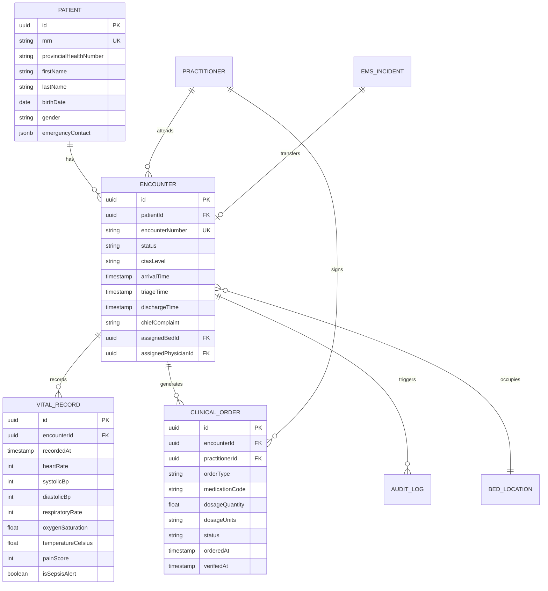

# CareDroid — Data Architecture & Persistence Specification

**Document Version:** 2.2.0  
**Status:** Living Data Architecture Specification  
**Lead Authors:** Principal Data Architect, Senior Backend Lead  
**Databases:** PostgreSQL 16+ (Production), SQLite 3.40+ (Local Dev / Edge Runtime), Redis 7.x  

---

## 1. Relational Entity Relationship Topology

CareDroid models the clinical acute care journey through normalized, relational entity tables managed via TypeORM:



---

## 2. Environment Parity & Migration Policy

1. **Development Environment:** SQLite with TypeORM `synchronize: true` for zero-friction local developer testing.
2. **Production Environment:** PostgreSQL 16 with multi-AZ replication.
3. **Migration Verification Gate:**
   - Any modification to a TypeORM entity requires running:
     ```bash
     npm run db:migration -- <PascalCaseName>
     ```
   - Automated CI executes `npm run db:verify`, booting a throwaway Docker Postgres container, executing the complete migration chain, and failing if the schema differs from TypeORM entities by even a single column or constraint.

---

