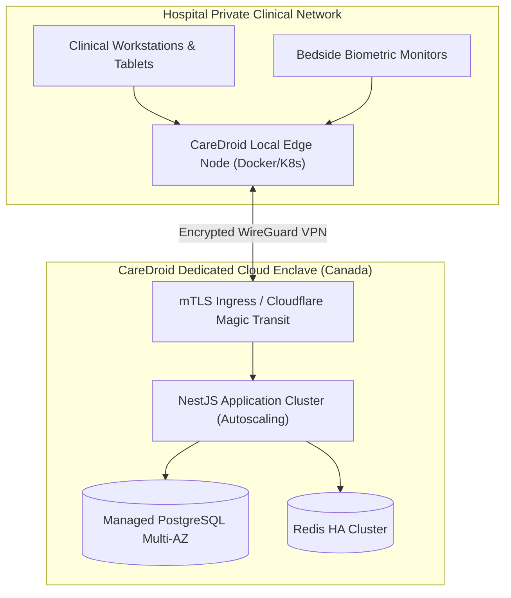

# CareDroid — Deployment & Infrastructure Architecture

**Document Version:** 2.2.0  
**Status:** Living Infrastructure Specification  
**Lead Authors:** DevSecOps Lead, Principal Systems Engineer  
**Platforms:** Kubernetes / Docker / AWS / Azure / On-Premise Enclave  

---

## 1. Multi-Enclave Deployment Architecture

CareDroid supports three deployment topologies to accommodate strict hospital health-data regulations:
1. **Hospital On-Premise Air-Gapped Enclave:** Runs inside the hospital physical datacenter with zero external internet dependencies; utilizes local models and offline caching.
2. **Dedicated Cloud Enclave (AWS Canada / Azure Canada Central):** Single-tenant, isolated VPC meeting Canadian PIPEDA and provincial residency requirements.
3. **Hybrid Edge-Cloud:** Central multi-tenant analytics cloud with local micro-gateways running at each hospital facility for low-latency bedside telemetry.

---

## 2. Infrastructure as Code & Environment Variables

- **Environment Separation:** `development`, `staging`, `production`.
- **Secret Zero Policy:** No production passwords, private keys, or API tokens exist in repositories or build images. Secrets are dynamically injected via HashiCorp Vault or AWS Secrets Manager at pod startup.
- **Health Probing:** Liveness probe `/api/health/live` (checks basic process responsiveness) and Readiness probe `/api/health/ready` (validates database connection pool and Redis reachability).

---

