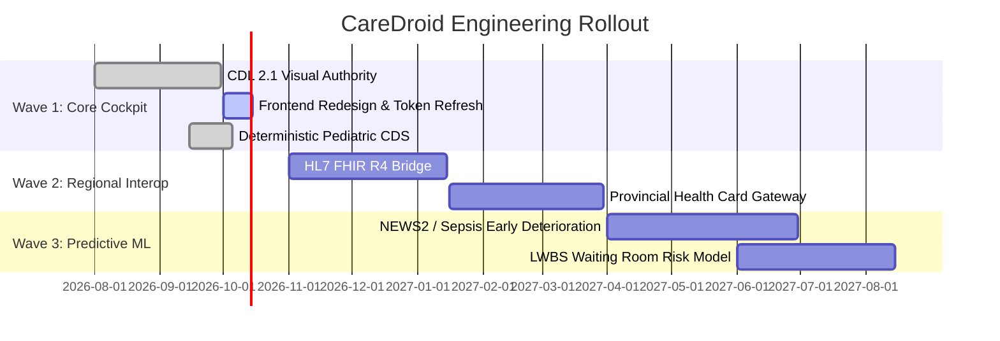

# CareDroid — Master Implementation & Rollout Plan

**Document Version:** 2.2.0  
**Status:** Living Engineering Plan  
**Lead Authors:** Technical Program Manager, Lead Enterprise Architect  

---

## 1. Phased Engineering Execution

---

## 2. Resource & Environment Readiness

- Continuous integration verification via Lefthook and GitHub Actions (`.github/workflows/verify.yml`).
- Staging environment running Postgres on AWS Canada Central with synthetic patient data generator.
- Nightly regression suite running `npm run verify:full` and `npm run db:verify`.

---

