# CareDroid — Medical IoT & Device Abstraction Architecture

**Document Version:** 2.2.0  
**Status:** Living IoT Specification  
**Lead Authors:** Principal Embedded Systems Architect, Healthcare Informatics Engineer  
**Standards:** IEEE 11073 (MDC), MQTT 5.0, TLS 1.3  

---

## 1. Device Abstraction Layer (DAL)

CareDroid interfaces with hospital biometric devices and telemetry monitors through an extensible **Device Abstraction Layer (DAL)**. The platform abstracts proprietary monitor protocols into standardized IEEE 11073 / HL7 FHIR Observation streams:

```mermaid
flowchart LR
    subgraph Hardware["Clinical Edge Hardware"]
        Monitor["Bedside Vital Monitor (Philips / GE / Mindray)"]
        SmartPump["Smart Infusion Pump (Baxter / B. Braun)"]
        PulseOx["Wearable Pulse Oximeter & ECG Patch"]
        Stretcher["Smart Stretcher / Weight Scale"]
    end

    subgraph EdgeGateway["CareDroid Clinical Edge Gateway"]
        ProtocolAdapter["Protocol Normalizer (IEEE 11073 / Serial / Bluetooth LE)"]
        LocalFilter["Sampling Filter & High-Frequency Noise Rejection"]
        EdgeBuffer["Local SQLite / LevelDB Resilient Circular Buffer"]
    end

    subgraph CoreCloud["CareDroid Core Operations"]
        MqttBroker["MQTT / WebSocket Secure Ingestion Broker"]
        StreamEngine["Streaming Analytics & Deterioration Detector"]
        WhiteboardView["Active Whiteboard Vitals Tile"]
    end

    Hardware --> ProtocolAdapter
    ProtocolAdapter --> LocalFilter
    LocalFilter --> EdgeBuffer
    EdgeBuffer -->|mTLS MQTT 5.0| MqttBroker
    MqttBroker --> StreamEngine
    StreamEngine --> WhiteboardView
```

---

## 2. Supported Telemetry Streams & Sampling Rates

| Device Class | Physiological Parameter | Standard Sampling Rate | Alert Threshold Trigger |
| :--- | :--- | :--- | :--- |
| **Multiparameter Monitor** | Heart Rate (ECG) | 1 Hz | HR > 130 or < 40 bpm |
| **Multiparameter Monitor** | Continuous SpO2 | 0.5 Hz | SpO2 < 90% sustained > 15s |
| **Non-Invasive Blood Pressure** | Systolic / Diastolic BP | On Cycle (5–15 min) | SBP < 90 or > 180 mmHg |
| **Smart Infusion Pump** | Infusion Rate (mL/hr) | Event-driven | Occlusion or air-in-line alarm |
| **Smart Stretcher** | Continuous Patient Weight | On bed tare / entry | Weight drop or sudden patient exit (Fall Risk) |

---

## 3. Edge Buffering & Offline Resiliency

If the hospital local network or core cloud connectivity is degraded:
1. The Clinical Edge Gateway continues buffering high-frequency biometric streams locally in a flash-backed circular buffer (minimum 72-hour capacity).
2. The Bedside / Tablet Console continues rendering local live waveforms directly from the gateway via zero-dependency local WebSockets.
3. Upon network restoration, the gateway executes a rate-limited burst synchronization, ensuring zero gaps in the patient's continuous longitudinal chart.

---

