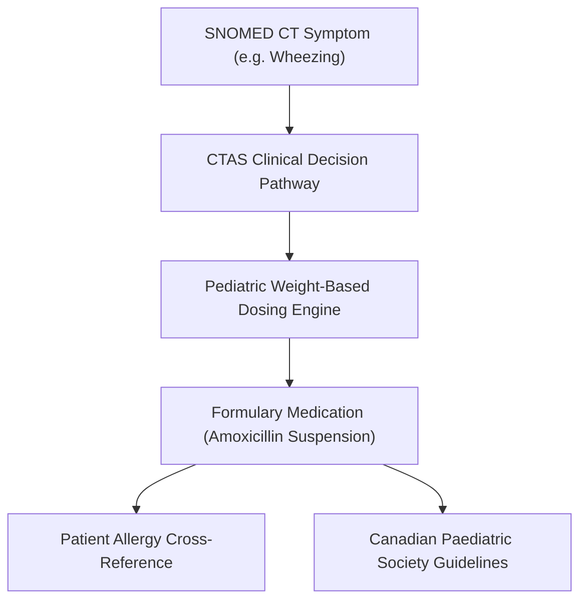

# CareDroid — Clinical Knowledge Architecture & Evidence Graph

**Document Version:** 2.2.0  
**Status:** Living Knowledge Architecture Specification  
**Lead Authors:** Medical Informatics Director, Knowledge Graph Engineer  

---

## 1. Unified Application Knowledge Graph (UAKG)

CareDroid maintains a high-fidelity **Clinical Knowledge Graph** that binds medical terminologies, dosing guidelines, clinical pathways, and local hospital formularies:

---

## 2. Evidence Grounding & Living Clinical Registry

1. **Deterministic Rules Engine:** Translates published clinical guidelines (CTAS, PERC, Wells, GCS) into strictly typed code assertions with unit test validation.
2. **Periodic Guideline Reconciliation:** Any updates to national or hospital clinical guidelines trigger a structured review workflow and versioned entity updates.
3. **Citation Tracing:** Every calculator output and CDS suggestion embeds a verified DOI or PubMed citation accessible to the clinician.

---

