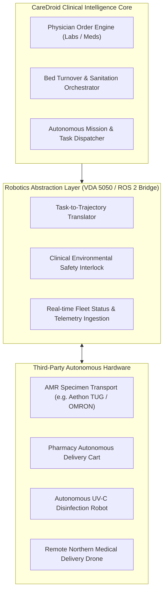

# CareDroid — Robotics & Autonomous Systems Integration Architecture

**Document Version:** 2.2.0  
**Status:** Living Robotics & Mission Integration Specification  
**Lead Authors:** Principal Autonomous Systems Architect, Enterprise Integration Lead  
**Standards:** ROS 2 (Humble/Iron), VDA 5050 (Fleet Interface), DDS (Data Distribution Service)  

---

## 1. Hardware Abstraction Mandate

CareDroid is an intelligence, orchestration, and clinical workflow software platform. **CareDroid does NOT manufacture robotics hardware.** 

Instead, CareDroid provides a standardized **Robotics & Autonomous System Abstraction Layer (RASAL)** that integrates with third-party autonomous mobile robots (AMRs), automated guided vehicles (AGVs), automated medication dispensing cabinets, and medical transport drones.

---

## 2. Supported Autonomous Operational Missions

| Mission Class | Triggering Clinical Event | Autonomous Hardware Action | Safety Interlock / Verification |
| :--- | :--- | :--- | :--- |
| **Stat Blood Specimen Transport** | Physician signs Stat Troponin order on Whiteboard | AMR navigates to Pod A Nurse Station, unlocks secure pneumatic drawer, transports to Central Lab | RFID badge tap required by receiving lab technician to open compartment |
| **Emergency Drug Cart Restock** | Triage nurse logs high-volume surge consumption | Automated pharmacy cart delivers pediatric emergency dosing kits to Resuscitation Bay 1 | Dual RN biometric sign-off to access controlled narcotics |
| **Rapid Bed Decontamination** | Patient discharged from Bed 7 (Infection Isolation) | Autonomous UV-C robot navigates to Bed 7, verifies zero human occupancy via LIDAR/Thermal, runs 8-min UV cycle | Motion sensor instantly cuts UV-C if human enters room boundary |
| **Remote Northern Clinic Resupply** | Severe trauma arrival in remote satellite clinic | Autonomous medical drone delivers O-negative packed red blood cells (PRBCs) | Real-time GPS flight path and temperature-logged cold-chain telemetry |

---

## 3. Communication Protocols & VDA 5050 Standard

All autonomous fleet communication strictly follows the open **VDA 5050 AGV/AMR Interface Specification**:
- **Topics:**
  - `uagv/v2/caredroid/order`: Dispatches order ID, target clinical node, and priority level.
  - `uagv/v2/caredroid/state`: Ingests robot position (x, y, floor), battery level, payload status, and error states.
  - `uagv/v2/caredroid/instantActions`: Allows emergency freeze/abort commands during Code Blue or hospital fire evacuation.
- **Fail-Safe Principle:** If wireless network connectivity to an AMR drops for >3.0 seconds, the robot must immediately pause in place, engage mechanical brakes, and await manual clinical override.

---

