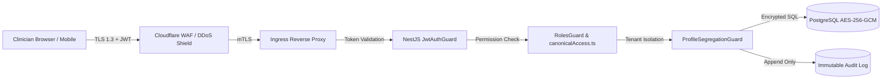

# CareDroid — Security Architecture & Threat Model

**Document Version:** 2.2.0  
**Status:** Living Security Specification  
**Lead Authors:** Security Architect, DevSecOps Lead, Chief Technology Officer  
**Compliance Standards:** PIPEDA (Canada), PHIPA (Ontario), HIPAA (USA), SOC 2 Type II

---

## 1. Zero Trust Security Architecture

CareDroid enforces a strict **Zero Trust** security model: every request, actor, device, and service invocation must be explicitly authenticated, authorized, and logged regardless of whether it originates within or outside the hospital network boundary.



---

## 2. Authentication, Authorization & Session Lifecycle

### 2.1 Authentication & Tokens

- **Stateless Bearer Tokens:** Authentication issues short-lived JWT access tokens (15-minute validity) signed using RS256 asymmetric keys.
- **Refresh Token Rotation:** Refresh tokens (8-hour maximum lifetime) are stored in secure, `httpOnly`, `SameSite=Strict` cookies. Any detected token reuse immediately revokes the entire session chain.
- **Session Expiry & Inactivity Timeout:** Workstation sessions lock automatically after 15 minutes of inactivity in clinical areas (5 minutes in public reception kiosks).

### 2.2 Role-Based & Attribute-Based Access Control (RBAC/ABAC)

- Access permissions are derived exclusively through `src/lib/users/canonicalAccess.ts`. Adding secondary or ad-hoc role systems is prohibited.
- Segregation policies enforce multi-tenant isolation by tenant ID, facility ID, and assigned clinical unit/pod.

---

## 3. Protected Health Information (PHI) Protection & Privacy

### 3.1 Non-Negotiable PHI Rules

- **Zero PHI in Logs:** Application logs must record operational metadata only (e.g. `event=ORDER_PLACED, durationMs=34, statusCode=200`). Recording patient names, health card numbers, diagnoses, or notes in logs is strictly forbidden.
- **Client-Side Obfuscation:** MRNs and patient names in public display modes (e.g. wallboards, kiosk waiting list) are automatically masked to initials and partial identifiers (e.g. `J. D. - Bed 4`).
- **Synthetic Data for Dev & Test:** Local development, test suites, and staging environments use 100% synthetically generated data. Real patient records are never replicated outside production enclave boundaries.

### 3.2 Cryptographic Controls

- **In-Transit:** TLS 1.3 enforced across all web, API, and WebSocket channels with strict cipher suite selection (`TLS_AES_256_GCM_SHA384`).
- **At-Rest:** Database storage volumes, table spaces, backups, and Redis caches use AES-256-GCM encryption.

---

## 4. Cryptographic Audit Trail

Every clinical action is permanently committed to an append-only audit table:

```typescript
interface ImmutableAuditEvent {
  id: string; // UUIDv4
  timestamp: string; // ISO 8601 UTC
  userId: string; // Authenticated Practitioner ID
  roleId: string; // Assigned Clinical Role Profile
  actionType: string; // TRIAGE_OVERRIDE, ORDER_SIGN, DISPOSITION_CHANGE
  patientId: string; // Anonymized internal encounter ID
  priorState: string; // JSON delta before mutation
  newState: string; // JSON delta after mutation
  reasonCode?: string; // Required justification for clinical overrides
  clientIpHash: string; // One-way salted hash of client network IP
  digitalSignature: string; // HMAC-SHA256 signature chain of prior event hash + current
}
```

---
