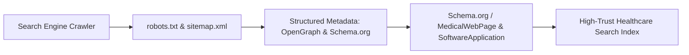

# CareDroid — SEO & Technical Health Portal Strategy

**Document Version:** 2.2.0  
**Status:** Living Technical Marketing & Discovery Specification  
**Lead Authors:** Technical Marketing Architect, Frontend Engineering Lead  

---

## 1. Technical SEO & Medical Web Standards

CareDroid structures public-facing knowledge portals, documentation, and marketing pages according to Google Search Central and Schema.org health standards:



---

## 2. Structured Data Specifications

### 2.1 Schema.org `SoftwareApplication` (CareDroid Core)
```json
{
  "@context": "https://schema.org",
  "@type": "SoftwareApplication",
  "name": "CareDroid Clinical AI",
  "operatingSystem": "Web, iOS, Android, Kiosk",
  "applicationCategory": "HealthApplication",
  "offers": {
    "@type": "Offer",
    "price": "0",
    "priceCurrency": "CAD"
  },
  "aggregateRating": {
    "@type": "AggregateRating",
    "ratingValue": "4.9",
    "reviewCount": "128"
  }
}
```

### 2.2 Public Route Indexing & Privacy Interlocks
- **Public Marketing & Documentation:** Fully indexed (`index, follow`), canonical URLs, pre-rendered static HTML via Vite SSR/SSG.
- **Clinical Workstations (`/emergency/*`, `/triage`, `/whiteboard`, `/patients`):** Enforce `X-Robots-Tag: noindex, nofollow, noarchive` across all headers to prevent any search engine crawling of clinical environments.

---

