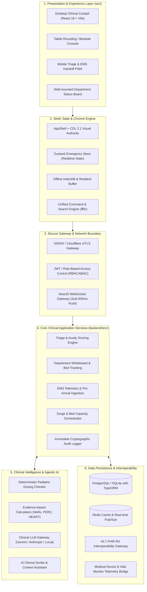
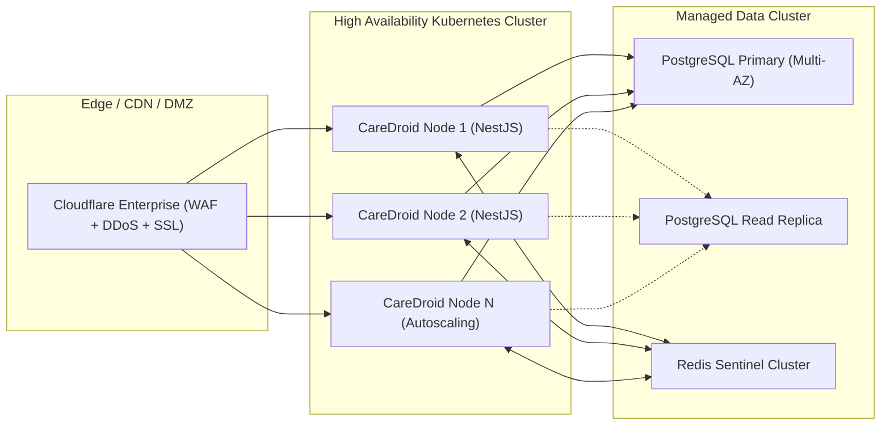

# CareDroid — System Architecture Document

**Document Version:** 2.2.0  
**Status:** Living System Architecture Specification  
**Lead Authors:** Principal Enterprise Architect, Chief AI Architect, Healthcare Systems Engineer  

---

## 1. Enterprise Architecture Overview

CareDroid is architected as a modular, high-reliability healthcare operations and clinical intelligence system. The system enforces strict architectural isolation between presentation (`src/`), backend micro-services (`backend/src/`), and external healthcare interoperability interfaces.

---

## 2. Layer-by-Layer Architectural Details

### 2.1 Layer 1: Experience & Presentation (`src/`)
- **Technology:** React 18, TypeScript 5, Vite, CSS Modules with CareDroid Design Language (CDL v2.1).
- **Core Invariant:** `src/` must **NEVER** import from `backend/src/`. Communication is exclusively over HTTP/REST and WebSockets, strictly verified by `npm run architecture:check`.
- **Display Modes:** Adaptive layout profiles automatically detect screen form factor:
  - `desktop-cockpit` (1440px+): Full multi-column view with live operational metrics rail.
  - `compact-workstation` (1024px–1280px): Collapsed navigation rail, optimized card grids.
  - `kiosk-simple-fast` (Reception / Triage Kiosk): Single-purpose high-speed intake, eliminating stacked chrome.

### 2.2 Layer 2: Real-time State & Shell Management
- **Emergency Store:** Powered by Zustand (`src/store/emergencyStore.ts`), maintaining reactive in-memory state for active encounters, beds, inbound ambulances, and department alarms.
- **WebSocket Protocol:** Listens on persistent bi-directional channel (`emergencyOsApi`), receiving delta updates:
  - `PATIENT_ARRIVED`, `VITALS_UPDATED`, `ACUITY_ASSIGNED`, `BED_TRANSFERRED`, `ORDER_PLACED`, `SEPSIS_ALERT`.
- **Local Resilience:** Buffered offline state commits to IndexedDB when network reachability drops, playing back queued mutations upon reconnection.

### 2.3 Layer 3: Backend Services (`backend/src/`)
- **Technology:** NestJS, TypeScript, TypeORM.
- **Modularity:** Isolated feature modules (`TriageModule`, `SurveillanceModule`, `UserProfileModule`, `CapacityModule`, `AuditModule`).
- **Security & Authorization:** Every API route is guarded by `@UseGuards(RolesGuard)` and `@UseGuards(ProfileSegregationGuard)`. Dev bypasses in production are prohibited.

### 2.4 Layer 4: Clinical Intelligence & Deterministic Calculators
- **Strict Separation of Determinism vs. Heuristics:**
  - **Numeric Calculations (Pediatric Dosing, Creatinine Clearance, GCS):** 100% deterministic code paths. Zero LLM involvement.
  - **Documentation & Summarization:** Clinical Copilot assists in drafting structured H&P notes using strictly grounded patient context, requiring explicit human clinician sign-off.
- **Evidence Provenance:** Every calculator links to peer-reviewed evidence (e.g. *Stiell et al., Annals of Emergency Medicine*).

### 2.5 Layer 5: Data Persistence & Interoperability
- **Primary Relational Store:** PostgreSQL in production (SQLite for dev/test synchronization).
- **FHIR Gateway:** Translates internal encounter, patient, and observation entities into standard HL7 FHIR R4 resources (`Encounter`, `Patient`, `Observation`, `ServiceRequest`).

---

## 3. Deployment & High Availability Topology

---

## 4. Architectural Non-Negotiables & Verification Gates

1. **Zero Cross-Boundary Imports:** Enforced by `npm run architecture:check` in CI.
2. **Page Inventory Pinning:** Enforced by `src/data/pageDispositionFixture.ts` to prevent rogue page sprawl.
3. **Database Migration Verification:** `npm run db:verify` executes migrations on Docker Postgres to guarantee zero schema drift against TypeORM entity definitions.
4. **WCAG 2.2 AA Contrast Enforcement:** Automated headless contrast verification across all severity alerts and pill components.

---

