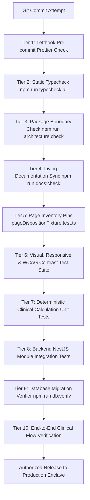

# CareDroid — Master Quality Assurance & Test Strategy

**Document Version:** 2.2.0  
**Status:** Living Engineering Test Strategy  
**Lead Authors:** QA Lead, Principal Software Engineer in Test, DevSecOps Lead

---

## 1. Quality Philosophy: Zero Tolerance for Clinical Drift

In acute emergency healthcare, software defects do not merely cause customer inconvenience; they can lead to missed clinical deterioration, toxic pediatric medication overdoses, or delayed resuscitations. CareDroid enforces a **Ten-Tier Verification Pipeline** that must pass completely before any code merges to `main`.

---

## 2. The Ten Verification Tiers

| Tier                          | Scope                                     | Command / Tool                                       | Failure Consequence         |
| :---------------------------- | :---------------------------------------- | :--------------------------------------------------- | :-------------------------- |
| **1. Pre-Commit Style**       | Staged files in `src/` and `backend/`     | `lefthook` / `npx prettier --check`                  | Commit blocked locally.     |
| **2. Full Typecheck**         | Both frontend and backend packages        | `npm run typecheck:all`                              | PR merge blocked.           |
| **3. Architecture Isolation** | `src/` must never import `backend/src/`   | `npm run architecture:check`                         | PR merge blocked.           |
| **4. Living Documentation**   | 12 snapshot files in `docs/generated/`    | `npm run docs:check`                                 | PR merge blocked.           |
| **5. Page Inventory Guard**   | Track total `.tsx` and `.css` pages       | `vitest run src/data/pageDispositionFixture.test.ts` | PR merge blocked.           |
| **6. Visual & A11y Guard**    | Viewports (320px–1440px), AA/AAA contrast | `vitest run src/styles/*.test.ts`                    | PR merge blocked.           |
| **7. Clinical Math Tests**    | Pediatric dosing, GCS, Wells, PERC        | `vitest run src/utils/clinicalMath.test.ts`          | Immediate deployment block. |
| **8. Backend Integration**    | Modules, RBAC guards, TypeORM queries     | `npm --prefix backend test`                          | PR merge blocked.           |
| **9. DB Migration Chain**     | Multi-step migrations on Docker Postgres  | `npm run db:verify`                                  | PR merge blocked.           |
| **10. Full Verification**     | Unified verification suite                | `npm run verify` / `npm run verify:full`             | Release gate.               |

---

## 3. Pediatric & Clinical Calculation Testing Standards

Clinical calculations are subjected to property-based boundary testing:

- **Zero Weight & Negative Weight:** Must fail immediately with explicit validation error, preventing calculation execution.
- **Extreme Obesity:** Tests verify that weight calculations clamp strictly to adult formulary maximum ceilings.
- **Extreme Prematurity & Neonatal Ranges:** Tests verify distinct mg/kg guidelines for gestational age < 37 weeks.
- **Allergy Contraindications:** Automated assertions verify that penicillin-class selections with documented anaphylaxis trigger hard red stop banners.

---
