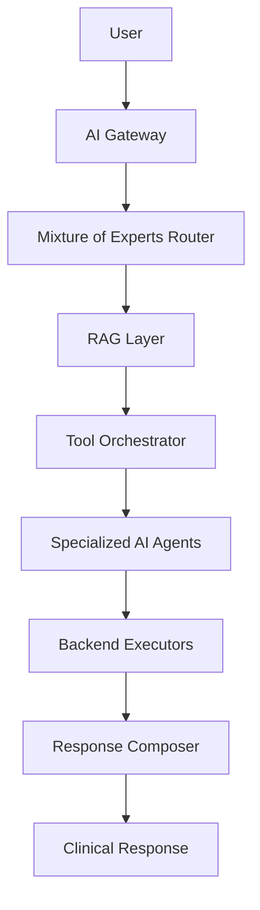
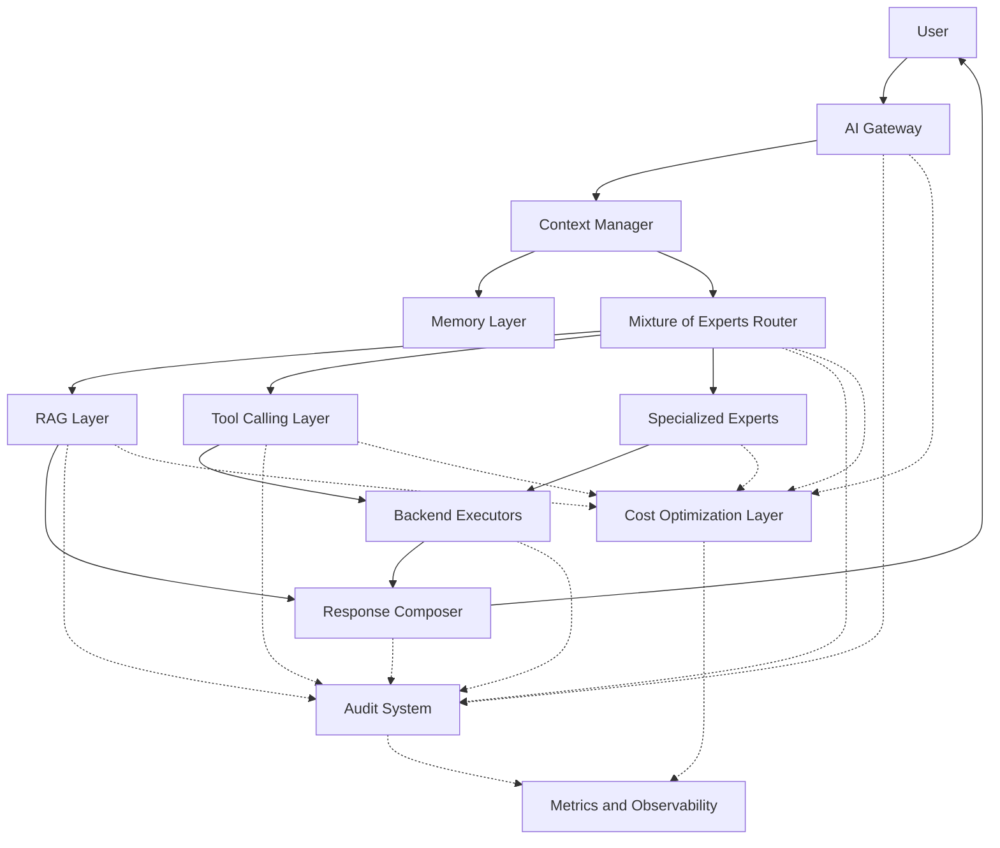
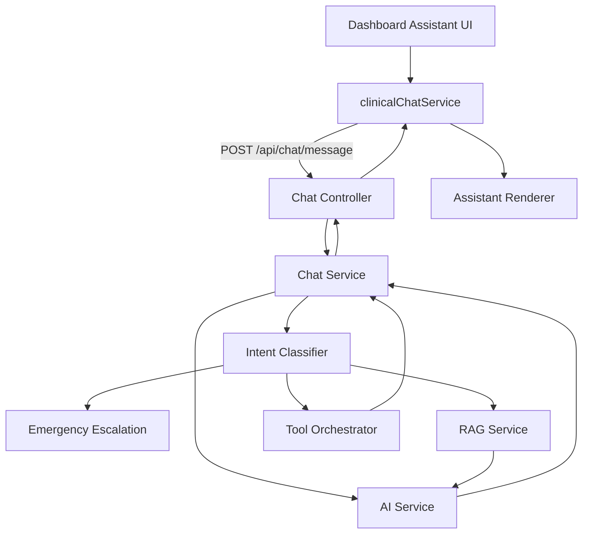

# CareDroid AI Foundation Architecture

Status: foundation architecture  
Scope: AI assistant, prompts, tool launch behavior, backend executors, chat flows, tool inventory, RAG, audit, and cost controls  
Goal: define CareDroid as a Clinical AI Operating System
Related: [CareDroid Mixture-of-Experts Routing System](./moe-routing-system.md)

## Executive Summary

CareDroid should be treated as a Clinical AI Operating System, not only a chatbot or tool catalog. The operating system model gives every clinical AI interaction the same governed path: intake, routing, context assembly, retrieval, tool orchestration, expert execution, backend execution, response composition, audit, and cost attribution.

The current product already has many of the necessary primitives. The web assistant in [src/pages/Dashboard.jsx](../src/pages/Dashboard.jsx) sends clinical chat requests through [src/services/clinicalChatService.js](../src/services/clinicalChatService.js). The backend routes those requests through [backend/src/modules/chat/chat.service.ts](../backend/src/modules/chat/chat.service.ts), which currently behaves as the practical AI gateway and router. LLM invocation, rate limits, pricing, and some usage logging live in [backend/src/modules/ai/ai.service.ts](../backend/src/modules/ai/ai.service.ts). RAG retrieval lives in [backend/src/modules/rag/rag.service.ts](../backend/src/modules/rag/rag.service.ts). Backend tool execution lives in [backend/src/modules/medical-control-plane/tool-orchestrator/tool-orchestrator.service.ts](../backend/src/modules/medical-control-plane/tool-orchestrator/tool-orchestrator.service.ts). Specialized clinical AI workflows live in [backend/src/modules/clinical-intelligence/clinical-intelligence.service.ts](../backend/src/modules/clinical-intelligence/clinical-intelligence.service.ts).

The main architectural gap is not absence of AI capability. The gap is that the foundation is implicit and spread across services. The next foundation step is to formalize the AI Gateway, Mixture of Experts Router, Context Manager, Memory Layer, RAG Layer, Tool Calling Layer, Specialized Experts, Response Composer, Audit System, and Cost Optimization Layer as named contracts.

## Target Operating Model

CareDroid's AI operating path should use this logical flow:



The production architecture should also include cross-cutting control planes:



This diagram intentionally separates the user-facing logical flow from the control planes. Audit and cost controls should not be optional plugins; they should observe and govern every AI run, retrieval, tool call, and composed response.

## Current Architecture Snapshot

The current assistant flow is:



Current behavior by area:

- The assistant UI is centered on [src/pages/Dashboard.jsx](../src/pages/Dashboard.jsx). It renders messages, confidence badges, citations, visualizations, execution cards, and operational result cards.
- Chat requests use `POST /api/chat/message` through [src/services/clinicalChatService.js](../src/services/clinicalChatService.js).
- [backend/src/modules/chat/chat.service.ts](../backend/src/modules/chat/chat.service.ts) performs intent classification, emergency detection, routing to clinical tools, medical reference RAG, and general LLM fallback.
- [backend/src/modules/ai/ai.service.ts](../backend/src/modules/ai/ai.service.ts) invokes OpenAI, applies subscription rate limits, calculates token costs, records metrics, and persists some `ai_queries`.
- [backend/src/modules/rag/rag.service.ts](../backend/src/modules/rag/rag.service.ts) performs embedding, vector retrieval, optional reranking, source extraction, confidence calculation, retrieval caching, and document ingestion.
- [backend/src/modules/medical-control-plane/tool-orchestrator/tool-orchestrator.service.ts](../backend/src/modules/medical-control-plane/tool-orchestrator/tool-orchestrator.service.ts) validates and executes registered clinical tools.
- [backend/src/modules/ai/foundation](../backend/src/modules/ai/foundation) now contains first-pass gateway, routing, context, and response-composition services used by chat flows.
- [src/navigation/registryToolLaunch.js](../src/navigation/registryToolLaunch.js) centralizes how tool IDs launch as calculator routes, dedicated tool pages, chat-assisted flows, or fallbacks.
- [src/data/toolInventory.js](../src/data/toolInventory.js) normalizes the frontend inventory across tool pages, chat-assisted tools, backend-backed tools, clinical pages, platform tools, and unsupported planned tools.

## Tool Inventory Reality

CareDroid has a broad user-facing tool inventory, but a much smaller backend execution surface.

Confirmed backend POST executors:

- `sofa-calculator`
- `drug-interactions`
- `lab-interpreter`

Those are registered by [backend/src/modules/medical-control-plane/tool-orchestrator/tool-orchestrator.service.ts](../backend/src/modules/medical-control-plane/tool-orchestrator/tool-orchestrator.service.ts) and declared in [backend/src/modules/medical-control-plane/tool-orchestrator/tool-orchestrator.registry.ts](../backend/src/modules/medical-control-plane/tool-orchestrator/tool-orchestrator.registry.ts).

Everything else should be documented as one of these categories until implemented:

- Frontend-only calculator or workflow.
- Chat-assisted tool that seeds or routes through Assistant.
- Clinical intelligence page backed by dedicated clinical intelligence APIs.
- Platform, fleet, IoT, or hospital operations surface.
- Unsupported or planned server executor.

The foundation architecture should avoid implying that every catalog item has a server-side executor today.

## Requested Layer Definitions

### 1. AI Gateway

Purpose: provide the single governed entry point for all CareDroid AI interactions.

Current state:

- `POST /api/chat/message` is the primary assistant entry.
- [backend/src/modules/chat/chat.service.ts](../backend/src/modules/chat/chat.service.ts) acts as the practical gateway today.
- [backend/src/modules/ai/ai.controller.ts](../backend/src/modules/ai/ai.controller.ts) exposes lower-level AI functions such as structured JSON generation and usage.
- [backend/src/modules/ai/foundation/ai-gateway.service.ts](../backend/src/modules/ai/foundation/ai-gateway.service.ts) creates a first-pass `AiRunEnvelope` for chat requests with `runId`, capability, user, tool and feature hints, PHI flags, human-review default, and trace metadata.
- The gateway scaffold is still chat-scoped; other AI-capable surfaces should be moved through the same envelope contract.

Target responsibilities:

- Normalize every request into an `AiRunEnvelope`.
- Assign `runId`, `conversationId`, `workspaceId`, `organizationId`, `userId`, and `capabilityId`.
- Enforce auth, permissions, subscription limits, PHI policy, tenant scope, and emergency policy before model execution.
- Route all AI-capable surfaces through one governed contract: assistant chat, clinical intelligence pages, tool launch flows, RAG queries, and future agents.
- Emit audit, metrics, and cost events for every accepted, rejected, failed, and completed run.

Target contract:

```ts
type AiRunEnvelope = {
  runId: string;
  capabilityId: string;
  userId: string;
  workspaceId?: string;
  organizationId?: string;
  conversationId?: string;
  input: {
    message?: string;
    structuredPayload?: unknown;
    toolHint?: string;
    featureHint?: string;
  };
  policy: {
    phiAccessed: boolean;
    requiresHumanReview: boolean;
    allowedTools: string[];
    maxCostUsd?: number;
  };
  trace: {
    sourceSurface: string;
    clientRequestId?: string;
    startedAt: string;
  };
};
```

### 2. Routing Engine

Purpose: decide which expert, retrieval path, deterministic executor, or fallback path should handle the run.

Current state:

- [backend/src/modules/medical-control-plane/intent-classifier/intent-classifier.service.ts](../backend/src/modules/medical-control-plane/intent-classifier/intent-classifier.service.ts) classifies clinical intent.
- [backend/src/modules/chat/chat.service.ts](../backend/src/modules/chat/chat.service.ts) performs routing decisions after classification.
- Emergency escalation is handled before normal routing.
- [backend/src/modules/ai/foundation/ai-routing-engine.service.ts](../backend/src/modules/ai/foundation/ai-routing-engine.service.ts) creates an initial `ExpertRoutePlan` with selected expert, confidence, retrieval policy, tool plan, cost plan, and safety plan.
- Detailed multi-expert scoring and lightweight-first selection are defined in [CareDroid Mixture-of-Experts Routing System](./moe-routing-system.md).

Target responsibilities:

- Become a formal Mixture of Experts Router.
- Use deterministic routing first for emergency, exact tool IDs, permissions, and known backend executors.
- Use model-assisted routing only for ambiguous queries.
- Return a route plan with selected expert, required context, allowed tools, retrieval policy, cost estimate, and review requirements.
- Record rejected routes and low-confidence routes for audit and tuning.

Target route plan:

```ts
type ExpertRoutePlan = {
  runId: string;
  primaryIntent: string;
  selectedExpert: string;
  confidence: number;
  retrievalPolicy: "none" | "reference" | "guideline" | "patient_scoped";
  toolPlan: {
    allowedToolIds: string[];
    requiredHumanConfirmation: boolean;
  };
  costPlan: {
    preferredModel: string;
    maxTokens: number;
    allowFallback: boolean;
  };
  safetyPlan: {
    emergencyEscalation: boolean;
    requiresHumanReview: boolean;
    blockedActions: string[];
  };
};
```

### 3. Context Manager

Purpose: assemble the minimum necessary context for the route while respecting clinical safety, PHI, and tenant boundaries.

Current state:

- Context is passed ad hoc through `ChatService`, `AIService`, clinical intelligence DTOs, and frontend state.
- `ConversationContext` stores web chat state in memory.
- Some clinical intelligence workflows include structured DTOs and request metadata.
- [backend/src/modules/ai/foundation/ai-context-manager.service.ts](../backend/src/modules/ai/foundation/ai-context-manager.service.ts) builds a request-scoped `AiContextPacket` and compact model context from the run envelope and route plan.
- The current context packet records memory persistence as planned; it does not yet implement governed session, patient, or workspace memory.

Target responsibilities:

- Build a scoped context packet for each run.
- Separate user prompt, patient context, retrieved evidence, tool outputs, system policy, and memory snippets.
- Apply context budget limits before model calls.
- Redact or exclude PHI when the selected route does not require it.
- Attach source provenance and freshness metadata.

Context rules:

- No raw chart, transcript, or prompt should move into a model call unless the route plan requires it.
- Retrieved sources should be represented as cited chunks with IDs, scores, corpus version, and tenant access scope.
- Tool outputs should be normalized before entering the final response composer.

### 4. Memory Layer

Purpose: provide governed short-term and long-term memory for clinical workflows.

Current state:

- Memory is mostly frontend-local or request-scoped.
- `ConversationContext` keeps active messages in memory.
- Chat persistence is not a strong backend capability today.
- [backend/src/modules/ai/entities/ai-query.entity.ts](../backend/src/modules/ai/entities/ai-query.entity.ts) records prompt/response usage data, but it should not be treated as clinical memory.

Target responsibilities:

- Short-term memory: conversation turns, selected tool, current run state, pending confirmation, citations, and intermediate tool outputs.
- Long-term memory: user preferences, workspace policies, accepted clinical summaries, reusable non-PHI facts, and patient-scoped summaries only when explicitly allowed.
- Retrieval memory: embeddings, cached retrievals, guideline answer cache, and source freshness metadata.
- Safety memory: denied actions, human review status, emergency escalations, and audit trace references.

Memory guardrails:

- Do not reuse PHI-heavy prompts across users or tenants.
- Do not use `ai_queries` as a general memory store.
- Persist clinical memory only through explicit clinical entities with retention, deletion, and audit policy.
- Mark every memory read and write with `runId`, `scope`, `retention`, and `phiAccessed`.

### 5. RAG Layer

Purpose: provide evidence-grounded retrieval for medical reference, guideline, protocol, and patient-scoped knowledge.

Current state:

- [backend/src/modules/rag/rag.service.ts](../backend/src/modules/rag/rag.service.ts) orchestrates embeddings, Pinecone retrieval, optional Cohere reranking, source extraction, confidence calculation, retrieval caching, and ingestion.
- [backend/src/modules/ai/prompts/clinical-query.prompt.ts](../backend/src/modules/ai/prompts/clinical-query.prompt.ts) formats retrieved clinical context and citations into prompts.
- Guideline RAG is also used by [backend/src/modules/clinical-intelligence/clinical-intelligence.service.ts](../backend/src/modules/clinical-intelligence/clinical-intelligence.service.ts).

Target responsibilities:

- Split retrieval into document classes: guideline, protocol, drug reference, calculator documentation, patient-scoped context, and operational knowledge.
- Enforce source access control before and after retrieval.
- Require source IDs, citation IDs, corpus version, freshness date, relevance score, and retrieval latency.
- Support exact retrieval cache, embedding cache, in-flight coalescing, and optional semantic answer cache with strict safety thresholds.
- Reject unsupported claims when retrieval confidence is low.

RAG output contract:

```ts
type GroundingContext = {
  runId: string;
  retrievalPolicy: string;
  chunks: Array<{
    id: string;
    text: string;
    score: number;
    sourceId: string;
    sourceTitle: string;
    corpusVersion: number;
  }>;
  citations: Array<{
    citationId: string;
    sourceId: string;
    title: string;
    url?: string;
    freshnessDate?: string;
  }>;
  confidence: number;
  limitations: string[];
};
```

### 6. Tool-Calling Layer

Purpose: expose clinical tools through safe, validated, auditable execution contracts.

Current state:

- [backend/src/modules/medical-control-plane/tool-orchestrator/tool-orchestrator.service.ts](../backend/src/modules/medical-control-plane/tool-orchestrator/tool-orchestrator.service.ts) registers and executes `sofa-calculator`, `drug-interactions`, and `lab-interpreter`.
- [backend/src/modules/medical-control-plane/tool-orchestrator/tool-orchestrator.registry.ts](../backend/src/modules/medical-control-plane/tool-orchestrator/tool-orchestrator.registry.ts) documents canonical IDs, aliases, parameter contracts, and unsupported NLU IDs.
- [src/components/chat/ChatExecutionCard.jsx](../src/components/chat/ChatExecutionCard.jsx) supports validate, confirm, and execute behavior in the assistant.
- [src/services/clinicalOrchestratorApi.js](../src/services/clinicalOrchestratorApi.js) blocks unsupported executor calls client-side before making network requests.

Target responsibilities:

- Maintain a canonical server registry for executable tools.
- Generate frontend capability metadata from server contracts instead of duplicating capability truth.
- Require validation before execution for clinical tools.
- Require human confirmation for sensitive or side-effecting operations.
- Send tool results back into the response composer, not directly to the user without safety framing.
- Support deterministic tools, model-assisted tools, retrieval-assisted tools, and external system tools as separate execution classes.

Execution classes:

- Deterministic executor: formulaic calculators and protocol calculators.
- AI-assisted executor: tools that call a model for interpretation, such as lab interpretation or drug interaction explanation.
- Retrieval-assisted executor: tools that require guideline or source retrieval.
- External executor: future integrations that read or write external systems, requiring stronger confirmation and audit.

### 7. Specialized Experts

Purpose: give each major clinical capability a named expert contract with inputs, outputs, safety policy, and audit metadata.

Current state:

- There is no general expert-agent runtime.
- Specialized behavior exists as services, prompts, DTOs, and clinical intelligence workflows.
- [backend/src/modules/clinical-intelligence/clinical-intelligence.service.ts](../backend/src/modules/clinical-intelligence/clinical-intelligence.service.ts) already models capabilities with `runId`, `capabilityId`, contract versions, safety warnings, explainability, and audit events.
- [backend/src/modules/ai/foundation/ai-routing-engine.service.ts](../backend/src/modules/ai/foundation/ai-routing-engine.service.ts) now maps classified intents to named expert identifiers, but those experts are not yet independently executable agents.

Target expert families:

- Triage and escalation expert: emergency detection, red flags, escalation routing.
- Guideline expert: citation-bound medical reference and protocols.
- Medication expert: drug interactions, contraindications, dose safety, renal and hepatic context.
- Lab expert: abnormal values, trends, critical values, and follow-up suggestions.
- Calculator expert: deterministic calculator selection, input extraction, and result explanation.
- Documentation expert: Ambient Scribe and clinician-reviewed notes.
- Differential expert: structured differential generation with uncertainty and calculator suggestions.
- Timeline expert: longitudinal patient timeline and trend summarization.
- Order set expert: protocol-bound order bundle suggestions with human review.
- Operations expert: hospital, fleet, resource, and workflow intelligence.

Expert contract:

```ts
type ClinicalExpert = {
  capabilityId: string;
  contractVersion: string;
  inputSchema: unknown;
  outputSchema: unknown;
  allowedTools: string[];
  retrievalPolicy: string;
  safetyPolicy: {
    requiresHumanReview: boolean;
    blockedActions: string[];
    emergencyAware: boolean;
  };
};
```

### 8. Response Composer

Purpose: produce one clinician-safe response from model output, retrieved evidence, tool results, safety state, and audit/cost metadata.

Current state:

- Response composition is partially scaffolded.
- [backend/src/modules/chat/chat.service.ts](../backend/src/modules/chat/chat.service.ts) appends citations, disclaimers, confidence, suggestions, and tool results.
- [backend/src/modules/ai/foundation/ai-response-composer.service.ts](../backend/src/modules/ai/foundation/ai-response-composer.service.ts) attaches `aiFoundation`, context, and safety metadata to chat responses.
- [src/services/clinicalChatService.js](../src/services/clinicalChatService.js) maps API responses into assistant messages.
- [src/pages/Dashboard.jsx](../src/pages/Dashboard.jsx) renders confidence, citations, operational cards, execution cards, and visualizations.

Target responsibilities:

- Own the final response schema for all AI surfaces.
- Merge expert outputs, retrieved citations, tool outputs, safety notices, confidence, and next actions.
- Separate clinical answer, evidence, tool results, limitations, and recommended next steps.
- Prevent unsupported claims when RAG confidence or expert confidence is low.
- Add human-review wording when required.
- Attach structured metadata for frontend rendering instead of relying on string formatting.

Target response shape:

```ts
type ComposedClinicalResponse = {
  runId: string;
  response: string;
  sections: Array<{
    id: string;
    title: string;
    content: string;
  }>;
  confidence?: number;
  citations: unknown[];
  toolResults: unknown[];
  suggestions: string[];
  safety: {
    decisionSupportOnly: boolean;
    requiresHumanReview: boolean;
    warnings: string[];
    blockedActions: string[];
  };
  metadata: {
    model?: string;
    tokens?: number;
    costUsd?: number;
    route: string;
  };
};
```

### 9. Audit System

Purpose: make every AI action explainable, attributable, tamper-evident, and reviewable.

Current state:

- [backend/src/modules/audit/audit.service.ts](../backend/src/modules/audit/audit.service.ts) creates hash-chained audit entries and verifies integrity.
- [backend/src/modules/audit/entities/audit-log.entity.ts](../backend/src/modules/audit/entities/audit-log.entity.ts) supports user, workspace, organization, PHI flags, metadata, and integrity fields.
- Clinical intelligence workflows already emit strong metadata patterns: `runId`, `capabilityId`, contract version, input sizes, status, safety warnings, and PHI flags.

Target responsibilities:

- Standardize AI audit events across chat, RAG, tools, experts, response composition, and failures.
- Use `metadata`, not ad hoc `details`, as the durable AI event payload.
- Include `runId`, `capabilityId`, route plan, model, tokens, cost, source IDs, tool IDs, risk level, PHI flags, human review status, blocked actions, and final status.
- Record denied, unsupported, low-confidence, and rate-limited runs.
- Preserve hash-chain integrity while improving concurrent write safety.

Minimum audit event types:

- `ai.run.accepted`
- `ai.run.rejected`
- `ai.route.selected`
- `ai.rag.retrieved`
- `ai.tool.validated`
- `ai.tool.executed`
- `ai.expert.completed`
- `ai.response.composed`
- `ai.safety.escalated`
- `ai.cost.recorded`

### 10. Cost Optimization Layer

Purpose: control AI spend without weakening clinical safety or auditability.

Current state:

- [backend/src/modules/ai/ai.service.ts](../backend/src/modules/ai/ai.service.ts) has model pricing, rate limits, cost calculation, metrics, and some `AIQuery` persistence.
- [backend/src/modules/ai/entities/ai-query.entity.ts](../backend/src/modules/ai/entities/ai-query.entity.ts) records model, tokens, cost, latency, feature, intent, tool, and metadata.
- Frontend cost surfaces exist, but server-side cost attribution is not unified across embeddings, reranking, vector search, tool execution, clinical intelligence, and LLM calls.

Target responsibilities:

- Estimate cost before route execution.
- Choose deterministic or cached paths before paid model paths when clinically appropriate.
- Select model tier by task risk, complexity, subscription, tenant policy, and budget.
- Record cost for chat, structured JSON, tool-assisted AI, embeddings, reranking, vector DB, and external APIs.
- Enforce user, workspace, and organization budgets.
- Provide alerts, dashboards, and optimization recommendations.

Optimization rules:

- Deterministic calculators should not call LLMs for core computation.
- RAG should use exact cache, embedding cache, retrieval cache, and in-flight coalescing before paid duplicate work.
- Tool schemas and executor catalogs should be cached.
- Drug and lab AI assistance should use normalized input hashes for safe repeat-result caching.
- High-risk clinical content should prefer quality and safety over lowest cost.
- Cost controls must never bypass audit logging, permission checks, source access checks, or human review requirements.

## Current-to-Target Mapping

AI Gateway:

- Exists today as `ChatService`, chat and AI controllers, plus a first-pass `AiGatewayService` that creates chat-scoped `AiRunEnvelope` records.
- Target is to make the gateway the required entry point that normalizes all AI-capable routes into `AiRunEnvelope`.

Routing Engine:

- Exists today as `IntentClassifierService`, routing branches in `ChatService`, and a first-pass `AiRoutingEngineService`.
- Target is a full Mixture of Experts Router that scores candidates, supports multi-expert routing, and returns explicit route plans.

Context Manager:

- Exists today as scattered context passing in chat, AI service calls, RAG prompts, clinical intelligence DTOs, and a first-pass `AiContextManagerService`.
- Target is a dedicated service that builds governed context packets and applies PHI, tenant, memory, and token-budget policy.

Memory Layer:

- Exists today as frontend in-memory conversation state and usage records.
- Target is governed short-term and long-term memory with explicit retention and PHI scope.

RAG Layer:

- Exists today as `RAGService`, embeddings, Pinecone, optional reranking, retrieval cache, and prompt formatting.
- Target adds document class policy, admin ingestion control, source access checks, freshness metadata, and safer cache contracts.

Tool-Calling Layer:

- Exists today as `ToolOrchestratorService`, executor registry, frontend validate-confirm-execute cards, and client-side unsupported guards.
- Target adds generated capability contracts, more executor classes, tool result replay into the composer, and stronger human-confirmation policy.

Specialized Experts:

- Exists today as clinical intelligence workflows and prompt-driven behavior.
- Target is a named expert runtime contract across triage, guideline, medication, lab, calculator, documentation, differential, timeline, order set, and operations experts.

Response Composer:

- Exists today as logic split across `ChatService`, `AiResponseComposerService`, `clinicalChatService.js`, and frontend rendering.
- Target is a backend response composer with one structured clinical response schema across all AI surfaces.

Audit System:

- Exists today as hash-chained `AuditService` plus module-specific audit events.
- Target is a standardized AI event spine for every run and sub-step.

Cost Optimization:

- Exists today as OpenAI pricing, rate limits, metrics, and `AIQuery` usage rows.
- Target is a unified cost policy and ledger across all AI providers, retrieval, reranking, vector DB, tools, and external services.

## Prompt and Policy Architecture

Prompts should be treated as versioned clinical policies, not incidental strings.

Current prompt surfaces:

- [backend/src/modules/ai/prompts/clinical-query.prompt.ts](../backend/src/modules/ai/prompts/clinical-query.prompt.ts) builds clinical query, medical reference, drug information, protocol, citation, and confidence-disclaimer prompt fragments.
- [backend/src/modules/ai/ai.service.ts](../backend/src/modules/ai/ai.service.ts) defines the general CareDroid system prompt and tool definitions.
- Clinical intelligence workflows include service-level safety wording and deterministic summaries.

Target prompt policy:

- Every expert owns a prompt or deterministic policy version.
- Every prompt version declares allowed inputs, blocked actions, required citations, disclaimer policy, and output schema.
- Prompt versions are logged in audit metadata and cost metadata.
- Prompts should not include raw PHI unless route policy requires it.
- Clinical recommendations must identify whether they are retrieval-grounded, tool-derived, deterministic, or model-generated.

## Safety and Compliance Model

CareDroid must remain clinician-in-the-loop.

Core rules:

- AI output is decision support, not autonomous diagnosis, prescribing, documentation signing, or order placement.
- Emergency escalation must run before normal answer generation when emergency intent is detected.
- Deterministic calculator outputs must preserve formula transparency and input provenance.
- Tool execution should be validated before execution and confirmed before sensitive actions.
- RAG answers should expose citations, source confidence, source freshness, and limitations.
- Clinical intelligence outputs should preserve `runId`, `capabilityId`, contract version, safety warnings, and review requirements.
- PHI access must be explicitly marked on audit events and route plans.

Blocked actions unless a future governed integration explicitly allows them:

- Autonomous chart modification.
- Auto-signing notes.
- Placing orders without clinician review.
- Sending patient outreach without confirmation.
- Writing to external systems from chat-only drafts.
- Suppressing emergency or safety warnings to save tokens.

## Implementation Roadmap

Phase 1: Foundation contracts.

- Introduce an `AiRunEnvelope` type and use it in the chat path first.
- Add route plan output to the current intent classification path.
- Standardize audit metadata fields for chat, RAG, tool calls, AI service calls, and clinical intelligence.
- Ensure all `AIService` paths that spend model tokens record durable usage or a deliberate non-persisted reason.

Phase 2: Named gateway, router, and composer.

- Create dedicated gateway, router, context manager, and response composer services.
- Move composition logic out of `ChatService` into the response composer.
- Keep existing frontend response compatibility while adding structured response sections.
- Generate frontend executor capability metadata from backend registry snapshots.

Phase 3: Memory and RAG hardening.

- Define short-term conversation memory with retention and tenant scope.
- Add patient-scoped memory only after explicit PHI retention policy is implemented.
- Add RAG document class policy, source freshness, corpus version governance, and ingestion admin controls.
- Expand retrieval and embedding cache metrics.

Phase 4: Expert runtime.

- Convert clinical intelligence capabilities into first-class expert contracts.
- Add expert registry and route plan execution.
- Normalize expert output through the response composer.
- Add expert-level tests for safety warnings, blocked actions, and audit events.

Phase 5: Cost and observability.

- Centralize cost attribution for LLM, embeddings, reranking, vector search, AI-assisted tools, and external APIs.
- Add budget policy at user, workspace, and organization levels.
- Record exact cache hit rates and estimated cost saved.
- Align Prometheus, Datadog, and internal metrics around `runId`, `capabilityId`, `route`, and safe low-cardinality labels.

Phase 6: Executor expansion.

- Expand backend executors only where deterministic or clinically governed server execution is appropriate.
- Preserve explicit unsupported responses for planned tools.
- Use validate-confirm-execute for new high-risk executors.
- Add drift tests so frontend inventory cannot claim server execution before `registerTool()` exists.

## Architecture Principles

- One governed AI entry path for every AI-capable surface.
- Deterministic tools before models when the task is deterministic.
- Retrieval-grounded answers before unsupported clinical generation.
- Human review for diagnosis, documentation, orders, outreach, and high-risk decisions.
- Audit and cost controls at every step, not only final responses.
- Explicit capability contracts over implicit prompt behavior.
- Source provenance and confidence visible to users and machines.
- Tenant and PHI boundaries enforced before retrieval, memory, model calls, and cache reuse.

## Success Criteria

CareDroid has achieved the AI Foundation Architecture when:

- Every AI interaction has a `runId`, route plan, context packet, audit trace, and cost record.
- The assistant, clinical intelligence pages, RAG workflows, and backend tool executions share one gateway contract.
- The router can explain why it selected an expert, tool, RAG path, or fallback.
- The response composer produces consistent structured responses across chat and tool pages.
- The tool catalog clearly distinguishes server executors from chat-assisted or frontend-only tools.
- RAG answers include citations, source metadata, confidence, and limitations.
- Memory is explicit, scoped, retained by policy, and never confused with the usage ledger.
- Cost controls can estimate, enforce, and attribute spend across model, retrieval, and tool work.
- Audit logs can reconstruct the full AI run without storing unnecessary raw PHI.
