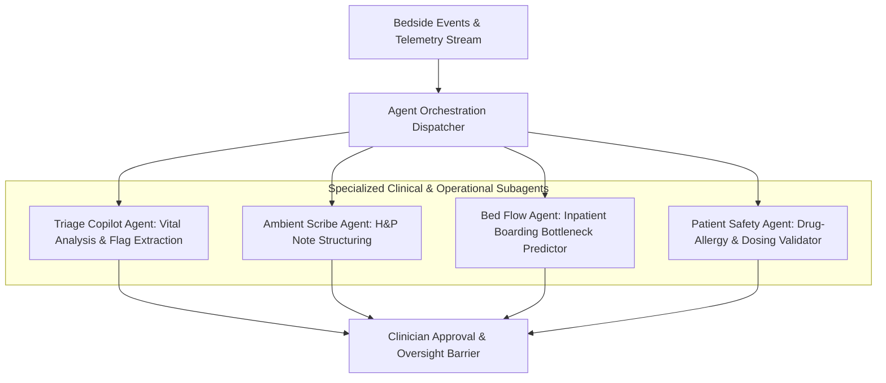

# CareDroid — Agentic AI & Autonomous Clinical Orchestration

**Document Version:** 2.2.0  
**Status:** Living Agentic Architecture Specification  
**Lead Authors:** Chief AI Architect, Principal Multi-Agent Systems Engineer  

---

## 1. Agentic Ecosystem Architecture

CareDroid utilizes specialized autonomous agents operating within bounded clinical scopes to assist frontline staff:

---

## 2. Agent Operational Boundaries & Safety Interlocks

1. **Read Authority:** Agents possess broad read access across active encounters, lab results, and telemetry within the tenant enclave.
2. **Draft Authority:** Agents may create drafts (clinical notes, suggested acuity tiers, recommended bed allocations).
3. **Zero Autonomous Commit:** No agent may execute a mutating clinical order, administer medications, or discharge a patient without explicit human clinician biometric or cryptographic approval.

---

