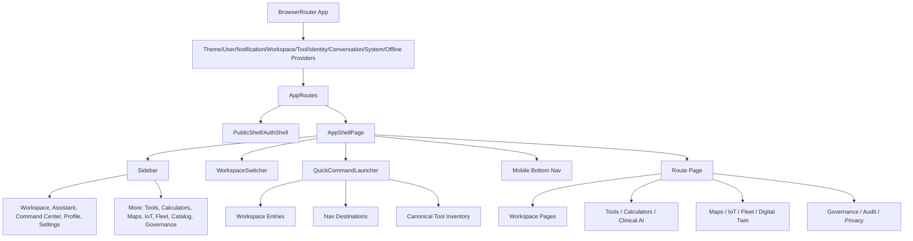

# CareDroid Application Architecture Map

Generated: 2026-05-29

Purpose: document the current navigation, route, launcher, layout, tool, and backend exposure architecture before any merge or refactor work. This file is an inventory and recommendation artifact only; no routes, screens, launchers, or services were merged while producing it.

## Source Of Truth Files Scanned

- `src/App.jsx`: SPA route table, auth guards, redirects, route components.
- `src/navigation/primaryNavigation.js`: primary sidebar, advanced sidebar, mobile nav, quick command destinations.
- `src/layout/AppShell.jsx`: global shell, sidebar, workspace switcher, quick command, mobile bottom nav.
- `src/components/Sidebar.jsx`: sidebar rendering, recent chats, notification footer, operational workspace selector.
- `src/components/QuickCommandLauncher.jsx`: global launcher inventory, recent/favorites, fuzzy search, tool launches.
- `src/pages/CommandDashboard.jsx`: command dashboard shortcuts, prompt chips, recommended tools.
- `src/pages/WorkspaceHome.jsx` and `src/data/workspaceArchitecture.js`: workspace pages and workspace route/tool filters.
- `src/pages/tools/ToolsOverview.jsx`, `src/pages/tools/Calculators.jsx`, `src/routes/clinicalToolRoutes.js`: tool library, calculator hub, generated calculator child routes.
- `src/data/toolInventory.js`, `src/data/clinicalToolIdContract.js`, `src/data/clinicalIntentToolCatalog.js`: canonical tool registry, launch types, NLU/tool aliases.
- `src/data/platformOperatingSystem.js`, `src/pages/PlatformOSPages.jsx`: workspace OS pages, search, timeline, notifications, digital twin, workflows, assets.
- `src/data/backendHttpRouteInventory.js`, `src/data/frontendApiCallsInventory.js`, `backend/src/modules/**`: backend capabilities and frontend API exposure.

## 1. Visual Application Architecture

```text
CareDroid Application
|-- Public Entry
|   |-- Welcome
|   |-- Auth
|   |-- Legal / Help / Version
|   `-- Shared Tool Session
|-- Authenticated AppShell
|   |-- Workspace OS
|   |   |-- Workspace Index
|   |   |-- Clinical Workspace
|   |   |-- Emergency Workspace
|   |   |-- Operations Workspace
|   |   |-- Fleet Workspace
|   |   |-- Medical IoT Workspace
|   |   |-- Research Workspace
|   |   `-- Admin Workspace
|   |-- Command Center
|   |-- AI Assistant
|   |-- Global Search
|   |-- Clinical Timeline
|   |-- Notification Center
|   |-- Hospital Digital Twin
|   |-- Workflow Builder
|   |-- Asset Library
|   |-- Tools
|   |   |-- Tool Library
|   |   |-- Calculator Hub
|   |   |-- Generated Calculator Routes
|   |   |-- Clinical AI Pages
|   |   |-- Specialty Dynamic Pages
|   |   `-- Developer Catalog / Source Audit
|   |-- Operations
|   |   |-- Live Map
|   |   |-- Hospital Map
|   |   |-- Medical IoT
|   |   |-- Device Fleet
|   |   `-- Fleet
|   |-- Patient Platform
|   |-- Profile / Settings
|   |-- Governance / Audit / Privacy
|   `-- Analytics / Memory / Training / Cost
`-- Fallbacks
    |-- Tool Area Not Found
    |-- Fleet Area Not Found
    `-- Global Not Found
```



## 2. Route Map

### Route Guards

- Public-only routes redirect authenticated users to `/dashboard`.
- Auth-required routes redirect unauthenticated users to `/auth`.
- Permission-gated routes are wrapped by `PermissionGate`; failures redirect to `/tools`.
- Most authenticated pages render inside `AppShellPage`.
- Public legal/help/shared routes render inside `PublicShell`.
- React Router is currently modeled as a flat route table in `src/App.jsx`; "parent" below means product/domain parent rather than nested React Router parent route.

### Redirect And Alias Map

- Auth aliases -> `/auth`: `/login`, `/log-in`, `/signin`, `/sign-in`, `/signup`, `/sign-up`, `/register`, `/join`, `/create-account`, `/account/login`, `/account/signup`, `/account/register`, `/accounts/login`, `/accounts/signup`.
- OAuth legacy alias -> `/auth-callback`: `/auth/callback`.
- Workspace default -> `/workspace/clinical`: `/workspace`.
- Command center aliases -> `/dashboard`: `/home`, `/operations`.
- Assistant aliases -> `/assistant`: `/chat`, `/ai`, `/copilot`.
- Tool browser aliases -> `/tools`: `/all-tools`, `/clinical-tools`, `/catalog`.
- Calculator aliases -> `/tools/calculators`: `/calculators`, plus `/tools/calculator/sofa`, `/tools/calculator/gfr`, `/tools/calculator/bmi`, `/tools/calculator/chads2vasc` to their plural calculator routes.
- Live map aliases -> `/live-map`: `/maps`, `/tracking`, `/live-tracking`.
- Fleet map aliases -> `/fleet/map`: `/fleet`, `/fleet/live-map`, `/fleet/tracking`.
- Profile settings alias -> `/profile/settings`: `/profile-settings`.
- Memory alias pair: `/memory` and `/ai-memory` both render `MemoryDashboard`.

### Public And Auth Routes

- `/` -> `WelcomePage`: public landing page.
- `/auth` -> `AuthPage`: login, signup, demo mode entry.
- `/auth-callback` -> `AuthCallback`: OAuth token handoff.
- `/auth/callback` -> `LegacyOAuthCallbackRedirect`: redirect to `/auth-callback`.
- `/login`, `/log-in`, `/signin`, `/sign-in`, `/signup`, `/sign-up`, `/register`, `/join`, `/create-account`, `/account/login`, `/account/signup`, `/account/register`, `/accounts/login`, `/accounts/signup` -> `/auth`: auth aliases.
- `/legal/privacy` -> `PrivacyPolicy`.
- `/terms` -> `TermsOfService`.
- `/gdpr` -> `GDPRNotice`.
- `/hipaa` -> `HIPAANotice`.
- `/help` -> `HelpCenter`.
- `/version` -> `Version`.
- `/shared/tools/:shareId` -> `SharedToolSession`.

### Workspace OS And Core Routes

- `/dashboard` -> `CommandDashboard`: command center, adaptive widgets, quick launch, recommendations.
- `/home` -> `/dashboard`: legacy alias.
- `/operations` -> `/dashboard`: legacy operational alias.
- `/workspaces` -> `WorkspacesIndexPage`: workspace directory.
- `/workspace` -> `/workspace/clinical`: default workspace redirect.
- `/workspace/:workspaceId` -> `WorkspaceHome`: contextual workspace page. Known IDs: `clinical`, `emergency`, `operations`, `fleet`, `medical-iot`, `research`, `admin`.
- `/assistant` -> `Dashboard`: AI assistant chat workspace.
- `/chat`, `/ai`, `/copilot` -> `/assistant`: assistant aliases.
- `/search` -> `SearchResultsPage`: local global search page.
- `/timeline` -> `ClinicalTimelinePage`: unified timeline page.
- `/notifications` -> `NotificationCenterPage`: operational notification center.
- `/notification-preferences` -> `NotificationPreferences`: preference/settings page.
- `/digital-twin` -> `DigitalTwinPage`: combined operations snapshot.
- `/workflows` -> `WorkflowBuilderPage`: workflow builder.
- `/assets` -> `AssetLibraryPage`: asset registry/library.

### Patient And Integration Routes

- `/patients` -> `Patients`.
- `/patients/import` -> `PlatformSystemPage`.
- `/patients/:patientId/labs/import` -> `PlatformSystemPage`.
- `/patients/:patientId/medications/import` -> `PlatformSystemPage`.
- `/patients/:patientId/observations/import` -> `PlatformSystemPage`.
- `/patients/:patientId/workspace` -> `PlatformSystemPage`.
- `/patients/:patientId/summary` -> `PlatformSystemPage`.
- `/patients/:patientId/timeline` -> `PlatformSystemPage`.
- `/patients/:patientId/events` -> `PlatformSystemPage`.
- `/patients/:patientId/risk-history` -> `PlatformSystemPage`.
- `/patients/:patientId/care-plan` -> `PlatformSystemPage`.
- `/patients/:patientId/workflows` -> `PlatformSystemPage`.
- `/patients/:patientId/workflows/:workflowId` -> `PlatformSystemPage`.
- `/patients/:patientId/documentation` -> `PlatformSystemPage`.
- `/patients/:patientId/documentation/:documentId` -> `PlatformSystemPage`.
- `/patients/:patientId/consent` -> `PlatformGovernanceWorkspace`.
- `/patients/:patientId/source-data` -> `PlatformGovernanceWorkspace`.
- `/patients/:patientId/review` -> `PlatformGovernanceWorkspace`.
- `/patients/:patientId/privacy` -> `PlatformGovernanceWorkspace`.
- `/integrations` -> `PlatformGovernanceWorkspace`.
- `/integrations/fhir` -> `PlatformSystemPage`.
- `/integrations/hl7` -> `PlatformSystemPage`.
- `/integrations/source-provenance` -> `PlatformGovernanceWorkspace`.

### Tools And Clinical AI Routes

- `/tools` -> `ToolsOverview`: canonical tool browser.
- `/all-tools`, `/clinical-tools`, `/catalog` -> `/tools`: legacy tool aliases.
- `/tools/catalog` -> `ClinicalToolCatalog`: developer/source audit.
- `/tools/drug-checker` -> `DrugChecker`.
- `/tools/lab-interpreter` -> `LabInterpreter`.
- `/tools/protocols` -> `Protocols`.
- `/tools/diagnosis` -> `DiagnosisAssistant`.
- `/tools/procedures` -> `ProcedureGuide`.
- `/tools/calculator-recommender` -> `CalculatorRecommender`.
- `/tools/ambient-scribe` -> `AmbientScribe`.
- `/tools/guideline-rag` -> `GuidelineRag`.
- `/tools/differential-ai` -> `DifferentialAi`.
- `/tools/timeline-ai` -> `TimelineAi`.
- `/tools/patient-summary-ai` -> `PatientSummaryAi`.
- `/tools/order-set-ai` -> `OrderSetAi`.
- `/tools/ai-explainability` -> `AiExplainability`.
- `/tools/clinical-audit` -> `ClinicalAudit`.
- `/tools/workflow-builder-ai` -> `PlatformSystemPage`.
- `/tools/clinical-reasoning-engine` -> `PlatformSystemPage`.
- `/tools/why-engine` -> `PlatformSystemPage`.
- `/tools/audit-trail-ai` -> `PlatformSystemPage`.
- `/tools/soap-builder` -> `PlatformSystemPage`.
- `/tools/clinical-dictation` -> `PlatformSystemPage`.
- `/tools/discharge-summary-ai` -> `PlatformSystemPage`.
- `/tools/referral-ai` -> `PlatformSystemPage`.
- `/tools/prior-auth-ai` -> `PlatformSystemPage`.
- `/tools/cardiology/:toolId` -> `CardiologyAssistantPage`.
- `/tools/pulmonology/:toolId` -> `PulmonologyAssistantPage`.
- `/tools/nephrology/:toolId` -> `NephrologyAssistantPage`.
- `/tools/gastroenterology/:toolId` -> `GastroenterologyAssistantPage`.
- `/tools/endocrine/:toolId` -> `EndocrineMetabolicAssistantPage`.
- `/tools/neurology/:toolId` -> `NeurologyAssistantPage`.
- `/tools/pediatrics-obgyn/:toolId` -> `PediatricsObgynAssistantPage`.
- `/tools/psychiatry/:toolId` -> `PsychiatryAssistantPage`.
- `/tools/*` -> `ToolNotFound` or `ToolsAreaFallback` with known redirect recovery.

### Calculator Routes

- `/tools/calculators` -> `Calculators`: calculator hub.
- `/tools/calculators/:slug` -> `Calculators`: generic slug route for hub/fallback behavior.
- Dedicated generated calculator routes -> `Calculators initialCalculatorId={calculatorSlug}`. They are derived from `CALCULATOR_ROUTE_DEFS`, which is built from canonical tool inventory records with `calculatorSlug` and `route`.
- Legacy aliases: `/tools/calculator/sofa`, `/tools/calculator/gfr`, `/tools/calculator/bmi`, `/tools/calculator/chads2vasc` -> `/tools/calculators/...`.
- `/calculators` -> `/tools/calculators`.

Current calculator child routes:

```text
/tools/calculators/aa-gradient
/tools/calculators/abcd2
/tools/calculators/adjusted-body-weight
/tools/calculators/anion-gap
/tools/calculators/apache-ii
/tools/calculators/apgar-score
/tools/calculators/apri
/tools/calculators/ascvd-risk
/tools/calculators/asthma-severity-score
/tools/calculators/audit-c
/tools/calculators/bed-occupancy-calculator
/tools/calculators/bishop-score
/tools/calculators/bisap-score
/tools/calculators/bmi
/tools/calculators/bode-index
/tools/calculators/braden-scale
/tools/calculators/bsa
/tools/calculators/bun-creatinine-ratio
/tools/calculators/cage
/tools/calculators/centor-mcisaac
/tools/calculators/chads2
/tools/calculators/chads2vasc
/tools/calculators/child-pugh
/tools/calculators/ckd-staging
/tools/calculators/columbia-suicide-severity-workflow
/tools/calculators/copd-gold-assessment
/tools/calculators/corrected-calcium
/tools/calculators/corrected-sodium
/tools/calculators/creatinine-clearance-cg
/tools/calculators/curb-65
/tools/calculators/duke-treadmill-score
/tools/calculators/egfr-ckd-epi
/tools/calculators/epworth-sleepiness-scale
/tools/calculators/fena
/tools/calculators/fenton-growth-chart-helper
/tools/calculators/feurea
/tools/calculators/fib4
/tools/calculators/four-score
/tools/calculators/framingham-risk
/tools/calculators/free-water-deficit
/tools/calculators/gad7
/tools/calculators/gcs
/tools/calculators/gestational-age-calculator
/tools/calculators/gfr
/tools/calculators/glasgow-blatchford-score
/tools/calculators/has-bled
/tools/calculators/hcm-sudden-death-risk
/tools/calculators/heart-failure-staging
/tools/calculators/heart-score
/tools/calculators/homa-ir
/tools/calculators/hunt-hess-scale
/tools/calculators/ich-score
/tools/calculators/ideal-body-weight
/tools/calculators/kfre
/tools/calculators/maddrey-discriminant-function
/tools/calculators/mdq
/tools/calculators/meld
/tools/calculators/meld-na
/tools/calculators/mews
/tools/calculators/mmse
/tools/calculators/moca-placeholder-workflow
/tools/calculators/modified-rankin-scale
/tools/calculators/morse-fall-scale
/tools/calculators/neonatal-bilirubin-risk-helper
/tools/calculators/news2
/tools/calculators/nihss-summary-view
/tools/calculators/osmolal-gap
/tools/calculators/pao2-fio2-ratio
/tools/calculators/pcl5
/tools/calculators/pediatric-bp-percentile
/tools/calculators/pediatric-dose-safety-checker
/tools/calculators/pediatric-gcs
/tools/calculators/pews
/tools/calculators/phq9
/tools/calculators/pneumonia-severity-index
/tools/calculators/pregnancy-due-date-calculator
/tools/calculators/qsofa
/tools/calculators/ranson-criteria
/tools/calculators/rass
/tools/calculators/resource-utilization-index
/tools/calculators/revised-trauma-score
/tools/calculators/reynolds-risk-score
/tools/calculators/rockall-score
/tools/calculators/rox-index
/tools/calculators/serum-osmolality
/tools/calculators/shock-index
/tools/calculators/sofa
/tools/calculators/staffing-ratio-calculator
/tools/calculators/stop-bang
/tools/calculators/timi-ua-nstemi
/tools/calculators/turnaround-time-calculator
/tools/calculators/waist-hip-ratio
```

### Operations, Maps, IoT, And Fleet Routes

- `/live-map` -> `LiveTrackingMap`.
- `/maps`, `/tracking`, `/live-tracking` -> `/live-map`: live map aliases.
- `/hospital-map` -> `HospitalMapDashboard`.
- `/medical-iot` -> `MedicalIotDashboard`.
- `/devices` -> `DeviceFleetManagement`.
- `/fleet` -> `/fleet/map`.
- `/fleet/map` -> `FleetLiveMap`.
- `/fleet/live-map`, `/fleet/tracking` -> `/fleet/map`.
- `/fleet/command` -> `FleetDashboard`.
- `/fleet/predictive-maintenance` -> `PredictiveMaintenance`.
- `/fleet/route-optimizer` -> `RouteOptimizer`.
- `/fleet/*` -> `ToolsAreaFallback`.

### Profile, Settings, Compliance, And Account Routes

- `/profile` -> `Profile`.
- `/profile/settings` -> `ProfileSettings`.
- `/profile/activity` -> `ProfileActivity`.
- `/profile/preferences` -> `ProfilePreferences`.
- `/profile/workspaces` -> `ProfileWorkspaces`.
- `/profile/security` -> `ProfileSecurity`.
- `/profile-settings` -> `/profile/settings`.
- `/settings` -> `Settings`.
- `/two-factor-setup` -> `TwoFactorSetup`.
- `/biometric-setup` -> `BiometricSetup`.
- `/onboarding` -> `Onboarding`.
- `/consent` -> `ConsentFlow`.
- `/consent-history` -> `ConsentHistory`.
- `/consent/:patientId` -> `PlatformGovernanceWorkspace`.
- `/team` -> `TeamManagement`.

### Governance, Audit, Analytics, Memory, Training

- `/privacy`, `/privacy/access-log`, `/privacy/requests`, `/governance/privacy` -> `PlatformGovernanceWorkspace`.
- `/ai-governance`, `/governance`, `/governance/ai` -> `PlatformGovernanceWorkspace`.
- `/security`, `/governance/ai-security`, `/governance/ai-security/prompt-firewall`, `/governance/ai-security/model-access`, `/governance/ai-security/incidents` -> `PlatformGovernanceWorkspace`.
- `/regulatory`, `/governance/regulatory`, `/governance/regulatory/capabilities`, `/governance/regulatory/intended-use`, `/governance/regulatory/evidence` -> `PlatformGovernanceWorkspace`.
- `/equity`, `/governance/equity`, `/governance/equity/metrics`, `/governance/equity/cohorts`, `/governance/equity/findings`, `/governance/equity/reports` -> `PlatformGovernanceWorkspace`.
- `/human-review`, `/review`, `/review/clinical`, `/review/documentation`, `/review/privacy`, `/review/governance` -> `PlatformGovernanceWorkspace`.
- `/audit`, `/audit/ai`, `/audit/phi`, `/audit/integrations`, `/audit/policy` -> `PlatformGovernanceWorkspace`.
- `/audit-logs` -> `AuditLogs`.
- `/system-health`, `/operations/observability`, `/operations/deployments`, `/operations/service-health`, `/operations/incidents` -> `PlatformGovernanceWorkspace` or platform operations pages.
- `/analytics` -> `AnalyticsDashboard`.
- `/costs` -> `CostAnalyticsDashboard`.
- `/memory`, `/ai-memory` -> `MemoryDashboard`.
- `/artifacts` -> `Artifacts`.
- `/training` -> `TrainingDashboard`.
- `/ai/evaluation` -> `AiEvaluationDashboard`.
- `/ai-command-center` -> `AiCommandCenterDashboard`.
- `/clinical/alerts` -> `ClinicalAlertsPage`.
- `*` -> authenticated users get `ToolNotFound` page-not-found; unauthenticated users redirect to `/auth`.

## 3. Navigation And Launcher Map

### Sidebar

Primary sidebar items:

- Workspace -> `/workspaces`.
- AI Assistant -> `/assistant`.
- Command Center -> `/dashboard`.
- Profile -> `/profile`.
- Settings -> `/settings`.

Advanced sidebar items under "More":

- Tool Library -> `/tools`.
- Calculators -> `/tools/calculators`.
- Hospital Map -> `/hospital-map`.
- Medical IoT -> `/medical-iot`.
- Fleet Map -> `/fleet/map`.
- Developer Catalog / Source Audit -> `/tools/catalog`.
- System Health -> `/system-health`.
- Governance -> `/ai-governance`.
- Security -> `/security`.
- Audit Logs -> `/audit-logs`.

Sidebar footer and secondary controls:

- Notifications icon -> `/notifications`.
- New Chat -> `/assistant`.
- Recent conversations -> `/assistant`.
- User profile block -> `/profile`.
- Operational workspace selector -> calls backend workspace switch, but does not navigate to the new CareDroid workspace routes.

### Header / Shell

- Compact menu button opens mobile sidebar.
- Compact command button opens Quick Command.
- Workspace switcher routes to `/workspace/clinical`, `/workspace/emergency`, `/workspace/operations`, `/workspace/fleet`, `/workspace/medical-iot`, `/workspace/research`, `/workspace/admin`.
- Dev auth banner appears when local/demo auth bypass is active.

### Mobile Navigation

Mobile bottom nav contains the mobile-safe primary nav subset:

- Workspace -> `/workspaces`.
- AI Assistant -> `/assistant`.
- Command Center -> `/dashboard`.

### Quick Command

Quick Command entries are built from:

- Recent tools: up to 5 from `ToolPreferencesContext`.
- Favorites: up to 5 from `ToolPreferencesContext`.
- Workspaces: all `CARE_WORKSPACES`.
- Destinations: primary and advanced sidebar nav items.
- Canonical tools: `getUserFacingToolRegistryProjection()`, excluding tools whose path already equals a nav destination except calculator hub variants.

Launch behavior:

- Tool entries route through `applyRegistryToolLaunch`.
- Workspace and destination entries navigate directly.
- Search uses fuzzy matching against IDs, labels, descriptions, category, path, shortcut, aliases, and tool use cases.

### Dashboard Shortcuts

`CommandDashboard` hard-codes launch cards to:

- `/assistant`, `/tools`, `/tools/calculators`, `/hospital-map`, `/medical-iot`, `/fleet/map`, `/devices`, `/profile/activity`, `/system-health`.

It also launches:

- Recommended/pinned/recent tool cards via `applyRegistryToolLaunch`.
- Assistant prompts by seeding a user message and navigating to `/assistant`.
- Adaptive dashboard content from `AdaptiveDashboardPanel`.

### Workspace Launchers

Workspace route shortcuts are defined centrally:

- `assistant` -> `/assistant`.
- `commandCenter` -> `/dashboard`.
- `tools` -> `/tools`.
- `calculators` -> `/tools/calculators`.
- `hospitalMap` -> `/hospital-map`.
- `medicalIot` -> `/medical-iot`.
- `devices` -> `/devices`.
- `fleetMap` -> `/fleet/map`.
- `liveMap` -> `/live-map`.
- `profile` -> `/profile`.
- `settings` -> `/settings`.
- `systemHealth` -> `/system-health`.
- `developerCatalog` -> `/tools/catalog`.

Workspaces map these route shortcuts and tool IDs:

- Clinical: assistant, command center, tools, calculators; clinical decision support and documentation tools.
- Emergency: assistant, calculators, live map, hospital map; qSOFA/NEWS2/SOFA/NIHSS/HEART/ACS tools.
- Operations: command center, hospital map, live map, devices, system health; map, capacity, staffing, devices.
- Fleet: fleet map, live map, command center; fleet map, command, route, maintenance, dispatch AI.
- Medical IoT: medical IoT, devices, hospital map, live map; telemetry, maintenance, batteries.
- Research: assistant, tools, developer catalog; RAG, differential, timeline, audit, explainability.
- Admin: settings, profile, system health, developer catalog; governance, security, audit, ops.

### Tools And Calculator Launchers

- `ToolsOverview`: search/filter/pin/favorite all user-facing tools; launch via `applyRegistryToolLaunch`.
- `ToolsOverview` also has "Open in Assistant", which always seeds the assistant regardless of whether the tool has a direct page.
- `Calculators`: hub cards from `buildBuiltinHubCalculatorCards()`; guided chat tools from `getHubChatAssistedTools()`.
- `ClinicalToolCatalog`: developer/source-audit launcher; can display catalog rows, API rows, backend executor rows, and launch/open actions.
- Legacy `?tool=` and calculator `?calc=` patterns are still supported in launcher resolution.

## 4. Tools, Dashboards, Maps, IoT, And Fleet Inventory

### Tool Inventory Shape

The canonical tool inventory derives from:

- `toolRegistryById`.
- `clinicalIntentTools`.
- `builtinUiCalculators`.
- `clinicalToolIdContract` groups and aliases.
- Frontend API and backend route inventories.
- Platform system capabilities.

Launch types:

- `local-only`: frontend-only calculator or page.
- `chat-assisted`: assistant-seeded guided flow.
- `backend-backed`: registered executor or backend-backed clinical intelligence API.
- `clinical-page`: dedicated clinical tool page.
- `fleet-local`: fleet page/tool.
- `iot-local`: Medical IoT dashboard/tool.
- `hospital-local`: hospital operations dashboard/tool.
- `hub`: hub route.
- `platform`: platform capability shell.
- `unsupported-planned`: cataloged but not executable.

Tool surfaces:

- `tool-page`, `calculator-form`, `chat-assisted`, `fleet-page`, `iot-dashboard`, `hospital-operations`, `platform-page`, `hub`, `internal`.

### Dashboard And Platform OS Inventory

Platform dashboards:

- Command Center -> `/dashboard`.
- AI Assistant -> `/assistant`.
- Hospital Map -> `/hospital-map`.
- Medical IoT -> `/medical-iot`.
- Device Fleet -> `/devices`.
- Fleet Map -> `/fleet/map`.
- Hospital Digital Twin -> `/digital-twin`.
- Clinical Timeline -> `/timeline`.
- Workflow Builder -> `/workflows`.
- Global Search -> `/search`.
- Asset Library -> `/assets`.
- System Health -> `/system-health`.

Platform OS data currently also includes:

- Notifications: AI, telemetry, fleet, maintenance, workflow, governance.
- Timeline events: calculator, AI, device, telemetry, fleet, workflow, audit, alert.
- Workflows: chest pain, sepsis escalation, device maintenance.
- Digital twin snapshot: occupancy, floors, rooms, fleet.
- Asset registry: local artifacts projected into an asset library.

### Maps, IoT, And Fleet Modules

- `LiveTrackingMap`: unified live operational tracking route.
- `HospitalMapDashboard`: floors, beds, rooms, alerts, device markers.
- `MedicalIotDashboard`: telemetry, device state, stale warnings, signals.
- `DeviceFleetManagement`: inventory, maintenance, calibration, firmware, assignments.
- `FleetLiveMap`: vehicle positions, route lines, ETA, fleet alerts.
- `FleetDashboard`: command dashboard for fleet.
- `PredictiveMaintenance`: local deterministic maintenance page.
- `RouteOptimizer`: local deterministic route optimization page.
- `DigitalTwinPage`: aggregate demo snapshot across maps, IoT, fleet, occupancy, alerts.

## 5. Duplication Report

### Necessary Duplication

- Assistant access appears in sidebar, bottom nav, quick command, dashboard, workspace pages, tools, and chat-assisted flows. This is necessary because Assistant is the universal continuation and guided-flow surface.
- Dashboard access appears in sidebar, bottom nav, dashboard aliases, quick command, and workspace route shortcuts. This is acceptable because `/dashboard` is the command center.
- Tools access appears in advanced sidebar, quick command, dashboard, workspaces, and catalog back links. This is useful because `/tools` is the canonical browser.
- Calculator access appears in advanced sidebar, quick command, dashboard, workspace shortcuts, tool filters, direct generated routes, and legacy aliases. The amount is high, but calculators are a high-frequency clinical task.
- Map/IoT/Fleet routes repeat across workspaces, dashboard shortcuts, quick command, and advanced sidebar. This is appropriate because different roles need the same operational views.
- Auth aliases are necessary for external links and user expectations.
- `/memory` and `/ai-memory` both rendering `MemoryDashboard` is acceptable as a legacy alias while AI memory branding is in transition.

### Harmful Or Risky Duplication

- Two different workspace controls use the label "Workspace": the new CareDroid workspace switcher routes to `/workspace/:workspaceId`, while the sidebar operational workspace selector changes account/backend workspace state without navigating. This is the highest UX conflict.
- `/tools/calculators` is both a hub and a placeholder for calculator-like, chat-assisted, and legacy flows. Users can arrive through direct routes, `?calc=`, generic slug, and aliases.
- `ToolsOverview` shows both "Open" and "Open in Assistant" for every tool. For chat-assisted tools these collapse into nearly the same action.
- `ClinicalToolCatalog` has both "Open" and "Launch" in developer audit rows; for some rows these resolve to the same page.
- `CommandDashboard` launch cards and `WorkspaceHome` route shortcuts hard-code paths that also exist in `primaryNavigation.js` and `workspaceArchitecture.js`, creating drift risk.
- Notifications are split across `/notifications`, `/notification-preferences`, and an older `components/notifications/NotificationCenter.jsx` dropdown/preferences implementation that is not mounted by the route table.
- Timeline is split between `/timeline` operational timeline and `/tools/timeline-ai` patient-specific AI timeline generator. The distinction is meaningful but the naming is likely confusing.
- Assets are split between `/assets` asset registry and `/artifacts` richer AI artifact graph/version UI. The difference is valid internally, but unclear in IA.
- `/digital-twin`, `/hospital-map`, `/medical-iot`, `/devices`, `/fleet/map`, and `/live-map` overlap heavily. This is useful as an aggregate/detail pattern, but needs a clear parent/child relationship.
- `/operations` currently redirects to `/dashboard` while `Operations.jsx` exists, which makes the page appear orphaned.

## 6. Merge Recommendations

### Canonical Structure Recommendations

1. Make `Workspaces` the top-level operating concept.
   - Canonical route: `/workspaces` and `/workspace/:workspaceId`.
   - Keep sidebar primary item as "Workspace".
   - Rename or visually separate the sidebar operational workspace selector to "Account workspace" or "Org workspace" to avoid conflict.

2. Keep `Tools` canonical, but make calculators a first-class filter/tab inside Tools while preserving direct calculator routes.
   - Canonical browser: `/tools`.
   - Calculator hub: `/tools?category=calculators` or `/tools/calculators` as a retained focused view.
   - Direct calculator routes: keep `/tools/calculators/:slug` for deep links, keyboard launch, and clinical workflow references.
   - Evidence: calculators are discoverable from too many places, but dedicated calculator URLs are useful and already tested.

3. Keep `/tools/calculators` visible, but demote it from global primary IA over time.
   - It can remain in "More" or become a Tools tab.
   - It should not compete with Tools and Clinical Workspace as an equal primary destination.

4. Establish an aggregate/detail model for operations.
   - Canonical aggregate: `/digital-twin`.
   - Detail routes: `/hospital-map`, `/medical-iot`, `/devices`, `/fleet/map`, `/live-map`.
   - Evidence: `DigitalTwinPage` aggregates demo map, telemetry, fleet, occupancy, and alerts but does not replace detailed pages.

5. Clarify timeline naming.
   - `/timeline`: "Operational Timeline" or "Clinical Activity Timeline".
   - `/tools/timeline-ai`: "Patient Timeline AI".
   - Evidence: one is cross-system events; the other is a patient-specific AI generation tool.

6. Clarify asset/artifact naming.
   - `/assets`: "Asset Library" for static/reusable assets, protocols, templates.
   - `/artifacts`: "AI Artifacts" for generated/versioned AI outputs.
   - Optionally cross-link both under Research/Admin workspace.

7. Unify notification entry points.
   - `/notifications`: canonical center.
   - `/notification-preferences`: settings subpage.
   - Remove or repurpose the older notification dropdown component only after confirming it is not mounted elsewhere.

8. Collapse duplicate tool launch actions.
   - Use one primary action label per tool card: "Open calculator", "Open page", or "Start guided chat".
   - Keep secondary assistant action only when it is meaningfully different.

## 7. Layout Map

```text
App
`-- BrowserRouter
    `-- ThemeProvider
        `-- UserProvider
            `-- NotificationProvider
                `-- WorkspaceProvider
                    `-- CostTrackingProvider
                        `-- ToolPreferencesProvider
                            `-- UserIdentityProvider
                                `-- ConversationProvider
                                    `-- SystemConfigProvider
                                        `-- OfflineProvider
                                            `-- ErrorBoundary
                                                |-- Suspense
                                                |   `-- AppRoutes
                                                `-- NotificationToasts

AppShellPage
`-- AppShell
    |-- Sidebar
    |   |-- Logo
    |   |-- User profile summary
    |   |-- Operational workspace selector
    |   |-- New Chat
    |   |-- Quick Command launcher button
    |   |-- Primary nav
    |   |-- More/advanced nav
    |   |-- Recent chats
    |   `-- Footer actions: notifications, HIPAA, sign out
    |-- Mobile backdrop
    |-- Main wrapper
    |   |-- Mobile menu button
    |   |-- Mobile quick command button
    |   |-- Workspace switcher bar
    |   |-- QuickCommandLauncher modal
    |   |-- Mobile bottom nav
    |   |-- Dev auth banner
    |   `-- Route children
    `-- No global footer beyond mobile bottom nav
```

Duplicated or conflicting layout panels:

- Workspace switcher bar and sidebar operational workspace selector both present "workspace" concepts.
- Sidebar notification footer routes to `/notifications`, while older notification center component also exists.
- Dashboard, workspace pages, quick command, and ToolsOverview all provide launch grids.
- `DigitalTwinPage` repeats summary panels from map/IoT/fleet pages.
- `Dashboard` assistant page and legacy `ChatInterface.jsx`/`ToolPanel.jsx` appear to overlap, with current routing using `Dashboard.jsx`.

Likely unused or legacy panels:

- `Operations.jsx`: effectively bypassed by `/operations` redirect.
- `components/notifications/NotificationCenter.jsx`: older dropdown center not mounted by route table.
- `ChatInterface.jsx` and `ToolPanel.jsx`: legacy/test-only compared with current `/assistant`.
- `DrawerMobileNav` and `FilterDrawer`: exported, but only base drawer usage was found in active paths.

## 8. Frontend / Backend Exposure Map

### Exposed And Wired

- Auth and account -> `/auth`, `/auth-callback`, `/profile`, `/settings`, `/two-factor-setup`, `/biometric-setup`; launch paths are auth forms, profile pages, settings links.
- Chat assistant -> `/assistant`; launch paths are sidebar, dashboard prompt, quick command, tool guided flows.
- Tool executors -> `/tools/calculators/sofa`, `/tools/drug-checker`, `/tools/lab-interpreter`; launch paths are ToolsOverview, calculator routes, assistant executor cards.
- Clinical intelligence -> `/tools/ambient-scribe`, `/tools/guideline-rag`, `/tools/differential-ai`, `/tools/timeline-ai`, `/tools/patient-summary-ai`, `/tools/order-set-ai`, `/tools/ai-explainability`, `/tools/clinical-audit`; launch paths are ToolsOverview, quick command, workspaces, dashboard.
- Platform systems -> patient/import/workflow/documentation/governance routes; launch paths are platform route links and governance workspace sections.
- Profile identity/workspaces/activity/personalization -> profile pages, sidebar operational workspace selector, dashboard personalization.
- Artifacts/memory/training/evaluation/cost -> `/artifacts`, `/memory`, `/ai-memory`, `/training`, `/ai/evaluation`, `/ai-command-center`, `/costs`.
- Fleet/map/IoT live APIs -> `/fleet/map`, `/hospital-map`, `/medical-iot`, `/devices`; launch paths are sidebar More, dashboard, workspace pages, quick command.
- Notifications REST -> `/notifications`, `/notification-preferences`, sidebar badge, toasts.

### Backend Exists But Is Not Directly Exposed By New Frontend IA

- `WorkspaceIntelligenceModule` registers `SearchService`, but no controller route was found. `/search` uses local `platformOperatingSystem.js`.
- `TimelineService` is exported from clinical intelligence, but no dedicated timeline controller route was found. `/timeline` uses local platform OS data.
- `AssetRegistryService` is registered in artifacts module, but no asset registry controller endpoint was found. `/assets` uses local artifacts projection.
- Workspace detail/member/tool management routes exist under `/api/workspaces/:workspaceId/...`; only a subset is exposed through profile/workspace/account flows.
- Personalization recommendations and prompt delete routes exist, but are not clearly surfaced in the new workspace OS.
- Memory list routes exist; the UI centers on dashboard/save flows.
- Tool-calling catalog/resolve/logs endpoints exist, but ordinary users reach tools through the registry and assistant, not a dedicated tool-calling UI.
- Drug/protocol admin CRUD exists beyond the visible clinical pages.
- `/api/fleet/snapshot` and `/api/medical-iot/snapshot` are backend-style capabilities, while frontend digital twin currently uses local demo data.
- Most `/api/platform-governance/*` capabilities are present as backend inventory but surfaced through generic governance workspaces rather than dedicated IA entries.

### Frontend Exists But Is Local, Demo, Or Gated

- `/digital-twin`: local demo aggregate from platform OS data, not wired to a digital twin backend.
- `/workflows`: local workflow builder data, while backend workflow-builder generation exists as a platform system capability.
- `/search`: local global search, not wired to `SearchService`.
- `/timeline`: local event list, not wired to `TimelineService`.
- `/assets`: local registry projection, not wired to `AssetRegistryService`.
- `RouteOptimizer` and `PredictiveMaintenance`: local deterministic pages.
- `DeviceFleetManagement`: visible, but much of the management behavior is local/demo.
- Export/report/schedule flows have frontend clients and capability flags, but several routes are gated off or unavailable.

### Orphan Executors, Controllers, Or UI

- True registered POST tool executors are limited to `sofa-calculator`, `drug-interactions`, and `lab-interpreter`; most calculators are frontend/local or assistant-guided.
- `FleetLiveTrackingController`, `HospitalLiveTrackingController`, and `DeviceLiveTrackingController` exist under `backend/src/modules/live-tracking`, but `LiveTrackingModule` registers no controllers. Equivalent routes appear through `FleetController`, `HospitalMapController`, and `TelemetryController`.
- `Operations.jsx` is orphaned by the `/operations` redirect.
- Older notification dropdown/preferences component appears orphaned relative to the new `/notifications` and `/notification-preferences` routes.

## 9. Proposed Simplified Structure

```text
CareDroid
|-- Workspace
|   |-- Clinical
|   |-- Emergency
|   |-- Operations
|   |   |-- Digital Twin
|   |   |-- Hospital Map
|   |   |-- Medical IoT
|   |   |-- Device Fleet
|   |   `-- Fleet Map
|   |-- Fleet
|   |-- Medical IoT
|   |-- Research
|   `-- Admin
|-- Assistant
|-- Command Center
|-- Tools
|   |-- All Tools
|   |-- Calculators
|   |-- Clinical AI
|   |-- Operations
|   |-- Medical IoT
|   |-- Fleet
|   `-- Developer Catalog
|-- Search
|-- Timeline
|-- Notifications
|-- Profile
`-- Settings
```

Recommended canonical routes:

- Workspace root: `/workspaces`.
- Workspace detail: `/workspace/:workspaceId`.
- Assistant: `/assistant`.
- Command Center: `/dashboard`.
- Tool browser: `/tools`.
- Calculator direct links: `/tools/calculators/:slug`.
- Operations aggregate: `/digital-twin`.
- Operation details: `/hospital-map`, `/medical-iot`, `/devices`, `/fleet/map`, `/live-map`.
- Notifications: `/notifications`; preferences: `/notification-preferences`.
- AI artifacts: `/artifacts`; asset library: `/assets`.

## 10. Execution Plan - Do Not Merge Yet

### High Impact Merges

1. Resolve the two-workspace-control conflict.
   - Rename the sidebar backend/account selector or move it under Profile/Settings.
   - Keep the header `WorkspaceSwitcher` as the visible CareDroid clinical workspace switcher.
   - UX impact: high, because "Workspace" currently means two different things.

2. Canonicalize Tools and Calculators.
   - Keep `/tools` as the browser.
   - Keep `/tools/calculators/:slug` for direct calculator links.
   - Turn `/tools/calculators` into a Tools tab or clearly labeled focused hub.
   - UX impact: high, because calculators are currently launched from the most surfaces.

3. Wire or explicitly label the new platform OS pages.
   - `/search` -> backend `SearchService` or label as local demo.
   - `/timeline` -> backend `TimelineService` or label as local demo.
   - `/assets` -> backend `AssetRegistryService` or label as local projection.
   - UX impact: high, because these are now top-level capabilities.

4. Define the operations aggregate/detail relationship.
   - Make `/digital-twin` the aggregate.
   - Cross-link to `/hospital-map`, `/medical-iot`, `/devices`, `/fleet/map`, `/live-map`.
   - UX impact: high, because operations currently has several overlapping map/control pages.

### Medium Impact Merges

1. Split timeline naming.
   - Rename UI labels for `/timeline` and `/tools/timeline-ai` to avoid patient timeline ambiguity.

2. Split assets/artifacts naming.
   - Cross-link `/assets` and `/artifacts` while preserving their different data models.

3. Normalize dashboard launch data.
   - Derive `DASHBOARD_LAUNCH_CARDS` from navigation/workspace inventory rather than hard-coded paths.

4. Simplify tool card actions.
   - Collapse "Open" and "Open in Assistant" where they resolve to the same flow.

5. Retire or reconnect legacy notification dropdown components.
   - Confirm usage, then route all notification center behavior through `/notifications`.

### Low Impact Merges

1. Keep auth, map, assistant, and calculator aliases for compatibility, but document them as legacy.
2. Decide whether `/memory` or `/ai-memory` should be the canonical label and keep the other as redirect.
3. Decide whether `/operations` should remain a redirect or re-open `Operations.jsx`.
4. Keep developer/source audit under `/tools/catalog` but avoid exposing it as a general user navigation target.
5. Audit drawer exports and legacy chat components after active IA work is complete.
