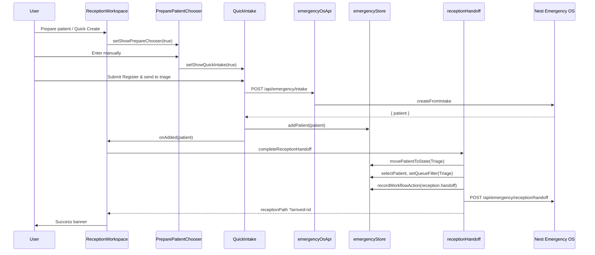

# Arrival-to-Triage Trace

Date: 2026-06-17

## Scope

End-to-end trace of the canonical Emergency OS patient path from **Arrival** through **Triage**, mapping every frontend component, API, service, entity, DOM event, and UI state involved. Covers all active creation paths and documents disconnects fixed in this pass.

**Canonical journey states** (`src/types/emergency.ts`):

```text
Arrival → Registration → Triage → Waiting → Assessment → …
```

Reception-first flows may **skip** `Registration` (quick create) or **pause** in `Registration` (EMS convert, identity verify) before handoff to `Triage`.

---

## 1. Stage Overview

| Stage | Meaning in product | Typical `PatientState` | Primary surfaces |
| --- | --- | --- | --- |
| **Arrival** | Patient or unit is known to the department | `Arrival` (backend slice) / implicit | Reception, EMS panel, inbound EMS feed |
| **Registration** | Identity capture, EMS conversion, chart shell | `Registration` | Reception queues, Smart Intake verify |
| **Intake** | Demographics, complaint, vitals, documents | `Registration` or building toward create | `QuickIntake`, `SmartIntake` steps 0–3 |
| **Verification** | Staff approves/overrides identity fields | `Registration` | `SmartIntake` steps 4–5, work-queue row click |
| **Encounter creation** | Patient record + timeline + optional encounter | Any → usually `Triage` | `addPatient`, API intake POST, vertical slice |
| **Queue assignment** | Patient placed in triage queue for nursing | `Triage` | `completeReceptionHandoff` |
| **Triage** | Visible on board, queue filter, metrics | `Triage` | Whiteboard, Reception pre-triage queue, queues route |

---

## 2. Master Sequence (Reception Quick Create — fastest path)



---

## 3. Path Catalog

### Path A — Reception Quick Create (walk-in)

| Stage | What happens | Component / service |
| --- | --- | --- |
| Arrival | Staff opens Reception; optional EMS context in inbound panel | `ReceptionWorkspace.jsx`, `EmsPreArrivalPanel.jsx` |
| Registration | **Skipped** — quick path | — |
| Intake | Demographics, complaint category, vitals, CTAS | `QuickIntake.tsx` (`variant="reception"`) |
| Verification | **Skipped** | — |
| Encounter creation | `createSmartIntakePatient` → `addPatient`; patient built with `state: Triage`, `triageTime` set | `emergencyOsApi.js`, `emergencyStore.addPatient` |
| Queue assignment | `completeReceptionHandoff({ source: 'quick-intake' })` | `receptionHandoff.ts` |
| Triage | Patient in store; `?arrived=` banner; pre-triage queue tab | `ReceptionWorkQueues.jsx`, Whiteboard subscription |

### Path B — Reception Smart Intake (identity / OCR)

| Stage | What happens | Component / service |
| --- | --- | --- |
| Arrival | Chooser or action band → navigate intake | `PreparePatientChooser.jsx`, `ReceptionWorkspace.openSmartIntake` |
| Registration | Session bootstrap; may deep-link `?step=ocr\|verify` | `SmartIntake.jsx` |
| Intake | Steps: Start → Capture → Review OCR → Match | `SMART_INTAKE_DEMO` fixtures; `fetchSmartIntake` / `SmartIntakeApi` (gated) |
| Verification | Step 5: field approve / reject / edit loop | `fieldDecisions` state; `verificationComplete` gate |
| Encounter creation | `runSmartIntakeVerticalSlice` or local `buildSmartIntakePatient` + `addPatient` | `smartIntakeVerticalSlice.js`, `hydrateFromApi` |
| Queue assignment | `finishIntakeNavigation` → `completeReceptionHandoff({ source: 'smart-intake' })` when `?from=reception` | `receptionHandoff.ts` |
| Triage | Navigate `?arrived=` | Same as Path A |

### Path C — EMS pre-arrival → convert → verify

| Stage | What happens | Component / service |
| --- | --- | --- |
| Arrival | Inbound unit in `emsArrivals`; snapshot poll | `EmsPreArrivalPanel`, `useReceptionSnapshotPolling`, `GET /api/emergency/reception/snapshot` |
| Registration | **Prepare registration** opens Smart Intake `?mode=ems-prearrival`; **Register now** converts | `convertEMSArrivalToPatient` → `PatientState.Registration`, `PatientFlag.EMSArrival` |
| Intake | EMS vitals/complaint pre-filled | `emsArrivalToPatient()` in `emergencyStore.ts` |
| Verification | `openSmartIntake('verify', patientId, { emsArrivalId })` | `SmartIntake.jsx` |
| Encounter creation | Patient already in store from convert; vertical slice on finalize | `addPatient` / vertical slice |
| Queue assignment | `completeReceptionHandoff({ source: 'smart-intake' })` after finalize | `receptionHandoff.ts` |
| Triage | Pre-triage queue + whiteboard | Store + `QueueIntelligencePanel` |

### Path D — Whiteboard Central Intake (clinical / EMS user)

| Stage | What happens | Component / service |
| --- | --- | --- |
| Arrival | User on Whiteboard default home | `pages/emergency/index.tsx` |
| Registration | **Skipped** | — |
| Intake | `QuickIntake` default variant (`whiteboard`) | Modal via `showIntake` |
| Verification | **Skipped** | — |
| Encounter creation | Same API + `addPatient`; **no** `completeReceptionHandoff` | `handlePatientAdded` → toast + `whiteboard.refresh()` |
| Queue assignment | `setQueueFilter` not called; patient already `Triage` | Store only |
| Triage | Whiteboard grid + queue intelligence | `PatientCard.tsx`, `QueueIntelligencePanel` |

### Path E — Smart Intake link existing

| Stage | What happens | Note |
| --- | --- | --- |
| Verification | Match step selects candidate | Requires `selectedCandidateOnBoard` |
| Encounter creation | Links to existing `patientId` — no new record | `selectPatient` only |
| Queue assignment | `completeReceptionHandoff` on linked id | Same handoff service |

---

## 4. Frontend Component Map

### 4.1 Reception hub

| Component | File | Role in trace |
| --- | --- | --- |
| `ReceptionWorkspace` | `src/pages/emergency/ReceptionWorkspace.jsx` | Orchestrates arrival dashboard, action band, modals, handoff callback |
| `PreparePatientChooser` | `src/components/reception/PreparePatientChooser.jsx` | Branch: manual / OCR / full intake / unknown |
| `QuickIntake` | `src/components/QuickIntake.tsx` | Quick encounter creation |
| `EmsPreArrivalPanel` | `src/components/reception/EmsPreArrivalPanel.jsx` | Inbound EMS; prepare + convert |
| `ArrivalMetricsPanel` | `src/components/reception/ArrivalMetricsPanel.jsx` | Counts by state; deep-links queues |
| `ReceptionWorkQueues` | `src/components/reception/ReceptionWorkQueues.jsx` | EMS / verification / pre-triage tabs |
| `Header` | `src/components/Header.tsx` | Prepare, patient lookup, `/` search focus |
| `AppShell` | `src/components/AppShell.tsx` | Keyboard `N`, nav context |
| `CommandPalette` | `src/components/CommandPalette.tsx` | Create Patient, Patient Lookup |

### 4.2 Intake & verification

| Component | File | Role in trace |
| --- | --- | --- |
| `SmartIntake` | `src/pages/emergency/SmartIntake.jsx` | Full identity wizard; finalize actions |
| `SmartIntake` fixtures | `src/data/smartIntakeFixtures.js` | Demo fields, candidates, audit log |
| Vertical slice builder | `src/data/smartIntakeVerticalSlice.js` | `buildSmartIntakeVerticalSlicePatient` |

### 4.3 Post-triage visibility

| Component | File | Role in trace |
| --- | --- | --- |
| `EmergencyWhiteboard` | `src/pages/emergency/index.tsx` | Patient grid, Central Intake, queue filter UI |
| `PatientCard` | `src/components/PatientCard.tsx` | Per-patient state display |
| `PatientDetailPanel` | `src/components/PatientDetailPanel.tsx` | Timeline, manual state moves |
| `QueueIntelligencePanel` | (whiteboard page) | Queue buckets from `patient.state` |
| `EMSPipeline` | `src/components/EMSPipeline.jsx` | Alternate EMS convert entry |

### 4.4 Screen mode & permissions

| Module | File | Effect |
| --- | --- | --- |
| `useRouteScreenMode` | `src/hooks/useRouteScreenMode.ts` | `REGISTRATION_SCREEN` on reception/intake |
| `useScreenModeCapabilities` | `src/hooks/useScreenModeCapabilities.ts` | Hides clinical header actions on reception |
| `emergencyRolePermissions` | `src/config/emergencyRolePermissions.js` | `patient.create`, `intake.verify`, route access |
| `EmergencyRouteGuard` | `src/App.jsx` | Clerk whiteboard redirect |

---

## 5. Service & API Map

### 5.1 Frontend services

| Service | File | Functions in trace |
| --- | --- | --- |
| `receptionHandoff` | `src/services/receptionHandoff.ts` | `completeReceptionHandoff` — central queue assignment |
| `emergencyOsApi` | `src/services/emergencyOsApi.js` | `createSmartIntakePatient`, `runSmartIntakeVerticalSlice`, `fetchSmartIntake`, `fetchReceptionSnapshot`, `postReceptionHandoff` |
| `smartIntakeApi` | `src/services/smartIntakeApi.js` | Session/OCR/match (disabled unless `emergencySmartIntakeIdentitySession`) |
| `patientManagementApi` | `src/services/patientManagementApi.js` | Not on primary ED path; platform bundles |

### 5.2 HTTP endpoints (Nest Emergency OS)

Controller: `backend/src/modules/emergency-os/emergency-os.controller.ts`

| Method | Endpoint | Stage served | Service |
| --- | --- | --- | --- |
| GET | `/api/emergency/reception/snapshot` | Arrival (EMS inbound metrics) | `ReceptionWorkspaceService.getSnapshot` |
| POST | `/api/emergency/reception/handoff` | Queue assignment | `ReceptionWorkspaceService.completeHandoff` |
| GET | `/api/emergency/intake` | Intake bootstrap | `SmartIntakeService.getSmartIntake` |
| POST | `/api/emergency/intake` | Encounter creation (quick) | `SmartIntakeService.createFromIntake` |
| POST | `/api/emergency/intake/vertical-slice` | Encounter + board hydrate | `SmartIntakeService.createVerticalSlice` |
| GET | `/api/emergency/patients` | List sync | `EmergencyPatientService` |
| POST | `/api/emergency/patients` | Alternate create | `EmergencyPatientService.createPatient` |
| GET | `/api/emergency/whiteboard` | Triage visibility | `WhiteboardService` |
| GET | `/api/emergency/queues` | Queue metrics | `QueueIntelligenceService` |
| GET | `/api/emergency/ems` | EMS pipeline | `EMSIntakeService` |

### 5.3 Express Smart Intake (optional, gated)

`backend/src/api/smart-intake.routes.ts` — sessions, OCR, MPI match, link, create-patient. Frontend calls blocked when `emergencySmartIntakeIdentitySession: DISABLED` (`backendApiCapabilities.js`).

### 5.4 Capability flags

| Flag | Status | Trace impact |
| --- | --- | --- |
| `emergencySmartIntake` | DEMO | Quick create POST works |
| `emergencySmartIntakeIdentitySession` | DISABLED | Full identity API not called |
| `emergencyReceptionHandoff` | DEMO | Handoff POST fire-and-forget |
| `emergencyReceptionSnapshot` | DEMO | EMS panel polling |

---

## 6. Store, Entities & State

### 6.1 Zustand store (`src/store/emergencyStore.ts`)

| Action / selector | Trace stage | Side effects |
| --- | --- | --- |
| `addPatient` | Encounter creation | Appends patient, `patient_created` workflow log, timeline `Intake` event, capacity recalc |
| `movePatientToState` | Queue assignment / manual moves | Journey timeline event (`Triage` type when → Triage), `journey_state_changed` log |
| `convertEMSArrivalToPatient` | Registration (EMS) | Creates `Registration` patient, `ems_converted_to_patient` log, room assign |
| `selectPatient` | Queue assignment | `selectedPatientId` |
| `setQueueFilter` | Queue assignment | `activeQueueFilter: 'Triage'` |
| `recordWorkflowAction` | Handoff audit | `workflowLogs` append |
| `hydrateFromApi` | Vertical slice response | Merges patients, rooms, staff, alerts, capacity |

### 6.2 Core entities

| Entity | Location | Fields relevant to trace |
| --- | --- | --- |
| `Patient` | `src/types/emergency.ts` | `state`, `arrivalTime`, `triageTime`, `mrn`, vitals, flags, `timeline` |
| `PatientState` enum | same | `Arrival`, `Registration`, `Triage`, … |
| `JourneyEvent` | `timeline[]` on Patient | `from`, `to`, `type`, `staffId` |
| `EMSArrival` | `src/types/emergency.ts` | Inbound unit; links to `patientId` after convert |
| `WorkflowActionLog` | store `workflowLogs` | `type: journey_state_changed`, metadata `handoff: reception.handoff` |
| `EmergencyEncounter` | backend `emergency-os.types.ts` | Created in vertical slice; `currentState: 'Triage'` |
| `UnifiedPatient` | `backend/src/models/unified-patient.model.ts` | MPI layer (not on active UI path) |

### 6.3 UI state (React)

| State | Location | Purpose |
| --- | --- | --- |
| `showPrepareChooser` | `ReceptionWorkspace` | Prepare modal visibility |
| `showQuickIntake` | `ReceptionWorkspace` | Quick create modal |
| `showIntake` | Whiteboard `index.tsx` | Central Intake modal |
| `activeStep`, `fieldDecisions`, `sessionId` | `SmartIntake` | Wizard progress |
| `searchParams` `q`, `queue`, `arrived`, `patientId` | Reception URL | Search filter, queue tab, success banner |
| `activeQueueFilter` | `emergencyStore` | Whiteboard queue highlight |
| `selectedPatientId` | `emergencyStore` | Focused patient after handoff |

### 6.4 DOM custom events

| Event | Dispatched from | Handler |
| --- | --- | --- |
| `open-reception-prepare` | `Header.tsx` | `ReceptionWorkspace` → `setShowPrepareChooser(true)` |
| `open-reception-quick-create` | Legacy/alternate | Same as prepare |
| `open-intake` | `Header`, `AppShell`, `CommandPalette` | Whiteboard → `setShowIntake(true)` |
| `focus-reception-search` | `AppShell` keyboard `/` | `Header` patient lookup focus |

---

## 7. Handoff Contract (`completeReceptionHandoff`)

File: `src/services/receptionHandoff.ts`

**Inputs:** `{ patientId, source?, actorName? }` where `source` ∈ `quick-intake` | `smart-intake` | `reception` | `ems-convert` | `prepare-patient`

**Store mutations (in order):**

1. If patient exists and `state !== Triage` → `movePatientToState(patientId, Triage, { staffId: 'reception-handoff', note })`
2. `selectPatient(patientId)`
3. `setQueueFilter('Triage')`
4. `recordWorkflowAction({ type: 'journey_state_changed', metadata: { handoff: 'reception.handoff', queue: 'Triage' } })`

**Backend (async, non-blocking):** `POST /api/emergency/reception/handoff` when capability enabled

**Return paths:**

| Key | URL |
| --- | --- |
| `receptionPath` | `/emergency/reception?arrived={id}` |
| `whiteboardPath` | `/emergency/whiteboard?patient={id}` |
| `queuesPath` | `/emergency/reception?queue=pretriage&patient={id}` |

---

## 8. Stage-by-Stage Detail

### 8.1 Arrival

**Triggers:** Patient physically present; EMS unit inbound; walk-in to reception.

| Signal | Source |
| --- | --- |
| EMS inbound count | `emsArrivals` in store; `GET /api/emergency/reception/snapshot` |
| Recent arrivals metric | Patients with `arrivalTime` within 30 min (`ArrivalMetricsPanel`) |
| Screen entry | `/emergency/reception`, role default route |

**No `Patient` record required yet** for EMS inbound — only `EMSArrival` entities.

### 8.2 Registration

**Triggers:** EMS convert; Smart Intake session with identity context; verification queue row.

| Action | Resulting state |
| --- | --- |
| `convertEMSArrivalToPatient` | `PatientState.Registration`, `PatientFlag.EMSArrival` |
| Backend vertical slice (no reception handoff) | `PatientState.Arrival` on server fixture |
| Quick create | **Skips** — lands `Triage` immediately |

### 8.3 Intake

**QuickIntake fields:** complaint category, chief complaint, name, DOB, sex, vitals, CTAS priority.

**Smart Intake steps** (`STEP_INDEX_BY_QUERY`):

| Query `step` | Index | Label |
| --- | --- | --- |
| (default) | 0 | Start Intake |
| `capture` | 1 | Capture Inputs |
| `ocr` | 2 | Review OCR |
| `match` | 3 | Match Patient |
| `verify` | 4 | Verify Fields |
| `finalize` | 5 | Finalize Intake |

**API on submit (quick):** `POST /api/emergency/intake` with full `Patient` payload.

### 8.4 Verification

- Gated by `EMERGENCY_ACTIONS.verifyIntake` (`intake.verify`)
- `fieldDecisions` must all be `verified` or `overridden` before create/link actions enable
- Work queue click on `Registration` patient → `openSmartIntake('verify', patientId)`
- Demo data: `SMART_INTAKE_DEMO.extractedFields`, `candidates`

### 8.5 Encounter creation

| Path | Mechanism | Initial `state` |
| --- | --- | --- |
| Quick create | `addPatient` after API or local fallback | `Triage` |
| Smart intake vertical slice | `hydrateFromApi` + backend `createVerticalSlice` | Backend: `Arrival`; frontend builder: `Triage` |
| Smart intake local fallback | `addSmartIntakePatientToWhiteboard` | `Triage` (via `buildSmartIntakeVerticalSlicePatient`) |
| EMS convert | `emsArrivalToPatient` | `Registration` |

**Timeline:** `addPatient` auto-appends `Intake` timeline event if empty.

**Audit:** `auditLog` entry `addPatient`; `workflowLogs` entry `patient_created`.

### 8.6 Queue assignment

Exclusive to reception-context finalize via `completeReceptionHandoff`.

**Not called for:** Whiteboard Central Intake (`handlePatientAdded` only toasts).

**Backend mirror:** `ReceptionWorkspaceService.completeHandoff` → `patientService.movePatientToState(id, 'Triage')` + workflow log.

### 8.7 Triage

**Visibility surfaces:**

| Surface | Filter |
| --- | --- |
| Reception pre-triage tab | `patient.state === Triage` |
| `ArrivalMetricsPanel` “Awaiting triage” | Count + route |
| Whiteboard grid | All / Triage filter |
| `QueueIntelligencePanel` | State bucket |
| Central node snapshot | `careDroidCentralNode.ts` queue grouping |

**Success UX:** `?arrived={id}` banner with **View on Whiteboard**, **View pre-triage queue**, **Start next arrival**.

---

## 9. Disconnects & Fixes Applied

| ID | Disconnect | Risk | Fix | Files |
| --- | --- | --- | --- | --- |
| **D1** | Reception action band CSS existed but JSX not wired — arrival path started only from Header/keyboard | High — broken reception dominance | Added Primary Action Band: Prepare, Quick Create, Smart Intake, Scan/OCR | `ReceptionWorkspace.jsx` |
| **D2** | QuickIntake failed closed on API error — patient not created locally | Medium — walk-in blocked offline | Local fallback: `addPatient` + `onAdded` on catch (matches Smart Intake pattern) | `QuickIntake.tsx` |
| **D3** | Success banner missing “View on Whiteboard” per design spec | Low — extra navigation clicks | Added whiteboard button using `handoff.whiteboardPath` | `ReceptionWorkspace.jsx` |

### Intentional gaps (not fixed — product/RBAC scope)

| Gap | Reason |
| --- | --- |
| Whiteboard Central Intake skips `completeReceptionHandoff` | Clinical fast-path by design |
| `emergencySmartIntakeIdentitySession` disabled | Requires backend enablement + MPI wiring |
| Link-to-existing requires candidate on board | Safeguard against orphan links |
| No server-side patient search on reception lookup | No search API in inventory |
| Backend vertical slice creates `Arrival` state | `completeReceptionHandoff` corrects to `Triage` on reception path only |

---

## 10. Validation Checklist

- [ ] Registration clerk: Reception action band → Quick Create → submit → `?arrived=` banner
- [ ] `patient.state === Triage` after reception handoff
- [ ] `workflowLogs` contains `reception.handoff` metadata
- [ ] Pre-triage queue shows new patient without reload
- [ ] Whiteboard shows patient via banner link
- [ ] EMS convert → verify → finalize → handoff
- [ ] Quick create succeeds with API down (local fallback)
- [ ] `POST /api/emergency/reception/handoff` fires when capability enabled

---

## 11. Related Documents

- `reception-dominance-audit.md` — entry-point inventory and dominance scorecard
- `intake-to-whiteboard-flow.md` — handoff sequence diagram (prior art)
- `reception-screen-design.md` — Arrival Dashboard layout spec
- `patient-arrival-experience.md` — single-workflow checklist
- `reception-first-strategy.md` — strategic intent

---

## 12. File Index (quick reference)

```text
src/pages/emergency/ReceptionWorkspace.jsx   # Arrival hub
src/pages/emergency/SmartIntake.jsx          # Intake + verification wizard
src/components/QuickIntake.tsx               # Quick encounter
src/services/receptionHandoff.ts             # Queue assignment
src/services/emergencyOsApi.js               # API client
src/store/emergencyStore.ts                  # Patient state authority
src/types/emergency.ts                       # PatientState, Patient
backend/src/modules/emergency-os/
  emergency-os.controller.ts                 # HTTP surface
  emergency-os.services.ts                   # ReceptionWorkspaceService, SmartIntakeService
```
