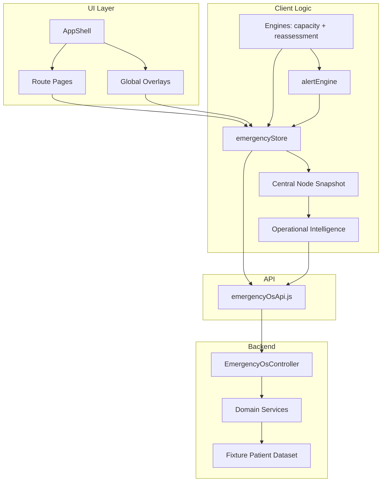

# CareDroid Emergency OS — Explainability Report

**Audience:** New engineers onboarding to CareDroid Emergency OS  
**Goal:** Understand the full active system without reading source code  
**Last updated:** 2026-06-16  
**Scope:** Active runtime path only (mounted routes, AppShell, store, engines, backend `/api/emergency/*`)

---

## 1. What CareDroid Emergency OS Is

CareDroid Emergency OS is a **single-page React application** wrapped in a dedicated **App Shell**, backed by a **NestJS Emergency OS module**. It gives ED staff a shared operational picture of:

- Patient flow (whiteboard, journey states, intake)
- Queues and bottlenecks
- Capacity and boarding pressure
- EMS inbound and handoff
- Reassessment and safety flags
- Referrals and transfers
- Operational alerts and AI copilot assistance
- Tenant settings, thresholds, and audit logs

The product is designed as **decision support only**. No module autonomously admits, discharges, triages, or orders care. Human review is required for operational intelligence and AI outputs.

---

## 2. System Topology

```text
Browser (Vite React SPA)
│
├─ Entry: src/main.jsx
├─ Router: src/App.jsx
├─ Shell: src/components/AppShell.tsx
│    ├─ Sidebar (role-filtered nav)
│    ├─ Header (metrics, alerts, OI strip)
│    ├─ Main outlet (route pages)
│    └─ Global overlays (patient detail, copilot, EMS broadcast, reassessment drawer, command palette)
│
├─ Client state: src/store/emergencyStore.ts (Zustand)
├─ Interval engines: capacityEngine, reassessmentEngine
├─ Central node: src/central-node/careDroidCentralNode.ts
├─ Operational intelligence: src/operational-intelligence/
├─ API facade: src/services/emergencyOsApi.js
│
└─ HTTP → Backend NestJS
     └─ backend/src/modules/emergency-os/
          └─ /api/emergency/*
```



---

## 3. Bootstrap and Runtime Lifecycle

When a user opens any `/emergency/*` route:

1. **AppShell mounts** and calls `initializeFromBackend()` on the emergency store.
2. **Store refresh** runs `refreshAllData()`, which parallel-fetches active `/api/emergency/*` endpoints (whiteboard, patients, EMS, queues, capacity, boarding, referrals, settings, central node, etc.).
3. **Hydration** merges API payloads into Zustand via `hydrateFromApi()`. Operational alerts from module payloads are normalized and merged.
4. **Fallback:** If the backend is unreachable, the store keeps **seed fixtures** (`SEED_PATIENTS`, `SEED_ROOMS`, etc.) and sets `backendAvailable: false`, `persistenceMode: 'local'`.
5. **Engines start:**
   - `startCapacityEngine()` — recalculates capacity every **30 seconds**; dispatches Orange/Red alerts.
   - `startReassessmentEngine()` — runs reassessment rules every **60 seconds**; flags patients and dispatches alerts.
6. **Dev-only:** In development, `simulation.ts` may inject random patient arrivals.
7. **Realtime (optional):** `useCareDroidCentralNode({ realtime: true })` starts SSE/WebSocket/polling via `emergencyRealtimeService.js` and pushes events into the store.

Every patient mutation (add, move state, vitals, flags, EMS conversion) recalculates **capacity** locally via `buildCapacitySnapshot()` using the shared formula in `lib/emergency-os/logic.ts`.

---

## 4. Canonical Data Model (Store)

The emergency store is the **single client source of truth**. Key slices:

| Slice | Contents |
|-------|----------|
| `patients` | Active ED patients with journey state, priority, vitals, flags, timeline |
| `rooms` | Room occupancy and assignment |
| `emsArrivals` | Inbound EMS units and handoff status |
| `referrals` | Referral/transfer queue |
| `capacity` | Score (0–100), band (Green/Yellow/Orange/Red), factor deductions |
| `alerts` | Operational and clinical alerts (dismissible) |
| `queues` | Queue summaries from API hydration |
| `emergencySettings` | Thresholds, modules, OI settings, screen modes |
| `workflowLogs` | Staff action audit trail |
| `copilotOpen` / UI selection | Shell overlay state |

**Shared capacity formula:** `calculateEmergencyOsCapacity()` in `lib/emergency-os/logic.ts` — used by store, capacity engine, and backend `computeCapacity()`.

---

## 5. Active Routes

| Route | Primary UI | Nav visible |
|-------|------------|-------------|
| `/emergency/whiteboard` | Emergency whiteboard (command board) | Yes |
| `/emergency/intake` | Smart Intake | Yes |
| `/emergency/ems` | EMS Pipeline | Yes (feature-gated) |
| `/emergency/patients` | Patient census + journey | Yes |
| `/emergency/queues` | Queue intelligence | Yes |
| `/emergency/reassessment` | Reassessment queue | Yes |
| `/emergency/capacity` | Capacity detail | Yes (feature-gated) |
| `/emergency/boarding` | Boarding dashboard | Yes |
| `/emergency/referrals` | Referral panel | Yes (feature-gated) |
| `/emergency/copilot` | Copilot summary page | Yes |
| `/emergency/tools` | Medical tools hub | Yes |
| `/emergency/analytics` | Emergency analytics | Yes |
| `/emergency/settings` | Emergency settings | Yes |
| `/emergency/pulse` | Department pulse (handoff) | Direct link only |
| `/emergency/shift` | Shift summary | Direct link only |

Legacy paths (e.g. `/emergency/journey`, `/emergency/command-center`, `/emergency/simulation`) **redirect** to whiteboard or patients.

---

## 6. Module Reference

Each section follows the same template: **Purpose → Data source → Services → UI → Workflow → Dependencies**.

---

### 6.1 App Shell

**Purpose**  
Root layout for all Emergency OS pages: navigation, header metrics, keyboard shortcuts, global overlays, and engine startup.

**Data source**  
`useEmergencyStore` (selection, copilot state, patients); role from `useEmergencyRolePermissions`; navigation from `unified-navigation.config.ts`.

**Services / files**  
- `src/components/AppShell.tsx`  
- `src/components/Header.tsx`  
- `src/components/Sidebar.tsx`  
- `src/config/unified-navigation.config.ts`  
- `src/config/emergencyRolePermissions.js`

**UI**  
Wraps all `/emergency/*` routes. Not a standalone page.

**Workflow**  
1. Mount → `initializeFromBackend()`  
2. Start capacity + reassessment engines  
3. Register shortcuts: `N` intake, `R` reassessment drawer, `C` copilot, `Ctrl/Cmd+K` command palette  
4. Render `<Outlet />` for route pages + lazy overlays (patient detail, copilot, EMS broadcast, reassessment drawer)

**Dependencies**  
Store, engines, RBAC, all route modules, command palette, copilot panel.

---

### 6.2 Routing and Access Control

**Purpose**  
Define canonical Emergency OS URLs, legacy redirects, and per-route role guards.

**Data source**  
Static route config; role permission matrix.

**Services / files**  
- `src/App.jsx`  
- `src/config/routes.config.js`  
- `src/config/emergencyRolePermissions.js`  
- `src/hooks/useEmergencyRolePermissions.ts`

**UI**  
`EmergencyRouteGuard` wraps protected routes; denied users see access-denied with nearest allowed route.

**Workflow**  
Unauthenticated users → `/auth`. Authenticated users → role-checked route render inside AppShell.

**Dependencies**  
AppShell, UserContext, emergency role config.

---

### 6.3 Emergency Store (Client State)

**Purpose**  
Central Zustand store for all ED operational data and mutations.

**Data source**  
Backend hydrate + local seed fixtures + user actions + engine updates.

**Services / files**  
- `src/store/emergencyStore.ts`  
- `src/types/emergency.ts`  
- `src/services/emergencyOsApi.js` (fetch/hydrate)

**UI**  
No direct UI; consumed by every module via hooks/selectors.

**Workflow**  
- **Read:** Components subscribe to store slices  
- **Write:** Actions (`addPatient`, `movePatientToState`, `addEMSArrival`, `convertEMSArrivalToPatient`, `dismissAlert`, etc.)  
- **Sync:** `refreshAllData()` → `hydrateFromApi()` on init and manual refresh  
- **Alerts:** Built from module payloads (`buildCapacityAlert`, `buildBoardingAlert`, `buildEmsAlert`, etc.) and engine dispatch

**Dependencies**  
API facade, `lib/emergency-os/logic.ts`, alert engine, workflow logs.

---

### 6.4 Emergency OS API Facade

**Purpose**  
Single HTTP client for all `/api/emergency/*` calls with active vs review-only endpoint classification.

**Data source**  
Nest `EmergencyOsController`.

**Services / files**  
- `src/services/emergencyOsApi.js`  
- `src/services/apiClient.js`  
- `src/hooks/useEmergencyOs.js` (per-module hooks)

**UI**  
None (infrastructure).

**Workflow**  
Hooks and store call `fetchEmergencyWhiteboard()`, `fetchCapacityStatus()`, etc. → parse envelope → hydrate store or return to page.

**Dependencies**  
Backend emergency-os module, store hydration helpers.

---

### 6.5 Whiteboard (Command Board)

**Purpose**  
Primary ED command surface: filtered patient grid, operational metrics, crisis mode entry, queue panel, OI signals, quick intake entry.

**Data source**  
Store patients/rooms/capacity + `GET /api/emergency/whiteboard` + central node + OI snapshot.

**Services / files**  
- `src/components/EmergencyWhiteboard.jsx` → `src/pages/emergency/index.tsx`  
- `src/components/PatientCard.jsx`  
- `src/components/QueueIntelligencePanel.jsx`  
- `src/components/CapacityCrisisMode.tsx`  
- `src/components/WhoNextPanel.tsx`  
- `src/services/emergencyWhiteboardService.js` (demo/advisory aggregation)

**UI**  
Route: `/emergency/whiteboard`. Default landing route (`/` redirects here).

**Workflow**  
1. Load patients from store (hydrated from API)  
2. Apply filters (priority, state, flags)  
3. Metric chips deep-link to capacity/EMS/queues routes  
4. Crisis overlay when capacity band is Orange/Red  
5. `open-intake` custom event opens Quick Intake modal

**Dependencies**  
Store, capacity engine, OI hook, queue panel, patient detail panel, Quick Intake.

---

### 6.6 Quick Intake (Modal)

**Purpose**  
Fast patient creation from whiteboard without leaving the board.

**Data source**  
Store `addPatient` + optional `POST /api/emergency/intake` / vertical-slice validation.

**Services / files**  
- `src/components/QuickIntake.tsx`  
- `src/engine/complaintRouter.ts`  
- `src/engine/triageEngine.ts`

**UI**  
Modal overlay on whiteboard (not a route). Opened via keyboard `N` or command palette.

**Workflow**  
1. Enter demographics + complaint  
2. Complaint router suggests calculators/protocols  
3. Triage engine may suggest priority  
4. `addPatient` → store updates → capacity recalc → whiteboard refresh

**Dependencies**  
Store, RBAC (`createPatient`), complaint router, triage engine, central control policy.

---

### 6.7 Smart Intake (Full Intake)

**Purpose**  
Structured identity verification and patient creation workflow with validation steps.

**Data source**  
Store + `GET/POST /api/emergency/intake` + demo fixtures for vertical-slice scenarios.

**Services / files**  
- `src/pages/emergency/SmartIntake.jsx`  
- Backend: `SmartIntakeService`  
- `src/data/smartIntakeFixtures.js`

**UI**  
Route: `/emergency/intake`

**Workflow**  
1. Load intake template from API  
2. User completes verification steps  
3. Submit → create patient in backend fixture store + hydrate frontend  
4. Navigate to whiteboard or patient detail

**Dependencies**  
Store, API intake endpoints, triage/complaint routing, RBAC.

---

### 6.8 Patients and Patient Journey

**Purpose**  
Searchable patient census with journey state counts and timeline envelope.

**Data source**  
Store patients + `GET /api/emergency/patients` + `GET /api/emergency/journey`.

**Services / files**  
- Inline `PatientsRoute` in `src/App.jsx`  
- Backend: `EmergencyPatientService`, `PatientJourneyService`

**UI**  
Route: `/emergency/patients` (journey merged here; `/emergency/journey` redirects)

**Workflow**  
1. List active patients with state badges  
2. Journey API provides state histogram and timeline events  
3. Click patient → opens Patient Detail Panel (global overlay)

**Dependencies**  
Store, patient detail panel, journey API.

---

### 6.9 Patient Detail Panel

**Purpose**  
Slide-out workspace for one patient: vitals, notes, state transitions, protocols, complaint routing, upgrade-harness cards.

**Data source**  
Store selection (`selectedPatientId`) + patient record + referral/EMS context.

**Services / files**  
- `src/components/PatientDetailPanel.tsx`  
- `src/engine/complaintRouter.ts`  
- `src/hooks/useUpgradeHarnessPatientFlow` (review cards)

**UI**  
Global overlay in AppShell (lazy-loaded). Opened from whiteboard, patients route, alerts, command palette.

**Workflow**  
1. Select patient → panel opens  
2. Staff records vitals → NEWS2 may auto-flag reassessment + alert  
3. State moves update timeline and capacity  
4. Protocol links (sepsis, stroke) and calculator launchers available  
5. Close → clears selection

**Dependencies**  
Store, alert engine, complaint router, RBAC action permissions, Who Next panel.

---

### 6.10 Queue Intelligence

**Purpose**  
Surface queue health, wait breaches, bottlenecks, and queue-level recommendations.

**Data source**  
Store `queues` (from API hydrate) + store patient states for live breach detection + demo queue scoring in `queueIntelligenceService.js`.

**Services / files**  
- `src/services/queueIntelligenceService.js` (scoring formulas, demo defaults)  
- Backend: `QueueIntelligenceService`  
- `src/components/QueueIntelligencePanel.jsx` (whiteboard widget)

**UI**  
- Route: `/emergency/queues`  
- Widget: embedded on whiteboard

**Workflow**  
1. API returns queue summaries with counts and wait times  
2. Central node `buildQueueHealth()` marks queues **breached** when oldest wait > target  
3. OI uses breached queue count as `queue-bottleneck-score`  
4. Store `buildQueueAlert()` creates alerts for breaches  
5. Flow engine and escalation engine consume bottleneck lists for recommendations

**Dependencies**  
Store, central node, OI, analytics loader, referrals (referral queue), reassessment flags.

---

### 6.11 Capacity Engine and Capacity UI

**Purpose**  
Continuously score department capacity (0–100) and band (Green→Red); expose crisis breakdown and recommendations.

**Data source**  
Store patients, rooms, thresholds → `calculateEmergencyOsCapacity()`.

**Services / files**  
- `lib/emergency-os/logic.ts` (**canonical formula**)  
- `src/engine/capacityEngine.ts`  
- Backend: `EmergencyPatientService.computeCapacity()`  
- `src/components/CapacityCrisisMode.tsx`  
- Demo alternate: `src/services/emergencyCapacityIntelligenceService.js` (advisory only)

**UI**  
- Route: `/emergency/capacity`  
- Header metric strip  
- Crisis modal on whiteboard  
- Capacity section in analytics

**Workflow**  
1. Every 30s: engine reads store → calculates score/band → `setCapacity()`  
2. Orange/Red → `dispatchAlert()` via alert engine  
3. Crisis mode derives factor breakdown (boarding, occupancy, reassessment, discharge, EMS)  
4. Backend logs `capacity_score_changed` in workflow logs when score delta detected

**Dependencies**  
Store, alert engine, thresholds from settings, boarding/EMS patient states.

---

### 6.12 Boarding Intelligence

**Purpose**  
Track admitted patients waiting for inpatient beds; surface longest boarders and escalation status.

**Data source**  
Store patients in `Admission` state + `GET /api/emergency/boarding` + demo boarder list in `boardingIntelligenceEngine.js`.

**Services / files**  
- `src/services/boardingIntelligenceEngine.js` (0–100 boarding risk score on demo data)  
- Backend: `BoardingService`  
- Central node: boarder count + `boardingRisk` pressure band

**UI**  
Route: `/emergency/boarding`

**Workflow**  
1. Boarders counted from store (Admission state)  
2. Central node maps count to `normal | watch | strained | critical`  
3. Store `buildBoardingAlert()` fires when boarding patients present; **critical** at ≥240 min longest boarding  
4. Flow/escalation engines add boarding pressure detections when score/count thresholds exceeded

**Dependencies**  
Capacity (boarders consume capacity), referrals, settings `boardingThresholds`.

---

### 6.13 EMS Pipeline and Critical Broadcast

**Purpose**  
Manage inbound EMS arrivals: ETA, bay prep, handoff, convert-to-patient; full-screen critical arrival overlay.

**Data source**  
Store `emsArrivals`, `emsIncomingPatients` + `GET /api/emergency/ems` + offload demo in `emsOffloadCommandCenterService.js`.

**Services / files**  
- `src/components/EMSPipeline.jsx`  
- `src/components/EMSCriticalBroadcast.jsx`  
- `src/components/EMSPressureScore.jsx`  
- Store actions: `addEMSArrival`, `prepareEMSBay`, `updateEMSArrival`, `convertEMSArrivalToPatient`  
- Backend: `EMSIntakeService` (read-only list in fixture mode)

**UI**  
- Route: `/emergency/ems`  
- Global overlay: EMS Critical Broadcast (AppShell)

**Workflow**  
1. EMS unit added (manual, API hydrate, or simulation)  
2. Status progression: Inbound → Arrived → Handoff → Offloaded (frontend-owned in store)  
3. Critical arrivals trigger broadcast overlay with checklist  
4. **Convert to patient** creates whiteboard patient with EMS flag  
5. Central node aggregates inbound count → `emsPressure` band  
6. Store `buildEmsAlert()` for inbound/critical EMS

**Dependencies**  
Store, patient creation, capacity (critical EMS factor), central node, RBAC, critical checklists config.

**Note:** Backend EMS POST/conversion for Emergency OS is not fully wired; conversion is **frontend store action**.

---

### 6.14 Reassessment Engine and Reassessment UI

**Purpose**  
Automatically flag patients needing reassessment and surface due/overdue queues.

**Data source**  
Store patients, vitals age, priority thresholds, `longWaitRescue` util.

**Services / files**  
- `src/engine/reassessmentEngine.ts`  
- Backend: `ReassessmentService`  
- `src/components/ReassessmentDrawer.tsx`  
- `src/utils/longWaitRescue.ts`

**UI**  
- Route: `/emergency/reassessment`  
- Drawer overlay (keyboard `R`)  
- Header badge count

**Workflow (every 60s)**  
1. **Long-wait rescue:** waiting patients exceeding thresholds → deduped alerts  
2. **Priority reassessment:** P1/P2 high-risk patients in later states → `ReassessmentDue` flag  
3. **Vital age:** stale vitals → flag + alert  
4. **LWBS risk:** extended waits → critical alert  
5. Staff complete reassessment primarily via **removeFlag** (not automatic on vitals entry)

**Dependencies**  
Store, alert engine, settings thresholds, patient detail.

---

### 6.15 Triage Engine

**Purpose**  
Rule-based CTAS/priority suggestion from complaint text and vitals during intake.

**Data source**  
Pure function inputs (no persistence).

**Services / files**  
- `src/engine/triageEngine.ts`

**UI**  
Embedded in Quick Intake and Smart Intake flows (not a standalone route).

**Workflow**  
Complaint + vitals → suggested priority → staff confirms before patient creation.

**Dependencies**  
Intake modules, store priority assignment.

---

### 6.16 Referrals

**Purpose**  
Referral and transfer queue: create requests, track status, link to patients.

**Data source**  
Store `referrals` + `GET/POST /api/emergency/referrals`.

**Services / files**  
- `src/components/ReferralPanel.jsx`  
- Backend: `ReferralService`  
- `src/services/referralHub.js` (demo dashboard for KPI/flow engines)

**UI**  
Route: `/emergency/referrals`

**Workflow**  
1. Create referral linked to patient  
2. Update status (pending → accepted → completed)  
3. Store `buildReferralAlert()` for active/emergent referrals  
4. Referral delays feed flow engine detections

**Dependencies**  
Store, patients, RBAC (`manageReferral`), command palette `OPEN_REFERRAL`.

---

### 6.17 Alert Engine and Notification Center

**Purpose**  
Unified in-app alert dispatch: persist to store, show Sonner toasts, feed header notification center.

**Data source**  
In-memory dispatch + store `alerts` + merged backend operational alerts on hydrate.

**Services / files**  
- `src/engine/alertEngine.ts`  
- Store alert builders in `emergencyStore.ts`  
- `src/components/Header.tsx` (notification center UI)

**UI**  
Header bell/drawer; Sonner toasts for Critical/Warning.

**Workflow**  
1. Producer calls `dispatchAlert({ severity, title, message, patientId?, source })`  
2. Alert appended to store (dedupe by id where implemented)  
3. Toast shown; Critical toasts persist until dismissed  
4. Header merges store alerts + OI alerts + central node counts  
5. Dismissal via `dismissAlert(id)`

**Triggers**  
Capacity engine, reassessment engine, vitals/NEWS2, capacity crisis UI, calculator score warnings, module refresh builders.

**Dependencies**  
Store, Sonner, Header, OI (parallel alert stream).

**Note:** Platform Postgres push notifications (`/api/notifications`) are **not** merged into the ED notification center.

---

### 6.18 CareDroid Central Node

**Purpose**  
Unified department snapshot consumed by header, analytics, copilot, and operational intelligence.

**Data source**  
Primary: **derived from store** via `buildCareDroidCentralNodeSnapshot()`. Optional overlay: `GET /api/emergency/central-node/snapshot`.

**Services / files**  
- `src/central-node/careDroidCentralNode.ts`  
- `src/hooks/useCareDroidCentralNode.ts`  
- Backend: `CareDroidCentralNodeService`

**UI**  
No standalone route. Snapshot powers header metrics, analytics charts, copilot context.

**Snapshot includes**  
Patients today, active/waiting counts, waits, EMS pressure, capacity status, boarding risk, reassessment due, referral pending, queue health (breached flags), operational alerts, screen mode, sync freshness.

**Workflow**  
1. Store changes → central node hook recomputes snapshot  
2. Optional backend snapshot replaces/enriches fields when available  
3. Realtime service may push sync timestamps and events  
4. Passed to OI builder and Copilot context assembler

**Dependencies**  
Store, realtime service, backend patient service, settings.

---

### 6.19 Operational Intelligence (OI)

**Purpose**  
Rule-baseline operational layer: scores, signals, anomalies, recommendations, and OI-native alerts. All outputs are **advisory** with `humanReviewRequired: true`.

**Data source**  
Central node snapshot + backend OI endpoints + tenant OI settings.

**Services / files**  
- `src/operational-intelligence/careDroidOperationalIntelligence.ts`  
- `src/operational-intelligence/operationalIntelligence.types.ts`  
- `src/hooks/useOperationalIntelligence.ts`  
- Backend: `OperationalIntelligenceService`  
- Endpoints: snapshot, model-health, alerts, evaluate

**UI**  
Header operational strip, whiteboard badges, analytics integration, copilot context, settings OI section.

**Workflow**  
1. Central node snapshot built  
2. `buildCareDroidOperationalIntelligenceSnapshot()` computes scores:
   - capacity-score, ems-pressure-score, boarding-risk-score, queue-bottleneck-score, reassessment-priority-score  
3. Anomalies detected (stale data, queue breach, Red capacity)  
4. Recommendations generated with deep-link routes  
5. Optional polling when `realtime: true` and OI enabled in settings

**Dependencies**  
Central node, settings, workflow logs, Header, Copilot, Analytics.

**Limitation:** `predictions: []` — no time-series trend engine yet; KPI trends in `EmergencyKPILayerService` are snapshot heuristics only.

---

### 6.20 Copilot (AI Assistant)

**Purpose**  
ED-context AI assistant: answers operational questions, summarizes department state, logs workflow actions. Advisory only.

**Data source**  
Store + central node + OI snapshot + conversation history. LLM via `POST /api/emergency/copilot/message` (Anthropic) through `lib/ai/client.ts`.

**Services / files**  
- `src/components/CopilotPanel.tsx` (docked panel in AppShell)  
- Copilot route summary in `src/App.jsx`  
- Backend: `EDCopilotService`, `ChatService.handleEdCopilot`  
- `lib/ai/promptRegistry.ts`, `lib/ai/config.ts`

**UI**  
- Docked panel (role-gated, `useCopilot` permission)  
- Route: `/emergency/copilot` (summary/quick actions)  
- Keyboard: `C` toggles panel

**Workflow**  
1. User sends message with ED context bundle (capacity, EMS, boarding, queues, selected patient)  
2. Backend applies governance/safety checks  
3. LLM response returned with suggestions  
4. Workflow log entry recorded  
5. Panel hidden on tablet unless explicitly opened (responsive behavior)

**Dependencies**  
OI, central node, store, RBAC, AI governance settings.

---

### 6.21 Command Palette

**Purpose**  
Keyboard-driven navigation and actions: find patient, open routes, start intake, open referrals, launch calculators.

**Data source**  
`commandPalette.config.js`, store patients, RBAC-filtered actions.

**Services / files**  
- `src/components/CommandPalette.tsx`  
- `src/config/commandPalette.config.js`

**UI**  
AppShell overlay. Shortcuts: `Ctrl/Cmd+K`, `/`.

**Workflow**  
User selects action → AppShell `handleCommandExecute` → navigate, open overlay, or dispatch store action.

**Dependencies**  
AppShell, RBAC, store, routes config.

---

### 6.22 Emergency Analytics

**Purpose**  
Operational KPI charts, central-command metrics, OI integration, upgrade-harness pilot cards.

**Data source**  
Store + `GET /api/emergency/analytics` + central node + OI + upgrade-harness endpoints (review).

**Services / files**  
- `src/pages/emergency/EmergencyAnalytics.jsx`  
- Backend: `EmergencyAnalyticsService`  
- `src/services/emergencyKpiLayerService.js` (canonical KPI definitions for demos)

**UI**  
Route: `/emergency/analytics` (also `/analytics` redirect)

**Workflow**  
1. Load analytics envelope from API  
2. Merge with live central node snapshot  
3. Render charts for wait times, EMS pressure, capacity, boarding, referrals  
4. OI badges overlay where configured

**Dependencies**  
Central node, OI, store, upgrade harness (optional cards).

---

### 6.23 Department Pulse and Shift Summary

**Purpose**  
Shift handoff utilities: "while you were away" pulse and end-of-shift summary with brief generator.

**Data source**  
Store-derived metrics + localStorage last-view timestamp (pulse).

**Services / files**  
- `src/pages/emergency/pulse/index.tsx`  
- `src/pages/emergency/shift/index.tsx`

**UI**  
- `/emergency/pulse` (direct link, not main nav)  
- `/emergency/shift`

**Workflow**  
Pulse compares current store state to last visit timestamp. Shift page aggregates shift stats and generates handoff text.

**Dependencies**  
Store selectors, active shift context.

---

### 6.24 Medical Tools

**Purpose**  
Clinical calculator hub and tool launchers; bridges to platform tool catalog with Emergency OS context.

**Data source**  
Clinical tool catalog, workspace preferences, complaint router events.

**Services / files**  
- `src/pages/tools/ToolsOverview.jsx`  
- Clinical calculator components under `src/components/calculators/`  
- `src/data/clinicalIntentToolCatalog.js`

**UI**  
Route: `/emergency/tools` (+ many legacy `/tools/*` redirects)

**Workflow**  
1. Browse or search calculators  
2. Launch tool → may dispatch score alerts via alert engine  
3. Complaint router can deep-link from patient context (`ed:open-tools` event)

**Dependencies**  
Platform contexts (ToolPreferences, CostTracking), complaint router, RBAC.

---

### 6.25 Complaint / Clinical Intent Router

**Purpose**  
Map chief complaint to recommended calculators, protocols, and workflow hints.

**Data source**  
Static clinical intent catalog.

**Services / files**  
- `src/engine/complaintRouter.ts`  
- `src/data/clinicalIntentRouter.js`

**UI**  
Embedded in intake and patient detail (not a route).

**Workflow**  
Complaint text → matched intents → UI shows protocol/calculator chips.

**Dependencies**  
Intake, patient detail, tools route.

---

### 6.26 Emergency Settings

**Purpose**  
Tenant configuration: thresholds, enabled modules, AI/OI toggles, integrations, provincial health fixtures, governance, audit export.

**Data source**  
Store `emergencySettings` + `GET/PATCH /api/emergency/settings` + integration/provincial/governance APIs.

**Services / files**  
- `src/pages/emergency/EmergencySettings.jsx`  
- `src/config/emergencySettings.config.js`  
- `src/services/emergencySettingsApi.js`  
- Backend: `EmergencySettingsService`

**UI**  
Route: `/emergency/settings`

**Workflow**  
1. Load settings envelope  
2. User edits thresholds/modules/OI config  
3. Patch to backend → hydrate store  
4. Engines and central node immediately use new thresholds

**Dependencies**  
Store, OI settings, feature flags, integration/provincial API fixtures.

---

### 6.27 Feature Flags and Pilot Mode

**Purpose**  
Toggle module visibility (EMS pipeline, capacity intel, referral intel) and limit nav for pilot customers.

**Data source**  
Store `features`/`flags` + settings + `PILOT_CUSTOMER_MODE` in navigation config.

**Services / files**  
- `src/config/unified-navigation.config.ts`  
- Store: `initializeFlags`, `toggleFeature`

**UI**  
Navigation visibility; some routes hidden when feature disabled.

**Workflow**  
Feature gate checked in nav builder → Sidebar hides gated items → route guard may still allow direct URL depending on role.

**Dependencies**  
Navigation, settings, EMS/Capacity/Referrals modules.

---

### 6.28 Realtime Transport

**Purpose**  
Optional live updates into store via SSE, WebSocket, or polling fallback.

**Data source**  
Env-configured paths (`VITE_ED_REALTIME_*`) or polling interval.

**Services / files**  
- `src/services/emergencyRealtimeService.js`  
- Store: `dispatchWebSocketEvent`, websocket status slice

**UI**  
None directly; affects sync indicator in central node/header.

**Workflow**  
Started from `useCareDroidCentralNode({ realtime: true })` → events merged via `hydrateFromApi` / realtime payload builders.

**Dependencies**  
Store, central node hook.

**Note:** Often runs in polling mode; full SSE spine may be disabled in some environments.

---

### 6.29 Workflow Action Log

**Purpose**  
Auditable record of staff and system actions for settings export and OI context.

**Data source**  
Store `workflowLogs` + `GET /api/emergency/workflow-logs`.

**Services / files**  
- Store append helpers (`appendWorkflowLogs`)  
- Backend: `WorkflowActionLogService`

**UI**  
Settings audit section; indirect presence in OI.

**Workflow**  
Significant actions (patient created, state change, capacity score change, copilot message, EMS conversion) append log entries locally and sync from backend on refresh.

**Dependencies**  
Store mutations, settings, OI.

---

## 7. Backend Emergency OS Module

All backend services live under `backend/src/modules/emergency-os/`. The controller exposes `/api/emergency/*`.

**Default data mode:** In-memory **fixture patient dataset** (`emergency-os.fixtures.ts`). Services read/mutate this dataset unless later wired to a live EHR.

| Service | Endpoint(s) | Purpose |
|---------|-------------|---------|
| `EmergencyWhiteboardService` | `GET whiteboard` | Whiteboard payload |
| `EmergencyPatientService` | `GET/POST patients` | Patient CRUD + `computeCapacity()` |
| `PatientJourneyService` | `GET journey` | State counts + timeline |
| `SmartIntakeService` | `GET/POST intake`, `POST intake/vertical-slice` | Intake templates + create |
| `EMSIntakeService` | `GET ems` | EMS arrival list (read) |
| `QueueIntelligenceService` | `GET queues` | Queue metrics |
| `ReassessmentService` | `GET reassessment` | Due/overdue queue |
| `CapacityService` | `GET capacity` | Capacity snapshot |
| `BoardingService` | `GET boarding` | Boarder census |
| `ReferralService` | `GET/POST referrals` | Referral queue |
| `EDCopilotService` | `GET/POST copilot/*` | Copilot context + query |
| `EmergencyAnalyticsService` | `GET analytics` | Analytics envelope |
| `EmergencySettingsService` | `GET/PATCH settings` | Tenant settings |
| `CareDroidCentralNodeService` | `GET central-node/snapshot` | Department snapshot |
| `OperationalIntelligenceService` | `GET/POST operational-intelligence/*` | OI snapshot, evaluate, alerts |
| `WorkflowActionLogService` | `GET workflow-logs` | Audit trail |
| `ProvincialHealthService` | `GET provincial-health` | Settings fixture |
| `IntegrationHubService` | `GET integrations` | Settings fixture |
| `EmergencyOsUpgradeHarnessService` | `GET upgrade-harness/*` | Pilot/review cards |

**Review-only backend surfaces** (exported in API facade but not primary nav): simulation, federated learning, digital twin, implementation-readiness, research controllers.

---

## 8. Background Engines Summary

| Engine | Interval | Input | Output | Alert? |
|--------|----------|-------|--------|--------|
| **Capacity** | 30s | Store patients, rooms, thresholds | Updated `capacity` slice | Orange/Red → toast + store |
| **Reassessment** | 60s | Store patients, vitals, waits | Flags + alerts | Long wait, deterioration, LWBS |
| **Simulation** (dev) | Variable | Random | New patients/state changes | Optional via simulation alerts |
| **Alert engine** | Event-driven | Any producer | Store alert + Sonner | Always |

---

## 9. Scoring and Intelligence Spine

For operational scoring (queue, capacity, boarding, EMS, alerts, trends):

| Signal | Canonical implementation | Live? |
|--------|-------------------------|-------|
| Capacity score | `lib/emergency-os/logic.ts` | **Yes** |
| Queue breach | Central node `buildQueueHealth()` | **Yes** |
| Queue numeric score | `queueIntelligenceService.js` | Demo defaults |
| Boarding risk band | Central node count + settings | **Yes** |
| Boarding 0–100 score | `boardingIntelligenceEngine.js` | Demo data |
| EMS pressure band | Central node inbound counts | **Yes** |
| EMS offload pressure | `emsOffloadCommandCenterService.js` | Demo data |
| OI scores | Rule baseline in OI services | **Yes** (derived) |
| Trend detection | KPI heuristics only | **No time series** |

---

## 10. Role-Based Access Control (RBAC)

ED roles (e.g. charge nurse, physician, triage, registration, EMS, read-only) define:

- **Route access** — which `/emergency/*` pages load  
- **Actions** — `createPatient`, `useCopilot`, `manageReferral`, `movePatient`, etc.

Config: `src/config/emergencyRolePermissions.js`  
Hook: `useEmergencyRolePermissions()`  
Guard: route wrappers in `App.jsx`

Navigation is further filtered by **pilot customer mode** and **feature gates** in `unified-navigation.config.ts`.

---

## 11. End-to-End Workflow Examples

### 11.1 New walk-in patient

```text
Whiteboard → Quick Intake (N) → triageEngine suggests priority
→ addPatient (store) → buildCapacitySnapshot updates
→ Patient card appears on whiteboard
→ Optional: open Patient Detail → add vitals → NEWS2 may flag reassessment
```

### 11.2 EMS arrival to whiteboard patient

```text
EMS Pipeline → addEMSArrival (store) → central node emsPressure updates
→ Critical? → EMSCriticalBroadcast overlay
→ prepareEMSBay / updateEMSArrival → convertEMSArrivalToPatient
→ New patient with EMS flag → capacity critical EMS factor updates
```

### 11.3 Capacity crisis

```text
capacityEngine (30s) → calculateEmergencyOsCapacity → band Orange/Red
→ dispatchAlert → Header notification + Sonner toast
→ Whiteboard opens CapacityCrisisMode → factor breakdown
→ Staff actions: review boarders, discharge-ready, reassessment queue (human-owned)
```

### 11.4 Operational intelligence loop

```text
Store changes → buildCareDroidCentralNodeSnapshot
→ buildCareDroidOperationalIntelligenceSnapshot
→ Header strip + OI badges + Copilot context
→ Optional backend OI polling merges server snapshot
```

---

## 12. Legacy and Disconnected (Not Active Standalone)

| Item | Status |
|------|--------|
| `src/layout/AppShell.jsx` + `AppShell.css` | Legacy platform shell; **not mounted** in Emergency OS runtime |
| `/emergency/command-center` | Redirects to whiteboard |
| `/emergency/simulation`, `/emergency/federated-learning` | Redirect to whiteboard |
| `/emergency/provincial-health`, `/emergency/integrations` | API consumed in Settings only; routes redirect |
| Platform push notifications | Not merged into ED alert center |
| Postgres notification API | Separate from ED `alertEngine` |
| HL7/FHIR live feeds | Integration hub fixtures; not consumed by ED engines |
| OI predictions array | Empty stub |
| Backend EMS POST for Emergency OS | Read-only GET; conversion is frontend store |

---

## 13. Key Files for New Engineers

| If you need to… | Start here |
|-----------------|------------|
| Understand routing | `src/App.jsx`, `src/config/routes.config.js` |
| Understand state | `src/store/emergencyStore.ts`, `src/types/emergency.ts` |
| Understand layout/startup | `src/components/AppShell.tsx` |
| Understand API contracts | `src/services/emergencyOsApi.js`, `backend/.../emergency-os.controller.ts` |
| Understand capacity math | `lib/emergency-os/logic.ts` |
| Understand department snapshot | `src/central-node/careDroidCentralNode.ts` |
| Understand OI | `src/operational-intelligence/careDroidOperationalIntelligence.ts` |
| Understand alerts | `src/engine/alertEngine.ts` |
| Understand navigation/RBAC | `src/config/unified-navigation.config.ts`, `emergencyRolePermissions.js` |
| Understand backend domain | `backend/src/modules/emergency-os/emergency-os.services.ts` |

---

## 14. Mental Model (One Paragraph)

CareDroid Emergency OS is a **store-centric React app** where almost every screen reads from **Zustand**, optionally enriched by **Nest fixture APIs**, continuously evaluated by **capacity and reassessment engines**, summarized by the **central node**, interpreted by **rule-based operational intelligence**, and surfaced through a **whiteboard-first navigation model** with global overlays for patient detail, EMS crises, copilot, and alerts. Backend services provide envelopes and persistence for demos; the **live interaction spine** is the frontend store plus shared emergency logic in `lib/emergency-os/logic.ts`. Treat every automation as **advisory** until explicit human action confirms it.

---

## 15. Related Architecture Docs

- `docs/architecture/active-system-map.md` — route and endpoint inventory  
- `docs/architecture/central-node-report.md` — central node detail  
- `docs/architecture/operational-intelligence-data-flow.md` — OI wiring  
- `docs/architecture/ai-route-and-service-map.md` — AI/copilot paths  
- `docs/architecture/current-integration-inventory.md` — integration status  
- `docs/architecture/disconnected-integrations.md` — what is not wired

---

*This report describes the active Emergency OS runtime as of the report date. When behavior diverges from this document, treat the mounted path in `App.jsx` + `AppShell.tsx` + `emergencyStore.ts` as source of truth.*
