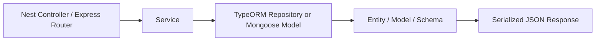
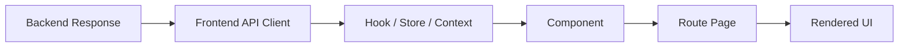
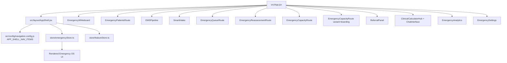
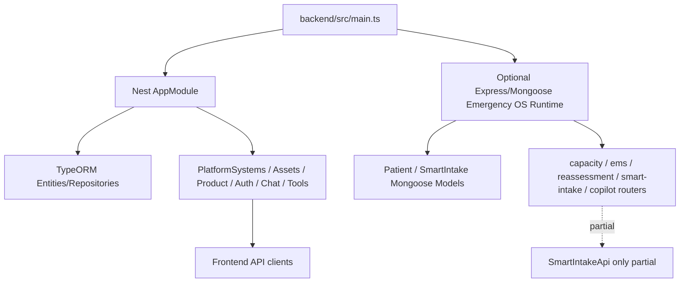

# Current System Inventory

Generated: 2026-06-12

Mode: investigation only. No source code was changed for this inventory.

## Inventory Scope

This report inventories the current CareDroid repository as it exists now, including frontend, backend, routes, pages, layouts, components, hooks, stores, services, API clients, controllers, entities, DTOs, schemas, fixtures, utilities, feature flags, environment/config files, package dependencies, build configuration, TypeScript configuration, and deployment configuration.

Repository scan summary:

| Area | Count / status |
| --- | ---: |
| Total tracked + untracked non-ignored files inspected by category | 2,511 |
| Root/config/deployment files | 41 |
| Frontend `src/` files | 1,215 |
| Backend files under `backend/` | 661 |
| Android native files | 128 |
| Documentation files | 256 |
| Scripts/automation files | 45 |
| Backend Nest controllers/usages | 51 |
| Backend Nest endpoint handlers | about 393 |
| Optional Express/Mongoose Emergency OS handlers | 23 |
| Backend service files | 139 |
| TypeORM entities | 45 |
| DTO/schema/model files | 52+ |

Per-file inventory model used:

| Field | Source |
| --- | --- |
| File path | Git/untracked file scan and directory inventory |
| Purpose | File name, exports, owning directory, route/controller/service context |
| Imports/exports/dependencies | Static import/export inspection from source scans |
| Usage count | Import reachability, route usage, controller/module registration, and existing generated inventories |
| Mounted status | `src/App.jsx`, `src/layout/AppShell.jsx`, Nest `AppModule`, optional Express runtime |
| Route accessibility | React Router route table, redirect table, backend controller/router path |
| Active/inactive | Runtime mount, navigation entry, feature gate, backend module import |
| Emergency OS relevance | Canonical Emergency OS route/module/service mapping |

For the largest per-file listing, see the existing generated file inventory in `docs/architecture/unmounted-components-report.md`, which contains row-level path/import/classification data. This report consolidates that file-level inventory into system-level truth tables and pilot-relevant dependency chains.

## SECTION 1 - Technology Stack

| Category | Actual stack in use |
| --- | --- |
| Frontend framework | React 18 |
| Frontend router | `react-router-dom` v6, route table centralized in `src/App.jsx` |
| Frontend build tool | Vite 7, ESM app, dev port `8000` |
| Backend framework | NestJS 10 with Express adapter |
| Optional backend runtime | Express routers + Mongoose for Emergency OS, mounted only when `ENABLE_MONGOOSE_EMERGENCY_OS=true` and MongoDB URI is configured |
| ORM / data access | TypeORM with direct injected repositories; optional Mongoose models for legacy/Emergency OS runtime |
| Databases | SQLite/Postgres through TypeORM; optional MongoDB through Mongoose; Redis/ioredis for backend services |
| Auth provider | Backend JWT/Passport, Google/LinkedIn OAuth strategies, 2FA; frontend currently has a permissive/dev-open `UserContext` mode and auth token config |
| State management | Zustand stores in `store/emergencyStore.ts` and `store/featureStore.ts`; many React Context providers |
| Styling system | CSS/token files imported through `src/main.jsx`; dormant Tailwind config exists but Tailwind is not an active dependency |
| UI library | Custom React/CSS components, Lucide icons, Recharts charts |
| Testing tools | Vitest + Testing Library + jsdom, Playwright, Jest + ts-jest + Supertest for backend |
| Lint/format | ESLint 9 flat config, Prettier |
| Deployment | Vercel SPA config, Docker/Docker Compose, GitHub Actions, Capacitor/Android |
| Observability | Sentry optional DSN, Datadog APM gated by env, Prometheus metrics, Winston logging |

Configuration inventory:

| File / group | Purpose | Status |
| --- | --- | --- |
| `package.json` | Frontend scripts/dependencies | Active |
| `backend/package.json` | Backend scripts/dependencies | Active |
| `vite.config.js` | Vite build/proxy/chunking | Active |
| `vitest.config.js` | Frontend test config | Active |
| `eslint.config.js` | Frontend lint config | Active |
| `tsconfig.json`, `tsconfig.frontend.json` | TS configs; frontend typecheck targets TS/TSX | Active |
| `backend/tsconfig*.json` | Backend Nest build/test TS configs | Active |
| `vercel.json` | SPA deployment rewrite/header config | Active |
| `docker-compose.yml`, `Dockerfile*` | Multi-service local/infrastructure deployment | Active/configured |
| `capacitor.config.json`, `android/` | Native Android/Capacitor surface | Partially active/stale |
| `.env.example`, `backend/.env.example`, `backend/.env.rag.example` | Env key documentation | Active examples |
| `.env`, `.env.local`, `backend/.env` | Local env files | Present locally; values not documented here |

Notable stack drift:

- `@capacitor/core` and `@capacitor/android` remain on v5; Android sync commands pin `@capacitor/cli@5` via `npx` so web installs do not pull a mismatched CLI.
- CI and Docker runtime baselines are standardized on Node 20.
- Root `.env` mixes frontend `VITE_*` keys with backend-style secrets.
- Tailwind config exists, but Tailwind is effectively dormant.

## SECTION 2 - Route Inventory

### Active Emergency OS Routes

All active Emergency OS routes use `AppShellPage -> AppShell`.

| Route path | Page/component | Layout | Navigation entry | Accessible | Active |
| --- | --- | --- | --- | --- | --- |
| `/` | Redirect to `/emergency/whiteboard` | Public redirect | n/a | Yes | Active redirect |
| `/emergency` | Redirect to `/emergency/whiteboard` | `AppShell` after auth | n/a | Yes | Active redirect |
| `/emergency/whiteboard` | `EmergencyWhiteboard` | `AppShell` | `emergency_whiteboard` | Yes | Active |
| `/emergency/patients` | `EmergencyPatientsRoute -> EmergencyWhiteboard` | `AppShell` | `emergency_patients` | Yes | Active |
| `/emergency/ems` | `FeatureRouteGuard("ems_pipeline") -> EMSPipeline` | `AppShell` | `ems_pipeline` | Yes if feature enabled | Active/gated |
| `/emergency/intake` | `SmartIntake` | `AppShell` | `smart_intake` | Yes | Active |
| `/emergency/queues` | `FeatureRouteGuard("queue_intelligence") -> EmergencyQueueRoute` | `AppShell` | `queue_intelligence` | Yes if feature enabled | Active/gated |
| `/emergency/reassessment` | `EmergencyReassessmentRoute` | `AppShell` | `reassessment` | Yes | Active |
| `/emergency/referrals` | `FeatureRouteGuard("referral_intelligence") -> ReferralPanel` | `AppShell` | `referral_intelligence` | Yes if feature enabled | Active/gated |
| `/emergency/capacity` | `FeatureRouteGuard("capacity_intelligence") -> EmergencyCapacityRoute` | `AppShell` | `capacity_intelligence` | Yes if feature enabled | Active/gated |
| `/emergency/boarding` | `FeatureRouteGuard("boarding_intelligence") -> EmergencyCapacityRoute variant="boarding"` | `AppShell` | `boarding_intelligence` | Yes if feature enabled | Active/gated |
| `/emergency/copilot` | `EmergencyCopilotRoute -> ClinicalCalculatorHub` plus persistent shell chat | `AppShell` | `ed_copilot` | Yes | Active |
| `/emergency/analytics` | `EmergencyAnalytics` | `AppShell` | `emergency_analytics` | Yes | Active |
| `/emergency/settings` | `SettingsRoute -> EmergencySettings` | `AppShell` | `emergency_settings` | Yes | Active |
| `/settings/features` | `SettingsFeaturesRoute -> FeatureManagement` | `AppShell` | Settings tab/deep link | Yes | Active support route |
| `/search` | `SearchResultsPage` | `AppShell` | Search/deep link | Yes | Active support route |

### Redirect / Legacy Route Families

| Route group | Behavior | Status |
| --- | --- | --- |
| `/emergency/pulse`, `/emergency/shift` | Redirect to `/emergency/analytics` | Legacy-compatible |
| `/tools`, `/tools/calculators`, `/tools/calculators/:slug`, `/tools/drug-checker` | Redirect into `/emergency/copilot` with query preservation where needed | Legacy-compatible |
| `/workspace/emergency/*` | Redirects to canonical `/emergency/*` route map | Legacy-compatible |
| `/dashboard`, `/home`, `/workspace`, `/app`, `/patients`, `/capacity`, `/boarding`, `/analytics`, `/chat`, `/assistant`, `/copilot` | Redirects to canonical Emergency OS route | Legacy-compatible |
| Future-release route list in `App.jsx` | Redirects to `/emergency/whiteboard` | Inactive/future |

## SECTION 3 - Layout Inventory

| Layout/shell | File | Mounted | Purpose | Duplicate status |
| --- | --- | --- | --- | --- |
| Primary app shell | `src/layout/AppShell.jsx` | Yes | Single active authenticated Emergency OS shell: nav rail, header, main content, copilot, drawers, alerts | Canonical |
| App shell wrapper | `src/App.jsx` / `AppShellPage` | Yes | Hydration/auth/context bridge around route content | Canonical |
| Profile/settings shell tests/contracts | `src/layout/ProfileSettingsShell.test.jsx` | Test only | Ensures settings/profile shell contract | Test artifact |
| Legacy workspace layout | `src/pages/WorkspaceHome.jsx` | No | Previous workspace dashboard layout | Legacy artifact |
| Tool pages/layout surface | `src/pages/tools/*` | Mostly no direct active routes | Previous tool catalog/calculator pages | Future module/legacy |
| Public/auth screens | `src/pages/Auth.jsx`, legal/help pages | Limited support routes | Login/legal/help | Active support/inactive depending route |

Duplicates detected:

- `WorkspaceHome.jsx` duplicates Emergency OS workspace concepts but is no longer active.
- `QuickCommandLauncher.jsx` duplicates active `CommandPalette`.
- Multiple navigation projections exist in `navigation.config.js`; only `APP_SHELL_NAV_ITEMS` is the active shell nav source.

## SECTION 4 - Component Inventory

### Mounted Emergency OS Components

| Component | File | Mounted by | Status |
| --- | --- | --- | --- |
| `EmergencyWhiteboard` | `src/components/EmergencyWhiteboard.jsx` | `/emergency/whiteboard`, `/emergency/patients` wrapper | Active |
| `PatientCard`, `PatientDetailPanel` | `src/components/PatientCard.jsx` | `EmergencyWhiteboard` | Active |
| `NewPatientIntake` | `src/components/NewPatientIntake.jsx` | `EmergencyWhiteboard` | Active |
| `QueueIntelligencePanel` | `src/components/QueueIntelligencePanel.jsx` | Whiteboard and `/emergency/queues` | Active |
| `WhoNextPanel` | `src/components/WhoNextPanel.jsx` | Whiteboard | Active |
| `CrisisMode` | `src/components/CrisisMode.jsx` | Whiteboard | Active |
| `EMSPipeline` | `src/components/EMSPipeline.jsx` | `/emergency/ems` | Active/gated |
| `EMSPressureScore` | `src/components/EMSPressureScore.jsx` | `EMSPipeline` | Active |
| `SmartIntake` | `src/pages/emergency/SmartIntake.jsx` | `/emergency/intake` | Active |
| `ReferralPanel` | `src/components/ReferralPanel.jsx` | `/emergency/referrals` | Active/gated |
| `ClinicalCalculatorHub` | `src/pages/emergency/ClinicalCalculatorHub.jsx` | `/emergency/copilot` | Active |
| `EmergencyAnalytics` | `src/pages/emergency/EmergencyAnalytics.jsx` | `/emergency/analytics` | Active |
| `EmergencySettings` | `src/pages/emergency/EmergencySettings.jsx` | `/emergency/settings` | Active |
| `CommandPalette` | `src/components/CommandPalette.jsx` | `AppShell` | Active |
| `ChatInterface` | `src/components/ChatInterface.jsx` | `AppShell` | Active |
| `ReassessmentDrawer` | `src/components/ReassessmentDrawer.jsx` | `AppShell` | Active overlay |
| `CapacityDetailPanel` | `src/components/CapacityDetailPanel.jsx` | `AppShell` | Active overlay |
| `EMSCriticalBroadcast` | `src/components/EMSCriticalBroadcast.jsx` | `AppShell` | Active overlay |

### Unmounted / Duplicate / Orphan Highlights

| File / symbol | Classification | Notes |
| --- | --- | --- |
| `src/pages/emergency/DepartmentPulse.jsx` | Component Not Mounted, Legacy Artifact | `/emergency/pulse` redirects to analytics |
| `src/pages/WorkspaceHome.jsx` | Legacy Platform Artifact | Superseded by canonical Emergency OS routes |
| `src/components/ShiftSummary.jsx` | Component Not Mounted | Only linked through legacy workspace concepts |
| `src/components/QuickCommandLauncher.jsx` | Duplicate Logic | Active shell uses `CommandPalette` |
| `src/pages/tools/ToolsOverview.jsx`, `ClinicalToolCatalog.jsx`, `SharedToolSession.jsx`, `ToolsAreaFallback.jsx` | Future Module / Legacy Artifact | Direct `/tools` routes are redirected |
| Tool pages such as `LabInterpreter.jsx`, `Protocols.jsx`, `DiagnosisAssistant.jsx`, `ProcedureGuide.jsx`, `AmbientScribe.jsx` | Future Module | Not mounted by active router |

## SECTION 5 - Backend Inventory

### Backend Runtime Families

| Family | Files | Status | Frontend consumption |
| --- | --- | --- | --- |
| Nest app bootstrap | `backend/src/main.ts`, `backend/src/app.module.ts` | Active | Yes |
| Auth/users/workspaces/orgs | `backend/src/modules/auth`, `users`, `user-profile`, `workspaces`, `organizations` | Active | Partial/active |
| Platform assets/product catalog | `backend/src/modules/platform-assets`, `product-catalog` | Active | Partial/legacy/future |
| Chat/AI/clinical intelligence/tools | `backend/src/modules/chat`, `ai`, `clinical-intelligence`, `medical-control-plane` | Active | Yes |
| Audit/compliance/governance | `backend/src/modules/audit`, `automation-audit`, `compliance`, `platform-governance` | Active/partial | Partial |
| Notifications/subscriptions/memory/artifacts | Backend modules under `backend/src/modules/*` | Active/partial | Partial |
| Platform systems | `backend/src/modules/platform-systems` | Active demo/control-plane | Partial; patient detail consumes demo contracts |
| Optional Emergency OS Express/Mongoose | `backend/src/api`, `backend/src/services`, `backend/src/models` | Optional/off by default unless env enabled | Partial; Smart Intake only |

### Controllers / Endpoints / Services / Persistence

| Backend area | Controller/router | Service | Repository/entity/model | Consumed by frontend |
| --- | --- | --- | --- | --- |
| Health/config | `AppController` | n/a | n/a | Yes/ops |
| Auth | `AuthController`, biometric/2FA controllers | `AuthService`, provider strategies | TypeORM `User`, `UserProfile`, subscriptions/oauth entities | Partially |
| Platform assets | `PlatformAssetsController` | `PlatformAssetsService`, context/entitlement services | TypeORM platform entities | Partially |
| Product catalog | `ProductCatalogController` | catalog services | TypeORM product/commercial entities | Partially/future |
| Clinical tools | `ToolOrchestratorController` | executor services | `ToolResult` entity | Yes for supported tools |
| Clinical intelligence | `ClinicalIntelligenceController` | `ClinicalIntelligenceService` | RAG/audit/governance helpers | Yes/partial |
| Platform systems | `PlatformSystemsController` | `PlatformSystemsService` | demo/in-memory contracts | Partially |
| Optional capacity | `backend/src/api/capacity.routes.ts` | `capacity.service.ts` | Mongoose `Patient` | No active UI consumer |
| Optional EMS | `backend/src/api/ems.routes.ts` | `ems.service.ts` | Mongoose `Patient` | No active UI consumer |
| Optional Smart Intake | `backend/src/api/smart-intake.routes.ts` | `smart-intake.service.ts` | Mongoose `SmartIntakeSession`, `Patient` | Partially |
| Optional reassessment | `backend/src/api/reassessment.routes.ts` | `reassessment.service.ts` | Mongoose `Patient` | No active UI consumer |
| Optional copilot | `backend/src/api/copilot.routes.ts` | `copilot.service.ts` | Mongoose services/models | No active UI consumer |

Repositories:

- No standalone `*.repository.ts` files were found.
- Repository usage is via TypeORM injected `Repository<T>` or Mongoose model statics.

Entities/models:

- TypeORM entities: 45 under backend modules.
- Optional Mongoose models: `backend/src/models/Patient.ts`, `SmartIntake.ts`, `PatientJourney.ts`.

DTOs/schemas:

- DTO/schema/model files: 52+.
- Significant DTO coverage in auth, platform assets, clinical intelligence, product catalog, tools, simulation, subscriptions, user profile, and governance modules.

## SECTION 6 - API Flow Inventory

### Backend To Response

### Response To UI

### Key Flow Status

| Flow | Backend chain | Frontend chain | Status |
| --- | --- | --- | --- |
| Whiteboard patient detail | `PlatformSystemsController -> PlatformSystemsService demo patient workspace/timeline/scores` | `patientManagementApi -> PatientCard/PatientDetailPanel` | Partially connected |
| Whiteboard patient list | Optional Mongoose `Patient` exists; Nest `/api/patients` exists | `useEmergencyStore -> EmergencyWhiteboard` | Store/demo-connected, backend source not canonical |
| EMS | Optional `/api/ems/* -> emsService -> Patient` | `emergencyTransportApi fleet/diversion + useEmergencyStore -> EMSPipeline` | Disconnected from optional EMS backend |
| Smart Intake | `/api/emergency/intake/* -> smartIntakeService -> SmartIntakeSession/Patient` | `SmartIntakeApi -> SmartIntake` | Partially connected |
| Queue Intelligence | Backend analytics partial/gated | `useEmergencyStore + emergencyAnalyticsApi fallback -> QueueIntelligencePanel` | Partially connected |
| Reassessment | `/api/reassessment/* -> reassessmentService -> Patient` | `useEmergencyStore flags -> EmergencyReassessmentRoute/ReassessmentDrawer` | Backend disconnected |
| Capacity | `/api/capacity/dashboard -> capacityService -> Patient` | `useEmergencyStore.capacity -> EmergencyCapacityRoute` | Backend disconnected |
| Boarding | No dedicated backend endpoint; derived from patient states/flags | `useEmergencyStore patients -> EmergencyCapacityRoute variant` | Store-connected |
| Referrals | Platform `/api/referrals` and gated `/api/emergency/referrals` mismatch | `ReferralPanel -> useEmergencyStore + emergencyTransportApi` | Broken state flow |
| Copilot | Optional `/api/copilot/query` | Active UI uses `/api/chat/message` via chat service | Duplicate API |
| Analytics | `/api/emergency/analytics` when capability available | `emergencyAnalyticsApi -> emergencyStore -> EmergencyAnalytics` | Partially connected with local fallback |
| Settings | `/api/settings/features`, integrations/protocol settings APIs | `emergencySettingsApi`, `featureStore`, `EmergencySettings`, `FeatureManagement` | Connected/partial |

## SECTION 7 - Emergency OS Readiness

| Module | Status | Evidence |
| --- | --- | --- |
| Whiteboard | Partially connected | UI fully renders; backend list source is not canonical |
| Patients | Partially connected | Route renders; detail APIs are demo/platform; patient list store-backed |
| Journey Engine | Fully connected to UI/store | `journeyEngine.ts` used by timeline/patient/store flows |
| EMS | Partially connected | UI renders store EMS; optional `/api/ems/*` not consumed |
| Smart Intake | Partially connected | Session/final actions consume backend; evidence/matching UI fixture-backed |
| Queues | Partially connected | Queue UI store-backed; analytics optional/fallback |
| Reassessment | Partially connected | Dedicated route/store flags; backend reassessment endpoints not consumed |
| Capacity | Partially connected | UI store-backed; `/api/capacity/dashboard` not consumed |
| Boarding | Partially connected | UI store-derived; no dedicated backend source |
| Referrals | Partially connected | UI local store; backend path mismatch/gated |
| Copilot | Partially connected | UI uses chat endpoint; optional copilot endpoint disconnected |
| Analytics | Partially connected | Backend/fallback analytics path exists |
| Settings | Mostly connected | Feature/settings APIs used; some integrations are demo/partial |

## SECTION 8 - Legacy Platform Artifacts

| Artifact group | Examples | Classification |
| --- | --- | --- |
| Legacy workspace | `src/pages/WorkspaceHome.jsx`, `/workspace/emergency/*` aliases | Inactive, archived candidate |
| Legacy tool pages | `src/pages/tools/*`, `/tools/*` compatibility | Future module / active-embedded only for calculators/drug checker |
| Broader healthcare super-platform pages | fleet, IoT, governance, commercial marketplace, simulations, research, education pages | Future module / inactive |
| Platform assets/product catalog | backend modules and API clients | Active backend, partially visible, future commercial module |
| Live tracking controllers | `backend/src/modules/live-tracking/*controller.ts` | Disconnected; module has no controllers mounted |
| Android native app | `android/` Retrofit contracts | Partially implemented/stale |

## SECTION 9 - Integration Inventory

| Integration | Files / source | Status |
| --- | --- | --- |
| Auth JWT | Backend auth modules | Implemented |
| Google OAuth | `backend/src/modules/auth/strategies/google.strategy.ts` | Implemented/config-dependent |
| LinkedIn OAuth | `backend/src/modules/auth/strategies/linkedin.strategy.ts` | Implemented/config-dependent |
| SAML/OIDC/Azure/Okta | `identity-provider-registry.service.ts`, placeholder auth endpoints | Placeholder/planned |
| Firebase notifications | backend notifications Firebase service, frontend deps | Partially implemented |
| APNs/Android notifications | notification payload support | Partially implemented |
| FHIR/HL7/EHR | `PlatformSystemsController`, interoperability module | Demo/readiness only |
| Provincial APIs/OHIP/HIE | Docs/marketplace concepts | Not implemented |
| Apple HealthKit | No concrete runtime found | Not implemented |
| Samsung Health | No concrete runtime found | Not implemented |
| Android native | `android/` app | Partially implemented/stale contracts |
| IoT/fleet/device telemetry | telemetry/fleet/hospital map modules | Demo data / partial |
| Stripe billing | subscriptions backend | Partially implemented |
| Anthropic/AI provider | `lib/ai/client.ts`, backend AI module | Implemented/config-dependent |
| Pinecone/RAG | backend RAG config/module | Implemented/config-dependent |
| Datadog/Sentry/Prometheus | env/config/backend bootstrap | Implemented/config-dependent |
| Messaging/chat | chat APIs and frontend chat services | Implemented/partial persistence |

## SECTION 10 - System Health

| Metric | Estimate | Basis |
| --- | ---: | --- |
| Route Coverage | 100% | 12 / 12 canonical Emergency OS routes registered and accessible |
| Component Coverage | 82% | Active Emergency components mounted; notable legacy/future component set remains unmounted |
| API Coverage | 48% overall, 32% Emergency OS backend-to-ui | Broad Nest APIs are consumed/covered; optional Emergency OS backend mostly disconnected |
| Type Coverage | 65% | TS/TSX typechecked; large JS/JSX surface relies on lint/tests |
| Service Coverage | 70% backend broad, 45% Emergency OS optional services | Many Nest services mounted; optional Express/Mongoose services partially consumed |
| Entity Coverage | 78% broad, 50% Emergency OS optional models | TypeORM entities active; optional Mongoose models runtime-gated |
| Emergency OS Coverage | 76% | Routes/render strong; backend source-of-truth/data flow incomplete |

## Actual Dependency Diagrams

### Active Emergency OS Runtime

### Backend Runtime Split

## Bottom Line

The repository is a broad healthcare super-platform that has been route-normalized around Emergency OS. The active pilot UI is reachable and visible, but the backend source of truth is split between active Nest demo/platform contracts, optional Mongoose Emergency OS routes, and frontend local Zustand state.
