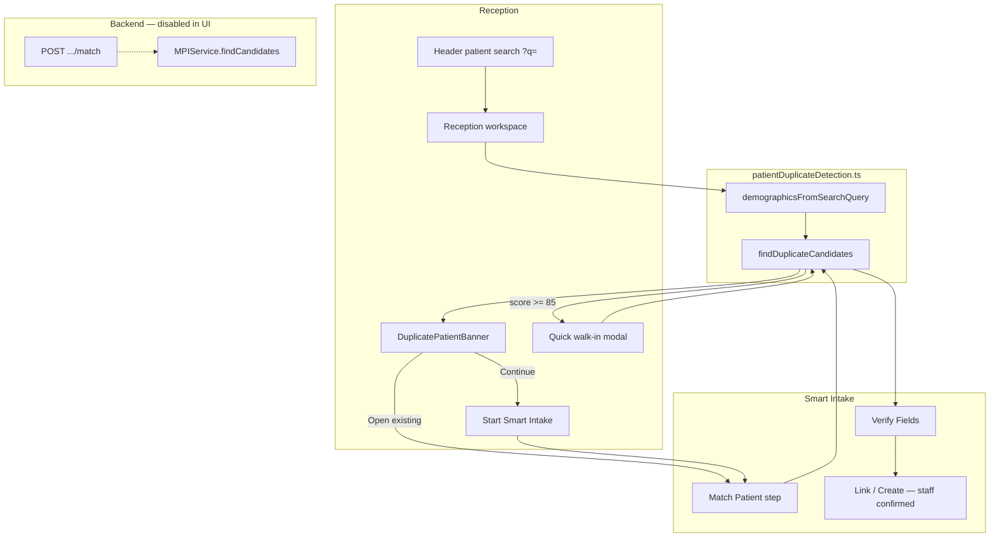

# Duplicate Patient Prevention

**Date:** 2026-06-17  
**Scope:** Reception, Smart Intake, Quick walk-in, backend MPI  
**Status:** Local matcher wired; backend session API remains disabled in production UI

---

## Executive summary

CareDroid already had MPI-style duplicate scoring on the backend and demo fixtures in Smart Intake, but Reception had no duplicate gate before patient creation. This work **unifies matching rules** in a frontend module (`patientDuplicateDetection.ts`) and **surfaces candidates** at three reception touchpoints:

| Surface | When duplicates appear | Staff action |
|---------|------------------------|--------------|
| **Reception workspace** | Header search (`?q=`) parses demographics and scores board patients | Open existing → Smart Intake verify; or continue Smart Intake |
| **Smart Intake** | Match step scores live `emergencyStore.patients` against extracted identity | Select candidate; link only after staff confirmation |
| **Quick walk-in** | Name/DOB/sex entered in modal | High-confidence match blocks submit until acknowledged |

The system **never auto-links** or auto-creates over a high-confidence match without explicit staff action.

---

## Existing matching logic (audit)

### Backend — `MPIService` (`backend/src/services/mpi.service.ts`)

Authoritative MPI scorer for persisted `UnifiedPatient` records.

| Field | Match weight | Notes |
|-------|--------------|-------|
| `firstName` | +12 | Split from `patient.name` |
| `lastName` | +16 | |
| `previousNames` | +8 | Any overlap with `demographics.previousNames` |
| `dateOfBirth` | +25 | |
| `phone` | +12 | |
| `email` | +10 | |
| `address` | +8 | |
| `sex` | +5 | |
| `mrn` identifier | +35 | Via `identifiers[]` |
| `health_card` identifier | +35 | |
| `external_ehr` | +20 | |
| `referral_source` | +15 | |

**Conflict penalty:** −5 per conflicting field (capped 0–100).

**Recommended actions:**

| Score | Action |
|-------|--------|
| ≥ 85, no conflicts | `link_after_staff_confirmation` |
| ≥ 65 | `possible_duplicate_review` |
| ≥ 35 | `manual_review` |
| else | `create_new_patient` |

**API route:** `POST /api/emergency/intake/:sessionId/match` (`backend/src/api/smart-intake.routes.ts`) — calls `mpiService.findCandidates()`.

**UI status:** Gated off via `emergencySmartIntakeIdentitySession: DISABLED` in `backendApiCapabilities`; frontend `smartIntakeApi.matchPatient()` not invoked in live flow.

### Smart Intake fixtures — `SMART_INTAKE_DEMO` (`src/data/smartIntakeFixtures.js`)

Demo-only candidates used when local board scoring returns no matches:

- **p10 Mei Li** — 91%, `link_after_staff_confirmation` (name + DOB + sex; phone/address conflicts)
- **p8 Helen Kowalski** — 68%, `possible_duplicate_review` (phone only)

Extracted fields drive the verify step; candidates previously came **only** from fixtures.

### Patient search — `patientSearch.ts` (related, not duplicate detection)

`rankPatientsBySearch` optimizes **lookup speed** (exact MRN, DOB, name). Duplicate detection reuses `parseDobQuery` and `getPatientDisplayName` but uses **MPI-style scoring**, not search rank scores.

### Gaps found (before this work)

| Gap | Impact |
|-----|--------|
| No frontend scorer against `emergencyStore.patients` | Reception could create duplicates while Smart Intake showed fixture-only matches |
| Quick walk-in had no pre-create check | Fast path bypassed identity review |
| Header search showed results but no duplicate **prevention** CTA | Staff could miss “open existing” before starting Smart Intake |
| Backend MPI not connected to Reception | Expected while identity session API disabled |

---

## New unified module

**File:** `src/utils/patientDuplicateDetection.ts`

Ports backend MPI field weights to the frontend `Patient` type (flat `firstName`/`lastName`, `dob`, `mrn`, `healthCardNumber`/`phn`).

**Exports:**

| Function | Purpose |
|----------|---------|
| `scorePatientDuplicate(patient, demographics)` | Single-patient score |
| `findDuplicateCandidates(patients, demographics, options?)` | Ranked list, default `minScore: 65` |
| `demographicsFromSearchQuery(query)` | Parse Header `?q=` into demographics |
| `findDuplicateCandidatesFromQuery(patients, query)` | Reception search → candidates |
| `patientToDemographics(patient)` | Round-trip helper |
| `duplicateActionLabel(action)` | UI label for recommended action |

**Thresholds:**

```ts
DUPLICATE_REVIEW_THRESHOLD = 65
DUPLICATE_HIGH_CONFIDENCE_THRESHOLD = 85
```

**Tests:** `src/utils/patientDuplicateDetection.test.ts` (Mei Li demo patient p10).

---

## Reception wiring

### Duplicate banner (`DuplicatePatientBanner`)

**File:** `src/components/reception/DuplicatePatientBanner.jsx`

Shown on **Reception workspace** when `?q=` length ≥ 2 and `findDuplicateCandidatesFromQuery` returns candidates ≥ 65%.

```
Header search (?q=) ──► demographicsFromSearchQuery
                              │
                              ▼
                    findDuplicateCandidates(patients)
                              │
                              ▼
              DuplicatePatientBanner (Reception workspace)
                    ├─ Open existing → Smart Intake verify (or select)
                    └─ No match — continue Smart Intake
```

**Integration:** `src/pages/emergency/ReceptionWorkspace.jsx` — placed after `ReceptionSearchHint`, before EMS panel. No second search input; reuses Header-synced `?q=`.

### Smart Intake match step

**File:** `src/pages/emergency/SmartIntake.jsx`

```text
intakeDemographics (from SMART_INTAKE_DEMO extracted fields)
        │
        ▼
findDuplicateCandidates(emergencyStore.patients, demographics)
        │
        ├─ matches found → use live candidates
        └─ no matches     → fall back to SMART_INTAKE_DEMO.candidates
```

Match panel, link gate (`selectedCandidateOnBoard`), and finalize actions unchanged — candidates are now **board-backed** when demographics align with store data (e.g. Mei Li / p10).

### Quick walk-in gate

**File:** `src/components/QuickIntake.tsx` (`variant="reception"` only)

- Computes `duplicateCandidates` from entered first/last name, DOB, sex, generated MRN.
- Shows inline alert listing matches.
- **Blocks submit** when any candidate ≥ 85% until staff clicks **“Not a duplicate — create anyway”**.
- Acknowledgement resets when identity fields change.

Whiteboard / central-node Quick Intake is unchanged.

---

## Flow diagram



---

## Staff workflows

### Search finds likely duplicate

1. Clerk searches **Mei Li** or **06/18/1991** in Header.
2. Reception shows **Possible duplicate patients** banner with score and matched fields.
3. **Open existing** → Smart Intake verify step for that `patientId`.
4. Or **No match — continue Smart Intake** for new identity capture.

### Smart Intake walk-in

1. **Start Smart Intake** → OCR/capture populates extracted fields.
2. Match step lists live candidates from board (fixtures only if no board match).
3. Staff selects candidate, completes verify, links if on board.

### Quick walk-in (secondary path)

1. **Quick walk-in** → enter name + DOB.
2. If ≥ 85% match, modal shows warning; submit disabled until acknowledged.
3. Prefer Smart Intake for identity-heavy arrivals.

---

## Intentional non-goals / remaining gaps

| Item | Rationale |
|------|-----------|
| Backend MPI not enabled in UI | Identity session API still `DISABLED`; local scorer covers demo + store |
| No duplicate check on EMS convert | EMS arrivals carry partial identity; Smart Intake verify handles linkage |
| Whiteboard central intake unchanged | Separate role/workflow; not reception registration |
| `NewPatientIntake.jsx` | Unmounted dead code — out of scope |
| Fuzzy phonetic name matching | Not in MPI service; not added locally |
| Auto-merge records | Never — staff confirmation required by design |

---

## Enabling backend MPI (future)

When `emergencySmartIntakeIdentitySession` is enabled:

1. `smartIntakeApi.matchPatient()` should POST extracted demographics to `/api/emergency/intake/:id/match`.
2. Merge API candidates with local `findDuplicateCandidates` (dedupe by `patientId`, prefer higher score).
3. Keep Reception banner on local store for sub-second search UX; optional background MPI refresh for enterprise MPI.

---

## Verification

```bash
npm test -- patientDuplicateDetection.test.ts ReceptionWorkspace.test.jsx receptionHandoff.test.ts
```

**Manual checks:**

1. Reception → search `Mei Li` → duplicate banner with p10 → **Open existing** opens Smart Intake verify.
2. Smart Intake from reception → Match step shows p10 at ≥ 85% (live board).
3. Quick walk-in → enter Mei Li + 1991-06-18 → warning; submit blocked until acknowledged.

---

## File index

| File | Role |
|------|------|
| `src/utils/patientDuplicateDetection.ts` | Unified scorer + query parser |
| `src/utils/patientDuplicateDetection.test.ts` | Unit tests |
| `src/components/reception/DuplicatePatientBanner.jsx` | Reception duplicate UI |
| `src/pages/emergency/ReceptionWorkspace.jsx` | Banner wiring |
| `src/pages/emergency/SmartIntake.jsx` | Live match candidates |
| `src/components/QuickIntake.tsx` | Pre-create gate |
| `backend/src/services/mpi.service.ts` | Backend MPI (reference) |
| `src/data/smartIntakeFixtures.js` | Demo fallback candidates |
