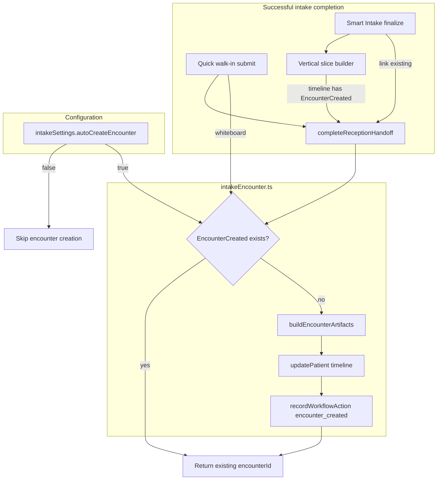

# Encounter Creation Flow

**Date:** 2026-06-17  
**Scope:** Emergency OS intake → encounter lifecycle  
**Status:** Auto-create wired via `intakeEncounter` service; configurable in Emergency Settings

---

## Executive summary

An **encounter** is the clinical visit record that ties orders, documentation, and disposition to a single ED presentation. CareDroid had encounter creation in the **Smart Intake vertical slice** and **backend vertical-slice API**, but **Quick walk-in**, **reception handoff**, and **link-existing** paths could complete intake without an `EncounterCreated` timeline event.

This work centralizes encounter creation in `src/services/intakeEncounter.ts` and invokes it **automatically after successful intake** when `emergencySettings.intakeSettings.autoCreateEncounter` is enabled (default: **true**).

---

## Encounter model

### Frontend (`src/types/emergency.ts`)

```ts
interface Encounter {
  id: EntityId;
  patientId: EntityId;
  status: 'created' | 'active' | 'completed' | 'cancelled';
  source: 'smart-intake' | 'ems' | 'walk-in' | 'transfer' | 'referral' | ...;
  createdAt: ISODateString;
  currentState: PatientState;
  timelineEventIds: EntityId[];
  closedAt?: ISODateString;
  metadata?: Record<string, unknown>;
}
```

### Timeline signal

Successful encounter open is recorded as a patient timeline event:

| Field | Value |
|-------|--------|
| `type` | `EncounterCreated` |
| `metadata.encounterId` | `encounter-{patientId}` |
| `metadata.source` | Intake source (`smart-intake`, `walk-in`, `ems`, …) |
| `summary` | `Encounter {id} created from {source}.` |

Shift summaries and analytics count `EncounterCreated` alongside `Arrival`, `Registration`, and `Intake` (`shiftSummaryData.ts`).

### Backend (`backend/src/modules/emergency-os`)

`SmartIntakeService.createVerticalSlice()` returns a structured `EmergencyEncounter` when the vertical-slice API is used:

```
POST /api/emergency/intake/vertical-slice
  → patient (Arrival → Triage)
  → encounter { id, patientId, status: 'active', source: 'smart-intake' }
  → validation.encounterCreated: true
```

Backend unknown-patient flow (`smart-intake.service.ts`) assigns `temporary_encounter_id` on the unified patient model — separate from frontend board encounters.

---

## Configuration

| Setting | Location | Default | Effect |
|---------|----------|---------|--------|
| `intakeSettings.autoCreateEncounter` | `emergencyStore.emergencySettings` | `true` | When enabled, `ensureEncounterAfterIntake()` creates encounter after intake completion |
| UI toggle | Emergency Settings → **Intake Settings** | On | Persists via `saveEmergencySettings` |

Related but distinct:

| Setting | Purpose |
|---------|---------|
| `emsThresholds.autoCreateArrival` | EMS pipeline auto-creates **arrival** records (not encounter) |

When `autoCreateEncounter` is **false**, intake completes normally but no `EncounterCreated` event is added unless a path already embeds one (e.g. vertical slice builder).

---

## Central service

**File:** `src/services/intakeEncounter.ts`

| Export | Role |
|--------|------|
| `isAutoCreateEncounterEnabled(settings)` | Reads config (default on) |
| `getExistingEncounterId(patient)` | Idempotent guard via timeline |
| `buildEncounterArtifacts(patient, source, metadata)` | Encounter + timeline event |
| `ensureEncounterAfterIntake(store, { patientId, source, sessionId? })` | Creates encounter when configured and missing |

**Idempotency:** If timeline already contains `EncounterCreated`, returns existing `encounterId` with `created: false`.

**Audit:** Records `encounter_created` workflow action with `metadata.encounterId`.

---

## Intake paths traced

### 1. Smart Intake — create new patient

```
SmartIntake finalize → buildSmartIntakeVerticalSlicePatient()
  → timeline includes EncounterCreated (encounter-{patientId})
  → addPatient() → finishIntakeNavigation()
  → completeReceptionHandoff() → ensureEncounterAfterIntake() [no-op, already exists]
```

**Files:** `SmartIntake.jsx`, `smartIntakeVerticalSlice.js`

### 2. Smart Intake — link existing patient

```
SmartIntake → Link to Existing Patient
  → completeReceptionHandoff(store, { source: 'smart-intake' })
  → ensureEncounterAfterIntake(source: 'smart-intake')
```

Creates encounter if linked patient had registration-only timeline (no prior encounter).

### 3. Quick walk-in (Reception)

```
QuickIntake submit → addPatient()
  → onAdded → completeReceptionHandoff(source: 'quick-intake')
  → ensureEncounterAfterIntake(source: 'walk-in')
```

### 4. Quick walk-in (Whiteboard / central node)

```
QuickIntake submit (variant !== 'reception') → addPatient()
  → ensureEncounterAfterIntake(source: 'walk-in')
```

No reception handoff on whiteboard; encounter created inline.

### 5. Reception handoff (generic)

```
completeReceptionHandoff()
  → movePatientToState(Triage) [if needed]
  → ensureEncounterAfterIntake() mapped by source:
       quick-intake → walk-in
       smart-intake → smart-intake
       ems-convert  → ems
       prepare-patient → smart-intake
```

**File:** `src/services/receptionHandoff.ts`

### 6. NewPatientIntake (whiteboard modal)

```
buildSmartIntakeVerticalSlicePatient() → EncounterCreated in timeline
```

**File:** `NewPatientIntake.jsx` — vertical slice already includes encounter; no extra call needed.

### 7. EMS convert

```
convertEMSArrivalToPatient() → Registration state, Arrival timeline only
```

Encounter is **not** created at EMS convert. Expected flow: Smart Intake verify after convert → handoff → encounter on successful intake completion.

### 8. Backend vertical slice (when API enabled)

```
runSmartIntakeVerticalSlice() → POST vertical-slice
  → hydrateFromApi() with backend encounter + patient
```

Frontend `ensureEncounterAfterIntake` remains idempotent if backend hydrated timeline lacks `EncounterCreated` event shape.

---

## Flow diagram



---

## Gaps and intentional boundaries

| Item | Status |
|------|--------|
| Dedicated `encounters[]` store slice | Not added — encounter lives on patient timeline; backend returns encounter object on vertical slice |
| EMS convert auto-encounter | Deferred until intake verified |
| Discharge / close encounter | Separate disposition workflow (not intake scope) |
| EHR write-back | `integrationSettings` / interoperability module — future |
| `NewPatientIntake.jsx` | Unmounted in production routes; vertical slice path documented |

---

## Verification

```bash
npm test -- intakeEncounter.test.ts receptionHandoff.test.ts
```

**Manual checks:**

1. Emergency Settings → Intake → confirm **Auto-create encounter after intake** is on.
2. Reception → Quick walk-in → submit → patient timeline shows `EncounterCreated`.
3. Reception → Smart Intake → link existing patient without encounter → handoff adds `EncounterCreated`.
4. Disable setting → repeat quick walk-in → no new `EncounterCreated` event.
5. Smart Intake new patient (vertical slice) → still has encounter from builder; no duplicate events.

---

## File index

| File | Role |
|------|------|
| `src/services/intakeEncounter.ts` | Central auto-create logic |
| `src/services/intakeEncounter.test.ts` | Unit tests |
| `src/services/receptionHandoff.ts` | Handoff + encounter hook |
| `src/components/QuickIntake.tsx` | Whiteboard encounter hook |
| `src/data/smartIntakeVerticalSlice.js` | Embedded encounter in vertical slice |
| `src/pages/emergency/EmergencySettings.jsx` | Config UI |
| `src/store/emergencyStore.ts` | Default `intakeSettings.autoCreateEncounter` |
| `backend/src/modules/emergency-os/emergency-os.services.ts` | Backend vertical-slice encounter |
| `src/types/emergency.ts` | `Encounter`, `EncounterCreated` types |
