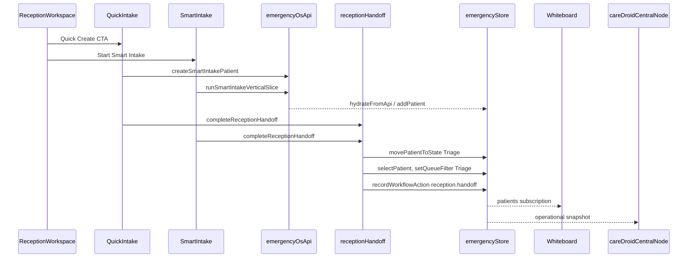

# Intake to Whiteboard Flow

## End-to-End Sequence



## Entry Points

| Entry | File | Creates patient via |
| --- | --- | --- |
| Reception Quick Create | `QuickIntake.tsx` | `createSmartIntakePatient` → `addPatient` |
| Reception Smart Intake | `SmartIntake.jsx` | `runSmartIntakeVerticalSlice` or local `addPatient` |
| Whiteboard Quick Intake (clinical only) | `pages/emergency/index.tsx` | Same as Quick Create |
| EMS convert | `EMSPipeline.jsx` | `convertEMSArrivalToPatient` |

## Patient State on Handoff

Default landing state after reception finalize:

- **QuickIntake**: `PatientState.Triage` (set in `QuickIntake.tsx`)
- **Smart Intake vertical slice**: `Triage` via `buildSmartIntakeVerticalSlicePatient`
- **Smart Intake local fallback**: `Triage` via `buildSmartIntakePatient`

Journey engine (`engine/journeyEngine.ts`) allows:

```
Arrival → Registration → Triage → Waiting → Assessment → ...
```

Quick create skips `Registration` and lands directly in `Triage` for speed. Documented in `patient-arrival-experience.md`.

## Store Actions

`src/services/receptionHandoff.ts` centralizes:

1. `movePatientToState(patientId, PatientState.Triage)` when not already in triage
2. `selectPatient(patientId)`
3. `setQueueFilter('Triage')`
4. `recordWorkflowAction({ metadata: { handoff: 'reception.handoff' } })`
5. Return paths: `receptionPath`, `queuesPath`, `whiteboardPath`

## API Contracts

### Vertical slice (`runSmartIntakeVerticalSlice`)

`src/services/emergencyOsApi.js` → `POST /api/emergency/intake/vertical-slice`

Response hydrates:

- `whiteboard.patients`
- `whiteboard.rooms`, `staff`, `alerts`
- `capacity`
- `patient` (single created record)

`SmartIntake.jsx` calls `hydrateFromApi` then `completeReceptionHandoff`.

### Demo fallback

When API unreachable:

- `addPatient(patient, { syncToBackend: false })`
- `selectPatient(patient.id)`
- `completeReceptionHandoff`

## Queue Visibility

`QueueIntelligencePanel.jsx` derives queues from `patient.state`:

| State | Queue label |
| --- | --- |
| `Triage` | Triage |
| `Waiting` | Waiting |
| `Assessment` | Provider |

After handoff, patient appears in Triage queue and Whiteboard grid (filter: All or Triage).

## Central Node

`careDroidCentralNode.ts` rebuilds snapshot on every store change. No separate handoff API. Metrics in Header update automatically via `selectEmergencyOperationalSummary`.

## Return Paths

| Source | After finalize |
| --- | --- |
| `?from=reception` | `/emergency/reception?arrived=<patientId>` |
| Default (legacy) | `/emergency/patients` (preserved for non-reception entry) |

## Validation Checklist

- [ ] Patient exists in `store.patients` after finalize
- [ ] `patient.state === Triage` (or Registration if extended)
- [ ] Triage queue count increments
- [ ] Whiteboard shows patient without page reload
- [ ] `workflowLogs` contains `reception.handoff`
- [ ] Central node operational summary reflects new arrival
