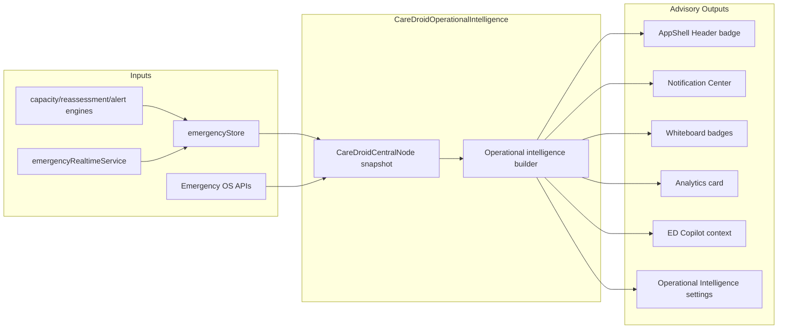

# Operational Intelligence Data Flow

## Processing stages

1. Validation — settings gate (`operationalIntelligenceEnabled`)
2. Normalization — central node feature vector
3. Rule evaluation — capacity, EMS, boarding, queues, reassessment
4. Anomaly detection — stale data, queue breach, capacity red band
5. Recommendation generation — advisory staff actions only
6. Alert generation — optional via `autoAlertingEnabled`
7. Audit logging — workflow logs surfaced in snapshot
