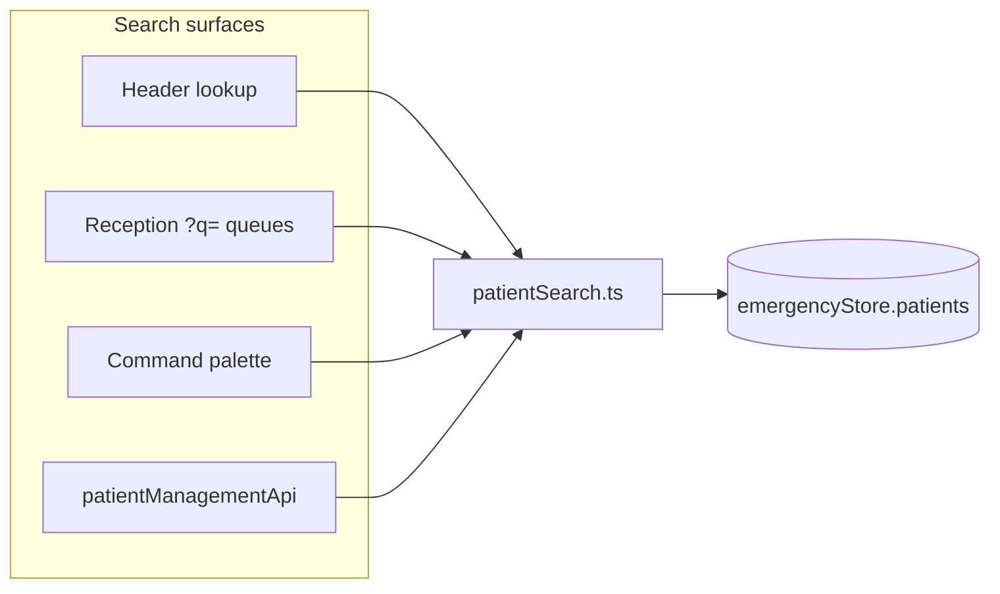

# Patient Search Excellence

Date: 2026-06-17

## Executive Summary

Patient search in CareDroid Emergency OS is **local-store first**, optimized for **reception speed**, with a **single shared matcher** (`src/utils/patientSearch.ts`) powering Header lookup, Reception queue filtering, command palette results, and `patientManagementApi` pre-filtering.

There is still **no dedicated backend MPI search endpoint**; health card and phone matching work when those fields exist on the active `Patient` record (optional fields on `Patient`, populated from intake/OCR or seed data).

---

## Audit — Before This Pass

| Surface | Matcher | Fields searched | Ranking | Gaps |
| --- | --- | --- | --- | --- |
| `Header.tsx` | `patientLookupText().includes()` | Name, MRN, complaint, state | None (store order) | No DOB, phone, health card |
| `receptionQueueModel.js` | Concat includes | Name, MRN, complaint | None | Duplicated logic |
| `CommandPalette.tsx` | `patientNameMatchScore` | Name, MRN, complaint tokens | Yes | No DOB/phone/health card |
| `patientManagementApi.js` | `patientMatchesQuery` | Name, MRN, complaint | None | No identifier fields |
| Backend | N/A | — | — | `searchPatientsFromBackend` filters local only |

**Problems identified:**

1. Four independent matchers — inconsistent results across surfaces
2. Substring-only — no exact-match priority for MRN/identifiers
3. DOB not searchable despite `patient.dob` on every record
4. Phone / health card not searchable — fields absent from `Patient` type
5. Reception placeholder under-communicated supported identifiers

---

## Unified Search Engine

**File:** `src/utils/patientSearch.ts`

### Supported query types

| Type | Examples | Behavior |
| --- | --- | --- |
| **Exact name** | `Mei Li` | Highest rank (`exact-name`, score 1000) |
| **Partial name** | `mei`, `Li`, `Mei` | Substring + token match |
| **Exact MRN** | `ED-001243` | `exact-mrn` (980) |
| **Partial MRN / digits** | `001243` | Digit-normalized partial |
| **DOB** | `1991-06-18`, `06/18/1991`, `06181991` | Parsed to ISO; `exact-dob` (960) |
| **Phone** | `4165550177`, `416-555-0177`, `555-0177` | When `patient.phone` set; digit exact/suffix |
| **Health card** | `HC-9922-441`, `9922441` | When `healthCardNumber` / `phn` / `healthCard` set |
| **Clinical partial** | `chest`, `rash` | Lower rank via complaint text |

### Ranking (reception speed)

Results sort by **score descending**, preserving stable store order on ties. Exact identifier matches always beat partial name matches.

**Minimum query length:**

- **2 characters** for alphabetic name search (reduces noise)
- **1+ digit** for numeric-heavy queries (MRN, phone, health card, DOB)
- Parsed DOB always accepted

### Key exports

| Function | Use |
| --- | --- |
| `scorePatientSearch(patient, query)` | Score + match kind |
| `rankPatientsBySearch(patients, query, limit)` | Ranked results |
| `filterPatientsBySearch(patients, query)` | Filter + rank (reception queues) |
| `patientMatchesSearch(patient, query)` | Boolean guard |
| `parseDobQuery(query)` | DOB normalization |
| `formatPatientSearchHint(patient, matchKind)` | Header result subtitle |
| `getPatientDisplayName(patient)` | Shared display name |

---

## Integration Map



| Consumer | File | Integration |
| --- | --- | --- |
| Header dropdown | `Header.tsx` | `rankPatientsBySearch` + `formatPatientSearchHint` |
| Reception filter | `receptionQueueModel.js` | `filterPatientsBySearch` via `filterPatientsByQuery` |
| Command palette | `CommandPalette.tsx` | `patientNameMatchScore` delegates to `scorePatientSearch` |
| Backend bundle prefetch | `patientManagementApi.js` | `patientMatchesSearch` |
| Reception hint | `ReceptionSearchHint.jsx` | Updated copy for supported fields |

**Not duplicated:** One matcher; no second search input on Reception (Header remains canonical).

---

## Patient Type Extensions

Optional fields on `Patient` (`src/types/emergency.ts`):

```typescript
phone?: string;
mobilePhone?: string;
healthCardNumber?: string;
healthCard?: string;
phn?: string;
```

**Health card support:** Yes, when populated on the patient record (Smart Intake OCR, future MPI sync, manual capture). Matcher checks `healthCardNumber`, `healthCard`, and `phn` (Canadian PHN alias).

**Demo seed:** Patient `p10` (Mei Li) includes `phone: '416-555-0177'` and `healthCardNumber: 'HC-9922-441'` for QA.

---

## Reception Speed Optimizations

| Optimization | Implementation |
| --- | --- |
| Single keystroke focus | `/` on Reception → `focus-reception-search` |
| Enter selects best match | Header `onKeyDown` → top ranked result |
| Exact-before-partial ranking | `scorePatientSearch` tier scores |
| Numeric query fast path | Digit-only MRN/phone/health card without 2-char name minimum |
| Instant local results | No network round-trip on active board patients |
| Rich result rows | MRN · DOB · complaint in dropdown |
| Queue sync | `?q=` filters verification/triage/EMS queues simultaneously |
| Placeholder clarity | `Name, MRN, DOB, phone, or health card...` |

### Typical reception flows

| Staff action | Clicks / keys |
| --- | --- |
| Focus search | `/` or click Header |
| Find by MRN | Type `001243` → Enter |
| Find by DOB | Type `06/18/1991` → Enter |
| Find by health card | Type `9922441` → Enter |
| Filter queues | Search syncs `?q=` — queues narrow live |

---

## Backend & MPI Status

| Capability | Status |
| --- | --- |
| `GET /api/emergency/patients` | List only — no `?q=` search |
| `searchPatientsFromBackend()` | Local pre-filter + per-ID bundle fetch |
| Express MPI (`mpi.service.ts`) | Exists for Smart Intake session — **not** wired to Header search |
| `emergencySmartIntakeIdentitySession` | DISABLED in UI |

**Recommendation (future):** Mount `GET /api/patients/search?q=` against `UnifiedPatient` with same `patientSearch` scoring server-side for enterprise MPI. Until then, local matcher is authoritative for active ED patients.

---

## Health Card — Product Notes

- Smart Intake fixtures reference `healthCardNumber` in OCR fields
- Verification gate prevents unverified health card from writing to record (fixture warning)
- Search matches **operational** `Patient.healthCardNumber` on the board — not unverified OCR-only values
- Canadian deployments: `phn` alias supported on `Patient` type

---

## Test Coverage

| File | Cases |
| --- | --- |
| `src/utils/patientSearch.test.ts` | DOB parse, exact/partial name, MRN, phone, health card, ranking |
| `src/components/reception/receptionQueueModel.test.js` | DOB filter via shared matcher |
| `src/components/CommandPalette.test.tsx` | Name/MRN search (via delegated scorer) |

Run:

```bash
npx vitest run src/utils/patientSearch.test.ts src/components/reception/receptionQueueModel.test.js
```

---

## Changes Applied (this pass)

1. Created `src/utils/patientSearch.ts` — unified ranked matcher
2. Extended `Patient` type with optional phone / health card fields
3. Wired Header, Reception, CommandPalette, `patientManagementApi` to shared matcher
4. Updated Header placeholder and result hints
5. Seeded `p10` with phone + health card for demonstration
6. Updated `ReceptionSearchHint` copy

---

## Related Documents

- `reception-workspace-report.md` — search affordance on Reception
- `smart-intake-promotion.md` — identity fields source for health card/phone
- `reception-dominance-audit.md` — prior search gap notes
- `patient-arrival-experience.md` — MPI lookup checklist

---

## Success Criteria

- [x] Exact search (name, MRN, DOB, phone, health card when present)
- [x] Partial search (name substring, MRN digits, phone suffix)
- [x] DOB formats: ISO, `MM/DD/YYYY`, `MMDDYYYY`
- [x] Phone search when `patient.phone` populated
- [x] Health card search when `healthCardNumber` / `phn` populated
- [x] Single matcher — no duplicate search systems
- [x] Reception-optimized ranking and Enter-to-select
- [ ] Enterprise MPI backend search (future)
