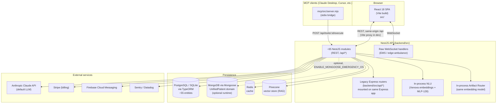
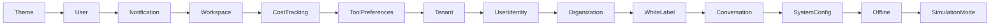
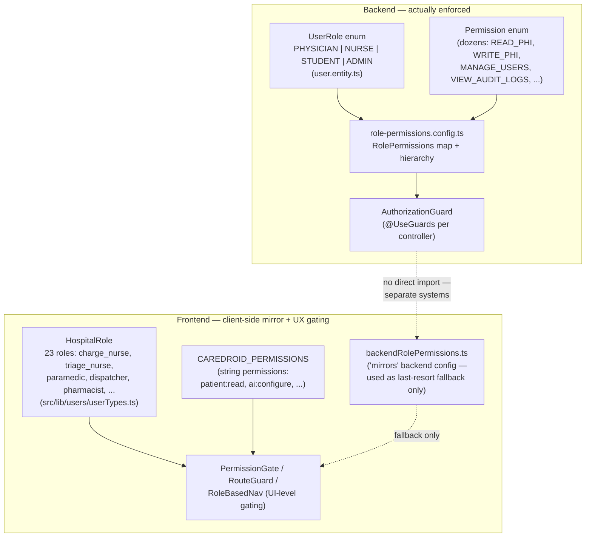
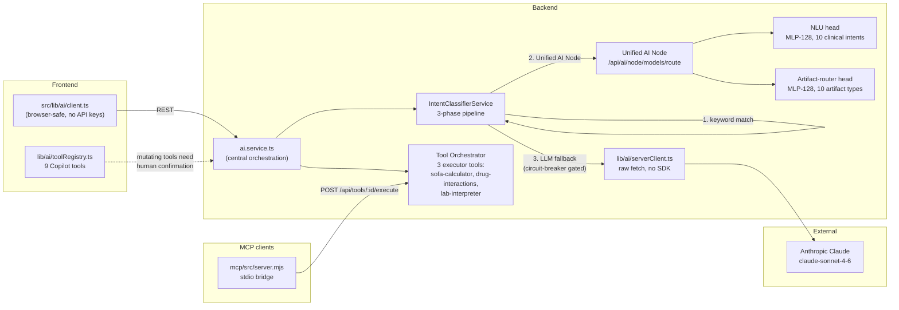

# Platform Architecture Overview

> Canonical, current architecture reference. Superseded/dated architecture snapshots (`current-state-report.md`, `project-audit.md`, `current-system-inventory.md`, `system-architecture.md`) remain in `docs/architecture/` for history; this document is what to read first.

## 1. Shape of the system

CareDroid is **one Vite + React SPA** talking to **one NestJS API** that itself embeds a smaller legacy Express router layer and two in-process ML models (no separate Python ML microservice). There is no polyglot microservice mesh — "services" in this codebase mostly means NestJS modules or frontend service files, not independently deployed processes.

## 2. Frontend

**Stack:** React 18.2, Vite 7, `react-router-dom` v6 (single `<BrowserRouter>`), Zustand 5 (small set of domain stores) + ~27 React Context providers, Tailwind (semantic CSS-variable tokens, no fixed palette), Dexie/IndexedDB for offline cache, native `WebSocket` + `socket.io-client` for realtime, Firebase Cloud Messaging for push, in-house design-system primitives (no MUI/Chakra/Radix).

**Boot chain:** `index.html` → `src/main.tsx` (observability init, global error handlers, service-worker registration) → `src/app/App.tsx` (`ErrorBoundary` → `AppProviders` → `BrowserRouter` → `AppRoutes`).

**Provider nesting** (`src/app/providers.tsx`):

**Page inventory:** 297 files across 20 populated domain subfolders under `src/pages/` (`emergency/` is the largest — the core ED workspace; `tools/` has 46 files of calculators and specialty AI assistants), plus 5 currently-empty placeholder folders (`auth/`, `cosmos/`, `customer-portal/`, `success-center/`, `surveillance/`) whose routes exist in `src/config/routes.config.ts` but aren't yet backed by page components in those folders. Full generated route list: [`docs/generated/routes.md`](../generated/routes.md).

**One name, two places — don't conflate:**
- There is `src/lib/` (RBAC, auth, browser-safe AI client) **and** a separate top-level `lib/` directory (`@lib` alias in `vite.config.ts`) containing `native-ai/` and `patient-orchestration/` modules, plus the AI config/tool/prompt registries consumed by both frontend and backend.
- The equivalent top-level `store/` and `engine/` compatibility shims (thin re-exports for legacy imports) were deleted in the 2026-08-05 repo-consolidation cleanup — `src/store/` and `src/engine/` are now each the single, canonical location, no duplicate root-level directory exists for either.

**Client-side "engines":** `src/engine/` (38 files) runs deterministic clinical/operational logic (triage scoring, capacity math, alert derivation, journey state machines) as plain TypeScript modules driven by store subscriptions — not React components, not a backend service.

**No client-side data-fetching library** (no React Query/SWR) — all HTTP goes through a hand-rolled axios client (`src/services/apiClient.ts`, re-exported via `src/lib/apiClient.ts`), with ~300 domain service files wrapping specific endpoints and writing results into Zustand/Context directly.

**Dark mode is not currently offered** — the theme is hardcoded to `'light'` (`src/config/theme.tokens.ts`); this is a deliberate current-state fact, not a bug, worth knowing before promising theming work.

## 3. Backend

**Stack:** NestJS 10 on Express, Node ≥20.19, TypeORM (Postgres in prod, SQLite in dev) + optional Mongoose/MongoDB for the legacy real-time patient domain.

**Boot sequence** (`backend/src/main.ts`): Sentry init → Nest app → Helmet (CSP/HSTS) → Sentry request/error middleware → `LoggingMiddleware` → CORS (custom `X-CareDroid-*` tenant headers) → global `ValidationPipe` → global `ApiExceptionFilter` → (prod) serve built SPA → `setGlobalPrefix('api')` → mount legacy Express routes (`registerAllRoutes`) → conditionally start the Mongoose Emergency-OS runtime (`registerEmergencyMongooseRuntime`, gated on `ENABLE_MONGOOSE_EMERGENCY_OS`) → register raw WebSocket handlers → Swagger UI at `/api/docs` → listen.

**Two parallel route surfaces, one Express app:**

1. **Legacy Express routers** (`backend/src/api/`) — mounted at `/api/*`, discoverable at runtime via `GET /api/routes`. Several are unauthenticated placeholder stubs (`moh`, `wearable`, `iot`, `simulation`, `handover`, `digital-twin` each just expose `GET /` and `GET /health`) representing integrations described but not yet implemented.
2. **~65 NestJS modules** (`backend/src/modules/`) — the actively developed surface, covering auth, users, workspaces, organizations, subscriptions, AI, clinical, clinical-intelligence, audit, artifacts, memory, tool-orchestrator, governance (three separate controllers — see [Known Documentation Debt](../DOCUMENTATION_CENTER.md#known-documentation-debt)), observability, fleet, surveillance, hospital-map, simulation, notifications, native-ai, platform-assets, product-catalog, and the ~90-endpoint `emergency-os` mega-controller.

Full endpoint-by-endpoint listing: [API Reference](../api/api-reference.md).

**Middleware & cross-cutting guards:**

| Concern | Mechanism | Global? |
|---|---|---|
| Error tracking | Sentry request/error handlers | Global |
| Security headers | `helmet()` + custom `Permissions-Policy` | Global |
| Structured logging | `LoggingMiddleware` (correlation IDs, slow-request warnings) | Global |
| Input validation | `ValidationPipe` (whitelist + transform) | Global |
| Error shape | `ApiExceptionFilter` | Global |
| HTTP metrics | `HttpMetricsInterceptor` (Prometheus) | Global |
| **Tenant isolation** | `TenantIsolationGuard` + `TenantContextInterceptor`/`TenantScopeInterceptor` (`@TenantScoped`/`@OrganizationScoped`/`@WorkspaceScoped` decorators) | **Global** |
| **RBAC** | `AuthorizationGuard` (`@Permissions()` decorator, checks `role-permissions.config.ts`) | Per-controller (not global) |
| 2FA enforcement | `TwoFactorEnforcementGuard` | Per-route |
| Rate limiting | `ThrottlerModule` registered but **no `ThrottlerGuard` found wired anywhere** — configured, not enforced | Neither |

Note the legacy Express routers in `backend/src/api/` generally have **no auth middleware** applied at the router level — they rely on being mounted behind the app but don't themselves check JWTs (aside from the WebSocket `JwtQueryAuthGuard`). Treat this as a known gap when reasoning about what's actually protected.

**Background work:** a single `node-cron` job (`reassessment.scheduler.ts`, runs every minute, only when the Mongoose runtime is enabled) is the only scheduled job in the codebase; `ScheduleModule.forRoot()` is registered but no `@Cron`/`@Interval` decorators exist elsewhere. There is no message queue (SQS/RabbitMQ/BullMQ) — Redis is used for caching only.

## 4. Authorization & RBAC

There are **two RBAC models in this codebase that do not share code**, and conflating them is the most common way to misunderstand the platform's security posture:

- **Backend enforcement** (what actually blocks an API call): `Permission` enum + `RolePermissions` map in `backend/src/modules/auth/`, checked by `AuthorizationGuard` per-controller against the coarse `UserRole` (`PHYSICIAN | NURSE | STUDENT | ADMIN`). Every permission check is written to the audit log (HIPAA §164.308(a)(4) cited in code comments). A separate, independent `TenantIsolationGuard` additionally scopes by organization/workspace role.
- **Frontend UX/route gating**: a much finer 23-role hospital taxonomy (`src/lib/users/userTypes.ts`) with string permissions (`patient:read`, `triage:override-ai`, `ai:configure`, ...), access scopes (`none|self|assigned|department|site|network|all`), and 16 hardcoded demo users (`src/lib/users/demoUsers.ts`). `backendRolePermissions.ts` claims to mirror the backend config but is a hand-maintained TypeScript copy, used only as a last-resort fallback inside `securityAccessService` — the backend does not import from `src/lib/users/` at all.
- **Practical implication:** the fine-grained hospital-role experience (what nav items, dashboards, and AI scope a "triage nurse" sees) is a **frontend UX concern**; the actual API-level access control is coarser and lives entirely in the backend's own `UserRole`/`Permission` system. Don't assume adding a new `HospitalRole` on the frontend changes what the backend will allow — it won't, until the corresponding backend `Permission`/`UserRole` mapping is also updated.

## 5. AI Platform

**Two distinct 128-hidden-dim MLP classifiers, same embedding model, different jobs** — don't conflate them:

| | NLU intent head | Artifact-router head |
|---|---|---|
| Location | `backend/ml-services/nlu/` | `backend/ml-services/artifact-router/` |
| Embedding | `Xenova/all-mpnet-base-v2` (frozen, 768-dim) | same |
| Classifier | Hand-implemented MLP, 128 hidden, ReLU+softmax | same architecture |
| Classes | 10 clinical intents (drug interaction check, lab interpretation, SOFA calculation, guideline lookup, patient status update, emergency alert, discharge planning, medication order, diagnosis support, general query) | 10 artifact types (api-endpoint, prompt, backend-service, page, tool, calculator, document, engine, registry, route, ...) |
| Current accuracy | 100% on 51 held-out test examples (small test set — treat with appropriate skepticism) | 94.68% on 282 held-out examples |
| Fallback | Rule-based keyword matcher (`INTENT_KEYWORDS`) when no trained model on disk | — |

Both are combined by the **Unified AI Node** (`backend/ml-services/unified-ai-node/`, exposed at `POST /api/ai/node/models/route`) — this is what commit `b14693f8` ("unified NLU + artifact-router AI node") refers to. It is fed by an **artifact-intelligence pipeline** (`npm run artifact-intelligence:generate`) that catalogs the entire repo (routes, tools, calculators, prompts, engines, docs — 2,460 artifacts at last run) into training data; see [`docs/artifact-intelligence-pipeline-report.md`](../artifact-intelligence-pipeline-report.md).

**RAG uses a *different*, deterministic local embedding** (`local-deterministic-embedding`) from the transformer embedding used by the two classifiers above — two separate "embedding" concepts in this codebase; don't assume they're interchangeable or that changing one affects the other.

**LLM provider:** Anthropic Claude is default and primary (raw `fetch` to `https://api.anthropic.com/v1/messages`, no SDK dependency, prompt caching via `cache_control: ephemeral`). OpenAI, Azure OpenAI, and Gemini are configured as provider options (`AIProvider` type) but have no dedicated call sites beyond config — treat as "supported by config shape" rather than "wired up."

**MCP server** (`mcp/src/server.mjs`) — a separate, independently-run stdio process (own `package.json`) for use with Claude Desktop/Cursor. Exposes exactly one tool (`caredroid_execute_clinical_tool`), one resource, one prompt. Its own `toolId` schema deliberately allowlists just 3 of the backend's tools (`sofa-calculator`, `drug-interactions`, `lab-interpreter`) — a scope choice by the MCP proxy itself, not a reflection of backend capability: the Nest Tool Orchestrator actually registers 39 real tool executors (`REGISTERED_EXECUTOR_TOOL_IDS` in `tool-orchestrator.registry.ts`). It is a thin proxy for its 3 — all real logic lives in the Nest backend.

**App navigator** (`navigator/`) — a separate, standalone HTTP server (own `package.json`, zero runtime dependencies) answering "where do I find X?" questions against a closed, committed catalog derived from `src/config/routes.config.ts`'s `CANONICAL_ROUTE_MAP`. Deterministic lexical retrieval (no embeddings/vector store); optional Groq synthesis is grounded to only phrase answers from retrieved catalog evidence, never invent a route. Contains no patient data, not a clinical decision-support system. Starts automatically alongside `npm start` (port 4178); refresh its catalog with `cd navigator && npm run sync:catalog` after adding routes. See `navigator/README.md`.

**Agent-tools:** `lib/ai/toolRegistry.ts` (9 Copilot function-calling tools, split read-only vs. human-confirmation-required mutating tools) and `backend/src/modules/medical-control-plane/tool-orchestrator/` (39 tools have real backend executors — `REGISTERED_EXECUTOR_TOOL_IDS`; 180 other tool IDs are known to the NLU/UI layer with no backend executor yet — see `NLU_TOOL_IDS_WITHOUT_EXECUTOR`; counted directly from both arrays rather than cited from memory, since this exact figure has been wrong in multiple other docs this campaign). **`agent-tools/` at the repo root is not related to any of this** — it's session-transcript scratch output; see [Known Documentation Debt](../DOCUMENTATION_CENTER.md#known-documentation-debt).

Every AI call is audit-logged (hash-chained, 7-year default retention) via `lib/ai/auditLogger.ts`.

## 6. Data layer

Two persistence systems, deliberately kept separate:

- **TypeORM (Postgres prod / SQLite dev)** — ~55 entities across auth, users, workspaces, organizations, subscriptions, audit, artifacts, memory, platform-governance, product-catalog, notifications. Full list: [Data Model Reference](../data-model/data-model-reference.md).
- **Mongoose/MongoDB** — the clinical `UnifiedPatient` domain (rich typed schema: triage acuity codes, journey states, DPS scores, deterioration risk, safety alerts) plus `SmartIntake`. Only connected when `ENABLE_MONGOOSE_EMERGENCY_OS=true`; the default app-only Docker profile (`docker-compose.app.yml`) runs with this **disabled**, meaning the canonical patient model is not live unless explicitly turned on. Legacy pre-TypeORM Mongo migrations exist under `backend/migrations/` for this same domain.

This split means: **"is Mongoose enabled?" is a load-bearing question** for whether patient-domain features (the actual `UnifiedPatient` model, reassessment scheduler, EMS websocket alerts written to Mongo) are live in a given environment — always check `ENABLE_MONGOOSE_EMERGENCY_OS` before assuming patient CRUD hits a real document store.

## 7. See also

- [API Reference](../api/api-reference.md)
- [Data Model Reference](../data-model/data-model-reference.md)
- [Deployment Guide](../deployment-guide.md)
- [Configuration Reference](../configuration-reference.md)
- [Developer Guide](../developer-guide.md)
- [Glossary](../glossary.md)
- [ADRs](../adr/README.md)
