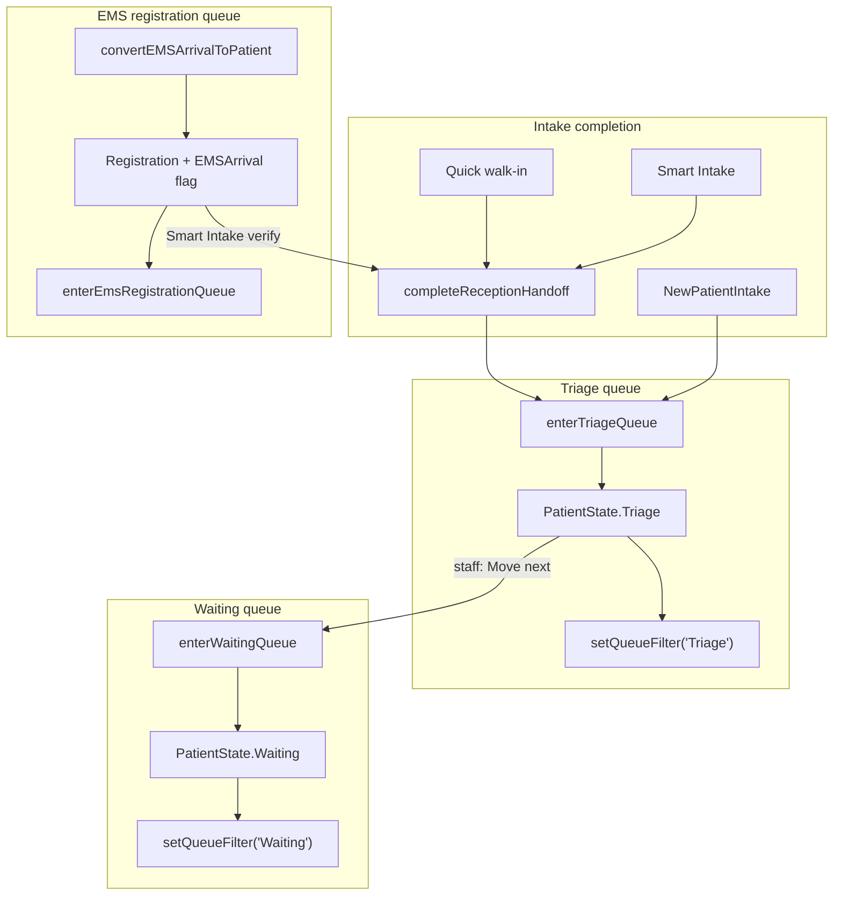

# Queue Assignment Automation

**Date:** 2026-06-17  
**Scope:** Triage, waiting, and EMS registration queues  
**Status:** Centralized in `queueAssignment.ts`; configurable via Emergency Settings → Intake

---

## Executive summary

CareDroid does **not** maintain separate queue tables on the frontend board. Queue membership is **derived from patient journey state and flags**, then surfaced in Reception tabs, whiteboard filters, and queue intelligence dashboards.

| Queue (user-facing) | Membership rule | Primary entry mechanism |
|---------------------|-----------------|------------------------|
| **Triage / pre-triage** | `PatientState.Triage` | Intake completion + `enterTriageQueue()` |
| **Waiting** | `PatientState.Waiting` | Staff transition Triage → Waiting via `enterWaitingQueue()` |
| **EMS registration** | `EMSArrival` flag + `Registration` or `Arrival` | EMS convert + `enterEmsRegistrationQueue()` |

This document traces all paths, documents configuration, and describes the unified assignment service wired in this pass.

---

## Queue model (audit)

### Reception queues — `receptionQueueModel.js`

`selectReceptionQueues(patients)` partitions the active board for the Reception workspace:

| Tab ID | Label | Filter |
|--------|-------|--------|
| `ems` | EMS registration | `isEmsRegistrationPatient(p)` AND state ∈ `{Registration, Arrival}` |
| `verification` | Verification | `Registration` AND NOT EMS |
| `pretriage` | Awaiting triage | `PatientState.Triage` |

EMS detection uses `PatientFlag.EMSArrival` on the patient record (`isEmsRegistrationPatient`).

Counts also expose `awaitingTriage`, `awaitingVerification`, and `waiting` (patients in `PatientState.Waiting`).

### Whiteboard queues — `emergency/index.tsx`

`activeQueueFilter` (via `setQueueFilter`) filters visible patient cards:

| Filter | Rule |
|--------|------|
| `Triage` | `patient.state === Triage` |
| `Waiting` | `patient.state === Waiting` |
| `EMS` | `PatientFlag.EMSArrival` on flags |
| `Reassessment` | Reassessment/deterioration/sepsis flags |

`selectQueueCounts` aggregates patients by `patient.state` for queue panel rows when backend queue summaries are absent.

### Queue intelligence — `queueIntelligenceService.js`

Operational/analytics queues (`triage-queue`, `waiting-room`, `ems-pre-arrival-queue`, etc.) are **definitions + demo metrics**, not the live assignment source of truth. Live board assignment remains journey-state-driven.

### Journey engine — `engine/journeyEngine.ts`

Legal transitions relevant to queue assignment:

```
Registration → Triage → Waiting → Assessment → …
```

`movePatientToState` enforces transitions; stale flags (e.g. `EMSArrival`) clear when leaving early journey states.

---

## How patients enter each queue

### Triage queue

**Definition:** Patients in `PatientState.Triage` (Reception tab: **Awaiting triage**).

**Entry paths (before wiring):**

| Path | Mechanism | Gap |
|------|-----------|-----|
| Quick walk-in (Reception) | Creates patient in `Triage`; handoff called `setQueueFilter('Triage')` | No `triageTime` stamp on handoff-only moves |
| Smart Intake vertical slice | Patient built in `Triage` with timeline | OK |
| `completeReceptionHandoff` | `movePatientToState(Triage)` + filter | Duplicated logic |
| Whiteboard `NewPatientIntake` | Vertical slice to `Triage` but `setQueueFilter(null)` | Filter not synced |

**After wiring — `enterTriageQueue()`:**

1. `movePatientToState(Triage)` if not already triage
2. Set `triageTime` when missing
3. `setQueueFilter('Triage')` when `intakeSettings.autoAssignTriageQueue` is enabled (default **on**)
4. Record `queue-assignment` workflow log (optional; skipped during reception handoff)

**Call sites:**

- `completeReceptionHandoff()` → `enterTriageQueue({ recordWorkflow: false })` + handoff log
- `NewPatientIntake` after `addPatient`
- Implicit when QuickIntake creates patient in `Triage` then handoff runs

### Waiting queue

**Definition:** Patients in `PatientState.Waiting`.

**Entry paths:**

| Path | Mechanism |
|------|-----------|
| Whiteboard **Move next** on triage patient | Was raw `movePatientToState`; now `enterWaitingQueue()` |
| Patient detail panel advance | Same when next state is `Waiting` |
| Manual journey transitions elsewhere | `engine/journeyEngine` |

**Not automatic after intake** — triage must complete first. This matches clinical workflow (vitals/acuity before waiting for provider).

**`enterWaitingQueue()`:**

1. Requires current state `Triage` (or already `Waiting`)
2. Uses `engine/journeyEngine.movePatientToState` for legal transition
3. `setQueueFilter('Waiting')` when `intakeSettings.autoAssignWaitingQueue` enabled (default **on**)
4. Records workflow log

### EMS registration queue

**Definition:** EMS-flagged patients still in `Registration` or `Arrival` (Reception tab: **EMS registration**).

**Entry paths:**

| Path | Mechanism |
|------|-----------|
| `convertEMSArrivalToPatient` | Creates patient `Registration` + `EMSArrival` flag |
| EMS pre-arrival panel | Inbound units before convert (separate `emsArrivals` store list) |

**After wiring — `enterEmsRegistrationQueue()`:**

- Called from `ReceptionWorkspace.handleConvertEmsArrival` after convert
- `selectPatient` + workflow log with `queue: ems`
- Does **not** change journey state (still registration until Smart Intake verify)

**Exit:** Smart Intake verify → handoff → `Triage` (EMS flag cleared on later journey transitions per `journeyEngine`).

---

## Configuration

| Setting | Default | Effect |
|---------|---------|--------|
| `intakeSettings.autoAssignTriageQueue` | `true` | After intake, sync whiteboard filter to Triage |
| `intakeSettings.autoAssignWaitingQueue` | `true` | On triage completion UI actions, sync filter to Waiting |
| `intakeSettings.autoCreateEncounter` | `true` | Related intake automation (see encounter-creation-flow.md) |

UI: **Emergency Settings → Intake Settings**

When `autoAssignTriageQueue` is **false**, `enterTriageQueue` still moves state and stamps `triageTime` but leaves `activeQueueFilter` unchanged.

---

## Central service

**File:** `src/services/queueAssignment.ts`

| Export | Purpose |
|--------|---------|
| `WHITEBOARD_QUEUE_FILTER` | Canonical filter tokens (`Triage`, `Waiting`, `EMS`, …) |
| `RECEPTION_QUEUE_TAB` | Reception tab IDs |
| `isPatientInEmsRegistrationQueue(patient)` | EMS registration membership |
| `enterTriageQueue(store, options)` | Triage assignment + filter sync |
| `enterWaitingQueue(store, options)` | Triage → Waiting with journey rules |
| `enterEmsRegistrationQueue(store, options)` | EMS registration queue entry log |
| `receptionTabToWhiteboardFilter(tabId)` | Maps `pretriage` → `Triage` |

**Tests:** `src/services/queueAssignment.test.ts`, `receptionHandoff.test.ts`

---

## Flow diagram



---

## Reception ↔ whiteboard navigation

| Reception surface | URL / action | Queue view |
|-------------------|--------------|------------|
| Awaiting triage tab | `?queue=pretriage` | `selectReceptionQueues().pretriage` |
| Handoff success banner | View pre-triage queue | Same tab + `patientId` |
| Handoff paths | `queuesPath` in `receptionHandoff` | `?queue=pretriage&patientId=` |
| Whiteboard after handoff | `?patient=` | `activeQueueFilter: Triage` when auto-assign on |

---

## Intentional boundaries

| Item | Rationale |
|------|-----------|
| No auto Waiting after intake | Triage assessment must complete first |
| `emsArrivals` pre-arrival list ≠ EMS registration queue | Pre-arrival is inbound units; registration queue is converted patients on board |
| Backend `QueueIntelligenceService` | Analytics layer; not wired to live assignment in this pass |
| Queue intelligence demo fixtures | Separate from board state |
| Whiteboard central intake bypass | Still uses `NewPatientIntake` / vertical slice; now calls `enterTriageQueue` |

---

## Verification

```bash
npm test -- queueAssignment.test.ts receptionHandoff.test.ts receptionQueueModel.test.js
```

**Manual checks:**

1. Reception → Quick walk-in → patient appears under **Awaiting triage** and whiteboard Triage filter when navigating to board.
2. Triage patient → **Move next** on whiteboard → state `Waiting`, filter syncs to Waiting.
3. EMS arrival → Convert → patient in **EMS registration** tab; after Smart Intake verify → **Awaiting triage**.
4. Disable **Auto-assign triage queue** → intake still moves to Triage state but whiteboard filter unchanged.

---

## File index

| File | Role |
|------|------|
| `src/services/queueAssignment.ts` | Unified queue entry |
| `src/services/receptionHandoff.ts` | Handoff → triage queue |
| `src/components/reception/receptionQueueModel.js` | Reception queue derivation |
| `src/components/reception/ReceptionWorkQueues.jsx` | Reception queue UI |
| `src/pages/emergency/ReceptionWorkspace.jsx` | EMS convert wiring |
| `src/components/NewPatientIntake.jsx` | Whiteboard intake → triage queue |
| `src/components/PatientCard.tsx` | Triage → waiting |
| `src/components/PatientDetailPanel.tsx` | Triage → waiting |
| `engine/journeyEngine.ts` | Legal state transitions |
| `src/pages/emergency/index.tsx` | Whiteboard queue filters |
| `src/services/queueIntelligenceService.js` | Analytics queue definitions |

---

## Convergence validation (prompt 31)

| Queue | Enter | Leave | Status |
| --- | --- | --- | --- |
| Reception verification | `Registration` + non-EMS | Smart Intake verify → handoff | **Pass** |
| Reception pretriage | `completeIntakeHandoff` / `enterTriageQueue` | `enterWaitingQueue` (triage assist accept) | **Pass** |
| Reception EMS | `enterEmsRegistrationQueue` / EMS convert | Verify → handoff | **Pass** |
| Whiteboard Triage | `setQueueFilter('Triage')` on handoff | `enterWaitingQueue` | **Pass** |
| Whiteboard Waiting | Triage complete | Assessment transition | **Pass** |
| Whiteboard EMS | `PatientFlag.EMSArrival` | Post-verify handoff | **Pass** |
| Whiteboard Reassessment | Flag-based filter | Staff reassess workflow | **Pass** |
| Whiteboard Referral | `pendingReferralPatientIds` | Referral workflow | **Pass** |
| Discharge | `dischargePatientSafely` | Journey `Admission → Discharge` | **Pass** (see `arrival-to-discharge-trace.md`) |
