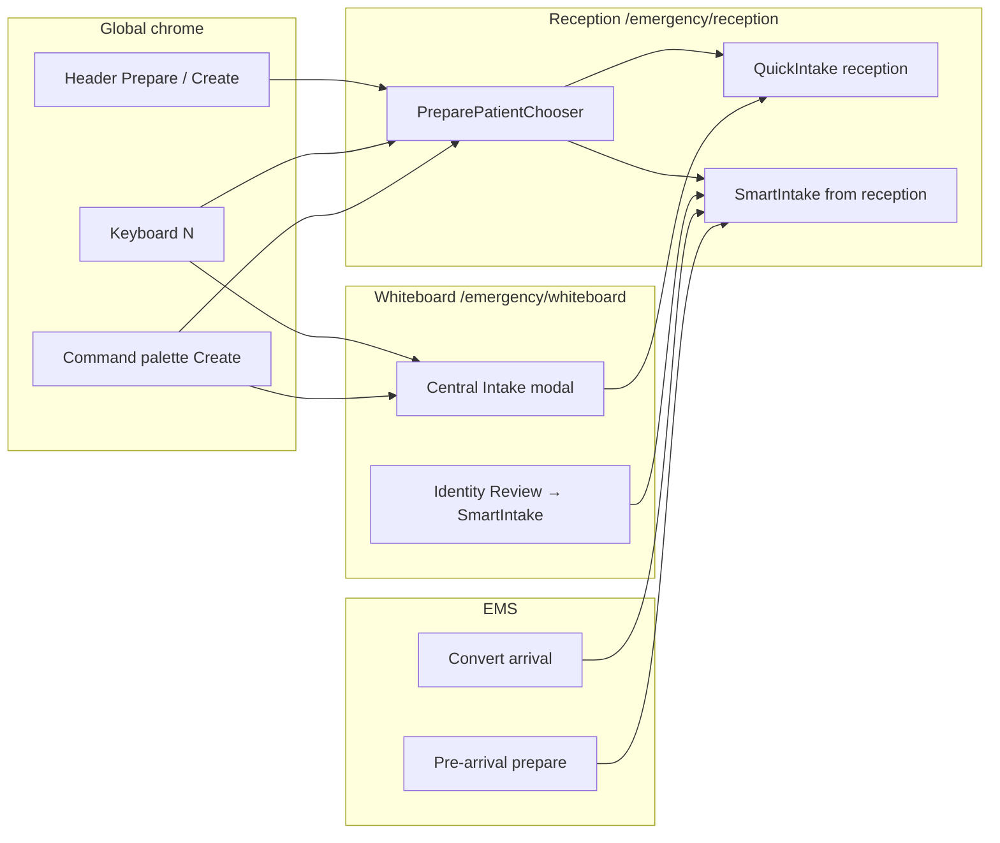

# Reception Dominance Audit

Date: 2026-06-17

## Executive Summary

CareDroid Emergency OS has a **reception-first architecture on paper** but **split creation surfaces in practice**. Patient creation can start from six distinct entry points across Reception, Whiteboard, EMS, keyboard shortcuts, and the command palette. Registration clerks are correctly steered to `/emergency/reception`, but the Reception page itself lacks on-page creation CTAs — staff must discover Header **Prepare**, the **N** shortcut, or the command palette.

The dominant intended path is:

```text
Arrival → Reception → Prepare Patient Chooser → Quick Create | Smart Intake → Handoff → Triage queue
```

Reception dominance is **partially achieved**: routing, role permissions, and handoff wiring favor Reception, but discoverability, backend identity sessions, patient search, and design-vs-implementation gaps weaken the front-desk experience.

---

## 1. Workflow Inventory

### 1.1 Patient creation workflows

| ID | Workflow | Entry surface | Component | Route / trigger | Roles |
| --- | --- | --- | --- | --- | --- |
| **A** | Reception quick create | Header, keyboard, palette, URL param | `QuickIntake.tsx` (`variant="reception"`) | `/emergency/reception` + `open-reception-prepare` / `?quickCreate=1` | `registration_clerk`, `triage_nurse`, `charge_nurse`, `admin` |
| **B** | Reception guided chooser | Same as A | `PreparePatientChooser.jsx` | Modal on Reception | Create-capable roles (except EMS) |
| **C** | Smart Intake (identity wizard) | Chooser, work queues, Whiteboard Identity Review | `SmartIntake.jsx` | `/emergency/intake?from=reception&step=…` | `registration_clerk` (+ verify), clinical create roles |
| **D** | Whiteboard Central Intake | Whiteboard mission control, Header **Create** (non-reception roles) | `QuickIntake.tsx` (`variant="whiteboard"`) | `/emergency/whiteboard` + `open-intake` | `triage_nurse`, `charge_nurse`, `admin`, `ems_user` |
| **E** | EMS arrival conversion | EMS Pipeline, Reception EMS panel | `convertEMSArrivalToPatient` in `emergencyStore.ts` | `/emergency/ems`, Reception `EmsPreArrivalPanel` | `registration_clerk`, `ems_user`, charge/triage |
| **F** | EMS pre-arrival prepare | Reception inbound panel | Smart Intake EMS mode | `?mode=ems-prearrival&emsArrivalId=` | `registration_clerk` (verify) |
| **G** | Unknown patient fast path | Prepare chooser | Smart Intake finalize | `?from=reception&mode=unknown&step=finalize` | Create + verify roles |
| **H** | Legacy alternate form | **Unmounted** | `NewPatientIntake.jsx` | None — test file only | N/A |

### 1.2 Patient search workflows

| ID | Workflow | Entry | Behavior | Backend |
| --- | --- | --- | --- | --- |
| **S1** | Header patient lookup | `Header.tsx` — `/` focuses search | Local store filter; registration clerk scopes to Reception `?q=` | No dedicated search API |
| **S2** | Patients census | Sidebar **Patients** | `PatientsRoute` in `App.jsx` — filter by name, MRN, complaint | Local + optional per-ID bundle fetch |
| **S3** | Reception queue filter | Header search on Reception route | Filters work queues via URL `?q=` | Store-derived |
| **S4** | Command palette lookup | **Patient Lookup** command | Routes to Patients or Reception search | Same as S1/S2 |
| **S5** | Smart Intake MPI match | Step 4 (Match Patient) | Demo fixtures; live MPI when identity session enabled | `mpi.service.ts` (gated off in UI) |

### 1.3 Onboarding workflows (non-patient)

| ID | Workflow | Route | Purpose |
| --- | --- | --- | --- |
| **O1** | Organization onboarding | `/onboarding` | Tenant profile, packs, workspace setup via `POST /api/organizations/onboarding` |
| **O2** | Commercial onboarding page | `OrganizationOnboardingPage` | Seven-step org configuration UI |
| **O3** | User consent / biometric | `/onboarding`, `/biometric-setup` | Profile completion, not ED patient registration |

These are **tenant setup**, not patient arrival. No patient registration wizard exists at app welcome.

---

## 2. Where Patient Creation Starts

### 2.1 Canonical origin (intended)

**`/emergency/reception`** (`ReceptionWorkspace.jsx`) is the designed single origin for front-desk patient creation.

Evidence:

- `registration_clerk.defaultRoute` → Reception (`emergencyRolePermissions.js`)
- Registration clerk blocked from Whiteboard (`App.jsx` `EmergencyRouteGuard`)
- `prefersReceptionForPatientCreate()` returns true for all create-capable roles except `ems_user`
- Header **Prepare**, **N** shortcut, and command palette **Create Patient** route to Reception for those roles

### 2.2 Actual creation entry points (all roles)



| Entry point | File | Event / action | Lands on |
| --- | --- | --- | --- |
| Sidebar **Reception** | `Sidebar.tsx` | Navigate | `/emergency/reception` (no auto-open chooser) |
| Header **Prepare** (on Reception) | `Header.tsx` | `open-reception-prepare` | `PreparePatientChooser` modal |
| Header **Create** (off Reception) | `Header.tsx` | Navigate `?quickCreate=1` | Reception + chooser |
| Keyboard **N** | `AppShell.tsx` | Reception path or `open-intake` | Chooser or Whiteboard modal |
| Command palette **Create Patient** | `CommandPalette.tsx` | Same as N | Chooser or Whiteboard modal |
| URL `?quickCreate=1` | `ReceptionWorkspace.jsx` | Auto-open chooser | `PreparePatientChooser` |
| Whiteboard **Central Intake** | `index.tsx` | `setShowIntake(true)` | `QuickIntake` whiteboard variant |
| Whiteboard **Identity Review** | `index.tsx` | Navigate | `/emergency/intake` |
| EMS **Convert** / **Register now** | `EmsPreArrivalPanel`, `EMSPipeline` | Store mutation | Local patient + optional Smart Intake verify |

### 2.3 Role-specific creation origins

| Role | Default home | Primary create surface | Secondary create surface |
| --- | --- | --- | --- |
| `registration_clerk` | Reception | Reception chooser → Quick/Smart Intake | EMS convert on Reception panel |
| `triage_nurse` | Whiteboard | Reception (steered via Header/N) | Whiteboard Central Intake |
| `charge_nurse` | Whiteboard | Reception (steered) | Whiteboard Central Intake |
| `admin` | Whiteboard | Reception (steered) | Whiteboard Central Intake |
| `ems_user` | EMS | Whiteboard Central Intake | EMS convert (no Reception preference) |
| `physician` | Whiteboard | **None** — `patient.create` denied | — |
| `ed_manager` | Whiteboard | **None** | — |
| `read_only_viewer` | Whiteboard | **None** | — |

---

## 3. Click Depth Analysis

Counts are **navigation/interaction clicks** only (excluding form field entry and typing).

### 3.1 Registration clerk — fastest walk-in (Quick Create)

| Step | Action | Cumulative clicks |
| --- | --- | --- |
| 0 | Lands on Reception (default home) | 0 |
| 1 | Header **Prepare** | 1 |
| 2 | Chooser → **Enter manually** | 2 |
| 3 | **Register & send to triage** | 3 |

**Minimum: 3 clicks** from Reception home to patient on triage queue.

With **N** shortcut from anywhere: navigate + chooser auto-open (1) → Enter manually (2) → Submit (3) = **3 clicks** (navigation included in N).

### 3.2 Registration clerk — Smart Intake (full identity)

| Step | Action | Cumulative clicks |
| --- | --- | --- |
| 1 | Header **Prepare** | 1 |
| 2 | **Full identity verification** | 2 |
| 3–8 | Advance through 6 Smart Intake steps | 3–8 |
| 9 | **Create and Send to Triage** (finalize) | 9 |

**Minimum: ~9 clicks** for full wizard from Reception.

Unknown patient shortcut: Prepare (1) → **Unknown patient** (2) → finalize actions (~2–3 more) = **~4–5 clicks**.

### 3.3 Triage nurse — Whiteboard bypass (reception not enforced)

| Step | Action | Cumulative clicks |
| --- | --- | --- |
| 0 | Default home = Whiteboard | 0 |
| 1 | **Central Intake** | 1 |
| 2 | **Send to Central Node** | 2 |

**Minimum: 2 clicks** — bypasses Reception entirely. Patient lands on board, not through `receptionHandoff.ts`.

### 3.4 Triage nurse — reception-steered path

| Step | Action | Cumulative clicks |
| --- | --- | --- |
| 1 | Header **Create** or **N** | 1 |
| 2 | Chooser → Enter manually | 2 |
| 3 | Submit | 3 |

**Minimum: 3 clicks** when steered path is used.

### 3.5 EMS convert path

| Step | Action | Cumulative clicks |
| --- | --- | --- |
| 1 | Reception or EMS → **Register now** / Convert | 1 |
| 2 | (Optional) Smart Intake verify | 2+ |

**Minimum: 1 click** for store-only conversion; verify adds Smart Intake depth.

### 3.6 Patient search (not creation)

| Role | Path | Clicks to result |
| --- | --- | --- |
| Registration clerk | `/` focus → type → select from header dropdown | 2+ (type + select) |
| Other roles | Header lookup → navigate Patients `?q=` | 2+ |
| Any | Sidebar Patients → type in page filter | 2+ |

### 3.7 Target vs actual (from `reception-first-strategy.md`)

| Criterion | Target | Actual |
| --- | --- | --- |
| Start intake from Reception | ≤2 interactions | **2** (Prepare + chooser option) ✓ |
| Finalize and see on queue | ≤3 interactions | **3** for Quick Create ✓ |
| Clerk never needs Whiteboard | Yes | Yes (route guard) ✓ |
| All create-capable roles use Reception | Intended | **No** — clinical roles can use Central Intake in 2 clicks |

---

## 4. Workflow Breaks

### 4.1 Critical breaks

| # | Break | Impact | Evidence |
| --- | --- | --- | --- |
| **B1** | **No on-page creation CTA on Reception** | Clerks who land on Reception see EMS panel, metrics, and queues — but no **Prepare Patient**, **Quick Create**, or **Smart Intake** buttons. Creation depends on Header chrome or keyboard.discovery. | `ReceptionWorkspace.jsx` renders only `EmsPreArrivalPanel`, `ArrivalMetricsPanel`, `ReceptionWorkQueues`, and event-driven modals. `reception-screen-design.md` §3 describes a Primary Action Band that is **not implemented**. |
| **B2** | **Dual create surfaces for clinical roles** | Triage/charge nurses can create in 2 clicks on Whiteboard, skipping Reception handoff, queue metrics, and registration workflow. | `prefersReceptionForPatientCreate` steers Header/N but Whiteboard **Central Intake** remains one click away on default home. |
| **B3** | **Smart Intake identity API disabled** | OCR, MPI match, field verify, and session persistence fall back to demo fixtures. Full identity workflow cannot complete against real backend. | `backendApiCapabilities.js`: `emergencySmartIntakeIdentitySession: DISABLED`. `smartIntakeApi.js` guarded. |
| **B4** | **No backend patient search** | MPI / enterprise lookup unavailable; search is local store filter only. | `patientManagementApi.js` `searchPatientsFromBackend()` — `backendSearchAvailable: false`. |
| **B5** | **Link to existing patient requires board presence** | Smart Intake "Link to Existing Patient" disabled unless match candidate already exists on whiteboard. | `SmartIntake.jsx` — `selectedCandidateOnBoard` gate. |
| **B6** | **EMS user split UX** | EMS users have `patient.create` but `prefersReceptionForPatientCreate` is false; they use Whiteboard Central Intake, not Reception. | `emergencyRolePermissions.js` lines 417–420. EMS user routes exclude Reception. |

### 4.2 Moderate breaks

| # | Break | Impact | Evidence |
| --- | --- | --- | --- |
| **B7** | Standalone Intake nav hidden for **all** roles | `/emergency/intake` unreachable from sidebar; only via chooser, Identity Review, or direct URL. | `shouldHideStandaloneIntakeNav()` returns true for every defined role. |
| **B8** | Registration clerk redirected from standalone Smart Intake | Direct `/emergency/intake` without `?from=reception` bounces to Reception. | `SmartIntake.jsx` redirect effect. |
| **B9** | Triple backend patient surfaces | Nest `/api/emergency/*` (demo), Express `/api/intake/*` (gated), platform `/api/patients` — inconsistent source of truth. | Multiple controllers; Emergency OS path is primary for ED quick-create. |
| **B10** | Allergies / medications not captured at intake | Partial — fixtures reference fields; post-handoff edit in detail panel only. | `patient-arrival-experience.md` checklist. |
| **B11** | `open-intake` command hidden for all roles | Command palette cannot open standalone intake. | `CommandPalette.tsx` + `shouldHideStandaloneIntakeNav`. |

### 4.3 Permission dead ends

| Role | Dead end | Reason |
| --- | --- | --- |
| `physician` | Header Create disabled | No `patient.create` |
| `ed_manager` | Same | No `patient.create` |
| `read_only_viewer` | All mutations disabled | Read-only role |
| `ems_user` | Reception route inaccessible | Not in role routes; must use EMS/Whiteboard |

---

## 5. What Exists But Is Hidden

### 5.1 Unmounted or suppressed UI

| Artifact | Location | Status | How to reach today |
| --- | --- | --- | --- |
| **`NewPatientIntake.jsx`** | `src/components/` | Built, tested, **not imported** in app routes | Nowhere in production UI |
| **Standalone Intake nav** | `unified-navigation.config.ts` | Route exists; nav item filtered for all roles | Direct URL `/emergency/intake` (clerk redirected without `from=reception`) |
| **Command palette `open-intake`** | `CommandPalette.tsx` | Filtered by `shouldHideStandaloneIntakeNav` | Not in palette |
| **Reception Primary Action Band** | `reception-screen-design.md` | **Designed, not built** | N/A — spec only |
| **Express Smart Intake session API** | `backend/src/api/smart-intake.routes.ts` | Full pipeline (sessions, OCR, match, link, create) | Frontend blocked by capability flag |
| **Platform patient import** | `patientManagementApi.js` | `importEhrPatient`, labs/meds bundles | Not in ED arrival click path |
| **Legacy `layout/AppShell.jsx`** | `src/layout/` | Duplicate shell with `ed:open-intake` events | Not runtime-mounted |
| **Intake Command Center** | `features/future-modules/` | Quarantined | Do not mount |

### 5.2 Reachable but low-discoverability

| Capability | How staff might miss it |
| --- | --- |
| **Prepare Patient Chooser** | No on-page button; only Header **Prepare**, **N**, palette, or `?quickCreate=1` |
| **Identity Review** | Buried in Whiteboard mission control grid |
| **EMS pre-arrival prepare** | Requires scrolling to inbound panel on Reception |
| **Unknown patient path** | Inside Prepare chooser only |
| **Reception work queue → verify** | Requires patients already in Registration state |
| **Organization onboarding** | Separate from ED; at `/onboarding` |

### 5.3 Feature-flagged nav (not patient creation, but affects reception context)

| Nav item | Flag | Default visibility |
| --- | --- | --- |
| EMS Pipeline | `ems_pipeline` | Org feature flags |
| Capacity | `capacity_intel` | Org feature flags |
| Referrals | `referral_intel` | Org feature flags |

---

## 6. API & State Integration Map

### 6.1 Primary ED patient creation chain

```text
QuickIntake / SmartIntake finalize
  → POST /api/emergency/intake (demo)
  → POST /api/emergency/intake/vertical-slice (Smart Intake finalize)
  → emergencyStore.addPatient()
  → completeReceptionHandoff() [reception variant only]
  → POST /api/emergency/reception/handoff (demo)
  → PatientState.Triage + queue visibility
```

### 6.2 Key files

| Layer | Files |
| --- | --- |
| Reception hub | `src/pages/emergency/ReceptionWorkspace.jsx` |
| Chooser | `src/components/reception/PreparePatientChooser.jsx` |
| Quick create | `src/components/QuickIntake.tsx` |
| Smart intake | `src/pages/emergency/SmartIntake.jsx` |
| Handoff | `src/services/receptionHandoff.ts` |
| Permissions | `src/config/emergencyRolePermissions.js` |
| Nav | `src/config/unified-navigation.config.ts` |
| Store | `src/store/emergencyStore.ts` |
| API client | `src/services/emergencyOsApi.js` |
| Backend | `backend/src/modules/emergency-os/emergency-os.controller.ts` |

### 6.3 Capability flags affecting reception dominance

| Capability | Status | Reception impact |
| --- | --- | --- |
| `emergencySmartIntake` | DEMO | Quick create works; fixture-backed |
| `emergencySmartIntakeIdentitySession` | **DISABLED** | Full identity wizard is demo-only |
| `emergencyReceptionSnapshot` | DEMO | Inbound EMS panel polling |
| `emergencyReceptionHandoff` | DEMO | Handoff persistence |
| `emergencyPatients` | DEMO | Patient list sync |

---

## 7. Dominance Scorecard

| Dimension | Score | Notes |
| --- | --- | --- |
| **Routing dominance** | Strong | Clerk home, whiteboard guard, Header/N steering |
| **UI dominance** | Weak | No on-page Reception CTAs; design spec not shipped |
| **Workflow uniqueness** | Moderate | Whiteboard Central Intake duplicates QuickIntake |
| **Search dominance** | Weak | Local filter only; no MPI |
| **Backend readiness** | Weak | Identity session disabled; demo envelopes |
| **Hidden artifact cleanup** | Moderate | `NewPatientIntake` dead; legacy shell remains |

**Overall reception dominance: partial.** Reception owns the registration clerk journey and handoff wiring, but clinical roles retain a faster parallel path and the Reception surface itself under-advertises creation.

---

## 8. Recommended Priorities (audit output)

Ordered by impact on reception dominance:

1. **Ship Reception Primary Action Band** — implement `reception-screen-design.md` §3 CTAs on `ReceptionWorkspace.jsx` (Prepare, Quick Create, Smart Intake, Scan/OCR).
2. **Demote or gate Whiteboard Central Intake** for roles where `prefersReceptionForPatientCreate` is true — align 2-click Whiteboard path with reception-first strategy.
3. **Enable `emergencySmartIntakeIdentitySession`** — wire `smartIntakeApi.js` to Express intake routes for real OCR/MPI/verify.
4. **Add backend patient search** — expose MPI query for Header lookup and Reception search.
5. **Remove or archive `NewPatientIntake.jsx`** — eliminate parallel dead form.
6. **Relax Link-to-Existing gate** — allow MPI link without requiring patient on whiteboard.
7. **Unify EMS user path** — decide Reception vs Whiteboard for `ems_user` create and document consistently.

---

## 9. Related Documents

- `reception-first-strategy.md` — strategic intent and success criteria
- `reception-workspace-audit.md` — capability exists/wired/gap matrix
- `reception-screen-design.md` — intended Arrival Dashboard layout (partially implemented)
- `patient-arrival-experience.md` — single-workflow checklist and journey mapping
- `hidden-artifact-discovery.md` — unmounted components inventory
- `smart-intake-identity-validation.md` — identity session validation notes

---

## 10. Audit Method

This document was produced by tracing:

- Frontend routes in `src/config/routes.config.js` and `src/App.jsx`
- Navigation and role permissions in `unified-navigation.config.ts` and `emergencyRolePermissions.js`
- Entry-point handlers in `Header.tsx`, `AppShell.tsx`, `CommandPalette.tsx`, `ReceptionWorkspace.jsx`, `index.tsx` (Whiteboard)
- Backend capability gates in `backendApiCapabilities.js`
- API clients `emergencyOsApi.js`, `smartIntakeApi.js`, `patientManagementApi.js`
- Cross-check against existing architecture docs dated 2026-06-14 — 2026-06-17
