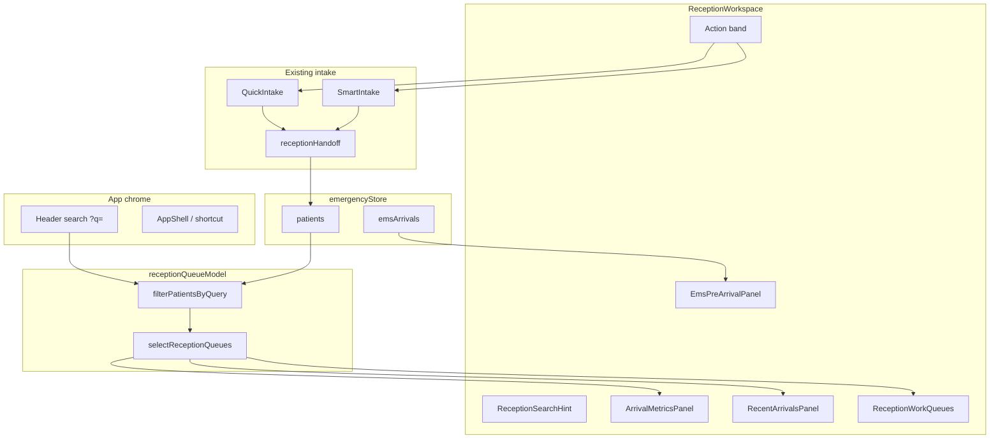

# Reception Workspace Report

Date: 2026-06-17

## Summary

The **Reception Workspace** at `/emergency/reception` is the canonical Arrival Dashboard for CareDroid Emergency OS. This pass **normalized** the existing workspace by composing proven components, extracting a single queue model, and surfacing every required capability without introducing parallel search, intake, or store systems.

**Route:** `/emergency/reception`  
**Page:** `src/pages/emergency/ReceptionWorkspace.jsx`  
**Screen mode:** `REGISTRATION_SCREEN` (via `useRouteScreenMode`)

---

## Required Capabilities — Status

| Capability | Surfaced via | Implementation | Duplicate system? |
| --- | --- | --- | --- |
| **Patient Search** | Header lookup + `ReceptionSearchHint` | `Header.tsx` syncs `?q=`; hint focuses search with `/` | No — no second search input |
| **Quick Create Patient** | Action band + `PreparePatientChooser` | `QuickIntake.tsx` (`variant="reception"`) | No — reuses central intake modal |
| **Smart Intake** | Action band + chooser | Navigate to `SmartIntake.jsx?from=reception` | No — same wizard as whiteboard path |
| **Verification Queue** | `ReceptionWorkQueues` tab | `Registration` state, non-EMS patients | No — store-derived |
| **Recent Arrivals** | `ArrivalMetricsPanel` count + `RecentArrivalsPanel` list | Last 30 minutes from `receptionQueueModel` | No — shared filter |
| **Patients Awaiting Triage** | Metrics + `ReceptionWorkQueues` “Awaiting triage” tab | `PatientState.Triage` | No |
| **EMS Arrivals** | `EmsPreArrivalPanel` | Inbound `emsArrivals` + snapshot poll | No — same EMS store |
| **Queue Counts** | `ArrivalMetricsPanel` + queue tab badges | `selectReceptionQueues().counts` | No — single model |

---

## Layout (top → bottom)

```text
┌──────────────────────────────────────────────────────────────┐
│  Reception workspace (title + description)                   │
├──────────────────────────────────────────────────────────────┤
│  Patient search hint → focuses Header lookup (/)             │
├──────────────────────────────────────────────────────────────┤
│  EMS Arrivals — EmsPreArrivalPanel (inbound units, ETA)    │
├──────────────────────────────────────────────────────────────┤
│  [ Prepare patient ]                                         │
│  [ Quick Create | Start Smart Intake | Scan / OCR ]          │
├──────────────────────────────────────────────────────────────┤
│  Handoff success banner (when ?arrived=)                     │
├──────────────────────────────────────────────────────────────┤
│  Queue counts — ArrivalMetricsPanel (5 metric cards)         │
├──────────────────────────────────────────────────────────────┤
│  Recent arrivals list — RecentArrivalsPanel                  │
├──────────────────────────────────────────────────────────────┤
│  Registration queues — ReceptionWorkQueues (tabbed)          │
│    EMS registration | Verification | Awaiting triage         │
└──────────────────────────────────────────────────────────────┘

Modals (event-driven):
  PreparePatientChooser → QuickIntake | SmartIntake routes
```

Header chrome (not duplicated on page): primary patient lookup, **Prepare** button, role-aware navigation.

---

## Component Stack

### Page orchestrator

| File | Role |
| --- | --- |
| `src/pages/emergency/ReceptionWorkspace.jsx` | Composes all zones; URL state (`q`, `queue`, `arrived`, `patientId`); handoff callbacks |
| `src/pages/emergency/ReceptionWorkspace.css` | Workspace grid, action band, banner |

### Reception components (`src/components/reception/`)

| Component | Purpose |
| --- | --- |
| `receptionQueueModel.js` | **Single source** for queue filters, search filter, counts, recent arrivals |
| `ReceptionSearchHint.jsx` | Surfaces search affordance; dispatches `focus-reception-search` |
| `EmsPreArrivalPanel.jsx` | Inbound ambulances; prepare registration / register on arrival |
| `ArrivalMetricsPanel.jsx` | Clickable queue count cards |
| `RecentArrivalsPanel.jsx` | List of patients arrived in last 30 minutes |
| `ReceptionWorkQueues.jsx` | Tabbed verification / triage / EMS registration queues |
| `PreparePatientChooser.jsx` | Guided branch into quick, OCR, full intake, unknown |

### Shared intake (not reception-specific)

| Component | Reception usage |
| --- | --- |
| `QuickIntake.tsx` | `variant="reception"` — “Register & send to triage” |
| `SmartIntake.jsx` | `?from=reception` — identity wizard + verify |
| `receptionHandoff.ts` | Post-create queue assignment |

### Chrome & permissions

| Module | Reception effect |
| --- | --- |
| `Header.tsx` | Primary search; `?q=` sync; **Prepare** |
| `AppShell.tsx` | `/` focuses search; `N` opens prepare flow |
| `emergencyRolePermissions.js` | `registration_clerk` home = reception |
| `App.jsx` `EmergencyRouteGuard` | Clerk blocked from whiteboard |

---

## Queue Model (`receptionQueueModel.js`)

Centralizes logic previously duplicated in `ReceptionWorkspace` and `ReceptionWorkQueues`.

**Exports:**

- `filterPatientsByQuery(patients, query)` — header search drives `?q=` filtering
- `selectReceptionQueues(patients)` — returns `{ ems, verification, pretriage, recentArrivals, counts }`
- `patientLabel`, `isEmsRegistrationPatient`, `minutesSince`
- `RECENT_ARRIVAL_MINUTES = 30`

**Queue rules:**

| Queue | Inclusion rule |
| --- | --- |
| EMS registration | `PatientFlag.EMSArrival` + `Registration` or `Arrival` |
| Verification | `Registration` and not EMS-flagged |
| Awaiting triage | `PatientState.Triage` |
| Recent arrivals | `arrivalTime` within 30 minutes |

**Counts** feed both `ArrivalMetricsPanel` and `ReceptionWorkQueues` tab badges — always consistent.

---

## Capability Detail

### 1. Patient Search

- **Input:** Header lookup only (`emergency-os-header__lookup--primary` on reception route)
- **URL:** `?q=` filters queues and recent arrivals on the page
- **Keyboard:** `/` → `focus-reception-search` event
- **On-page:** `ReceptionSearchHint` explains search and offers **Focus search** — no duplicate text field

### 2. Quick Create Patient

- **Entry:** Quick Create button, Prepare → Enter manually, Header Prepare, `N`, `?quickCreate=1`
- **Modal:** `QuickIntake` reception variant
- **Submit:** `POST /api/emergency/intake` with local fallback → `addPatient` → `completeReceptionHandoff`
- **Outcome:** `?arrived={patientId}` success banner

### 3. Smart Intake

- **Entry:** Start Smart Intake, Scan/OCR, Prepare chooser options
- **Route:** `/emergency/intake?from=reception&step=…`
- **Finalize:** `runSmartIntakeVerticalSlice` or local fallback → handoff when `from=reception`

### 4. Verification Queue

- **Tab:** Registration queues → **Verification**
- **Row click:** Opens Smart Intake `?step=verify&patientId=`
- **Count:** `counts.awaitingVerification` (all `Registration` patients)

### 5. Recent Arrivals

- **Count:** Arrival metrics card “Recent arrivals”
- **List:** `RecentArrivalsPanel` — up to 8 patients, sorted by `arrivalTime` desc
- **Click:** Select patient or open verify flow if in `Registration`

### 6. Patients Awaiting Triage

- **Tab:** Registration queues → **Awaiting triage** (renamed from “Pre-triage”)
- **Count:** Metrics card “Awaiting triage”
- **State:** `PatientState.Triage`

### 7. EMS Arrivals

- **Panel:** `EmsPreArrivalPanel` — inbound units with ETA, complaint, vitals
- **Actions:** Prepare registration (Smart Intake EMS mode), Register on arrival (`convertEMSArrivalToPatient`)
- **Poll:** `useReceptionSnapshotPolling(15000)` → `GET /api/emergency/reception/snapshot`

### 8. Queue Counts

| Metric card | Source |
| --- | --- |
| Recent arrivals | `counts.recentArrivals` |
| Current waiting | `counts.waiting` (`PatientState.Waiting`) |
| Awaiting verification | `counts.awaitingVerification` |
| Awaiting triage | `counts.awaitingTriage` |
| EMS inbound | Store `emsArrivals` inbound count |

Tab badges on `ReceptionWorkQueues` mirror EMS / verification / triage preview list lengths.

---

## URL State Contract

| Param | Effect |
| --- | --- |
| `q` | Filter patients for queues + recent arrivals |
| `queue` | Active work-queue tab: `ems` (default), `verification`, `pretriage` |
| `arrived` | Post-handoff success banner |
| `patientId` | Deep-link patient select / verify (consumed on load) |
| `quickCreate=1` | Auto-open Prepare chooser (stripped after open) |

---

## Data Flow



---

## Normalization Changes (this pass)

| Change | Rationale |
| --- | --- |
| Added `receptionQueueModel.js` | One queue derivation for metrics, tabs, and lists |
| Added `ReceptionSearchHint` | Surface search without duplicating Header input |
| Added `RecentArrivalsPanel` | Surface recent arrivals as list, not count-only |
| Added workspace intro header | Accessible landmark (`reception-workspace-title`) |
| Pass `filteredPatients` to queues | Search consistently filters all queue views |
| Renamed pretriage tab label | “Awaiting triage” matches product language |
| Removed inline search-context paragraph | Replaced by `ReceptionSearchHint` |

**Not created:** new store, new API routes, new intake form, or page-level search field.

### Convergence pass (prompts 21–40)

| Asset | Status | Notes |
| --- | --- | --- |
| `NewPatientIntake.jsx` | **Deprecated / unwired** | Legacy whiteboard modal; production uses `QuickIntake` + Smart Intake. Handoff source `whiteboard-central-intake` when used in tests. |
| `ExpressRegistration` | **Wired** | Fast path; handoff source `express-register` (distinct from `quick-intake`). |
| `QuickIntake` | **Wired** | Secondary full create; handoff source `quick-intake`. |
| Header search | **Single surface** | `ReceptionSearchHint` focuses header lookup; no duplicate input. |
| AI triage assist | **Post-handoff only** | Clerks do not see panel; triage nurses on pretriage tab + whiteboard Triage filter. |

---

## Role Behavior

| Role | Workspace access | Create | Verify | EMS convert |
| --- | --- | --- | --- | --- |
| `registration_clerk` | Full (default home) | Yes | Yes | Yes |
| `triage_nurse` / `charge_nurse` / `admin` | View + create when permitted | Yes | Triage/admin varies | Yes |
| `ems_user` | No reception route | Whiteboard intake | No | EMS pipeline |
| `physician` / `ed_manager` | View metrics | No | No | No |
| `read_only_viewer` | Read-only | No | No | No |

---

## Tests

| File | Coverage |
| --- | --- |
| `receptionQueueModel.test.js` | Search filter + queue partitioning |
| `ReceptionWorkspace.test.jsx` | Wiring, no duplicate page search, action band, new panels |
| `receptionHandoff.test.ts` | Handoff state transitions |

Run:

```bash
npx vitest run src/components/reception/receptionQueueModel.test.js src/pages/emergency/ReceptionWorkspace.test.jsx
```

---

## Related Documents

- `reception-screen-design.md` — layout zones and click budget
- `reception-workspace-audit.md` — capability exists/wired matrix (prior)
- `reception-dominance-audit.md` — entry points and dominance scorecard
- `arrival-to-triage-trace.md` — end-to-end journey trace
- `reception-first-strategy.md` — strategic intent

---

## File Index

```text
src/pages/emergency/ReceptionWorkspace.jsx
src/pages/emergency/ReceptionWorkspace.css
src/components/reception/
  receptionQueueModel.js
  receptionQueueModel.test.js
  ReceptionSearchHint.jsx
  ReceptionSearchHint.css
  RecentArrivalsPanel.jsx
  RecentArrivalsPanel.css
  EmsPreArrivalPanel.jsx
  ArrivalMetricsPanel.jsx
  ReceptionWorkQueues.jsx
  PreparePatientChooser.jsx
src/components/QuickIntake.tsx
src/pages/emergency/SmartIntake.jsx
src/services/receptionHandoff.ts
src/components/Header.tsx
```
