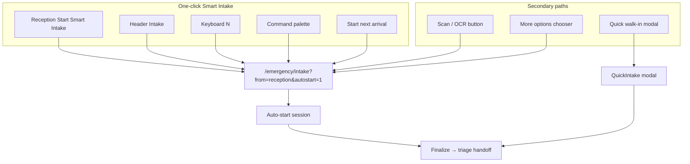

# Smart Intake Promotion

Date: 2026-06-17

## Goal

Make **Smart Intake** the fastest and primary patient-arrival workflow in CareDroid Emergency OS. Reception staff should reach identity review in **one click** from the arrival dashboard, with global shortcuts (`N`, Header **Intake**, command palette) landing on Smart Intake — not a chooser or quick-create modal.

**Design principle:** Smart Intake is the default; Quick walk-in and the options chooser are secondary escape hatches.

---

## Click Budget — Before vs After

| Task | Before | After |
| --- | --- | --- |
| Start intake from Reception (on-page) | 2 clicks (Prepare → Full identity) | **1 click** (Start Smart Intake) |
| Start intake from Header on Reception | 2 clicks (Prepare → option) | **1 click** (**Intake**) |
| Global shortcut `N` (reception roles) | Reception → chooser modal | **Direct** `/emergency/intake?from=reception&autostart=1` |
| Command palette create | Reception → chooser | **Smart Intake URL** |
| Smart Intake session bootstrap | Manual **Start Intake** click | **Auto-start** when `from=reception` |
| Scan / OCR path | 2 clicks (Prepare → Scan) | **1 click** (secondary button) |
| Quick walk-in | 1–2 clicks | **1 click** (Quick walk-in secondary) |
| Start next arrival (post-handoff) | Clears banner only | **1 click** → Smart Intake |

**Fastest end-to-end path (reception clerk):**

```text
Reception → Start Smart Intake (1 click) → session auto-starts → verify fields → Create and Send to Triage
```

---

## What Changed

### 1. Primary routing (`emergencyRolePermissions.js`)

| Function | Behavior |
| --- | --- |
| `getReceptionSmartIntakePath(options?)` | **New.** Builds `/emergency/intake?from=reception&autostart=1` with optional `step`, `mode`, `patientId`, `emsArrivalId` |
| `getReceptionQuickCreatePath()` | Now aliases **Smart Intake** (was `?quickCreate=1` chooser) |
| `getReceptionWalkInQuickPath()` | **New.** `/emergency/reception?quickCreate=1` for QuickIntake modal only |

All global create shortcuts (`N`, Header off-reception, command palette, whiteboard steer-to-reception) use Smart Intake path.

### 2. Reception action band (`ReceptionWorkspace.jsx`)

**Primary (wide CTA):** Start Smart Intake → `openSmartIntake()`

**Secondary row:**

| Button | Action |
| --- | --- |
| Scan / OCR | Smart Intake `?step=ocr` |
| Quick walk-in | `QuickIntake` modal (demographics-only shortcut) |
| More options | `PreparePatientChooser` (unknown, walk-in, OCR, full intake) |

**Events** `open-reception-prepare`, `open-reception-quick-create`, and new `open-reception-intake` all launch Smart Intake directly.

**URL params:**

| Param | Effect |
| --- | --- |
| `?intake=1` | Auto-navigate to Smart Intake (stripped after launch) |
| `?quickCreate=1` | Open Quick walk-in modal only (explicit shortcut) |

**Post-handoff:** “Start next arrival” clears banner and opens Smart Intake.

### 3. Header (`Header.tsx`)

| Before | After |
| --- | --- |
| Label **Prepare** | Label **Intake** |
| Dispatches `open-reception-prepare` (chooser) | Dispatches `open-reception-intake` (Smart Intake) |
| Off-reception navigate `?quickCreate=1` | Navigate `getReceptionSmartIntakePath()` |

### 4. Command palette (`CommandPalette.tsx`)

- Label: **Start Smart Intake**
- Description: primary arrival workflow
- Action: `getReceptionQuickCreatePath()` → Smart Intake URL

### 5. Prepare chooser (`PreparePatientChooser.jsx`)

Reordered and reframed as **secondary** options:

1. Full Smart Intake (primary option in modal)
2. Scan ID / OCR
3. Quick walk-in
4. Unknown patient

Copy updated: “Smart Intake is the default arrival workflow.”

### 6. Smart Intake auto-start (`SmartIntake.jsx`)

When `?from=reception` and user can verify:

- Session **auto-starts** on mount (except `mode=unknown` / `step=finalize`)
- Skips manual **Start Intake** click
- `autostart=1` query param documents intent (set by all reception launchers)
- Button shows **Session active** after bootstrap

Deep links preserved:

| Param | Behavior |
| --- | --- |
| `step=ocr` | Auto-start + land on OCR step |
| `step=verify&patientId=` | Queue verification flow |
| `mode=unknown` | Jump to finalize |
| `mode=ems-prearrival` | EMS prepare registration |

---

## Entry Point Map (post-promotion)



---

## Files Touched

| File | Change |
| --- | --- |
| `src/config/emergencyRolePermissions.js` | Smart Intake path helpers |
| `src/pages/emergency/ReceptionWorkspace.jsx` | Primary CTA, events, autostart param |
| `src/components/Header.tsx` | Intake label + `open-reception-intake` |
| `src/components/CommandPalette.tsx` | Start Smart Intake command |
| `src/components/reception/PreparePatientChooser.jsx` | Reordered secondary options |
| `src/pages/emergency/SmartIntake.jsx` | Reception auto-start session |
| `src/components/AppShell.tsx` | Unchanged import — `N` uses new path via `getReceptionQuickCreatePath` |
| `src/pages/emergency/index.tsx` | Whiteboard steer uses new path |

**Not duplicated:** Same `SmartIntake.jsx`, `QuickIntake.tsx`, `receptionHandoff.ts`, and `emergencyStore` — routing and prominence only.

---

## Role Behavior

| Role | Primary create path |
| --- | --- |
| `registration_clerk` | Reception → Smart Intake (1 click) or Header **Intake** |
| `triage_nurse` / `charge_nurse` / `admin` | `N` / palette → Smart Intake URL; whiteboard still has Central Intake for clinical fast-path |
| `ems_user` | Whiteboard Central Intake (unchanged — no reception route) |
| `physician` / `ed_manager` | No create |

---

## Intentional Secondary Paths

| Path | When to use |
| --- | --- |
| **Quick walk-in** | Known walk-in, demographics only, no identity wizard |
| **More options → Unknown** | Unidentified patient finalize |
| **Whiteboard Central Intake** | EMS user / clinical roles on default home |
| `?quickCreate=1` | Deep link to walk-in modal (bookmarks, tests) |

---

## Validation Checklist

- [ ] Reception primary button opens Smart Intake in one click
- [ ] Header **Intake** on reception opens Smart Intake without chooser
- [ ] `N` navigates to `/emergency/intake?from=reception&autostart=1`
- [ ] Session auto-starts; **Start Intake** not required for reception entry
- [ ] Scan / OCR lands on OCR step with auto-start
- [ ] Quick walk-in still opens `QuickIntake` modal
- [ ] Unknown patient still lands on finalize
- [ ] Post-handoff “Start next arrival” opens Smart Intake
- [ ] `completeReceptionHandoff` still runs on Smart Intake finalize

Run tests:

```bash
npx vitest run src/config/emergencyRolePermissions.test.js src/pages/emergency/ReceptionWorkspace.test.jsx
```

---

## Related Documents

- `reception-workspace-report.md` — workspace capability map
- `arrival-to-triage-trace.md` — journey stage wiring
- `reception-dominance-audit.md` — entry-point inventory (prior)
- `reception-first-strategy.md` — reception-first strategy
- `smart-intake-identity-validation.md` — identity session backend notes

---

## Success Definition

**Smart Intake is the fastest workflow in the application:** one click from Reception, one keystroke globally, auto-started session, and finalize-to-triage handoff unchanged. Quick walk-in remains available but demoted to a deliberate shortcut.
