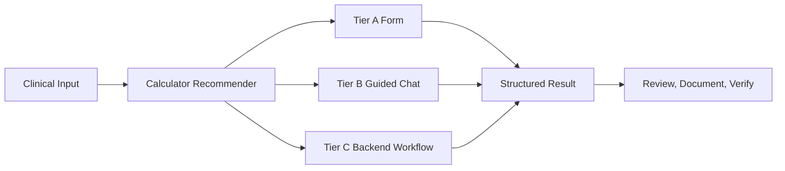

# Clinical Expansion Roadmap v2

CareDroid should evolve as a workflow-aware clinical operating system, not just a larger calculator directory. The next wave should prioritize tools that appear at the point of care, collect missing inputs, show decision-support safety copy, and route only truly executable workflows to backend executors.

## Source Of Truth

- Existing Tier A dedicated forms live through `src/data/clinicalToolIdContract.js`, `src/data/toolRegistry.js`, `src/data/clinicalIntentToolCatalog.js`, `src/data/calculatorHubManifest.js`, `src/routes/clinicalToolRoutes.js`, and `src/pages/tools/Calculators.jsx`.
- Existing Tier B chat-assisted workflows live through `src/data/chatAssistedHubGroups.js`, `src/data/chatAssistedCalculators/*`, `clinicalIntentToolCatalog.js`, and backend `tool.patterns.ts`.
- Existing Tier C backend executors are limited to `sofa-calculator`, `drug-interactions`, and `lab-interpreter` in `backend/src/modules/medical-control-plane/tool-orchestrator/tool-orchestrator.registry.ts`.
- Do not add `POST /api/tools/:id/execute` claims unless a backend `registerTool()` implementation and request contract exist.

## Tier Definitions

| Tier | Meaning | Best For | Backend Route |
|---|---|---|---|
| A | Dedicated deterministic UI form | Frequent, structured calculators with stable scoring logic | Usually no new backend route |
| B | Guided chat-assisted workflow | Multi-step clinical reasoning, applicability gates, exam workflows | Chat route only, no fake executor |
| C | Backend-backed executor or AI workflow | Needs audit, persistence, RAG, EHR context, or server validation | Requires real route/contract |

## Architecture Decision

The clinical operating system direction should add three layers:

1. More high-frequency Tier A forms where deterministic scoring is simple and useful.
2. More Tier B guided workflows where context, applicability, and safety gates matter more than a raw calculator page.
3. Selective Tier C services only where backend power is real: RAG, audit, persistence, PHI context, tool execution, or integration.

## Current Coverage Notes

| Requested Area | Current CareDroid Status |
|---|---|
| Centor / McIsaac | Already implemented as `centor-mcisaac` Tier A. Requested `centor-score` should alias or consolidate, not duplicate. |
| GCS | Existing chat-assisted `gcs-calculator`; pediatric-specific variant is not implemented. |
| PE tools | `wells-pe` and `perc` already exist as Tier B chat-assisted. YEARS would extend this PE group. |
| ICU scoring | SOFA exists as the only deterministic backend executor; APACHE-II exists as chat-assisted. SAPS II/RASS/CAM-ICU/OI are new. |
| First Tier A expansion | `shock-index`, `anion-gap`, and `rass` are now implemented as local deterministic forms with catalog, NLU, route, and smoke-test coverage. |
| Medication layer | Existing `dose-calculator` is educational only; drug interactions is backend-backed. No MME, steroid conversion, CrCl, or vancomycin assistant yet. |
| AI clinical workflow | Chat, RAG, differential/protocol pages exist partially; calculator recommender/timeline/documentation workflows need explicit contracts. |

## Emergency Pack

| ID | Name | Tier | Complexity | Registry Requirements | Routes | NLU Requirements | Backend Requirements | Safety Risks | Testing Requirements |
|---|---|---:|---|---|---|---|---|---|---|
| `centor-score` | Centor / McIsaac Score | A | Low | Prefer alias to existing `centor-mcisaac`; do not create duplicate sidebar card unless product wants both names | Existing `/tools/calculators/centor-mcisaac`; optional redirect/alias | Add alias phrases to existing `centor-mcisaac` only | None | Avoid antibiotic directives; phrase as probability/risk support only | Alias sync, route launch, existing calculator smoke |
| `years-pe` | YEARS Algorithm | B, A later | Medium | Add `REGISTRY.yearsPe`, `NLU.yearsPe`; PE group in chat-assisted hub | `/tools/calculators` chat-assisted first; later `/tools/calculators/years-pe` if Tier A | Keywords for PE, YEARS criteria, D-dimer threshold | None initially; optional deterministic form later | PE cannot be ruled out by chat alone; unstable patients need urgent care | NLU pattern test, PE hub card test, safety copy test |
| `pediatric-gcs` | Pediatric GCS | B, A optional | Medium | Add registry/NLU IDs; map near existing `gcs-calculator` | Chat-assisted first; optional dedicated route if demand high | Pediatric coma scale, infant/child verbal/motor phrases | None initially | Age applicability, declining mental status emergency gate | Chat seed guardrails, mobile hub, calculator-route test if Tier A |
| `pittsburgh-knee` | Pittsburgh Knee Rule | B | Low-medium | Add registry/NLU ID; trauma group | Chat-assisted hub route | Knee trauma, fall/blunt trauma, inability to walk | None | Imaging decision support only; does not prove no fracture | Trauma hard-stop copy test, NLU alias test |
| `hints-stroke` | HINTS Stroke Assessment | B | High | Add registry/NLU ID in neurology/vertigo group | Chat-assisted hub route | HINTS, nystagmus, test of skew, head impulse, vertigo | None until governed workflow exists | High risk: examiner expertise, posterior stroke miss risk, not for non-AVS dizziness | Strong safety gate tests, copy review, no directive language |

## Critical Care Pack

| ID | Name | Tier | Complexity | Registry Requirements | Routes | NLU Requirements | Backend Requirements | Safety Risks | Testing Requirements |
|---|---|---:|---|---|---|---|---|---|---|
| `saps2` | SAPS II | A | High | Add Tier A registry/NLU/builtin slug | `/tools/calculators/saps2` | ICU severity, SAPS, mortality score | None if client deterministic; backend executor only if audit persistence needed | Mortality prediction context, not triage or care limitation | Unit tests for score, form smoke, safety disclaimer |
| `rass` | Richmond Agitation-Sedation Scale | A | Low | Add Tier A registry/NLU/builtin slug | `/tools/calculators/rass` | sedation, agitation, RASS | None | Do not recommend sedative dosing or restraints | Simple scoring tests, accessibility/touch target tests |
| `cam-icu` | CAM-ICU | B, A later | Medium-high | Add registry/NLU ID; ICU delirium group | Chat-assisted first | delirium, CAM-ICU, inattention, RASS prerequisite | None | Requires arousal/sedation context; not diagnosis alone | Guided missing input test, RASS prerequisite copy |
| `shock-index` | Shock Index | A | Low | Add Tier A registry/NLU/builtin slug | `/tools/calculators/shock-index` | HR, SBP, shock index | None | Do not replace resuscitation/escalation pathways | Formula unit tests, route smoke |
| `oxygenation-index` | Oxygenation Index | A | Medium | Add Tier A registry/NLU/builtin slug | `/tools/calculators/oxygenation-index` | FiO2, mean airway pressure, PaO2 | None | Ventilation context, pediatric/neonatal applicability clarity | Formula/unit tests, range validation |

## Medication And Pharmacy Pack

| ID | Name | Tier | Complexity | Registry Requirements | Routes | NLU Requirements | Backend Requirements | Safety Risks | Testing Requirements |
|---|---|---:|---|---|---|---|---|---|---|
| `opioid-equivalence` | Opioid Equivalence Calculator | A | High | Add Tier A registry/NLU/builtin slug and medication safety category | `/tools/calculators/opioid-equivalence` | MME, opioid conversion, equianalgesic | None initially; backend audit optional | High medication safety risk; incomplete cross-tolerance; no auto-prescribing | Conversion table tests, safety warnings, confirmation-style review |
| `steroid-conversion` | Steroid Conversion Calculator | A | Medium | Add Tier A registry/NLU/builtin slug | `/tools/calculators/steroid-conversion` | steroid equivalent, prednisone, hydrocortisone | None | No taper/prescribing recommendations | Conversion tests, unit labels |
| `vanco-assistant` | Vancomycin Dosing Assistant | C | Very high | Add only after backend contract; do not expose as functional calculator first | New backend API or orchestrator executor required | vancomycin, trough, AUC, renal function | Requires PK model, audit, maybe institution-specific policy | Very high dosing risk; should not prescribe; local protocol required | Backend contract tests, clinical governance review, failure/needs-setup states |
| `crcl` | Creatinine Clearance | A | Medium | Add Tier A registry/NLU/builtin slug; distinguish from existing eGFR | `/tools/calculators/crcl` | Cockcroft-Gault, CrCl, creatinine clearance | None | Weight/unit ambiguity, drug dosing implications | Formula tests for sex/age/weight units, warning copy |
| `anion-gap` | Anion Gap Calculator | A | Low | Add Tier A registry/NLU/builtin slug | `/tools/calculators/anion-gap` | sodium, chloride, bicarbonate, albumin correction | None | Acid-base support only, not diagnosis | Formula tests including albumin correction |

## AI And Workflow Pack

| ID | Name | Tier | Complexity | Registry Requirements | Routes | NLU Requirements | Backend Requirements | Safety Risks | Testing Requirements |
|---|---|---:|---|---|---|---|---|---|---|
| `calculator-recommender-ai` | Auto Calculator Recommender | C | High | Not a calculator registry row; platform capability surfaced in Chat and tool hub | Use existing `/api/chat/intent-classify` first; optional dedicated route later | Map symptoms to candidate tool IDs with confidence and rationale | Could reuse intent classifier plus frontend ranking | Over-suggesting inappropriate tools; must show uncertainty | Recommendation precision tests, unsupported hidden tests |
| `timeline-ai` | Patient Timeline AI | C | Very high | Platform workflow, not calculator | New timeline route required before UI | Timeline extraction intents | Requires storage model, PHI/audit, source provenance | PHI, hallucinated chronology, medico-legal risk | Backend route, audit, provenance, redaction tests |
| `guideline-rag` | Guideline Retrieval RAG | C | High | Platform workflow in Chat/Protocol surfaces | Existing RAG internal path via Chat; admin ingestion route absent | Guideline lookup, citation, protocol retrieval | RAG ingestion/admin contract needed for durable management | Stale guidelines, citation trust, local policy mismatch | Citation tests, source date tests, no-treatment-directive guardrails |
| `differential-ai` | Differential Assistant | B, C later | High | Existing `differential-diagnosis` can be elevated | Existing clinical page/chat first | Symptom clusters, red flags, differential | Backend only if persisted/audited case reasoning required | Diagnostic overreach; must require clinician review | Safety copy, red-flag escalation, no definitive diagnosis tests |
| `documentation-ai` | Clinical Documentation AI | B, C later | High | New platform workflow, not calculator | Chat draft first; backend route only with storage/EHR contract | note drafting, handoff, summary | Requires audit/storage if saving; no EHR write-back until integration exists | PHI, hallucinated facts, EHR write-back risk | Source-grounding, edit-before-save, PHI audit tests |

## Recommended Build Order

1. Completed: `shock-index`, `anion-gap`, `rass` as local Tier A forms with no fake POST executor claims.
2. Next: `crcl`, `steroid-conversion`, `oxygenation-index`: medium complexity, strong clinical utility.
3. `years-pe`, `pittsburgh-knee`, `pediatric-gcs`: Tier B workflow tools with safety/applicability gates.
4. `saps2`, `cam-icu`, `opioid-equivalence`: larger safety and validation footprint.
5. `calculator-recommender-ai`: makes CareDroid workflow-aware by surfacing already supported tools automatically.
6. `guideline-rag`, `differential-ai`, `documentation-ai`, `timeline-ai`: only after provenance, audit, and storage contracts are explicit.
7. `vanco-assistant`: defer until clinical governance, local protocol configuration, and backend PK/audit model are ready.

## Registry Checklist By Tier

### Tier A Form

- Add `REGISTRY.*`, `NLU.*`, and `BUILTIN_CALC.*` IDs in `clinicalToolIdContract.js`.
- Add the ID to the right Tier A group and maps.
- Add a `toolRegistry.js` row.
- Add `clinicalIntentToolCatalog.js` metadata and guarded `chatSeed`.
- Add calculator utility in `src/utils/*Calculator.js`.
- Add UI branch in `Calculators.jsx` and CSS hook in `calculatorHubManifest.js`.
- Add route definition in `clinicalToolRoutes.js` if dedicated route is needed.
- Add tests: utility unit, form smoke, launch, registry/alias sync, safety copy.

### Tier B Chat-Assisted

- Add registry/NLU IDs and a chat-assisted hub group entry.
- Add `src/data/chatAssistedCalculators/<id>.js` config with STEP 0 safety gates.
- Add `clinicalIntentToolCatalog.js` row with `backendExecutable: false`.
- Add backend `tool.patterns.ts` recognition.
- Add to unsupported orchestrator docs/tests so it is not exposed as a POST executor.
- Add tests: NLU launch, hub visibility, safety guardrails, mobile card visibility.

### Tier C Backend Or AI Workflow

- Define route/API contract first.
- Define auth, permission, audit, storage, and failure semantics.
- Add backend controller/service/entity/migration only after contract review.
- Add frontend suggestion/card only when route exists or is clearly marked unavailable.
- Add tests: backend unit/e2e, frontend API client, capability gate, structured result, failure state.

## Safety Policy

- Every score must say "clinical decision support only" and must not issue treatment, prescribing, imaging, disposition, or order directives.
- Medication tools must not auto-prescribe or imply patient-specific dosing authority unless a governed backend protocol and clinician confirmation exist.
- Emergency tools must include hard-stop language for unstable patients or time-sensitive pathways.
- AI tools must show uncertainty, sources, and "review before use" states.
- Unsupported workflows should be hidden or labeled unavailable, never presented as functional.

## References

- Medical calculator prevalence and barriers: https://www.sciencedirect.com/science/article/abs/pii/S0169260717309926
- MDCalc platform organization model: https://www.mdcalc.com/about-us
- Emergency medicine calculator usage discussion: https://www.reddit.com/r/emergencymedicine/comments/vnsdnb/clinical_calculators_what_matters_and_when_to_use/
- ClinCalc critical care/pharmacy tool ecosystem: https://clincalc.com/
- MedCentral calculator catalog and acid-base workflows: https://www.medcentral.com/calculators

## Non-Goals For This Roadmap

- No autonomous prescribing.
- No autonomous imaging or disposition orders.
- No fake EHR write-back.
- No backend executor for simple static calculators unless audit/persistence/integration justifies it.
- No duplicate `centor-score` and `centor-mcisaac` surfaces; use aliasing or migration if a name change is desired.
