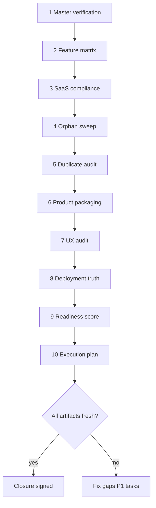

# Closure Audit Sequence

**Purpose:** Single **proof-of-coverage** pipeline for CareDroid platform transformation. Run this sequence instead of ad-hoc feature prompts. Each step must produce or refresh an artifact; closure is **not** complete until every row in the [Closure checklist](#closure-checklist) is satisfied.

**Last closure run:** Regenerate with `npm run closure-audit:write-docs` and record commit SHA below.

| Field | Value |
|-------|--------|
| **Git SHA** | `829bda4` (update after each run) |
| **Branch** | `main` |
| **Regenerable audits** | `npm run closure-audit:write-docs` |

---

## When to run

- After any merge to `main` that touches routes, inventories, platform-assets, org/product-catalog, or nav/shell.
- Before declaring a phase complete in [final-saas-migration-execution-plan.md](./final-saas-migration-execution-plan.md).
- After Vercel/production deploy (re-run Prompt 8 probes).

**Do not** add new product surfaces until the prior phase’s closure rows are green or explicitly waived with owner + expiry.

---

## Sequence overview (10 prompts)



| # | Prompt name | Artifact | How to produce | Auto? |
|---|-------------|----------|----------------|-------|
| 1 | Master Implementation Verification | [master-implementation-verification.md](./master-implementation-verification.md) | Code review + update 26-row table; link child audits | Manual |
| 2 | Feature Coverage Matrix | [feature-coverage-matrix.md](./feature-coverage-matrix.md) | `npm run feature-coverage-matrix:write-docs` | Yes |
| 3 | SaaS Compliance Audit | [saas-compliance-audit.md](./saas-compliance-audit.md) | `npm run saas-compliance-audit:write-docs` | Yes |
| 4 | Orphan Detection Sweep | [orphan-detection-report.md](./orphan-detection-report.md) | `npm run orphan-detection:write-docs` | Yes |
| 5 | Duplicate System Audit | [duplicate-system-audit.md](./duplicate-system-audit.md) | `npm run duplicate-system-audit:write-docs` | Yes |
| 6 | Product Packaging Audit | [product-packaging-audit.md](./product-packaging-audit.md) | `npm run product-packaging-audit:write-docs` | Yes |
| 7 | UX Simplification Audit | [ux-simplification-audit.md](./ux-simplification-audit.md) | Static shell review; update F-xx fixes if UX changed | Manual |
| 8 | Deployment Truth Audit | [deployment-truth-audit.md](./deployment-truth-audit.md) | `git fetch` + `/version` + `/api/config/system` probe | Manual |
| 9 | Platform Readiness Score | [platform-readiness-score.md](./platform-readiness-score.md) | Synthesize from prompts 1–8; update scores if Δ≥5 | Manual |
| 10 | Final SaaS Migration Plan | [final-saas-migration-execution-plan.md](./final-saas-migration-execution-plan.md) | Reconcile task IDs with audit deltas | Manual |

**Supporting (run with closure):**

| Script | Artifact |
|--------|----------|
| `npm run exposure:write-docs` | [backend-exposure-report.md](./backend-exposure-report.md) |
| `npm run contract:write-docs` | [backend-frontend-tool-contract.md](./backend-frontend-tool-contract.md) |
| Charter (Prompt 3 input) | [CARE_DROID_SAAS_ARCHITECTURE_CHARTER.md](./CARE_DROID_SAAS_ARCHITECTURE_CHARTER.md) |

**One command for regenerable steps (2–6 + exposure + contract):**

```bash
npm run closure-audit:write-docs
```

---

## Pass / fail gates per prompt

### Prompt 1 — Master Implementation Verification

**Prove:** Each of 26 initiatives has status ∈ {Implemented, Partially Implemented, Planned, Missing, Orphaned, Duplicate, Blocked} with file evidence.

| Gate | Pass criterion |
|------|----------------|
| Artifact exists | `docs/master-implementation-verification.md` updated date ≥ last platform merge |
| No “Planned” for shipped modules | org / platform-assets / product-catalog not marked Planned |
| Blockers listed | B1–B3 (billing, `?agent=`, API inventory) still accurate or closed |

### Prompt 2 — Feature Coverage Matrix

| Gate | Pass criterion |
|------|----------------|
| Generated header | File contains `Generated:` current date |
| Tests | ≤10 features flagged “missing dedicated tests” or each has waiver |
| Packs | Trend: missing pack assignments decreasing phase-over-phase |

### Prompt 3 — SaaS Compliance Audit

| Gate | Pass criterion |
|------|----------------|
| Charter present | `docs/CARE_DROID_SAAS_ARCHITECTURE_CHARTER.md` exists |
| Seeded assets | 0 pack violations on seeded rows |
| Trend | Strict compliance % documented; target per phase in execution plan |

### Prompt 4 — Orphan Detection

| Gate | Pass criterion |
|------|----------------|
| wire class | Every P0 wire item has owner in execution plan |
| quarantine | `Onboarding.jsx`, missing `SimulationLaboratoryViewer` disposition documented |
| No new orphan APIs | `platformAssetsApi` / `productCatalogApi` not in wire list |

### Prompt 5 — Duplicate System Audit

| Gate | Pass criterion |
|------|----------------|
| Canonical matrix | Each domain has single canonical source named |
| P0 merges | Pack marketplace, Dashboard naming, TOOL_LAUNCH_PATHS tracked in Phase 1–2 |

### Prompt 6 — Product Packaging Audit

| Gate | Pass criterion |
|------|----------------|
| Nine packs | 9/9 solution packs in seed |
| Seeded packaging | 68/68 (or current seed count) PASS all four dimensions |
| Inventory gap | 245→*N* trend documented |

### Prompt 7 — UX Simplification

| Gate | Pass criterion |
|------|----------------|
| 5-minute script | Document pass/fail per area (dashboard, assistant, tools, operations, profile, settings) |
| P0 fixes | F-01–F-10 either done or ticketed with ID |

### Prompt 8 — Deployment Truth

| Gate | Pass criterion |
|------|----------------|
| Commit parity | GitHub `main` SHA = Vercel bundle SHA = `/version` |
| API parity | `GET {origin}/api/config/system` → `application/json` |
| Local clean | `git status` clean on release branch |

### Prompt 9 — Platform Readiness Score

| Gate | Pass criterion |
|------|----------------|
| 14 category scores | All present 0–100 |
| Composite | Matches mean of categories ±1 |
| Top 20 gaps/strengths | Align with latest audits (no stale 335222a deploy refs) |

### Prompt 10 — Execution Plan

| Gate | Pass criterion |
|------|----------------|
| Phases 1–5 | Every P0 gap from readiness score maps to a task ID |
| Task schema | Each task has priority, impact, effort, deps, owner, complexity |

---

## Closure checklist

Mark **✓** when artifact is fresh and gates pass. **Waive** only with owner + reason + expiry date.

| # | Prompt | Artifact | Status | Waive / notes |
|---|--------|----------|--------|----------------|
| 1 | Master verification | master-implementation-verification.md | ✓ | 26 initiatives @ 2026-06-04 |
| 2 | Feature matrix | feature-coverage-matrix.md | ✓ | 313 rows @ `closure-audit:write-docs` |
| 3 | SaaS compliance | saas-compliance-audit.md | ✓ | Charter: `CARE_DROID_SAAS_ARCHITECTURE_CHARTER.md` |
| 4 | Orphan sweep | orphan-detection-report.md | ✓ | Regenerated |
| 5 | Duplicate audit | duplicate-system-audit.md | ✓ | Regenerated |
| 6 | Product packaging | product-packaging-audit.md | ✓ | 68/68 seeded compliant |
| 7 | UX simplification | ux-simplification-audit.md | ✓ | F-01–F-24 defined |
| 8 | Deployment truth | deployment-truth-audit.md | ✓ | Re-probe after Vercel deploy @ 829bda4 |
| 9 | Readiness score | platform-readiness-score.md | ✓ | Composite 68 |
| 10 | Execution plan | final-saas-migration-execution-plan.md | ✓ | 78 tasks |

**Closure signed when:** all ✓, no open P0 without task in Phase 1, `npm run validate:ci` green on `main`.

---

## Initiative → audit map (26 master items)

Use this to avoid re-auditing the same work under different prompts.

| Initiative | Primary proof (Prompt) | Secondary |
|------------|------------------------|-----------|
| SaaS migration | 1, 3, 10 | 8 |
| Asset registry / packs | 1, 3, 6 | 2 |
| Organization model | 1, 3 | 2 |
| Workspace model | 1, 5 | 3 |
| User profile segmentation | 1, 2 | 7 |
| AI assistant contextualization | 1, 2, 5 | 7 |
| Dashboard command center | 1, 7 | 5 |
| Tool inventory normalization | 1, 2, 5 | 4 |
| Calculator normalization | 1, 2, 5 | 4 |
| Hospital map / IoT / Fleet / Twin | 1, 2, 4 | 8 |
| Simulation / Lab / 3D | 1, 2, 4 | 6 |
| Governance / Security / Audit | 1, 3 | 9 |
| Analytics | 1, 2 | 6 |
| Nav / layout / theme / routes | 1, 5, 7 | 4 |
| Backend/frontend contract | 1, 2, 5 | exposure + contract docs |

---

## Cursor execution contract (copy once per closure sprint)

```text
Run closure audit sequence — do not add features.

1. npm run closure-audit:write-docs
2. Update docs/master-implementation-verification.md if code changed
3. Re-probe deployment-truth (GitHub SHA, Vercel /version, /api JSON)
4. Update platform-readiness-score if metrics shifted ≥5 points
5. Tick docs/closure-audit-sequence.md checklist
6. Report: composite score, open P0 count, Vercel commit SHA
```

---

## Anti-patterns (stop doing)

- New capability prompts without updating feature matrix + SaaS audit.
- Declaring “done” from roadmap docs without master verification row.
- Shipping routes not in `routes.config.js` + `App.jsx` + inventory.
- Duplicate pack marketplace or dashboard entry points (see duplicate audit).

---

## Related

- [productization-migration-verification.md](./productization-migration-verification.md) — Prompts 31–40 checklist
- [asset-based-platform-migration-report.md](./asset-based-platform-migration-report.md) — target architecture narrative
