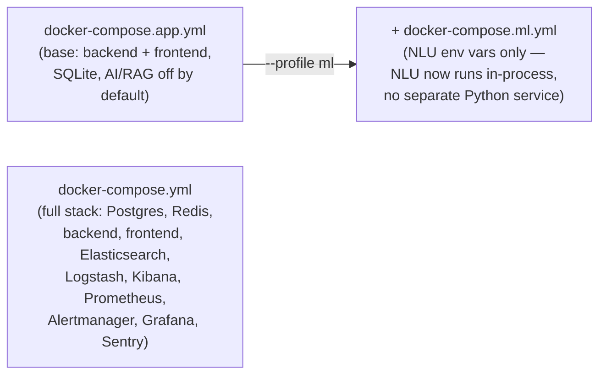

# Deployment Guide

> For the fastest path to a running local instance, see the [root README quick start](../README.md#quick-start). This guide covers the three Docker Compose profiles, both Dockerfiles, Vercel deployment, and CI/CD.

## Docker Compose profiles

CareDroid ships three compose files that are **layered**, not alternatives to pick blindly — know which combination you need.



| File | Use when | Services | Key defaults |
|---|---|---|---|
| `docker-compose.app.yml` | You want "just the app" — local dev, demos, a lightweight pilot | `backend`, `frontend` | `DATABASE_CLIENT=sqlite`, `SQLITE_PATH=/data/caredroid.dev.sqlite`, `ENABLE_MONGOOSE_EMERGENCY_OS=false`, AI/RAG/anomaly-detection disabled |
| `docker-compose.ml.yml` | Layered on top of the app profile when you need in-process NLU | (overlay on `backend`) | `NLU_SERVICE_MODE=in-process`, `NLU_SERVICE_ENABLED=true`, `NLU_SERVICE_URL` |
| `docker-compose.yml` | Full observability stack — staging/production-like environment | `postgres`, `redis`, `backend`, `frontend`, `elasticsearch`, `logstash`, `kibana`, `prometheus`, `alertmanager`, `grafana`, `sentry` | Postgres-backed, AI/Pinecone/SMTP/Firebase wired |

Corresponding npm scripts:

```bash
npm run compose:app:build   # docker-compose.app.yml
npm run compose:app:ml      # docker-compose.app.yml + docker-compose.ml.yml (--profile ml)
```

For the full stack, run `docker compose up` against the root `docker-compose.yml` directly (it is the comprehensive/observability profile, not wrapped in a dedicated npm script).

**Important:** `ENABLE_MONGOOSE_EMERGENCY_OS=false` in the app profile means the canonical `UnifiedPatient` Mongoose model, the reassessment cron scheduler, and Mongo-backed EMS alert writes are **not live** in the default app-only deployment. See [Platform Architecture Overview §Data layer](architecture/platform-architecture-overview.md#6-data-layer).

## Dockerfiles

- **Root `Dockerfile`** — generic Node 20-alpine image: `npm ci`, copies the whole repo, exposes port 8000, runs `npm run dev:lan` (this is the **frontend** dev/preview server image, despite living at repo root).
- **`backend/Dockerfile`** — builds the NestJS backend image. All three compose files reference it via `context: ./backend`.

## Vercel (frontend-only deployment)

`vercel.json` deploys the **frontend only** (Vite framework preset). Notable behavior:

- Custom `buildCommand` sets `VITE_ALLOW_SAME_ORIGIN_API` / `VITE_DEMO_MODE` / `VITE_ENABLE_DEV_AUTH_BYPASS`, then runs `npm run validate:vercel-env && npm run build`.
- SPA rewrites: all non-API/non-asset paths fall through to `index.html`.
- Per-asset-type cache-control headers.
- The backend must be deployed and reachable separately — Vercel here is not hosting the NestJS API.

## CI/CD (`.github/workflows/`)

| Workflow | Trigger | Purpose |
|---|---|---|
| `ci-cd.yml` | push to main/develop, PRs | CI/CD pipeline |
| `validate.yml` | push to main/develop, PRs | Validation gate (mirrors `npm run validate:ci`) |
| `release.yml` | push to main + tags | Release |
| `dependency-updates.yml` | weekly cron (Mon 09:00 UTC) | Dependency updates |

(`ci.yml`, `test.yml`, `quality.yml`, and `navigator-test.yml` no longer exist in `.github/workflows/` — the 4 files above are the complete, current list; verified directly, not assumed from a prior version of this doc. `navigator-test.yml` covered the formerly-standalone `navigator/` app, retired 2026-08-06 when it was consolidated into the main backend/frontend — its tests now run as part of the normal backend `validate:ci` suite, same as every other module.)

There is currently no changelog artifact produced by `release.yml` that this research pass could find — see [Documentation Center §Roadmap/Release Notes](DOCUMENTATION_CENTER.md#roadmap--release-notes--changelog).

## Monitoring & observability stack

Defined under `config/` and wired into the full `docker-compose.yml`:

- **Prometheus** (`config/prometheus.yml`, `config/prometheus/alert.rules.yml`) — scrapes `GET /metrics` (excluded from the global `/api` prefix in `backend/src/main.ts`'s `setGlobalPrefix`, not `/api/metrics` as previously stated here). Also wired into the lighter `docker-compose.app.yml` as of Cycle 267 (Prometheus + Grafana only, no alertmanager/elasticsearch/sentry, matching that file's "lightweight app" scope).
- **Alertmanager** (`config/alertmanager/config.yml`, notification templates) — full stack only (`docker-compose.yml`), not part of `docker-compose.app.yml`.
- **Grafana** (`config/grafana/provisioning/`) — 11 pre-built CareDroid dashboards: alert-status, api-performance, audit-compliance, business-metrics, cache-health, database-performance, error-analysis, master-clinical-intelligence, nlu-intelligence, system-health, user-activity, plus a cost-intelligence dashboard (12 total; previously undercounted here as "9").
- **Elasticsearch / Logstash / Kibana** — log aggregation (`config/logstash.conf`, `config/kibana/saved-searches.json`).
- **Sentry** — error tracking (`SENTRY_DSN`), initialized first-line in `backend/src/main.ts`.
- **Datadog** — optional APM/tracing (`dd-trace`, `DATADOG_*` env vars).

## Production readiness checklist

From the [root README §Security & governance](../README.md#security--governance), before any production pilot:

1. Rotate `JWT_SECRET` and `ENCRYPTION_KEY` from their dev defaults.
2. Switch `DATABASE_CLIENT` to `postgres` (SQLite is a dev convenience, not a production target).
3. Configure `CORS_ORIGIN` correctly for the deployed frontend origin.
4. Review SaaS entitlements (`CAREDROID_STRICT_SAAS_ENTITLEMENTS`) and tenant isolation (`CAREDROID_TENANT_ISOLATION_DISABLED` must be unset/false).
5. Decide deliberately on `ENABLE_MONGOOSE_EMERGENCY_OS` — enabling it activates the real patient data model and the reassessment scheduler.
6. Complete any customer BAA/governance requirements — CareDroid does not itself claim HIPAA/PHIPA certification.

Related reading: [`operations/emergency-pilot-readiness.md`](operations/emergency-pilot-readiness.md), [`operations/saas-compliance-audit.md`](operations/saas-compliance-audit.md), [Configuration Reference](configuration-reference.md).
