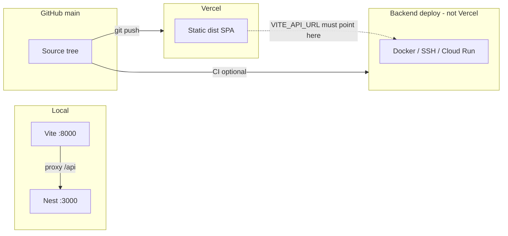

# Deployment Truth Audit

**Date:** 2026-06-04  
**Audited surfaces:** Local workstation, GitHub `origin/main`, Vercel production frontend  
**Production URL probed:** `https://care-droid-clinical-ai.vercel.app`  
**Repository:** `https://github.com/MISHHF93/CareDroid-Clinical-AI.git`

---

## Executive summary

| Dimension | Local (this machine) | GitHub `main` | Vercel production |
|-----------|----------------------|---------------|-------------------|
| **Commit parity** | **FAIL** — `HEAD` is **1 commit behind** `origin/main`; **63 uncommitted** paths | `5fb9670635ad202edab0109809181307ba34b39e` | **PASS vs GitHub** — bundle embeds same SHA |
| **Route parity** | **FAIL** — uncommitted routes (+11 canonical paths, ~+185 lines in `App.jsx`) | Baseline for Vercel | Matches GitHub until next push |
| **Asset parity** | **FAIL** — stale `dist/` built at old SHA; SW name matches GitHub when source aligned | `public/*` + hashed `dist/assets/*` | Hashed bundles (e.g. `index-RuwOg53M.js`); SW `caredroid-v6-offline-shell` |
| **Environment parity** | **FAIL** — Vite dev proxy, no `.env`, different auth defaults | N/A (source only) | Static SPA; **`/api` returns `index.html`** (no same-origin API) |

**GitHub and Vercel are aligned on commit `5fb9670`.** Local **source** and especially **uncommitted work** are **not** what Vercel serves. A local `dist/` build can mislead verification if not rebuilt after `git pull`.

---

## 1. Commit parity

### Measured values (2026-06-04)

| Source | SHA (full) | Short | Message / note |
|--------|------------|-------|----------------|
| **Local `HEAD`** | `490abe30787aec9d2ae52e64897f042759674f40` | `490abe3` | `feat: expand clinical platform workspaces` (2026-05-31) |
| **`origin/main` (GitHub)** | `5fb9670635ad202edab0109809181307ba34b39e` | `5fb9670` | Merge PR #24 — docs inventory consolidation (2026-06-02) |
| **Vercel production bundle** | `5fb9670635ad202edab0109809181307ba34b39e` | `5fb9670` | Extracted from `/assets/index-*.js` on live site |
| **Local `dist/` (stale)** | `490abe30787aec9d2ae52e64897f042759674f40` | `490abe3` | Last local `npm run build` — **not** current GitHub |

### Working tree (local only)

- **63** modified/untracked paths (platform-assets, organizations, product-catalog, commercial pages, audit docs, etc.).
- **Not on GitHub or Vercel** until committed and pushed to `main`.

### Verification commands

```bash
git fetch origin
git rev-parse HEAD origin/main
git status -sb
git log --oneline HEAD..origin/main

# Live Vercel commit (no CLI required):
# Open https://care-droid-clinical-ai.vercel.app/version
# Or inspect main JS bundle for embedded commit string.
```

### Parity verdict

| Pair | Result |
|------|--------|
| GitHub `main` ↔ Vercel | **Aligned** (`5fb9670`) |
| Local `HEAD` ↔ GitHub | **Behind by 1 commit** |
| Local working tree ↔ GitHub | **Diverged** (large uncommitted delta) |
| Local `dist/` ↔ Vercel | **Stale** (built at `490abe3`) |

### Tooling gaps

- **GitHub CLI:** not authenticated on this machine (`gh auth login` required).
- **Vercel CLI:** not authenticated; no `.vercel/project.json` (repo not linked locally).
- **Live probe used instead:** HTTP fetch of production JS bundle and `/sw.js`.

---

## 2. Route parity

### How routes are deployed

| Environment | Mechanism | Backend routes |
|-------------|-----------|----------------|
| **Local dev** | Vite + React Router (`src/App.jsx`); `/api` proxied to Nest (`vite.config.js` → `:3000`) | Nest serves `/api/*` |
| **Vercel** | SPA: `vercel.json` rewrite `/(.*)` → `/index.html`; client router only | **Not deployed** on Vercel project (frontend-only `dist/`) |
| **GitHub** | Source tree only | `backend/` present; deployed elsewhere (Docker/SSH/Cloud Run per workflows) |

### Route counts (approximate)

| Artifact | `path:` registrations in `App.jsx` |
|----------|--------------------------------------|
| **GitHub `origin/main`** | ~194 lines matching `path:` (includes nested/duplicate declarations) |
| **Local working copy** | ~100 top-level route entries in current file + **+185 lines** vs `origin/main` in diff |
| **Vercel** | Same as last successful build from GitHub `main` (`5fb9670`) |

### Local-only routes (uncommitted vs `origin/main`)

Added to `src/config/routes.config.js` (not on Vercel until pushed):

- `/products`, `/plans`, `/specialties`, `/care-pathways`, `/agents`
- `/maturity-assessment`, `/outcomes`, `/integrations-marketplace`, `/configuration-studio`
- `/welcome`, `/onboarding`

`src/App.jsx` adds matching lazy routes and nav wiring (~194 insertions vs `origin/main`).

### SPA / legacy behavior (all three when on same commit)

- **Canonical shell:** `/dashboard`, `/assistant`, `/tools`, `/operations`, `/profile`, `/settings`, `/discover`, `/automation`, `/version`, etc.
- **Legacy aliases:** redirects in `App.jsx` (e.g. `/home` → `/dashboard`, `/chat` → `/assistant`) — tests in `src/routing/canonicalRouteRedirects.test.js`.
- **Production smoke routes** (`e2e/production-smoke.spec.mjs`): `/tools`, calculator slugs, `/dashboard?tool=wells-pe` — valid on Vercel **if** that commit includes them (true for `5fb9670`).

### Live route checks (Vercel)

| URL | HTTP | Note |
|-----|------|------|
| `/version` | 200 | SPA shell loads; commit from JS bundle |
| `/api/config/system` | 200 **`text/html`** | **Misconfiguration:** returns SPA, not JSON API |

### Parity verdict

| Pair | Result |
|------|--------|
| GitHub `main` ↔ Vercel (pushed code) | **Aligned** at `5fb9670` |
| Local uncommitted ↔ Vercel | **FAIL** — extra product/commercial/org routes only local |
| Local dev ↔ Vercel API paths | **FAIL** — local `/api` hits Nest; Vercel `/api` hits `index.html` |

---

## 3. Asset parity

### Build pipeline (intended)

```
npm run validate:assets  →  vite build  →  dist/
                              ↑
                         public/ copied (favicon, sw.js, manifest, svg)
```

| Setting | `vite.config.js` | `vercel.json` |
|---------|------------------|---------------|
| Output dir | `dist` | `dist` |
| Install | `npm ci` (local/CI) | `npm ci --audit=false --fund=false` |
| Pre-build | `validate:assets` (via `npm run build`) | Same via `buildCommand` |

### Static / PWA assets

| Asset | Local `public/` | Vercel (live) |
|-------|-----------------|---------------|
| `sw.js` | `CACHE_NAME = 'caredroid-v6-offline-shell'` | Same (fetched 2026-06-04) |
| Icons / manifest | `favicon.svg`, `logo.svg`, `icon.svg`, `badge.svg`, `site.webmanifest` | Served from deployment root |
| Hashed JS/CSS | `dist/assets/*` (173 files in stale local dist) | `index-RuwOg53M.js`, etc. (hash **changes every build**) |

### Parity rules

- **Do not compare** hashed filenames between machines — compare **git commit** embedded in bundle (`__CARE_BUILD_INFO__` via `vite.config.js`).
- **Do compare** `public/sw.js` `CACHE_NAME` when debugging stale UI after deploy.
- **Local `dist/`** on this machine = **`490abe3`** → treat as **wrong** for “what is production” until `git pull && npm run build` at `5fb9670`.

### Service worker vs local dev

- On **localhost**, `sw.js` skips install cache and unregisters (see `IS_LOCAL_DEV` in `public/sw.js`).
- On **Vercel**, SW caches app shell; navigation uses network-first with `cache: 'no-store'` for documents.
- **Symptom:** local never exercises SW; production can show **stale shell** until cache bump or user clears site data.

### Parity verdict

| Pair | Result |
|------|--------|
| GitHub `main` `public/` ↔ Vercel static | **Aligned** at `5fb9670` (SW v6) |
| Local stale `dist/` ↔ Vercel | **FAIL** (old commit, different chunk hashes) |
| Local uncommitted source ↔ Vercel assets | **FAIL** until push + redeploy |

---

## 4. Environment parity

### Matrix

| Variable / behavior | Local dev (default) | `npm run build` (no `.env`) | Vercel `vercel.json` build defaults | Vercel dashboard (inferred) |
|---------------------|---------------------|-----------------------------|--------------------------------------|-----------------------------|
| `VITE_API_URL` | Empty → Vite proxy `/api` → `:3000` | Empty → browser same-origin `/api` at preview host | Not set in `vercel.json` | **Must be set** for successful production API (validator) |
| `VITE_ALLOW_SAME_ORIGIN_API` | `false` (.env.example) | `false` | Default **`false`** in buildCommand | Live site: `/api` → HTML → likely **false** + no edge proxy |
| `VITE_DEMO_MODE` | `true` in .env.example | `false` unless set | Default **`true`** in buildCommand | Required for hosted “Direct Sign In” |
| `VITE_ENABLE_DEV_AUTH_BYPASS` | `true` in dev | `false` in PROD bundle default | Default **`false`** in buildCommand | Demo uses `VITE_DEMO_MODE` + backend dev-session |
| `VITE_HIDE_DIVISION_MODE` | `false` in example | PROD default hidden | Validated: must not be `false` on Vercel | Stricter than local |
| Nest backend | `npm run backend:dev` / Docker | Not in Vite build | **Not on Vercel** | Separate: Cloud Run / SSH Docker per `.github/workflows` |
| Git metadata in UI | `git rev-parse HEAD` | Same | `VERCEL_GIT_COMMIT_SHA` | Shows `5fb9670` on live site |
| `validate:vercel-env` | Passes without `VERCEL` | Passes | Runs in build; needs dashboard env | Build succeeded → `VITE_API_URL` + demo flags satisfied at build time |

Simulated check on this machine:

```powershell
$env:VERCEL='1'; $env:VERCEL_ENV='production'; npm run validate:vercel-env
# Fails without VITE_API_URL and VITE_DEMO_MODE in environment
```

### Deployment topology (three different “production” concepts)



- **Vercel** = frontend static hosting only (`vercel.json`, no `backend/` build).
- **`.github/workflows/ci-cd.yml`** = Docker backend push + SSH `docker-compose` on `PRODUCTION_HOST` (secrets-dependent).
- **`.github/workflows/android-release.yml`** = `VITE_API_URL: https://api.caredroid.app` for mobile builds (API host **≠** Vercel domain).

---

## 5. Why local and Vercel differ (root causes)

### A. Source and git state (most common)

1. **Unpushed commits** — Local `HEAD` was `490abe3` while Vercel/GitHub were `5fb9670` at audit time.
2. **Large uncommitted feature branch in place** — Platform assets, org APIs, commercial pages exist only locally → routes, nav, and API clients differ.
3. **Stale `dist/`** — Local bundle still said `490abe3` while Vercel served `5fb9670`.

**Fix:** `git pull origin main`, reconcile or commit local work, `npm run build`, compare `/version` commit to `git rev-parse origin/main`.

### B. Architecture (by design)

| Topic | Local | Vercel |
|-------|-------|--------|
| API | Vite dev server proxies to Nest | No Nest; `/api` is rewrite to SPA unless separate API URL + `VITE_API_URL` |
| Auth demo | Dev bypass + local tokens easy | `VITE_DEMO_MODE=true`; backend `dev-session` when API URL correct |
| Service worker | Disabled on localhost | Active; can cache old shell |
| Full stack | `npm run start:all` | Frontend only |

**Fix:** Set `VITE_API_URL` to the real API origin (e.g. Cloud Run / docker host). Run `QA_BASE_URL=https://care-droid-clinical-ai.vercel.app QA_STRICT_API=true npm run test:e2e:production` after API is wired.

### C. Build-time env (Vercel dashboard overrides)

- `vercel.json` `buildCommand` sets hosted defaults:

```bash
export VITE_ALLOW_SAME_ORIGIN_API="${VITE_ALLOW_SAME_ORIGIN_API:-false}" \
  VITE_DEMO_MODE="${VITE_DEMO_MODE:-true}" \
  VITE_ENABLE_DEV_AUTH_BYPASS="${VITE_ENABLE_DEV_AUTH_BYPASS:-false}" \
  && npm run validate:vercel-env && npm run build
```

- **Dashboard env vars override** repo file for the same keys — undocumented here (no Vercel token).
- **`docs/vercel-deployment-mismatch-report.md` is stale:** references commit `335222a` and old defaults (`VITE_ALLOW_SAME_ORIGIN_API:-true`). Trust **`vercel.json` on `main`** and this audit instead.

### D. Caching and CDN

- `vercel.json`: long cache on `/assets/*` (immutable hashes); short cache on `/`, `/index.html`, `/sw.js`.
- Users can see **old UI** with **new** `sw.js` or vice versa until hard refresh / clear site data.
- **Fix:** bump `CACHE_NAME` in `public/sw.js` when shell logic changes; redeploy without build cache; verify `/version` commit.

### E. Backend not redeployed with frontend

- Pushing frontend to Vercel does **not** update Nest on Docker/SSH/Cloud Run.
- New UI may call old API or miss new modules until backend deploy runs.

**Fix:** Pair frontend promote with `ci-cd.yml` / `deploy-backend` workflow and smoke `GET {VITE_API_URL}/api/config/system` returns `application/json`.

---

## 6. Canonical verification playbook

### Step 1 — Commit triangle

```bash
git fetch origin
echo "LOCAL  $(git rev-parse HEAD)"
echo "GITHUB $(git rev-parse origin/main)"
curl -s "https://care-droid-clinical-ai.vercel.app/assets/$(curl -s https://care-droid-clinical-ai.vercel.app/ | grep -o 'assets/index-[^"]*\.js' | head -1)" | grep -oE '[a-f0-9]{40}' | head -1
```

Or open: `https://care-droid-clinical-ai.vercel.app/version`

### Step 2 — API not SPA

```bash
curl -sI "https://care-droid-clinical-ai.vercel.app/api/config/system" | grep -i content-type
# Expect: application/json from real API
# Actual (2026-06-04): text/html → miswired for same-origin API
```

### Step 3 — Route smoke (hosted)

```bash
QA_BASE_URL=https://care-droid-clinical-ai.vercel.app npm run test:e2e:production
```

### Step 4 — Local parity build

```bash
git checkout main && git pull
cp .env.example .env   # edit VITE_API_URL to match hosted API
npm run validate:vercel-env   # with VERCEL=1 VERCEL_ENV=production and env vars set
npm run build
# Confirm dist/assets/index-*.js contains origin/main SHA
```

---

## 7. Exact fixes (prioritized)

| P | Action | Owner |
|---|--------|-------|
| P0 | **Pull `origin/main`** on dev machines (`5fb9670`); rebuild `dist/` before comparing to Vercel | All devs |
| P0 | **Commit or stash** 63-file platform delta; do not assume local routes exist in production | Feature team |
| P0 | Set **`VITE_API_URL`** on Vercel to live Nest origin; confirm `/api/config/system` returns JSON, not HTML | DevOps |
| P1 | Document production URL in repo README: `https://care-droid-clinical-ai.vercel.app` | Docs |
| P1 | Add `QA_STRICT_API=true` production smoke to CI after API URL fixed | CI |
| P1 | Update **`docs/vercel-deployment-mismatch-report.md`** or supersede with this doc | Docs |
| P2 | Link repo locally: `vercel link` + store deployment ID in runbook | DevOps |
| P2 | Optional: Vercel **ignored build step** only if using monorepo subpath — confirm root is repo root | DevOps |

---

## 8. Evidence log

| Check | Result |
|-------|--------|
| `git ls-remote origin main` | `5fb9670635ad202edab0109809181307ba34b39e` |
| Local `HEAD` | `490abe30787aec9d2ae52e64897f042759674f40` |
| Vercel bundle commit | `5fb9670635ad202edab0109809181307ba34b39e` |
| Local `dist` commit | `490abe30787aec9d2ae52e64897f042759674f40` |
| `care-droid-clinical-ai.vercel.app/version` | HTTP 200 |
| `care-droid-clinical-ai.vercel.app/api/config/system` | HTTP 200, `Content-Type: text/html` |
| Vercel `sw.js` cache | `caredroid-v6-offline-shell` |
| `.env` present locally | **No** |
| `.vercel/project.json` | **No** |
| `gh` / `vercel` CLI auth | **No** |

---

## Related documents

- `docs/vercel-deployment-mismatch-report.md` — older investigation; **commit and env defaults outdated**
- `scripts/validate-vercel-env.mjs` — Vercel build gate
- `src/pages/Version.jsx` — human-readable deploy identity
- `e2e/production-smoke.spec.mjs` — hosted route smoke
- `.env.example` — local vs Vercel env contract
