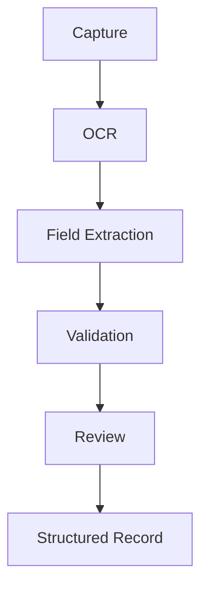

# Document Intelligence Pipeline

## Goal

Process patient-provided documents and convert them into structured, reviewable data that can support intake, registration, referrals, and continuity workflows.

The pipeline should reduce manual transcription while preserving review, validation, and traceability before document-derived values are used downstream.

## Supported Inputs

The Document Intelligence Pipeline should support:

- Driver's license
- Health card
- Insurance card
- Referral letters
- Discharge papers

## Pipeline

## Service Contract

Create `DocumentIntelligenceService` as the canonical service for document processing.

`DocumentIntelligenceService` should:

- Accept uploaded, scanned, photographed, or integration-supplied document inputs.
- Classify the document type when possible.
- Run OCR to produce searchable text.
- Extract candidate fields from the OCR output.
- Validate extracted fields against expected formats and document type rules.
- Preserve source document references for extracted values.
- Return a structured record with extraction confidence, validation status, and review state.

## Field Extraction

The service should extract document-specific fields when available:

- Identity fields from driver's license and health card documents.
- Coverage and payer metadata from insurance cards.
- Referring provider, reason for referral, and relevant administrative details from referral letters.
- Discharge date, facility, follow-up instructions, and administrative summary details from discharge papers.

Extracted fields are proposed values until reviewed. The pipeline should not treat OCR output as confirmed truth.

## Validation And Review

Validation should identify whether extracted fields are complete, well-formed, internally consistent, and appropriate for the detected document type.

Review should allow staff or an authorized user to:

- See the original document alongside extracted fields.
- Correct OCR or extraction errors.
- Confirm usable fields.
- Reject unreliable fields.
- Preserve unresolved fields for follow-up.

## Structured Record

The structured record should preserve:

- Document type.
- Source document reference.
- OCR text or searchable text reference.
- Extracted fields.
- Field-level confidence.
- Field-level validation status.
- Field-level review status.
- Reviewer attribution.
- Review timestamp.

Only reviewed and accepted fields should be promoted for downstream workflows. Unreviewed, rejected, or low-confidence fields should remain visible as document intelligence context without becoming confirmed operational data.

## Safety And Privacy Boundary

The Document Intelligence Pipeline is an administrative and workflow support layer. It does not diagnose, determine eligibility, authorize coverage, make clinical decisions, or replace clinician review of referral letters or discharge papers.

Because patient-provided documents can contain sensitive identity, insurance, and clinical context, the service should preserve auditability, role-appropriate access, source traceability, and clear review attribution.

## Acceptance

The Document Intelligence Pipeline is ready when:

- Patient-provided documents can move through Capture, OCR, Field Extraction, Validation, Review, and Structured Record.
- Driver's license, health card, insurance card, referral letters, and discharge papers are supported input types.
- `DocumentIntelligenceService` is defined as the canonical processing service.
- Extracted document values include validation and review state.
- Documents become structured data.
