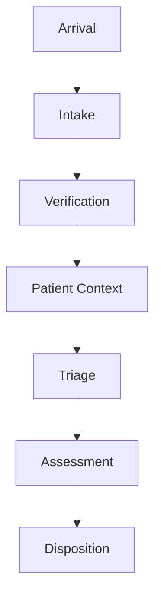

# Emergency Flow Intelligence Integration

## Goal

Connect intake to the Emergency OS so early patient arrival, registration, verification, context assembly, triage, assessment, and disposition operate as one measurable flow.

Intake should not sit beside the Emergency Department OS as a disconnected registration workflow. It should feed the same patient journey, command center, analytics, and automation model used across emergency operations.

## Integrated Flow

## Patient Journey Engine Rule

All intake automations feed the Patient Journey Engine.

This includes:

- Smart Intake
- Document intelligence and OCR intake
- Identity resolution
- Consent and verification
- Patient Snapshot generation
- Medication capture
- Allergy and risk capture
- Voice-assisted intake
- Pre-triage queue building
- Intake analytics

Each automation should attach to one or more canonical journey states so the Emergency OS can measure progress, identify bottlenecks, and expose operational recommendations.

## Integration Requirements

The integration should ensure:

- Arrival events create or update journey context.
- Intake progress is visible as part of the patient journey.
- Verification status controls whether extracted intake fields become confirmed context.
- Patient Context is generated after verified intake data becomes available.
- Triage receives organized pre-triage information without autonomous triage decisions.
- Assessment can reference intake-derived context with source and review status.
- Disposition can retain relevant intake and document context for downstream workflows.

## Emergency OS Surfaces

Integrated intake data should feed:

- Emergency command center views.
- Patient Journey Engine metrics.
- Door-to-triage analytics.
- Intake operations dashboard.
- Patient context workspace.
- Pre-triage queue.
- Automation marketplace usage signals.

## Governance Boundary

Intake integration does not remove review requirements. Extracted demographics, document-derived fields, medication entries, allergy information, identity matches, and patient summaries remain governed by confirmation, source attribution, audit logging, and correction workflows.

The Emergency OS may organize and surface intake intelligence, but clinical decisions, triage, assessment, and disposition remain human-reviewed workflows.

## Acceptance

Emergency Flow Intelligence Integration is ready when:

- Arrival, Intake, Verification, Patient Context, Triage, Assessment, and Disposition are modeled as one connected Emergency OS flow.
- All intake automations feed the Patient Journey Engine.
- Intake-derived context is visible in command center, patient context, queue, and analytics surfaces.
- Governance and review requirements remain attached to intake-derived data.
- Intake is fully integrated into the Emergency Department OS.
