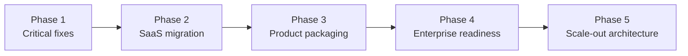

# Final SaaS Migration Execution Plan

**Status:** Definitive roadmap (audit-driven)  
**Date:** 2026-06-04  
**Goal:** Complete CareDroid’s transformation into a **configurable, multi-tenant healthcare SaaS platform** — configuration over code forks, entitlements over open catalogs, and deploy truth over demo-only wiring.

**Baseline:** Platform readiness **68/100** ([platform-readiness-score.md](./platform-readiness-score.md)). Strict SaaS charter compliance **~12%** (39/316 surfaces). Seeded catalog **68/68** fully packaged; **245** registry tools not yet in `platform_assets`.

---

## How to read this plan

| Field | Meaning |
|-------|---------|
| **Priority** | P0 = ship blocker · P1 = phase gate · P2 = should-have · P3 = nice-to-have |
| **Impact** | **H** = unlocks tenant/revenue/deploy · **M** = major UX/compliance · **L** = polish |
| **Effort** | **S** (≤3d) · **M** (1–2w) · **L** (3–6w) · **XL** (6w+) |
| **Complexity** | **Low** · **Medium** · **High** · **Very High** |
| **Owner** | Accountable team (RACI: owns delivery) |
| **Dependencies** | Task IDs or external gates that must complete first |

**Task IDs:** `P1-xx` … `P5-xx` (phase + sequence).

---

## Phase overview



| Phase | Objective | Exit criteria (summary) | Target duration |
|-------|-----------|---------------------------|-----------------|
| **1** | Restore deploy truth and clinician clarity | Hosted API JSON; `main` = Vercel; UX 5-min test pass; CI green | 2–4 weeks |
| **2** | Single asset model + tenant APIs live | Platform modules on `main`; ≥60% charter compliance; entitlements enforced in UI | 6–10 weeks |
| **3** | Sellable packs, products, onboarding | Commercial surfaces asset-backed; ≥80% user-facing tools in `platform_assets` | 8–12 weeks |
| **4** | Production governance, PHI, executors | Release gate enforced; top executors live; pilot hospital ready | 12–16 weeks |
| **5** | Multi-tenant scale and ops excellence | Postgres tenancy, observability SLOs, horizontal API, connector scale | 16–24+ weeks |

*Durations assume parallel workstreams; calendar slips if Phase 1 P0 items remain open.*

---

## Audit traceability

| Audit | Drives phases |
|-------|----------------|
| [deployment-truth-audit.md](./deployment-truth-audit.md) | P1 deploy/API |
| [ux-simplification-audit.md](./ux-simplification-audit.md) | P1 UX (F-01–F-10) |
| [saas-compliance-audit.md](./saas-compliance-audit.md) | P2 charter, backfill |
| [product-packaging-audit.md](./product-packaging-audit.md) | P2–P3 packs/products |
| [duplicate-system-audit.md](./duplicate-system-audit.md) | P1–P2 canonical sources |
| [orphan-detection-report.md](./orphan-detection-report.md) | P2 wire/quarantine |
| [feature-coverage-matrix.md](./feature-coverage-matrix.md) | P2–P4 tests/executors |
| [platform-readiness-score.md](./platform-readiness-score.md) | All phases (score ≥80) |

Regenerate audits after each phase gate:

```bash
npm run feature-coverage-matrix:write-docs
npm run saas-compliance-audit:write-docs
npm run product-packaging-audit:write-docs
npm run duplicate-system-audit:write-docs
npm run orphan-detection:write-docs
npm run exposure:write-docs
```

---

# Phase 1 — Critical fixes

**Objective:** Make **what users see in production** match **GitHub `main`**, with a **working API contract** and **comprehensible** dashboard / assistant / tools / operations shell.

**Phase gate:** Composite readiness ≥**72**; Deployment category ≥**70**; UX 5-minute acceptance ([ux-simplification-audit.md](./ux-simplification-audit.md)) **5/5**.

| ID | Task | Priority | Impact | Effort | Complexity | Owner | Dependencies |
|----|------|----------|--------|--------|------------|-------|----------------|
| P1-01 | **Wire production API:** set `VITE_API_URL` on Vercel (and GitHub Actions secrets) to Nest origin; confirm `GET /api/config/system` returns `application/json` on production host | P0 | H | S | Low | DevOps | — |
| P1-02 | **Add post-deploy smoke to CI:** `QA_BASE_URL` + `QA_STRICT_API=true` production Playwright (`e2e/production-smoke.spec.mjs`) on promote | P0 | H | S | Medium | QA | P1-01 |
| P1-03 | **Reconcile git/deploy:** commit or stash ~63 local paths; `git pull origin main`; push; verify Vercel `/version` commit = `origin/main` | P0 | H | M | Medium | Platform Eng | — |
| P1-04 | **Document production URLs** in README + `deployment-truth-audit.md` (SPA + API origins, not generic placeholders) | P1 | M | S | Low | DevOps | P1-01 |
| P1-05 | **F-01:** Align Dashboard nav label, H1, and `document.title` (Command Center vs Dashboard) | P0 | M | S | Low | Frontend | — |
| P1-06 | **F-04, F-09, F-10:** Reduce Quick Actions to ≤6; remove duplicate Assistant tile and notification footer link | P0 | M | S | Low | Frontend | P1-05 |
| P1-07 | **F-03:** Hide Operations sidebar sub-nav; hub-only entry to maps/fleet/IoT | P0 | M | S | Low | Frontend | — |
| P1-08 | **F-05:** Default Tools to `?filter=recommended` on first visit | P0 | M | S | Low | Frontend | — |
| P1-09 | **F-06, F-15 (partial):** Single preferences surface — theme/notifications only in Settings; Profile → Settings anchor | P1 | M | M | Medium | Frontend | — |
| P1-10 | **F-07:** Redirect `/asset-packs` → `/settings/organization/packs` | P1 | M | S | Low | Frontend | P2-05 (soft) |
| P1-11 | **F-08:** Rename “New Chat” → “New conversation”; no redundant navigate on `/assistant` | P1 | M | S | Low | Frontend | — |
| P1-12 | **F-17:** Honor `/assistant?agent=` in Assistant page; link empty state to `/agents` | P0 | M | S | Medium | Frontend | — |
| P1-13 | **F-02:** Rename `Dashboard.jsx` → `AssistantPage.jsx`; update `App.jsx` lazy imports and tests | P1 | M | M | Medium | Frontend | — |
| P1-14 | **Fix stale docs:** supersede `vercel-deployment-mismatch-report.md` defaults with current `vercel.json` | P2 | L | S | Low | Platform Eng | P1-01 |
| P1-15 | **Run `npm run validate:ci` on `main`** after P1-03 merge; block release on failure | P0 | H | S | Low | QA | P1-03 |

---

# Phase 2 — SaaS migration completion

**Objective:** Land **organizations**, **platform-assets**, **entitlements**, and **platform context API** on `main`; enforce **org → workspace → role → pack → asset**; begin **inventory → platform_assets** backfill.

**Phase gate:** SaaS readiness score ≥**65**; strict charter compliance ≥**60%**; `GET /api/platform/context` drives Tools filters when org present; zero **unguarded** dual-registry launches for entitled-hidden assets in catalog.

| ID | Task | Priority | Impact | Effort | Complexity | Owner | Dependencies |
|----|------|----------|--------|--------|------------|-------|----------------|
| P2-01 | **Merge platform modules to `main`:** `organizations`, `platform-assets`, `product-catalog` (entities, seeds, controllers, `app.module.ts`) | P0 | H | L | High | Backend | P1-03 |
| P2-02 | **Merge frontend SaaS surfaces:** `UserIdentityContext`, `assetAccess.js`, `platformAssetsApi.js`, org/commercial pages, feature flags | P0 | H | L | High | Frontend | P2-01 |
| P2-03 | **Publish `CARE_DROID_SAAS_ARCHITECTURE_CHARTER.md`** in repo root (rules 1–7 from saas-compliance audit) | P0 | H | S | Low | Product | — |
| P2-04 | **Tenant-scoped queries:** audit Nest services for `organizationId` on PHI, audit, workspace, entitlements | P0 | H | L | Very High | Backend | P2-01 |
| P2-05 | **Canonical pack marketplace:** one route `/settings/organization/packs`; remove duplicate UI | P1 | M | S | Low | Frontend | P1-10, P2-02 |
| P2-06 | **Enforce entitlements in catalog:** `filterVisibleTools` / `getAssetAwareToolProjection` default-on when `VITE_PLATFORM_ENTITLEMENTS=true` | P0 | H | M | High | Frontend | P2-02 |
| P2-07 | **Workspace model merge:** document + implement precedence — API `enabledToolIds` + `LEGACY_TOOL_ID_ALIASES` over localStorage; deprecate duplicate `CARE_WORKSPACES` gating for tools | P1 | H | L | High | Platform Eng | P2-01, P2-02 |
| P2-08 | **Backfill generator:** script `toolInventory` → `platform_assets` rows (governance, lifecycle, packIds template) — batch 1: calculators + core tools (top 50 by traffic proxy) | P0 | H | XL | Very High | Backend | P2-01 |
| P2-09 | **Backfill batch 2:** specialty tools + operations/maps (next 80 assets) | P1 | H | XL | Very High | Backend | P2-08 |
| P2-10 | **Sync AI agents:** ensure all 8 agents in packs (`core-platform`, `ai-workflow-pack`); fix empty `packIds` violations | P0 | H | S | Medium | Backend | P2-01 |
| P2-11 | **Wire `platformAssetsApi` / `productCatalogApi` in `frontendApiCallsInventory.js`** + contract tests | P1 | M | S | Low | Frontend | P2-02 |
| P2-12 | **Orphan wire class (P2 scope):** mount or redirect top 20 wire routes from orphan report (integrations marketplace stub → real page or feature flag off) | P1 | M | L | High | Frontend | P2-02 |
| P2-13 | **Quarantine:** remove `Onboarding.jsx` legacy; restore or replace `SimulationLaboratoryViewer` references | P1 | M | M | Medium | Frontend | — |
| P2-14 | **Duplicate consolidation:** stop duplicating paths in `TOOL_LAUNCH_PATHS`; import from `routes.config.js` | P1 | M | M | Medium | Platform Eng | P1-03 |
| P2-15 | **Configuration studio MVP:** org `settings.navigation.hiddenNavIds` applied (already in Sidebar) + branding smoke test | P1 | M | M | Medium | Frontend | P2-02 |
| P2-16 | **7-step org onboarding API + UI** on `/onboarding`; `/welcome` = personal setup only | P1 | H | L | High | Full-stack | P2-01, P2-02 |
| P2-17 | **SaaS compliance CI gate:** fail PR if strict compliance drops below floor (e.g. 50% → 60% ramp) | P1 | H | M | Medium | QA | P2-08 |
| P2-18 | **Digital twin + analytics:** ensure API-backed paths used when entitlements allow; fallback labeled demo | P2 | M | M | Medium | Backend | P2-01 |

---

# Phase 3 — Product packaging

**Objective:** Every **sellable** surface is an **asset in a pack** mapped to a **product**; commercial discovery (products, plans, specialties, pathways, agents) is entitlement-aware.

**Phase gate:** Product packaging audit **0 violations** on seeded assets (maintain); **≥80%** user-facing registry tools have `platform_assets` row; 9/9 products linked; readiness **≥76**.

| ID | Task | Priority | Impact | Effort | Complexity | Owner | Dependencies |
|----|------|----------|--------|--------|------------|-------|----------------|
| P3-01 | **Asset-back commercial surfaces:** seed `platform_assets` for `/products`, `/plans`, `/integrations-marketplace`, `/configuration-studio`, `/organization`, `/onboarding` | P0 | H | M | High | Backend | P2-08 |
| P3-02 | **Product catalog ↔ pack matrix:** verify 10 products → pack IDs in `product-catalog-seed`; UI shows install state from entitlements | P0 | H | M | Medium | Full-stack | P2-01, P2-02 |
| P3-03 | **Specialty + care-pathway pages:** seed-driven asset resolution; launch via `registryToolLaunch` | P1 | H | L | High | Frontend | P2-09, P3-02 |
| P3-04 | **Agents registry `/agents`:** linked from Assistant; pack-gated cards; tests per agent | P1 | M | M | Medium | Frontend | P1-12, P2-10 |
| P3-05 | **Maturity assessment + outcomes:** asset rows + org-admin RBAC; leadership dashboard data contract | P1 | M | L | High | Full-stack | P2-01 |
| P3-06 | **Integration marketplace:** seed offerings + request flow; document in `docs/commercial-plans.md` | P1 | M | L | High | Full-stack | P3-01 |
| P3-07 | **Backfill batch 3:** remaining registry tools → assets with pack assignment rules (calculator hub → calculator pack members) | P0 | H | XL | Very High | Backend | P2-09 |
| P3-08 | **Role profile preferred assets:** expand `SEED_ROLE_PROFILES` to cover top 100 assets per role (audit: 295 missing mappings) | P1 | H | L | High | Backend | P3-07 |
| P3-09 | **Pricing tier enforcement:** `pricingTier` on packs gates Features in UI (core vs enterprise) | P2 | M | M | Medium | Product + Frontend | P3-02 |
| P3-10 | **F-11, F-12:** Merge Discover into Tools; unify Workflow builder routes | P1 | M | M | Medium | Frontend | P1-08 |
| P3-11 | **F-14, F-16:** Settings org block collapse; workspace labeling (org vs clinical) | P1 | M | S | Low | Frontend | P2-07 |
| P3-12 | **Solution pack docs:** keep `solution-packs.md` generated from seed; marketing names = pack names | P2 | L | S | Low | Product | P3-02 |
| P3-13 | **Stripe / plans UI:** align Settings billing with `product-catalog` plan IDs (optional revenue) | P3 | M | L | High | Full-stack | P3-02 |
| P3-14 | **Pack install UX:** admin enables pack → toast + entitlement refresh → Tools “Organization” filter updates | P1 | H | M | Medium | Frontend | P2-06 |

---

# Phase 4 — Enterprise readiness

**Objective:** **Production-safe** clinical AI, PHI, integrations, governance release gates, and **real executors** for high-risk tools — not demo-only operations.

**Phase gate:** Readiness **≥82**; Security & Governance ≥**80**; release gate checklist mandatory for P0 capabilities; production smoke + safety compliance in CI.

| ID | Task | Priority | Impact | Effort | Complexity | Owner | Dependencies |
|----|------|----------|--------|--------|------------|-------|----------------|
| P4-01 | **Expand POST executors:** top 10 tools (Wells PE, CHA₂DS₂-VASc, HAS-BLED, qSOFA, HEART, etc.) in `tool-orchestrator.registry.ts` + contract tests | P0 | H | L | Very High | Backend | P2-08 |
| P4-02 | **AI Gateway blocked actions:** enforce governance policy before tool/chat execution (orchestrator + chat service) | P0 | H | L | Very High | Backend | P2-04 |
| P4-03 | **Release gate automation:** CI blocks activation of unclassified / high-severity-open capabilities | P0 | H | L | High | Clinical Safety | P2-03 |
| P4-04 | **PHI minimization in chat:** tenant-scoped prompts; no PHI in logs; audit `PHI_ACCESS` on clinical routes | P0 | H | L | Very High | Backend + Security | P2-04 |
| P4-05 | **FHIR/HL7 pilot connector:** one read-only Patient + Observation sandbox; quarantine on failure | P1 | H | XL | Very High | Backend | P4-02 |
| P4-06 | **Human review queue:** wire high-risk AI outputs to `/human-review` with SLA metadata | P1 | H | L | High | Full-stack | P4-02 |
| P4-07 | **LLM security:** production-rate `POST /api/security/evaluate` on chat ingress | P1 | H | M | High | Backend | P4-02 |
| P4-08 | **Operational data path (IoT):** replace demo static layers with API contract + feature-flagged real telemetry adapter | P1 | M | XL | Very High | Backend | P2-01 |
| P4-09 | **Fleet telemetry:** production adapter behind `fleetTelemetryService` with mock fallback labeled | P1 | M | L | High | Backend | P4-08 |
| P4-10 | **Laboratory:** API-backed results queue (or FHIR DiagnosticReport) with demo fallback | P1 | M | L | High | Backend | P4-05 |
| P4-11 | **Simulation:** restore unified laboratory/3D viewer or quarantine routes; competency outcomes API persistence | P2 | M | L | High | Frontend | P2-13 |
| P4-12 | **Dedicated tests for 10 gap features** (agents, marketplace, workflows, integrations) | P1 | M | M | Medium | QA | P3-04, P3-06 |
| P4-13 | **F-18, F-19:** Operations hub tabs + map naming clarity | P2 | M | M | Medium | Frontend | P1-07 |
| P4-14 | **Equity + regulatory dashboards:** bind to live summaries; block unclassified production routes | P2 | M | M | Medium | Full-stack | P4-03 |
| P4-15 | **Consolidate notification services** (`NotificationService.js` duplicate) | P2 | L | S | Low | Backend | P2-14 |
| P4-16 | **PostgreSQL production path:** migrate from SQLite dev default; docker-compose + migration runbook | P1 | H | L | High | DevOps | P2-04 |
| P4-17 | **Backend deploy pairs frontend promote:** document and automate SHA alignment (Vercel + Cloud Run/SSH) | P0 | H | M | Medium | DevOps | P1-01, P1-03 |

---

# Phase 5 — Scale-out architecture

**Objective:** Multi-tenant **scale**, **observability**, and **platform economics** — horizontal API, caching, connector scale, and continuous compliance at **>100k assets/users** design headroom.

**Phase gate:** Readiness **≥88**; p95 API SLO documented; tenant isolation test suite; charter compliance **≥95%** on active surfaces.

| ID | Task | Priority | Impact | Effort | Complexity | Owner | Dependencies |
|----|------|----------|--------|--------|------------|-------|----------------|
| P5-01 | **Single registry read path:** runtime reads `platform_assets` + inventory overlay; deprecate duplicate `buildAssetRegistry()` demo | P1 | H | L | High | Platform Eng | P3-07 |
| P5-02 | **Entitlement cache layer:** Redis cache for org pack resolution + asset allow-list per request | P1 | H | L | High | Backend | P4-16 |
| P5-03 | **Horizontal Nest:** stateless API instances; sticky sessions only for WS; shared Redis + Postgres | P1 | H | XL | Very High | DevOps | P4-16 |
| P5-04 | **Observability stack:** trace IDs on chat/tool/FHIR; SLO dashboards on `/system-health`; alert on blocked-action spikes | P1 | H | L | High | DevOps | P4-02 |
| P5-05 | **Event bus for audit + entitlements:** async audit writes; pack install events | P2 | M | L | High | Backend | P5-02 |
| P5-06 | **CDN + asset pipeline:** validate-assets in CI; immutable chunks; SW cache policy versioned in deploy runbook | P2 | M | M | Medium | DevOps | P1-02 |
| P5-07 | **Multi-region frontend:** Vercel + geo; API failover DNS; `VITE_API_URL` per region | P2 | M | L | High | DevOps | P5-03 |
| P5-08 | **Connector marketplace scale:** queue-based integration requests; worker provisioning | P2 | M | XL | Very High | Backend | P3-06, P4-05 |
| P5-09 | **AI cost optimization:** route MoE / model tier by asset `pricingTier` and governance class | P2 | M | L | High | Backend | P4-02 |
| P5-10 | **Continuous compliance bot:** nightly regenerate SaaS + orphan audits; open PR on regression | P1 | H | M | Medium | QA | P2-17 |
| P5-11 | **Tenant data residency flags:** org `settings.dataRegion` enforced in storage + logs | P2 | H | L | Very High | Security | P2-04 |
| P5-12 | **Scale tests:** k6 on `/api/platform/context`, tool execute, chat; entitlements hot path | P2 | M | L | High | QA | P5-02 |
| P5-13 | **Archive legacy routes:** remove 135 legacy aliases with 302 map + 90-day telemetry | P3 | L | L | Medium | Platform Eng | P3-07 |
| P5-14 | **Developer catalog quarantine:** internal-only deploy channel for `developerCatalog` routes | P3 | L | M | Medium | DevOps | P5-06 |

---

## Cross-phase dependency graph (critical path)

```text
P1-01 (API URL) → P1-02 (prod smoke) → P1-03 (merge main)
       ↓
P2-01 (backend modules) → P2-02 (frontend SaaS) → P2-06 (entitlements UI)
       ↓
P2-08 (backfill b1) → P2-09 (b2) → P3-07 (b3) → P5-01 (single registry)
       ↓
P3-02 (products/packs) → P3-14 (pack install UX)
       ↓
P4-01 (executors) + P4-02 (AI gateway) + P4-04 (PHI)
       ↓
P4-16 (Postgres) → P5-02 (Redis entitlements) → P5-03 (horizontal API)
```

---

## Owner roster (default)

| Owner | Responsibility |
|-------|----------------|
| **Platform Eng** | Canonical config, inventories, audits, cross-cutting refactors |
| **Frontend** | App shell, Tools, dashboard, commercial UX, entitlements projection |
| **Backend** | Nest modules, seeds, executors, tenancy, integrations |
| **DevOps** | Vercel, API origins, CI smoke, Docker/Cloud Run, Postgres/Redis |
| **QA** | `validate:ci`, contract matrices, production Playwright, compliance gates |
| **Product** | Charter, packs, pricing narrative, onboarding flows |
| **Clinical Safety** | Release gate, governance policy, classification |
| **Security** | PHI, LLM security, residency, audit |

---

## Success metrics (program level)

| Metric | Phase 1 | Phase 2 | Phase 3 | Phase 4 | Phase 5 |
|--------|---------|---------|---------|---------|---------|
| Platform readiness (composite) | ≥72 | ≥76 | ≥80 | ≥82 | ≥88 |
| Strict SaaS compliance | ~12% | ≥60% | ≥80% | ≥90% | ≥95% |
| Tools in `platform_assets` | 68 | 150+ | 230+ | 250+ | 291 |
| Production API JSON smoke | Pass | Pass | Pass | Pass | Pass |
| POST executors | 3 | 3 | 5 | 13+ | 20+ |
| UX 5-min test | 5/5 | 5/5 | 5/5 | 5/5 | 5/5 |

---

## Immediate next 14 days (sprint 0)

Execute in order:

1. **P1-01** — Fix Vercel `VITE_API_URL`  
2. **P1-03** — Merge platform delta to `main`  
3. **P1-02** — Production smoke in CI  
4. **P1-05 – P1-08, P1-12** — UX P0 bundle  
5. **P2-01, P2-02** — If not fully in merge, complete module integration  
6. **P2-03** — Publish SaaS charter  
7. Regenerate audits; update [platform-readiness-score.md](./platform-readiness-score.md)

---

## Document control

| Version | Date | Change |
|---------|------|--------|
| 1.0 | 2026-06-04 | Initial definitive plan from full audit synthesis |

**Supersedes for execution tracking:** ad-hoc items in [caredroid-platform-transformation-roadmap.md](./caredroid-platform-transformation-roadmap.md) remain valid as **design reference**; **task IDs in this document are the execution source of truth.**
