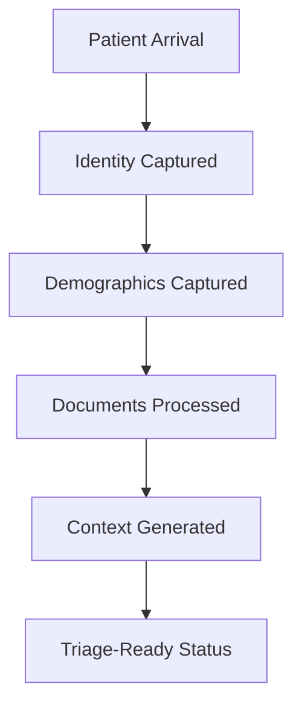

# First Five Minute Experience

## Goal

Optimize what happens in the first 5 minutes after patient arrival.

The First Five Minute Experience should make the earliest emergency intake work measurable, visible, and improvable so CareDroid can demonstrate reduced administrative delay.

## Measure

The experience should measure:

- Identity captured
- Demographics captured
- Documents processed
- Context generated
- Triage-ready status

## Five Minute Flow

## Measurement Model

Each measured step should record:

- Completion status.
- Completion timestamp.
- Source or intake mode when available.
- Missing or unresolved fields.
- Verification or review status.
- Responsible workflow or user role when available.

The five-minute window should show which patients reach each milestone and where administrative work stalls.

## Operational Signals

CareDroid should surface:

- Percentage of arrivals with identity captured within 5 minutes.
- Percentage of arrivals with demographics captured within 5 minutes.
- Number of documents processed within 5 minutes.
- Percentage of arrivals with patient context generated within 5 minutes.
- Percentage of arrivals reaching triage-ready status within 5 minutes.
- Common blockers preventing first-five-minute completion.

## Experience Boundary

The First Five Minute Experience is an operational measurement layer. It does not diagnose, assign acuity, determine clinical priority, or replace triage assessment.

The experience should make administrative delay visible while preserving review, verification, and patient safety requirements.

## Acceptance

The First Five Minute Experience is ready when:

- Identity capture, demographic capture, document processing, context generation, and triage-ready status are measurable in the first 5 minutes after arrival.
- Staff can see which early intake milestones are complete or delayed.
- Bottlenecks in the first 5 minutes are visible.
- CareDroid demonstrates measurable reduction in administrative delay.
