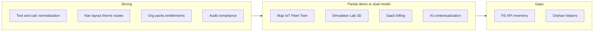

# Master Implementation Verification

**Purpose:** Verify **actual** implementation status across platform initiatives (not roadmap intent).  
**Audit date:** 2026-06-04  
**Git baseline:** `829bda4` (`main`) — multi-tenant platform assets + product catalog merge  
**Method:** Codebase inspection — backend modules, frontend routes/services, contract inventories, and cross-references. No runtime smoke test was executed for this document.

**Closure sequence:** This document is **Prompt 1 of 10**. Run the full pipeline via [closure-audit-sequence.md](./closure-audit-sequence.md) (`npm run closure-audit:write-docs` for regenerable audits).

| Child audit (Prompt) | Document |
|----------------------|----------|
| 2 Feature coverage | [feature-coverage-matrix.md](./feature-coverage-matrix.md) |
| 3 SaaS compliance | [saas-compliance-audit.md](./saas-compliance-audit.md) · [CARE_DROID_SAAS_ARCHITECTURE_CHARTER.md](./CARE_DROID_SAAS_ARCHITECTURE_CHARTER.md) |
| 4 Orphans | [orphan-detection-report.md](./orphan-detection-report.md) |
| 5 Duplicates | [duplicate-system-audit.md](./duplicate-system-audit.md) |
| 6 Packaging | [product-packaging-audit.md](./product-packaging-audit.md) |
| 7 UX | [ux-simplification-audit.md](./ux-simplification-audit.md) |
| 8 Deploy | [deployment-truth-audit.md](./deployment-truth-audit.md) |
| 9 Readiness | [platform-readiness-score.md](./platform-readiness-score.md) |
| 10 Roadmap | [final-saas-migration-execution-plan.md](./final-saas-migration-execution-plan.md) |

---

## Classification legend

| Status | Meaning |
|--------|---------|
| **Implemented** | End-to-end wiring exists (UI + logic + API or canonical data pipeline); may still use demo/sample data where noted. |
| **Partially Implemented** | Substantial code shipped but gaps: demo backends, dual models, missing consumers, or incomplete tenancy/billing. |
| **Planned** | Documented or stubbed only; not operable as a product surface. |
| **Missing** | No meaningful implementation found. |
| **Orphaned** | Code exists but is not referenced by active flows. |
| **Duplicate** | Two parallel implementations for the same user-facing capability. |
| **Blocked** | Depends on a missing or partial prerequisite (called out per item). |

---

## Executive summary

| Status | Count (of 26) |
|--------|----------------|
| Implemented | 9 |
| Partially Implemented | 16 |
| Missing | 1 |
| Orphaned (within area) | 3 helpers/APIs |
| Duplicate (cross-cutting) | 6 patterns |

**Overall:** The platform has a **strong frontend normalization layer** (tools, calculators, routes, nav, layout, theme) and a **real asset/organization productization spine** on the backend. **Operational modules** (map, IoT, fleet, twin, simulation, lab UI) are largely **demo-backed** on the API side. **SaaS billing** remains **user-scoped Stripe**, not org-scoped entitlements. **Contract inventories lag** new `platformAssetsApi` / `productCatalogApi` usage.



---

## Initiative audit (26 items)

### 1. SaaS migration

| Field | Value |
|-------|--------|
| **Status** | **Partially Implemented** |
| **Blocked by** | Org-level Stripe / plan enforcement not linked to `CommercialPlan` or pack entitlements |

**Evidence**

- **Implemented:** `OrganizationsModule` — CRUD, membership (`owner` / `admin` / `member`), `UserProfile.organizationId`, default pack install on create ([`organizations.service.ts`](../backend/src/modules/organizations/organizations.service.ts)).
- **Implemented:** Pack entitlements — `organization_entitlements`, install/remove with org-admin guard ([`platform-assets.controller.ts`](../backend/src/modules/platform-assets/platform-assets.controller.ts)).
- **Implemented:** Productization onboarding — `POST /api/organizations/onboarding`, commercial plans in DB ([`product-catalog/`](../backend/src/modules/product-catalog/)).
- **Partial:** `SubscriptionsModule` — real Stripe checkout/webhooks; `Subscription` entity is **per-user** only (no `organizationId`) ([`subscription.entity.ts`](../backend/src/modules/subscriptions/entities/subscription.entity.ts)).
- **Missing:** Global tenant middleware; consistent row-level isolation on all PHI queries.
- **Duplicate:** User subscription tier vs org `commercialPlanId` in `Organization.settings` (two commercial models).

---

### 2. Asset registry

| Field | Value |
|-------|--------|
| **Status** | **Partially Implemented** |
| **Notes** | Dual source of truth by design (inventory-first migration) |

**Evidence**

- **Implemented (backend):** `platform_assets` entity, lifecycle, governance JSON, pack membership ([`platform-asset.entity.ts`](../backend/src/modules/platform-assets/entities/platform-asset.entity.ts)); seed on empty DB ([`platform-assets.seed.service.ts`](../backend/src/modules/platform-assets/platform-assets.seed.service.ts)); list/get/lifecycle APIs.
- **Implemented (frontend):** `assetInventory.js` projection; `assetAccess.js` access states; hydration via `PlatformAssetsApi.getContext()` ([`UserIdentityContext.jsx`](../src/contexts/UserIdentityContext.jsx)).
- **Partial:** DB seed covers **pack members**, not full ~227-tool registry ([`asset-based-platform-migration-report.md`](./asset-based-platform-migration-report.md) §16).
- **Orphaned:** `buildAssetRegistry()` in `platformOperatingSystem.js` — demo projection only; not entitlement authority.

---

### 3. Asset packs

| Field | Value |
|-------|--------|
| **Status** | **Implemented** |

**Evidence**

- 14 seeded packs in [`platform-asset-seed.data.ts`](../backend/src/modules/platform-assets/data/platform-asset-seed.data.ts); documented in [`solution-packs.md`](./solution-packs.md).
- `AssetPack` entity; `GET /api/platform/packs`; org install/remove entitlements.
- UI: [`PackMarketplace`](../src/pages/organization/OrganizationPages.jsx), product cross-links via `GET /api/products/pack-map`.
- **Duplicate:** Routes `/asset-packs` and `/settings/organization/packs` → same component.

---

### 4. Organization model

| Field | Value |
|-------|--------|
| **Status** | **Implemented** |

**Evidence**

- Entity: type, branding, settings JSON ([`organization.entity.ts`](../backend/src/modules/workspaces/entities/organization.entity.ts)).
- APIs: list, current, create, patch, onboarding ([`organizations.controller.ts`](../backend/src/modules/organizations/organizations.controller.ts)).
- UI: [`OrganizationPages.jsx`](../src/pages/organization/OrganizationPages.jsx) — dashboard, settings, packs, lifecycle, analytics.
- **Partial (discoverability):** No primary sidebar entry; linked from Settings.

---

### 5. Workspace model

| Field | Value |
|-------|--------|
| **Status** | **Partially Implemented** |
| **Duplicate** | Backend operational workspaces vs local `WorkspaceContext` |

**Evidence**

- **Implemented (backend):** `WorkspacesModule` — create, membership, `enabledToolIds` / `enabledModules`, effective permissions ([`workspaces.service.ts`](../backend/src/modules/workspaces/workspaces.service.ts)).
- **Implemented (bridge):** `UserIdentityContext` loads operational profile + `switchWorkspace`; maps backend types to legacy local IDs.
- **Partial:** `WorkspaceContext.jsx` still filters tools via **localStorage** when `singleWorkspaceModel` is off ([`featureFlags.config.js`](../src/config/featureFlags.config.js)); flag defaults **on**.
- **Partial:** Workspace `organizationId` optional — org tenancy not mandatory per workspace.

---

### 6. User profile segmentation

| Field | Value |
|-------|--------|
| **Status** | **Implemented** |

**Evidence**

- [`profileToolSegmentation.js`](../src/data/profileToolSegmentation.js) — roles, specialties, `buildUserToolProfile`, `buildProfileToolGraph`, recommendations.
- Wired into [`toolInventory.js`](../src/data/toolInventory.js), [`ToolsOverview.jsx`](../src/pages/tools/ToolsOverview.jsx), [`ProfileToolGraphCard.jsx`](../src/components/ProfileToolGraphCard.jsx), Discover/CDSS pages.
- Backend `RoleProfile` seed + `PATCH /api/platform/me/role-profile`.
- **Partial:** `ProfileToolGraphCard` uses registry projection only — not full asset-access projection.

---

### 7. AI assistant contextualization

| Field | Value |
|-------|--------|
| **Status** | **Partially Implemented** |
| **Orphaned** | `buildAssistantAssetContext()` in [`assetRecommendation.js`](../src/data/assetRecommendation.js) |
| **Orphaned** | `PlatformAssetsApi.getMyRecommendations()` — no UI caller |

**Evidence**

- **Implemented:** `/assistant` → [`Dashboard.jsx`](../src/pages/Dashboard.jsx) — chat, `buildUserToolProfile`, tool/calc URL params (`?tool=`, `?calc=`).
- **Implemented:** Command dashboard surfaces `defaultAiAgentId` and pack context ([`commandDashboardModel.js`](../src/data/commandDashboardModel.js)).
- **Partial:** Links use `/assistant?agent=` from org/commercial pages; **Dashboard does not read `agent` query param** (grep: only `tool`, `calc`).
- **Partial:** Eight AI agent assets seeded (incl. emergency, governance); gateway is shared `/assistant` route.
- **Blocked:** Full platform-aware chat context until `buildAssistantAssetContext` is passed into chat service.

---

### 8. Dashboard command center

| Field | Value |
|-------|--------|
| **Status** | **Implemented** |
| **Duplicate** | Naming: `Dashboard.jsx` = assistant; `CommandDashboard.jsx` = home |

**Evidence**

- `/dashboard` (and `/home` redirect) → [`CommandDashboard.jsx`](../src/pages/CommandDashboard.jsx).
- [`commandDashboardModel.js`](../src/data/commandDashboardModel.js) — entitlements, recommendations, launch cards, `AdaptiveDashboardPanel` from Platform OS.
- **Duplicate:** Two different “Dashboard” components (assistant vs command center).

---

### 9. Tool inventory normalization

| Field | Value |
|-------|--------|
| **Status** | **Implemented** |

**Evidence**

- Pipeline: [`clinicalToolIdContract.js`](../src/data/clinicalToolIdContract.js) → [`toolRegistry.js`](../src/data/toolRegistry.js) → [`toolInventory.js`](../src/data/toolInventory.js) → [`registryToolLaunch.js`](../src/navigation/registryToolLaunch.js).
- Launch types, tiers, executor honesty, entitlement filter, segmentation enrichment.
- Extensive wiring tests (`*Wiring.test.js`, `executorMappingAudit`, `pr3`/`pr5` consistency tests).
- [`ToolsOverview.jsx`](../src/pages/tools/ToolsOverview.jsx) — org/workspace/access filter modes.

---

### 10. Calculator normalization

| Field | Value |
|-------|--------|
| **Status** | **Implemented** |

**Evidence**

- [`clinicalToolRoutes.js`](../src/routes/clinicalToolRoutes.js) — `CALCULATOR_ROUTE_DEFS` from `getCanonicalToolInventory()`, legacy aliases, production path audit.
- Hub: `/tools/calculators`, detail `/tools/calculators/:slug`; alias redirects in [`routes.config.js`](../src/config/routes.config.js) and [`App.jsx`](../src/App.jsx).
- Backend executors wired for subset (e.g. SOFA, drug-interactions, lab-interpreter) via tool orchestrator.

---

### 11. Hospital map

| Field | Value |
|-------|--------|
| **Status** | **Partially Implemented** |

**Evidence**

- **Backend:** [`hospital-map`](../backend/src/modules/hospital-map/) module — controller + services; snapshot from [`hospital-map.data.ts`](../backend/src/modules/hospital-map/hospital-map.data.ts) (static/demo, no map DB entities).
- **Frontend:** [`HospitalMapDashboard.jsx`](../src/pages/HospitalMapDashboard.jsx), [`hospitalMapService.js`](../src/services/hospitalMapService.js); route `/hospital-map`; in `FRONTEND_API_CALLS`.
- **Partial:** No persisted floor/room/device graph; operational demo data.

---

### 12. Medical IoT

| Field | Value |
|-------|--------|
| **Status** | **Partially Implemented** |

**Evidence**

- **Backend:** [`telemetry`](../backend/src/modules/telemetry/) — `/api/devices/live`, `/api/telemetry/live`, `/api/medical-iot/snapshot` (demo-backed).
- **Frontend:** [`MedicalIotDashboard.jsx`](../src/pages/MedicalIotDashboard.jsx), [`medicalIotService.js`](../src/services/medicalIotService.js); `/medical-iot`, `/devices` (device fleet uses hospital-map snapshot).
- **Partial:** No real device ingestion pipeline.

---

### 13. Fleet management

| Field | Value |
|-------|--------|
| **Status** | **Partially Implemented** |

**Evidence**

- **Backend:** [`fleet`](../backend/src/modules/fleet/) — JWT + permissions; [`fleet.data.ts`](../backend/src/modules/fleet/fleet.data.ts) demo vehicles; audit hook.
- **Frontend:** [`FleetDashboard.jsx`](../src/pages/fleet/FleetDashboard.jsx), [`FleetLiveMap.jsx`](../src/pages/fleet/FleetLiveMap.jsx), route optimizer, predictive maintenance; `/fleet/command`, `/fleet/map`.
- **Partial:** Static fleet dataset; digital twin optionally merges fleet snapshot.

---

### 14. Digital Twin

| Field | Value |
|-------|--------|
| **Status** | **Partially Implemented** |
| **Duplicate** | API snapshot vs `platformOperatingSystem.js` mock |

**Evidence**

- **Backend:** [`digital-twin.service.ts`](../backend/src/modules/platform-assets/digital-twin.service.ts); `GET /api/platform/digital-twin`.
- **Frontend:** [`DigitalTwinPage`](../src/pages/PlatformOSPages.jsx) — tries API, falls back to local mock builder.
- **Partial:** Hardcoded floors/rooms; not org-specific operational twin store.

---

### 15. Simulation Suite

| Field | Value |
|-------|--------|
| **Status** | **Partially Implemented** |

**Evidence**

- **Backend:** [`simulation`](../backend/src/modules/simulation/) — scenarios, in-memory runs ([`simulation-run.service.ts`](../backend/src/modules/simulation/simulation-run.service.ts)), outcomes/debrief services; controller wired.
- **Frontend:** [`MedicalSimulationSuite.jsx`](../src/pages/MedicalSimulationSuite.jsx), scenario player, [`SimulationOutcomes.jsx`](../src/pages/SimulationOutcomes.jsx); [`medicalSimulationCatalog.js`](../src/data/medicalSimulationCatalog.js) (local catalog).
- **Partial:** Runs not persisted; frontend catalog not fully driven by simulation API.
- **Duplicate:** `/simulation/outcomes` vs aggregated `/outcomes` (leadership dashboard).

---

### 16. Laboratory module

| Field | Value |
|-------|--------|
| **Status** | **Partially Implemented** |
| **Missing** | Dedicated `laboratory` HTTP module |

**Evidence**

- **Partial (UI):** [`LaboratoryDashboard.jsx`](../src/pages/LaboratoryDashboard.jsx) — static `LAB_RESULTS` / `SPECIMENS` (demo).
- **Partial (backend tool):** `lab-interpreter` via medical control plane / tool orchestrator (~500-line service), not a first-class lab module.
- **Implemented (pack):** `laboratory-intelligence` asset pack + product `laboratory-suite`.
- **Blocked:** Full LIS integration (see integrations marketplace — roadmap entries).

---

### 17. 3D Viewer

| Field | Value |
|-------|--------|
| **Status** | **Partially Implemented** (placeholder UI) |

**Evidence**

- [`Medical3DViewer.jsx`](../src/pages/Medical3DViewer.jsx) — explicit demo placeholders; no GLB/DICOM loader in dependencies.
- Route `/3d-viewer` registered in [`App.jsx`](../src/App.jsx) and [`routes.config.js`](../src/config/routes.config.js).
- **Missing:** Real 3D asset pipeline or viewer integration.

---

### 18. Governance

| Field | Value |
|-------|--------|
| **Status** | **Partially Implemented** |

**Evidence**

- **Implemented:** [`platform-governance`](../backend/src/modules/platform-governance/) — TypeORM entities, migration, broad controller surface ([`platform-governance.controller.ts`](../backend/src/modules/platform-governance/platform-governance.controller.ts)).
- **Frontend:** [`PlatformGovernanceWorkspace.jsx`](../src/pages/platform/PlatformGovernanceWorkspace.jsx) — path-based governance, privacy, regulatory, equity, human-review shells.
- **Partial:** [`governance`](../backend/src/modules/governance/) AI governance summary merges DB summary with **hardcoded** model registry arrays.
- Nav: Advanced sidebar — governance, regulatory, human-review routes.

---

### 19. Security

| Field | Value |
|-------|--------|
| **Status** | **Partially Implemented** |

**Evidence**

- **Partial:** [`llm-security`](../backend/src/modules/llm-security/) — regex/heuristic prompt & PHI checks; in-memory rate limit map; `GET /api/security/*` style routes.
- **Frontend:** `/security` and AI security sub-routes via governance workspace; [`SecurityDashboard`](../src/pages) patterns in platform governance.
- **Partial:** [`encryption`](../backend/src/modules/encryption/) — service + entity, **no HTTP controller** (used internally).
- **Implemented:** Auth, 2FA module, permissions config on controllers.

---

### 20. Audit

| Field | Value |
|-------|--------|
| **Status** | **Implemented** |

**Evidence**

- [`audit`](../backend/src/modules/audit/) — `AuditLog` entity, hash chain, integrity verify, PHI-oriented filters; [`audit.controller.ts`](../backend/src/modules/audit/audit.controller.ts).
- Frontend: audit routes under governance workspace; [`auditApi.js`](../src/services/auditApi.js); org/outcomes analytics **consume** audit logs.
- **Partial:** `GET /api/audit/logs` returns empty without filters (no unfiltered list path documented in audit).

---

### 21. Analytics

| Field | Value |
|-------|--------|
| **Status** | **Partially Implemented** |
| **Duplicate** | `/analytics` vs `/platform-analytics` vs `/outcomes` |

**Evidence**

- **Implemented:** [`analytics`](../backend/src/modules/analytics/) — event ingest + metrics queries; UI [`AnalyticsDashboard.jsx`](../src/pages/AnalyticsDashboard.jsx).
- **Partial:** Org pack analytics — [`organization-analytics.service.ts`](../backend/src/modules/platform-assets/organization-analytics.service.ts), [`OutcomesService`](../backend/src/modules/product-catalog/outcomes.service.ts); UI [`PlatformAnalyticsPage`](../src/pages/organization/OrganizationPages.jsx), [`OutcomesDashboardPage`](../src/pages/commercial/CommercialPages.jsx).
- **Partial:** Predictive analytics dashboard uses local data file, not live API.
- **Duplicate:** Three leadership/analytics entry points with overlapping metrics.

---

### 22. Navigation normalization

| Field | Value |
|-------|--------|
| **Status** | **Implemented** |

**Evidence**

- [`navigation.config.js`](../src/config/navigation.config.js) — `PRIMARY_NAV_ITEMS`, `SOLUTIONS_SIDEBAR_NAV_ITEMS`, `OPERATIONS_SIDEBAR_NAV_ITEMS`, `ADVANCED_SIDEBAR_NAV_ITEMS`; `primaryNavPathMatches`, quick command destinations.
- [`Sidebar.jsx`](../src/components/Sidebar.jsx) — consumes config; respects `hiddenNavIds` from org settings when configured.
- [`NavIcon`](../src/navigation/NavIcon.jsx) / [`iconRegistry.js`](../src/navigation/iconRegistry.js).
- Legacy path compatibility via `legacyPaths` / `matchPrefixes`.

---

### 23. Layout normalization

| Field | Value |
|-------|--------|
| **Status** | **Implemented** |

**Evidence**

- [`layout.config.js`](../src/config/layout.config.js) — breakpoints, scroll contract, sidebar widths.
- [`AppShell.jsx`](../src/layout/AppShell.jsx) — shell, quick command, mobile nav.
- Contract tests: [`canonicalConfig.contract.test.js`](../src/config/canonicalConfig.contract.test.js) asserts layout + theme imports.
- [`responsiveQaMatrix.js`](../src/data/responsiveQaMatrix.js) references layout breakpoints.

---

### 24. Theme normalization

| Field | Value |
|-------|--------|
| **Status** | **Implemented** |

**Evidence**

- [`theme.tokens`](../src/config/theme.tokens) + [`ThemeContext.jsx`](../src/contexts/ThemeContext.jsx) — `data-theme` on document, persisted preference.
- Wrapped at app root in [`App.jsx`](../src/App.jsx).
- CSS variables used across org/commercial/platform pages.

---

### 25. Route normalization

| Field | Value |
|-------|--------|
| **Status** | **Implemented** |

**Evidence**

- [`routes.config.js`](../src/config/routes.config.js) — `CANONICAL_ROUTES`, auth/assistant/tools/calculator/simulation/fleet alias groups.
- [`App.jsx`](../src/App.jsx) — large lazy route table, redirects from legacy paths, `PermissionGate` on sensitive routes.
- [`clinicalToolRoutes.js`](../src/routes/clinicalToolRoutes.js) aligned with inventory.
- Productization routes: `/products`, `/onboarding`, `/welcome`, `/specialties`, `/care-pathways`, `/agents`, `/outcomes`, `/integrations-marketplace`, `/configuration-studio`, `/plans`.

---

### 26. Backend/frontend contract mapping

| Field | Value |
|-------|--------|
| **Status** | **Partially Implemented** |
| **Blocked by** | `FRONTEND_API_CALLS` not listing platform/product catalog clients |

**Evidence**

- **Implemented:** [`backendHttpRouteInventory.js`](../src/data/backendHttpRouteInventory.js) — includes org, platform, product catalog routes (updated for productization).
- **Implemented:** [`backendFrontendToolContract.js`](../src/data/backendFrontendToolContract.js) — registry tool → page component mapping; tests.
- **Implemented:** [`backendFrontendExposure.js`](../src/data/backendFrontendExposure.js), [`backendOrphanAudit.test.js`](../src/data/backendOrphanAudit.test.js), [`dataLineageExplorer.js`](../src/data/dataLineageExplorer.js).
- **Partial:** [`frontendApiCallsInventory.js`](../src/data/frontendApiCallsInventory.js) — **no entries** for `platformAssetsApi.js` or `productCatalogApi.js` (grep confirmed). Exposure/lineage reports **under-report** wired surface area.
- **Partial:** `toolInventory.js` `findBackendRoute` links tools to backend routes for known executors only.

---

## Productization layer (cross-cutting)

Recent Prompts 31–40 work sits **above** asset packs:

| Capability | Status | Doc |
|------------|--------|-----|
| Product catalog (10 suites) | **Implemented** | [`product-catalog-seed.data.ts`](../backend/src/modules/product-catalog/data/product-catalog-seed.data.ts) |
| Commercial plans (5 tiers) | **Implemented** (metadata) | [`commercial-plans.md`](./commercial-plans.md) |
| Org onboarding wizard | **Implemented** | `/onboarding`, `POST /api/organizations/onboarding` |
| Specialty / pathway marketplaces | **Implemented** | `/specialties`, `/care-pathways` |
| Maturity assessment | **Implemented** | Persists to `org.settings.maturity` when `organizationId` sent |
| Configuration studio | **Partially Implemented** | Saves nav/branding; sidebar applies `hiddenNavIds` |
| Verification checklist | **Implemented** | [`productization-migration-verification.md`](./productization-migration-verification.md) |

Hierarchy invariant holds: **Product → Pack → Asset** (no duplicate `platform_assets` rows for products).

---

## Orphaned & duplicate register

| ID | Type | Description | Paths |
|----|------|-------------|-------|
| D1 | Duplicate | Assistant vs command “Dashboard” naming | `Dashboard.jsx` vs `CommandDashboard.jsx` |
| D2 | Duplicate | Pack marketplace routes | `/asset-packs`, `/settings/organization/packs` |
| D3 | Duplicate | Asset admin surfaces | `/assets` (client projection) vs `/settings/organization/assets` (API lifecycle) |
| D4 | Duplicate | Analytics entry points | `/analytics`, `/platform-analytics`, `/outcomes` |
| D5 | Duplicate | Workspace models | Backend `WorkspacesModule` + `WorkspaceContext` localStorage |
| D6 | Duplicate | Digital twin data sources | API + `platformOperatingSystem.js` fallback |
| O1 | Orphaned | `buildAssistantAssetContext` | `assetRecommendation.js` |
| O2 | Orphaned | `getMyRecommendations` API client | `platformAssetsApi.js` |
| O3 | Orphaned | Legacy onboarding page content | `Onboarding.jsx` → redirect to `/welcome` only |
| B1 | Blocked | Org-level billing | Needs Stripe ↔ `CommercialPlan` ↔ entitlements |
| B2 | Blocked | Full assistant agent URL | Needs `Dashboard.jsx` to consume `?agent=` |
| B3 | Blocked | Contract CI accuracy | Needs `frontendApiCallsInventory` platform/product entries |

---

## Recommended verification commands

```bash
# Backend compile
cd backend && npm run build

# Product catalog unit test
cd backend && npm test -- --testPathPattern=product-catalog

# Frontend inventory / contract tests (subset)
npm test -- --testPathPattern="backendOrphanAudit|canonicalConfig|toolInventory"
```

**Runtime smoke (manual):** With auth, confirm counts — `GET /api/products` (10), `GET /api/commercial-plans` (5), `GET /api/specialties` (10), `GET /api/platform/context` (entitlements + agents).

---

## Related documents

- [Closure audit sequence](./closure-audit-sequence.md) — **run this instead of random prompts**
- [Asset-based platform migration report](./asset-based-platform-migration-report.md)
- [Platform transformation roadmap](./caredroid-platform-transformation-roadmap.md)
- [Solution packs](./solution-packs.md)
- [Commercial plans](./commercial-plans.md)
- [Productization migration verification](./productization-migration-verification.md)

---

## Revision history

| Date | Change |
|------|--------|
| 2026-06-04 | Initial master verification audit (26 initiatives) |
| 2026-06-04 | Linked closure sequence + child audits; baseline `829bda4` |
