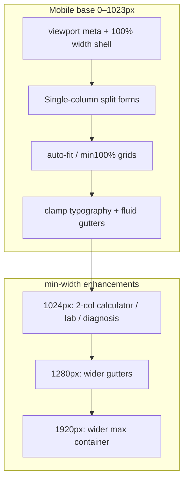

# Mobile-first responsive architecture audit

**Audit date:** 2026-05-19  
**Strategy:** Base CSS targets phones (320–430px); `min-width` media queries add tablet/desktop layout. No route changes.

---

## Executive summary

| Task | Status |
|------|--------|
| Viewport meta (`width=device-width`, `viewport-fit=cover`) | Pass — `index.html` |
| Mobile-first layout strategy | Pass — `src/styles/mobile-first-layout.css` |
| Fluid containers (no fixed desktop min width) | Pass — `min(100%, …rem)` max-widths |
| `repeat(auto-fit, minmax(min(100%, …)))` grids | Pass — calculators, catalog, tools |
| `min-width: 0` on flex/grid children | Pass — `layout-visibility.css` |
| Responsive spacing tokens | Pass — `--space-fluid-*`, `--app-fluid-*` |
| Responsive typography `clamp()` | Pass — `responsive-ux.css`, `index.css` |
| Remove desktop-default split panels | Pass — calculators, lab, diagnosis |
| Routes preserved | Pass |
| Responsive audit report | This document |

**Acceptance:** Layout does not assume a minimum desktop width. Split clinical forms default to **one column**; two columns from **1024px** up only.

---

## Viewport targets

| Tier | Widths (CSS px) | QA coverage |
|------|-----------------|-------------|
| Phones | 320, 360, 375, 390, 412, 430 | `MOBILE_FIRST_VIEWPORT_WIDTHS` + Playwright |
| Tablets | 768, 1024 | Same |
| Desktop | 1280, 1440, 1920 | `RESPONSIVE_QA_VIEWPORTS` smoke |

Constants: `src/layout/breakpoints.js` → `MOBILE_FIRST_BREAKPOINTS`

---

## Architecture layers



### Stylesheet load order (`main.jsx`)

1. `index.css` — reset, fluid space/type tokens  
2. `layout-breakpoints.css` — shell gutters, compact chrome  
3. `responsive-ux.css` — clamp headings, touch targets, callouts  
4. `layout-visibility.css` — overflow clip, min-width 0, auto-fit grids  
5. **`mobile-first-layout.css`** — split forms, fluid containers  

### App shell (≤900px compact)

- Sidebar off-canvas; `margin-left: 0` on main wrap  
- Menu + theme FAB respect safe areas  
- Scrollport: `.app-shell-page-body` (vertical only)

---

## Key layout decisions

### Clinical calculators (Pixel 7 / hidden tools fix)

**Before:** `.calculator-interface` was two columns by default, stacked only below 1024px (desktop-first).  
**After:** One column by default; two columns `@media (min-width: 1024px)`.

Files: `mobile-first-layout.css`, `Calculators.css` (gap/padding only).

### Lab interpreter & diagnosis assistant

Same mobile-first split pattern as calculators.

### Calculator hub cards

`repeat(auto-fit, minmax(min(100%, 220px), 1fr))` — cards wrap on narrow screens without horizontal page scroll.

### Catalog & tools overview

Stacked tables on small screens (`.catalog-table-wrap` horizontal scroll only inside wrapper). Search field `max-width: min(280px, 100%)`.

### Backend visibility

Unrelated to CSS width strategy; catalog and calculators render from static registry when API is down (see `docs/production-backend-frontend-audit.md`).

---

## Tokens reference

| Token | Purpose |
|-------|---------|
| `--app-fluid-page-gutter` | Page horizontal padding |
| `--app-fluid-split-gap` | Gap between input/results columns |
| `--app-fluid-container-max` | Calculators hub max width |
| `--app-type-title` / `--text-title-fluid` | Fluid headings |
| `--space-fluid-4` | Fluid spacing scale |
| `--bp-phone-md` | 375px documentation |

---

## Remaining desktop enhancements (optional, not required)

These use `min-width` only to add polish — layout works without them:

- `AppShell.css` `@media (min-width: 1920px)` — ultra-wide padding  
- `LabInterpreter.css` `@media (min-width: 1025px)` — results panel max-height scroll  
- `Dashboard.css` / `ChatInterface.css` — wide-screen density  

---

## Verification commands

```bash
npm run test -- --run src/styles/mobileFirstLayout.test.js src/styles/responsiveUx.test.js src/styles/layout-visibility.test.js src/data/responsiveQaMatrix.test.js
npm run test:responsive-regression
npm run qa:responsive:chromium
```

---

## Related docs

- [qa/RESPONSIVE_QA_MATRIX.md](../qa/RESPONSIVE_QA_MATRIX.md) — generated matrix  
- [docs/responsive-regression-coverage.md](./responsive-regression-coverage.md)  
- [docs/pr/RESPONSIVE_UI_HARDENING.md](./pr/RESPONSIVE_UI_HARDENING.md)
