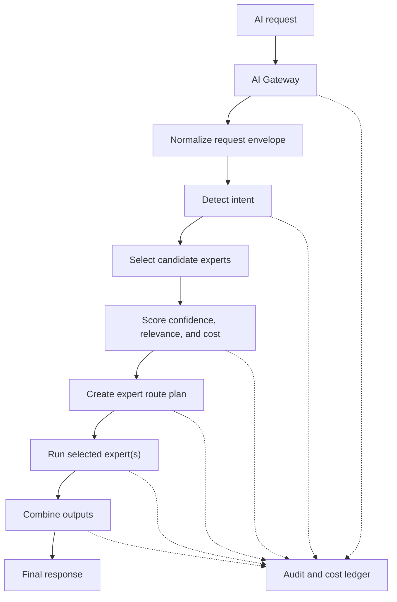

# CareDroid Mixture-of-Experts Routing System

Status: target routing architecture  
Scope: AI Gateway, intent detection, expert routing, expert execution, response composition, safety controls, and cost optimization  
Goal: create intelligent AI routing for CareDroid across clinical, operational, IoT, fleet, hospital map, and documentation workflows

## Executive Summary

CareDroid should route every AI request through a governed Mixture-of-Experts system before model execution. The router detects intent, selects one or more experts, scores route confidence, estimates execution cost, and returns a route plan that the AI Gateway can audit before any expert runs.

The routing system should prefer deterministic and lightweight paths first: exact tool IDs, emergency keyword policy, cached retrieval, shallow classifiers, embeddings, and small model routing. Larger models should be reserved for ambiguous, high-risk, multi-specialty, or synthesis-heavy cases. Cost reduction is a routing responsibility, but it must never weaken emergency handling, clinical safety, PHI policy, source access checks, or audit logging.

## Routing Flow



## Expert Catalog

| Expert | Primary scope | Example intents | Default retrieval | Safety posture |
| --- | --- | --- | --- | --- |
| Emergency expert | Triage, red flags, escalation, unstable patient routing | chest pain red flags, respiratory distress, sepsis concern, suicide risk, stroke symptoms | guideline | Preemptive, high review |
| Cardiology expert | Cardiac symptoms, ECG, ACS, heart failure, risk scores | HEART, GRACE, atrial fibrillation, troponin trend, anticoagulation risk | guideline | High review for diagnosis or treatment |
| Pulmonology expert | Respiratory disease, ABG, oxygenation, ventilation, COPD, asthma | ABG interpretation, COPD GOLD, asthma exacerbation, hypoxemia | guideline | High review for acute respiratory findings |
| Nephrology expert | Kidney function, electrolytes, dialysis, AKI, CKD | AKI staging, eGFR, FeNa, dialysis readiness, electrolyte disorder | guideline | High review for critical labs |
| Radiology expert | Imaging interpretation support, report summarization, imaging follow-up | chest x-ray summary, CT impression explanation, modality selection | reference | Human radiologist authority required |
| Psychiatry expert | Behavioral health, screening, risk escalation, crisis workflows | PHQ-9, GAD-7, CAGE, suicide severity, agitation support | guideline | Crisis escalation aware |
| Fleet expert | Fleet telemetry, dispatch, utilization, status, routing | ambulance availability, device fleet utilization, dispatch constraints | operational | Operational confirmation required for actions |
| IoT expert | Device telemetry, sensors, connectivity, signal status, telemetry anomalies | device offline, telemetry drift, IoT alert correlation | operational | No autonomous device control |
| Operations expert | Hospital command, bed flow, staffing, throughput, resource optimization | bed occupancy, capacity, bottlenecks, resource allocation | operational | Human approval for operational changes |
| Hospital-map expert | Indoor map, unit location, asset location, pathing, geospatial context | locate patient unit, nearest device, map overlay, zone status | operational | Location privacy aware |
| Documentation expert | Ambient notes, handoff drafts, summaries, clinical documentation | SOAP note, discharge summary draft, patient timeline, handoff | patient_scoped | Clinician review required |

## Routing Score

Each candidate expert receives a routing score:

```text
score = (confidence * relevance) / estimated_cost
```

Where:

- `confidence` is the router's confidence that the request belongs to the expert, normalized from `0.0` to `1.0`.
- `relevance` is the expected usefulness of the expert's tools, retrieval corpus, and output schema for the request, normalized from `0.0` to `1.0`.
- `estimated_cost` is the expected cost of the cheapest safe path for that expert, normalized as a positive value. Use a cost floor such as `0.01` to avoid division by zero for deterministic or cached paths.

Cost should include model tokens, embeddings, reranking, vector search, tool execution, external APIs, and composition. Deterministic, cached, or frontend-only paths should have very low estimated cost, which naturally raises their score when confidence and relevance are high.

## Intent Detection

Intent detection should run in layers from cheapest to most expensive:

1. Deterministic guards:
   - Emergency and crisis escalation patterns.
   - Exact tool IDs, route hints, feature hints, and UI source surface.
   - Permission, tenant, PHI, and workspace policy checks.
   - Known backend executor and frontend-only tool catalog matches.
2. Lightweight classifiers:
   - Keyword and phrase profiles by specialty.
   - Embedding similarity against tool, expert, and route descriptions.
   - Small model structured routing for ambiguous phrasing.
3. Escalated classification:
   - Larger model routing only when deterministic and lightweight paths disagree or confidence is below threshold.
   - Multi-intent decomposition for complex requests.
   - Human review flagging for high-risk, low-confidence, or action-oriented requests.

Intent output should include:

```ts
type DetectedIntent = {
  primaryIntent: string;
  secondaryIntents: string[];
  urgency: "routine" | "urgent" | "emergency" | "crisis";
  clinicalRisk: "low" | "medium" | "high";
  sourceSurface: string;
  toolHint?: string;
  featureHint?: string;
  evidence: Array<{
    kind: "keyword" | "embedding" | "tool_id" | "model" | "policy";
    value: string;
    weight: number;
  }>;
};
```

## Expert Selection

The router should select a primary expert and optionally one or more supporting experts.

Selection rules:

- Emergency expert preempts all normal routing when emergency or crisis confidence meets threshold.
- Exact tool or feature matches should route directly to the owning expert when allowed by policy.
- Multi-expert routing is allowed when the second expert materially improves safety or answer quality.
- Do not run multiple experts just because scores are close; run a lightweight tie-breaker first.
- Reject or ask for clarification when all candidate experts are below the minimum confidence threshold.

Recommended thresholds:

| Condition | Action |
| --- | --- |
| Emergency confidence >= `0.70` | Route emergency expert and add escalation language |
| Primary score >= `0.65` and confidence >= `0.70` | Route one primary expert |
| Primary score >= `0.55` and secondary score within `15%` | Route primary plus secondary expert if clinically useful |
| Confidence `0.45` to `0.69` | Use lightweight clarification or small model router |
| Confidence < `0.45` | Ask a clarifying question or route to documentation/general assistant only if safe |

## Route Plan Contract

The router should return an explicit plan before execution:

```ts
type ExpertRoutePlan = {
  runId: string;
  primaryIntent: string;
  selectedExperts: Array<{
    expertId:
      | "emergency"
      | "cardiology"
      | "pulmonology"
      | "nephrology"
      | "radiology"
      | "psychiatry"
      | "fleet"
      | "iot"
      | "operations"
      | "hospital-map"
      | "documentation";
    role: "primary" | "supporting" | "review";
    confidence: number;
    relevance: number;
    estimatedCost: number;
    score: number;
    reason: string;
  }>;
  retrievalPolicy: "none" | "reference" | "guideline" | "patient_scoped" | "operational";
  modelPlan: {
    routerModel: "deterministic" | "embedding" | "small" | "standard" | "large";
    expertModel: "none" | "small" | "standard" | "large";
    useLightweightFirst: boolean;
    allowEscalation: boolean;
    maxTokens: number;
  };
  toolPlan: {
    allowedToolIds: string[];
    backendExecutorIds: string[];
    requiredHumanConfirmation: boolean;
  };
  safetyPlan: {
    emergencyEscalation: boolean;
    crisisEscalation: boolean;
    requiresHumanReview: boolean;
    blockedActions: string[];
  };
  costPlan: {
    estimatedCost: number;
    budgetLimit?: number;
    costReductionApplied: string[];
  };
};
```

## Confidence Scoring

Confidence should be explainable and auditable. It should combine evidence from deterministic matches, embeddings, route context, and model classification.

Recommended confidence components:

- `exactMatchConfidence`: exact tool ID, feature hint, route hint, or configured intent pattern.
- `semanticConfidence`: embedding similarity to expert descriptions, tool profiles, and route examples.
- `policyConfidence`: whether permissions, workspace state, and safety policy allow the route.
- `contextConfidence`: whether patient, operational, device, or map context is available and relevant.
- `modelConfidence`: structured model router output when used.

Example weighted confidence:

```text
confidence =
  (0.35 * exactMatchConfidence) +
  (0.25 * semanticConfidence) +
  (0.15 * policyConfidence) +
  (0.15 * contextConfidence) +
  (0.10 * modelConfidence)
```

When no model router is used, redistribute `modelConfidence` weight across exact and semantic signals.

## Combining Outputs

The Response Composer should turn expert outputs into one answer with clear provenance.

Composition rules:

- Use the primary expert as the response spine.
- Merge supporting expert findings only when they add non-duplicative clinical, operational, or safety value.
- Preserve uncertainty instead of forcing consensus when experts disagree.
- Show safety escalations above routine content.
- Separate clinical guidance from operational recommendations.
- Include citations, source context, tool outputs, map or device context, and confidence metadata when available.
- Never let a lower-risk expert override emergency, crisis, PHI, permission, or human-review requirements.

Composition output should include:

```ts
type ComposedExpertResponse = {
  runId: string;
  text: string;
  selectedExperts: string[];
  confidence: number;
  safetyWarnings: string[];
  citations: Array<{
    sourceId: string;
    title: string;
    url?: string;
  }>;
  toolResults: unknown[];
  cost: {
    estimated: number;
    actual?: number;
    savedBy: string[];
  };
  audit: {
    routePlanId: string;
    requiresHumanReview: boolean;
    blockedActions: string[];
  };
};
```

## Cost Reduction Strategy

The router should reduce cost before execution:

- Prefer deterministic route rules before model classification.
- Prefer cached tool schemas, expert descriptors, retrieval results, and embedding results.
- Use lightweight models for classification, extraction, and tie-breaking before larger models.
- Use larger models only for synthesis-heavy, high-risk, ambiguous, or multi-expert cases.
- Do not call an expert if the user's request can be answered by a deterministic calculator, existing backend executor, cached response, or direct route launch.
- Cap supporting experts unless the secondary score materially improves safety or task completion.
- Reuse one context assembly pass across experts instead of retrieving the same records repeatedly.
- Track estimated versus actual cost and feed that delta back into future routing estimates.

Model ladder:

| Stage | Preferred path | Escalate when |
| --- | --- | --- |
| Guardrails | Deterministic policy | Emergency, crisis, or permissions need deeper classification |
| Intent routing | Rules, embeddings, small model | Confidence is low or intents conflict |
| Expert execution | Tool, cache, or small model | Clinical risk, ambiguity, or synthesis burden is high |
| Multi-expert synthesis | Small or standard composer | Experts disagree or final answer needs careful reconciliation |
| Safety review | Deterministic policy plus high-quality model if needed | Emergency, crisis, critical results, or patient-specific recommendations |

## Governance and Audit

Every route decision should emit audit metadata:

- `ai.intent.detected`
- `ai.experts.candidates_scored`
- `ai.route.selected`
- `ai.route.rejected`
- `ai.expert.started`
- `ai.expert.completed`
- `ai.response.composed`
- `ai.cost.estimated`
- `ai.cost.recorded`

Audit payloads should include `runId`, user/workspace/organization scope, selected experts, rejected experts, confidence, relevance, estimated cost, routing score, model plan, tool plan, safety plan, PHI flags, citations, and final status.

## Implementation Phases

Phase 1: routing contract

- Define the `ExpertRoutePlan` and expert IDs as durable backend types.
- Add static expert descriptors with keywords, allowed tools, retrieval policy, safety policy, and estimated cost hints.
- Emit routing score and selected expert metadata from chat and clinical intelligence paths.

Phase 2: lightweight router

- Add deterministic routing for emergency, exact tool IDs, source surface, and feature hints.
- Add embedding or small model tie-breaking for ambiguous requests.
- Add route rejection and clarification behavior for low confidence.

Phase 3: expert execution

- Implement expert adapters for emergency, cardiology, pulmonology, nephrology, radiology, psychiatry, fleet, IoT, operations, hospital-map, and documentation.
- Route each expert through shared context, retrieval, tool, audit, and cost services.
- Add multi-expert execution only where the route plan explicitly allows it.

Phase 4: response composition and cost learning

- Add a Response Composer that merges expert outputs with source, safety, and cost metadata.
- Record estimated versus actual cost for every expert call.
- Tune routing thresholds using accepted, rejected, escalated, and corrected routes.

## Example Route

Input:

```text
Patient with chest pain, elevated troponin, and shortness of breath. Summarize risk and next steps.
```

Candidate scores:

| Expert | Confidence | Relevance | Estimated cost | Score |
| --- | ---: | ---: | ---: | ---: |
| Emergency expert | 0.82 | 0.95 | 0.08 | 9.74 |
| Cardiology expert | 0.88 | 0.96 | 0.12 | 7.04 |
| Pulmonology expert | 0.56 | 0.52 | 0.10 | 2.91 |

Selected route:

- Primary: emergency expert because urgent symptoms and elevated troponin require escalation-aware framing.
- Supporting: cardiology expert because cardiac-specific risk and guideline context materially improve answer quality.
- Composer: place emergency precautions first, then cardiology risk summary, then uncertainty and clinician-review language.

