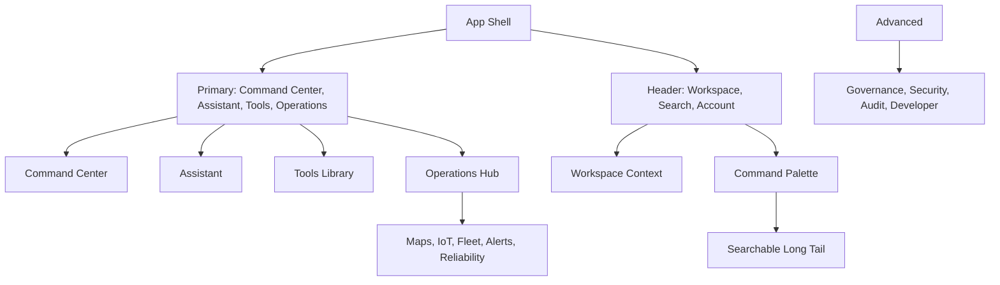

# CareDroid Navigation Reduction Plan

## Executive Recommendation

Reduce persistent CareDroid navigation to four primary product concepts:

- **Command Center**: the operating home for `/dashboard`, recent work, alerts, recommendations, and workspace-aware status.
- **Assistant**: the conversational workspace for `/assistant`, seeded clinical reasoning, and guided tool flows.
- **Tools**: the canonical library for `/tools`, `/tools/calculators`, calculators, clinical tools, specialty tools, and launchable workflows.
- **Operations**: the operational hub for hospital flow, maps, fleet, Medical IoT, alerts, incidents, reliability, and operational analytics.

Everything else remains available, but no longer competes as a persistent top-level concept. Workspace becomes context, account surfaces become utilities, Advanced becomes a permissioned admin/developer drawer, and the long tail becomes reachable through Quick Command, global search, contextual workspace pages, and deep links.

This plan does not remove features or routes. It reduces persistent exposure while preserving all existing capabilities through clearer grouping and search.

## Documentation Wave Alignment

Navigation reduction is the user-facing expression of the SaaS bottleneck architecture. The persistent app chrome should not decide what an organization bought, what a workspace enables, or what a role should see. It should render a small set of stable destinations and let the effective catalog decide promotion, locking, and search ranking.

Shared assumptions for the current redesign wave:

- Primary navigation stays limited to Command Center, Assistant, Tools, and Operations.
- Product and asset-pack pages explain what can be purchased or installed; they do not become day-to-day operational navigation.
- Digital Twin, Medical IoT, devices, fleet, hospital map, live map, and alerts are Operations surfaces unless a workspace promotes them.
- Governance, audit, security, regulatory, system health, feature flags, plugins, data lineage, self diagnostics, and asset administration are Advanced surfaces.
- Individual calculators, specialty tools, simulation details, patient details, profile subpages, and debug surfaces are searchable/direct-linkable rather than persistent nav peers.
- All visible, locked, recommended, and hidden states should eventually come from the same asset-aware access decision described in [SaaS Bottleneck Architecture Plan](./saas-bottleneck-architecture-plan.md).

## Current State Inventory

### Sidebar And Drawer

`src/config/navigation.config.js` is the current navigation source of truth. It exposes:

- `PRIMARY_NAV_ITEMS`: Dashboard, Discover, Automation, Assistant, Tools, Operations, Profile, Settings.
- `SOLUTIONS_SIDEBAR_NAV_ITEMS`: Products, Specialties, Pathways, AI Agents, gated by `FEATURE_FLAGS.commercialSurfaces`.
- `OPERATIONS_SIDEBAR_NAV_ITEMS`: Digital Twin, Hospital Map, Medical IoT, Devices, Fleet Map, Live Map.
- `ADVANCED_SIDEBAR_NAV_ITEMS`: Developer Catalog, System Health, Feature Flags, Plugins, Dependency Map, Data Lineage, Self Diagnostics, Governance, Security, Audit, Regulatory, Assets.
- `QUICK_COMMAND_DESTINATION_ITEMS`: a combined destination set used by the launcher.

`src/components/Sidebar.jsx` renders those groups in the authenticated shell. It already describes the intended model: one obvious path to each major task, with developer/governance surfaces behind Advanced.

### Bottom Nav

There is no active bottom navigation to preserve. Mobile uses the same `Sidebar` as a compact drawer opened from `src/layout/AppShell.jsx`. `src/data/uxDebtEliminationEngine.js` treats `app-shell-bottom-nav` and bottom-nav spacing tokens as obsolete UX debt. Keep this direction: no separate bottom tab bar.

### Header

`src/layout/AppShell.jsx` keeps the authenticated header intentionally small:

- Compact menu button.
- Compact Quick Command trigger.
- `WorkspaceSwitcher`.

The header should become the home for workspace switching, command/search, notifications, and account utilities. It should not become a second row of product navigation.

### Dashboard Cards

`src/pages/CommandDashboard.jsx` currently mixes several launch concepts: Assistant, workspace, tools, calculators, simulations, lab, 3D viewer, Digital Twin, notifications, alerts, Hospital Map, Medical IoT, fleet, device management, recent activity, and system status.

`src/data/commandDashboardModel.js` is already more structured. It projects inventory-backed panels for clinical tools, calculators, reference/guidelines, fleet operations, Medical IoT, and expanded care. Future dashboard cards should lean on this model and workspace context rather than duplicate the full navigation tree.

### Quick Command And Command Palette

`src/components/QuickCommandLauncher.jsx` searches:

- Recent tools.
- Favorites.
- Workspaces.
- Navigation destinations.
- Canonical tools from `getUserFacingToolRegistryProjection()`.

It already suppresses primary shell duplicates for tools that point to persistent shell destinations. Treat Quick Command and any future Command Palette as one launcher model, not two separate registries.

### `/tools`

`src/pages/tools/ToolsOverview.jsx` is the canonical browsable tool library. It supports search and filters for recommended, workspace, organization, permitted, calculators, AI workflows, maps/IoT, operations, simulations, laboratory, governance, favorites, recent, and all including locked tools.

`/tools` should stay primary because it preserves broad feature discovery without forcing every tool or route into persistent navigation.

### `/tools/calculators`

Calculator routes are generated through `src/routes/clinicalToolRoutes.js` from canonical inventory data. `/tools/calculators` should remain a focused hub and route filter under Tools, not a separate primary nav item.

Individual calculator slugs such as `/tools/calculators/qsofa` and `/tools/calculators/news2` should be searchable, direct-linkable, and workspace-recommended when relevant.

### Operations Pages

Operations already has consolidation points:

- `src/pages/Operations.jsx` groups clinical alerts, Hospital Map, device fleet management, Medical IoT, live tracking, Fleet Command, route optimizer, predictive maintenance, analytics, and audit logs.
- `src/pages/DigitalOperationsCenter.jsx` and `src/data/digitalOperationsCenter.js` combine operational surfaces into a broader command center.
- `src/data/workspaceArchitecture.js` defines operations, fleet, and Medical IoT workspaces with relevant routes and tools.

The plan should strengthen Operations as a hub instead of exposing every operations page as persistent sidebar navigation.

### Advanced And Developer Pages

Advanced/developer/admin routes are already permissioned in navigation and route registration. These should remain available, but should not be primary product concepts for most users.

Examples include `/tools/catalog`, `/system-health`, `/feature-flags`, `/plugins`, `/dependency-map`, `/data-lineage`, `/self-diagnostics`, `/ai-governance`, `/security`, `/audit`, `/regulatory`, `/assets`, organization settings, pack administration, and platform configuration surfaces.

## Classification Decisions

### Stays Primary

| Primary Concept | Canonical Entry | Reason |
| --- | --- | --- |
| Command Center | `/dashboard` | Home, summary, recommendations, current work, workspace status, and alerts. |
| Assistant | `/assistant` | Conversational reasoning, seeded tool flows, clinical support, and user intent capture. |
| Tools | `/tools` | Full launchable inventory, calculators, clinical tools, specialty tools, workflows, favorites, and recent tools. |
| Operations | `/operations` | Operational command, maps, IoT, fleet, incidents, reliability, analytics, and alerts. |

### Moves Under Operations

Move these out of persistent primary/sidebar exposure and into the Operations hub, operations workspaces, Quick Command, and search:

- Digital Twin: `/digital-twin`.
- Hospital Map: `/hospital-map`.
- Medical IoT: `/medical-iot`.
- Devices and device fleet management: `/devices`.
- Live Map: `/live-map`.
- Fleet Map and Fleet Command: `/fleet/map`, `/fleet/command`.
- Route Optimizer: `/fleet/route-optimizer`.
- Predictive Maintenance: `/fleet/predictive-maintenance`.
- Clinical Alerts: `/clinical/alerts`.
- Digital Operations Center: `/operations-center`.
- Operations observability, deployments, service health, and incidents: `/operations/observability`, `/operations/deployments`, `/operations/service-health`, `/operations/incidents`.
- Operational analytics: `/analytics`, `/costs` when used for operational monitoring.

Operations can still show cards or sections for high-frequency surfaces. The reduction is about removing them as persistent global navigation peers.

### Moves Under Advanced

Keep these grouped behind a collapsed, permissioned Advanced area and available through command/search:

- Developer Catalog / source audit: `/tools/catalog`.
- System Health: `/system-health`.
- Feature Flags: `/feature-flags`.
- Plugins: `/plugins`.
- Dependency Map: `/dependency-map`.
- Data Lineage: `/data-lineage`.
- Self Diagnostics: `/self-diagnostics`.
- Governance: `/ai-governance`, `/governance`, `/governance/*`.
- Security: `/security`, `/governance/ai-security/*`.
- Audit: `/audit`, `/audit/*`, `/audit-logs`.
- Regulatory: `/regulatory`, `/governance/regulatory/*`.
- Assets: `/assets`, especially admin/research asset inspection.
- Organization/admin setup: `/settings/organization`, `/team`, onboarding, consent administration.
- Pack and asset administration: `/settings/organization/packs`, `/settings/organization/assets`, `/asset-packs`.
- Platform configuration and marketplace administration: `/configuration-studio`, `/integrations-marketplace`, `/platform-analytics`.

For implementation, Advanced can remain a collapsed sidebar group or become an account/admin menu. Either way, it should not count as a primary product concept.

### Searchable Only

Make these searchable, direct-linkable, and context-promoted, but not persistent nav items:

- Individual calculators: `/tools/calculators/:slug`.
- Specialty tool detail routes: `/tools/cardiology/:toolId`, `/tools/pulmonology/:toolId`, `/tools/nephrology/:toolId`, `/tools/gastroenterology/:toolId`, `/tools/endocrine/:toolId`, `/tools/neurology/:toolId`, `/tools/pediatrics-obgyn/:toolId`, `/tools/psychiatry/:toolId`.
- Individual clinical AI tool pages when not commonly used as hubs: `/tools/differential-ai`, `/tools/timeline-ai`, `/tools/patient-summary-ai`, `/tools/order-set-ai`, `/tools/ai-explainability`, `/tools/clinical-audit`.
- Scenario detail routes: `/simulation/:scenarioId`, `/simulation/sepsis-deterioration`.
- Patient subroutes: `/patients/:patientId/*`.
- Profile/settings subroutes: `/profile/activity`, `/profile/tool-preferences`, `/profile/security`, `/profile/preferences`, `/notification-preferences`, `/two-factor-setup`, `/biometric-setup`.
- Workflow deep links: `/workflows?workflow=...`, patient workflow detail routes, and automation-specific deep links.
- Internal or debug-oriented surfaces such as `/memory`, `/ai-memory`, `/training`, `/ai/evaluation`, `/ai-command-center`, and `/artifacts`, unless a workspace explicitly promotes them.

Searchable only does not mean hidden. It means these surfaces are better found by intent, recent use, favorites, direct links, and workspace recommendations than by permanent chrome.

### Workspace Contextual

Workspace should influence what is shown without becoming another nav taxonomy. `src/data/workspaceArchitecture.js` already defines this model through `CARE_WORKSPACES`, route shortcuts, tool IDs, and `aiContext`.

Use workspace context to promote:

- Relevant routes, such as calculators for Emergency or maps for Operations.
- Recommended tools, such as NIHSS for Neurology or Fleet Command for Fleet.
- Workspace dashboards, maps, notifications, workflows, and operational alerts.
- Assistant seed context from each workspace's `aiContext`.
- Search and command results scoped to the active workspace.

Keep `WorkspaceSwitcher` in the header. Workspace pages such as `/workspaces` and `/workspace/:workspaceId` should remain available as context homes and search/command destinations, but not as primary sidebar destinations.

## Surface Strategy

### Sidebar And Compact Drawer

Target persistent sidebar/drawer concepts:

1. Command Center.
2. Assistant.
3. Tools.
4. Operations.

Account utilities should be visually separate:

- Profile.
- Settings.
- Notifications.
- Sign out.

Advanced should remain collapsed and permission-aware. It may stay in the sidebar for admin users, but it should be visually secondary and excluded from the primary count.

### Bottom Nav

Do not reintroduce bottom navigation. Compact navigation should continue to use:

- Header menu button.
- Off-canvas drawer backed by the same navigation model.
- Header command/search trigger.
- Safe-area spacing only, with no bottom-nav layout tokens.

### Header

The header should own context and utilities:

- Workspace switcher.
- Command/search launcher.
- Notifications.
- Account menu with profile, settings, security, and sign out.

The header should not duplicate the sidebar's four product concepts.

### Command Center

Command Center should not behave like a second navigation menu. It should become a workspace-aware home that answers:

- What needs attention?
- What did I use recently?
- What is recommended in this workspace?
- What operational or clinical status changed?
- What should I open next?

Hardcoded launch cards should migrate toward projections over `commandDashboardModel.js`, `workspaceArchitecture.js`, `platformOperatingSystem.js`, and `toolInventory.js`.

### Quick Command And Command Palette

Unify Quick Command and Command Palette into one launcher model backed by:

- Primary destinations.
- Workspaces.
- Tools and calculators from `toolInventory.js`.
- Recent and favorite tools.
- Global search categories from `platformOperatingSystem.js`.
- Route aliases from `routes.config.js`.

Avoid adding a separate command registry unless it is generated from these canonical sources.

### `/tools` And `/tools/calculators`

Keep `/tools` as the primary browse surface for feature preservation. It should remain filterable by recommended, workspace, organization, permitted, calculators, AI workflows, maps/IoT, operations, simulations, laboratory, governance, favorites, recent, and all.

Keep `/tools/calculators` as a focused hub under Tools. Promote calculators through workspace recommendations, Assistant prompts, Quick Command, recent/favorites, and direct links rather than a persistent nav item.

### Operations

Make `/operations` the primary operational entry point. It should contain or route to:

- Digital Twin and Digital Operations Center.
- Hospital Map and Live Map.
- Medical IoT.
- Devices.
- Fleet Map and Fleet Command.
- Route Optimizer and Predictive Maintenance.
- Clinical Alerts.
- Incidents, deployments, service health, observability.
- Operational analytics and cost views where relevant.

Operations should support workspace-specific defaults: Operations, Fleet, and Medical IoT workspaces can promote different first cards without adding new global nav items.

### Advanced

Advanced should serve admins, developers, and governance users. Keep it permissioned, collapsed, and searchable. The user should not need to understand Advanced to perform core clinical or operational work.

## Follow-Up Implementation Phases

### Phase 1: Document And Guardrails

- Adopt this plan as the navigation strategy.
- Keep route preservation as a non-negotiable requirement.
- Add or update tests that assert the reduced primary concept count before code changes begin.

### Phase 2: Navigation Config Reduction

- Update `PRIMARY_NAV_ITEMS` toward Command Center, Assistant, Tools, and Operations.
- Move Profile and Settings into account/header utility behavior.
- Move Discover and Automation behind workspace context, Tools, or search unless product requirements demand persistent exposure.
- Keep Advanced permissioned and secondary.

### Phase 3: Operations Consolidation

- Remove operations leaf pages from persistent global sidebar exposure.
- Make `/operations` and operations workspaces the main path to maps, IoT, fleet, alerts, reliability, and analytics.
- Preserve every existing operations route as direct-linkable and command-searchable.

### Phase 4: Command/Search Unification

- Create a shared searchable item projection for Quick Command and global search.
- Derive destination entries from `navigation.config.js`, `routes.config.js`, `workspaceArchitecture.js`, and `toolInventory.js`.
- Align frontend search categories with the backend search service if that service becomes exposed.

### Phase 5: Dashboard Contextualization

- Convert dashboard launch cards into workspace-aware recommendations.
- Prefer `commandDashboardModel.js`, workspace summaries, recent/favorites, and inventory projections over hardcoded route cards.
- Keep high-value status and next-action cards visible, but avoid recreating the full sidebar inside the dashboard.

## Guardrails

- Preserve all existing routes and deep links.
- Preserve tool launch behavior through `src/navigation/registryToolLaunch.js`.
- Preserve calculator route generation through `src/routes/clinicalToolRoutes.js`.
- Preserve tool inventory as the launch/catalog source through `src/data/toolInventory.js`.
- Preserve workspace modeling through `src/data/workspaceArchitecture.js`.
- Do not add another navigation registry unless it is generated from canonical config and inventory.
- Do not reintroduce bottom navigation while the sidebar/drawer shell exists.
- Keep permission checks on Advanced/admin/governance surfaces.

## Acceptance Criteria For Future Implementation

- Persistent product navigation has no more than four primary concepts: Command Center, Assistant, Tools, Operations.
- Compact/mobile navigation uses the drawer plus command trigger, not a separate bottom nav.
- Header provides workspace, search/command, notifications, and account utilities without duplicating primary navigation.
- `/tools`, `/tools/calculators`, and all calculator slugs remain reachable.
- All existing operations, advanced, patient, profile, settings, simulation, and specialty tool routes remain deep-linkable.
- Quick Command/global search can launch primary destinations, workspaces, tools, calculators, operations pages, and advanced pages according to permissions.
- Workspace pages continue to promote relevant routes, tools, calculators, dashboards, maps, notifications, workflows, and Assistant context.
- Existing route smoke tests, primary navigation tests, Quick Command tests, workspace tests, and tool launch tests continue to pass after implementation.

## Canonical Sources To Preserve

- Routes: `src/config/routes.config.js` and the route mount table in `src/App.jsx`.
- Navigation: `src/config/navigation.config.js`.
- Sidebar/drawer shell: `src/components/Sidebar.jsx` and `src/layout/AppShell.jsx`.
- Tool inventory: `src/data/toolInventory.js`.
- Tool launch: `src/navigation/registryToolLaunch.js`.
- Calculator paths: `src/routes/clinicalToolRoutes.js`.
- Workspace context: `src/data/workspaceArchitecture.js`.
- Command dashboard model: `src/data/commandDashboardModel.js`.
- Global search demo model: `src/data/platformOperatingSystem.js`.
