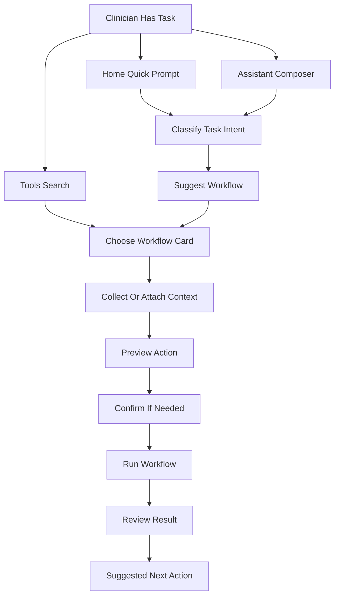
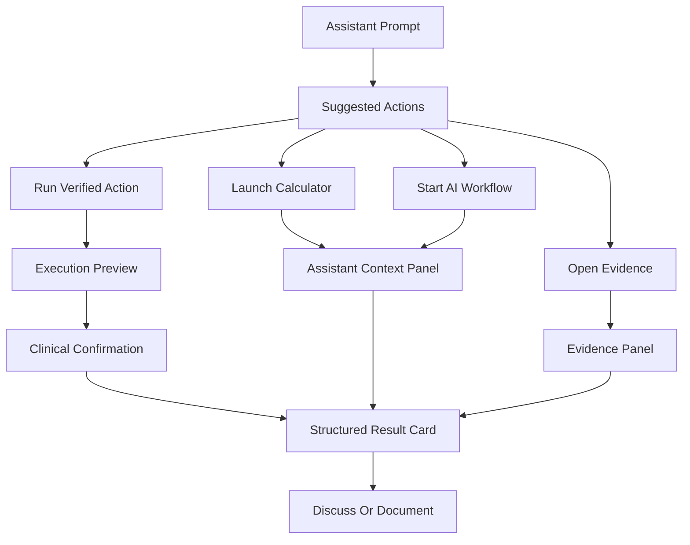
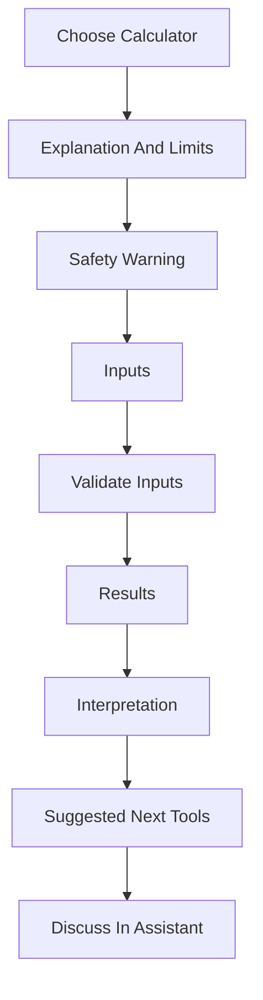
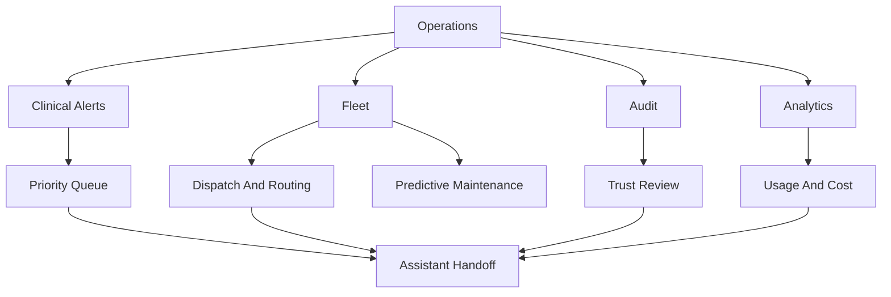

# CareDroid Clinical AI Next-Generation UX Redesign

Status: architecture proposal
Scope: UX architecture, information architecture, interaction model, responsive strategy, and migration plan
Non-goal: code implementation in this pass

## 1. Executive Summary

CareDroid Clinical AI has evolved beyond a set of medical tools. The current product already includes chat, local calculators, backend executors, clinical AI pages, fleet operations, compliance surfaces, catalog audit systems, responsive support, and mobile QA coverage. The next UX step is to stop presenting these as many separate systems and instead present one clinical operating system centered on the user's next task.

The recommended direction is an AI-first, task-first shell:

- Home becomes a clinical command center, not a feature list.
- Assistant becomes the primary workspace where users ask, attach context, launch tools, confirm actions, and review results.
- Tools becomes a workflow library powered by the existing normalized inventory, not a parallel catalog ecosystem.
- Patients becomes a patient-context and case workspace surface, even if early versions are context-first rather than EHR-backed.
- Operations absorbs fleet, analytics, audit, and administrative operational views.
- Settings contains account, privacy, security, billing, trust details, and developer/audit catalog access.

The important architectural move is not visual restyling. It is changing the product from "choose a feature, then figure out the task" to "start with the task, then let CareDroid reveal the right assistant, calculator, page, executor, or operation."

The current codebase already has strong migration anchors:

- Route ownership in [`src/App.jsx`](../src/App.jsx)
- Shell and responsive behavior in [`src/layout/AppShell.jsx`](../src/layout/AppShell.jsx)
- Current sidebar behavior in [`src/components/Sidebar.jsx`](../src/components/Sidebar.jsx)
- Assistant and Pulse foundation in [`src/pages/Dashboard.jsx`](../src/pages/Dashboard.jsx)
- User-facing tool inventory in [`src/data/toolInventory.js`](../src/data/toolInventory.js)
- Tool launch resolution in [`src/navigation/registryToolLaunch.js`](../src/navigation/registryToolLaunch.js)
- Deep link safety in [`src/routes/clinicalToolRoutes.js`](../src/routes/clinicalToolRoutes.js)
- Mobile and touch target tokens in [`src/styles/design-tokens.css`](../src/styles/design-tokens.css)

The redesign should preserve those foundations while simplifying what clinicians see.

## 2. Current UX Problems

### Route And Navigation Density

The current authenticated route table exposes many first-class destinations: `/dashboard`, `/chat`, `/tools`, `/tools/catalog`, many `/tools/*` pages, dynamic calculator routes, `/fleet/*`, `/clinical/alerts`, profile, settings, notifications, analytics, audit, costs, consent, team management, and security flows.

This is technically valid but cognitively expensive. The user sees multiple product concepts:

- Pulse
- Chat
- Actions
- Action Library
- Trust Details
- Tools
- Catalog
- Calculators
- Clinical AI pages
- Fleet routes
- Settings
- Administration

The route structure should remain backward-compatible, but the visible IA should collapse into a smaller set of intent-based destinations.

### Sidebar Overload

[`src/components/Sidebar.jsx`](../src/components/Sidebar.jsx) currently carries too much responsibility:

- Product mode navigation
- New chat creation
- Workspace selection
- Favorite tools
- Recent tools
- Pinned tools
- Category groups
- Trust details
- Action library
- Recent conversations
- Notifications
- HIPAA badge
- Sign out

This creates a dense left rail that works as a power-user console but is not an ideal clinical starting point. The redesigned shell should make the sidebar a stable primary navigation rail and move secondary tool discovery into contextual panels, command search, and the Tools workspace.

### Tools And Catalog Duplication

[`src/pages/tools/ToolsOverview.jsx`](../src/pages/tools/ToolsOverview.jsx) is the user-facing action library. [`src/pages/tools/ClinicalToolCatalog.jsx`](../src/pages/tools/ClinicalToolCatalog.jsx) is closer to a trust, source, and audit surface. Today both appear near the same navigation level, which makes "tool discovery" and "tool provenance" feel like competing clinician experiences.

The redesign should:

- Keep Tools as the clinician-facing workflow library.
- Move Catalog into "Trust details" or "Source and coverage" behind each tool and under Settings.
- Use [`src/data/toolInventory.js`](../src/data/toolInventory.js) as the UX source of truth for all user-facing tool cards and filters.

### Calculator Isolation

[`src/pages/tools/Calculators.jsx`](../src/pages/tools/Calculators.jsx) contains a large calculator hub, chat-assisted calculator cards, and many calculator implementations behind `CalculatorInterface`. The calculator forms have strong safety language and responsive input/result patterns, but the experience still starts from a catalog of calculators rather than the clinical question.

The redesign should treat calculators as workflow steps:

- Assistant suggests calculators based on prompt or visible context.
- Home exposes common calculator tasks as quick actions.
- Tools groups calculators by clinical workflow.
- Calculator pages show explanation, safety warning, inputs, results, interpretation, and suggested next tools.

### AI Tools Feel Like Separate Pages

CareDroid has dedicated AI pages such as Differential AI, Timeline AI, Patient Summary AI, Order Set AI, Guideline RAG, Ambient Scribe, AI Explainability, and Clinical Audit. These are valuable capabilities, but separate page routes make AI feel fragmented.

The redesign should make these capabilities feel like panels and workflows inside the Assistant workspace:

- "Summarize patient" is an assistant action.
- "Build differential" is an assistant workflow.
- "Find guideline evidence" is a context panel result.
- "Draft documentation" is a bottom action or quick action.

The dedicated pages can continue to exist as deep links and power-user surfaces during migration.

### Backend Capability Is Not Fully Reflected In UX

The frontend exposes many tools, but only a smaller set are registered backend executors. Current backend capability flags in [`src/config/backendApiCapabilities.js`](../src/config/backendApiCapabilities.js) and executor mappings distinguish real server execution from local or guided experiences.

The UX must make capability modes explicit without exposing technical implementation:

- Guided with AI
- Local calculator
- Verified server action
- Reference or trust detail
- Planned or unavailable capability

This helps clinicians understand what will happen before they click.

### Mobile Density

The codebase has meaningful mobile support: compact shell at 900px, drawer focus management, visual viewport handling, safe-area padding, and responsive tests. The risk is not lack of CSS. The risk is too much interface density at phone widths.

The redesigned mobile experience should reduce persistent chrome:

- Bottom primary navigation
- One main task at a time
- Assistant composer always reachable
- Context panel becomes a sheet
- Tool filters collapse into chips and command search
- Results and warnings use progressive disclosure

## 3. Proposed Navigation Map

### Primary Navigation

The visible product IA should become:

- Home: clinical command center and "start here" page.
- Assistant: central AI workspace for chat, tool launch, context, evidence, and execution.
- Tools: workflow library for calculators, AI tools, clinical workflows, references, and verified actions.
- Patients: patient/case context workspace. Initially this can be "active case" oriented if full patient records are not implemented.
- Operations: fleet, clinical alerts, analytics, audit operations, and operational dashboards.
- Settings: account, privacy, security, billing, team, notifications, integrations, and trust/source details.

### Secondary Navigation

Secondary navigation should be contextual and progressive:

- On Home: recent activity, favorites, recommended tools, quick actions.
- In Assistant: suggested calculators, evidence, patient summary, recommended tools, active workflows.
- In Tools: calculators, AI tools, workflows, verified actions, references, favorites, recent.
- In Patients: active patient/case summary, notes, labs, medications, timeline, documentation.
- In Operations: alerts, fleet command, route optimizer, predictive maintenance, analytics, audit logs.
- In Settings: profile, security, notifications, privacy/export, billing, team, trust/source catalog.

### Route Consolidation Recommendation

Visible IA should map to simple canonical routes:

- `/home` or canonical `/dashboard`: Home
- `/assistant` or canonical `/chat`: Assistant
- `/tools`: Tools
- `/patients`: Patients or Active Case
- `/operations`: Operations
- `/settings`: Settings

Existing routes should continue as aliases or deep links:

- `/dashboard` redirects or aliases to Home.
- `/chat` redirects or aliases to Assistant.
- `/tools/catalog` becomes Settings -> Trust details, still reachable directly.
- `/tools/calculators/*` remains deep-linkable but appears as Calculator Workflow.
- `/fleet/*` remains deep-linkable but appears under Operations.
- `/clinical/alerts` appears under Operations or Home priority cards.

### Navigation Map

```mermaid
flowchart TD
  appShell["App Shell"] --> home["Home"]
  appShell --> assistant["Assistant"]
  appShell --> tools["Tools"]
  appShell --> patients["Patients"]
  appShell --> operations["Operations"]
  appShell --> settings["Settings"]

  home --> homePrompt["Quick Prompt"]
  home --> quickActions["Quick Actions"]
  home --> recentActivity["Recent Activity"]
  home --> recommendedTools["Recommended Tools"]

  assistant --> mainChat["Main Chat"]
  assistant --> contextPanel["Context Panel"]
  assistant --> bottomActions["Bottom Actions"]

  tools --> calculators["Calculators"]
  tools --> aiTools["AI Tools"]
  tools --> workflows["Workflows"]
  tools --> verifiedActions["Verified Actions"]
  tools --> references["References"]

  patients --> activeCase["Active Case"]
  patients --> patientSummary["Patient Summary"]
  patients --> timeline["Timeline"]
  patients --> documentation["Documentation"]

  operations --> clinicalAlerts["Clinical Alerts"]
  operations --> fleetCommand["Fleet Command"]
  operations --> analytics["Analytics"]
  operations --> auditLogs["Audit Logs"]

  settings --> account["Account"]
  settings --> security["Security"]
  settings --> privacy["Privacy And Export"]
  settings --> trustDetails["Trust Details"]
```



## 4. Screen Hierarchy

### Level 1: Shell

The shell should hold only durable orientation:

- Primary nav
- Current workspace or patient context
- Global command/search
- Theme/status controls
- Mobile bottom nav and menu sheet

It should not permanently show every tool, category, workspace, recent conversation, and trust surface.

### Level 2: Workspaces

Each workspace answers a single user question:

- Home: "What should I do next?"
- Assistant: "Help me reason, act, and verify."
- Tools: "What clinical workflow or action do I need?"
- Patients: "What is the current patient or case context?"
- Operations: "What operational system needs attention?"
- Settings: "How do I configure, secure, audit, or administer the system?"

### Level 3: Contextual Panels

Contextual panels replace global nested navigation:

- Assistant right panel on desktop
- Assistant bottom sheet on mobile
- Tool detail drawer from card click
- Calculator result interpretation panel
- Trust/source drawer
- Patient context sheet

### Level 4: Workflows

Workflows are the core unit. A workflow can use local calculation, chat, backend execution, or a dedicated page behind the scenes, but the visible shape should be consistent:

1. Explain what this workflow does.
2. Show safety and limits.
3. Collect or attach context.
4. Preview action or calculation.
5. Show result and interpretation.
6. Suggest next steps and related tools.
7. Save, share, or discuss in Assistant.

## 5. Component Hierarchy

### App Shell Components

- `ClinicalOperatingShell`
  - `PrimaryNavRail`
  - `MobileBottomNav`
  - `MobileCommandHeader`
  - `GlobalCommandSearch`
  - `WorkspaceFrame`
  - `ContextSheet`

This can evolve from the current [`src/layout/AppShell.jsx`](../src/layout/AppShell.jsx) and [`src/components/Sidebar.jsx`](../src/components/Sidebar.jsx). The migration should extract route metadata before changing presentation.

### Home Components

- `HomeCommandCenter`
  - `AssistantHero`
  - `QuickPromptInput`
  - `QuickActionGrid`
  - `RecentActivityList`
  - `RecommendedToolRail`
  - `SafetyStatusStrip`

### Assistant Components

- `AssistantWorkspace`
  - `ConversationHeader`
  - `MessageTimeline`
  - `AssistantComposer`
  - `SuggestedActionChips`
  - `ExecutionPreviewCard`
  - `OperationalResultCard`
  - `AssistantContextPanel`
    - `PatientSummaryCard`
    - `SuggestedCalculators`
    - `EvidencePanel`
    - `RecommendedTools`
    - `ActiveWorkflows`

The current [`src/pages/Dashboard.jsx`](../src/pages/Dashboard.jsx), [`src/components/chat/ChatExecutionCard.jsx`](../src/components/chat/ChatExecutionCard.jsx), and [`src/components/chat/OperationalResultCard.jsx`](../src/components/chat/OperationalResultCard.jsx) are the closest starting points.

### Tool Components

- `ToolLibrary`
  - `ToolSearch`
  - `WorkflowFilterChips`
  - `ToolCardGrid`
  - `ToolCard`
  - `ToolDetailDrawer`
  - `TrustDetailsLink`

Tool cards should use fields already derivable from [`src/data/toolInventory.js`](../src/data/toolInventory.js):

- Title
- Description
- Category
- Launch mode
- AI assisted badge
- Favorite button
- Recent usage
- Launch action
- Trust/source detail

### Calculator Components

- `CalculatorWorkflow`
  - `CalculatorIntro`
  - `ClinicalSafetyWarning`
  - `CalculatorInputs`
  - `CalculatorResults`
  - `InterpretationPanel`
  - `SuggestedNextTools`
  - `DiscussInAssistantAction`

The current calculator implementation already has inputs, results, interpretation boxes, safety copy, and focus behavior. The redesign should reorganize the experience around workflow progression rather than a large calculator selection hub.

### State Components

Standardize:

- Empty states: what the user can do next.
- Loading states: what is being checked, calculated, or executed.
- Error states: what failed, what data was affected, and what to retry.
- Disabled states: why an action is unavailable.
- Confirmation states: what will happen and whether it is reversible.

Existing primitives such as `EmptyState`, `Skeleton`, `Spinner`, `ApiStateBanner`, `ToolApiErrorBanner`, and `Drawer` should become mandatory for feature surfaces.

## 6. UX Flow Diagrams

### Task-First Entry Flow



### Assistant To Tool Flow



### Calculator Workflow Flow



### Operations Consolidation Flow



## 7. Mobile Wireframes

Mobile should be designed first, then expanded. The target widths are 320, 360, 375, 390, 412, and 430.

### Mobile Shell Pattern

```text
+------------------------------------------------+
| Top: menu/search/context                         |
+------------------------------------------------+
| Workspace content                               |
|                                                |
| One primary task at a time                      |
| Context opens as bottom sheet                   |
| Cards are full width                            |
| Inputs use 44px minimum touch targets           |
| Results appear below inputs                     |
+------------------------------------------------+
| Assistant composer or page primary action        |
+------------------------------------------------+
| Home | Assistant | Tools | Patients | More       |
+------------------------------------------------+
```

### Home On 320px

```text
+--------------------------------+
| CareDroid                       |
| Protected | Online              |
+--------------------------------+
| Ask CareDroid...                |
| [ Start ]                       |
+--------------------------------+
| Quick actions                   |
| [Assessment]                    |
| [Calculators]                   |
| [Differential]                  |
| [Drug checker]                  |
| [Documentation]                 |
+--------------------------------+
| Recent                          |
| qSOFA result                    |
| Lab interpretation              |
+--------------------------------+
| Home Assistant Tools More       |
+--------------------------------+
```

### Assistant On 360px To 430px

```text
+--------------------------------------+
| Assistant              Context button |
+--------------------------------------+
| Message timeline                      |
|                                      |
| Result cards use stacked layout       |
| Evidence collapsed by default         |
| Warnings remain visible               |
+--------------------------------------+
| Suggested chips                       |
| [qSOFA] [Drug check] [Labs]           |
+--------------------------------------+
| Attach | Ask anything clinical... Send|
+--------------------------------------+
| Home Assistant Tools Patients More    |
+--------------------------------------+
```

### Calculator On Phone

```text
+--------------------------------+
| qSOFA                          |
| Decision support only          |
+--------------------------------+
| Why this calculator             |
| Safety warning                  |
+--------------------------------+
| Inputs                          |
| RR                              |
| SBP                             |
| Mentation                       |
| [Calculate]                     |
+--------------------------------+
| Results                         |
| Score                           |
| Interpretation                  |
| Suggested next tools            |
| [Discuss in Assistant]          |
+--------------------------------+
```

### Tools On Phone

```text
+--------------------------------+
| Tools                           |
| Search actions                  |
+--------------------------------+
| Chips: Recent Favorites Calc AI |
+--------------------------------+
| Tool card                       |
| Title                           |
| Description                     |
| Badges                          |
| [Launch] [Favorite]             |
+--------------------------------+
| Tool card                       |
+--------------------------------+
```

### Mobile Rules

- Primary touch targets are at least 44px, with 48px preferred for primary actions.
- No permanent desktop sidebar at phone widths.
- No body overflow or horizontal scroll.
- Context panel becomes a bottom sheet.
- Tool filters become horizontally scrollable chips only if each chip remains reachable.
- Header metadata is summarized; details move into context sheet.
- Assistant composer must remain reachable without hiding critical actions.

## 8. Desktop Wireframes

Desktop should use space for context, not more navigation.

### Desktop Assistant Workspace

```text
+--------------+--------------------------------+----------------------+
| Primary nav  | Assistant                      | Context              |
|              |                                |                      |
| Home         | Conversation header            | Patient summary      |
| Assistant    |                                | Suggested calculators|
| Tools        | Message timeline               | Evidence             |
| Patients     |                                | Recommended tools    |
| Operations   | Result cards                   | Active workflows     |
| Settings     |                                |                      |
|              | Suggested chips                |                      |
|              | Composer                       |                      |
+--------------+--------------------------------+----------------------+
```

### Desktop Home

```text
+--------------+-------------------------------------------------------+
| Primary nav  | Hero: Ask CareDroid                                   |
|              | Quick prompt input                                    |
|              +-------------------------+-----------------------------+
|              | Quick actions           | Recent activity             |
|              +-------------------------+-----------------------------+
|              | Recommended workflows and tools                        |
|              +-------------------------------------------------------+
|              | Safety, trust, and system status strip                 |
+--------------+-------------------------------------------------------+
```

### Desktop Tools

```text
+--------------+-------------------------------------------------------+
| Primary nav  | Tools                                                  |
|              | Search, filters, favorites, recent                     |
|              +-------------------------------------------------------+
|              | Workflow cards                                         |
|              | - title                                                |
|              | - category                                             |
|              | - AI assisted or verified action badge                 |
|              | - launch action                                        |
|              | - favorite and recent status                           |
|              +-------------------------------------------------------+
|              | Optional right drawer: tool details and trust source    |
+--------------+-------------------------------------------------------+
```

## 9. Design Tokens

The existing token system should be formalized, not discarded.

### Typography

Use a clinical readability hierarchy:

- Display: Home hero and workspace title only.
- Title: page title and major workflow title.
- Heading: card groups and panel headings.
- Body: clinical explanation, prompts, and tool descriptions.
- Caption: metadata, disclaimers, badges, provenance.

Recommended semantic additions:

- `--ux-type-hero`
- `--ux-type-title`
- `--ux-type-section`
- `--ux-type-body`
- `--ux-type-clinical-note`
- `--ux-type-caption`

Map these to the existing fluid type tokens in [`src/styles/design-tokens.css`](../src/styles/design-tokens.css) and [`src/index.css`](../src/index.css).

### Spacing

Use spacing to show workflow progression:

- Compact gap for related controls.
- Medium gap between form groups.
- Large gap between workflow stages.
- Extra-large gap only between major screen regions.

Recommended semantic additions:

- `--ux-space-control`
- `--ux-space-form`
- `--ux-space-section`
- `--ux-space-workspace`
- `--ux-page-gutter`

### Color

Use color primarily for state, not decoration:

- Neutral surfaces for most cards.
- Accent for primary action and focus.
- Warning for clinical caution.
- Danger for urgent safety or destructive actions.
- Info for evidence and provenance.
- Success for completed verification.

Avoid many per-tool custom colors in dense lists. Tool category colors can remain as subtle badges, but cards should not rely on color as the main differentiator.

### Card System

Define card tiers:

- `WorkflowCard`: task entry, full description, primary launch action.
- `CompactToolCard`: recent/favorite/recommended tool.
- `ResultCard`: structured output and interpretation.
- `SafetyCard`: warning, limits, emergency caveats.
- `EvidenceCard`: citation and provenance.
- `TrustCard`: source, executor, API, and coverage details.

### Elevation

Use a flatter hierarchy:

- Level 0: page background.
- Level 1: panels and cards.
- Level 2: sticky composer, drawers, context sheet.
- Level 3: modal confirmations only.

Reduce heavy shadows and gradients on routine surfaces. Reserve visual weight for the active task.

### Badges

Standard badge semantics:

- AI assisted
- Local calculator
- Verified action
- Guided workflow
- Reference
- Favorite
- Recent
- Requires confirmation
- Trust details

### Buttons

Primary action labels should describe outcomes:

- Start assessment
- Open calculator
- Start guided chat
- Run verified action
- Preview request
- Confirm and run
- Discuss in Assistant
- View trust details

Avoid generic "Open" when a more precise label is available.

### Warnings And Information Cards

Clinical warnings should use a consistent format:

1. What this does.
2. What this does not do.
3. When urgent care or local protocol takes priority.
4. What user confirmation is required.

## 10. Section-Specific Redesign Recommendations

### Section A: Navigation Architecture

Replace the current visible `Pulse`, `Chat`, `Control`, `Actions`, `Action Library`, and `Trust Details` model with the six primary destinations.

Recommended mapping:

- `Pulse` -> Home
- `Chat` -> Assistant
- `Action Library` -> Tools
- `Trust Details` -> Settings -> Trust details and per-tool drawer
- `/fleet/*` -> Operations
- `/clinical/alerts` -> Operations and Home priority cards
- `/analytics`, `/costs`, `/audit-logs` -> Operations or Settings depending on role
- `/profile`, `/notifications`, `/privacy`, `/consent`, `/billing` -> Settings

Deep links should remain valid. The visible nav should not expose legacy structure.

### Section B: Home Screen Redesign

Home should answer "where do I start?"

Hero area:

- Product identity reduced to "CareDroid"
- Quick prompt input: "Ask about a patient, calculate a score, check a medication, or draft documentation"
- Start button
- Safety/status strip: Protected, online/offline, decision support

Quick actions:

- Start clinical assessment
- Open calculators
- Differential assistant
- Drug checker
- Documentation AI

Recommended tools:

- Recently used from `ToolPreferencesContext`
- Favorites from `ToolPreferencesContext`
- Context-aware suggestions from recent prompt/message if available
- Role-based operations if permissions allow

Home should not list every capability. It should surface the top 5 to 8 likely next actions.

### Section C: AI Assistant Workspace

Assistant becomes the central clinical workspace.

Main chat:

- Message timeline
- Structured result cards
- Citations
- Tool execution cards
- Confirmation drawers
- Recovery actions for failed execution

Right-side context panel on desktop:

- Suggested calculators
- Evidence
- Patient summary
- Recommended tools
- Active workflows

Bottom actions:

- Quick chips
- Calculator launch
- Attach labs
- Attach notes
- Attach medication list
- Start documentation draft

Mobile behavior:

- Context panel becomes a bottom sheet.
- Chips appear above composer.
- Composer remains reachable.
- Heavy metadata collapses by default.

### Section D: Tool Experience

Tools should become a workflow card library.

Card content:

- Title
- Plain-language description
- Category
- Launch mode badge
- AI assisted badge when relevant
- Favorite button
- Recent usage indicator
- Primary launch action
- Secondary trust detail link

Remove duplicate concepts:

- Do not show a clinician-facing catalog and developer catalog at the same level.
- Do not expose registry IDs, NLU IDs, route paths, or executor IDs in primary cards.
- Do not make filters mirror implementation layers unless the user benefits.

Recommended clinician filters:

- Recent
- Favorites
- Calculators
- Medication
- Labs
- Differential and diagnosis
- Documentation
- Evidence and guidelines
- Operations
- Verified actions

### Section E: Calculator Experience

Calculator pages should become workflow calculators:

Top:

- Calculator name
- Plain-language purpose
- Clinical limits
- Safety warning

Middle:

- Inputs grouped by clinical meaning
- Inline validation
- Example placeholders
- Large touch targets

Bottom:

- Results
- Interpretation
- Clinical caveats
- Suggested next tools
- Discuss in Assistant
- Share or save when available

Calculators should be launchable from:

- Assistant suggestions
- Home quick actions
- Tools workflow cards
- Related-result suggestions
- Existing deep links

### Section F: Visual Design System

The redesign should improve hierarchy through semantic systems:

- Use fewer competing gradients.
- Use consistent card tiers.
- Use state colors consistently.
- Reduce inline styles over time.
- Use shared Button, Card, Drawer, EmptyState, Skeleton, and Input primitives.
- Preserve dark mode and light mode token compatibility.
- Use focus-visible states for every interactive element.
- Enforce 44px minimum touch targets at mobile widths.

### Section G: Responsive Architecture

Target widths:

- Phones: 320, 360, 375, 390, 412, 430
- Tablet: 768, 1024
- Desktop: 1280+

Requirements:

- No clipping.
- No hidden primary actions.
- No body overflow.
- No sidebar overlap.
- No broken grids.
- No tool cards below usable width.
- No context panel that traps content off screen.
- No composer hidden behind browser chrome.

Responsive layout rules:

- Phone: one column, bottom nav, bottom sheets.
- Tablet 768: one or two columns depending on workflow, nav can remain compact.
- Tablet 1024: allow split input/result layouts and optional context side panel.
- Desktop 1280+: left primary rail, main workspace, optional right context panel.

### Section H: UX Performance

Reduce clicks:

- Let Home prompt launch Assistant with intent.
- Let Assistant suggestions launch tools directly.
- Keep recent and favorites one tap away.
- Replace deep nested tool paths with contextual drawers and cards.

Reduce cognitive load:

- Use clinician terms over implementation terms.
- Hide catalog/provenance until requested.
- Group by task, not by backend architecture.
- Show only next best actions after results.

Improve discoverability:

- Global command search.
- Recent activity.
- Favorites.
- Context-aware suggestions.
- Empty states that show useful starts.

Improve speed:

- Keep route lazy-loading.
- Preload likely tools after Home or Assistant idle time.
- Prefer metadata-driven cards over repeated page-specific logic.
- Keep heavy audit catalog off the main path.

## 11. Migration Strategy

### Phase 0: Documentation And Alignment

Deliver this architecture document. Align on:

- Primary navigation names.
- Canonical route names.
- Which current routes remain as aliases.
- Which surfaces belong under Operations and Settings.
- Initial definition of Patients/Active Case.

### Phase 1: Route Metadata Extraction

Extract the route table in [`src/App.jsx`](../src/App.jsx) into route metadata:

- Primary nav group
- Secondary group
- Permission
- Canonical path
- Legacy aliases
- Surface type
- Mobile visibility

This makes IA changes testable without rewriting every page.

### Phase 2: Shell Simplification

Refactor the shell:

- Replace overloaded sidebar with primary rail.
- Add bottom nav for mobile.
- Move tool favorites/recent/workspaces out of permanent nav.
- Add global command/search entry.
- Keep current drawer focus and safe-area behavior.

### Phase 3: Home Redesign

Rebuild Home around:

- Assistant hero
- Quick prompt
- Quick actions
- Recent activity
- Recommended tools
- Status and safety strip

Current `Pulse` cards in [`src/pages/Dashboard.jsx`](../src/pages/Dashboard.jsx) can seed this phase.

### Phase 4: Assistant Workspace

Make Assistant the single central AI workspace:

- Keep existing chat execution card model.
- Add context panel.
- Move suggested calculators/evidence/patient summary into context.
- Convert existing AI pages into assistant workflows or panels over time.
- Retire or quarantine legacy [`src/components/ChatInterface.jsx`](../src/components/ChatInterface.jsx) if unused.

### Phase 5: Tool Library Unification

Rebuild Tools on [`src/data/toolInventory.js`](../src/data/toolInventory.js):

- One card model.
- One search model.
- One filter vocabulary.
- Launch labels based on `TOOL_LAUNCH_TYPES`.
- Trust details as secondary drawer.

Move `/tools/catalog` to a trust/audit detail surface.

### Phase 6: Calculator Workflow Upgrade

Refactor calculator UX:

- Introduce shared `CalculatorWorkflow` shell.
- Move calculator selection into Tools and Assistant suggestions.
- Keep direct routes from `CALCULATOR_ROUTE_DEFS`.
- Add suggested next tools to results.
- Extract calculator implementations from the large switch over time.

### Phase 7: Operations Consolidation

Unify:

- Fleet dashboard
- Predictive maintenance
- Route optimizer
- Clinical alerts
- Analytics
- Audit logs
- Cost analytics

Operations should clearly label frontend-only, guided, verified, and administrative capabilities.

### Phase 8: Responsive QA And Regression Gates

Use existing responsive scripts and tests as release gates:

- Phone widths: 320, 360, 375, 390, 412, 430
- Tablet widths: 768, 1024
- Desktop: 1280+
- Keyboard and visual viewport testing
- No overflow checks
- Touch target checks
- Drawer focus checks

## 12. Risk Assessment

### Clinical Safety Risk

Risk: Simplifying UX could hide safety caveats or make actions feel too automatic.

Mitigation:

- Keep clinical warnings visible in every workflow.
- Preserve confirmation for sensitive actions.
- Label execution modes clearly.
- Keep "decision support only" language consistent.

### Route Compatibility Risk

Risk: Flattening navigation could break deep links, tests, or user bookmarks.

Mitigation:

- Preserve existing `/tools/*`, `/tools/calculators/*`, `/fleet/*`, and `/chat` routes.
- Add canonical aliases gradually.
- Keep `clinicalToolRoutes.js` as deep-link authority.

### Discoverability Risk

Risk: Hiding dense catalogs may make some tools harder to find.

Mitigation:

- Add global command search.
- Keep Tools as a full workflow library.
- Preserve trust catalog as secondary detail.
- Use recent, favorites, and recommendations.

### Backend Capability Risk

Risk: Users may assume all AI-assisted tools are verified backend actions.

Mitigation:

- Use launch mode badges.
- Show preview before verified execution.
- Distinguish local calculator, guided AI, and server action.

### Mobile Regression Risk

Risk: New context panels and composer patterns may reintroduce clipping or hidden actions.

Mitigation:

- Design mobile first.
- Use bottom sheets for context.
- Keep action bars sticky but not overlapping.
- Gate changes with responsive tests.

### Scope Risk

Risk: Full UX architecture redesign could become a full product rewrite.

Mitigation:

- Keep route and inventory contracts.
- Migrate shell first.
- Convert one workflow pattern at a time.
- Use existing components where possible.

## 13. Implementation Phases

Recommended order:

1. Approve IA and route mapping.
2. Extract route metadata.
3. Simplify shell and mobile nav.
4. Build Home command center.
5. Upgrade Assistant with context panel.
6. Unify Tool cards and filter vocabulary.
7. Convert calculators to workflow pattern.
8. Consolidate Operations.
9. Move catalog to Trust details.
10. Run responsive and route regression suites.

Success criteria:

- A new user can start from Home without understanding the tool inventory.
- A returning user can resume recent work in one tap.
- Assistant can launch the right calculator, tool, evidence, or workflow without deep navigation.
- Tools feel like workflows, not implementation entries.
- Calculators feel connected to clinical next steps.
- Operations feels like one area, not a separate fleet product.
- Mobile has no clipping, hidden actions, sidebar overlap, or body overflow.

## 14. Deliverable Checklist

This document includes:

- Executive summary
- Current UX problems
- Proposed navigation map
- Screen hierarchy
- Component hierarchy
- UX flow diagrams
- Mobile wireframes
- Desktop wireframes
- Design tokens
- Migration strategy
- Risk assessment
- Implementation phases
