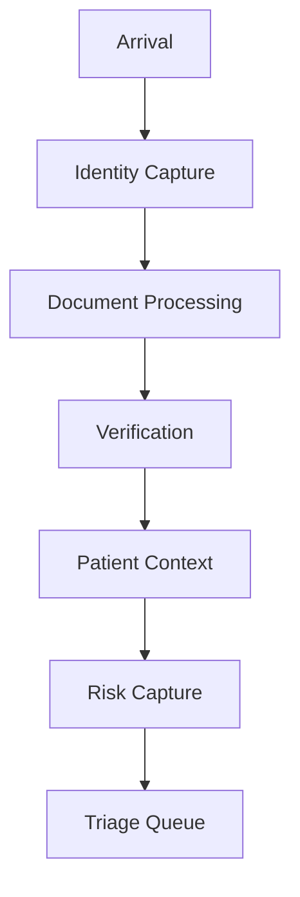

# Patient Flow Door To Triage

## Goal

Optimize the first 15 minutes of the emergency patient journey.

The Door-to-Triage flow should make early intake, verification, context assembly, risk capture, and triage queue readiness measurable and optimizable.

## Stages

## Track

The Door-to-Triage flow should track:

- Processing time
- Bottlenecks
- Completion rates

## Measurement Model

Each stage should record:

- Start timestamp.
- Completion timestamp.
- Current status.
- Responsible workflow or user role when available.
- Missing information or blockers.
- Source system or intake mode when available.

Processing time should be measured per stage and across the full Door-to-Triage flow. Bottlenecks should identify delayed, stalled, or repeatedly incomplete stages. Completion rates should show how consistently patients move through the first 15 minutes with required information available.

## Operational Signals

The flow should surface:

- Patients delayed before identity capture.
- Patients stalled in document processing.
- Patients waiting on verification.
- Patients missing patient context.
- Patients missing critical risk capture.
- Patients ready for the triage queue.
- Average and median time from arrival to triage-ready state.

## Optimization Boundary

The Door-to-Triage flow is an operational measurement and optimization layer. It does not diagnose, assign acuity, determine clinical priority, or replace triage assessment.

The goal is to make early workflow friction visible so staff can reduce registration and intake delays before triage.

## Acceptance

Patient Flow Door To Triage is ready when:

- Arrival, Identity Capture, Document Processing, Verification, Patient Context, Risk Capture, and Triage Queue are modeled as measurable stages.
- Processing time, bottlenecks, and completion rates are tracked.
- Staff can see where the first 15 minutes are delayed or incomplete.
- Door-to-Triage becomes measurable and optimizable.
