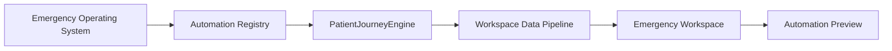

# Patient Journey Engine Report

## Goal

Create the Patient Journey Engine as the backbone of the Emergency Workspace. The engine makes the ED patient journey canonical, keeps automations attached to one or more journey states, and exposes state transitions, metrics, bottlenecks, and recommendations through the workspace data pipeline.

## Canonical Patient States

The Emergency Workspace uses this ordered journey:

1. Arrival
2. Registration
3. Triage
4. Waiting
5. Assessment
6. Orders
7. Results
8. Reassessment
9. Disposition
10. Admission
11. Discharge
12. Follow-up

These states replace fragmented labels such as `clinical-assessment` and `discharge-admission` with explicit operational checkpoints.

## Engine Contract

`PatientJourneyEngine` provides five primary functions:

- `transitionPatientState()` validates and records movement from one journey state to another.
- `getPatientJourney()` returns the canonical ordered journey with per-state automation coverage and optional patient progress.
- `getJourneyBottlenecks()` identifies states with excess wait time, backlog, stale activity, or high-risk pressure.
- `getJourneyMetrics()` summarizes throughput, automation coverage, active patient counts, and bottleneck load.
- `getJourneyRecommendations()` converts bottleneck and coverage signals into reviewable workflow recommendations.

The engine is intentionally deterministic and frontend-safe. It does not place orders, change acuity, write clinical documentation, submit referrals, or control devices. It prepares review context for clinicians and operations users.

## Automation Attachment Rule

Every Emergency Workspace automation must declare at least one valid `journeyStages` entry from the canonical state list. The automation registry preserves this metadata as `patientJourneyStates` and `requiredWorkflows` so existing UI surfaces continue to work while the Patient Journey Engine becomes the canonical source of journey context.

## Emergency Workspace Integration

The engine plugs into the existing Emergency Workspace flow:

Expected payload additions:

- `pipelineData.emergency.patientJourney`
- `pipelineData.emergency.patientJourneyEngine.metrics`
- `pipelineData.emergency.patientJourneyEngine.bottlenecks`
- `pipelineData.emergency.patientJourneyEngine.recommendations`

## Acceptance Mapping

The acceptance criterion is met when all Emergency Workspace automations are normalized with valid journey states, automation evaluation includes those states, and the Emergency Workspace receives engine-derived journey metrics, bottlenecks, and recommendations from the data pipeline.
