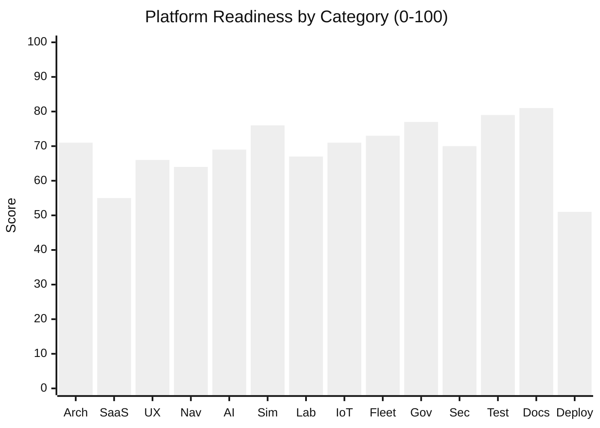

# Platform Readiness Score

**Date:** 2026-06-04  
**Scope:** CareDroid Clinical AI monorepo (Vite SPA + Nest backend + platform-assets/product-catalog modules)  
**Method:** Evidence synthesis from generated audits, implementation reports, live deployment probe, and CI/test inventories. Scores are **0–100** (100 = production-grade for stated category at enterprise SaaS bar).

---

## Overall readiness

| Metric | Value |
|--------|------:|
| **Composite score** | **68 / 100** |
| **Maturity label** | **Demo-ready clinical platform** — strong breadth and test harness; not yet **enterprise production SaaS** |
| **Production frontend** | `https://care-droid-clinical-ai.vercel.app` @ `5fb9670` (aligned with GitHub `main`) |
| **Local vs deployed** | Large uncommitted delta (~63 paths); local `HEAD` may lag `origin/main` |

### Score interpretation

| Range | Meaning |
|-------|---------|
| 85–100 | Production-ready; minor polish only |
| 70–84 | Pilot-ready with named blockers |
| 55–69 | Demo / internal beta — **current band** |
| 40–54 | Prototype — major gaps |
| 0–39 | Not shippable |

---

## Category scores

| # | Category | Score | Status | Primary evidence |
|---|----------|------:|--------|------------------|
| 1 | **Architecture** | **71** | Pilot | `duplicate-system-audit.md`, `orphan-detection-report.md`, modular Nest + Vite |
| 2 | **SaaS Readiness** | **55** | Beta | `saas-compliance-audit.md`, `product-packaging-audit.md` |
| 3 | **UX** | **66** | Beta | `ux-debt-report.md` (88), `ux-simplification-audit.md` |
| 4 | **Navigation** | **64** | Beta | `navigation.config.js`, UX simplification audit |
| 5 | **AI** | **69** | Beta | Chat/orchestrator, agents seed, feature matrix |
| 6 | **Simulation** | **76** | Pilot | `medical-simulation-suite-implementation-report.md` |
| 7 | **Laboratory** | **67** | Beta | Laboratory pack, `/laboratory`, demo data |
| 8 | **IoT** | **71** | Pilot | `hospital-map-iot-implementation-report.md`, IoT pack |
| 9 | **Fleet** | **73** | Pilot | Fleet PR6 tests, operations pack, live-map routes |
| 10 | **Governance** | **77** | Pilot | `platform-governance-execution-report.md`, release gate |
| 11 | **Security** | **70** | Pilot | LLM security module, RBAC, audit — PHI production gaps in roadmap |
| 12 | **Testing** | **79** | Pilot | `validate:ci`, contract/e2e/responsive suites |
| 13 | **Documentation** | **81** | Strong | Large `docs/` corpus + regenerable audits |
| 14 | **Deployment** | **51** | Beta | `deployment-truth-audit.md` — Vercel/API split broken |

**Composite** = unweighted mean of 14 categories (rounded): **68**.

### Category rationale (short)

**Architecture (71)** — Clear canonical layers (`routes.config.js`, `toolInventory.js`, `AppShell`, Nest modules) and contract tests; penalized for dual registry (291 registry tools vs 68 seeded assets), 35 duplicate-system findings, and 391 orphan classifications (many legacy, some wire/quarantine).

**SaaS Readiness (55)** — Seeded catalog is strong (68/68 fully packaged; 9/9 solution packs). Strict charter compliance is **39 / 316** (~12%); **245** registry tools are not productized; `CARE_DROID_SAAS_ARCHITECTURE_CHARTER.md` missing; org/platform APIs largely in uncommitted local work.

**UX (66)** — Automated UX debt **88/100** (layout/shell solid); new-user 5-minute comprehension fails on Tools and Operations (overload, duplicate entry points).

**Navigation (64)** — Single `navigation.config.js` source; penalized for 8 primary items + Solutions + 6 Operations sidebar links + 16 dashboard Quick Actions + Discover/Automation overlap.

**AI (69)** — Assistant, clinical chat, orchestrator registry, 8 agents in seed; `?agent=` routing incomplete; only **3** POST tool executors on backend; many AI surfaces inventory-only.

**Simulation (76)** — Structured taxonomy, scenarios, outcomes, competency routes, pack-gated assets, wiring tests; missing `SimulationLaboratoryViewer.jsx`; training/demo backends not live patient data.

**Laboratory (67)** — `/laboratory` + pack `laboratory-intelligence`; demo/static UI; partial test coverage vs calculators.

**IoT (71)** — Hospital map, device fleet, medical IoT dashboard, telemetry patterns documented; predominantly demo API/static data.

**Fleet (73)** — Command, route optimizer, predictive maintenance, live map, dedicated wiring/responsive tests; local/mock execution lane documented.

**Governance (77)** — Backend modules (AI governance, regulatory, human-review, privacy, observability) and operating procedures; many UI routes open-catalog without asset/pack binding.

**Security (70)** — LLM security evaluate API, 2FA, audit/PHI visibility, compliance export/delete flows; production PHI/FHIR hardening still roadmap P0.

**Testing (79)** — Broad Vitest matrix (alias, catalog, executor, contract, safety, visibility, responsive, fleet); production Playwright smoke exists but optional; 10 features lack dedicated tests per feature matrix.

**Documentation (81)** — Extensive pack, wiring, and audit docs; regenerable pipelines; 1 noted doc gap (Integration Marketplace); some stale deploy docs.

**Deployment (51)** — GitHub ↔ Vercel commit parity **PASS**; hosted `/api` returns SPA HTML; local tree diverged; backend deploy separate (Docker/SSH/Cloud Run).

---

## Readiness radar (visual)



---

## Top 20 gaps (priority order)

| # | Gap | Category | Severity | Evidence / fix |
|---|-----|----------|----------|----------------|
| 1 | **Hosted `/api` serves SPA, not Nest JSON** | Deployment | P0 | `deployment-truth-audit.md` — set `VITE_API_URL` to real API origin |
| 2 | **Dual registry: 245+ tools not in `platform_assets`** | SaaS / Architecture | P0 | `product-packaging-audit.md`, `saas-compliance-audit.md` |
| 3 | **Strict SaaS charter compliance ~12% (39/316)** | SaaS Readiness | P0 | `saas-compliance-audit.md` |
| 4 | **63 uncommitted paths; local ≠ GitHub/Vercel** | Deployment / SaaS | P0 | `deployment-truth-audit.md` — commit, push, redeploy |
| 5 | **Missing `CARE_DROID_SAAS_ARCHITECTURE_CHARTER.md`** | SaaS Readiness | P1 | Referenced in audits but not in repo |
| 6 | **Only 3 backend POST tool executors** | AI / Architecture | P1 | `tool-render-execute-matrix.md`, `backend-exposure-report.md` |
| 7 | **`/assistant?agent=` not honored** | AI | P1 | `feature-coverage-matrix.md`, duplicate audit |
| 8 | **Operations/Tools 5-min comprehension fails** | UX / Navigation | P1 | `ux-simplification-audit.md` |
| 9 | **16 dashboard Quick Actions duplicate sidebar** | UX / Navigation | P1 | `CommandDashboard.jsx` — collapse to 4–6 |
| 10 | **Operations sidebar + hub + dashboard triple map entry** | Navigation | P1 | `navigation.config.js`, `Operations.jsx` |
| 11 | **Discover vs Tools duplicate discovery** | Navigation | P1 | Merge Discover into Tools tab |
| 12 | **Profile settings vs App settings theme split** | UX | P2 | `Profile.jsx`, `Settings.jsx` |
| 13 | **Dual pack marketplace URLs** | SaaS / Navigation | P2 | `/asset-packs` vs `/settings/organization/packs` |
| 14 | **`SimulationLaboratoryViewer.jsx` missing** | Simulation | P2 | `orphan-detection-report.md` |
| 15 | **391 orphan findings (216 wire-class)** | Architecture | P2 | `orphan-detection-report.md` |
| 16 | **35 duplicate-system findings** | Architecture | P2 | `duplicate-system-audit.md` |
| 17 | **`platformAssetsApi` / `productCatalogApi` not in API inventory** | SaaS / Testing | P2 | `orphan-detection-report.md` |
| 18 | **Operational surfaces use demo/static backends** | IoT / Fleet / Lab | P2 | Feature matrix, implementation reports |
| 19 | **10 features without dedicated tests** (agents, marketplace, workflows) | Testing | P2 | `feature-coverage-matrix.md` |
| 20 | **Production PHI / FHIR production blockers remain roadmap** | Security / Governance | P2 | `platform-blind-spots-upgrade-plan.md`, release gate |

---

## Top 20 strengths

| # | Strength | Category | Evidence |
|---|----------|----------|----------|
| 1 | **Regenerable audit pipeline** (feature, SaaS, orphan, duplicate, packaging) | Documentation / Testing | `npm run *:write-docs` scripts |
| 2 | **68/68 seeded assets fully productized** (4 dimensions) | SaaS Readiness | `product-packaging-audit.md` |
| 3 | **9/9 hospital solution packs in seed + product catalog** | SaaS Readiness | `product-packaging-audit.md`, `solution-packs.md` |
| 4 | **Canonical route + navigation config** | Architecture / Navigation | `routes.config.js`, `navigation.config.js` |
| 5 | **Unified AppShell** (sidebar, quick command, no bottom-tab conflict) | UX | `ux-debt-report.md` (88/100) |
| 6 | **Build identity on `/version` + Vercel git SHA injection** | Deployment | `vite.config.js`, `Version.jsx` |
| 7 | **GitHub `main` ↔ Vercel commit parity** (when pushed) | Deployment | `deployment-truth-audit.md` |
| 8 | **Backend HTTP ↔ frontend API inventory** (0 unguarded missing routes) | Architecture / Testing | `backend-exposure-report.md` |
| 9 | **Clinical tool alias + catalog launch tests** | Testing | `test:alias-sync`, `test:catalog-launch` |
| 10 | **Executor + backend–frontend contract matrix** | Testing / AI | `test:contract-matrix`, `test:executor-mapping` |
| 11 | **Medical simulation suite** (taxonomy, scenarios, outcomes) | Simulation | `medical-simulation-suite-implementation-report.md` |
| 12 | **Hospital map + IoT + device fleet implementation** | IoT | `hospital-map-iot-implementation-report.md` |
| 13 | **Fleet command suite + PR6 comprehensive tests** | Fleet | `test:pr6-fleet`, fleet wiring tests |
| 14 | **Enterprise governance modules wired** (AI gov, regulatory, human-review, privacy) | Governance | `platform-governance-execution-report.md` |
| 15 | **Release gate + clinical governance procedures** | Governance | `release-gate-checklist.md`, `clinical-governance-operating-procedure.md` |
| 16 | **LLM security + audit + PHI access patterns** | Security | Governance report, Profile PHI panel |
| 17 | **Responsive + production Playwright smoke harness** | Testing | `test:responsive-regression`, `test:e2e:production` |
| 18 | **Vercel env validation gate** (`validate:vercel-env`) | Deployment | `scripts/validate-vercel-env.mjs` |
| 19 | **SPA fallback safety** (`ToolsAreaFallback`, calculator route defs) | UX / Architecture | `tool-render-execute-matrix.md` |
| 20 | **Large clinical tool catalog (~291 user-facing tools) with NLU + launch resolver** | AI / Architecture | `toolInventory.js`, `registryToolLaunch.js` |

---

## Path to 80+ composite (ordered)

1. **Wire production API** — `VITE_API_URL` + smoke `GET …/api/config/system` returns JSON on Vercel.
2. **Ship uncommitted platform work** — organizations, platform-assets, product-catalog, commercial routes; align local/GitHub/Vercel.
3. **Backfill `platform_assets` from inventory** — target ≥80% strict charter compliance on user-facing surfaces.
4. **UX P0 simplification** — F-01–F-10 from `ux-simplification-audit.md`.
5. **Expand POST executors** — top 10 high-traffic tools beyond SOFA/drug/lab.
6. **Close orphan wire class** — platform APIs in inventory, merge pack routes, quarantine dead pages.
7. **Run `npm run validate:ci` on main** after each release; publish score regeneration date in this doc.

---

## Evidence sources

| Document | Use |
|----------|-----|
| [feature-coverage-matrix.md](./feature-coverage-matrix.md) | Tests, packs, routes per feature |
| [saas-compliance-audit.md](./saas-compliance-audit.md) | Charter rules, compliance counts |
| [product-packaging-audit.md](./product-packaging-audit.md) | Pack/product completeness |
| [orphan-detection-report.md](./orphan-detection-report.md) | Wire/merge/quarantine/legacy |
| [duplicate-system-audit.md](./duplicate-system-audit.md) | Canonical sources |
| [ux-simplification-audit.md](./ux-simplification-audit.md) | New-user UX |
| [ux-debt-report.md](./ux-debt-report.md) | Automated UX score |
| [deployment-truth-audit.md](./deployment-truth-audit.md) | Local/GitHub/Vercel |
| [backend-exposure-report.md](./backend-exposure-report.md) | API wiring |
| [tool-render-execute-matrix.md](./tool-render-execute-matrix.md) | Execution lanes |
| [medical-simulation-suite-implementation-report.md](./medical-simulation-suite-implementation-report.md) | Simulation |
| [hospital-map-iot-implementation-report.md](./hospital-map-iot-implementation-report.md) | IoT |
| [platform-governance-execution-report.md](./platform-governance-execution-report.md) | Governance |

### Regenerate underlying audits

```bash
npm run feature-coverage-matrix:write-docs
npm run saas-compliance-audit:write-docs
npm run orphan-detection:write-docs
npm run duplicate-system-audit:write-docs
npm run product-packaging-audit:write-docs
npm run exposure:write-docs
```

After regenerating, update category scores if metrics shift by **≥5 points** in any category.

---

## Scorecard history

| Date | Composite | Notes |
|------|----------:|-------|
| 2026-06-04 | **68** | Initial scorecard from audit synthesis; deployment API gap is largest drag |
