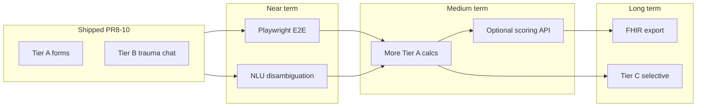

# Future roadmap — Clinical calculator ecosystem (post high-demand release)

**Context:** Follows PR8/9/10 shipment (HEART, hospital/obstetric/hepatic/pancreatic calculators, ABCD², PECARN, NEXUS, and PR8 prevention/ENT peers). Aligns with Tier A (form), Tier B (chat hub), Tier C (orchestrator POST) architecture.

---

## Near term (0–3 months)

### Quality & verification

- Playwright E2E: Tier-A calculate flow, ABCD² stroke-gate visibility, hub → trauma chat STEP 0
- Android device QA matrix: extend `e2e/android-device-qa` coverage for new hub trauma cards
- Intent analytics dashboard: volume and misroute rate per new registry id

### UX polish

- Unified “clinical references” drawer component across PR8 forms
- Print/export summary for inpatient scales (Braden/Morse) — PDF optional
- Persist-last-input (local only, no PHI server) for multi-field forms (FIB-4, Framingham)

### NLU hardening

- Disambiguation rules when “nexus” co-occurs with Canadian C-Spine in same utterance
- Phonetic / typo aliases audit from production logs

---

## Medium term (3–6 months)

### Tier A expansions (high demand backlog)

| Candidate | Rationale | Tier |
|-----------|-----------|------|
| **Wells DVT** (dedicated form) | Already NLU hub; form reduces chat friction | A |
| **PERC** | PE rule-out companion to Wells | B → A optional |
| **CHA₂DS₂-VASc / HAS-BLED** | Anticoagulation shared decision | A |
| **CURB-65** | CAP disposition | A or B |
| **qSOFA** | Sepsis screening | A |
| **Alvarado / Appendicitis scores** | Surgical triage | A |
| **Rockall / Glasgow-Blatchford** | GI bleed risk | A |

### Tier B chat workflows

- **Canadian C-Spine** ↔ **NEXUS** comparison mode in trauma hub (educational; single-tool launch only)
- **PECARN** age calculator helper embedded in chat (months vs years guardrails)
- Obstetric triage: **Modified Bishop** variants if institution requests

### Backend (optional)

- Read-only scoring API for audit trails (no treatment execution)
- Versioned scoring schema in orchestrator for enterprise customers

---

## Long term (6–12 months)

### Tier C executors (selective)

- Only where server-side validation, audit logging, or EHR write-back is required
- Candidates: drug-interaction class tools, not static calculators, unless regulated as SaMD

### Integration

- FHIR `Observation` export for scored results (user-initiated)
- Smart on FHIR launch context for embedded calculators in EHR iframes

### Governance automation

- Literature version tags in registry metadata (`evidenceVersion`, `lastReviewedAt`)
- Automated stale-reference alerts when guideline age exceeds policy threshold

### Internationalization

- Localized disclaimers and crisis pathways (stroke, trauma)
- Unit systems (mmol/L vs mg/dL) with explicit conversion warnings

---

## Explicit non-goals (this roadmap)

- Autonomous imaging orders or medication prescribing from calculator output
- Replacing institutional order sets or nursing bundles
- Real-time population risk models without documented validation
- Hidden / feature-flag-only calculators (violates “no hidden tools” product principle)

---

## Success metrics

| Metric | Target |
|--------|--------|
| Catalog launch success rate | >99% resolve to valid route |
| NLU misroute rate (new ids) | <2% of classified intents at 30d |
| Wiring audit CI | `newClinicalToolsWiringAudit` always green on main |
| Clinical incident reports citing CDS | Zero Sev-1; triage all within 48h |
| Mobile calc usability (SUS sample) | ≥70 on 3 prioritized forms |

---

## Dependency map

---

**Owner:** Clinical product + platform engineering  
**Last updated:** 2026-05-19 (release documentation pass)
