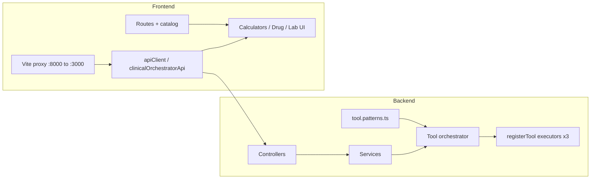

# Production backend ↔ frontend exposure audit

**Audit date:** 2026-05-19  
**Regenerate inventories:** `npm run exposure:write-docs` and `npm run contract:write-docs`  
**Automated gate:** `npm run test:backend-exposure` (48 tests, must pass — includes controller scan + orphan policy)

This document answers the production scan checklist: controllers → services → executors → orchestrator → NLU patterns → frontend clients → proxy → routes → catalog → calculators → chat-assisted tools → loading/error UX.

---

## Executive summary

| Acceptance criterion | Status |
|---------------------|--------|
| No frontend call to nonexistent endpoint (unguarded) | **Pass** — 0 unguarded |
| No false POST executor advertising | **Pass** — drift tests enforce |
| Backend errors show useful UI | **Pass** — executors use `ClinicalExecutorFeedback` |
| Catalog renders when API down | **Pass** — static catalog + error banner |
| Frontend-only tools skip backend execute | **Pass** — `classifyOrchestratorExecution` blocks network |
| Backend-backed tools have documented DTOs | **Pass** — contract matrix |

| Metric | Count |
|--------|------:|
| Backend HTTP routes (inventory) | 92 |
| Frontend API calls (inventory) | 53 |
| Wired to Nest route | 37 |
| Gated stubs (capability `false`) | 16 |
| Unguarded phantom calls | **0** |
| `registerTool()` POST executors | **3** |
| NLU profiles with dedicated UI forms | 50 (frontend-only) + 3 executors |
| Contract matrix gaps | 3 (documented) |

---

## 1. Backend endpoints

**Source:** `src/data/backendHttpRouteInventory.js` (parsed from Nest controllers).

**Controllers represented:** `AppController`, `AuthController`, `BiometricController`, `UsersController`, `TwoFactorController`, `SubscriptionsController`, `ChatController`, `ToolOrchestratorController`, `DrugController`, `ProtocolController`, `AuditController`, `ComplianceController`, `NotificationController`, `AnalyticsController`, `AiController`, `MetricsController`.

**Clinical / tools (high signal):**

| Method | Path | Controller |
|--------|------|------------|
| POST | `/api/chat/message` | ChatController |
| POST | `/api/chat/intent-classify` | ChatController |
| GET | `/api/tools` | ToolOrchestratorController |
| GET | `/api/tools/available` | ToolOrchestratorController |
| POST | `/api/tools/:id/execute` | ToolOrchestratorController |
| POST | `/api/tools/results` | ToolOrchestratorController |
| GET | `/api/compliance/consent` | ComplianceController |
| POST | `/api/compliance/consent` | ComplianceController |

Full list: see [backend-api-inventory.md](./backend-api-inventory.md) or run `listBackendRoutePaths()` from `backendHttpRouteInventory.js`.

**Backend-only (no frontend inventory call today):** e.g. `/api/drugs/*`, `/api/protocols/*`, `/api/chat/message-3d`, `/api/tools/statistics`, `/api/metrics` — platform APIs reserved for future UI or admin.

---

## 2. Backend executors

**Registration:** `backend/src/modules/medical-control-plane/tool-orchestrator/tool-orchestrator.service.ts` → `registerTool()` only.

| NLU tool id | Service | Frontend page |
|-------------|---------|---------------|
| `sofa-calculator` | SofaCalculatorService | `Calculators.jsx` (SOFA form) |
| `drug-interactions` | DrugCheckerService | `DrugChecker.jsx` |
| `lab-interpreter` | LabInterpreterService | `LabInterpreter.jsx` |

**API:** `POST /api/tools/:id/execute` with `ExecuteToolDto` → `ToolExecutionResponseDto`.

**NLU without executor:** 47+ ids in `NLU_TOOL_IDS_WITHOUT_EXECUTOR` (including all PR8 calculators). Intent routing may match patterns; execution returns structured unsupported or chat falls back to general AI — **not** fake executors.

---

## 3. Frontend API calls

**Source:** `src/data/frontendApiCallsInventory.js` (53 entries).

Grouped by capability:

- **Live:** chat, tools list/execute/results, compliance consent, audit, notifications REST, auth, config, analytics crashes
- **Gated off** (`backendApiCapabilities.* = false`): chat persistence sync, share-results, team management, bulk sync, clinical alerts WS, export PDF/Excel, reports, notification stream/send

---

## 4. Frontend ↔ backend matching

| Exposure | Meaning | Count |
|----------|---------|------:|
| `wired` | Route exists in `BACKEND_HTTP_ROUTES` | 37 |
| `gated-stub` | No route; `isBackendCapabilityEnabled` is false | 16 |
| `unguarded-missing` | No route and no gate | **0** |

Matrix: [endpoint-to-frontend-matrix.md](./endpoint-to-frontend-matrix.md)

---

## 5. Registry tools ↔ executors

Only these registry rows map to POST executors (`REGISTRY_ID_TO_ORCHESTRATOR_TOOL`):

- `sofa-score` → `sofa-calculator`
- `drug-check` → `drug-interactions`
- `lab-interp` → `lab-interpreter`

All other calculator registry ids (TIMI, HEART, PR8 batch, etc.) are **client-side** — `backendExecutable: false` in `clinicalIntentTools`.

---

## 6. Backend-only (not in frontend inventory)

Examples: drug CRUD, protocol CRUD, subscription checkout, biometric admin stats, AI structured endpoints, metrics dashboard API. Not bugs — no UI wired yet.

---

## 7. False executor claims

**Scan result:** none. `clinicalIntentTools` with `backendExecutable: true` are:

- Three POST executors above
- `dispatch-ai` — chat/NLU only (documented gap: no POST executor; severity **low**)

`backendExecutable` does **not** imply `registerTool()`; contract tests enforce POST only for the three NLU ids.

---

## 8–9. Loading and API error states

| Surface | Loading | Error / unsupported |
|---------|---------|---------------------|
| Drug Checker | Yes | `ClinicalExecutorFeedback` + message |
| Lab Interpreter | Yes | `ClinicalExecutorFeedback` + message |
| SOFA calculator | Yes | `ClinicalExecutorFeedback` (aligned 2026-05-19) |
| Clinical catalog | N/A (static rows) | Banner if `GET /api/tools` fails |
| Team management | Yes | `UNSUPPORTED_CAPABILITY_MESSAGE` when gated |
| Tool result share | — | Toast when `toolsShareResults` off |
| Offline bulk sync | — | Skips network when `bulkSync` off |
| Client-only calculators | — | No API; local validation only |
| Chat-assisted hub | Chat UX | `POST /api/chat/message` errors in conversation |

---

## 10. Routes that blank on backend failure

| Route | Behavior if backend down |
|-------|--------------------------|
| `/tools/catalog` | **Renders** — static `clinicalIntentTools` + registry; backend table shows fallback list |
| `/tools/calculators/*` (Tier A) | **Renders** — forms are client-side |
| `/tools/drug-checker`, `/tools/lab-interpreter` | **Renders** — form visible; execute shows error panel |
| `/tools/calculators` (SOFA) | **Renders** — error in results panel |
| Chat / dashboard tools | Message failure in chat thread (not blank page) |
| `/tools/team` | Error state when API enabled but fails; unsupported message when gated |

No production registry route depends solely on a missing backend route without a gate.

---

## 11–12. Vite proxy and ports

**Verified in** `vite.config.js` and `readViteDevConfig()`:

| Setting | Value |
|---------|-------|
| Frontend dev port | **8000** |
| Preview port | 4173 (also proxied) |
| Proxy target | `VITE_API_PROXY_TARGET` or **`http://localhost:3000`** |
| Proxied paths | `/api`, `/health`, `/socket.io` (WebSocket) |

Run backend: `npm run backend:dev` (Nest on 3000). Run UI: `npm run dev` (8000 → proxies API).

---

## 13–14. Fallback UI and tests

**Guards:** `src/config/backendApiCapabilities.js` + per-client checks.

**Executor client:** `src/services/clinicalOrchestratorApi.js` — rejects unsupported ids before `fetch`; maps HTTP/network errors to `{ ok: false, message }`.

**Tests:**

- `src/data/backendFrontendExposure.test.js` — zero unguarded routes
- `src/services/clinicalOrchestratorApi.test.js` — success, HTTP error, unsupported, network
- `src/services/clinicalToolsApi.test.js` — list success + capability disabled
- `src/services/complianceApi.test.js` — consent paths
- `src/data/executorMappingAudit.test.js` — registry ↔ NLU ↔ POST
- `src/data/backendFrontendToolContract.test.js` — matrix invariants

---

## 15. Contract report artifacts

| Document | Purpose |
|----------|---------|
| [backend-exposure-report.md](./backend-exposure-report.md) | Scan summary + gated calls |
| [endpoint-to-frontend-matrix.md](./endpoint-to-frontend-matrix.md) | Per-call exposure |
| [backend-frontend-tool-contract.md](./backend-frontend-tool-contract.md) | 17-column tool matrix |
| [backend-api-inventory.md](./backend-api-inventory.md) | Route reference |

**Known contract gaps (intentional / tracked):**

1. **tools-share-results** (high) — UI calls gated; no Nest route
2. **procedures** (medium) — registry page without NLU `tool.patterns` row
3. **dispatch-ai** (low) — `backendExecutable: true` for chat only

---

## Layer audit map



---

## Commands

```bash
npm run test:backend-exposure
npm run exposure:write-docs
npm run contract:write-docs
```
