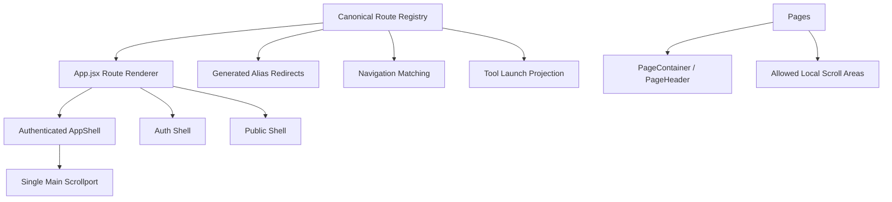

# Route Layout Simplification Plan

**Status:** Planning baseline  
**Date:** 2026-06-05  
**Scope:** Frontend route tree, route aliases, app shell ownership, sidebar/header ownership, scroll containers, auth/public layout boundaries, operations/detail pages, and cleanup sequencing.  
**Goal:** Create one clear route tree and one app shell strategy so routes, navigation, tool launch, layout chrome, and scroll behavior have explicit owners.  
**Non-goal:** This document does not implement route/layout code changes.

## Executive Summary

CareDroid already has the pieces of a coherent route and layout system, but the ownership boundary is split. Stable paths and alias groups live in [`src/config/routes.config.js`](../src/config/routes.config.js), rendering and route wrapping live in [`src/App.jsx`](../src/App.jsx), tool/calculator paths are projected in [`src/routes/clinicalToolRoutes.js`](../src/routes/clinicalToolRoutes.js), and navigation repeats route knowledge in [`src/config/navigation.config.js`](../src/config/navigation.config.js).

The layout model is closer to the target state: [`src/layout/AppShell.jsx`](../src/layout/AppShell.jsx) is the authenticated shell, [`src/layout/AuthShell.jsx`](../src/layout/AuthShell.jsx) and [`src/layout/PublicShell.jsx`](../src/layout/PublicShell.jsx) cover unauthenticated surfaces, and [`src/config/layout.config.js`](../src/config/layout.config.js) already declares a scroll contract. The main cleanup is to stop page-level wrappers from acting like app shells, especially nested `<main>` landmarks, duplicate skip links, and viewport-height local scroll shells under authenticated routes.

Target state:



## Documentation Wave Alignment

Route and layout simplification is the structural foundation for the current redesign wave. The target route tree should support the same product model described in the SaaS, navigation, asset-pack, AI, digital twin, simulation, governance, analytics, and one-product plans.

Shared assumptions:

- `src/config/routes.config.js` should remain the canonical home for stable routes, aliases, route records, and generated redirects.
- `src/config/navigation.config.js` should remain the presentation-level navigation projection while route knowledge is migrated toward generated data.
- `src/layout/AppShell.jsx` should own authenticated chrome, global header utilities, sidebar/drawer state, Quick Command, workspace switcher placement, and the single main scrollport.
- Product plans should not introduce new top-level route families unless they map to Command Center, Assistant, Tools, Operations, Account, or Advanced.
- Direct links for sellable assets remain valid, but route access should resolve through the asset-aware launch and entitlement policy rather than through route existence alone.

## Current Ownership

| Concern | Current source | Target role |
| --- | --- | --- |
| Stable route names | [`src/config/routes.config.js`](../src/config/routes.config.js) | Full route registry and alias source |
| Router mounting | [`src/App.jsx`](../src/App.jsx) | Renderer of canonical route records |
| Authenticated app chrome | [`src/layout/AppShell.jsx`](../src/layout/AppShell.jsx) | Only authenticated app shell |
| Public/auth chrome | [`src/layout/PublicShell.jsx`](../src/layout/PublicShell.jsx), [`src/layout/AuthShell.jsx`](../src/layout/AuthShell.jsx) | Only unauthenticated shells |
| Navigation presentation | [`src/components/Sidebar.jsx`](../src/components/Sidebar.jsx) | Only sidebar/drawer navigation surface |
| Navigation data | [`src/config/navigation.config.js`](../src/config/navigation.config.js) | Generated/derived from route registry where possible |
| Tool/calculator route projection | [`src/routes/clinicalToolRoutes.js`](../src/routes/clinicalToolRoutes.js) | Projection from tool inventory and canonical routes |
| Tool launch paths | [`src/data/clinicalToolIdContract.js`](../src/data/clinicalToolIdContract.js) | Import/project from canonical routes where overlapping |
| Workspace shortcuts | [`src/data/workspaceArchitecture.js`](../src/data/workspaceArchitecture.js) | Import/project from canonical routes |
| Scroll contract | [`src/config/layout.config.js`](../src/config/layout.config.js) | Canonical scroll ownership declaration |

Existing audits already point to the same direction:

- [`docs/duplicate-system-audit.md`](./duplicate-system-audit.md) names routes, layouts, sidebars, navigation, dashboards, workspace configs, and route path overlap as consolidation priorities.
- [`docs/ux-simplification-audit.md`](./ux-simplification-audit.md) identifies Tools, Operations, Profile/Settings, and route naming as new-user comprehension problems.
- [`docs/orphan-detection-report.md`](./orphan-detection-report.md) reports a large route surface and many legacy/wire-class route findings, which should be resolved through a canonical route map rather than one-off fixes.

## Canonical Route Map

Make [`src/config/routes.config.js`](../src/config/routes.config.js) the canonical route registry, not only a path constant file. Each route record should include:

- `id`
- `path`
- `componentKey`
- `layout`: `public`, `auth`, `app`, or `none`
- `auth`: `public`, `publicOnly`, or `required`
- `permission`
- `navGroup`
- `status`: `active`, `alias`, `legacy`, `hidden`, `admin`, or `deprecated`
- `aliases`
- `matchPrefixes`
- `notes`

[`src/App.jsx`](../src/App.jsx) should render these records. It should not invent new path strings except while bootstrapping the migration.

### Route Groups

**Public**

- `/`
- `/privacy`
- `/terms`
- `/help`
- `/version`
- `/gdpr`
- `/hipaa`
- consent/legal public surfaces as explicitly classified

**Auth**

- `/auth`
- `/auth-callback`
- OAuth callback aliases such as `/api/auth/google/callback` only when the SPA intentionally handles them
- auth aliases listed in the alias map below

**App Primary**

- `/dashboard`
- `/assistant`
- `/tools`
- `/operations`
- `/profile`
- `/settings`

**Tools**

- `/tools`
- `/tools/catalog`
- `/tools/calculators`
- `/tools/calculators/:slug`
- `/tools/:area/:toolId`
- `/tools/*`
- domain tool routes that are generated from inventory and resolved by [`src/routes/clinicalToolRoutes.js`](../src/routes/clinicalToolRoutes.js)

**Operations**

- `/operations`
- `/operations-center`
- `/digital-twin`
- `/hospital-map`
- `/medical-iot`
- `/devices`
- `/live-map`
- `/fleet/command`
- `/fleet/map`
- `/fleet/*`

**Commercial And Admin**

- `/products`
- `/products/:slug`
- `/plans`
- `/specialties`
- `/specialties/:slug`
- `/care-pathways`
- `/care-pathways/:slug`
- `/agents`
- `/organization`
- `/settings/organization`
- `/settings/organization/packs`
- `/settings/organization/lifecycle`
- `/configuration-studio`
- `/onboarding`

**Advanced Platform**

- `/audit`
- `/ai-governance`
- `/regulatory`
- `/human-review`
- `/dependency-map`
- `/data-lineage`
- `/self-diagnostics`
- `/feature-flags`
- `/system-health`
- `/security`
- `/assets`

## Alias Redirect Map

Aliases should be generated from one route registry source. Today, aliases are defined in [`src/config/routes.config.js`](../src/config/routes.config.js), repeated as redirect entries in [`src/App.jsx`](../src/App.jsx), and repeated again as `legacyPaths` / `matchPaths` in [`src/config/navigation.config.js`](../src/config/navigation.config.js).

Starting redirect map:

| Alias | Canonical target | Notes |
| --- | --- | --- |
| `/home` | `/dashboard` | Legacy protected home route |
| `/chat` | `/assistant` | Assistant alias |
| `/ai` | `/assistant` | Assistant alias |
| `/copilot` | `/assistant` | Assistant alias |
| `/all-tools` | `/tools` | Tools alias |
| `/clinical-tools` | `/tools` | Tools alias |
| `/catalog` | `/tools` | Tools alias; keep `/tools/catalog` as developer catalog |
| `/calculators` | `/tools/calculators` | Calculator hub alias |
| `/tools/calculator/sofa` | `/tools/calculators/sofa` | Legacy singular calculator path |
| `/tools/calculator/gfr` | `/tools/calculators/gfr` | Legacy singular calculator path |
| `/tools/calculator/bmi` | `/tools/calculators/bmi` | Legacy singular calculator path |
| `/tools/calculator/chads2vasc` | `/tools/calculators/chads2vasc` | Legacy singular calculator path |
| `/medical-simulation` | `/simulation` | Simulation alias |
| `/lab` | `/laboratory` | Laboratory alias |
| `/anatomy-viewer` | `/3d-viewer` | 3D viewer alias |
| `/maps` | `/live-map` | Operations map alias |
| `/tracking` | `/live-map` | Operations map alias |
| `/live-tracking` | `/live-map` | Operations map alias |
| `/fleet` | `/fleet/map` | Fleet map alias |
| `/fleet/live-map` | `/fleet/map` | Fleet map alias |
| `/fleet/tracking` | `/fleet/map` | Fleet map alias |
| `/audit-logs` | `/audit` | Audit alias |

Merge decisions that should become redirects:

- `/asset-packs` -> `/settings/organization/packs`
- One canonical workflow builder route for `/automation` and `/workflows`
- Keep `/operations` as the operations hub; classify `/operations-center` as a named detail page or alias it if the product no longer needs a separate Digital Operations Center.

Alias redirects should preserve search and hash. [`src/App.jsx`](../src/App.jsx) already does this in `LegacyProtectedRouteRedirect`; the generated redirect renderer should keep that behavior.

## Layout Ownership Model

### App Shell

[`src/layout/AppShell.jsx`](../src/layout/AppShell.jsx) owns:

- Authenticated global chrome.
- The only app-level skip link for protected routes.
- The only app-level header.
- Sidebar inset and compact/mobile drawer state.
- Quick Command launcher.
- Workspace switcher placement.
- The only app-level `<main>` landmark.
- Main scrollport.

[`src/App.jsx`](../src/App.jsx) should wrap authenticated records with `AppShellPage` once. Pages should receive content space, not own global chrome.

### Sidebar And Header

[`src/components/Sidebar.jsx`](../src/components/Sidebar.jsx) owns desktop sidebar and mobile drawer navigation. It should consume route/nav data from [`src/config/navigation.config.js`](../src/config/navigation.config.js), which should eventually be generated from the route registry.

The AppShell header owns global utilities: workspace switcher, quick command/search, notifications, profile, settings, and sign out. Page headers should not duplicate those utilities.

### Public And Auth Shells

[`src/layout/PublicShell.jsx`](../src/layout/PublicShell.jsx) and [`src/layout/AuthShell.jsx`](../src/layout/AuthShell.jsx) own unauthenticated surfaces only. They should not be nested inside AppShell routes.

### Page Content

[`src/layout/PageContainer.jsx`](../src/layout/PageContainer.jsx) and [`src/components/ui/PageHeader.jsx`](../src/components/ui/PageHeader.jsx) should own:

- Content width.
- Page spacing.
- Local title and subtitle.
- Breadcrumbs.
- Local page actions.
- Page-local content sections.

Page wrappers should not own:

- App shell chrome.
- Protected-route skip links.
- App-level navigation.
- App-level headers.
- Viewport scroll shells.
- A second app-level `<main>`.

[`src/pages/fleet/FleetPageChrome.jsx`](../src/pages/fleet/FleetPageChrome.jsx) is the clearest cleanup target. It currently owns a skip link and nested `<main>` for protected fleet pages. It should become a content frame that renders a local header, safety banner, and children inside the AppShell main.

## Scroll Ownership Model

Use [`src/config/layout.config.js`](../src/config/layout.config.js) as the source of truth:

```text
viewportOwner: AppShell
primaryScrollContainer: .app-shell-main-content
mainContentRole: MainContent
sidebarScrollContainer: .sidebar-content
localScrollAllowedFor: chat, tables, maps, drawers
normalPagesCreateViewportScrollShells: false
```

Rules:

- `.app-shell-main-content` owns normal vertical page scroll.
- Normal authenticated pages should not set `min-height: 100vh` to create local viewport shells.
- Page roots can own spacing, width, grids, and content sections.
- Local scroll is allowed for chat messages, table wrappers, map canvases, drawers/modals, and long code/pre blocks.
- Sticky table headers are allowed inside table scroll containers.
- Sticky detail panes in operations pages should use shared operations layout utilities, not repeated page-specific CSS.

Cleanup patterns to flag:

- Nested `<main>` under the AppShell `<main>`.
- Protected page CSS with `min-height: 100vh`.
- Repeated `position: sticky; top: 16px` detail panes.
- Repeated map/canvas horizontal scroll wrappers.
- Page-level skip links under authenticated routes.

## Pages Requiring Cleanup

### Route Source Cleanup

- [`src/App.jsx`](../src/App.jsx): convert inline `routes` array into a renderer of route records.
- [`src/config/routes.config.js`](../src/config/routes.config.js): expand from path constants and alias arrays into route records.
- [`src/config/navigation.config.js`](../src/config/navigation.config.js): derive `legacyPaths`, `matchPaths`, and `matchPrefixes` from route records and aliases.
- [`src/data/clinicalToolIdContract.js`](../src/data/clinicalToolIdContract.js): remove overlap between `TOOL_LAUNCH_PATHS` and `CANONICAL_ROUTES`.
- [`src/data/workspaceArchitecture.js`](../src/data/workspaceArchitecture.js): make `WORKSPACE_ROUTE_SHORTCUTS` import/project from canonical routes.

### Shell And Layout Cleanup

- [`src/pages/fleet/FleetPageChrome.jsx`](../src/pages/fleet/FleetPageChrome.jsx): remove protected-route skip link and nested `<main>`.
- Protected pages returning `<main>` under AppShell should migrate to content sections or a page container. Start with operations and platform pages before broad codebase churn.
- [`src/pages/tools/ToolPageLayout.jsx`](../src/pages/tools/ToolPageLayout.jsx): keep as a content template or rename if it behaves like shell chrome.
- [`src/pages/Dashboard.jsx`](../src/pages/Dashboard.jsx): rename to `AssistantPage` in a later code phase to remove the Command Dashboard naming collision.

### Operations And Detail Page Cleanup

These pages repeat operations detail, map, summary, filter, and sticky panel patterns:

- [`src/pages/LiveTrackingMap.jsx`](../src/pages/LiveTrackingMap.jsx) and [`src/pages/LiveTrackingMap.css`](../src/pages/LiveTrackingMap.css)
- [`src/pages/HospitalMapDashboard.jsx`](../src/pages/HospitalMapDashboard.jsx) and [`src/pages/HospitalMapDashboard.css`](../src/pages/HospitalMapDashboard.css)
- [`src/pages/MedicalIotDashboard.jsx`](../src/pages/MedicalIotDashboard.jsx) and [`src/pages/MedicalIotDashboard.css`](../src/pages/MedicalIotDashboard.css)
- [`src/pages/DeviceFleetManagement.jsx`](../src/pages/DeviceFleetManagement.jsx) and [`src/pages/DeviceFleetManagement.css`](../src/pages/DeviceFleetManagement.css)
- [`src/pages/fleet/FleetLiveMap.jsx`](../src/pages/fleet/FleetLiveMap.jsx) and [`src/pages/fleet/FleetLiveMap.css`](../src/pages/fleet/FleetLiveMap.css)

Target shared content utilities:

- `OperationsPageLayout`
- `OpsSummaryGrid`
- `OpsFilterBar`
- `OpsMapCanvas`
- `OpsDetailPane`
- `OpsStatusBadge`

### Viewport Shell Cleanup

Audit and normalize protected pages using local viewport shells:

- Notification preferences.
- Audit logs.
- Team management.
- Consent/legal pages when rendered under AppShell.
- Biometric setup.
- Shared tool session.
- Any protected page using `min-height: 100vh` as local layout shell.

## Phased Cleanup Plan

### Phase 0: Freeze Route And Layout Ownership

- Publish this document as the contract.
- Do not add new route strings outside the route registry.
- Do not add new authenticated page shells.
- Do not add new page-level skip links under AppShell.

Exit criteria:

- New routes require a route record.
- New aliases require a target and redirect behavior.
- New pages identify their layout owner before implementation.

### Phase 1: Canonical Route Registry

- Expand [`src/config/routes.config.js`](../src/config/routes.config.js) into route records.
- Move aliases into route records or generated alias groups.
- Keep existing constants as compatibility projections during migration.
- Add route IDs for all active public, auth, app, tools, operations, commercial, and advanced routes.

Exit criteria:

- Every active App route has a route record or explicit temporary exemption.
- Every alias has exactly one target.
- Route records contain layout/auth metadata.

### Phase 2: App Renderer From Registry

- Make [`src/App.jsx`](../src/App.jsx) map route records to `<Route>` entries.
- Generate alias redirect routes from the same registry.
- Keep `LegacyProtectedRouteRedirect` behavior for search/hash preservation.
- Keep `resolveElement` as the auth/permission/layout wrapper until the renderer is stable.

Exit criteria:

- `App.jsx` stops inventing new path strings.
- Auth/public/app layout selection comes from route metadata.
- Route coverage tests pass.

### Phase 3: Navigation And Tool Launch Derivation

- Derive navigation matching from route records and aliases.
- Replace duplicated `legacyPaths` where they simply mirror aliases.
- Move overlapping `TOOL_LAUNCH_PATHS` values to import/project from `CANONICAL_ROUTES`.
- Keep [`src/routes/clinicalToolRoutes.js`](../src/routes/clinicalToolRoutes.js) as the projection layer for calculator and registry tool paths.

Exit criteria:

- Navigation aliases match route aliases.
- Tool launch paths and canonical routes cannot drift for overlapping paths.
- Registry launch and catalog launch tests pass.

### Phase 4: Layout Ownership Normalization

- Remove protected nested shell behavior from [`src/pages/fleet/FleetPageChrome.jsx`](../src/pages/fleet/FleetPageChrome.jsx).
- Migrate high-traffic protected pages from local `<main>` roots to content containers or explicitly mark them as legacy until converted.
- Standardize page title/action presentation through [`src/layout/PageContainer.jsx`](../src/layout/PageContainer.jsx) and [`src/components/ui/PageHeader.jsx`](../src/components/ui/PageHeader.jsx).

Exit criteria:

- AppShell owns the only protected app skip link.
- AppShell owns the only protected app main landmark.
- Page wrappers are content frames, not shells.

### Phase 5: Scroll And Operations Layout Cleanup

- Create shared operations layout/content utilities.
- Convert Live Map, Hospital Map, Medical IoT, Device Fleet, and Fleet Map to shared operations patterns.
- Remove repeated sticky/detail/map CSS where shared utilities cover the behavior.
- Normalize protected viewport-height pages to use AppShell scroll.

Exit criteria:

- Normal pages do not create viewport scroll shells.
- Local scroll usage is limited to allowed categories.
- Operations detail pages use shared layout primitives.

### Phase 6: Redirect And Removal Pass

- Redirect merged routes such as `/asset-packs` and the losing workflow route.
- Quarantine or delete deprecated route/page files after usage checks.
- Regenerate route, orphan, duplicate, visibility, and scan-battery reports.

Exit criteria:

- Duplicate route surfaces have one canonical URL.
- Legacy aliases are documented and tested.
- Audits no longer report route/layout duplicates that were targeted by this plan.

## Implementation Gates

- **Gate A: Route Registry Coverage** — every App route is in the route registry, alias redirect map, or a documented temporary exemption.
- **Gate B: Alias Determinism** — every alias has exactly one canonical target and preserves search/hash.
- **Gate C: Navigation Traceability** — every navigation `matchPath`/`legacyPath` traces to a route record or alias.
- **Gate D: Layout Ownership** — protected routes are wrapped by AppShell once and do not add app-level skip links or shell headers.
- **Gate E: Scroll Ownership** — normal pages rely on `.app-shell-main-content`; local scroll is limited to allowed cases.
- **Gate F: Operations Consolidation** — map/detail/operations pages share layout primitives instead of repeated sticky/detail CSS.

## Verification

Existing commands to run after implementation phases:

```bash
npm run test:registry-launch
npm run test:catalog-launch
npm run test:visibility-matrix
npm run plans:scan-battery
```

Add future tests:

- Every non-dynamic `App.jsx` route is present in the canonical route registry or alias map.
- Every alias has exactly one target and preserves search/hash.
- `navigation.config.js` aliases are generated from or validated against route aliases.
- Protected pages do not render nested app-level `<main>` landmarks unless explicitly exempt.
- Local viewport scroll shells are limited to documented exceptions.
- Operations page primitives render Live Map, Hospital Map, Medical IoT, Device Fleet, and Fleet Map without duplicate shell chrome.

## Recommended First Implementation Slice

The safest first code slice should be route metadata and tests, not visual refactoring:

1. Add route records in [`src/config/routes.config.js`](../src/config/routes.config.js) while preserving existing exports.
2. Generate the alias redirect list from route records.
3. Add a route coverage test that compares `App.jsx` paths to the route registry.
4. Convert navigation alias matching to reference route aliases.
5. Only then refactor AppShell/page layout, starting with [`src/pages/fleet/FleetPageChrome.jsx`](../src/pages/fleet/FleetPageChrome.jsx).

This sequence reduces drift before changing layout behavior, and it gives the later visual cleanup a reliable route contract to lean on.
