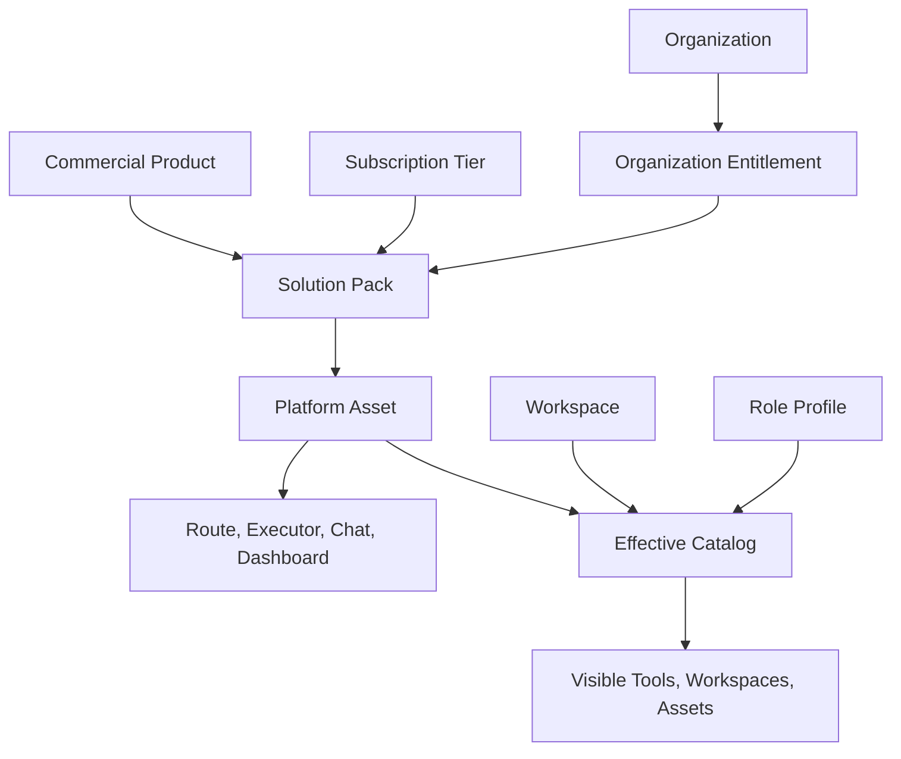

# SaaS Bottleneck Architecture Plan

**Status:** Planning baseline  
**Date:** 2026-06-05  
**Scope:** CareDroid configurable SaaS architecture for organizations, workspaces, roles, platform assets, solution packs, subscription tiers, permissions, feature flags, product packaging, and user profile segmentation.  
**Goal:** Move CareDroid from "many tools visible to everyone" to a configurable SaaS system where hospitals, clinics, EMS, universities, and research organizations receive only the solution packs, workspaces, and assets relevant to them.  
**Non-goal:** This document does not implement code, claim production PHI readiness, or replace the canonical inventory and audit documents.

## Executive Summary

CareDroid already has most of the required SaaS control-plane pieces: organizations, organization memberships, backend workspaces, role profiles, platform assets, asset packs, organization entitlements, products, commercial plans, feature flags, and frontend entitlement filtering.

The bottleneck is split authority. Tool launch and user-facing catalog breadth still come primarily from [`src/data/toolInventory.js`](../src/data/toolInventory.js), while tenant packaging and commercial entitlements live in backend platform assets and product catalog modules. The current seed catalog is clean for the assets it knows about, but the wider registry is not fully productized: [`docs/product-packaging-audit.md`](./product-packaging-audit.md) reports `68` seeded platform assets fully packaged and `245` user-facing registry tools not yet represented as `platform_assets`.

The target architecture should make `PlatformAsset.id` the operational unit for visibility, launch, workspace scope, role targeting, governance, analytics, and packaging. Commercial products and subscription tiers should wrap solution packs. Solution packs should contain platform assets. Platform assets should point to the existing execution layer: routes, executors, dashboards, AI agents, chat-assisted flows, calculators, maps, protocols, simulations, and workflows.



## Documentation Wave Alignment

This plan is the control-plane foundation for the current SaaS redesign documentation wave. The companion deliverables should use the same authority model:

- Navigation reduction and route simplification should treat the effective asset catalog as the filter for visible, locked, hidden, and workspace-promoted surfaces.
- Asset-pack productization should map sellable suites to `Product -> AssetPack -> PlatformAsset`, not to independent route lists.
- AI commercialization should meter and govern AI through asset IDs, agent IDs, model usage records, and audit events tied back to organizations and workspaces.
- Digital Twin, Simulation, Governance, Analytics, and One Product plans should all describe product surfaces as assets that can be packaged, entitled, measured, and governed.

The shared migration constraint remains the `toolInventory.js` to `platform_assets` gap. Until every user-facing route or tool has a canonical `PlatformAsset.id`, all downstream plans should label broad visibility as migration behavior rather than final SaaS behavior.

## Baseline Evidence

This plan intentionally builds on existing repository sources rather than introducing a new product taxonomy.

- [`docs/CARE_DROID_SAAS_ARCHITECTURE_CHARTER.md`](./CARE_DROID_SAAS_ARCHITECTURE_CHARTER.md) defines the canonical rules: everything is an asset, every asset belongs to a pack, every asset can be assigned to a tenant, workspace, and role, and every asset has governance and lifecycle metadata.
- [`docs/caredroid-platform-transformation-roadmap.md`](./caredroid-platform-transformation-roadmap.md) defines the target layer model: CareDroid OS, organization profile, role profile, workspace, asset packs, platform assets, and execution layer.
- [`docs/platform-readiness-score.md`](./platform-readiness-score.md) names the current maturity band as demo/internal beta for enterprise SaaS, with SaaS readiness at `55 / 100` and the dual registry as a P0 blocker.
- [`docs/product-packaging-audit.md`](./product-packaging-audit.md) confirms the seeded pack catalog is internally consistent, while the broader user-facing registry still needs platform asset backfill.
- [`backend/src/modules/platform-assets/entities/platform-asset.entity.ts`](../backend/src/modules/platform-assets/entities/platform-asset.entity.ts), [`asset-pack.entity.ts`](../backend/src/modules/platform-assets/entities/asset-pack.entity.ts), and [`organization-entitlement.entity.ts`](../backend/src/modules/platform-assets/entities/organization-entitlement.entity.ts) provide the operational entitlement model.
- [`backend/src/modules/product-catalog/entities/product.entity.ts`](../backend/src/modules/product-catalog/entities/product.entity.ts) and [`commercial-plan.entity.ts`](../backend/src/modules/product-catalog/entities/commercial-plan.entity.ts) provide the commercial packaging layer.
- [`src/data/assetEntitlements.js`](../src/data/assetEntitlements.js), [`src/data/assetAccess.js`](../src/data/assetAccess.js), and [`src/navigation/registryToolLaunch.js`](../src/navigation/registryToolLaunch.js) provide the frontend visibility and launch gates that should converge around asset access decisions.

## Target Control Plane

The SaaS control plane should answer one question for every signed-in user: which assets are visible, recommended, launchable, locked, hidden, or admin-only in the current organization and workspace?

The answer should come from a single access decision pipeline:

```text
Organization type and entitlements
  intersect workspace enabled assets
  intersect role profile preferences and exclusions
  intersect user profile preferences
  intersect asset permission policy
  intersect asset lifecycle and governance state
  intersect global and workspace permissions
  produces effective catalog and launch policy
```

During migration, some of these layers are compatibility overlays. In strict SaaS mode, each layer should be explicit and auditable. An entitled organization with no packs should not silently receive every active asset.

## Architecture Invariants

- `PlatformAsset.id` is the single operational identity for product packaging, workspace scoping, recommendations, favorites, launch checks, analytics, and audit trails.
- `toolInventory.js` remains the migration input for launch metadata until every user-facing tool has a corresponding `platform_assets` row.
- Products and commercial plans point to pack IDs. They do not maintain independent tool lists.
- Solution packs point to asset IDs. They carry organization type, target role, dependency, lifecycle, sales, default module, and pricing metadata.
- Workspaces narrow the entitled catalog. They do not grant assets outside tenant entitlement except for explicit migration/demo policy.
- Role profiles personalize and narrow the catalog. They do not override tenant entitlements or clinical safety policy.
- Feature flags control rollout behavior, not long-term authorization semantics.
- Deep links remain governed by the same asset access decision as catalog launch, with clear states such as `allowed`, `locked`, `restricted`, `requires-admin`, `demo-only`, and `unsupported`.

## Bottleneck Inventory

**P0: Dual registry authority.** The frontend catalog and launch pipeline are broad and mature, but backend platform assets cover only a subset. Until all user-facing tools are asset-backed, hospitals and clinics cannot receive a precise SaaS package without hidden drift between "what can launch" and "what was sold or installed."

**P0: Entitlement fallback is migration-friendly, not strict SaaS.** [`PlatformAssetsService.resolveEntitledAssetIds`](../backend/src/modules/platform-assets/platform-assets.service.ts) currently adds all active assets when no entitlement set is resolved. That is useful for rollout and rollback, but strict tenant packaging needs an explicit fallback mode and an explicit no-entitlement state.

**P0: Tenant-scoped enforcement is incomplete.** Some organization-scoped platform endpoints accept `organizationId` without consistently proving the requesting user belongs to or administers that organization. Pack install and remove paths check organization admin membership, but read paths such as organization entitlements, organization analytics, and digital twin queries need the same access posture.

**P1: Workspace authority is fragmented.** Backend workspaces exist and expose settings such as `enabledToolIds`, but [`src/contexts/WorkspaceContext.jsx`](../src/contexts/WorkspaceContext.jsx) still maintains localStorage tool-filter workspaces. SaaS packaging needs backend workspaces to be authoritative and local workspace filters to become a compatibility or personalization layer.

**P1: Permissions are currently union-oriented.** [`WorkspacePermissionsService.getEffectivePermissions`](../backend/src/modules/permissions/workspace-permissions.service.ts) unions global role permissions, workspace role permissions, and explicit permissions. SaaS access should narrow through tenant entitlement, workspace scope, role profile, lifecycle, governance, and permission policy.

**P1: Product surfaces can bypass central launch semantics.** The central launch path in [`registryToolLaunch.js`](../src/navigation/registryToolLaunch.js) performs entitlement and workspace checks, but commercial/product pages and direct routes need to consistently use the same asset-aware launch decision or show a clear locked/request-access state.

**P1: Profile segmentation is present but not yet authoritative everywhere.** Role profiles have preferred and hidden assets, default dashboards, default AI agents, and required permissions, but frontend contexts and product surfaces still have places where role profile data is optional or falls back silently.

**P2: Subscription tiers and billing are not yet the entitlement source.** Commercial plans can include products and packs, but billing/subscription reconciliation should be designed as an organization-level entitlement update process, not a separate user-level unlock system.

**P2: Navigation still exposes too much product breadth.** Sidebar, command launcher, tools overview, commercial pages, and dashboard quick actions should all consume the same effective catalog. Otherwise the system can hide a tool in one place while recommending or linking it elsewhere.

## Organization Model

The organization is the tenant boundary. [`Organization`](../backend/src/modules/workspaces/entities/organization.entity.ts) already stores `name`, `slug`, `organizationType`, `country`, `branding`, and `settings`. The target model should treat this as the root for all SaaS configuration.

Recommended tenant types should match the existing roadmap vocabulary:

- `hospital`
- `academic_medical_center`
- `clinic`
- `ems`
- `research_institute`
- `health_system`
- `long_term_care`
- `home_care`
- `telehealth`
- `university`

Organization configuration should own:

- Default solution packs by `organizationType`.
- Organization branding, display name, locale/country, and settings.
- Commercial plan or tier selection.
- Installed pack IDs through `organization_entitlements`.
- Allowed integrations and requested integrations.
- Default workspace templates.
- Organization-level governance defaults and audit policy.

Organization membership should be separate from workspace membership. [`OrganizationMembership`](../backend/src/modules/organizations/entities/organization-membership.entity.ts) already supports `owner`, `admin`, and `member`, with optional `roleProfileId`. This should become the first tenant-scoped permission check for organization APIs.

Onboarding should create the organization, install default packs, create the owner membership, link `UserProfile.organizationId`, select a role profile, and create backend workspaces with `organizationId` populated. The current onboarding path installs packs and links the profile, but workspace creation should be tightened so tenant workspaces are stamped with the organization instead of becoming owner-only personal workspaces.

## Workspace Model

The workspace is the operational scope inside a tenant. It should answer: "Which subset of entitled assets belongs in this user's current operating context?"

[`Workspace`](../backend/src/modules/workspaces/entities/workspace.entity.ts) already supports:

- `type`: `personal`, `hospital`, `emergency`, `fleet`, `research`, `admin`
- `organizationId`
- `parentWorkspaceId`
- `ownerUserId`
- `branding`
- `settings`
- memberships through `workspace_memberships`

[`WorkspacesService`](../backend/src/modules/workspaces/workspaces.service.ts) already defines tool and module presets for workspace types. This is the right home for workspace defaults, but the defaults should use canonical asset IDs or explicit legacy aliases that resolve to asset IDs.

Target workspace rules:

- Backend workspaces are authoritative for SaaS.
- Workspace `settings.enabledToolIds` should be interpreted as enabled asset IDs, with legacy aliases only during migration.
- Personal workspaces are allowed for unlinked users and trials, but organization workspaces should carry `organizationId`.
- A workspace can narrow organization entitlement but cannot expand it in strict SaaS mode.
- Workspace membership controls local collaboration and operational permissions.
- LocalStorage workspaces should be demoted to UI-only filters or migrated into backend workspaces behind `singleWorkspaceModel`.

## Role Model

CareDroid needs four role layers, each with a different purpose.

**Global security role.** Existing `UserRole` and role-permission config protect clinical, PHI, audit, and administrative operations. This is a security layer, not a product packaging layer.

**Organization membership role.** `owner`, `admin`, and `member` control tenant administration: pack install/remove, organization settings, analytics, lifecycle controls, billing, and member management.

**Workspace membership role.** `owner`, `admin`, `clinician`, `nurse`, `dispatcher`, `researcher`, and `viewer` control what a user can do in the current workspace.

**Role profile.** [`RoleProfile`](../backend/src/modules/platform-assets/entities/role-profile.entity.ts) is the product segmentation layer. It should drive preferred assets, hidden assets, default dashboard, default AI agent, specialties, and recommendation order.

Target role decision:

```text
Global role: can this user perform this class of action?
Organization role: can this user administer or view this tenant scope?
Workspace role: can this user operate inside this workspace?
Role profile: which entitled assets are relevant for this persona?
Asset policy: does this asset require a specific permission, review, or admin state?
```

This separation keeps clinicians, EMS fleet operators, students, researchers, and administrators from inheriting irrelevant surfaces simply because they share a global user role.

## Asset Registry

The asset registry is the SaaS productization backbone. [`PlatformAsset`](../backend/src/modules/platform-assets/entities/platform-asset.entity.ts) already includes the key fields needed for this:

- `id`
- `assetType`
- `title`
- `description`
- `category`
- `clinicalSpecialty`
- `route`
- `launchType`
- `permissionPolicy`
- `organizationTypes`
- `roleProfiles`
- `intendedRoles`
- `workspaceTags`
- `specialties`
- `riskLevel`
- `backendStatus`
- `demoStatus`
- `governance`
- `lifecycle`
- `pricingTier`
- `packIds`
- `dependencies`
- `catalogVersion`

The registry should become the authoritative catalog for SaaS decisions. `toolInventory.js` should remain the source for launch metadata during migration, but every user-facing inventory row should eventually generate, validate, or map to one platform asset.

Asset types should remain broad enough for CareDroid's surface area:

- `tool`
- `calculator`
- `protocol`
- `simulation`
- `workflow`
- `dashboard`
- `map`
- `ai_agent`
- `plugin`
- `integration`
- `commercial`

Asset lifecycle should control catalog and launch behavior:

- `draft`: visible only to platform or organization admins.
- `active`: eligible for tenant entitlement and normal launch.
- `deprecated`: hidden from discovery and shown with a deprecation warning on deep link.
- `admin_only`: visible and launchable only to users with the required admin permission.

## Asset Packs

Asset packs are installable tenant bundles. [`AssetPack`](../backend/src/modules/platform-assets/entities/asset-pack.entity.ts) already stores `organizationTypes`, `targetRoles`, `assetIds`, `requiredDependencies`, `salesMetadata`, `defaultModules`, `pricingTier`, and `isPublished`.

The target pack model:

- Pack IDs are stable.
- Packs contain asset IDs, not routes or local tool definitions.
- Packs can be recommended by organization type and role profile.
- Packs can depend on other packs or assets.
- Packs can power both marketplace display and actual organization entitlements.
- Packs can be installed, disabled, audited, and rolled back per organization.

Current seeded packs should remain the starting catalog:

- `core-platform`
- `emergency-department-pack`
- `icu-pack`
- `cardiology-pack`
- `laboratory-intelligence`
- `medical-iot-pack`
- `digital-twin-pack`
- `simulation-training-pack`
- `governance-compliance-pack`
- `research-education`
- supporting packs such as `hospital-operations`, `fleet-logistics`, and `ai-workflow-pack`

Overlapping pack definitions should be consolidated or explicitly aliased before scaling the pack catalog. For example, emergency department and emergency medicine packaging should have one canonical sellable pack and one compatibility alias if both terms must survive.

## Subscription Tiers

Subscription tiers should decide which products and packs an organization may install. They should not directly decide which routes appear in the UI.

[`CommercialPlan`](../backend/src/modules/product-catalog/entities/commercial-plan.entity.ts) already includes `includedProductIds`, `includedPackIds`, `maxPackIds`, `pricingTier`, and metadata. [`Product`](../backend/src/modules/product-catalog/entities/product.entity.ts) already maps products to pack IDs and highlight asset IDs.

Target tier model:

- **Core:** authentication, assistant, dashboard, search, core calculators, core protocols, profile, audit basics, and platform settings.
- **Standard:** clinical specialty packs, documentation assistance, laboratory basics, and education workflows.
- **Enterprise:** hospital operations, medical IoT, digital twin, fleet/logistics, governance, analytics, and advanced administrative workflows.
- **Add-ons:** named AI agents, interoperability connectors, advanced analytics, research modules, simulation modules, and premium automation.

Subscription state should reconcile into organization entitlements:

```text
Commercial plan -> products -> pack IDs -> organization_entitlements -> entitled asset IDs
```

If billing later uses Stripe or another provider, the billing event should update organization entitlements. The UI should still read effective access from platform context, not directly from billing objects.

## Permissions

CareDroid should converge on one asset access decision service used by backend APIs, frontend catalog projection, recommendations, and launch checks.

Recommended decision inputs:

- User ID and global role.
- Organization ID and organization membership role.
- Workspace ID and workspace membership role.
- Organization entitled pack IDs.
- Workspace enabled asset IDs.
- Role profile preferred and hidden asset IDs.
- User preferences such as pinned and hidden assets.
- Asset lifecycle, governance metadata, risk level, and permission policy.
- Feature flag state for migration behavior.

Recommended access states:

- `allowed`: visible and launchable.
- `hidden`: intentionally suppressed by profile or user preference.
- `locked`: visible as a pack or tier upsell, not launchable.
- `restricted`: launchable only with a warning or special condition.
- `requires-admin`: visible only to appropriate admins.
- `requires-review`: available only through human-review workflow.
- `unsupported`: not launchable because backend/executor support is missing.
- `demo-only`: launchable as a demo/local/static workflow with clear labeling.

Strict SaaS access should be narrower than current compatibility behavior:

```text
allowed =
  asset is active or permitted lifecycle state
  and organization is entitled to a pack containing the asset
  and current workspace includes the asset or has no narrowing policy
  and role profile does not hide the asset
  and asset permissionPolicy is satisfied
  and global/workspace permissions allow the action
```

The backend should enforce organization membership for all organization-scoped reads and writes. The frontend should consume the same effective access projection so catalog, sidebar, command launcher, commercial pages, dashboards, and direct launch all agree.

## Feature Flags

Feature flags should make migration safe without becoming the long-term source of product truth.

Current flags to preserve and clarify:

- `platformEntitlements`: enables catalog filtering and access projection from platform context.
- `singleWorkspaceModel`: moves the UI from local workspace filters toward backend workspace state.
- `commercialSurfaces`: controls visibility of product, pack, specialty, pathway, and marketplace routes.

Recommended rollout flags:

- `strictSaasEntitlements`: disables "all active assets" fallback for organizations and requires explicit pack entitlement.
- `assetBackfillWarnings`: surfaces admin warnings for inventory tools without platform assets.
- `assetAwareNavigation`: routes all launch surfaces through the asset access decision.
- `orgScopedPlatformReads`: requires membership checks for all organization-scoped read APIs.
- `packMarketplaceRequests`: allows locked pack request/access flows before full billing automation.

Migration flags should have owners, default environments, rollout criteria, and rollback behavior. Once strict SaaS mode is stable, entitlement semantics should be regular application behavior rather than feature-flag-only policy.

## Product Packaging

The product packaging hierarchy should be:

```text
Commercial plan
  contains products and/or packs
Product
  contains one or more solution packs
Solution pack
  contains platform assets
Platform asset
  contains launch metadata, policy, lifecycle, governance, and dependencies
Execution layer
  route, backend executor, chat seed, dashboard, map, workflow, simulation, or integration
```

This keeps sales packaging separate from execution details. A hospital operations suite can highlight several assets, but the entitlement should still resolve through pack IDs and asset IDs.

Backfill sequence for the unproductized registry tools:

1. Generate an inventory report from `toolInventory.js` with IDs, titles, categories, routes, launch types, executor status, lifecycle, specialties, workspace tags, and role segmentation.
2. Create or validate matching `platform_assets` rows for every user-facing inventory row.
3. Assign each asset to at least one solution pack and specialty grouping.
4. Assign role profile recommendations and hidden defaults where appropriate.
5. Assign organization types through pack membership.
6. Add governance metadata, backend/demo status, and lifecycle state.
7. Fail the packaging audit when a user-facing asset has no pack, no org route, or no governance metadata.
8. Move UI projections from inventory-only filtering to asset-aware filtering.

Product pages should show:

- Included packs.
- Highlight assets.
- Required dependencies.
- Target organization types.
- Target roles.
- Demo versus backend-backed status.
- Governance or human-review requirements.
- Request/install state for the current organization.

## User Profile Segmentation

User profile segmentation should personalize the SaaS system without replacing tenant entitlement.

Segmentation inputs:

- Global role, such as physician, nurse, student, admin, researcher, or operator.
- Organization membership role.
- Workspace membership role.
- Role profile ID.
- Clinical specialty or operational department.
- User preferences: pinned assets, hidden assets, recent tools, favorite tools.
- Active workspace.
- Organization type and installed packs.

Role profiles should drive:

- Default dashboard.
- Default AI agent.
- Preferred asset recommendations.
- Hidden asset defaults.
- Specialty filters.
- Pack recommendations.
- Onboarding defaults.
- Workspace templates.

Examples:

- A hospital emergency physician in an emergency workspace should see emergency medicine, resuscitation, protocols, calculators, hospital map, and relevant AI agents before research or fleet-only tools.
- An EMS fleet operator should see dispatch, live map, route optimization, predictive maintenance, and incident command assets before ICU calculators.
- A university medical student should see simulation, education agents, competencies, protocols, core calculators, and research evidence assets, without hospital operations administration.
- A research organization should see research evidence, guideline RAG, explainability, audit, simulation, and de-identified analytics, not hospital bed operations by default.

## Phased Remediation Roadmap

### Phase 0: Freeze Vocabulary And Baseline

Purpose: prevent new drift while the migration is designed.

- Declare `PlatformAsset.id` the canonical operational ID in this plan, the SaaS charter, and future implementation tickets.
- Re-run or refresh packaging, SaaS compliance, duplicate system, orphan detection, exposure, and feature coverage audits before implementation begins.
- Freeze new standalone tool surfaces unless they include asset, pack, role, workspace, lifecycle, and governance metadata.
- Define strict versus migration entitlement behavior.
- Decide whether emergency medicine overlapping packs should merge or alias.

Exit criteria:

- Current asset and registry counts are known.
- All new product work has an asset and pack checklist.
- Strict SaaS mode behavior is documented.

### Phase 1: Backfill User-Facing Tools Into Platform Assets

Purpose: eliminate the largest bottleneck: launchable tools without SaaS packaging.

- Generate platform asset candidates from `toolInventory.js`.
- Add missing asset rows for user-facing registry tools.
- Fill core metadata: route, launch type, category, lifecycle, backend/demo status, specialties, workspace tags, and governance.
- Assign each asset to at least one pack.
- Assign assets to role profiles and organization type coverage through packs.
- Add audit checks that fail on user-facing inventory rows without asset coverage.

Exit criteria:

- At least `80%` strict SaaS compliance for user-facing tools.
- No newly added user-facing tool lacks an asset ID and pack ID.
- Seeded platform assets and inventory projections agree on IDs and launch metadata.

### Phase 2: Make Organization And Workspace Context Authoritative

Purpose: ensure tenant and workspace scope come from backend state.

- Ensure onboarding-created workspaces carry `organizationId`.
- Make `/api/platform/context` the primary source for organization, membership, role profile, workspace state, entitlements, entitled packs, entitled assets, and entitled agents.
- Move localStorage workspace filters behind compatibility behavior.
- Resolve legacy `enabledToolIds` through canonical asset aliases.
- Add tenant membership checks for organization-scoped read APIs.

Exit criteria:

- New organizations have default packs, owner membership, role profile selection, and organization-linked workspaces.
- Workspace switching and enabled assets are server-backed.
- Organization-scoped platform reads require membership.

### Phase 3: Consolidate Access Decisions And Launch Gates

Purpose: make every UI surface agree on what the user can see and launch.

- Create one effective asset access projection used by sidebar, command launcher, tools overview, recommendations, dashboards, commercial pages, and direct launch.
- Replace global-only UI gates for product visibility with asset-aware gates.
- Route product and pack launch actions through `applyRegistryToolLaunch` or an asset-aware successor.
- Add locked, request-access, admin-only, restricted, demo-only, and unsupported states to product surfaces.
- Split migration fallback from strict SaaS fallback under explicit feature flags.

Exit criteria:

- A denied asset has the same state in catalog, sidebar, command launcher, and direct launch.
- Locked assets are requestable or explainable, not silently missing.
- Strict SaaS mode does not grant all active assets to entitled organizations with no packs.

### Phase 4: Align Products, Tiers, Marketplace, And Onboarding

Purpose: make commercial packaging and tenant configuration operational.

- Keep products as wrappers around pack IDs.
- Keep commercial plans as bundles of products and packs.
- Use organization type and maturity assessment to recommend default products and packs.
- Expose pack install/remove/request flows only to organization admins.
- Reconcile subscription or billing state into organization entitlements.
- Show product pages from backend pack and asset metadata, not hard-coded route lists.

Exit criteria:

- Product page contents can be explained from products, packs, and assets.
- Installing or removing a pack changes the effective catalog for the organization.
- Subscription tier changes reconcile to pack entitlement changes.

### Phase 5: Harden Tenant Isolation, Audit, And Operations

Purpose: move from configurable beta to enterprise SaaS readiness.

- Audit all organization-scoped APIs for membership checks.
- Add audit events for pack install/remove, role profile changes, workspace tool changes, locked asset access attempts, and lifecycle changes.
- Add analytics by organization, pack, asset, role profile, and workspace.
- Add observability for entitlement resolution failures and fallback usage.
- Add tests for strict SaaS access decisions and tenant isolation.
- Document rollback behavior for each rollout flag.

Exit criteria:

- Tenant isolation is tested across organization APIs.
- Entitlement changes are auditable.
- Access decision telemetry can explain why an asset was visible, locked, hidden, or denied.

## Success Metrics

- `100%` of user-facing inventory tools have platform asset coverage or an explicit non-user-facing exemption.
- `100%` of active platform assets belong to at least one published or intentionally internal pack.
- `100%` of published packs list supported organization types and target roles or explicitly declare themselves universal.
- `100%` of organization-scoped platform APIs enforce membership or admin membership as appropriate.
- Sidebar, tools overview, command launcher, product pages, recommendations, and direct launch agree on access state for sampled assets.
- Strict SaaS mode can provision a hospital, clinic, EMS agency, university, and research organization with different default packs without code changes.
- Organization admins can install/remove packs and see the effective catalog change.
- No tenant with zero explicit entitlements receives all active assets in strict SaaS mode.

## Phase Gates

**Gate A: Inventory parity.** Every user-facing inventory row maps to a platform asset or documented exemption.

**Gate B: Pack completeness.** Every active asset has at least one pack, lifecycle, governance metadata, and organization-type path.

**Gate C: Context authority.** Platform context includes organization, membership, role profile, workspace, packs, assets, and agents from backend state.

**Gate D: Access consistency.** Catalog, navigation, recommendations, and launch use the same access decision result.

**Gate E: Tenant isolation.** Organization-scoped APIs prove membership before returning tenant data.

**Gate F: Commercial coherence.** Products and subscription tiers resolve to packs, packs resolve to assets, and assets resolve to launch/execution metadata.

## Audit Traceability

Use the existing audit pipeline as the source of truth for migration measurement.

```bash
npm run feature-coverage-matrix:write-docs
npm run saas-compliance-audit:write-docs
npm run orphan-detection:write-docs
npm run duplicate-system-audit:write-docs
npm run product-packaging-audit:write-docs
npm run exposure:write-docs
```

Primary documents to update or compare after each implementation phase:

- [`docs/CARE_DROID_SAAS_ARCHITECTURE_CHARTER.md`](./CARE_DROID_SAAS_ARCHITECTURE_CHARTER.md)
- [`docs/caredroid-platform-transformation-roadmap.md`](./caredroid-platform-transformation-roadmap.md)
- [`docs/product-packaging-audit.md`](./product-packaging-audit.md)
- [`docs/saas-compliance-audit.md`](./saas-compliance-audit.md)
- [`docs/platform-readiness-score.md`](./platform-readiness-score.md)
- [`docs/feature-coverage-matrix.md`](./feature-coverage-matrix.md)
- [`docs/orphan-detection-report.md`](./orphan-detection-report.md)
- [`docs/duplicate-system-audit.md`](./duplicate-system-audit.md)
- [`docs/backend-exposure-report.md`](./backend-exposure-report.md)
- [`docs/tool-render-execute-matrix.md`](./tool-render-execute-matrix.md)

## Open Decisions Before Implementation

- Should strict SaaS mode hide locked assets entirely, or show them with request-access messaging for admins and buyers?
- Which pack is canonical where current emergency medicine and emergency department packaging overlap?
- Should workspace `enabledToolIds` be renamed to `enabledAssetIds`, or kept with compatibility aliases until a migration is complete?
- Which role profile taxonomy is final for launch: clinical profession, operational persona, specialty, or a combination?
- Should billing subscription state live in the product catalog module, a dedicated organization billing module, or an external billing integration layer?
- Which organization-scoped reads are safe for members versus admins only?
- What is the minimum governance metadata required before a newly backfilled asset can be marked `active`?

## Recommended Implementation Order

Start with asset identity and pack coverage, then make backend context authoritative, then enforce access consistently. Do not start by adding more commercial surfaces. More product pages will amplify the bottleneck unless they consume the same asset and entitlement model.

The safe order is:

1. Backfill and validate assets from the canonical inventory.
2. Normalize packs and product mappings around asset IDs.
3. Tighten organization and workspace context.
4. Centralize access decisions and launch gates.
5. Wire commercial plans and subscription reconciliation into entitlements.
6. Harden tenant isolation, audit, and observability.

This path lets CareDroid keep its broad clinical catalog while turning breadth into configurable SaaS packaging instead of visible clutter.
